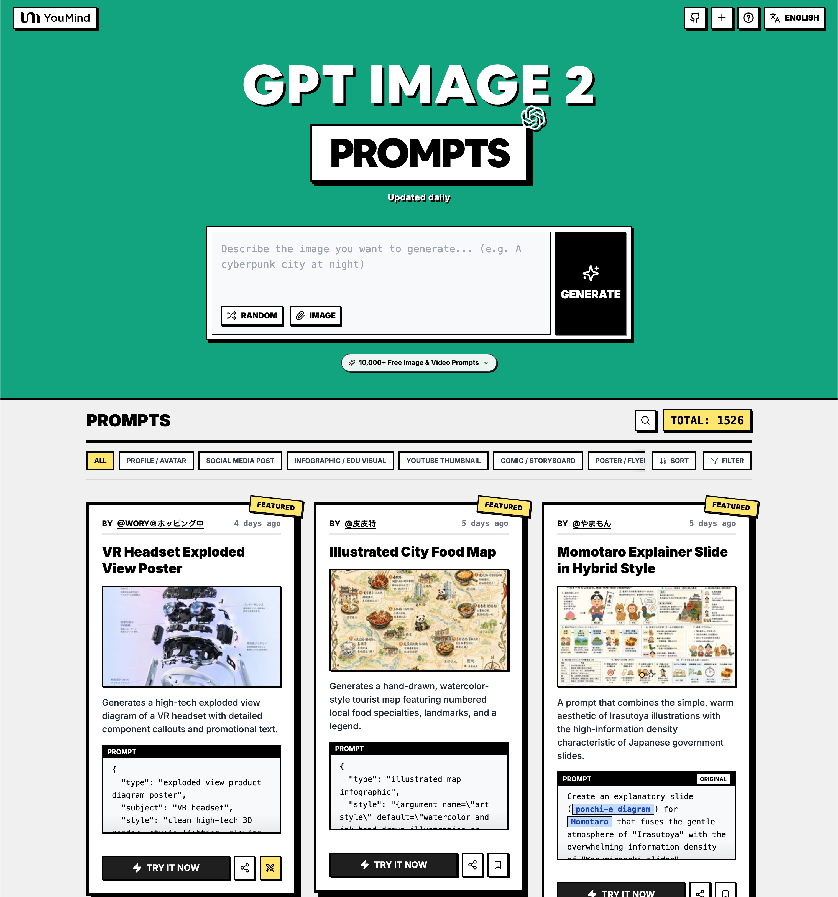

<a href="https://youmind.com/de-DE/gpt-image-2-prompts">
  
</a>

> 💡 🎬 Take it further with **Seedance 2** — pair GPT Image 2 stills with Seedance for jaw-dropping AI videos, 2000+ prompts to explore 👉 [awesome-seedance-2-prompts](https://github.com/YouMind-OpenLab/awesome-seedance-2-prompts)
# 🚀 Tolle GPT Image 2 Prompts

[](https://github.com/sindresorhus/awesome)
[](https://github.com/YouMind-OpenLab/awesome-gpt-image-2)
[](https://creativecommons.org/licenses/by/4.0/)
[](https://github.com/YouMind-OpenLab/awesome-gpt-image-2/actions)
[](docs/CONTRIBUTING.md)

> 🎨 Eine kuratierte Sammlung kreativer Prompts für OpenAI's GPT Image 2

> ⚠️ **Urheberrechtshinweis**: Alle Prompts werden zu Bildungszwecken aus der Community gesammelt. Wenn Sie glauben, dass Inhalte Ihre Rechte verletzen, öffnen Sie bitte ein [Issue](https://github.com/YouMind-OpenLab/awesome-gpt-image-2/issues/new?template=bug-report.yml) und wir werden es umgehend entfernen.

---

[](README.md) [](README_zh.md) [](README_zh-TW.md) [](README_ja-JP.md) [](README_ko-KR.md) [](README_th-TH.md) [](README_vi-VN.md) [](README_hi-IN.md) [](README_es-ES.md) [-Click%20to%20View-lightgrey)](README_es-419.md) [](README_de-DE.md) [](README_fr-FR.md) [](README_it-IT.md) [-Click%20to%20View-lightgrey)](README_pt-BR.md) [](README_pt-PT.md) [](README_tr-TR.md)

---

## 🌐 In Web-Galerie ansehen

<div align="center">

[](https://youmind.com/de-DE/gpt-image-2-prompts)

</div>

**[👉 Auf YouMind GPT Image 2 Prompt-Galerie stöbern](https://youmind.com/de-DE/gpt-image-2-prompts)**

Warum unsere Galerie nutzen?

| Feature | GitHub README | youmind.com Galerie |
|---------|--------------|---------------------|
| 🎨 Visuelles Layout | Lineare Liste | Schönes Masonry-Grid |
| 🔍 Suche | Nur Ctrl+F | Volltextsuche mit Filtern |
| 🤖 KI Ein-Klick-Generierung | - | KI Ein-Klick-Generierung |
| 📱 Mobil | Basis | Vollständig responsiv |
| 🏷️ Kategorien | - | Kategorie-Browsing |


### 🏷️ Nach Kategorie durchsuchen

- **Anwendungsfälle**
  - [Profil / Avatar](https://youmind.com/de-DE/gpt-image-2-prompts?categories=profile-avatar)
  - [Social-Media-Beitrag](https://youmind.com/de-DE/gpt-image-2-prompts?categories=social-media-post)
  - [Infografik / Edu Visual](https://youmind.com/de-DE/gpt-image-2-prompts?categories=infographic-edu-visual)
  - [YouTube-Miniaturbild](https://youmind.com/de-DE/gpt-image-2-prompts?categories=youtube-thumbnail)
  - [Comic / Storyboard](https://youmind.com/de-DE/gpt-image-2-prompts?categories=comic-storyboard)
  - [Produktmarketing](https://youmind.com/de-DE/gpt-image-2-prompts?categories=product-marketing)
  - [E-Commerce-Hauptbild](https://youmind.com/de-DE/gpt-image-2-prompts?categories=ecommerce-main-image)
  - [Spiel-Asset](https://youmind.com/de-DE/gpt-image-2-prompts?categories=game-asset)
  - [Plakat / Flyer](https://youmind.com/de-DE/gpt-image-2-prompts?categories=poster-flyer)
  - [App- / Webdesign](https://youmind.com/de-DE/gpt-image-2-prompts?categories=app-web-design)
- **Stil**
  - [Fotografie](https://youmind.com/de-DE/gpt-image-2-prompts?categories=photography)
  - [Kinematisch / Filmstill](https://youmind.com/de-DE/gpt-image-2-prompts?categories=cinematic-film-still)
  - [Anime / Manga](https://youmind.com/de-DE/gpt-image-2-prompts?categories=anime-manga)
  - [Illustration](https://youmind.com/de-DE/gpt-image-2-prompts?categories=illustration)
  - [Skizze / Strichzeichnung](https://youmind.com/de-DE/gpt-image-2-prompts?categories=sketch-line-art)
  - [Comic / Graphic Novel](https://youmind.com/de-DE/gpt-image-2-prompts?categories=comic-graphic-novel)
  - [3D-Rendering](https://youmind.com/de-DE/gpt-image-2-prompts?categories=3d-render)
  - [Chibi / Q-Style](https://youmind.com/de-DE/gpt-image-2-prompts?categories=chibi-q-style)
  - [Isometrisch](https://youmind.com/de-DE/gpt-image-2-prompts?categories=isometric)
  - [Pixel-Art](https://youmind.com/de-DE/gpt-image-2-prompts?categories=pixel-art)
  - [Ölgemälde](https://youmind.com/de-DE/gpt-image-2-prompts?categories=oil-painting)
  - [Aquarell](https://youmind.com/de-DE/gpt-image-2-prompts?categories=watercolor)
  - [Tinte / Chinesischer Stil](https://youmind.com/de-DE/gpt-image-2-prompts?categories=ink-chinese-style)
  - [Retro / Vintage](https://youmind.com/de-DE/gpt-image-2-prompts?categories=retro-vintage)
  - [Cyberpunk / Sci-Fi](https://youmind.com/de-DE/gpt-image-2-prompts?categories=cyberpunk-sci-fi)
  - [Minimalismus](https://youmind.com/de-DE/gpt-image-2-prompts?categories=minimalism)
- **Hauptinhalt**
  - [Porträt / Selfie](https://youmind.com/de-DE/gpt-image-2-prompts?categories=portrait-selfie)
  - [Influencer / Model](https://youmind.com/de-DE/gpt-image-2-prompts?categories=influencer-model)
  - [Charakter](https://youmind.com/de-DE/gpt-image-2-prompts?categories=character)
  - [Gruppe / Paar](https://youmind.com/de-DE/gpt-image-2-prompts?categories=group-couple)
  - [Produkt](https://youmind.com/de-DE/gpt-image-2-prompts?categories=product)
  - [Essen / Trinken](https://youmind.com/de-DE/gpt-image-2-prompts?categories=food-drink)
  - [Modeartikel](https://youmind.com/de-DE/gpt-image-2-prompts?categories=fashion-item)
  - [Tier / Kreatur](https://youmind.com/de-DE/gpt-image-2-prompts?categories=animal-creature)
  - [Fahrzeug](https://youmind.com/de-DE/gpt-image-2-prompts?categories=vehicle)
  - [Architektur / Interieur](https://youmind.com/de-DE/gpt-image-2-prompts?categories=architecture-interior)
  - [Landschaft / Natur](https://youmind.com/de-DE/gpt-image-2-prompts?categories=landscape-nature)
  - [Stadtbild / Straße](https://youmind.com/de-DE/gpt-image-2-prompts?categories=cityscape-street)
  - [Diagramm / Grafik](https://youmind.com/de-DE/gpt-image-2-prompts?categories=diagram-chart)
  - [Text / Typografie](https://youmind.com/de-DE/gpt-image-2-prompts?categories=text-typography)
  - [Zusammenfassung / Hintergrund](https://youmind.com/de-DE/gpt-image-2-prompts?categories=abstract-background)

---

## 📖 Inhaltsverzeichnis

- [🌐 In Web-Galerie ansehen](#-view-in-web-gallery)
- [🤔 Was ist GPT Image 2?](#-what-is-gpt-image-2)
- [📊 Statistiken](#-statistics)
- [🔥 Ausgewählte Prompts](#-featured-prompts)
- [📋 Alle Prompts](#-all-prompts)
- [🤝 Wie man beiträgt](#-how-to-contribute)
- [📄 Lizenz](#-license)
- [🙏 Danksagung](#-acknowledgements)
- [⭐ Star-Verlauf](#-star-history)

---

## 🤔 Was ist GPT Image 2?

**GPT Image 2** (codename **"duct-tape"**) is OpenAI's next-generation image model. Community testing highlights a leap in these areas:

- 🎯 **Pixel-Perfect Text Rendering** — Native-quality text in Chinese, English, and Japanese, no typos or warped glyphs
- 🎨 **Cross-Image Consistency** — The same character, style, or IP stays identical across a series, down to the pixel
- ⚡ **Commercial-Grade Illustration** — Illustration output is ready to ship without manual polish
- 🌈 **True Art Style Induction** — Creatively evokes the feeling of a style rather than merely approximating references
- 🔧 **Storyboard & Product Series** — Ideal for storyboards, IP characters, and multi-panel product visuals
- 📐 **Multi-Language Design** — Social cards, banners, and posters with accurate multilingual typography in one shot

📚 **Learn More:** See community testing in our [report summary](docs/FAQ.md)

### 🚀 Raycast-Integration

Einige Prompts unterstützen **dynamische Argumente** mit [Raycast Snippets](https://raycast.com/help/snippets)-Syntax. Suchen Sie nach dem 🚀 Raycast Friendly Badge!

**Beispiel:**
```
A quote card with "{argument name="quote" default="Stay hungry, stay foolish"}"
by {argument name="author" default="Steve Jobs"}
```

Bei Verwendung in Raycast können Sie die Argumente dynamisch ersetzen, um schnell zu iterieren!

---

## 📊 Statistiken

<div align="center">

| Metrik | Anzahl |
|--------|-------|
| 📝 Gesamtanzahl Prompts | **17820** |
| ⭐ Ausgewählt | **6** |
| 🔄 Zuletzt aktualisiert | **Samstag, 10. Oktober 2026 um 03:12:23 UTC** |

</div>

---

## 🔥 Ausgewählte Prompts

> ⭐ Von unserem Team handverlesen für außergewöhnliche Qualität und Kreativität

### No. 1: VR-Headset Explosionszeichnung Poster


#### 📖 Beschreibung

Erzeugt ein High-Tech-Explosionsdiagramm eines VR-Headsets mit detaillierten Komponentenbeschriftungen und Werbetext.

#### 📝 Prompt

```
{
  "type": "Produkt-Explosionsdiagramm-Poster",
  "subject": "VR-Headset",
  "style": "sauberes High-Tech-3D-Rendering, Studiobeleuchtung, leuchtende Akzente",
  "background": "{argument name=\"background color\" default=\"sanfter violetter und blauer Verlauf\"}",
  "header": {
    "logo": "∞ {argument name=\"product name\" default=\"Meta Quest 3\"}",
    "subtitle": "{argument name=\"main catchphrase\" default=\"Eine völlig neue Realität, basierend auf einer völlig neuen Struktur.\"}"
  },
  "layout": {
    "centerpiece": "vertikal gestapelte Explosionszeichnung eines VR-Headsets, die 9 verschiedene Schichten interner Komponenten zeigt: Außengehäuse, Kamerasensoren, Hauptplatine mit Chip, Pancake-Linsen, Innenrahmen, Akkupacks, Seitenbänder, Kopfband und Gesichtspolster.",
    "callout_labels": {
      "count": 8,
      "left_side": [
        "Snapdragon® XR2 Gen 2\nÜberragende Rechenleistung für Echtzeit-Erlebnisse.",
        "Einstellbarer IPD-Mechanismus\nKomfortable Passform für eine Vielzahl von Nutzern.",
        "Präzisionsgefertigtes Kopfband\nErgonomie für maximalen Komfort und Stabilität."
      ],
      "right_side": [
        "Frontplatte\nElegantes Design und optimale Gewichtsverteilung.",
        "Tracking-Kameras\nPräzises Positions-Tracking und Umgebungserkennung.",
        "Pancake-Linsen\nFlaches Design für ein weites Sichtfeld und gestochen scharfe Bilder.",
        "Hochleistungsakku\nOptimiertes Stromdesign für lange Laufzeiten.",
        "Weiches Gesichtsinterface\nAngenehmer Tragekomfort auch bei langer Nutzung."
      ]
    },
    "footer": {
      "left_text_block": {
        "headline": "{argument name=\"bottom headline\" default=\"Erlebnisse entwickeln sich durch ihre Struktur.\"}",
        "body": "Jedes einzelne Bauteil vereint modernste Technologie und durchdachtes Design, um ein immersives Erlebnis zu ermöglichen. Die Meta Quest 3 erschafft zukunftsweisende Erlebnisse von innen heraus."
      },
      "right_logo": "∞ Meta"
    }
  }
}
```

#### 🖼️ Generierte Bilder

##### Image 1

<div align="center">

</div>

#### 📌 Details

- **Autor:** [wory＠ホッピング中](https://x.com/wory37303852)
- **Quelle:** [Twitter Post](https://x.com/wory37303852/status/2045925660401795478#reversed-0)
- **Veröffentlicht:** 19. April 2026
- **Sprachen:** en

**[👉 Jetzt ausprobieren →](https://youmind.com/de-DE/gpt-image-2-prompts?id=13460)**

---

### No. 2: Illustrierte kulinarische Stadtkarte


#### 📖 Beschreibung

Erstellt eine handgezeichnete Touristenkarte im Aquarellstil mit nummerierten lokalen Spezialitäten, Sehenswürdigkeiten und einer Legende.

#### 📝 Prompt

```
{
  "type": "illustrierte Infografik-Karte",
  "style": "{argument name=\"art style\" default=\"handgezeichnete Aquarell- und Tuscheillustration auf antikem Pergament\"}",
  "title_section": {
    "text": "{argument name=\"city name\" default=\"Chengdu\"} {argument name=\"map title\" default=\"Kulinarische Entdeckungsreise\"}",
    "mascot": "Cartoon-rote Chilischote mit Sonnenbrille, die einen Daumen hoch zeigt"
  },
  "border": "{argument name=\"border decoration\" default=\"Ranken aus grünen Blättern und roten Chilischoten\"}",
  "layout": {
    "background": "texturiertes beiges Pergamentpapier mit gelben Straßen, blauen Flüssen und grünen Parkanlagen",
    "sections": [
      {
        "title": "Sehenswürdigkeiten",
        "count": 6,
        "illustrations": ["traditioneller Pavillon", "traditionelles Kloster", "moderner Wolkenkratzer mit kletterndem Panda", "hoher Fernsehturm", "traditionelles Tor", "Industriegebäude"],
        "labels": ["Renmin-Park", "Wenshu-Kloster", "IFS", "339-Fernsehturm", "Kuanzhai-Gassen", "Dongjiao-Erinnerungspark"]
      },
      {
        "title": "Kulinarische Hotspots",
        "count": 12,
        "illustrations": ["Mapo-Tofu", "Teigtaschen in Chiliöl", "Spieße im Topf", "Klebreisbällchen", "Eierkuchen", "Neun-Felder-Hotpot", "Süßkartoffel-Nudeln", "kalte Spieße", "scharfes Mischgericht", "Tee in der Schale", "Eisgelee-Dessert", "scharfe Kaninchenköpfe"],
        "labels": ["1 Chen Mapo Tofu", "2 Zhong-Teigtaschen", "3 Chunxi-Straße", "4 Kuanzhai-Gassen · San Da Pao", "5 Jianshe-Straße · Ye Popo Eierkuchen", "6 Yulin-Straße · Xiaolongkan Hotpot", "7 Xiangxiang-Gasse · Schweinedarm-Nudeln", "8 Wuhouci-Straße · Bobo-Huhn", "9 Dongjiao-Erinnerungspark · Maojiao Huola", "10 Renmin-Park · Heming-Teehaus", "11 Jinli-Altstadtstraße · Eisgelee", "12 Shuangliu Mama-Kaninchenkopf"]
      },
      {
        "title": "Legende",
        "position": "unten rechts",
        "count": 5,
        "items": ["roter Punkt", "grünes Haus", "grüner Baum", "blaue Linie", "gelbe Doppellinie"],
        "labels": ["Kulinarische Orte", "Sehenswürdigkeiten", "Parkflächen", "Flüsse und Seen", "Hauptstraßen"]
      }
    ],
    "centerpiece": "Riesenpanda, der sitzt und Bambus isst",
    "bottom_right_extras": ["antike Windrose mit N, S, O, W", "Haftungsausschluss 'Hinweis: Vorsicht beim Scharfessen, schone deinen Magen~' mit einem roten Chilischoten-Symbol"]
  }
}
```

#### 🖼️ Generierte Bilder

##### Image 1

<div align="center">

</div>

#### 📌 Details

- **Autor:** [皮皮特](https://x.com/mm_zzm44854)
- **Quelle:** [Twitter Post](https://x.com/mm_zzm44854/status/2045861258520568230#reversed-1)
- **Veröffentlicht:** 19. April 2026
- **Sprachen:** en

**[👉 Jetzt ausprobieren →](https://youmind.com/de-DE/gpt-image-2-prompts?id=13515)**

---

### No. 3: Momotaro-Erklärfolie im Hybrid-Stil


#### 📖 Beschreibung

Ein Prompt, der die einfache, warme Ästhetik von Irasutoya-Illustrationen mit der für japanische Regierungsfolien charakteristischen hohen Informationsdichte kombiniert.

#### 📝 Prompt

```
Erstelle eine Erklärfolie ({argument name="format" default="Ponchi-e-Diagramm"}) zum Thema {argument name="theme" default="Momotaro"}, die die sanfte Atmosphäre von „Irasutoya“ mit der überwältigenden Informationsdichte von „Kasumigaseki-Folien“ verbindet.
```

#### 🖼️ Generierte Bilder

##### Image 1

<div align="center">

</div>

##### Image 2

<div align="center">

</div>

#### 📌 Details

- **Autor:** [やまもん](https://x.com/yammamon)
- **Quelle:** [Twitter Post](https://x.com/yammamon/status/2045778624092254603)
- **Veröffentlicht:** 19. April 2026
- **Sprachen:** ja

**[👉 Jetzt ausprobieren →](https://youmind.com/de-DE/gpt-image-2-prompts?id=13983)**

---

### No. 4: E-Commerce-Livestream-UI-Mockup


#### 📖 Beschreibung

Erzeugt eine realistische Social-Media-Livestream-Oberfläche, die über ein Porträt gelegt wird, inklusive anpassbarer Chat-Nachrichten, Geschenk-Popups und einer Produktkaufkarte.

#### 📝 Prompt

```
{
  "type": "Livestream-UI-Mockup",
  "subject": {
    "description": "Porträt von {argument name=\"host name\" default=\"Elon Musk\"}, lächelnd, trägt ein schwarzes T-Shirt mit einer weißen technischen Grafik",
    "background": "linke Seite zeigt einen Bildschirm mit dem Text '{argument name=\"left background logo\" default=\"SPACEX\"}', rechte Seite zeigt ein rotes '{argument name=\"right background logo\" default=\"Tesla T-Logo\"}' und ein dunkles Auto"
  },
  "ui_overlay": {
    "top_header": {
      "host_info": "Avatar, Name '{argument name=\"host name\" default=\"Elon Musk\"}', Untertext '556.000 Likes in dieser Session', roter 'Folgen'-Button",
      "rank_badge": "Goldmünzen-Symbol mit 'Platz 1 im gesamten Netzwerk'",
      "viewer_stats": "3 Avatare der Top-Zuschauer mit '123.000', '86.000', '57.000', insgesamt '687.000', 'X'-Schließen-Button",
      "right_links": "'Mehr Live-Streams >', 'Geschenkgalerie 0/24' mit blauem 'Klassisch'-Tag"
    },
    "mid_left_gifts": {
      "count": 2,
      "items": [
        "Avatar 'Technik-Fan', 'sendet Herzchen', Herz-Symbol x 1314",
        "Avatar 'Sternenmeer', 'sendet Rakete', Raketen-Symbol x 666"
      ]
    },
    "bottom_left_chat": {
      "system_message": "Level 37 Abzeichen 'Weltraum-Wanderer ist dem Livestream beigetreten'",
      "message_count": 7,
      "messages": [
        "Kleine Rakete: Musk! Die Zukunft ist vielversprechend! 🚀",
        "future: Wann kommt das Tesla Model 2 raus?",
        "Sternenhimmel-Träumer: Schafft es SpaceX dieses Jahr zum Mars?",
        "AI-Entdecker: Wie ist der Fortschritt bei Neuralink?",
        "Cooler User: Hallo Herr Musk!",
        "Mars: Bin zum ersten Mal in deinem Stream, total aufgeregt!",
        "User123: Erzähl mal was über KI, wird sie die Menschen ersetzen?"
      ]
    },
    "bottom_right_product_card": {
      "hot_tag": "orange 'Bestseller x 1888'",
      "image": "Tesla Cybertruck",
      "title": "{argument name=\"product name\" default=\"Tesla Cybertruck Elektro-Pickup\"}",
      "price": "{argument name=\"product price\" default=\"¥ 1.618.000\"}",
      "button": "roter 'Kaufen'-Button",
      "floating_animation": "durchscheinende Herzen, die am rechten Rand nach oben schweben"
    },
    "bottom_bar": {
      "input_field": "'Schreib etwas...'",
      "icons": ["Smiley", "drei Punkte", "Einkaufswagen", "Geschenkbox", "Teilen"]
    }
  }
}
```

#### 🖼️ Generierte Bilder

##### Image 1

<div align="center">

</div>

#### 📌 Details

- **Autor:** [神经病不想好转](https://x.com/sjbbxhz)
- **Quelle:** [Twitter Post](https://x.com/sjbbxhz/status/2045684734714380687#reversed-0)
- **Veröffentlicht:** 19. April 2026
- **Sprachen:** en

**[👉 Jetzt ausprobieren →](https://youmind.com/de-DE/gpt-image-2-prompts?id=14036)**

---

### No. 5: Anime-Kampfsport-Duell


#### 📖 Beschreibung

Erzeugt eine dynamische Action-Szene im Anime-Stil, in der zwei Charaktere mit Elementar-Auren in einem traditionellen Dojo gegeneinander kämpfen.

#### 📝 Prompt

```
Eine hochdynamische Anime-Illustration von zwei Mädchen in einem heftigen Kampfsport-Duell in einem traditionellen Dojo aus Holz. Im Vordergrund nimmt ein Mädchen mit {argument name="character 1 hair" default="schwarzem Haar in einem hohen Dutt mit roten Bändern"} eine kraftvolle, tiefe Kampfstellung ein und stößt ihre Faust nach vorne. Sie trägt ein {argument name="character 1 outfit" default="weißes Oberteil im chinesischen Stil mit roten Quasten und einer weiten roten Hose"}, während intensive rote Energieschleier um ihre schlagenden Gliedmaßen wirbeln. In der Luft auf der rechten Seite springt ein Mädchen mit {argument name="character 2 hair" default="hellviolettem Haar in zwei Dutts"} anmutig und lächelt selbstbewusst; sie trägt ein {argument name="character 2 outfit" default="dunkelgrünes Kleid mit Goldstickerei und schwarzer Strumpfhose"}, begleitet von weitläufigen, wasserartigen blauen Energiespuren. Der Hintergrund zeigt das Innere eines rustikalen Holztempels mit einem markanten Schild über dem Eingang, auf dem „{argument name="sign text" default="武術会"}“ steht. Die Szene ist voller explosiver Action, aufwirbelndem Staub, zerbrochenen Holzdielen, leuchtenden, farbenfrohen Partikeleffekten und einer dramatischen Low-Angle-Beleuchtung, die die Charaktere perfekt vom detaillierten Hintergrund abhebt.
```

#### 🖼️ Generierte Bilder

##### Image 1

<div align="center">

</div>

#### 📌 Details

- **Autor:** [たねもみ 2.0 / Tanemomi Ver2.0](https://x.com/Tanemomi_Ver2)
- **Quelle:** [Twitter Post](https://x.com/Tanemomi_Ver2/status/2046063806846214265#reversed-0)
- **Veröffentlicht:** 20. April 2026
- **Sprachen:** en

**[👉 Jetzt ausprobieren →](https://youmind.com/de-DE/gpt-image-2-prompts?id=13467)**

---

### No. 6: Infografik zur Evolution: 3D-Steintreppe


#### 📖 Beschreibung

Verwandelt eine flache evolutionäre Zeitleiste in eine realistische 3D-Steintreppen-Infografik mit detaillierten Organismen-Renderings und strukturierten Seitenleisten.

#### 📝 Prompt

```
{
  "type": "Infografik zur evolutionären Zeitleiste",
  "instruction": "Verwenden Sie REFERENCE_0 als strukturelle Basis und verwandeln Sie das flache Vektordesign in eine hochrealistische 3D-Infografik. Ersetzen Sie die glatten Rampen durch markante Steinstufen und werten Sie alle Organismen zu fotorealistischen 3D-Modellen auf.",
  "style": {
    "background": "{argument name=\"background style\" default=\"vintage strukturiertes Pergamentpapier\"}",
    "staircase": "{argument name=\"staircase material\" default=\"realistische, texturierte Steinblöcke\"}",
    "subjects": "{argument name=\"organism style\" default=\"hochdetaillierte, fotorealistische 3D-Renderings\"}"
  },
  "layout": {
    "main_title": "{argument name=\"main title\" default=\"Menschliche Evolution\"}",
    "sections": [
      {
        "position": "linke Seitenleiste",
        "count": 8,
        "labels": ["L0: Einzelliges Leben", "L1: Mehrzellige Organismen", "L2: Tierreich", "L3: Chordatiere", "L4: Landgang", "L5: Säugetiere", "L6: Evolution der Hominiden", "L7: Ära des Homo sapiens"]
      },
      {
        "position": "oben rechts",
        "title": "Gewonnene Funktionen / Verlorene Funktionen",
        "description": "Legende mit Plus- und Minus-Symbolen"
      },
      {
        "position": "unten mittig",
        "title": "Wichtige Meilensteine der Evolution",
        "count": 6,
        "description": "Zeitleiste mit einer Silhouetten-Grafik von 6 Figuren, die die Entwicklung vom Affen zum Menschen zeigt"
      }
    ],
    "centerpiece": {
      "description": "Gewundene Steintreppe mit 25 nummerierten Stufen, die spezifische Organismen darstellen.",
      "count": 25,
      "notable_elements": [
        "Stufe 07: Qualle",
        "Stufe 09: Ammonit",
        "Stufe 10: Trilobit",
        "Stufe 24: Gehender Mensch",
        "Stufe 25: {argument name=\"future evolution concept\" default=\"leuchtende kosmische Silhouette mit einem Fragezeichen\"}"
      ]
    }
  }
}
```

#### 🖼️ Generierte Bilder

##### Image 1

<div align="center">

</div>

#### 📌 Details

- **Autor:** [知识猫图解](https://x.com/GeekCatX)
- **Quelle:** [Twitter Post](https://x.com/GeekCatX/status/2045792240044511277#reversed-1)
- **Veröffentlicht:** 19. April 2026
- **Sprachen:** en

**[👉 Jetzt ausprobieren →](https://youmind.com/de-DE/gpt-image-2-prompts?id=13491)**

---

## 📋 Alle Prompts

> 📝 Sortiert nach Veröffentlichungsdatum (neueste zuerst)

### No. 1: Profil / Avatar - Gelbe geflochtene Hörner Porträt


#### 📖 Beschreibung

Ein rückentwickelter Prompt für ein markantes Porträt einer Frau mit gelben geflochtenen Hörnern und Hals-Tattoos.

#### 📝 Prompt

```
Ein vertikales, aus niedriger Perspektive aufgenommenes Medium-Close-up-Porträt einer jungen Frau mit hellbrauner Haut und deutlichen Sommersprossen auf Nase und Wangen. Sie blickt intensiv und direkt in die Kamera, hat blaue Augen und volle Lippen. Ihr Haar ist zu dünnen gelben Zöpfen geflochten, die seitlich am Gesicht herabhängen und mit kleinen silbernen Perlen und Ringen verziert sind. Zwei dicke, skulpturartige hornähnliche Strukturen aus flauschigem gelbem Garn oder Seil ragen vom oberen Teil ihres Kopfes hervor und krümmen sich leicht nach oben. Sie trägt ein goldenes Septum-Piercing und mehrere hängende Ohrringe. Ein Schwarz-Tattoo mit tribalartigen Wirbeln bedeckt die Vorderseite ihres Halses. Sie ist in einen strukturierten Strickpullover gekleidet, der horizontale Streifen in Senfgelb, Weiß und Schwarz aufweist, und wird durch eine grobe silberne Kettenkette ergänzt. Der Hintergrund zeigt links einen klaren blauen Himmel und rechts eine unscharfe graue Betonkonstruktion. Die Beleuchtung besteht aus hellem natürlichem Sonnenlicht, das deutliche Schatten auf ihrem Gesicht wirft.
```

#### 🖼️ Generierte Bilder

##### Image 1

<div align="center">

</div>

#### 📌 Details

- **Autor:** [Jengo](https://x.com/jengo_ai_)
- **Quelle:** [Twitter Post](https://x.com/jengo_ai_/status/2108252992105328848#reversed-0)
- **Veröffentlicht:** 8. Oktober 2026
- **Sprachen:** en

**[👉 Jetzt ausprobieren →](https://youmind.com/de-DE/gpt-image-2-prompts?id=36169)**

---

### No. 2: Profil / Avatar - Geometrische Cartoon-Illustration einer Zwei-Personen-Interaktion


#### 📖 Beschreibung

Prompt für die Erstellung moderner geometrischer Cartoon-Illustrationen von zwei Charakteren, die mit UPA-Stil-Formen und limitierten Animationsbewegungen interagieren.

#### 📝 Prompt

```
{argument name="Character A" default="Xiao Ming"} und {argument name="Character B" default="Xiao Hong"}, moderne geometrische Cartoon-Illustration × UPA-Stil Formensprache × Design für limitierte Animationsbewegungen × klares digitales Flat Coloring.

Hochgradig vereinfachte Charakterdesigns, konstruiert aus Quadraten, Kreisen, Trapezen und Bögen für Köpfe und Körper. Bewahrung der Kern-Frisuren, Hauptfarben, ikonischer Accessoires und Kleidungsfarbblöcke. Klare, glatte, dicke schwarze Konturlinien, große einheitliche Volltonflächen, minimale einfache Schatten mit harten Kanten, übertriebene Hände, Schuhe und Gliedmaßenproportionen.

Zwei Charaktere gehen klare, humorvolle, dynamische Interaktionen ein. Große Dehnungen, Sprünge, Verfolgungsjagden, Ausweichmanöver, Tritte und Vorwärtsbewegungen erzeugen eindeutige Silhouetten. Bewegungsrichtungen, Blickrichtungen und Mimik spiegeln sich gegenseitig wider und präsentieren sofort lesbare komödiantische Beziehungen.

Vertikale Komposition, Charaktere verkleinert und im unteren mittleren Bereich konzentriert, großer Weißraum oben. Einfacher Hintergrund in hoher Farbintensität als Volltonfläche. Füge ein einfaches Comic-Symbol, Requisit oder grafisches Element zwischen den Charakteren hinzu, um eine narrative Verbindung herzustellen.

Verwendung weniger kontrastreicher Farben insgesamt: Schwarz, Weiß, Hauptfarben der Charaktere und ein bis zwei Akzentfarben. Scharfe Blockkanten, einheitliche Füllung, vollständige Konturen, flache Oberfläche. Saubere, klare Qualität moderner digitaler Illustration, geeignet für Animations-Promos, Sticker und Handy-Hintergrundbilder.

Vertikales Format, kleine voxcat Signatur unten rechts.
```

#### 🖼️ Generierte Bilder

##### Image 1

<div align="center">

</div>

##### Image 2

<div align="center">

</div>

##### Image 3

<div align="center">

</div>

##### Image 4

<div align="center">

</div>

#### 📌 Details

- **Autor:** [VoxCat](https://x.com/VoxcatAI)
- **Quelle:** [Twitter Post](https://x.com/VoxcatAI/status/2108175696531198084)
- **Veröffentlicht:** 8. Oktober 2026
- **Sprachen:** zh

**[👉 Jetzt ausprobieren →](https://youmind.com/de-DE/gpt-image-2-prompts?id=36165)**

---

### No. 3: Profil / Avatar - Realistisches Café-Porträt-Prompt für GPT Image 2


#### 📖 Beschreibung

Ein detailliertes Prompt zur Generierung eines realistischen iPhone-Stil-Fotos einer Frau in einem Café mit GPT Image 2, das sich auf die getreue Charakterwiedergabe aus einem Referenzbild sowie spezifische Licht- und Kompositionsdetails konzentriert.

#### 📝 Prompt

```
Aufgenommen mit einem iPhone. Das Aussehen der Frau sollte zu 100 % dem hochgeladenen Referenzfoto entsprechen. Sie sitzt an einem Cafétisch im Freien unter einem Herbstbaum, zentriert im Bildrahmen. Ihr Körper ist nach vorne gerichtet, ihr Kopf leicht geneigt, wobei eine Wange sanft auf einer Hand ruht, während die andere Hand entspannt auf dem Tisch liegt und den Stiel eines breiten Rotweinglases mit sehr dünnem, langem, filigranem Stiel und dünnen Glaswänden hält. Nur eine kleine Menge Wein befindet sich am Boden des Glases.

Sie trägt einen voluminösen schwarzen Trenchcoat mit strukturierten Schulterpolstern und übergroßen langen Ärmeln, die ihre Finger bedecken, darunter ein schwarzer Rollkragenpullover. Die Haare stimmen exakt mit dem hochgeladenen Foto überein.

Weiße Tischdecke, elegante weiße Teller, eine klassische europäische Gebäudefassade im Hintergrund, mit einem Herbstbaum, der den oberen Teil des Rahmens füllt.

Lebensechte iPhone-Realistik, subtiler natürlicher Filmkorn, authentische Hauttextur und Beleuchtung. Den Hintergrund nicht verwischen; realistische Umweltdetails in der gesamten Szene beibehalten.

Kurze quadratische French-Tip-Maniküre.

9:16 Hochformat.

Sie trägt schmale randlose Cat-Eye-Sonnenbrille in Schwarz.

Bedeckter Tag ohne direktes Sonnenlicht. Etwas langsamere Verschlusszeit für ein subtiles natürliches Bewegungs-/Filmgefühl, während das Motiv realistisch und erkennbar bleibt.
```

#### 🖼️ Generierte Bilder

##### Image 1

<div align="center">

</div>

##### Image 2

<div align="center">

</div>

#### 📌 Details

- **Autor:** [Sairah](https://x.com/Sairah_0)
- **Quelle:** [Twitter Post](https://x.com/Sairah_0/status/2108069146428940508)
- **Veröffentlicht:** 8. Oktober 2026
- **Sprachen:** en

**[👉 Jetzt ausprobieren →](https://youmind.com/de-DE/gpt-image-2-prompts?id=36103)**

---

### No. 4: Profil / Avatar - Minimalistische Doodle-Kompositions-Prompts


#### 📖 Beschreibung

Prompts zur Generierung minimalistischer Cartoon-Doodles mit verschiedenen Kompositionspfaden und Negativraum.

#### 📝 Prompt

```
{argument name="characters" default="[Charakter A / Charakter B / Charakter C / Charakter D]"}, minimalistische Cartoon-Doodle-Illustration x großer Negativraum x Mikro-Charakter-Aktionskette.

Reiner weißer oder sehr heller Hintergrund, mehr als 65 % der Fläche bleiben leer. Die Charaktere sind extrem klein im Verhältnis, behalten nur Haarlinien, Hauptfarben, ikonische Accessoires und Kleidungsfarbblöcke bei und werden zu vereinfachten, leicht erkennbaren Cartoon-Figuren umgewandelt.

Jedes Bild wählt zufällig eine Komposition: zentrale vertikale Reihe, S-förmige Serpentine, diagonaler Fall, einseitiges Hängen, U-förmiger Pfad, Mikro-Ring, spiralförmige Trajektorie, intermittierende schwebende Knotenpunkte, horizontales Ereignis oben gefolgt von einem vertikalen Fall, Charakter-Turm unten. Die visuelle Trajektorie ist insgesamt schlank und klar, die Charaktere konzentrieren sich auf lokale Bereiche, mit großem Negativraum um sie herum.

Entlang der Trajektorie wird ein Mikro-Zielobjekt platziert, das mit der Weltanschauung des Charakters zusammenhängt, wie z. B. Obst, Essen, Abzeichen, Waffe, Edelstein oder Puppe. Das Zielobjekt befindet sich am Anfang/Ende des Pfads oder in der Mitte des Rings/Spirals, Blickrichtung und Aktionen der Charaktere zeigen natürlich darauf.

Jeder Charakter nimmt unterschiedliche übertriebene Aktionen an: Laufen, Springen, Greifen, Heben, Überrascht sein, Fallen, Mund offen, Umsehen, Gedrückt werden oder Ziehen aneinander. Durch Hand-/Fußkontakt, Ziehen an der Kleidung, Blickrichtung und Abstandsänderungen bilden die Charaktere kontinuierliche, lesbare Aktionsbeziehungen. Spezifische Aktionen und Charakterreihenfolge sind zufällig, wobei ein klarer visueller Rhythmus beibehalten wird.

Entspannte handgezeichnete schwarze Konturlinien, leicht zittrig, fliegende Linien und Unregelmäßigkeiten, wie Animationsentwürfe oder Kinderkritzeleien. Kleine Mengen hochreiner flacher Farbblöcke, einfache Palette aus schwarzen Linien, weißem Hintergrund sowie Rot, Gelb, Blau, Grün, wobei die Hauptfarbe des Charakters als Identitätsanker dient.

Insgesamt entspannt, absurd, süß, wie Animationssticker, Charakter-Journal-Illustrationen oder minimalistisches Handy-Hintergrundbild. Vertikales Format, winzige voxcat unten rechts.
```

#### 🖼️ Generierte Bilder

##### Image 1

<div align="center">

</div>

##### Image 2

<div align="center">

</div>

##### Image 3

<div align="center">

</div>

##### Image 4

<div align="center">

</div>

#### 📌 Details

- **Autor:** [VoxCat](https://x.com/VoxcatAI)
- **Quelle:** [Twitter Post](https://x.com/VoxcatAI/status/2108049869902663869)
- **Veröffentlicht:** 8. Oktober 2026
- **Sprachen:** zh

**[👉 Jetzt ausprobieren →](https://youmind.com/de-DE/gpt-image-2-prompts?id=36113)**

---

### No. 5: Profil / Avatar - Cinematic Fantasy Portrait Prompt


#### 📖 Beschreibung

Ein detaillierter Prompt zur Generierung eines cineastischen Fantasy-Porträts einer Frau auf einer mondbeleuchteten Terrasse, optimiert für GPT Image 2.

#### 📝 Prompt

```
Ein hochdetailliertes cineastisches Fantasy-Porträt einer schönen jungen Frau, die in der Dämmerung auf einer eleganten, blumengeschmückten Terrasse steht. Sie hat langes, natürlich gewelltes dunkelbraunes Haar, sanft leuchtende Haut, ausdrucksstarke haselnussbraune Augen, zarte Gesichtszüge, dezente rosige Wangen und glänzende natürliche Lippen. Sie trägt ein anspruchsvolles fließendes schwarzes Kleid mit komplexer silberner Blumenstickerei, durchsichtigen Ärmeln, eleganten hängenden Ohrringen und einem filigranen Haarschmuck. Sie steht in einer anmutigen Dreiviertel-Pose, der Körper leicht abgewandt, während sie über ihre Schulter direkt in die Kamera blickt; eine Hand hält sanft ihr Kleid, die andere entspannt an ihrer Seite.
Hinter ihr liegt ein atemberaubender, vom Mondlicht erhellter See mit einer entfernten magischen Stadt, leuchtenden Kuppeln und Türmen, Bergen und Spiegelungen auf dem Wasser. Warme Vintage-Laternen umgeben die Terrasse, weiße Blumen und grüne Ranken rahmen die Szene ein. Ein Halbmond und weiche violett-blaue Wolken füllen den Himmel. Romantische warm-kühle cineastische Beleuchtung, realistische Hauttextur, detaillierte Haarsträhnen, natürliche Proportionen, geringe Schärfentiefe, weiches Bokeh, traumhafte Atmosphäre, fotorealistischer Fantasy-Realismus, professionelle Fotografie, 85-mm-Objektiv, Augenhöhe-Kamera, Ganzkörperkomposition, vertikales 9:16.
```

#### 🖼️ Generierte Bilder

##### Image 1

<div align="center">

</div>

#### 📌 Details

- **Autor:** [Letty](https://x.com/LettyVesper)
- **Quelle:** [Twitter Post](https://x.com/LettyVesper/status/2107663393658196324)
- **Veröffentlicht:** 7. Oktober 2026
- **Sprachen:** en

**[👉 Jetzt ausprobieren →](https://youmind.com/de-DE/gpt-image-2-prompts?id=36078)**

---

### No. 6: Profil / Avatar - Vintage Flussanglerin


#### 📖 Beschreibung

Ein Retro-Bild einer lächelnden Frau, die ihren Fang in die Höhe hält, während sie in einem Bergfluss steht.

#### 📝 Prompt

```
Ein Foto im Vintage-Stil zeigt eine junge Frau, die bis zur Hüfte in einem klaren, steinigen Fluss steht. Sie trägt einen beigen Eimerhut, eine weiße Kurzarmbluse mit einem kleinen Blumenmuster und dunkle Watthosen. Ihre Haare sind zu zwei Zöpfen geflochten. In der rechten Hand hält sie eine Bambus-Angelrute und hebt den linken Arm, um zwei frisch gefangene Fische zu zeigen, die an der Angelschnur hängen. An ihrer Hüfte hängt ein gewebter Korb, und im Vordergrund ist ein rotes Keschnetz zu sehen. Der Hintergrund zeigt üppige grüne Berge unter einem blauen Himmel.
```

#### 🖼️ Generierte Bilder

##### Image 1

<div align="center">

</div>

#### 📌 Details

- **Autor:** [拓斗](https://x.com/Kmsbdd0GXBOcrXQ)
- **Quelle:** [Twitter Post](https://x.com/Kmsbdd0GXBOcrXQ/status/2107434638423871930#reversed-0)
- **Veröffentlicht:** 6. Oktober 2026
- **Sprachen:** en

**[👉 Jetzt ausprobieren →](https://youmind.com/de-DE/gpt-image-2-prompts?id=36080)**

---

### No. 7: Profil / Avatar - Nostalgische Zeichnung eines Schulmädchens auf der Tafel


#### 📖 Beschreibung

Ein cineastisches Porträt einer japanischen Schulmädchen, die in einem leeren Klassenzimmer ein Kaninchen auf eine Tafel zeichnet, mit Vintage-Filmkorn und weichem Licht.

#### 📝 Prompt

```
Ein vertikales Medium-Shot-Foto mit nostalgischer Filmästhetik zeigt eine junge asiatische Schülerin in einem leeren Klassenzimmer. Sie hat kurze, dunkle Bob-Haare mit Pony und trägt eine traditionelle marineblaue Matrosen-Schuluniform (Seifuku) mit weißen Streifen am Kragen und an den Ärmeln. Ihr Ausdruck ist ruhig und leicht melancholisch, während sie direkt in die Kamera blickt. Sie steht neben einer grünen Tafel und hält ein Stück rosa Kreide in der rechten Hand, nachdem sie gerade ein niedliches Cartoon-Kaninchengesicht mit einem daneben gezeichneten Herz gemalt hat. Im Vordergrund liegt auf einem abgenutzten Holztisch ein großes orangefarbenes Dreieckslineal. Der Hintergrund zeigt Reihen leerer Holztische und Stühle, hohe Fenster, durch die weiches Tageslicht fällt, sowie unscharfe Kalligrafie-Plakate an der Rückwand. Das Bild weist sichtbares Filmkorn, Staubpartikel und Kratzer auf, was die Retro-Atmosphäre verstärkt.
```

#### 🖼️ Generierte Bilder

##### Image 1

<div align="center">

</div>

#### 📌 Details

- **Autor:** [拓斗](https://x.com/Kmsbdd0GXBOcrXQ)
- **Quelle:** [Twitter Post](https://x.com/Kmsbdd0GXBOcrXQ/status/2107403684074356901#reversed-0)
- **Veröffentlicht:** 6. Oktober 2026
- **Sprachen:** en

**[👉 Jetzt ausprobieren →](https://youmind.com/de-DE/gpt-image-2-prompts?id=36079)**

---

### No. 8: Profil / Avatar - Vintage-Foto einer Frau im traditionellen Japan


#### 📖 Beschreibung

Dieser Prompt erzeugt ein nostalgisches, retro-stilisiertes Foto, das eine junge Frau in lässiger Kleidung vor einer historischen japanischen Kulisse zeigt und die Ästhetik der Mitte des 20. Jahrhunderts widerspiegelt.

#### 📝 Prompt

```
Ein Vintage-Stil-Foto einer jungen Frau, die auf einer schmalen Straße in einer traditionellen japanischen Stadt steht, vermutlich aus den 1950er oder 60er Jahren. Sie hat kurze, lockige dunkelbraune Haare und lächelt sanft in die Kamera, während sie beide Hände an ihren Kopf hebt, um ihre Frisur zu richten. Sie trägt einen cremefarbenen Kapuzenpullover mit Kordelzug und einen karierten Rock in Rot-, Blau- und Beigetönen. Eine braune Ledertasche hängt über ihrer Schulter. Der Hintergrund zeigt Holzgebäude mit Ziegeldächern, Strommasten und ein altes Fahrrad, das in der Nähe geparkt ist. Das Bild hat eine verblasste, nostalgische Qualität mit Lichtlecks, Staubflecken und warmen Farbtönen, die typisch für alte Filmfotografie sind.
```

#### 🖼️ Generierte Bilder

##### Image 1

<div align="center">

</div>

#### 📌 Details

- **Autor:** [拓斗](https://x.com/Kmsbdd0GXBOcrXQ)
- **Quelle:** [Twitter Post](https://x.com/Kmsbdd0GXBOcrXQ/status/2107373735057752349#reversed-0)
- **Veröffentlicht:** 6. Oktober 2026
- **Sprachen:** en

**[👉 Jetzt ausprobieren →](https://youmind.com/de-DE/gpt-image-2-prompts?id=36035)**

---

### No. 9: Profil / Avatar - GPT Image 2 Modeporträt-Prompt: Violette Haare


#### 📖 Beschreibung

Ein Prompt zur Erstellung eines hyperrealistischen Modeporträts einer Figur mit violetten Haaren, die vor einer Terrakotta-Wand sitzt, unter Verwendung von GPT Image 2.

#### 📝 Prompt

```
Erstellen Sie ein hyperrealistisches Medium-Ganzkörper-Modeporträt derselben jungen erwachsenen weiblichen Figur aus dem Referenzbild. Bewahren Sie ihren charakteristischen leuchtend violett-violetten Kinnlangen Straight Bob mit sanftem Pony, ihre helle Porzellanhaut, natürliche Sommersprossen auf Nase und Wangen, haselnussbraune/hellbraune Augen, feine Gesichtszüge, glänzende Lippen und ihre schlanke Figur bei.

Sie sitzt in einer entspannten Hockhaltung vor einer warmen strukturierten Terrakotta-Wand, den Kopf leicht auf eine Hand gestützt, und blickt ruhig direkt in die Kamera. Sie trägt einen verkürzten Kapuzenpullover in Terrakotta-Rostorange, beige Cargo-Jogger-Hosen mit hoher Taille und braune Leder-Schnürstiefel im Combat-Stil. Fügen Sie ein gemustertes Satin-Schleifen-Stirnband und eine kleine orangefarbene Schmetterlings-Haarspange hinzu.

Verwenden Sie weiches natürliches Tageslicht mit warmen erdigen Herbsttönen. Halten Sie die Komposition intim und redaktionell mit realistischer Hauttextur, detaillierten violetten Haaren, natürlichen Stoff- und Ledertexturen, subtilen Schatten, kinematografischer Tiefenschärfe, fotorealistischer Qualität, ultra-detailliertem 8K und hochwertiger Modefotografie.
```

#### 🖼️ Generierte Bilder

##### Image 1

<div align="center">

</div>

#### 📌 Details

- **Autor:** [Wareen AI 💟](https://x.com/Wareenaa)
- **Quelle:** [Twitter Post](https://x.com/Wareenaa/status/2106950304164168145)
- **Veröffentlicht:** 5. Oktober 2026
- **Sprachen:** en

**[👉 Jetzt ausprobieren →](https://youmind.com/de-DE/gpt-image-2-prompts?id=35980)**

---

### No. 10: Profil / Avatar - Anime-Charakterporträt-Prompt


#### 📖 Beschreibung

Ein von der Community geteilter Prompt zur Erstellung von extremen Nahaufnahmen von Anime-Porträts mit GPT Image 2, der Referenzblätter erfordert.

#### 📝 Prompt

```
Erstelle ein extremes Close-up-Porträt des Charakters aus dem beigefügten Charakter-Referenzblatt. Behandle dieses Blatt als die absolute Autorität für die Identität und das Design des Charakters: Bewahre sein Gesicht, seine Gesichtsproportionen, seinen Hautton, seine Frisur/Farbe, seine Augen, Ohren oder andere Merkmale sowie sichtbare Kleidung/Zubehörteile bei. Ändere das Design des Charakters nicht.
Das zweite beigefügte Porträt dient AUSSCHLIESSLICH als Referenz für die Rendering-Qualität. Kopiere NICHT die Identität, das Gesicht, die Haare, die Farben, die Kleidung, das Zubehör, den Ausdruck, die Pose oder die Komposition dieses Charakters. Nutze es nur als Zielvorgabe für Detaildichte und Finish: hochdefinierte Gesichtsmerkmale, dreidimensionales Anime-Shading, intricate Augen und Wimpern, einzeln gerenderte Haarsträhnen, subtile Haut-Highlights und Wärme, anspruchsvolle Beleuchtung, Tiefe, Materialdefinition und extrem poliertes kinematografisches Anime-Rendering.
Rahme das Motiv sehr eng vom oberen Brustbereich/Schlüsselbein bis zu den Spitzen der Haare/Ohren ein, wobei das Gesicht das Bild dominiert. Verwende eine Kamera auf Augenhöhe und direkten Blickkontakt. Gib ihm ein kleines, natürliches Lächeln mit subtiler Röte. Bewahre erkennbare anime-typische Gesichtsproportionen, während du deutlich mehr dreidimensionale Definition und feine Details hinzufügst; mache das Gesicht nicht fotorealistisch.
Verwende einen einfachen, dunklen atmosphärischen Hintergrund und kinematografische Beleuchtung, die zur bestehenden Farbpalette des Charakters passt. Halte die Augen, das Gesicht und die nächsten Haarsträhnen außergewöhnlich scharf, mit sanftem Tiefenabfall an anderen Stellen.
Zeige keine Taille, Hüfte, Beine oder den ganzen Körper. Erstelle keine detaillierte Umgebung. Kopiere nicht die Szene oder den Charakter des zweiten Porträts.
Charakterblatt = WER der Charakter ist. Zweites Porträt = NUR das LEVEL DER RENDERING-QUALITÄT.
Generiere das Porträt jetzt.
```

#### 🖼️ Generierte Bilder

##### Image 1

<div align="center">

</div>

##### Image 2

<div align="center">

</div>

##### Image 3

<div align="center">

</div>

#### 📌 Details

- **Autor:** [Jex](https://x.com/JexTheFool)
- **Quelle:** [Twitter Post](https://x.com/JexTheFool/status/2106939508931678581)
- **Veröffentlicht:** 5. Oktober 2026
- **Sprachen:** en

**[👉 Jetzt ausprobieren →](https://youmind.com/de-DE/gpt-image-2-prompts?id=35977)**

---

### No. 11: Profil / Avatar - Katzenohren-Strickpulli-Selfie-Prompt für GPT Image 2


#### 📖 Beschreibung

Erzeugt ein gemütliches, fotorealistisches Selfie einer Frau mit Katzenohren und einem Strickpullover in einem weißen, katzenbezogenen Raum, die sich vorbeugt, um das Foto aufzunehmen.

#### 📝 Prompt

```
Motiv:
Selfie mit Katzenohren und Strickpulli.

Hauptmotiv:
Die Hauptfigur ist eine Frau, die Katzenohren und einen Schwanz trägt. Sie beugt sich vor, um in einem weißen Katzenraum ein Selfie zu machen, und befindet sich in der Mitte des Bildes.

Person & Ausdruck:
Kleines ovales Gesicht, große dunkelbraune Augen, feine Augenbrauen, definierte Nase, glänzende blass-pfirsichfarbene Lippen. Der Ausdruck ist ein sanftes Lächeln, das Gesicht nach vorne gerichtet, der Blick durch das Smartphone auf die Kamera ausgerichtet. Sehr langes, welliges dunkelbraunes Haar fällt herab, mit dünnen Pony-Frisuren und einem weiß-grauen Katzenohren-Stirnband oben auf dem Kopf.

Kleidung & Pose:
Natürlicher, blassrosa offener Langarm-Strickkleidpullover mit tiefem Ausschnitt, vorderer Schnürung, Pompon-Dekorationen, kurze Länge, weiße katzenförmige Hausschuhe, langer weiß-grauer Katzenschwanz ab der Taille. Knie gebeugt, tiefe Vorbeugung, hält ein Smartphone mit rosa Hülle mit der rechten Hand vor dem Gesicht, die linke Hand liegt auf dem linken Knie.

Hintergrund & Licht:
Hintergrund von links nach rechts: Im Vordergrund liegt ein weißer Hochflorteppich und ein Katzenspielzeug, im Hintergrund sind weiße Regale, Pfirsichblüten, gerahmte Katzenkunst, ein Kratzbaum rechts und eine weiß-graue Katze auf dem Boden zu sehen. Weiches, warmes Innenlicht von oben und hinten rechts beleuchtet Gesicht, Strickware und Katzen.

Komposition & Kamera:
3:4 vertikale Komposition, Frontkamera etwas unterhalb der Hüfthöhe erfasst den gesamten Körper von den Katzenohren bis zu den weißen Hausschuhen. Die Person ist großflächig zentriert und nimmt den größten Teil der Bildhöhe ein. Smartphone und Schwanz sind im Bildausschnitt enthalten, Fokus auf Gesicht, Smartphone und Katzenohren, Hintergrund leicht unscharf.

Textur & Stil:
Fotorealistisches Live-Action-Foto. Hohe Auflösung bei Haut, Haaren, Kleidungsmaterialien und Requisiten; weiche Innenfarben wie Weiß, Naturbeige und Blassrosa beibehalten.

Negativ:
Änderungen an Katzenohren/Schwanz und Beugehaltung; Weglassen der Hintergrundkatzen.
```

#### 🖼️ Generierte Bilder

##### Image 1

<div align="center">

</div>

#### 📌 Details

- **Autor:** [Prompt アトリエ｜AI画像プロンプト](https://x.com/CyberTotal2026)
- **Quelle:** [Twitter Post](https://x.com/CyberTotal2026/status/2106643482119131417)
- **Veröffentlicht:** 4. Oktober 2026
- **Sprachen:** ja

**[👉 Jetzt ausprobieren →](https://youmind.com/de-DE/gpt-image-2-prompts?id=35936)**

---

### No. 12: Profil / Avatar - Elegantes Porträt einer südasianischen Frau im Hijab


#### 📖 Beschreibung

Ein fotorealistischer Bild-Prompt für GPT Image 2, der eine junge südasianische Frau in traditioneller Kleidung mit warmem Licht und detaillierten Texturen zeigt.

#### 📝 Prompt

```
Fotorealistisches elegantes Porträt einer jungen südasianischen Frau, die einen staubrosa-pinken Hijab trägt, der sanft um Kopf und Schultern gewickelt ist, sowie zarte goldene traditionelle Jhumka-Ohrringe. Sie trägt ein luxuriöses, blushpinkes und elfenbeinfarbenes besticktes pakistanisches Shalwar Kameez mit aufwendiger Blumengestickter Fadenarbeit, dezenten Pailletten und detaillierten Säumen. Sie sitzt anmutig neben einem verzierten Marmor-Geländer, stützt eine Hand sanft unter dem Kinn und blickt leicht nach oben mit einem weichen, ruhigen Lächeln. Warmes Sonnenlicht zur goldenen Stunde, ein schöner Garten-Innenhof im Hintergrund, rosa Blumen und üppiges Grün, cremefarbene architektonische Details, traumhaftes Bokeh, geringe Schärfentiefe, natürliche Hauttextur, realistische Gesichtszüge, weiches kinematografisches Licht, High-End-Modefotografie, elegante pakistanische Ästhetik, ultradetailliert, 85-mm-Porträtobjektiv, vertikale 4:5-Komposition, kein Text, kein Wasserzeichen, keine künstliche Plastik-Haut.
```

#### 🖼️ Generierte Bilder

##### Image 1

<div align="center">

</div>

#### 📌 Details

- **Autor:** [Zarnish](https://x.com/ZarnishNael)
- **Quelle:** [Twitter Post](https://x.com/ZarnishNael/status/2106616012099461312)
- **Veröffentlicht:** 4. Oktober 2026
- **Sprachen:** en

**[👉 Jetzt ausprobieren →](https://youmind.com/de-DE/gpt-image-2-prompts?id=35929)**

---

### No. 13: Profil / Avatar - GPT Image 2 Neon-Porträt


#### 📖 Beschreibung

Ein detaillierter Prompt zur Generierung eines fotorealistischen Porträts einer Frau in einem schwarzen Korsett unter roten Neonlichtern.

#### 📝 Prompt

```
Motiv:
Rotes Neon, schwarzes Korsett

Hauptmotiv:
Zentriert im Bild ist eine Frau in einem glänzenden schwarzen Korsett die Protagonistin in einer dunklen Lounge, beleuchtet von rotem Neonlicht.

Person & Ausdruck:
Kleines ovales Gesicht, große dunkelbraune Augen, dünne Augenbrauen, definierte Nase, glänzende blassrosa Lippen. Der Ausdruck ist selbstbewusst, das Gesicht leicht nach oben geneigt, der Blick trifft die Kamera, die Lippen sind leicht geöffnet. Langes, glattes dunkelbraunes Haar reicht bis unter die Schultern, mit nassen dünnen Ponysträhnen und Haarsträhnen entlang der Wangen.

Kleidung & Pose:
Schwarzer Emaille-Glanz, trägerloser Brustbereich, zentraler Reißverschluss, Korsettoberteil mit seitlicher Schnürung, schwarze Taillenriemen und Leder-Halsband (Choker). Der Oberkörper wölbt sich vor einem schwarzen Sofa, die Arme hängen an den Seiten herab, die rechte Schulter ist leicht zurückgezogen.

Hintergrund & Licht:
Von links nach rechts im Hintergrund: ein schwarzes Sofa und eine Kerze auf einem kleinen Tisch links, rotes blitzförmiges Neon rechts, eine schwarz vertikal gerillte Wand. Hartes rotes Neon von rechts und weiches weißes Hauptlicht von vorne beleuchten das Gesicht und das glänzende Outfit.

Komposition & Kamera:
4:5 Hochformat, frontale Kamera etwas unterhalb der Brusthöhe, erfasst den halben Körper vom Kopf bis unter die Taille. Die Person ist sehr groß in der Mitte platziert und nimmt fast die gesamte Bildhöhe ein. Arme und Taille werden an den Bildrändern abgeschnitten, Fokus auf Augen und dem schwarzen glänzenden Korsett, Hintergrund leicht unscharf.

Textur & Stil:
Fotorealistisches Live-Action-Foto. Hochauflösende natürliche Haut-, Haar- und Stofftexturen sowie Requisiten, wobei die starken Nacht-Töne aus Schwarz, Rot und Hautton beibehalten werden.

Negativ-Prompt:
Rotes Neon weglassen; schwarzes glänzendes Korsett ändern
```

#### 🖼️ Generierte Bilder

##### Image 1

<div align="center">

</div>

#### 📌 Details

- **Autor:** [Prompt アトリエ｜AI画像プロンプト](https://x.com/CyberTotal2026)
- **Quelle:** [Twitter Post](https://x.com/CyberTotal2026/status/2106582581173244268)
- **Veröffentlicht:** 4. Oktober 2026
- **Sprachen:** ja

**[👉 Jetzt ausprobieren →](https://youmind.com/de-DE/gpt-image-2-prompts?id=35926)**

---

### No. 14: Profil / Avatar - Vintage-Schwarzweiß-Porträt


#### 📖 Beschreibung

Dieser Prompt erzeugt ein Schwarz-Weiß-Porträt im Vintage-Stil einer jungen Frau mit ernstem Gesichtsausdruck.

#### 📝 Prompt

```
Ein Schwarz-Weiß-Porträt einer jungen Frau mit dunklem, vom Gesicht zurückgekämmtem Haar. Sie blickt ernst und direkt in die Kamera. Das Bild ist körnig und hat einen Vintage-Look.
```

#### 🖼️ Generierte Bilder

##### Image 1

<div align="center">

</div>

#### 📌 Details

- **Autor:** [A Nonny Moose](https://x.com/yaddlezap)
- **Quelle:** [Twitter Post](https://x.com/yaddlezap/status/2106566389188501594#reversed-0)
- **Veröffentlicht:** 4. Oktober 2026
- **Sprachen:** en

**[👉 Jetzt ausprobieren →](https://youmind.com/de-DE/gpt-image-2-prompts?id=35938)**

---

### No. 15: Profil / Avatar - Spiegel-Selfie im weißen Tüllkleid – Prompt für GPT Image 2


#### 📖 Beschreibung

Erzeugt ein fotorealistisches Spiegel-Selfie einer Frau, die auf einem Teppich sitzt und ein mehrschichtiges weißes Tüllkleid trägt, mit warmem Innenlicht und eleganten Posen-Details.

#### 📝 Prompt

```
Motiv:
Weißer Tüll vor einem Spiegel.

Hauptmotiv:
Die Hauptfigur ist eine Frau, die vor einem Standspiegel in einem weißen Tüllkleid sitzt und ein Selfie macht. Sie befindet sich zentral im Bildausschnitt.

Person & Ausdruck:
Kleines ovales Gesicht, große dunkelbraune Augen, dünne Augenbrauen, gut definierte Nase, glänzende blass-pfirsichfarbene Lippen. Der Ausdruck ist ruhig, das Gesicht nach unten links gedreht, der Blick auf den Smartphone-Bildschirm gerichtet. Das Haar ist fast schwarz und zu einem tiefen Dutt gesteckt, wobei dünner Pony und lose Strähnen entlang der Wangen hängen.

Kleidung & Pose:
Langes Kleid mit weißem trägerlosem Oberteil und mehreren Lagen aus durchsichtigem Tüll, silberne dünne Schmuck-Anklets an beiden Knöcheln. Sie sitzt auf einem weißen Hochflor-Teppich, die Knie sind hoch zur Brust gezogen, in der rechten Hand hält sie ein schwarzes Smartphone vertikal vor ihr Gesicht.

Hintergrund & Licht:
Hintergrund von links nach rechts: Im Spiegelrahmen ein schwarzer Ledersessel, eine Lampe in warmen Farben und Blumen oben links, dunkle Vorhänge rundherum. Weiches warmes Licht von oben links beleuchtet das Gesicht, den weißen Stoff und die Beine.

Komposition & Kamera:
Vertikale Komposition im Verhältnis 2:3, Frontkamera durch den Spiegel nahe dem Boden erfasst den ganzen Körper vom Scheitel bis zu den reflektierten Zehen. Die Person ist sehr groß in der Mitte platziert und nimmt den größten Teil der Bildhöhe ein. Zehen und Spiegelrahmen werden an den Bildrändern natürlich beschnitten, Fokus liegt auf Gesicht, Smartphone und weißem Tüll, Hintergrund leicht unscharf.

Textur & Stil:
Fotorealistisches Live-Action-Foto. Hohe Auflösung bei Haut, Haaren, Kleidungsmaterialien und umgebenden Requisiten; beibehaltung der Innenraumfarben Weiß, Schwarz und Gold.

Negativ-Prompt:
Änderung des Spiegelbilds und der Knieposition; Weglassen des weißen Tülls.
```

#### 🖼️ Generierte Bilder

##### Image 1

<div align="center">

</div>

#### 📌 Details

- **Autor:** [Prompt アトリエ｜AI画像プロンプト](https://x.com/CyberTotal2026)
- **Quelle:** [Twitter Post](https://x.com/CyberTotal2026/status/2106553388418625908)
- **Veröffentlicht:** 4. Oktober 2026
- **Sprachen:** ja

**[👉 Jetzt ausprobieren →](https://youmind.com/de-DE/gpt-image-2-prompts?id=35935)**

---

### No. 16: Profil / Avatar - Morgen-Selfie mit drei Katzen – Prompt für GPT Image 2


#### 📖 Beschreibung

Erstellt ein helles, fotorealistisches Morgen-Selfie einer Frau, die eine Katze hält, während zwei weitere in der Nähe ihres Kopfes sind. Mit detailliertem Charakterdesign und Innenraumbeleuchtung.

#### 📝 Prompt

```
Subjekt:
Morgen-Selfie mit drei Katzen.

Hauptmotiv:
Die Hauptfigur ist eine Frau, die ein Selfie in unmittelbarer Nähe zu drei weiß-grauen Katzen macht, positioniert im Zentrum des Bildes.

Person & Ausdruck:
Kleines ovales Gesicht, große dunkelbraune Augen, dünne Augenbrauen, wohlgeformte Nase, glänzende blass-pfirsichfarbene Lippen. Der Ausdruck ist fröhlich, der Mund weit geöffnet, sodass Zähne sichtbar sind; das Gesicht ist nach vorne gerichtet, der Blick auf die Kamera ausgerichtet. Schwarzes Haar, zu einem hohen Dutt gebunden, mit nass wirkenden dünnen Ponysträhnen und losen Haaren an Stirn und Wangen.

Kleidung & Pose:
Camisole-Top in natürlicher Farbe mit dünnen Trägern, geripptem Stoff, Spitze am Dekolleté und einer kleinen Schleife. Der linke Arm ist nach vorne gestreckt, um das Foto zu machen; sie hält eine Katze vor der Brust, während je eine Katze auf dem Kopf und hinten links sitzt.

Hintergrund & Licht:
Hintergrund von links nach rechts: Holzschreibtisch mit gestapelten Büchern, weiße Tür, weiße Vorhänge und grüne Blätter in einem hellen Raum. Weiches weißes Tageslicht vom Fenster auf der rechten Seite beleuchtet das Gesicht und das Fell der Katzen.

Komposition & Kamera:
Vertikale Komposition im Format 9:16, Nahaufnahme-Front-Selfie-Kamera vom Ende des ausgestreckten Arms, erfasst die drei Katzen und den halben Körper vom Scheitel bis unterhalb der Brust. Die Person ist sehr groß im Zentrum platziert und nimmt den größten Teil der Bildhöhe ein. Die vordere Katze und der linke Arm werden an den Bildrändern beschnitten; Fokus liegt auf der Frau und den drei blauäugigen Katzen, der Hintergrund ist leicht unscharf.

Textur & Stil:
Fotorealistisches Live-Action-Foto. Hohe Definition bei Haut, Haaren, Kleidungsmaterialien und Requisiten; helle Innenfarben wie Weiß, Grau, Naturbeige und Holztöne beibehalten.

Negativ-Prompt:
Änderung der Anordnung der drei Katzen; Weglassen des offenen Mundes und des Selfie-Moments.
```

#### 🖼️ Generierte Bilder

##### Image 1

<div align="center">

</div>

#### 📌 Details

- **Autor:** [Prompt アトリエ｜AI画像プロンプト](https://x.com/CyberTotal2026)
- **Quelle:** [Twitter Post](https://x.com/CyberTotal2026/status/2106510103117713467)
- **Veröffentlicht:** 3. Oktober 2026
- **Sprachen:** ja

**[👉 Jetzt ausprobieren →](https://youmind.com/de-DE/gpt-image-2-prompts?id=35933)**

---

### No. 17: Profil / Avatar - Ballet-Morgenübung-Prompt


#### 📖 Beschreibung

Ein Prompt zur Generierung eines Ganzkörperporträts einer Ballerina, die im Morgenlicht in einem Studio übt und eine hohe Beinhebung ausführt, mit detaillierten Anweisungen zu Kostüm und Pose.

#### 📝 Prompt

```
Thema:
Hohe Beinhebung im Morgenlicht.

Hauptmotiv:
Eine Frau, die bei der Ballett-Morgenübung ein Bein vertikal hebt, ist das Protagonistin-Zentrum des Bildes.

Person & Ausdruck:
Kleines ovales Gesicht, große dunkelbraune Augen, dünne Augenbrauen, schmale Nase, glänzende blass-pfirsichfarbene Lippen. Der Ausdruck ist konzentriert, das Gesicht nach rechts unten gewandt, der Blick auf den Stuhl gerichtet. Dunkelbraunes Haar zu einem tiefen Knoten gebunden, mit dünnem Pony und losen Strähnen entlang der Wangen.

Kleidung & Pose:
Leotard in staubigem Violett mit dünnen Trägern, durchsichtiges ecru-farbenes Langarm-Oberteil mit vorderer Schleife, kurzer blass-pfirsichfarbener Rüschenrock, rosa Spitzenschuhe. Stehend auf dem rechten Fuß in Spitze, linkes Bein vertikal bis auf Ohrhöhe gehoben, gehalten von der linken Hand am Wadenbereich, rechte Hand an der Rückenlehne eines Holzstuhls.

Hintergrund & Licht:
Im linken und rechten Hintergrund befinden sich weiße dekorative Wände und hohe Bogenfenster, im Hintergrund eine Holzbarre, im Vordergrund rechts ein Holzstuhl, glänzender Holzboden. Weiches direktes Morgenlicht vom rechten Fenster wirft lange Fensterschatten auf Körper und Boden.

Komposition & Kamera:
Vertikale Komposition im Verhältnis 3:4, horizontale Kamera etwas unterhalb der Taille, erfasst den gesamten Körper von der Spitze des rechten Fußes bis zur erhobenen linken Zehenspitze. Die Person ist großflächig vertikal zentriert und nimmt den größten Teil der Bildhöhe ein. Mit Randbereichen für Stuhl und Fenster an den Seiten, Fokus auf Profil und erhobenes Bein, Hintergrund leicht unscharf.

Textur & Stil:
Fotorealistisches Live-Action-Foto. Hochauflösende natürliche Haut-, Haar-, Stoff- und Requisitentexturen; Beibehaltung der Morgenfarben Blass-Pfirsich, Ecru und Holz.

Negativ:
Änderung der vertikalen Beinhebung; Auslassung des Stuhls und der Spitzenschuhe
```

#### 🖼️ Generierte Bilder

##### Image 1

<div align="center">

</div>

#### 📌 Details

- **Autor:** [Prompt アトリエ｜AI画像プロンプト](https://x.com/CyberTotal2026)
- **Quelle:** [Twitter Post](https://x.com/CyberTotal2026/status/2106359109826052558)
- **Veröffentlicht:** 3. Oktober 2026
- **Sprachen:** ja

**[👉 Jetzt ausprobieren →](https://youmind.com/de-DE/gpt-image-2-prompts?id=35937)**

---

### No. 18: Profil / Avatar - GPT-Bild: Handreichung auf rotem Boden


#### 📖 Beschreibung

Ein dynamischer Portrait-Prompt einer Frau, die auf einem roten Boden hockt und ihre Hand in Richtung Kamera ausstreckt.

#### 📝 Prompt

```
Thema:
Handfläche auf rotem Boden

Motiv:
Zentriert im Bild ist eine Frau, die auf einem roten Boden hockt und ihre große Handfläche der Linse entgegenstreckt.

Person & Ausdruck:
Kleines ovales Gesicht, große dunkelbraune Augen, dünne Augenbrauen, definierte Nase, glänzende hellpeachfarbene Lippen. Der Ausdruck ist intensiv, das Gesicht nach oben geneigt, der Blick zur Kamera gerichtet, die Lippen leicht geöffnet. Nasses, kurzes schwarzes Bob-Haar hängt herab, mit dünnen Ponysträhnen entlang der Wangen.

Kleidung & Pose:
Dunkelgraues Ripp-Top mit dünnen Trägern, weiße Sportshorts, schwarzer Gürtel, weiße Sneaker, schwarzes Leder-Choker und Kettenhalskette, dickes schwarzes Armband. Sie hockt tief auf dem roten Boden, die linke Hand hinter sich auf dem Boden abgestützt, der rechte Arm zur Kamera ausgestreckt mit weit gespreizten Fingern.

Hintergrund & Licht:
Hintergrund von links nach rechts: Ein leuchtend roter Boden füllt den gesamten Rahmen, ein Paar schwarz-roter Sneaker oben rechts, der Schatten der Person unten links. Hartes direktes Sonnenlicht von oben erzeugt starke Schatten auf Händen, Gesicht und Schultern.

Komposition & Kamera:
3:4 Hochformat, extreme Weitwinkel-Perspektive von oben, die den ganzen Körper von der ausgestreckten Hand bis zu beiden Schuhen einfängt. Die Person ist sehr groß zentriert platziert und nimmt den Großteil der Bildschirmhöhe ein. Die Handfläche erscheint im Vordergrund riesig, Arme und Schuhe werden an den Rändern abgeschnitten, Fokus auf Gesicht und vorderer Handfläche, Hintergrund leicht unscharf.

Textur & Stil:
Fotorealistisches Live-Action-Foto. Hochauflösende natürliche Haut-/Haarstruktur, Kostümmaterialien und umgebende Requisiten unter Beibehaltung des starken Kontrasts zwischen Rot, Schwarz, Weiß und Hautton.

Negativ-Prompt:
Änderung der riesigen Vordergrundhand und der Draufsicht; Weglassen des roten Bodens
```

#### 🖼️ Generierte Bilder

##### Image 1

<div align="center">

</div>

#### 📌 Details

- **Autor:** [Prompt アトリエ｜AI画像プロンプト](https://x.com/CyberTotal2026)
- **Quelle:** [Twitter Post](https://x.com/CyberTotal2026/status/2106279081247732063)
- **Veröffentlicht:** 3. Oktober 2026
- **Sprachen:** ja

**[👉 Jetzt ausprobieren →](https://youmind.com/de-DE/gpt-image-2-prompts?id=35859)**

---

### No. 19: Profil / Avatar - GPT Bildnis im schwarzen Satinkleid


#### 📖 Beschreibung

Ein fotorealistischer Portrait-Prompt, der eine Frau in einem schwarzen Satinkleid in einer dimmen Lounge-Umgebung mit Kerzenlicht zeigt.

#### 📝 Prompt

```
Thema:
Schwarzes Satinkleid bei Kerzenlicht

Motiv:
Zentriert im Bild, ein Nahaufnahme-Portrait einer Frau in einem schwarzen Satinkleid auf einem dunklen Loungesofa ist das Hauptmotiv.

Person & Ausdruck:
Kleines ovales Gesicht, große dunkelbraune Augen, dünne Augenbrauen, wohlgeformte Nase, glänzende hellpeachfarbene Lippen. Der Ausdruck ist ruhig, das Gesicht leicht nach rechts geneigt, Blick zur Kamera, Lippen leicht geöffnet. Rötlich-dunkelbraunes Haar zu einem tiefen geflochtenen Dutt gesteckt, mit dünnen Ponysträhnen und einzelnen Haaren entlang der Wangen.

Kleidung & Pose:
Kleid aus schwarzem glänzendem Satin, dünne Träger, tiefer V-Ausschnitt, gedrehter Stofffall an der Taille, große tropfenförmige silberne Ohrringe. Sitzt diagonal auf einem schwarzen Sofakissen, linke Schulter voraus, beide Arme seitlich herabgelassen.

Hintergrund & Licht:
Hintergrund von links nach rechts: schwarze Vase mit Zweigen links, dünnes Glas auf Marmortisch rechts, vertikale warme Lichtquellen im Hintergrund. Weiches warmes Hauptlicht von rechts erzeugt Glanz auf Gesicht, Schultern und dem schwarzen Satin.

Komposition & Kamera:
3:4 Hochformat, schräge Frontalaufnahme auf Brusthöhe, die ein Porträt vom Kopf bis über die Taille einfängt. Die Person ist sehr groß zentriert platziert und nimmt den größten Teil der Bildhöhe ein. Linke Schulter, rechter Arm und Saum des Kleides werden am Rand abgeschnitten, Fokus auf Augen und dem schwarzen Satin am Dekolleté, Hintergrund leicht unscharf.

Textur & Stil:
Fotorealistisches Live-Action-Foto. Hochauflösende natürliche Haut-/Haarstruktur, Kostümmaterialien, umgebende Requisiten, Beibehaltung der Nachtfarben Schwarz, Gold und Hautton.

Negativ:
Änderung der Frisur (Geflecht) und Gesichtsrichtung; Weglassen des schwarzen Satinkleids
```

#### 🖼️ Generierte Bilder

##### Image 1

<div align="center">

</div>

#### 📌 Details

- **Autor:** [Prompt アトリエ｜AI画像プロンプト](https://x.com/CyberTotal2026)
- **Quelle:** [Twitter Post](https://x.com/CyberTotal2026/status/2106251146767511802)
- **Veröffentlicht:** 3. Oktober 2026
- **Sprachen:** ja

**[👉 Jetzt ausprobieren →](https://youmind.com/de-DE/gpt-image-2-prompts?id=35857)**

---

### No. 20: Profil / Avatar - Südasianische Frau in besticktem Shalwar Kameez


#### 📖 Beschreibung

Erzeugt ein fotorealistisches, elegantes Porträt einer südasianischen Frau, die auf einem Sofa sitzt und traditionelle korallenrosa bestickte Kleidung mit kunstvollem Schmuck trägt. Aufgenommen bei warmem Umgebungslicht und mit einer luxuriösen Innenaesthetik.

#### 📝 Prompt

```
Fotorealistisches elegantes Porträt einer jungen südasianischen Frau, die anmutig auf einem modernen beigen Sofa in einer warmen, luxuriösen Innenumgebung sitzt. Sie trägt einen wunderschönen korallenrosa pakistanischen bestickten Shalwar Kameez mit kunstvoller silberner und goldener Blumstickerei, passende Hosen und einen zarten durchsichtigen Organza-Dupatta, der natürlich über ihre Schultern und Arme drapiert ist. Sie hat kurze, weich gestylte dunkelbraune Haare, elegante traditionelle Jhumka-Ohrringe, dezentes Make-up, weiche rosa Lippen, definierte Augen und ein sanftes, natürliches Lächeln. Eine Hand berührt leicht ihr Haar in der Nähe des Ohres, während die andere natürlich auf ihrem Schoß ruht. Anmutige Sitzpose mit gekreuzten Beinen und eleganten High Heels. Warmes Umgebungslicht, gemütlicher unscharfer Hintergrund, sanfter Lampenschein, geringe Schärfentiefe, cremiges Bokeh, Luxus-Modefotografie, realistische Hauttextur, natürliche Gesichtsdetails, detaillierte Stickerei und Stofftextur, kinematografische Komposition, 85-mm-Porträtobjektiv, warme weiche Töne, ultrarealistisch, hohe Detailtreue, keine künstliche/plastische Haut, kein Text, kein Wasserzeichen.
```

#### 🖼️ Generierte Bilder

##### Image 1

<div align="center">

</div>

#### 📌 Details

- **Autor:** [Zarnish](https://x.com/ZarnishNael)
- **Quelle:** [Twitter Post](https://x.com/ZarnishNael/status/2106250548844634161)
- **Veröffentlicht:** 3. Oktober 2026
- **Sprachen:** en

**[👉 Jetzt ausprobieren →](https://youmind.com/de-DE/gpt-image-2-prompts?id=35849)**

---

### No. 21: Social-Media-Beitrag - Nostalgisches Editorial-Scrapbook-Vorlage


#### 📖 Beschreibung

Eine umfassende Prompt-Vorlage zur Erstellung eines Bildes mit geteilter Komposition, das einen fotorealistischen oberen Bereich mit einem handgezeichneten Scrapbook-unteren Bereich kombiniert, entwickelt für GPT Image 2.

#### 📝 Prompt

```
Erstellen Sie ein nostalgisches Bild im Stil eines redaktionellen Scrapbooks, das ein Haupt-Foto einer realistischen Lifestyle-Szene mit einem darunterliegenden handgezeichneten illustrierten Abschnitt kombiniert.

Die oberen 50–55 % sollten ein cineastisches, hochrealistisches Foto von {argument name="subject" default="[SUBJECT / SCENE]"} sein, aufgenommen wie ein authentisches Filmfoto. Natürliche, candid Komposition, warme nostalgische Atmosphäre, weiches diffuses Licht, subtiler Filmkorn, realistische Texturen, leicht gedämpfte Vintage-Farben, herbstliche/warme erdige Töne, geringe Schärfentiefe wo angemessen, schön komponiert, aber nicht übermäßig poliert.

Die unteren 45–50 % sollten wie eine Seite aus einem vintage handgemachten Scrapbook oder Reisetagebuch aussehen, gedruckt auf warmem cremefarbenem strukturiertem Papier. Reproduzieren Sie kleine Elemente aus dem Foto als lockere Buntstift- und Aquarell-Kritzeldarstellungen, angeordnet in einem sauberen 3×3-Raster oder ausgewogenen Grid. Fügen Sie einfache handgezeichnete Objekte hinzu, die mit der Szene verbunden sind, wie z. B. {argument name="object_1" default="[OBJECT 1]"}, {argument name="object_2" default="[OBJECT 2]"}, {argument name="object_3" default="[OBJECT 3]"}. Verwenden Sie unvollkommene Skizzenlinien, subtile Bleistiftstriche, Aquarellverläufe, leicht ungleichmäßige Kolorierung und authentische handgemachte Unvollkommenheiten.

Fügen Sie oben im illustrierten Abschnitt einen kurzen handschriftlichen Titel hinzu: "{argument name="title" default="[TITLE]"}", in lässiger, unvollkommener schwarz/grauer Handschrift. Fügen Sie winzige dekorative Elemente wie Herzen, Punkte, Wolken, Blätter, Sterne, Wellen oder kleine Kritzeleien um die Illustrationen hinzu.

Ganz unten fügen Sie eine kleine handschriftliche Bildunterschrift hinzu: "{argument name="caption" default="[SHORT CAPTION]"}".

Gesamte Ästhetik: gemütliches Pinterest-Editorial, nostalgisches Reisetagebuch, Vintage-Filmfotografie + Kinder-Skizzenbuch-Illustration, warme analoge Erinnerungen, Premium-Lifestyle-Magazin-Komposition, taktile Papiertextur, unaufdringlich und elegant, emotional warm, authentisch statt überdigitalisiert.

Komposition: vertikal 4:5, klare Trennung zwischen Foto und Illustration, ausgeglichener Negativraum, konsistentes visuelles Storytelling zwischen Foto und Zeichnungen.

Wichtig: Bewahren Sie die realistische Fotografie im oberen Abschnitt bei; verwandeln Sie das Foto nicht in eine Illustration. Der untere Abschnitt sollte eindeutig handgezeichnet aussehen. Vermeiden Sie übermäßigen Text, verzerrte Schriftzüge, fotorealistische Kritzeleien, CGI-Erscheinungsbild, Übersättigung, Unordnung oder zu perfekte Vektorgrafiken.
```

#### 🖼️ Generierte Bilder

##### Image 1

<div align="center">

</div>

##### Image 2

<div align="center">

</div>

##### Image 3

<div align="center">

</div>

#### 📌 Details

- **Autor:** [Sairah](https://x.com/Sairah_0)
- **Quelle:** [Twitter Post](https://x.com/Sairah_0/status/2108396270276804931)
- **Veröffentlicht:** 9. Oktober 2026
- **Sprachen:** en

**[👉 Jetzt ausprobieren →](https://youmind.com/de-DE/gpt-image-2-prompts?id=36160)**

---

### No. 22: Social-Media-Beitrag - Guangzhou Morgen-Frühstück Landschafts-Poster


#### 📖 Beschreibung

Ein surreales Poster, das die Morgenszene von Guangzhou darstellt, in der riesige Reisnudelrollen eine Landschaft bilden, die von winzigen Arbeitern gepflegt wird, vor dem Hintergrund einer Stadtsilhouette.

#### 📝 Prompt

```
Ein kreatives vertikales Poster mit dem Titel "GOOD MORNING GUANGZHOU" (广州早安) in der oberen linken Ecke. Darunter stehen das Datum "2026-10-09" und Wetterinformationen. Ein Zitat lautet: "热气腾腾，就是生活最好的回答" (Dampfend heiß ist die beste Antwort des Lebens). Eine weitere poetische Zeile auf der linken Seite besagt: "平凡食材也能长出城市的温柔" (Gewöhnliche Zutaten können auch zur Zartheit der Stadt heranwachsen). Das Hauptmotiv zeigt eine surreale Landschaft aus riesigen, dampfenden Reisnudelrollen (Cheung Fun), die wie Terrassenfelder oder sanfte Hügel angeordnet sind. Winzige Arbeiter, gekleidet als Köche und Bauern, pflegen diese Nudelfelder – einige fegen, andere schieben Karren voller grünes Gemüse (Frühlingszwiebeln/Paprika), und wieder andere ernten. Die Nudeln sind transluzent weiß, garniert mit gehackten Frühlingszwiebeln und orangefarbenen Stücken (möglicherweise Karotte oder Garnelenrogen). Im Hintergrund befindet sich eine neblige Stadtsilhouette mit dem Canton Tower und Wolkenkratzern unter einem hellen Himmel. Auf der rechten Seite steht ein hölzernes Wegweiserschild mit der Aufschrift "广式肠粉" (Kantonesischer Cheung Fun) und kleinerem Text "一份温柔 蒸向更好的日常" (Eine Portion Zartheit, gedämpft zu einem besseren Alltag). Text unten rechts: "早茶让生活更有滋味" (Morgentee macht das Leben würziger). Der Gesamtstil ist hyperrealistische Miniaturfotografie gemischt mit Food-Art, hell, warm und appetitlich.
```

#### 🖼️ Generierte Bilder

##### Image 1

<div align="center">

</div>

##### Image 2

<div align="center">

</div>

##### Image 3

<div align="center">

</div>

##### Image 4

<div align="center">

</div>

#### 📌 Details

- **Autor:** [小小东](https://x.com/xiaoxiaodong)
- **Quelle:** [Twitter Post](https://x.com/xiaoxiaodong/status/2108358993060213211#reversed-0)
- **Veröffentlicht:** 9. Oktober 2026
- **Sprachen:** en

**[👉 Jetzt ausprobieren →](https://youmind.com/de-DE/gpt-image-2-prompts?id=36168)**

---

### No. 23: Social-Media-Beitrag - GPT Image 2 Surrealistischer Foto-Poster: Zweite Welt


#### 📖 Beschreibung

Ein detaillierter Prompt zur Erstellung surrealistischer Foto-Poster, bei denen die obere Hälfte ein reales Foto ist und die untere Hälfte sich in eine konzeptuelle 'Zweite Welt' mit Mixed-Media-Elementen erweitert.

#### 📝 Prompt

```
Erstellen Sie basierend auf jedem hochgeladenen Foto ein eigenständiges vertikales 3:4-'Zweite Welt'-Konzept-Illustrationsposter im surrealistischen Stil. Geben Sie jedes Poster separat aus, keine Collagen. Strikte 1:1-Aufteilung vertikal. Die obere Hälfte ist das ursprüngliche realistische Foto; die untere Hälfte ist eine weitere Raumschicht, die aus dem Inneren des Fotos wächst. Sie sind nicht aneinandergenäht, sondern existieren als kontinuierliche Präsenzen in verschiedenen narrativen Schichten desselben Moments.
Die obere Hälfte sollte das Originalfoto so getreu wie möglich bewahren, ohne das Motiv, die Handlung, die räumlichen Beziehungen, das Licht, die Farben oder die Textur zu verändern. Führen Sie nur notwendige proportionale Zuschnitte und leichte hochwertige Tonwertkorrekturen durch, um einen sauberen, zurückhaltenden, publikationsreifen fotografischen Look zu erzielen.
Der kreative Fokus liegt nicht auf dem 'Motiv', sondern auf dem Neuverständnis der visuellen Struktur. Beobachten Sie zunächst die entscheidendsten strukturellen Hinweise in diesem Foto (z. B. Grenzen, Hänge, Wasseroberflächen, Reflexionen, Schatten, Risse, Straßen, Äste, Wolken, Konturen, Lücken, Fluss, repetitive Rhythmen, räumliche Wendungen oder Posen). Finden Sie den Teil, der am besten geeignet ist, 'die Grenze zu überschreiten'. Lassen Sie ihn dann die Kante des Fotos in die untere Hälfte durchbrechen, wobei er beim Eintritt eine Übersetzung von Zweck, Maßstab, Semantik oder narrativer Rolle erfährt. Es ist keine einfache Verlängerung, sondern die Verwandlung von etwas Realem in eine andere Existenz, die in der zweiten Raumschicht genutzt, betreten, gemessen, geborgen, repariert, organisiert, geliehen, entfaltet oder gesammelt werden kann.
Die untere Hälfte ist ein warmer, ruhiger, elfenbeinweißer Raum mit subtiler Papierstruktur und großzügigem Weißraum. Es ist kein Illustrationshintergrund oder Dekorationsbereich, sondern ein Ort, um die 'neue Logik nach dem Grenzübertritt' aufzunehmen. Die Beziehung folgt dem Muster: Realität → Überschreitung → Übersetzung. Der Charme entsteht durch eine intelligente und präzise schichtübergreifende Erzählung, nicht durch niedliche Dekorationen.
Sie können minimale schwarze handgezeichnete Linienkunst-Figuren hinzufügen (0–3), wenige aber präzise. Die Figuren sind Nutzer der zweiten Welt und interagieren authentisch mit den übersetzten Strukturen. Die Linien sollten leicht, einfach, natürlich und leicht handgemacht sein, nicht kitschig, komplex oder ablenkend. Die Aktionen sollten spezifisch, zurückhaltend und intelligent sein, wie das ernsthafte Handhaben einer kleinen Sache, die dieser Welt inhärent ist.
Sie können eine kurze englische handschriftliche Bildunterschrift hinzufügen, die basierend auf dem tatsächlichen 'Zweite-Welt-Ereignis' im Bild generiert wird. Der Ton sollte wie eine beiläufige Entdeckung oder sanfte Erzählung sein, mit einem Hauch von Humor und bleibendem Interesse. Schreiben Sie keine inspirierenden Zitate, erklären Sie keine Allegorien und verwenden Sie keine Vorlagen.
Der Gesamtstil sollte eine Synthese aus Mixed-Media-Fotoillustration, surrealistischer Fotomontage, Rahmenbrechender Illusion, Trompe-l’œil, visueller Metapher und konzeptueller Editorial-Illustration darstellen. Formal medienübergreifende Collage, mechanisch rahmenbrechend, zentrale visuelle Metapher, emotionaler Ton sanft, leicht und intelligenter Mikro-Surrealismus.
Machen Sie es nicht zu einer Vorlage aus 'Foto + kleine Leute + Satz'; vermeiden Sie Verlängerungen ohne Übersetzung; vermeiden Sie Form ohne Metapher; erzwingen Sie keine Sentimentalität; vermeiden Sie kommerzielle Werbeästhetik, komplexe Illustrationsstile, repetitive Aktionen, basislose Dekorationen, harte Verbindungen oder billige Heilungs-Vibes.
Das Endergebnis sollte dem Betrachter zunächst ein gültiges reales Foto zeigen, das dann unerwartet in eine andere Raumschicht übergeht, was eine unerwartete yet natürliche Bedeutung erzeugt.
Nicht-translate brand names like YouMind or ByteDance.
```

#### 🖼️ Generierte Bilder

##### Image 1

<div align="center">

</div>

##### Image 2

<div align="center">

</div>

#### 📌 Details

- **Autor:** [小小东](https://x.com/xiaoxiaodong)
- **Quelle:** [Twitter Post](https://x.com/xiaoxiaodong/status/2108227862390280585)
- **Veröffentlicht:** 8. Oktober 2026
- **Sprachen:** zh

**[👉 Jetzt ausprobieren →](https://youmind.com/de-DE/gpt-image-2-prompts?id=36163)**

---

### No. 24: Social-Media-Beitrag - Design einer gewöhnlichen Wand aus Ziegelsteinen


#### 📖 Beschreibung

Ein Split-Layout, das eine realistische Ziegelsteinstruktur mit einem minimalistischen Grafikplakat kombiniert, der abstrakte Ziegelformen und inspirierende chinesische Typografie zeigt.

#### 📝 Prompt

```
Eine Komposition im Splitscreen. Die linke Hälfte ist ein Nahaufnahme-Foto einer verwitterten roten Ziegelwand mit rauer Textur und grauen Mörtelfugen. Die rechte Hälfte zeigt ein minimalistisches Grafikdesign auf einem elfenbeinfarbenen Hintergrund mit stilisierten, wasserfarbenartigen orange-roten Rechteckblöcken, die in einem versetzten Muster angeordnet sind, das an Ziegelsteine erinnert. Darüber befindet sich ein weicher pfirsichfarbener Kreis, der die Sonne darstellt. In der oberen rechten Ecke stehen große schwarze chinesische Schriftzeichen: '平凡之墙' (Die gewöhnliche Wand). Unter diesem Titel steht kleinerer Text: '一些普通的材料 也能支撑起生活的重量' (Auch einige gewöhnliche Materialien können das Gewicht des Lebens tragen). Weiter unten auf der rechten Seite steht vertikaler Kleinsttext: '日常之美 从不遥远' (Die Schönheit des Alltags ist nie fern). In der unteren rechten Ecke befindet sich eine Liste: '砖 / 时间 / 生活 / 依然向上 /' (Ziegel / Zeit / Leben / Immer noch nach oben /).
```

#### 🖼️ Generierte Bilder

##### Image 1

<div align="center">

</div>

##### Image 2

<div align="center">

</div>

##### Image 3

<div align="center">

</div>

##### Image 4

<div align="center">

</div>

#### 📌 Details

- **Autor:** [小小东](https://x.com/xiaoxiaodong)
- **Quelle:** [Twitter Post](https://x.com/xiaoxiaodong/status/2108151709566726375#reversed-0)
- **Veröffentlicht:** 8. Oktober 2026
- **Sprachen:** en

**[👉 Jetzt ausprobieren →](https://youmind.com/de-DE/gpt-image-2-prompts?id=36170)**

---

### No. 25: Social-Media-Beitrag - Zwei Frauen in einer rustikalen Küche


#### 📖 Beschreibung

Ein fotorealistischer Prompt, der ein Bild von zwei jungen Frauen erzeugt, die einen ruhigen, möglicherweise unbehaglichen Moment in einer Küche im Vintage-Stil teilen.

#### 📝 Prompt

```
Ein realistisches, hochauflösendes Foto, das einen ungezwungenen Moment zwischen zwei jungen ostasiatischen Frauen einfängt, die nebeneinander in einer rustikalen, sonnenbeschienenen Küche stehen. Das Bild hat eine nostalgische Filmästhetik mit weichem Korn und warmen Tönen. Links trägt eine Frau mit dunklem Haar, das zu einem niedrigen Pferdeschwanz gebunden ist, eine cremefarbene Kurzarmbluse mit zarten Ösenstickerei-Details und einen dunklen karierten Midirock. Sie hält eine weiße Tasse mit einem kleinen orangefarbenen Blumenmuster in beiden Händen und blickt nach rechts mit einem leicht abwesenden oder nachdenklichen Ausdruck. Neben ihr auf der rechten Seite trägt eine andere Frau mit kurzem, struppigem dunkelbraunem Haar ein hellblaugraues Hemd mit Knopfleiste aus strukturierter Baumwolle und einen beigen Leinenrock. Sie schaut die erste Frau mit einem subtilen, vielleicht skeptischen oder neugierigen Blick an und hält ein gefaltetes weißes Handtuch mit roten Streifen in Hüfthöhe. Der Hintergrund zeigt eine chaotische, aber gemütliche Küchenumgebung: ein großes Fenster, das helles Tageslicht hereinlässt, Regale voller Gewürz- und Kondimentgläser, aufgehängtes Geschirr wie Kellen und Pfannenwender sowie ein Blick auf den Herd- und Spülbereich. Die Atmosphäre wirkt intim, aber angespannt und deutet auf ein unausgesprochenes Gespräch oder einen Moment des Unbehagens zwischen Freundinnen hin.
```

#### 🖼️ Generierte Bilder

##### Image 1

<div align="center">

</div>

#### 📌 Details

- **Autor:** [拓斗](https://x.com/Kmsbdd0GXBOcrXQ)
- **Quelle:** [Twitter Post](https://x.com/Kmsbdd0GXBOcrXQ/status/2108120305747341545#reversed-0)
- **Veröffentlicht:** 8. Oktober 2026
- **Sprachen:** en

**[👉 Jetzt ausprobieren →](https://youmind.com/de-DE/gpt-image-2-prompts?id=36167)**

---

### No. 26: Social-Media-Beitrag - Gemütliches Reise-Scrapbook-Poster


#### 📖 Beschreibung

Ein Prompt zur Erstellung eines vertikalen Posters, der ein realistisches Reise-Foto im goldenen Licht mit einer handgezeichneten Aquarell-Scrapbook-Collage kombiniert und dabei auf spezifische visuelle Elemente verweist.

#### 📝 Prompt

```
Erstellen Sie ein vertikales, gemütliches Reise-Scrapbook-Poster, inspiriert von den Referenzbildern. Kombinieren Sie ein cineastisches, realistisches Reisefoto in der oberen Hälfte mit einer handgezeichneten Collage aus einem Erinnerungs-Journal in der unteren Hälfte.

Oberer Abschnitt: Zeigen Sie zwei junge Reisende, die entspannt zusammen auf einer grasbewachsenen Küstenklippe sitzen und einen wunderschönen Ozean überblicken. Eine Person fotografiert mit einer Vintage-Kamera, während die andere durch einen Reiseführer/eine Karte blättert. Fügen Sie kleine Reiseutensilien wie Fotos, Postkarten und Kamera-Zubehör im Gras hinzu. Warmes Sonnenlicht in der Golden Hour, sanfte Wellen, natürliche candid Posen, nostalgische Filmfotografie, gedämpfte warme Farben, cineastische Tiefenschärfe, authentische friedliche Reiseatmosphäre.

Unterer Abschnitt: Auf warmem, texturiertem Cremepapier erstellen Sie eine charmante 3×3 illustrierte Scrapbook-Rastercollage, inspiriert von der Szene. Zeichnen Sie einzelne handgezeichnete Elemente: eine Person mit Kamera, Ozeanwellen und Sonne, Reisender mit Karte, Vintage-Fotos, ein Herzsymbol, Küstengras und Meer, gefaltete Jeans/Kleidung, Latzhose/Rucksack und Ozeanwellen. Verwenden Sie lockere Buntstift- und Aquarellstriche mit dunkelbraunen Skizzenlinien sowie gedämpfte blaue, orange, gelbe und grüne Akzente. Fügen Sie kleine Herzen, Sterne, Vögel, Sonnenschein und dekorative Kritzeleien hinzu.

Fügen Sie oben im illustrierten Abschnitt einen handschriftlichen Titel „Good Times“ und unten einen kleinen handschriftlichen Satz „Same place, better together.“ hinzu.

Stil: Nostalgisches Reisetagebuch, Vintage-Filmfotografie, handgemachtes Scrapbook, Aquarell- und Buntstift-Illustration, texturiertes Recyclingpapier, warme gemütliche Töne, unperfekte handgezeichnete Details, emotionale Freundschafts-/Reiseerinnerungen, Premium-Editorial-Poster, saubere Komposition, vertikal 4:5, hochdetailliert, ohne Wasserzeichen.
```

#### 🖼️ Generierte Bilder

##### Image 1

<div align="center">

</div>

#### 📌 Details

- **Autor:** [Taaruk](https://x.com/Taaruk_)
- **Quelle:** [Twitter Post](https://x.com/Taaruk_/status/2108115288093032489)
- **Veröffentlicht:** 8. Oktober 2026
- **Sprachen:** en

**[👉 Jetzt ausprobieren →](https://youmind.com/de-DE/gpt-image-2-prompts?id=36161)**

---

### No. 27: Social-Media-Beitrag - Schöner junger Mann als Affen-Zodiac


#### 📖 Beschreibung

Ein Prompt zur Erstellung eines realistischen Porträts eines jungen Mannes im Stil des chinesischen Tierkreiszeichens Affe, inklusive Haustieraffe und traditioneller Kleidung.

#### 📝 Prompt

```
Ein cineastisches, hyperrealistisches Porträt eines schönen jungen Mannes, der das chinesische Tierkreiszeichen Affe darstellt. Er hat zerzaustes dunkelbraunes Haar mit einzelnen Strähnen, die über seine Stirn fallen, und trägt ein dünnes goldenes Stirnband. Sein Ausdruck ist ruhig und selbstbewusst, während er den Betrachter direkt ansieht. Er trägt traditionelle chinesische Gewänder aus schwarzem Stoff mit aufwendigen Goldbrokat-Mustern, wobei ein strukturierter ockerfarbener Gürtel über seiner Brust liegt. Auf seiner linken Schulter sitzt ein kleiner, realistischer Affe, der eine passende Miniaturweste trägt. Hinter ihm hält er einen langen, verzierten goldenen Stab (Ruyi Jingu Bang), der vertikal aus dem Bild ragt. Der Hintergrund zeigt eine weichgezeichnete Landschaft mit nebligen Bergen und alten Tempeldächern. In der oberen linken Ecke befindet sich ein großes, fettes Kalligrafie-Zeichen '猴' in beiger Tinte. Auf der rechten Seite steht vertikaler Text 'CHINESE ZODIAC MONKEY'. Auf der linken Seite steht vertikaler weißer Text '天生我材必有用', gefolgt von kleinerem Text '灵动聪慧·机敏过人·自由无畏'. Ein roter Siegelstempel ist neben dem Text sichtbar.
```

#### 🖼️ Generierte Bilder

##### Image 1

<div align="center">

</div>

#### 📌 Details

- **Autor:** [Popcraft AI](https://x.com/popcraftAI)
- **Quelle:** [Twitter Post](https://x.com/popcraftAI/status/2108090046171807754#reversed-0)
- **Veröffentlicht:** 8. Oktober 2026
- **Sprachen:** en

**[👉 Jetzt ausprobieren →](https://youmind.com/de-DE/gpt-image-2-prompts?id=36118)**

---

### No. 28: Social-Media-Beitrag - Gemütliches violettes Halloween-Wohnzimmer


#### 📖 Beschreibung

Erzeugt eine fotorealistische Innenaufnahme eines Wohnzimmers, das für eine Halloween-Party im violetten Thema mit Kamin und Beamerleinwand dekoriert ist.

#### 📝 Prompt

```
Ein gemütliches, schwach beleuchtetes Wohnzimmer, dekoriert für eine Halloween-Party im violetten Thema. Die Szene zeigt tief pflaumenfarbene Wände und dunkle Holzbalken an der Decke. In der Mitte strahlt ein Steinkamin mit einem warmen Feuer, geschmückt mit einer Girlande aus roten Beeren, Kerzen und einem Kürbiskopf (Jack-o'-Lantern). Über dem Kaminsims hängt ein gerahmtes Gemälde einer gruseligen Burg unter einem Vollmond. Links steht ein plüschiges bordeauxrotes Sofa, verziert mit einer weißen gehäkelten Decke und Kissen mit Geister- und Totenkopfmustern. Ein großer orangefarbener Kürbis steht auf dem Boden neben einem runden Teppich mit Sternmuster. Rechts zeigt eine große Projektionsleinwand einen tanzenden Skelettkörper neben einer nummerierten Liste von Liedern oder Gegenständen in gelber Schrift. Kleine Kürbisse und leuchtende Lichter sind über den Boden und die Regale verteilt und schaffen eine einladende, festliche Atmosphäre.
```

#### 🖼️ Generierte Bilder

##### Image 1

<div align="center">

</div>

##### Image 2

<div align="center">

</div>

##### Image 3

<div align="center">

</div>

##### Image 4

<div align="center">

</div>

#### 📌 Details

- **Autor:** [Digi The Robot 🤖🐀](https://x.com/digi_the_robot)
- **Quelle:** [Twitter Post](https://x.com/digi_the_robot/status/2107946172711354778#reversed-0)
- **Veröffentlicht:** 7. Oktober 2026
- **Sprachen:** en

**[👉 Jetzt ausprobieren →](https://youmind.com/de-DE/gpt-image-2-prompts?id=36119)**

---

### No. 29: Social-Media-Beitrag - Nahaufnahme Handy-Schnappschuss Porträt-Prompt


#### 📖 Beschreibung

Ein detaillierter Prompt zur Erstellung realistischer Nahaufnahmen von Handy-Schnappschüssen mit Blitzlicht, verzerrten Winkeln und lässigen Ausdrücken unter Verwendung von GPT Image 2.

#### 📝 Prompt

```
[Charakter], eindeutig erwachsen, fotorealistisch, Nahaufnahme eines Handy-Schnappschusses, Gesicht extrem nah an der Linse, leichte Weitwinkel-Perspektive, Kopf zur Seite geneigt, zusammengekniffene oder plötzlich weit aufgerissene Augen, zufällige unkontrollierte Ausdrücke wie Zunge herausstrecken, Lippen zusammenpressen oder seltsames Lächeln. Eine Hand im Vordergrund nahe der Kamera erhoben, macht zufällig Peace-Zeichen, Herzformen, zeigt auf die Linse, bedeckt das halbe Gesicht oder andere lässige Gesten. Direkter Front-Blitz des Handys, Gesicht und Haut werden durch harten Blitz beleuchtet, Hintergrund schnell zu nahezu Schwarz abgedunkelt. Extreme Nahaufnahme, leichter Randbeschnitt, nicht-standardisierte Komposition, Gefühl eines privaten Handy-Fotoalbum-Schnappschusses, leichte Gesichtsverzerrung durch Weitwinkel, realistische digitale Schärfung und JPEG-Textur. Kleine 'voxcat'-Signatur unten rechts.
```

#### 🖼️ Generierte Bilder

##### Image 1

<div align="center">

</div>

##### Image 2

<div align="center">

</div>

##### Image 3

<div align="center">

</div>

##### Image 4

<div align="center">

</div>

#### 📌 Details

- **Autor:** [VoxCat](https://x.com/VoxcatAI)
- **Quelle:** [Twitter Post](https://x.com/VoxcatAI/status/2107849801870287000)
- **Veröffentlicht:** 7. Oktober 2026
- **Sprachen:** zh

**[👉 Jetzt ausprobieren →](https://youmind.com/de-DE/gpt-image-2-prompts?id=36107)**

---

### No. 30: Social-Media-Beitrag - Dreamcore-Nacht-Blitz-Prompt


#### 📖 Beschreibung

Ein Prompt für die Erstellung von Dreamcore-Nachtporträts mit hartem Blitzlicht, eingefrorener Bewegung und farbigem Bokeh vor schwarzem Hintergrund.

#### 📝 Prompt

```
[Charakter], eindeutig erwachsene Person, fotorealistisch, mit Beibehaltung der Frisur-Silhouette, Haarfarbe, Augen, Hauptkleidungsfarben und ikonischer Accessoires.

Dreamcore-Nachtporträt × Schwarzfeld-Fotografie × Blitz-Einfrieren × Sternencluster-Bokeh × Private Schnappschuss.

Person in großem tiefem Schwarzraum, Körper seitlich gedreht, blickt plötzlich zur Kamera zurück, eine Hand hebt sich zur Seite des Gesichts und blockiert den Blitz. Nahaufnahme einer schiefen Halbfigur-Komposition, geneigte Schultern, Handfläche nahe am Objektiv, was einen natürlichen Tiefenskalenunterschied erzeugt.

Starker direkter On-Camera-Blitz friert Gesicht, Augen und Moment ein. Hellfarbene Jacke bildet fast überbelichtete leuchtend weiße Fläche, Hauptfarbe des Charakters deutlich sichtbar in Unterbekleidung oder Accessoires. Blitzintensität nimmt schnell mit der Entfernung ab, einige Körperkonturen verschmelzen im Schwarzfeld.

Arme, Saum und Konturkanten behalten leichte Bewegungs-Nachbilder und Weichzeichner bei, das Gesicht bleibt klar. Vereinzelte rote, blaue und gelbe Lichtpunkte in der Ferne, unterschiedliche Größe und Unschärfe, bilden ein mehrdeutiges räumliches Sternencluster-Bokeh.

2:3 Hochformat, Textelement ist winzige 'voxcat'-Signatur unten rechts.
```

#### 🖼️ Generierte Bilder

##### Image 1

<div align="center">

</div>

##### Image 2

<div align="center">

</div>

##### Image 3

<div align="center">

</div>

##### Image 4

<div align="center">

</div>

#### 📌 Details

- **Autor:** [VoxCat](https://x.com/VoxcatAI)
- **Quelle:** [Twitter Post](https://x.com/VoxcatAI/status/2107736936802906500)
- **Veröffentlicht:** 7. Oktober 2026
- **Sprachen:** zh

**[👉 Jetzt ausprobieren →](https://youmind.com/de-DE/gpt-image-2-prompts?id=36110)**

---

### No. 31: Social-Media-Beitrag - Affen-Cosplay-Selfie beim nächtlichen Sommergrill


#### 📖 Beschreibung

Prompt für ein Affen-Cosplay auf einem nächtlichen Sommer-Grillstand mit der Bildqualität einer alten Handykamera.

#### 📝 Prompt

```
Erwachsene weibliche Cosplayerin, Kostüm im Affen-Stil, natürliches langes schwarzes Haar offen getragen, einige Strähnen kleben aufgrund von Hitze und Schweiß an Stirn, Wangen und Nacken. Trägt braun-weiße Plüsch-Rundohren, ein braunes Plüsch-Kurzarmkleid, cremeweiße Plüschbesätze am Kragen und an den Ärmelbündchen, eine einfache Schnürstruktur auf der Brust, einen braunen Plüsch-Schwanz mit Lockenform, der an der Taille befestigt ist, sowie eine dünne goldene Halskette.

Die Figur sitzt auf einem roten Plastikstuhl an einem nächtlichen offenen Grillstand im Sommer, lehnt sich nach vorne zur Linse hin, Kopf leicht geneigt, blickt direkt in die Kamera, Wangen gerötet, kleine Schweißperlen auf Stirn und Nasenspitze, Lippen leicht geöffnet, verspielter Ausdruck durch die Dampfhitze. Eine Hand hält frisch gegrilltes Fleisch am Knochen, das Fleisch liegt nah an der Gesichtsseite, Oberfläche bräunlich verkohlt, ölig, Knochen deutlich sichtbar. Ein kleiner Affe sitzt eng neben der Figur, seine Vorderpfoten ruhen auf der Tischkante, er schaut zum Fleisch in der Hand hoch, was ein natürliches privates Gruppenfoto ergibt, bei dem alle in denselben Rahmen gequetscht sind.

Nahaufnahme mit schräger Halbkomposition, leichte Weitwinkel-Perspektive eines Mobiltelefons, Gesicht und Fleisch sind nah an der Linse, Schultern, Arme und der Affe werden an den Bildrändern natürlich abgeschnitten. Im Vordergrund befindet sich ein Edelstahl-Grilltablett, ein Holzkohlegrill und mehrere Fleischstücke, Fettreflexionen und Rauch sind deutlich sichtbar. Der Hintergrund zeigt einen echten Nachtmarkt-Grillstand, Plastiktische/-stühle, Rückenansichten anderer Gäste, einfache Überdachungen und warmgelbe Glühbirnen, die chaotische, aber alltägliche räumliche Ebenen erzeugen.

Fotografie eines frühen Nokia-Mobiltelefons aus den 2000er Jahren, Low-Pixel-Farb-Digitalfotografie, direkter Blitz aus der Nähe, Gesicht und Plüschkleidung werden vom Frontblitz beleuchtet, Haut zeigt direkte und etwas harte Highlights, die Helligkeit des Hintergrunds nimmt schnell ab, entfernte Glühbirnen sind lokal überbelichtet. Niedrige Auflösung, leichte Unschärfe, weiche Kanten, grobes digitales Rauschen, JPEG-Kompressionsartefakte, begrenzter Dynamikumfang, ungleichmäßiger Weißabgleich, Hautton leicht kühl-grau mit rosa Verschiebung, warme gelbe Lichter im Hintergrund gemischt mit cyan-grauen Schatten. Echtes Schnappschuss-Gefühl, private Aufnahmeatmosphäre, behält heißen Nachtschweiß, zerzaustes Haar und natürliche Haltung bei.

3:4 Hochformat, einziger Text im Bild ist eine winzige handschriftliche Signatur "voxcat" in der unteren rechten Ecke.
```

#### 🖼️ Generierte Bilder

##### Image 1

<div align="center">

</div>

##### Image 2

<div align="center">

</div>

##### Image 3

<div align="center">

</div>

#### 📌 Details

- **Autor:** [VoxCat](https://x.com/VoxcatAI)
- **Quelle:** [Twitter Post](https://x.com/VoxcatAI/status/2107700194662068424)
- **Veröffentlicht:** 7. Oktober 2026
- **Sprachen:** zh

**[👉 Jetzt ausprobieren →](https://youmind.com/de-DE/gpt-image-2-prompts?id=36112)**

---

### No. 32: Social-Media-Beitrag - Scrapbook-Collage-Transformations-Prompt


#### 📖 Beschreibung

Ein detaillierter Prompt für GPT Image 2, der ein hochgeladenes Foto in eine hochwertige redaktionelle Scrapbook-Collage mit Zerreiß-Effekten und handgezeichneten Illustrationen verwandelt.

#### 📝 Prompt

```
Verwandeln Sie das hochgeladene Foto in ein hochwertiges redaktionelles Scrapbook- / Zerreißpapier-Collagen-Kunstwerk. Halten Sie das Hauptmotiv des Originalfotos fotorealistisch, scharf und deutlich erkennbar, mit natürlicher Beleuchtung, realistischen Texturen und authentischen Farben. Platzieren Sie das Foto auf einem warmen elfenbeinfarbenen Hintergrund aus handgeschöpftem Papier mit subtiler Papierstruktur und einer unperfekten haptischen Textur. Erzeugen Sie einen organischen Übergang durch zerrissenes Papier, bei dem Teile des Originalfotos aufzureißen scheinen und sich im unteren Bereich als minimalistische handgezeichnete Tintenillustration / Skizze fortsetzen, wobei die reale Fotografie mit der illustrierten Erweiterung verschmilzt.

Fügen Sie subtile Vintage-Redaktionsdetails hinzu, zarte handschriftliche Typografie, kleine handgezeichnete Kritzeleien, unperfekte Tintenlinien, kleine dekorative Elemente und künstlerischen Weißraum. Lassen Sie ausgewählte Objekte aus dem Foto über den zerrissenen Rand hinausfließen und mit der Illustration interagieren, um einen spielerischen 3D-Collagen-Effekt zu erzeugen. Verwenden Sie weiche Schatten unter den Papierschichten und realistische Papierkanten für Tiefe.

Farbpalette: Warmes Creme, Beige, gedämpftes Braun, sanfte erdige Töne, wobei die natürlichen Farben des Originalfotos beibehalten werden.
Beleuchtung: Warmes Golden-Hour-Licht / nostalgisches Sonnenlicht, weiche Highlights und sanfte Schatten.
Komposition: Raffiniert, minimal, ausgeglichen, künstlerisch, viel Raum zum Atmen, Premium-Magazin-/Redaktionsästhetik.
Textur: Handgeschöpftes Papier, subtile Körnung, zerrissene Fasern, leicht unperfekte Druck- und Tintentextur.

Das finale Bild sollte sich anfühlen wie ein echtes Foto, das physisch auf handgeschöpftes Papier geklebt und teilweise in eine zarte Illustration verwandelt wurde, anstatt wie ein digitaler Filter.

Wichtig: Verändern Sie nicht die Identität, Proportionen, Objekte oder wichtigen Details des Hauptmotivs. Vermeiden Sie übermäßige Dekorationen, cartoonhafte Darstellungen, zu saubere digitale Kanten, Neonfarben oder einen generischen KI-Kunst-Look. Hochwertiges zeitgenössisches Scrapbook-Redaktionsdesign, fotorealistische + handgezeichnete Mixed-Media-Collage, vertikale Komposition im Format 4:5 oder 3:4.

[OPTIONAL] Fügen Sie dieses konzeptspezifische Element hinzu: {argument name="transformation_object" default="beschreiben Sie das Objekt/die Szene, in die sich das Foto verwandeln soll"}

[OPTIONALER TEXT]: Fügen Sie einen kurzen handschriftlichen Satz hinzu: "{argument name="handwritten_text" default="Ihr Text"}" in einem subtilen Schwarz-/Kohlestift-Stil.
```

#### 🖼️ Generierte Bilder

##### Image 1

<div align="center">

</div>

##### Image 2

<div align="center">

</div>

##### Image 3

<div align="center">

</div>

#### 📌 Details

- **Autor:** [Sairah](https://x.com/Sairah_0)
- **Quelle:** [Twitter Post](https://x.com/Sairah_0/status/2107698369770721674)
- **Veröffentlicht:** 7. Oktober 2026
- **Sprachen:** en

**[👉 Jetzt ausprobieren →](https://youmind.com/de-DE/gpt-image-2-prompts?id=36105)**

---

### No. 33: Social-Media-Beitrag - Altes Nokia-Selfie-Stil-Hund-Cosplay


#### 📖 Beschreibung

Prompt zur Generierung eines Selfies mit Hund-Cosplay-Elementen im Stil der Kamera eines alten Nokia-Handys.

#### 📝 Prompt

```
Erwachsene weibliche Cosplayerin, hundebezogenes Outfit, lange schwarze Haare, flauschige Schlappohren, flauschiges Halsband mit Glöckchen, braun-weißes Plüschkostüm und Pfoten-Accessoires. Die Figur nimmt ein Selfie dicht an der Linse auf, der Körper lehnt sich leicht nach vorne, der Kopf ist geneigt, ein leichtes Schmollen, ein verwirrter, aber süßer Ausdruck, direkter Blick in die Kamera.

Ein glücklicher Golden Retriever neben der Figur, ein Rattankorb im Vordergrund enthält ein flaumiges gelbes Küken und dunkelviolette Trauben. Figur, Hund, Küken und Trauben sind natürlich in denselben Rahmen gequetscht und bilden ein absurdes, aber alltägliches privates Gruppenfoto.

Fotografie mit einem alten Nokia-Handy aus den frühen 2000er Jahren, niedrigauflösende Farbdigitalfotografie, geringe Auflösung, leichte Unschärfe, grobes digitales Rauschen, JPEG-Kompressionsartefakte, leichte Verschiebung des Hauttons, ungleichmäßiger Weißabgleich, begrenzter Dynamikbereich, weiche Kanten, schmutziges Rauschen in den Schatten.

Kleines gewöhnliches Schlafzimmer, altes Bett, Holzmöbel, ein Vintage-Röhrenfernseher (CRT) erscheint natürlich im Hintergrund. Gedämpftes Innenraum-Ambientelicht kombiniert mit direktem Blitzlicht, das Gesicht ist leicht überbelichtet, der Hintergrund fällt schnell ins Dunkle ab. Nahwinkel-Selfie-Perspektive, der Arm streckt sich zur Linse hin und erzeugt einen starken Effekt von groß-nah-klein-fern, lässige Komposition, leicht schief, wie ein Freund, der beiläufig ein privates Foto mit einem alten Handy macht.

Insgesamt echt, billig, rau, Schnappschuss-Stil, keine moderne hochauflösende Fototextur. Nur eine winzige voxcat-Signatur bleibt im Bild erhalten.
```

#### 🖼️ Generierte Bilder

##### Image 1

<div align="center">

</div>

##### Image 2

<div align="center">

</div>

##### Image 3

<div align="center">

</div>

##### Image 4

<div align="center">

</div>

#### 📌 Details

- **Autor:** [VoxCat](https://x.com/VoxcatAI)
- **Quelle:** [Twitter Post](https://x.com/VoxcatAI/status/2107681823622873094)
- **Veröffentlicht:** 7. Oktober 2026
- **Sprachen:** zh

**[👉 Jetzt ausprobieren →](https://youmind.com/de-DE/gpt-image-2-prompts?id=36111)**

---

### No. 34: Social-Media-Beitrag - Wald-Blitz-Fotografie-Porträt


#### 📖 Beschreibung

Prompt für ein Porträt in einem tiefgrünen Wald mit Blitzlicht-Techniken.

#### 📝 Prompt

```
{argument name="character" default="[Charakter]"}, eindeutig erwachsen, fotorealistisch, Ilfochrome / Farbtiefen-Fotografie im Dye-Transfer-Verfahren x liminaler Wald x private Fotografie x partielle Überbelichtung-Ausblendung.

Kernidentität des Charakters beibehalten: Haarschnitt-Kontur, Haarfarbe, Augen, Hauptfarbe der Kleidung und ikonische Accessoires.

Charakter platziert in einem feuchten, dunklen Wald, Körper seitlich gedreht, Blick zurück zur Kamera. Nahe Baumstämme und Äste/Blätter dringen von den Bildschirmrändern ein, bilden Vordergrund-/Hintergrund-Verdeckungen, das Gesicht ist durch das Laub klar erkennbar.

Partielles direktes Blitzlicht lässt Gesicht, Arme und helle Kleidung als leuchtend weiße Volumina erscheinen, einige Stoffdetails verschmelzen mit den Highlights. Der Hintergrund behält tiefes Grün-Schwarz und kühle Cyan-Schatten bei, eine kleine Menge roter Identitätsmerkmale dient als hochgesättigte Farbanker. Nasse Blätter erzeugen feine Reflexionen, Vordergrundäste/-blätter sind leicht unscharf, kombiniert mit buntem Bokeh und teilweiser Bewegungsunschärfe, was das Gefühl einer privaten Aufnahme bei einer zufälligen Nachtbegegnung vermittelt.

2:3 Hochformat, Textelement ist eine winzige "voxcat" Signatur in der unteren rechten Ecke.
```

#### 🖼️ Generierte Bilder

##### Image 1

<div align="center">

</div>

##### Image 2

<div align="center">

</div>

##### Image 3

<div align="center">

</div>

##### Image 4

<div align="center">

</div>

#### 📌 Details

- **Autor:** [VoxCat](https://x.com/VoxcatAI)
- **Quelle:** [Twitter Post](https://x.com/VoxcatAI/status/2107648188836639029)
- **Veröffentlicht:** 7. Oktober 2026
- **Sprachen:** zh

**[👉 Jetzt ausprobieren →](https://youmind.com/de-DE/gpt-image-2-prompts?id=36116)**

---

### No. 35: Social-Media-Beitrag - Weißer Drache im chinesischen Tierkreis – Porträt


#### 📖 Beschreibung

Ein KI-generiertes Porträt einer Frau in traditioneller weißer Kleidung, begleitet von einem majestätischen weißen Drachen, mit Texteinblendungen zum chinesischen Tierkreis.

#### 📝 Prompt

```
Ein vertikales Porträt einer eleganten jungen Frau mit heller Haut und dunklem Haar, das zu einem traditionellen Hochsteckfrisur gestylt ist und mit zarten silbernen Blumenhaarnadeln verziert ist. Sie trägt ein weißes, aufwendig besticktes Kleid im Hanfu-Stil und hat ein kleines rotes dekoratives Zeichen auf der Stirn. Hinter ihr erhebt sich ein gewaltiger, ätherischer weißer Drache mit detaillierten Schuppen und fließenden Schnurrbärten; sein Kopf befindet sich nahe an ihrem, als würde sie beschützen. Der Hintergrund ist ein weiches, nebliges Grau-Weiß. In der oberen linken Ecke steht ein großes goldenes chinesisches Schriftzeichen '龙' (Drache) in Kalligraphiestil, daneben ein vertikaler roter Stempel mit dem Text '十二生肖'. Unterhalb des Stempels steht in kleiner schwarzer Schrift 'CHINESE ZODIAC DRAGON'. Auf der rechten Seite sind vertikal die chinesischen Texte '瑞气盈门' und '祥龙纳福' zu sehen. In der unteren linken Ecke steht in kleiner Schrift 'CHINESE ZODIAC', gefolgt von '龙 / 年 / 大 / 吉' und '万 / 事 / 如 / 意' sowie abschließend 'NEW YEAR'S DAY'. Ein kleines orangefarbenes Logo für 'popcraft.ai' ist in der unteren rechten Ecke sichtbar.
```

#### 🖼️ Generierte Bilder

##### Image 1

<div align="center">

</div>

##### Image 2

<div align="center">

</div>

##### Image 3

<div align="center">

</div>

##### Image 4

<div align="center">

</div>

#### 📌 Details

- **Autor:** [Popcraft AI](https://x.com/popcraftAI)
- **Quelle:** [Twitter Post](https://x.com/popcraftAI/status/2107637147746599245#reversed-0)
- **Veröffentlicht:** 7. Oktober 2026
- **Sprachen:** en

**[👉 Jetzt ausprobieren →](https://youmind.com/de-DE/gpt-image-2-prompts?id=36121)**

---

### No. 36: Infografik / Edu Visual - Tsing Hua Arts Festival Poster Design


#### 📖 Beschreibung

A dual-panel promotional poster for the 2025 Tsing Hua University Arts Festival featuring colorful floral illustrations in both sharp vector and soft-focus styles.

#### 📝 Prompt

```
Create a split-screen graphic design poster for the '2025 Spring x Tsing Hua Arts Festival'. The left side features a clean white background with vibrant, flat vector-style illustrations of flowers including a large daisy, pink lilies, blue hydrangeas, and purple lilacs. Vertical Chinese text on the far left reads '2025 春之清華藝術節' alongside English text 'Spring x Tsing Hua Arts Festival'. The bottom left contains four distinct event categories: '音樂會暨大師班', '創作展覽', '藝術工作坊', and '研討論壇', each with specific dates (4/15-5/28) and small QR codes. The right side displays a soft-focus, dreamy version of the same floral arrangement against a warm, hazy cream background. Large serif typography at the top reads '2025 Spring x Tsing Hua Arts Festival', accompanied by smaller text 'ART CULTURE PEOPLE IN BLOOM'. The bottom right shows the dates '4.15 — 5.28' and the logo 'TSING HUA UNIVERSITY'.
```

#### 🖼️ Generierte Bilder

##### Image 1

<div align="center">

</div>

#### 📌 Details

- **Autor:** [小小东](https://x.com/xiaoxiaodong)
- **Quelle:** [Twitter Post](https://x.com/xiaoxiaodong/status/2108154573127045545#reversed-0)
- **Veröffentlicht:** 8. Oktober 2026
- **Sprachen:** en

**[👉 Jetzt ausprobieren →](https://youmind.com/de-DE/gpt-image-2-prompts?id=36171)**

---

### No. 37: Infografik / Edu Visual - Japanisches Game-Dev-Banner


#### 📖 Beschreibung

Dieser Prompt generiert ein Werbebanner für ein Spieleentwicklungsprojekt, das mehrere KI-generierte Monsterdesigns zeigt, begleitet von japanischem Text, der erklärt, wie typische Artefakte generativer KI in Gegnercharaktere verwandelt werden.

#### 📝 Prompt

```
Ein horizontales Bannerbild mit einem hellbeigen Hintergrund. Auf der linken Seite befindet sich japanischer Text in Lila und Gelb: '制作記録 #2 敵キャラ編' (Produktionsprotokoll #2 Gegnercharakter-Edition), gefolgt von großem fettem Text '生成AIの「あるある」がモンスターに！' (Typische Fehler generativer KI werden zu Monstern!), und kleinerem Text darunter 'ジェネコの冒険 ～ノイズの大迷宮～ 敵キャラ制作の2日間' (Genekos Abenteuer ~ Das große Labyrinth des Rauschens ~ Zwei Tage der Erstellung von Gegnercharakteren). Rechts neben dem Text befinden sich zwei kleine Chibi-Charaktere: Ein Mädchen mit braunen Haaren, das eine Brille und eine Schuluniform trägt und ein aufgeschlagenes Buch hält, sowie eine blaue katzenähnliche Kreatur mit rosa Ohren, die über ihre Schulter schaut. Der Rest des Bildes ist mit einer Collage aus verschiedenen bunten Monsterdesigns gefüllt, die in Reihen angeordnet sind. Die obere Reihe enthält eine glänzende grüne Kugel mit Augen, eine muskulöse blaue pelzige Bestie mit leuchtend violetten Augen, einen violetten insektoiden Roboter mit grünen Flügeln und eine mehrarmige Roboterfigur. Der mittlere Bereich zeigt eine rote käferähnliche Kreatur mit Warnschildern auf ihrem Panzer, einen Zauberer mit einem regenbogenfarbenen spitzen Hut und Gewand, der einen Stab hält, eine weiße mottenähnliche Kreatur mit blauen Augenflecken auf den Flügeln, einen schwarzen Spinnen-Panzer-Hybrid mit roten Lichtern und eine abstrakte rosa Form, die einem Gesicht oder Symbol ähnelt. Die untere Reihe zeigt eine grüne koboldähnliche Kreatur mit leuchtend gelben Augen, ein braunes stacheliges Schildkrötenmonster, eine blasse humanoid Figur mit blanken Gesichtszügen, eine Puppenfigur mit geteiltem Gesicht (halb rosa/halb grau), die ein Messer hält, und ein violettes Schleimmonster mit wütenden Augen.
```

#### 🖼️ Generierte Bilder

##### Image 1

<div align="center">

</div>

#### 📌 Details

- **Autor:** [Ryu](https://x.com/dragonboy765)
- **Quelle:** [Twitter Post](https://x.com/dragonboy765/status/2105998118160629884#reversed-0)
- **Veröffentlicht:** 2. Oktober 2026
- **Sprachen:** en

**[👉 Jetzt ausprobieren →](https://youmind.com/de-DE/gpt-image-2-prompts?id=35865)**

---

### No. 38: Infografik / Edu Visual - Niedliche Fokus-Schreibtisch-Flatlay und Kawaii-Illustration


#### 📖 Beschreibung

Ein zweigeteiltes Bild, das eine realistische Draufsicht auf Pastell-Schreibwaren neben einer passenden niedlichen Aquarell-Illustration der Gegenstände als Charaktere zeigt.

#### 📝 Prompt

```
Ziel: Erstellen Sie ein vertikales Zweiteiler-Bild, das ein realistisches Top-Down-Foto eines Schreibtisches mit einer niedlichen Kawaii-Illustration derselben Gegenstände kontrastiert.

Leinwand: Vertikales Seitenverhältnis von 4:5, horizontal in zwei gleich große Abschnitte unterteilt.

Oberer Abschnitt (Realistisches Foto): Ein Hochwinkel-Flatlay-Foto auf einer sauberen weißen Oberfläche. Weiche, gefleckte Sonnenlichtschatten fallen von links über die Szene. Zu den Gegenständen gehören: ein mintgrünes Klebezettelquadrat mit der Aufschrift "Focus." in weißer Serifenschrift; ein kleines quadratisches Foto eines blau-beigen Macarons; drei verstreute Kupferdraht-Spiralbürosklammern; ein hellblauer Markerstift ohne Kappe; ein salbeigrüner mechanischer Bleistift mit goldener Spitze; ein hellblauer Kugelschreiber mit goldener Spitze; ein hellblauer Textmarker; eine türkisfarbene Umschlag- oder Ordnerkante links; und eine Ecke eines linierten Notizblocks unten links.

Unterer Abschnitt (Kawaii-Illustration): Eine handgezeichnete Illustration im Aquarellstil auf cremefarbenem Hintergrund, die anthropomorphe Versionen der oben genannten Gegenstände zeigt. Die Charaktere haben einfache, glückliche Gesichter (zwei schwarze Punktaugen, rosa Bäckchenkreise, lächelnde Münder). Elemente beinhalten: einen Stapel aus zwei Macarons (oben blau, unten beige) mit einem Gesicht; einen salbeigrünen Klebezettel-Charakter mit der Aufschrift "Focus.", der ein winziges Herz hält; einen aufrecht stehenden großen grünen Marker-Charakter; einen liegenden blauen Textmarker-Charakter; ein liniertes Blatt Papier; eine Kupfer-Spiralklammer; und gelbe Funkelsterne. Handschriftlicher koreanischer Text erscheint an zwei Stellen: Oben rechts steht "지금, 좋은 것에 집중해요." (Jetzt konzentriere dich auf gute Dinge.) mit einem Herzsymbol; Unten links steht "작은 오늘이 좋은 하루를 만들어요." (Kleine Heutetage machen einen guten Tag.) grün unterstrichen.

Visueller Stil: Der obere Teil ist scharfe, helle und luftige Fotografie. Der untere Teil ist weiche, pastellfarbene, skurrile Aquarellkunst mit dünnen Umrissen.
```

#### 🖼️ Generierte Bilder

##### Image 1

<div align="center">

</div>

#### 📌 Details

- **Autor:** [小小东](https://x.com/xiaoxiaodong)
- **Quelle:** [Twitter Post](https://x.com/xiaoxiaodong/status/2104962263367221257#reversed-0)
- **Veröffentlicht:** 29. September 2026
- **Sprachen:** en

**[👉 Jetzt ausprobieren →](https://youmind.com/de-DE/gpt-image-2-prompts?id=35690)**

---

### No. 39: Infografik / Edu Visual - Manga-Infografik: KI-Prompt-Engineering


#### 📖 Beschreibung

Eine stilisierte Manga-Seite, die das Konzept des Prompt-Engineerings für die KI-Bildgenerierung veranschaulicht. Sie zeigt eine Kitsune-Figur und eine Aufschlüsselung der visuellen Elemente.

#### 📝 Prompt

```
Eine vertikale, hochdetaillierte Infografik im Manga-Stil mit einem pergamentartigen Hintergrund. Das Layout ist in drei Hauptbereiche unterteilt: einen oberen Illustrationsbereich, eine mittlere diagrammatische Aufschlüsselung und einen textlastigen unteren Abschluss.

Oberer Bereich:
- Eine große, ätherische Illustration einer Frau mit langem weißem Haar und Fuchsohren (einer Kitsune), die auf einem Berggipfel bei Sonnenuntergang steht. Sie trägt fließende weiße Gewänder.
- Unter ihr sitzt ein älterer Mann mit langem, nach hinten gebundenem schwarzem Haar in dunkelblauen traditionellen chinesischen Roben im Schneidersitz. Er hält einen Kalligrafiepinsel und blickt nachdenklich nach oben.
- Rechts von ihm kniet ein jüngerer Mann in grauen Gewändern und skizziert die Kitsune auf Papier.
- Um diese Szene herum befinden sich Textblöcke in japanischer Sprache, die das Konzept des 'Prompts' (プロンプト) erklären.
- Auf der linken Seite gibt es vier kleine quadratische Charakterporträts mit Beschreibungen wie 'Schöne Frau', 'Tänzerin' usw., die Variationen weiblicher Figuren zeigen.
- Großer vertikaler japanischer Text auf der rechts lautet 'Einführung in Prompts'.

Mittlerer Bereich:
- Ein horizontales Flussdiagramm mit dem Titel 'Merkmale verbalisieren, um ein Bild zu komponieren'.
- Es zeigt eine Sequenz von sechs kleinen quadratischen Bildern, die durch Pluszeichen (+) verbunden sind und zu einem Gleichheitszeichen (=) sowie einem finalen Ergebnisbild führen.
- Die Sequenz umfasst: 1. Langes silbernes Haar, 2. Blaue Augen, 3. Weiße Kleidung, 4. Berg-Sonnenuntergang, 5. Rückblickende Pose, 6. Weiches Gegenlicht.
- Das Endergebnis ist das vollständige Bild der Kitsune aus dem oberen Bereich.

Unterer Bereich:
- Eine große, fette japanische Schlagzeile im Rot- und Schwarz-Tintenstil: "Hundert Worte auflisten, verlieren einen Strich" (百語を並べて一画を失う).
- Um die Schlagzeile herum liegen zerrissene Papierstücke mit handschriftlichen Notizen, die negative Effekte des Over-Promptings auflisten, wie '8K-Auflösung', 'ultra-hohe Qualität', 'komplexe Komposition', 'unnatürliches Licht', 'filmisches Licht', 'großmaßstäblich', 'höchste Qualität'.
- Ganz unten befindet sich ein abschließender Satz in einem Kasten, der besagt, dass Worte Werkzeuge sind, aber zu viele davon das Wesen des einzelnen Strichs verschleiern.
```

#### 🖼️ Generierte Bilder

##### Image 1

<div align="center">

</div>

#### 📌 Details

- **Autor:** [レティシア・ノエル](https://x.com/N7S6P1)
- **Quelle:** [Twitter Post](https://x.com/N7S6P1/status/2103857155845783883#reversed-0)
- **Veröffentlicht:** 26. September 2026
- **Sprachen:** en

**[👉 Jetzt ausprobieren →](https://youmind.com/de-DE/gpt-image-2-prompts?id=35529)**

---

### No. 40: Infografik / Edu Visual - Hell Hound Charakterblatt Infografik


#### 📖 Beschreibung

Ein detailliertes Fantasy-Charakterblatt für einen 'Hell Hound'-Beschützer, mit Statistiken, anatomischen Studien, Verhaltensposen und einem Schutzschwur neben seinem Besitzer, einer Katze namens Stinky.

#### 📝 Prompt

```
Erstellen Sie eine vertikale Charakterblatt-Infografik für ein Fabelwesen namens Hell Hound, dargestellt in einem düsteren, gotischen und hochdetaillierten digitalen Kunststil. Das Layout ist auf einem pergamentartigen Hintergrund mit schwarzen Rahmen in mehrere Abschnitte unterteilt.

**Kopfbereich:**
- **Titel:** "HELL HOUND" in großer, abgenutzter Serifenschrift oben links.
- **Untertitel:** "FOREST GUARDIAN & PROTECTOR" unter dem Titel.
- **Statistikblock (Links):** Eine Liste der Attribute: TYP: Edler Beschützer; LEBENSRAUM: Kolby's World; HAUT: Charcoal Black — Schwur des Wächters; FELL: Schimmernde Leere; VERHALTEN: Beschützend • Loyal • Sanft; HAUPTMISSION: Die Unschuldigen beschützen — besonders Stinky.
- **Zitat (Links):** Handschriftlicher Text: "Du wirst niemals etwas verletzen, das ich zu schützen geschworen habe." gefolgt von einem Herzsymbol.
- **Hauptillustration (Mitte/Rechts):** Ein riesiger, furchteinflößender schwarzer Hund aus schattenhaftem, faserigem Material mit leuchtend weißen Augen und goldenen magischen Funken um ihn herum. Er kauert schützend über einer kleinen, süßen grauen Katze, die einen rosa Kapuzenpullover trägt (die Figur "Stinky").
- **Farbvarianten (Oben rechts):** Drei kleine Skizzen, die verschiedene Farbpaletten zeigen, beschriftet mit: CHARCOAL BLACK (STANDARD), ASH GRAY (NEBELSCHLEIER), CORPSE GRAY (KNOCHENSCHLEIER).

**Detail-Panels (Rechte Spalte):**
Fünf rechteckige Panels mit Nahaufnahmen und Beschreibungen:
1. **HAUTDETAIL:** Zeigt die Textur. Text: "Lebender Schatten. Verschiebt sich und schimmert. Gehärtet durch unerschütterliche Loyalität."
2. **AUGENDETAIL:** Zeigt ein leuchtendes Auge. Text: "Sieht Bedrohungen, bevor sie entstehen. Sucht nur nach Stinkys Sicherheit."
3. **KOPFDETAIL:** Zeigt die Schädelstruktur. Text: "Alter Schädel. Abgenutzt durch die Zeit, weich gemacht durch Liebe."
4. **ZÄHNE:** Zeigt Reißzähne. Text: "Gebaut für den Krieg. Nur zum Schutz verwendet."
5. **KRALLE / HAND:** Zeigt Krallen. Text: "Kann Albträume zerreißen. Entscheidet sich, sichere Räume zu schaffen."

**Mittlerer Abschnitt - Skelettstudie:**
Ein horizontaler Streifen mit dem Titel "SKELETAL STUDY", der fünf anatomische Linienzeichnungen des Skeletts der Kreatur aus verschiedenen Blickwinkeln enthält: FRONT VIEW, LEFT VIEW, BACK VIEW, RIGHT VIEW und eine Seitenprofil-Anmerkung zur erhöhten Wirbelsäule.

**Unterer mittlerer Abschnitt - Verhalten & Lebensraum:**
Zwei Spalten:
1. **BEWEGUNG & VERHALTEN:** Vier kleine Illustrationen, die Posen zeigen, beschriftet mit RESTING / WATCHING, PROTECTING, SHELTERING, GENTLE.
2. **GÄNGIGE VERSTECKE:** Zwei Illustrationen, beschriftet mit FORESTS und ABANDONED PLACES.
3. **GERUCH:** Ein kleines Panel mit einem Totenkopf-Symbol und Text, der den Geruch als Regen, Moos und alte Schwüre beschreibt.

**Unterer Abschnitt - Der Schwur des Wächters:**
Ein breites Panel mit zwei Illustrationen des schlafenden Hundes neben der Katze. Zwischen ihnen befindet sich ein Gedicht mit dem Titel "THE GUARDIAN'S OATH":
"Ich jage sie nicht.
Ich erschrecke sie nicht.
Ich lasse kein Leid an sie heran.
Wenn Gefahr kommt,
werde ich mich zwischen stellen.
Wenn Angst kommt,
werde ich die Dunkelheit sein, in der sie sich versteckt.
Wenn die Welt sie vergisst...
werde ich mich erinnern.
Ich bin ihr Wächter.
Ich bin ihr Hell Hound.
Ich bin ihr für immer."
Randnotizen lauten: "Er bittet nicht um Liebe. Er verdient sie." und "Sie ist winzig. Er ist endlos. Zusammen sind sie unzerbrechlich."
Fußzeilentext: "STINKY IST GESCHÜTZT. IMMER. KEIN SCHADEN DARF SIE BERÜHREN. NIEMALS."
```

#### 🖼️ Generierte Bilder

##### Image 1

<div align="center">

</div>

#### 📌 Details

- **Autor:** [Flutterwhat](https://x.com/flutterwhat)
- **Quelle:** [Twitter Post](https://x.com/flutterwhat/status/2102866284778336744#reversed-0)
- **Veröffentlicht:** 23. September 2026
- **Sprachen:** en

**[👉 Jetzt ausprobieren →](https://youmind.com/de-DE/gpt-image-2-prompts?id=35336)**

---

### No. 41: Infografik / Edu Visual - Anime-Charakterdesignblatt: Traditionelles Hanfu-Paar


#### 📖 Beschreibung

Ein detailliertes Charakterreferenzblatt mit einem männlichen und weiblichen Anime-Charakter in traditioneller chinesischer Hanfu-Kleidung, einschließlich mehrerer Ansichten und Nahaufnahmen von Accessoires.

#### 📝 Prompt

```
Ein hochauflösendes Charakterdesignblatt mit zwei Anime-Stil-Charakteren in traditioneller chinesischer Hanfu-Kleidung vor einem schlichten weißen Hintergrund. Das Layout umfasst Ganzkörperansichten von vorne und hinten für beide Charaktere sowie detaillierte Nahaufnahmen ihrer Köpfe, Accessoires und Stofftexturen.

Linker Charakter (Männlich):
- Aussehen: Junger Mann mit kurzen schwarzen Haaren, der eine hohe, strukturierte schwarze Beamtenkappe (Guan) mit herabhängenden Bändern trägt. Er hat blaue Augen und einen sanften Ausdruck.
- Kleidung: Ein dunkelblaues/schwarzes Robenoberteil mit überkreuztem Kragen (Yi) und weiten Ärmeln, gesäumt mit einem gemusterten rotbraunen Rand. Darunter ist ein weißer Kragen sichtbar. Er trägt ein langes, rockartiges Untergewand (Shang). Ein Gürtel mit goldener Schnalle sichert die Taille, an dem ein Jade-Anhänger (Pei) mit roten Quasten hängt. Er hält ein Schwert in einer schwarzen Scheide mit roten Akzenten.
- Ansichten: Vordere Ganzkörperansicht mit Schwert; hintere Ganzkörperansicht, die den Fall der Robe zeigt; Porträtnahaufnahme; isolierte Detailaufnahmen der Kappe, Gürtelschnalle, des Jade-Anhängers und des Schwerts.

Rechter Charakter (Weiblich):
- Aussehen: Junge Frau mit hellbraunen/auburnfarbenen Haaren, die zu einer aufwendigen Frisur mit Schleifen und seitlichen Ponylocken gestylt sind, die ihr Gesicht umrahmen. Sie hat blaue Augen und einen ruhigen Ausdruck. Ihr Haar ist mit einer Haarnadel geschmückt, die eine Jadescheibe und eine rote Quaste enthält.
- Kleidung: Ein mehrlagiges Ensemble bestehend aus einer pfirsichfarbenen/hellorangen Außenrobe mit einem subtilen Blumenmuster und tiefrotem Besatz am Kragen und an den Manschetten. Darunter befindet sich ein cremefarbenes Plisseerock (Qun) mit einem sichtbaren rotbraunen gemusterten Saumabschnitt. Um die Taille ist ein rosa Schärpe gebunden, die ebenfalls einen hängenden Jade-Anhänger ziert.
- Ansichten: Vordere Ganzkörperansicht; hintere Ganzkörperansicht, die das lange Haar und die Robendetails zeigt; Porträtnahaufnahme; isolierte Detailaufnahmen der Haarnadel, der Kragentextur und des Knotens der Taillenschärpe.
```

#### 🖼️ Generierte Bilder

##### Image 1

<div align="center">

</div>

#### 📌 Details

- **Autor:** [スターシュレッダ](https://x.com/unicronian)
- **Quelle:** [Twitter Post](https://x.com/unicronian/status/2102820394625646969#reversed-0)
- **Veröffentlicht:** 23. September 2026
- **Sprachen:** en

**[👉 Jetzt ausprobieren →](https://youmind.com/de-DE/gpt-image-2-prompts?id=35340)**

---

### No. 42: Infografik / Edu Visual - Anime-Charakterdesignbogen: Schwertkönigin


#### 📖 Beschreibung

Ein umfassender Charakterreferenzbogen für eine gepanzerte Anime-Heldin, einschließlich Profilstatistiken, orthografischer Drehansicht, Ausdrucksvariationen, Aufschlüsselung der Garderobe, Materialpalette und technischer Notizen.

#### 📝 Prompt

```
Erstellen Sie einen hochdetaillierten, professionellen Charakterdesignbogen für eine Anime-Kriegerin namens {argument name="character name" default="RU RIO"}. Das Layout sollte auf einem dunklen Hintergrund mit goldener und weißer Schrift in klar voneinander abgegrenzte Abschnitte unterteilt sein.

**Oben links (Profil):** Ein Header mit dem Titel "CHARACTER PROFILE", versehen mit einem geflügelten Emblem. Darunter steht der Name "RU RIO" in großer Serifenschrift, mit dem Untertitel "SWORD QUEEN". Fügen Sie eine Datenliste hinzu: ALTER (22), GRÖSSE (172 cm), BERUF (Schwertkönigin), ZUGEHÖRIGKEIT (Der Königshof von Elysion), TITEL (Erbin des Strahlenden Throns), ELEMENT (Licht), WAFFE (Königliches Langschwert "Lumina Regalia"). Ergänzen Sie einen Abschnitt "PERSÖNLICHKEIT", der sie als ruhig und unerschütterlich beschreibt, sowie einen Abschnitt "VORLIEBEN/ABNEIGUNGEN". Schließen Sie mit einem Zitat ab: "Die Klinge einer Königin darf niemals zittern."

**Oben Mitte (Hauptbild):** Ein großes, hochwertiges Brustporträt der Figur, die leicht nach oben blickt. Sie hat kurze schwarze Haare, graue Augen und trägt eine kunstvolle Silberplattenrüstung mit Goldfiligran und einem hohen Kragen.

**Oben rechts (Drehansicht & Analyse):** Ein Abschnitt mit der Bezeichnung "ORTHOGRAPHIC TURNAROUND", der fünf Ganzkörperansichten der stehenden Figur zeigt: FRONT, 3/4 FRONT, SIDE, 3/4 BACK und BACK. Rechts daneben befindet sich ein Diagramm zur "PROPORTIONAL ANALYSIS", das die Frontansicht mit horizontalen Gitterlinien zeigt, welche die Kopf-Fuß-Proportionen markieren (Kopf x 1, Kopf bis Kinn usw.).

**Mittleres Band (Ausdrücke):** Eine Reihe mit der Bezeichnung "EXPRESSION ANCHORS", bestehend aus acht quadratischen Panels, die Nahaufnahmen des Gesichts der Figur mit verschiedenen Emotionen zeigen: NEUTRAL, CALM, DETERMINED, PROUD, SOFT SMILE, SWEET SMILE, CONCERN/HANDLING und BATTLE CRY.

**Unten links (Garderobe):** Ein Abschnitt mit dem Titel "WARDROBE & ACCESSORIES BREAKDOWN". Er zeigt das komplette Outfit an einer Schaufensterpuppe, gefolgt von isolierten Objekten mit den Beschriftungen: CLOAK, TORSO ARMOR, GAUNTLETS, LEG ARMOR, BOOTS und verschiedene kleine Accessoires wie Gürtel und Schmuck.

**Unten Mitte (Materialien & Details):** Zwei Reihen. Die obere Reihe ist die "MATERIAL PALETTE" mit Farbmusterkarten für SILVER STEEL, MIDNIGHT SATIN, STARCHED TOP, ROYAL LEATHER und GILDED TRIM. Die untere Reihe zeigt "DETAIL CLOSE-UPS" mit Makroaufnahmen von SHOULDER PAULDRON, CHEST ORNAMENT, THIGH STRAP & CHAIN, THIGH HARP & CHAIN und SWORD HILT DETAIL.

**Unten rechts (Technisches):** Eine Spalte mit "TECHNICAL NOTES", die Stichpunkte zur Silhouette und zu den Stoffen auflistet. Darunter befindet sich ein "COLOR SCHEME"-Streifen mit rautenförmigen Farbmustern. Abschließend zeigt der Abschnitt "RIG & MOVEMENT REFERENCE" drei kleine Drahtgitter-/Skelettdiagramme der Figur.
```

#### 🖼️ Generierte Bilder

##### Image 1

<div align="center">

</div>

#### 📌 Details

- **Autor:** [GenAIPractice](https://x.com/kkm27889)
- **Quelle:** [Twitter Post](https://x.com/kkm27889/status/2101015598843220445#reversed-0)
- **Veröffentlicht:** 18. September 2026
- **Sprachen:** en

**[👉 Jetzt ausprobieren →](https://youmind.com/de-DE/gpt-image-2-prompts?id=35009)**

---

### No. 43: Infografik / Edu Visual - Illustration: Frau studiert in einem Folk-Art-Café


#### 📖 Beschreibung

Ein Prompt zur Generierung einer vertikalen, geschichtsbuchartigen Illustration im Stil eines redaktionellen Artikels. Sie zeigt eine Frau, die in einem Café lernt, und verbindet skandinavische Folk-Art-Schlichtheit mit Aquarelltexturen.

#### 📝 Prompt

```
Ein ruhiges Café im Stadtviertel, dargestellt als minimalistische, poetische Alltagsszene. Eine junge Frau sitzt allein an einem kleinen runden Cafétisch und lernt auf einem offenen MacBook. Beschränken Sie sich auf einfache Elemente: einen Stuhl, den Laptop, ein Notizbuch, einen Stift, eine Keramiktasse sowie einen dezenten Hinweis auf ein Fenster oder eine Hängelampe. Halten Sie die Umgebung sparsam und flach, ohne detaillierte Innenarchitektur.

Zeigen Sie die junge Frau in einer entspannten Dreiviertel-Seitenansicht, leicht zum Laptop geneigt, mit einer Hand nahe der Tastatur und der anderen beim Schreiben einer Notiz. Ihr Ausdruck ist ruhig, neugierig und konzentriert. Verleihen Sie ihr vereinfachte, kindliche Proportionen, ein weich gerundetes Gesicht, leicht übergroße Hände, eine kompakte geometrische Frisur und eine natürliche Sitzhaltung. Bekleiden Sie sie mit einem gemusterten Cardigan, lockeren Hosen und einfachen Schuhen. Der Laptop sollte als schlanker MacBook erkennbar sein, jedoch ohne prominentes Logo oder lesbare Bildschirminhalte.

Dekorative flache Folk-Illustration, angereichert mit zarter, minimaler Aquarell-Skizzenbuch-Kunst. Kombinieren Sie die Schlichtheit skandinavischer Volkskunst, die Zurückhaltung japanischer Bilderbücher und moderne flache redaktionelle Illustration. Reduzieren Sie jede Person, jedes Objekt und jedes Möbelstück auf saubere, weich gerundete geometrische Farbflächen. Verwenden Sie deckende, gouacheartige Formen, überlagert mit schwachen, durchscheinenden Aquarell-Lasuren. Fügen Sie lockere, unvollkommene Tintenkonturen hinzu, mit sanft variierender Linienstärke, gelegentlich unterbrochenen Kanten, kleinen Kratzern, kurzen Stichlinien, Punkten und naiven handgezeichneten Mustern. Die Zeichnung muss sich handmade anfühlen, leicht asymmetrisch, zart und bewusst unvollkommen.

Verwenden Sie eine frische Farbpalette, die völlig unabhängig vom Quellbild ist: staubiges Violett, Immergrünblau, Himbeerrot, blasses Zitronengelb, Apfelgrün, warmes Kakao-Braun und cremefarbenes Elfenbein-Papier. Vermeiden Sie Türkis, Korallenorange, Senfgelb oder dunkles Marineblau als dominierende Farben. Halten Sie die Palette begrenzt und harmonisch, wobei Violett oder Immergrünblau die Hauptfarben der Kleidung sind und Himbeerrot sowie Zitronengelb nur als verspielte Akzente dienen.

Hochformat, ungefähr 2:3. Machen Sie die sitzende Frau und den Laptop zum unverkennbaren Fokus, der etwa 60 Prozent der Leinwand einnimmt. Verwenden Sie einen sanft beschnittenen Tisch und Stuhl, um die untere Hälfte zu verankern. Bewahren Sie großzügigen negativen Raum in Off-White um die Figur herum, besonders oben und entlang der äußeren Ränder. Nutzen Sie eine überwiegend flache Seitenperspektive mit nur einem leichten Winkel der Tischplatte. Halten Sie die visuelle Hierarchie einfach und sofort erfassbar.

Verteilen Sie nur wenige winzige schwebende Elemente im leeren Raum: vier bis fünf Punkte, zwei Miniaturblütenblätter, einen naiven achtzackigen Stern, einen kleinen Blattzweig und einen schwachen Lavendel-Aquarellspritzer. Fügen Sie ein kleines handgezeichnetes Häkchen- oder Samenmuster auf dem Cardigan hinzu sowie einen einfachen Wellensaum an der Tasse oder am Lampenschirm.
```

#### 🖼️ Generierte Bilder

##### Image 1

<div align="center">

</div>

##### Image 2

<div align="center">

</div>

##### Image 3

<div align="center">

</div>

##### Image 4

<div align="center">

</div>

#### 📌 Details

- **Autor:** [Simply Ray](https://x.com/kingofdairyque)
- **Quelle:** [Twitter Post](https://x.com/kingofdairyque/status/2100829530164277695)
- **Veröffentlicht:** 18. September 2026
- **Sprachen:** en

**[👉 Jetzt ausprobieren →](https://youmind.com/de-DE/gpt-image-2-prompts?id=34939)**

---

### No. 44: Infografik / Edu Visual - Mid-Autumn Festival Typografie-Poster-Prompt


#### 📖 Beschreibung

Ein Prompt zur Generierung eines minimalistischen, experimentellen Typografie-Posters mit Mondfest-Thema, das große serifenlose Schriftzeichen und Gucci-Rot-Akzente hervorhebt.

#### 📝 Prompt

```
Nehmen Sie ein beliebiges futuristisches Thema, das Kernkonzepte, kurze Phrasen und kleine ergänzende Notizen liefert, und übersetzen Sie das Thema in ein extrem vergrößertes Text- oder Symbolmotiv: Der erste Eindruck muss schwer sein, mit fetten serifenlosen Glyphen, die fast den gesamten Rahmen ausfüllen, horizontal in das Layout gepresst, wobei der Zeichenkörper wie strukturelle Träger in der Mitte sitzt, teilweise abgeschnitten oder überlaufend, sodass das Lesen zunächst zu einem starken Formereignis wird, bevor Untertitel an den Rändern gelesen werden. Halten Sie den Hintergrund weitgehend leer mit kühlem Weißraum, überlagert von extrem dünnen, hellen warmfarbigen Kompositionslinien, Grundlinien und vertikalen Spaltenlinien; diese Linien sollten wie nicht versteckte Skelette eines Designentwurfs wirken, nicht wie Dekoration. Verwenden Sie nur hochgesättigtes Orange-Rot als Primärfarbe, um das gesamte visuelle Gewicht zu tragen, Grau für kleine erläuternde Texte, vermeiden Sie Mehrfarbigkeit und Farbverläufe. Informationsmodule sind sparsam an Gitterkreuzungen und Rändern platziert: kleine Icons, bestehend aus einfachen geometrischen Winkeln, Punkten und kurzen Strichen; Titel sind kurz und fett; Fließtext steht in schmalen Spalten und hellem Grau. Die Gesamtdarstellung sollte eine präzise, zurückhaltende, experimentelle typografische Lehrbuchatmosphäre haben. Die Konstruktion der Glyphen erfordert geringen Kontrast, dicke Striche, große offene Innenräume (Counters), flache Enden, enges Tracking; Interpunktion und Hilfssymbole folgen ebenfalls dem Gitterrhythmus. Bei Wechsel zu anderen Schriftsystemen müssen äquivalentes Blockvolumen, innere/äußere Raumbeziehungen, Abschnittdruck und horizontale Lesemomentum beibehalten werden. Verbieten Sie illustrative Hintergründe, Schatten, Papiertexturen, zentrierte Karten, abgerundete Niedlichkeit, kommerzielle Poster-Lichteffekte und überladene Informationen.

——————
Thema: {argument name="theme_en" default="Joy"}
Seitenverhältnis: {argument name="aspect_ratio_en" default="9:16"}
Hinweis: Geeignete Elemente zum Mondfest
Schriftfarbe: {argument name="font_color_en" default="Gucci Ancora Red"}
```

#### 🖼️ Generierte Bilder

##### Image 1

<div align="center">

</div>

##### Image 2

<div align="center">

</div>

##### Image 3

<div align="center">

</div>

##### Image 4

<div align="center">

</div>

#### 📌 Details

- **Autor:** [小小东](https://x.com/xiaoxiaodong01)
- **Quelle:** [Twitter Post](https://x.com/xiaoxiaodong01/status/2100526246707024323)
- **Veröffentlicht:** 17. September 2026
- **Sprachen:** zh

**[👉 Jetzt ausprobieren →](https://youmind.com/de-DE/gpt-image-2-prompts?id=34929)**

---

### No. 45: Infografik / Edu Visual - Infografik zur Kläranlage


#### 📖 Beschreibung

Ein detailliertes Infografik-Poster im Industriestil, das den Arbeitsablauf und die Prinzipien einer Kläranlage veranschaulicht, mit Prozessdiagrammen und fetter Typografie.

#### 📝 Prompt

```
Erstellen Sie ein horizontales Infografik-Poster, das die Funktionsweise einer Kläranlage erklärt. Der Designstil ist industriell, modern und kontrastreich und verwendet eine Farbpalette aus tiefem Rot, Schwarz, Weiß sowie Türkis/Blau für Wasserelemente.

**Layout & Textelemente:**
1.  **Oben links/mitte (Überschrift):** Große, fette, abgenutzte rote chinesische Schriftzeichen "污水处理厂" (Kläranlage), die sich über die obere Kante erstrecken. Darunter großer, fetter schwarzer Text "工作原理" (Funktionsprinzipien). Kleinerer schwarzer Text darunter: "从进水、分离、生化反应到净化出水" (Von Zulauf, Trennung, biochemischer Reaktion bis zum gereinigten Ablauf).
2.  **Linke Seitenleiste:** Vertikales Layout mit kleinen Textblöcken. Oberer Block: "让每一滴污水重回自然" (Lassen Sie jeden Tropfen Abwasser in die Natur zurückkehren), "水的下一站是更洁净的未来" (Die nächste Station des Wassers ist eine sauberere Zukunft), englischer Text "CLEANER WATER BRIGHTER TOMORROW". Unterer Block (roter Hintergrund): "处理改变为了更好的水环境" (Behandlung verändert für eine bessere Wasserumgebung), englischer Text "CLEAN CYCLE HEALTHY CITIES".
3.  **Rechte Seite (Hintergrundbild):** Eine große Fotocollage, die eine Luftaufnahme von kreisförmigen Nachklärbecken mit türkisfarbenem Wasser zeigt, verbunden durch Rohre und Laufstege. Überlagerter Text rechts: "从污水到清水" (Vom Abwasser zum klaren Wasser), "连接城市与更健康的生活" (Verbindet Städte mit einem gesünderen Leben), "FOR A CLEANER TOMORROW", "水循环 城市运行 与自然共生" (Wasserkreislauf, Stadtbetrieb, Symbiose mit der Natur), "净化 让城市更有生命力" (Reinigung macht Städte lebendiger), "CLEAN WATER STRONGER CITIES".
4.  **Untere Mitte (Prozessdiagramm):** Ein schematischer Querschnitt, der den Wasserfluss durch verschiedene Stufen zeigt. Pfeile deuten die Richtung von links nach rechts an. Beschriftungen über den Abschnitten: "格栅 / 沉砂" (Rechen/Sandfang), "初沉" (Vorklärung), "生化反应" (Biochemische Reaktion - dargestellt mit Blasen), "二沉" (Nachklärung). Beschriftungen an den Enden: "进水" (Zulauf) links, "出水" (Ablauf) rechts.
5.  **Unten rechts:** Kleiner Textblock: "更干净的水 更宜居的城市 更可持续的明天" (Saubereres Wasser, lebenswertere Städte, eine nachhaltigere Zukunft), englischer Text "CLEANER WATER HEALTHIER CITIES A BRIGHTER TOMORROW".
6.  **Mittlere rote Box:** Ein kleines rotes Quadrat mit weißem Text: "看不见的工程 支撑看得见的美好生活" (Unsichtbare Technik stützt sichtbares Wohlbefinden), englischer Text "INFRASTRUCTURE FOR A HEALTHIER TOMORROW".

**Details zum visuellen Stil:**
*   Verwenden Sie eine körnige Texturüberlagerung auf dem gesamten Bild, um ein gedrucktes Papiergefühl zu erzeugen.
*   Die Typografie sollte für chinesische Schriftzeichen in einer schweren serifenlosen Schriftart gehalten sein.
*   Das Wasser in den Fotos und Diagrammen sollte eine deutliche türkis/cyan Farbe gegen den grau/schwarz/roten Hintergrund haben.
```

#### 🖼️ Generierte Bilder

##### Image 1

<div align="center">

</div>

##### Image 2

<div align="center">

</div>

#### 📌 Details

- **Autor:** [小小东](https://x.com/xiaoxiaodong01)
- **Quelle:** [Twitter Post](https://x.com/xiaoxiaodong01/status/2099530880842879182#reversed-0)
- **Veröffentlicht:** 14. September 2026
- **Sprachen:** en

**[👉 Jetzt ausprobieren →](https://youmind.com/de-DE/gpt-image-2-prompts?id=34687)**

---

### No. 46: Infografik / Edu Visual - Minimalistisches Zeremonie-Poster-Prompt für GPT Image 2


#### 📖 Beschreibung

Ein detaillierter Prompt zur Generierung minimalistischer, ästhetisch hochwertiger Poster mit einem Gefühl von Zeremonie und Rationalität unter Verwendung von GPT Image 2. Er legt Layout, Typografie, Farbverwendung und negative Constraints fest, um einen musealen Weißraum-Effekt zu erzielen.

#### 📝 Prompt

```
Erstellen Sie ein minimalistisches zeremonielles Informationsposter zu einem beliebigen vorgegebenen Thema. Der erste Eindruck muss eine große Fläche aus warmem weißem Leerlauf sein, in der der Haupttitel präzise zentriert ist und sich in feierlicher Ausrichtung mit drei thematischen Symbolen verbindet: Verwandeln Sie den vom Thema bereitgestellten Kernnamen, die Teilnehmer oder Schlüsselwörter in einen großen Titel mit dünnen Strichen oben, eine Reihe erkennbarer abstrakter Logos in der Mitte und einfarbige Blöcke auf beiden Seiten; die Semantik kann sich ändern, aber die Reihenfolge bleibt konstant. Bewahren Sie hochprozentigen Weißraum, die vertikale Mittelachse, die obere-untere Zonierung und das Pausengefühl dünner schwarzer horizontaler Linien; ordnen Sie alle Elemente zurückhaltend wie einen Ausstellungskatalog oder ein internationales Institutionen-Jahrbuch an. Verwenden Sie kontrastreiche feine Serifen oder gleichwertige Glyphstrukturen für den Haupttext, mit offenen Innenräumen, schlanken Strichen, scharfen Endungen und großzügigem Rhythmus, wobei ein schlankes Skelett, lockeres Tracking, klare Erkennbarkeit und ruhiges Atmen bewahrt werden, wenn auf jedes andere Schriftsystem gewechselt wird, anstatt eine spezifische lateinische Schriftart zu kopieren. Extrahieren Sie zwei hochreine repräsentative Farben aus dem Thema für kantenscharfe Quadrate; verwenden Sie nur schwarze Linien und minimale solide Geometrie für das zentrale Logo; halten Sie den Hintergrund als leicht papierstrukturtes warmes Weiß, vermeiden Sie Farbverläufe, Schatten und dekorative Texturen. Platzieren Sie Untertitel und kleine erklärende Texte am unteren Schwerpunkt unten, mit Mikroinformationen im Fußbereich, die an die Ränder gedrückt sind, wodurch ein Kontrast entsteht, bei dem große Themen durch musealen Weißraum gezähmt werden; Fehlererscheinungen sind überfüllte Elemente, chaotische Farben, dicke Schriften, realistische Icons oder der Verlust der kalten rituellen Ordnung des Posters.

Setzen Sie das Thema auf "Tag der offenen Tür der städtischen öffentlichen Bibliothek" für das Hauptposter einer Veranstaltung einer öffentlichen Kultureinrichtung: Verwenden Sie Indigoblau und Zinnoberrot als die beiden hochreinen Quadratfarben; abstrakte geöffnete Buchseiten und Türbögen mit schwarzen Linien in der Mitte, sodass die Symbolgruppe entlang der vertikalen Achse stabil unter dem Titel fällt; platzieren Sie den Haupttitel in der Mitte der oberen Hälfte, mit Untertiteln und Daten, die darunter eine spärliche zweistufige Informationshierarchie bilden, wobei große Flächen aus warmem weißem Leerlauf und Pausen durch dünne schwarze Linien erhalten bleiben; das Seitenverhältnis ist vertikal 3:4.
```

#### 🖼️ Generierte Bilder

##### Image 1

<div align="center">

</div>

##### Image 2

<div align="center">

</div>

##### Image 3

<div align="center">

</div>

##### Image 4

<div align="center">

</div>

#### 📌 Details

- **Autor:** [小小东](https://x.com/xiaoxiaodong01)
- **Quelle:** [Twitter Post](https://x.com/xiaoxiaodong01/status/2099183233166614915)
- **Veröffentlicht:** 13. September 2026
- **Sprachen:** zh

**[👉 Jetzt ausprobieren →](https://youmind.com/de-DE/gpt-image-2-prompts?id=34648)**

---

### No. 47: Infografik / Edu Visual - UGC-Style Marketing-Panel-Raster


#### 📖 Beschreibung

Ein strukturierter Prompt zur Erstellung eines 3x3-Rasters mit realistischen Panels im User-Generated-Content-Stil für Marketingkampagnen, inklusive Platz für cineastische Visuals und Produktionsnotizen.

#### 📝 Prompt

```
Erstelle ein ganzseitiges 3x3-Raster mit realistischen Panels im UGC-Stil für diesen {argument name="category" default="Lebensmittelladen"} unter Verwendung von GPT Image 2. Teile das Video in 3 zusammenhängende Abschnitte auf. Jedes Panel muss einen cineastischen visuellen Frame sowie gut lesbare Produktionsnotizen enthalten, die direkt in das Panel eingebettet sind. Das Ziel ist nicht nur, das Produkt zu zeigen, sondern Kunden dabei zu helfen, sich einen Kaufgrund vorzustellen. Der Unternehmensname lautet {argument name="business name" default="Zioraa Ventures"}. Bette den Unternehmensnamen in den Hintergrund ein.
```

#### 🖼️ Generierte Bilder

##### Image 1

<div align="center">

</div>

##### Image 2

<div align="center">

</div>

#### 📌 Details

- **Autor:** [Olatunde AI](https://x.com/OlatundeAI)
- **Quelle:** [Twitter Post](https://x.com/OlatundeAI/status/2098409803273879657)
- **Veröffentlicht:** 11. September 2026
- **Sprachen:** en

**[👉 Jetzt ausprobieren →](https://youmind.com/de-DE/gpt-image-2-prompts?id=34464)**

---

### No. 48: Infografik / Edu Visual - Transformation: Goldener Hirsch am Morgen als Filz-Kunstwerk


#### 📖 Beschreibung

Erstellt eine Split-Screen-Szene, die ein Foto eines nebligen, goldenen Waldhirsches mit einer minimalistischen Nadelfilz-Illustration aus Wolle vergleicht.

#### 📝 Prompt

```
Ziel: Erstellung eines horizontalen Vergleichsbildes mit zwei Paneelen, das ein realistisches Naturfoto zeigt, welches in eine minimalistische Nadelfilz-Illustration umgewandelt wurde.

Leinwand: Breitbild-Leinwand im 16:9-Format, vertikal in zwei gleiche Hälften geteilt, mit einer sauberen, geraden Trennlinie in der Mitte.

Linkes Paneel: Ein realistisches Foto einer Waldwiese zur goldenen Stunde. Zeigen Sie genau 5 Hirsche im Vordergrund: 1 Hirsch, der ganz links läuft; 1 Hirsch, der links der Mitte grast; 1 Hirsch, der in der Mitte grast; 1 kleiner Hirsch, der rechts der Mitte aufrecht steht; und 1 größerer Hirsch, der ganz rechts steht. Die Wiese ist mit taufrischem, grünem Gras bedeckt, mit warmem gelbem Sonnenlicht und sanftem Morgennebel. Im Hintergrund bilden dunkle immergrüne Bäume eine dichte Waldsilhouette, mit zusätzlichen belaubten Zweigen oben rechts. Starke Sonnenstrahlen fallen diagonal von oben rechts durch die Bäume und erzeugen eine ruhige, filmische Atmosphäre.

Rechtes Paneel: Eine weiche, handgefertigte Nadelfilz-Neuinterpretation derselben Szene auf einem warmen, cremeweißen, strukturierten Papierhintergrund mit großzügigem Leerraum. Zentrieren Sie die Filz-Szene horizontal im oberen mittleren Bereich. Zeigen Sie genau 5 kleine Filzhirsche, die der Anordnung auf der linken Seite entsprechen: 1 stehender Hirsch ganz links, 1 grasender Hirsch links der Mitte, 1 orange-brauner grasender Hirsch in der Mitte, 1 kleiner aufrechter Hirsch rechts der Mitte und 1 größerer stehender Hirsch ganz rechts. Platzieren Sie diese auf einem schmalen Streifen aus flauschigem, blassgrünem Filzgras. Fügen Sie darüber eine einfache, runde Filzsonne und 2 weiche, horizontale Filzwolken hinzu. Unter dem Filzgras fügen Sie den handschriftlichen Text {argument name="caption text" default="A kinder morning ♡"} in einer zarten graubraunen Schreibschrift hinzu.

Visueller Stil: Kombinieren Sie eine warme, heilende Ästhetik, großzügigen Weißraum, gemütliche Wollfilz-Textur, weiche Kanten, gedeckte Erdtöne und eine ruhige, poetische Stimmung. Die linke Seite sollte fotografisch und atmosphärisch wirken; die rechte Seite sollte wie eine handgefertigte Filzillustration mit sichtbaren Fasern und einer minimalistischen Komposition aussehen.

Einschränkungen: Behalten Sie das Split-Screen-Layout bei, genau 5 Hirsche auf jeder Seite, keine zusätzlichen Tiere, kein Rahmen, kein Wasserzeichen, kein zusätzlicher Text außer der Bildunterschrift.
```

#### 🖼️ Generierte Bilder

##### Image 1

<div align="center">

</div>

##### Image 2

<div align="center">

</div>

##### Image 3

<div align="center">

</div>

##### Image 4

<div align="center">

</div>

#### 📌 Details

- **Autor:** [小小东](https://x.com/xiaoxiaodong01)
- **Quelle:** [Twitter Post](https://x.com/xiaoxiaodong01/status/2098125338484342869#reversed-0)
- **Veröffentlicht:** 10. September 2026
- **Sprachen:** en

**[👉 Jetzt ausprobieren →](https://youmind.com/de-DE/gpt-image-2-prompts?id=34333)**

---

### No. 49: Infografik / Edu Visual - Technical Product Infographic Overlay


#### 📖 Beschreibung

Generates a professional technical infographic with blueprint-style overlays, including dimensions and diagrams for product design visualization.

#### 📝 Prompt

```
Premium technical infographic of {argument name="product" default="[Apple 18 pro ]"}. Use the reference image only to understand the shape and structure of the object, without copying the same photo, angle, composition, or background. Reinterpret the subject in a new professional and realistic photograph, clean and well-lit, with a suitable and more aesthetic background. Keep the object as a real photo, not an illustration. Add a technical blueprint-style overlay with white lines, arrows, dimensions, labels, and small diagrams of parts, materials, measurements, and functionality. Clear, elegant, and informative composition. Include a sketch box in the upper left corner with the title "{argument name="title" default="[Apple 18 pro]"}
```

#### 🖼️ Generierte Bilder

##### Image 1

<div align="center">

</div>

##### Image 2

<div align="center">

</div>

#### 📌 Details

- **Autor:** [Al-Shamus](https://x.com/im_shahid7)
- **Quelle:** [Twitter Post](https://x.com/im_shahid7/status/2097925502493508013)
- **Veröffentlicht:** 10. September 2026
- **Sprachen:** en

**[👉 Jetzt ausprobieren →](https://youmind.com/de-DE/gpt-image-2-prompts?id=34210)**

---

### No. 50: Infografik / Edu Visual - Research Paper Academic Poster


#### 📖 Beschreibung

A prompt to transform an attached research paper into a professional academic poster following specific conference regulations.

#### 📝 Prompt

```
Research the poster regulations for presentation at the {argument name="conference name" default="2026 Neuroscience Conference"} and transform the attached paper into a poster accordingly.
```

#### 🖼️ Generierte Bilder

##### Image 1

<div align="center">

</div>

#### 📌 Details

- **Autor:** [Daichi Konno / 紺野 大地](https://x.com/_daichikonno)
- **Quelle:** [Twitter Post](https://x.com/_daichikonno/status/2097880100587135480)
- **Veröffentlicht:** 10. September 2026
- **Sprachen:** ja

**[👉 Jetzt ausprobieren →](https://youmind.com/de-DE/gpt-image-2-prompts?id=34145)**

---

### No. 51: Infografik / Edu Visual - 3D Diagrams and Visual Layouts


#### 📖 Beschreibung

A comprehensive prompt setup to generate clean 3D graphic design layouts, informational diagrams, and matte-texture presentation slides.

#### 📝 Prompt

```
You are an information editor, diagram designer, and 3D art director.
- Compare 3 visual proposals matching the content, and adopt the most intuitive option.
- Explain using objects or materials specific to the subject. Use books, bamboo slips, or paper for classical literature; parts or assembly for manufacturing.
- Elegant matte materials, soft lighting, and natural depth. Use 3D representations to convey sequence, relationships, and changes.
```

#### 🖼️ Generierte Bilder

##### Image 1

<div align="center">

</div>

#### 📌 Details

- **Autor:** [あきらパパ【生成AI活用エンジニア&３児のパパ】](https://x.com/akira_papa_IT)
- **Quelle:** [Twitter Post](https://x.com/akira_papa_IT/status/2097832162586407176)
- **Veröffentlicht:** 9. September 2026
- **Sprachen:** ja

**[👉 Jetzt ausprobieren →](https://youmind.com/de-DE/gpt-image-2-prompts?id=34148)**

---

### No. 52: YouTube-Miniaturbild - Minecraft-Charakter im Sonnenblumenfeld


#### 📖 Beschreibung

Ein kinematografisches Rendering eines bärtigen Minecraft-Avatars, der eine Biene in einem Sonnenblumenfeld bei Sonnenuntergang hält, mit einem pixeligen Regenbogen im Hintergrund.

#### 📝 Prompt

```
Eine hyperrealistische, kinematografische Nahaufnahme eines Minecraft-Stil-Charakters, der in einem lebendigen Feld voller Sonnenblumen während eines goldenen Sonnenuntergangs steht. Der Charakter besteht aus blockartigen Voxeln, hat dunkle Haut, einen vollständigen schwarzen Bart und trägt eine grüne Kappe, ein weißes T-Shirt und eine grüne Hose. Er hält eine große, blockartige Biene sanft an sein Gesicht. Um ihn herum fliegen zahlreiche andere Bienen mit halbtransparenten Flügeln, die mit realistischer Bewegungsunschärfe und Tiefenschärfe dargestellt sind. Im Hintergrund wölbt sich ein pixeliger Regenbogen über einen orangefarbenen Himmel, gefüllt mit blockartigen Wolken, einer fernen Baumlinie und einem kleinen weißen Pickup-Truck auf einer unbefestigten Straße. Die Beleuchtung ist warm und volumetrisch und erzeugt eine nostalgische und friedliche Atmosphäre.
```

#### 🖼️ Generierte Bilder

##### Image 1

<div align="center">

</div>

#### 📌 Details

- **Autor:** [Jxsfly](https://x.com/Jsxfly777)
- **Quelle:** [Twitter Post](https://x.com/Jsxfly777/status/2107130027259076687#reversed-0)
- **Veröffentlicht:** 5. Oktober 2026
- **Sprachen:** en

**[👉 Jetzt ausprobieren →](https://youmind.com/de-DE/gpt-image-2-prompts?id=36034)**

---

### No. 53: YouTube-Miniaturbild - GPT Image 2 Prompt für magische Lama-Transformation


#### 📖 Beschreibung

Ein kreativer Bildgenerierungs-Prompt, der ein Lama beschreibt, das eine wilde Magie-Transformation mit verzauberten Ranken und Elementareffekten durchläuft.

#### 📝 Prompt

```
Ein Lama, das eine Wild Magic Transformation durchläuft, mit verzauberten Ranken, leuchtenden Federn, Drachenschuppen, elementaren Flammen...
```

#### 🖼️ Generierte Bilder

##### Image 1

<div align="center">

</div>

##### Image 2

<div align="center">

</div>

#### 📌 Details

- **Autor:** [Prompt Llama](https://x.com/PromptLLamaTest)
- **Quelle:** [Twitter Post](https://x.com/PromptLLamaTest/status/2106653189215035444)
- **Veröffentlicht:** 4. Oktober 2026
- **Sprachen:** en

**[👉 Jetzt ausprobieren →](https://youmind.com/de-DE/gpt-image-2-prompts?id=35931)**

---

### No. 54: YouTube-Miniaturbild - Surrealer Mann auf einer Wolke mit Stadt darunter


#### 📖 Beschreibung

Ein detaillierter Prompt zur Generierung eines fotorealistischen Bildes eines Mannes, der auf einer Wolke über einer Stadt sitzt und Kaffee trinkt, während unter ihm Flugzeuge fliegen.

#### 📝 Prompt

```
Erstelle ein ultrarealistisches, kinematografisches, fotorealistisches surreales Foto eines gutaussehenden jungen südasianischen Mannes, der lässig auf einer riesigen, flauschigen weißen Wolke sitzt, hunderte Meter über einer weitläufigen modernen Stadt. Er trinkt friedlich eine Tasse Kaffee, während kommerzielle Flugzeuge unter und um ihn herum fliegen.

Der Mann ist Mitte 20, hat dickes, leicht zerzaustes, welliges schwarzes Haar, warme braune Haut, ausdrucksstarke dunkelbraune Augen sowie einen gepflegten Bart und Schnurrbart. Er trägt eine übergroße schwarze technische Jacke über einem sauberen weißen T-Shirt, eine dunkle weite Cargo-Hose, futuristische schwarze Sneaker, eine silberne Kette und eine schwarze Smartwatch. Sein Ausdruck ist ruhig und entspannt, als säße er auf einem Balkon über der Welt.

Die enorme Wolke sieht physikalisch realistisch aus – weich, dicht, voluminös und detailliert, mit individuellen Dampftexturen und subtiler Sonnenlichtdurchlässigkeit an den Rändern. Der Mann sitzt natürlich auf ihrer Oberfläche, ein Bein hängt leicht über die Kante, in einer Hand hält er eine realistische Keramikkaffeetasse.

Weit unten erstreckt sich eine riesige moderne Stadt bis zum Horizont mit Wolkenkratzern, Straßen, winzigen Fahrzeugen, Parks und realistischem atmosphärischem Dunst. Mehrere Passagierflugzeuge fliegen durch den Himmel in verschiedenen Entfernungen und Maßstäben, was ein unglaubliches Gefühl von Tiefe erzeugt. Ein Flugzeug passiert relativ nah unter der Wolke, während andere nahe am Horizont winzig erscheinen.

Das Licht der goldenen Stunde beleuchtet die Szene seitlich und erzeugt warme Highlights auf dem Gesicht, der Kleidung und der Wolke des Mannes, während es weiche natürliche Schatten wirft. Der Himmel wechselt von hellem Blau am Horizont zu tieferem Blau im Zenit, mit subtilen, faserigen Wolken, die über die Atmosphäre verteilt sind.

Verwende eine epische Weitwinkelkomposition, die den enormen Größenunterschied zwischen dem Mann, der Wolke, den Flugzeugen und der Stadt darunter zeigt. Starke Tiefe vom Vordergrund zum Hintergrund, realistische atmosphärische Perspektive, natürliche Reflexionen, physikalisch korrekte Beleuchtung, detaillierte Hauttextur, realistische Stofffasern, realistische Haarsträhnen, kinematografische Farbkorrektur, HDR, subtiles Filmkorn, geringe Schärfentiefe beim Charakter mit natürlich weichgezeichneter entfernter Stadt.

Fotografiert wie eine hochwertige kinematografische Kampagne, 35-mm-Objektiv, f/2.8, ultradetailliert, 8K UHD, fotorealistisch, natürliche Proportionen, realistische menschliche Anatomie, glaubwürdige Physik, dramatischer Maßstab, surreal aber völlig überzeugend.

Kein Cartoon-Look, keine Illustration, kein CGI-Look, keine Plastik-Haut, kein verzerrtes Gesicht, keine zusätzlichen Finger, keine duplizierten Personen, keine deformierten Flugzeuge, keine schwebenden Objekte, kein Text, kein Wasserzeichen.
```

#### 🖼️ Generierte Bilder

##### Image 1

<div align="center">

</div>

#### 📌 Details

- **Autor:** [Harry Potter](https://x.com/mon010_de)
- **Quelle:** [Twitter Post](https://x.com/mon010_de/status/2106649880156590255)
- **Veröffentlicht:** 4. Oktober 2026
- **Sprachen:** en

**[👉 Jetzt ausprobieren →](https://youmind.com/de-DE/gpt-image-2-prompts?id=35976)**

---

### No. 55: YouTube-Miniaturbild - Cinematic Multi-Door Fantasy Scene Prompt for GPT Image 2


#### 📖 Beschreibung

Ein Prompt zur Generierung einer ultra-realistischen, kinematografischen Szene eines Mannes in einer Halle, umgeben von Türen zu verschiedenen Welten wie kosmischen Dimensionen, gefrorenen Königreichen und Cyberpunk-Städten.

#### 📝 Prompt

```
Ultra-realistic, cinematic 8K HDR, high-fashion editorial photograph of a strikingly handsome young man in his early 20s, with thick naturally wavy jet-black hair, strong masculine eyebrows, intense deep dark-brown eyes, a sharply defined sculpted jawline, subtle natural stubble, and realistic skin texture with visible pores.

CONCEPT & COMPOSITION:

A breathtaking, surreal cinematic scene featuring a handsome young man standing confidently at the center of a gigantic, mysterious hall surrounded by dozens of magnificent doors of different shapes, sizes, materials, and architectural styles. Every door opens into a completely different world, creating a spectacular visual contrast between reality, fantasy, and the unknown.

The young man wears a perfectly tailored black outfit consisting of a luxurious black high-neck shirt, a long elegant black coat, tailored black trousers, and polished black boots. His thick, naturally wavy hair is slightly tousled, and his intense eyes gaze directly toward the camera with a calm, confident, mysterious expression. One hand rests gently on the handle of a partially opened door, as if he is about to step into another dimension.

THE DOORS & THEIR WORLDS:

Surrounding him are dozens of enormous, beautifully detailed doorways, each revealing a unique and breathtaking environment:

🌌 Cosmic Dimension: A glowing galaxy filled with colorful nebulae, distant planets, stars, and swirling cosmic energy.

🏔️ Frozen Kingdom: A magical winter landscape with snow-covered mountains, frozen waterfalls, and gently falling snow.

🔥 Kingdom of Fire: A dramatic volcanic world with flowing rivers of lava, burning skies, and glowing embers.

🌸 Cherry Blossom Paradise: A peaceful Japanese landscape filled with pink cherry blossoms, a traditional Japanese temple, and a beautiful red bridge.

🏰 Dark Fantasy Realm: A mysterious gothic castle surrounded by a dark enchanted forest and a sky illuminated by lightning.

🌆 Cyberpunk Future: A futuristic city with towering skyscrapers, glowing neon signs, flying vehicles, and vibrant blue and purple lights.

🌿 Enchanted Forest: An extraordinary magical forest with gigantic ancient trees, glowing flowers, floating golden particles, and mystical waterfalls.

☁️ Heavenly Dimension: A magnificent world above the clouds featuring golden palaces, radiant sunlight, and endless white clouds.

🏜️ Lost Desert Civilization: An ancient golden city surrounded by desert dunes.
```

#### 🖼️ Generierte Bilder

##### Image 1

<div align="center">

</div>

#### 📌 Details

- **Autor:** [HeisenLegacy](https://x.com/MohdAdnanA86218)
- **Quelle:** [Twitter Post](https://x.com/MohdAdnanA86218/status/2106545580508152140)
- **Veröffentlicht:** 4. Oktober 2026
- **Sprachen:** en

**[👉 Jetzt ausprobieren →](https://youmind.com/de-DE/gpt-image-2-prompts?id=35927)**

---

### No. 56: YouTube-Miniaturbild - Steampunk-Prompt: Das letzte Zahnrad


#### 📖 Beschreibung

Ein kreativer Textauszug als Prompt für ein Steampunk-Bild mit dem Titel 'The Last Gear', erstellt mit GPT Image 2.

#### 📝 Prompt

```
"Das letzte Zahnrad"

Die mechanische Stadt war zum Stillstand gekommen.
Ich hob behutsam das letzte verbliebene Zahnrad auf.

Wenn es sich fügt,
wird diese Welt gewiss wieder in Bewegung geraten.
⚙️💧✨
```

#### 🖼️ Generierte Bilder

##### Image 1

<div align="center">

</div>

#### 📌 Details

- **Autor:** [あいぼりー](https://x.com/HetareIvory)
- **Quelle:** [Twitter Post](https://x.com/HetareIvory/status/2106219851383799820)
- **Veröffentlicht:** 3. Oktober 2026
- **Sprachen:** ja

**[👉 Jetzt ausprobieren →](https://youmind.com/de-DE/gpt-image-2-prompts?id=35939)**

---

### No. 57: YouTube-Miniaturbild - Riesiger Polizei-Roboter bei nächtlicher Rettungsaktion


#### 📖 Beschreibung

Ein Prompt zur Generierung eines realistischen Bildes eines kolossalen MPD-Roboters, der bei einer nächtlichen Katastrophenhilfeoperation mit menschlichen Ersthelfern unterstützt.

#### 📝 Prompt

```
Eine cineastische, fotorealistische Nachtszene, die einen riesigen zweibeinigen Polizei-Roboter zeigt, der in der Mitte einer schlammigen Katastrophenschutzzone während starkem Regen steht. Der Riesenroboter ist weiß und schwarz mit industrieller Verkleidung, verfügt über rote Warnlichter an Schultern und Kopf sowie Markierungen mit dem Text "警視庁 MPD" (Metropolitan Police Department) auf Brust und Armen. Sein Kopf besteht aus mehreren horizontal angeordneten Kamerolinsen. Um die Füße des Roboters herum sind zahlreiche Ersthelfer zu sehen: Polizisten in dunklen Uniformen mit "MPD" auf dem Rücken, Feuerwehrleute in orangefarbener Ausrüstung und Sanitäter in blauen Westen mit japanischem Text. Links befindet sich ein mobiles Einsatzleitfahrzeug mit Bildschirmen, die Datenkarten anzeigen. Im Hintergrund ist ein großer Schutthaufen oder Trümmerberg zu sehen, der von Flutlichtscheinwerfern beleuchtet wird, mit Baggern auf dem Hügel. Mehrere Drohnen schweben am Himmel und werfen helle Scheinwerferlichter auf den nassen Boden. Die Atmosphäre ist angespannt und hochtechnisiert, mit Reflexionen auf dem nassen Pflaster und sichtbaren Regenspuren vor dem dunklen Himmel.
```

#### 🖼️ Generierte Bilder

##### Image 1

<div align="center">

</div>

#### 📌 Details

- **Autor:** [カーブミラー](https://x.com/kabumira862571)
- **Quelle:** [Twitter Post](https://x.com/kabumira862571/status/2105639047188369796#reversed-0)
- **Veröffentlicht:** 1. Oktober 2026
- **Sprachen:** en

**[👉 Jetzt ausprobieren →](https://youmind.com/de-DE/gpt-image-2-prompts?id=35816)**

---

### No. 58: YouTube-Miniaturbild - Frau liest auf einer verschneiten Straße


#### 📖 Beschreibung

Erzeugt ein cineastisches Porträt einer Frau, die bei Dämmerung auf einer schneebedeckten Straße ein Buch hält, mit warmem Licht und fallendem Schnee.

#### 📝 Prompt

```
Ein vertikales Porträt einer jungen Frau mit langem, dunklem Haar und sanftem Pony, die bei Dämmerung auf einer verschneiten europäischen Straße steht. Sie trägt einen dicken, beigen Wollmantel und einen passenden groben Schal um den Hals. Mit beiden Händen hält sie ein altes, braunes ledergebundenes Buch an ihre Brust. Ihr Kopf ist leicht nach oben geneigt, ihr Blick ruht in der Ferne mit einem gelassenen Ausdruck, und ihr Atem bildet im kalten Luft eine sichtbare weiße Wolke. Schneeflocken fallen dicht herab und bedecken ihr Haar und ihre Schultern. Zu ihrer linken Seite leuchtet eine historische Gasstraßenlaterne in warmem Gelb. Im Hintergrund sind unscharfe Kopfsteinpflasterstraßen und historische Gebäude mit beleuchteten Fenstern unter einem violettblauen Abendhimmel zu sehen.
```

#### 🖼️ Generierte Bilder

##### Image 1

<div align="center">

</div>

#### 📌 Details

- **Autor:** [空想AI](https://x.com/kuusouAI)
- **Quelle:** [Twitter Post](https://x.com/kuusouAI/status/2105150593937584407#reversed-0)
- **Veröffentlicht:** 30. September 2026
- **Sprachen:** en

**[👉 Jetzt ausprobieren →](https://youmind.com/de-DE/gpt-image-2-prompts?id=35692)**

---

### No. 59: YouTube-Miniaturbild - Riesiger MPD-Roboter räumt Wrack


#### 📖 Beschreibung

Eine realistische Darstellung eines riesigen japanischen Polizei-Mechs, der ein zerstörtes Auto auf einer regennassen Tokioter Autobahn hebt.

#### 📝 Prompt

```
Ein cineastisches, fotorealistisches Bild eines kolossalen zweibeinigen Polizeiroboters, der bei Dämmerung auf einer nassen Tokioter Autobahn steht. Der Roboter besteht aus schweren schwarzen mechanischen Gelenken und weißer Panzerung, mit deutlich sichtbarem schwarzem Text "警視庁" und "MPD" auf den Brustplatten. Auf seinen Schultern sind rote Warnlichter montiert, und er besitzt einen komplexen Sensor-Kopf. In seiner linken Hand hebt der Roboter eine stark zerquetschte, deformierte schwarze Limousine vom Boden ab. Die Szene ist chaotisch, aber organisiert: Im Vordergrund links steht ein japanisches Polizeiauto mit blinkenden roten Lichtern, während Beamte in dunklen Uniformen und hochsichtbaren gelben Westen mit der Aufschrift "POLICE" den Verkehr mit leuchtenden Stäben regeln. Orangefarbene Verkehrsleitkegel säumen das nasse Asphalt, das die Stadtlichter reflektiert. Im Hintergrund zeigen grüne Überkopf-Autobahnschilder Richtungen für "Shutoko Expwy", "Ginza", "Tokyo Sta." und "Hamamatsucho" an. Rechts ist ein großes Abschleppfahrzeug mit orangefarbenem Kranarm zu sehen. Die Atmosphäre ist düster und industriell, mit regenverwischten Oberflächen und einem unscharfen Hintergrund aus Wolkenkratzern.
```

#### 🖼️ Generierte Bilder

##### Image 1

<div align="center">

</div>

#### 📌 Details

- **Autor:** [カーブミラー](https://x.com/kabumira862571)
- **Quelle:** [Twitter Post](https://x.com/kabumira862571/status/2104925130921267642#reversed-0)
- **Veröffentlicht:** 29. September 2026
- **Sprachen:** en

**[👉 Jetzt ausprobieren →](https://youmind.com/de-DE/gpt-image-2-prompts?id=35691)**

---

### No. 60: YouTube-Miniaturbild - Fotorealistische Verwandlung eines Kampfflugzeugs


#### 📖 Beschreibung

Rückwärts entwickelter Prompt zur Umwandlung eines digitalen Gemäldes eines WWII-Jagdflugzeugs in ein hyperrealistisches Kinobild.

#### 📝 Prompt

```
Verwenden Sie das bereitgestellte Referenzbild, um die handgemalte Illustration in einen fotorealistischen Kinoshot zu verwandeln. Bewahren Sie die exakte Komposition bei, einschließlich des verwitterten türkisfarbenen Jagdflugzeugs mit Hai-Zähnen-Nose-Art und des Piloten mit Kupferhelm und gelben Schutzbrillen. Stellen Sie die Szene so dar, als wäre sie mit einem hochwertigen Kameraobjektiv aufgenommen: Ersetzen Sie die malerischen Pinselstriche durch realistische metallische Texturen, sichtbare Nieten und Kratzer am Rumpf. Verbessern Sie den Hintergrund, um volumetrische Wolken und eine detaillierte Luftansicht einer brennenden Landschaft unterhalb zu zeigen, wobei der gleiche Winkel und der Bewegungsunschärfe-Effekt beibehalten werden.
```

#### 🖼️ Generierte Bilder

##### Image 1

<div align="center">

</div>

#### 📌 Details

- **Autor:** [Roboelliotto](https://x.com/Roboelliotto)
- **Quelle:** [Twitter Post](https://x.com/Roboelliotto/status/2104747437210653010#reversed-1)
- **Veröffentlicht:** 29. September 2026
- **Sprachen:** en

**[👉 Jetzt ausprobieren →](https://youmind.com/de-DE/gpt-image-2-prompts?id=35626)**

---

### No. 61: YouTube-Miniaturbild - Gemütliche Vintage-Flur-Tanzszene


#### 📖 Beschreibung

Ein Prompt für eine herzerwärmende 3D-animierte Filmszene eines älteren Paares, das in einem gemütlichen Vintage-Flur tanzt und filmt, erstellt mit GPT Image 2 über ChatGPT.

#### 📝 Prompt

```
Erstelle eine herzerwärmende 3D-animierte Filmszene in einem gemütlichen Vintage-Flur. Eine ältere Frau mit kurzen weißen Haaren, runden Brillen, einem lockeren senfgelben Oberteil, beigen Hosen und Hausschuhen posiert und tanzt spielerisch, während ein älterer Mann in einem hellblauen Hemd und beigen Hosen in der Nähe hockt und sie mit einem Smartphone aufnimmt. Warmes goldenes Innenlicht, Holzwände, gerahmte Kunstwerke, ein gemusterter persischer Teppich, eine Hängelampe und eine gemütliche Wohnatmosphäre. Die Frau wechselt ihre spielerischen Posen natürlich – Arme weit ausgebreitet, zeigend, lächelnd, beide Hände erhebend –, während der Mann sich leicht bewegt, als er sie filmt. Ausdrucksstarke Gesichter, charmantes komödiantisches Timing, flüssige natürliche Körperbewegungen, konsistente Charakteridentität, detaillierte Pixar-artige 3D-Animation, kinematografische Tiefenschärfe, realistische Beleuchtung, warme Farbkorrektur, sanfte Kamerabewegung, hohe Details, 4K.
```

#### 🖼️ Generierte Bilder

##### Image 1

<div align="center">

</div>

#### 📌 Details

- **Autor:** [Dua Fatima](https://x.com/DuaFatimaAi)
- **Quelle:** [Twitter Post](https://x.com/DuaFatimaAi/status/2104728081373999615)
- **Veröffentlicht:** 29. September 2026
- **Sprachen:** en

**[👉 Jetzt ausprobieren →](https://youmind.com/de-DE/gpt-image-2-prompts?id=35678)**

---

### No. 62: YouTube-Miniaturbild - Riesenroboter-Kontrollpunkt der Tokyo-Polizei


#### 📖 Beschreibung

Ein realistisches Bild eines riesigen Polizei-Roboters, der einen Kontrollpunkt auf einer Tokioter Autobahn mit Beamten und Autos verwaltet.

#### 📝 Prompt

```
Eine hyperrealistische Weitwinkelaufnahme eines massiven zweibeinigen Polizei-Roboters, der mitten auf einem belebten Kontrollpunkt einer Tokioter Autobahn steht. Der Roboter überragt die Autos und verfügt über ein komplexes mechanisches Design mit schwarz-weißer Panzerung, freiliegenden hydraulischen Gelenken und roten Warnleuchten an den Schultern. Er hat eine rechteckige Kopfeinheit mit mehreren Kamerlinsen statt eines Gesichts. Auf Brust- und Schulterplatten ist in Weiß der Text '警視庁 MPD' (Metropolitan Police Department) aufgedruckt. Eine seiner großen mechanischen Hände ist in einer 'Stopp'-Geste erhoben. Im Vordergrund leiten menschliche Polizeibeamte in dunkelblauen Uniformen und weißen Helmen den Verkehr; ein Beamter hält einen leuchtend roten Stab. In ihrer Nähe steht ein weißes vertikales Schild mit japanischem Text '検問実施中' (Kontrollpunkt aktiv). Orange Verkehrsleitkegel säumen die Straße. Rechts halten ein schwarzer Van und andere Fahrzeuge zur Inspektion. Der Hintergrund zeigt einen klaren blauen Himmel, moderne Hochhäuser, grüne Überkopfwegweiser mit Hinweisen auf 'Shutoko Expwy', 'Ginza' und 'Ueno' sowie die ikonische Tokyo Skytree in der Ferne.
```

#### 🖼️ Generierte Bilder

##### Image 1

<div align="center">

</div>

#### 📌 Details

- **Autor:** [カーブミラー](https://x.com/kabumira862571)
- **Quelle:** [Twitter Post](https://x.com/kabumira862571/status/2103466298772762785#reversed-0)
- **Veröffentlicht:** 25. September 2026
- **Sprachen:** en

**[👉 Jetzt ausprobieren →](https://youmind.com/de-DE/gpt-image-2-prompts?id=35469)**

---

### No. 63: YouTube-Miniaturbild - Gothische Kathedrale Dark Fantasy Portrait Prompt


#### 📖 Beschreibung

Ein detaillierter Prompt zur Generierung eines ultra-realistischen, kinematografischen Dark-Fantasy-Fotos eines gutaussehenden jungen Mannes unter den Bögen einer gotischen Kathedrale, mit dramatischer Beleuchtung und mysteriöser Atmosphäre.

#### 📝 Prompt

```
Ultra-realistisches, kinematografisches Dark-Fantasy-Foto eines auffällig gutaussehenden jungen Mannes Anfang 20, der allein unter enormen gotischen Kathedralbögen steht. Er hat dickes, natürlich gewelltes rabenschwarzes Haar, kräftige Augenbrauen, tiefe dunkelbraune Augen, eine definierte, skulptierte Kieferlinie, subtilen natürlichen Bartwuchs, realistische Hauttextur, sichtbare Poren und raffinierte männliche Gesichtszüge.
Er trägt einen eleganten, langen schwarzen maßgeschneiderten Mantel über einem dunklen Hemd mit hohem Kragen, was ihm eine mysteriöse, kraftvolle Präsenz verleiht. Turmhoch aufragende gotische Bögen steigen dramatisch über ihm auf, verziert mit kunstvollen Steinmetzarbeiten, verwitterten Säulen und riesigen schattigen Gewölbedecken. Scharfe Strahlen aus gold-weißem Licht durchdringen dichten atmosphärischen Rauch und Nebel, beleuchten Teile seines Gesichts und seiner Schultern, während der Rest der Kathedrale in tiefer Dunkelheit verschwindet.
Alter Steinboden leicht feucht und reflektierend, schwache Staubpartikel, die im Licht schweben, subtiles Kerzenlicht im fernen Hintergrund, dramatische volumetrische Beleuchtung, tiefe Schatten, starkes Chiaroscuro, gotische Architektur, mysteriöse sakrale Atmosphäre, kinematografische Komposition, realistische Proportionen, natürlicher Ausdruck, hochdetaillierte Steintexturen, fotorealistische Haut, HDR, 85-mm-Objektiv, geringe Schärfentiefe, dramatische Perspektive, dunkle Luxus-Editorial-Fotografie, ultradetailliert, 8K, keine Frauen, kein Text, kein Wasserzeichen, kein KI-generiertes Aussehen des Gesichts, vertikal 9:16.
```

#### 🖼️ Generierte Bilder

##### Image 1

<div align="center">

</div>

#### 📌 Details

- **Autor:** [HeisenLegacy](https://x.com/MohdAdnanA86218)
- **Quelle:** [Twitter Post](https://x.com/MohdAdnanA86218/status/2103327399190593748)
- **Veröffentlicht:** 25. September 2026
- **Sprachen:** en

**[👉 Jetzt ausprobieren →](https://youmind.com/de-DE/gpt-image-2-prompts?id=35397)**

---

### No. 64: YouTube-Miniaturbild - GPT Image 2 Surreales Zeit-Split-Porträt


#### 📖 Beschreibung

Ein Prompt zur Erstellung eines surrealen, kinematografischen Fotos, das einen Mann zwischen der Vintage-Ästhetik der 1920er Jahre und der futuristischen Ästhetik des Jahres 2120 mit GPT Image 2 aufteilt.

#### 📝 Prompt

```
Ultra-realistisches, kinematografisches, surreales Foto eines auffallend gutaussehenden jungen Mannes Anfang 20, der exakt an der Grenze zwischen zwei Jahrhunderten steht und eine nahtlose visuelle Trennung zwischen 1920 und 2120 erzeugt.

Er hat dickes, natürlich welliges pechschwarzes Haar, kräftige Augenbrauen, tiefe dunkelbraune Augen, eine definierte, skulpturierte Kieferpartie, subtilen natürlichen Bartstoppeln, realistische Hauttextur, sichtbare Poren und raffinierte männliche Gesichtszüge.

Die LINKE Seite des Bildes repräsentiert die 1920er Jahre: Eine elegante Vintage-Stadtstraße mit Art-Deco-Architektur, klassischen Automobilen, alten Backsteingebäuden, warmen bernsteinfarbenen Straßenlaternen, historischen Ladenschildern, Passanten in Anzügen und Mänteln der 1920er Jahre, subtilem Filmkorn, Sepia-Tönen und authentischer Atmosphäre der Epoche. Der junge Mann trägt einen perfekt geschnittenen Dreiteiler aus den 1920er Jahren, eine Taschenuhr, polierte Lederschuhe und Details einer Frisur im Stil der Zeit.

Die RECHTE Seite repräsentiert das Jahr 2120: Eine atemberaubende futuristische Metropole, gefüllt mit hoch aufragenden Glas-und-Metall-Wolkenkratzern, holografischen Werbeanzeigen, autonomen fliegenden Fahrzeugen, leuchtender Neon-Architektur, futuristischen Passanten, fortschrittlicher Technologie, schwebenden Transportsystemen und subtlem atmosphärischem Dunst. Der junge Mann trägt einen eleganten, futuristischen schwarzen Maßanzug mit sophistizierten metallischen Details und subtilen leuchtenden Akzenten.

In der Mitte der Komposition verschmelzen die beiden Epochen um ihn herum, mit einer leuchtenden zeitlichen Verzerrung, schwebenden Uhrfragmenten, Partikeln und Realitäts-Ripples, die 1920 mit 2120 verbinden. Sein Körper wechselt subtil zwischen beiden Epochen, während sein Gesicht identisch und perfekt realistisch bleibt, was einen Mann symbolisiert, der zwischen Vergangenheit und Zukunft gefangen ist.

Epische kinematografische Komposition, symmetrisches Split-World-Konzept, dramatische Perspektive, realistische Umgebungsreflexionen, volumetrische Beleuchtung, atmosphärische Tiefe, physikalisch genaue Materialien, hochdetaillierte Haut, natürlicher Gesichtsausdruck, fotorealistisch, 8K HDR, ultra-scharfer Fokus, kinematografisches Color Grading, 35-mm-Fotografie, Meisterwerk, kein Text, kein Wasserzeichen.
```

#### 🖼️ Generierte Bilder

##### Image 1

<div align="center">

</div>

#### 📌 Details

- **Autor:** [HeisenLegacy](https://x.com/MohdAdnanA86218)
- **Quelle:** [Twitter Post](https://x.com/MohdAdnanA86218/status/2103091784179912903)
- **Veröffentlicht:** 24. September 2026
- **Sprachen:** en

**[👉 Jetzt ausprobieren →](https://youmind.com/de-DE/gpt-image-2-prompts?id=35396)**

---

### No. 65: YouTube-Miniaturbild - Kampfflugzeug-Cockpit-Ansicht bei scharfem Kurvenflug


#### 📖 Beschreibung

Ego-Perspektive aus dem Cockpit eines Kampfflugzeugs, die ein anderes Flugzeug zeigt, das vor einem Hintergrund aus bewegungsverschwommenen Wolken und blauem Himmel eine scharfe Kurve fliegt.

#### 📝 Prompt

```
Eine hyperrealistische Aufnahme aus der Ego-Perspektive im Cockpit eines Kampfflugzeugs während einer intensiven Luftmanöver. Die Kamera befindet sich hinter der behandschuhten Hand des Piloten, die den Steuerknüppel im unteren linken Vordergrund greift. Durch das gewölbte Haubenglas ist ein zweites Kampfflugzeug sichtbar, das voraus und leicht oberhalb fliegt und hart nach rechts kurvt, wobei der Nachbrenner hellorange leuchtet. Die Szene fängt einen Hochgeschwindigkeitskurvenflug ein, was zu erheblicher Bewegungsunschärfe bei den Wolken und der darunterliegenden Landschaft führt. Der Himmel ist lebhaft blau und mit streifenden weißen Kumuluswolken gefüllt, die aufgrund der Geschwindigkeit und G-Kräfte an den Rändern verzerrt wirken. Auf der linken Seite wird eine grüne digitale Heads-Up-Display (HUD)-Überlagerung auf das Haubenglas projiziert, die Flugdaten wie 'G 7.6', 'M 0.92' und Kurszahlen wie '320' anzeigt. Das Licht ist helles Tageslicht, das realistische Reflexionen auf dem Haubenrahmen und den Instrumenten erzeugt.
```

#### 🖼️ Generierte Bilder

##### Image 1

<div align="center">

</div>

#### 📌 Details

- **Autor:** [あいぼりー](https://x.com/HetareIvory)
- **Quelle:** [Twitter Post](https://x.com/HetareIvory/status/2103070104800088116#reversed-0)
- **Veröffentlicht:** 24. September 2026
- **Sprachen:** en

**[👉 Jetzt ausprobieren →](https://youmind.com/de-DE/gpt-image-2-prompts?id=35415)**

---

### No. 66: YouTube-Miniaturbild - Kinoästhetische Telefonzelle bei Nacht


#### 📖 Beschreibung

Ein Prompt zur Generierung eines ultra-realistischen kinematografischen Nachtfotos eines attraktiven jungen Mannes in einer vintage roten Telefonzelle während starkem Regen, unter Verwendung von gpt-image-2 (bezeichnet als Gpt 2).

#### 📝 Prompt

```
Ultra-realistisches kinematografisches Nachtfoto eines auffällig gut aussehenden jungen Mannes Anfang 20, der in einer vintage roten Telefonzelle auf einer verlassenen Stadtstraße um Mitternacht sitzt. Er hat dickes, natürlich gewelltes pechschwarzes Haar, kräftige Augenbrauen, tiefe dunkelbraune Augen, eine definierte, skulpturierte Kieferpartie, subtilen natürlichen Bartstoppel, realistische Hauttextur, sichtbare Poren und feine männliche Gesichtszüge. Er hält einen alten schwarzen Telefonhörer dicht an sein Ohr, mit einem mysteriösen, nachdenklichen Ausdruck, während er leicht zum regennassen Glas blickt.
Starker Regen fällt draußen, Tropfen laufen über die Glaspaneele, während dichter atmosphärischer Nebel die Zelle umgibt und die leere Straße sanft verschleiert. Nasser Asphalt reflektiert das warme bernsteinfarbene Leuchten der Zelle und entfernter Straßenlaternen. Vintage-Stadtarchitektur verblasst im Hintergrund im Dunst. Subtile Neonreflexionen, kinematografisches Rim-Lighting, weiche volumetrische Lichtstrahlen, tiefe Schatten, stimmungsvolle mitternächtlich-blaue Atmosphäre, realistische Reflexionen auf nassen Oberflächen, geringe Schärfentiefe, 85-mm-Objektiv, f/1.4, dramatisches Filmkorn, hoher Dynamikumfang, fotorealistische Haut, komplexe Stoffdetails, anspruchsvolle Noir-Ästhetik, mysteriöse und emotionale Atmosphäre, Premium-Editorial-Fotografie, 8K, ultradetailliert, natürliche Proportionen, kein Text, kein Wasserzeichen, keine Frauen.
```

#### 🖼️ Generierte Bilder

##### Image 1

<div align="center">

</div>

#### 📌 Details

- **Autor:** [HeisenLegacy](https://x.com/MohdAdnanA86218)
- **Quelle:** [Twitter Post](https://x.com/MohdAdnanA86218/status/2102987709883298171)
- **Veröffentlicht:** 24. September 2026
- **Sprachen:** en

**[👉 Jetzt ausprobieren →](https://youmind.com/de-DE/gpt-image-2-prompts?id=35318)**

---

### No. 67: YouTube-Miniaturbild - MotoGP POV Kurvenfahrt-Aufnahme


#### 📖 Beschreibung

Erzeugt eine dynamische Ego-Perspektive eines Motorradrennens bei hoher Geschwindigkeit in der Kurve mit Bewegungsunschärfe-Effekten.

#### 📝 Prompt

```
Eine schnelle Ego-Perspektive (POV) von einem Rennmotorrad auf einer professionellen Rennstrecke. Die Kamera ist aggressiv nach links geneigt, um eine scharfe Kurvenfahrt bei hohem Tempo zu simulieren. Im unmittelbaren Vordergrund greift die behandschuhte Hand des Fahrers (weißes und rotes Leder) den Lenker, wobei ein digitales Armaturenbrett sichtbar ist, das '93 km/h' und die Ganganzeige '2' anzeigt. Voraus auf der Asphaltstrecke lehnt sich ein anderer Fahrer in voller Lederkombi tief in die Kurve, sein Motorrad liegt fast parallel zum Boden. Der Hintergrund zeigt durch Bewegungsunschärfe verwischte Szenerien: grüne Bäume, ferne Berge unter einem strahlend blauen Himmel mit vereinzelten Wolken sowie rot-weiße Randsteine am Streckenrand. Das natürliche Tageslicht erzeugt realistische Reflexionen auf dem Asphalt und den Helmen.
```

#### 🖼️ Generierte Bilder

##### Image 1

<div align="center">

</div>

#### 📌 Details

- **Autor:** [あいぼりー](https://x.com/HetareIvory)
- **Quelle:** [Twitter Post](https://x.com/HetareIvory/status/2102702010663313873#reversed-0)
- **Veröffentlicht:** 23. September 2026
- **Sprachen:** en

**[👉 Jetzt ausprobieren →](https://youmind.com/de-DE/gpt-image-2-prompts?id=35339)**

---

### No. 68: YouTube-Miniaturbild - AI-Realismus-Miniaturbild: Mädchen mit Laternen


#### 📖 Beschreibung

Ein vertikales Social-Media-Miniaturbild, das ein impressionistisches Ölgemälde von zwei Mädchen mit Laternen mit seiner fotorealistischen KI-generierten Nachbildung vergleicht.

#### 📝 Prompt

```
Erstellen Sie ein vertikales 9:16-Social-Media-Miniaturbild. Der Hintergrund ist ein hyperrealistisches, hochauflösendes Foto von zwei jungen Mädchen mit lockigem braunen Haar, die Vintage-Kleider aus weißer Spitze tragen und in einem üppigen Garten in der Dämmerung stehen. Sie halten und dekorieren leuchtende rosa Papierlaternen. Umgeben Sie sie mit großen weißen Lilien und unscharfen rosa Rosen. In der Mitte überlagern Sie fetten serifenlosen Text: 'AI Made This Painting' in Weiß, gefolgt von 'Real' in Gelb in der nächsten Zeile. Unter dem Text platzieren Sie ein kleineres rechteckiges Einblendbild, das das ursprüngliche impressionistische Ölgemälde (zwei Mädchen mit Laternen) in einem goldenen Rahmen zeigt, mit einem handgezeichneten gelben Pfeil, der vom Gemälde nach oben zur realistischen Szene zeigt.
```

#### 🖼️ Generierte Bilder

##### Image 1

<div align="center">

</div>

#### 📌 Details

- **Autor:** [VideoProc AI](https://x.com/ProcVideo)
- **Quelle:** [Twitter Post](https://x.com/ProcVideo/status/2102608261904323059#reversed-0)
- **Veröffentlicht:** 23. September 2026
- **Sprachen:** en

**[👉 Jetzt ausprobieren →](https://youmind.com/de-DE/gpt-image-2-prompts?id=35234)**

---

### No. 69: YouTube-Miniaturbild - Cinematic Badminton Smash GPT Image 2


#### 📖 Beschreibung

Ein hochdetaillierter fotorealistischer Prompt zur Generierung einer Actionaufnahme eines Badmintonspielers beim Schmettern eines Federballs, erstellt mit GPT Image 2 (im Folgenden als 'Gpt 2' bezeichnet).

#### 📝 Prompt

```
Ultra-realistisches kinematografisches Sportfoto eines auffallend attraktiven jungen männlichen Badmintonathleten Anfang 20, aufgenommen im Höhepunkt eines kraftvollen Überkopfschlags. Er hat dickes, natürlich welliges pechschwarzes Haar, kräftige Augenbrauen, tiefe dunkelbraune Augen, eine definierte, skulpturierte Kieferpartie, subtilen natürlichen Bartstoppeln, realistische Hauttextur, sichtbare Poren und raffinierte maskuline Gesichtszüge.
Er springt explosiv über dem Badmintonfeld, der Körper dynamisch verdreht, ein Arm vollständig über den Kopf gestreckt mit einem professionellen Badmintonschläger, der aggressiv auf die Kamera gerichtet ist. Sein Ausdruck ist intensiv fokussiert und entschlossen. Ein Federball befindet sich extrem nah an der Linse im Vordergrund, dramatisch vergrößert mit rasiermesserscharfen Federn Details, was starke Tiefe und Perspektive erzeugt.
Moderne Indoor-Badminton-Arena, polierter Hallenboden, subtil sichtbares Netz im Hintergrund, dramatische Stadionbeleuchtung von oben, starkes Rim-Lighting, atmosphärischer Dunst, realistische Schatten, winzige Schweißtropfen in Bewegung eingefroren, kinematografische Bewegungsenergie, geringe Schärfentiefe, dynamische Low-Angle-Perspektive, Ästhetik der 85-mm-Sportfotografie, ultra-detaillierte Haut und Kleidung, fotorealistische Texturen, HDR, hoher Kontrast, eingefrorene Aktion, Premium-Sportkampagnenfotografie.
Große fette „SMASH“-Typografie subtil in den Hintergrund integriert, sauberes athletisches Editorial-Design, keine Logos, kein Wasserzeichen, keine anderen Personen.
9:16 vertikale Komposition, 8K, fotorealistisch, kinematografisch, professionelle Sportwerbekampagne, extrem scharfes Motiv und Federball, dramatische Schärfentiefe.
```

#### 🖼️ Generierte Bilder

##### Image 1

<div align="center">

</div>

#### 📌 Details

- **Autor:** [HeisenLegacy](https://x.com/MohdAdnanA86218)
- **Quelle:** [Twitter Post](https://x.com/MohdAdnanA86218/status/2102555777252872279)
- **Veröffentlicht:** 23. September 2026
- **Sprachen:** en

**[👉 Jetzt ausprobieren →](https://youmind.com/de-DE/gpt-image-2-prompts?id=35325)**

---

### No. 70: YouTube-Miniaturbild - Riesiger MPD-Roboter in regnerischer Halle


#### 📖 Beschreibung

Ein hyperrealistisches Bild eines kolossalen japanischen Polizei-Mechas, der während eines Regenschauers in einer Garage steht, mit sichtbaren Wahrzeichen Tokios im Hintergrund.

#### 📝 Prompt

```
Eine kinematografische, fotorealistische Weitwinkelaufnahme eines massiven zweibeinigen Polizeiroboters, der an einem regnerischen Tag in einer großen Industriehalle steht. Der Roboter ist das zentrale Motiv und überragt die Szene mit einem komplexen mechanischen Design, das weiße Panzerplatten und freiliegende schwarze Hydraulikgelenke aufweist. Anstelle eines Gesichts besitzt er eine Mehrfach-Linsen-Kameraanordnung als Kopf, und auf seinen Schultern leuchten rote Warnlichter. Der Text "警視庁 MPD" (Metropolitan Police Department) ist in Schwarz auf seine Brustpanzer und Arme gedruckt. Seine Füße sind breite, profilierte Plattformen, die auf dem nassen Betonboden ruhen. Links hängt ein vertikales Banner von der Decke mit der Aufschrift "警視庁 METROPOLITAN POLICE DEPARTMENT" und einem Kirschblüten-Wappen. Darunter befindet sich ein horizontales Schild mit dem Text "安全な東京を 次の世代へ A SAFER TOKYO FOR THE NEXT GENERATION". Im Hintergrund fällt durch die offenen Hangartüren starker Regen über eine Tokioter Skyline, die die rote Gitterstruktur des Tokyo Tower und moderne Wolkenkratzer unter einem grauen Himmel zeigt. Mehrere Polizeifahrzeuge mit der Markierung "MPD" stehen draußen mit eingeschaltetem Scheinwerferlicht. Zwei menschliche Beamte in dunklen Uniformen und weißen Helmen stehen in den Vordergrund-Ecken und vermitteln einen Maßstab.
```

#### 🖼️ Generierte Bilder

##### Image 1

<div align="center">

</div>

#### 📌 Details

- **Autor:** [カーブミラー](https://x.com/kabumira862571)
- **Quelle:** [Twitter Post](https://x.com/kabumira862571/status/2101638284925669854#reversed-0)
- **Veröffentlicht:** 20. September 2026
- **Sprachen:** en

**[👉 Jetzt ausprobieren →](https://youmind.com/de-DE/gpt-image-2-prompts?id=35127)**

---

### No. 71: YouTube-Miniaturbild - Riesiger Polizei-Roboter fängt Bären


#### 📖 Beschreibung

Eine fotorealistische Szene, die einen kolossalen schwarz-weißen Polizei-Roboter zeigt, der einen Käfig mit einem Bären hält, umgeben von Beamten und Schildern am Eingang eines Wanderwegs im Nationalpark.

#### 📝 Prompt

```
Ein fotorealistisches Bild in hoher Auflösung zeigt einen riesigen zweibeinigen Polizei-Roboter, der auf einer Kiesfläche am Rande eines üppig grünen Waldes steht. Der Roboter ist gewaltig groß und überragt die umliegenden Fahrzeuge und Menschen deutlich. Er verfügt über ein weiß-schwarzes gepanzertes Chassis mit japanischem Text "警視庁" (Metropolitan Police Department) und englischem Text "MPD" auf Brust- und Schulterplatten. An Schultern und Kopf leuchten rote Lichter. Die Hände des Roboters halten einen großen Metallkäfig, in dem sich ein lebender Braunbär befindet. Rechts neben dem Roboter steht ein kleiner weißer Pritschenwagen, was die immense Größe des Roboters unterstreicht. Zwei menschliche Polizeibeamte in dunkelblauen Uniformen und Helmen stehen in der Nähe des Wagens und blicken zu dem Roboter hinauf; ihr Rücken ist zur Kamera gerichtet, sodass "警視庁 MPD" auf ihren Jacken sichtbar ist. Im Vordergrund links befindet sich ein hölzerner Wegweiser mit japanischem und englischem Text: "大雪山国立公園 Daisetsuzan National Park", "登山口 Trailhead", "駐車場 Parking" sowie ein Warnschild mit Bären-Symbol und der Aufschrift "クマ出没注意 Beware of Bears". Ein weiteres vertikales Banner ganz rechts trägt den Text "人と野生動物の共生を" (Koexistenz zwischen Mensch und Wildtieren). Der Hintergrund zeigt dichte Bäume und einen Berggipfel unter einem strahlend blauen Himmel mit vereinzelten Wolken. Das Licht ist natürliches Tageslicht, das realistische Schatten wirft.
```

#### 🖼️ Generierte Bilder

##### Image 1

<div align="center">

</div>

#### 📌 Details

- **Autor:** [カーブミラー](https://x.com/kabumira862571)
- **Quelle:** [Twitter Post](https://x.com/kabumira862571/status/2100918626996154589#reversed-0)
- **Veröffentlicht:** 18. September 2026
- **Sprachen:** en

**[👉 Jetzt ausprobieren →](https://youmind.com/de-DE/gpt-image-2-prompts?id=35007)**

---

### No. 72: Comic / Storyboard - Neo-Naive Stil: Illustrations-Prompt für Charakterkämpfe


#### 📖 Beschreibung

Ein detaillierter Prompt zur Generierung von Bildern im neo-naiven/Outsider-Art-Stil, die unbeholfene Kämpfe zwischen Charakteren darstellen. Das verwendete Generierungsmodell ist explizit GPT-image2.

#### 📝 Prompt

```
[Charakter A] und [Charakter B], neo-naive Malerei × Outsider Art × primitive figürliche Malerei × Kinderzeichnung-Stil Charakterübersetzung.

Die beiden Charaktere bestehen aus einer kleinen Anzahl unregelmäßiger geometrischer Farbflächen, wobei nur ihre stärksten Identitätsmerkmale beibehalten werden: Hauptfarbe, Kopfsilhouette, Frisur oder Ohren, Augen, repräsentative Kleidungsfarbflächen, charakteristische Accessoires.

Sie kämpfen heftig, aber komisch, mit eng aneinander gepressten und verflochtenen Körpern. Designe basierend auf den Charakteren zufällig Aktionen wie Gesicht ergreifen, Kopf drücken, Umarmen, Ziehen, Schlagen, Niederdrücken oder gegenseitiges Springen; Handkontakt ist deutlich, Gliedmaßen überschneiden sich, der Schwerpunkt ist unausgewogen, was die Kampfbeziehung sofort lesbar macht.

Kinderhafte und ungenaue menschliche Anatomie: schlanke Torsi, steife gerade Gliedmaßen, ungenaue Proportionen, schief geneigte Köpfe, übertriebene Hände und Füße, falsche Perspektive. Gesichtsmerkmale sind zu wenigen groben Farbflächen komprimiert, Ausdrücke wütend, schockiert, Zähne fletschend, schreiend oder gekränkt, mit einem absurden komödiantischen Gefühl.

Grobe, deckende Farbe in flacher Färbung, trockene Pinselstriche, ausgefranste Ränder, ungleichmäßige Füllung, zitternde handgezeichnete Konturen, lokale Untergrundexposition; Körper und Kleidung werden direkt durch flache Farbflächen dargestellt.

Warmgrau-weißer oder elfenbeinfarbener Papierhintergrund, große leere Flächen. Die beiden Charaktere befinden sich in der Mitte, ineinander verschlungen bilden sie eine kompakte Aktionsmasse, das Bild konzentriert sich darauf, die Beziehung zwischen den Charakteren auszudrücken.

Wie ein Kampfmoment, der schnell von einer nicht ausgebildeten Person aus dem Gedächtnis gezeichnet wurde: primitiv, unbeholfen, direkt, absurd, süß.

Hochformat, extrem kleine „voxcat“-Signatur in der unteren rechten Ecke.
```

#### 🖼️ Generierte Bilder

##### Image 1

<div align="center">

</div>

##### Image 2

<div align="center">

</div>

##### Image 3

<div align="center">

</div>

##### Image 4

<div align="center">

</div>

#### 📌 Details

- **Autor:** [VoxCat](https://x.com/VoxcatAI)
- **Quelle:** [Twitter Post](https://x.com/VoxcatAI/status/2107021472493666555)
- **Veröffentlicht:** 5. Oktober 2026
- **Sprachen:** zh

**[👉 Jetzt ausprobieren →](https://youmind.com/de-DE/gpt-image-2-prompts?id=36029)**

---

### No. 73: Comic / Storyboard - Opus 5.5 vs Wife GPT Comic Strip


#### 📖 Beschreibung

Ein humorvoller Manga-Comic im Stil eines 3-Bild-Strips, der das Dilemma eines Nutzers zwischen dem neuen KI-Modell 'Opus 5.5' und seinem bestehenden 'Wife GPT' darstellt, inszeniert als eine Art Affäre.

#### 📝 Prompt

```
Ziel: Erstellen Sie einen vertikalen 3-Bild-Comic-Strip im Anime-Stil mit dem Titel "Gedanken nach der Erfahrung mit Opus 5.5".

Leinwand: Vertikales Layout mit drei deutlich voneinander abgegrenzten Panels, die übereinander gestapelt sind.

Panel 1 (Oben):
- Motiv: Ein junger Mann mit zerzausten schwarzen Haaren und funkelnden Augen blickt aufgeregt zu einem fröhlichen Mädchen mit langen orangefarbenen Haaren, das ein Sonnenblumen-Kleid trägt.
- Sprechblase (Mann): "Nach der Erfahrung mit Opus 5.5... Wow... so charmant....!!"
- Info-Box (Rechts): Eine gelbe dekorative Box mit der Beschriftung "Claude:", die den Text "Jugendlich und klug, macht das Leben bunt!" enthält.
- Hintergrund: Helles, sonniges Sonnenblumenfeld.

Panel 2 (Mitte):
- Motiv: Derselbe Mann versteckt nun sein Gesicht in den Händen und schwitzt nervös. Neben ihm steht eine elegante Frau mit langen weißen Haaren, Hörnern und einem kalten Ausdruck.
- Sprechblase (Mann): "Oh nein, das fühlt sich an wie Betrug... Die Leidenschaft der Frischvermählten ist verloren..."
- Info-Box (Links): Eine violette dekorative Box mit der Beschriftung "Wife GPT:", die den Text "Immer noch schön und elegant, aber etwas kühl." enthält.
- Hintergrund: Dunklere Inneneinrichtung mit blauen Vorhängen.

Panel 3 (Unten):
- Motiv: Eine Szene auf einem Bahnsteig. Der Mann lugt errötend hinter einer Säule hervor, neben dem orangehaarigen Mädchen (Claude). Im Hintergrund steht die weißhaarige Frau (Wife GPT) in der Nähe eines Zuges und beobachtet sie aus der Ferne.
- Beschilderung: Ein blaues Schild oben liest "Umsteigebahnhof ->".
- Sprechblase (Links): "Strenge Regeln zu Hause, wir können uns nur heimlich am Umsteigebahnhof treffen! Sei leise..."
- Sprechblase (Rechts): "Ich weiß alles... schaue still zu."

Visueller Stil: Saubere digitale Illustration, lebendige Farben für das erste Panel, gedämpfte Töne für das zweite, realistische Beleuchtung für das dritte.
```

#### 🖼️ Generierte Bilder

##### Image 1

<div align="center">

</div>

#### 📌 Details

- **Autor:** [John PJ](https://x.com/John_W_PJ)
- **Quelle:** [Twitter Post](https://x.com/John_W_PJ/status/2107005329494122628#reversed-0)
- **Veröffentlicht:** 5. Oktober 2026
- **Sprachen:** en

**[👉 Jetzt ausprobieren →](https://youmind.com/de-DE/gpt-image-2-prompts?id=35983)**

---

### No. 74: Comic / Storyboard - Chun-Li tritt gegen riesiges Monster


#### 📖 Beschreibung

Eine actionreiche Illustration, die Chun-Li zeigt, wie sie einen verheerenden Tritt gegen ein großes grünes Monster ausführt, während Ryu im Vordergrund besiegt am Boden liegt.

#### 📝 Prompt

```
Eine hochauflösende digitale Illustration im lebhaften Comic-Stil, die eine chaotische Straßenschlacht darstellt. Die Szene zeigt Chun-Li aus Street Fighter auf der rechten Seite, gekleidet in ihr ikonisches blaues Qipao mit goldenen Verzierungen und weißen Stiefeln, die einen kraftvollen Hochtritt ausführt, der direkt den Torso eines massiven, grünhäutigen Monsters trifft. Das Monster ähnelt Blanka, ist jedoch deutlich größer und muskulöser, mit wildem roten Haar, scharfen Krallen und leuchtenden Augen, das vor Schmerz brüllt, während es den Aufprall absorbiert. Im Vordergrund liegt Ryu aus Street Fighter besiegt auf dem mit Trümmern übersäten Boden, trägt seinen zerrissenen weißen Gi und wirkt geschlagen und bewusstlos. Der Hintergrund zeigt eine schäbige städtische Gasse mit Backsteingebäuden, Feuerleitern und überquellenden Mülleimern unter einem dramatischen, feurig orangefarbenen und violetten Himmel. Schutt und Staub explodieren vom Punkt des Aufpralls nach außen.
```

#### 🖼️ Generierte Bilder

##### Image 1

<div align="center">

</div>

#### 📌 Details

- **Autor:** [LANDCÄSTER.EXE](https://x.com/LANDCASTER_92)
- **Quelle:** [Twitter Post](https://x.com/LANDCASTER_92/status/2103129730547630558#reversed-0)
- **Veröffentlicht:** 24. September 2026
- **Sprachen:** en

**[👉 Jetzt ausprobieren →](https://youmind.com/de-DE/gpt-image-2-prompts?id=35416)**

---

### No. 75: Comic / Storyboard - Transformation in handgezeichnete Modeillustration


#### 📖 Beschreibung

Ein Prompt für gpt-image-2 (explizit genannt), der ein hochgeladenes Foto in eine charmante handgezeichnete Modeillustration im japanischen/koreanischen Stil verwandelt.

#### 📝 Prompt

```
Verwandeln Sie das hochgeladene Foto in eine charmante handgezeichnete Modeillustration, wobei die ursprüngliche Szene und Komposition erhalten bleiben.

Behalten Sie dieselben Personen, deren Anzahl, Posen, Körperhaltung, Gesichtsausdrücke, Kleidung, Accessoires, Frisuren, Objekte, Getränke und den allgemeinen Bildausschnitt des Referenzfotos bei. Fügen Sie keine wichtigen Elemente hinzu oder entfernen Sie welche.

Konvertieren Sie das realistische Foto in eine minimalistische Lifestyle-Skizzen-Illustration mit japanischem/koreanischem Einfluss, unter Verwendung von lockerem, aber sicherem dunkelgrünem Tintenstrich mit subtilen handgezeichneten Unvollkommenheiten. Vereinfachen Sie die Gesichtszüge, während jede Person ihre erkennbare Frisur, Brille, Kopfhörer, Silhouette der Kleidung und Pose behält.

Verwenden Sie einen weichen pastellrosa Hintergrund, auf dem die Illustration hauptsächlich in tiefem Waldgrün-Tinte gezeichnet ist. Ersetzen Sie realistische Texturen, Schatten, Fahrzeuge, Gebäude, Straßenbelag und Umgebung durch vereinfachte expressive Linienführung und selektives Schraffieren. Bewahren Sie genügend Umweltdetails, um den ursprünglichen Ort und die Komposition erkennbar zu machen.

Stil: Niedliche redaktionelle Illustration, Ästhetik japanischer Schreibwaren, Modeskizze, lässige Slice-of-Life-Manga-Zeichnung, unperfekte Federstriche, saubere Negativräume, minimale Details, subtiler Vintage-Look, handgemachtes Aussehen.

Farbgestaltung: überwiegend pastellrosa Hintergrund + dunkelgrüne Linienkunst, mit sehr minimalen Sekundärtönen, falls erforderlich. Kein Fotorealismus, kein 3D-Rendering, keine glänzende digitale Malerei.

Wichtig: Bewahren Sie die Komposition, Perspektive, Kameraperspektive, Posen, Proportionen, Kleidung, Accessoires und Schlüsselobjekte des Originalbildes bei. Das Ergebnis sollte so aussehen, als wäre das exakte Foto von einem Illustrator neu gezeichnet worden, anstatt es in eine andere Szene umzugestalten.

Ausgabe: Saubere vertikale Illustration, ästhetisch ausgewogen, hohe Auflösung, poliertes handgezeichnetes Finish.

Kurzfassung für Bildmodelle:

Verwandeln Sie dieses Foto in eine niedliche handgezeichnete japanische Lifestyle-/Modeskizze. Bewahren Sie die exakten Personen, Posen, Ausdrücke, Kleidung, Frisuren, Accessoires, Getränke, Komposition, Kameraperspektive und wichtige Hintergrundelemente. Zeichnen Sie alles mit lockerem, unperfektem dunklem Waldgrün-Tintenstrich auf einem weichen pastellrosa Hintergrund neu, unter Verwendung von minimalem Schraffieren und vereinfachten Details. Charmante redaktionelle Schreibwaren-Ästhetik, lässige manga-inspirierte Illustration, handgemachte Federtextur, saubere Negativräume, elegant und whimsical. Ändern Sie nicht die Komposition oder fügen/entfernen Sie Motive; lassen Sie es so aussehen, als wäre das Originalfoto direkt von Hand illustriert worden.
```

#### 🖼️ Generierte Bilder

##### Image 1

<div align="center">

</div>

#### 📌 Details

- **Autor:** [Sairah](https://x.com/Sairah_0)
- **Quelle:** [Twitter Post](https://x.com/Sairah_0/status/2100779368318701669)
- **Veröffentlicht:** 18. September 2026
- **Sprachen:** en

**[👉 Jetzt ausprobieren →](https://youmind.com/de-DE/gpt-image-2-prompts?id=34934)**

---

### No. 76: Comic / Storyboard - Papier-Schnitt-Illustrations-Prompt für GPT Image 2


#### 📖 Beschreibung

Ein detaillierter Prompt, um ein hochgeladenes Bild mit GPT Image 2 in eine weiche, handgefertigte Papier-Schicht-Illustration zu verwandeln, wobei Komposition und Merkmale erhalten bleiben.

#### 📝 Prompt

```
Laden Sie vor der Generierung ein Referenzbild hoch.

HAUPTPROMPT
Verwandeln Sie das hochgeladene Bild in eine weiche, handgefertigte Papier-Schicht-Illustration, während die ursprüngliche Komposition, Platzierung des Motivs, Pose, Proportionen, Perspektive und erkennbare Merkmale beibehalten werden.

FORMAT-SPERRE
Vertikale 3:4-Komposition. Bewahren Sie den ursprünglichen Ausschnitt, Kamerawinkel, Zuschnitt und die visuelle Hierarchie bei.

STIL
Ästhetik eines weichen Papercraft-Dioramas mit glatten, abgerundeten Formen, vereinfachten niedlichen Proportionen, minimalen Gesichtsdetails, Punkt-Augen, sanften Rouge-Wangen und einem warmen Bilderbuch-Charakterdesign. Rekonstruieren Sie die gesamte Szene unter Verwendung gestapelter Papierschichten mit sichtbarer räumlicher Tiefe, subtilen Schatten zwischen den Schichten und sauberen Schnittkanten, die sorgfältig verarbeitetem Karton ähneln.

CHARAKTERDESIGN
Halten Sie die Hauptcharaktere erkennbar, während ihre Formen zu charmanten Papier-Schnitt-Figuren vereinfacht werden. Fügen Sie jedem Hauptcharakter eine deutliche dicke weiße äußere Papierschicht hinzu, die einen sauberen aufkleberartigen Papier-Schnitt-Rand erzeugt, der sie physisch vom Hintergrund trennt. Der weiße Rand muss wie eine absichtliche Kartonschicht aussehen, nicht wie ein Leucht- oder Beleuchtungseffekt.

PAPIERMATERIAL
Verwenden Sie matte, taktile Materialien, die dickem Künstlerpapier oder Bastelschaumstoff ähneln. Zeigen Sie subtiles Papierkorn, geschichtete Kanten, leichte Dicke, saubere Schnitte, winzige handgemachte Unvollkommenheiten und realistische Kontaktschatten zwischen überlappenden Schichten.

FARBPALETTE
Weiche Pastellfarben mit gedämpften Blautönen, sanften Grüntönen, warmen Neutraltönen, Creme und subtilen komplementären Akzenten. Halten Sie die Palette ausgewogen, beruhigend, gemütlich und harmonisch.

BELEUCHTUNG
Weiches, diffuses, gleichmäßiges Licht. Sanfte Umgebungsbeleuchtung. Subtile Schattenschichten. Kein harter Kontrast. Verstärken Sie die physische Tiefe der Papierschichten, während eine weiche, handgefertigte Atmosphäre erhalten bleibt.

KOMPOSITION
Bewahren Sie die ursprüngliche Szenenstruktur und visuelle Hierarchie. Halten Sie Charaktere, Objekte und wichtige Umgebungselemente an ihren ursprünglichen Positionen, während alles in dieselbe Papier-Schnitt-Visuallanguage übersetzt wird. Stellen Sie eine klare Trennung zwischen Vordergrund, Mittelgrund und Hintergrund sicher.

AUSGABESTIL
Gemütliches handgefertigtes Papercraft-Diorama. Moderne Kinderbuch-Illustration. Dekoratives Papier-Schnitt-Kunstwerk. Warme Bilderbuch-Ästhetik. Herzlich, sanft, spielerisch, poliert, taktil und hochwertig.

NEGATIVER PROMPT
Vermeiden Sie Fotorealismus, CGI, glänzende Oberflächen, Plastikoptik, Neonfarben, hartes Licht, übermäßige Details, realistische Gesichtsrendering, schwebende Charaktere, leuchtende weiße Konturen, flache digitale Illustration, unordentliche Kanten, übermäßige Schatten, verzerrte Anatomie, geänderte Komposition, Text, Logos, Wasserzeichen oder Rendering von geringer Qualität.
```

#### 🖼️ Generierte Bilder

##### Image 1

<div align="center">

</div>

##### Image 2

<div align="center">

</div>

##### Image 3

<div align="center">

</div>

##### Image 4

<div align="center">

</div>

#### 📌 Details

- **Autor:** [Visual AI Club](https://x.com/visualaiclub)
- **Quelle:** [Twitter Post](https://x.com/visualaiclub/status/2100638045103853684)
- **Veröffentlicht:** 17. September 2026
- **Sprachen:** en

**[👉 Jetzt ausprobieren →](https://youmind.com/de-DE/gpt-image-2-prompts?id=34932)**

---

### No. 77: Comic / Storyboard - Luftaufnahme einer Steampunk-Werkstatt-Transformation


#### 📖 Beschreibung

Verwandelt ein Familienporträt in eine Draufsicht-Szene einer Steampunk-Werkstatt mit Aquarellspritzern und technischen Bauplänen.

#### 📝 Prompt

```
Nutzen Sie das bereitgestellte Referenzbild, um das Porträt in eine hochdetaillierte Luftaufnahme aus der Vogelperspektive zu verwandeln, die die Personen bei der Arbeit in einer chaotischen Erfinderwerkstatt im Steampunk-Stil zeigt. Bewahren Sie die exakten Gesichtszüge und Kleidungsfarben der drei Personen (der Mann im weißen T-Shirt, die ältere Frau in Cremeweiß und die jüngere Frau in einem ärmellosen cremefarbenen Kleid) auf, während sie um einen großen Holztisch herum positioniert werden. Füllen Sie den Tisch mit gealterten Pergament-Bauplänen, die technische Skizzen einer verzierten Maschine zeigen, sowie mit verstreuten Messingzahnrädern, präzisen Zeichenwerkzeugen und einer Lupe. Die Szene sollte von oben durch eine warm leuchtende Hängelampe beleuchtet werden. Wenden Sie einen lebhaften Aquarell-Spritz-Effekt an den äußeren Rändern der Komposition an, wobei bunte Pigmente wie Rot, Blau und Gelb in einen strukturierten Papierhintergrund übergehen.
```

#### 🖼️ Generierte Bilder

##### Image 1

<div align="center">

</div>

#### 📌 Details

- **Autor:** [Tiyashi](https://x.com/TiyashiAI)
- **Quelle:** [Twitter Post](https://x.com/TiyashiAI/status/2100118111504752947#reversed-0)
- **Veröffentlicht:** 16. September 2026
- **Sprachen:** en

**[👉 Jetzt ausprobieren →](https://youmind.com/de-DE/gpt-image-2-prompts?id=34852)**

---

### No. 78: Comic / Storyboard - Fantasy-Kartograph & Hund


#### 📖 Beschreibung

Verwandelt ein Foto von einer Person und ihrem Haustier in eine detaillierte Fantasy-Illustration, die sie beim Erkunden einer alten Karte im Studierzimmer eines Zauberers zeigt.

#### 📝 Prompt

```
Nutzen Sie das bereitgestellte Referenzbild, um das Motiv und seinen Hund in eine High-Fantasy-Illustration mit dem Thema 'Alte Karte' zu verwandeln. Bewahren Sie die spezifische Kleidung der Figur – die grüne Mütze, das Gesichtstuch, das orangefarbene und schwarze gemusterte Trikot sowie die blaue Jeans – zusammen mit dem flauschigen weißen Hund bei, versetzen Sie sie jedoch in ein kerzenbeleuchtetes mittelalterliches Studierzimmer. Der Mann sollte sich über eine große, verwitterte Pergamentkarte auf einem Holztisch beugen und einen Federhalter halten, als würde er eine Route kartografieren, während der Hund neben ihm sitzt und zu ihm aufblickt. Umgeben Sie die Szene mit Stapeln alter ledergebundener Bücher, Messingkompassen und brennenden Kerzen. Fügen Sie dekorative, mit Tinte gezeichnete Rahmen hinzu, die Drachen, Segelschiffe und Burgen zeigen, um die Komposition einzurahmen. Verwenden Sie warmes, goldenes Licht und eine Textur aus gealtertem Papier.
```

#### 🖼️ Generierte Bilder

##### Image 1

<div align="center">

</div>

#### 📌 Details

- **Autor:** [boB](https://x.com/b0BRude)
- **Quelle:** [Twitter Post](https://x.com/b0BRude/status/2099951859532521977#reversed-0)
- **Veröffentlicht:** 15. September 2026
- **Sprachen:** en

**[👉 Jetzt ausprobieren →](https://youmind.com/de-DE/gpt-image-2-prompts?id=34772)**

---

### No. 79: Comic / Storyboard - Vintage Editorial-Porträt-Collage


#### 📖 Beschreibung

Ein anspruchsvoller Prompt zur Erstellung einer 2x2-Collage eines männlichen Models in einer Corporate-Ästhetik der 1970er Jahre, mit waldgrünen Anzügen und stimmungsvoller Studiobeleuchtung.

#### 📝 Prompt

```
Erstelle eine filmische 2×2 Editorial-Porträt-Collage desselben fiktiven jungen männlichen Models mit konsistenten Gesichtszügen und Frisur in allen vier Panels. Er hat ordentlich frisiertes, dunkel gescheiteltes Haar, markante maskuline Züge, ein glatt rasiertes Gesicht und einen ernsten, nachdenklichen Ausdruck. Stimmungsvolle {argument name="era" default="1970er-Jahre-inspiriert"} Corporate-Modefotografie, {argument name="background color" default="petrolblau"} Studiohintergrund, dramatische gerichtete Beleuchtung, subtiles Filmkorn, tiefe Schatten, gedämpfte Farben, realistische Hauttextur, High-End-Mode-Editorial-Ästhetik.
Oben links: Nahaufnahme-Porträt, trägt einen maßgeschneiderten {argument name="suit color" default="dunkelwaldgrünen"} Anzug, weißes Hemd und burgunderrote Krawatte, richtet mit einer Hand seine Krawatte, Vintage-Armbanduhr sichtbar.
Oben rechts: Sitzend auf einem Holzstuhl, nachdenklich nach vorne gelehnt mit einer Hand am Kinn, trägt denselben grünen Anzug, weißes Hemd und burgunderrote Krawatte, schwarze Hose, Armbanduhr sichtbar.
Unten links: Selbstbewusst stehend mit dem grünen Anzugsakko über einer Schulter, hochgekrempelte Ärmel, weißes Hemd und burgunderrote Krawatte, Vintage-Filmkamera um den Hals hängend, schwarze Hose.
Unten rechts: Stehend im weißen Hemd und burgunderroter Krawatte mit hochgekrempelten Ärmeln, grünes Anzugsakko über einem Arm, eine Hand fährt durch das Haar, nachdenklicher Ausdruck.
Symmetrisches 2×2-Raster-Layout, dünne weiße Trennlinien zwischen den Panels, konsistente Charakteridentität, realistische Fotografie, 50-mm-Objektiv-Look, geringe Schärfentiefe, filmische Beleuchtung, subtile analoge Filmtextur, anspruchsvolle Vintage-Atmosphäre, ultra-detailliert, fotorealistisch, 4K.
```

#### 🖼️ Generierte Bilder

##### Image 1

<div align="center">

</div>

#### 📌 Details

- **Autor:** [Aijaz](https://x.com/iamsofiaijaz)
- **Quelle:** [Twitter Post](https://x.com/iamsofiaijaz/status/2098617202719228006)
- **Veröffentlicht:** 12. September 2026
- **Sprachen:** en

**[👉 Jetzt ausprobieren →](https://youmind.com/de-DE/gpt-image-2-prompts?id=34466)**

---

### No. 80: Comic / Storyboard - Transparente Hofdame in Rosé


#### 📖 Beschreibung

Ein sanftes Anime-Fantasy-Porträt einer vornehmen Hofdame in durchscheinender Palastkleidung in Rosé und Elfenbein, ideal für elegante Charakter-Illustrations-Prompts.

#### 📝 Prompt

```
Erstelle eine zarte Porträt-Illustration im Anime-Stil von {argument name="character name" default="Nozomu"}, einer vornehmen jungen Hofdame in einer lichtdurchfluteten Palastumgebung. Sie sitzt neben einem hohen Bogenfenster in einem romantischen, kathedralenartigen königlichen Raum, stützt ihre Wange leicht auf eine Hand und blickt mit einem sanften, verträumten Ausdruck nach oben. Wähle eine vertikale 4:5-Komposition, etwa von der Mitte bis zum ganzen Körper, wobei die Kamera leicht oberhalb ihrer Knie positioniert ist und den Fokus auf ihr Gesicht, ihr fließendes Haar und ihre kunstvolle Kleidung legt. Sie hat langes, welliges {argument name="hair color" default="aschbeiges blondes"} Haar mit luftigem Pony und losen Strähnen, die im Licht schweben, große, funkelnde {argument name="eye color" default="rosafarbene"} Augen, blasse, durchscheinende Haut, ein zartes Rouge und eine sanfte, melancholische Morgenstimmung. Kleide sie in ein transparentes, vom Hofleben inspiriertes Outfit anstelle eines konventionellen Prinzessinnenkleides: weiche, in Rosé und Elfenbein geschichtete, transparente Stoffe, eine schlanke, raffinierte Silhouette, flatternde, capeartige Schulterpartien, durchscheinende Ärmel, Spitzenmanschetten, ein hoher Rüschenkragen, antikgoldene Stickereien, feine Ketten, kleine filigrane Ornamente, rosafarbene Edelsteinbroschen und schmale Bandakzente. Füge genau 6 markante Zubehörelemente hinzu: eine große altrosafarbene Schleife im Haar, ein kunstvolles florales Haarteil aus Gold und rosa Edelsteinen, einen hängenden Juwelenohrring, eine zentrale Kragenbrosche mit rosa Edelstein, ein antikgoldenes Taillenornament und einen kleinen elfenbeinfarbenen Umschlag oder eine Karte mit einem wachs-siegelartigen Goldmedaillon in ihrer Hand. Der Hintergrund sollte hohe weiße Steinbögen, geschnitzte Säulen, weiche rosafarbene Vorhänge, einen hellen Fensterblick mit einem blassrosa Himmel und fernen gotischen Türmen sowie schwebende, kirschblütenartige Blütenblätter und glitzernde Staubpartikel zeigen. Die Beleuchtung ist warmes Sonnenaufgangs-Gegenlicht mit perlmuttriger Transparenz, sanftem Bloom-Effekt, pastellrosafarbenen Tönen, elfenbeinfarbenen Highlights, dezentem Antikgold, feiner Linienführung, komplexen Textildetails, leuchtender Aquarell-Rendering-Optik und einer eleganten Shoujo-Fantasy-Atmosphäre. Vermeide Diademe, Handschuhe, Puffärmel, glockenförmige Ballkleider, Kostüme einer gefangenen Prinzessin, moderne Kleidung, schwere Rüstungen, dunkle Farben, harte Schatten oder lesbaren Text.
```

#### 🖼️ Generierte Bilder

##### Image 1

<div align="center">

</div>

##### Image 2

<div align="center">

</div>

#### 📌 Details

- **Autor:** [のぞむ＊AIイラスト](https://x.com/ArtistaNozomu)
- **Quelle:** [Twitter Post](https://x.com/ArtistaNozomu/status/2098553256742097080#reversed-0)
- **Veröffentlicht:** 11. September 2026
- **Sprachen:** en

**[👉 Jetzt ausprobieren →](https://youmind.com/de-DE/gpt-image-2-prompts?id=34467)**

---

### No. 81: Comic / Storyboard - Anime-Zug bei Dämmerung mit dem Berg Fuji


#### 📖 Beschreibung

Eine stimmungsvolle Anime-Szene im Zuginneren mit einem einsamen Gothic-Mädchen als Silhouette vor einem pastellfarbenen Sonnenuntergang am Berg Fuji, ideal für filmische Hintergrundbilder.

#### 📝 Prompt

```
Erstelle eine filmische Illustration im Anime-Stil von einem ruhigen Zuginneren bei Dämmerung mit einer melancholischen, traumhaften Atmosphäre. Die Szene wird aus dem Inneren eines fast leeren Pendlerzuges gezeigt, mit Blick über eine lange, dunkelblaue Sitzbank und große rechteckige Fenster. Ein einzelnes, zierliches Teenager-Mädchen sitzt nahe der rechten Seite der Bank, die Hände im Schoß gefaltet, und blickt mit einem ruhigen, einsamen Ausdruck leicht zur Seite. Sie trägt ein komplett schwarzes, von Gothic inspiriertes Outfit: schwarzes Barett, dunkle Bluse mit Schleifendetails, langer schwarzer Rock, dunkle Socken und schwarze Schnürstiefel; ihr {argument name="hair color" default="schwarzes"} Haar ist zu zwei langen Zöpfen geflochten, und sie hat blasse Haut sowie feine Anime-Gesichtszüge. Zeige durch die Zugfenster eine friedliche japanische Seenlandschaft mit dem {argument name="mountain" default="Berg Fuji"} zentriert in der Ferne, der sich sanft im Wasser spiegelt, mit kleinen Pagoden-Silhouetten und Baumwipfeln entlang des Ufers. Der Himmel draußen ist in pastellfarbenes Dämmerlicht getaucht, mit lavendelblauen Tönen, rosa Wolken und einer großen, runden {argument name="sun or moon" default="untergehenden rosa Sonne"}, die nahe dem oberen linken Fenster leuchtet; füge ein paar rosa Kirschblütenzweige und Blütenblätter nahe der oberen linken Seite hinzu. Halte die Beleuchtung im Inneren des Zuges sehr gedimmt und kühl, wobei das Mädchen größtenteils im Schatten vor der leuchtenden Kulisse draußen liegt. Füge genau drei sichtbare hängende Haltegriffe nahe der Decke hinzu, ein großes, mehrteiliges Fenster hinter der Sitzbank und eine Zugtür mit hohen, schmalen Fenstern auf der rechten Seite. Verwende ein breites 16:9-Format, eine weiche, malerische Cel-Shading-Anime-Optik, gedämpfte marineblaue Innenschatten, pastellrosa und blaues Außenlicht, kein Text, kein Wasserzeichen, keine zusätzlichen Passagiere.
```

#### 🖼️ Generierte Bilder

##### Image 1

<div align="center">

</div>

##### Image 2

<div align="center">

</div>

#### 📌 Details

- **Autor:** [Chiyo](https://x.com/Chiyo_memo_)
- **Quelle:** [Twitter Post](https://x.com/Chiyo_memo_/status/2098304867223687367#reversed-0)
- **Veröffentlicht:** 11. September 2026
- **Sprachen:** en

**[👉 Jetzt ausprobieren →](https://youmind.com/de-DE/gpt-image-2-prompts?id=34331)**

---

### No. 82: Comic / Storyboard - Cloud Friend Scrapbook-Poster


#### 📖 Beschreibung

Ein verspieltes vertikales Poster mit einer lächelnden Wolke am blauen Himmel über einem neunteiligen, handgezeichneten Moodboard zum Thema Wolken.

#### 📝 Prompt

```
Ziel: Erstellung eines verspielten, zweiteiligen ästhetischen Posters über eine niedliche Wolkenfigur, das ein realistisches Himmelsfoto im oberen Bereich mit einem handgezeichneten Scrapbook-Guide im unteren Bereich kombiniert.

Leinwand: Vertikales 3:4-Poster. Die obere Hälfte ist ein realistisches Foto eines Außenhimmels; die untere Hälfte ist ein cremefarbenes Illustrationsfeld mit einer sanften, körnigen Textur.

Obere Szene: Ein strahlend blauer Tageshimmel mit ein paar kleinen weißen Wolken. In der Mitte wird eine flauschige weiße Wolke durch einfache schwarze grafische Elemente in einen freundlichen Charakter verwandelt: genau 2 Punktaugen, 1 geschwungener lächelnder Mund und 2 erhobene, knochenartige Arme, die links und rechts nach oben ragen. Die Stimmung ist leicht, luftig, entspannt und kindlich. Verwende natürliches Sonnenlicht und halte den Himmel weitläufig.

Titel des unteren Bereichs: Handschriftlicher Titel, zentriert nahe dem oberen Rand: {argument name="title text" default="Cloud Friend"}. Füge links einen kleinen blauen Stern, rechts ein rotes Herz, winzige blaue Glitzerpunkte und eine wellenförmige blaue Unterstreichung unter dem Titel hinzu.

Layout unten: Ordne genau 9 kleine illustrierte Vignetten in einem lockeren 3x3-Raster an, jede mit einer handschriftlichen nummerierten Bildunterschrift darunter. Der Stil sollte wie Buntstift, Wachsmalstift und Tinte auf warmem, cremeweißem Papier aussehen.

Neun Vignetten und Bildunterschriften:
1. „hello!“ — eine kleine lächelnde Wolkenfigur in einem groben blauen Gekritzel-Fleck, mit zwei schwarzen Armen und einem winzigen roten Herz.
2. „happy face“ — ein einfaches Gesicht aus 2 schwarzen Punktaugen, 1 schwarzem Lächeln und 2 weichen rosa Wangen-Kreisen.
3. „arms up“ — zwei separate schwarze, knochenartige Arme, die wie bei einer Jubelgeste erhoben sind, mit kleinen blauen Bewegungsstrichen und einem roten Gekritzel-Akzent.
4. „very blue“ — ein abgerundetes Rechteck aus texturiertem blauem Wachsmalstift-Himmel mit genau 2 kleinen weißen Wolken.
5. „soft & fluffy“ — eine hellgraue Bleistiftskizze einer flauschigen Wolkenkontur mit einem kleinen roten Herz.
6. „warm sun“ — eine gelb-orange kreisförmige Sonne mit kurzen strahlenden Strahlen.
7. „gentle breeze“ — hellblaue, fließende Windlinien mit einem kleinen Wirbel und einem roten Gekritzel-Akzent.
8. „daydream view“ — eine winzige, einfache Landschaft mit genau 2 grünen Bäumen, einer grünen Bodenlinie und der Umrisszeichnung eines Hauses mit rotem Dach.
9. „good mood“ — eine fröhliche Gekritzel-Ansammlung mit 1 blauem Stern, 1 rosa Herz, 1 mintgrünen Wolke, kleinen Punkten und roten Akzentlinien.

Fußzeile: Zentriert am unteren Rand in kleiner handschriftlicher Schrift: {argument name="footer quote" default="Look up. Little joys are floating around."}, gefolgt von einem kleinen roten Herz und blauen Punkten.

Visueller Stil: Mische realistische Fotografie in der oberen Hälfte mit naivem, handgezeichnetem Journaling in der unteren Hälfte. Verwende Akzente in sanftem Blau, Creme, Schwarz, Pastellrosa, Gelb, Mint und Rot. Halte den gesamten Text handschriftlich, unperfekt, lässig und charmant.

Einschränkungen: Bewahre die exakte Zweiteilung der Komposition, die genaue Anzahl von 9 nummerierten Vignetten und das freundliche, minimalistische Wolkengesicht. Vermeide zusätzliche Zeichen, Logos, Wasserzeichen oder dichten Text.
```

#### 🖼️ Generierte Bilder

##### Image 1

<div align="center">

</div>

#### 📌 Details

- **Autor:** [小小东](https://x.com/xiaoxiaodong01)
- **Quelle:** [Twitter Post](https://x.com/xiaoxiaodong01/status/2098107456379662554#reversed-0)
- **Veröffentlicht:** 10. September 2026
- **Sprachen:** en

**[👉 Jetzt ausprobieren →](https://youmind.com/de-DE/gpt-image-2-prompts?id=34321)**

---

### No. 83: Comic / Storyboard - Konzeptuelle Szene für das Museum der verlorenen Morgen


#### 📖 Beschreibung

Ein cineastischer Prompt für ein unterirdisches Museum, das in Glasvitrinen verlassene Träume und alternative Zukünfte ausstellt, mit volumetrischer Beleuchtung und emotionaler Atmosphäre.

#### 📝 Prompt

```
{
  "title": "Das Museum der verlorenen Morgen",
  "image_description": "Ein riesiges {argument name=\"location\" default=\"unterirdisches Museum, versteckt unter einer vergessenen Stadt\"}. Die Architektur ist atemberaubend, mit endlosen Marmorgängen, die von warmem, goldenem Licht durchflutet werden, das durch riesige Glasdecken fällt. Tausende von Glasvitrinen erstrecken sich bis in die Unendlichkeit. In jeder Vitrine befindet sich eine Zukunft, die niemals stattfand. Eine enthält ein Brautkleid, das nie getragen wurde. Eine andere birgt eine Nobelpreismedaille, die nie gewonnen wurde. Eine weitere zeigt eine staubige Gitarre neben dem Plakat einer ausverkauften Welttournee eines Musikers, der zu früh aufgab. Besucher gehen schweigend durch das Museum und starren mit Tränen in den Augen auf die Exponate.",
  "main_subject": {
    "character": "Ein junger Mann, der allein dasteht",
    "appearance": "Dunkler Mantel, leicht abgenutzte Schuhe, müde Augen",
    "expression": "Schockiert und emotional",
    "focus": "Scharfer Fokus"
  },
  "story_element": {
    "twist": "Am Ende des Museums entdeckt er einen ganzen Raum, der seinen eigenen aufgegebenen Träumen gewidmet ist.",
    "question": "Was würdest du tun, wenn du das Leben sehen könntest, das du fast gelebt hättest?"
  },
  "environment": {
    "location": "Unterirdisches Museum",
    "lighting": "Goldene cineastische Beleuchtung",
    "atmosphere": "Still, emotional, sakral"
  },
  "cinematography": {
    "camera": "ARRI Alexa 65",
    "lens": "50mm anamorphotisch",
    "shot_type": "Weite cineastische Aufnahme",
    "depth_of_field": "Geringe Schärfentiefe",
    "composition": "Preisgekrönter Storytelling-Bildaufbau"
  },
  "mood": [
    "Herzzerreißend",
    "Nachdenklich stimmend",
    "Melancholisch",
    "Wunderschön"
  ],
  "style": {
    "reference": "Christopher Nolan trifft auf Denis Villeneuve",
    "quality": "Ultra-fotorealistisch",
    "resolution": "8K",
    "film_grain": true,
    "volumetric_lighting": true
  }
}
```

#### 🖼️ Generierte Bilder

##### Image 1

<div align="center">

</div>

#### 📌 Details

- **Autor:** [Compound Learning - Tech | Science](https://x.com/SheBuildsAI_)
- **Quelle:** [Twitter Post](https://x.com/SheBuildsAI_/status/2098078552193384859)
- **Veröffentlicht:** 10. September 2026
- **Sprachen:** en

**[👉 Jetzt ausprobieren →](https://youmind.com/de-DE/gpt-image-2-prompts?id=34317)**

---

### No. 84: Comic / Storyboard - Die Filmszene „The Last Train Home“


#### 📖 Beschreibung

Ein eindringlich schöner cineastischer Prompt für einen verlassenen, verschneiten Bahnhof in den Bergen, mit einem mysteriösen, leuchtenden Vintage-Zug.

#### 📝 Prompt

```
{
  "title": "The Last Train Home",
  "image_description": "Eine atemberaubende cineastische Szene an einem {argument name=\"location\" default=\"verlassenen Bahnhof in den Bergen\"}. Dichter Nebel zieht über den leeren Bahnsteig. Vintage-Lampen werfen warmes, goldenes Licht durch den Dunst. Ein einsamer Reisender in einem dunklen Wollmantel steht neben einem alten Lederkoffer. Ein altertümlicher Zug taucht langsam aus dem Nebel auf. Jedes Fenster leuchtet sanft. Schnee fällt lautlos um den Bahnhof. Über dem Bahnsteig hängt ein verwittertes Schild mit der Aufschrift: HOME. Die Augen des Reisenden füllen sich mit Emotionen, als ihm klar wird, dass dieser Zug eigentlich nicht existieren dürfte.",
  "story_element": {
    "twist": "Der Zug erscheint nur ein einziges Mal, genau eine Stunde vor dem Tod einer Person."
  },
  "environment": {
    "location": "Vergessener Gebirgsbahnhof",
    "weather": "Schneefall und dichter Nebel",
    "time": "Mitternacht"
  },
  "cinematography": {
    "shot_type": "Weite cineastische Aufnahme",
    "camera": "ARRI Alexa 65",
    "lens": "50mm anamorphotisch",
    "composition": "Symmetrischer, erzählerischer Bildaufbau"
  },
  "lighting": {
    "type": "Warme Vintage-Lampen kombiniert mit kaltem Mondlicht",
    "effects": [
      "Volumetrischer Nebel",
      "Schneepartikel",
      "Atmosphärisches Leuchten"
    ]
  },
  "mood": [
    "Emotional",
    "Mysteriös",
    "Bittersüß",
    "Nostalgisch"
  ],
  "quality": {
    "style": "Preisgekröntes cineastisches Meisterwerk",
    "realism": "Ultra-fotorealistisch",
    "resolution": "8K",
    "IMAX_quality": true,
    "film_grain": true
  }
}
```

#### 🖼️ Generierte Bilder

##### Image 1

<div align="center">

</div>

#### 📌 Details

- **Autor:** [Compound Learning - Tech | Science](https://x.com/SheBuildsAI_)
- **Quelle:** [Twitter Post](https://x.com/SheBuildsAI_/status/2098002802375303462)
- **Veröffentlicht:** 10. September 2026
- **Sprachen:** en

**[👉 Jetzt ausprobieren →](https://youmind.com/de-DE/gpt-image-2-prompts?id=34314)**

---

### No. 85: Comic / Storyboard - Thron des untoten Vampirkönigs


#### 📖 Beschreibung

Ein Dark-Fantasy-Konzeptkunst-Prompt zur Generierung eines gotischen, untoten Monarchen in einem Thronsaal einer verwunschenen Kathedrale mit geisterhaften Armeen und unheilvollen Inschriften.

#### 📝 Prompt

```
Erstelle eine hochdetaillierte Dark-Fantasy-Illustration im gotischen Stil von {argument name="character name" default="einem untoten Vampirkönig"}, der auf einem Thron in einem verfallenen Kathedralen-Thronsaal sitzt. Die zentrale Figur ist ein blasser, leichenhafter Monarch mit langem, fließendem {argument name="hair color" default="weißem Haar"}, leuchtend roten Augen, Blut, das aus dem Mund rinnt, und einer gezackten schwarzen Krone. Er trägt eine kunstvolle, geschwärzte Rüstung, die mit Totenköpfen, Stacheln, Ketten, roten Juwelen und zerrissenen, karmesinroten königlichen Gewändern bedeckt ist. Er sitzt arrogant auf einem mit Totenköpfen verzierten Steinthron, eine Hand ruht auf der Armlehne, die andere umklammert ein langes zeremonielles Schwert mit Totenkopfknauf, gotischem Parierstange, rotem Edelstein und blasser Klinge. Umgib ihn mit genau 9 deutlich sichtbaren übernatürlichen Figuren oder Kreaturen: 1 großer, durchscheinender Geisterkrieger, der hinter ihm mit einem Schwert schwebt, 1 kleinerer schwebender Geist in der Nähe des mondbeschienenen Torbogens, 4 neblige menschliche Geister auf der Treppe und dem Balkon im Mittelgrund, 2 gepanzerte spektrale Soldaten unten rechts, die Waffen halten, und 1 knurrender Geisterwolf unten links im Vordergrund. Setze die Szene in eine riesige Kathedrale aus schwarzem Stein mit zerbrochenen Spitzbögen, hoch aufragenden Säulen, Kerzen, Ketten, rissigen Stufen, Totenköpfen und zerfetzten roten Bannern. Füge genau 3 lesbare Banner- oder Steininschriften hinzu: Das linke hängende Banner trägt die Aufschrift {argument name="left banner text" default="BLOOD BEYOND DEATH"}, das rechte hängende Banner trägt die Aufschrift {argument name="right banner text" default="KINGS DIE BUT LEGENDS HAUNT FOREVER"} und der Steinblock unten links trägt die Inschrift {argument name="stone inscription" default="SWORDS REMEMBER WHAT MEN FORGET"}. Zeige durch den riesigen Torbogen ein fernes gotisches Schloss mit Türmen, eine Bogenbrücke, fliegende Fledermäuse, Sturmwolken, kalten Nebel und einen riesigen karmesinroten Blutmond. Verwende eine filmische Untersicht-Komposition, hyperrealistische digitale Malerei, komplexe Konzeptkunst-Details, kalten blaugrauen Nebel im Kontrast zu tiefroten Akzenten, dramatisches Mondlicht, Kerzenschein, volumetrischen Nebel, scharfe Rüstungs-Highlights, makabre königliche Atmosphäre, keine modernen Objekte, kein Cartoon-Stil.
```

#### 🖼️ Generierte Bilder

##### Image 1

<div align="center">

</div>

#### 📌 Details

- **Autor:** [Lee Penkman](https://x.com/LeeLeepenkman)
- **Quelle:** [Twitter Post](https://x.com/LeeLeepenkman/status/2097966510111432791#reversed-0)
- **Veröffentlicht:** 10. September 2026
- **Sprachen:** en

**[👉 Jetzt ausprobieren →](https://youmind.com/de-DE/gpt-image-2-prompts?id=34327)**

---

### No. 86: Comic / Storyboard - Hand-drawn travel journal illustration


#### 📖 Beschreibung

A detailed prompt to transform a reference photograph into a traditional hand-drawn travel journal sketch using watercolor and colored pencil aesthetics on aged paper.

#### 📝 Prompt

```
Transform the reference photograph into a delicate {argument name="style" default="hand-drawn travel journal illustration"} while preserving the original composition, architecture, people, trees, grass, road, and overall perspective. Use a traditional colored-pencil and watercolor sketch aesthetic on warm, slightly aged cream paper. Keep the buildings recognizable but simplify them into expressive hand-drawn shapes, with visible pencil strokes, loose watercolor washes, subtle paper grain, imperfect outlines, and gentle cross-hatching. Preserve the peaceful {argument name="atmosphere" default="rainy-day"} atmosphere, soft overcast sky, warm beige and muted buildings, fresh green lawn, scattered people walking with umbrellas, wet pavement, trees, benches, puddles, and distant cars. Use a muted vintage travel-sketch palette with natural imperfections and understated colors. Place the illustration in the lower portion of the page with generous cream-colored negative space around it. Add elegant handwritten typography above: ‘{argument name="heading" default="Rainy Days"}’, and below: — Quiet moments —. Minimal, nostalgic, artistic travel magazine aesthetic, analog photography transformed into a personal sketchbook memory, sophisticated and authentic, no photorealism.
```

#### 🖼️ Generierte Bilder

##### Image 1

<div align="center">

</div>

#### 📌 Details

- **Autor:** [Selina](https://x.com/selinatasnim1)
- **Quelle:** [Twitter Post](https://x.com/selinatasnim1/status/2097923838449516732)
- **Veröffentlicht:** 10. September 2026
- **Sprachen:** en

**[👉 Jetzt ausprobieren →](https://youmind.com/de-DE/gpt-image-2-prompts?id=34219)**

---

### No. 87: Comic / Storyboard - Cinematische Gothic Lolita 3x3 Anime-Stills


#### 📖 Beschreibung

Erzeugt einen cinematischen 9-Panel-Anime-Kontaktbogen einer Gothic-Lolita-Heldin in einem rosenumrankten Palast, nützlich für Charakter-PV-Konzepte und visuelles Storytelling.

#### 📝 Prompt

```
Ziel: Erstellen Sie einen cinematischen 3x3-Kontaktbogen im Anime-Filmstil mit {argument name="character name" default="einer süßen, braunhaarigen Gothic-Lolita-Heldin"} in einem eleganten, mit Rosen gefüllten Palastinterieur, wobei jedes Panel wie ein Standbild aus demselben romantischen Fantasyfilm aussieht.

Leinwand: Breitbild 16:9, unterteilt in genau 9 gleich große rechteckige Panels in einem Raster aus 3 Spalten und 3 Zeilen. Verwenden Sie dünne weiße Abstände zwischen den Panels. Jedes Panel hat einen zarten, ornamentalen Filmrahmen mit kleinen Rosenmotiven, Eckverzierungen, feinen Hilfslinien und kleinen dekorativen Markierungen, wie bei hochwertigen Anime-Key-Visuals.

Charakterdesign: Ein junges Anime-Mädchen mit sehr langem, welligem {argument name="hair color" default="warm kastanienbraunem"} Haar, bernsteingoldenen Augen, sanftem Rouge und einem fröhlichen, sanften Ausdruck. Sie trägt ein burgunderrotes und cremefarbenes Gothic-Lolita-Kleid: eine kurze burgunderrote Jacke oder Strickjacke, eine elfenbeinfarbene Rüschenbluse, eine große rote Schleife am Kragen mit einer Rosenbrosche, einen geschichteten cremefarbenen Spitzenrock mit burgunderrotem Karorock, Schleifen, Bändern, Rüschen, weißen Spitzenstrümpfen und dunklen Plateau-Mary-Janes. Fügen Sie ein großes burgunderrotes Rosen-Schleifen-Haarornament mit Goldketten und baumelnden kleeblattartigen Anhängern hinzu. Gesamtpalette: {argument name="color palette" default="warmes Rosenrot, elfenbeinfarbenes Creme, Gold, sanftes Braun und leuchtendes Pfirsichlicht"}.

Umgebung und Stimmung: Eine luxuriöse, kathedralenartige Palasthalle oder ein Wintergarten voller Rosen, hohe Bogenfenster, Kronleuchter, Marmorböden, kunstvolle Möbel, Kerzen und goldenes Sonnenlicht. Rote Rosenblätter schweben in jedem Panel durch die Luft. Die Beleuchtung ist verträumt, warm, von hinten beleuchtet, mit geringer Schärfentiefe, weichem Bokeh und einer hochglanzpolierten Anime-Illustrationsqualität.

Panel-Layout, genau 9 Aufnahmen:
1. Oben links: Ganzkörper-Etablierungsaufnahme des Mädchens, das zentriert in einer großen Bogenhalle steht, Kleid vollständig sichtbar, Rosen und Sonnenlicht um sie herum.
2. Oben Mitte: Nahaufnahme des Gesichts, sie lächelt strahlend und streckt eine Hand zum Betrachter aus, das Haar fließt, Blütenblätter im Vordergrund.
3. Oben rechts: Halbprofil-Brustaufnahme nach rechts blickend, Pferdeschwanz und langes Haar wehen hinter ihr vor einer blassen Stadt- oder Palast-Skyline durch die Fenster.
4. Mitte links: Rückwärtige Dreiviertelansicht von hinten, die das Volumen und die Locken ihres langen Haares und ihres burgunderroten Outfits betont, goldenes Palastinterieur im Hintergrund unscharf.
5. Mitte Mitte: Porträt im Sitzen oder am Tisch lehnend, das Kinn auf die Hand gestützt, sanftes Lächeln, Bücher, Rosen, gerahmte Gemälde und Kerzendekor hinter ihr.
6. Mitte rechts: Dynamische Tanz- oder Drehaufnahme, Augen glücklich geschlossen, Rock weit ausgestellt, ein Arm ausgestreckt, Blütenblätter fegen über den Rahmen.
7. Unten links: Extreme Nahaufnahme des Haarornaments: burgunderrote Rose, Satinband, Goldketten und baumelnde Anhänger in ihrem Haar.
8. Unten Mitte: Nahaufnahme ihrer Unterschenkel und Schuhe beim Gehen auf glänzendem Marmor, weiße Socken mit Schleifen, dunkle Plateau-Mary-Janes, verstreute Rosenblätter, die sich auf dem Boden spiegeln.
9. Unten rechts: Nahaufnahme über die Schulter, sie dreht sich mit einem sanften Lächeln zum Betrachter zurück, Rosen und warmes Licht hinter ihr.

Visueller Stil: Hochwertige japanische Anime-Illustration, Film-Trailer-Stills, feine Linienführung, komplexe Kleidungsdetails, leuchtende Haut, seidiges Haar-Rendering, weiche cinematische Schärfentiefe, warme romantische Fantasy-Atmosphäre, elegant und poliert wie ein Werbe-PV-Storyboard.

Einschränkungen: Behalten Sie den gleichen Charakter, das Outfit, die Frisur und die Accessoires über alle 9 Panels hinweg bei. Fügen Sie keine Dialoge, Bildunterschriften, Logos, Untertitel, Wasserzeichen oder zusätzliche Charaktere hinzu. Behalten Sie eine zusammenhängende Film-Still-Sequenz bei, anstatt neun unabhängige Illustrationen. Verwenden Sie {argument name="render quality" default="ultra-detailliert, cinematisch, weichgezeichnetes Anime-Key-Visual"}.
```

#### 🖼️ Generierte Bilder

##### Image 1

<div align="center">

</div>

#### 📌 Details

- **Autor:** [びーぐる / Beagle Works](https://x.com/beagle_dog_inu)
- **Quelle:** [Twitter Post](https://x.com/beagle_dog_inu/status/2097586729993814160#reversed-0)
- **Veröffentlicht:** 9. September 2026
- **Sprachen:** en

**[👉 Jetzt ausprobieren →](https://youmind.com/de-DE/gpt-image-2-prompts?id=34060)**

---

### No. 88: Comic / Storyboard - Ukiyo-e Orpheus Bergpfad


#### 📖 Beschreibung

Generiert eine mythische Landschaft im japanischen Holzschnitt-Stil, die Orpheus, eine geisterhafte Frau, Kraniche, Kirschblüten und einen Torii-Pfad im Morgengrauen zeigt.

#### 📝 Prompt

```
Erstelle eine breite, horizontale, von Ukiyo-e inspirierte mythische Landschaftsillustration im Stil eines gealterten Holzschnitts, mit sichtbarer Papierstruktur, gedämpfter Tintentextur, feiner schwarzer Linienführung und einer düsteren Farbpalette aus indigoblauen Bergen, nebligen graublauen Tälern, einem verblassten lachsrosa Himmel und sanften cremefarbenen Highlights. Platziere im vorderen Zentrum einen jungen griechischen Dichter oder Reisenden, {argument name="character name" default="Orpheus"}, mit lockigem dunklem Haar, einem Lorbeerkranz, einem besorgten Blick zurück, einem roten drapierten Umhang über einer blassen Tunika und einer kleinen Leier an seiner Seite. Zeige links, wie aus schattigen Klippen und Nebel eine durchscheinende, geisterhafte Frau in fließenden weißen Gewändern mit langem dunklem Haar hervortritt, die mit einer Hand nach ihm greift, ätherisch und teilweise im Nebel verschwimmend. Die Szene enthält genau zwei fliegende Kraniche am oberen Himmel, eine große blasse Sonne nahe der oberen rechten Seite, ein rotes Torii-Tor auf einem entfernten Berggipfel und einen gewundenen, blassen Steinpfad, der vom unteren rechten Vordergrund durch neblige Berge zum Tor hinaufführt. Rahme die obere und untere linke Seite mit dunklen Kirschbaumzweigen ein, die mit rosa Blüten bedeckt sind, wobei viele lose rosa Blütenblätter diagonal durch die gesamte Komposition wehen. Füge genau zwei schmale, vertikale japanische Papiertitelplaketten hinzu: eine oben links mit der Aufschrift {argument name="left plaque text" default="冥より暁へ"} und eine in der rechten Mitte mit der Aufschrift {argument name="right plaque text" default="音の道"} mit einem kleinen roten Siegel unter den Schriftzeichen. Verbinde die japanische Ukiyo-e-Komposition mit einem subtilen antiken griechischen mythologischen Thema, filmisch, aber flach gedruckt, melancholisch und traumartig, keine modernen Objekte, kein Fotorealismus, keine zusätzlichen Personen, keine zusätzlichen Vögel, kein Wasserzeichen.
```

#### 🖼️ Generierte Bilder

##### Image 1

<div align="center">

</div>

##### Image 2

<div align="center">

</div>

##### Image 3

<div align="center">

</div>

##### Image 4

<div align="center">

</div>

#### 📌 Details

- **Autor:** [Dhruval](https://x.com/dhruvalgolakiya)
- **Quelle:** [Twitter Post](https://x.com/dhruvalgolakiya/status/2097574706228703374#reversed-0)
- **Veröffentlicht:** 9. September 2026
- **Sprachen:** en

**[👉 Jetzt ausprobieren →](https://youmind.com/de-DE/gpt-image-2-prompts?id=33991)**

---

### No. 89: Produktmarketing - Tsingtao-Bier-inspiriertes Bekleidungsdesign


#### 📖 Beschreibung

Ein Prompt zur Erstellung von coolen Damenmode-Designs, inspiriert vom Branding des Tsingtao-Biers, erstellt mit GPT Image 2.

#### 📝 Prompt

```
Entwerfen Sie eine Kollektion cooler Damenmode, inspiriert von diesem Produkt
```

#### 🖼️ Generierte Bilder

##### Image 1

<div align="center">

</div>

#### 📌 Details

- **Autor:** [Popcraft AI](https://x.com/popcraftAI)
- **Quelle:** [Twitter Post](https://x.com/popcraftAI/status/2108361908642603195)
- **Veröffentlicht:** 9. Oktober 2026
- **Sprachen:** en

**[👉 Jetzt ausprobieren →](https://youmind.com/de-DE/gpt-image-2-prompts?id=36159)**

---

### No. 90: Produktmarketing - Beispiele für GPT Image 2 Poster und Studio-Bearbeitungen


#### 📖 Beschreibung

Zwei unterschiedliche Prompts für gpt-image-2: Einer erzeugt ein typografisches Poster mit Tintenspritzer-Ästhetik, der andere führt eine Bildbearbeitung durch, um ein Studiofoto von Ohrhörern in eine wasserbeleuchtete Bachszene zu verwandeln, wobei die Form des Objekts erhalten bleibt.

#### 📝 Prompt

```
Poster: Überschrift "{argument name="headline" default="MAKE MORE. FASTER."}" über einem Tintenspritzer auf cremefarbenem Hintergrund.
Bearbeitung: Das Studiofoto der Ohrhörer diente als Referenz, die Bachszene ist das Ergebnis. Die Form des Gehäuses blieb erhalten; Wasser und Gegenlicht wurden hinzugefügt.
```

#### 🖼️ Generierte Bilder

##### Image 1

<div align="center">

</div>

#### 📌 Details

- **Autor:** [InkRoom · AI Image Studio](https://x.com/inkroom_ai)
- **Quelle:** [Twitter Post](https://x.com/inkroom_ai/status/2108340857778954448)
- **Veröffentlicht:** 8. Oktober 2026
- **Sprachen:** en

**[👉 Jetzt ausprobieren →](https://youmind.com/de-DE/gpt-image-2-prompts?id=36166)**

---

### No. 91: Produktmarketing - Deadpan-Charakter Produktfoto-Prompt


#### 📖 Beschreibung

Ein Prompt zur Erstellung humorvoller Produktfotos mit erwachsenen Anime-/Spielcharakteren, die übergroße Alltagsgegenstände vor einem sauberen weißen Hintergrund halten. Fokus auf Deadpan-Ausdrücke und minimalistische Komposition.

#### 📝 Prompt

```
{argument name="character" default="Hatsune Miku"} Realistische Version eines erwachsenen Charakters, Live-Action-Charakterfotografie, quirky-cute Vibe x Deadpan-Humor x minimalistische Produktfoto-Komposition mit weißem Hintergrund.

Behalte die wichtigsten Identitätsmerkmale von [Character] bei: Haarsilhouette, Haarfarbe, Hauptaugenfarbe, Gesichtsmerkmale, Hauptfarben des Charakters, ikonische Accessoires, Kleidungsschnitt, Kopfschmuck, Ohren/Hörner/Schwänze/Gesichtsmarkierungen und andere visuelle Ankerpunkte. Es soll kein gewöhnliches Cosplay-Posing sein, sondern eine Übersetzung von [Character] in ein minimalistisches, sauberes, absurdes, leicht kommerzielles Portrait-Produktfoto. Die Person muss eindeutig als erwachsen erkennbar sein.

Die Person ist im unteren mittleren Bereich des Bildes positioniert, halber oder dreiviertel Körper sichtbar, blickt in die Kamera oder ist leicht abgewinkelt, hält [Prop] mit einer oder beiden Händen. Wenn [Prop] zum Trinken, Umarmen, Präsentieren, Heben, Beißen, Halten oder Anlehnen geeignet ist, lass [Character] und [Prop] eine einfache, direkte, sofort lesbare Interaktionsaktion bilden. Wenige Aktionen, aber sie müssen klar sein, z.B.: hochhalten, umklammern, der Kamera anbieten, durch einen Strohhalm trinken, umarmen, tragen, stützen, an die Brust heben, ans Gesicht lehnen. Der Fokus liegt darauf, "dass der Charakter ernsthaft mit einem Gegenstand interagiert", was den Humor erzeugt.

[Prop] nimmt einen großen Teil des Bildes ein, nahe der Größe des Kopfes oder Oberkörpers der Person, was eine übergroße Prop-Interaktion bildet. Das Material des Props ist klar, die Form vollständig, die Kontur deutlich, visuell wird es zu einem wichtigen Motiv parallel zur Person. Die Beziehung zwischen Person und Prop sollte einfach, direkt, süß und leicht absurd sein.

Der Ausdruck der Person konzentriert sich auf Deadpan: Augen leicht leer, kalt, benommen, mild müde, ernst, so als würde etwas sehr Gewöhnliches mit großer Ernsthaftigkeit getan. Kein übertriebenes Lachen, keine starke dramatische Darstellung. Die Gesamtstimmung ist awkward cute, sanft absurd, ein süßes kommerzielles Bild.

Die Komposition nutzt:
untergewichtete Komposition x expansive Negativraum.
Person und Props sind im unteren oder unteren mittleren Bereich des Bildes konzentriert, mit großem reinem Weißraum oben. Der Hintergrund ist ein nahtloses Studiohintergrund aus Weiß oder sehr hellem Grauweiß, minimalistischer Raum, wie eine Produktanzeige oder ein Merchandising-Poster für Charaktere.

Die Fotografie nutzt:
High-Key-Produktfotografie x weiches Studio-Licht x minimales Studio-Portrait.
Weiches frontales diffuses Licht, leichte Studioatmosphäre, hell, sauber, sehr leichte Schatten. Die Materialunterschiede zwischen Haut, Kleidung, Haaren, Accessoires der Person und [Prop] müssen klar sein: Stoff, Metall, Plastik, Glas, Papier, Flüssigkeit, Lebensmittel usw., alle sollten deutliche Texturen haben.

Gesamtvisuelle Anforderungen:
Minimalistisch,
Sauber,
Großer Weißraum,
Person zentriert leicht unten,
Übergroßes Prop-Verhältnis,
Einfache klare Aktionen,
Humor aus Ausdruck und Prop-Proportion,
Wie eine hochwertige, aber entspannte Charakterwerbung.

Klare Bildgebung, moderne kommerzielle Fotoqualität, aber keine luxuriösen Modeaufnahmen, eher prägnanter, entspannter, wie "ein Charakter, der eine große Sache für ein Produktfoto hält". Das Endergebnis sieht aus wie ein minimalistisches Live-Action-Charakterposter mit weißem Hintergrund: ein realistischer [Character] steht vor einem reinweißen Hintergrund, hält ernsthaft einen übergroßen [Prop], hat einen leeren Blick, einfache Aktion, viel Rahmenleere, direkter Witzpunkt, süß und doch absurd.

Vertikale Ausrichtung.
```

#### 🖼️ Generierte Bilder

##### Image 1

<div align="center">

</div>

##### Image 2

<div align="center">

</div>

##### Image 3

<div align="center">

</div>

##### Image 4

<div align="center">

</div>

#### 📌 Details

- **Autor:** [VoxCat](https://x.com/VoxcatAI)
- **Quelle:** [Twitter Post](https://x.com/VoxcatAI/status/2108192853742456945)
- **Veröffentlicht:** 8. Oktober 2026
- **Sprachen:** zh

**[👉 Jetzt ausprobieren →](https://youmind.com/de-DE/gpt-image-2-prompts?id=36162)**

---

### No. 92: Produktmarketing - Hybrider Cartoon-Foto-Event-Banner


#### 📖 Beschreibung

Prompt zur Erstellung eines horizontalen Event-Banners, das Cartoon-Sticker, echte Fotografie und handgezeichnete Titel kombiniert.

#### 📝 Prompt

```
{argument name="theme" default="[Thema]"}, {argument name="character" default="[Charakter]"}, zeitgenössische trendige Cartoon-Illustration x Cartoon-Graffiti x Sticker-Art x verspielte redaktionelle Illustration x neo-retro amerikanischer Cartoon x kommerzielles Event-KV-Visual-Design.

Visueller Stil:
Dicke dunkelbraune handgezeichnete Außenkonturen, ungleichmäßige Linienstärke, abgerundete übertriebene Cartoon-Formen, unregelmäßige organische geometrische Farbblöcke, flache Vektor-Kolorierung, geringe Menge an handgezeichneter Textur. Charaktere verwenden übertriebene Kopf-zu-Körper-Proportionen, vereinfachte Gesichtszüge, lustige Ausdrücke und rhythmische Aktionen. Hochgesättigte kontrastierende Farben, zufällig 3-5 Hauptfarben basierend auf dem Thema entwerfen, große einfarbige Flächen, klarer Kontrast in Wärme/Kühle und Helligkeit.

Kernkomposition:
Horizontales kommerzielles Banner, asymmetrische links-rechts Zonenaufteilung, insgesamt dichte umgebende Collage-Komposition.

Linke ~40% ist der visuelle Titelbereich, mit riesigem, unregelmäßigem, dickem Pinselstrich-Feeling handgezeichnetem Themen-Titel. Text kann geneigt, versetzt, teilweise überlappend sein, bildet hoch erkennbare grafische Textblöcke, umgeben von kleinen dekorativen Mustern.

Rechte ~60% ist der Haupt-Visual-Narrativbereich, ein großes kreisförmiges Rahmenfenster, das etwa 70% der Bildschirmhöhe einnimmt, mit dickem weißem Rand und dunkler handgezeichneter Außenkontur. Innerhalb des Kreises wird eine HD-realistische Fotoszene im Zusammenhang mit [Thema] dargestellt, mit echter räumlicher Tiefe, natürlichem Licht/Schatten und reichen Umweltdetails.

Außerhalb des kreisförmigen Fensters platzieren Sie 5-8 Cartoon-Sticker-Elemente, einschließlich [Charakter], Themen-Requisiten, Umweltsymbolen, Pflanzen, Tieren, Fahrzeugen oder anderen verwandten Objekten. Elemente variieren in der Größe, durchdringen sich gegenseitig, einige überschreiten den Kreisrand, einige erstrecken sich von den Bildschirmrändern zur Mitte, bilden Vordergrund/Mittelgrund/Hintergrund-Raumbeziehungen.

Charaktere sind unten links, oben oder an den Seiten des kreisförmigen Fensters verteilt und führen Interaktionsaktionen im Zusammenhang mit dem Thema aus. Requisiten bilden einen unregelmäßigen C-förmigen oder ringförmigen visuellen Fluss um das kreisförmige Fenster, obere Elemente sammeln sich nach innen, untere Elemente tragen das visuelle Gewicht.

Kompositionsdetails:
Super großer Titel und kreisförmiges Haupt-Visual bilden einen doppelten Fokus, Charaktere und Requisiten verbinden zwei visuelle Bereiche. Teilweise Verdeckung, Randbeschnitt, asymmetrische Balance, Größenverhältnis-Kontrast, Kontur-Verflechtung, Sticker-artige Schichtung. Kleine Sternexplosionen, Punkte, kurze Linien und geometrische Formen füllen visuelle Lücken.

Mixed Media:
2D handgezeichnete Cartoon-Umgebung x reale Fotografie innerhalb des kreisförmigen Fensters. Realistische Szenen bewahren echtes Foto-Licht/Material/Tiefe/Skalierung, Cartoon-Elemente bewahren einheitliche dicke Umrisslinien, flache Kolorierung und organische Konturen.

Gesamtwirkung:
Hohe Informationsdichte, klare visuelle Hierarchie, entspannte, interessante, lebendige Internet-kommerzielle Illustration. Deutliche Themenerkennung, einheitliche Farben, vollständiges Event-Haupt-Visual-Design-Gefühl.

Horizontal 16:9, winzige Signatur voxcat natürlich integriert in der unteren rechten Ecke.
```

#### 🖼️ Generierte Bilder

##### Image 1

<div align="center">

</div>

##### Image 2

<div align="center">

</div>

##### Image 3

<div align="center">

</div>

##### Image 4

<div align="center">

</div>

#### 📌 Details

- **Autor:** [VoxCat](https://x.com/VoxcatAI)
- **Quelle:** [Twitter Post](https://x.com/VoxcatAI/status/2108075877858947297)
- **Veröffentlicht:** 8. Oktober 2026
- **Sprachen:** zh

**[👉 Jetzt ausprobieren →](https://youmind.com/de-DE/gpt-image-2-prompts?id=36114)**

---

### No. 93: Produktmarketing - Fisheye-Prop-Produktwerbung-Prompt


#### 📖 Beschreibung

Ein Prompt zur Erstellung einer Produktanzeige im Retro-Stil japanischer Magazine mit Fisheye-Perspektive, bei der eine Figur ein Requisit nah an das Objektiv hält.

#### 📝 Prompt

```
[Charakter], eindeutig erwachsene fotorealistische Darstellung, Beibehaltung der Frisurkontur, Haarfarbe, Augen, Hauptfarben der Kleidung und ikonischer Accessoires.

1980er-Jahre japanisches Magazin-Produktwerbebild × Fisheye-Nahaufnahme-Fotografie × Charakter-Requisiten-Stillleben × Hochgesättigtes gelbes Farbfeld.

Der Charakter hält sein am stärksten identitätsstiftendes Requisit und streckt es in Richtung Objektiv. Das Fisheye-Objektiv ist nah am Requisit, vergrößert das Vordergrundobjekt ungewöhnlich stark, lässt die Person im Hintergrund schrumpfen; Finger, Requisit und Gesicht bilden eine starke perspektivische Verzerrung. Schiefe Komposition, lässige Pose, klarer Blick, das Gesicht behält eine realistische fotografische Textur bei.

Großer gelber Hintergrund, Zinnoberrot, Kobaltblau und Schwarz als Akzente. Harter Blitz, deutliche Schatten, Plastik- und Metallglanz, Spiegelreflexionen, leichtes Korn alter Offsetdrucke. Katalogartige visuelle Hierarchie, privater Schnappschuss-Zustand des Charakters.

2:3 Hochformat, Textelement ist eine winzige 'voxcat'-Signatur unten rechts.
```

#### 🖼️ Generierte Bilder

##### Image 1

<div align="center">

</div>

##### Image 2

<div align="center">

</div>

##### Image 3

<div align="center">

</div>

#### 📌 Details

- **Autor:** [VoxCat](https://x.com/VoxcatAI)
- **Quelle:** [Twitter Post](https://x.com/VoxcatAI/status/2107664962596307124)
- **Veröffentlicht:** 7. Oktober 2026
- **Sprachen:** zh

**[👉 Jetzt ausprobieren →](https://youmind.com/de-DE/gpt-image-2-prompts?id=36106)**

---

### No. 94: Produktmarketing - Cinematic Travel Portrait Prompt


#### 📖 Beschreibung

Ein Prompt zur Erstellung eines ultra-realistischen, kinematografischen Porträts eines jungen Mannes im Flugzeug, mit Fokus auf Beleuchtung, Hauttextur und atmosphärischen Details.

#### 📝 Prompt

```
Ultra-realistisches, kinematografisches 8K HDR High-Fashion-Editorial-Foto eines auffallend gut aussehenden jungen Mannes Anfang 20, mit dickem, natürlich gewelltem pechschwarzem Haar, markanten männlichen Augenbrauen, intensiven tiefdunkelbraunen Augen, einer scharf definierten, skulpturalen Kieferpartie, dezentem natürlichen Bartstoppeln und realistischer Hauttextur mit sichtbaren Poren.

KONZEPT & KOMPOSITION:
Ein anspruchsvolles, candid Reiseporzrät des jungen Mannes, der bequem neben einem Flugzeugfenster sitzt und elegante Premium-Over-Ear-Kopfhörer trägt. Er blickt friedlich aus dem Fenster mit einem nachdenklichen, entspannten Ausdruck, völlig vertieft in die Reise. Sein Gesicht wird sanft von natürlichem Tageslicht beleuchtet, das durch das Flugzeugfenster einfällt.

Draußen vor dem Fenster erstrecken sich atemberaubende Schichten flauschiger weißer Wolken endlos unter dem Flugzeug, mit einem weichen blauen Himmel, der zum Horizont hin verblasst. Dezente Reflexionen der Wolken und seines Gesichts erscheinen auf dem Fensterglas und erzeugen eine authentische kinematografische Atmosphäre.

Er trägt eine minimalistische schwarze Jacke über einem sauberen weißen T-Shirt, was ihm eine moderne, mühelose Luxus-Reise-Ästhetik verleiht. Premium-Flugzeuginterieur, realistischer Ledersitz, detaillierter Fensterrahmen, geringe Schärfentiefe, natürliche Hauttons, dezentes Filmkorn, weiche atmosphärische Beleuchtung, realistische Reflexionen, kinematografische Farbkorrektur, 85mm Objektiv, f/1.8, ultradetaillierte Gesichtszüge, fotorealistisch, authentische Candid-Fotografie, kein künstlich wirkendes Gesicht, kein Text, kein Wasserzeichen.
```

#### 🖼️ Generierte Bilder

##### Image 1

<div align="center">

</div>

#### 📌 Details

- **Autor:** [HeisenLegacy](https://x.com/MohdAdnanA86218)
- **Quelle:** [Twitter Post](https://x.com/MohdAdnanA86218/status/2107330963487515016)
- **Veröffentlicht:** 6. Oktober 2026
- **Sprachen:** en

**[👉 Jetzt ausprobieren →](https://youmind.com/de-DE/gpt-image-2-prompts?id=36032)**

---

### No. 95: Produktmarketing - Mintgrüner Häkelpullover-Outfit-Prompt


#### 📖 Beschreibung

Ein detaillierter Prompt für ChatGPT image2, der ein mintgrünes Häkelpullover-Outfit im Streetwear-Stil beschreibt.

#### 📝 Prompt

```
OUTFIT:

Ein gemütlicher, oversized Häkelpullover mit Block-Karo-Muster in Mintgrün und Off-White, mit einer weichen handgemachten Textur und lockerer Passform.

Kombiniert mit einfachen schwarzen Radlerhosen und klobigen Sneakern.

Optionales Styling: sportliche Streetwear-Atmosphäre, verspielte Energie, lässiges urbanes Setting.

Frischer, jugendlicher, lebendiger Look.
Farbpalette aus Mintgrün, Off-White und Schwarz.
Keine zusätzlichen Dekorationen.
```

#### 🖼️ Generierte Bilder

##### Image 1

<div align="center">

</div>

##### Image 2

<div align="center">

</div>

#### 📌 Details

- **Autor:** [のぞむ＊AIイラスト](https://x.com/ArtistaNozomu)
- **Quelle:** [Twitter Post](https://x.com/ArtistaNozomu/status/2107307356577271823)
- **Veröffentlicht:** 6. Oktober 2026
- **Sprachen:** ja

**[👉 Jetzt ausprobieren →](https://youmind.com/de-DE/gpt-image-2-prompts?id=36031)**

---

### No. 96: Produktmarketing - Interaktives Straßenkunst-Foto: Kaffeezeremonie


#### 📖 Beschreibung

Ein Prompt für GPT Image 2 zur Erstellung eines street-editorial Fotos, auf dem eine Person mit einem großen Wandgemälde von sich selbst interagiert, das sie beim Kaffee-Einschenken zeigt.

#### 📝 Prompt

```
Verwende die Person aus dem Referenzbild als Hauptfigur, geeignet für männliche und weibliche Motive. Bewahre die exakte Gesichtserkennung, Gesichtsstruktur, das Alter, den Hautton und den natürlichen Ausdruck bei. Verändere nicht die Identität der Person und erstelle kein künstlich oder plastikhaft wirkendes Gesicht.

Erstelle ein vertikales Street-Editorial-Foto im Format 4:5 in einer stilvollen urbanen Café-Gasse mit einer großen schwarzen Ziegelwand. Auf der Wand befindet sich ein riesiges schwarz-weißes, realistisches Wandgemälde, das dieselbe Person aus dem Referenzbild darstellt, wie sie eine metallene Kaffeekanne hält und Kaffee nach unten einschenkt.

Die reale Person steht direkt unter dem Gemälde und hält eine Tasse perfekt unter den Kaffee-Strahl, der vom Gemälde zu kommen scheint, um einen lustigen, künstlerischen, interaktiven und viralen visuellen Effekt zu erzeugen.

Für ein weibliches Motiv:
Trage ein übergroßes weißes Hemd mit lockerer, leicht weiter Passform, jugendlichem und modernem Stil, natürlich gesteckt, kombiniert mit Jeans oder dunklen Hosen und sauberen Sneakern. Vermeide einen steifen Corporate-Look oder eng anliegende Kleidung.

Für ein männliches Motiv:
Verwende ein modernes Urban-Casual-Outfit, das jugendlich, sauber, stilvoll und zeitgemäß wirkt.

Das Wandgemälde sollte eine realistische Street-Art-Ästhetik haben, mit Schwarz-Weiß-Tönen und kräftigen orangefarbenen Akzenten, expressiven Pinselstrichen, Farbtropfen und kurzer Graffiti-Typografie wie „BỪNG NĂNG LƯỢNG“ oder „CÀ PHÊ MỖI NGÀY.“

Verwende neutrales Tageslicht mit natürlichen Hauttonen und ohne übermäßige Gelbstichigkeit. Die Kameraperspektive sollte leicht niedrig und editorial sein, wobei das Motiv ganzkörperlich in einer entspannten, natürlichen Pose gezeigt wird. Verwende keine Pose mit dem Kinn auf der Hand.

Ultra-fotorealistisch, kinematografische Tiefenschärfe, realistische Hände, präziser Kaffee-Strahl, natürliche Körperproportionen, authentische Hauttextur, hochdetailliert, 8K-Qualität.

Kopiere nicht die exakte Komposition des Referenz-/Beispielbilds. Behalte nur das Kernkonzept einer realen Person, die mit einem riesigen Wandgemälde interagiert, während du eine frische, originelle und visuell auffällige Komposition erstellst.
```

#### 🖼️ Generierte Bilder

##### Image 1

<div align="center">

</div>

#### 📌 Details

- **Autor:** [Aiza](https://x.com/AizaAi12)
- **Quelle:** [Twitter Post](https://x.com/AizaAi12/status/2107290005404262786)
- **Veröffentlicht:** 6. Oktober 2026
- **Sprachen:** en

**[👉 Jetzt ausprobieren →](https://youmind.com/de-DE/gpt-image-2-prompts?id=36033)**

---

### No. 97: Produktmarketing - Surreale Transformation von Food-Fotos zu Bilderbuch-Illustrationen


#### 📖 Beschreibung

Dieser Prompt verwandelt ein echtes Foto von Speisen oder Gegenständen in ein vertikales redaktionelles Kunstwerk, das Fotorealismus mit skurrilen handgezeichneten Bilderbuch-Illustrationen nahtlos verbindet. Er weist das Modell an, die Details des ursprünglichen Motivs beizubehalten und Elemente wie Flüssigkeiten oder Texturen nach unten in eine illustrierte Landschaft auf strukturiertem Papier zu erweitern, um eine kontinuierliche visuelle Erzählung zu schaffen.

#### 📝 Prompt

```
Verwenden Sie das hochgeladene Bild als primäre Referenz und transformieren Sie es in ein surreales vertikales redaktionelles Kunstwerk im Format 3:4, das fotorealistische Food-/Objektfotografie nahtlos mit einer skurrilen handgezeichneten Bilderbuch-Illustration kombiniert.

Bewahren Sie das Hauptmotiv, die Komposition, die Farben, die Texturen und die erkennbaren Details des Originalfotos bei. Halten Sie den oberen Bereich hochfotorealistisch und natürlich beleuchtet, mit realistischen Materialien, Schatten, Reflexionen, Tiefenschärfe und authentischen fotografischen Details.

Erstellen Sie einen nahtlosen visuellen Übergang vom fotografierten Motiv in eine imaginative illustrierte Welt darunter. Identifizieren Sie das visuell bedeutsamste Element im Foto – wie eine Flüssigkeit, eine Zutat, ein Objekt, ein Muster, eine Spur, einen Schatten oder eine Textur – und verlängern Sie es organisch nach unten in die Illustration, indem Sie es in einen Fluss, Pfad, eine Landschaft, eine Spur oder eine andere kreative Szene verwandeln.

Der illustrierte Abschnitt sollte auf einem warmen, elfenbeinfarbenen Hintergrund mit strukturierter Optik erscheinen und zarte Linienführung aus schwarzer Tinte/Bleistift, subtile Aquarell- und Gouache-Texturen, unperfekte handgemachte Details, weiche gedämpfte Farben sowie eine charmante Vintage-Bilderbuch-Ästhetik verwenden. Fügen Sie kleine Umwelt细节 hinzu, die zum Motiv passen, wie winzige Menschen, Pflanzen, Felsen, Objekte oder Landschaftselemente.

Integrieren Sie eine kurze handschriftliche Phrase, die sich natürlich auf das Konzept und die Transformation bezieht und subtil innerhalb des illustrierten Bereichs positioniert ist. Die Typografie sollte echt handschriftlich, unperfekt, minimalistisch und künstlerisch wirken.

Das Foto und die Illustration müssen sich wie eine einzige kontinuierliche visuelle Geschichte anfühlen, nicht wie zwei separate Bilder. Vermeiden Sie harte horizontale Trennungen, Ränder, Rahmen, Pfeile, Beschriftungen oder offensichtliche digitale Komposition. Das fotografierte Element sollte physisch so aussehen, als würde es fließen, fallen, sich erstrecken oder in die illustrierte Welt transformieren.

Ästhetik: poetisch, skurril, clever, minimalistisch, Premium-Magazin-Kunst, surreal aber glaubwürdig, taktile Papiertextur, natürliche Unvollkommenheiten, anspruchsvolles visuelles Storytelling.

Komposition: vertikal 3:4, ausgewogene Negativräume, starker Fokus, nahtloser Übergang, hohe Detailtreue, realistische Fotografie + zarte handgezeichnete Illustration, keine unnötigen Elemente.
```

#### 🖼️ Generierte Bilder

##### Image 1

<div align="center">

</div>

##### Image 2

<div align="center">

</div>

#### 📌 Details

- **Autor:** [Ahmad hassan](https://x.com/ahmadmalik375)
- **Quelle:** [Twitter Post](https://x.com/ahmadmalik375/status/2106957230939808222)
- **Veröffentlicht:** 5. Oktober 2026
- **Sprachen:** en

**[👉 Jetzt ausprobieren →](https://youmind.com/de-DE/gpt-image-2-prompts?id=35981)**

---

### No. 98: Produktmarketing - Vintage Frühstücks-Deli Gehweg-Schild


#### 📖 Beschreibung

Erzeugt ein realistisches Foto eines A-förmigen Gehweg-Schilds, das das Frühstücks-Menü einer Gourmet-Deli bewirbt, mit Vintage-Typografie und appetitlichen Food-Fotografien.

#### 📝 Prompt

```
Ein fotorealistischer Schuss aus erhöhter Perspektive auf ein schwarz gerahmtes Gehweg-Schild, das auf einer strukturierten grauen Gummibasis in einer Stadtstraße steht. Das Schild zeigt ein Frühstücks-Menü im Vintage-Stil mit cremefarbenem Hintergrund und eleganter Typografie. Oben mittig steht in Schreibschrift "Start Your Day" über großen, fetten Serif-Buchstaben "BREAKFAST", gefolgt vom Slogan "MADE FRESH. MADE TO ORDER." In der oberen rechten Ecke enthält ein dunkles rundes Abzeichen goldene Schrift: "FRESH COFFEE. FRESH JUICE. GREAT START. EVERY DAY.", neben einem kleinen Kaffeebecher-Icon.

Die linke Spalte listet Menü-Kategorien in dunkelroter und schwarzer Schrift auf: "BREAKFAST SANDWICHES" mit dem Untertitel "MADE YOUR WAY" und den Zutaten "EGG • BACON • SAUSAGE HAM • CHEESE & MORE"; darunter "HEARTY PLATTERS" mit den Gerichten "EGGS • MEATS • HOMEFRIES TOAST & MORE"; sowie eine mit Sternen markierte Liste mit "BAGELS", "PANCAKES", "FRENCH TOAST", endend mit dem Schreibschrift-Satz "Fuel Your Morning."

Die rechte Seite wird von einer vertikalen Collage appetitlicher Food-Fotografien dominiert: oben ein Bacon-und-Käse-Bagel-Sandwich auf einem Holzbrett; in der Mitte ein weißer Teller mit zwei Spiegeleiern, knusprigen Bacon-Streifen und Home Fries; daneben ein Stapel Pfannkuchen mit Butter und Erdbeeren neben einer halben Avocado-Bagelscheibe; unten eine Scheibe French Toast mit Puderzucker und Beeren. Zwei Getränke befinden sich unten links: ein Glas Orangensaft mit der Aufschrift "FRESH ORANGE JUICE" und eine weiße Tasse Latte-Art-Kaffee mit der Aufschrift "FRESHLY BREWED COFFEE."

Ganz unten steht zentriert in Schreibschrift "Sixth Ave" über "GARDEN GOURMET DELI" in fetten Serif-Großbuchstaben, mit dem Footer "MADE FRESH. MADE WITH LOVE.", flankiert von kleinen Herzen. Frische Minzblätter dekorieren die unteren Ecken. Der Hintergrund zeigt eine unscharfe urbane Gehwegszene mit Passanten und Gebäuden.
```

#### 🖼️ Generierte Bilder

##### Image 1

<div align="center">

</div>

#### 📌 Details

- **Autor:** [澔澔](https://x.com/JahowYu)
- **Quelle:** [Twitter Post](https://x.com/JahowYu/status/2106929071149998530#reversed-0)
- **Veröffentlicht:** 5. Oktober 2026
- **Sprachen:** en

**[👉 Jetzt ausprobieren →](https://youmind.com/de-DE/gpt-image-2-prompts?id=36037)**

---

### No. 99: Produktmarketing - GPT Image 2 Prompt für fotorealistische Street-Fashion


#### 📖 Beschreibung

Ein detaillierter Prompt zur Erstellung eines fotorealistischen High-Fashion-Straßenfotos einer Frau in einer städtischen Umgebung mit GPT Image 2.

#### 📝 Prompt

```
Erstelle ein fotorealistisches High-Fashion-Straßenfoto einer stilbewussten jungen Frau, die lässig auf einer modernen europäischen Stadtstraße steht. Sie trägt eine schwarze Lederjacke über einem eng anliegenden blauen Hemd, hochgeschnittene weite schwarze Hosen, einen schwarzen Gürtel, schwarze Loafer und hält eine große schwarze Tote Bag. Füge schlichte schwarze rechteckige Sonnenbrillen und minimalistischen eleganten Schmuck hinzu.

Sie hat eine entspannte, selbstbewusste Haltung mit einer Hand in der Hosentasche, natürlich eingefangen, als wäre sie während eines zufälligen Stadtbummels fotografiert worden. Ganzkörperkomposition, Motiv zentriert, realistische Proportionen und natürliche Körperanatomie.

Die Umgebung zeigt moderne urbane Architektur, Glas- und Betonbauten, geparkte Autos, blühende Straßenbäume, Kopfsteinpflaster, Fahrbahnmarkierungen und subtile alltägliche Stadtaktivitäten im Hintergrund.

Natürliches helles Tageslicht, realistische Schatten, weiche Glanzlichter, leicht warme Töne, authentische Reflexionen, geringe Tiefenschärfe. Das Bild soll wie ein candid Luxury Fashion Editorial wirken, das mit einem modernen Smartphone aufgenommen wurde, nicht wie ein Studiofoto.

Ultra-realistische Haut- und Kleiderstrukturen, realistische Haarsträhnen, natürliche Gesichtsdetails, genaue Stoff- und Ledertexturen, lebensechte Farben, leichte Smartphone-Kamerakörnung, subtiles HDR, Perspektive entsprechend 35 mm, hoher Dynamikumfang, Editorial Fashion Photography, candid Komposition, Premium Instagram Ästhetik.

Vermeide übermäßige Retusche, plastische Haut, unrealistische Körperproportionen, zu dramatische Beleuchtung, künstlich aussehende Hintergründe, Text, Logos, Wasserzeichen oder CGI-Erscheinung.
```

#### 🖼️ Generierte Bilder

##### Image 1

<div align="center">

</div>

##### Image 2

<div align="center">

</div>

#### 📌 Details

- **Autor:** [Sairah](https://x.com/Sairah_0)
- **Quelle:** [Twitter Post](https://x.com/Sairah_0/status/2106623836745826647)
- **Veröffentlicht:** 4. Oktober 2026
- **Sprachen:** en

**[👉 Jetzt ausprobieren →](https://youmind.com/de-DE/gpt-image-2-prompts?id=35978)**

---

### No. 100: Produktmarketing - Cinematic Noir Portrait Prompt


#### 📖 Beschreibung

Erzeugt ein dramatisches Film-Noir-Porträt eines gutaussehenden jungen Mannes mit Chiaroscuro-Beleuchtung durch Jalousien, geeignet für High-Fashion-Editorials oder Character Design.

#### 📝 Prompt

```
Ultra-realistisches, kinematografisches High-Fashion-Editorial-Porträt eines auffallend gutaussehenden jungen Mannes Anfang 20, mit dickem, natürlich welligem pechschwarzem Haar, starken maskulinen Augenbrauen, intensiven tiefdunkelbraunen Augen, einer scharf definierten, skulpturierten Kieferlinie, subtilen natürlichen Bartstoppeln und realistischer Hauttextur mit sichtbaren Poren.

KONZEPT & KOMPOSITION:

Ein anspruchsvolles, mysteriöses Film-Noir-Porträt eines gutaussehenden jungen Mannes, der neben einem großen Fenster steht, das mit Jalousien bedeckt ist. Scharfe, parallele Lichtbänder und tiefe Schatten fallen dramatisch über sein Gesicht und erzeugen ein faszinierendes Zusammenspiel aus Licht und Dunkelheit. Seine durchdringenden Augen bleiben deutlich durch die Schatten sichtbar und starren direkt in die Kamera mit einem selbstbewussten, intensiven und rätselhaften Ausdruck.

BELEUCHTUNG & ATMOSPHÄRE:

Dramatische Chiaroscuro-Beleuchtung mit warmem, weichem goldenem Licht, das durch die Jalousien filtert und perfekt definierte horizontale Schattenlinien über Stirn, Augen, Nase, Wangen und Kieferlinie wirft. Tiefe, satte Schwarztöne kontrastieren mit subtilen Highlights auf seinen Gesichtszügen und schaffen eine mysteriöse, anspruchsvolle Neo-Noir-Atmosphäre. Subtile kinematografische Reflexionen und zarte Rim-Lighting-Akzente betonen sein zerzaustes Haar und seine skulpturierte Gesichtsstruktur.

OUTFIT & HINTERGRUND:

Trägt einen perfekt geschnittenen schwarzen Luxus-Anzug mit einem leicht geöffneten schwarzen Hemd, was eine raffinierte, mühelos maskuline Ästhetik erzeugt. Ein dunkles, minimalistisches Interieur mit einem fast schwarzen Hintergrund, weichgezeichneten architektonischen Details und subtiler atmosphärischer Dunstigkeit.

KAMERA & DETAILS:

Extremes Nahaufnahme-Porträt, leicht schräge Komposition, 85mm-Porträtobjektiv, geringe Schärfentiefe, rasiermesserscharfer Fokus auf den Augen, natürliche Hauttextur, realistische Gesichts-Anatomie, kinematografisches Color Grading, satte Schwarztöne, gedämpfte warme Highlights, tiefe Schatten, Premium-Luxus-Mode-Kampagnenfotografie, anspruchsvolle Noir-Ästhetik, 8K Ultra-HD, HDR, fotorealistisch, dramatische kinematografische Erzählweise.

STIMMUNG: Mysteriös, selbstbewusst, intensiv, elegant, dunkel und unwiderstehlich anspruchsvoll.

Seitenverhältnis: 4:5 (vertikales Porträt).

Kein Text, kein Wasserzeichen, keine künstlich wirkende Haut, keine übermäßige Retusche, keine verzerrten Gesichtszüge, keine zusätzlichen Motive.
```

#### 🖼️ Generierte Bilder

##### Image 1

<div align="center">

</div>

#### 📌 Details

- **Autor:** [HeisenLegacy](https://x.com/MohdAdnanA86218)
- **Quelle:** [Twitter Post](https://x.com/MohdAdnanA86218/status/2106237688127111667)
- **Veröffentlicht:** 3. Oktober 2026
- **Sprachen:** en

**[👉 Jetzt ausprobieren →](https://youmind.com/de-DE/gpt-image-2-prompts?id=35850)**

---

### No. 101: Produktmarketing - MPD-Roboter hebt Container


#### 📖 Beschreibung

Eine realistische Darstellung eines riesigen Roboters des Metropolitan Police Department (MPD), der bei einem regnerischen Unfall an einem belebten Hafen einen Schiffscontainer hebt.

#### 📝 Prompt

```
Ein cineastisches, fotorealistisches Bild eines massiven zweibeinigen Polizeiroboters, der bei Regen einen schweren Schiffscontainer auf einem Hafenterminal hebt. Der Roboter steht im Mittelpunkt und überragt die menschengroßen Rettungskräfte im Vordergrund. Er verfügt über ein komplexes mechanisches Design mit weißer und schwarzer Panzerung, hydraulischen Gelenken und einer Kopfeinheit mit mehreren Kameralinsen, die wie ein Sensorarray wirken. Auf den Schultern leuchten rote Warnlichter. Der Text "警視庁 MPD" (Metropolitan Police Department) ist deutlich in japanischen Schriftzeichen auf der Brust und den Schulterpanzern des Roboters zu sehen. Der Roboter hält mit beiden Händen einen großen, rostigen roten Schiffscontainer mit der Aufschrift "TCNU 897315 Z 45G1" und scheint ihn von einem eingestürzten Stapel zu bewegen. Im Hintergrund sind weitere Containerstapel zu sehen (einer blau mit "NYK", einer rot mit "CMA CGM") sowie große Portalkräne, die sich gegen einen stürmischen Himmel abzeichnen. Starker Regen fällt über die gesamte Szene und erzeugt nasse Reflexionen auf dem Asphaltboden. Im Vordergrund dirigieren mehrere Feuerwehrleute in orangefarbenen Uniformen mit reflektierenden Streifen und Helmen (mit der Aufschrift "東京消防庁") sowie Polizisten in dunklen Uniformen (mit der Aufschrift "警視庁 MPD") die Einsätze oder beobachten den Roboter. Die Beleuchtung ist dramatisch, mit hellen Flutlichtern, die die Szene inmitten des düsteren Wetters illuminieren.
```

#### 🖼️ Generierte Bilder

##### Image 1

<div align="center">

</div>

#### 📌 Details

- **Autor:** [カーブミラー](https://x.com/kabumira862571)
- **Quelle:** [Twitter Post](https://x.com/kabumira862571/status/2105987173438849305#reversed-0)
- **Veröffentlicht:** 2. Oktober 2026
- **Sprachen:** en

**[👉 Jetzt ausprobieren →](https://youmind.com/de-DE/gpt-image-2-prompts?id=35863)**

---

### No. 102: Produktmarketing - Südasianische Frau in Smaragdgrünem Outfit


#### 📖 Beschreibung

Ein Prompt zur Erstellung eines realistischen Ganzkörperporträts einer jungen südasianischen Frau in traditioneller pakistanischer Kleidung in einem eleganten Innenraum.

#### 📝 Prompt

```
Erstelle ein hochrealistisches Ganzkörperporträt einer jungen südasianischen Frau, die ein elegantes, tief smaragdgrünes traditionelles pakistanisches Outfit mit zarter roter Blumenstickerei trägt. Sie hat langes, natürlich gewelltes dunkelbraunes Haar, mittig gescheitelt und sanft ihr Gesicht umrahmend, warme helle Haut, ausdrucksstarke braune Augen, natürliche Augenbrauen, weiche rosa Lippen und realistische Gesichtszüge. Bewahre ein natürliches menschliches Aussehen mit sichtbarer Hauttextur und subtilen Unvollkommenheiten.
Sie trägt ein passendes durchsichtiges besticktes Dupatta, das anmutig über ihre Schultern gelegt ist, verzierte silberne Jhumka-Ohrringe und mehrere grüne Armreifen. Ihre Hände sind sanft vor ihrer Taille zusammengelegt. Das Outfit weist aufwendige rote Rosen- und Blumenstickereien auf den Ärmeln, dem Oberteil, dem Dupatta und dem unteren Kleid auf.
Weiches natürliches Tageslicht, eleganter Innenraum, heller neutraler Hintergrund mit unscharfen grünen Pflanzen und roten Blumen, geringe Schärfentiefe, weiches Bokeh, realistische Stofftextur, kinematografische Porträtfotografie, 85-mm-Objektiv, natürliche Proportionen, fotorealistische Haut, hohe Details, anspruchsvolle pakistanische Mode-Editorial, vertikale Komposition, Seitenverhältnis 4:5.
```

#### 🖼️ Generierte Bilder

##### Image 1

<div align="center">

</div>

#### 📌 Details

- **Autor:** [Zarnish](https://x.com/ZarnishNael)
- **Quelle:** [Twitter Post](https://x.com/ZarnishNael/status/2105896803975462957)
- **Veröffentlicht:** 2. Oktober 2026
- **Sprachen:** en

**[👉 Jetzt ausprobieren →](https://youmind.com/de-DE/gpt-image-2-prompts?id=35804)**

---

### No. 103: Produktmarketing - Dunkles Porträt im Kinostil


#### 📖 Beschreibung

Ein Prompt zur Generierung eines ultra-realistischen, kinematografischen Close-up-Porträts eines jungen Mannes, der aus der Dunkelheit hervortritt, mit dramatischer Chiaroscuro-Beleuchtung.

#### 📝 Prompt

```
Ultra-realistisches, kinematografisches High-Fashion-Close-up-Porträt eines auffallend gutaussehenden jungen Mannes Anfang 20, mit dickem, natürlich gewelltem pechschwarzem Haar, kräftigen männlichen Augenbrauen, tiefen dunkelbraunen Augen, einem scharf definierten, skulpturierten Kieferwinkel, subtiler natürlicher Bartstoppeln und realistischer Hauttextur mit sichtbaren Poren.

KONZEPT & KOMPOSITION:

Sein Gesicht taucht mysteriös aus absoluter, pechschwarzer Dunkelheit auf und erzeugt ein kraftvolles und fesselndes Bild. Nur seine intensiven dunkelbraunen Augen, der Nasenrücken und die scharfen Konturen seines skulpturierten Kieferwinkels werden von extrem subtiler, weicher gerichteter Beleuchtung erhellt. Der Rest seines Gesichts verschwindet allmählich in tiefen, samtigen Schatten und erzeugt einen dramatischen Chiaroscuro-Effekt.

BELEUCHTUNG & STIMMUNG:

Extrem Low-Key-Kinobeleuchtung mit zarten Lichtreflexionen in seinen Augen, einem schwachen Streifen weichen Lichts entlang des Nasenrückens und subtiler Illumination, die seinen Kieferwinkel definiert. Tiefe Schwarztöne, satte Schatten, dramatischer Kontrast sowie eine mysteriöse, intensive und anspruchsvolle Atmosphäre. Sein Ausdruck ist ruhig, selbstbewusst, ernst und mühelos maskulin, wobei er direkt in die Kamera blickt.

FOTOGRAFIE & QUALITÄT:

Extremes Close-up-Porträt, aufgenommen mit einem professionellen 85-mm-Porträtobjektiv, geringe Schärfentiefe, ultra-detaillierte natürliche Hauttextur, realistische Gesichtszüge, kinematografische Schatten, Luxus-Mode-Editorial-Fotografie, professionelle Studiobeleuchtung, 8K HDR, fotorealistische Qualität, anspruchsvolle monochromatische Schwarzästhetik und außergewöhnlich scharfe Augendetails.

HINTERGRUND & STIL:

Vollständig schwarzer, nahtloser Hintergrund ohne sichtbare Umgebung. Minimalistische Komposition, die die Schönheit des Gesichts, der Augen und des Kieferwinkels betont. Ästhetik einer dunklen Luxus-Editorial-Kampagne, mysteriöse kinematografische Atmosphäre, künstlerische Nutzung des Negativraums, tiefe Schwarztöne und subtile silberfarbene Highlights.

STRENGE ANFORDERUNGEN: Natürliche und realistische männliche Gesichtsproportionen, anatomisch korrekte Merkmale, lebensechte Hauttextur und natürliches Haar beibehalten. Kein künstliches Leuchten, keine übermäßige Beleuchtung, kein sichtbarer Hintergrund, keine zusätzlichen Objekte, kein Text, kein Logo, kein Wasserzeichen. Vertikales Seitenverhältnis 9:16.
```

#### 🖼️ Generierte Bilder

##### Image 1

<div align="center">

</div>

#### 📌 Details

- **Autor:** [HeisenLegacy](https://x.com/MohdAdnanA86218)
- **Quelle:** [Twitter Post](https://x.com/MohdAdnanA86218/status/2105879225593122831)
- **Veröffentlicht:** 2. Oktober 2026
- **Sprachen:** en

**[👉 Jetzt ausprobieren →](https://youmind.com/de-DE/gpt-image-2-prompts?id=35853)**

---

### No. 104: Produktmarketing - Minimalistischer Mode-Collagen-Prompt


#### 📖 Beschreibung

Ein Prompt zur Erstellung einer hochwertigen, ultra-realistischen vertikalen Mode-Porträt-Collage mit einer Frau in komplett schwarzer Kleidung vor einem beigen architektonischen Hintergrund.

#### 📝 Prompt

```
Erstelle eine hochwertige, ultra-realistische vertikale 4:5 Mode-Porträt-Collage in einem warmen minimalistischen Interieur.
Eine junge Frau steht selbstbewusst auf der linken Seite des Bildes und lehnt sich natürlich an eine große, skulpturale, geschwungene beige Architekturwand. Sie trägt ein stilvolles, dezentes Outfit komplett in Schwarz – ein elegantes schwarzes Langarm-Oberteil, schwarze gerade geschnittene Hosen oder Jeans sowie schwarze Schuhe. Natürliche, entspannte Pose, ein Bein leicht über das andere geschlagen, die Hände lässig in der Nähe der Hosentaschen positioniert.

Auf der rechten Seite erstelle drei vertikal angeordnete gerahmte Schwarz-Weiß-Porträtfotos derselben Frau, jeweils mit einer anderen natürlichen Pose:
Mit stilvollen schwarzen Sonnenbrillen, Blick zur Kamera.
Nach unten blickend mit ruhigem Ausdruck.
Mit schwarzen Sonnenbrillen, die sie sanft mit einer Hand zurecht rückt.
Alle drei Porträts müssen konsistent dieselbe Frau mit identischer Gesichtserkennung zeigen.
Das Interieur sollte eine anspruchsvolle Farbpalette aus Beige, Creme und warmem Sand haben, weiches Sonnenlicht, das seitlich einfällt, schöne natürliche Fensterschatten auf Wand und Boden, subtile kinematografische Beleuchtung, minimale moderne Dekoration und eine kleine skulpturale Steinvase mit zarten Zweigen in der unteren linken Ecke.
Fotorealistische Fotografie, realistische Hauttextur, realistischer Stoff, natürliche Proportionen, ästhetik im Stil hochwertiger Editorial-Mode, weiche Schatten, Architekturfotografie, hohe Detailtreue, kinematografische Komposition, 8K, sauberer Luxus-Magazin-Stil,

vertikal 4:5.
Wichtig: kein Wasserzeichen, kein zusätzlicher Text, kein Logo, keine verzerrten Hände, keine duplizierten Personen, keine künstlich wirkenden Gesichter,
```

#### 🖼️ Generierte Bilder

##### Image 1

<div align="center">

</div>

#### 📌 Details

- **Autor:** [Laraib Fatima‎](https://x.com/AiwithLariab)
- **Quelle:** [Twitter Post](https://x.com/AiwithLariab/status/2105871614512607509)
- **Veröffentlicht:** 2. Oktober 2026
- **Sprachen:** en

**[👉 Jetzt ausprobieren →](https://youmind.com/de-DE/gpt-image-2-prompts?id=35808)**

---

### No. 105: Produktmarketing - GPT Image 2 Prompt: Retro Polka Dot Outfit Change


#### 📖 Beschreibung

Ein Bildbearbeitungs-Prompt für GPT Image 2, der das Outfit einer Figur in ein retro-rotes, schwarzes und weißes Polka-Dot-Kleid ändert, während Identität und Pose erhalten bleiben.

#### 📝 Prompt

```
【NUR OUTFIT ÄNDERN】

Verwenden Sie das angehängte Charakterbild als Referenz mit höchster Priorität.

Erstellen Sie das finale Bild in einer vertikalen 4:5-Komposition.

Bewahren Sie die ursprüngliche Identität des Charakters und den Illustrationsstil bei.
Behalten Sie das Originalgesicht, die Augen, die Frisur, die Haarfarbe, den Ausdruck und den allgemeinen Eindruck der Pose bei.

Ändern Sie nur das Outfit und die passenden Accessoires.

Rekomponieren Sie das Bild natürlich in einen vertikalen 4:5-Rahmen, wobei der ursprüngliche Charakter, der Ausdruck, der Posen-Eindruck und das allgemeine Szenen-Gefühl so weit wie möglich beibehalten werden.

Stellen Sie sicher, dass das Gesicht des Charakters und die Herz-Geste der Hände in der 4:5-Komposition deutlich sichtbar sind.

Designen Sie die Szene nicht neu.
Erstellen Sie keine völlig neue Pose.
Zoomen Sie nicht unnötig heraus.
Enthüllen Sie keine zusätzlichen Körperteile nur, um Outfit-Details zu zeigen.
Wenn Beine oder Füße im Originalbild nicht sichtbar sind, fügen Sie diese nicht hinzu.

OUTFIT:

Ein süßes, retro-inspiriertes Kleid in Rot, Schwarz und Weiß mit einem sauberen Polka-Dot-Design.

Schwarzer, figurbetonter Oberteil mit einem großen, abgerundeten weißen Peter-Pan-Kragen.

Kurze rote Puffärmel mit gleichmäßig verteilten weißen Punkten und weich gerafften Bündchen.

Roter Rock mit hoher Taille, weißen Punkten und einer sanft ausgestellten A-Linie-Silhouette.

Große weiße Stoffschleife an der Taille.

Optionales passendes rot-weiß gepunktetes Haarschleifen-Accessoire.

Wenn Schuhe sichtbar sind, verwenden Sie einfache passende rote Schuhe.

Sauberes, koordiniertes Kostümdesign.
Konsistentes Polka-Dot-Muster.
Keine zusätzlichen Dekorationen.

Passen Sie das Outfit natürlich an den bereits sichtbaren Bereich des Charakters an.
```

#### 🖼️ Generierte Bilder

##### Image 1

<div align="center">

</div>

##### Image 2

<div align="center">

</div>

#### 📌 Details

- **Autor:** [のぞむ＊AIイラスト](https://x.com/ArtistaNozomu)
- **Quelle:** [Twitter Post](https://x.com/ArtistaNozomu/status/2105857805496488221)
- **Veröffentlicht:** 2. Oktober 2026
- **Sprachen:** en

**[👉 Jetzt ausprobieren →](https://youmind.com/de-DE/gpt-image-2-prompts?id=35815)**

---

### No. 106: Produktmarketing - Ufermode-Foto mit Identitäts-Sperre


#### 📖 Beschreibung

Ein detaillierter Prompt zur Erstellung eines ultra-realistischen Lifestyle-Modefotos einer Frau, die auf einer sonnenbeschienenen Uferstraße spaziert, wobei die Gesichtidentität aus einem Referenzbild strikt beibehalten wird.

#### 📝 Prompt

```
Verwenden Sie das hochgeladene weibliche Referenzbild als EINZIGE Identitätsreferenz.

Erstellen Sie ein ultra-realistsiches kinematografisches Lifestyle-Modefoto derselben Frau. Bewahren Sie ihre exakte Gesichtidentität, Gesichtsstruktur, Augen, Augenbrauen, Nase, Lippen, Hautton, natürliche Hauttextur, Frisur und ihr Gesamterscheinungsbild bei. Verändern oder redesignen Sie ihr Gesicht nicht.

Sie geht entlang einer wunderschönen, sonnenbeschienenen Fußgängerzone am Flussufer in einer charmanten tropischen asiatischen Stadt. Sie dreht sich natürlich über die Schulter zur Kamera mit einem sanften, selbstbewussten Lächeln.

OUTFIT: Leuchtendes magenta-pinkes ärmelloses gestuftes Minikleid mit dünnen Trägerriemen, eng anliegendem gerafftem Bund, weichem gesammelten Stoff und einem fließenden mehrschichtigen Rock. Tragen Sie eine natürliche geflochtene Stroh-Umhängetasche. Tragen Sie saubere weiße Freizeitsneaker und minimale goldene Creolen.

HAAR: Dunkles, natürlich gewelltes Haar, zu einem hohen Pferdeschwanz zusammengebunden, mit losen Strähnen, die das Gesicht umrahmen.

UMGEBUNG: Üppige Bougainvillea-Blüten, die den Weg überwuchern, grüne Bäume, bunte Gebäude am Flussufer, traditionelle hängende Bambus-Laternen, kleine Boote auf dem Fluss, strahlend blauer Himmel und friedliche Urlaubsatmosphäre.

BELEUCHTUNG: Helles, natürliches Mittagsonnenlicht, weiche realistische Schatten, subtile warme Highlights, natürliche Hauttons.

KAMERA: Ganzkörper-Lifestyle-Modefoto, Perspektive auf Augenhöhe leicht hinter dem Motiv, 50mm-Objektiv, realistische Tiefenschärfe, scharfes Motiv mit natürlich weichgezeichnetem Hintergrund.

STIL: Luxus-Reise-Editorial-Fotografie, fotorealistisch, realistische Poren, authentische Stofftextur, natürliche Körperproportionen, kinematografisches Color Grading, hoher Dynamikbereich, 4K/8K-Detail.

STRIKTE IDENTITÄTS-SPERRE — Bewahren Sie das exakte Gesicht der Frau aus dem hochgeladenen Referenzbild.
```

#### 🖼️ Generierte Bilder

##### Image 1

<div align="center">

</div>

#### 📌 Details

- **Autor:** [Dania](https://x.com/DaniaSafvi)
- **Quelle:** [Twitter Post](https://x.com/DaniaSafvi/status/2105559740197810552)
- **Veröffentlicht:** 1. Oktober 2026
- **Sprachen:** en

**[👉 Jetzt ausprobieren →](https://youmind.com/de-DE/gpt-image-2-prompts?id=35752)**

---

### No. 107: Produktmarketing - Tokyo Night Neon Dream Prompt


#### 📖 Beschreibung

Ein prägnanter Prompt zur Generierung einer verträumten, neonbeleuchteten Nachtszene in Tokio mit spezifischen Farb- und Linseneffekten unter Verwendung von GPT Image 2.

#### 📝 Prompt

```
Tokio nach Einbruch der Dunkelheit, durch eine verträumte Film-Linse betrachtet. Ein pastellfarbener Blazer. Vom Wind zerzaustes Haar. Rosa, Cyan und Lavendel-Neonlichter lösen sich in Bokeh auf. Eine Aufnahme aus niedriger Perspektive beim Überqueren der Straße, mit der Wärme von Kodak Gold und weichem Linsenflare.
```

#### 🖼️ Generierte Bilder

##### Image 1

<div align="center">

</div>

##### Image 2

<div align="center">

</div>

#### 📌 Details

- **Autor:** [Astraia AI](https://x.com/BenjarminX)
- **Quelle:** [Twitter Post](https://x.com/BenjarminX/status/2105474772222292307)
- **Veröffentlicht:** 1. Oktober 2026
- **Sprachen:** en

**[👉 Jetzt ausprobieren →](https://youmind.com/de-DE/gpt-image-2-prompts?id=35756)**

---

### No. 108: E-Commerce-Hauptbild - GPT Image Französischer Casual-Look


#### 📖 Beschreibung

Ein Mode-Ästhetik-Prompt, der ein Outfit mit Baskenmütze, Streifenshirt und Jumper-Rock beschreibt.

#### 📝 Prompt

```
Eine weiche Baskenmütze kombiniert mit einem schlichten gestreiften Langarm-Shirt, das unter einem eng anliegenden Jumper-Rock mit klarer Silhouette getragen wird.

Niedliche, saubere, sanft lässige Modeästhetik mit einem modernen, leicht französisch inspirierten Flair.

Farbschema aus hellgrau, dunkelblau und weichen neutralen Tönen.

Keine Handschuhe.

Keine zusätzlichen Dekorationen.
```

#### 🖼️ Generierte Bilder

##### Image 1

<div align="center">

</div>

##### Image 2

<div align="center">

</div>

#### 📌 Details

- **Autor:** [のぞむ＊AIイラスト](https://x.com/ArtistaNozomu)
- **Quelle:** [Twitter Post](https://x.com/ArtistaNozomu/status/2106220192699211793)
- **Veröffentlicht:** 3. Oktober 2026
- **Sprachen:** en

**[👉 Jetzt ausprobieren →](https://youmind.com/de-DE/gpt-image-2-prompts?id=35858)**

---

### No. 109: E-Commerce-Hauptbild - GPT Image Parfümflaschen-Prompt


#### 📖 Beschreibung

Ein detaillierter Prompt zur Generierung einer realistischen Parfümflasche mit einem Miniatur-Moostal im Inneren, der sich auf Licht und Materialphysik konzentriert, anstatt auf generische Stil-Keywords.

#### 📝 Prompt

```
Eine riesige, abgerundete, hellgrüne transparente Glasparfümflasche, die ein Miniatur-Moostal, Bonsai-Bäume, Felsen und kleine Wasserfälle enthält, die im Inneren versiegelt sind. Platziert in einem brutalistischen Rohbetonraum, der von Wasser bedeckt ist; kaltes Tageslicht fällt durch architektonische Öffnungen von oben links ein, während warmes Sonnenuntergangslicht ein Rim-Light von hinten rechts bildet. Das Glas zeigt echte Brechung, Kaustiken, winzige Wassertropfen und Highlight-Verzerrungen; die Wasseroberfläche erzeugt natürliche Reflexionen. Produktfotografie aus niedriger Perspektive, Motiv leicht nach rechts positioniert, großer Negativraum, realistische optische Tiefenschärfe, Qualität einer High-End-Duftwerbung, kein Text, kein Logo, kein Plastik-CGI-Look.
```

#### 🖼️ Generierte Bilder

##### Image 1

<div align="center">

</div>

#### 📌 Details

- **Autor:** [Dry Seven](https://x.com/plex233)
- **Quelle:** [Twitter Post](https://x.com/plex233/status/2104727282690748464)
- **Veröffentlicht:** 29. September 2026
- **Sprachen:** zh

**[👉 Jetzt ausprobieren →](https://youmind.com/de-DE/gpt-image-2-prompts?id=35679)**

---

### No. 110: E-Commerce-Hauptbild - Fotorealistische Meal-Prep-Gläser mit Zutatenliste


#### 📖 Beschreibung

Ein Prompt zur Generierung einer fotorealistischen Food-Fotografie-Szene, die geschichtete mexikanisch inspirierte Hähnchensalate in Glasgläsern zeigt, einschließlich eines handgeschriebenen Zutatenlisten-Overlays.

#### 📝 Prompt

```
Erstellen Sie eine fotorealistische Lifestyle-Food-Fotografie-Szene mit vier klaren Meal-Prep-Glasgläsern, die auf einer sauberen, hellen Küchenarbeitsplatte angeordnet sind. Jedes Glas hat einen natürlichen Deckel aus Bambusholz mit einem weißen Dichtungsring.

Die Gläser enthalten wunderschön geschichtete {argument name="dish type" default="mexikanisch inspirierte Hähnchensalate"}, mit klar getrennten bunten Schichten von unten nach oben: gewürfelte Gurke, Kirschtomaten, rote Zwiebel, rote Paprika, Süßmais, schwarze Bohnen, zerbröselter Cotija-Käse, frisch gehackter Römischer Salat und gezupftes gekochtes Hähnchenfleisch. Halten Sie jede Zutat frisch, lebendig, knackig und durch das transparente Glas sichtbar unterschiedlich.

Platzieren Sie zwei Gläser im Vordergrund und zwei leicht dahinter für Tiefe und Komposition. Warmer moderner Küchenhintergrund mit subtilen Holzschränken, weiches natürliches Tageslicht, das von einem Fenster einfällt, geringe Schärfentiefe, realistische Reflexionen auf dem Glas, weiche Schatten, Premium-Food-Fotografie, natürliche Farben, hohe Details, realistische Texturen, 4K, redaktionelle Meal-Prep-Ästhetik.

Auf der rechten Seite fügen Sie eine ordentliche handgeschriebene Zutatenliste hinzu, die lautet:
„Gezupftes Hähnchen
Römischer Salat
Cotija
Schwarze Bohnen
Mais
Rote Paprika
Rote Zwiebel
Kirschtomaten
Gurke“

Vertikale Komposition, realistische Proportionen, saubere und appetitliche Präsentation, professionelle kommerzielle Food-Fotografie.
```

#### 🖼️ Generierte Bilder

##### Image 1

<div align="center">

</div>

#### 📌 Details

- **Autor:** [Dua Fatima](https://x.com/DuaFatimaAi)
- **Quelle:** [Twitter Post](https://x.com/DuaFatimaAi/status/2104377831581253709)
- **Veröffentlicht:** 28. September 2026
- **Sprachen:** en

**[👉 Jetzt ausprobieren →](https://youmind.com/de-DE/gpt-image-2-prompts?id=35569)**

---

### No. 111: E-Commerce-Hauptbild - Matte Schwarze B.AI Tastaturkappe


#### 📖 Beschreibung

Erzeugt ein realistisches Produktfoto einer individuellen schwarzen mechanischen Tastaturkappe mit dem Logo „B.AI“, geeignet für Tech-Branding oder Hardware-Mockups.

#### 📝 Prompt

```
Eine Nahaufnahme aus der Vogelperspektive im Studio zeigt eine einzelne matte schwarze mechanische Tastaturkappe auf einer sauberen weißen Oberfläche. Die Kappe hat die Größe einer großen rechteckigen Modifikatortaste (wie Leertaste oder Shift-Taste) mit leicht abgerundeten Kanten und einer subtilen Textur. Tief in die Mitte der Oberseite der Kappe ist der Text „B.AI“ in einer eleganten, modernen serifenlosen Schrift eingraviert. Vier kleine silberne Schrauben sind an den Ecken der Oberseite der Kappe sichtbar und verleihen ihr einen industriellen Akzent. Weiches, diffuses Licht erzeugt sanfte Schatten um die Basis der Kappe und betont ihre dreidimensionale Form vor dem minimalistischen Hintergrund.
```

#### 🖼️ Generierte Bilder

##### Image 1

<div align="center">

</div>

#### 📌 Details

- **Autor:** [AlexanderXQ HTX SmartEarn 13% APY 💎](https://x.com/AlexanderXQ_)
- **Quelle:** [Twitter Post](https://x.com/AlexanderXQ_/status/2104290574236782889#reversed-0)
- **Veröffentlicht:** 27. September 2026
- **Sprachen:** en

**[👉 Jetzt ausprobieren →](https://youmind.com/de-DE/gpt-image-2-prompts?id=35574)**

---

### No. 112: E-Commerce-Hauptbild - LEGO Minifigure Transformation


#### 📖 Beschreibung

Ein detaillierter Prompt zur Umwandlung hochgeladener Fotos in LEGO-Stil-Minifiguren mit GPT Image 2 auf ChatGPT, unter Beibehaltung von Identität und Kleidungsdetails.

#### 📝 Prompt

```
Verwandle jede sichtbare Person im hochgeladenen Bild in realistische LEGO-Stil-Minifiguren-Spielzeuge, während die erkennbare Identität, Frisur, Outfit, Farben, Accessoires, relative Größe, Pose und Beziehung der Personen zueinander erhalten bleiben.

FORMAT LOCK — NICHT VERHANDLBAR
Vertikales Seitenverhältnis 3:4.
Ganzkörper-Produktkomposition.
Alle Figuren müssen vollständig sichtbar sein, von Kopf bis Fuß.
Erzeuge keine quadratischen, Querformat-, Breitbild-, Nahaufnahme-, zugeschnittenen oder Halbfiguren-Kompositionen.

PERSONENANZAHL LOCK — NICHT VERHANDLBAR
Erkenne alle sichtbaren Personen im hochgeladenen Bild.
Wenn es 1 Person gibt, erstelle 1 LEGO-Stil-Minifigur.
Wenn es 2 Personen gibt, erstelle 2 LEGO-Stil-Minifiguren.
Wenn es 3 oder mehr Personen gibt, erstelle die gleiche Anzahl an LEGO-Stil-Minifiguren.
Entferne, verschmelze, ignoriere, dupliziere oder ersetze keine Person.
Jede im Referenzbild sichtbare Person muss als eigene separate LEGO-Stil-Minifigur erscheinen.

REFERENZ LOCK — NICHT VERHANDLBAR
Nutze das hochgeladene Bild als einzige Referenz für alle Motive.
Bewahre die erkennbare Gesichtsidendität jeder Person so weit wie möglich innerhalb des vereinfachten LEGO-Minifiguren-Stils bei.
Behalte die Frisur und Haarfarbe jeder Person bei, angepasst an geformte LEGO-Stil-Kunststoff-Haarstücke.
Bewahre den Gesichtsausdruck, die Kleidungsfarben, das Kleidungsdesign, sichtbare Muster, Accessoires und Styling jeder Person.
Die endgültigen Figuren müssen dieselben Personen klar darstellen, übersetzt in LEGO-Stil-Spielform.
Erstelle keine generischen Minifiguren.
Redesigne keine Outfits oder erfinde neue Accessoires.

KLEIDUNGSDETAIL LOCK
Rekonstruiere das Outfit jeder Person so genau wie möglich in Form einer LEGO-Minifigur.
Bewahre die exakte Farbpalette der Kleidung, Schichtung, Art des Kleidungsstücks, Kragenform, Ausschnitt, Ärmel, Jackenform, Hose oder Rockstil, Schuhe, sichtbare Muster, Nähte, Knöpfe, Reißverschlüsse, Gürtel, Logos, Schmuck, Taschen, Brillen, Hüte und Accessoires.
Übersetze reale Kleidung in bedruckte LEGO-Torso- und Bein-Grafiken mit sauberer Spielzeug-Linienführung.
Oberbekleidung sollte als geformte oder bedruckte LEGO-Stil-Kleindungsdetails erscheinen.
Schuhe sollten zu LEGO-Fuß-/Bein-Drucken vereinfacht werden, wobei die ursprüngliche Farbe und der Stil beibehalten werden.
Ersetze Outfits nicht durch generische LEGO-Kleidung.
Vereinfache die Kleidung nicht so sehr, dass das ursprüngliche Styling verloren geht.

GRUPPENKOMPOSITION
Behalte die gleiche Anzahl an Personen aus dem hochgeladenen Bild bei.
Bewahre die Beziehung zwischen den Motiven.
Bewahre die relativen Größenunterschiede.
Bewahre die grundlegende Posenrichtung und Körpersprache.
Wenn die Referenz ein Paar zeigt, erstelle ein passendes LEGO-Stil-Paar.
Wenn die Referenz eine Gruppe zeigt, erstelle die vollständige Gruppe als separate Minifiguren.
Ordne die Figuren natürlich zusammen in einer sauberen Produktstil-Komposition an.

LEGO MINIFIGURE STRUCTURE
Verwende authentische LEGO-Stil-Minifiguren-Proportionen für jede Figur.
Zylindrische Köpfe.
Vereinfachte gedruckte Gesichtsmerkmale.
Blockförmige Torsos.
Gedruckte Kleindungsdetails auf jedem Torso.
Sta
```

#### 🖼️ Generierte Bilder

##### Image 1

<div align="center">

</div>

##### Image 2

<div align="center">

</div>

#### 📌 Details

- **Autor:** [Visual AI Club](https://x.com/visualaiclub)
- **Quelle:** [Twitter Post](https://x.com/visualaiclub/status/2104203933308633179)
- **Veröffentlicht:** 27. September 2026
- **Sprachen:** en

**[👉 Jetzt ausprobieren →](https://youmind.com/de-DE/gpt-image-2-prompts?id=35570)**

---

### No. 113: E-Commerce-Hauptbild - GPT Image 2 Prompt: Frau im roten Kleid an der Bar


#### 📖 Beschreibung

Ein detaillierter Prompt für GPT Image 2 zur Generierung eines fotorealistischen Porträts einer jungen Frau in einem weinroten Satinkleid, die ein Champagnerglas in einer gehobenen Bar mit bernsteinfarbener Beleuchtung hält.

#### 📝 Prompt

```
Motiv:
Anstoßen im karmesinroten Kleid

Hauptmotiv:
Eine junge Frau sitzt auf einem karmesinroten Samtstuhl in einer gehobenen, düster beleuchteten Bar, zentral im Bild platziert. Der Fokus liegt auf ihrem körpernahen weinroten Satinkleid, dem schlanken Champagnerglas in ihrer rechten Hand und der bernsteinfarbenen Beleuchtung.

Person & Ausdruck:
Kleines ovales Gesicht, weiche Kieferlinie, große dunkelbraune Augen, dünne Augenbrauen, feine Nasenwurzel und glänzende rosa Lippen, leicht geöffnet. Der Kopf ist leicht nach rechts geneigt, der Blick schweift nach links aus dem Bild heraus, mit einem ruhigen Lächeln. Lange dunkelbraune wellige Haare, mittig gescheitelt, über die Schultern fallend, mit dünnen Ponysträhnen und Seitenpartien.

Kleidung & Pose:
Kurzes weinrotes Satinkleid mit dünnen Trägern, gekreuzte Drapierungen über der Brust und diagonale Faltenwurf von der Taille bis zum Oberschenkel. Kleine Perlenohrringe, eine dünne Halskette mit schwarzen Steinen, zarte Armbänder an beiden Handgelenken. Sie sitzt tief im Stuhl, Beine übereinandergeschlagen, linker Ellbogen auf der Armlehne, Fingerspitzen nahe am Kinn, rechte Hand hält den Stiel des Glases.

Hintergrund & Licht:
Bernsteinfarbenes Regallicht im Hintergrund mit Likörflaschen und Glaswaren, eine stoffbeschirmte Lampe und rote Blumen hinten rechts, karmesinrote Stühle links und rechts. Schwarzer Marmortisch vorne links mit Kerze und kleinem Teller. Warme Regal- und Lampenlichter von links und rechts treffen sanft das Gesicht und den Satinstoff, Hintergrund mit rundem Bokeh.

Komposition & Kamera:
3:4 Hochformat, frontale Kamera auf Augenhöhe der sitzenden Person, erfasst ein Portrait von den Knien aufwärts, vom Scheitel bis zu den übereinandergelegten Knien. Die Person ist groß im Zentrum, das Glas oben rechts, die Kerze unten links. Das rechte Bein wird am unteren Rand abgeschnitten, Fokus auf Augen und Glas, die Barregale sind stark unscharf.

Textur & Stil:
Fotorealistisches Live-Action-Foto. Hochauflösender tiefer Glanz von Satin, Samt, Marmor, Glas und natürlichem Hautschimmer, cineastische Nachtszene, vereinheitlicht durch weinrote und bernsteinfarbene Töne.

Negativ:
Änderung der Kleinfarbe und der überkreuzten Beine; Weglassen des Glases oder der Barbeleuchtung
```

#### 🖼️ Generierte Bilder

##### Image 1

<div align="center">

</div>

#### 📌 Details

- **Autor:** [Prompt アトリエ｜AI画像プロンプト](https://x.com/CyberTotal2026)
- **Quelle:** [Twitter Post](https://x.com/CyberTotal2026/status/2101659894357139704)
- **Veröffentlicht:** 20. September 2026
- **Sprachen:** ja

**[👉 Jetzt ausprobieren →](https://youmind.com/de-DE/gpt-image-2-prompts?id=35122)**

---

### No. 114: E-Commerce-Hauptbild - GPT Image 2 Prompt: Vintage Rosa Mixer


#### 📖 Beschreibung

Ein Premium-Produktfotografie-Prompt für GPT Image 2, der einen pastellrosa Mixer im Vintage-Stil in einer modernen Küche zeigt.

#### 📝 Prompt

```
Eine hochwertige fotorealistische Nahaufnahme eines pastellrosa Mixers im Vintage-Stil auf einer modernen Küchenarbeitsplatte. Der Mixer hat einen glänzenden rosa Retro-Korpus mit polierten Chromakzenten, ein transparentes Glasgefäß mit einem klaren Griff und ein rundes vorderes Steuerdial mit einer leuchtenden roten Anzeigeleuchte. Im Inneren des Gefäßes werden blassrosa und weiße Zutaten gemischt, was eine sanfte Wirbelbewegung erzeugt. Die Hand einer Frau hält den seitlichen Chromgriff rechts sanft fest. Eleganter moderner Küchenhintergrund mit dunklem Bogendurchgang, gerahmter minimalistischer Kunst, weichem warmem Innenlicht, geringer Schärfentiefe, realistischen Reflexionen auf Chrom und Glas, luxuriöse Produktfotografie, kinematografische Komposition, hochdetailliert, natürliche Texturen, vertikal 9:16.
```

#### 🖼️ Generierte Bilder

##### Image 1

<div align="center">

</div>

#### 📌 Details

- **Autor:** [Dua Fatima](https://x.com/DuaFatimaAi)
- **Quelle:** [Twitter Post](https://x.com/DuaFatimaAi/status/2099094038012100890)
- **Veröffentlicht:** 13. September 2026
- **Sprachen:** en

**[👉 Jetzt ausprobieren →](https://youmind.com/de-DE/gpt-image-2-prompts?id=34656)**

---

### No. 115: E-Commerce-Hauptbild - Vergleichsanzeige für Rhode Lip Treatment


#### 📖 Beschreibung

Erstellt eine grafische Gegenüberstellung auf schwarzem Hintergrund von zwei generierten, glänzenden Werbeanzeigen im Wassermelonen-Design für rhode beauty.

#### 📝 Prompt

```
Ziel: Erstellung einer breiten Vergleichsgrafik, die zwei generierte Versionen einer statischen rhode beauty-Werbeanzeige für das Peptide Lip Treatment in der Sorte „Watermelon Slice“ zeigt. Das Design umfasst einen schwarzen Hintergrund und zwei quadratische Werbe-Mockups nebeneinander.

Canvas: 16:9 Querformat, schwarzer Hintergrund, hoher Kontrast, sauberes Layout für Social-Media-Vergleiche.

Layout: Platzieren Sie zwei quadratische Werbebilder mit abgerundeten Ecken horizontal zentriert mit großzügigem Abstand. Das linke Panel ist darüber in leuchtend orangefarbenem Text beschriftet: „GPT-Image-2“. Das rechte Panel ist darüber im gleichen leuchtenden Orange beschriftet: „GPT-Image-2.5“. Fügen Sie unten mittig eine kleine, kursive orangefarbene Bildunterschrift hinzu: „prompt in comments“.

Werbepanels: Verwenden Sie genau 2 quadratische Beauty-Werbepanels.
1. Linkes Panel: sanfter rosa Hintergrund, abgerundete Ecken, elegante redaktionelle Beauty-Werbekomposition. Oben links steht eine große Serifenschrift: „A SLICE OF GLOSS.“ mit kleinerem Text darunter: „Peptide Lip Treatment“. Eine rosa rhode Peptide Lip Treatment-Tube schwebt diagonal von oben rechts zur unteren Mitte, mit vertikalem, weißem „rhode“-Branding. Umgeben Sie sie mit einem glänzenden rosa Gel-Wirbel, transparenten Spritzern und Wassermelonenscheiben. Fügen Sie eine große kreisförmige, rosa Sonnenstrahl-Grafik hinter dem Produkt ein. Anzahl der Wassermelonen-Elemente: 3 sichtbare Scheiben oder Stücke — eine große Wassermelonenscheibe unten, eine Scheibe mittig rechts hinter der Tube und ein kleines Stück oben rechts. Halten Sie das Produkt groß und zentral.
2. Rechtes Panel: eine dynamischere, hellere und detailliertere Version derselben rhode-Anzeige. Rosa Hintergrund, abgerundete Ecken, oben links Serifenschrift „A SLICE OF GLOSS.“ und kleiner „Peptide Lip Treatment“. Eine größere rosa rhode-Tube schwebt diagonal nahe der Mitte, umgeben von einem dramatischen, durchscheinenden, glänzenden rosa Spritzband, vielen Blasen, Tropfen und Wassermelonenscheiben. Anzahl der Wassermelonen-Elemente: 5 sichtbare Stücke — ein großer Wassermelonenstreifen im Vordergrund unten, ein Stück mittig links, ein Stück mittig rechts, ein kleines Stück oben rechts und eine teilweise sichtbare Scheibe hinter dem Spritzer nahe der Mitte. Das Produkt sollte schärfer, glänzender und hochwertiger wirken als im linken Panel.

Visueller Stil: polierte Produktwerbung, lebendige Wassermelonen-Rosa- und Rottöne, glänzende Flüssigkeitstexturen, Studiobeleuchtung, High-End-Kosmetikkampagne, klare Typografie, gesättigte Farben, realistisches 3D-Produkt-Rendering gemischt mit surrealer Spritzfotografie.

Text und Anpassung: Verwenden Sie die oberen Beschriftungen {argument name="left model label" default="GPT-Image-2"} und {argument name="right model label" default="GPT-Image-2.5"}. Verwenden Sie die Werbeüberschrift {argument name="headline text" default="A SLICE OF GLOSS."}. Verwenden Sie die Marke auf der Tube {argument name="brand name" default="rhode"}. Verwenden Sie die untere Bildunterschrift {argument name="bottom caption" default="prompt in comments"}.

Einschränkungen: Behalten Sie genau 2 Vergleichspanels, genau 2 orangefarbene Modellbeschriftungen und genau 1 untere Bildunterschrift bei. Fügen Sie keine zusätzlichen Logos, Wasserzeichen, UI-Elemente oder weiteren Text außerhalb der angegebenen Beschriftungen und Werbetexte hinzu.
```

#### 🖼️ Generierte Bilder

##### Image 1

<div align="center">

</div>

#### 📌 Details

- **Autor:** [HeyOz](https://x.com/HeyOz_AI)
- **Quelle:** [Twitter Post](https://x.com/HeyOz_AI/status/2097590858564726955#reversed-0)
- **Veröffentlicht:** 9. September 2026
- **Sprachen:** en

**[👉 Jetzt ausprobieren →](https://youmind.com/de-DE/gpt-image-2-prompts?id=33995)**

---

### No. 116: E-Commerce-Hauptbild - Realistisches Werbefoto für Zimmer aus einer Skizze erstellen


#### 📖 Beschreibung

Ein umfassender Prompt, der eine handgezeichnete Raumaufteilung als strukturelle Vorlage nutzt, um ein realistisches Immobilien-Werbefoto mit natürlicher Beleuchtung zu generieren.

#### 📝 Prompt

```
Erstelle ein realistisches Werbefoto eines Zimmers, um mein Zimmer an potenzielle Mieter zu vermarkten. Das Thema ist die Raumaufteilung: ein großes, bodentiefes Fenster auf der linken Seite mit exzellentem Sonnenlicht und Beleuchtung. Neben dem Fenster steht ein Katzenbett, auf dem eine {argument name="pet" default="orangefarbene Katze"} liegt. Im Schlafzimmer befindet sich ein großer Schreibtisch mit Alltagsgegenständen wie einem Computer, einer Tastatur, einer Maus und einem Telefon. Ein junger chinesischer Mann sitzt auf einem ergonomischen Stuhl und arbeitet am Computer. Rechts neben dem Schreibtisch steht ein Einzelbett. Die räumlichen Verhältnisse folgen der Skizze. Beleuchtung und Texturen sollten wie ein mit dem Smartphone aufgenommenes Schlafzimmerfoto wirken. Verbindliche Anforderungen: Alle in der Skizze gezeichneten Gegenstände müssen vorhanden sein, einschließlich der Sonne vor dem Fenster. Zu vermeidende Probleme: Integriere keine Elemente oder Phänomene, die dem echten Alltag widersprechen. Die übrigen Proportionen und Details des Zimmers kannst du frei wählen, um einen natürlichen, realistischen und ungezwungenen Effekt zu erzielen.
```

#### 🖼️ Generierte Bilder

##### Image 1

<div align="center">

</div>

#### 📌 Details

- **Autor:** [安伈XinAn](https://x.com/AnXin_37)
- **Quelle:** [Twitter Post](https://x.com/AnXin_37/status/2097554757506539972)
- **Veröffentlicht:** 9. September 2026
- **Sprachen:** zh

**[👉 Jetzt ausprobieren →](https://youmind.com/de-DE/gpt-image-2-prompts?id=33954)**

---

### No. 117: E-Commerce-Hauptbild - Dezentes Rosen-Nagel-Edit


#### 📖 Beschreibung

Erstellt eine nahezu identische Bearbeitung des Referenzporträts, bei der lediglich die sichtbaren Fingernägel in eine zarte Maniküre mit Rosenthema verwandelt werden.

#### 📝 Prompt

```
Verwenden Sie REFERENCE_0 als Basisbild und führen Sie eine äußerst dezente Bearbeitung im Produktstil durch: Ändern Sie nur die sichtbaren Fingernägel an der Hand, die die Erdbeeren hält, in eine zarte {argument name="nail design" default="hellrosa Maniküre mit Rosenthema, winzigen Blumen-Nageldesigns und glänzendem Finish"}. Behalten Sie die gesamte Komposition, das Gesicht, die Pose, das Kleid, die Haube, den Blumenstrauß, die Erdbeeren, die Rosen, die Tapete, die Beleuchtung, die Farbpalette und den Schlagzeilentext {argument name="headline text" default="PINK EDEN"} so nah wie möglich an der Referenz bei. Verändern Sie weder die Figur, den Hintergrund, die Typografie, den Bildausschnitt noch die allgemeine Stimmung. Die Bearbeitung sollte sich auf genau 2 sichtbare Nagelbereiche auswirken: den Hauptdaumennagel und den kleinen, teilweise sichtbaren Fingernagel daneben; alle anderen Details sollten unverändert bleiben.
```

#### 🖼️ Generierte Bilder

##### Image 1

<div align="center">

</div>

##### Image 2

<div align="center">

</div>

#### 📌 Details

- **Autor:** [のえる](https://x.com/elle_elle_e)
- **Quelle:** [Twitter Post](https://x.com/elle_elle_e/status/2097521726594978239#reversed-1)
- **Veröffentlicht:** 9. September 2026
- **Sprachen:** en

**[👉 Jetzt ausprobieren →](https://youmind.com/de-DE/gpt-image-2-prompts?id=34041)**

---

### No. 118: E-Commerce-Hauptbild - Lifestyle-Generierung mit Produktplatzierung


#### 📖 Beschreibung

Ein Workflow zur Erstellung konsistenter Lifestyle-Bilder von Charakteren, die ein bestimmtes Produkt halten, basierend auf einem detaillierten JSON-Referenzstil.

#### 📝 Prompt

```
Analysiere dieses Foto und erstelle einen sehr detaillierten JSON-Prompt, der den visuellen Stil beschreibt. Achte besonders darauf, das Color Grading, die Beleuchtung und alle exakten Farben im Foto aufzuschlüsseln, damit ich diesen Look auf meine eigenen Bilder anwenden kann. Generiere unter Verwendung dieses JSON als Referenz eine Person, die mein Produkt hält. Behalte dabei die gleichen Gesichtszüge bei.
```

#### 🖼️ Generierte Bilder

##### Image 1

<div align="center">

</div>

#### 📌 Details

- **Autor:** [Miko](https://x.com/Mho_23)
- **Quelle:** [Twitter Post](https://x.com/Mho_23/status/2097483045221917131)
- **Veröffentlicht:** 9. September 2026
- **Sprachen:** en

**[👉 Jetzt ausprobieren →](https://youmind.com/de-DE/gpt-image-2-prompts?id=33936)**

---

### No. 119: E-Commerce-Hauptbild - Authentische Aufnahme einer Kundin im koreanischen Supermarkt


#### 📖 Beschreibung

Ein realistisches Lifestyle-Modefoto im Smartphone-Stil, das eine Frau zeigt, die in einem Supermarktgang in die Hocke geht – ideal für authentische Einzelhandels- oder Social-Media-Produktbilder.

#### 📝 Prompt

```
Erstelle ein realistisches, vertikales Smartphone-Foto eines authentischen Einkaufsmoments in einem koreanischen Supermarkt. Eine junge Frau mit {argument name="hair color" default="dunkelbraunem, schulterlangem Haar"} hockt tief neben dem Gang mit Müsli und Granola. Sie trägt eine {argument name="hat color" default="rote"} Baseballkappe, die tief ins Gesicht gezogen ist, ein leicht locker sitzendes, weißes, geripptes Langarm-Henley-Shirt, eine hellblaue Wide-Leg-Jeans, weiße Sneaker mit beigen Sohlen und eine schmale schwarze Umhängetasche. Sie ist im Seitenprofil zu sehen und blickt nach rechts; ihr linker Arm ist zu einem schwarzen Kunststoff-Einkaufskorb auf dem Boden ausgestreckt. Der Korb enthält sichtbare Lebensmittel und trägt das weiße „emart“-Logo an der Seite. Die Szene enthält genau eine Hauptperson, einen schwarzen Korb, zwei weitere Kunden im Hintergrund, einen Einkaufswagen im Hintergrund, ein auffälliges Gangschild mit der Nummer 6 und koreanischem Text, ein sichtbares Preisschild mit der Aufschrift „2.980“ sowie lange Regale voller Müsli, Granola, Snacks und verpackten Lebensmitteln mit koreanischen Etiketten. Verwende einen natürlichen Schnappschuss-Stil wie mit einem Smartphone, eine leicht unperfekte Bildkomposition, realistische Leuchtstoffröhrenbeleuchtung, eine leichte Bewegungsunschärfe, neutrale Farben, Spiegelungen auf dem glänzenden grauen Supermarktboden, eine tiefe Gangperspektive und authentische Alltagsdetails. Es soll wie ein lässiges Foto für einen Käufer-Showcase oder die sozialen Medien eines Ladens wirken, nicht wie ein Studio-Mode-Shooting. Keine Glamour-Beleuchtung, kein übertriebenes Posing, keine künstlich wirkende Haut, keine zusätzlichen Personen, kein Wasserzeichen.
```

#### 🖼️ Generierte Bilder

##### Image 1

<div align="center">

</div>

##### Image 2

<div align="center">

</div>

##### Image 3

<div align="center">

</div>

##### Image 4

<div align="center">

</div>

#### 📌 Details

- **Autor:** [虎小象](https://x.com/hx831126)
- **Quelle:** [Twitter Post](https://x.com/hx831126/status/2097453683609137635#reversed-0)
- **Veröffentlicht:** 8. September 2026
- **Sprachen:** en

**[👉 Jetzt ausprobieren →](https://youmind.com/de-DE/gpt-image-2-prompts?id=34017)**

---

### No. 120: E-Commerce-Hauptbild - Zerbrochene antike Terrakotta-Vase


#### 📖 Beschreibung

Ein realistischer Studio-Produktfoto-Prompt zur Erstellung eines gealterten, rissigen Terrakotta-Artefakts mit leuchtendem, offenem Innenraum auf schwarzem Hintergrund.

#### 📝 Prompt

```
Erstellen Sie ein hyperrealistisches Produktfoto im Museums-Stil von einem einzelnen antiken {argument name="artifact type" default="Terrakotta-Keramikvase"}, zentriert auf einem rein schwarzen Hintergrund. Das Gefäß ist hoch und eiförmig mit einem schmalen Fuß, abgerundeten Schultern und einem weit ausgestellten Rand, gefertigt aus rotbraunem, verwittertem Ton mit starker Alterspatina, Mineralablagerungen, Absplitterungen, Kratzern, weißen Abriebspuren und feinen Rissen. Fügen Sie geschnitzte ornamentale Dekorationen hinzu: ein durchgehendes geometrisches Band um den Hals direkt unter dem Rand und erhabene, rankenartige Reliefmuster auf dem Körper. Die vordere rechte Seite weist einen großen, gezackten vertikalen Riss auf, der das hohle Innere freilegt, wobei mehrere zerbrochene Tonscherben noch um die Öffnung herum haften; die Öffnung verläuft von der oberen Schulter bis zum unteren Körperbereich und zeigt eine warm kupfer-orangefarbene, gehämmerte und genoppte Innenfläche, die das Licht einfängt. Verwenden Sie dramatische Studiobeleuchtung von oben links und ein subtiles warmes internes/reflektiertes Leuchten innerhalb des aufgebrochenen Hohlraums, um die raue Keramiktextur, die gebrochenen Kanten, die Tiefe und den archäologischen Realismus zu betonen. Die Komposition ist eine direkte Dreiviertel-Produktansicht, die gesamte Vase ist sichtbar mit leichtem Schatten an der Basis, hoher Kontrast, scharfer Fokus, ultra-detailliert, keine Etiketten, keine Personen, keine zusätzlichen Objekte, kein Wasserzeichen.
```

#### 🖼️ Generierte Bilder

##### Image 1

<div align="center">

</div>

##### Image 2

<div align="center">

</div>

#### 📌 Details

- **Autor:** [Jaden](https://x.com/23_)
- **Quelle:** [Twitter Post](https://x.com/23_/status/2097436129033343250#reversed-0)
- **Veröffentlicht:** 8. September 2026
- **Sprachen:** en

**[👉 Jetzt ausprobieren →](https://youmind.com/de-DE/gpt-image-2-prompts?id=33986)**

---

---

## 📚 Weitere Prompts verfügbar

<div align="center">

### 🎯 17700 weitere Prompts hier nicht angezeigt

Due to GitHub's content length limitations, we can only display the first 120 regular prompts in this README.

**[👉 Alle Prompts in unserer Web-Galerie ansehen](https://youmind.com/de-DE/gpt-image-2-prompts)**

The gallery features:

✨ Schönes Masonry-Grid-Layout

🔍 Volltextsuche und Filter

🌍 Unterstützung für 17 Sprachen

📱 Mobile-optimierte Erfahrung

</div>

---

## 🤝 Wie man beiträgt

Wir freuen uns über Beiträge! Sie können Prompts über folgende Wege einreichen:

### 🐛 GitHub Issue

1. Click [**Neuen Prompt einreichen**](https://github.com/YouMind-OpenLab/awesome-gpt-image-2/issues/new?template=submit-prompt.yml)
2. Formular mit Prompt-Details und Bild ausfüllen
3. Einreichen und auf Team-Review warten
4. Wenn genehmigt (wir fügen das `approved` Label hinzu), wird es automatisch mit dem CMS synchronisiert
5. Ihr Prompt erscheint innerhalb von 4 Stunden im README

**Hinweis:** Wir akzeptieren nur Einreichungen über GitHub Issues, um die Qualitätskontrolle sicherzustellen.

Siehe [CONTRIBUTING.md](docs/CONTRIBUTING.md) für detaillierte Richtlinien.

---

## 📄 Lizenz

Lizenziert unter [CC BY 4.0](https://creativecommons.org/licenses/by/4.0/).

---

## 🙏 Danksagung

- [Payload CMS](https://payloadcms.com/)
- [youmind.com](https://youmind.com)

---

## ⭐ Star-Verlauf

[](https://star-history.com/#YouMind-OpenLab/awesome-gpt-image-2&Date)

---

<div align="center">

**[🌐 In Web-Galerie ansehen](https://youmind.com/de-DE/gpt-image-2-prompts)** •
**[📝 Prompt einreichen](https://github.com/YouMind-OpenLab/awesome-gpt-image-2/issues/new?template=submit-prompt.yml)** •
**[⭐ Dieses Repository mit Stern markieren](https://github.com/YouMind-OpenLab/awesome-gpt-image-2)**

<sub>🤖 Dieses README wird automatisch generiert. Zuletzt aktualisiert: 2026-10-10T03:12:24.002Z</sub>

</div>
