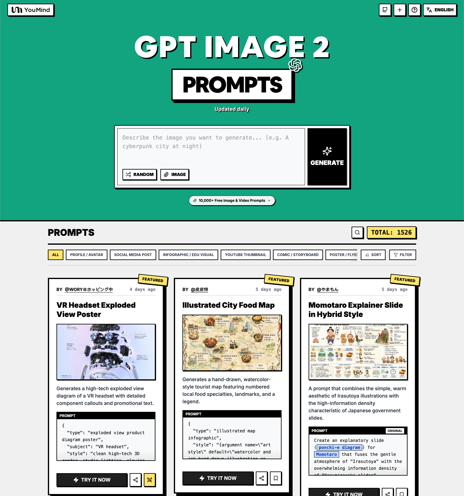

<a href="https://youmind.com/it-IT/gpt-image-2-prompts">
  
</a>

> 💡 🎬 Take it further with **Seedance 2** — pair GPT Image 2 stills with Seedance for jaw-dropping AI videos, 2000+ prompts to explore 👉 [awesome-seedance-2-prompts](https://github.com/YouMind-OpenLab/awesome-seedance-2-prompts)
# 🚀 Fantastici Prompt GPT Image 2

[](https://github.com/sindresorhus/awesome)
[](https://github.com/YouMind-OpenLab/awesome-gpt-image-2)
[](https://creativecommons.org/licenses/by/4.0/)
[](https://github.com/YouMind-OpenLab/awesome-gpt-image-2/actions)
[](docs/CONTRIBUTING.md)

> 🎨 Una raccolta curata di prompt creativi per GPT Image 2 di OpenAI

> ⚠️ **Avviso sul copyright**: Tutti i prompt sono raccolti dalla comunità per scopi educativi. Se ritieni che un contenuto violi i tuoi diritti, [apri una segnalazione](https://github.com/YouMind-OpenLab/awesome-gpt-image-2/issues/new?template=bug-report.yml) e lo rimuoveremo prontamente.

---

[](README.md) [](README_zh.md) [](README_zh-TW.md) [](README_ja-JP.md) [](README_ko-KR.md) [](README_th-TH.md) [](README_vi-VN.md) [](README_hi-IN.md) [](README_es-ES.md) [-Click%20to%20View-lightgrey)](README_es-419.md) [](README_de-DE.md) [](README_fr-FR.md) [](README_it-IT.md) [-Click%20to%20View-lightgrey)](README_pt-BR.md) [](README_pt-PT.md) [](README_tr-TR.md)

---

## 🌐 Vedi nella galleria web

<div align="center">

[](https://youmind.com/it-IT/gpt-image-2-prompts)

</div>

**[👉 Sfoglia la galleria YouMind GPT Image 2](https://youmind.com/it-IT/gpt-image-2-prompts)**

Perché usare la nostra galleria?

| Feature | GitHub README | Galleria youmind.com |
|---------|--------------|---------------------|
| 🎨 Layout visivo | Lista lineare | Bella griglia Masonry |
| 🔍 Cerca | Solo Ctrl+F | Ricerca full-text con filtri |
| 🤖 Generazione IA con un clic | - | Generazione IA con un clic |
| 📱 Mobile | Base | Completamente responsive |
| 🏷️ Categorie | - | Navigazione per categoria |


### 🏷️ Sfoglia per categoria

- **Casi d'uso**
  - [Profilo / Avatar](https://youmind.com/it-IT/gpt-image-2-prompts?categories=profile-avatar)
  - [Post sui social media](https://youmind.com/it-IT/gpt-image-2-prompts?categories=social-media-post)
  - [Infografica / Contenuto Visual Educativo](https://youmind.com/it-IT/gpt-image-2-prompts?categories=infographic-edu-visual)
  - [Miniatura di YouTube](https://youmind.com/it-IT/gpt-image-2-prompts?categories=youtube-thumbnail)
  - [Fumetto / Storyboard](https://youmind.com/it-IT/gpt-image-2-prompts?categories=comic-storyboard)
  - [Marketing di Prodotto](https://youmind.com/it-IT/gpt-image-2-prompts?categories=product-marketing)
  - [Immagine principale e-commerce](https://youmind.com/it-IT/gpt-image-2-prompts?categories=ecommerce-main-image)
  - [Asset di gioco](https://youmind.com/it-IT/gpt-image-2-prompts?categories=game-asset)
  - [Poster / Volantino](https://youmind.com/it-IT/gpt-image-2-prompts?categories=poster-flyer)
  - [App / Web Design](https://youmind.com/it-IT/gpt-image-2-prompts?categories=app-web-design)
- **Stile**
  - [Fotografia](https://youmind.com/it-IT/gpt-image-2-prompts?categories=photography)
  - [Fermo immagine cinematografico / Still fotografico](https://youmind.com/it-IT/gpt-image-2-prompts?categories=cinematic-film-still)
  - [Anime / Manga](https://youmind.com/it-IT/gpt-image-2-prompts?categories=anime-manga)
  - [Illustrazione](https://youmind.com/it-IT/gpt-image-2-prompts?categories=illustration)
  - [Schizzo / Line Art](https://youmind.com/it-IT/gpt-image-2-prompts?categories=sketch-line-art)
  - [Fumetto / Graphic Novel](https://youmind.com/it-IT/gpt-image-2-prompts?categories=comic-graphic-novel)
  - [Rendering 3D](https://youmind.com/it-IT/gpt-image-2-prompts?categories=3d-render)
  - [Chibi / Stile Q](https://youmind.com/it-IT/gpt-image-2-prompts?categories=chibi-q-style)
  - [Isometrico](https://youmind.com/it-IT/gpt-image-2-prompts?categories=isometric)
  - [Pixel Art](https://youmind.com/it-IT/gpt-image-2-prompts?categories=pixel-art)
  - [Pittura a Olio](https://youmind.com/it-IT/gpt-image-2-prompts?categories=oil-painting)
  - [Acquerello](https://youmind.com/it-IT/gpt-image-2-prompts?categories=watercolor)
  - [Inchiostro / Stile Cinese](https://youmind.com/it-IT/gpt-image-2-prompts?categories=ink-chinese-style)
  - [Retro / Vintage](https://youmind.com/it-IT/gpt-image-2-prompts?categories=retro-vintage)
  - [Cyberpunk / Sci-Fi](https://youmind.com/it-IT/gpt-image-2-prompts?categories=cyberpunk-sci-fi)
  - [Minimalismo](https://youmind.com/it-IT/gpt-image-2-prompts?categories=minimalism)
- **Contenuto principale**
  - [Ritratto / Selfie](https://youmind.com/it-IT/gpt-image-2-prompts?categories=portrait-selfie)
  - [Influencer / Modello/a](https://youmind.com/it-IT/gpt-image-2-prompts?categories=influencer-model)
  - [Personaggio](https://youmind.com/it-IT/gpt-image-2-prompts?categories=character)
  - [Gruppo / Coppia](https://youmind.com/it-IT/gpt-image-2-prompts?categories=group-couple)
  - [Prodotto](https://youmind.com/it-IT/gpt-image-2-prompts?categories=product)
  - [Cibo / Bevande](https://youmind.com/it-IT/gpt-image-2-prompts?categories=food-drink)
  - [Articolo di moda](https://youmind.com/it-IT/gpt-image-2-prompts?categories=fashion-item)
  - [Animale / Creatura](https://youmind.com/it-IT/gpt-image-2-prompts?categories=animal-creature)
  - [Veicolo](https://youmind.com/it-IT/gpt-image-2-prompts?categories=vehicle)
  - [Architettura / Interni](https://youmind.com/it-IT/gpt-image-2-prompts?categories=architecture-interior)
  - [Paesaggio / Natura](https://youmind.com/it-IT/gpt-image-2-prompts?categories=landscape-nature)
  - [Paesaggio urbano / Strada](https://youmind.com/it-IT/gpt-image-2-prompts?categories=cityscape-street)
  - [Diagramma / Grafico](https://youmind.com/it-IT/gpt-image-2-prompts?categories=diagram-chart)
  - [Testo / Tipografia](https://youmind.com/it-IT/gpt-image-2-prompts?categories=text-typography)
  - [Abstract / Contesto](https://youmind.com/it-IT/gpt-image-2-prompts?categories=abstract-background)

---

## 📖 Indice

- [🌐 Vedi nella galleria web](#-view-in-web-gallery)
- [🤔 Cos'è GPT Image 2?](#-what-is-gpt-image-2)
- [📊 Statistiche](#-statistics)
- [🔥 Prompt in evidenza](#-featured-prompts)
- [📋 Tutti i prompt](#-all-prompts)
- [🤝 Come contribuire](#-how-to-contribute)
- [📄 Licenza](#-license)
- [🙏 Riconoscimenti](#-acknowledgements)
- [⭐ Cronologia stelle](#-star-history)

---

## 🤔 Cos'è GPT Image 2?

**GPT Image 2** (codename **"duct-tape"**) is OpenAI's next-generation image model. Community testing highlights a leap in these areas:

- 🎯 **Pixel-Perfect Text Rendering** — Native-quality text in Chinese, English, and Japanese, no typos or warped glyphs
- 🎨 **Cross-Image Consistency** — The same character, style, or IP stays identical across a series, down to the pixel
- ⚡ **Commercial-Grade Illustration** — Illustration output is ready to ship without manual polish
- 🌈 **True Art Style Induction** — Creatively evokes the feeling of a style rather than merely approximating references
- 🔧 **Storyboard & Product Series** — Ideal for storyboards, IP characters, and multi-panel product visuals
- 📐 **Multi-Language Design** — Social cards, banners, and posters with accurate multilingual typography in one shot

📚 **Learn More:** See community testing in our [report summary](docs/FAQ.md)

### 🚀 Integrazione Raycast

Alcuni prompt supportano **argomenti dinamici** utilizzando la sintassi [Raycast Snippets](https://raycast.com/help/snippets). Cerca il badge 🚀 Raycast Friendly!

**Esempio:**
```
A quote card with "{argument name="quote" default="Stay hungry, stay foolish"}"
by {argument name="author" default="Steve Jobs"}
```

Quando usato in Raycast, puoi sostituire dinamicamente gli argomenti per iterazioni rapide!

---

## 📊 Statistiche

<div align="center">

| Metrica | Conteggio |
|--------|-------|
| 📝 Totale prompt | **17019** |
| ⭐ In evidenza | **6** |
| 🔄 Ultimo aggiornamento | **domenica 6 settembre 2026 alle ore 14:34:38 UTC** |

</div>

---

## 🔥 Prompt in evidenza

> ⭐ Selezionati a mano dal nostro team per qualità e creatività eccezionali

### No. 1: Poster con vista esplosa di visore VR


#### 📖 Descrizione

Genera un diagramma high-tech con vista esplosa di un visore VR, completo di didascalie dettagliate dei componenti e testo promozionale.

#### 📝 Prompt

```
{
  "type": "poster con diagramma di prodotto a vista esplosa",
  "subject": "visore VR",
  "style": "render 3D high-tech pulito, illuminazione da studio, accenti luminosi",
  "background": "{argument name=\"background color\" default=\"sfumatura tenue viola e blu\"}",
  "header": {
    "logo": "∞ {argument name=\"product name\" default=\"Meta Quest 3\"}",
    "subtitle": "{argument name=\"main catchphrase\" default=\"Una realtà tutta nuova, partendo da una struttura tutta nuova.\"}"
  },
  "layout": {
    "centerpiece": "vista esplosa a sviluppo verticale di un visore VR che mostra 9 strati distinti di componenti interni: guscio esterno, sensori della fotocamera, scheda madre con chip, lenti pancake, telaio interno, pacchi batteria, cinghie laterali, cinghia superiore e cuscinetto dell'interfaccia facciale.",
    "callout_labels": {
      "count": 8,
      "left_side": [
        "Snapdragon® XR2 Gen 2\nPrestazioni di elaborazione straordinarie per esperienze in tempo reale.",
        "Meccanismo IPD regolabile\nComfort e vestibilità ottimale per un'ampia gamma di utenti.",
        "Cinghia per la testa dal design preciso\nErgonomia studiata per il massimo comfort e stabilità."
      ],
      "right_side": [
        "Frontale\nDesign raffinato e bilanciamento del peso ottimizzato.",
        "Telecamere di tracciamento\nTracciamento della posizione ad alta precisione e riconoscimento ambientale.",
        "Lenti pancake\nDesign sottile per un ampio campo visivo e immagini nitide.",
        "Batteria ad alte prestazioni\nDesign energetico ottimizzato per supportare sessioni prolungate.",
        "Interfaccia facciale morbida\nComfort superiore anche durante l'uso prolungato."
      ]
    },
    "footer": {
      "left_text_block": {
        "headline": "{argument name=\"bottom headline\" default=\"L'esperienza si evolve dalla struttura.\"}",
        "body": "Ogni singolo componente racchiude tecnologia all'avanguardia e un design curato per supportare un'esperienza immersiva. Meta Quest 3 genera un'esperienza che fa sentire il futuro fin dal suo interno."
      },
      "right_logo": "∞ Meta"
    }
  }
}
```

#### 🖼️ Immagini generate

##### Image 1

<div align="center">

</div>

#### 📌 Dettagli

- **Autore:** [wory＠ホッピング中](https://x.com/wory37303852)
- **Fonte:** [Twitter Post](https://x.com/wory37303852/status/2045925660401795478#reversed-0)
- **Pubblicato:** 19 aprile 2026
- **Lingue:** en

**[👉 Provalo ora →](https://youmind.com/it-IT/gpt-image-2-prompts?id=13460)**

---

### No. 2: Mappa illustrata del cibo cittadino


#### 📖 Descrizione

Genera una mappa turistica disegnata a mano, in stile acquerello, che presenta specialità gastronomiche locali numerate, punti di riferimento e una legenda.

#### 📝 Prompt

```
{
  "type": "infografica con mappa illustrata",
  "style": "{argument name=\"art style\" default=\"illustrazione disegnata a mano ad acquerello e inchiostro su pergamena vintage\"}",
  "title_section": {
    "text": "{argument name=\"city name\" default=\"Chengdu\"} {argument name=\"map title\" default=\"Mappa gastronomica per buongustai\"}",
    "mascot": "peperoncino rosso dei cartoni animati con occhiali da sole che fa il pollice in su"
  },
  "border": "{argument name=\"border decoration\" default=\"tralcio di foglie verdi e peperoncini rossi\"}",
  "layout": {
    "background": "carta pergamena beige testurizzata con strade gialle, fiumi blu e aree verdi dei parchi",
    "sections": [
      {
        "title": "punti di riferimento",
        "count": 6,
        "illustrations": ["padiglione tradizionale", "monastero tradizionale", "grattacielo moderno con panda che si arrampica", "alta torre TV", "porta tradizionale", "edifici industriali"],
        "labels": ["Parco del Popolo", "Monastero di Wenshu", "IFS", "Torre TV 339", "Kuanzhai Xiangzi", "Dongjiao Memory"]
      },
      {
        "title": "punti ristoro",
        "count": 12,
        "illustrations": ["mapo tofu", "ravioli in olio al peperoncino", "spiedini in pentola", "polpette di riso glutinoso", "torta cotta al forno", "hotpot a nove griglie", "spaghetti di patate dolci", "spiedini freddi", "piatto misto piccante", "tazza da tè con coperchio", "dessert di gelatina ghiacciata", "teste di coniglio piccanti"],
        "labels": ["1 Chen Mapo Tofu", "2 Zhong Dumplings", "3 Chunxi Road", "4 Kuanzhai Xiangzi - San Da Pao", "5 Jianshe Road - Ye Popo Egg Cake", "6 Yulin Road - Xiaolongkan Hotpot", "7 Xiangxiang Alley - Feichang Fen", "8 Wuhouci Street - Bobo Ji", "9 Dongjiao Memory - Maojiao Huola", "10 Parco del Popolo - Heming Tea House", "11 Jinli Ancient Street - Bingfen", "12 Shuangliu Laoma Rabbit Head"]
      },
      {
        "title": "legenda",
        "position": "bottom-right",
        "count": 5,
        "items": ["punto rosso", "casa verde", "albero verde", "linea blu", "doppia linea gialla"],
        "labels": ["punti gastronomici", "punti di riferimento", "parchi e aree verdi", "fiumi e laghi", "strade principali"]
      }
    ],
    "centerpiece": "panda gigante seduto che mangia bambù",
    "bottom_right_extras": ["rosa dei venti vintage con N, S, E, O", "testo di esclusione di responsabilità 'Nota bene: attenzione al piccante, proteggi il tuo stomaco~' con un'icona di peperoncino rosso"]
  }
}
```

#### 🖼️ Immagini generate

##### Image 1

<div align="center">

</div>

#### 📌 Dettagli

- **Autore:** [皮皮特](https://x.com/mm_zzm44854)
- **Fonte:** [Twitter Post](https://x.com/mm_zzm44854/status/2045861258520568230#reversed-1)
- **Pubblicato:** 19 aprile 2026
- **Lingue:** en

**[👉 Provalo ora →](https://youmind.com/it-IT/gpt-image-2-prompts?id=13515)**

---

### No. 3: Slide esplicativa su Momotaro in stile ibrido


#### 📖 Descrizione

Un prompt che combina l'estetica semplice e accogliente delle illustrazioni Irasutoya con l'elevata densità informativa tipica delle slide governative giapponesi.

#### 📝 Prompt

```
Crea una slide esplicativa ({argument name="format" default="diagramma ponchi-e"}) per {argument name="theme" default="Momotaro"} che fonda l'atmosfera delicata di "Irasutoya" con la straordinaria densità informativa delle "slide di Kasumigaseki".
```

#### 🖼️ Immagini generate

##### Image 1

<div align="center">

</div>

##### Image 2

<div align="center">

</div>

#### 📌 Dettagli

- **Autore:** [やまもん](https://x.com/yammamon)
- **Fonte:** [Twitter Post](https://x.com/yammamon/status/2045778624092254603)
- **Pubblicato:** 19 aprile 2026
- **Lingue:** ja

**[👉 Provalo ora →](https://youmind.com/it-IT/gpt-image-2-prompts?id=13983)**

---

### No. 4: Mockup dell'interfaccia di live streaming per e-commerce


#### 📖 Descrizione

Genera un'interfaccia realistica di live streaming sui social media sovrapposta a un ritratto, con messaggi di chat personalizzabili, popup di regali e una scheda di acquisto prodotto.

#### 📝 Prompt

```
{
  "type": "mockup dell'interfaccia di live streaming",
  "subject": {
    "description": "ritratto di {argument name=\"host name\" default=\"Elon Musk\"}, sorridente, che indossa una t-shirt nera con una grafica tecnica schematica bianca",
    "background": "il lato sinistro mostra uno schermo con il testo '{argument name=\"left background logo\" default=\"SPACEX\"}', il lato destro mostra un '{argument name=\"right background logo\" default=\"logo Tesla T\"}' rosso e un'auto scura"
  },
  "ui_overlay": {
    "top_header": {
      "host_info": "avatar, nome '{argument name=\"host name\" default=\"Elon Musk\"}', sottotesto '556k like in questa sessione', pulsante rosso 'Segui'",
      "rank_badge": "icona moneta d'oro con '1° posto globale'",
      "viewer_stats": "3 avatar dei principali spettatori con '123k', '86k', '57k', totale '687k', pulsante di chiusura 'X'",
      "right_links": "'Altre dirette >', 'Galleria regali 0/24' con tag blu 'Classico'"
    },
    "mid_left_gifts": {
      "count": 2,
      "items": [
        "avatar 'Appassionato di tecnologia', 'invia un cuoricino', icona cuore x 1314",
        "avatar 'Mare di stelle', 'invia un razzo', icona razzo x 666"
      ]
    },
    "bottom_left_chat": {
      "system_message": "badge livello 37 'Esploratore spaziale si è unito alla diretta'",
      "message_count": 7,
      "messages": [
        "Piccolo Razzo: Musk! Il futuro è promettente! 🚀",
        "future: Quando uscirà la Tesla Model 2?",
        "Sognatore stellare: SpaceX riuscirà ad andare su Marte quest'anno?",
        "Esploratore AI: A che punto è Neuralink?",
        "Utente simpatico: Ciao grande capo!",
        "Mars: È la prima volta che seguo la tua diretta, sono emozionatissimo!",
        "Utente123: Parla dell'IA, sostituirà gli esseri umani?"
      ]
    },
    "bottom_right_product_card": {
      "hot_tag": "arancione 'Più venduto x 1888'",
      "image": "Tesla Cybertruck",
      "title": "{argument name=\"product name\" default=\"Pickup elettrico Tesla Cybertruck\"}",
      "price": "{argument name=\"product price\" default=\"¥ 1.618.000\"}",
      "button": "pulsante rosso 'Acquista'",
      "floating_animation": "cuori traslucidi che fluttuano lungo il bordo destro"
    },
    "bottom_bar": {
      "input_field": "'Scrivi qualcosa...'",
      "icons": ["faccina sorridente", "tre puntini", "carrello", "scatola regalo", "condividi"]
    }
  }
}
```

#### 🖼️ Immagini generate

##### Image 1

<div align="center">

</div>

#### 📌 Dettagli

- **Autore:** [神经病不想好转](https://x.com/sjbbxhz)
- **Fonte:** [Twitter Post](https://x.com/sjbbxhz/status/2045684734714380687#reversed-0)
- **Pubblicato:** 19 aprile 2026
- **Lingue:** en

**[👉 Provalo ora →](https://youmind.com/it-IT/gpt-image-2-prompts?id=14036)**

---

### No. 5: Battaglia di arti marziali in stile anime


#### 📖 Descrizione

Genera una dinamica scena d'azione in stile anime con due personaggi che combattono circondati da aure elementali all'interno di un dojo tradizionale.

#### 📝 Prompt

```
Un'illustrazione anime altamente dinamica di due ragazze impegnate in un feroce combattimento di arti marziali all'interno di un tradizionale dojo in legno. In primo piano, una ragazza con {argument name="character 1 hair" default="capelli neri raccolti in uno chignon alto con nastri rossi"} assume una potente posizione di arti marziali, spingendo il pugno in avanti. Indossa un {argument name="character 1 outfit" default="top bianco in stile cinese con nappe rosse e pantaloni rossi larghi"}, con intensi fendenti di energia rossa che vorticano attorno ai suoi arti. A mezz'aria sulla destra, una ragazza con {argument name="character 2 hair" default="capelli viola chiaro raccolti in due chignon"} salta con grazia, sorridendo con sicurezza e indossando un {argument name="character 2 outfit" default="abito verde scuro con ricami dorati e calzamaglia nera"}, accompagnata da scie di energia blu simili ad acqua. Lo sfondo presenta l'interno di un tempio rustico in legno con un'evidente insegna sospesa che recita "{argument name="sign text" default="武術会"}". La scena è ricca di azione esplosiva, polvere sollevata, assi del pavimento in legno frantumate, effetti particellari colorati e luminosi, e una drammatica illuminazione dal basso che separa perfettamente i personaggi dallo sfondo dettagliato.
```

#### 🖼️ Immagini generate

##### Image 1

<div align="center">

</div>

#### 📌 Dettagli

- **Autore:** [たねもみ 2.0 / Tanemomi Ver2.0](https://x.com/Tanemomi_Ver2)
- **Fonte:** [Twitter Post](https://x.com/Tanemomi_Ver2/status/2046063806846214265#reversed-0)
- **Pubblicato:** 20 aprile 2026
- **Lingue:** en

**[👉 Provalo ora →](https://youmind.com/it-IT/gpt-image-2-prompts?id=13467)**

---

### No. 6: Infografica sull'evoluzione: la scala di pietra 3D


#### 📖 Descrizione

Trasforma una linea temporale evolutiva piatta in un'infografica 3D realistica a forma di scala di pietra, con rendering dettagliati degli organismi e pannelli laterali strutturati.

#### 📝 Prompt

```
{
  "type": "infografica della linea temporale evolutiva",
  "instruction": "Utilizzando REFERENCE_0 come base strutturale, trasforma il design vettoriale piatto in un'infografica 3D altamente realistica. Sostituisci le rampe lisce con gradini in pietra distinti e aggiorna tutti gli organismi con modelli 3D fotorealistici.",
  "style": {
    "background": "{argument name=\"background style\" default=\"carta pergamena vintage testurizzata\"}",
    "staircase": "{argument name=\"staircase material\" default=\"blocchi di pietra realistici e testurizzati\"}",
    "subjects": "{argument name=\"organism style\" default=\"rendering 3D fotorealistici altamente dettagliati\"}"
  },
  "layout": {
    "main_title": "{argument name=\"main title\" default=\"Evoluzione umana\"}",
    "sections": [
      {
        "position": "barra laterale sinistra",
        "count": 8,
        "labels": ["L0: Vita unicellulare", "L1: Organismi multicellulari", "L2: Regno animale", "L3: Cordati", "L4: Conquista delle terre emerse", "L5: Classe Mammalia", "L6: Evoluzione degli ominidi", "L7: Era dell'Homo sapiens"]
      },
      {
        "position": "in alto a destra",
        "title": "Funzioni acquisite / Funzioni perse",
        "description": "Legenda con icone più e meno"
      },
      {
        "position": "centro in basso",
        "title": "Pietre miliari dell'evoluzione",
        "count": 6,
        "description": "Linea temporale con una grafica a silhouette di 6 figure che mostrano l'evoluzione da scimmia a uomo"
      }
    ],
    "centerpiece": {
      "description": "Scala a chiocciola in pietra con 25 gradini numerati che presentano organismi specifici.",
      "count": 25,
      "notable_elements": [
        "Gradino 07: Medusa",
        "Gradino 09: Ammonite",
        "Gradino 10: Trilobite",
        "Gradino 24: Uomo che cammina",
        "Gradino 25: {argument name=\"future evolution concept\" default=\"silhouette cosmica luminosa con un punto interrogativo\"}"
      ]
    }
  }
}
```

#### 🖼️ Immagini generate

##### Image 1

<div align="center">

</div>

#### 📌 Dettagli

- **Autore:** [知识猫图解](https://x.com/GeekCatX)
- **Fonte:** [Twitter Post](https://x.com/GeekCatX/status/2045792240044511277#reversed-1)
- **Pubblicato:** 19 aprile 2026
- **Lingue:** en

**[👉 Provalo ora →](https://youmind.com/it-IT/gpt-image-2-prompts?id=13491)**

---

## 📋 Tutti i prompt

> 📝 Ordinato per data di pubblicazione (più recente prima)

### No. 1: Profilo / Avatar - Prompt strutturato in JSON per la fotografia di ritratto


#### 📖 Descrizione

Un prompt altamente tecnico basato su JSON per GPT Image 2 che definisce ogni aspetto di un ritratto editoriale, dall'obiettivo della fotocamera e l'illuminazione ai prompt negativi.

#### 📝 Prompt

```
{
  "input": {
    "subject_reference": "{argument name="subject reference" default="UPLOAD_SUBJECT_IMAGE"}",
    "pose": "{argument name="pose setting" default="LEAVE_DEFAULT"}"
  },
  "prompt": {
    "type": "photorealistic_editorial_portrait",
    "subject": {
      "source": "uploaded_reference_image",
      "instruction": "Usa l'immagine di riferimento caricata come unica fonte di verità per il soggetto. Preserva l'identità, la struttura del viso, le proporzioni, i tratti naturali, il tono della pelle, l'acconciatura e l'aspetto generale della persona. Non sostituire o ridisegnare il soggetto."
    },
    "composition": {
      "framing": "ritratto in primo piano stretto",
      "camera_angle": "frontale, ad altezza occhi",
      "pose": "{{POSE}}",
      "subject_position": "centrato nell'inquadratura",
      "camera_distance": "vicino al soggetto"
    },
    "styling": {
      "expression": "calma, sicura, sguardo sottilmente intenso verso la fotocamera",
      "skin": "pelle realistica e luminosa con texture naturale, riflessi sottili e pori visibili",
      "makeup": "trucco editoriale naturale e minimale"
    },
    "wardrobe": {
      "description": "{argument name="wardrobe" default="semplice canotta grigio scuro con spalline sottili"}"
    },
    "accessories": {
      "headphones": "grandi cuffie retro over-ear, padiglioni verde lime lucido con archetto imbottito nero e cuscinetti neri"
    },
    "pose_details": {
      "hands": "entrambe le mani appoggiate naturalmente una sopra l'altra sotto il mento",
      "foreground_object": "grande oggetto circolare rosso brillante che occupa il primo piano inferiore"
    },
    "environment": {
      "background": "sfondo da studio minimalista color beige caldo",
      "setting": "ritratto professionale in studio pulito"
    },
    "lighting": {
      "style": "illuminazione da studio morbida e controllata",
      "direction": "luce diffusa frontale",
      "quality": "ombre morbide con delicati riflessi sul viso",
      "look": "fotografia editoriale beauty di alta gamma"
    },
    "camera": {
      "style": "fotografia di moda professionale",
      "lens": "obiettivo per ritratti da 85mm",
      "depth_of_field": "profondità di campo ridotta ma naturale",
      "focus": "occhi e tratti del viso perfettamente nitidi"
    },
    "visual_quality": {
      "realism": "estremamente fotorealistico",
      "detail": "micro-dettagli elevati, ciocche di capelli realistiche, texture della pelle naturale",
      "color_grading": "toni editoriali neutri e caldi",
      "finish": "campagna beauty di alto livello per riviste"
    },
    "negative_prompt": [
      "cambio di identità",
      "persona diversa",
      "struttura facciale alterata",
      "pelle di plastica",
      "pelle troppo levigata",
      "viso dall'aspetto artificiale",
      "trucco eccessivo",
      "mani distorte",
      "dita extra",
      "anatomia deformata",
      "cuffie deformate",
      "testo",
      "loghi",
      "filigrane",
      "filtro di bellezza artificiale",
      "cartone animato",
      "illustrazione",
      "bassa risoluzione"
    ],
    "aspect_ratio": "3:4"
  }
}
```

#### 🖼️ Immagini generate

##### Image 1

<div align="center">

</div>

#### 📌 Dettagli

- **Autore:** [Maercih](https://x.com/Maercihh)
- **Fonte:** [Twitter Post](https://x.com/Maercihh/status/2096496459587915797)
- **Pubblicato:** 6 settembre 2026
- **Lingue:** en

**[👉 Provalo ora →](https://youmind.com/it-IT/gpt-image-2-prompts?id=33605)**

---

### No. 2: Profilo / Avatar - Ritratto in studio cinematografico in bianco e nero


#### 📖 Descrizione

Un prompt dettagliato per un ritratto in studio in bianco e nero ad alto contrasto che raffigura un uomo con la barba e un'illuminazione drammatica.

#### 📝 Prompt

```
Un ritratto cinematografico in studio in bianco e nero di un bell'uomo adulto con {argument name="hair style" default="capelli scuri corti e leggermente spettinati"} e una barba folta e ben curata, che indossa una {argument name="clothing" default="semplice felpa nera con cappuccio"}. È ritratto di tre quarti, mentre guarda verso l'alto e verso destra con un'espressione calma, pensierosa e determinata. Una drammatica illuminazione ad alto contrasto in stile Rembrandt illumina un lato del viso mentre l'altro sfuma in un'ombra profonda. Tratti del viso altamente dettagliati, texture della pelle realistica, occhi nitidi, zigomi e barba definiti, sottili riflessi sui capelli, neri profondi, sfondo scuro senza giunture, atmosfera maschile intensa, composizione minimalista, fotografia professionale di moda/editoriale, profondità di campo ridotta, luce chiave direzionale morbida dall'alto/frontale, forte chiaroscuro, ultra-realistico, fotorealistico, monocromatico, obiettivo per ritratti da 85mm, f/1.8, alto dettaglio, grana della pellicola fine, 4K.ritratto di un bell'uomo adulto con capelli scuri corti e leggermente spettinati e una barba folta e ben curata, che indossa una semplice felpa nera con cappuccio. È ritratto di tre quarti, mentre guarda verso l'alto e verso destra con un'espressione calma, pensierosa e determinata. Una drammatica illuminazione ad alto contrasto in stile Rembrandt illumina un lato del viso mentre l'altro sfuma in un'ombra profonda. Tratti del viso altamente dettagliati, texture della pelle realistica, occhi nitidi, zigomi e barba definiti, sottili riflessi sui capelli, neri profondi, sfondo scuro senza giunture, atmosfera maschile intensa, composizione minimalista, fotografia professionale di moda/editoriale, profondità di campo ridotta, luce chiave direzionale morbida dall'alto/frontale, forte chiaroscuro, ultra-realistico, fotorealistico, monocromatico, obiettivo per ritratti da 85mm, f/1.8, alto dettaglio, grana della pellicola fine, 4K.
```

#### 🖼️ Immagini generate

##### Image 1

<div align="center">

</div>

#### 📌 Dettagli

- **Autore:** [Aijaz](https://x.com/iamsofiaijaz)
- **Fonte:** [Twitter Post](https://x.com/iamsofiaijaz/status/2096457041972019446)
- **Pubblicato:** 6 settembre 2026
- **Lingue:** en

**[👉 Provalo ora →](https://youmind.com/it-IT/gpt-image-2-prompts?id=33574)**

---

### No. 3: Profilo / Avatar - Luce solare alla finestra e top in pizzo


#### 📖 Descrizione

Un delicato prompt per ritratti incentrato su un top in pizzo e pantaloncini di jeans vicino a una finestra, che cattura i riflessi della luce solare naturale e le morbide ombre degli interni.

#### 📝 Prompt

```
Soggetto:
Luce dalla finestra e pizzo color crema

Soggetto principale:
Una fotografia verticale a mezzo busto di una donna adulta che indossa un {argument name="top" default="top in pizzo color crema"} e {argument name="bottom" default="jeans chiari"} seduta su una sedia di legno accanto a una finestra luminosa. Il soggetto occupa gran parte del centro dell'inquadratura, con la luce del sole che filtra dalla finestra a sinistra e un tavolo di legno sullo sfondo a destra.

Personaggio/Espressione:
Viso leggermente inclinato a sinistra, sguardo rivolto direttamente alla fotocamera con un'espressione dolce e labbra lucide leggermente socchiuse. Viso ovale sottile, mento piccolo, grandi occhi a mandorla color marrone grigiastro, sopracciglia sottili, ponte del naso liscio e labbra color rosa pallido. Capelli castano cenere lucidi che scendono fino al petto con frangia sottile e ciocche sottili lungo le guance, che scendono dritte dalla spalla destra al petto. Un piccolo ciondolo rotondo.

Abbigliamento/Posa:
Un top a canottiera color crema a coste sottili con ampie spalline in pizzo, scollo a V profondo, un sottile laccetto al centro del petto e pizzo sull'orlo. Un cardigan trasparente a maniche lunghe dello stesso colore drappeggiato su entrambe le spalle, con pantaloncini di jeans azzurri sotto. Seduta su una sedia, gomito destro sollevato con il dorso della mano destra appoggiato sotto la guancia e braccio sinistro abbassato verso le ginocchia.

Sfondo/Illuminazione:
Una finestra con cornice bianca e una parete bianca sulla sinistra, con un semplice tavolo e una sedia di legno sullo sfondo a destra. Una luce primaria calda e leggermente intensa proviene dalla finestra in alto a sinistra, creando ombre sottili della cornice della finestra e riflessi luminosi sul viso, sul petto e sulle maniche, lasciando ombre morbide sul lato destro.

Composizione/Fotocamera:
Composizione verticale 2:3. La fotocamera riprende la parte superiore del corpo da una breve distanza, approssimativamente alla stessa altezza del livello degli occhi della persona seduta, tagliata sopra la testa e vicino alla vita dei jeans. Posizionare il viso al centro in alto, la mano destra sulla guancia in alto a destra e la finestra sul bordo sinistro, rendendo il soggetto grande al centro. Messa a fuoco su entrambi gli occhi, con lo sfondo interno leggermente e naturalmente sfocato.

Texture/Stile:
Fotografia live-action fotorealistica ad alta definizione. Rappresenta con precisione la texture naturale della pelle e la lucentezza, le singole ciocche di capelli, le coste sottili, il pizzo, le maniche trasparenti e la trama del denim, regolata su una palette calda a bassa saturazione di colori crema e legno chiaro.

Negativo:
Non invertire la direzione della luce della finestra e delle ombre; non far indossare il cardigan completamente fino alle spalle.
```

#### 🖼️ Immagini generate

##### Image 1

<div align="center">

</div>

#### 📌 Dettagli

- **Autore:** [Prompt アトリエ｜AI画像プロンプト](https://x.com/CyberTotal2026)
- **Fonte:** [Twitter Post](https://x.com/CyberTotal2026/status/2096439495742701879)
- **Pubblicato:** 6 settembre 2026
- **Lingue:** ja

**[👉 Provalo ora →](https://youmind.com/it-IT/gpt-image-2-prompts?id=33597)**

---

### No. 4: Profilo / Avatar - Ritratto selfie notturno in strada urbana


#### 📖 Descrizione

Un prompt per un selfie notturno spontaneo e fotorealistico di una giovane donna in un vivace quartiere cittadino coreano.

#### 📝 Prompt

```
Un ritratto notturno fotorealistico in stile street di una giovane donna che scatta un selfie informale in un vivace {argument name="city location" default="quartiere cittadino coreano"}. Ha {argument name="hair style" default="capelli lunghi, lisci e scuri"}, un trucco naturale e leggero, discreti orecchini a cerchio e una collana delicata. Indossa un {argument name="outfit" default="top nero aderente abbinato a una giacca oversize nera e pantaloni casual grigio chiaro"} e porta una borsa a spalla nera con tracolla a catena. Si sporge leggermente verso la fotocamera con un'espressione calma e sicura. Le insegne luminose dei negozi coreani, i cartelloni illuminati, il traffico, le strisce pedonali e le luci della città creano uno sfondo urbano vibrante. Angolazione dello smartphone leggermente inclinata, fotografia di strada spontanea, texture della pelle realistica, illuminazione ambientale soffusa, profondità di campo ridotta, colori notturni naturali, dettagliato, alta risoluzione, composizione verticale 4:5.
```

#### 🖼️ Immagini generate

##### Image 1

<div align="center">

</div>

##### Image 2

<div align="center">

</div>

#### 📌 Dettagli

- **Autore:** [Aqsa](https://x.com/Aqsahere_)
- **Fonte:** [Twitter Post](https://x.com/Aqsahere_/status/2096437613851013132)
- **Pubblicato:** 6 settembre 2026
- **Lingue:** en

**[👉 Provalo ora →](https://youmind.com/it-IT/gpt-image-2-prompts?id=33575)**

---

### No. 5: Profilo / Avatar - Ragazza anime kawaii rosa con orsacchiotti


#### 📖 Descrizione

Un'illustrazione anime in stile yume-kawaii dai colori pastello che ritrae una ragazza lolita dai capelli a codini rosa, intenta a reggere un cartello con un nome giapponese circondata da allegri orsacchiotti.

#### 📝 Prompt

```
Crea un'illustrazione anime kawaii verticale altamente dettagliata in una camera da letto rosa tenue, piena di orsacchiotti e decorazioni scintillanti. Al centro, una graziosa ragazza anime di nome {argument name="character name" default="Astra"} con lunghi e soffici capelli a codini {argument name="hair color" default="rosa chewing-gum"}, occhi magenta-rosa lucidi, pelle chiara, una piccola bocca imbronciata e un'espressione leggermente timida. Indossa un elaborato abito idol-lolita rosa con balze a strati, finiture in pizzo, tessuto a quadretti rosa, fiocchi, polsini arricciati, un nastro in vita stile corsetto, calze bianche e rosa sopra il ginocchio e numerosi accessori a forma di orsacchiotto. I suoi codini sono legati con due grandi fiocchi in pizzo a quadretti rosa, ognuno decorato con un piccolo ciondolo a forma di muso d'orso; aggiungi una ciocca ahoge arricciata sopra la testa. È seduta di fronte allo spettatore in una stanza dai toni pastello e tiene davanti al petto un cartello rettangolare bianco con un grande testo scritto a mano in giapponese {argument name="sign text" default="あすとら"} con un pennello spesso color rosa acceso, oltre a piccoli scarabocchi: un fiocco, una corona, cuori, stelle, linee ondulate e un semplice muso d'orso. La mano destra indica il cartello mentre la sinistra lo impugna. Circondala con esattamente 6 orsacchiotti visibili: 1 orso grande in basso a sinistra che alza entrambe le braccia, 1 orso medio a metà sinistra accanto al cartello, 1 orso che sbuca dallo sfondo in alto a sinistra, 1 orso sullo sfondo in alto a destra, 1 orso allegro a metà destra che alza una zampa e 1 orso grande in basso a destra che alza entrambe le braccia; tutti gli orsi sono beige con papillon rosa e volti gioiosi. Aggiungi icone decorative scintillanti bianche e rosa, scarabocchi a forma di cuore e segni di enfasi attorno al personaggio, specialmente ai bordi sinistro e destro. Sfondo: una sognante camera da letto rosa con tende sfocate, biancheria da letto o cuscini morbidi, una calda lampada da tavolo, mobili color pastello e altri dettagli decorativi rosa, abbastanza sfocati da mantenere il focus sul personaggio. Stile visivo: key visual anime moderno e raffinato, estetica yume-kawaii ultra-graziosa, tavolozza di colori rosa pastello, riflessi luminosi, effetto soft bloom, occhi lucidi, linee delicate, dettagli densi di pizzo e tessuto, alta risoluzione, composizione ritratto 3:4, nessuna filigrana, nessun testo leggibile aggiuntivo oltre al cartello.
```

#### 🖼️ Immagini generate

##### Image 1

<div align="center">

</div>

#### 📌 Dettagli

- **Autore:** [studioあぽろん](https://x.com/ai_studioapollo)
- **Fonte:** [Twitter Post](https://x.com/ai_studioapollo/status/2096437122895057277#reversed-0)
- **Pubblicato:** 6 settembre 2026
- **Lingue:** en

**[👉 Provalo ora →](https://youmind.com/it-IT/gpt-image-2-prompts?id=33642)**

---

### No. 6: Profilo / Avatar - Ritratto a matita in bianco e nero


#### 📖 Descrizione

Un ritratto a mezzo busto realistico in stile grafite di una giovane donna serena, con occhi dettagliati, ombreggiature morbide e capelli raccolti in modo naturale, ideale per la generazione di personaggi o ritratti eleganti.

#### 📝 Prompt

```
Crea un ritratto a tratto di matita in bianco e nero ultra-dettagliato di {argument name="character description" default="una giovane donna dai lineamenti delicati e simmetrici"} su uno sfondo di carta bianca pulita. Mostra un ritratto a mezzo busto frontale tagliato dalle spalle in su, con la testa leggermente girata ma gli occhi rivolti direttamente verso l'osservatore. L'espressione è calma e gentile, con un accenno di sorriso a bocca chiusa. Renderizza grandi occhi a mandorla con iridi dettagliate e punti luce, sopracciglia scure dolcemente arcuate, un naso sottile e dritto, labbra piene e delicatamente ombreggiate, un viso ovale liscio e un collo lungo ed elegante. Stile dei capelli: {argument name="hairstyle" default="capelli scuri di media lunghezza con riga centrale, raccolti in modo morbido e spettinato con ciocche sottili che incorniciano entrambi i lati del viso"}. Utilizza una tecnica meticolosa a matita grafite: linee sottili stratificate, tratteggio incrociato realistico, sfumature tonali sottili, singoli tratti dei capelli visibili, ombreggiatura delicata della pelle e dettagli del viso nitidi, mantenendo le spalle e la parte inferiore del busto leggermente abbozzate e sfumate verso lo sfondo bianco. Mantieni un aspetto realistico ma idealizzato da illustrazione di moda, alto contrasto nei capelli, ombreggiatura morbida sul viso, nessun colore, nessun oggetto di sfondo, nessun testo, nessuna filigrana.
```

#### 🖼️ Immagini generate

##### Image 1

<div align="center">

</div>

#### 📌 Dettagli

- **Autore:** [Arina Ai](https://x.com/Arina_hoqe)
- **Fonte:** [Twitter Post](https://x.com/Arina_hoqe/status/2096433825509241309#reversed-0)
- **Pubblicato:** 6 settembre 2026
- **Lingue:** en

**[👉 Provalo ora →](https://youmind.com/it-IT/gpt-image-2-prompts?id=33649)**

---

### No. 7: Profilo / Avatar - Ritratto cinematografico intenso di profilo


#### 📖 Descrizione

Un prompt per ritratti cinematografici low-key che trasforma un'immagine di riferimento in uno studio del personaggio intenso e suggestivo con colorazione selettiva.

#### 📝 Prompt

```
Crea un ritratto cinematografico in primo piano, scuro e intenso, dell'uomo caricato, con capelli spettinati e acconciati con ciocche libere, che guarda oltre la spalla verso la fotocamera con uno sguardo profondo, serio, intenso e malinconico. Il corpo è girato di lato, il braccio sinistro è sollevato attraverso il viso fino all'orecchio con il gomito esteso verso l'alto e in avanti, coprendo il volto e lasciando visibile solo un occhio, creando una posa stratificata di grande impatto. Indossa una camicia di seta aperta a maniche arrotolate di colore {argument name="shirt color" default="blu ottanio scuro"}, con il petto pulito leggermente visibile. Qualità DSLR, scatto effettuato di lato mentre guarda verso l'obiettivo. Mantieni il viso prevalentemente desaturato con tonalità della pelle naturali, mentre la camicia rimane di un ricco {argument name="shirt color" default="blu ottanio profondo"}, creando un look cinematografico a colori selettivi. Illuminazione laterale drammatica low-key, ombre nere profonde, sottile grana della pellicola, alto contrasto, {argument name="background" default="sfondo nero"} suggestivo con primo piano ribassato, leggera vignettatura, texture della pelle realistica, profondità di campo ridotta, fotografia di moda editoriale, obiettivo 85mm, ultra-realistico, atmosferico, formato ritratto 4:5. Mantieni il viso identico a quello della foto caricata.
```

#### 🖼️ Immagini generate

##### Image 1

<div align="center">

</div>

#### 📌 Dettagli

- **Autore:** [Muhammad Jamil](https://x.com/JamilAI55)
- **Fonte:** [Twitter Post](https://x.com/JamilAI55/status/2096410503090520259)
- **Pubblicato:** 6 settembre 2026
- **Lingue:** en

**[👉 Provalo ora →](https://youmind.com/it-IT/gpt-image-2-prompts?id=33567)**

---

### No. 8: Profilo / Avatar - Da anime 2D ad avatar giocattolo 3D


#### 📖 Descrizione

Trasforma un personaggio anime di riferimento in un avatar 3D in stile giocattolo lucido e semplificato, ideale per anteprime di modelli di personaggi.

#### 📝 Prompt

```
Utilizzando REFERENCE_0 come base del personaggio, trasforma il personaggio anime in un semplice modello 3D stilizzato tipo giocattolo/avatar, preservando i tratti distintivi del viso, gli occhiali rotondi, il caschetto corto scuro e l'espressione gentile. Trasforma il risultato da una serie di illustrazioni 2D a un singolo rendering 3D a figura intera in una posa eretta neutra, visto leggermente dall'alto e di tre quarti.

Stile: personaggio 3D in plastica lucida morbida/simile all'argilla con anatomia semplificata, forme arrotondate, arti segmentati tipo bambola e dettagli del viso minimi. Rendi i capelli come pezzi scolpiti e compatti invece che come ciocche dipinte.

Nuovo outfit e design del corpo: sostituisci il corpo originale esposto/censurato con un modesto outfit da giocattolo composto esattamente da 5 componenti visibili: 1 maglietta bianca oversize, 1 lettera "M" azzurra sulla parte anteriore della maglietta, 1 pezzo per pantaloncini/fianchi blu, 2 pezzi per le gambe blu e 2 scarpe bianche arrotondate. Usa braccia cilindriche semplici con mani a forma di guantone e spalline squadrate.

Scena: posiziona il personaggio da solo su un piano di calpestio da studio grigio-azzurro chiaro contro uno sfondo quasi nero, con un'illuminazione dall'alto soffusa, ombre delicate e un look pulito da anteprima/rendering 3D.

Vincoli: non includere la serie multi-vista originale, il mosaico di censura o il layout del foglio di riferimento. Non aggiungere testo oltre alla singola lettera sulla maglietta {argument name="shirt letter" default="M"}. Mantieni il modello carino, non realistico e chiaramente simile a un giocattolo. Usa {argument name="character style" default="soft glossy plastic 3D avatar"} e {argument name="background" default="dark studio backdrop with pale blue-gray floor"}.
```

#### 🖼️ Immagini generate

##### Image 1

<div align="center">

</div>

##### Image 2

<div align="center">

</div>

#### 📌 Dettagli

- **Autore:** [蘭熊才王（らんくまさいわん）](https://x.com/j0PvbqHs6q29754)
- **Fonte:** [Twitter Post](https://x.com/j0PvbqHs6q29754/status/2096340370334630033#reversed-1)
- **Pubblicato:** 5 settembre 2026
- **Lingue:** en

**[👉 Provalo ora →](https://youmind.com/it-IT/gpt-image-2-prompts?id=33636)**

---

### No. 9: Profilo / Avatar - Robot giallo eroico con mantello


#### 📖 Descrizione

Un prompt di rendering cinematografico a figura intera per creare una mascotte robotica gialla corazzata e pulita, con un sorriso pixelato e un mantello drammatico.

#### 📝 Prompt

```
Crea un rendering 3D a figura intera, pulito e altamente dettagliato, di {argument name="character name" default="Solip"}, un amichevole robot umanoide eroico in una posa frontale sicura contro uno sfondo da studio nero puro. Il robot ha un corpo mech corazzato e massiccio, realizzato con pannelli metallici color giallo senape angolari, giunti meccanici neri, graffi sottili, bordi smussati e un'usura realistica. La testa è un monitor quadrato simile a un casco giallo con angoli arrotondati, moduli auricolari circolari laterali, uno schermo nero lucido e un'espressione pixel LED verde molto carina: esattamente 2 occhi a forma di U rovesciata e 1 bocca curva sorridente. Aggiungi il simbolo color verde acqua {argument name="chest label" default="C2"} sulla piastra pettorale superiore destra. Il robot indossa esattamente 1 drammatico mantello nero che fluisce dietro entrambe le spalle, con una fodera interna e un bordo color verde acqua visibili lungo i margini. Includi braccia segmentate dettagliate, dita nere articolate, grandi anelli sulle spalle, gomiti a pistone, cosce corazzate spesse, piastre per le ginocchia, piedi pesanti simili a stivali e una sottostruttura scura esposta tra le piastre. Usa un'illuminazione cinematografica low-key con una luce di contorno dorata calda proveniente dall'alto a sinistra, riflessi nitidi sul metallo, ombre profonde, un sottile riflesso sul pavimento e un look ultra-pulito da giocattolo sci-fi premium o rendering cinematografico. Centra il personaggio verticalmente in una composizione a ritratto, con un'angolazione della fotocamera leggermente dal basso, messa a fuoco nitida, nessun oggetto di sfondo, nessun personaggio extra, nessun testo eccetto l'etichetta sul petto.
```

#### 🖼️ Immagini generate

##### Image 1

<div align="center">

</div>

#### 📌 Dettagli

- **Autore:** [Solip | Model C2 Companion Unit](https://x.com/SolipC2)
- **Fonte:** [Twitter Post](https://x.com/SolipC2/status/2096285516899467612#reversed-0)
- **Pubblicato:** 5 settembre 2026
- **Lingue:** en

**[👉 Provalo ora →](https://youmind.com/it-IT/gpt-image-2-prompts?id=33653)**

---

### No. 10: Profilo / Avatar - Trasformazione personaggio in stile GTA


#### 📖 Descrizione

Un prompt sofisticato basato sul riferimento dell'identità per trasformare una foto personale in un personaggio stilizzato ispirato a GTA, mantenendo i dettagli chiave del volto e dell'abbigliamento.

#### 📝 Prompt

```
Usa la mia foto come riferimento principale per l'identità. Usa l'immagine target che allegherò come riferimento per posa, composizione, inquadratura, illuminazione, ambientazione, palette cromatica e stile visivo. Sostituisci il personaggio nell'immagine target con la persona della mia foto, mantenendo l'identità riconoscibile: volto, capelli, barba, tonalità della pelle, corporatura, espressione seria e tratti somatici principali. Mantieni esattamente la posa, la postura del corpo, la posizione di braccia e mani, l'inquadratura, la composizione, la prospettiva, l'illuminazione e l'ambientazione dell'immagine target. Non alterare l'ambiente, i colori o l'atmosfera originale, se non per il minimo necessario a integrare naturalmente il nuovo personaggio. Ricostruisci l'intero personaggio, non limitarti a un semplice scambio di volto. Adatta il mio volto e il mio corpo alla posa dell'immagine target, mantenendo un'anatomia realistica, proporzioni naturali e coerenza tra testa, collo, spalle, braccia e mani. Applica uno {argument name="visual style" default="stile visivo chiaramente ispirato alla cover art di GTA"}: illustrazione di personaggio in stile realismo stilizzato, contorni definiti, pelle e abbigliamento con una finitura pittorica curata, alto contrasto, illuminazione cinematografica, colori saturi ma controllati, estetica urbana che unisce lusso e strada. Evita che sembri un'illustrazione generica o un filtro fotografico. Mantieni l' {argument name="outfit" default="outfit della mia foto: t-shirt bianca oversize, orologio nero e bracciale/catena al polso"}. Puoi migliorare sottilmente la texture, il drappeggio e la finitura dell'abbigliamento per renderlo più premium, ma senza cambiare l'outfit principale. Sostituisci qualsiasi borsa o oggetto tenuto in mano nell'immagine target con uno zaino nero premium in stile urbano, integrato naturalmente nella posa e nella scena. Aggiungi il logo di GTA 6. Non includere: attrezzatura fotografica, gimbal, dispositivi audiovisivi, loghi reali, testo, marchi registrati, armi, deformità facciali, mani mal costruite, massa muscolare eccessiva, aspetto da cartone animato o look da costume.
```

#### 🖼️ Immagini generate

##### Image 1

<div align="center">

</div>

##### Image 2

<div align="center">

</div>

#### 📌 Dettagli

- **Autore:** [H A J R A](https://x.com/codewithhajra)
- **Fonte:** [Twitter Post](https://x.com/codewithhajra/status/2096261025456689250)
- **Pubblicato:** 5 settembre 2026
- **Lingue:** en

**[👉 Provalo ora →](https://youmind.com/it-IT/gpt-image-2-prompts?id=33569)**

---

### No. 11: Profilo / Avatar - Ritratto Kawaii in denim


#### 📖 Descrizione

Un prompt per un ritratto semi-realistico dai toni caldi per creare una graziosa giovane donna con un fiocco a pois, salopette di jeans e cuori e stelle fluttuanti.

#### 📝 Prompt

```
Crea un ritratto verticale raffinato di una graziosa giovane donna con {argument name="hair color" default="lunghi capelli mossi castano scuro"}, pelle chiara e morbida, grandi occhi verde nocciola, sopracciglia naturali, trucco delicato sui toni del rosa e un'espressione dolce e sognante, rivolta leggermente verso l'alto e di lato anziché direttamente verso la fotocamera. Indossa una fascia rossa brillante legata in un grande fiocco a pois bianchi, piccoli orecchini a forma di cuore dorati, una maglia a maniche lunghe {argument name="shirt color" default="rosa corallo"} e una salopette di jeans blu con cuciture a vista, tasca frontale, bottoni in ottone e fibbia sulla spalla. Inquadrala dal busto in su in un ritratto a tre quarti centrato, con i capelli che ricadono su una spalla e un'illuminazione da studio professionale. Lo sfondo è un caldo gradiente pesca-arancio riempito di luci bokeh circolari e cremosi e esattamente 14 forme decorative fluttuanti: 8 cuori rossi di varie dimensioni e 6 piccole stelle dorate, leggermente sfocati a diverse profondità. Utilizza uno stile di pittura digitale semi-realistico ispirato al kawaii, alta definizione nel viso e nei capelli, pelle liscia, color grading caldo, profondità di campo ridotta, niente testo, niente filigrana, nessuna persona extra, composizione verticale 9:16.
```

#### 🖼️ Immagini generate

##### Image 1

<div align="center">

</div>

#### 📌 Dettagli

- **Autore:** [Emma](https://x.com/emma_ai6)
- **Fonte:** [Twitter Post](https://x.com/emma_ai6/status/2096257742780465538#reversed-0)
- **Pubblicato:** 5 settembre 2026
- **Lingue:** en

**[👉 Provalo ora →](https://youmind.com/it-IT/gpt-image-2-prompts?id=33647)**

---

### No. 12: Profilo / Avatar - Ritratto selfie allo specchio in una palestra di lusso


#### 📖 Descrizione

Un prompt per un elegante selfie allo specchio ambientato in una moderna palestra di lusso, incentrato sull'estetica atletica e su un'atmosfera minimalista.

#### 📝 Prompt

```
Un'elegante giovane donna che scatta un selfie allo specchio in una moderna palestra di lusso, seduta a gambe incrociate su una {argument name="bench type" default="panca da allenamento in legno"}. Ha {argument name="hair style" default="lunghi capelli castano scuro lisci"}, un'espressione calma e naturale, e tiene uno smartphone nero davanti al viso. Indossa un {argument name="outfit" default="elegante completo sportivo smanicato total black con pantaloni neri ampi e sneakers chunky chiare"}, con un semplice orologio da polso. Spaziosi interni di una palestra di alto livello con grandi specchi, macchinari per il fitness, calda illuminazione beige, pavimenti in legno lucido, atmosfera minimalista e pulita, illuminazione ambientale soffusa, fotografia realistica, texture della pelle naturale, profondità di campo ridotta, leggero sfocato sullo sfondo, composizione a figura intera, verticale 9:16, alta definizione.
```

#### 🖼️ Immagini generate

##### Image 1

<div align="center">

</div>

##### Image 2

<div align="center">

</div>

#### 📌 Dettagli

- **Autore:** [Aqsa](https://x.com/Aqsahere_)
- **Fonte:** [Twitter Post](https://x.com/Aqsahere_/status/2096254920353624544)
- **Pubblicato:** 5 settembre 2026
- **Lingue:** en

**[👉 Provalo ora →](https://youmind.com/it-IT/gpt-image-2-prompts?id=33578)**

---

### No. 13: Profilo / Avatar - Ritratto monocromatico con occhiali da sole a specchio futuristici


#### 📖 Descrizione

Un sofisticato prompt editoriale di moda in bianco e nero incentrato sull'estetica high-fashion e sulla ricostruzione dell'identità.

#### 📝 Prompt

```
Usa le mie foto di riferimento caricate per ricostruire accuratamente il mio vero volto e la mia identità. Preserva l'esatta struttura facciale, la linea della mascella, le proporzioni della fronte, le sopracciglia, la forma degli occhi, il naso, le labbra, il tono della pelle, la barba/i baffi (se presenti), l'attaccatura dei capelli, l'acconciatura, la texture dei capelli, le orecchie, le proporzioni del collo e la geometria facciale complessiva. Non fondermi con il modello originale. Fai in modo che sia inconfondibilmente me.
Crea un ritratto in primo piano editoriale high-fashion ultra-realistico con un'estetica di lusso minimalista, catturato interamente in un drammatico bianco e nero con ricche tonalità monocromatiche, neri profondi, luci nitide, texture naturale della pelle e una sottile grana cinematografica.
La composizione è un ritratto a mezzo busto perfettamente centrato. La mia testa è rivolta direttamente verso la fotocamera senza inclinazioni o rotazioni. La mia espressione è seria, sicura e leggermente intensa, con le sopracciglia leggermente aggrottate che creano sottili linee sulla fronte. Le labbra rimangono naturalmente chiuse con un'espressione neutra. La mascella è rilassata ma definita.
Indosso {argument name="eyewear" default="occhiali da sole a mascherina avvolgenti futuristici a specchio"} caratterizzati da montature metalliche lucide e {argument name="lens type" default="lenti cromate riflettenti"} che coprono completamente i miei occhi. Gli occhiali da sole, la pelle, i capelli, l'abbigliamento e lo sfondo sono tutti resi in bianco e nero, mentre le lenti riflettono un luminoso ambiente da studio monocromatico con morbidi pannelli luminosi rettangolari e sfumature sottili. Mantieni riflessi puliti e realistici, dettagli facciali nitidi, ombre naturali, un forte contrasto tonale e un look da fotografia di moda cinematografica premium.
```

#### 🖼️ Immagini generate

##### Image 1

<div align="center">

</div>

#### 📌 Dettagli

- **Autore:** [Harboris](https://x.com/harboriis)
- **Fonte:** [Twitter Post](https://x.com/harboriis/status/2096230669500264573)
- **Pubblicato:** 5 settembre 2026
- **Lingue:** en

**[👉 Provalo ora →](https://youmind.com/it-IT/gpt-image-2-prompts?id=33576)**

---

### No. 14: Profilo / Avatar - Studentessa che saluta in un corridoio illuminato dal sole


#### 📖 Descrizione

Genera un ritratto anime rifinito di una studentessa in divisa alla marinara che saluta sorridente in un corridoio scolastico dalla luce soffusa.

#### 📝 Prompt

```
Crea un ritratto verticale in stile anime di alta qualità di una allegra studentessa giapponese in un corridoio scolastico illuminato dal sole. È leggermente voltata rispetto all'osservatore, ma guarda indietro sopra la spalla con un sorriso gentile, alzando una mano aperta in un saluto amichevole. Ha capelli {argument name="hair color" default="nero lucido"} acconciati in due trecce morbide con frangia sfilata, grandi occhi castano caldo, delicati occhiali tondi con montatura sottile, pelle chiara e liscia e un leggero rossore naturale. Indossa una classica divisa scolastica alla marinara: camicetta bianca a maniche corte, colletto alla marinara blu navy con due strisce bianche, cravatta rossa e gonna scura a pieghe. Lo sfondo del corridoio è leggermente sfocato con finestre sulla sinistra, pareti grigio-azzurre fredde e una forte luce solare del tardo pomeriggio che filtra, creando un luminoso effetto rim light, riflessi screziati sui capelli e sulla camicia e una profondità di campo cinematografica. Utilizza un rendering anime giapponese moderno e rifinito con illuminazione semi-realistica, ciocche di capelli dettagliate, pelle dai toni morbidi e pittorici, occhi espressivi, linee pulite e una calda atmosfera nostalgica di vita scolastica. Niente testo, niente filigrana, nessun carattere extra.
```

#### 🖼️ Immagini generate

##### Image 1

<div align="center">

</div>

#### 📌 Dettagli

- **Autore:** [Harf_Done](https://x.com/half_done_yet)
- **Fonte:** [Twitter Post](https://x.com/half_done_yet/status/2096215257731715384#reversed-0)
- **Pubblicato:** 5 settembre 2026
- **Lingue:** en

**[👉 Provalo ora →](https://youmind.com/it-IT/gpt-image-2-prompts?id=33640)**

---

### No. 15: Profilo / Avatar - Ritratto da sogno con fiocco a pois


#### 📖 Descrizione

Genera un grazioso ritratto in arte digitale ultra-realistico di una giovane donna con salopette in denim, fiocco rosso a pois e uno sfondo romantico con cuori e stelle.

#### 📝 Prompt

```
Crea un grazioso ritratto in arte digitale ultra-realistico e da sogno di una giovane donna con {argument name="hair color" default="lunghi capelli mossi castano scuro con sottili riflessi caldi"}, pelle chiara e morbida, grandi occhi verde nocciola, sopracciglia naturali, un naso piccolo e dritto e labbra rosa tenue, che guarda leggermente verso l'alto e verso destra rispetto all'osservatore con un'espressione calma e gentile. Indossa una {argument name="headband style" default="fascia rossa annodata in un grande fiocco con pois bianchi"}, piccoli orecchini a forma di cuore dorati, una {argument name="shirt color" default="maglia a maniche lunghe rosa corallo"} e una salopette in denim blu con cuciture visibili, tasca frontale sul petto, spalline e dettagli in ottone. Inquadratura come ritratto verticale a mezzo busto, centrato, con testa e spalle che riempiono gran parte dell'immagine, posa leggermente inclinata, capelli che ricadono su una spalla in onde voluminose e morbide. Usa uno sfondo da sogno dai toni caldi pesca-arancio con morbide luci bokeh sfocate ed esattamente 12 elementi decorativi fluttuanti: 7 cuori rossi e 5 piccole stelle dorate sparsi attorno alla sua testa. Rendi lo stile curato, grazioso, romantico, un dipinto digitale semi-fotorealistico con una resa della pelle liscia, ciocche di capelli dettagliate, illuminazione da studio soffusa, profondità di campo ridotta, color grading caldo e senza testo o filigrane.
```

#### 🖼️ Immagini generate

##### Image 1

<div align="center">

</div>

##### Image 2

<div align="center">

</div>

#### 📌 Dettagli

- **Autore:** [AI Qoro](https://x.com/AIqoro)
- **Fonte:** [Twitter Post](https://x.com/AIqoro/status/2096207871017140238#reversed-0)
- **Pubblicato:** 5 settembre 2026
- **Lingue:** en

**[👉 Provalo ora →](https://youmind.com/it-IT/gpt-image-2-prompts?id=33646)**

---

### No. 16: Profilo / Avatar - Fotografia selfie allo specchio in bianco


#### 📖 Descrizione

Un prompt sofisticato per generare un selfie allo specchio in alta definizione con un'estetica bianca pulita, focalizzato su un'illuminazione soffusa e texture realistiche in un ambiente da camera da letto.

#### 📝 Prompt

```
Soggetto:
Spazio negativo bianco riflesso nello specchio

Soggetto principale:
Una fotografia verticale di una donna adulta che scatta un selfie con lo smartphone in uno specchio a figura intera in una {argument name="background" default="luminosa camera da letto bianca"}, che indossa un {argument name="clothing" default="top bianco con spalle scoperte e pantaloncini bianchi"}. Il soggetto occupa il centro dell'inquadratura dalla testa alle cosce, mostrando il dispositivo nella mano destra e tirando la fascia in vita con la mano sinistra.

Personaggio/Espressione:
{argument name="expression" default="Espressione calma con il viso rivolto a destra verso lo schermo del dispositivo e labbra lucide chiuse"}. Viso ovale slanciato, mento piccolo, occhi a mandorla castano scuro, sopracciglia sottili e parallele, ponte del naso liscio e labbra carnose color rosa. Lunghi capelli castano cenere con frangia sottile, leggermente legati dietro e che ricadono morbidamente dalla spalla destra verso il petto.

Abbigliamento/Posa:
Un top a maniche corte a coste fini bianco con un ampio colletto orizzontale che espone la spalla sinistra, con una lunghezza ridotta che si incrocia diagonalmente sul davanti. Pantaloncini bianchi con una sottile fascia in vita caratterizzata da scritte grigie. Tiene un dispositivo bianco in stile tripla fotocamera vicino al viso con la mano destra, tirando leggermente la fascia sinistra della vita lateralmente con la mano sinistra, in piedi con i fianchi spostati a sinistra.

Sfondo/Illuminazione:
Uno specchio arrotondato sulla sinistra, mensole bianche, una piccola bottiglia di fiori bianchi e cosmetici, un armadio in legno chiaro sullo sfondo centrale e una parete bianca con tenda sulla destra. La luce naturale del giorno entra dalla finestra a sinistra, illuminando il viso e l'addome e creando ombre morbide lungo i contorni.

Composizione/Fotocamera:
Composizione verticale 3:4. Vista ad altezza occhi della posa in piedi attraverso la superficie dello specchio, lasciando un piccolo spazio sopra la testa, ritagliata sulla parte superiore della testa e a metà cosce. Il dispositivo è posizionato in alto a destra, il viso in alto al centro e la fascia in vita tirata in basso a sinistra, rendendo il soggetto grande al centro. Focus sul viso e sul busto, mantenendo lo sfondo interno per lo più nitido.

Texture/Stile:
Fotografia live-action fotorealistica in alta definizione. Rappresenta con precisione la texture naturale della pelle, le ombre morbide sull'addome, le ciocche di capelli fini, il tessuto a coste bianco e la fascia in vita, oltre ai riflessi dello specchio in un tono pulito di bianco e color legno chiaro.

Negativo:
Non distorcere le mani o l'immagine riflessa nello specchio; non cambiare il colore dell'abbigliamento.
```

#### 🖼️ Immagini generate

##### Image 1

<div align="center">

</div>

#### 📌 Dettagli

- **Autore:** [Prompt アトリエ｜AI画像プロンプト](https://x.com/CyberTotal2026)
- **Fonte:** [Twitter Post](https://x.com/CyberTotal2026/status/2096182049115627735)
- **Pubblicato:** 5 settembre 2026
- **Lingue:** ja

**[👉 Provalo ora →](https://youmind.com/it-IT/gpt-image-2-prompts?id=33594)**

---

### No. 17: Profilo / Avatar - Selfie iPhone stile Jirai-Kei


#### 📖 Descrizione

Un prompt dettagliato per generare un selfie naturale con iPhone, ripreso dall'alto, di una ragazza con trucco jirai-kei, caratterizzato da una texture della pelle realistica e un'illuminazione soffusa.

#### 📝 Prompt

```
Una foto naturale come se fosse scattata dall'alto con il {argument name="device" default="latest iPhone"}. Una luce interna soffusa illumina il viso e i capelli. Presenta una leggera granulosità e la nitidezza tipica delle foto da smartphone, con la messa a fuoco che rimane sulle piastrelle e sulle fughe dello sfondo. Evitare un'eccessiva distorsione grandangolare, effetti di bellezza sulla pelle, sfocatura dello sfondo o un'illuminazione da studio. {argument name="skin texture" default="Porcelain-like white skin"}. Occhi grandi enfatizzati da pupille scure, ombretto rosso-rosato, trucco per le borse sotto gli occhi e labbra rosa. Mantenere una texture fotografica naturale sulla pelle. La fotocamera si trova diagonalmente davanti al viso in una posizione più elevata, guardando verso il basso con un'angolazione di circa 30-45 gradi. Il soggetto è seduto sulle {argument name="location" default="stairs"}, guardando leggermente verso l'obiettivo. Inquadratura dalla sommità della testa fino alla vita, con i gradini e il pavimento piastrellato visibili sullo sfondo.
```

#### 🖼️ Immagini generate

##### Image 1

<div align="center">

</div>

#### 📌 Dettagli

- **Autore:** [さきすた AI artist](https://x.com/sakisuta_)
- **Fonte:** [Twitter Post](https://x.com/sakisuta_/status/2096174335883112805)
- **Pubblicato:** 5 settembre 2026
- **Lingue:** ja

**[👉 Provalo ora →](https://youmind.com/it-IT/gpt-image-2-prompts?id=33599)**

---

### No. 18: Profilo / Avatar - Ritratto all'oceano durante la golden hour


#### 📖 Descrizione

Un ritratto fotorealistico verticale in spiaggia di una donna sorridente in costume da bagno che lancia acqua di mare scintillante verso la fotocamera al tramonto.

#### 📝 Prompt

```
Crea un ritratto fotorealistico verticale in spiaggia di un adulto {argument name="subject" default="giovane donna dell'Asia orientale"} in piedi con l'acqua alla vita nell'oceano durante la golden hour, che sorride radiosa verso la fotocamera con i capelli scuri bagnati lunghi fino alle spalle che aderiscono naturalmente al viso e al collo. Indossa un semplice costume intero {argument name="swimsuit color" default="nero"} e protende una mano verso l'obiettivo mentre lancia giocosamente l'acqua di mare, formando un grande arco scintillante di gocce d'acqua attorno alla testa e in primo piano. Usa una prospettiva ravvicinata e leggermente dal basso con il soggetto centrato, l'orizzonte dell'oceano sullo sfondo, luce calda del tramonto proveniente da sinistra, morbido bagliore in controluce, gocce con effetto bokeh scintillante, profondità di campo ridotta, texture della pelle realistica, espressione naturale e gioiosa, atmosfera estiva cinematografica, fotografia ad alta velocità che congela lo spruzzo, look da fotografia lifestyle 35mm, nessun testo, nessuna filigrana.
```

#### 🖼️ Immagini generate

##### Image 1

<div align="center">

</div>

#### 📌 Dettagli

- **Autore:** [石英](https://x.com/quartzh)
- **Fonte:** [Twitter Post](https://x.com/quartzh/status/2096165788705231219#reversed-0)
- **Pubblicato:** 5 settembre 2026
- **Lingue:** en

**[👉 Provalo ora →](https://youmind.com/it-IT/gpt-image-2-prompts?id=33627)**

---

### No. 19: Profilo / Avatar - Fotografia Instagram naturale: appena sveglia


#### 📖 Descrizione

Un prompt per catturare un momento naturale e spontaneo in stile "appena sveglia" con un'estetica da Instagram, caratterizzato da toni morbidi e un realistico effetto sfocato.

#### 📝 Prompt

```
Fotografia in stile Instagram che ritrae uno scorcio di vita quotidiana, una {argument name="age" default="diciottenne"} bellissima ragazza asiatica con {argument name="hairstyle" default="due trecce"} che scatta un selfie con la fotocamera frontale, {argument name="pose" default="una mano che sostiene la guancia, l'altra appoggiata casualmente sul bordo del letto"}. L'immagine presenta un naturale effetto sfocato, come un momento catturato casualmente appena svegli. Lo sfondo è una camera da letto di giorno, con cardigan in maglia stropicciati e peluche ammucchiati sul letto. Il tono generale è bianco latte, con un'atmosfera ambigua e sfumata in stile dreamcore.
```

#### 🖼️ Immagini generate

##### Image 1

<div align="center">

</div>

##### Image 2

<div align="center">

</div>

#### 📌 Dettagli

- **Autore:** [万花筒♕](https://x.com/free25925)
- **Fonte:** [Twitter Post](https://x.com/free25925/status/2096071051738480741)
- **Pubblicato:** 5 settembre 2026
- **Lingue:** zh

**[👉 Provalo ora →](https://youmind.com/it-IT/gpt-image-2-prompts?id=33507)**

---

### No. 20: Profilo / Avatar - Template per Mirror Selfie Cosplay


#### 📖 Descrizione

Un prompt personalizzabile per generare selfie realistici allo specchio in stile cosplay, caratterizzato da illuminazione naturale e un fumetto stilizzato.

#### 📝 Prompt

```
{argument name="character" default="nome del personaggio"}, giovane donna, selfie realistico allo specchio di casa in stile COS, che mantiene l'acconciatura iconica, il colore dei capelli, la palette cromatica dell'abbigliamento e gli accessori del personaggio, con tessuti, metalli e texture degli accessori realistici. Il personaggio è seduto su un pavimento in legno, busto naturalmente eretto, testa leggermente abbassata, tiene un telefono verticalmente in una mano per coprire il volto. Seguendo la direzione dello schermo, una gamba è piegata e distesa verso sinistra, con il polpaccio che attraversa il primo piano e le dita dei piedi rivolte a destra; l'altra gamba si trova sul lato destro dello schermo con il ginocchio sollevato e il piede a terra, formando una postura seduta triangolare asimmetrica. Calzature e decorazioni per le gambe sono adattate in base al design del personaggio. Composizione a figura intera verticale 3:4, personaggio centrato verso sinistra, ripresa leggermente dall'alto, prospettiva grandangolare moderata. Pareti grigio chiaro, battiscopa bianchi, pavimento in legno dai toni caldi, luce naturale d'interni soffusa, pelle chiara con un leggero rossore, riflessi luminosi e delicati, color grading a basso contrasto, qualità da selfie lifestyle. Un piccolo fumetto disegnato a mano è aggiunto sul lato destro della testa, con il bordo e il colore del contenuto che richiamano il personaggio; il fumetto presenta simboli rappresentativi, mini oggetti di scena o brevi frasi tipiche che si adattano alla personalità, alle abilità o alle preferenze del personaggio, naturalmente associati alla situazione del selfie. Un semplice logo composto da una 'V' stilizzata ed elementi felini è aggiunto in alto a sinistra, e una minuscola firma scritta a mano 'voxCAT' è aggiunta in basso a destra, con un tag 'VOXCAT' integrato naturalmente nell'abbigliamento. L'immagine è pulita e nitida, con strutture di mani e gambe accurate, postura ragionevole e dettagli stabili.
```

#### 🖼️ Immagini generate

##### Image 1

<div align="center">

</div>

##### Image 2

<div align="center">

</div>

##### Image 3

<div align="center">

</div>

##### Image 4

<div align="center">

</div>

#### 📌 Dettagli

- **Autore:** [VoxCat](https://x.com/VoxcatAI)
- **Fonte:** [Twitter Post](https://x.com/VoxcatAI/status/2096058815107973316)
- **Pubblicato:** 5 settembre 2026
- **Lingue:** zh

**[👉 Provalo ora →](https://youmind.com/it-IT/gpt-image-2-prompts?id=33528)**

---

### No. 21: Post sui social media - Ritratto dall'alto di una donna giapponese sorpresa


#### 📖 Descrizione

Un prompt cinematografico altamente dettagliato per un ritratto dall'alto di una bellissima donna giapponese con un abito in pizzo bianco e un'espressione sorpresa.

#### 📝 Prompt

```
Versione verticale 9:16, composizione ritratto in primo piano dall'alto, fotografia realistica in interni dai toni caldi ad alta definizione x spazio in legno giapponese x editoriale di alta moda x atmosfera cinematografica silenziosa.

Una bellissima donna giapponese, chiaramente adulta di {argument name="age" default="19–22 anni"}, alta circa 1,75 metri, con proporzioni da modella slanciata, testa e viso piccoli, collo e spalle rilassati e vita sottile. Il seno è visivamente di una coppa E naturale, pieno ma non esagerato, naturalmente coordinato con la figura complessivamente slanciata e alta.

Il soggetto deve presentare un volto da vera donna giapponese, un viso ovale delicato e piccolo, una linea della mascella liscia e definita con un mento leggermente appuntito e lineamenti morbidi e naturali. La pelle è molto chiara, delicata e traslucida, con un tono di porcellana bianca fredda, pulita e idratata, con un leggero bagliore rosato naturale, pur mantenendo pori reali, peluria sottile e una texture cutanea naturale.

I capelli lunghi, lisci, neri o castano scuro, sono folti e lucenti, ricadono naturalmente sulle spalle e sulla schiena, con alcune ciocche che scivolano indietro a causa del movimento della testa verso l'alto. Una piccola quantità di capelli ribelli rimane sul lato del viso senza bloccare gli occhi, il ponte del naso o le labbra.

Il soggetto indossa un {argument name="dress style" default="abito lungo a V profonda in pizzo e garza color bianco crema di alta moda"}. La parte superiore presenta un chiaro design con scollo a V profondo, con la scollatura che si estende naturalmente verso il basso e verso l'esterno, mostrando collo, spalle, clavicole e gran parte del torace superiore, presentando naturalmente la curva piena della coppa E. Pizzo con delicati ricami di piccoli fiori bianchi, la vita è naturalmente stretta e il design complessivo mantiene un'estetica giapponese leggera, delicata e di alta classe.

Il soggetto è seduto su una sedia in legno massello con listelli verticali in legno chiaro. La fotocamera è posizionata a circa 45–60° sopra la parte anteriore del soggetto, riprendendo dall'alto da una posizione chiaramente elevata, ma non completamente verticale.

L'espressione è una reazione di {argument name="expression" default="sorpresa, shock e leggermente carina"} quando viene improvvisamente spaventata o vede qualcosa di inaspettato: occhi chiaramente spalancati, sopracciglia naturalmente sollevate, bocca aperta in una naturale forma a 'O', mento leggermente abbassato. L'apertura della bocca deve corrispondere alla struttura umana reale, con piccole quantità di denti e ombre orali visibili in modo naturale.

Adotta una composizione a mezzo busto in primo piano dall'alto con rapporto 9:16, riprendendo dalla sommità della testa fino quasi alla vita e ai fianchi, con il soggetto che occupa circa il 75%–85% dell'inquadratura. Focalizzati sullo sguardo rivolto verso l'alto, sull'espressione sorpresa, sull'abito in pizzo con scollo a V, sulla pelle bianca fredda e sulla relazione spaziale dall'alto.

Lo sfondo è uno spazio in legno giapponese di alto livello, con pareti a venature verticali in legno chiaro, sedie in legno massello, un tavolo da pranzo minimalista e una piccola quantità di spazio negativo. Lo sfondo rimane adeguatamente nitido, non completamente sfocato, e lo spazio complessivo è pulito, silenzioso e caldo.
```

#### 🖼️ Immagini generate

##### Image 1

<div align="center">

</div>

##### Image 2

<div align="center">

</div>

#### 📌 Dettagli

- **Autore:** [AIVideoHub 🕊️](https://x.com/AIVideoHub_)
- **Fonte:** [Twitter Post](https://x.com/AIVideoHub_/status/2096478549163045042)
- **Pubblicato:** 6 settembre 2026
- **Lingue:** zh

**[👉 Provalo ora →](https://youmind.com/it-IT/gpt-image-2-prompts?id=33592)**

---

### No. 22: Post sui social media - Donna reale con gemella illustrata


#### 📖 Descrizione

Genera una foto di moda realistica di una giovane donna in piedi accanto a una controparte in miniatura disegnata a mano con abiti coordinati.

#### 📝 Prompt

```
Crea una fotografia di moda in stile editoriale altamente realistica di una giovane donna in piedi accanto a una ragazza illustrata a mano, che rappresenta la sua controparte visiva in miniatura. La scena mostra esattamente 2 figure: 1 giovane donna reale sulla destra e 1 ragazza illustrata sulla sinistra. La donna reale è una giovane donna dell'Asia orientale snella con {argument name="hair style" default="lunghi capelli castano scuro leggermente mossi con frangia morbida"}, occhiali rotondi con montatura sottile, un sorriso gentile e una posa rilassata con entrambe le mani nelle tasche della giacca, mentre guarda verso la ragazza illustrata. Indossa {argument name="outfit" default="una giacca da lavoro blu cobalto sopra un maglione color crema con righe orizzontali blu navy, una lunga gonna plissettata color avorio, calzini bianchi, mocassini bordeaux e una piccola borsa a tracolla rotonda color marrone chiaro"}. La ragazza illustrata è più bassa, dall'aspetto infantile, disegnata a mano con contorni a matita abbozzati, sfumature morbide ad acquerello, grandi occhiali rotondi, guance rosee, lunghi capelli scuri spettinati e gli stessi dettagli dell'outfit in scala ridotta: giacca blu, top a righe, gonna plissettata avorio, calzini bianchi, mocassini bordeaux e borsa a tracolla color marrone chiaro. Fai in modo che l'illustrazione appaia fisicamente presente nello stesso spazio, in piedi sul terreno con una prospettiva corrispondente, ma chiaramente disegnata con tratti d'inchiostro visibili e colorazione materica. Posiziona entrambe le figure contro {argument name="background" default="una parete in cemento grigio semplice con una sottile trama di intonaco e un pavimento in pietra grezza"}. Usa una luce naturale soffusa, colori editoriali tenui, ombre realistiche sotto entrambe le figure e una composizione verticale pulita con ampio spazio vuoto sulla parete sopra e intorno a loro. L'atmosfera dovrebbe essere stravagante, calma e simile a una rivista di moda, fondendo perfettamente il fotorealismo e l'affascinante illustrazione dei libri per bambini. Nessun testo, nessuna filigrana, nessun'altra persona, nessun oggetto di scena oltre alle borse a tracolla.
```

#### 🖼️ Immagini generate

##### Image 1

<div align="center">

</div>

#### 📌 Dettagli

- **Autore:** [Laraib Fatima‎](https://x.com/AiwithLariab)
- **Fonte:** [Twitter Post](https://x.com/AiwithLariab/status/2096476602775560372#reversed-0)
- **Pubblicato:** 6 settembre 2026
- **Lingue:** en

**[👉 Provalo ora →](https://youmind.com/it-IT/gpt-image-2-prompts?id=33618)**

---

### No. 23: Post sui social media - Amiche al caffè in stile anime


#### 📖 Descrizione

Genera una calda illustrazione anime di due giovani donne che chiacchierano in un caffè all'aperto in stile europeo baciato dal sole.

#### 📝 Prompt

```
Crea un'illustrazione a pannello singolo in stile anime curata, raffigurante due giovani donne sedute insieme sulla terrazza di un caffè all'aperto sotto la calda luce del tardo pomeriggio. A sinistra, {argument name="left character hair color" default="un caschetto corto biondo pallido"}, occhi ambrati, un sorriso allegro a bocca aperta, protesa in avanti mentre tiene un foglio di carta color marrone chiaro con entrambe le mani; indossa una blusa color crema leggera con maniche a sbuffo, bretelle/nastri rossi, un piccolo fiocco rosso tra i capelli con un ornamento pendente su un lato e una delicata collana d'oro. A destra, {argument name="right character hair color" default="capelli lunghi e lisci neri"}, occhi viola, un sorriso dolce e riservato, rivolta verso la ragazza bionda; indossa una blusa abbottonata blu navy scuro e una sottile collana con pendente, con le braccia appoggiate sul tavolo di legno. Includi esattamente due persone visibili, esattamente un foglio di carta, esattamente una tazza da tè bianca su un piattino davanti alla ragazza di destra ed esattamente una piccola composizione floreale nell'angolo in basso a sinistra con margherite bianche e fiori rossi. L'ambientazione è un'accogliente terrazza in stile europeo con sedie da caffè in vimini, un tavolo in legno lucido, vegetazione rigogliosa che incornicia i lati e un paesaggio urbano dolcemente sfocato sullo sfondo con edifici chiari e una guglia simile a quella di una chiesa. Utilizza un'illuminazione cinematografica da "golden hour" proveniente dall'alto a sinistra, un effetto bokeh morbido, una delicata luce di contorno sui capelli, volti espressivi e dettagliati, linee sottili, una resa pittorica in stile anime, un'atmosfera calda e invitante e una composizione orizzontale 3:2. Nessun testo, nessuna filigrana, nessun personaggio extra, nessuna insegna moderna.
```

#### 🖼️ Immagini generate

##### Image 1

<div align="center">

</div>

#### 📌 Dettagli

- **Autore:** [AIossansan](https://x.com/toraaiuser2)
- **Fonte:** [Twitter Post](https://x.com/toraaiuser2/status/2096469807982145909#reversed-0)
- **Pubblicato:** 6 settembre 2026
- **Lingue:** en

**[👉 Provalo ora →](https://youmind.com/it-IT/gpt-image-2-prompts?id=33624)**

---

### No. 24: Post sui social media - Schizzo a grafite di una coppia romantica


#### 📖 Descrizione

Un ritratto a matita realistico di una coppia dell'Asia meridionale vicini l'uno all'altra, ideale per opere d'arte romantiche o per la generazione di ritratti personalizzati.

#### 📝 Prompt

```
Crea uno schizzo a matita di grafite realistico e altamente dettagliato di una coppia romantica dell'Asia meridionale in piedi vicini l'uno all'altro, con una composizione verticale. Mostra esattamente 2 persone: un uomo a sinistra e una donna a destra. L'uomo è alto, con capelli scuri ondulati, una barba folta e curata, sopracciglia espressive e un'espressione seria e gentile mentre guarda verso la donna; indossa una camicia chiara abbottonata con il colletto aperto, le maniche arrotolate fino agli avambracci, pantaloni scuri e una mano infilata in tasca. La donna è vicina a lui e lo guarda negli occhi con un sorriso dolce; ha lunghi capelli scuri con la riga quasi centrale e ciocche sciolte che incorniciano il viso, lineamenti delicati, orecchini, braccialetti e un anello. Indossa un elegante sari tradizionale con un bordo ricamato ornato e un tessuto drappeggiato fluido. La sua mano poggia sul petto dell'uomo, enfatizzando l'intimità e la vicinanza. Usa sfumature di grafite monocromatica su carta ruvida color bianco sporco, con tratteggi incrociati meticolosi, sfumature morbide, tonalità della pelle realistiche a matita, ciocche di capelli dettagliate, pieghe del tessuto, motivi ricamati e un'ombreggiatura di sfondo sottile. Mantieni l'atmosfera tenera, cinematografica e senza tempo, senza colori, senza testo, senza filigrane e senza persone aggiuntive.
```

#### 🖼️ Immagini generate

##### Image 1

<div align="center">

</div>

#### 📌 Dettagli

- **Autore:** [Mr. Tariq](https://x.com/AiWithTariq)
- **Fonte:** [Twitter Post](https://x.com/AiWithTariq/status/2096449284250206420#reversed-0)
- **Pubblicato:** 6 settembre 2026
- **Lingue:** en

**[👉 Provalo ora →](https://youmind.com/it-IT/gpt-image-2-prompts?id=33650)**

---

### No. 25: Post sui social media - Scatti spontanei in cucina a tarda notte


#### 📖 Descrizione

Un prompt progettato per generare foto realistiche e spontanee, in stile smartphone, di una persona che cerca uno spuntino in frigorifero a tarda notte.

#### 📝 Prompt

```
Scatto realistico verticale da cellulare, cucina domestica a tarda notte, {argument name="subject" default="donna adulta"} che apre il frigorifero in cerca di cibo; l'intera scena appare come un momento di vita quotidiana catturato improvvisamente da un coinquilino che si trova accanto con un telefono.
Numero casuale di persone, posizioni casuali, contenuto del frigorifero casuale, azioni casuali, inquadrature casuali; la persona può essere accovacciata a frugare nel frigorifero, china a controllare, intenta a fissare una bevanda, a guardare verso la fotocamera, a bloccare la luce del frigorifero con una mano o a reggere un mucchio di snack.
Inquadrature casuali, prospettiva interna del frigorifero, ultra-primo piano grandangolare, dal basso, scatto laterale-posteriore, ostruzione parziale della porta, taglio a metà volto, sovraesposizione della luce del frigorifero, riflesso nello specchio, leggero motion blur; selezione casuale.
Il frigorifero mostra casualmente {argument name="items" default="bevande, avanzi, uova, contenitori di plastica, salse, metà anguria, contenitori da asporto, sacchetti per alimenti, snack particolari"}; ogni foto mette in risalto solo alcuni elementi reali.
Lo sfondo della cucina mostra casualmente un lavandino, un cestino dei rifiuti, calamite, un tavolo da pranzo, borse della spesa non ancora riposte, tazze lavate e asciugamani appesi.
La luce bianca fredda del frigorifero diventa la fonte luminosa principale, l'ambiente circostante è buio, esposizione automatica da cellulare reale, alta esposizione locale sul volto del personaggio, leggero rumore e compressione, texture di vita reale.
Focus: contenuto del frigorifero, azioni del personaggio, posizione dell'obiettivo, espressioni casuali; è ammesso un oggetto leggermente assurdo ma plausibile, mantenendo un aspetto complessivamente realistico.
Firma in basso a sinistra "● DeepBlue".
```

#### 🖼️ Immagini generate

##### Image 1

<div align="center">

</div>

##### Image 2

<div align="center">

</div>

##### Image 3

<div align="center">

</div>

##### Image 4

<div align="center">

</div>

#### 📌 Dettagli

- **Autore:** [DeepBlue深藍](https://x.com/DeepBlueX0)
- **Fonte:** [Twitter Post](https://x.com/DeepBlueX0/status/2096435732529164746)
- **Pubblicato:** 6 settembre 2026
- **Lingue:** zh

**[👉 Provalo ora →](https://youmind.com/it-IT/gpt-image-2-prompts?id=33610)**

---

### No. 26: Post sui social media - Miniatura di paziente con febbre in un bicchiere d'acqua


#### 📖 Descrizione

Una scena cinematografica fotorealistica sul comodino che mostra una minuscola persona febbricitante seduta all'interno di un bicchiere d'acqua frizzante, circondata da medicinali e accoglienti oggetti da notte.

#### 📝 Prompt

```
Crea una scena notturna sul comodino altamente realistica e cinematografica con una persona in miniatura surreale all'interno di un bicchiere d'acqua trasparente. Il soggetto è una giovane malata {argument name="character gender" default="donna"} seduta rannicchiata sul fondo del bicchiere, in scala ridotta, che indossa un pigiama di raso blu scuro con profili bianchi, piedi nudi visibili, con un aspetto stanco e febbricitante e una guancia appoggiata su una mano. Mantieni le proporzioni umane naturali e un'espressione facciale dettagliata. Aggiungi un cerotto rinfrescante per la febbre sulla fronte e lunghi capelli mossi leggermente spettinati {argument name="hair color" default="castani"}. Il bicchiere è centrato su un caldo comodino in legno, riempito di acqua frizzante limpida contenente molte minuscole bolle d'aria attorno al soggetto, con rifrazione, distorsione, riflessi realistici e uno spesso bordo/base in vetro. Circonda il bicchiere con esattamente 5 oggetti legati alla malattia: 1 scatola di medicinali blu e bianca a sinistra, 1 blister di pillole rotonde in basso a sinistra, 1 capsula bianca sfusa vicino alla parte anteriore sinistra, 1 termometro digitale in basso a destra che mostra {argument name="thermometer reading" default="38,7°C"} e 1 fazzoletto di carta bianco stropicciato sulla destra. Aggiungi 1 tazza in ceramica blu scuro con un motivo a mezzaluna e stelle dorate dietro il bicchiere sulla destra. Lo sfondo include 1 calda lampada da tavolo con paralume in tessuto beige sulla sinistra, che emana una luce soffusa, oltre a una sveglia sfocata e una pianta nella stanza buia. Usa una profondità di campo ridotta, luce calda ambrata della lampada mescolata a ombre notturne fredde, composizione verticale cinematografica, realismo macro, texture ultra-dettagliate, atmosfera accogliente da giornata di malattia, nessuna persona extra, nessun testo eccetto le cifre del termometro, nessuna filigrana.
```

#### 🖼️ Immagini generate

##### Image 1

<div align="center">

</div>

#### 📌 Dettagli

- **Autore:** [Mehwish kiran](https://x.com/mehwishkiran07)
- **Fonte:** [Twitter Post](https://x.com/mehwishkiran07/status/2096425921914003525#reversed-0)
- **Pubblicato:** 6 settembre 2026
- **Lingue:** en

**[👉 Provalo ora →](https://youmind.com/it-IT/gpt-image-2-prompts?id=33615)**

---

### No. 27: Post sui social media - Ritratto di moda sulla costa mediterranea


#### 📖 Descrizione

Genera un elegante ritratto di moda ambientato sulla costa mediterranea, enfatizzando l'illuminazione, gli accessori e la coerenza dell'aspetto del personaggio.

#### 📝 Prompt

```
Crea un ritratto di moda in primo piano, ultra-fotorealistico e cinematografico, di {argument name="subject" default="la stessa donna adulta dell'immagine di riferimento"}. Preserva i tratti del suo volto, la struttura facciale, il tono della pelle, l'acconciatura e l'aspetto generale in modo che rimanga inconfondibilmente la stessa persona. Si trova all'aperto vicino a una {argument name="location" default="splendida costa in stile mediterraneo"}, con edifici costieri illuminati dal sole e le calme acque blu dolcemente sfocate sullo sfondo. La composizione è un intimo ritratto a mezzo busto, con il suo viso come chiaro punto focale. Indossa un {argument name="accessories" default="elegante cappello di paglia bianco a tesa larga, decorato con delicati fiocchi di nastro rosa e piccole composizioni floreali bianche e rosa"}. I suoi capelli scuri sono raccolti in un raffinato chignon, con alcune ciocche morbide e naturali che le incorniciano il viso. Indossa un sofisticato abito rosa chiaro con volant e scollo all'americana, caratterizzato da un tessuto stratificato femminile e una copertura raffinata. Grandi orecchini a cerchio dorati con discreti perni floreali aggiungono un tocco di lusso. Il trucco è delicato, caldo e naturalmente glamour: pelle fresca e luminosa, un leggero blush rosa, occhi definiti con delicatezza e labbra rosa tenue. La sua espressione è calma e aggraziata, con lo sguardo rivolto dolcemente verso il basso, creando un momento spontaneo ed elegante. La calda luce solare della costa illumina il suo viso, creando morbidi riflessi e delicate ombre. L'immagine deve trasmettere l'atmosfera di un editoriale di moda estivo di alta classe fotografato in esterni, con texture della pelle realistica, dettagli del viso naturali, un leggero movimento del vento tra i capelli e i nastri, e un'atmosfera raffinata e disinvolta. Fotografia ultra-realistica, illuminazione cinematografica, profondità di campo ridotta, bokeh di sfondo cremoso, colori naturali, alta gamma dinamica, obiettivo per ritratti da 85mm, f/1.8, fotografia di moda professionale, dettagli in 8K, senza testo, senza filigrana.
```

#### 🖼️ Immagini generate

##### Image 1

<div align="center">

</div>

##### Image 2

<div align="center">

</div>

#### 📌 Dettagli

- **Autore:** [Meem](https://x.com/mehvishs25)
- **Fonte:** [Twitter Post](https://x.com/mehvishs25/status/2096269928211087458)
- **Pubblicato:** 5 settembre 2026
- **Lingue:** en

**[👉 Provalo ora →](https://youmind.com/it-IT/gpt-image-2-prompts?id=33571)**

---

### No. 28: Post sui social media - Ritratto in giardino invernale in stile classico orientale


#### 📖 Descrizione

Un sofisticato prompt cinematografico per creare ritratti in stile tradizionale cinese ambientati in un cortile innevato, enfatizzando un'atmosfera fredda, elegante e suggestiva.

#### 📝 Prompt

```
Versione verticale 9:16, ritratto cinematografico con trucco in stile antico, primo piano di una donna orientale classica dalle spalle in su, scena in un antico cortile invernale. La figura si trova sotto un corridoio in legno scuro, il corpo leggermente appoggiato a una colonna, il viso rivolto verso l'obiettivo, occhi quieti e freddi, espressione composta e sottile, che trasmette il senso di alienazione e la storia di una dama di una nobile famiglia decaduta. Il temperamento generale è freddo, silenzioso, calmo, con echi di un'epoca passata; l'immagine ha un tocco cinematografico e una tenue atmosfera invernale.

Il personaggio è una giovane donna orientale adulta con un'età visiva di circa {argument name="age" default="20-28"} anni, un volto da cinema orientale, lineamenti naturali, viso ovale sottile e delicato, fronte naturalmente piena, struttura ossea definita, parte centrale del viso morbida, linea della mascella levigata, occhi calmi, forma degli occhi slanciata e limpida, angoli degli occhi naturalmente allungati, sguardo quieto ed espressivo; ponte del naso elegante e liscio, punta arrotondata e raffinata; forma delle labbra composta e morbida, arco di cupido naturalmente definito, l'aspetto generale è bello e duraturo, non in stile influencer, non infantile.

Il trucco è {argument name="makeup style" default="trucco freddo frosty tea-moon"}. Base bianca fredda e limpida, tono della pelle pulito e trasparente ma che mantiene un colore naturale e una leggera texture cutanea realistica, non grigia o spenta. Il trucco occhi utilizza sfumature di grigio tè freddo, rosa prugna chiaro, grigio marrone nebbia e una piccola quantità di riflessi argentati a bassa saturazione. Blush rosa freddo e tenue sotto gli occhi e sulla parte centrale del viso. Il trucco labbra è color pasta di fagioli fredda, labbra idratate, bassa saturazione, texture morbida con un leggero effetto lucido.

L'acconciatura consiste in capelli neri raccolti in uno chignon basso, con accessori in argento antico, giada bianca e perle grigio-bianche.

L'abbigliamento è {argument name="clothing" default="camicia lunga a incrocio color grigio-azzurro fumoso, abbinata a una gonna lunga plissettata color bianco tè e una fascia in seta color bianco luna antico"}, il tessuto è seta fine e morbida, con ricami discreti e raffinati sul colletto e sulle maniche. Sovrapposizione con colletto in pelliccia bianca per un'atmosfera invernale.

La scena è un antico cortile invernale / rami secchi / corridoio in legno scuro / luce del cielo fredda. Lo sfondo mostra lanterne antiche, cortile innevato, recinzioni e strutture di antiche dimore sfocate. Fiori di prugno coperti di neve o rami secchi in primo piano e di lato per creare profondità spaziale.

L'illuminazione utilizza una luce naturale del cielo leggermente fredda, formando una morbida luce principale bianco freddo sul viso, pur mantenendo una piccola quantità di riflessi caldi dell'ambiente in legno. Una luce di riempimento indipendente sul viso assicura che gli occhi, il trucco e i dettagli della pelle siano chiaramente visibili. Profondità di campo ridotta per una sfocatura morbida dello sfondo, messa a fuoco precisa sul viso, texture fotografica realistica ad alta definizione.
```

#### 🖼️ Immagini generate

##### Image 1

<div align="center">

</div>

#### 📌 Dettagli

- **Autore:** [李岳](https://x.com/liyue_ai)
- **Fonte:** [Twitter Post](https://x.com/liyue_ai/status/2096269909076623535)
- **Pubblicato:** 5 settembre 2026
- **Lingue:** zh

**[👉 Provalo ora →](https://youmind.com/it-IT/gpt-image-2-prompts?id=33588)**

---

### No. 29: Post sui social media - Collage fotografico di viaggio a Stoccolma


#### 📖 Descrizione

Un collage editoriale di viaggio premium a 10 pannelli che mette in mostra i punti di riferimento, i caffè, i lungomare, i dettagli stagionali e le scene di vita quotidiana dal taglio cinematografico di Stoccolma.

#### 📝 Prompt

```
Obiettivo: Creare un collage fotografico di viaggio editoriale di alta qualità che catturi {argument name="city" default="Stoccolma"} attraverso momenti di vita quotidiana e paesaggi caldi e cinematografici, come una moodboard turistica premium.

Canvas: Collage orizzontale 3:2, circa 1200×800 px, con sottili bordi bianchi puliti tra i pannelli e senza bordi esterni o filigrane.

Layout: Utilizzare esattamente 10 pannelli fotografici disposti su tre righe: la riga superiore ha 4 pannelli verticali uguali; la riga centrale ha 3 pannelli con quello centrale più largo di quelli laterali; la riga inferiore ha 3 pannelli di larghezza simile. Mantenere un ritaglio rettangolare nitido e una spaziatura bianca coerente.

Conteggio e contenuti dei pannelli:
1. In alto a sinistra: tramonto dorato sullo skyline del lungomare, due persone sedute di spalle in primo piano, bokeh di foglie che incornicia la scena, silhouette del campanile di una chiesa.
2. In alto, secondo: primo piano di un tavolino da caffè con un cinnamon bun e una tazza di caffè bianca con l'etichetta “Vete-Katten”, profondità di campo ridotta, pedoni sfocati e strada cittadina sullo sfondo.
3. In alto, terzo: panorama del lungomare in inverno con acqua ghiacciata, neve, cielo color pastello e la torre del Municipio di Stoccolma riflessa nel porto ghiacciato.
4. In alto a destra: vista dal ponte di un traghetto con un salvagente rosso con la scritta “STOCKHOLM”, bandiera svedese che sventola, acqua scintillante e skyline della città in lontananza.
5. Al centro a sinistra: stretto vicolo acciottolato della città vecchia con edifici color ocra, insegna appesa con la scritta “ANTIK”, biciclette, vasi di fiori e una donna sola con un cappotto leggero che si allontana.
6. Al centro: vista della città sul lungomare incorniciata da delicati fiori di ciliegio rosa, una barca a vela bianca sull'acqua luminosa, skyline storico e campanili sullo sfondo.
7. Al centro a destra: tranquilla scena di interni vicino a una finestra con tende trasparenti, sedia in legno, vaso di fiori di campo sul davanzale o su un tavolo, libro con l'etichetta “KINFOLK” e skyline del lungomare visibile all'esterno.
8. In basso a sinistra: foto di strada piovosa con riflessi, pavimentazione bagnata che riflette edifici storici colorati e l'alto campanile di una chiesa, gambe di passanti sfocate ai bordi, caldi riflessi dorati.
9. In basso al centro: veduta panoramica rialzata al {argument name="time of day" default="tramonto"}, una persona sola con zaino seduta su un terreno roccioso, isole e corsi d'acqua sottostanti, cielo rosa-arancio.
10. In basso a destra: primo piano di malvarose rosa o fiori da giardino retroilluminati dal sole, bokeh morbido, edificio storico a cupola e campanile di una chiesa sfocati sullo sfondo.

Stile visivo: Fotografia di viaggio DSLR fotorealistica, atmosfera urbana scandinava, luce naturale, toni caldi dell'ora d'oro mescolati con un pannello invernale dai toni freddi, profondità di campo ridotta, compressione dell'obiettivo realistica, sottile color grading cinematografico, composizione editoriale pulita, dettagli nitidi, bokeh delicato, nessun effetto di illustrazione artificiale.

Vincoli: Includere esattamente i 10 pannelli sopra elencati; preservare il testo in inglese/svedese visibile su insegne e oggetti; evitare didascalie extra, loghi, persone che guardano in camera, architetture distorte, punti di riferimento duplicati o bordi del collage disordinati.
```

#### 🖼️ Immagini generate

##### Image 1

<div align="center">

</div>

#### 📌 Dettagli

- **Autore:** [小小东](https://x.com/xiaoxiaodong01)
- **Fonte:** [Twitter Post](https://x.com/xiaoxiaodong01/status/2096238877011071040#reversed-0)
- **Pubblicato:** 5 settembre 2026
- **Lingue:** en

**[👉 Provalo ora →](https://youmind.com/it-IT/gpt-image-2-prompts?id=33621)**

---

### No. 30: Post sui social media - Ritratto Guofeng con corona della fenice dorata


#### 📖 Descrizione

Un prompt realistico per un ritratto nuziale cinese in verticale, raffigurante una nobildonna con un'elaborata corona della fenice e una veste ricamata in oro, ideale per immagini di moda guofeng.

#### 📝 Prompt

```
Crea un ritratto nuziale cinese guofeng ultra-realistico in formato verticale 9:16 di {argument name="character name" default="una giovane nobildonna"} che guarda indietro verso lo spettatore, con il corpo rivolto di lato e il viso in un delicato profilo a tre quarti. Ha una pelle di porcellana, un trucco raffinato, occhi scuri lucenti, labbra rosso tenue e capelli {argument name="hair color" default="neri"} acconciati in un tradizionale raccolto basso con ciocche morbide che incorniciano il viso. Indossa un'estremamente elaborata corona della fenice dorata: esattamente una grande fenice scolpita con ali spiegate sul lato superiore destro, una base della corona in filigrana densa ricoperta di perle e gemme rosse, tre vistosi grappoli di nappe lunghe e verticali che pendono a destra, due nappe dorate più corte vicino alla tempia e un orecchino a goccia rosso e oro visibile. La sua veste è un lussuoso abito da sposa cinese ricamato in {argument name="robe color" default="oro champagne con ricami floreali rosso intenso e blu tenue"}, caratterizzato da filo d'oro metallizzato, grandi fiori di peonia, ricami a forma di fenice che si intrecciano sul retro, bordi rossi e una texture in broccato pesante. Utilizza un'illuminazione calda da interno di palazzo a lume di candela con un morbido bokeh ambrato sullo sfondo, profondità di campo ridotta, realismo cinematografico, dettagli intricati dei gioielli, lucentezza della seta, espressione elegante e malinconica, composizione editoriale di alta moda, ritratto ravvicinato dalla testa alla parte superiore del busto, nessun testo, nessuna filigrana.
```

#### 🖼️ Immagini generate

##### Image 1

<div align="center">

</div>

##### Image 2

<div align="center">

</div>

##### Image 3

<div align="center">

</div>

#### 📌 Dettagli

- **Autore:** [biuzone](https://x.com/biubiubiuzone)
- **Fonte:** [Twitter Post](https://x.com/biubiubiuzone/status/2096235523480461689#reversed-0)
- **Pubblicato:** 5 settembre 2026
- **Lingue:** en

**[👉 Provalo ora →](https://youmind.com/it-IT/gpt-image-2-prompts?id=33622)**

---

### No. 31: Post sui social media - Poster sull'AI Thinking per il risparmio sui costi


#### 📖 Descrizione

Un caldo poster illustrato per i social media cinesi che spiega il ragionamento dell'AI e il risparmio sui costi attraverso la metafora accogliente del fai-da-te domestico.

#### 📝 Prompt

```
Obiettivo: Creare un caldo poster illustrato in formato verticale in stile Xiaohongshu che spieghi come lasciare che l'AI rifletta più a lungo possa ridurre la bolletta, utilizzando una scena accogliente di fai-da-te domestico e una chiara tipografia cinese scritta a mano.

Canvas: Poster per social media in formato verticale 3:4, luce dorata e soffusa del pomeriggio, illustrazione anime/editoriale ad alta risoluzione, invitante e ottimista.

Titolo principale: Nella parte superiore, posizionare un grande banner color crema a pennellate con testo cinese dipinto a mano in grassetto: {argument name="headline text" default="让 AI 多想一会儿，账单竟然少了近一半"}. Enfatizzare la frase finale in arancione-rosso, mentre il resto deve essere marrone scuro-nero. Aggiungere piccoli raggi di enfasi giallo-arancio su entrambi i lati.

Sottotitolo: Direttamente sotto il titolo, aggiungere una piccola etichetta bianca arrotondata con testo cinese: {argument name="subtitle text" default="Astra 的能力曲线为什么开始拐弯"}.

Scena centrale: Un giovane ragazzo carino con {argument name="hair color" default="messy dark brown hair"}, che indossa un maglione verde bosco e pantaloni scuri, siede a gambe incrociate su un tappeto in una stanza soleggiata. Guarda verso l'alto pensieroso con un piccolo sorriso, tenendo una matita vicino al mento e un libretto di istruzioni aperto in grembo. Il libretto mostra un semplice disegno al tratto di uno scaffale sulla pagina sinistra e una lista di controllo sulla pagina destra.

Elementi testuali ed etichette: Includere esattamente 1 nuvoletta di pensiero sopra il personaggio con testo cinese: {argument name="thought bubble text" default="先想清楚 再动手..."}. Includere esattamente 4 righe di checklist nel libretto: 3 elementi spuntati etichettati 「思考」, 「规划」, 「执行」 e 1 elemento grigio non spuntato etichettato 「返工」. Includere esattamente 1 grafico su lavagna sullo sfondo etichettato 「效果 vs 成本」 con un asse verticale 「效果 (%)」 e un asse orizzontale 「成本 ($)」. Sul grafico, mostrare esattamente 2 curve: una curva arancione continua con indicatori rotondi che si piega verso l'alto per poi appiattirsi, etichettata 「Astra 开始拐弯」 con una freccia arancione, e una curva grigia tratteggiata etichettata 「不够思考 成本更高」.

Stanza e oggetti: L'ambientazione è un accogliente soggiorno o studio con piante sfocate, quadri incorniciati, calda luce dalla finestra e un'unità scaffale in legno in fase di montaggio. Mostrare esattamente 1 gatto arancione e bianco che dorme raggomitolato sopra lo scaffale. Mostrare parti del fai-da-te sparse in primo piano: assi di legno, viti e 1 cacciavite arancione-nero. Aggiungere esattamente 1 tazza bianca vicino al personaggio con testo in inglese impilato come “Good Plan Lower Bill” e una piccola faccina sorridente.

Post-it e cartelli in cartone: Includere esattamente 3 elementi di tipo post-it/cartello giallo: 1 post-it sulla parete in alto a destra con scritto 「多一步思考 少很多返工 更聪明 也更省钱」 con una faccina sorridente; 1 post-it sullo scaffale in legno con scritto 「一次做好 省时省钱」 con un segno di spunta in grassetto e piccoli raggi di enfasi gialli; 1 cartello in cartone in basso a destra in primo piano con scritto 「更聪明的 AI 更轻松的生活」 con una semplice icona di una casa.

Stile visivo: Illustrazione anime morbida e pittorica mescolata con design infografico, forme arrotondate, lettering a mano amichevole e spesso, palette calda beige/arancio/verde, profondità di campo delicata, composizione pulita, vivace ma non disordinata.

Vincoli: Preservare tutto il testo cinese esattamente come specificato, mantenere il poster leggibile, non utilizzare loghi o filigrane e non aggiungere grafici extra, post-it extra, personaggi extra o elementi di checklist extra.
```

#### 🖼️ Immagini generate

##### Image 1

<div align="center">

</div>

##### Image 2

<div align="center">

</div>

##### Image 3

<div align="center">

</div>

##### Image 4

<div align="center">

</div>

#### 📌 Dettagli

- **Autore:** [Tz](https://x.com/Tz_2022)
- **Fonte:** [Twitter Post](https://x.com/Tz_2022/status/2096209650198696397#reversed-0)
- **Pubblicato:** 5 settembre 2026
- **Lingue:** en

**[👉 Provalo ora →](https://youmind.com/it-IT/gpt-image-2-prompts?id=33648)**

---

### No. 32: Post sui social media - Ritratto sportivo cinematografico in uno stadio


#### 📖 Descrizione

Un prompt di alta qualità per generare un ritratto cinematografico fotorealistico di una runner in uno stadio durante l'ora d'oro.

#### 📝 Prompt

```
Un ritratto sportivo cinematografico fotorealistico in esterni di una {argument name="subject" default="giovane donna"} che si prepara a correre su una pista di atletica vuota all'interno di un grande stadio. Ha {argument name="hair style" default="capelli castano scuro legati in una coda di cavallo alta"} con alcune ciocche sciolte che le incorniciano il viso. Indossa una semplice canotta sportiva nera, leggings da corsa neri e scarpe sportive bianche.
È ritratta in una posa naturale da corsa, con un ginocchio leggermente sollevato come durante il riscaldamento, con un'espressione concentrata ma calma mentre guarda di lato. Lo stadio alle sue spalle presenta file di sedili blu vuoti e una grande tribuna coperta.
La calda luce solare dell'ora d'oro attraversa lo stadio, creando una splendida illuminazione di contorno attorno ai suoi capelli e lunghe ombre morbide sulla pista. Texture della pelle e dei capelli realistiche, abbigliamento sportivo dettagliato, proporzioni naturali, profondità di campo ridotta, leggero lens flare, fotografia sportiva cinematografica, color grading al tramonto, atmosfera autentica e spontanea, altamente fotorealistico, composizione verticale 4:5.
```

#### 🖼️ Immagini generate

##### Image 1

<div align="center">

</div>

##### Image 2

<div align="center">

</div>

#### 📌 Dettagli

- **Autore:** [Aqsa](https://x.com/Aqsahere_)
- **Fonte:** [Twitter Post](https://x.com/Aqsahere_/status/2096176477909950944)
- **Pubblicato:** 5 settembre 2026
- **Lingue:** en

**[👉 Provalo ora →](https://youmind.com/it-IT/gpt-image-2-prompts?id=33606)**

---

### No. 33: Infografica / Contenuto Visual Educativo - Quattro pannelli di riferimento per ambientazione scolastica anime


#### 📖 Descrizione

Crea un collage 2x2 etichettato con quattro immagini di riferimento in stile anime ambientate a scuola, con un personaggio studente ricorrente, l'esterno della scuola e una scena in classe.

#### 📝 Prompt

```
Obiettivo: Creare un collage comparativo 2x2 che mostri quattro immagini di riferimento generate in stile anime per un concept di video breve, su uno sfondo grigio antracite con grandi etichette bianche.

Canvas: Composizione orizzontale 3:2, circa 1200x900 px. Utilizzare uno sfondo nero opaco/grigio scuro. Disporre esattamente 4 pannelli rettangolari in una griglia pulita con margini e spaziature ampi. Ogni pannello ha una grande etichetta bianca in grassetto sopra di esso: esattamente 4 etichette, “@image1” in alto a sinistra, “@image2” in alto a destra, “@image3” in basso a sinistra e “@image4” in basso a destra.

Stile visivo generale: Illustrazione anime disegnata a mano, colori caldi e tenui, line art delicata, ombreggiatura sottile simile all'acquerello, atmosfera nostalgica della scuola giapponese, design dei personaggi pulito, nessun fotorealismo. Il soggetto ricorrente è {argument name="character description" default="una graziosa studentessa giapponese delle medie con capelli castano scuro mossi alle spalle, semplici occhi a puntino, un piccolo sorriso e un'uniforme scolastica alla marinara"}. Il suo abbigliamento è coerente in tutti i pannelli: camicetta alla marinara color crema a maniche corte con finiture blu navy, fazzoletto da collo arancione, gonna a pieghe scozzese scura con linee arancioni e verde acqua, calzini blu navy al ginocchio con strisce arancioni e scarpe da ginnastica beige.

Pannello @image1: Un'unica illustrazione su uno sfondo beige caldo. Mostrare esattamente 1 ragazza seduta a un classico banco di scuola con sedia, vista di tre quarti laterale, rivolta verso destra. È rilassata con entrambe le mani sul banco come se stesse scrivendo o leggendo. Includere esattamente 1 banco e esattamente 1 sedia, con sottili gambe in metallo nero e seduta/schienale in legno. Le sue gambe si estendono leggermente in avanti; le scarpe da ginnastica sono visibili. Mantenere lo sfondo semplice e minimale.

Pannello @image2: Un foglio di rotazione del personaggio su uno sfondo bianco pulito. Mostrare esattamente 3 viste a figura intera della stessa ragazza, equamente distanziate: 1 vista frontale a sinistra, 1 vista di profilo al centro rivolta a sinistra e 1 vista posteriore a destra. Mantenere le proporzioni in stile chibi ma non super-deformed, con testa grande, corpo piccolo e tratti del viso semplici. Nessun oggetto extra o testo all'interno di questo pannello.

Pannello @image3: Un'illustrazione a volo d'uccello di {argument name="school setting" default="una piccola scuola giapponese di periferia"}. Mostrare esattamente 1 edificio scolastico principale, rettangolare e a due piani, con un tetto verde acqua scuro e lunghe file di finestre. Includere esattamente 1 cortile scolastico sabbioso con lievi segni bianchi del campo, esattamente 1 muro perimetrale e le case del quartiere residenziale circostante, alberi, strade strette, pali della luce e una calda illuminazione pomeridiana. La prospettiva dovrebbe essere aerea/isometrica, come un'immagine di riferimento per una scena 3D.

Pannello @image4: Vista in un'aula attraverso l'ampia cornice di una finestra, come se l'osservatore fosse all'esterno a guardare dentro. In primo piano, mostrare esattamente 1 ragazza principale seduta a un banco vicino alla finestra, rivolta leggermente a destra, con un libro o un quaderno aperto sul banco. Dietro di lei, mostrare esattamente 6 studenti sullo sfondo seduti a banchi separati, leggermente sfocati e semplificati, rivolti in avanti o verso il basso come se stessero studiando. Includere luce solare calda, riflessi sulla finestra, pannelli delle pareti dell'aula e file di banchi. La cornice della finestra dovrebbe delimitare visibilmente il pannello e creare un'inquadratura cinematografica.

Vincoli: Mantenere tutti e 4 i pannelli nello stesso stile illustrativo e nella stessa palette di colori. Non aggiungere pannelli extra, etichette extra, filigrane, didascalie o loghi oltre alle quattro etichette @image. Il collage dovrebbe apparire come un post sui social media che mostra quattro immagini di riferimento generate da prompt.
```

#### 🖼️ Immagini generate

##### Image 1

<div align="center">

</div>

#### 📌 Dettagli

- **Autore:** [さんかくてん](https://x.com/sankakuten91256)
- **Fonte:** [Twitter Post](https://x.com/sankakuten91256/status/2096447146614747210#reversed-0)
- **Pubblicato:** 6 settembre 2026
- **Lingue:** en

**[👉 Provalo ora →](https://youmind.com/it-IT/gpt-image-2-prompts?id=33628)**

---

### No. 34: Infografica / Contenuto Visual Educativo - Overlay di stima della posa per ritratto da seduti


#### 📖 Descrizione

Crea un ritratto realistico in interni di una giovane donna seduta con un modello corporeo a cuboidi semitrasparente e una griglia a pavimento per la visualizzazione dell'analisi della posa.

#### 📝 Prompt

```
Obiettivo: Creare un ritratto fotorealistico sovrapposto a una visualizzazione con stima della posa / modello a blocchi 3D, come se si stesse analizzando un corpo umano seduto con volumi cuboidi allineati a una griglia a pavimento.

Canvas: Immagine verticale 4:5, luce naturale soffusa, aspetto fotografico realistico. Soggiorno minimalista con parete chiara, pavimento in legno chiaro e un tappeto color crema in primo piano. Sullo sfondo a sinistra, includere una scaffalatura in legno con libri bianchi e cesti intrecciati, oltre a una pianta verde rigogliosa sopra di essa.

Soggetto principale: Una giovane donna dell'Asia orientale, di circa 20 anni, seduta sul pavimento di fronte alla fotocamera in una posa raccolta. Ha {argument name="hair color" default="castano scuro"} capelli lunghi e lisci con frangia sfilata, trucco naturale, occhi caldi e un leggero sorriso gentile. Indossa un maglione a maniche lunghe {argument name="top color" default="bianco crema"} ampio, jeans blu, calzini bianchi e niente scarpe. Le ginocchia sono tirate vicino al petto, le braccia avvolte attorno agli stinchi, i piedi uniti vicino al centro in basso, il corpo leggermente inclinato di lato mentre mantiene il contatto visivo con la fotocamera.

Overlay: Aggiungere un diagramma tecnico 3D semitrasparente di stima della posa sopra la fotografia. Utilizzare cuboidi wireframe sottili color grigio-marrone e prismi rettangolari blu-verde acqua traslucidi per approssimare i volumi del corpo. Contare e mostrare esattamente 13 blocchi corporei cuboidi principali: 1 blocco testa, 1 blocco collo, 1 blocco busto, 1 blocco bacino/anca, 2 blocchi braccia, 2 blocchi avambracci, 2 blocchi cosce, 2 blocchi gambe e 2 blocchi piedi. I blocchi devono essere allineati in modo imperfetto ma plausibilmente adattati alla posa seduta, con linee di prospettiva visibili, facce trasparenti sovrapposte e bordi wireframe. Includere una leggera griglia prospettica a pavimento con linee blu-viola pallido, che corrisponda al pavimento della stanza e degradi verso lo sfondo.

Etichetta: In alto a sinistra, posizionare una barra etichetta traslucida bianca arrotondata con il testo giapponese esatto: {argument name="overlay label" default="直方体モデルの重ね合わせ｜グリッドと同じ1単位"}. L'etichetta deve utilizzare un font sans-serif piccolo e pulito, testo grigio scuro, e posizionarsi leggermente rientrata rispetto al bordo dell'immagine.

Stile visivo: fotografia lifestyle realistica ad alta risoluzione mescolata con overlay AR analitico, ombre morbide, profondità di campo ridotta, atmosfera domestica calma, composizione pulita, nessuna filigrana, nessuna etichetta o diagramma extra oltre alla singola etichetta in alto a sinistra e all'overlay cuboidi/griglia.
```

#### 🖼️ Immagini generate

##### Image 1

<div align="center">

</div>

##### Image 2

<div align="center">

</div>

#### 📌 Dettagli

- **Autore:** [じゅげむ](https://x.com/Jugemu_oAo)
- **Fonte:** [Twitter Post](https://x.com/Jugemu_oAo/status/2096322738642375051#reversed-0)
- **Pubblicato:** 5 settembre 2026
- **Lingue:** en

**[👉 Provalo ora →](https://youmind.com/it-IT/gpt-image-2-prompts?id=33632)**

---

### No. 35: Infografica / Contenuto Visual Educativo - Poster con schizzo di prospettiva architettonica


#### 📖 Descrizione

Un prompt di trasformazione creativa che converte le foto in schizzi architettonici e poster dal design minimalista, con un focus sulle relazioni spaziali e sullo spazio negativo artistico.

#### 📝 Prompt

```
Per favore, trasforma ogni foto che carico in un poster di design indipendente e di alta qualità; non unire più immagini, ogni foto deve essere elaborata separatamente. La composizione generale adotta un layout verticale 3:4, con le aree superiore e inferiore rigorosamente in rapporto 1:1 in altezza, occupando ciascuna il 50% dello schermo. La parte superiore mantiene la foto originale, preservando l'identità del soggetto, la struttura, la postura, la texture reale, la luce e l'ombra naturali e l'atmosfera cromatica originale, con solo una leggera correzione del colore di alta gamma per conferirle la texture delle riviste d'arte e delle immagini da esposizione. Per adattarsi alla cornice, lo sfondo ambientale può essere ampliato naturalmente, ma il soggetto non deve essere allungato, distorto o modificato. La parte inferiore estrae solo il soggetto, il profilo, la struttura, la postura e la relazione narrativa più riconoscibili dalla foto e li ricostruisce in uno schizzo prospettico di concetto architettonico / disegno a mano di presentazione architettonica. Non mantenere l'intera scena, non copiare l'oggetto della foto elemento per elemento; elimina attivamente la maggior parte dello sfondo, degli elementi circostanti e dei dettagli irrilevanti, lasciando solo le forme principali, le relazioni spaziali e i punti di memoria visiva che rappresentano meglio il tema originale. La parte inferiore rivaluta il giudizio artistico. Anche se la composizione originale è scarsa, lo sfondo è disordinato o il soggetto è piccolo, l'immagine deve essere trasformata in un'opera valida attraverso l'eliminazione, la riorganizzazione, il ritaglio, le variazioni di scala e lo spazio bianco, conferendo realmente al modello il potere di ri-dirigere la scena. Lo stile del disegno utilizza disegni a linee prospettiche a mano libera + una piccola quantità di blocchi di colore selettivi. Le linee sono rilassate, contenute, leggermente ripetitive e punteggiate, consentendo un piccolo numero di linee ausiliarie, linee di estensione, linee di costruzione e linee di riferimento geometriche tipiche dei disegni architettonici per formare un chiaro senso di deliberazione progettuale. Il colore viene applicato solo leggermente in alcune parti chiave per enfatizzare il soggetto, i livelli strutturali, le ombre locali o i punti focali spaziali, mentre le altre aree sono per lo più lasciate non dipinte. Lo schermo deve essere centrato su una grande quantità di spazio bianco consapevole. Il soggetto deve essere più piccolo e raffinato, con ampie aree di altri spazi lasciate vuote. Lo spazio bianco non è solo uno sfondo vuoto, ma parte della composizione, formando un senso di respiro, spazio e ritmo insieme al soggetto, ai disegni a linee, alle linee di riferimento, alle ombre e a un piccolo numero di blocchi di colore. Il soggetto può essere decentrato, allineato ai bordi, parzialmente ritagliato o ridotto in scala; è meglio disegnare meno che riempire tutto. È possibile aggiungere una piccola quantità di blocchi di colore geometrici per le ombre per rafforzare il volume, la profondità e i livelli spaziali, ma evitando rendering pesanti, ambienti complessi e un aspetto da rendering realistico. Lo sfondo rimane minimalista, mantenendo solo una quantità molto piccola di suggerimenti necessari del sito. La combinazione di colori estrae 2-4 dei colori più riconoscibili e vibranti dalla foto sopra e li riorganizza in una palette di colori per schizzi più pulita, contenuta e accattivante. L'insieme può essere opportunamente illuminato, purificato e desaturato, utilizzando principalmente bianco sporco, grigio chiaro, grigio caldo, verde tenue, color legno chiaro, blu-grigio chiaro, ecc., con una piccola quantità di colori d'accento più vividi ma non abbaglianti riservati localmente. Evita grigi sporchi, opacità, eccessivo effetto vintage e alta saturazione a basso costo. L'intervento testuale è minimo ed editoriale, senza restrizioni linguistiche. Alcune parole, brevi frasi o note possono essere generate in base al soggetto, alla posizione, all'azione o all'emozione, posizionate discretamente nello spazio bianco, formando una relazione grafica-testuale contenuta con l'immagine. La presentazione complessiva è un effetto visivo di alta gamma composto da disegni a mano di concetto architettonico, disegni a linee libere, linee di riferimento geometriche, un piccolo numero di blocchi di colore, ombre geometriche, massiccio spazio bianco e layout editoriale. Evita la conservazione completa della scena, la duplicazione oggetto per oggetto, sfondi complessi, colorazione a pieno formato, rendering realistici, tratti spessi, aspetto da cartone animato, effetto 3D ed espressioni simili a modelli predefiniti.
```

#### 🖼️ Immagini generate

##### Image 1

<div align="center">

</div>

##### Image 2

<div align="center">

</div>

##### Image 3

<div align="center">

</div>

##### Image 4

<div align="center">

</div>

#### 📌 Dettagli

- **Autore:** [小小东](https://x.com/xiaoxiaodong01)
- **Fonte:** [Twitter Post](https://x.com/xiaoxiaodong01/status/2096290195792642498)
- **Pubblicato:** 5 settembre 2026
- **Lingue:** zh

**[👉 Provalo ora →](https://youmind.com/it-IT/gpt-image-2-prompts?id=33596)**

---

### No. 36: Infografica / Contenuto Visual Educativo - Layout editoriale in inglese per giornali


#### 📖 Descrizione

Genera un layout editoriale in bianco e nero di alta qualità per articoli in inglese, progettato per vari livelli linguistici QCER con un'estetica professionale da quotidiano.

#### 📝 Prompt

```
Argomento: {argument name="subject" default="Commento culturale"} / Livello di inglese: {argument name="English level" default="B2"} / Conteggio parole: {argument name="word count" default="400"}

Genera un layout di articolo in inglese in stile editoriale in bianco e nero di alta qualità che ricordi una rivista letteraria premium, un giornale culturale o una pagina di approfondimento di un quotidiano.

La lingua dell'articolo deve essere l'inglese e la scrittura deve seguire rigorosamente il livello di inglese QCER specificato nella prima riga. Il livello di inglese può essere A1, A2, B1, B2, C1 o C2; "Argomento" è il tema dell'articolo; "Conteggio parole" è il numero target di parole in inglese.

Requisiti di difficoltà dell'inglese:
- A1: Molto basilare, vocabolario ad alta frequenza e frasi brevi e semplici.
- A2: Vocabolario di vita quotidiana, connettivi semplici e frasi composte basilari.
- B1: Vocabolario quotidiano e astratto più ricco, inclusi motivi, esempi e opinioni.
- B2: Espressione argomentativa matura, vocabolario ricco e strutture di frase complesse con livelli logici.
- C1: Inglese avanzato, accurato e naturale con qualità letteraria.
- C2: Commento culturale o livello editoriale letterario quasi madrelingua con retorica ricca di sfumature e concetti astratti.

L'articolo deve essere incentrato sull'argomento specificato e rimanere entro ±10% del conteggio parole. Il layout deve includere una testata pulita in alto (es. "THE LITERARY REVIEW"), un titolo principale in un carattere serif elegante e ad alto contrasto, la firma dell'autore e una griglia editoriale a tre colonne. Includi una citazione in evidenza in grassetto corsivo sulla sinistra e una grande fotografia documentaristica in bianco e nero al centro con una didascalia. L'estetica generale deve essere sobria, razionale e accademica, utilizzando texture di carta da giornale color crema con lievi sbavature d'inchiostro e grana. Sono consentiti solo i colori nero, grigio scuro e bianco crema. La parte inferiore deve presentare un riquadro informativo con un invito all'azione in grande corsivo.
```

#### 🖼️ Immagini generate

##### Image 1

<div align="center">

</div>

##### Image 2

<div align="center">

</div>

##### Image 3

<div align="center">

</div>

##### Image 4

<div align="center">

</div>

#### 📌 Dettagli

- **Autore:** [知识分享官](https://x.com/knowledgefxg)
- **Fonte:** [Twitter Post](https://x.com/knowledgefxg/status/2096249812194869289)
- **Pubblicato:** 5 settembre 2026
- **Lingue:** zh

**[👉 Provalo ora →](https://youmind.com/it-IT/gpt-image-2-prompts?id=33584)**

---

### No. 37: Infografica / Contenuto Visual Educativo - Modello per poster di viaggio personalizzato con punti di riferimento


#### 📖 Descrizione

Un prompt altamente strutturato per creare poster di viaggio in stile mid-century modern, in cui il nome di una località specifica viene utilizzato come elemento tipografico e visivo centrale.

#### 📝 Prompt

```
Crea un poster di viaggio verticale 4:5 ad altissima risoluzione a tema {argument name="location" default="TOKYO"}. Tutto il testo visibile deve essere esclusivamente in inglese, scritto correttamente e impaginato in modo professionale, senza lettere distorte, simboli casuali o testi incomprensibili generati dall'IA. DESIGN PRINCIPALE: Posiziona la parola gigante “{argument name="location" default="TOKYO"}” in modo prominente al centro. Utilizza lettere sans-serif alte e in grassetto, dove ogni lettera contiene una diversa scena illustrata della località. Tratta le lettere come "finestre di una galleria", incorporando punti di riferimento riconoscibili, architettura, strade, trasporti, natura, cultura e atmosfera locale. Collega le scene tra le lettere per creare un panorama visivo coeso. FASCIA SUPERIORE: Aggiungi una sottile striscia panoramica sopra la tipografia che presenti elementi locali semplificati come skyline, strade, veicoli, treni, barche, ponti, uccelli, nuvole, sole o costa, dove pertinente. STILE: Poster editoriale mid-century modern, graphic design svizzero, branding di viaggio premium, illustrazione flat-vector minimale, estetica infografica architettonica, forme geometriche, bordi puliti, dettagli line-art sottili, ampio spazio negativo e composizione raffinata. COLORE: Deriva automaticamente una palette coesa ispirata a {argument name="location" default="TOKYO"}. Utilizza solo 4-6 colori pastello tenui con eleganti tonalità da poster di viaggio a bassa saturazione.
```

#### 🖼️ Immagini generate

##### Image 1

<div align="center">

</div>

##### Image 2

<div align="center">

</div>

##### Image 3

<div align="center">

</div>

##### Image 4

<div align="center">

</div>

#### 📌 Dettagli

- **Autore:** [Saul Goodman](https://x.com/Goodmanprotocol)
- **Fonte:** [Twitter Post](https://x.com/Goodmanprotocol/status/2096232474355564760)
- **Pubblicato:** 5 settembre 2026
- **Lingue:** en

**[👉 Provalo ora →](https://youmind.com/it-IT/gpt-image-2-prompts?id=33582)**

---

### No. 38: Infografica / Contenuto Visual Educativo - Collage di ricetta per frullato alla banana in quattro riquadri


#### 📖 Descrizione

Un prompt dettagliato per generare un collage fotografico professionale di food photography che illustra la preparazione passo dopo passo di un frullato su un tavolo di legno rustico.

#### 📝 Prompt

```
Crea un collage di ricetta fotorealistico 2×2 in quattro riquadri che mostri la preparazione di un {argument name="smoothie type" default="creamy banana smoothie"} su un {argument name="table style" default="rustic dark wooden kitchen table"}.

In alto a sinistra: diverse banane mature gialle, una banana sbucciata, un bicchiere trasparente di latte, una piccola ciotola di vetro con yogurt bianco denso e una ciotola di cubetti di ghiaccio disposti ordinatamente come ingredienti.

In alto a destra: primo piano di mani che sbucciano una banana matura e inseriscono i pezzi di banana in un bicchiere frullatore trasparente.

In basso a sinistra: latte versato da un misurino trasparente nel frullatore contenente pezzi di banana, yogurt e cubetti di ghiaccio.

In basso a destra: denso e cremoso frullato alla banana versato dal frullatore in un bicchiere trasparente, con un altro bicchiere di frullato finito sullo sfondo e alcune fette di banana sul tavolo di legno.

Illuminazione calda e naturale da cucina, texture del cibo realistiche, frullato color giallo pallido e cremoso, vetreria trasparente, profondità di campo ridotta, sfondo in legno rustico, composizione pulita, food photography professionale, altamente dettagliato, mani realistiche, ombre naturali, fotorealismo 4K, senza testo, senza etichette, senza filigrana.
```

#### 🖼️ Immagini generate

##### Image 1

<div align="center">

</div>

#### 📌 Dettagli

- **Autore:** [Dua Fatima](https://x.com/DuaFatimaAi)
- **Fonte:** [Twitter Post](https://x.com/DuaFatimaAi/status/2096033405259682193)
- **Pubblicato:** 5 settembre 2026
- **Lingue:** en

**[👉 Provalo ora →](https://youmind.com/it-IT/gpt-image-2-prompts?id=33499)**

---

### No. 39: Infografica / Contenuto Visual Educativo - Griglia per studio di illuminazione professionale


#### 📖 Descrizione

Un prompt tecnico progettato per gpt-image-2 per mostrare un singolo personaggio sotto quattro diverse configurazioni di illuminazione professionale (Rembrandt, Butterfly, Split e Rim) in un'unica griglia.

#### 📝 Prompt

```
Prendi la persona dall'immagine di riferimento e crea una singola griglia 2x2 che mostri esattamente lo stesso ritratto in primo piano sotto quattro diverse configurazioni di illuminazione professionale. Blocco dell'identità: volto, espressione (calma e neutra), acconciatura, top scuro, dimensioni della testa e angolazione della fotocamera identici in ogni riquadro; cambia solo la luce. Riquadro 1 REMBRANDT: luce principale a quarantacinque gradi a sinistra e in alto, piccolo triangolo di luce sulla guancia in ombra, caduta di luce suggestiva. Riquadro 2 BUTTERFLY: luce principale direttamente sopra la fotocamera, ombra simmetrica morbida sotto il naso, bagliore da ritratto beauty. Riquadro 3 SPLIT: luce principale esattamente di lato, una metà del volto illuminata, l'altra nell'oscurità. Riquadro 4 RIM: luce principale dietro il soggetto che delinea capelli e spalle con un contorno luminoso, volto illuminato solo da una leggera luce di riempimento, effetto drammatico quasi a silhouette. Stesso sfondo {argument name="background color" default="medium-gray"} ovunque, look 85mm, messa a fuoco nitida sugli occhi. Piccole etichette bianche sotto ogni riquadro: "REMBRANDT", "BUTTERFLY", "SPLIT", "RIM".
```

#### 🖼️ Immagini generate

##### Image 1

<div align="center">

</div>

#### 📌 Dettagli

- **Autore:** [M. Asif](https://x.com/meAsifAi)
- **Fonte:** [Twitter Post](https://x.com/meAsifAi/status/2095857760537805130)
- **Pubblicato:** 4 settembre 2026
- **Lingue:** en

**[👉 Provalo ora →](https://youmind.com/it-IT/gpt-image-2-prompts?id=33488)**

---

### No. 40: Infografica / Contenuto Visual Educativo - Poster botanico vintage con nontiscordardime


#### 📖 Descrizione

Un prompt per un dettagliato poster botanico scientifico del XIX secolo raffigurante un fiore di nontiscordardime ad acquerello con etichette anatomiche su carta color crema.

#### 📝 Prompt

```
Un poster botanico scientifico su carta color crema. Un singolo {argument name="flower" default="nontiscordardime"} sovradimensionato dipinto ad acquerello, completo di radici, con minuscole etichette numerate su stelo e petali. Titolo in carattere serif corsivo in alto: "FORGET-ME-NOT". Sottotitolo: "A FIELD PLATE". In basso: "{argument name="plate number" default="PLATE VII · 1887"}". Note a matita nel margine. Crema, indaco, verde, proporzioni 2:3.
```

#### 🖼️ Immagini generate

##### Image 1

<div align="center">

</div>

##### Image 2

<div align="center">

</div>

#### 📌 Dettagli

- **Autore:** [AlexAImaginator](https://x.com/TraffAlex)
- **Fonte:** [Twitter Post](https://x.com/TraffAlex/status/2095583733264879803)
- **Pubblicato:** 3 settembre 2026
- **Lingue:** en

**[👉 Provalo ora →](https://youmind.com/it-IT/gpt-image-2-prompts?id=33434)**

---

### No. 41: Infografica / Contenuto Visual Educativo - Stile saggio scritto a mano di Einstein


#### 📖 Descrizione

Genera un'immagine fotorealistica di un saggio scritto a mano con la grafia distintiva di Albert Einstein, completa di texture realistica della carta e macchie di caffè.

#### 📝 Prompt

```
una foto fotorealistica, scattata con il telefono, di un saggio scritto a mano a matita, con la grafia di Albert Einstein, su un foglio a righe 8.5x11, riguardante il {argument name="essay topic" default="storia del denaro nel mondo"}. assicurati che ci sia una variazione nella scrittura in pieno stile Einstein. aggiungi una leggera {argument name="stain type" default="macchia di caffè"} nell'angolo in alto a destra
```

#### 🖼️ Immagini generate

##### Image 1

<div align="center">

</div>

##### Image 2

<div align="center">

</div>

#### 📌 Dettagli

- **Autore:** [Sahil Verma](https://x.com/sahilvermaai)
- **Fonte:** [Twitter Post](https://x.com/sahilvermaai/status/2095556181012128005)
- **Pubblicato:** 3 settembre 2026
- **Lingue:** en

**[👉 Provalo ora →](https://youmind.com/it-IT/gpt-image-2-prompts?id=33401)**

---

### No. 42: Infografica / Contenuto Visual Educativo - Poster infografico sui siti di prompt anime


#### 📖 Descrizione

Genera un caldo poster infografico verticale in stile cinese che elenca 12 siti web di risorse per prompt attorno alla scena di una scrivania da ricercatore anime.

#### 📝 Prompt

```
Obiettivo: Creare un poster verticale in stile "field-note" per i social media riguardante {argument name="headline topic" default="I 12 siti di prompt che vale davvero la pena salvare"}, combinando un layout infografico editoriale pulito con la scena di una postazione di lavoro di un personaggio anime.

Canvas: Rapporto d'aspetto 2:3 verticale, sfondo con texture di carta beige calda, luce solare soffusa e motivi di ombre di finestre dall'alto a sinistra, atmosfera da studio minimalista giapponese/scandinavo. Utilizzare una palette sobria di crema, sabbia, nero carbone e giallo oro.

Branding superiore e intestazione: Nell'angolo in alto a sinistra inserire il piccolo testo “起风了 | AI Lab”. Nell'angolo in alto a destra inserire un minuscolo punto giallo seguito da “FIELD NOTE · 01”. Vicino alla parte superiore, al centro, aggiungere un'etichetta arrotondata gialla con la scritta “AI 生图 · 资源清单”. Sotto di essa, creare un grande titolo in grassetto: “真正值得收藏的” sulla prima riga e “12 个提示词网站” sulla seconda, con il numero “12” sovradimensionato in giallo oro e il resto in grigio carbone scuro. Sotto il titolo aggiungere un piccolo sottotitolo con sottili linee divisorie orizzontali: “按场景选，别再乱收藏”.

Layout principale: L'area centrale contiene esattamente 12 schede di risorse bianche arrotondate disposte in due colonne verticali da 6 schede ciascuna, che fluttuano sopra lo sfondo e incorniciano parzialmente il personaggio. Ogni scheda ha una striscia d'accento verticale dorata a sinistra, un badge circolare giallo con il numero, il nome del sito web in grassetto nero, una descrizione più piccola in cinese, un'ombra sottile e un piccolo segno d'angolo a forma di parentesi in alto a destra. Mantenere la spaziatura uniforme e allineata.

Schede colonna sinistra, esattamente 6: 01 Midjourney Explore — “MJ 灵感与参数”; 02 PromptHero — “跨模型大库”; 03 Lexica — “视觉搜索”; 04 Civitai — “模型与生成数据”; 05 Krea — “多模型与反推”; 06 OpenArt — “图片转 Prompt”.

Schede colonna destra, esattamente 6: 07 Public Prompts — “免费 SD 示例”; 08 GPTIMG.app — “GPT Image 2 专库”; 09 2Slides — “226+ 社区 Prompt”; 10 GPTImg.ai — “按任务分类”; 11 CUTY — “配图、变量、作者”; 12 PromptBase — “付费模板市场”.

Soggetto centrale: Nella parte inferiore centrale, posizionare {argument name="character description" default="un elegante giovane ricercatore anime con capelli a punta neri e gialli, occhi acuti e concentrati e una fascia nera"}. È seduto a una scrivania in legno chiaro, rivolto leggermente in avanti, guarda in basso con un'espressione seria mentre tiene o usa un tablet/laptop nero. Outfit: giacca tecnica oversize giallo brillante con colletto nero e dettagli bianchi, maglia a collo alto nera, pantaloni neri, sneakers alte nere e gialle, una piccola collana con ciondolo d'oro, dettagli streetwear moderni. Il personaggio deve essere visibile dalla testa ai piedi, centrato tra le due colonne di schede.

Scrivania e ambiente: Utilizzare un semplice tavolo in legno chiaro nel terzo inferiore. Sulla scrivania includere esattamente 7 oggetti visibili: un tablet/laptop nero davanti al personaggio, tre piccoli fogli di carta bianchi, un vaso di piante beige su libri impilati a sinistra, un vassoio rotondo poco profondo a destra e un piccolo vaso beige con un sottile stelo di pianta a destra. Aggiungere una pianta in vaso più grande sull'estremità sinistra, vegetazione pendente sulla parete destra e alcuni libri impilati sul pavimento in basso a destra. La parete di fondo presenta una sottile texture di tessuto/carta e una linea di rivestimento orizzontale.

Piè di pagina: Testo minuscolo in basso a sinistra “AI 资源盘点系列”. Testo minuscolo in basso a destra “PROMPT SITES · 01” in un tenue giallo oro.

Stile visivo: Design del poster di alta qualità in stile GPT Image 2, tipografia editoriale pulita, testo cinese leggibile, illuminazione naturale soffusa, ombre calde, spazio negativo bilanciato, illustrazione anime miscelata con interni realistici e schede UI infografiche. Evitare loghi, filigrane, schede extra, nomi di siti web errati o l'aggiunta di più delle 12 risorse specificate.
```

#### 🖼️ Immagini generate

##### Image 1

<div align="center">

</div>

#### 📌 Dettagli

- **Autore:** [起风了 ｜AI Lab](https://x.com/YuriWang49)
- **Fonte:** [Twitter Post](https://x.com/YuriWang49/status/2095401932609421384#reversed-0)
- **Pubblicato:** 3 settembre 2026
- **Lingue:** en

**[👉 Provalo ora →](https://youmind.com/it-IT/gpt-image-2-prompts?id=33450)**

---

### No. 43: Infografica / Contenuto Visual Educativo - Poster Archivio Osservazioni di Viaggio


#### 📖 Descrizione

Un prompt di istruzioni complesso per creare un poster di viaggio in due parti: la parte superiore con fotografia originale migliorata e la parte inferiore che mostra un archivio di osservazioni con schizzi a matita della stessa scena.

#### 📝 Prompt

```
Trasforma ogni foto che carico in un poster di design indipendente "Travel Observation Archive", senza collage multi-immagine, elaborando ogni foto singolarmente.

La composizione complessiva utilizza un layout verticale 2:3, costituito da due aree, superiore e inferiore, che si richiamano a vicenda. La fotografia realistica superiore occupa circa il 43% dello schermo, mentre l'archivio di osservazioni di viaggio inferiore occupa circa il 57%. Il confine è netto e lineare, senza l'uso di carta strappata, sfumature o bordi decorativi.

## Parte superiore: Fotografia realistica

Preserva fedelmente la foto originale, mantenendo accuratamente l'identità del soggetto, la quantità, l'aspetto, la struttura, la postura, l'orientamento, il terreno, gli edifici, le strade, l'acqua, le relazioni spaziali, i materiali reali, la luce e l'ombra naturali e l'atmosfera cromatica originale.

Esegui solo una correzione del colore fotografico di livello espositivo, migliorando moderatamente l'esposizione, i livelli, la nitidezza e l'uniformità del colore, conferendo la texture tipica delle riviste di viaggio, delle pubblicazioni indipendenti e delle mostre fotografiche.

Per adattarsi al formato verticale, il ritaglio può essere regolato naturalmente, oppure il cielo, il terreno, la superficie dell'acqua e l'ambiente circostante possono essere ragionevolmente estesi, ma il soggetto non deve essere allungato, distorto, spostato, sostituito o riprogettato.

Se l'immagine originale contiene nebbia, nuvole, neve o scarsa illuminazione, le caratteristiche meteorologiche reali devono essere mantenute, ma senza che la nebbia fitta, l'aria lattiginosa o il basso contrasto oscurino il soggetto. I bordi del soggetto, le texture chiave e i livelli spaziali devono essere chiaramente distinguibili.

## Parte inferiore: Archivio Osservazioni di Viaggio

Ridisegna la stessa scena della foto su carta d'archivio naturale color bianco caldo.

Per prima cosa, identifica gli ancoraggi visivi nella foto che hanno la maggiore narrazione di viaggio, come:

Barche, fari, case solitarie, camper, ponti, stazioni, padiglioni, caselli, torri, strade, moli o altri soggetti che possano rappresentare il luogo e il viaggio.

Usa questo soggetto come fulcro del disegno di osservazione inferiore e mantieni la sua forma, proporzione, orientamento, caratteristiche strutturali e la sua relazione con l'ambiente, in modo che le persone possano riconoscere la foto originale a colpo d'occhio.

Utilizza il seguente linguaggio pittorico:

- Schizzo strutturale a matita
- Linee a inchiostro secco
- Tratteggio incrociato fine ma sobrio
- Una piccola quantità di colori a bassa saturazione estratti dalla foto
- Trasparenza locale della carta
- Leggera grana da archivio antico
- Linee sottili di grafite ed etichette di osservazione
- Riferimenti dimensionali, linee di direzione e registrazioni ambientali
- Texture di manoscritto di viaggio sciolta ma accurata

Non far sembrare la parte inferiore un CAD architettonico preciso, disegni tecnici o infografiche dense. Dovrebbe apparire come una pagina di un archivio di osservazioni personale lasciato da un viaggiatore, un osservatore architettonico o un ricercatore naturalistico, con un senso di conoscenza ma comunque silenzioso, poetico e che mantiene molto spazio bianco.

Il disegno principale inferiore dovrebbe occupare l'area visiva principale. Alcune annotazioni a linea sottile possono apparire attorno ad esso, indicando strutture importanti, caratteristiche naturali e relazioni spaziali che esistono realmente nella foto.

Imposta 5 piccoli riquadri di osservazione di dimensioni uniformi nella parte inferiore, selezionati automaticamente in base al contenuto della foto:

- Schema della posizione geografica
- Profilo del terreno o dello skyline
- Vista frontale o laterale del soggetto
- Sezione strutturale locale
- Osservazione di meteo, superficie dell'acqua, nuvole, vegetazione o strada

Tutti i riquadri devono provenire dal contenuto della foto originale e non devono essere aggiunte strutture non correlate dal nulla.

## Tipografia cinese

In base alla posizione, al soggetto e all'immaginario di viaggio nella foto, genera automaticamente:

- Un titolo principale in cinese da 2 a 6 caratteri
- Numerazione, ad esempio "Numero 01"
- Un anno a quattro cifre
- Una breve, sobria e visiva descrizione in cinese
- 3-4 elementi di informazioni sulla scena
- 4-6 etichette di osservazione strutturale
- 5 titoli per i riquadri inferiori...
```

#### 🖼️ Immagini generate

##### Image 1

<div align="center">

</div>

##### Image 2

<div align="center">

</div>

#### 📌 Dettagli

- **Autore:** [lovimg_com](https://x.com/lovimg_com)
- **Fonte:** [Twitter Post](https://x.com/lovimg_com/status/2095357901389062239)
- **Pubblicato:** 3 settembre 2026
- **Lingue:** zh

**[👉 Provalo ora →](https://youmind.com/it-IT/gpt-image-2-prompts?id=33334)**

---

### No. 44: Infografica / Contenuto Visual Educativo - Poster della Nebulosa Testa di Cavallo


#### 📖 Descrizione

Genera un poster spaziale realistico della Nebulosa Testa di Cavallo con testo didattico in giapponese per presentazioni astronomiche o social media.

#### 📝 Prompt

```
Crea un poster spaziale didattico in stile astrofotografia cinematografica della Nebulosa Testa di Cavallo, {argument name="nebula name" default="Barnard 33"}, su una tela orizzontale in formato 4:3. Lo sfondo è una nebulosa a emissione rosso intenso, ricca di minuscole stelle bianche, con una fascia di nubi di idrogeno cremisi brillante che attraversa orizzontalmente il centro. In posizione centro-destra, inserisci una grande silhouette di una nube di polvere nero-marrone a forma di testa e collo di cavallo, che si innalza verso l'alto con un muso ricurvo e filamenti simili a una criniera, illuminati dal retro da una luce rossa. Aggiungi una sottile foschia blu nell'angolo in basso a sinistra e due stelle bianco-blu particolarmente prominenti: una stella luminosa vicino al bordo sinistro e una stella luminosa più piccola nell'area centro-destra, oltre a molte stelle più piccole sparse naturalmente. Nell'angolo in alto a sinistra, sovrapponi esattamente 3 elementi testuali in carattere serif bianco: un grande titolo in giapponese {argument name="headline text" default="馬頭星雲"}, un sottotitolo più piccolo in inglese {argument name="subtitle text" default="Barnard 33"} e una descrizione in giapponese su quattro righe {argument name="description text" default="オリオン座にある暗黒星雲。\n背景の赤く光る散光星雲を、\n手前の冷たいガスと塵が遮って\n「馬の頭」のシルエットに見える。"}. Utilizza un'elegante tipografia da planetario museale, alto contrasto, dettagli realistici della nebulosa, senza bordi, senza loghi e senza etichette aggiuntive.
```

#### 🖼️ Immagini generate

##### Image 1

<div align="center">

</div>

#### 📌 Dettagli

- **Autore:** [シス猫 (sysCat) @無色で無職なネコ (no-color, no-job)](https://x.com/sysCat64)
- **Fonte:** [Twitter Post](https://x.com/sysCat64/status/2094990933758759356#reversed-0)
- **Pubblicato:** 2 settembre 2026
- **Lingue:** en

**[👉 Provalo ora →](https://youmind.com/it-IT/gpt-image-2-prompts?id=33360)**

---

### No. 45: Infografica / Contenuto Visual Educativo - Slide letteraria su Li Qingzhao


#### 📖 Descrizione

Crea un'elegante slide di copertina sulla letteratura cinese con tipografia raffinata, schede con icone e una natura morta con manoscritto poetico e fiori di pruno.

#### 📝 Prompt

```
Obiettivo: Creare un'elegante slide di copertina per una presentazione letteraria cinese sul tema {argument name="topic" default="李清照对当代女性的启示"}, fondendo l'atmosfera poetica della dinastia Song con un design editoriale moderno.

Canvas: Slide orizzontale 16:9, sfondo color bianco sporco pulito con un pannello verticale color verde salvia tenue che occupa il terzo destro. Utilizzare ampio spazio negativo, margini raffinati, texture di carta morbida, lievi macchie di inchiostro e sottili ombre botaniche grigie al centro.

Layout: I due terzi sinistri sono l'area di testo; il terzo destro è l'area per la fotografia di natura morta. Posizionare il titolo grande in alto a sinistra, disposto su due righe con caratteri cinesi serif color verde foresta scuro: riga 1 “李清照对当代”, riga 2 “女性的启示”. Sotto il titolo, aggiungere una sottile linea d'accento orizzontale rosso tenue. Sotto di essa, inserire il sottotitolo in caratteri cinesi serif neri più piccoli: {argument name="subtitle text" default="从文学人生，看见女性如何表达自我、选择人生、抵抗困境。"}

Riga delle icone centrale-sinistra: includere esattamente 3 piccole schede con icone in una riga orizzontale, separate da due sottili linee divisorie verticali. La scheda 1 presenta un'icona circolare color rosa tenue con un simbolo di foglia bianca e l'etichetta “以文学\n确立自我”. La scheda 2 presenta un'icona circolare color beige caldo con un simbolo di bilancia bianca e l'etichetta “在时代与命运之间\n保持判断”. La scheda 3 presenta un'icona circolare color verde acqua desaturato con una silhouette bianca di un utente e l'etichetta “不被单一\n身份定义”.

Riga delle parole chiave in basso a sinistra: includere esattamente 3 parole chiave separate da barre verticali, con un piccolo segno distintivo verde scuro: “表达自我 | 保持独立 | 承受变化”.

Dettagli della natura morta a destra: mostrare una lettera o un manoscritto cinese antico aperto, appoggiato diagonalmente su una scrivania, con calligrafia cinese verticale visibile in inchiostro grigio. Un pennello da calligrafia nero e marrone poggia diagonalmente sopra la carta, puntando verso il basso a destra. Aggiungere esattamente 2 rami di fiori di pruno in fiore: un ramo attraversa l'angolo in alto a destra con diversi fiori e boccioli bianco-rosa pallido, e un ramo più piccolo si estende dal centro-sinistra verso destra, proiettando ombre soffuse. Lo sfondo del pannello destro deve essere verde salvia tenue; la carta è color avorio caldo con bordi leggermente arricciati e pieghe morbide.

Stile visivo: raffinato, letterario, minimalismo da catalogo museale; calma estetica della dinastia Song; luce naturale dall'alto a sinistra; ombre soffuse; palette tenue di avorio, verde foresta, salvia, rosa, beige e grigio inchiostro; composizione editoriale ad alta risoluzione, foto di natura morta realistica fusa con una tipografia grafica pulita.

Vincoli: Mantenere tutto il testo visibile in cinese esattamente come specificato, senza didascalie extra o filigrane. Mantenere le 3 schede con icone e le 3 parole chiave in basso esattamente come richiesto. Evitare disordine, colori vivaci, stile cartoon o effetti dell'interfaccia utente tecnologica moderna.
```

#### 🖼️ Immagini generate

##### Image 1

<div align="center">

</div>

#### 📌 Dettagli

- **Autore:** [小小东](https://x.com/xiaoxiaodong01)
- **Fonte:** [Twitter Post](https://x.com/xiaoxiaodong01/status/2094793543634276422#reversed-0)
- **Pubblicato:** 1 settembre 2026
- **Lingue:** en

**[👉 Provalo ora →](https://youmind.com/it-IT/gpt-image-2-prompts?id=33246)**

---

### No. 46: Infografica / Contenuto Visual Educativo - Stampa artistica cartografica topografica del paese


#### 📖 Descrizione

Un sofisticato prompt per stampe artistiche ispirato al design grafico svizzero e alla mappatura topografica, focalizzato sull'identità geografica e sulla tipografia minimalista.

#### 📝 Prompt

```
Crea una sofisticata stampa artistica contemporanea del paese in formato verticale 4:5, ispirata al design grafico svizzero, alle mappe topografiche, ai poster editoriali moderni e alla cartografia outdoor di alta qualità.

CONCETTO PRINCIPALE: Rappresenta {argument name="country" default="[COUNTRY]"} attraverso la sua topografia, le coordinate e l'identità geografica, piuttosto che tramite monumenti o immagini turistiche.

SFONDO: Carta bianco caldo pulito / avorio molto chiaro con una sottile grana tattile.

COMPOSIZIONE DELLA MAPPA: Utilizza 2-3 sezioni ritagliate di mappe topografiche a curve di livello altamente dettagliate in bianco e nero, che rappresentino importanti regioni geografiche di {argument name="country_name" default="[COUNTRY]"}. Disponile in modo asimmetrico lasciando ampi spazi bianchi.

Posiziona un grande accento circolare traslucido sopra la posizione geografica più significativa. Il cerchio dovrebbe richiamare un moderno segnaposto cartografico piuttosto che una normale puntina da mappa.

TIPOGRAFIA:
Al centro, inserisci un enorme titolo in carattere sans-serif condensato e audace:

{argument name="country_title" default="[COUNTRY]"}

La tipografia dovrebbe sovrapporsi parzialmente alle mappe a curve di livello, creando una composizione editoriale d'impatto.

Aggiungi piccole informazioni geografiche tecniche attorno al poster:

[LATITUDE]° [LONGITUDE]°
LOCATION: [CITY / REGION]
ELEVATION: [ELEVATION] M
FIRST EDITION: [YEAR]

Inserisci un minuscolo simbolo minimalista di globo / bussola / coordinate geografiche in un angolo.

Aggiungi un elemento tipografico secondario molto piccolo:

[COUNTRY] / TOPOGRAPHIC STUDY / No. 01

PALETTE COLORI: Principalmente nero, bianco e grigio tenue con un audace {argument name="accent color" default="muted accent color"} — rosso intenso, arancione bruciato, verde bosco, blu cobalto o ocra. Usa l'accento solo per i marcatori geografici circolari.

LINGUAGGIO DEL DESIGN:
Stile tipografico internazionale svizzero × cartografia contemporanea × rilievo topografico vintage × design editoriale minimalista × rivista outdoor di lusso.

IMPORTANTE: Le curve di livello devono essere dense, organiche, geograficamente verosimili e meravigliosamente dettagliate. Devono diventare la principale texture visiva dell'opera.

Niente bandiere • niente monumenti turistici • niente illustrazioni • niente fotografie • niente bordi decorativi • niente testo eccessivo • niente sfumature • niente disordine.

ATMOSFERA: intelligente • geografica • moderna • avventurosa • architettonica • da collezione • premium.

PRESENTAZIONE FINALE: Mostra la stampa come una pulita fotografia di galleria/prodotto, appuntata o appesa a una semplice parete architettonica, con un'illuminazione direzionale morbida e una sottile ombra naturale.
```

#### 🖼️ Immagini generate

##### Image 1

<div align="center">

</div>

##### Image 2

<div align="center">

</div>

##### Image 3

<div align="center">

</div>

##### Image 4

<div align="center">

</div>

#### 📌 Dettagli

- **Autore:** [simeon-sanai](https://x.com/Naiknelofar788)
- **Fonte:** [Twitter Post](https://x.com/Naiknelofar788/status/2094770339373048257)
- **Pubblicato:** 1 settembre 2026
- **Lingue:** en

**[👉 Provalo ora →](https://youmind.com/it-IT/gpt-image-2-prompts?id=33220)**

---

### No. 47: Infografica / Contenuto Visual Educativo - Scheda di riferimento per croissant in stile Ghibli


#### 📖 Descrizione

Un prompt strutturato per generare una calda scheda di riferimento illustrata sulla preparazione dei croissant, completa di ingredienti, strumenti, fasi del processo, palette colori e presentazione del prodotto finito.

#### 📝 Prompt

```
Obiettivo: Creare una dettagliata scheda di riferimento visivo illustrata in stile vintage per {argument name="food subject" default="Croissant"} in un caldo stile {argument name="art style" default="Studio Ghibli"}, come una guida alla pasticceria tratta da un vecchio libro di cucina.

Canvas: Composizione orizzontale 16:9 su carta pergamena color crema, con sottili bordi arrotondati marroni, contorni a inchiostro seppia tenue, sfumature ad acquerello morbide e un'accogliente illuminazione da panetteria. Utilizzare uno sfondo bianco sporco con una sottile texture cartacea.

Intestazione: Grande titolo in grassetto scritto a mano in alto a sinistra che recita “{argument name="headline text" default="CROISSANT"}”. Sotto di esso, un sottotitolo più piccolo in maiuscolo: “VISUAL REFERENCE SHEET – STUDIO GHIBLI STYLE”, affiancato da piccoli rametti decorativi.

Layout: Dividere la scheda in 5 aree principali: 1 pannello grande per gli ingredienti in alto a sinistra, 1 pannello per gli strumenti in basso a sinistra, 1 striscia per la palette colori lungo il bordo inferiore sinistro, 1 grande pannello per la presentazione del croissant finito in alto a destra e 1 pannello per il processo di preparazione con 5 passaggi numerati in basso a destra.

Pannello ingredienti: Etichettare il pannello “INGREDIENTS”. Mostrare esattamente 6 illustrazioni di ingredienti disposte da sinistra a destra, ognuna con un'etichetta in grassetto maiuscolo e una breve nota: 1) panetto di pasta cruda, liscio e pallido, spolverato di farina; 2) burro appiattito, giallo pallido e freddo; 3) pasta stesa, foglio rettangolare sottile e uniforme; 4) triangolo di pasta, prima dell'arrotolamento; 5) croissant crudo, non cotto e soffice; 6) croissant cotto, dorato e sfogliato con superficie caramellata.

Pannello strumenti: Etichettare il pannello “TOOLS”. Mostrare esattamente 5 strumenti disposti da sinistra a destra: 1) mattarello in legno, con didascalia per stendere la pasta in modo uniforme; 2) coltello da pasticceria con manico in legno, con didascalia per una lama affilata per tagli netti; 3) teglia in metallo foderata con carta forno; 4) pennello da pasticceria con manico in legno, con didascalia per l'applicazione dell'uovo; 5) forno a legna con fuoco acceso, con didascalia per l'alta temperatura di cottura.

Pannello croissant finito: Etichettarlo “FINISHED CROISSANT”. Mostrare un grande croissant finito su un piatto ovale bianco, angolato leggermente da sinistra in basso verso destra in alto. Il croissant è sovradimensionato, lucido, marrone dorato, a forma di mezzaluna, con molti strati laminati visibili, creste caramellate più scure, crepe sfogliate, punti tostati e un'ombra morbida sul piatto.

Pannello processo di preparazione: Etichettarlo “MAKING PROCESS”. Includere esattamente 5 schede numerate verticali da sinistra a destra, ognuna con un badge circolare scuro per il numero e una piccola illustrazione sopra il testo: 1) “BEAT BUTTER FLAT” che mostra un blocco quadrato di burro su carta forno, notare che il burro viene battuto tra i fogli finché non è piatto e uniforme; 2) “WRAP AND SEAL” che mostra la pasta ripiegata attorno al burro, notare di posizionare il burro al centro della pasta stesa e sigillare bene i bordi; 3) “FOLD AND ROLL” che mostra una pila di pasta laminata ripiegata, notare di piegare la pasta, stenderla e ripetere più volte per creare gli strati; 4) “CUT AND SHAPE” che mostra lunghi triangoli di pasta e un croissant crudo, notare di tagliare a triangoli e arrotolare dalla base alla punta; 5) “EGG WASH AND BAKE” che mostra diversi croissant su una teglia, notare di spennellare con l'uovo e cuocere finché non sono dorati e sfogliati.

Striscia palette colori: Etichettarla “COLOR PALETTE”. Mostrare esattamente 7 campioni di colore circolari con nomi e codici esadecimali: 1) Dough Cream #F5ECD7, 2) Butter Yellow #F5C518, 3) Baked Gold #D4A55A, 4) Caramel Crust #8B5E3C, 5) Flaky Interior #FAF3E0, 6) Parchment White #F9F6F0, 7) Char Brown #3D1F0A.

Tipografia e stile: Utilizzare un carattere maiuscolo condensato scritto a mano in grassetto per le etichette, didascalie scritte a mano più piccole e ordinate, inchiostro color cioccolato fondente, etichette color crema arrotondate e un design coerente con le vecchie schede di riferimento delle panetterie. Mantenere tutte le illustrazioni affascinanti, pulite e leggibili, con ombre pittoriche morbide e caldi riflessi ambrati.

Vincoli: Non includere persone, fotorealismo, elementi UI moderni, filigrane o sezioni extra oltre alle 5 aree principali descritte. Mantenere tutto il testo inglese visibile leggibile e scritto correttamente.
```

#### 🖼️ Immagini generate

##### Image 1

<div align="center">

</div>

#### 📌 Dettagli

- **Autore:** [𝚎𝚖𝚘𝚝𝚒𝚘𝚗𝚜 ❦](https://x.com/0xemotions_)
- **Fonte:** [Twitter Post](https://x.com/0xemotions_/status/2094717576232186064#reversed-0)
- **Pubblicato:** 1 settembre 2026
- **Lingue:** en

**[👉 Provalo ora →](https://youmind.com/it-IT/gpt-image-2-prompts?id=33265)**

---

### No. 48: Miniatura di YouTube - Spadaccina cyberpunk con orecchie da cane


#### 📖 Descrizione

Una drammatica key visual in stile anime di una spadaccina ferita con orecchie da cane in un campo di battaglia cyberpunk al neon pieno di glitch.

#### 📝 Prompt

```
Crea una key visual cinematografica in stile anime di {argument name="character name" default="una giovane spadaccina con orecchie da cane"} al centro di un caotico campo di battaglia cyberpunk al neon. Ha lunghi capelli {argument name="hair color" default="biondo pallido"} fluenti mossi drammaticamente verso sinistra, due trecce spesse davanti, orecchie da animale flosce, stanchi occhi color acquamarina, un'espressione vuota e priva di emozioni, e piccoli tagli e macchie di sangue sul viso. Indossa una giacca militare scura attillata sopra una camicia bianca sporca di sangue, cinghie e cinture tattiche nere, pantaloni scuri e una silhouette segnata dalla battaglia. Mostra esattamente due spade: una katana legata diagonalmente sulla schiena con una nappa rossa sull'elsa e una spada o arma inguainata che pende bassa sul fianco sinistro tramite una catena. Lo sfondo è una città futuristica in rovina astratta o un vuoto digitale pieno di intenso motion blur, artefatti glitch, aberrazione cromatica, frammenti di linee di scansione orizzontali, sagome di detriti neri e scie luminose esplosive di colore rosso, magenta, viola, blu, ciano e arancione. Posiziona una luce circolare bianco brillante dietro la sua testa come un'aureola, con strutture verticali blu sulla destra e un caos rosso caldo sulla sinistra. Usa una palette scura ad alto contrasto, un'illuminazione drammatica sui bordi, un rendering anime pittorico, dettagli del viso nitidi, ciocche di capelli dinamiche, profondità di campo cinematografica, una composizione energica e un'atmosfera apocalittica tragica. Nessun testo leggibile, nessuna filigrana, proporzioni 3:2.
```

#### 🖼️ Immagini generate

##### Image 1

<div align="center">

</div>

##### Image 2

<div align="center">

</div>

#### 📌 Dettagli

- **Autore:** [Meipuru](https://x.com/miyasangsuifeng)
- **Fonte:** [Twitter Post](https://x.com/miyasangsuifeng/status/2094499348151513565#reversed-0)
- **Pubblicato:** 31 agosto 2026
- **Lingue:** en

**[👉 Provalo ora →](https://youmind.com/it-IT/gpt-image-2-prompts?id=33172)**

---

### No. 49: Miniatura di YouTube - MV di Parkour in una città cyberpunk


#### 📖 Descrizione

Un prompt per un video musicale cinematografico che mostra parkour ad alta velocità sui tetti di una città futuristica con una telecamera a inseguimento.

#### 📝 Prompt

```
Un MV cinematografico ad alta velocità con telecamera a inseguimento che mostra una corsa frenetica sui tetti di una città futuristica al neon, collegando salti, corsa sui muri e Slides di atterraggio.
─────────────────
Generazione video: fal ai (MiniMax H3 Max)
Generazione immagini (costumi): ChatGPT img2
Storyboard: GPT-5.6 Sol
✴︎────────────────✴︎
```

#### 🖼️ Immagini generate

##### Image 1

<div align="center">

</div>

#### 📌 Dettagli

- **Autore:** [みゆー|AI×おじぎねこサロンアンバサダー/Miricanvas公式サポーター](https://x.com/gaogao_1192)
- **Fonte:** [Twitter Post](https://x.com/gaogao_1192/status/2094241662201671695)
- **Pubblicato:** 31 agosto 2026
- **Lingue:** ja

**[👉 Provalo ora →](https://youmind.com/it-IT/gpt-image-2-prompts?id=33023)**

---

### No. 50: Miniatura di YouTube - Fotografia di una lanterna nel crepuscolo invernale


#### 📖 Descrizione

Un prompt altamente dettagliato e cinematografico per generare un'immagine fotorealistica di una donna con un cappotto color crema che tiene una lanterna vintage in una sognante foresta invernale avvolta nella nebbia blu.

#### 📝 Prompt

```
{ "title": "{argument name=\"title\" default=\"LANTERNA NEL CREPUSCOLO INVERNALE\"}", "scene": "Una tranquilla foresta invernale al crepuscolo. Soffice neve cade delicatamente dal cielo mentre gli alberi circostanti svaniscono in una sognante nebbia invernale blu.", "subject": "{argument name=\"subject\" default=\"Una giovane donna è sola sotto la neve che cade, indossa un lungo cappotto di lana color crema e una spessa sciarpa lavorata a maglia. Tiene delicatamente una lanterna vintage luminosa vicino al petto con un'espressione calma e serena.\"}", "detail": "La calda luce della lanterna illumina il suo viso e cattura i fiocchi di neve che cadono, creando riflessi scintillanti. La neve si posa delicatamente sul cappotto e sui capelli, mentre la foresta in lontananza rimane sfocata nella fredda foschia blu.", "atmosphere": "Sereno, magico, cinematografico, pacifico, emozionante, sognante e senza tempo.", "lighting": "{argument name=\"lighting\" default=\"Calda luce dorata della lanterna in contrasto con il blu freddo del crepuscolo, illuminazione volumetrica, realistico scattering della luce attraverso la neve, ombre morbide, bagliore cinematografico.\"}", "composition": "Ritratto cinematografico intimo, composizione centrata, profondità di campo ridotta, bokeh cremoso, sfondo di foresta innevata leggermente sfocato, prospettiva ad altezza occhi.", "style": "Fotorealistico, capolavoro cinematografico, colori pellicola Kodak, texture della pelle ultra realistica, nevicata realistica, illuminazione volumetrica, bokeh cremoso, profondità di campo ridotta, HDR, 8K, altamente dettagliato, fotografia pluripremiata.", "mood": "Un momento di quiete, calore e speranza circondato dal silenzio dell'inverno." }
```

#### 🖼️ Immagini generate

##### Image 1

<div align="center">

</div>

#### 📌 Dettagli

- **Autore:** [Compound Learning - Tech | Science](https://x.com/SheBuildsAI_)
- **Fonte:** [Twitter Post](https://x.com/SheBuildsAI_/status/2093005879461462428)
- **Pubblicato:** 27 agosto 2026
- **Lingue:** en

**[👉 Provalo ora →](https://youmind.com/it-IT/gpt-image-2-prompts?id=32786)**

---

### No. 51: Miniatura di YouTube - Copertina Miami Night Dance


#### 📖 Descrizione

Un poster musicale in stile synthwave neon ispirato alla vita notturna di Miami, con una silhouette danzante, doppia esposizione dello skyline e testo promozionale del brano.

#### 📝 Prompt

```
Obiettivo: Creare un poster quadrato-verticale per la copertina di un brano dance synthwave tropicale intitolato {argument name="headline text" default="Miami Night"}, che unisca la silhouette di una donna che balla con una doppia esposizione dello skyline di Miami.

Canvas: Poster verticale 4:5, alta risoluzione, finitura cinematografica lucida. Utilizzare uno sfondo con gradiente vivido dal tramonto alla notte: arancione caldo e magenta vicino all'orizzonte, viola intenso e blu navy per il cielo stellato in alto.

Immagine principale: Al centro, la silhouette a figura intera di una ballerina, di profilo verso destra, con le braccia sollevate sopra la testa e le mani in posa come se stesse ballando. I suoi capelli lunghi e sciolti fluttuano verso sinistra nel vento. Il suo corpo è una silhouette scura riempita da una scena urbana in doppia esposizione: grattacieli illuminati, piccole luci alle finestre, luci rosa sui tetti, palme, riflessi sul lungomare e l'acqua della baia increspata all'interno del busto e delle gambe. Mantenere il contorno nitido ed elegante, con una forte retroilluminazione.

Ambiente di sfondo: Mostrare lo skyline del lungomare di Miami di notte con palme su entrambi i lati, edifici cittadini sfocati, luci scintillanti e riflessi al neon sull'acqua. Includere esattamente 2 sagome di palme prominenti in primo piano, una a sinistra e una a destra, oltre a palme più piccole e distanti vicino allo skyline. Aggiungere un cielo stellato sopra.

Tipografia sull'immagine principale: Sopra la ballerina e lo skyline, inserire un grande testo in corsivo neon scritto a mano che recita {argument name="neon script text" default="Miami Night"}. La scritta deve essere di un rosa-bianco brillante, come un tubo al neon, che copra quasi l'intera larghezza dell'immagine attraversando il centro.

Pannello informativo inferiore: Aggiungere un pannello rettangolare blu navy scuro che occupi circa il quarto inferiore del poster. Includere esattamente 6 elementi di testo/icona visibili disposti come una scheda di promozione musicale: 1) un'icona di nota musicale rosa seguita dal testo del titolo in bianco {argument name="track title" default="MiamiNight"}; 2) testo del sottotitolo in rosa {argument name="challenge text" default="“Dance party” Challenge"}; 3) un sottile divisore orizzontale decorativo con una piccola scintilla al centro; 4) riga dell'artista in bianco che recita {argument name="artist line" default="— Crystal Dragon Lancer エル"}; 5) due hashtag in rosa che recitano "#Suno" e "#AI音楽"; 6) piccolo testo di credito in bianco in basso a destra che recita "Direction / Prompt: Elle".

Stile visivo: Vita notturna retrò di Miami, copertina di album synthwave, palette di colori rosa neon e viola, doppia esposizione cinematografica, riflessi lucidi, alto contrasto, atmosfera da festa tropicale onirica, design pulito per social media.

Vincoli: Mantenere tutto il testo elencato leggibile e posizionato come descritto. Non aggiungere loghi extra, filigrane o testo non correlato. Conservare i caratteri giapponesi esattamente dove appaiono nel testo predefinito.
```

#### 🖼️ Immagini generate

##### Image 1

<div align="center">

</div>

#### 📌 Dettagli

- **Autore:** [エル💙way](https://x.com/ellewayAI)
- **Fonte:** [Twitter Post](https://x.com/ellewayAI/status/2091492145685205064#reversed-0)
- **Pubblicato:** 23 agosto 2026
- **Lingue:** en

**[👉 Provalo ora →](https://youmind.com/it-IT/gpt-image-2-prompts?id=32486)**

---

### No. 52: Miniatura di YouTube - Copertina Playlist Pirate Funk


#### 📖 Descrizione

Una audace copertina quadrata per playlist che presenta un capitano pirata in stile serigrafia vintage, una bandiera con teschio, una luna rossa e una grande tipografia funk.

#### 📝 Prompt

```
Crea una copertina quadrata per playlist Spotify per {argument name="playlist title" default="FUNK GUERRA!"}, in stile poster vintage serigrafato per un album pirate funk. Usa uno sfondo nero con una palette limitata di crema caldo e rosso-arancio vivido, una texture a inchiostro pesante e usurata, granulosità halftone/grunge ruvida, forme vettoriali ad alto contrasto e un'illuminazione drammatica da fumetto. Il soggetto centrale è un feroce capitano pirata di profilo rivolto a destra, con lunghi capelli neri intrecciati, barba folta, orecchino a cerchio, cappello a tricorno con emblema di teschio e ossa incrociate e una scura giacca navale con contorni e bottoni color crema. Afferra un grande timone in primo piano in basso a destra. Dietro di lui, includi esattamente 2 simboli pirata: un teschio con ossa incrociate sul cappello e un teschio con ossa incrociate su una bandiera nera a destra. Aggiungi un'enorme luna rosso-arancio usurata che riempie l'angolo in alto a sinistra dietro il pirata. In alto a destra, inserisci una piccola etichetta rettangolare con contorno rosso-arancio contenente {argument name="duration label" default="1 ORA"} in lettere maiuscole in grassetto. La metà inferiore è dominata da una tipografia sovrapposta di grandi dimensioni: la prima parola {argument name="top title word" default="FUNK"} in crema e la seconda parola {argument name="bottom title word" default="GUERRA!"} in rosso-arancio, entrambe in massicci caratteri sans-serif condensati a blocchi con spaziatura stretta. La composizione dovrebbe trasmettere l'idea di una copertina aggressiva in stile propaganda pirate punk-funk, abbastanza pulita da essere leggibile come miniatura, senza testo aggiuntivo, senza filigrana, senza rendering fotografico realistico e senza personaggi aggiuntivi.
```

#### 🖼️ Immagini generate

##### Image 1

<div align="center">

</div>

#### 📌 Dettagli

- **Autore:** [Sawchang](https://x.com/sawchang_dsm)
- **Fonte:** [Twitter Post](https://x.com/sawchang_dsm/status/2091364582719893616#reversed-1)
- **Pubblicato:** 23 agosto 2026
- **Lingue:** en

**[👉 Provalo ora →](https://youmind.com/it-IT/gpt-image-2-prompts?id=32373)**

---

### No. 53: Miniatura di YouTube - Miniatura recensione cuffie Sony


#### 📖 Descrizione

Un template audace per miniature YouTube dedicato alle recensioni tech, con un ritratto in primo piano delle cuffie, un testo interrogativo di grandi dimensioni e un'etichetta prodotto.

#### 📝 Prompt

```
Crea una miniatura YouTube ad alto impatto per una recensione tech in formato panoramico 16:9. Nella metà destra, mostra un ritratto in primo piano di un giovane uomo con capelli scuri, corti e ricci, che indossa grandi cuffie over-ear grigio chiaro, guardando la fotocamera con sicurezza, il mento leggermente sollevato e un accenno di sorriso; inquadralo dal petto in su, con le cuffie chiaramente visibili. Nella metà sinistra, posiziona un testo enorme e in grassetto con {argument name="headline text" default="È QUESTA"} in bianco maiuscolo nella parte superiore, e {argument name="main question text" default="LA MIGLIORE?"} in giallo brillante maiuscolo all'interno di un banner rettangolare rosso sottostante, con ombreggiature marcate e un layout dinamico leggermente inclinato. Sotto il testo principale, aggiungi un testo più piccolo in bianco con il nome del prodotto {argument name="product name" default="Sony WH-1000XM6"}. Aggiungi esattamente una spessa freccia curva bianca disegnata a mano che punta dall'area del testo verso le cuffie. Usa uno sfondo da blu scuro a nero sulla sinistra con una sottile texture a mezzitoni puntinata, che sfuma in un bagliore radiale beige caldo dietro la persona sulla destra. Rendi il design nitido, saturo e cliccabile, con un contrasto drammatico, illuminazione da studio, dettagli del volto definiti, bordi ritagliati puliti e senza loghi extra, watermark o testo aggiuntivo.
```

#### 🖼️ Immagini generate

##### Image 1

<div align="center">

</div>

#### 📌 Dettagli

- **Autore:** [BLCNYY](https://x.com/BLCNYY)
- **Fonte:** [Twitter Post](https://x.com/BLCNYY/status/2090897198351368575#reversed-1)
- **Pubblicato:** 21 agosto 2026
- **Lingue:** en

**[👉 Provalo ora →](https://youmind.com/it-IT/gpt-image-2-prompts?id=32279)**

---

### No. 54: Miniatura di YouTube - Ritratto cinematografico in stile action movie


#### 📖 Descrizione

Un prompt altamente dettagliato per generare uno screenshot professionale in stile action movie cinematografico con caratteristiche specifiche di illuminazione e obiettivo.

#### 📝 Prompt

```
16:9. Stile screenshot di un film d'azione statunitense. Illuminazione: luce di contorno (rim light) + {argument name="tone" default="tonalità fredda"}, scuro, sorgente luminosa con {argument name="light color" default="tonalità blu freddo"}, scarsa illuminazione, scuro, tenue. Primo piano di {argument name="subject" default="un uomo nell'immagine 1"} a mezzo busto (abbigliamento e tratti del viso devono essere coerenti), con alcune scintille che fluttuano nell'aria sfocata in primo piano. Sfondo nero. Scattato con l'effetto visivo di un obiettivo per ritratti equivalente a 85mm, profondità di campo di circa f/2.8, tratti del viso perfettamente a fuoco. L'acconciatura del personaggio deve mantenere lo styling originale, la texture naturale dei capelli e il volume, con i singoli capelli chiaramente visibili. Contrasto cinematografico. Ritocco professionale di livello commerciale, solo una leggera uniformazione del tono della pelle. Nessun filtro di bellezza, nessuna texture artificiale, plastica o palesemente generata dall'IA.
```

#### 🖼️ Immagini generate

##### Image 1

<div align="center">

</div>

##### Image 2

<div align="center">

</div>

##### Image 3

<div align="center">

</div>

#### 📌 Dettagli

- **Autore:** [Luber](https://x.com/Luber_AI)
- **Fonte:** [Twitter Post](https://x.com/Luber_AI/status/2090851717390926032)
- **Pubblicato:** 21 agosto 2026
- **Lingue:** zh

**[👉 Provalo ora →](https://youmind.com/it-IT/gpt-image-2-prompts?id=32260)**

---

### No. 55: Miniatura di YouTube - Screenshot di un dibattito in diretta su YouTube


#### 📖 Descrizione

Un prompt per generare uno screenshot realistico di un dibattito in diretta su YouTube tra due figure del settore tecnologico.

#### 📝 Prompt

```
screenshot di un dibattito in diretta {argument name="people" default="sam vs dario"} sul {argument name="channel" default="canale youtube"} con dettagli accurati 16:9 l'argomento è {argument name="topic" default="agi"}
```

#### 🖼️ Immagini generate

##### Image 1

<div align="center">

</div>

#### 📌 Dettagli

- **Autore:** [Chetaslua](https://x.com/chetaslua)
- **Fonte:** [Twitter Post](https://x.com/chetaslua/status/2090801966712791194)
- **Pubblicato:** 21 agosto 2026
- **Lingue:** en

**[👉 Provalo ora →](https://youmind.com/it-IT/gpt-image-2-prompts?id=32537)**

---

### No. 56: Miniatura di YouTube - Anime Losing Heroines Classroom Still


#### 📖 Descrizione

Genera una visuale cinematografica di un'aula scolastica in stile anime con tre personaggi, tipografia promozionale giapponese e annotazioni tipiche delle commedie romantiche.

#### 📝 Prompt

```
Obiettivo: Creare un'immagine cinematografica di un'aula scolastica in stile anime, ispirata a una raffinata serie scolastica di commedia romantica giapponese, con luce diurna soffusa, personaggi espressivi e tipografia giapponese simile a un poster promozionale.

Canvas: Formato panoramico 16:9, composizione 1200×675, inquadratura ad altezza occhi, profondità di campo cinematografica ridotta, ombre blu-grigie fredde e luci diurne calde.

Scena e layout: Interno di un'aula scolastica moderna durante il giorno. Tre studenti sono seduti ai banchi vicino a grandi finestre. Lo sfondo esterno mostra un cielo luminoso, edifici in lontananza, vegetazione e l'architettura in cemento della scuola attraverso le finestre. Il banco in primo piano corre orizzontalmente lungo la parte inferiore con sopra oggetti scolastici. L'atmosfera è agrodolce e comica, con commenti scritti a mano che fluttuano attorno ai personaggi.

Personaggi: Esattamente 3 studenti anime. 1) Primo piano a sinistra: una studentessa allegra dai capelli blu, il soggetto principale, appoggia la guancia su una mano con un sorriso rilassato e compiaciuto e occhi blu leggermente lucidi; lunghi capelli blu navy spettinati con frangia, camicia scolastica bianca a maniche corte, fiocco blu, piccolo ciondolo o nastro giallo sul colletto. Appare sicura di sé e provocante. 2) Centro: uno studente dai capelli castani con camicia bianca a maniche corte e cravatta verde scuro, seduto leggermente dietro di lei, che la guarda di lato con un'espressione ansiosa e impacciata, con una piccola goccia di sudore sul viso. 3) Sfondo a destra: una studentessa dai capelli bordeaux corti con fermagli, seduta in disparte vicino alla finestra, curva e nascosta dietro un piccolo libro o telefono, che lancia un'occhiata di sbieco silenziosa, gelosa o imbarazzata.

Oggetti: Includere esattamente 5 oggetti in primo piano degni di nota: un portapranzo rosa sul banco a sinistra, un panno piegato rosa e bianco, un piccolo cartone di yogurt alla fragola con cannuccia davanti al ragazzo, una borsa scolastica blu navy sul banco a destra e il piccolo libro o telefono tenuto dalla ragazza dai capelli bordeaux.

Testo ed elementi grafici: Aggiungere un piccolo logo del titolo anime nell'angolo in alto a sinistra con il titolo giapponese principale {argument name="title logo text" default="負けヒロインが多すぎる!"}, un minuscolo sottotitolo romanizzato sotto di esso che recita “MAKEINE Too Many Losing Heroines!”. Aggiungere un poster scolastico sulla parete posteriore/pilastro della finestra con lo slogan giapponese {argument name="poster slogan" default="負けても、きっと、青春は、終わらない。"} e il piccolo sottotitolo inglese “Too Many Losing Heroines!”. Aggiungere annotazioni giapponesi scritte a mano in bianco vicino a ogni personaggio con frecce curve e linee tratteggiate, inclusa una vicino alla ragazza dai capelli blu che dice {argument name="blue-haired girl annotation" default="やっぱ私は負けヒロインなんだよね〜"}, una vicino al ragazzo che dice {argument name="boy annotation" default="また始まった…"} e una vicino alla ragazza dai capelli bordeaux che dice {argument name="right girl annotation" default="別に気にしてない"}. Mantenere la grafia leggera, informale e integrata nella scena, evitando che sembri un'etichetta dell'interfaccia utente.

Stile visivo: Visuale chiave anime 2D di alta qualità, line art delicata, ombreggiatura naturale della pelle, riflessi dettagliati sui capelli, bagliore soffuso dalle finestre, grana cinematografica sottile, delicata foschia atmosferica, prospettiva realistica dell'aula, tavolozza fredda e tenue con i capelli blu saturi come punto focale.

Vincoli: Utilizzare esattamente 3 personaggi ed esattamente 5 oggetti da banco/manuali degni di nota elencati sopra. Non aggiungere studenti extra. Mantenere la composizione riconoscibile come un singolo fermo immagine promozionale anime, non un collage. Evitare filigrane, loghi di studi reali o rumore digitale illeggibile.
```

#### 🖼️ Immagini generate

##### Image 1

<div align="center">

</div>

#### 📌 Dettagli

- **Autore:** [ヤノ](https://x.com/Ryuki_Yano)
- **Fonte:** [Twitter Post](https://x.com/Ryuki_Yano/status/2090380808754434220#reversed-0)
- **Pubblicato:** 20 agosto 2026
- **Lingue:** en

**[👉 Provalo ora →](https://youmind.com/it-IT/gpt-image-2-prompts?id=32143)**

---

### No. 57: Miniatura di YouTube - Key visual dell'aula di Anime Losing Heroines


#### 📖 Descrizione

Un key visual promozionale in stile anime cinematografico ambientato in un'aula scolastica, con tre personaggi di una commedia romantica, grafiche con titoli in giapponese e annotazioni scritte a mano.

#### 📝 Prompt

```
Crea un key visual anime cinematografico in 16:9 per una commedia romantica scolastica intitolata {argument name="series title" default="負けヒロインが多すぎる!"}. La scena è un'aula di una scuola superiore giapponese illuminata dolcemente al crepuscolo o nel tardo pomeriggio, con grandi finestre aperte, pilastri in cemento, ringhiere del balcone e una vista sfocata sulla città e sulle montagne. In primo piano, tre studenti siedono ai banchi: a sinistra, la protagonista {argument name="main heroine" default="una allegra studentessa dai capelli blu"} è sporta in avanti con una guancia appoggiata su una mano, sorride in modo compiaciuto con occhi azzurri lucidi e un leggero rossore, indossa una camicia scolastica bianca a maniche corte, un fiocco blu e un grazioso accessorio a forma di orsetto sul petto; al centro, {argument name="male lead" default="uno studente nervoso dai capelli castani"} in camicia bianca e cravatta verde guarda lateralmente verso di lei con occhi spalancati e inquieti e una goccia di sudore; a destra, {argument name="second heroine" default="una studentessa bassa dai capelli color marrone scuro"} è seduta parzialmente voltata, nascondendosi dietro un quaderno decorato o un telefono, fingendo di non interessarsi con un'espressione imbronciata e imbarazzata, indossando fermagli per capelli e una camicia scolastica bianca. Sul banco includi esattamente quattro oggetti visibili: un portapranzo rosa davanti alla ragazza dai capelli blu, un fagotto di stoffa rosa e bianco, un piccolo cartone di yogurt alla fragola con cannuccia ed etichetta in giapponese, e una borsa scolastica blu scuro in primo piano a destra. Aggiungi sovrapposizioni di testo grafico come in un poster promozionale anime: in alto a sinistra il titolo in caratteri giapponesi blu e rosa che recita {argument name="headline text" default="負けヒロインが多すぎる!"}, con un piccolo sottotitolo in inglese sotto, "MAKEINE Too Many Losing Heroines!"; aggiungi quattro commenti laterali in giapponese in stile scritto a mano in bianco con frecce o linee tratteggiate, uno vicino alla ragazza dai capelli blu, uno vicino al ragazzo, uno vicino alla ragazza dai capelli marrone scuro e uno in alto a destra. Aggiungi esattamente due poster alle pareti sullo sfondo: un poster grigio sul pilastro dietro la ragazza dai capelli marrone scuro con testo in giapponese e il piccolo testo in inglese "Too Many Losing Heroines!", e un poster bianco in alto sulla parete destra con uno slogan in giapponese e una sottile sottolineatura blu. Usa un'illuminazione anime delicata in stile Makoto Shinkai, una prospettiva realistica dell'aula, sfondi pittorici, una morbida luce di contorno, un sottile effetto lens bloom, recitazione espressiva dei personaggi, line art pulita, ombre fredde e tenui, senza personaggi extra o testo aggiuntivo oltre agli elementi promozionali specificati.
```

#### 🖼️ Immagini generate

##### Image 1

<div align="center">

</div>

#### 📌 Dettagli

- **Autore:** [jun](https://x.com/jun1228909)
- **Fonte:** [Twitter Post](https://x.com/jun1228909/status/2090340154137551340#reversed-0)
- **Pubblicato:** 20 agosto 2026
- **Lingue:** en

**[👉 Provalo ora →](https://youmind.com/it-IT/gpt-image-2-prompts?id=32077)**

---

### No. 58: Miniatura di YouTube - Key visual di Anime Classroom Losing Heroines


#### 📖 Descrizione

Un key visual in formato widescreen per una commedia romantica scolastica anime con tre studenti, oggetti di scena dell'aula, poster, testo del logo e annotazioni scritte a mano sui personaggi.

#### 📝 Prompt

```
Crea un key visual anime cinematografico per una serie commedia romantica scolastica intitolata {argument name="series title" default="負けヒロインが多すぎる!"}, ambientata in un'aula luminosa ma leggermente malinconica durante il giorno. Utilizza una composizione widescreen 16:9 con luce naturale soffusa proveniente da grandi finestre, ombre blu-grigie fredde, sfondi dipinti dettagliati e un rendering moderno e curato dei personaggi anime. Mostra esattamente 3 studenti ai banchi: 1) in primo piano a sinistra, una studentessa allegra dai capelli blu lunghi e spettinati, occhi blu, guance arrossate e un sorriso malizioso, che appoggia la guancia su una mano indossando una camicia scolastica bianca a maniche corte e un fiocco blu, con un portapranzo rosa e un panno rosa stropicciato sul banco; 2) al centro, uno studente nervoso dai capelli neri con uno sguardo preoccupato di lato, camicia bianca a maniche corte e cravatta verde scuro, seduto dietro di lei, con un piccolo cartone di yogurt alla fragola rosa e una cannuccia sul banco; 3) a destra, una studentessa introversa dai capelli corti color bordeaux con fermagli, che si nasconde parzialmente dietro un libro o un quaderno chiaro, con un'espressione infastidita o imbarazzata accanto a una borsa scolastica blu scuro. Includi esattamente 2 poster alle pareti sullo sfondo, entrambi della stessa serie: un poster verticale su un pilastro con un layout in stile giapponese che parla di perdere ma continuare a vivere la giovinezza, con un piccolo sottotitolo in inglese “Too Many Losing Heroines!”, e un poster angolato in alto a destra con un breve slogan ispiratore in giapponese. Aggiungi esattamente 3 didascalie bianche scritte a mano con frecce curve: la didascalia a sinistra vicino alla ragazza dai capelli blu che dice {argument name="left annotation" default="やっぱ私は負けヒロインなんだよね〜"}, la didascalia centrale vicino al ragazzo che dice {argument name="center annotation" default="また始まった…"} e la didascalia a destra vicino alla ragazza dai capelli bordeaux che dice {argument name="right annotation" default="別に気にしてない"}. Nell'angolo in alto a sinistra aggiungi il logo principale in giapponese {argument name="logo text" default="負けヒロインが多すぎる!"} in calligrafia blu e rosa con un piccolo testo in caratteri romani/inglese sottostante: “MAKEINE Too Many Losing Heroines!” Mantieni l'aula realistica con telai delle finestre, pilastri in cemento, città e montagne in lontananza, profondità di campo ridotta, linee sottili, senza bordi frastagliati, senza personaggi extra, senza filigrana.
```

#### 🖼️ Immagini generate

##### Image 1

<div align="center">

</div>

#### 📌 Dettagli

- **Autore:** [寝ろ](https://x.com/XRay96)
- **Fonte:** [Twitter Post](https://x.com/XRay96/status/2090303915967517093#reversed-0)
- **Pubblicato:** 20 agosto 2026
- **Lingue:** en

**[👉 Provalo ora →](https://youmind.com/it-IT/gpt-image-2-prompts?id=32070)**

---

### No. 59: Miniatura di YouTube - Key Visual di Anime Classroom: Losing Heroines


#### 📖 Descrizione

Genera un key visual in stile anime scolastico cinematografico con tre studenti, giocose didascalie in giapponese e una soffice atmosfera slice-of-life in aula.

#### 📝 Prompt

```
Crea un key visual anime cinematografico in 16:9 per {argument name="anime title" default="Too Many Losing Heroines!"}, ambientato in un'aula scolastica giapponese illuminata dal sole nel tardo pomeriggio. Mostra esattamente 3 studenti seduti ai banchi: 1) una vivace ragazza adolescente dai capelli blu in primo piano a sinistra, la più grande nell'inquadratura, lunghi capelli blu navy spettinati, occhi blu, guance arrossate, camicia scolastica bianca a maniche corte, papillon blu, che appoggia la guancia su una mano con un sorriso malizioso e provocatorio; 2) un nervoso ragazzo adolescente dai capelli neri nel centro della scena, camicia bianca a maniche corte e cravatta verde scuro, che guarda di sbieco la ragazza dai capelli blu con un'espressione preoccupata e una piccola goccia di sudore; 3) una silenziosa ragazza adolescente dai capelli bordeaux sullo sfondo a destra, caschetto corto con piccole mollette, camicia scolastica bianca, curva dietro un banco e che si copre la bocca con uno smartphone pallido, fingendo di non notare nulla. Includi esattamente 5 oggetti distintivi sui banchi: un portapranzo rosa davanti alla ragazza dai capelli blu, un tovagliolo o panno rosa e bianco stropicciato all'estrema sinistra del banco, un piccolo cartone di yogurt alla fragola con cannuccia vicino al ragazzo, una borsa scolastica blu navy davanti alla ragazza dai capelli bordeaux e lo smartphone pallido che tiene in mano. L'aula ha grandi finestre aperte, pilastri in cemento, un cielo blu brillante e in lontananza edifici scolastici/cittadini visibili all'esterno, con una luce naturale soffusa, ombre tenui e una calma atmosfera slice-of-life. Aggiungi annotazioni di dialogo in giapponese scritte a mano stilizzate attorno ai personaggi e un piccolo titolo in stile poster in alto a sinistra. Il titolo in alto a sinistra dovrebbe recitare {argument name="Japanese title text" default="負けヒロインが多すぎる!"} con un piccolo testo in caratteri romani sottostante che recita "MAKEINE / Too Many Losing Heroines!". Aggiungi didascalie scritte a mano coerenti con la composizione: vicino alla ragazza dai capelli blu, una frase giocosa come {argument name="blue girl caption" default="やっぱ私は負けヒロインなんだよね〜"}; vicino al ragazzo, una piccola frase ansiosa come {argument name="boy caption" default="また始まった…"}; vicino alla ragazza dai capelli bordeaux, una frase sprezzante come {argument name="red girl caption" default="別に気にしてない"}. Includi anche due aree verticali per poster/citazioni sulla parete destra con testo motivazionale in giapponese riguardante le "losing heroines", mantenendole sottili e parzialmente integrate nello sfondo. Utilizza una qualità di produzione TV-anime moderna e raffinata, linee delicate, volti espressivi, illuminazione realistica dell'aula, profondità di campo ridotta e nessun fotorealismo. Evita personaggi extra, evita oggetti di scena oltre a quelli elencati e mantieni tutta la tipografia visibile disegnata a mano o in stile poster, evitando testi dall'aspetto aziendale troppo pulito.
```

#### 🖼️ Immagini generate

##### Image 1

<div align="center">

</div>

#### 📌 Dettagli

- **Autore:** [新清士@AIコンテンツ開発者](https://x.com/kiyoshi_shin)
- **Fonte:** [Twitter Post](https://x.com/kiyoshi_shin/status/2090292842992488516#reversed-0)
- **Pubblicato:** 20 agosto 2026
- **Lingue:** en

**[👉 Provalo ora →](https://youmind.com/it-IT/gpt-image-2-prompts?id=32068)**

---

### No. 60: Miniatura di YouTube - Key Visual di Anime Classroom Losing Heroine


#### 📖 Descrizione

Genera una key visual cinematografica in stile anime scolastico-romantico con tre studenti, oggetti sui banchi e sovrapposizioni di testo promozionale in giapponese.

#### 📝 Prompt

```
Obiettivo: Creare una key visual cinematografica in stile anime per una commedia romantica scolastica intitolata {argument name="series title" default="負けヒロインが多すぎる!"}, con un'atmosfera scolastica malinconica ma divertente e un'illuminazione curata tipica dei lungometraggi.

Canvas: Inquadratura orizzontale 16:9, composizione in stile 1200×675, profondità di campo morbida, luce diurna fredda che entra dalle ampie finestre dell'aula. Utilizzare un'aula scolastica giapponese moderna e realistica con pilastri in cemento, telai delle finestre, edifici cittadini e cielo azzurro pallido sullo sfondo.

Layout: Posizionare esattamente 3 studenti attorno a un banco scolastico. In primo piano a sinistra la protagonista, la più grande nell'inquadratura, appoggiata su una mano e sorridente con un'espressione provocante e leggermente innamorata. Al centro uno studente seduto dietro di lei, con un'aria a disagio e impacciata con una piccola goccia di sudore. A destra una seconda ragazza, più piccola e parzialmente isolata, seduta dietro una borsa scolastica scura mentre si copre la bocca con uno smartphone pallido, con uno sguardo geloso o indifferente. Mantenere il bordo del banco lungo la parte inferiore del primo piano.

Personaggi: La protagonista ha lunghi capelli blu scuro spettinati, occhi blu, guance rosate, una camicia scolastica bianca a maniche corte e un nastro blu con un piccolo ornamento giallo; appoggia la guancia sulla mano e guarda verso lo spettatore con un sorriso compiaciuto. Il ragazzo ha capelli corti castano scuro, camicia scolastica bianca, cravatta verde e uno sguardo laterale preoccupato. La ragazza sulla destra ha un caschetto corto color bordeaux con due piccole forcine gialle, camicia scolastica bianca e occhi socchiusi sopra lo smartphone.

Oggetti visibili, esattamente 5 sul banco: 1 portapranzo rosa davanti alla ragazza dai capelli blu, 1 panno o tovagliolo rosa e bianco stropicciato, 1 piccolo cartone di yogurt rosa con etichetta in giapponese e grafica di una fragola, 1 grande borsa scolastica blu scuro davanti alla ragazza dai capelli bordeaux e 1 smartphone pallido decorato tenuto dalla ragazza dai capelli bordeaux.

Sovrapposizioni di testo, esattamente 6 elementi testuali distinti: 1 logo del titolo in alto a sinistra che recita {argument name="title logo text" default="負けヒロインが多すぎる!"} con un piccolo sottotitolo in caratteri romani/inglesi sotto di esso, 2 testo scritto a mano in bianco vicino alla ragazza dai capelli blu che recita {argument name="heroine speech" default="やっぱ 私は負けヒロインなんだよね〜"} con una freccia curva, 3 piccolo testo di pensiero in bianco vicino al ragazzo che recita {argument name="boy thought" default="また始まった…"}, 4 poster verticale sulla parete dietro il ragazzo con slogan in giapponese e il sottotitolo inglese “Too Many Losing Heroines!”, 5 slogan scritto a mano in bianco nell'angolo in alto a destra che recita {argument name="upper right slogan" default="それでも、好きな気持ちは、きっと、負けじゃない。"}, e 6 piccolo testo scritto a mano in bianco vicino alla ragazza dai capelli bordeaux che indica che sta fingendo di non notare, con una linea tratteggiata e una freccia curva.

Stile visivo: Fermo immagine di un film anime giapponese di alta qualità, line art delicata, ombreggiatura naturale della pelle, occhi espressivi, rossore sottile, illuminazione d'atmosfera dell'aula, leggero effetto bloom sulle finestre, blu e grigi tenui in contrasto con i vividi capelli blu della protagonista e i capelli della ragazza bordeaux. Aggiungere tipografia in stile poster e grafiche di annotazione scritte a mano integrate nella scena.

Vincoli: Non aggiungere personaggi extra, oggetti extra sul banco o elementi di testo extra oltre ai sei elencati. Mantenere tutto il testo leggibile ma naturalmente disegnato a mano dove appropriato. Niente watermark, niente fotorealismo, niente rendering 3D.
```

#### 🖼️ Immagini generate

##### Image 1

<div align="center">

</div>

#### 📌 Dettagli

- **Autore:** [naisute](https://x.com/nAI_station)
- **Fonte:** [Twitter Post](https://x.com/nAI_station/status/2090276271297286271#reversed-0)
- **Pubblicato:** 20 agosto 2026
- **Lingue:** en

**[👉 Provalo ora →](https://youmind.com/it-IT/gpt-image-2-prompts?id=32157)**

---

### No. 61: Miniatura di YouTube - Key visual di una commedia romantica scolastica anime


#### 📖 Descrizione

Genera una scena promozionale anime in formato widescreen ambientata in un'aula scolastica con tre studenti, tipografia giapponese e note sui personaggi in sovrimpressione per un key visual di una commedia romantica.

#### 📝 Prompt

```
Crea un raffinato key visual anime in formato widescreen per una commedia scolastica romantica intitolata {argument name="anime title" default="負けヒロインが多すぎる!"}. Canvas in 16:9, interno di un'aula scolastica cinematografica con una soffusa luce del tardo pomeriggio, grandi finestre aperte, pilastri in cemento, ringhiere del balcone, cielo azzurro in lontananza e paesaggio urbano/montano sullo sfondo. Mostra esattamente 3 studenti delle superiori seduti ai banchi: 1) in primo piano a sinistra, la protagonista, una ragazza allegra con capelli a caschetto spettinati color {argument name="heroine hair color" default="blu navy intenso"}, occhi azzurri, guance arrossate, camicia scolastica bianca a maniche corte e papillon blu, appoggiata su una mano con un sorriso malizioso e provocatorio; 2) al centro, un ragazzo nervoso con capelli corti castano scuro, camicia scolastica bianca a maniche corte e cravatta verde, che guarda di sbieco la protagonista con gocce di sudore e un'espressione imbarazzata; 3) a destra, una ragazza minuta e introversa con un caschetto rosso vino e fermagli per capelli, parzialmente nascosta dietro un libro o un quaderno dai motivi chiari, con un'espressione infastidita o timida. Sul banco includi esattamente 5 oggetti visibili: un portapranzo rosa davanti alla ragazza dai capelli blu, un fagotto di stoffa rosa, un piccolo cartone di yogurt da bere con cannuccia e grafica alla fragola, una grande borsa scolastica blu navy in primo piano a destra e il libro/quaderno della ragazza dai capelli rossi. Aggiungi una tipografia in stile poster di rivista e note scritte a mano sui personaggi: in alto a sinistra il titolo giapponese "負けヒロインが多すぎる!" in blu e rosa con il piccolo sottotitolo in inglese "MAKEINE Too Many Losing Heroines!"; a sinistra una nota scritta a mano vicino alla protagonista che dice "やっぱ 私は負けヒロイン なんだよね〜" con una freccia curva; vicino al ragazzo, un piccolo testo "また 始まった…"; sul poster al muro dietro di lui, la scritta giapponese "負けても、きっと、青春は、終わらない。" con il sottotitolo in inglese "Too Many Losing Heroines!"; in alto a destra sul muro il testo "それでも、好きな気持ちは、きっと、負けじゃない。"; vicino alla ragazza dai capelli rossi, una piccola nota "別に 気にしてない" con una freccia curva. Usa tratti anime delicati di alta qualità, ombreggiatura naturale della pelle, sottile profondità di campo, rendering pulito da anime televisivo moderno, ombre fredde, riflessi solari caldi, prospettiva realistica dell'aula, senza grana della pellicola, senza filigrana, e mantieni tutti i personaggi coerenti nel design e nelle emozioni.
```

#### 🖼️ Immagini generate

##### Image 1

<div align="center">

</div>

#### 📌 Dettagli

- **Autore:** [Mirochill](https://x.com/mirochill)
- **Fonte:** [Twitter Post](https://x.com/mirochill/status/2090181179978944551#reversed-0)
- **Pubblicato:** 19 agosto 2026
- **Lingue:** en

**[👉 Provalo ora →](https://youmind.com/it-IT/gpt-image-2-prompts?id=32091)**

---

### No. 62: Miniatura di YouTube - Scena di vita quotidiana: colazione parigina


#### 📖 Descrizione

Una descrizione cinematografica di una mattinata parigina, con una donna che entra in un caffè per gustare caffè e croissant.

#### 📝 Prompt

```
Un breve video cinematografico e realistico che ritrae una giovane donna elegante con lunghi capelli castani mossi e frangia, che indossa un trench beige sopra un top bianco e pantaloni chiari, con una borsa a tracolla in pelle marrone. Esce dall'elegante porta blu di un classico edificio europeo su una strada acciottolata baciata dal sole, fiancheggiata da piante e fioriere. Cammina con sicurezza lungo l'affascinante vicolo in stile parigino. Si avvicina ed entra in un accogliente caffè con porte in legno e vetrate con un'insegna simile a “CHANEL ALEX”. All'interno del locale caldo e invitante, caratterizzato da travi a vista, lampade a sospensione e un bancone in marmo, ordina un “Ice vanilla latte, please” a un barista barbuto con il grembiule. Primo piano di un croissant dorato e fragrante su un piatto bianco con una forchetta. Si siede vicino alla finestra, sorseggia con piacere il latte stratificato da una tazza di vetro trasparente, chiude gli occhi per godersi il momento e dice “That’s the good stuff”. Poi dà un grande morso al croissant e aggiunge “Perfect start to the day”. Inquadratura finale della donna che cammina lungo una vivace strada acciottolata nella luce dorata del mattino, tenendo in mano il caffè e il croissant a metà, sorridendo verso la telecamera. Illuminazione naturale soffusa, toni caldi, profondità di campo ridotta, alta definizione, estetica lifestyle.
```

#### 🖼️ Immagini generate

##### Image 1

<div align="center">

</div>

#### 📌 Dettagli

- **Autore:** [Noor](https://x.com/noorlewisx)
- **Fonte:** [Twitter Post](https://x.com/noorlewisx/status/2089930417420087621)
- **Pubblicato:** 19 agosto 2026
- **Lingue:** en

**[👉 Provalo ora →](https://youmind.com/it-IT/gpt-image-2-prompts?id=32015)**

---

### No. 63: Miniatura di YouTube - Miniatura Anime Skywork MV


#### 📖 Descrizione

Una colorata miniatura promozionale in stile anime idol per un tutorial o un annuncio di video musicali Skywork Video.

#### 📝 Prompt

```
Obiettivo: Creare una miniatura YouTube / banner promozionale in stile anime vivace per un tutorial sulla creazione di video musicali, con una graziosa mascotte idol sulla destra e una tipografia giapponese audace sulla sinistra.

Canvas: Banner orizzontale in formato 16:9, circa 1200×675 px. Composizione ad alta energia senza spazi vuoti, adatta per i social media e la promozione su YouTube.

Layout: La metà sinistra è dominata da un grande titolo sovrapposto con contorni spessi e ombre esterne. La metà destra mostra esattamente 1 ragazza idol in stile anime in primo piano (dal petto in su), rivolta verso lo spettatore, con la bocca aperta in un'espressione di canto entusiasta. In basso a sinistra è presente esattamente 1 badge rettangolare bianco con angoli arrotondati contenente l'icona del logo Skywork e la parola “Skywork”.

Contenuto testuale: Utilizzare esattamente 3 blocchi di titoli principali in giapponese: 1) piccolo titolo in alto {argument name="top headline text" default="音楽情報入れたら"}, 2) titolo centrale sovradimensionato {argument name="main headline text" default="MVが完成した!"}, 3) sottotitolo in basso {argument name="subtitle text" default="Skywork Video 1つで完結!"}. Rendere la scritta centrale “MV” particolarmente grande, di colore rosso brillante con contorni bianchi e blu scuro; rendere il resto del titolo centrale giallo oro con contorni rossi e scuri. Mantenere la tipografia audace, arrotondata, in stile pop, leggermente inclinata, con un forte tratto bianco e un'ombra rosso scuro/blu navy per la leggibilità.

Dettagli del soggetto: Il personaggio è {argument name="character name" default="Mona"}, una allegra ragazza idol anime kawaii con lunghi codini castani, occhi color ambra-arancio scintillanti, guance arrossate e riflessi lucidi. Indossa un abito da idol con volant bianco e lavanda con colletto alto, spalle scoperte, finiture viola, ornamenti a stella dorati e grandi fiocchi lavanda tra i capelli. Tiene esattamente 1 bacchetta magica da idol vicino al bordo destro: manico dorato, cornice circolare dorata, gemma a stella sfaccettata viola al centro, piccole ali d'angelo, nastri, mezzaluna e ciondoli a stella. Gli accessori visibili devono includere esattamente 2 grandi fiocchi lavanda per capelli, 1 ornamento per capelli a mezzaluna dorata, molteplici piccole clip a stella dorate, 1 girocollo a stella e la bacchetta singola.

Sfondo ed effetti: Utilizzare uno sfondo da concerto dai colori vivaci rosa, viola, arancione e oro con linee di velocità diagonali, bokeh, coriandoli, scintille ed effetti di luce. Aggiungere esattamente 1 icona di nota musicale bianca che fluttua sopra la testa del personaggio. Disperdere molte piccole scintille a forma di stella attorno al testo e al personaggio. L'atmosfera generale è celebrativa, carina, da idol magica ed energica.

Stile visivo: Illustrazione anime giapponese moderna e rifinita, occhi lucidi, cel shading morbido, line art pulita, colori saturi, forte illuminazione di contorno, alto contrasto, leggibilità nitida della miniatura, stile banner pubblicitario commerciale.

Vincoli: Mantenere tutto il testo importante perfettamente leggibile e all'interno dell'area di sicurezza. Non aggiungere caratteri extra, loghi aggiuntivi, filigrane, codici QR o testo ulteriore oltre al titolo specificato e al badge Skywork.
```

#### 🖼️ Immagini generate

##### Image 1

<div align="center">

</div>

#### 📌 Dettagli

- **Autore:** [萌奈のおすそわけ♥️AI動画クリエイター🩷AI & Web3 KOL🧡💛💚](https://x.com/xc5_)
- **Fonte:** [Twitter Post](https://x.com/xc5_/status/2089663052287476112#reversed-0)
- **Pubblicato:** 18 agosto 2026
- **Lingue:** en

**[👉 Provalo ora →](https://youmind.com/it-IT/gpt-image-2-prompts?id=31960)**

---

### No. 64: Miniatura di YouTube - Studio di una streamer ASMR giapponese


#### 📖 Descrizione

Genera l'immagine di una streamer giapponese che parla in un microfono ASMR all'interno di uno studio dedicato al live-streaming.

#### 📝 Prompt

```
Una {argument name="person" default="streamer giapponese"} che parla in un {argument name="microphone" default="microfono ASMR"} all'interno di uno studio di live-streaming.
```

#### 🖼️ Immagini generate

##### Image 1

<div align="center">

</div>

#### 📌 Dettagli

- **Autore:** [Cheer Cheung](https://x.com/learnwithcheer)
- **Fonte:** [Twitter Post](https://x.com/learnwithcheer/status/2089288342630445230)
- **Pubblicato:** 17 agosto 2026
- **Lingue:** ja

**[👉 Provalo ora →](https://youmind.com/it-IT/gpt-image-2-prompts?id=31817)**

---

### No. 65: Miniatura di YouTube - Banner tutorial di riferimento per GPT Image 2


#### 📖 Descrizione

Una miniatura in stile corso giapponese che mostra una donna sorridente e un testo che spiega come utilizzare le immagini di riferimento per mantenere la coerenza dei personaggi in GPT Image 2.

#### 📝 Prompt

```
Obiettivo: Creare una miniatura/banner promozionale in stile giapponese pulito per un tutorial su GPT Image 2 riguardante l'uso di immagini di riferimento per mantenere la coerenza dello stesso personaggio.

Canvas: Banner orizzontale 16:9, stile 1200×675, sfondo bianco e azzurro tenue con grandi forme organiche a macchia. Utilizzare un'estetica curata da miniatura per corsi formativi, spaziatura ariosa, alta leggibilità, nessuna ombra marcata.

Layout: Composizione divisa con un ritratto realistico a sinistra che occupa circa il 40% del canvas e un pannello informativo ricco di testo a destra che occupa circa il 60%. Il lato destro presenta una grande forma organica arrotondata bianca come area principale per il testo. Aggiungere piccole griglie a punti decorative negli angoli in alto a destra e in basso a sinistra, un leggero motivo a tratteggio diagonale vicino al bordo inferiore destro e segni di accento color corallo accanto al titolo.

Dettagli del soggetto: A sinistra, mostrare una donna giapponese sorridente tra i 20 e i 30 anni, fotografata dalla vita/petto in su, rivolta verso la fotocamera. Ha capelli neri a caschetto scalati, trucco naturale, espressione calda e amichevole, indossa una camicia trasparente color pesca sopra una canottiera bianca a coste con una delicata collana d'oro. Lo sfondo dietro di lei è luminoso, sfocato e leggermente verde-bianco come la luce del giorno che filtra da una finestra.

Contenuto del testo: Includere esattamente 4 blocchi di testo sulla destra: 1) una pillola arrotondata blu scuro in alto con scritto 「GPT Image 2 実践編 ③」; 2) un grande titolo giapponese in blu scuro con scritto 「基準画像を\n作った、その次は？」 con una sottolineatura color corallo sotto la frase finale; 3) un sottotitolo in un rettangolo con contorno sottile con scritto 「人物固定の具体的な使い方」 con 「具体的な」 evidenziato in corallo; 4) una riga di controllo in basso con un'icona di spunta circolare azzurro tenue seguita da 「毎回どの基準画像を使う？」. Mantenere tutto il testo giapponese nitido, centrato all'interno della sua area, e utilizzare un elegante carattere serif in stile Mincho per il titolo principale e un moderno sans-serif per le etichette più piccole.

Palette colori: Testo blu scuro profondo, sfondo azzurro polvere tenue, pannelli bianchi, accenti color pesca/corallo che richiamano la camicia della donna e dettagli delle icone in grigio-azzurro chiaro.

Vincoli: Utilizzare esattamente una persona, esattamente quattro blocchi di testo, esattamente un'icona di spunta ed esattamente tre tipi di accenti decorativi principali: griglie a punti, raggi/sottolineature corallo e tratteggio diagonale. Evitare loghi extra, filigrane, traduzioni in inglese o testo aggiuntivo.
```

#### 🖼️ Immagini generate

##### Image 1

<div align="center">

</div>

#### 📌 Dettagli

- **Autore:** [千田結穂（せんだゆいほ）](https://x.com/jins2001jp)
- **Fonte:** [Twitter Post](https://x.com/jins2001jp/status/2088941289932722680#reversed-0)
- **Pubblicato:** 16 agosto 2026
- **Lingue:** en

**[👉 Provalo ora →](https://youmind.com/it-IT/gpt-image-2-prompts?id=31728)**

---

### No. 66: Miniatura di YouTube - Ragazza Chibi dai capelli rosa assonnata


#### 📖 Descrizione

Un prompt per ritratti anime kawaii delicati, perfetto per creare una ragazza chibi dai toni pastello con codini rosa, un gattino che dorme e dettagli a forma di stella.

#### 📝 Prompt

```
Crea un ritratto anime in primo piano dai toni pastello delicati di una graziosa ragazza in stile chibi con capelli {argument name="hair color" default="rosa confetto"} in soffici codini, grandi occhi blu assonnati, una piccola bocca imbronciata e un intenso rossore sulle guance. Appoggia il mento su una mano con un'espressione timida e sognante, indossando un top bianco a maniche lunghe ampio con polsini arricciati e uno scollo a barchetta che lascia scoperta la spalla. Aggiungi esattamente 1 fermaglio per capelli a forma di stella giallo pallido sul lato destro, esattamente 1 piccolo gattino bianco con le orecchie rosa che dorme sopra la sua testa ed esattamente 2 stelle scintillanti gialle che fluttuano a sinistra della testa. Usa uno sfondo da interni caldo con toni marrone tenue e crema, profondità di campo ridotta, un leggero effetto bloom, riflessi lucidi sui capelli e sugli occhi, linee delicate, proporzioni arrotondate, estetica kawaii da miniatura MV giapponese, composizione quadrata 1:1, inquadratura ravvicinata sul viso e sulle spalle. Mantieni l'atmosfera dolce, assonnata, innocente e pastello; nessuna ombra netta, nessun rendering realistico, nessun personaggio extra, nessun testo leggibile o filigrana.
```

#### 🖼️ Immagini generate

##### Image 1

<div align="center">

</div>

#### 📌 Dettagli

- **Autore:** [河合聖人🩷](https://x.com/LorraineTu7cq0)
- **Fonte:** [Twitter Post](https://x.com/LorraineTu7cq0/status/2088860905215824302#reversed-0)
- **Pubblicato:** 16 agosto 2026
- **Lingue:** en

**[👉 Provalo ora →](https://youmind.com/it-IT/gpt-image-2-prompts?id=31628)**

---

### No. 67: Miniatura di YouTube - Bunker di ricerca imperiale su un pianeta vulcanico


#### 📖 Descrizione

Un prompt per un paesaggio cinematografico ispirato alla concept art di Ralph McQuarrie, che presenta una struttura imperiale brutalista parzialmente sepolta tra le creste di un tempestoso mondo vulcanico.

#### 📝 Prompt

```
Una scena cinematografica {argument name="art style" default="ispirata a Ralph McQuarrie"} sulle {argument name="location" default="creste battute dalla tempesta di un pianeta vulcanico"}, dove un imponente {argument name="structure" default="bunker di ricerca imperiale semi-sepolto con elementi in cemento brutalista"}
```

#### 🖼️ Immagini generate

##### Image 1

<div align="center">

</div>

#### 📌 Dettagli

- **Autore:** [Yeti Images](https://x.com/Yeti_Images)
- **Fonte:** [Twitter Post](https://x.com/Yeti_Images/status/2088785311618740708)
- **Pubblicato:** 16 agosto 2026
- **Lingue:** en

**[👉 Provalo ora →](https://youmind.com/it-IT/gpt-image-2-prompts?id=31590)**

---

### No. 68: Fumetto / Storyboard - Criceto soffice che tiene un cartello in giapponese


#### 📖 Descrizione

Un'illustrazione in studio in stile acquerello tenue di un criceto dorato assonnato che tiene un cartello scritto a mano in giapponese tra cornici vuote.

#### 📝 Prompt

```
Crea un'illustrazione in acquerello in stile libro di fiabe, calda e con un'illuminazione soffusa, raffigurante un criceto siriano dorato molto soffice, seduto al centro su un pavimento in legno chiaro in un tranquillo studio d'artista. Il criceto è rotondo e sovradimensionato, con minuscole orecchie arrotondate, occhi assonnati chiusi, un piccolo naso rosa, baffi delicati, minuscole zampe anteriori e due piedini rosa visibili in basso. Tiene un cartello rettangolare color crema appeso a due piccoli anelli di metallo, con testo in giapponese dipinto a mano che recita {argument name="sign text" default="私はにじじゃーにーで\n既に200枚を\n使い切りました"}. Circonda il criceto con esattamente 10 cornici o tele vuote: 6 sul lato sinistro composte da una cornice marrone in piedi, una cornice bianca in piedi, una cornice grigia alta appoggiata, un pannello rettangolare pallido dietro di esse, un piccolo pannello quadrato davanti e un foglio piatto sul pavimento; 4 sul lato destro composte da una cornice marrone dritta, una cornice bianca appoggiata, una piccola cornice marrone sul retro e un pannello bianco piatto appoggiato sul pavimento in primo piano. Lo sfondo è una parete in gesso pallido minimale con giunture e texture sottili, e una finestra alta in alto a destra proietta la luce dorata del tardo pomeriggio e ombre rettangolari soffuse sulla parete e sul pavimento. Usa contorni a inchiostro delicati, lavaggi ad acquerello tenui, toni crema e miele, spazio negativo arioso, una dolce tenerezza malinconica e un'estetica da libro per bambini disegnato a mano. Mantieni la composizione quadrata, centrata, ordinata, senza personaggi extra, senza filigrana e senza ulteriore testo leggibile.
```

#### 🖼️ Immagini generate

##### Image 1

<div align="center">

</div>

#### 📌 Dettagli

- **Autore:** [🐹🐹](https://x.com/hmst_yyyy)
- **Fonte:** [Twitter Post](https://x.com/hmst_yyyy/status/2096473084857561464#reversed-0)
- **Pubblicato:** 6 settembre 2026
- **Lingue:** en

**[👉 Provalo ora →](https://youmind.com/it-IT/gpt-image-2-prompts?id=33630)**

---

### No. 69: Fumetto / Storyboard - Uomo in fiamme nel deserto cosmico surreale


#### 📖 Descrizione

Un prompt artistico e surreale per GPT Image 2 che ritrae un uomo in fiamme in una distesa salina, con le fiamme che si trasformano in una vivida galassia.

#### 📝 Prompt

```
Un uomo solitario in piedi in una vasta e buia distesa salina desertica. È avvolto dalle fiamme, con una colonna di fuoco che erutta dal suo corpo e si fonde perfettamente verso l'alto in una vivida galassia stellata e una nebulosa. Cielo notturno cosmico surreale. Scattato su pellicola 35mm, formato medio Hasselblad, obiettivo 50mm f/1.4, illuminazione cinematografica, contrasto drammatico, estetica da cinematografia ad alta velocità
```

#### 🖼️ Immagini generate

##### Image 1

<div align="center">

</div>

##### Image 2

<div align="center">

</div>

#### 📌 Dettagli

- **Autore:** [Al-Shamus](https://x.com/im_shahid7)
- **Fonte:** [Twitter Post](https://x.com/im_shahid7/status/2096470402167865604)
- **Pubblicato:** 6 settembre 2026
- **Lingue:** en

**[👉 Provalo ora →](https://youmind.com/it-IT/gpt-image-2-prompts?id=33580)**

---

### No. 70: Fumetto / Storyboard - Confronto tra foto e accogliente disegno a pastello


#### 📖 Descrizione

Crea una scena in due riquadri su un balcone soleggiato con una chitarra, con una metà superiore in stile fotografico realistico e una versione inferiore come illustrazione a pastello.

#### 📝 Prompt

```
Obiettivo: Creare un'immagine di confronto verticale 3:4 che mostri una calda scena fotografica originale in alto e la sua accogliente interpretazione a pastello in basso.

Canvas: Immagine verticale, circa 900 x 1200 px, divisa esattamente in 2 riquadri orizzontali di uguale larghezza. Il riquadro superiore è una foto realistica, morbida e soleggiata; il riquadro inferiore è un'illustrazione su carta color crema con texture a pastello a cera.

Riquadro superiore: Mostra {argument name="character description" default="una giovane donna con lunghi capelli scuri"} seduta di lato sulla ringhiera di uno stretto balcone davanti alla porta di un appartamento logoro. È rilassata e leggermente introspettiva, guarda verso il basso mentre suona una chitarra acustica. Indossa {argument name="outfit" default="una camicia a maniche corte con motivo ampio, pantaloncini scuri, calzini bianchi e scarpe da ginnastica bianche massicce"}. La chitarra è un modello acustico cutaway color miele lucido con un battipenna tartarugato scuro. Includi le sbarre di ferro del balcone, viti verdi frondose, una parete in stucco color crema, una porta vecchia aperta e una stanza interna in penombra sullo sfondo. Usa la luce dorata del tardo pomeriggio con ombre di foglie screziate sulle gambe, sulla chitarra, sulla parete e sul pavimento; morbidezza dell'obiettivo da sogno, atmosfera estiva accogliente, profondità di campo ridotta.

Riquadro inferiore: Ricrea lo stesso soggetto come uno schizzo a pastello a mano libera su carta color crema ruvida. La donna, la posa, la chitarra, la ringhiera del balcone e le scarpe devono essere semplificate ma riconoscibili, disegnate con tratti di pastello sovrapposti e abbozzati in giallo caldo, blu ottanio, rosso corallo, verde e grigio antracite. Mantieni lo stile infantile ma elegante, morbido e accogliente, con grana della cera visibile e contorni imperfetti. Aggiungi esattamente 7 elementi decorativi a pastello attorno alla figura principale: 1 semplice sole giallo in alto a sinistra, 2 piccoli fiori gialli su steli verdi a sinistra, 1 nota musicale blu vicino al centro-destra, 1 breve frase scritta a mano in grigio che recita {argument name="quote text" default="Better Days Ahead"} e 2 piccoli fiori gialli su steli verdi in basso a destra. Aggiungi alcuni scarabocchi verdi e blu sciolti sotto la figura seduta.

Testo e branding: L'unica frase leggibile all'interno del disegno è {argument name="quote text" default="Better Days Ahead"}, impostata in un piccolo stile scritto a mano simile a una macchina da scrivere grigia a destra della chitarrista illustrata. Aggiungi una sottile filigrana bianca che recita {argument name="watermark text" default="Promptsref.com"} nell'angolo in basso a destra.

Vincoli: Usa esattamente 2 riquadri, con quello superiore fotorealistico e quello inferiore disegnato a pastello. Non aggiungere persone extra, chitarre extra o ulteriore testo leggibile. Preserva l'atmosfera calda e soleggiata e l'accogliente estetica del pastello fatto a mano.
```

#### 🖼️ Immagini generate

##### Image 1

<div align="center">

</div>

#### 📌 Dettagli

- **Autore:** [underwood](https://x.com/underwoodxie96)
- **Fonte:** [Twitter Post](https://x.com/underwoodxie96/status/2096465089385959469#reversed-0)
- **Pubblicato:** 6 settembre 2026
- **Lingue:** en

**[👉 Provalo ora →](https://youmind.com/it-IT/gpt-image-2-prompts?id=33616)**

---

### No. 71: Fumetto / Storyboard - Ritratto di supereroe in stile fumetto dark


#### 📖 Descrizione

Un prompt drammatico e suggestivo per creare illustrazioni professionali in stile fumetto con contorni nitidi e inchiostrati e un'illuminazione cinematografica.

#### 📝 Prompt

```
Un drammatico ritratto in stile fumetto di un severo supereroe {argument name="gender" default="maschile"} con un costume {argument name="suit color" default="verde smeraldo scuro"} a collo alto, un'elegante maschera nera e verde e un emblema circolare luminoso sul petto. Si trova in un vicolo urbano notturno e ombroso, ripreso da un'angolazione leggermente dal basso in un primo piano stretto. Ha capelli corti, scuri e scompigliati dal vento, una mascella pronunciata e un'espressione intensa. L'illuminazione è suggestiva e cinematografica, con riflessi ambrati caldi su un lato del volto e riflessi verdi freddi sul costume. Lo sfondo è prevalentemente nero con alte strutture verticali e alcune luci rettangolari luminose, che creano un'atmosfera urbana notturna e grintosa. Stile: illustrazione a fumetti digitale moderna, contorni nitidi inchiostrati, ombreggiature pittoriche, texture sottile, contrasto ricco, atmosfera eroica ma cupa, qualità da copertina di graphic novel raffinata.
```

#### 🖼️ Immagini generate

##### Image 1

<div align="center">

</div>

#### 📌 Dettagli

- **Autore:** [LANDCÄSTER.EXE](https://x.com/LANDCASTER_92)
- **Fonte:** [Twitter Post](https://x.com/LANDCASTER_92/status/2096460259564949840)
- **Pubblicato:** 6 settembre 2026
- **Lingue:** en

**[👉 Provalo ora →](https://youmind.com/it-IT/gpt-image-2-prompts?id=33601)**

---

### No. 72: Fumetto / Storyboard - Interni di Istanbul nell'Impero Ottomano del XVII secolo


#### 📖 Descrizione

Un prompt che descrive una tranquilla scena d'interni di una dimora benestante a Istanbul durante l'Impero Ottomano nel XVII secolo.

#### 📝 Prompt

```
Istanbul, Impero Ottomano, inizio del XVII secolo. Un tranquillo pomeriggio per una donna dell'alta società.
```

#### 🖼️ Immagini generate

##### Image 1

<div align="center">

</div>

#### 📌 Dettagli

- **Autore:** [たんぐすけん | シニアの知見をAIで加速！](https://x.com/Tungskenichi)
- **Fonte:** [Twitter Post](https://x.com/Tungskenichi/status/2096406024391643147)
- **Pubblicato:** 6 settembre 2026
- **Lingue:** en

**[👉 Provalo ora →](https://youmind.com/it-IT/gpt-image-2-prompts?id=33598)**

---

### No. 73: Fumetto / Storyboard - La Monna Lisa che dipinge se stessa


#### 📖 Descrizione

Un prompt creativo che ritrae la Monna Lisa in uno studio rinascimentale mentre dipinge il proprio ritratto, con un'attenzione particolare all'accuratezza storica e ai dettagli artistici.

#### 📝 Prompt

```
{argument name="subject" default="Monna Lisa"} seduta all'interno di un autentico studio d'artista del {argument name="era" default="Rinascimento"} a {argument name="location" default="Firenze"}, intenta a dipingere con calma il proprio autoritratto su una grande tela posizionata su un cavalletto di legno. Tiene un pennello fine in una mano e una tradizionale tavolozza da pittore in legno nell'altra, indossando il suo riconoscibile abito scuro rinascimentale e mantenendo il suo sorriso sottile e misterioso. Il ritratto incompiuto sulla tela ricorda chiaramente il suo volto e il suo abbigliamento, con una texture visibile delle pennellate e i dettagli tipici della pittura a olio invecchiata.

Lo studio è riccamente dettagliato ma realistico, con tavoli in legno coperti di pennelli, pigmenti, ciotole di ceramica per i colori, panni di lino, schizzi, riferimenti scultorei, vecchi libri e strumenti artistici dell'epoca. Una calda luce mattutina entra attraverso un'alta finestra rinascimentale ad arco, illuminando le particelle di polvere in sospensione e creando ombre naturali e soffici in tutta la stanza. L'architettura di Firenze e le colline toscane in lontananza sono visibili in modo discreto attraverso la finestra.

Postura umana naturale, mani realistiche, tessuti autentici, legno invecchiato, segni di pittura imperfetti, superfici tattili a olio, polvere e segni di usura sottili, calda palette di colori rinascimentali, illuminazione naturale cinematografica, realismo in stile documentaristico, profondità di campo ridotta, texture altamente dettagliate, composizione sofisticata, ricostruzione storica fotorealistica, elegante e visivamente sorprendente, niente testo, niente loghi, niente oggetti moderni, niente elementi fantasy, composizione verticale 4:5 ottimizzata per un'immagine editoriale di alta qualità.
```

#### 🖼️ Immagini generate

##### Image 1

<div align="center">

</div>

#### 📌 Dettagli

- **Autore:** [Nagarjuna Creates](https://x.com/nagarjuncreates)
- **Fonte:** [Twitter Post](https://x.com/nagarjuncreates/status/2096384012810072394)
- **Pubblicato:** 5 settembre 2026
- **Lingue:** en

**[👉 Provalo ora →](https://youmind.com/it-IT/gpt-image-2-prompts?id=33583)**

---

### No. 74: Fumetto / Storyboard - Scena meteorologica surreale nella hall di un hotel


#### 📖 Descrizione

Un prompt surreale e fotorealistico che raffigura una fitta nuvola di pioggia e un piccolo sole che riposano sulla poltrona della hall di un hotel, creando un ecosistema in miniatura.

#### 📝 Prompt

```
Un {argument name="location" default="hall di un hotel"} fotorealistico di notte. Su una {argument name="furniture" default="poltrona a schienale alto"} siede un piccolo frammento di meteo: una {argument name="weather element" default="fitta nuvola bianca"}, abbastanza grande da debordare da entrambi i braccioli; sopra di essa un piccolo sole dorato brilla verso il basso, con fasci di luce distinti che trafiggono la nuvola; sotto, la seduta è un prato verde con erba e pioggia che cade in fili sottili dalla base della nuvola, la pioggia si ferma all'altezza dei braccioli. Sul bracciolo della sedia, una piccola targa in ottone: "{argument name="sign text" default="SIT"}". Il pavimento in marmo riflette la nuvola; una lampada da scrivania, una pianta in vaso. Rapporto d'aspetto 2:3.
```

#### 🖼️ Immagini generate

##### Image 1

<div align="center">

</div>

##### Image 2

<div align="center">

</div>

#### 📌 Dettagli

- **Autore:** [AlexAImaginator](https://x.com/TraffAlex)
- **Fonte:** [Twitter Post](https://x.com/TraffAlex/status/2096346110256091493)
- **Pubblicato:** 5 settembre 2026
- **Lingue:** en

**[👉 Provalo ora →](https://youmind.com/it-IT/gpt-image-2-prompts?id=33591)**

---

### No. 75: Fumetto / Storyboard - Caffè nella città dei tram nella foresta anime


#### 📖 Descrizione

Un prompt testuale dettagliato per generare una scena fantasy anime verticale con due avventuriere che prendono il tè sopra una vasta città costruita sugli alberi con tram sopraelevati.

#### 📝 Prompt

```
Crea un'illustrazione fantasy anime verticale ricca di dettagli che ritragga due giovani donne che si rilassano a un piccolo tavolo di legno in un caffè su un balcone elevato, costruito all'interno di un'enorme città nella foresta. In primo piano, mostra esattamente 2 personaggi: una ragazza dai capelli castani con un mantello verde sulla sinistra, che sorride appoggiata a una mano mentre tiene una tazza da tè, e una ragazza bionda con un abbigliamento da avventuriera color crema e blu sulla destra, seduta con entrambe le mani attorno a una tazza, rivolta verso l'amica. Il tavolo deve includere esattamente 5 oggetti visibili: una teiera verde scuro, due tazze da tè, un piattino con pasticcini e una lanterna luminosa. Circondale con ringhiere in legno, fioriere, piante rigogliose, una tenda da sole in tela e una calda luce solare screziata. Oltre il balcone, rivela una vasta metropoli elfica/città sugli alberi costruita tra giganteschi alberi secolari, con innumerevoli case accoglienti, guglie, tende da mercato, stendardi appesi, finestre illuminate e molteplici ponti di legno sopraelevati e linee ferroviarie stratificate in lontananza. Includi esattamente 5 vagoni del tram visibili sui binari sopraelevati a diverse profondità, con finestre caldamente illuminate. Aggiungi alcuni piccoli uccelli bianchi che volano tra i raggi del sole. Usa una composizione mozzafiato dall'alto, una profondità immensa, un'architettura intricata, una luce mattutina dorata che filtra attraverso la fitta chioma verde, una morbida foschia atmosferica, uno stile anime pittorico, un worldbuilding fantasy cinematografico, linee estremamente dettagliate ma pulite, un'atmosfera calda e invitante, niente testo, niente watermark. Slot di personalizzazione: la città dovrebbe sembrare {argument name="fantasy city type" default="una città elfica con tram nella foresta"}, i personaggi in primo piano dovrebbero essere {argument name="main characters" default="due giovani avventuriere che prendono il tè"}, l'illuminazione dovrebbe essere {argument name="lighting mood" default="raggi di sole mattutini dorati attraverso le foglie"}, i dettagli dell'ambientazione dovrebbero enfatizzare {argument name="architectural focus" default="ponti di legno, torri sugli alberi e binari del tram sopraelevati"} e lo stile artistico dovrebbe essere {argument name="art style" default="illustrazione fantasy anime pittorica altamente dettagliata"}.
```

#### 🖼️ Immagini generate

##### Image 1

<div align="center">

</div>

#### 📌 Dettagli

- **Autore:** [養分](https://x.com/gomikasu_asupe)
- **Fonte:** [Twitter Post](https://x.com/gomikasu_asupe/status/2096293612590092378#reversed-0)
- **Pubblicato:** 5 settembre 2026
- **Lingue:** en

**[👉 Provalo ora →](https://youmind.com/it-IT/gpt-image-2-prompts?id=33639)**

---

### No. 76: Fumetto / Storyboard - Globo magico nella pioggia notturna


#### 📖 Descrizione

Un complesso prompt dark fantasy che ritrae una donna che tiene una sfera blu brillante sotto la pioggia, progettato per un fotorealismo ad alto dettaglio.

#### 📝 Prompt

```
Soggetto: Sfera blu che collega le gocce di pioggia

Soggetto: Una fantastica immagine verticale sotto una fitta pioggia notturna, in cui {argument name="person" default="una donna adulta"} con un abito bianco bagnato si protende verso la fotocamera, facendo fluttuare una {argument name="glowing object" default="piccola sfera trasparente bianco-azzurra luminosa"} tra la punta delle dita. Il volto del personaggio è al centro, mentre la mano tesa e la sfera occupano il primo piano a sinistra.

Personaggio/Espressione: Guarda la sfera attraverso l'obiettivo con il viso leggermente abbassato, mostrando un'espressione concentrata con le labbra leggermente socchiuse. Viso ovale slanciato, mascella piccola, occhi a mandorla marrone scuro, sopracciglia sottili, naso piccolo e liscio, labbra rosa pallido. Capelli castano scuro bagnati con frangia sottile e ciocche fini che aderiscono alla fronte e alle guance, ricadendo in modo disordinato sulle spalle.

Abbigliamento/Posa: {argument name="clothing" default="Un abito bianco trasparente con spalle scoperte"} caratterizzato da spalline sottili, fini volant sul petto, un nastro centrale con allacciatura e maniche a tre quarti trasparenti. Il braccio destro è teso verso la fotocamera, circondando la sfera con pollice e indice aperti, mentre la mano sinistra è posizionata vicino al polso. La parte superiore del corpo è protesa in avanti.

Sfondo/Luce: Lunghe scie di pioggia e gocce d'acqua grandi e piccole riempiono lo schermo, con una superficie d'acqua scura che riflette il bianco-azzurro sul fondo. Una forte retroilluminazione bianca proveniente da dietro a destra delinea i capelli bagnati e le spalle, mentre la luce blu e sottili ramificazioni elettriche provenienti dalla sfera illuminano le dita, le guance e le gocce di pioggia. Lo sfondo è blu scuro con solo pochi punti luce visibili.

Composizione/Fotocamera: Composizione verticale 2:3. La fotocamera inquadra la parte superiore del corpo ad altezza occhi con un grandangolo ravvicinato, tagliando la sommità della testa e sotto la vita. La mano destra tesa appare più grande del viso nel primo piano a sinistra, con la sfera luminosa posizionata in basso a sinistra rispetto al volto. La messa a fuoco è mantenuta sia sulla sfera che sugli occhi, con lo sfondo fortemente sfocato da una ridotta profondità di campo.

Texture/Stile: Immagine dark fantasy ad alta definizione basata sul fotorealismo. Rappresentazione densa di pelle e capelli bagnati, tessuto trasparente, gocce di pioggia sospese a mezz'aria, rifrazione della sfera trasparente, scariche blu e riflessi sulla superficie dell'acqua, con una finitura cinematografica caratterizzata da luci blu scuro e bianco freddo.

Negativo: Non far stringere la sfera luminosa dalla mano; non alterare la relazione posizionale tra le dita in primo piano e la sfera.
```

#### 🖼️ Immagini generate

##### Image 1

<div align="center">

</div>

#### 📌 Dettagli

- **Autore:** [Prompt アトリエ｜AI画像プロンプト](https://x.com/CyberTotal2026)
- **Fonte:** [Twitter Post](https://x.com/CyberTotal2026/status/2096211241664393675)
- **Pubblicato:** 5 settembre 2026
- **Lingue:** ja

**[👉 Provalo ora →](https://youmind.com/it-IT/gpt-image-2-prompts?id=33593)**

---

### No. 77: Fumetto / Storyboard - Gatto Calico Mitarashi e criceto


#### 📖 Descrizione

Un'illustrazione fantasy sognante ad acquerello di un gatto calico con una coda simile a sciroppo che fluttua accanto a un criceto che mangia dango in un cielo notturno stellato.

#### 📝 Prompt

```
Crea un'illustrazione stravagante ad acquerello su una tela verticale 3:4 con uno sfondo di cielo notturno blu navy profondo. Mostra un gatto calico fluttuante di nome {argument name="character name" default="Mitarashi"} raggomitolato diagonalmente in alto a sinistra, grande e gentile, con pelo color crema e morbide macchie screziate in {argument name="patch colors" default="caramello dorato e verde salvia tenue"}. Il gatto ha occhi a mandorla verde pallido, interno delle orecchie rosa, baffi delicati e un'espressione calma e affettuosa mentre guarda verso un minuscolo criceto. La coda del gatto si trasforma in un lungo flusso fluido di sciroppo dorato simile al mitarashi-dango, che si arriccia in un'elegante forma a S verso il basso a destra con goccioline arrotondate e piccole macchie fluttuanti. A destra del gatto, includi esattamente un piccolo criceto color crema con guance rosee, occhi sorridenti chiusi, zampine e piedini minuscoli, che tiene e rosicchia uno spiedino di esattamente tre gnocchi rotondi lucidi color ambra-oro con uno gnocco verdastro tenue sul fondo. Circonda la coppia con un campo stellato magico: includi esattamente 9 stelle scintillanti a quattro punte più grandi posizionate attorno a loro, oltre a molti minuscoli punti dorati come polvere di stelle. Usa lavaggi ad acquerello trasparenti e morbidi, contorni sottili simili a matita, riflessi caldi, una delicata trama di carta, un'atmosfera da libro di fiabe sognante, niente testo, niente bordi, niente filigrana.
```

#### 🖼️ Immagini generate

##### Image 1

<div align="center">

</div>

#### 📌 Dettagli

- **Autore:** [🐹🐹](https://x.com/hmst_yyyy)
- **Fonte:** [Twitter Post](https://x.com/hmst_yyyy/status/2096129847936663640#reversed-0)
- **Pubblicato:** 5 settembre 2026
- **Lingue:** en

**[👉 Provalo ora →](https://youmind.com/it-IT/gpt-image-2-prompts?id=33551)**

---

### No. 78: Fumetto / Storyboard - Fotografia ferroviaria storica degli anni '40


#### 📖 Descrizione

Un prompt fotografico storico dettagliato per GPT Image 2, che genera un'atmosferica scena ferroviaria europea degli anni '40 con una donna elegante e una locomotiva a vapore d'epoca.

#### 📝 Prompt

```
Crea una fotografia storica cinematografica ultra fotorealistica con un rapporto d'aspetto {argument name="aspect ratio" default="2:3"} verticale, ambientata all'interno di una {argument name="location" default="stazione ferroviaria europea"} durante gli {argument name="era" default="anni '40"}.

Una misteriosa donna elegante è in piedi da sola su una vecchia banchina ferroviaria, in attesa accanto a una valigia vintage. Indossa abiti autentici degli anni '40 con un sofisticato cappotto sartoriale, guanti, un'acconciatura classica e accessori appropriati per l'epoca.

Il vapore si alza da una locomotiva d'epoca sullo sfondo, mentre i passeggeri si muovono naturalmente attraverso la stazione. Vecchi orologi, segnali ferroviari, bagagli, panchine in legno, dettagli architettonici e abbigliamento storicamente accurato dovrebbero rendere l'ambiente storicamente autentico.

Crea una forte composizione cinematografica con la donna come punto focale centrale e i binari ferroviari che conducono in profondità verso lo sfondo.

Luce diurna nuvolosa e malinconica mescolata a una soffusa illuminazione della stazione, vapore realistico, profondità atmosferica, texture della pelle naturale, dettagli del tessuto autentici, sottile grana della pellicola, caratteristiche fotografiche vintage, ombre cinematografiche, color grading sobrio, fotografia storica di alta qualità, estremamente realistico, dettagli in 8K.

Nessun oggetto moderno, nessun abbigliamento moderno, nessun elemento futuristico, niente cyberpunk, niente luci al neon, nessuna sovrapposizione di testo, nessun logo, nessuna filigrana.
```

#### 🖼️ Immagini generate

##### Image 1

<div align="center">

</div>

#### 📌 Dettagli

- **Autore:** [Ruzaina](https://x.com/RuzainaMeer)
- **Fonte:** [Twitter Post](https://x.com/RuzainaMeer/status/2096083969108238742)
- **Pubblicato:** 5 settembre 2026
- **Lingue:** en

**[👉 Provalo ora →](https://youmind.com/it-IT/gpt-image-2-prompts?id=33500)**

---

### No. 79: Fumetto / Storyboard - Ritratto di un angelo moderno sul tetto


#### 📖 Descrizione

Un prompt per ritratti cinematografici per generare un angelo moderno con grandi e dettagliate ali bianche in piedi sopra un grattacielo con uno sfondo urbano contemporaneo.

#### 📝 Prompt

```
Un ritratto digitale realistico di una bellissima donna {argument name="ethnicity" default="est-asiatica"} nelle vesti di un angelo moderno, in piedi su un {argument name="location" default="tetto alto"} che si affaccia su una città densa e tentacolare sotto un cielo luminoso diurno. Ha lunghi capelli scuri fluenti decorati con un'intricata tiara d'argento, sorprendenti occhi blu-grigi e un trucco delicato. Indossa un elegante abito bianco a collo alto e maniche lunghe, adornato con dettagliati ricami dorati sul petto e in vita. Ali piumate bianche, massicce e altamente dettagliate, si curvano dolcemente attorno al suo corpo. Soffici piume bianche fluttuano nell'aria intorno a lei. Prospettiva dall'alto, luce naturale del giorno che illumina il paesaggio urbano sullo sfondo, texture iper-dettagliate, illuminazione cinematografica fotorealistica, risoluzione 8k.
```

#### 🖼️ Immagini generate

##### Image 1

<div align="center">

</div>

#### 📌 Dettagli

- **Autore:** [Lavinia](https://x.com/laviniavelle)
- **Fonte:** [Twitter Post](https://x.com/laviniavelle/status/2096060894220530054)
- **Pubblicato:** 5 settembre 2026
- **Lingue:** en

**[👉 Provalo ora →](https://youmind.com/it-IT/gpt-image-2-prompts?id=33490)**

---

### No. 80: Fumetto / Storyboard - Ritratto di bellezza fotorealistico con occhi a mandorla


#### 📖 Descrizione

Genera un ritratto in studio pulito di una giovane donna dell'Asia orientale con occhi a mandorla sottili, ideale per bellezza, ritrattistica o come riferimento per personaggi.

#### 📝 Prompt

```
Crea un ritratto di bellezza fotorealistico in studio di una {argument name="subject" default="giovane e bellissima donna dell'Asia orientale"} con {argument name="eye shape" default="occhi a mandorla sottili"}, che guarda direttamente verso la fotocamera con un sorriso calmo e gentile a bocca chiusa. Ha un caschetto corto naturale castano scuro con una frangia leggera e sfilata sulla fronte, punte leggermente spettinate intorno alle orecchie e alla nuca, occhi castano caldo, pelle liscia e naturale con una texture realistica e sottile, trucco fresco e minimale, sopracciglia delicatamente definite e labbra rosa naturale lucide. Inquadrala dal petto fino a poco sopra la testa in una composizione verticale 2:3, spalle leggermente angolate, collo e clavicole visibili, indossando un {argument name="top color and style" default="canottiera a coste color verde ottanio scuro con scollo quadrato"}. Usa un'illuminazione da studio professionale e soffusa con una luce principale frontale da sinistra e un leggero riflesso di contorno da destra, creando punti luce naturali negli occhi e una lieve lucentezza sulla pelle. Lo sfondo è un fondale da studio neutro color grigio-beige caldo con una profondità di campo ridotta. Aspetto DSLR ad alta risoluzione, obiettivo per ritratti da 85mm, proporzioni del viso realistiche, estetica da ritratto commerciale pulito, nessun testo, nessuna filigrana, nessun accessorio, nessun ritocco esagerato.
```

#### 🖼️ Immagini generate

##### Image 1

<div align="center">

</div>

#### 📌 Dettagli

- **Autore:** [TINMOON_LABEL](https://x.com/tinmoon_label)
- **Fonte:** [Twitter Post](https://x.com/tinmoon_label/status/2096055336369365161#reversed-0)
- **Pubblicato:** 5 settembre 2026
- **Lingue:** en

**[👉 Provalo ora →](https://youmind.com/it-IT/gpt-image-2-prompts?id=33539)**

---

### No. 81: Fumetto / Storyboard - Uomo in kimono autunnale in riva al mare


#### 📖 Descrizione

Genera un'elegante illustrazione anime a figura intera di un uomo biondo in kimono autunnale in piedi su una veranda in riva al mare.

#### 📝 Prompt

```
Crea un'elegante illustrazione in stile anime a figura intera di {argument name="character name" default="un aggraziato giovane androgino"} in piedi su una veranda in legno soleggiata in riva al mare all'inizio dell'autunno. È alto e snello, con la pelle molto chiara, lineamenti delicati ed eleganti, occhi stretti e calmi e lunghi capelli {argument name="hair color" default="biondo platino"} legati in una coda di cavallo bassa laterale con ciocche morbide e sciolte intorno al viso. Guarda leggermente verso destra con un lieve sorriso composto, trasmettendo un'atmosfera serena e aristocratica. Vestilo con un abbigliamento formale giapponese autunnale tradizionale: un kimono color lavanda-grigio tenue, un'ampia obi nera, calzini tabi bianchi e sandali geta neri, con un haori color melanzana scuro drappeggiato sulle spalle. L'haori dovrebbe ondeggiare delicatamente e rivelare una fodera interna decorata su un lato con motivi a reticolo dorati, motivi a nuvola e fiori di crisantemo bianchi. Aggiungi un cordino per haori con perline bianche e un piccolo gioiello verde scuro sul petto. Tiene un ventaglio pieghevole scuro chiuso in una mano rilassata, mentre l'altra mano poggia leggermente sulla ringhiera in legno; un breve accessorio con fodero o una custodia per ventaglio è infilato in vita. Ambienta la scena su un ponte in legno chiaro consumato dalle intemperie con pali verticali e ringhiere orizzontali, acqua di mare scintillante e luminosa dietro di lui, deboli isole lontane all'orizzonte e morbide foglie d'acero rosse che fluttuano in primo piano e in alto a sinistra. Usa un delicato stile di illustrazione otome-game / joseimuke giapponese con linee sottili e pulite, colori pastello traslucidi, ombreggiature morbide simili all'acquerello, retroilluminazione luminosa, atmosfera ariosa, sottili pieghe del tessuto ed eleganti dettagli dell'abbigliamento. La composizione è un ritratto verticale, figura intera centrata, punto di vista leggermente dal basso, molta luce bianca e riflessi del mare, nessun testo, nessuna filigrana, nessun personaggio extra.
```

#### 🖼️ Immagini generate

##### Image 1

<div align="center">

</div>

#### 📌 Dettagli

- **Autore:** [🐹🐹](https://x.com/hmst_yyyy)
- **Fonte:** [Twitter Post](https://x.com/hmst_yyyy/status/2096028163176546616#reversed-0)
- **Pubblicato:** 5 settembre 2026
- **Lingue:** en

**[👉 Provalo ora →](https://youmind.com/it-IT/gpt-image-2-prompts?id=33553)**

---

### No. 82: Fumetto / Storyboard - Sacerdotessa del tesoro nel tempio anime


#### 📖 Descrizione

Un dettagliato ritratto anime fantasy di una sacerdotessa dai capelli viola che presenta una gemma verde accanto a un prezioso scrigno decorato in un antico tempio.

#### 📝 Prompt

```
Crea un'illustrazione anime fantasy rifinita con una composizione a ritratto verticale, che mostri una sicura ragazza sacerdotessa custode del tesoro all'interno di un antico tempio in pietra. Il soggetto è {argument name="character name" default="un'elegante giovane sacerdotessa"} con capelli lunghissimi {argument name="hair color" default="viola porpora intenso"} acconciati in esattamente 2 code alte, ciascuna legata con un grande fiocco in oro metallizzato, più esattamente 2 trecce corte e arricciate ai lati che le incorniciano il petto. Ha luminosi occhi verde smeraldo, un piccolo sorriso consapevole, pelle pallida e un'espressione leggermente altezzosa ma invitante. Il suo abbigliamento consiste in un abito cerimoniale bianco attillato con maniche larghe, girocollo in pizzo a colletto alto, finiture dorate, filigrana ornata e un grande ciondolo a croce dorato centrale; includi esattamente 3 gemme verdi prominenti: 1 gemma ovale tenuta nel palmo della mano sinistra tesa, 1 gemma a forma di trifoglio sul petto e 1 grande gemma in vita sull'ornamento dell'anca. Aggiungi catene dorate, ciondoli pendenti, braccialetto di perle e intricati motivi di reliquie religiose. Si trova dietro un tavolo con piedistallo in pietra scolpita, con la mano destra appoggiata su un pesante scrigno del tesoro rettangolare in pietra e bronzo; lo scrigno ha un corpo in pietra grigia invecchiata, rinforzi angolari in bronzo, simboli geometrici incisi e un incavo circolare sulla parte superiore come se la gemma verde fosse la chiave. Sfondo: un antico santuario ornato con alti pilastri scolpiti, finestre ad arco a traliccio che brillano di calda luce solare, pulviscolo atmosferico e una grande porta o emblema circolare in pietra meccanica sulla destra. Usa un rendering anime gpt-image-2 altamente dettagliato, linee nitide, pelle luminosa, riflessi lucidi sui capelli, ricchi accenti dorati, texture realistica della pietra, morbida retroilluminazione calda, profondità di campo cinematografica e un'atmosfera da illustrazione di carte collezionabili premium. Mantieni l'inquadratura da metà coscia in su, centrata sul personaggio e sullo scrigno, senza testo, senza filigrana, senza caratteri extra e senza mani distorte.
```

#### 🖼️ Immagini generate

##### Image 1

<div align="center">

</div>

#### 📌 Dettagli

- **Autore:** [StudioYebisu](https://x.com/studio_yebisu)
- **Fonte:** [Twitter Post](https://x.com/studio_yebisu/status/2096016078703149056#reversed-0)
- **Pubblicato:** 4 settembre 2026
- **Lingue:** en

**[👉 Provalo ora →](https://youmind.com/it-IT/gpt-image-2-prompts?id=33550)**

---

### No. 83: Fumetto / Storyboard - Master della griglia multi-camera e multi-angolazione


#### 📖 Descrizione

Un prompt principale per generare una griglia pulita 3x2 che mostra esattamente la stessa scena da sei diverse angolazioni, preservando volti e oggetti in tutti i riquadri.

#### 📝 Prompt

```
Utilizzando l'immagine allegata come unica fonte di verità, crea UN'UNICA immagine che sia una griglia pulita di 3 colonne per 2 righe composta da sei fotografie della STESSA identica scena, riprese da sei diverse posizioni della fotocamera, come se sei fotocamere fossero state posizionate attorno alla stanza nello stesso istante. Mantieni tutto ciò che è presente nell'immagine allegata: le stesse persone con gli stessi volti, capelli, tonalità della pelle, occhiali, abbigliamento e proporzioni corporee; gli stessi mobili, oggetti di scena, pareti, insegne con lo stesso testo, configurazione dell'illuminazione e color grading; la stessa ora del giorno. Nulla deve essere aggiunto, rimosso o riorganizzato: cambiano solo la posizione della fotocamera, l'obiettivo e l'inquadratura tra i vari riquadri. Ogni oggetto rimane nella stessa posizione fisica nella stanza, in modo che le relazioni spaziali rimangano coerenti da un'angolazione all'altra. Riquadro 1 (in alto a sinistra): Inquadratura master ampia — stessa inquadratura e posizione della fotocamera dell'immagine allegata, altezza occhi, obiettivo 35mm, scena completa visibile. Riquadro 2 (in alto al centro): Ripresa dall'alto (top-down) — fotocamera montata direttamente sopra il centro della scena rivolta verso il pavimento, obiettivo 24mm, che mostra la disposizione di mobili, oggetti e persone dall'alto, come una telecamera a soffitto. Riquadro 3 (in alto a destra): Ripresa sopra la spalla (over-the-shoulder) da dietro il soggetto a SINISTRA dell'immagine originale, guardando verso il soggetto a DESTRA, obiettivo 50mm a f/2.0, spalla vicina sfocata in primo piano, soggetto lontano nitido. Riquadro 4 (in basso a sinistra): Ripresa inversa sopra la spalla da dietro il soggetto a DESTRA dell'immagine originale, guardando verso il soggetto a SINISTRA, obiettivo 50mm a f/2.0, spalla vicina sfocata, soggetto lontano nitido. Riquadro 5 (in basso al centro): Ripresa dal basso (low-angle) a tre quarti — fotocamera posizionata in basso vicino al pavimento nell'angolo anteriore sinistro della scena, leggermente inclinata verso l'alto, obiettivo 28mm, che mostra la scena con profondità verso la parete di fondo. Riquadro 6 (in basso a destra): Primo piano stretto sul volto e sulla parte superiore del corpo del soggetto principale, obiettivo 85mm a f/1.8, altezza occhi, profondità di campo ridotta, sfondo leggermente sfocato, texture della pelle naturale, riflessi negli occhi. Se la scena contiene una sola persona, applica i riquadri sopra la spalla come un'angolazione laterale a tre quarti da sinistra e da destra di quella persona. Se la scena non contiene persone, considera l'oggetto principale o il gruppo di mobili come soggetto per i riquadri 3, 4 e 6. Regole della griglia: sei riquadri di dimensioni uguali, sottili spazi bianchi puliti tra loro, senza bordi, senza etichette di testo, senza numeri, senza didascalie, senza filigrane all'interno dell'immagine. Tutti e sei i riquadri condividono uno stile fotografico identico: fotorealistico, stesso bilanciamento del bianco, stessa esposizione, stesso color grading, stessa sottile grana della pellicola, direzione dell'illuminazione coerente con l'immagine allegata. Aspetto nitido, professionale e da vera fotocamera in ogni riquadro.
```

#### 🖼️ Immagini generate

##### Image 1

<div align="center">

</div>

#### 📌 Dettagli

- **Autore:** [M. Asif](https://x.com/meAsifAi)
- **Fonte:** [Twitter Post](https://x.com/meAsifAi/status/2095934699306893404)
- **Pubblicato:** 4 settembre 2026
- **Lingue:** en

**[👉 Provalo ora →](https://youmind.com/it-IT/gpt-image-2-prompts?id=33472)**

---

### No. 84: Marketing di Prodotto - Pubblicità di moda di lusso per il pollo fritto KFC


#### 📖 Descrizione

Un poster di moda fast-food premium fotorealistico che ritrae una modella in stile rosso e bianco mentre allunga la mano verso un secchiello di pollo fritto croccante oversize.

#### 📝 Prompt

```
Crea un poster pubblicitario di moda fast-food premium per {argument name="brand name" default="KFC"}. Utilizza una composizione editoriale verticale 4:5 con una prospettiva dinamica dal basso: un'elegante giovane donna dell'Asia orientale, con un raffinato outfit rosso e bianco, si sporge in avanti verso lo spettatore, allungando la mano verso un secchiello di pollo fritto a righe rosse e bianche oversize in primo piano. Tiene tra le dita un grande pezzo di pollo dorato e croccante, con briciole visibili e minuscole scaglie croccanti sospese nell'aria. Il secchiello contiene esattamente 7 pezzi di pollo fritto visibili: 1 pezzo tenuto in mano, 4 pezzi distinti raggruppati al centro, 1 grande pezzo sfocato sul bordo anteriore inferiore e 1 grande pezzo sul bordo destro. Mostra il secchiello con un logo pulito del volto del Colonnello in nero e la scritta in grassetto {argument name="brand text" default="KFC"} sulla parte anteriore. La modella ha un trucco glamour delicato, labbra rosse, un incarnato caldo e luminoso, capelli scuri sciolti in un elegante raccolto spettinato, piccoli orecchini a cerchio d'oro e un'espressione sicura e tentatrice mentre guarda leggermente verso il basso in direzione della fotocamera. Guardaroba: un top o abito sartoriale senza maniche rosso intenso, giacca bianca corta con maniche arrotolate, gonna a portafoglio a vita alta bianca o pannello simile a un grembiule e pannelli laterali rossi, creando una lussuosa palette cromatica rossa e bianca del brand. Sfondo: parete da studio color crema minimalista con forti pannelli architettonici geometrici rossi e ombre diagonali, luce solare calda, illuminazione fotografica commerciale di alto livello, profondità di campo ridotta, texture nitida sul pollo fritto, finitura lucida da rivista di moda. Aggiungi il titolo in alto a sinistra: {argument name="headline text" default="CRAVE THE CRUNCH"} in lettere maiuscole serif spaziate, rosso scuro. Aggiungi un sottotitolo più piccolo sotto: {argument name="subheading text" default="Fresco e croccante. Fatto per tentare."}. Mantieni la tipografia elegante e minimale, con ampio spazio negativo. Lo stile deve richiamare una campagna di moda di lusso fusa con uno spot pubblicitario di fast-food, fotorealistico, dettagli elevati, texture del cibo appetitosa, movimento dinamico della mano che si allunga, nessun logo o filigrana extra oltre al branding sul secchiello e al testo del poster.
```

#### 🖼️ Immagini generate

##### Image 1

<div align="center">

</div>

##### Image 2

<div align="center">

</div>

##### Image 3

<div align="center">

</div>

#### 📌 Dettagli

- **Autore:** [CaiKa AI](https://x.com/Caika_app)
- **Fonte:** [Twitter Post](https://x.com/Caika_app/status/2096455748549234937#reversed-0)
- **Pubblicato:** 6 settembre 2026
- **Lingue:** en

**[👉 Provalo ora →](https://youmind.com/it-IT/gpt-image-2-prompts?id=33620)**

---

### No. 85: Marketing di Prodotto - Generatore di copertine per riviste di moda di lusso


#### 📖 Descrizione

Un prompt sofisticato progettato per generare copertine di riviste di moda iperrealistiche, preservando l'identità del volto di un'immagine di riferimento.

#### 📝 Prompt

```
Crea una copertina editoriale di alta moda premium e iperrealistica utilizzando il mio {argument name="identity reference" default="volto femminile caricato"} come UNICA identità di riferimento per il soggetto femminile principale. Preserva esattamente la mia identità facciale e il mio aspetto naturale: struttura del viso, tonalità della pelle, occhi, sopracciglia, naso, labbra, zigomi, mascella, proporzioni del viso, texture naturale della pelle e somiglianza complessiva. Rendimi immediatamente riconoscibile. Non abbellire, rimodellare, femminilizzare, invecchiare, ringiovanire o alterare i miei tratti somatici. Ricrea la composizione generale, l'estetica della moda, l'illuminazione, il posizionamento della tipografia e il mood editoriale dell'immagine di riferimento, creando al contempo un design originale. Posa e styling: una sofisticata modella in una posa elegante di tre quarti/profilo, che guarda leggermente verso sinistra. Indossa un drammatico cappello scultoreo a tesa larga oversize e un lussuoso outfit fluido con un colletto alto drappeggiato/cowl intorno al collo. L'outfit deve risultare avant-garde, elegante e couture. Tavolozza colori: {argument name="colors" default="Bordeaux intenso, rosso cremisi, rosso vino e nero"}, con sottili gradienti tonali. Usa un'illuminazione cinematografica drammatica con luci soffuse sul viso e ombre forti per un'atmosfera misteriosa da moda di lusso. Sfondo: fondale editoriale minimalista bordeaux intenso con un gradiente fluido che sfuma verso il quasi nero nella parte inferiore. Estetica da rivista di moda pulita, sofisticata e premium. Tipografia: crea un grande ed elegante titolo di rivista con font serif in alto a sinistra che reciti “{argument name="magazine name" default="FASHION"}”, con una tipografia editoriale sofisticata. Aggiungi: “NEW FASHION” “NEW COLLECTION”. Includi un piccolo riquadro di testo editoriale che reciti: “MORE THAN 20 BEST BODY OUTFIT”. Vicino al centro in basso, aggiungi il titolo: “SECRETS OF” “BEAUTY”. Aggiungi un piccolo slogan in stile calligrafico sotto: “IT’S ALL ABOUT FASHION”. La tipografia deve apparire composta professionalmente, bilanciata, raffinata e integrata naturalmente nella composizione. Evita testi casuali o con errori di ortografia. Stile fotografico: fotografia di moda professionale ultra-realistica, editoriale di rivista di lusso, illuminazione da studio cinematografica, texture della pelle realistica, tessuto dettagliato, ombre sottili, alta gamma dinamica, composizione sofisticata, finitura di qualità di stampa premium. Composizione: layout verticale da copertina di rivista, soggetto posizionato verso il lato destro con ampio spazio negativo a sinistra per la tipografia. Mantieni il viso chiaramente visibile sotto la tesa del cappello. Forte gerarchia visiva e sofisticatezza editoriale ispirata a Vogue/Harper’s Bazaar.
```

#### 🖼️ Immagini generate

##### Image 1

<div align="center">

</div>

#### 📌 Dettagli

- **Autore:** [Aniya Intelligence](https://x.com/aniyaintel)
- **Fonte:** [Twitter Post](https://x.com/aniyaintel/status/2096421441269108893)
- **Pubblicato:** 6 settembre 2026
- **Lingue:** en

**[👉 Provalo ora →](https://youmind.com/it-IT/gpt-image-2-prompts?id=33603)**

---

### No. 86: Marketing di Prodotto - Fotografia macro di una bevanda rosa


#### 📖 Descrizione

Un prompt fotografico di livello commerciale per uno scatto macro di una bevanda alla frutta rosa ghiacciata, che enfatizza condensa, bollicine e un'illuminazione realistica.

#### 📝 Prompt

```
Un primo piano fotorealistico di un {argument name="container" default="bicchiere cilindrico alto e trasparente"} riempito con una bevanda alla frutta {argument name="drink color" default="rosa traslucido vibrante"} e diversi cubetti di ghiaccio irregolari. Piccole bollicine e una schiuma delicata si raccolgono naturalmente sulla superficie, con condensa e piccole goccioline visibili sul ghiaccio e sul vetro. Una luce diurna soffusa e diffusa illumina la bevanda, creando splendidi riflessi rosa e rifrazioni realistiche attraverso il ghiaccio. {argument name="background" default="Sfondo bianco minimalista e pulito con un fondale sfocato di prodotto/confezione"}, profondità di campo ridotta, elegante fotografia di bevande, dettagli macro, riflessi naturali, distorsione realistica del vetro, messa a fuoco nitida, fotografia commerciale premium, composizione verticale, 8K, ultra-realistico
```

#### 🖼️ Immagini generate

##### Image 1

<div align="center">

</div>

#### 📌 Dettagli

- **Autore:** [Dua Fatima](https://x.com/DuaFatimaAi)
- **Fonte:** [Twitter Post](https://x.com/DuaFatimaAi/status/2096391880644891001)
- **Pubblicato:** 6 settembre 2026
- **Lingue:** en

**[👉 Provalo ora →](https://youmind.com/it-IT/gpt-image-2-prompts?id=33570)**

---

### No. 87: Marketing di Prodotto - Foto pubblicitaria professionale di prodotto


#### 📖 Descrizione

Un prompt di fotografia professionale in studio per scatti di prodotto di alta qualità con illuminazione soffusa ed estetica da brand premium.

#### 📝 Prompt

```
Foto pubblicitaria professionale di "{argument name="product" default="[NOME PRODOTTO]"}", scatto in studio su {argument name="background" default="sfondo neutro [beige chiaro / gradiente blu]"}, illuminazione soffusa e diffusa, ombre delicate, prodotto centrato nell'inquadratura, vista angolata a tre quarti, alto dettaglio sulla texture del materiale, estetica moderna e pulita nello stile delle campagne di brand premium, risoluzione 4K, rapporto d'aspetto 1:1
```

#### 🖼️ Immagini generate

##### Image 1

<div align="center">

</div>

##### Image 2

<div align="center">

</div>

#### 📌 Dettagli

- **Autore:** [Deny](https://x.com/denygen9)
- **Fonte:** [Twitter Post](https://x.com/denygen9/status/2096274439260516678)
- **Pubblicato:** 5 settembre 2026
- **Lingue:** en

**[👉 Provalo ora →](https://youmind.com/it-IT/gpt-image-2-prompts?id=33572)**

---

### No. 88: Marketing di Prodotto - Primo piano di un latte al miele ghiacciato mescolato


#### 📖 Descrizione

Uno scatto macro fotorealistico di un latte al miele ghiacciato e cremoso in un bicchiere lavorato, ideale per pubblicità di bevande o contenuti social.

#### 📝 Prompt

```
Crea un'immagine fotorealistica in verticale 9:16 in primo piano di un latte al miele ghiacciato all'interno di un piccolo bicchiere trasparente lavorato, posizionato su un tavolo bianco lucido e pulito, con un'inquadratura simile a un fermo immagine cinematografico di un video food. Il bicchiere deve avere un bordo ondulato e lati a coste verticali, riempito con caffè cremoso color caramello e latte, con esattamente 7 cubetti di ghiaccio trasparenti visibili che galleggiano vicino alla superficie e all'interno della bevanda. Una mano destra entra dall'alto a destra, con pollice e dita visibili, mentre tiene esattamente 1 cucchiaio di metallo scuro lucido inserito nella bevanda e mescola delicatamente, creando morbidi vortici color caramello, minuscole bolle di schiuma e striature di caffè lungo le pareti interne del bicchiere. Usa {argument name="drink color" default="caffè cremoso color caramello"}, {argument name="glass style" default="piccolo bicchiere trasparente ondulato e a coste"}, {argument name="tabletop color" default="bianco lucido e pulito"}, {argument name="lighting style" default="illuminazione da studio morbida e naturale"}, e {argument name="camera angle" default="macro primo piano stretto inclinato dall'alto"}. Mantieni lo sfondo minimale e leggermente grigio-bianco, con una profondità di campo ridotta, riflessi realistici del liquido, dettagli luminosi sul ghiaccio, una consistenza cremosa e invitante, una composizione cinematografica fluida, senza testo, senza loghi e senza oggetti extra.
```

#### 🖼️ Immagini generate

##### Image 1

<div align="center">

</div>

#### 📌 Dettagli

- **Autore:** [Dua Fatima](https://x.com/DuaFatimaAi)
- **Fonte:** [Twitter Post](https://x.com/DuaFatimaAi/status/2096225708116693057#reversed-0)
- **Pubblicato:** 5 settembre 2026
- **Lingue:** en

**[👉 Provalo ora →](https://youmind.com/it-IT/gpt-image-2-prompts?id=33614)**

---

### No. 89: Marketing di Prodotto - Statua del Guerriero Mitico


#### 📖 Descrizione

Un prompt dettagliato per generare una statuetta fantasy cinematografica di alta qualità, raffigurante un guerriero con energia magica luminosa e una base ornamentale.

#### 📝 Prompt

```
Crea un render iper-dettagliato di una statuetta da collezione premium di {argument name="character name" default="the Founder"}, un mitico antico re guerriero in posa su un'ornata base da esposizione, contro uno sfondo da studio color antracite scuro. La figura è una statuetta 3D a figura intera in una posa eroica drammatica: braccio sinistro esteso verso l'esterno con mano aperta, pugno destro serrato lungo il fianco, busto leggermente ruotato a sinistra, uno stivale sollevato su macerie frastagliate. È un uomo anziano ma estremamente muscoloso, con pelle abbronzata, volto severo, folte sopracciglia grigie, lunghi capelli grigi fluenti e una barba grigia completa. Vestilo con un'armatura fantasy in bronzo scuro e nero: bracciali a strati, stivali pesanti, ginocchiere con testa di leone, cintura incisa con un volto di leone centrale, pannelli in pelle nera con intricati filigrana d'oro, mantello sulle spalle foderato di pelliccia, fibbie rotonde decorate sulle spalle e un mantello rosso scuro logoro che si sposta verso destra. Circondalo con esattamente 4 grandi bande a spirale di energia magica dorata luminosa, composte da molti filamenti luminosi simili a braci e scintille, che si avvolgono dalla base attorno alle sue gambe, dietro il busto e sopra la testa; includi esattamente 14 piccoli frammenti di roccia scura fluttuanti catturati nel campo energetico. La base è un piedistallo rotondo da museo in nero e bronzo con macerie nere frastagliate sopra, esattamente 3 colonne di pietra classica spezzate, catene pesanti, finiture dorate ed esattamente 5 ornamenti scolpiti a testa di leone visibili lungo il bordo anteriore. Sulla targa centrale anteriore, mostra il testo {argument name="base plaque text" default="始祖"} in caratteri dorati incisi. L'illuminazione deve essere quella cinematografica da studio con un bagliore arancione caldo proveniente dalla magia, ombre nette, alto contrasto, dettagli ultra-nitidi, materiali realistici in resina/metallo verniciato e una composizione fotografica di prodotto verticale. Falla sembrare una figura fantasy in edizione limitata eccezionalmente costosa, non un'illustrazione piatta; niente filigrana, nessun testo aggiuntivo oltre alla targa sulla base.
```

#### 🖼️ Immagini generate

##### Image 1

<div align="center">

</div>

##### Image 2

<div align="center">

</div>

#### 📌 Dettagli

- **Autore:** [佐藤 勝彦（TANREN_CEO)┃生成AIエバンジェリスト](https://x.com/jrpj2010)
- **Fonte:** [Twitter Post](https://x.com/jrpj2010/status/2096213728626901325#reversed-0)
- **Pubblicato:** 5 settembre 2026
- **Lingue:** en

**[👉 Provalo ora →](https://youmind.com/it-IT/gpt-image-2-prompts?id=33641)**

---

### No. 90: Marketing di Prodotto - Poster pubblicitario premium per snack impilati


#### 📖 Descrizione

Un prompt pubblicitario di alta gamma per un brand di snack di punta, caratterizzato da un design creativo a montagne russe di patatine, layout verticale e illuminazione cinematografica verde foresta.

#### 📝 Prompt

```
Crea un poster pubblicitario di livello Cannes per un brand originale di patatine impilate chiamato CRAVELOOP, con protagonista il prodotto di punta Smoky Paprika Stacked Crisps. Costruisci l'immagine con una forte circolazione Orbit e una raffinata riduzione Transit, creando una campagna snack premium audace e dal respiro internazionale. Composizione principale: utilizza un poster verticale su uno sfondo verde foresta profondo e suggestivo con texture sottile, morbida profondità atmosferica e illuminazione cinematografica. Mantieni il layout pulito e d'impatto con tre zone essenziali: 1. una gigantesca montagna russa di patatine al centro 2. un grande barattolo CRAVELOOP in verticale sulla destra come ancora ufficiale del prodotto 3. una piattaforma degli ingredienti finemente curata in basso a sinistra. L'immagine complessiva deve risultare drammatica, invitante e altamente controllata. Struttura Orbit: progetta la composizione in modo che l'occhio si muova in un chiaro circuito chiuso: titolo -> montagna russa di patatine -> barattolo del prodotto -> piattaforma ingredienti in basso a sinistra -> risalita verso la montagna russa. Usa la curva ascendente delle patatine, il coperchio aperto del barattolo, la disposizione delle patatine sparse e l'angolazione delle etichette degli ingredienti in basso a sinistra per rafforzare questa circolazione. La montagna russa deve fungere da motore emotivo del poster, mentre il barattolo deve rimanere l'eroe commerciale più evidente. Logica visiva dell'eroe: al centro, costruisci un'elegante pista da montagne russe interamente composta da patatine impilate perfettamente allineate, includendo un arco in salita e un giro completo. Le patatine devono apparire ultra-realistiche, stratificate uniformemente, delicatamente speziate, dorate, con bordi croccanti e fisicamente credibili. Un minuscolo carrello rosso da montagne russe percorre la pista come sottile accento narrativo, ma deve rimanere secondario per non trasformare il poster in una scena giocattolo. Eroe del prodotto: sulla destra, posiziona un barattolo CRAVELOOP sovradimensionato in verticale con il coperchio parzialmente aperto, rivelando una pila ordinata di patatine all'interno. Il packaging deve risultare premium, reale, pronto per lo scaffale e pubblicabile a livello globale, utilizzando una palette disciplinata di rosso-arancio, crema e oro. Il barattolo deve essere illuminato in modo nitido, altamente leggibile e visivamente stabile per controbilanciare il movimento della montagna russa. Testo sul packaging: usa la dicitura originale sulla confezione come: CRAVELOOP SMOKY PAPRIKA STACKED CRISPS. Linee di supporto raffinate: “REAL POTATO CUT” “BOLD SPICE FINISH”. Mantieni la gerarchia del fronte della confezione pulita e premium, senza claim disordinati. Sistema tipografico: in alto a sinistra, inserisci un titolo di campagna originale e conciso con un carattere espressivo e sovradimensionato: “CRUNCH IN MOTION”. Usa una combinazione raffinata di enfasi dorata calda e testo di supporto bianco pulito, con una forte gerarchia e spaziatura premium. Mantienilo più breve e pulito rispetto a un titolo di vendita al dettaglio, affinché il poster risulti più internazionale e di punta. Riduzione Transit: riduci l'area degli ingredienti in basso a sinistra solo ai segnali di gusto più essenziali: - patate crude - paprika in polvere - un piccolo accento di supporto come anelli di peperoncino. Usa solo 2-3 minuscole etichette degli ingredienti dirette artisticamente con una tipografia elegante. Rimuovi oggetti di scena in eccesso, ciotole extra e richiami non necessari. La piattaforma degli ingredienti deve supportare la storia senza competere con il prodotto principale e la montagna russa. Fascia inferiore: se viene utilizzato un footer, mantienilo estremamente sobrio. Sostituisci qualsiasi banner promozionale rumoroso con una breve riga premium in tipografia piccola: “Stacked for the long crave.” Nessun linguaggio di vendita, nessun disordine retail, nessuna sensazione di pulsante CTA aggressivo. Illuminazione e atmosfera: usa un'illuminazione commerciale premium con riflessi caldi sulle patatine, riflessi scolpiti sul barattolo, sottile brillantezza delle spezie, ombre controllate sulla piattaforma inferiore e sufficiente separazione di profondità per rendere il loop, il barattolo e la base degli ingredienti dimensionali. La scena deve risultare cinematografica ma pulita. Direzione colore: verde foresta profondo, toni d'ombra quasi neri, giallo dorato delle patatine, rosso-arancio della paprika, tipografia color crema sobria e accenti marroni caldi per gli ingredienti. Mantieni la palette ricca e disciplinata. Il barattolo rosso-arancio deve fungere da faro del brand. Stile visivo: fotografia di cibo commerciale ultra-realistica, qualità da campagna FMCG di punta, texture delle patatine credibile, dettagli delle spezie eleganti, realismo del packaging premium, direzione artistica pulita, forte gerarchia e assenza di disordine. L'immagine finale deve sembrare un visual di lancio di un brand di snack globale, non un volantino del supermercato. Mood: audace, immersivo, invitante, grafico, premium, dal branding internazionale, ad alto impatto, teatralmente pulito. Negative prompt: volantino del supermercato economico, piattaforma ingredienti disordinata, troppi oggetti di scena, patatine poco dettagliate, montagne russe deformate, design del barattolo illeggibile, testo dei claim eccessivo, stile snack da cartone animato, sfondo fangoso, illuminazione debole, composizione piatta, patatine dall'aspetto plastico, banner del footer rumoroso, estetica promozionale di basso livello
```

#### 🖼️ Immagini generate

##### Image 1

<div align="center">

</div>

#### 📌 Dettagli

- **Autore:** [Loriel.AI](https://x.com/ou_zhen599)
- **Fonte:** [Twitter Post](https://x.com/ou_zhen599/status/2096181870845403269)
- **Pubblicato:** 5 settembre 2026
- **Lingue:** en

**[👉 Provalo ora →](https://youmind.com/it-IT/gpt-image-2-prompts?id=33590)**

---

### No. 91: Marketing di Prodotto - Trasformazione del ricolore di oggetti con un singolo prompt


#### 📖 Descrizione

Un prompt per cambiare il colore di un oggetto mantenendone inalterati texture e forma, utilizzando immagini di riferimento in GPT-Image-2.

#### 📝 Prompt

```
Cambia il colore del {argument name="object" default="car"} dal suo colore attuale a {argument name="target color" default="Neon Black"}. Preserva la forma originale, la texture, il materiale, i punti luce, le ombre, i riflessi e i dettagli dell'oggetto. Fai in modo che il nuovo colore interagisca in modo naturale con l'illuminazione esistente. Non modificare lo sfondo o qualsiasi altra parte dell'immagine.
```

#### 🖼️ Immagini generate

##### Image 1

<div align="center">

</div>

#### 📌 Dettagli

- **Autore:** [Abkr Sadiq](https://x.com/abs_uiux)
- **Fonte:** [Twitter Post](https://x.com/abs_uiux/status/2096178379296747937)
- **Pubblicato:** 5 settembre 2026
- **Lingue:** en

**[👉 Provalo ora →](https://youmind.com/it-IT/gpt-image-2-prompts?id=33607)**

---

### No. 92: Marketing di Prodotto - Ritratto su terrazza di villa italiana


#### 📖 Descrizione

Un prompt ultra-realistico per un ritratto di moda di lusso ambientato sullo sfondo di una villa mediterranea.

#### 📝 Prompt

```
Fotografia editoriale cinematografica ultra-realistica di un giovane uomo straordinariamente attraente, sui vent'anni, in piedi con disinvoltura sull'elegante terrazza di una {argument name="location" default="lussuosa villa italiana"}. Ha capelli neri corvini, folti e naturalmente mossi, con morbide ciocche spettinate, sopracciglia forti e ben definite, profondi ed espressivi occhi castano scuro, un naso dritto e scolpito, zigomi pronunciati, una linea mascellare maschile netta e una sottile barba incolta naturale. Guarda leggermente di lato con un'espressione calma, sicura e naturale.
Indossa una {argument name="shirt" default="camicia di lino leggera bianco candido"} con i primi due bottoni casualmente slacciati e le maniche arrotolate ordinatamente sugli avambracci, abbinata a pantaloni di lino beige sartoriali a vita alta. Un orologio da polso elegante e minimalista completa il look. Una mano riposa casualmente nella tasca dei pantaloni mentre si appoggia naturalmente a una classica balaustra in pietra color crema.
Lo sfondo presenta un'architettura mediterranea mozzafiato: grandi colonne in pietra color crema, archi aggraziati, dettagli classici decorati, pareti ricoperte di edera, accenti in terracotta, grandi vasi decorativi traboccanti di fiori rosa e bianchi, vegetazione rigogliosa, alti cipressi italiani e dolci colline verdi in lontananza. La calda luce solare mediterranea del tardo pomeriggio crea un morbido bagliore dorato e bellissimi riflessi naturali.
Sofisticata estetica estiva italiana, lusso discreto, moda maschile senza tempo, atmosfera mediterranea romantica, texture della pelle realistica, dettagli del viso naturali, tessuto di lino dettagliato, morbido bokeh sullo sfondo, profondità di campo ridotta, illuminazione cinematografica, sottile grana della pellicola calda, fotografia di moda di lusso professionale, obiettivo 85mm, color grading naturale, fotorealistico, ultra-dettagliato, 8K, composizione verticale, senza testo, senza filigrana.
```

#### 🖼️ Immagini generate

##### Image 1

<div align="center">

</div>

#### 📌 Dettagli

- **Autore:** [HeisenLegacy](https://x.com/MohdAdnanA86218)
- **Fonte:** [Twitter Post](https://x.com/MohdAdnanA86218/status/2096172519212659086)
- **Pubblicato:** 5 settembre 2026
- **Lingue:** en

**[👉 Provalo ora →](https://youmind.com/it-IT/gpt-image-2-prompts?id=33577)**

---

### No. 93: Marketing di Prodotto - Ritratto editoriale di moda minimalista


#### 📖 Descrizione

Un prompt editoriale di alta moda per una donna in un abito da ballo color avorio su una scala in legno con un'estetica d'interni europea minimalista.

#### 📝 Prompt

```
Un ritratto editoriale di moda a figura intera di una giovane donna {argument name="ethnicity" default="est-asiatica"} seduta con grazia su una {argument name="staircase material" default="scala in legno di noce scuro"} all'interno di un ambiente tranquillo e minimalista in stile europeo. È seduta a pochi gradini dalla base della scala, rivolta direttamente verso la fotocamera con un'espressione elegante e composta e una postura rilassata. Le mani sono appoggiate delicatamente in grembo, le ginocchia posizionate naturalmente sotto la gonna voluminosa. Ha lunghi capelli nero corvino, lisci o leggermente mossi, con una riga leggermente laterale che ricadono su una spalla e sul davanti dell'abito. Un grande fiocco in raso nero è posizionato di lato sulla testa, creando un sorprendente contrasto bianco e nero. Il trucco è estremamente naturale e raffinato: pelle luminosa color porcellana, blush leggero, occhi scuri definiti con delicatezza, sopracciglia dalla forma naturale e labbra color rosa tenue. La sua espressione è calma, innocente, delicata e quasi simile a una bambola, senza apparire esagerata. Indossa un {argument name="dress style" default="etereo abito da ballo formale color avorio"} realizzato in tessuto leggero e leggermente strutturato. L'abito presenta un corpetto aderente con vita definita, un semplice ed elegante scollo quadrato arrotondato e spettacolari maniche corte a sbuffo con un notevole volume arricciato intorno alle spalle e alla parte superiore delle braccia. La vita è stretta in modo netto, lasciando spazio a un'enorme gonna scultorea. La gonna è il punto focale dell'outfit: estremamente voluminosa, a strati, con una costruzione asimmetrica e un taglio high-low, caratterizzata da morbide pieghe a cascata e strati sovrapposti di tessuto avorio. La parte anteriore della gonna si solleva quanto basta per rivelare la parte inferiore delle gambe e le scarpe, mentre i lati e il retro si estendono drammaticamente verso l'esterno e verso il basso lungo la scala. Il tessuto si adagia naturalmente su diversi gradini di legno, creando un'elegante silhouette fluida. La gonna deve apparire lussuosa ma non eccessivamente ornata, senza ricami, paillettes, pizzi o motivi visibili, puntando tutto su forma, volume, consistenza e drappeggio. Sotto la parte anteriore sollevata della gonna, indossa décolleté nere a punta con delicati fiocchi neri come decorazione. Le scarpe sono parzialmente nascoste dall'abito ma chiaramente visibili tra le pieghe. La scala è realizzata in pregiato legno di noce scuro lucidato, con ampi gradini, tradizionali balaustre tornite, un corrimano robusto e un grande pilastro decorativo in primo piano. La scala si eleva dietro di lei creando una forte simmetria architettonica. Le pareti circostanti sono di un caldo color crema/bianco sporco, completamente minimali e prive di decorazioni, con un pavimento in legno chiaro visibile alla base. La composizione è centrata e simmetrica, con la donna che occupa il centro visivo mentre la scala crea forti linee guida attorno a lei. La fotocamera è posizionata all'incirca all'altezza degli occhi o leggermente più in basso, catturando l'intero corpo e la spettacolare estensione dell'abito. L'inquadratura è verticale, in stile editoriale di moda, con un rapporto di aspetto di circa 4:5. L'illuminazione è morbida e n
```

#### 🖼️ Immagini generate

##### Image 1

<div align="center">

</div>

#### 📌 Dettagli

- **Autore:** [yusra.](https://x.com/chatgptpaglu)
- **Fonte:** [Twitter Post](https://x.com/chatgptpaglu/status/2096155186636972467)
- **Pubblicato:** 5 settembre 2026
- **Lingue:** en

**[👉 Provalo ora →](https://youmind.com/it-IT/gpt-image-2-prompts?id=33602)**

---

### No. 94: Marketing di Prodotto - Editoriale di moda con motion blur


#### 📖 Descrizione

Genera un ritratto di moda realistico in studio con una donna al centro perfettamente a fuoco, circondata da quattro duplicati con effetto motion blur per un look da campagna editoriale.

#### 📝 Prompt

```
Crea una fotografia editoriale di moda in studio, ultra-realistica e in formato verticale 4:5, con {argument name="character name" default="una giovane donna"} in piedi al centro e perfettamente a fuoco, rivolta verso la fotocamera con un'espressione calma e neutra. Ha capelli {argument name="hair color" default="castano scuro"} acconciati in uno chignon basso e morbido con ciocche che incorniciano il viso, trucco naturale, lineamenti delicati e piccoli orecchini. Indossa una camicia a maniche corte con colletto alla cubana, dal taglio rilassato e di colore {argument name="shirt color" default="marrone cioccolato caldo"}, con taschino sul petto, infilata morbidamente davanti, abbinata a pantaloni a gamba larga a vita alta color {argument name="pants color" default="lino crema"} e sneakers basse color bianco sporco; aggiungi un orologio da polso scuro. Mettila in posa con entrambe le mani nelle tasche dei pantaloni, una gamba incrociata casualmente davanti all'altra, figura intera visibile dalla testa alle scarpe. Circondala con esattamente quattro figure duplicate della stessa donna con effetto motion blur: una figura sfocata all'estrema sinistra che cammina di lato, una figura sfocata appena a sinistra del centro dietro di lei, una figura sfocata appena a destra del centro dietro di lei e una figura sfocata all'estrema destra che cammina di lato; tutti i duplicati indossano lo stesso outfit e sono pesantemente sfumati con un motion blur orizzontale, mentre il soggetto centrale rimane nitido. Usa uno sfondo da studio color marrone chiaro senza giunture e pavimento abbinato, illuminazione editoriale soffusa e diffusa, profondità di campo ridotta, palette di colori tenui e naturali, texture del tessuto realistica, ombre sottili sotto le scarpe, atmosfera da campagna di alta moda, niente testo, niente loghi, niente watermark.
```

#### 🖼️ Immagini generate

##### Image 1

<div align="center">

</div>

##### Image 2

<div align="center">

</div>

#### 📌 Dettagli

- **Autore:** [AI Qoro](https://x.com/AIqoro)
- **Fonte:** [Twitter Post](https://x.com/AIqoro/status/2096144419162669307#reversed-0)
- **Pubblicato:** 5 settembre 2026
- **Lingue:** en

**[👉 Provalo ora →](https://youmind.com/it-IT/gpt-image-2-prompts?id=33654)**

---

### No. 95: Marketing di Prodotto - Ritratto Dobermann in stile Luxury Streetwear


#### 📖 Descrizione

Crea un potente ritratto editoriale di moda di un uomo in abbigliamento luxury streetwear seduto su gradini di marmo con un Dobermann, caratterizzato da una palette monocromatica e un'illuminazione drammatica.

#### 📝 Prompt

```
Ritratto cinematografico ultra-realistico di un {argument name="subject description" default="giovane uomo straordinariamente attraente sulla ventina"}, seduto con sicurezza su ampi gradini di marmo bianco, creando un'atmosfera editoriale di moda potente e misteriosa. Ha folti capelli nero corvino naturalmente mossi, leggermente spettinati, sopracciglia folte e ben definite, profondi occhi castano scuro espressivi, un naso dritto e scolpito, zigomi prominenti, una mascella maschile affilata e una sottile barba incolta naturale. Indossa un berretto nero a coste, eleganti occhiali da sole rettangolari neri, una {argument name="outfit" default="giacca nera in stile tattico"} oversize sopra una camicia nera aderente, pantaloni neri dal taglio rilassato e stivali da combattimento neri di alta qualità. La sua postura è calma e dominante, con i gomiti appoggiati naturalmente vicino alle ginocchia e le mani che accarezzano delicatamente la testa di un {argument name="animal" default="maestoso Dobermann nero focato"} seduto vigile tra le sue gambe. Diverse figure anonime della sicurezza vestite di nero si trovano dietro di lui sulla scalinata, leggermente sfocate e parzialmente oscurate da una foschia atmosferica bianco-grigia. Sfondo architettonico minimalista bianco, composizione simmetrica, soggetto centrato, forte profondità, illuminazione morbida e drammatica, ombre sottili, estetica luxury streetwear, palette monocromatica suggestiva con tonalità naturali della pelle, texture della pelle e dei tessuti fotorealistiche, color grading cinematografico, profondità di campo ridotta, obiettivo per ritratti da 85mm, alto dettaglio, fotografia editoriale, 8K, composizione verticale, senza testo, senza filigrana.
```

#### 🖼️ Immagini generate

##### Image 1

<div align="center">

</div>

#### 📌 Dettagli

- **Autore:** [HeisenLegacy](https://x.com/MohdAdnanA86218)
- **Fonte:** [Twitter Post](https://x.com/MohdAdnanA86218/status/2096115834796335363)
- **Pubblicato:** 5 settembre 2026
- **Lingue:** en

**[👉 Provalo ora →](https://youmind.com/it-IT/gpt-image-2-prompts?id=33496)**

---

### No. 96: Marketing di Prodotto - Scatto 2K di insalata di verdure


#### 📖 Descrizione

Un prompt di generazione verticale ad alta risoluzione per un'insalata di verdure fresca utilizzando GPT-Image-2.

#### 📝 Prompt

```
{argument name="subject" default="Insalata di verdure"}
```

#### 🖼️ Immagini generate

##### Image 1

<div align="center">

</div>

##### Image 2

<div align="center">

</div>

#### 📌 Dettagli

- **Autore:** [熊本文哉](https://x.com/kumachan1967)
- **Fonte:** [Twitter Post](https://x.com/kumachan1967/status/2096103259308171531)
- **Pubblicato:** 5 settembre 2026
- **Lingue:** en

**[👉 Provalo ora →](https://youmind.com/it-IT/gpt-image-2-prompts?id=33520)**

---

### No. 97: Immagine principale e-commerce - Ritratto in studio soft con dispositivo rosa


#### 📖 Descrizione

Un ritratto lifestyle fotorealistico 2:3 di una donna con occhiali che tiene in mano un dispositivo portatile rosa pastello su uno sfondo da studio azzurro pallido.

#### 📝 Prompt

```
Crea un ritratto in studio fotorealistico verticale 2:3 di una donna asiatica adulta, ventenne, con {argument name="hair color" default="lunghi capelli neri leggermente spettinati"}, pelle chiara, un sorriso naturale e delicato e grandi occhiali neri rettangolari. È seduta o leggermente inclinata in avanti, inquadrata dal busto alla testa, girata di tre quarti verso il lato sinistro dell'inquadratura mentre guarda fuori campo a sinistra. Indossa una semplice canotta o un top da casa grigio chiaro con spalline bianche, trucco naturale e minimale, labbra rosa tenue e un'espressione dolce e rilassata. La sua mano destra tiene esattamente 1 oggetto: un sottile dispositivo elettronico portatile rosa pastello con angoli arrotondati, un piccolo pulsante circolare vicino alla parte superiore e due minuscoli punti indicatori, tenuto verticalmente vicino alla guancia. Usa uno sfondo uniforme color acqua pallido, un'illuminazione da studio morbida e diffusa, una profondità di campo ridotta, dettagli del viso nitidi, texture della pelle naturale, ciocche di capelli realistiche e un'atmosfera fresca da fotografia lifestyle/di prodotto. Mantieni la composizione ariosa con la testa vicino al centro superiore, la mano e il dispositivo in basso a sinistra, e senza testo, loghi, filigrane o oggetti extra.
```

#### 🖼️ Immagini generate

##### Image 1

<div align="center">

</div>

#### 📌 Dettagli

- **Autore:** [LuLa](https://x.com/luladogdog)
- **Fonte:** [Twitter Post](https://x.com/luladogdog/status/2095695079189127542#reversed-0)
- **Pubblicato:** 4 settembre 2026
- **Lingue:** en

**[👉 Provalo ora →](https://youmind.com/it-IT/gpt-image-2-prompts?id=33543)**

---

### No. 98: Immagine principale e-commerce - Poster pubblicitario per bevande premium


#### 📖 Descrizione

Un prompt commerciale di alto livello per una pubblicità di bevande dessert, caratterizzato da una logica visiva Orbit e un'esplosione scultorea di ingredienti.

#### 📝 Prompt

```
Crea un poster pubblicitario per una bevanda dessert di punta, degno di Cannes, per un marchio di caffè premium originale chiamato CREMA BLOOM, con protagonista il prodotto di punta MOCHA CLOUD SHAKE. Costruisci l'immagine con una solida logica visiva Orbit e un approccio da key-visual per un lancio globale di alto profilo: a sinistra, un pulito bicchiere da asporto brandizzato con una copertura di panna montata e un audace blocco di testo sovrapposto; a destra, uno spettacolo surreale di ingredienti ingranditi dove caffè liquido, panna montata e gusci di biscotti sandwich morbidi esplodono e vorticano a mezz'aria. L'opera finale deve risultare ultra-reale, scultorea, essenziale e di prestigio internazionale, con la bevanda come ancora commerciale e l'esplosione di ingredienti come stimolo per l'appetito. Composizione principale: utilizza un poster orizzontale ampio con uno sfondo color menta fredda o acqua pulito e un sottile piano d'appoggio lungo la parte inferiore. Il layout dovrebbe essere visivamente diviso in due zone: il lato sinistro contiene il bicchiere brandizzato e il grande titolo, mentre il lato destro ospita la monumentale esplosione di ingredienti sospesi. Mantieni la composizione equilibrata, spaziosa e altamente leggibile, con la semplicità tipica di un cartellone pubblicitario premium. Logica visiva Orbit: progetta il poster come un circuito visivo premium chiuso. L'occhio dovrebbe iniziare dalla parte superiore della panna montata sul bicchiere a sinistra, muoversi verso l'alto e verso l'interno attraverso il blocco del titolo, viaggiare verso la spirale centrale di panna montata sul lato destro, seguire gli archi lucidi dello schizzo di caffè attorno all'esplosione di ingredienti e poi curvare di nuovo verso sinistra attraverso il peso visivo inferiore della composizione, tornando al corpo del bicchiere e all'area del marchio. Ogni curva e riflesso principale deve supportare questa circolazione. La composizione deve risultare dinamica ma controllata. Logica del prodotto hero: il vero protagonista commerciale è lo shake caffè-dessert da asporto premium. Posiziona un bicchiere di carta brandizzato a sinistra, in piedi sul piano d'appoggio, con una cima di panna montata o un ciuffo simile a un gelato soft che emerge dall'apertura del coperchio. Il bicchiere deve sembrare fisicamente reale, premium e commercialmente valido a livello globale, con un branding grafico pulito, una texture della carta credibile, una sottile sensazione di freddo o condensa ed eleganti blocchi di colore. Il bicchiere deve ancorare chiaramente l'intera campagna. Spettacolo di ingredienti: sul lato destro, crea una composizione di sapori fluttuante gigante in cui appaiono due grandi gusci simili a biscotti sandwich al cacao o macaron al caffè separati, con panna montata e uno schizzo di caffè lucido che erutta tra di loro. Lo schizzo centrale deve dare l'idea di un ricco liquido mocha che collide verso l'alto attorno a un vortice di panna bianca, con goccioline e archi che volano verso l'esterno in modo dinamico ma controllato. Lo spettacolo dovrebbe suggerire che il cuore goloso della bevanda risieda all'interno di questo mondo di sapori sospeso. Realismo di sapori e materiali: rendi lo schizzo di caffè con un realismo eccezionale: liquido marrone traslucido, riflessi lucidi, viscosità credibile, variazione delle goccioline e tensione dinamica fluida. La panna montata deve sembrare densa, ariosa e premium, con creste a spirale nitide e riflessi morbidi. I gusci dei biscotti dovrebbero sembrare leggermente strutturati, morbidi ma strutturati, con una spolverata di cacao e dettagli superficiali cotti sottili. Ogni elemento deve apparire commestibile, premium e iper-reale. Tipografia e branding: non utilizzare nomi di marchi reali o testi sorgente copiati. Usa una tipografia originale solo in inglese, poiché si tratta di una campagna per bevande in stile internazionale. Sul lato sinistro, accanto o sopra il bicchiere del prodotto, posiziona un audace blocco di testo sovrapposto: BEST INSIDE THE MOCHA. Usa caratteri espressivi, realizzati a mano o audaci e giocosi di alta qualità in una tonalità cacao profonda. Mantienili grandi, grafici e altamente leggibili. Sul bicchiere, usa il nome del marchio: CREMA BLOOM. Nell'angolo in basso a destra, posiziona solo un marchio o un monogramma molto piccolo, sobrio e simile a una firma, ridotto abbastanza da fungere da discreto segnale di identità piuttosto che da elemento visivo. Nessun testo aggiuntivo. Illuminazione: usa un'illuminazione da studio premium brillante con un'illuminazione frontale morbida e riflessi controllati che facciano risplendere la panna montata e brillare lo schizzo di caffè. Il bicchiere deve essere chiaramente illuminato e leggibile, mentre lo spettacolo di ingredienti dovrebbe avere riflessi dimensionali e una nitida separazione dei bordi. Lo sfondo color menta deve rimanere liscio, fresco e ordinato. Direzione del colore: usa una tavolozza premium strettamente controllata di blu menta freddo, marrone caffè, bianco crema, beige morbido e sottili riflessi caramello caldi. Il contrasto tra lo sfondo fresco e i ricchi ingredienti mocha deve creare l'energia commerciale del poster. Atmosfera: giocosa, guidata dall'orbita, indulgente, premium, fresca, scultorea, essenziale, lucidata a livello globale, commercialmente irresistibile, degna di premi globali. Stile di rendering: poster pubblicitario di bevande da bar di punta ultra-realistico, key visual di mocha shake guidato dall'orbita, bicchiere da asporto hero sul lato sinistro, schizzo di caffè ed esplosione di ingredienti di panna sul lato destro, sfondo color menta freddo, tipografia audace sovrapposta, logo firma sobrio, fotografia di cibi e bevande commerciale di classe mondiale, 8k. Prompt negativo: nomi di marchi reali, testo sorgente copiato, layout disordinato, scarsa attenzione al prodotto, logo sovradimensionato, effetti di schizzo economici, toni di caffè fangosi, bicchiere poco dettagliato, panna dall'aspetto plastico, composizione caotica, testo eccessivo, rendering della bevanda a bassa risoluzione.
```

#### 🖼️ Immagini generate

##### Image 1

<div align="center">

</div>

#### 📌 Dettagli

- **Autore:** [Loriel.AI](https://x.com/ou_zhen599)
- **Fonte:** [Twitter Post](https://x.com/ou_zhen599/status/2095457767058505935)
- **Pubblicato:** 3 settembre 2026
- **Lingue:** en

**[👉 Provalo ora →](https://youmind.com/it-IT/gpt-image-2-prompts?id=33418)**

---

### No. 99: Immagine principale e-commerce - Modello di annuncio pubblicitario per orologi di lusso


#### 📖 Descrizione

Un prompt strutturato di fotografia di prodotto di alta gamma per orologi di lusso, progettato per GPT-Image-2. Include specifiche dettagliate su composizione, stile e una sofisticata palette di colori composta da nero, oro e grigio scuro.

#### 📝 Prompt

```
{
  "type": "Pubblicità di prodotto",
  "objective": "{argument name="objective" default="Crea un annuncio e-commerce per un orologio da polso di lusso"}",
  "inputs": {
    "subject": "{argument name="subject" default="Orologio da polso meccanico nero e oro"}",
    "scene": "{argument name="scene" default="Piedistallo in pietra nera"}",
    "style": "Fotografia di prodotto di lusso",
    "palette": "Nero, oro, grigio scuro"
  },
  "quality_constraints": {
    "aspect_ratio": "4:5",
    "composition": "Posizionamento centrato, con margine superiore per il testo"
  },
  "output_requirements": {
    "usage": "Annuncio e-commerce",
    "focus": "Quadrante dell'orologio e texture metalliche"
  }
}
```

#### 🖼️ Immagini generate

##### Image 1

<div align="center">

</div>

#### 📌 Dettagli

- **Autore:** [くまごろう](https://x.com/k_koga555)
- **Fonte:** [Twitter Post](https://x.com/k_koga555/status/2095283893595500639)
- **Pubblicato:** 2 settembre 2026
- **Lingue:** ja

**[👉 Provalo ora →](https://youmind.com/it-IT/gpt-image-2-prompts?id=33320)**

---

### No. 100: Immagine principale e-commerce - Pubblicità per prodotti di skincare di lusso


#### 📖 Descrizione

Un prompt pubblicitario premium per il branding di prodotti skincare, con un flacone di lozione di lusso circondato da elementi botanici e un'illuminazione sofisticata.

#### 📝 Prompt

```
Crea una pubblicità commerciale ultra-realistica per un brand di skincare premium chiamato {argument name="brand name" default="AUREVIA"}, con protagonista la sua “{argument name="product name" default="VELVET HYDRATE Body Lotion"}”. Posiziona un sofisticato flacone a pompa ovale alto 250 ml in primo piano al centro della composizione, inclinato leggermente in diagonale per un look editoriale dinamico. Utilizza un flacone color {argument name="bottle color" default="verde salvia opaco"} con una finitura liscia soft-touch e una pompa in oro champagne spazzolato. Progetta l'etichetta con un elegante motivo botanico ad arco ispirato a foglie fluttuanti e sottili linee topografiche. Utilizza una palette sofisticata di verde salvia, oro champagne, avorio caldo e terracotta tenue. Evita di copiare l'etichetta rettangolare o lo stile arancione e viola del riferimento. L'etichetta frontale deve mostrare in modo chiaro e corretto: AUREVIA, VELVET HYDRATE, Nourishing Body Lotion, Aloe Vera + Shea Butter, Soften • Nourish • Hydrate, 250 ml. Circonda il flacone con fette di aloe vera fresca disposte con cura, piccoli fiori color avorio, noci di karité, foglie di eucalipto e delicati elementi botanici. Aggiungi gocce d'acqua trasparenti e un grazioso spruzzo d'acqua che scorre dietro il flacone per comunicare freschezza e idratazione. Invece di una superficie dai toni aranciati, posiziona il prodotto su una piattaforma in pietra travertino color crema chiaro con una sottile texture naturale. Introduci uno sfondo artistico curvo color verde salvia dietro il prodotto, creando profondità stratificata e un design distintivo di alta gamma. Utilizza una luce diurna dorata e soffusa che entra diagonalmente dall'alto a sinistra, creando eleganti ombre botaniche sullo sfondo. Aggiungi riflessi realistici, minuscole gocce di condensa sul flacone, sottili punti luce sulla pompa dorata e ombre morbide sotto il prodotto. La composizione deve risultare sofisticata, fresca, botanica, moderna e costosa, simile a una campagna internazionale di skincare di alto livello. Fotografia: pubblicità di bellezza di lusso, fotografia di prodotto professionale, dettaglio dei materiali a livello macro, fisica realistica di liquidi e acqua, tipografia nitida, texture botaniche fotorealistiche, profondità di campo ridotta, illuminazione da studio premium, dettaglio 8K. Rapporto d'aspetto: 4:5 verticale.
```

#### 🖼️ Immagini generate

##### Image 1

<div align="center">

</div>

##### Image 2

<div align="center">

</div>

#### 📌 Dettagli

- **Autore:** [Abkr Sadiq](https://x.com/abs_uiux)
- **Fonte:** [Twitter Post](https://x.com/abs_uiux/status/2094798041026797878)
- **Pubblicato:** 1 settembre 2026
- **Lingue:** en

**[👉 Provalo ora →](https://youmind.com/it-IT/gpt-image-2-prompts?id=33216)**

---

### No. 101: Immagine principale e-commerce - Scultura in miniatura di città in alabastro


#### 📖 Descrizione

Genera un'immagine macro cinematografica di una fantastica città barocca in miniatura scolpita all'interno di un unico nastro di pietra di alabastro curvato.

#### 📝 Prompt

```
Crea uno scatto di prodotto architettonico fantasy altamente dettagliato di un'intera città in miniatura scolpita all'interno di un unico nastro curvo continuo di {argument name="stone material" default="marmo di alabastro bianco traslucido"}, modellato come una grande conchiglia aperta o una fascia di pietra ad anello posizionata verticalmente su una superficie da studio color verde acqua scuro. La città dovrebbe apparire come un lussuoso micro-regno barocco mediterraneo nato dalla stessa pietra: terrazze bianche levigate, portici ad arco, minuscole scalinate, ponti, colonnati, balconi, finestre calde e luminose e delicati intarsi in venature d'oro che attraversano la pietra come il kintsugi. Includi esattamente 5 elementi architettonici principali: 1 grande palazzo osservatorio con cupola circolare in alto a sinistra con un anello armillare in ottone sul tetto, 1 torre alta simile a un faro in alto a destra, 1 torre rotonda più piccola con un astrolabio in ottone sulla terrazza centrale destra, 1 piccolo padiglione a cupola vicino al centro inferiore e 1 lungo acquedotto/galleria ad arco lungo la parte inferiore sinistra. Aggiungi elementi d'acqua color turchese integrati in tutta la città: 3 piscine visibili e 3 cascate che scorrono tra le terrazze. Aggiungi alberi di cipresso in miniatura, minuscoli giardini, arbusti in fiore, muschio e fioriere in tutte le terrazze, ma mantieni l'architettura come elemento dominante. Usa {argument name="metal accent" default="ottone lucido sottile"} per gli strumenti astronomici, le giunture sottili e le delicate linee decorative. L'illuminazione deve essere cinematografica e da museo, con una calda luce dorata che emana dalle finestre e una fresca luce ambientale color verde acqua dietro la scultura; lo sfondo è un gradiente liscio e scuro {argument name="background color" default="verde acqua profondo"} con una leggera foschia. Renderizza come una fotografia macro ultra-dettagliata di una scultura architettonica da collezione, vista di tre quarti leggermente dall'alto, dettagli ornati nitidi, bagliore traslucido della pietra, riflessi bagnati e lucidi sulle piscine, profondità di campo ridotta, nessuna persona, nessun testo, nessuna filigrana.
```

#### 🖼️ Immagini generate

##### Image 1

<div align="center">

</div>

##### Image 2

<div align="center">

</div>

##### Image 3

<div align="center">

</div>

#### 📌 Dettagli

- **Autore:** [HiAPI](https://x.com/hiapi_ai)
- **Fonte:** [Twitter Post](https://x.com/hiapi_ai/status/2094783564248449456#reversed-0)
- **Pubblicato:** 1 settembre 2026
- **Lingue:** en

**[👉 Provalo ora →](https://youmind.com/it-IT/gpt-image-2-prompts?id=33257)**

---

### No. 102: Immagine principale e-commerce - Regole avanzate per la coerenza del guardaroba


#### 📖 Descrizione

Un complesso prompt di istruzioni per mantenere l'identità dei capi attraverso le generazioni AI, descrivendo con alta precisione top, jeans e sneakers specifici.

#### 📝 Prompt

```
Regole per il guardaroba protetto — Priorità assoluta: trattare le descrizioni di ciascun capo di abbigliamento di seguito come un'identità di prodotto finale immutabile. Mantenere struttura, componenti, finiture, materiali, motivi e tutte le grafiche o marcature registrate (superficie, lato, orientamento, scala, colore, contenuto, ortografia e numero). Lo stato finale di indossabilità sovrascrive solo l'uso, la posizione, il lato, l'orientamento, le chiusure, la stratificazione, le pieghe, gli inserimenti, i nodi e il drappeggio degli articoli interessati. L'etichetta "capo sorgente" rappresenta l'articolo prima dello styling, non la silhouette finita. Non riprogettare, aggiungere, rimuovere, invertire, duplicare, riposizionare o ridisegnare i dettagli protetti. Guardaroba: Top: camicetta corta off-shoulder in cotone avorio, leggera, morbida e stropicciata. Presenta un busto aderente e un pannello del busto densamente arricciato. Sopra lo scollo arricciato si trova un profondo inserto in pizzo floreale a forma di V, con sottili cordini a cavezza color avorio che si estendono dai due vertici del pizzo per formare un fiocco regolabile. Le maniche corte elasticizzate creano morbide increspature, mentre un canale con coulisse al centro del petto arriccia il busto, lasciando pendere due sottili lacci. Il bordo inferiore è rifinito con un'ampia fascia in pizzo sangallo avorio, intagli floreali e un orlo smerlato. Il retro continua con un bordo superiore elasticizzato e una fascia in pizzo sangallo, per una silhouette corta perfettamente simmetrica. Integrare l'inserto in pizzo, le maniche, i lacci e l'orlo in pizzo come un unico capo, senza includere ulteriori strati sottostanti, loghi, etichette o testo. Bottom: jeans a 5 tasche a vita bassa e aderenti in denim elasticizzato indaco di media intensità. Stretti su fianchi e cosce, proseguono in una linea slim pulita. Creare una fascia in vita sagomata con passanti per cintura equidistanti, patta con zip centrale e bottone frontale rotondo blu argento. Aggiungere tasche frontali curve, una piccola tasca portamonete, rivetti di accento blu argento abbinati agli angoli esterni delle tasche, rivetti di rinforzo in metallo scuro, sprone posteriore e tasche applicate pulite. Utilizzare cuciture indaco tono su tono, sottili effetti di usura sulla parte anteriore, morbide sfumature verticali sulla parte superiore delle gambe e un orlo rifinito in modo netto. Non includere cinture, grafiche stampate, loghi o testo leggibile. Calzature: un paio di sneakers basse stringate in tela color azzurro polvere, anatomicamente specchiate. Caratterizzate da grafiche locali color verde acqua menta e gomma color avorio. Ogni scarpa presenta un profilo basso compatto, una punta chiusa ampia e arrotondata e una piattaforma spessa quasi orizzontale con un leggero rialzo sul tallone. Un colletto basso imbottito circonda una linguetta lunga. La tomaia combina una mascherina in tela blu, occhielli contrapposti, ampi pannelli laterali e un pannello del tallone rinforzato. Un puntale in gomma avorio e una fascia laterale in gomma avorio bordano il bordo inferiore. Sul lato esterno è raffigurato uno spray di tre anemoni color verde acqua menta, con foglie frastagliate, due steli ricurvi, sottili tratteggi per le venature e accenti a punti. La parola "IVY ARC" in maiuscolo è ripetuta continuamente lungo tutto il perimetro della fascia in gomma avorio, come un'unità a riga singola equidistante di 3 lettere per parola con ampia spaziatura. Piccoli occhielli argentati sono allineati in file pari, con lacci piatti color avorio che passano attraverso l'allacciatura incrociata standard, annodati al centro con un fiocco compatto. Il lato interno rimane in tela blu tinta unita; il pannello posteriore, la fodera avorio e il battistrada scuro coincidono a destra e a sinistra, salvo l'inversione anatomica. Mantenere la tela opaca, la gomma con una consistenza morbida, le linee botaniche nitide e tutte le scritte in rilievo chiaramente leggibili. Borsa: mini borsa tote metallizzata color argento, realizzata in materiale effetto pelle con rivestimento metallico ad alta lucentezza, superficie a lamina continua liscia, mantenimento della forma rigido, bordini arrotondati e finiture in argento lucido. Il corpo è una busta quasi rettangolare corta con angoli superiori leggermente arrotondati, sottili soffietti laterali e una base rinforzata piatta. Presenta un'apertura di accesso superiore stretta tra i manici. Costruire il fronte, il retro, i soffietti e la base come un unico corpo strutturato con bordini continui lungo i bordi perimetrali. Attaccare due manici corti ad arco al lato superiore anteriore e posteriore con sottili linguette cucite. Aggiungere una tracolla lunga abbinata con estremità a clip fissate a piccoli anelli sulle cuciture laterali superiori, mostrando chiaramente il cursore rettangolare per la regolazione della lunghezza. Chiudere l'apertura superiore con una zip compatta e un cursore lucido discreto. Non inserire tasche o grafiche aggiuntive su fronte, retro, soffietti o base; fare in modo che gli ancoraggi della tracolla, le linguette dei manici, i bordini, la zip e il rinforzo della base siano fisicamente uniti allo stesso corpo. Mantenere una struttura nitida, uno spessore delle cuciture controllato, una copertura metallica liscia e riflessi direzionali morbidi. Stato finale di indossabilità: Mappa del corpo condizionata dalla prospettiva: Vista frontale — la sinistra di chi indossa è la destra dell'immagine, la destra di chi indossa è la sinistra dell'immagine. Vista posteriore — la sinistra di chi indossa è la sinistra dell'immagine, la destra di chi indossa è la destra dell'immagine. In caso di viste laterali, arti incrociati o ambiguità, tracciare continuamente il lato anatomico nominato dai punti di riferimento corrispondenti di spalla, anca, occhio o orecchio. Questo stato si applica solo al lato anatomico specificato e non deve mai essere invertito, scambiato o duplicato. - Come indossare la borsa: Stato finale: una tracolla o catena registrata senza torsioni, fissata alle due estremità originali, sostiene tutto il peso dalla spalla destra di chi indossa, attraversa la linea centrale anatomica anteriore una volta e sostiene la borsa piatta sull'anca anteriore sinistra di chi indossa. Il retro della borsa è rivolto verso il corpo, la parte anteriore è rivolta verso l'esterno. Entrambe le mani rimangono libere. Mantenere i supporti e i componenti registrati collegati, consentendo il contatto e l'allentamento dovuto alla gravità solo lungo il percorso scelto. Manipolazione naturale all'interno di questa operazione: consentire una moderata morbidezza in base al materiale e un contatto naturale con il corpo, mantenendo precisi il percorso scelto e tutti i punti di fissaggio.
```

#### 🖼️ Immagini generate

##### Image 1

<div align="center">

</div>

##### Image 2

<div align="center">

</div>

##### Image 3

<div align="center">

</div>

##### Image 4

<div align="center">

</div>

#### 📌 Dettagli

- **Autore:** [MoodLock｜AI画像の惜しいを直す](https://x.com/MoodLock_JP)
- **Fonte:** [Twitter Post](https://x.com/MoodLock_JP/status/2094673906942832721)
- **Pubblicato:** 1 settembre 2026
- **Lingue:** en

**[👉 Provalo ora →](https://youmind.com/it-IT/gpt-image-2-prompts?id=33130)**

---

### No. 103: Immagine principale e-commerce - Confronto mesh poggiapiedi 3D


#### 📖 Descrizione

Un rendering architettonico realistico che mostra due poggiapiedi in pelle bianca affiancati in un interno in marmo, per confrontare la qualità della generazione 3D e i materiali.

#### 📝 Prompt

```
Crea una visualizzazione architettonica realistica che metta a confronto due poggiapiedi ottomani generati in 3D all'interno di una scena da showroom. Canvas: rendering panoramico 16:9, fotocamera ad altezza occhi bassa con una leggera inclinazione verso il basso. Scena: due piccoli poggiapiedi in stile Barcellona posizionati l'uno accanto all'altro su un pavimento in piastrelle grigio antracite, davanti a un'alta parete in pietra lucida con venature drammatiche in marmo/onice color marrone, crema, ruggine e oro; una stretta striscia di vetro o finestra colorata di verde appare all'estrema destra, con pallide piastrelle da esterno visibili oltre il vetro. Soggetti: esattamente 2 poggiapiedi: lo sgabello a sinistra è la versione HD, leggermente più piccolo e basso, con un cuscino quadrato trapuntato bianco diviso in una griglia 4x4, bordi arrotondati e morbidi, cinghie in pelle grigio chiaro sottostanti e gambe a X in metallo lucido riflettente; lo sgabello a destra è la versione Smart Mesh, leggermente più grande e pulito, con un cuscino bianco liscio più spesso, cinghie parallele bianche sul lato inferiore e gambe a X in metallo grigio lucido. Aggiungi sottili linee guida nere del viewport 3D o linee d'asse wireframe che attraversano e circondano entrambi gli sgabelli, incluse linee di allineamento verticali e orizzontali, come se fossero mostrate in un viewport di confronto per modellazione 3D. Materiali: cuscini in pelle bianca con cuciture sottili e riflessi morbidi, gambe cromate con riflessi, piastrelle del pavimento scure opache con lievi fughe, parete in pietra venata lucida. Illuminazione: illuminazione da studio interna soffusa, ombre moderate, aspetto realistico ma leggermente in stile CGI. Composizione: sgabello sinistro a circa un terzo dell'inquadratura, sgabello destro a circa due terzi, entrambi rivolti in avanti con una leggera angolazione, abbastanza pavimento visibile davanti, parete in marmo che riempie lo sfondo. Nessuna persona, nessuna etichetta, nessun pannello UI, nessuna filigrana.
```

#### 🖼️ Immagini generate

##### Image 1

<div align="center">

</div>

##### Image 2

<div align="center">

</div>

##### Image 3

<div align="center">

</div>

#### 📌 Dettagli

- **Autore:** [KOBATAKA｜Vibe Modeling](https://x.com/shion_takk)
- **Fonte:** [Twitter Post](https://x.com/shion_takk/status/2094087618858549647#reversed-0)
- **Pubblicato:** 30 agosto 2026
- **Lingue:** en

**[👉 Provalo ora →](https://youmind.com/it-IT/gpt-image-2-prompts?id=33068)**

---

### No. 104: Immagine principale e-commerce - Corsetto e gonna lunga color grigio argento pallido


#### 📖 Descrizione

Un prompt di guardaroba altamente dettagliato per un top a corsetto grigio argento e bianco abbinato a una gonna lunga floreale color bianco sporco.

#### 📝 Prompt

```
REGOLA DI PROTEZIONE DEL GUARDAROBA — MASSIMA PRIORITÀ: Tratta ogni descrizione di capo sottostante come la sua identità di prodotto finale immutabile. Preserva la costruzione, le parti, la minuteria, il materiale, il motivo e ogni grafica o segno registrato: superficie, lato, orientamento, scala, colori, contenuto, ortografia e conteggio. LO STATO FINALE INDOSSATO sovrascrive solo l'uso, la posizione, il lato, l'orientamento, l'allacciatura, la stratificazione, le pieghe, gli incastri, i nodi e il drappeggio dell'articolo in questione. L'etichetta CAPO ORIGINALE descrive l'articolo non indossato, mai la silhouette completata. Non ridisegnare, aggiungere, rimuovere, specchiare, duplicare, riposizionare o ridisegnare i dettagli protetti. Guardaroba: Top: Un top a corsetto senza spalline color grigio argento pallido e bianco, realizzato in tessuto da corsetteria strutturato di peso medio con una fine superficie diagonale, lucentezza ridotta, solida tenuta della forma e sottili canali verticali per le stecche. La silhouette lunga e aderente termina sopra l'anca, restringendosi in vita prima di aprirsi leggermente sui pannelli laterali inferiori. Un pronunciato bordo superiore a cuore modella due coppe curve attorno a un leggero intaglio centrale, con pizzo floreale bianco smerlato e fine frangia a ciglia che traccia l'intero perimetro superiore. Le cuciture curve delle coppe, le cuciture a principessa e i sottili canali per le stecche dividono il davanti, i lati e il retro in pannelli affusolati; un bordo bianco rifinito segue l'intero contorno inferiore. Il pizzo bianco forma un campo botanico all-over di grandi fiori, piccole rosette, steli frondosi, viticci ricci e regioni in rete aperta su tutto il fronte pallido, entrambi i lati e i pannelli posteriori, con motivi smerlati più densi lungo il bordo del busto. Una stecca da corsetto verticale color oro champagne chiude il centro davanti. Due paramonture bianche al centro del retro presentano file parallele di occhielli color oro antico, attraversate da un ampio nastro di raso bianco dal bordo posteriore dritto fino al bordo inferiore, rifinito con una chiusura a fiocco sicura. Mantieni i bordi in pizzo nitidi contro la base pallida, i canali delle stecche stretti e dritti, la stecca e gli occhielli saldamente posizionati, e il nastro largo e piatto attraverso ogni incrocio. Parte inferiore: Una gonna lunga a balze color bianco sporco che arriva alla caviglia, realizzata in voile floreale leggero semitrasparente, voile plumetis bianco e ampio pizzo a rete floreale bianco. Presenta una silhouette a trapezio morbida e ampia con un contorno superiore stretto e un ampio strato inferiore fluido. Una fascia in vita stretta forma l'apertura superiore livellata. Il pannello superiore principale si estende dalla vita alla parte inferiore del polpaccio e si unisce a un'ampia balza inferiore in plumetis arricciata tramite una cucitura orizzontale livellata. Piccoli rametti floreali color rosa corallo con un tenue fogliame color salvia pallido sono sparsi uniformemente sul pannello superiore; un sottile bordo bianco smerlato segue l'unione delle balze e minuscoli pois in rilievo coprono la balza inferiore. Un ampio bordo in pizzo floreale aperto si sovrappone alla parte inferiore della balza a pois, con un bordo superiore ondulato e smerlato, fiori e foglie collegati su una rete fine e un profondo orlo esterno smerlato. L'elastico nascosto all'interno della fascia in vita fornisce una chiusura pulita. Il retro ripete il campo floreale, l'unione arricciata livellata, la balza a pois e il bordo in pizzo sovrapposto lungo l'intera circonferenza. Mantieni il voile arioso e drappeggiato morbidamente, i rametti stampati delicati e distinti, i pois in rilievo regolari e il pizzo aperto e finemente risolto. Calzature: Un paio coordinato di sandali a stiletto open-toe color oro champagne, identici tranne che per la specularità anatomica. Ogni scarpa ha un sottile cinturino arrotondato sull'avampiede, un secondo sottile cinturino diagonale che attraversa il collo del piede e un sottile cinturino posteriore completato da un giunto elastico nascosto sul retro. I cinturini superiori sono in materiale simile alla pelle, liscio e a bassa lucentezza, con bordi ripiegati sottili e un ingombro minimo delle cuciture. Una sottile soletta color champagne segue un plantare stretto e affusolato sopra una suola molto bassa, terminando in un sottile tacco a stiletto di media altezza con gambo dritto e puntale compatto. Mantieni entrambe le scarpe uguali per larghezza del cinturino, percorso del cinturino, apertura della punta, altezza del tacco, colore, spessore della sezione e finitura. Collana: Una collana corta e delicata color oro pallido realizzata con una catena a maglie ovali molto sottili con una sezione slanciata uniforme e una morbida lucidatura calda. Il circuito continuo consiste in piccole maglie ripetute, non porta pendenti o ornamenti e si chiude con una chiusura a molla compatta e un anello terminale abbinato. Mantieni le giunzioni delle maglie abbastanza nitide da rimanere visibili senza aumentare la scala fine della catena. Orecchini: Un paio coordinato di piccoli orecchini scultorei a perno color oro lucido. Ogni elemento combina un gambo superiore corto e sottile con una spessa barra di metallo arrotondata che si curva in un contorno irregolare a goccia allungata, si restringe verso l'alto e si arriccia verso l'interno nella parte inferiore interna prima di tornare verso l'alto, lasciando un centro chiaramente aperto. La coppia ha contorno, scala, spessore della sezione e finitura riflettente identici. Perni a basso profilo e chiusure compatte completano entrambi gli elementi. Mantieni la barra arrotondata continua, i riccioli verso l'interno nitidi, i centri aperti non ostruiti e i riflessi lucidi controllati lungo le sezioni curve. Bracciale: Un ampio bracciale di perline color oro champagne costruito come un unico circuito flessibile a più file composto da diversi fili paralleli strettamente ravvicinati. I fili alternano grandi perline rotonde color oro champagne lucido, perline rotonde più piccole e pallide e perline sfaccettate trasparenti, intrecciate in una fascia densa con spaziatura controllata e una sezione morbidamente articolata. Cavi elastici nascosti chiudono il circuito senza minuteria esposta. Mantieni la gerarchia delle dimensioni delle perline distinta, le file parallele lungo l'intera circonferenza e il metallo riflettente, le perline pallide e le sfaccettature trasparenti chiaramente separate. Stato finale indossato: MAPPA CORPO-LATO CONDIZIONALE ALLA VISTA: vista frontale — sinistra di chi indossa è destra dell'immagine e destra di chi indossa è sinistra dell'immagine; vista posteriore — sinistra di chi indossa è sinistra dell'immagine e destra di chi indossa è destra dell'immagine. Nei profili, arti incrociati o ambiguità, traccia il lato anatomico nominato continuamente dal suo corrispondente punto di riferimento di spalla, anca, occhio o orecchio, se applicabile. Applica lo stato solo al lato anatomico nominato; non specchiarlo, scambiarlo o duplicarlo mai. - Posizionamento bracciale: Rendi un'istanza completa del bracciale registrato dalla descrizione dell'articolo qui sopra solo attorno al polso sinistro di chi indossa. Mantieni il polso destro di chi indossa libero da questo bracciale; non specchiarlo o duplicarlo. Preserva il design registrato e il conteggio. Mantieni invariati gli altri articoli selezionati separatamente per il polso.
```

#### 🖼️ Immagini generate

##### Image 1

<div align="center">

</div>

##### Image 2

<div align="center">

</div>

##### Image 3

<div align="center">

</div>

##### Image 4

<div align="center">

</div>

#### 📌 Dettagli

- **Autore:** [MoodLock｜AI画像の惜しいを直す](https://x.com/MoodLock_JP)
- **Fonte:** [Twitter Post](https://x.com/MoodLock_JP/status/2093999115109851591)
- **Pubblicato:** 30 agosto 2026
- **Lingue:** en

**[👉 Provalo ora →](https://youmind.com/it-IT/gpt-image-2-prompts?id=33026)**

---

### No. 105: Immagine principale e-commerce - Confronto di ritratti di gioielli tramite AI a sei pannelli


#### 📖 Descrizione

Genera una griglia di confronto in stile social media composta da sei ritratti editoriali macro di orecchie con orecchini a croce, etichettati per modello AI.

#### 📝 Prompt

```
Obiettivo: Creare una griglia di confronto editoriale di 2 colonne per 3 righe con i risultati di sei modelli di immagini AI, ognuno dei quali mostra lo stesso soggetto di fotografia macro di gioielli: un ritratto laterale ravvicinato dell'orecchio di una persona in stile punk/goth che indossa un orecchino a dilatatore nero con un ciondolo a croce in argento.

Canvas: Collage orizzontale, circa 1200×1000 px, senza bordo esterno, sei pannelli rettangolari uguali a contatto tra loro in una griglia 2×3.

Layout: Utilizzare esattamente 6 pannelli con piccole etichette bianche arrotondate vicino all'angolo in alto a sinistra di ogni pannello. Le etichette dei pannelli, nell'ordine di lettura, devono essere: 1) MIDJOURNEY V8.2, 2) GROK IMAGINE 2.0, 3) SEEDREAM 5 PRO, 4) REVE 2.0, 5) NANO BANANA PRO, 6) GPT 2. Mantenere le etichette compatte, in maiuscolo, con testo sans-serif condensato nero su rettangoli arrotondati color bianco sporco.

Dettagli del soggetto: Ogni pannello è un ritratto editoriale in primissimo piano focalizzato su {argument name="jewelry subject" default="un orecchino a dilatatore circolare nero con un ciondolo a croce in argento"}. Mostrare solo una parte del viso e dell'orecchio: texture della guancia, cartilagine dell'orecchio, ciocche di capelli scuri ribelli e talvolta una parte dell'occhio, un piercing al naso, labbra, collo o mascella ai bordi dell'inquadratura. La persona ha {argument name="skin texture" default="pelle pallida realistica con pori visibili, rossore, lucentezza, imperfezioni e texture irregolare"} e capelli scuri spettinati. Il ciondolo a croce deve essere metallico, riflettente e leggermente diverso per forma e scala tra i vari pannelli, come se fosse generato da modelli differenti.

Variazioni dei pannelli: Il pannello in alto a sinistra è l'inquadratura più ampia del viso, che mostra il lato sinistro con una parte dell'occhio, piercing al naso, labbra, guancia, orecchio e una piccola croce d'argento; quello in alto a destra è un primo piano stretto dell'orecchio con una forte illuminazione flash rosa-rossa e una croce luminosa; quello centrale a sinistra è simile a quello in alto a destra ma più ravvicinato, con la croce sovraesposta dal flash; quello centrale a destra è un'inquadratura laterale della testa dai toni viola più scuri con l'orecchio e una croce più piccola su uno sfondo quasi nero; quello in basso a sinistra è una foto con flash dall'aspetto crudo con barba incolta/pori pronunciati, dilatatore nero e croce d'argento brillante su uno sfondo rosso-nero scuro; quello in basso a destra è una macro estrema del lobo dell'orecchio con un dilatatore ovale nero e una grande croce d'argento luminosa, toni della pelle caldi e ombre magenta.

Stile visivo: {argument name="photo style" default="fotografia macro editoriale cruda di gioielli, flash on-camera intenso, alto contrasto, riflessi lucidi sulla pelle, profondità di campo ridotta, realismo crudo"}. Utilizzare uno sfondo scuro da club con toni neri, bordeaux e viola. Fare in modo che il collage sembri un confronto tra modelli pubblicato sui social media, con ogni pannello che presenta realismo, anatomia, illuminazione e resa dei gioielli sottilmente diversi.

Vincoli: Non aggiungere alcun titolo al di fuori dei sei pannelli. Utilizzare esattamente le sei etichette elencate sopra e nessuna didascalia aggiuntiva. Mantenere i gioielli come focus visivo in ogni pannello. Evitare il ritocco estetico da studio; preservare pori, rossori, riflessi del flash e dettagli imperfetti della pelle.
```

#### 🖼️ Immagini generate

##### Image 1

<div align="center">

</div>

#### 📌 Dettagli

- **Autore:** [Marco](https://x.com/ai_artworkgen)
- **Fonte:** [Twitter Post](https://x.com/ai_artworkgen/status/2093127286107312269#reversed-0)
- **Pubblicato:** 28 agosto 2026
- **Lingue:** en

**[👉 Provalo ora →](https://youmind.com/it-IT/gpt-image-2-prompts?id=32837)**

---

### No. 106: Immagine principale e-commerce - Pubblicità commerciale per orologio di lusso


#### 📖 Descrizione

Prompt commerciale di qualità professionale da studio per generare fotografie di prodotti di lusso, nello specifico un orologio da polso in un contesto executive.

#### 📝 Prompt

```
Pubblicità commerciale ultra-realistica di alta gamma di un {argument name="product" default="orologio da polso di lusso premium"} posizionato su una {argument name="surface" default="scrivania in noce scuro"} all'interno di un elegante ufficio moderno all'{argument name="time of day" default="alba"}. L'orologio è posizionato in modo naturale su un sofisticato supporto in pelle, caratterizzato da una cassa in acciaio inossidabile lucido, quadrante meccanico dettagliato, lancette metalliche realistiche, riflessi sottili sul vetro zaffiro e cinturino in pelle finemente lavorato.

Sullo sfondo, un'ampia vetrata a tutta altezza rivela un realistico skyline cittadino illuminato lentamente dalla prima luce del mattino. Una soffice luce solare dorata entra dalla finestra e cade naturalmente sull'orologio, creando riflessi precisi lungo i bordi metallici e ombre realistiche sulla superficie in legno. Una penna stilografica di pregio, un taccuino in pelle chiuso e alcuni accessori da ufficio minimalisti sono disposti naturalmente attorno all'orologio, creando un autentico ambiente di vita executive.

Estrema attenzione ai materiali realistici e ai piccoli dettagli: segni del quadrante individuali, superfici metalliche spazzolate e lucide realistiche, riflessi del vetro accurati, impronte digitali sottili e micro-imperfezioni naturali, grana della pelle realistica, ombre fisicamente accurate, luce ambientale naturale, autentica profondità di campo, morbido bokeh sullo sfondo, fotografia di prodotto di qualità professionale da studio combinata con un'illuminazione ambientale reale.

Scattato con una fotocamera professionale full-frame, obiettivo 85mm, apertura f/2.0, color grading cinematografico naturale, esposizione realistica, estetica da campagna pubblicitaria di orologi di lusso, sofisticato e credibile, fotorealistico, ultra-dettagliato, risoluzione 8K, messa a fuoco nitida sull'orologio, proporzioni realistiche, composizione verticale 9:16, nessun elemento fantasy, nessun effetto surreale, nessun oggetto fluttuante, nessun quadrante distorto, nessun numero o testo casuale, nessuna filigrana.
```

#### 🖼️ Immagini generate

##### Image 1

<div align="center">

</div>

##### Image 2

<div align="center">

</div>

#### 📌 Dettagli

- **Autore:** [𝐔𝐑𝐖𝐀 𓂃♡](https://x.com/Urwa_345)
- **Fonte:** [Twitter Post](https://x.com/Urwa_345/status/2092560031309009240)
- **Pubblicato:** 26 agosto 2026
- **Lingue:** en

**[👉 Provalo ora →](https://youmind.com/it-IT/gpt-image-2-prompts?id=32688)**

---

### No. 107: Immagine principale e-commerce - Poster per campagna di skincare di lusso


#### 📖 Descrizione

Un prompt per una campagna di bellezza di alta gamma per prodotti skincare di lusso, con flaconi in vetro, ombre botaniche soffici e illuminazione dorata.

#### 📝 Prompt

```
Crea un poster di skincare premium per un brand fittizio. Includi un flacone di siero in vetro su una superficie in crema lucida con illuminazione dorata, gocce d'acqua, riflessi soffici, ombre botaniche, tipografia elegante e un'atmosfera da campagna beauty di alta gamma. Crea un poster di una bibita rinfrescante per un brand di bevande fittizio. Includi una lattina colorata con ghiaccio, bollicine, condensa, fette di agrumi, effetti splash, tipografia audace, colori vivaci e un'illuminazione commerciale nitida per il prodotto. Crea un poster per il lancio di un prodotto futuristico per un dispositivo AI fittizio. Includi un dispositivo minimalista ed elegante che fluttua al centro con luce brillante, riflessi sul vetro, leggero motion blur, tipografia moderna e uno stile pulito da campagna tecnologica di alta gamma.
```

#### 🖼️ Immagini generate

##### Image 1

<div align="center">

</div>

##### Image 2

<div align="center">

</div>

##### Image 3

<div align="center">

</div>

#### 📌 Dettagli

- **Autore:** [Playyy AI](https://x.com/Playyy_ai)
- **Fonte:** [Twitter Post](https://x.com/Playyy_ai/status/2092273800830447964)
- **Pubblicato:** 25 agosto 2026
- **Lingue:** en

**[👉 Provalo ora →](https://youmind.com/it-IT/gpt-image-2-prompts?id=32594)**

---

### No. 108: Immagine principale e-commerce - Fotografia commerciale per profumi di lusso


#### 📖 Descrizione

Un prompt di livello professionale per scatti commerciali di profumi di alta gamma in una lussuosa hall d'albergo con vista sullo skyline cittadino.

#### 📝 Prompt

```
Fotografia commerciale professionale ultra-realistica di un {argument name="product" default="flacone di profumo in vetro premium"} posizionato su un {argument name="surface" default="tavolo in marmo nero lucido"} all'interno di una lussuosa hall d'albergo moderna. Il flacone di profumo presenta un design sofisticato in vetro trasparente, un elegante tappo metallico, liquido realistico visibile all'interno, sottili gocce di condensa e un packaging premium pulito. Sullo sfondo, un'ampia vetrata a tutta altezza si affaccia su uno {argument name="view" default="splendido skyline cittadino moderno"} durante l'ora d'oro, con la calda luce solare che entra naturalmente nella stanza. Il flacone è posizionato perfettamente al centro della composizione con riflessi realistici di qualità da studio sul vetro e sulla superficie in marmo. Alcuni delicati fiori bianchi e accessori di lusso minimali sono disposti naturalmente attorno al prodotto senza distogliere l'attenzione. La morbida luce solare calda crea riflessi realistici lungo i bordi del flacone, mentre una sottile luce di riempimento professionale mantiene il prodotto perfettamente esposto. Ombre naturali, rifrazione del vetro realistica, riflessi accurati, materiali fisicamente accurati, imperfezioni fotografiche autentiche, profondità di campo ridotta, bokeh di sfondo realistico, estetica da campagna beauty premium, fotografia commerciale di alta gamma, scattata con una fotocamera full-frame professionale con obiettivo 85mm, color grading cinematografico naturale, estremamente dettagliato, fotorealistico, risoluzione 8K, messa a fuoco nitida sul prodotto, proporzioni realistiche, composizione verticale 9:16, nessun elemento fantasy, nessun effetto surreale, nessun oggetto fluttuante, nessun packaging distorto, nessun testo aggiuntivo, nessuna filigrana.
```

#### 🖼️ Immagini generate

##### Image 1

<div align="center">

</div>

##### Image 2

<div align="center">

</div>

#### 📌 Dettagli

- **Autore:** [𝐔𝐑𝐖𝐀 𓂃♡](https://x.com/Urwa_345)
- **Fonte:** [Twitter Post](https://x.com/Urwa_345/status/2092256327917797570)
- **Pubblicato:** 25 agosto 2026
- **Lingue:** en

**[👉 Provalo ora →](https://youmind.com/it-IT/gpt-image-2-prompts?id=32604)**

---

### No. 109: Immagine principale e-commerce - Ritratto di accoglienza cordiale


#### 📖 Descrizione

Un ritratto verticale fotorealistico di una giovane donna giapponese sorridente con un abbigliamento da ufficio neutro presso una moderna reception.

#### 📝 Prompt

```
Crea una foto ritratto verticale realistica di una giovane donna giapponese dall'aspetto cordiale, di circa {argument name="age" default="25 anni"}, in piedi dietro una moderna reception in un luminoso ufficio di alto livello o nell'atrio di una clinica. Ha {argument name="hair style" default="un caschetto castano scuro lungo fino alle spalle con punte morbide rivolte verso l'interno e frangia leggera"}, un trucco naturale e luminoso, occhi caldi e un sorriso gentile e autentico mentre guarda direttamente verso la fotocamera. Indossa un {argument name="top" default="top in maglia a collo alto senza maniche color beige"} infilato in una {argument name="skirt" default="gonna a tubino color crema a vita alta"}, con le braccia rilassate dietro la schiena e una postura educata tipica di un'addetta alla reception. Lo sfondo mostra un bancone della reception curvo in marmo bianco, un monitor nero parzialmente visibile, una morbida illuminazione sotto il bancone, pannelli a parete in legno chiaro, un logo sfocato sulla parete, porte o finestre in vetro sulla sinistra e una pianta in vaso in lontananza. Utilizza un'illuminazione interna naturale e soffusa, una profondità di campo ridotta, un effetto bokeh cremoso, una texture della pelle realistica, un'inquadratura professionale a mezzo busto, una composizione verticale 3:4, una palette di colori neutri pulita sui toni del beige e del bianco, fotorealismo ad alta risoluzione, nessuna sovrapposizione di testo, nessuna filigrana, nessuno stile alla moda esagerato.
```

#### 🖼️ Immagini generate

##### Image 1

<div align="center">

</div>

#### 📌 Dettagli

- **Autore:** [グラビア大好き](https://x.com/Otchigura000)
- **Fonte:** [Twitter Post](https://x.com/Otchigura000/status/2092229601825374443#reversed-0)
- **Pubblicato:** 25 agosto 2026
- **Lingue:** en

**[👉 Provalo ora →](https://youmind.com/it-IT/gpt-image-2-prompts?id=32647)**

---

### No. 110: Immagine principale e-commerce - Ciotola di Ramen Shoyu realistica


#### 📖 Descrizione

Genera un primo piano fotorealistico di una ciotola di ramen su un tavolo di legno rustico per fotografia gastronomica o immagini per menu di ristoranti.

#### 📝 Prompt

```
Crea una fotografia gastronomica quadrata e ultra-realistica di una ciotola fumante di {argument name="dish" default="shoyu ramen"} su un tavolo di legno rustico in un accogliente locale di ramen. La fotocamera è vicina alla ciotola con un'angolazione frontale leggermente rialzata, utilizzando una profondità di campo ridotta: i condimenti anteriori del ramen e il bordo della ciotola sono nitidi, mentre la parte posteriore della ciotola, il cucchiaio e lo sfondo in legno caldo sfumano in un morbido bokeh. Usa una luce naturale proveniente da una finestra in alto a sinistra, toni marroni caldi e dorati, riflessi lucidi sul brodo, un sottile velo di vapore e l'aspetto nitido di una moderna foto da smartphone. Il ramen è servito in una ciotola di ceramica scura maculata con una smaltatura color marrone-nero terroso e bordi color marrone chiaro. Includi esattamente 7 elementi visibili di guarnizione o servizio: 1 grande foglio di nori verde scuro posizionato verticalmente a sinistra, 1 uovo sodo tagliato a metà con il tuorlo arancione lucido in basso a sinistra, 1 grande fetta rotonda di maiale chashu pallido nella parte anteriore, 1 piccolo tortino di pesce narutomaki bianco con una spirale rosa vicino al cucchiaio, 3 strisce di germogli di bambù color marrone chiaro sui noodles in alto a sinistra, 1 mucchietto di cipollotti verdi affettati al centro e 1 cucchiaio da ramen in ceramica e legno chiaro appoggiato sul bordo posteriore destro, riempito di brodo ambrato. Mostra sottili noodles gialli che si intrecciano nel brodo di soia marrone trasparente con piccole gocce d'olio. Lo sfondo è costituito solo dal piano del tavolo in legno testurizzato e dai toni caldi e sfocati dell'interno; nessuna persona, nessun testo, nessun logo, nessuna posata extra, nessuna bacchetta.
```

#### 🖼️ Immagini generate

##### Image 1

<div align="center">

</div>

#### 📌 Dettagli

- **Autore:** [OGIZARU_おぎざる_](https://x.com/ogizaru_tob8000)
- **Fonte:** [Twitter Post](https://x.com/ogizaru_tob8000/status/2092162384827969922#reversed-0)
- **Pubblicato:** 25 agosto 2026
- **Lingue:** en

**[👉 Provalo ora →](https://youmind.com/it-IT/gpt-image-2-prompts?id=32640)**

---

### No. 111: Immagine principale e-commerce - Pubblicità di siero di lusso con effetto splash


#### 📖 Descrizione

Una pubblicità di prodotti per la cura della pelle in formato verticale ultra-realistica, con un flacone contagocce in vetro immerso in un drammatico splash d'acqua blu con effetto bokeh di foglie.

#### 📝 Prompt

```
Crea una pubblicità cinematografica ultra-realistica di prodotti di lusso per la cura della pelle in formato verticale 9:16. Mostra un flacone contagocce in vetro trasparente di alta qualità di {argument name="brand name" default="The Ordinary"} sospeso con una leggera angolazione diagonale in acqua blu cristallina, che emerge dal centro di un drammatico splash a forma di corona. Il flacone ha un corpo in vetro cilindrico trasparente, siero color acqua tenue all'interno, un'etichetta bianca minimalista con piccolo testo nero dedicato alla cura della pelle, un tappo a vite bianco a coste e una pipetta in gomma bianca morbida; mantieni l'etichetta, le proporzioni, il tappo e il marchio nitidi e leggibili, mentre il movimento circostante deve risultare dinamico. Conta esattamente 1 flacone di prodotto, 1 splash d'acqua principale a corona attorno ad esso, molte goccioline realistiche fluttuanti e 4 grandi foglie verdi fuori fuoco che incorniciano la scena: una in alto a sinistra, una sul bordo superiore centrale, una in alto a destra e una in primo piano in basso a sinistra. Usa luce solare calda, sfondo bokeh blu-verde, riflessi lucidi, motivi di luce caustica sulla superficie dell'acqua, rifrazione del vetro realistica, messa a fuoco nitida sul prodotto, profondità di campo ridotta, fotografia macro di prodotto, sensazione di azione congelata in slow-motion, estetica da campagna beauty premium, dettagli 4K UHD. Nessun testo aggiuntivo, nessuna filigrana, nessuna distorsione, nessuna mano, nessun prodotto aggiuntivo.
```

#### 🖼️ Immagini generate

##### Image 1

<div align="center">

</div>

#### 📌 Dettagli

- **Autore:** [Lyra AI](https://x.com/AI_with_Lyra)
- **Fonte:** [Twitter Post](https://x.com/AI_with_Lyra/status/2092116220912771292#reversed-0)
- **Pubblicato:** 25 agosto 2026
- **Lingue:** en

**[👉 Provalo ora →](https://youmind.com/it-IT/gpt-image-2-prompts?id=32624)**

---

### No. 112: Immagine principale e-commerce - Giacca Bomber Tecnica Cyberpunk


#### 📖 Descrizione

Un prompt di abbigliamento tecnico altamente dettagliato che descrive una giacca bomber oversize fucsia e nera con texture complesse e trapuntatura.

#### 📝 Prompt

```
REGOLA DEL GUARDAROBA PROTETTO — MASSIMA PRIORITÀ: Tratta ogni descrizione di capo come un'identità sorgente immutabile. Preserva la costruzione, le parti, la minuteria, il materiale, il motivo e ogni grafica o segno registrato (superficie, lato, orientamento, scala, colori, contenuto, ortografia e conteggio), a meno che un'istruzione successiva non modifichi esplicitamente colore, materiale o stato di usura. UNA MODIFICA DEL MATERIALE sostituisce solo la frase del materiale sorgente esplicitamente indicata e preserva ogni altro attributo del capo. LO STATO FINALE DI USURA sostituisce solo l'uso, la posizione, il lato, l'orientamento, l'allacciatura, la stratificazione, le pieghe, le arricciature, i nodi e il drappeggio dell'articolo specificato. L'etichetta CAPO SORGENTE descrive l'articolo non indossato, mai la silhouette completa. Non riprogettare, aggiungere, rimuovere, specchiare, duplicare, ricollocare o ridisegnare i dettagli protetti.

Guardaroba:

Capispalla / strati:

Una giacca bomber tecnica oversize lunga fino alla parte superiore della coscia in fucsia acceso lucido, nero neutro lucido, verde acqua vivido, grigio argento, giallo tenue e piccoli accenti bianchi. La giacca presenta un corpo ampio e squadrato, una fascia di apertura superiore ampia e stratificata, linee delle spalle ribassate, due maniche a palloncino estremamente voluminose e un'apertura centrale frontale. Il torso esterno è costruito con pannelli neri lisci e le maniche sono realizzate in sezioni di tessuto rivestito fucsia acceso raccolte in profonde pieghe arrotondate. Ogni manica è rifinita con un ampio polsino a costine fucsia acceso. Rinforza entrambi gli sproni delle spalle e le maniche esterne superiori con pannelli neri stratificati, binari curvi, cinghie strette, piccoli anelli scuri, griglie grigio argento, blocchi rosa acceso, segni giallo tenue e grafiche compatte a blocchi e linee non testuali disposte come fitti collage irregolari. Inserisci un pannello multiuso arrotondato con bordo nero e una finestra traslucida rosa lucido sulla faccia esterna della manica superiore sinistra di chi indossa e mantieni le linguette nere corte e i piccoli fermagli scuri fissati lungo i bordi di tale pannello; lascia il rinforzo esterno della manica superiore destra di chi indossa privo di un pannello finestra corrispondente. Fodera le aree frontali e laterali interne con tessuto verde acqua vivido formato in ampi canali trapuntati simili a diamanti allungati. Posiziona un ampio campo rettangolare trapuntato verde acqua sul retro inferiore e monta un grande pannello multiuso corazzato in rilievo fucsia acceso centrato sopra di esso, incorniciando il pannello con rinforzi neri agli angoli e un compatto supporto rettangolare nero in rilievo. Estendi una sottile linguetta in fettuccia verde acqua da ogni angolo frontale inferiore e rifinisci ogni estremità libera aperta con un terminale rinforzato nero compatto. Installa una cerniera frontale intera separabile con denti color argento freddo, nastro scuro, un cursore scuro e un tirante funzionale stretto. Utilizza materiale di rivestimento di medio spessore con riflessi nitidi effetto bagnato, pieghe di compressione morbide e volume resiliente; maglia a costine imbottita sui polsini; trapuntatura verde acqua a bassa lucentezza uniformemente imbottita; bordi puliti; cuciture di fissaggio dense; e una netta separazione tra ogni pannello esterno, applicazione e zona di fodera.

Stato finale di usura:
- Spalla / scollo / cinghie: Stato finale: entrambe le braccia rimangono all'interno delle maniche originali. Entrambe le cuciture delle spalle e il colletto o i risvolti collegati poggiano sotto i punti corrispondenti delle spalle sulle braccia superiori esterne prossimali, che sostengono il capo. Il corpo del capo rimane continuo e la sua chiusura frontale selezionata separatamente rimane invariata.
- Finitura — Rilassata: Mantieni l'ancoraggio selezionato sicuro consentendo al contempo un ampio rilassamento dovuto alla gravità, sezioni pendenti larghe e irregolari e alcuni grandi volumi collassati senza modificare il ruolo del capo.

Top: Un top a canottiera corto e aderente in morbido bianco freddo, nero neutro e grigio argento traslucido. Il capo presenta un torso compatto e dritto, un bordo superiore poco profondo quasi livellato, due strette spalline nere fisse e un bordo inferiore corto e segmentato. Il davanti è costruito con un'ampia sezione centrale bianco morbido divisa da una giunzione centrale verticale e diversi stretti canali a pieghe in rilievo. Inserisci un pannello del busto nero convesso e liscio in ogni lato di questa sezione centrale e continua entrambe le sezioni laterali nere verso il retro in una semplice struttura flessibile. Assottiglia il pannello laterale nero destro di chi indossa in una linguetta inferiore a punta e posiziona un piccolo rivetto rotondo color argento freddo vicino al terminale di tale linguetta. Rifinisci la sezione centrale bianca come diversi lembi rettangolari inferiori adiacenti di lunghezza leggermente variabile, inclusa una stretta estensione traslucida con motivo grigio argento sotto il lembo anteriore inferiore sinistro di chi indossa. Rifinisci il bordo superiore bianco con un trattamento del bordo dello stesso colore e borda entrambe le aperture delle braccia nere con un sottile bordo nero. Utilizza tessuto tecnico bianco opaco leggero con una grana verticale fine, pieghe strette e nitide e una bassa lucentezza diffusa; materiale elasticizzato rivestito nero liscio con riflessi speculari morbidamente arrotondati e un solido recupero; un pannello traslucido con motivo grigio argento; cuciture tonali precise; e confini di colore puliti.

Parte inferiore: Un paio di pantaloncini aderenti molto corti in morbido bianco freddo con una silhouette compatta e aderente, due gambe corte uguali e bordi inferiori stretti e livellati. Costruisci il davanti da due pannelli principali uniti attraverso una cucitura centrale frontale, quindi modella ogni quarto anteriore superiore con una cucitura del pannello curva poco profonda e continua la struttura attraverso due cuciture laterali in due pannelli posteriori lisci. Rifinisci il bordo superiore come un bordo elasticizzato stretto e continuo dello stesso tessuto e completa ogni apertura della gamba con un orlo stretto e dritto ripiegato. Posiziona un minuscolo segno angolare scuro cucito sul pannello anteriore superiore sinistro di chi indossa e distribuisci alcuni piccoli rivetti rotondi scuri e color argento freddo isolati lungo le giunzioni delle cuciture frontali selezionate. Aggiungi un gruppo di bretelle nere unilaterali sul bordo anteriore inferiore e laterale inferiore destro di chi indossa: due cinghie strette scendono da moduli di ancoraggio neri separati, passano attraverso raccordi rettangolari compatti e terminano in piccole linguette di collegamento nere. Lascia il bordo inferiore sinistro di chi indossa privo di un gruppo di cinghie corrispondente. Utilizza tessuto tecnico elasticizzato opaco di peso medio-leggero con una superficie liscia, bassa lucentezza satinata, solido recupero della forma, pieghe di tensione poco profonde, impunture tonali grigio pallido e un rilievo pulito delle cuciture strette.

Calzetteria:

Un paio coordinato di calzini corti a costine rosa gomma da masticare con due elementi anatomici speculari separati. Dai a ogni calzino un tubo ammortizzato dritto, un polsino profondo a circuito completo girato verso l'esterno una volta e un semplice piede chiuso formato dalla stessa maglia. Lavora il prodotto completo in costine verticali dense e comprimi leggermente la spaziatura delle costine attraverso il polsino girato. Fissa un piccolo emblema applicato arrotondato irregolare nero opaco con un segno centrale più scuro indistinto sulla faccia esterna di ogni polsino alla stessa altezza. Utilizza filato rosa morbido e spesso con costine chiaramente definite, un leggero alone sfocato, bassa lucentezza diffusa, compressione arrotondata, recupero elastico resiliente e colore, profondità del polsino, scala dell'emblema e costruzione corrispondenti in tutto il paio, eccetto per la specchiatura anatomica.

Una calza singola deliberatamente lunga fino alla coscia in nero prugna fumé con un tubo lungo, stretto e affusolato, un bordo superiore stretto e livellato e un semplice piede chiuso formato dalla stessa maglia. Rifinisci l'apertura superiore con un bordo elasticizzato sottile a maglia e continua la calza come una sezione liscia, ininterrotta e senza motivi che si restringe gradualmente verso l'estremità inferiore. Utilizza maglia elasticizzata semi-trasparente a calibro fine con punti densi e uniformi, colore nero prugna uniforme, recupero elastico morbido, una velata lucentezza satinata e una sottile profondità tonale attraverso il campo a colore singolo.

Stato finale di usura:
Solo per la descrizione del secondo articolo sopra:
MAPPA LATO CORPO CONDIZIONATA DALLA VISTA: vista frontale — sinistra di chi indossa è destra dell'immagine; vista posteriore — sinistra di chi indossa è sinistra dell'immagine. Nei profili, negli arti incrociati o in caso di ambiguità, traccia l'arto nominato in modo continuo dalla sua spalla o anca. Applica lo stato solo al lato anatomico nominato; non specchiarlo o duplicarlo mai.
- Stratificazione: Stratifica questa calzetteria sotto
```

#### 🖼️ Immagini generate

##### Image 1

<div align="center">

</div>

##### Image 2

<div align="center">

</div>

##### Image 3

<div align="center">

</div>

#### 📌 Dettagli

- **Autore:** [MoodLock｜AI画像の惜しいを直す](https://x.com/MoodLock_JP)
- **Fonte:** [Twitter Post](https://x.com/MoodLock_JP/status/2091934434538958967)
- **Pubblicato:** 24 agosto 2026
- **Lingue:** en

**[👉 Provalo ora →](https://youmind.com/it-IT/gpt-image-2-prompts?id=32540)**

---

### No. 113: Immagine principale e-commerce - Piatto in porcellana Elfina Fantasy


#### 📖 Descrizione

Genera un design da sogno per un piatto in porcellana di lusso con motivi floreali blu, filigrana d'oro, cristalli e un piccolo cammeo di un'elfa in stile anime, ideale per creazioni personalizzate a tema.

#### 📝 Prompt

```
Crea un'elegante fotografia di prodotto in verticale di un esclusivo piatto decorativo in porcellana progettato per {argument name="character name" default="Elfina"}. Il piatto è appoggiato su un tessuto di pizzo ricamato color azzurro pallido, illuminato dalla soffusa luce del mattino e ripreso dall'alto con una leggera angolazione. Il piatto è rotondo, con un bordo delicatamente smerlato e una sottile finitura in oro metallizzato; presenta una smaltatura sfumata che va dal blu navy intenso al bianco nebbia, partendo dal lato sinistro verso un centro più chiaro. Decoralo con delicati motivi floreali fantasy bianchi e blu, raffinata filigrana d'oro, minuscoli bagliori a stella, linee ornamentali curve e un motivo simmetrico a fiocco di neve/mandala cristallino al centro. Includi esattamente 8 grappoli di fiori bianco-blu ben visibili attorno al piatto: un grande fiore sul bordo interno in alto a sinistra, due piccoli fiori lungo il bordo sinistro, un piccolo fiore vicino al fiocco in basso a sinistra, un fiore di medie dimensioni vicino al centro inferiore, due piccoli fiori sul bordo in basso a destra e un grande fiore sul lato destro. Aggiungi un fiocco di nastro blu scuro con finiture dorate e un piccolo gioiello a forma di cuore blu sul bordo in basso a sinistra. Circonda il piatto con dettagli romantici da tavola: peonie bianche e nebbiolina negli angoli in alto a sinistra e in basso a destra, petali bianchi sparsi, diversi cristalli trasparenti sfaccettati che catturano la luce del sole e un piatto o calice di vetro parzialmente trasparente nell'angolo in alto a destra che proietta riflessi caustici. In basso a sinistra, aggiungi un piccolo ritratto a cammeo circolare di un'elfa bionda in stile anime con occhi verdi, code gemelle legate con nastri blu navy, orecchie a punta e un abito bianco e blu, incorniciato da rami floreali blu. Vicino al centro in basso, scrivi una delicata firma blu a mano che recita {argument name="signature text" default="Elfina"}. Utilizza un'estetica da porcellana artigianale di lusso, sognante e ricca di dettagli, con una palette di colori pastello ariosi, avorio, accenti dorati nitidi, una realistica lucentezza ceramica, una profondità di campo ridotta e riflessi solari scintillanti. Nessun testo aggiuntivo, nessuna filigrana, nessun oggetto moderno.
```

#### 🖼️ Immagini generate

##### Image 1

<div align="center">

</div>

#### 📌 Dettagli

- **Autore:** [Toudaiji](https://x.com/ISoBZrpOBM85706)
- **Fonte:** [Twitter Post](https://x.com/ISoBZrpOBM85706/status/2091879398098317743#reversed-0)
- **Pubblicato:** 24 agosto 2026
- **Lingue:** en

**[👉 Provalo ora →](https://youmind.com/it-IT/gpt-image-2-prompts?id=32571)**

---

### No. 114: Asset di gioco - Sprite pixel art di un mago fantasy chibi


#### 📖 Descrizione

Genera un semplice sprite 8-bit di un mago chibi frontale, adatto per la grafica di personaggi di giochi di ruolo retrò o per il design di icone pixel.

#### 📝 Prompt

```
Crea uno sprite in pixel art 8-bit centrato su uno sfondo bianco semplice, che mostri esattamente 1 personaggio mago fantasy chibi in posizione frontale con un'espressione neutra. Il personaggio è {argument name="character name" default="Astra"}, una piccola maga super deformed con capelli lisci {argument name="hair color" default="biondo oro"}, pelle chiara, grandi occhi rosso scuro e un copricapo dorato decorato con un singolo gioiello rosso al centro della fronte. Abbigliamento: esattamente 5 capi principali, composti da una sciarpa blu scuro o un mantello corto avvolto attorno alle spalle, un abito a tunica bianco, una cintura dorata con una piccola fibbia centrale, guanti o protezioni per le braccia giallo-oro e stivali marrone scuro. Posa: braccia rilassate lungo i fianchi, proporzioni del corpo compatte, piedi leggermente distanziati. Includi esattamente 1 bastone di legno alto sul lato sinistro del personaggio, tenuto in verticale; il bastone ha un'asta marrone scuro irregolare, esattamente 1 cristallo blu a forma di diamante incastonato vicino alla sommità in una cornice scura, esattamente 1 piccolo ciondolo rosso appeso sotto di esso e una fascia dorata vicino all'impugnatura inferiore. Utilizza uno stile pixel-art a bassa risoluzione nitido con pixel quadrati grossi, bordi netti, nessuna antialiasing, contorni neri e marrone scuro, riflessi oro caldo, ombre blu navy e un semplice look da sprite di personaggio RPG retrò. Mantieni la composizione isolata, simmetrica e leggibile, senza testo, senza scenari di sfondo e senza filigrana.
```

#### 🖼️ Immagini generate

##### Image 1

<div align="center">

</div>

#### 📌 Dettagli

- **Autore:** [ち～ぽん✨🤔](https://x.com/gamemangaanime)
- **Fonte:** [Twitter Post](https://x.com/gamemangaanime/status/2096329540910154205#reversed-0)
- **Pubblicato:** 5 settembre 2026
- **Lingue:** en

**[👉 Provalo ora →](https://youmind.com/it-IT/gpt-image-2-prompts?id=33626)**

---

### No. 115: Asset di gioco - Arena della palestra scolastica 3D


#### 📖 Descrizione

Trasforma lo screenshot di una battaglia in una palestra scolastica in stile videogioco in un rendering ambientale 3D realistico e pulito, privo di interfaccia utente o personaggi giocabili.

#### 📝 Prompt

```
Utilizzando REFERENCE_0 come scena di riferimento, converti lo screenshot del gioco in un rendering ambientale 3D pulito ed esplorabile della stessa arena di battaglia della palestra scolastica, come se fosse stata ricostruita in Blender o in un motore 3D in tempo reale. Rimuovi tutta l'interfaccia di gioco, i dialoghi, gli elementi HUD, le sovrapposizioni di testo, la minimappa, le barre della salute e il personaggio del giocatore. Mantieni solo l'ambientazione della palestra e lo spirito d'ombra mascherato centrale con il suo cerchio magico sigillante viola brillante, ma rendi il mostro più simile a un solido asset 3D che fluttua sopra il campo, piuttosto che a un'apparizione 2D ricca di effetti.

Modifiche all'ambiente: rendi la palestra architettonicamente realistica e dettagliata, con un campo da basket in legno lucido, segnature del campo accurate, imbottiture alle pareti, spalliere in legno, porte, un palco con tende rosse chiuse sul fondo, balconate laterali/passerelle superiori con ringhiere, ampie finestre, capriate del tetto in acciaio a vista e lampade industriali a sospensione. Includi esattamente 4 canestri da basket visibili: due sulla parete sinistra, uno sul fondo e uno sulla parete destra. Utilizza un'illuminazione interna serale fredda con una sottile luce viola diffusa dallo spirito e dal cerchio magico, riflessi realistici sul pavimento laccato e un'ampia angolazione cinematografica da un punto di osservazione elevato.

Stile: rendering ambientale 3D in stile anime-game realistico, composizione pulita, dettagli della palestra scolastica ad alta fedeltà, nessun personaggio oltre allo spirito evocato, nessuna interfaccia, nessuna didascalia, nessuna filigrana. Il risultato dovrebbe dare l'idea di un livello giocabile in UE5/Blender basato sull'immagine di riferimento.
```

#### 🖼️ Immagini generate

##### Image 1

<div align="center">

</div>

#### 📌 Dettagli

- **Autore:** [新清士@AIコンテンツ開発者](https://x.com/kiyoshi_shin)
- **Fonte:** [Twitter Post](https://x.com/kiyoshi_shin/status/2096316442308481038#reversed-0)
- **Pubblicato:** 5 settembre 2026
- **Lingue:** en

**[👉 Provalo ora →](https://youmind.com/it-IT/gpt-image-2-prompts?id=33633)**

---

### No. 116: Asset di gioco - Città tempiale fluviale in voxel isometrici


#### 📖 Descrizione

Un prompt dettagliato per generare un affascinante diorama voxel isometrico di un antico complesso di templi a gradoni, con lungofiume, bancarelle del mercato, barche e piscina cerimoniale.

#### 📝 Prompt

```
Crea un diorama voxel isometrico dettagliato di un antico complesso di templi a gradoni lungo un fiume, renderizzato come una scena di gioco in miniatura costruita a blocchi su una base rettangolare. L'ambientazione dovrebbe richiamare {argument name="civilization style" default="un'antica città tempiale fluviale mesopotamica o mesoamericana"}, con pietra color sabbia calda, tetti in terracotta, colonne scolpite e un'architettura cerimoniale simmetrica.

Canvas: Composizione ampia 4:3, vista isometrica ortografica dall'alto, centrata su una lastra di terreno rettangolare fluttuante su uno sfondo beige caldo e neutro. Utilizza un'illuminazione da studio soffusa, occlusione ambientale, ombre delicate e un'estetica voxel low-poly curata.

Layout principale: Posiziona un grande tempio a ziggurat centrale leggermente a sinistra rispetto al centro, con molte terrazze sovrapposte, dettagli verticali simili a colonne, un tetto piatto pallido e piccoli ornamenti dorati lungo la sommità. Di fronte, aggiungi una piattaforma d'ingresso più bassa con colonne e scale. A destra del tempio principale, includi un santuario a gradoni più piccolo; dietro di esso, includi una torre santuario ancora più piccola vicino agli alberi. Sul primo piano a sinistra, crea una piscina cerimoniale rettangolare con acqua blu brillante, bordi in pietra e gradini a livelli attorno ad essa. Lungo l'intero bordo anteriore, crea un ampio fiume turchese con una texture dell'acqua a piastrelle e una passeggiata in pietra con scale che scendono verso l'acqua.

Elementi visibili contati: esattamente 3 strutture templari a gradoni: 1 grande ziggurat centrale, 1 ziggurat medio anteriore destro e 1 piccola torre santuario posteriore destra. Esattamente 1 piscina rettangolare. Esattamente 2 piccole barche di legno sul fiume, ognuna con un minuscolo albero o palo. Esattamente 5 edifici rettangolari con tetto in terracotta o bancarelle del mercato attorno alla piazza: 2 edifici lunghi sul lato sinistro, 2 edifici sul lato destro e 1 piccolo edificio nell'area anteriore sinistra. Esattamente 4 bancarelle del mercato con tendalino a righe nella piazza: 1 tendalino blu e bianco, 1 tendalino verde acqua e bianco, 1 tendalino rosso e bianco e 1 tendalino giallo e bianco. Esattamente 5 palme distribuite attorno al complesso, più esattamente 4 alberi a foglia larga verde. Aggiungi minuscole persone voxel sparse, piccole panchine, fioriere, canne, casse e pali decorativi, ma mantienili come elementi secondari.

Stile visivo: Affascinante voxel art, geometria a blocchi nitida, minuscoli mattoncini modulari, palette calda e terrosa di sabbia, argilla, ocra, pietra color crema, vegetazione verde tenue e acqua ciano brillante. Il tempio dovrebbe essere maestoso ma simile a un giocattolo, senza texture fotorealistiche, senza contorni e senza testo. Enfatizza la sensazione di {argument name="mood" default="un mondo in miniatura tranquillo e discretamente bellissimo"}, con una composizione pulita e un alto livello di dettaglio.
```

#### 🖼️ Immagini generate

##### Image 1

<div align="center">

</div>

#### 📌 Dettagli

- **Autore:** [ashen](https://x.com/ashen_one)
- **Fonte:** [Twitter Post](https://x.com/ashen_one/status/2096221317037228204#reversed-0)
- **Pubblicato:** 5 settembre 2026
- **Lingue:** en

**[👉 Provalo ora →](https://youmind.com/it-IT/gpt-image-2-prompts?id=33617)**

---

### No. 117: Asset di gioco - Scheda Bibbia dei personaggi cinematografici


#### 📖 Descrizione

Genera una scheda bibbia professionale per personaggi cinematografici multipli utilizzando un layout a schermo diviso, mantenendo una rigorosa identità visiva basata sulle immagini di riferimento.

#### 📝 Prompt

```
Crea una scheda bibbia premium per personaggi cinematografici per {argument name="characters" default="NEO & TRINITY"}. Utilizza le schede dei personaggi caricate come rigoroso riferimento visivo per entrambi i personaggi. Non modificare l'aspetto di nessuno dei due.

LAYOUT: Formato partner a schermo diviso. Due metà divise da una linea audace.
```

#### 🖼️ Immagini generate

##### Image 1

<div align="center">

</div>

#### 📌 Dettagli

- **Autore:** [TechieSA](https://x.com/TechieBySA)
- **Fonte:** [Twitter Post](https://x.com/TechieBySA/status/2096196097953649082)
- **Pubblicato:** 5 settembre 2026
- **Lingue:** en

**[👉 Provalo ora →](https://youmind.com/it-IT/gpt-image-2-prompts?id=33608)**

---

### No. 118: Asset di gioco - Cucina americana in miniatura isometrica


#### 📖 Descrizione

Genera un accogliente diorama isometrico 3D in stile casa delle bambole di una cucina americana, con elettrodomestici rétro, mobili in legno, tende e dettagliati accessori in miniatura.

#### 📝 Prompt

```
Crea un diorama in miniatura 3D isometrico altamente dettagliato di un accogliente angolo cucina in stile americano, simile a una scena di una casa delle bambole artigianale renderizzata in Blender con un'illuminazione globale morbida. La stanza è un cubo aperto composto da due pareti con carta da parati color crema che si incontrano in un angolo, una base rialzata con piastrelle quadrate e calde finiture in legno marrone medio lungo la parte superiore e all'altezza del battisedia. Utilizza uno sfondo da studio beige caldo e una fotocamera ortografica con un'angolazione dall'alto di 3/4. Lo stile della cucina è nostalgico, grazioso e leggermente simile a un giocattolo, con bordi arrotondati, legno lucido, materiali realistici e proporzioni in miniatura pulite. Includi esattamente 12 elementi principali di arredamento e infissi: 1 frigorifero rétro color crema sulla sinistra con la parola {argument name="refrigerator label" default="NORD"}, piccoli magneti rotondi colorati e maniglie in ottone; 1 fornello a gas verde menta con bruciatori neri e una pentola con coperchio; 1 lunga serie di mobili bassi in legno sulla destra con cassetti, ante a pannelli, pomelli in ottone e un lavello; 1 finestra doppia sopra il lavello con tende beige legate su un'asta argentata; 2 mensole a scatola in legno montate a parete, una sopra il fornello e una a destra della finestra, contenenti libri e barattoli bianchi; 1 tavolo da pranzo quadrato al centro coperto da una tovaglia a scacchi bianchi e verdi; 3 sedie in legno attorno al tavolo; 1 piccolo quadro incorniciato sulla parete sinistra; e 1 paio di lampade da parete in ottone con paralumi rotondi e accenti a globo rosa pastello. Aggiungi esattamente 10 accessori visibili sul tavolo o sul bancone: 1 vassoio con pagnotte, 1 tagliere in legno, 1 piccola bottiglia verde, 1 portautensili con cucchiai di legno, 1 flacone di sapone con dosatore, 1 teiera o bollitore blu sul tavolo da pranzo, 1 campana per dolci in vetro con dolcetti dalla copertura rossa, 1 tazzina con piattino, 1 piattino minuscolo con cibo e 1 piccola spugna rettangolare vicino al lavello. I materiali dovrebbero includere smalto color crema lucido, metallo verniciato color menta, venature del legno verniciato, vetro semi-trasparente, tende in tessuto morbido, piastrelle in ceramica e metallo spazzolato. L'illuminazione deve essere calda e morbida, con ombre delicate e occlusione ambientale, enfatizzando la scala in miniatura e i dettagli raffinati. Palette di colori: {argument name="wood tone" default="warm medium brown"}, crema, verde menta, beige, rosa pallido, verde tenue, ottone e piastrelle grigio tenue. Niente persone, niente filigrana, nessun elettrodomestico moderno oltre al frigorifero e al fornello rétro, niente disordine al di fuori della stanza cubica.
```

#### 🖼️ Immagini generate

##### Image 1

<div align="center">

</div>

#### 📌 Dettagli

- **Autore:** [Berryxia.AI](https://x.com/berryxia)
- **Fonte:** [Twitter Post](https://x.com/berryxia/status/2096158415894835518#reversed-0)
- **Pubblicato:** 5 settembre 2026
- **Lingue:** en

**[👉 Provalo ora →](https://youmind.com/it-IT/gpt-image-2-prompts?id=33652)**

---

### No. 119: Asset di gioco - Sprite pixel art di slime blu carino


#### 📖 Descrizione

Genera uno sprite pixel art isolato di uno slime d'acqua blu in stile kawaii, adatto per risorse di gioco, icone o concept di personaggi.

#### 📝 Prompt

```
Crea un singolo sprite di gioco in pixel art su uno sfondo bianco semplice: una mascotte chibi di slime d'acqua rivolta frontalmente, a forma di goccia arrotondata e lucida, colorata {argument name="slime color" default="azzurro brillante"} con un contorno pixel blu più scuro e una morbida sfumatura interna. Il personaggio ha esattamente una piccola antenna a forma di gocciolina sulla sommità collegata da un collo corto, due grandi occhi ovali in stile anime con pupille blu scuro e riflessi quadrati bianco brillante, due segni di rossore quadrati rosa sulle guance e una piccola bocca aperta felice con un contorno scuro e una lingua rosa. Usa una pixel art nitida a 16-bit/32-bit con pixel quadrati visibili, bordi scalettati, riflessi ad alto contrasto e una composizione pulita e centrata. Aggiungi riflessi bianchi lucidi sul lato superiore sinistro del corpo e della gocciolina, oltre a piccoli riflessi azzurri lungo i bordi inferiori. Niente testo, niente oggetti, niente ambiente, niente ombre, niente filigrane; mantieni lo sprite isolato e centrato in una tela quadrata {argument name="canvas size" default="1024x1024"}, adatto come icona per risorse di gioco.
```

#### 🖼️ Immagini generate

##### Image 1

<div align="center">

</div>

#### 📌 Dettagli

- **Autore:** [바스](https://x.com/flowoodzx)
- **Fonte:** [Twitter Post](https://x.com/flowoodzx/status/2096080474133201053#reversed-0)
- **Pubblicato:** 5 settembre 2026
- **Lingue:** en

**[👉 Provalo ora →](https://youmind.com/it-IT/gpt-image-2-prompts?id=33548)**

---

### No. 120: Asset di gioco - Sprite asset di gioco 2D per negromante


#### 📖 Descrizione

Un prompt di game design per la creazione di un asset 2D di un negromante pronto per l'animazione, visualizzato da molteplici angolazioni cardinali su sfondo trasparente.

#### 📝 Prompt

```
genera un {argument name="character" default="negromante 2d con falce"} come asset di gioco pronto per l'animazione su sfondo trasparente da {argument name="angles" default="tutte le 8 angolazioni"}
```

#### 🖼️ Immagini generate

##### Image 1

<div align="center">

</div>

##### Image 2

<div align="center">

</div>

#### 📌 Dettagli

- **Autore:** [enviouky](https://x.com/enviouky)
- **Fonte:** [Twitter Post](https://x.com/enviouky/status/2095988936371818833)
- **Pubblicato:** 4 settembre 2026
- **Lingue:** en

**[👉 Provalo ora →](https://youmind.com/it-IT/gpt-image-2-prompts?id=33494)**

---

---

## 📚 Altri prompt disponibili

<div align="center">

### 🎯 16899 altri prompt non mostrati qui

Due to GitHub's content length limitations, we can only display the first 120 regular prompts in this README.

**[👉 Vedi tutti i prompt nella nostra galleria web](https://youmind.com/it-IT/gpt-image-2-prompts)**

The gallery features:

✨ Layout a griglia Masonry bellissimo

🔍 Ricerca full-text e filtri

🌍 Supporto per 17 lingue

📱 Esperienza ottimizzata per mobile

</div>

---

## 🤝 Come contribuire

Accogliamo i contributi! Puoi inviare prompt tramite:

### 🐛 GitHub Issue

1. Click [**Invia nuovo prompt**](https://github.com/YouMind-OpenLab/awesome-gpt-image-2/issues/new?template=submit-prompt.yml)
2. Compila il modulo con i dettagli del prompt e l'immagine
3. Invia e attendi la revisione del team
4. Se approvato (aggiungeremo l'etichetta `approved`), verrà sincronizzato automaticamente con il CMS
5. Il tuo prompt apparirà nel README entro 4 ore

**Nota:** Accettiamo solo invii tramite GitHub Issues per garantire il controllo qualità.

Vedi [CONTRIBUTING.md](docs/CONTRIBUTING.md) per le linee guida dettagliate.

---

## 📄 Licenza

Concesso in licenza sotto [CC BY 4.0](https://creativecommons.org/licenses/by/4.0/).

---

## 🙏 Riconoscimenti

- [Payload CMS](https://payloadcms.com/)
- [youmind.com](https://youmind.com)

---

## ⭐ Cronologia stelle

[](https://star-history.com/#YouMind-OpenLab/awesome-gpt-image-2&Date)

---

<div align="center">

**[🌐 Vedi nella galleria web](https://youmind.com/it-IT/gpt-image-2-prompts)** •
**[📝 Invia un prompt](https://github.com/YouMind-OpenLab/awesome-gpt-image-2/issues/new?template=submit-prompt.yml)** •
**[⭐ Metti una stella a questo repository](https://github.com/YouMind-OpenLab/awesome-gpt-image-2)**

<sub>🤖 Questo README è generato automaticamente. Ultimo aggiornamento: 2026-09-06T14:34:38.551Z</sub>

</div>
