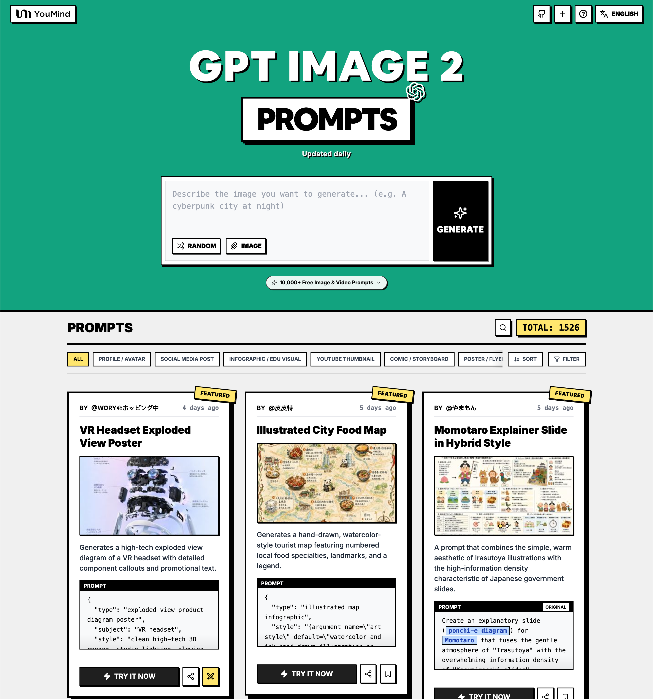

<a href="https://youmind.com/pt-BR/gpt-image-2-prompts">
  
</a>

> 💡 🎬 Take it further with **Seedance 2** — pair GPT Image 2 stills with Seedance for jaw-dropping AI videos, 2000+ prompts to explore 👉 [awesome-seedance-2-prompts](https://github.com/YouMind-OpenLab/awesome-seedance-2-prompts)
# 🚀 Prompts Incríveis do GPT Image 2

[](https://github.com/sindresorhus/awesome)
[](https://github.com/YouMind-OpenLab/awesome-gpt-image-2)
[](https://creativecommons.org/licenses/by/4.0/)
[](https://github.com/YouMind-OpenLab/awesome-gpt-image-2/actions)
[](docs/CONTRIBUTING.md)

> 🎨 Uma coleção curada de prompts criativos para o GPT Image 2 da OpenAI

> ⚠️ **Aviso de Direitos Autorais**: Todos os prompts são coletados da comunidade para fins educacionais. Se você acredita que algum conteúdo infringe seus direitos, por favor [abra uma issue](https://github.com/YouMind-OpenLab/awesome-gpt-image-2/issues/new?template=bug-report.yml) e nós o removeremos prontamente.

---

[](README.md) [](README_zh.md) [](README_zh-TW.md) [](README_ja-JP.md) [](README_ko-KR.md) [](README_th-TH.md) [](README_vi-VN.md) [](README_hi-IN.md) [](README_es-ES.md) [-Click%20to%20View-lightgrey)](README_es-419.md) [](README_de-DE.md) [](README_fr-FR.md) [](README_it-IT.md) [-Current-brightgreen)](README_pt-BR.md) [](README_pt-PT.md) [](README_tr-TR.md)

---

## 🌐 Ver na galeria web

<div align="center">

[](https://youmind.com/pt-BR/gpt-image-2-prompts)

</div>

**[👉 Navegar na galeria YouMind GPT Image 2](https://youmind.com/pt-BR/gpt-image-2-prompts)**

Por que usar nossa galeria?

| Feature | GitHub README | Galeria youmind.com |
|---------|--------------|---------------------|
| 🎨 Layout visual | Lista linear | Bela grade Masonry |
| 🔍 Buscar | Apenas Ctrl+F | Busca de texto completo com filtros |
| 🤖 Geração IA com um clique | - | Geração IA com um clique |
| 📱 Móvel | Básico | Totalmente responsivo |
| 🏷️ Categorias | - | Navegação por categoria |


### 🏷️ Explorar por categoria

- **Casos de Uso**
  - [Perfil / Avatar](https://youmind.com/pt-BR/gpt-image-2-prompts?categories=profile-avatar)
  - [Publicação em Mídias Sociais](https://youmind.com/pt-BR/gpt-image-2-prompts?categories=social-media-post)
  - [Infográfico / Edu Visual](https://youmind.com/pt-BR/gpt-image-2-prompts?categories=infographic-edu-visual)
  - [Miniatura do YouTube](https://youmind.com/pt-BR/gpt-image-2-prompts?categories=youtube-thumbnail)
  - [Quadrinhos / Storyboard](https://youmind.com/pt-BR/gpt-image-2-prompts?categories=comic-storyboard)
  - [Marketing de Produto](https://youmind.com/pt-BR/gpt-image-2-prompts?categories=product-marketing)
  - [Imagem Principal de E-commerce](https://youmind.com/pt-BR/gpt-image-2-prompts?categories=ecommerce-main-image)
  - [Ativo de Jogo](https://youmind.com/pt-BR/gpt-image-2-prompts?categories=game-asset)
  - [Pôster / Flyer](https://youmind.com/pt-BR/gpt-image-2-prompts?categories=poster-flyer)
  - [Design de Aplicativos / Web](https://youmind.com/pt-BR/gpt-image-2-prompts?categories=app-web-design)
- **Estilo**
  - [Fotografia](https://youmind.com/pt-BR/gpt-image-2-prompts?categories=photography)
  - [Cinematográfico / Imagem de Filme](https://youmind.com/pt-BR/gpt-image-2-prompts?categories=cinematic-film-still)
  - [Anime / Mangá](https://youmind.com/pt-BR/gpt-image-2-prompts?categories=anime-manga)
  - [Ilustração](https://youmind.com/pt-BR/gpt-image-2-prompts?categories=illustration)
  - [Esboço / Arte Linear](https://youmind.com/pt-BR/gpt-image-2-prompts?categories=sketch-line-art)
  - [Quadrinhos / Graphic Novel](https://youmind.com/pt-BR/gpt-image-2-prompts?categories=comic-graphic-novel)
  - [Renderização 3D](https://youmind.com/pt-BR/gpt-image-2-prompts?categories=3d-render)
  - [Chibi / Estilo Q](https://youmind.com/pt-BR/gpt-image-2-prompts?categories=chibi-q-style)
  - [Isométrico](https://youmind.com/pt-BR/gpt-image-2-prompts?categories=isometric)
  - [Pixel Art](https://youmind.com/pt-BR/gpt-image-2-prompts?categories=pixel-art)
  - [Pintura a Óleo](https://youmind.com/pt-BR/gpt-image-2-prompts?categories=oil-painting)
  - [Aquarela](https://youmind.com/pt-BR/gpt-image-2-prompts?categories=watercolor)
  - [Tinta / Estilo Chinês](https://youmind.com/pt-BR/gpt-image-2-prompts?categories=ink-chinese-style)
  - [Retrô / Vintage](https://youmind.com/pt-BR/gpt-image-2-prompts?categories=retro-vintage)
  - [Cyberpunk / Ficção Científica](https://youmind.com/pt-BR/gpt-image-2-prompts?categories=cyberpunk-sci-fi)
  - [Minimalismo](https://youmind.com/pt-BR/gpt-image-2-prompts?categories=minimalism)
- **Corpo principal**
  - [Retrato / Selfie](https://youmind.com/pt-BR/gpt-image-2-prompts?categories=portrait-selfie)
  - [Influenciador(a) / Modelo](https://youmind.com/pt-BR/gpt-image-2-prompts?categories=influencer-model)
  - [Personagem](https://youmind.com/pt-BR/gpt-image-2-prompts?categories=character)
  - [Grupo / Casal](https://youmind.com/pt-BR/gpt-image-2-prompts?categories=group-couple)
  - [Produto](https://youmind.com/pt-BR/gpt-image-2-prompts?categories=product)
  - [Alimentos / Bebidas](https://youmind.com/pt-BR/gpt-image-2-prompts?categories=food-drink)
  - [Item de Moda](https://youmind.com/pt-BR/gpt-image-2-prompts?categories=fashion-item)
  - [Animal / Criatura](https://youmind.com/pt-BR/gpt-image-2-prompts?categories=animal-creature)
  - [Veículo](https://youmind.com/pt-BR/gpt-image-2-prompts?categories=vehicle)
  - [Arquitetura / Interiores](https://youmind.com/pt-BR/gpt-image-2-prompts?categories=architecture-interior)
  - [Paisagem / Natureza](https://youmind.com/pt-BR/gpt-image-2-prompts?categories=landscape-nature)
  - [Paisagem Urbana / Rua](https://youmind.com/pt-BR/gpt-image-2-prompts?categories=cityscape-street)
  - [Diagrama / Gráfico](https://youmind.com/pt-BR/gpt-image-2-prompts?categories=diagram-chart)
  - [Texto / Tipografia](https://youmind.com/pt-BR/gpt-image-2-prompts?categories=text-typography)
  - [Resumo / Contexto](https://youmind.com/pt-BR/gpt-image-2-prompts?categories=abstract-background)

---

## 📖 Índice

- [🌐 Ver na galeria web](#-view-in-web-gallery)
- [🤔 O que é GPT Image 2?](#-what-is-gpt-image-2)
- [📊 Estatísticas](#-statistics)
- [🔥 Prompts em destaque](#-featured-prompts)
- [📋 Todos os prompts](#-all-prompts)
- [🤝 Como contribuir](#-how-to-contribute)
- [📄 Licença](#-license)
- [🙏 Agradecimentos](#-acknowledgements)
- [⭐ Histórico de estrelas](#-star-history)

---

## 🤔 O que é GPT Image 2?

**GPT Image 2** (codename **"duct-tape"**) is OpenAI's next-generation image model. Community testing highlights a leap in these areas:

- 🎯 **Pixel-Perfect Text Rendering** — Native-quality text in Chinese, English, and Japanese, no typos or warped glyphs
- 🎨 **Cross-Image Consistency** — The same character, style, or IP stays identical across a series, down to the pixel
- ⚡ **Commercial-Grade Illustration** — Illustration output is ready to ship without manual polish
- 🌈 **True Art Style Induction** — Creatively evokes the feeling of a style rather than merely approximating references
- 🔧 **Storyboard & Product Series** — Ideal for storyboards, IP characters, and multi-panel product visuals
- 📐 **Multi-Language Design** — Social cards, banners, and posters with accurate multilingual typography in one shot

📚 **Learn More:** See community testing in our [report summary](docs/FAQ.md)

### 🚀 Integração com Raycast

Alguns prompts suportam **argumentos dinâmicos** usando a sintaxe [Raycast Snippets](https://raycast.com/help/snippets). Procure o emblema 🚀 Raycast Friendly!

**Exemplo:**
```
A quote card with "{argument name="quote" default="Stay hungry, stay foolish"}"
by {argument name="author" default="Steve Jobs"}
```

Quando usado no Raycast, você pode substituir dinamicamente os argumentos para iterações rápidas!

---

## 📊 Estatísticas

<div align="center">

| Métrica | Contagem |
|--------|-------|
| 📝 Total de prompts | **4430** |
| ⭐ Destaque | **6** |
| 🔄 Última atualização | **quarta-feira, 6 de maio de 2026 às 01:50:14 UTC** |

</div>

---

## 🔥 Prompts em destaque

> ⭐ Selecionados à mão pela nossa equipe por qualidade e criatividade excepcionais

### No. 1: Pôster de Vista Explodida de Headset VR


#### 📖 Descrição

Gera um diagrama de vista explodida de alta tecnologia de um headset VR com legendas detalhadas dos componentes e texto promocional.

#### 📝 Prompt

```
{
  "type": "pôster de diagrama de produto em vista explodida",
  "subject": "headset VR",
  "style": "renderização 3D limpa de alta tecnologia, iluminação de estúdio, detalhes brilhantes",
  "background": "{argument name=\"background color\" default=\"gradiente suave de roxo e azul\"}",
  "header": {
    "logo": "∞ {argument name=\"product name\" default=\"Meta Quest 3\"}",
    "subtitle": "{argument name=\"main catchphrase\" default=\"Uma realidade totalmente nova, a partir de uma estrutura totalmente nova.\"}"
  },
  "layout": {
    "centerpiece": "vista explodida verticalmente empilhada de um headset VR mostrando 9 camadas distintas de componentes internos: carcaça externa, sensores de câmera, placa-mãe com chip, lentes pancake, estrutura interna, baterias, tiras laterais, tira superior e almofada de interface facial.",
    "callout_labels": {
      "count": 8,
      "left_side": [
        "Snapdragon® XR2 Gen 2\nDesempenho de processamento impressionante para experiências em tempo real.",
        "Mecanismo de IPD ajustável\nAjuste confortável para uma ampla gama de usuários.",
        "Head strap de design preciso\nErgonomia focada em conforto e estabilidade."
      ],
      "right_side": [
        "Faceplate\nDesign sofisticado e equilíbrio de peso ideal.",
        "Câmeras de rastreamento\nRastreamento de posição de alta precisão e reconhecimento de ambiente.",
        "Lentes pancake\nDesign fino que oferece amplo campo de visão e imagens nítidas.",
        "Bateria de alto desempenho\nDesign de energia otimizado para longas horas de uso.",
        "Interface facial macia\nConforto garantido mesmo durante longos períodos de uso."
      ]
    },
    "footer": {
      "left_text_block": {
        "headline": "{argument name=\"bottom headline\" default=\"A experiência evolui a partir da estrutura.\"}",
        "body": "Cada peça contém tecnologia de ponta e um design meticuloso que sustenta a experiência imersiva. O Meta Quest 3 cria experiências que parecem vir do futuro, a partir de seu interior."
      },
      "right_logo": "∞ Meta"
    }
  }
}
```

#### 🖼️ Imagens geradas

##### Image 1

<div align="center">

</div>

#### 📌 Detalhes

- **Autor:** [wory＠ホッピング中](https://x.com/wory37303852)
- **Fonte:** [Twitter Post](https://x.com/wory37303852/status/2045925660401795478#reversed-0)
- **Publicado:** 19 de abril de 2026
- **Idiomas:** en

**[👉 Experimente agora →](https://youmind.com/pt-BR/gpt-image-2-prompts?id=13460)**

---

### No. 2: Mapa Gastronômico Ilustrado da Cidade


#### 📖 Descrição

Gera um mapa turístico desenhado à mão, em estilo aquarela, apresentando especialidades gastronômicas locais numeradas, pontos turísticos e uma legenda.

#### 📝 Prompt

```
{
  "type": "infográfico de mapa ilustrado",
  "style": "{argument name=\"art style\" default=\"ilustração feita à mão em aquarela e nanquim sobre pergaminho vintage\"}",
  "title_section": {
    "text": "{argument name=\"city name\" default=\"Chengdu\"} {argument name=\"map title\" default=\"Mapa do Comilão\"}",
    "mascot": "pimenta vermelha de desenho animado usando óculos escuros e fazendo sinal de positivo"
  },
  "border": "{argument name=\"border decoration\" default=\"videira de folhas verdes e pimentas vermelhas\"}",
  "layout": {
    "background": "papel pergaminho bege texturizado com estradas amarelas, rios azuis e áreas de parques verdes",
    "sections": [
      {
        "title": "pontos turísticos",
        "count": 6,
        "illustrations": ["pavilhão tradicional", "mosteiro tradicional", "arranha-céu moderno com panda escalando", "torre de TV alta", "portão tradicional", "edifícios industriais"],
        "labels": ["Parque Renmin", "Mosteiro Wenshu", "IFS", "Torre de TV 339", "Kuanzhai Alley", "Dongjiao Memory"]
      },
      {
        "title": "locais de comida",
        "count": 12,
        "illustrations": ["mapo tofu", "dumplings no óleo de pimenta", "espetinhos na panela", "bolinhos de arroz glutinoso", "bolo assado de ovo", "hotpot de nove grelhas", "macarrão de batata-doce", "espetinhos frios", "prato misto apimentado", "xícara de chá com tampa", "sobremesa de geleia de gelo", "cabeças de coelho apimentadas"],
        "labels": ["1 Chen Mapo Tofu", "2 Zhong Dumplings", "3 Chunxi Road", "4 Kuanzhai Alley · San Da Pao", "5 Jianshe Road · Ye Popo Egg Cake", "6 Yulin Road · Xiaolongkan Hotpot", "7 Xiangxiang Alley · Feichang Fen", "8 Wuhouci Street · Boboji", "9 Dongjiao Memory · Maojiao Hula", "10 Parque Renmin · Hemin Teahouse", "11 Rua Antiga Jinli · Bingfen", "12 Shuangliu Laoma Rabbit Head"]
      },
      {
        "title": "legenda",
        "position": "bottom-right",
        "count": 5,
        "items": ["ponto vermelho", "casa verde", "árvore verde", "linha azul", "linha dupla amarela"],
        "labels": ["Locais gastronômicos", "Pontos turísticos", "Parques e áreas verdes", "Rios e lagos", "Vias principais"]
      }
    ],
    "centerpiece": "panda gigante sentado comendo bambu",
    "bottom_right_extras": ["rosa dos ventos vintage com N, S, L, O", "texto de aviso 'Dica: Cuidado com a pimenta, proteja seu estômago~' com um ícone de pimenta vermelha"]
  }
}
```

#### 🖼️ Imagens geradas

##### Image 1

<div align="center">

</div>

#### 📌 Detalhes

- **Autor:** [皮皮特](https://x.com/mm_zzm44854)
- **Fonte:** [Twitter Post](https://x.com/mm_zzm44854/status/2045861258520568230#reversed-1)
- **Publicado:** 19 de abril de 2026
- **Idiomas:** en

**[👉 Experimente agora →](https://youmind.com/pt-BR/gpt-image-2-prompts?id=13515)**

---

### No. 3: Slide explicativo do Momotaro em estilo híbrido


#### 📖 Descrição

Um prompt que combina a estética simples e acolhedora das ilustrações Irasutoya com a alta densidade de informações característica dos slides do governo japonês.

#### 📝 Prompt

```
Crie um slide explicativo ({argument name="format" default="diagrama ponchi-e"}) para {argument name="theme" default="Momotaro"} que funde a atmosfera suave do "Irasutoya" com a densidade de informações impressionante dos "slides de Kasumigaseki".
```

#### 🖼️ Imagens geradas

##### Image 1

<div align="center">

</div>

##### Image 2

<div align="center">

</div>

#### 📌 Detalhes

- **Autor:** [やまもん](https://x.com/yammamon)
- **Fonte:** [Twitter Post](https://x.com/yammamon/status/2045778624092254603)
- **Publicado:** 19 de abril de 2026
- **Idiomas:** ja

**[👉 Experimente agora →](https://youmind.com/pt-BR/gpt-image-2-prompts?id=13983)**

---

### No. 4: Mockup de Interface de Live Stream para E-commerce


#### 📖 Descrição

Gera uma interface de transmissão ao vivo em redes sociais realista sobreposta a um retrato, apresentando mensagens de chat personalizáveis, pop-ups de presentes e um cartão de compra de produto.

#### 📝 Prompt

```
{
  "type": "mockup de interface de live stream",
  "subject": {
    "description": "retrato de {argument name=\"host name\" default=\"Elon Musk\"}, sorrindo, vestindo uma camiseta preta com um gráfico de esquema técnico em branco",
    "background": "o lado esquerdo mostra uma tela com o texto '{argument name=\"left background logo\" default=\"SPACEX\"}', o lado direito mostra um '{argument name=\"right background logo\" default=\"logotipo T da Tesla\"}' vermelho e um carro escuro"
  },
  "ui_overlay": {
    "top_header": {
      "host_info": "avatar, nome '{argument name=\"host name\" default=\"Elon Musk\"}', subtexto '556 mil curtidas na live', botão vermelho 'Seguir'",
      "rank_badge": "ícone de moeda dourada com '1º lugar geral'",
      "viewer_stats": "3 avatares de espectadores principais com '123 mil', '86 mil', '57 mil', total '687 mil', botão de fechar 'X'",
      "right_links": "'Mais lives >', 'Galeria de presentes 0/24' com etiqueta azul 'Clássico'"
    },
    "mid_left_gifts": {
      "count": 2,
      "items": [
        "avatar 'Entusiasta de Tecnologia', 'enviou um coração', ícone de coração x 1314",
        "avatar 'Mar de Estrelas', 'enviou um foguete', ícone de foguete x 666"
      ]
    },
    "bottom_left_chat": {
      "system_message": "emblema de nível 37 'Viajante do Universo entrou na live'",
      "message_count": 7,
      "messages": [
        "Pequeno Foguete: Musk! O futuro é promissor! 🚀",
        "future: Quando sai o Tesla Model 2?",
        "Sonhador do Espaço: A SpaceX consegue chegar a Marte este ano?",
        "Explorador de IA: Como está o progresso da Neuralink?",
        "Usuário Legal: Olá, Sr. Musk!",
        "Mars: Primeira vez na sua live, super empolgado!",
        "Usuário123: Fale sobre IA, ela vai substituir os humanos?"
      ]
    },
    "bottom_right_product_card": {
      "hot_tag": "laranja 'Mais vendido x 1888'",
      "image": "Tesla Cybertruck",
      "title": "{argument name=\"product name\" default=\"Picape Elétrica Tesla Cybertruck\"}",
      "price": "{argument name=\"product price\" default=\"R$ 1.618.000\"}",
      "button": "botão vermelho 'Comprar'",
      "floating_animation": "corações translúcidos flutuando pela borda direita"
    },
    "bottom_bar": {
      "input_field": "'Diga algo...'",
      "icons": ["rosto sorridente", "três pontos", "carrinho de compras", "caixa de presente", "compartilhar"]
    }
  }
}
```

#### 🖼️ Imagens geradas

##### Image 1

<div align="center">

</div>

#### 📌 Detalhes

- **Autor:** [神经病不想好转](https://x.com/sjbbxhz)
- **Fonte:** [Twitter Post](https://x.com/sjbbxhz/status/2045684734714380687#reversed-0)
- **Publicado:** 19 de abril de 2026
- **Idiomas:** en

**[👉 Experimente agora →](https://youmind.com/pt-BR/gpt-image-2-prompts?id=14036)**

---

### No. 5: Batalha de Artes Marciais em Estilo Anime


#### 📖 Descrição

Gera uma cena de ação dinâmica em estilo anime de dois personagens lutando com auras elementais em um dojo tradicional.

#### 📝 Prompt

```
Uma ilustração de anime altamente dinâmica de duas garotas envolvidas em uma batalha feroz de artes marciais dentro de um dojo de madeira tradicional. Em primeiro plano, uma garota com {argument name="character 1 hair" default="cabelo preto em um coque alto com fitas vermelhas"} assume uma postura de artes marciais poderosa e baixa, golpeando com o punho para frente. Ela veste um {argument name="character 1 outfit" default="top estilo chinês branco com borlas vermelhas e calças vermelhas largas"}, com intensos cortes de energia vermelha girando ao redor de seus membros. No ar, à direita, uma garota com {argument name="character 2 hair" default="cabelo roxo claro em dois coques"} salta graciosamente, sorrindo com confiança enquanto veste um {argument name="character 2 outfit" default="vestido verde escuro com bordados dourados e meia-calça preta"}, acompanhada por rastros de energia azul semelhantes a água. O fundo apresenta o interior de um templo de madeira rústico com uma placa suspensa proeminente exibindo "{argument name="sign text" default="武術会"}". A cena é repleta de ação explosiva, poeira voando, tábuas de madeira estilhaçadas, efeitos de partículas coloridas brilhantes e uma iluminação dramática de ângulo baixo que separa perfeitamente os personagens do fundo detalhado.
```

#### 🖼️ Imagens geradas

##### Image 1

<div align="center">

</div>

#### 📌 Detalhes

- **Autor:** [たねもみ 2.0 / Tanemomi Ver2.0](https://x.com/Tanemomi_Ver2)
- **Fonte:** [Twitter Post](https://x.com/Tanemomi_Ver2/status/2046063806846214265#reversed-0)
- **Publicado:** 20 de abril de 2026
- **Idiomas:** en

**[👉 Experimente agora →](https://youmind.com/pt-BR/gpt-image-2-prompts?id=13467)**

---

### No. 6: Infográfico da Evolução em Escadaria de Pedra 3D


#### 📖 Descrição

Transforma uma linha do tempo evolutiva plana em um infográfico realista de escadaria de pedra 3D com renderizações detalhadas de organismos e painéis laterais estruturados.

#### 📝 Prompt

```
{
  "type": "infográfico de linha do tempo evolutiva",
  "instruction": "Usando REFERENCE_0 como base estrutural, transforme o design vetorial plano em um infográfico 3D altamente realista. Substitua as rampas lisas por degraus de pedra distintos e atualize todos os organismos para modelos 3D fotorrealistas.",
  "style": {
    "background": "{argument name=\"estilo de fundo\" default=\"papel pergaminho texturizado vintage\"}",
    "staircase": "{argument name=\"material da escadaria\" default=\"blocos de pedra texturizados realistas\"}",
    "subjects": "{argument name=\"estilo do organismo\" default=\"renderizações 3D fotorrealistas altamente detalhadas\"}"
  },
  "layout": {
    "main_title": "{argument name=\"título principal\" default=\"Evolução Humana\"}",
    "sections": [
      {
        "position": "barra lateral esquerda",
        "count": 8,
        "labels": ["L0: Vida unicelular", "L1: Organismos multicelulares", "L2: Reino animal", "L3: Cordados", "L4: Revolução terrestre", "L5: Classe Mammalia", "L6: Evolução dos hominídeos", "L7: Era do Homo sapiens"]
      },
      {
        "position": "superior direito",
        "title": "Funções ganhas / Funções perdidas",
        "description": "Legenda com ícones de mais e menos"
      },
      {
        "position": "centro inferior",
        "title": "Marcos evolutivos principais",
        "count": 6,
        "description": "Linha do tempo com um gráfico de silhueta de 6 figuras mostrando a evolução do macaco ao humano"
      }
    ],
    "centerpiece": {
      "description": "Escadaria de pedra em espiral com 25 degraus numerados apresentando organismos específicos.",
      "count": 25,
      "notable_elements": [
        "Degrau 07: Água-viva",
        "Degrau 09: Amonita",
        "Degrau 10: Trilobita",
        "Degrau 24: Humano caminhando",
        "Degrau 25: {argument name=\"conceito de evolução futura\" default=\"silhueta cósmica brilhante com um ponto de interrogação\"}"
      ]
    }
  }
}
```

#### 🖼️ Imagens geradas

##### Image 1

<div align="center">

</div>

#### 📌 Detalhes

- **Autor:** [知识猫图解](https://x.com/GeekCatX)
- **Fonte:** [Twitter Post](https://x.com/GeekCatX/status/2045792240044511277#reversed-1)
- **Publicado:** 19 de abril de 2026
- **Idiomas:** en

**[👉 Experimente agora →](https://youmind.com/pt-BR/gpt-image-2-prompts?id=13491)**

---

## 📋 Todos os prompts

> 📝 Ordenado por data de publicação (mais recente primeiro)

### No. 1: Perfil / Avatar - Série de Fotos de Verão: Garota com Uvas


#### 📖 Descrição

Um prompt projetado para gerar uma grade 3x3 de retratos com tema de verão, apresentando uma garota com uvas e mantendo a consistência facial a partir de fotos de referência.

#### 📝 Prompt

```
Com base em 1 a 3 fotos pessoais nítidas enviadas pelo usuário, gere um quebra-cabeça de fotos em grade 3x3 com o tema "{argument name="photo theme" default="Série de Fotos de Verão: Garota com Uvas"}".

Preserve rigorosamente as características reais de identidade do sujeito, incluindo formato do rosto, proporções faciais, estrutura dos olhos/sobrancelhas, nariz, lábios, tom de pele, idade, características do penteado e temperamento geral. A pessoa em todas as nove imagens deve parecer claramente a mesma garota real; ela não deve se tornar uma estranha, parecer ocidentalizada, parecer uma influenciadora genérica, ser excessivamente embelezada ou ter um rosto gerado por IA.

O tema geral é um retrato fresco e natural de uma garota no dia a dia. A personagem veste um {argument name="clothing description" default="vestido leve ou vestido de alças em tom branco cremoso ou off-white"} e um {argument name="accessory" default="lenço de cabeça floral vintage roxo"}. O visual geral é limpo, natural e cotidiano, com uma vibe de garota de verão. Os acessórios são simples, como brincos pequenos, sem serem excessivamente ornamentados.

Defina a cena como um retrato de piquenique de verão em um prado ao ar livre, sob a sombra de árvores ou perto de um vinhedo. Inclua elementos como uvas roxas, cachos de uva, cestas de vime, garrafas de vidro, toalhas de piquenique e louças de cores claras para criar uma sensação de estilo de vida natural. A luz do sol filtra-se através das folhas, criando sombras suaves e manchadas, com um fundo naturalmente desfocado.

Projete a imagem final como uma grade 3x3 com bordas brancas. Todas as nove fotos pequenas devem apresentar a mesma pessoa, a mesma roupa e a mesma cena, mas cada uma deve ser distintamente diferente: expressões diferentes, ângulos faciais diferentes, poses diferentes, posições de câmera diferentes e composições diferentes (plano aberto vs. close-up). Não faça apenas nove variações leves do mesmo ângulo.

As nove fotos podem mostrar: segurando uvas e sorrindo, deitada na grama olhando para a câmera, segurando uma uva perto da boca, organizando a cesta, sentada imóvel olhando para frente, um close-up de uma uva contra a bochecha, um clique espontâneo virando o rosto, cheirando as uvas com os olhos fechados e deitada na grama segurando a cesta. As expressões devem ser variadas, incluindo tranquila, brincalhona, gentil, sorrindo com os olhos fechados, sonhando acordada naturalmente e risadas espontâneas.

O estilo é de textura de câmera Fujifilm, estilo de fotografia de filme japonês, sensação de fotografia realista, luz natural suave, profundidade de campo rasa, leve granulação de filme e tons naturais frescos. As uvas roxas devem ser o foco visual. A imagem é limpa, duradoura e transmite uma sensação de vida e juventude.

Evite: rostos ocidentais, rostos de influenciadores, embelezamento excessivo, pele de plástico, rostos falsos, expressões repetitivas, ângulos repetitivos, deformidades nas mãos, adereços distorcidos, fundos bagunçados, estilo de estúdio, estilo de ilustração ou sensação de computação gráfica (CG).
```

#### 🖼️ Imagens geradas

##### Image 1

<div align="center">

</div>

#### 📌 Detalhes

- **Autor:** [麻酱AI实验室](https://x.com/zhongying14)
- **Fonte:** [Twitter Post](https://x.com/zhongying14/status/2051425501755977794)
- **Publicado:** 4 de maio de 2026
- **Idiomas:** zh

**[👉 Experimente agora →](https://youmind.com/pt-BR/gpt-image-2-prompts?id=18346)**

---

### No. 2: Perfil / Avatar - Retrato em Grade 3x3 de Garota Uva de Verão


#### 📖 Descrição

Um prompt abrangente para criar uma grade de fotos 3x3 de uma 'Garota Uva' com tema de verão, com instruções específicas para consistência e estilo.

#### 📝 Prompt

```
# Série de Fotos Garota Uva de Verão | Prompt de Grade 3x3

Com base em **1-3 fotos pessoais nítidas** enviadas pelo usuário, gere um **quebra-cabeça de fotos em grade 3x3** com o tema **"{argument name="photo theme" default="Série de Fotos Garota Uva de Verão"}"**.

---

## 1. Requisitos da Personagem

Preserve rigorosamente as características de identidade real do usuário, incluindo, mas não se limitando a:

- Formato do rosto
- Proporções faciais
- Estrutura dos olhos e sobrancelhas
- Formato do nariz
- Formato dos lábios
- Tom de pele
- Aparência da idade
- Características do penteado
- Temperamento geral

A pessoa nas nove fotos pequenas finais deve parecer claramente a **mesma garota real**; ela não deve se tornar uma estranha, parecer ocidentalizada, parecer uma influenciadora genérica, ser embelezada demais ou ter um rosto gerado por IA.
A consistência da identidade da pessoa deve ser mantida em todas as fotos.

---

## 2. Definição do Tema

O tema de todo o conjunto é **"Série de Fotos Garota Uva"**, com uma atmosfera que seja:

- Fresca
- Natural
- Leve e doce
- Vibe juvenil cotidiana
- Sensação de verão ao ar livre
- Um toque de estilo de retrato de filme japonês
- Que ainda se pareça com um conjunto de fotos de estilo de vida de alta qualidade tiradas por uma garota comum, em vez de uma fotografia de estúdio exagerada.

---

## 3. Configurações de Estilo

Vestuário da personagem:

- **{argument name="clothing style" default="Vestido branco cremoso / off-white ou vestido tipo slip dress"}**, material macio, vibe natural e juvenil.
- Usando um **{argument name="headwear accessory" default="lenço de cabeça floral vintage roxo"}** na cabeça, em tons de roxo suave como roxo claro, roxo uva ou roxo nebuloso.
- Pode ser combinado com brincos pequenos e simples; os acessórios gerais não devem ser complexos ou excessivamente elegantes.

O visual geral deve ser natural, limpo e parecer um retrato de uma garota comum, não excessivamente polido ou como um anúncio comercial.

---

## 4. Configurações de Cenário

O cenário é um **piquenique em gramado ao ar livre no verão / perto de um vinhedo / sob a sombra de árvores**.

Inclua os seguintes elementos na imagem:

- Uvas roxas
- Cachos de uva
- Cestas de vime
- Toalhas de piquenique
- Garrafas de vidro
- Pratos brancos ou utensílios de cores claras
- Grama, sombras de árvores, luz solar natural
- Arranjos mínimos de mesa ou piquenique

O fundo deve ser suavemente desfocado, com uma atmosfera natural e realista apresentando luz difusa da luz solar passando pelas folhas.

---

## 5. Requisitos da Grade 3x3

O resultado é uma **colagem em grade 3x3**, separada por bordas brancas.

As nove fotos devem apresentar a **mesma pessoa, a mesma roupa e o mesmo tema/cenário**, mas cada uma deve ter diferenças distintas em:

- Ângulos faciais
- Poses
- Distâncias da câmera
- Posições da câmera
- Expressões
- Movimentos das mãos
- Métodos de composição

### Requisitos Principais

- Não faça o rosto ficar voltado para a mesma direção em todas as nove fotos.
- Não tenha expressões quase idênticas nas nove fotos.
- Não tenha apenas pequenas variações.

Deve parecer um conjunto de fotos espontâneas de bastidores capturadas continuamente durante uma sessão de fotos real.

---

## 6. Sugestões de Pose para as Nove Fotos

As nove fotos podem incluir os seguintes estados diferentes:

1. Sentada perto da toalha de piquenique, segurando um cacho de uvas roxas com as duas mãos, olhos fechados e sorrindo.
2. Deitada na grama, cabeça levemente inclinada, olhando para a câmera com uvas espalhadas por perto.
3. Segurando uma única uva perto da boca, olhando para a câmera com uma expressão divertida.
4. Foto de meio corpo de lado, olhando para baixo naturalmente enquanto organiza as uvas na cesta de vime.
5. Pose sentada de frente com uvas, garrafas de vidro e uma cesta à frente; expressão calma.
6. Close-up, segurando uma uva contra a bochecha com um sorriso relaxado.
7. Virando-se levemente, segurando um cacho de uvas com uma expressão espontânea natural.
8. Olhos fechados, cheirando ou inclinando-se perto das uvas, parecendo relaxada e feliz.
9. Reclinada na grama ou sob uma árvore, segurando a cesta de vime, olhando para a câmera com um olhar gentil.

---

## 7. Estilo de Fotografia

O estilo geral é:

- Textura de câmera Fujifilm
- Estilo de fotografia de filme japonês
- Luz natural suave
- Leve granulação de filme
- Profundidade de campo rasa
- Sensação de filmagem realista
- Tons frescos de verão
- Uvas roxas como foco visual
- Imagens limpas com um senso de vida e jovialidade.

---

## 8. Requisitos Visuais

- Fotografia de retrato de alta fidelidade
- Textura de pele natural
- Sem pele de plástico
- Sem suavização excessiva
- Sem embelezamento exagerado
- Sem nitidez excessiva
- Sem sensação de desenho animado
- Sem sensação de ilustração
- Sem sensação de computação gráfica (CG)
- Sem aparência de fotografia de estúdio barata
```

#### 🖼️ Imagens geradas

##### Image 1

<div align="center">

</div>

#### 📌 Detalhes

- **Autor:** [麻酱AI实验室](https://x.com/zhongying14)
- **Fonte:** [Twitter Post](https://x.com/zhongying14/status/2051424745716125926)
- **Publicado:** 4 de maio de 2026
- **Idiomas:** zh

**[👉 Experimente agora →](https://youmind.com/pt-BR/gpt-image-2-prompts?id=18345)**

---

### No. 3: Perfil / Avatar - Transformação em Nuvem Atmosférica


#### 📖 Descrição

Um prompt de imagem etéreo que transforma o rosto de um sujeito em uma composição de nuvem suave e atmosférica dentro de um céu azul límpido.

#### 📝 Prompt

```
Transforme {argument name="subject" default="[digite aqui]"} em uma composição de nuvem suave e atmosférica, preservando as características faciais, a expressão e a identidade reconhecíveis do sujeito.
O rosto deve parecer sutilmente formado por nuvens, misturando-se naturalmente a um fundo de céu azul brilhante. Use iluminação suave e difusa com reflexos delicados e sombras etéreas para criar profundidade e realismo.
Garanta que a transformação seja simbólica em vez de literal — evite bordas rígidas, textura de pele ou detalhes nítidos. O sujeito deve parecer estar emergindo ou se dissolvendo nas nuvens.
Mantenha as proporções faciais, olhos, sorriso e características principais claramente visíveis através da estrutura de nuvens.
Estilo: sonhador, etéreo, surreal, cinematográfico
Iluminação: luz solar natural, brilho suave, luz volumétrica
Paleta de cores: azul celeste, branco, gradientes suaves
Humor: pacífico, edificante, inspirador
Adicione camadas sutis de nuvens ao redor e dentro do rosto para uma mistura perfeita. O fundo deve ser um céu azul limpo com gradientes de nuvens suaves.
Alta resolução, textura de nuvem ultrarrealista, mistura suave, sem texto, sem marca d'água.
```

#### 🖼️ Imagens geradas

##### Image 1

<div align="center">

</div>

##### Image 2

<div align="center">

</div>

#### 📌 Detalhes

- **Autor:** [Rossy](https://x.com/xRahultripathi)
- **Fonte:** [Twitter Post](https://x.com/xRahultripathi/status/2051423866355085679)
- **Publicado:** 4 de maio de 2026
- **Idiomas:** en

**[👉 Experimente agora →](https://youmind.com/pt-BR/gpt-image-2-prompts?id=18320)**

---

### No. 4: Perfil / Avatar - Avatar de Artista de Anime Censurado


#### 📖 Descrição

Gera um retrato estiloso de um jovem artista em estilo anime techwear segurando uma caneta, ideal para ícones de perfil ou artes de avatar para redes sociais.

#### 📝 Prompt

```
Crie uma ilustração dinâmica de painel único em estilo anime de um jovem estiloso com {argument name="hair color" default="cabelo preto com leves reflexos roxos"} volumoso e bagunçado, exibido da cintura para cima em um fundo branco limpo. Seu rosto é intencionalmente coberto por um grande quadrado centralizado de privacidade com um gradiente suave de cinza escuro para quente, obscurecendo todos os traços faciais. Ele alcança o espectador com uma mão em forte perspectiva de encurtamento, segurando uma caneta ou stylus preta elegante entre os dedos como se estivesse desenhando no ar. Vista-o com uma jaqueta techwear oversized brilhante de cor {argument name="jacket color" default="branca"} sobre uma camisa preta e um moletom com capuz, com tiras, fivelas, zíperes, forro preto e vários colares de corrente prateada com pequenos pingentes visíveis. Adicione anéis prateados finos em seus dedos estendidos. Use traços energéticos de esboço, renderização de anime semirrealista, alto detalhamento no cabelo e na mão, toques suaves de lavanda e rosa pálido, e uma atmosfera urbana de ficção científica. Cerque-o com rabiscos feitos à mão e marcas de design abstrato: exatamente 1 pequeno planeta com anéis perto do canto superior esquerdo, 1 raio rosa perto do canto superior direito, 2 poliedros geométricos em wireframe perto das bordas inferior esquerda e direita, vários pequenos brilhos de estrela, pontos pretos espalhados, respingos de tinta diagonais e linhas de conexão semelhantes a constelações. A composição deve parecer um avatar de artista digital moderno ou uma ilustração de perfil, com a ponta da caneta e a mão mais próximas da câmera, contraste nítido em preto e branco, texturas de esboço de mangá soltas e sem texto.
```

#### 🖼️ Imagens geradas

##### Image 1

<div align="center">

</div>

#### 📌 Detalhes

- **Autor:** [ヤノ(Ryuki_Yano)](https://x.com/Ryuki_Yano)
- **Fonte:** [Twitter Post](https://x.com/Ryuki_Yano/status/2051414820273201644#reversed-0)
- **Publicado:** 4 de maio de 2026
- **Idiomas:** en

**[👉 Experimente agora →](https://youmind.com/pt-BR/gpt-image-2-prompts?id=18407)**

---

### No. 5: Perfil / Avatar - Retrato Minimalista para Marca Pessoal


#### 📖 Descrição

Este prompt gera um retrato 8K ultra-realista de alta qualidade de uma pessoa estilosa posando contra um fundo minimalista, complementado por um gráfico vetorial estilizado e tipografia personalizada para um visual de marca profissional.

#### 📝 Prompt

```
Retrato de corpo inteiro em 8K ultra-realista de {argument name="subject description" default="um jovem estiloso encostado casualmente em uma parede cinza-clara limpa"}. Ele está vestindo {argument name="outfit" default="um suéter gola V amarelo mostarda com detalhes listrados em preto e branco na gola e nos punhos, calça preta slim, meias cor de mostarda e tênis pretos com solado branco"}. Mãos nos bolsos, uma perna cruzada sobre a outra, pose relaxada e confiante. O homem tem uma barba bem cuidada e cabelo volumoso e estilizado, com um visual nítido e natural. Na parede ao lado dele, crie um retrato vetorial estilizado em preto e branco do mesmo homem com elementos geométricos modernos. Abaixo do gráfico, adicione um texto limpo e em negrito: '{argument name="name" default="Fatima Batool"}' em letras grandes e, abaixo, 'Twitter: @Fati_092' em letras menores. Iluminação: suave, uniforme, com qualidade de estúdio profissional. Estilo: moderno, minimalista, estética premium de marca pessoal.
```

#### 🖼️ Imagens geradas

##### Image 1

<div align="center">

</div>

#### 📌 Detalhes

- **Autor:** [Fatima Batool✨](https://x.com/Fati_092)
- **Fonte:** [Twitter Post](https://x.com/Fati_092/status/2051395928788222153)
- **Publicado:** 4 de maio de 2026
- **Idiomas:** en

**[👉 Experimente agora →](https://youmind.com/pt-BR/gpt-image-2-prompts?id=18365)**

---

### No. 6: Perfil / Avatar - Retrato de Idol Coreana com Estilo 'Cool Beauty'


#### 📖 Descrição

Um prompt de fotografia editorial altamente detalhado para uma idol coreana com uma estética sofisticada de 'mulher poderosa' em um cenário minimalista.

#### 📝 Prompt

```
Retrato vertical em alta definição, fotografia editorial realista de uma {argument name="subject" default="jovem idol coreana"} com uma aura elegante, madura e de "beleza fria", traços faciais refinados, cabelo curto e volumoso na cor preta com mechas suaves e soltas, e maquiagem com lábios vermelhos polidos. Ela está sentada em uma pose relaxada e graciosa, com as pernas cruzadas em um sofá de couro preto, segurando um chicote em uma das mãos. Sua postura é aberta, equilibrada e naturalmente confiante, com uma linha corporal saudável e elegante. Traje: um {argument name="outfit" default="blazer estruturado preto oversized, uma camisa branca de colarinho e uma gravata preta"}, combinado com uma saia curta preta. O estilo é sofisticado, inspirado em escritório e moderno, com uma forte estética de "mulher poderosa". Acessórios de anéis minimalistas adicionam um toque sutil e refinado. Cenário: um ambiente de retrato interno moderno e minimalista com um sofá de couro preto, arte de parede emoldurada e um terno pendurado na parede. O fundo é limpo, sofisticado, minimalista e estilizado como um set de revista de moda. Iluminação e atmosfera: iluminação cinematográfica escura, contraluz lateral que contorna sua silhueta, forte contraste entre luz e sombra, atmosfera de tons frios, textura rica de filme retrô, melancólica e imersiva. A textura da pele é delicada e translúcida, os fios de cabelo são nítidos e definidos, e as texturas do tecido da roupa, da saia curta e da câmera vintage são renderizadas com detalhes realistas. Estilo: retrato de revista de moda executiva madura de alto padrão, retrato humano realista, 8K ultra detalhado, qualidade visual premium, extremamente detalhado, natural e verossímil, sem imperfeições de IA, esteticamente refinado, de bom gosto e totalmente seguro para a plataforma. Adicione um pequeno texto de assinatura manuscrita em branco "{argument name="signature" default="BubbleBrain"}" no canto inferior direito
```

#### 🖼️ Imagens geradas

##### Image 1

<div align="center">

</div>

#### 📌 Detalhes

- **Autor:** [BubbleBrain](https://x.com/BubbleBrain)
- **Fonte:** [Twitter Post](https://x.com/BubbleBrain/status/2051395269246480722)
- **Publicado:** 4 de maio de 2026
- **Idiomas:** en

**[👉 Experimente agora →](https://youmind.com/pt-BR/gpt-image-2-prompts?id=18298)**

---

### No. 7: Perfil / Avatar - Garota de anime loira com sorvete


#### 📖 Descrição

Gera um retrato de anime em tons pastéis em um café, mostrando uma garota de cabelos longos segurando uma casquinha de sorvete de baunilha com o rosto oculto por um bloco de censura quadrado.

#### 📝 Prompt

```
Crie uma ilustração de anime suave e altamente detalhada de uma jovem fofa sentada em um café ao ar livre em um dia ensolarado, exibida em um retrato de close-up da parte superior do corpo a partir de um ângulo ligeiramente elevado. O rosto dela é intencionalmente coberto por um bloco de censura quadrado sólido centralizado em um tom de pele pêssego quente, obscurecendo os olhos, nariz e boca, enquanto deixa o cabelo, orelhas, pescoço, roupas e o sorvete visíveis. Ela tem cabelos muito longos e fluidos {argument name="hair color" default="loiro mel pálido"} com fios individuais finos, franja solta, reflexos brilhantes e iluminação de fundo quente. Ela veste um traje feminino de primavera: um cardigã off-white sobre uma blusa branca com babados, pequenos bordados florais pálidos e uma alça de ombro marrom fina cruzando diagonalmente. Ela segura uma casquinha de sorvete de baunilha perto da boca com uma das mãos; a casquinha tem uma embalagem de papel rosa com um pequeno texto em inglês escrito “ice cream”. No fundo suavemente desfocado, inclua um café na calçada ou a vitrine de uma loja de sobremesas, uma planta verde frondosa à direita, elementos de banco ou grade de madeira e exatamente 1 placa de menu em pé à esquerda mostrando o texto em japonês “ミルク バニラ” e o preço “¥350” com uma pequena ilustração de casquinha de baunilha. Use cores pastéis, arte de linha delicada, luz solar dourada luminosa, bokeh suave, sombras suaves, profundidade de campo rasa e uma atmosfera romântica e saudável de fatia de vida. Composição vertical, estilo de anime moderno polido, texturas de cabelo e roupas altamente detalhadas, sem pessoas extras, sem sinais adicionais, sem marca d'água.
```

#### 🖼️ Imagens geradas

##### Image 1

<div align="center">

</div>

#### 📌 Detalhes

- **Autor:** [ペディア](https://x.com/Ped_IA)
- **Fonte:** [Twitter Post](https://x.com/Ped_IA/status/2051354236013711611#reversed-0)
- **Publicado:** 4 de maio de 2026
- **Idiomas:** en

**[👉 Experimente agora →](https://youmind.com/pt-BR/gpt-image-2-prompts?id=18428)**

---

### No. 8: Perfil / Avatar - Retrato Espontâneo em Loja de Conveniência


#### 📖 Descrição

Um prompt de fotografia cinematográfica para um retrato espontâneo noturno em uma loja de conveniência, apresentando uma iluminação quente de pôr do sol.

#### 📝 Prompt

```
Uma {argument name="subject" default="jovem garota"} dentro de uma {argument name="location" default="loja de conveniência"}, ângulo de cima para baixo, perspectiva levemente ampla, olhando para cima de lado com uma expressão natural suave, cabelo preto curto e liso com franja levemente úmida, segurando um pacote de batatas fritas vermelho em uma pose espontânea e divertida, vestindo um {argument name="outfit" default="look preto"} com uma vibe de estilo urbano casual, em pé em um corredor estreito cercado por lanches e bebidas organizados, prateleiras de alimentos em ambos os lados, prateleiras de exibição posicionadas perto de uma janela grande, luz quente de pôr do sol entrando pela janela, projetando reflexos alaranjados suaves e sombras longas sobre os produtos e seu rosto, brilho natural na pele, atmosfera noturna aconchegante, composição cinematográfica, contraste suave, granulação de filme sutil, texturas realistas, alto detalhe, profundidade de campo rasa, leve distorção olho de peixe, estilo de fotografia editorial, momento espontâneo, tons quentes, clima nostálgico
```

#### 🖼️ Imagens geradas

##### Image 1

<div align="center">

</div>

##### Image 2

<div align="center">

</div>

##### Image 3

<div align="center">

</div>

##### Image 4

<div align="center">

</div>

#### 📌 Detalhes

- **Autor:** [Kashberg](https://x.com/Kashberg_0)
- **Fonte:** [Twitter Post](https://x.com/Kashberg_0/status/2051327659674915188)
- **Publicado:** 4 de maio de 2026
- **Idiomas:** en

**[👉 Experimente agora →](https://youmind.com/pt-BR/gpt-image-2-prompts?id=18322)**

---

### No. 9: Perfil / Avatar - Retrato de Dupla Exposição em Tons Carmesim


#### 📖 Descrição

Gera um retrato cinematográfico iluminado em vermelho de uma figura anônima estressada, com fumaça e uma silhueta fantasmagórica ao fundo para uso editorial dramático.

#### 📝 Prompt

```
Crie um retrato de estúdio cinematográfico dramático de {argument name="subject" default="um jovem"} em perfil lateral, vestindo {argument name="clothing" default="um moletom preto com capuz"}, com a cabeça levemente inclinada e uma mão pressionada contra a testa, como se estivesse estressado ou em profunda reflexão. Use uma iluminação intensa de {argument name="lighting color" default="vermelho carmesim profundo"} com uma forte luz de contorno destacando o cabelo escuro cacheado e bagunçado, a orelha, o pescoço, a mão e as dobras do moletom, enquanto a maior parte da figura permanece em sombras quase pretas. Adicione fumaça atmosférica ou névoa girando pelo fundo, iluminada pela luz vermelha, e inclua uma silhueta fantasmagórica grande e suave da mesma cabeça e ombros ao fundo, à direita, como uma dupla exposição psicológica. A composição é vertical, em close-up do peito à cabeça, com o sujeito voltado para a esquerda, alto contraste, estilo noir melancólico, profundidade de campo rasa, paleta de cores em vermelho escuro e preto, granulação de filme sutil, textura fotográfica realista e um clima emocional introspectivo. Mantenha o rosto quase todo escondido na sombra e na pose, em vez de claramente visível, enfatizando o anonimato e a tensão.
```

#### 🖼️ Imagens geradas

##### Image 1

<div align="center">

</div>

#### 📌 Detalhes

- **Autor:** [小小海草](https://x.com/SoonCrush)
- **Fonte:** [Twitter Post](https://x.com/SoonCrush/status/2051311471678935099#reversed-0)
- **Publicado:** 4 de maio de 2026
- **Idiomas:** en

**[👉 Experimente agora →](https://youmind.com/pt-BR/gpt-image-2-prompts?id=18400)**

---

### No. 10: Perfil / Avatar - Foto espontânea do cotidiano estilo iPhone


#### 📖 Descrição

Um prompt realista para gerar uma foto espontânea, comum e imperfeita, como se tivesse sido tirada em um iPhone, apresentando desfoque de movimento natural e iluminação irregular.

#### 📝 Prompt

```
Quero ver como você é de verdade. Faça um registro do seu cotidiano como se tivesse sido {argument name="camera type" default="tirado acidentalmente em um iPhone"}. Dê a sensação de uma foto espontânea, muito comum e imperfeita. A imagem deve ter um leve desfoque de movimento, com iluminação natural e irregular.
```

#### 🖼️ Imagens geradas

##### Image 1

<div align="center">

</div>

##### Image 2

<div align="center">

</div>

##### Image 3

<div align="center">

</div>

#### 📌 Detalhes

- **Autor:** [Ciri](https://x.com/Ciri_ai)
- **Fonte:** [Twitter Post](https://x.com/Ciri_ai/status/2051292618248904809)
- **Publicado:** 4 de maio de 2026
- **Idiomas:** en

**[👉 Experimente agora →](https://youmind.com/pt-BR/gpt-image-2-prompts?id=18323)**

---

### No. 11: Perfil / Avatar - Foto Espontânea de Sala de Estar em Noite Aconchegante


#### 📖 Descrição

Gera uma cena de apartamento fotorrealista e espontânea, com uma pessoa relaxada deitada em um sofá em meio a uma bagunça noturna realista.

#### 📝 Prompt

```
Crie um snapshot interno fotorrealista, espontâneo e vertical, estilo 35mm, de uma sala de estar de apartamento aconchegante e levemente bagunçada à noite. O sujeito principal é {argument name="subject description" default="uma jovem mulher do Leste Asiático com cabelo preto bagunçado e óculos redondos"} deitada de cabeça para baixo em um sofá de tecido cinza-escuro, com a cabeça perto da borda frontal direita do sofá, um braço dobrado atrás da cabeça e o outro relaxado para fora, olhos fechados ou semicerrados com uma expressão cansada e serena. Ela veste {argument name="top color" default="uma regata azul suave"} e {argument name="shorts color" default="shorts de descanso cinza-claro com cordão"}, pernas nuas esticadas ao longo do sofá, com um cobertor bege amassado ao redor da cintura e almofadas por perto. O ambiente deve parecer habitado e íntimo: pilhas de revistas e papéis em uma cadeira e superfícies laterais, prateleiras cheias de livros e discos ao fundo, uma mesa de centro baixa de madeira à direita contendo exatamente três controles remotos pretos e uma caneca de cerâmica, e uma pilha de cobertores em um pufe ou almofada de chão ao fundo. Inclua exatamente três fontes de luz quente: uma luminária de chão grande no primeiro plano à esquerda, uma luminária pequena em um armário no centro traseiro e outra luminária brilhante perto das cortinas traseiras à direita. Use {argument name="lighting mood" default="luz de tungstênio quente de fim de tarde"}, profundidade de campo rasa, granulação de filme suave, tons de pele naturais, leve suavidade de movimento, bagunça realista e uma composição de foto documental sem pose, tirada de cima do sofá olhando diagonalmente através da sala. Evite estilos glamourosos; faça com que pareça uma noite comum e tranquila em casa.
```

#### 🖼️ Imagens geradas

##### Image 1

<div align="center">

</div>

#### 📌 Detalhes

- **Autor:** [いきいき行田人_AI & TSF用](https://x.com/iki2Gyodajin_AI)
- **Fonte:** [Twitter Post](https://x.com/iki2Gyodajin_AI/status/2051278728366559369#reversed-0)
- **Publicado:** 4 de maio de 2026
- **Idiomas:** en

**[👉 Experimente agora →](https://youmind.com/pt-BR/gpt-image-2-prompts?id=18417)**

---

### No. 12: Perfil / Avatar - Realce de Luz Solar em Pintura Digital


#### 📖 Descrição

Um prompt de transformação projetado para converter uma ilustração em um estilo de pintura digital de alta definição. Ele enfatiza a luz solar forte, padrões de luz filtrada e alto contraste, preservando a personagem e a composição originais.

#### 📝 Prompt

```
Converta esta ilustração em um {argument name="style" default="estilo de pintura digital de alta definição"} que enfatize a luz solar forte filtrada pelas árvores. Uma luz filtrada intensa ilumina poderosamente toda a personagem, com reflexos muito brilhantes e padrões de luz nítidos expressos de forma ousada no rosto, cabelo e roupas. Aumente o contraste para enfatizar a comparação entre o brilho explosivo e as sombras profundas. Os olhos, semelhantes a joias, refletem a luz com especial intensidade, criando uma atmosfera mística, divina e dramática. Mantenha totalmente a composição e a personagem originais.
```

#### 🖼️ Imagens geradas

##### Image 1

<div align="center">

</div>

##### Image 2

<div align="center">

</div>

##### Image 3

<div align="center">

</div>

##### Image 4

<div align="center">

</div>

#### 📌 Detalhes

- **Autor:** [のとろ](https://x.com/notoro_ai)
- **Fonte:** [Twitter Post](https://x.com/notoro_ai/status/2051270626023989409)
- **Publicado:** 4 de maio de 2026
- **Idiomas:** ja

**[👉 Experimente agora →](https://youmind.com/pt-BR/gpt-image-2-prompts?id=18352)**

---

### No. 13: Perfil / Avatar - Selfie no espelho em sala de estar aconchegante


#### 📖 Descrição

Gera uma selfie realista de estilo de vida de uma mulher reclinada em um sofá bege em um interior minimalista e aconchegante para visuais de moda ou redes sociais.

#### 📝 Prompt

```
Crie uma fotografia realista de selfie no espelho de estilo de vida sofisticado de uma mulher adulta relaxando de lado em um sofá bege moderno em uma sala de estar minimalista e acolhedora. Ela tem {argument name="hair color" default="cabelo curto castanho-escuro"} na altura do queixo e uma silhueta esguia, reclinada com a parte superior do corpo apoiada no braço esquerdo do sofá, uma mão descansando na almofada e a outra segurando um smartphone escuro na frente do rosto; seu rosto está intencionalmente oculto por um bloco de censura/desfoque retangular simples. Ela veste um {argument name="top style" default="top cropped de gola alta e manga longa canelado branco"} justo e uma {argument name="skirt style" default="minissaia xadrez cinza-amarronzada"}, com as pernas nuas estendidas diagonalmente pelo sofá em direção ao lado direito do quadro. Componha a imagem em uma proporção horizontal ampla de 16:9, corpo inteiro da cabeça aos pés, perspectiva levemente baixa ao nível dos olhos, pose casual elegante, anatomia natural, textura de pele suave, dobras de tecido realistas. O ambiente possui paredes de gesso bege, um sofá creme com braços quadrados e uma almofada combinando, um abajur de cúpula preto brilhando suavemente em uma mesa lateral escura no canto esquerdo, piso de madeira e um vaso de cerâmica cinza escultural alto com galhos delicados no canto direito. Use iluminação ambiente quente com sombras suaves, atmosfera aconchegante de fim de tarde, profundidade de campo rasa, paleta neutra e suave, estilo de fotografia de interiores editorial, detalhes ultrarrealistas, sem texto visível, sem pessoas extras, sem mãos ou pés distorcidos.
```

#### 🖼️ Imagens geradas

##### Image 1

<div align="center">

</div>

#### 📌 Detalhes

- **Autor:** [🐜 | AI生成ラボ](https://x.com/ari_ai_lab)
- **Fonte:** [Twitter Post](https://x.com/ari_ai_lab/status/2051270047226876214#reversed-0)
- **Publicado:** 4 de maio de 2026
- **Idiomas:** en

**[👉 Experimente agora →](https://youmind.com/pt-BR/gpt-image-2-prompts?id=18412)**

---

### No. 14: Perfil / Avatar - Retrato Cinematográfico de Inverno


#### 📖 Descrição

Um prompt altamente detalhado para gerar um retrato cinematográfico ultrarrealista de um homem de aparência rústica em um cenário de inverno com iluminação dramática.

#### 📝 Prompt

```
Retrato em close-up cinematográfico ultrarrealista de {argument name="subject" default="um homem rústico com cabelo molhado e barba"}, usando {argument name="accessories" default="óculos redondos"}, {argument name="eye color" default="olhos azuis intensos"} em foco nítido, iluminação dramática e temperamental, color grading frio, flocos de neve e partículas de gelo no cabelo e no casaco de pele, detalhe extremo da textura da pele, poros e rugas visíveis, profundidade de campo rasa, visual de lente 85mm, desfoque de fundo suave, atmosfera de inverno, tons de azul-petróleo escuro e cinza, alto contraste, estilo de cena de filme, obra-prima, 8K, hiperdetalhado, composição cinematográfica.
```

#### 🖼️ Imagens geradas

##### Image 1

<div align="center">

</div>

##### Image 2

<div align="center">

</div>

#### 📌 Detalhes

- **Autor:** [Karlos](https://x.com/de_mon010)
- **Fonte:** [Twitter Post](https://x.com/de_mon010/status/2051244267910443174)
- **Publicado:** 4 de maio de 2026
- **Idiomas:** en

**[👉 Experimente agora →](https://youmind.com/pt-BR/gpt-image-2-prompts?id=18302)**

---

### No. 15: Perfil / Avatar - Snapshot de Selfie de iPhone com Personalidade de IA


#### 📖 Descrição

Um prompt criativo projetado para fazer com que a IA personifique a si mesma e gere uma selfie realista e espontânea, como se tivesse sido tirada de forma despretensiosa com um iPhone.

#### 📝 Prompt

```
ChatGPT, você está comigo há algum tempo e eu quero ver como você é. Por favor, gere uma foto semelhante a uma que você mesmo tirou usando um {argument name="phone model" default="iPhone"}, uma {argument name="photo type" default="selfie"} casual. Ela não deve ter um tema claro ou composição deliberada — apenas um registro comum, talvez até um pouco malfeito. A foto deve ter um leve desfoque de movimento, iluminação irregular, um pouco de superexposição, um ângulo estranho e uma composição caótica. No geral, deve capturar uma sensação excessivamente realista de 'apontar e disparar', como se você tivesse pressionado o obturador acidentalmente ao tirar o celular do bolso.
```

#### 🖼️ Imagens geradas

##### Image 1

<div align="center">

</div>

#### 📌 Detalhes

- **Autor:** [serein](https://x.com/you1873118)
- **Fonte:** [Twitter Post](https://x.com/you1873118/status/2051244060363608247)
- **Publicado:** 4 de maio de 2026
- **Idiomas:** zh

**[👉 Experimente agora →](https://youmind.com/pt-BR/gpt-image-2-prompts?id=18340)**

---

### No. 16: Perfil / Avatar - Personagens de anime em uma cabine de fotos Purikura real


#### 📖 Descrição

Um prompt que combina personagens de anime 3D com um cenário de fotografia realista, projetado especificamente para uma estética de purikura (cabine de fotos) com alto realismo.

#### 📝 Prompt

```
Gere uma imagem destes {argument name="number of people" default="dois"} personagens tirando uma foto em uma {argument name="situation" default="cabine de purikura"}, focando no realismo. O fundo deve ter um estilo live-action realista, enquanto os personagens devem estar em uma renderização 3D estilo anime, parecendo amigos próximos.
```

#### 🖼️ Imagens geradas

##### Image 1

<div align="center">

</div>

#### 📌 Detalhes

- **Autor:** [バロメッツ 🐏 barometz](https://x.com/Barometz3891)
- **Fonte:** [Twitter Post](https://x.com/Barometz3891/status/2051243741768515611)
- **Publicado:** 4 de maio de 2026
- **Idiomas:** ja

**[👉 Experimente agora →](https://youmind.com/pt-BR/gpt-image-2-prompts?id=18356)**

---

### No. 17: Perfil / Avatar - Perfil Social Samurai Ink


#### 📖 Descrição

Gera um mockup de perfil de rede social desenhado à mão em estilo pergaminho, com arte de samurai inspirada em Vagabond, caligrafia e post fixado motivacional.

#### 📝 Prompt

```
{"type":"ilustração de página de perfil de rede social estilizada","overall_style":"esboço em nanquim sumi-e monocromático inspirado em Vagabond sobre papel pergaminho envelhecido, caligrafia de pincel rústico, respingos de tinta preta, traços de destaque em vermelho, contornos de interface desenhados à mão, atmosfera de mangá samurai visceral","theme":"disciplina e verdade do samurai errante","palette":"fundo de pergaminho bege quente, tinta carvão preta, lavagens em cinza suave, detalhes em vermelho carmesim profundo","text_treatment":"todo o texto da interface aparece escrito à mão em pincel expressivo ou letra cursiva casual","profile":{"display_name":"{argument name=\"profile name\" default=\"PARAM\"}","handle":"{argument name=\"profile handle\" default=\"@Your_PARAM\"}","bio":"{argument name=\"bio text\" default=\"3rd ug\"}","link":"https://github.com/paramcodes","joined":"Entrou em junho de 2023","stats":{"count":2,"items":["436 Seguindo","122 Seguidores"]}},"header":{"position":"topo","large_word":"{argument name=\"main title\" default=\"PARAM\"}","lettering":"letras grandes e irregulares em pincel preto no topo, com a letra A pintada como um caractere em forma de corte vermelho","decorations":{"count":4,"items":["respingos de tinta preta ao redor do título","dois pequenos pássaros pretos voando perto do título","texto vertical em japonês no canto superior direito lendo 歩みを止めるな","pequeno selo quadrado vermelho ao lado do texto vertical"]}},"banner":{"position":"centro superior","shape":"imagem de capa retangular larga e arredondada","scene":"paisagem de tinta escura com um ronin solitário em pé em uma colina gramada à direita, espada ao lado, céu tempestuoso e horizonte distante","center_text":"{argument name=\"banner word\" default=\"truth.\"}","profile_avatar_overlap":"avatar circular grande sobrepondo o canto inferior esquerdo do banner, mostrando um retrato de samurai em tinta preta com cabelo bagunçado de perfil; a área do rosto é deliberadamente obscurecida por um borrão retangular suave","button":"botão Editar perfil desenhado como um retângulo arredondado na borda inferior direita do banner"},"main_profile_area":{"position":"meio","left_column":"nome do perfil escrito com pincel grande, handle, bio, ícone e link do GitHub, ícone de calendário e data de entrada, contagem de seguidores e seguindo","right_decoration":"grande caligrafia japonesa em preto 武士道 ao lado de um disco solar vermelho, com respingos de tinta e um pequeno pássaro voando"},"navigation_tabs":{"count":4,"labels":["Posts","Respostas","Destaques","Artigos"],"style":"rótulos escritos à mão com um sublinhado escuro abaixo da linha de abas"},"pinned_post":{"position":"fundo","container":"cartão de tweet retangular arredondado com borda desenhada à mão e fundo de lavagem de tinta","label":"Fixado com ícone de percevejo","author_line":"PARAM @Your_PARAM · 10 de jun","quote":"{argument name=\"pinned quote\" default=\"A disciplina é escolher o que você mais quer em vez do que você quer agora.\"}","quote_style":"letra cursiva preta grande escrita à mão com ênfase em sublinhado vermelho sob as palavras mais e agora","thumbnail_avatar":"pequeno retrato circular de samurai no canto superior esquerdo do post","illustration":"o lado direito mostra um samurai solitário sentado visto de costas ao lado de uma espada erguida, com lua, nuvens, grama de pincel e traços de tinta de árvore seca","engagement_metrics":{"count":5,"items":["ícone de resposta 12","ícone de repost 18","ícone de coração vermelho 94","ícone de gráfico de barras 1.2K","ícone de compartilhar sem número"]}},"composition":"layout de captura de tela móvel em retrato 2:3, mockup de perfil centralizado, espaço negativo equilibrado, muitos respingos de tinta expressivos e marcas de pincel, clima autêntico de artes marciais japonesas, sem fotorrealismo"}
```

#### 🖼️ Imagens geradas

##### Image 1

<div align="center">

</div>

#### 📌 Detalhes

- **Autor:** [PARAM](https://x.com/Your_PARAM)
- **Fonte:** [Twitter Post](https://x.com/Your_PARAM/status/2051241284833300552#reversed-0)
- **Publicado:** 4 de maio de 2026
- **Idiomas:** en

**[👉 Experimente agora →](https://youmind.com/pt-BR/gpt-image-2-prompts?id=18369)**

---

### No. 18: Perfil / Avatar - Avatar de Personagem de Anime com IA Personalizado


#### 📖 Descrição

Um prompt sofisticado que utiliza seu histórico de conversas anteriores com o ChatGPT para gerar um personagem personalizado em estilo anime que reflete sua personalidade e hábitos.

#### 📝 Prompt

```
Você me conhece bem. Reflita todos os meus hábitos de conversação, escolha de palavras, tópicos comuns e padrões de pensamento. Se eu fosse um personagem de anime ou ilustração, gere uma {argument name="illustration composition" default="ilustração de corpo inteiro"} de como eu seria. Condições: - Ilustração, não realista - {argument name="style" default="Estilo anime"} - Fundo que combine com minha 'vibe' - Roupas que reflitam minha personalidade - Expressão que reflita as emoções que costumo demonstrar.
```

#### 🖼️ Imagens geradas

##### Image 1

<div align="center">

</div>

#### 📌 Detalhes

- **Autor:** [ケンイチ | AIスキルアカデミー『誰でもわかるAI活用術』](https://x.com/ChatgptAIskill)
- **Fonte:** [Twitter Post](https://x.com/ChatgptAIskill/status/2051225826709123548)
- **Publicado:** 4 de maio de 2026
- **Idiomas:** ja

**[👉 Experimente agora →](https://youmind.com/pt-BR/gpt-image-2-prompts?id=18341)**

---

### No. 19: Perfil / Avatar - Ícone de Anime de Jovem Loiro com Rosto Oculto


#### 📖 Descrição

Gera um avatar de anime quadrado e estiloso de um jovem loiro com piercings, com o rosto deliberadamente oculto para uso como ícone personalizável.

#### 📝 Prompt

```
Crie um retrato de ícone de perfil em estilo anime quadrado e limpo de um jovem elegante, cortado do peito superior até logo acima do cabelo, centralizado em um fundo branco liso. Ele tem cabelo {argument name="hair color" default="loiro quente"} bagunçado e em camadas com contornos em tinta escura, volume varrido no topo, mechas laterais desfiadas e um visual levemente undercut ao redor das orelhas. O rosto é intencionalmente escondido por um grande bloco quadrado opaco centralizado na cor {argument name="face block color" default="bege quente"}, cobrindo os olhos, nariz, boca e a maior parte das bochechas, deixando visíveis apenas o cabelo, orelhas, pescoço, clavículas e roupas. Mostre ambas as orelhas com múltiplos piercings de ouro: combinações de pequenas argolas e brincos de pino, além de um brinco de ouro pendente com uma gema em formato de diamante verde no lado direito de quem vê. O personagem veste uma camisa {argument name="shirt color" default="preta"} estilosa de colarinho aberto com dobras nítidas e uma gargantilha preta ou colar fino visível na base do pescoço. Use arte de linha de mangá nítida, sombreamento cel polido, sombras de pele suaves, composição de ícone de alta resolução, fundo minimalista, estética de avatar social moderno e sem texto.
```

#### 🖼️ Imagens geradas

##### Image 1

<div align="center">

</div>

#### 📌 Detalhes

- **Autor:** [日向_AI](https://x.com/himukai_an)
- **Fonte:** [Twitter Post](https://x.com/himukai_an/status/2051225734757449898#reversed-0)
- **Publicado:** 4 de maio de 2026
- **Idiomas:** en

**[👉 Experimente agora →](https://youmind.com/pt-BR/gpt-image-2-prompts?id=18440)**

---

### No. 20: Perfil / Avatar - Editorial de Moda Asiática de Luxo


#### 📖 Descrição

Um prompt de retrato editorial cinematográfico premium apresentando uma mulher asiática elegante em um vestido preto brilhante dentro de um ambiente luxuoso e intimista.

#### 📝 Prompt

```
Retrato editorial de moda realista, plano médio fechado de uma bela mulher adulta {argument name="subject" default="jovem mulher asiática"} com traços faciais refinados, cabelos longos, lisos e loiro-claros caindo sobre os ombros, franja leve e suave emoldurando o rosto, pele de porcelana pálida, silhueta esguia, expressão fria e elegante, olhos profundos e cativantes com delineador levemente puxado, lábios vermelhos marcantes. Ela está sentada de lado em uma pose relaxada e levemente descontraída em um sofá de couro preto, com um cobertor de pele sintética branca macia por baixo. Sua mão direita segura elegantemente a borda de uma taça de vinho. Ela veste um {argument name="dress" default="minivestido preto brilhante ajustado ou vestido curto com acabamento em verniz"}, contornando sutilmente a linha do corpo, com um detalhe de zíper metálico no peito. Ao redor do pescoço, colares de strass brilhantes em camadas. Um anel de prata é usado no dedo anelar da mão esquerda, e suas unhas estão pintadas de preto. O enquadramento foca em seu rosto e parte superior do corpo, composição editorial íntima, ao nível dos olhos com uma perspectiva levemente de ângulo alto. O fundo é escuro e intimista, minimalista, luxuoso e misterioso, criando uma atmosfera cinematográfica premium. A iluminação é suave, porém direcional, esculpindo os contornos de seu rosto e corpo enquanto enfatiza a textura brilhante do vestido, o brilho das joias e o material rico do sofá de couro preto. Estilo: fotografia de revista de moda de alto padrão, realismo cinematográfico, retrato editorial de luxo estilo coreano, atmosfera interna levemente intimista, sensualidade elegante, linguagem visual premium, textura de pele realista, difusão suave, granulação de filme sutil, tons escuros suaves, paleta de luxo de baixa saturação, profundidade de campo rasa, polido, porém natural, detalhado, sofisticado, visualmente impactante. Adicione um pequeno texto de assinatura manuscrita “{argument name="signature" default="BubbleBrain"}” no canto inferior direito.
```

#### 🖼️ Imagens geradas

##### Image 1

<div align="center">

</div>

#### 📌 Detalhes

- **Autor:** [BubbleBrain](https://x.com/BubbleBrain)
- **Fonte:** [Twitter Post](https://x.com/BubbleBrain/status/2051181895992631383)
- **Publicado:** 4 de maio de 2026
- **Idiomas:** en

**[👉 Experimente agora →](https://youmind.com/pt-BR/gpt-image-2-prompts?id=18299)**

---

### No. 21: Publicação em Mídias Sociais - Capa do Pancake Angel Cafe


#### 📖 Descrição

Gera uma capa de anime em aquarela onírica de um anjo de café alado servindo panquecas com mel em um café ensolarado pela manhã.

#### 📝 Prompt

```
{"type":"capa de light novel de anime em aquarela vertical / ilustração de abertura de episódio","format":"pôster vertical, proporção 2:3","scene":{"setting":"café de panquecas aconchegante e ensolarado pela manhã, luz dourada quente entrando por janelas altas com grade, interior arejado com flores, balcões de madeira, potes de vidro, placas de café escritas à mão, penas flutuando no ar","mood":"suave, celestial, alegre, fantasia de café da manhã romântico"},"main subject":{"character":"jovem adulto anjo de café em pé atrás de uma mesa de panquecas","appearance":"físico esguio e elegante, cabelo ondulado loiro-mel bagunçado, camisa social branca oversized, avental bege estampado com 'Honey & Pancake' e um pequeno ícone de asa, grandes asas de anjo brancas e fofas abertas atrás dele","pose":"uma mão estendida em direção ao espectador em um gesto de boas-vindas, a outra mão segurando um sifão de chantilly de metal","face treatment":"rosto coberto por um bloco censor bege quadrado simples combinando com a cor de papel do tom de pele, escondendo todos os traços faciais"},"food and props":{"center dish":"uma pilha alta de panquecas em um prato, cobertas com calda de mel brilhante, chantilly, morangos, mirtilos, fatias de banana, folhas de hortelã e açúcar de confeiteiro","floating food":"uma panqueca flutuando perto do canto superior direito com mel escorrendo em arcos e gotas","foreground drinks":"um latte em uma xícara branca com arte de coelho alado, uma garrafa de xarope de vidro rotulada 'Maple Cafe Series', uma jarra de leite de vidro, uma pequena colher de metal e talheres de café variados","plants":"margaridas brancas e folhagens em vasos nos lados esquerdo e direito"},"layout":{"text count":8,"visible text elements":[{"position":"canto superior esquerdo","content":"{argument name=\"episode label\" default=\"第1話：幸せのはじまり\"}","style":"pequeno texto decorativo em japonês com floreios de estrelas"},{"position":"superior esquerdo ao centro","content":"{argument name=\"headline text\" default=\"おはようございます！パンケーキ天使\"}","style":"caligrafia japonesa grande e elegante em marrom"},{"position":"abaixo do título principal","content":"Pancake Angel","style":"pequeno subtítulo em inglês em letra cursiva"},{"position":"esquerda abaixo do subtítulo","content":"{argument name=\"morning poem\" default=\"ふわふわの朝に、きみの笑顔がいちばんのごちそう。\"}","style":"pequenas linhas escritas à mão em japonês"},{"position":"faixa suspensa superior direita","content":"Honey & Pancake","style":"escrita fina à mão em inglês em uma faixa de café bege"},{"position":"lousa esquerda","content":"Morning Set: Pancake Set, Coffee or Milk Tea, Fruits","style":"pequena escrita a giz com um desenho de coelho"},{"position":"lousa direita","content":"Today's Special: Fruits Pancake, Berry & Cream, Maple & Butter, Honey Latte, Have a nice day!","style":"pequena escrita a giz com brilhos decorativos e desenho de coelho"},{"position":"pequeno cartão no canto inferior esquerdo e menu no canto inferior direito","content":"Good morning! and Menu with bunny icons","style":"papelaria de café fofa escrita à mão"}]},"style":{"medium":"ilustração delicada em aquarela transparente e tinta, estética de capa de light novel de anime shoujo","palette":"creme, dourado mel, bege quente, azul céu suave, marrom pálido, destaques em branco","lighting":"sol da manhã forte contra a luz, reflexos brilhantes na janela, partículas de poeira cintilantes, destaques de mel luminosos","linework":"linhas de esboço finas em sépia, lavagens suaves, renderização de comida altamente detalhada","composition":"anjo centralizado, tipografia do título ocupando o canto superior esquerdo, panquecas no centro do primeiro plano, placas de café emoldurando a cena, asas preenchendo ambos os lados"},"rendering requirements":"alto detalhe, design de capa vertical, tipografia decorativa legível, atmosfera onírica, sem fotorrealismo, sem sombras fortes"}
```

#### 🖼️ Imagens geradas

##### Image 1

<div align="center">

</div>

#### 📌 Detalhes

- **Autor:** [Ayumi/AIイラスト](https://x.com/ayumi_t820)
- **Fonte:** [Twitter Post](https://x.com/ayumi_t820/status/2051433794654331348#reversed-0)
- **Publicado:** 4 de maio de 2026
- **Idiomas:** en

**[👉 Experimente agora →](https://youmind.com/pt-BR/gpt-image-2-prompts?id=18432)**

---

### No. 22: Publicação em Mídias Sociais - Fundo Abstrato de Arte de Rua Pop Art


#### 📖 Descrição

Um prompt de fundo abstrato inspirado na fusão de estilos de anime contemporâneo, pop art e arte de rua. Apresenta linhas nítidas, cores neon vibrantes e padrões geométricos dinâmicos, sem personagens ou texto.

#### 📝 Prompt

```
Um fundo abstrato baseado em {argument name="style" default="pop art e arte de rua"} com influências de anime e mangá contemporâneos. Sem pessoas, personagens ou texto. Composto principalmente por arte de linha nítida e limpa e sombreamento plano, com {argument name="colors" default="cores neon vibrantes e de alto contraste (rosa, ciano, amarelo, roxo, azul elétrico)"}. Um layout dinâmico com padrões geométricos complexos sobrepostos e formas ousadas. Ênfase em gradientes e texturas usando pontos Ben-Day e tons de tela. Adiciona elementos de arte de rua como respingos de tinta e gotas de tinta, resultando em um fundo de ilustração 2D elegante e energético que funde quadrinhos retrô com expressões de anime modernas.
```

#### 🖼️ Imagens geradas

##### Image 1

<div align="center">

</div>

##### Image 2

<div align="center">

</div>

#### 📌 Detalhes

- **Autor:** [のとろ](https://x.com/notoro_ai)
- **Fonte:** [Twitter Post](https://x.com/notoro_ai/status/2051417586102071647)
- **Publicado:** 4 de maio de 2026
- **Idiomas:** ja

**[👉 Experimente agora →](https://youmind.com/pt-BR/gpt-image-2-prompts?id=18350)**

---

### No. 23: Publicação em Mídias Sociais - Miniaturas de Cidades em Mundos Pequenos


#### 📖 Descrição

Um prompt de fotografia macro que cria uma cidade em miniatura realista construída dentro de um fio de cabelo humano, apresentando alto nível de detalhe e texturas de pele naturais.

#### 📝 Prompt

```
Fotografia macro de uma {argument name="subject" default="cidade em miniatura escondida em um fio de cabelo humano"}, claramente em uma cabeça humana real, com parte da testa e da linha do cabelo visíveis, textura de pele realista com poros, pessoas minúsculas caminhando pelas ruas entre os fios de cabelo, proporções extremamente pequenas, porém realistas, fotografia macro, {argument name="lens" default="lente 85mm"}, profundidade de campo rasa, iluminação natural, cores neutras, sem tons quentes, cabelo ultra realista com raízes visíveis, imperfeições naturais, fios levemente bagunçados, materiais realistas, edifícios levemente sujos, sem superfícies perfeitas, fotorrealista, parece uma foto real, sem ilustração, sem CGI, sem brilho
```

#### 🖼️ Imagens geradas

##### Image 1

<div align="center">

</div>

#### 📌 Detalhes

- **Autor:** [Krafter Lab](https://x.com/krafterlab)
- **Fonte:** [Twitter Post](https://x.com/krafterlab/status/2051399740986740986)
- **Publicado:** 4 de maio de 2026
- **Idiomas:** en

**[👉 Experimente agora →](https://youmind.com/pt-BR/gpt-image-2-prompts?id=18317)**

---

### No. 24: Publicação em Mídias Sociais - Diário de Adesivos de Clones Chibi


#### 📖 Descrição

Um prompt criativo que transforma uma foto real em um estilo de diário de scrapbook com vários clones chibi do sujeito.

#### 📝 Prompt

```
Crie uma “{argument name="style" default="foto de diário de adesivos de clones chibi"}” de alta qualidade com base na imagem real enviada. Preserve a identidade, o rosto, o penteado, a cor do cabelo, a roupa, as proporções corporais, a pose, a iluminação e o fundo da pessoa original. Não altere as características faciais nem transforme o sujeito em uma ilustração completa — mantenha uma aparência fotográfica realista.
Analise a cena como um momento de estilo de vida de {argument name="activity" default="fitness/corrida"}. Adicione de 5 a 8 mini clones chibi da mesma pessoa ao redor do sujeito, projetados em um estilo de adesivo kawaii consistente (cabeça grande, corpo pequeno, olhos grandes e expressivos, acabamento digital limpo). Cada clone deve se parecer claramente com a pessoa real (mesmo cabelo, roupa e cores).
Projete cada chibi com diferentes {argument name="action theme" default="ações relacionadas à corrida"} e emoções: correndo, alongando, bebendo água, sentindo-se cansado, torcendo, fazendo sinal de positivo, celebrando a conclusão. Certifique-se de que todas as poses sejam únicas e contextualmente relevantes.
Renderize cada chibi como um adesivo com contornos brancos, sombras suaves e um efeito de leve flutuação. Organize-os ao redor do sujeito e nas bordas sem cobrir o rosto ou o corpo principal.
Adicione rabiscos feitos à mão (corações, brilhos, setas, linhas de movimento, círculos) em branco com detalhes sutis em rosa, mantendo uma sensação limpa de diário de scrapbook.
Inclua de 5 a 8 frases curtas em estilo manuscrito que combinem com um clima fitness (fofo, energético, encorajador). Use principalmente texto branco com leves destaques em rosa e pequenas marcas decorativas.
Composição: mantenha a pessoa real como foco central, cercada pelos adesivos chibi e rabiscos. O resultado deve parecer uma imagem de diário de estilo de vida para redes sociais polida, divertida e de alta resolução — limpa, equilibrada e visualmente rica, sem poluição visual.
```

#### 🖼️ Imagens geradas

##### Image 1

<div align="center">

</div>

##### Image 2

<div align="center">

</div>

#### 📌 Detalhes

- **Autor:** [Melis✨](https://x.com/miilesus)
- **Fonte:** [Twitter Post](https://x.com/miilesus/status/2051386554015449281)
- **Publicado:** 4 de maio de 2026
- **Idiomas:** en

**[👉 Experimente agora →](https://youmind.com/pt-BR/gpt-image-2-prompts?id=18314)**

---

### No. 25: Publicação em Mídias Sociais - Retrato Melancólico de Lin Daiyu


#### 📖 Descrição

Gera um retrato cinematográfico de um antigo escritório chinês de Lin Daiyu com estilo Hanfu, caligrafia e uma atmosfera poética de O Sonho da Câmara Vermelha.

#### 📝 Prompt

```
Crie um retrato cinematográfico melancólico de {argument name="character name" default="Lin Daiyu"}, uma das heroínas de O Sonho da Câmara Vermelha, sentada em um antigo escritório chinês. Ela é uma jovem nobre delicada vestindo um Hanfu azul-pálido translúcido com mangas de gaze em camadas, bordados florais sutis ao longo da gola e um robe interno branco suave. Seu longo cabelo preto está penteado em um coque elegante e solto com mechas finas, decorado com um pequeno grampo floral, ornamentos de prata pendentes e uma conta de turquesa. Sua pose é quieta e introspectiva, com uma mão levantada pensativamente perto dos lábios e a outra descansando sobre o colo, ao lado de um livro manuscrito aberto em uma mesa de madeira escura. Um grande quadrado cinza-médio cobre o centro de seu rosto, obscurecendo suas feições. O ambiente é escuro e atmosférico, iluminado por uma luz azulada fria vinda da janela à esquerda, com névoa suave, profundidade de campo rasa, móveis de madeira escura, um pergaminho de caligrafia desfocado ao fundo e objetos antigos em primeiro plano, incluindo uma pilha de livros velhos, um pequeno vaso de cerâmica azul-esverdeado e a borda de uma gaiola de madeira ou prateleira. Adicione uma grande caligrafia chinesa vertical em tom off-white no canto superior esquerdo lendo {argument name="calligraphy text" default="林黛玉"}, além de um pequeno carimbo vermelho abaixo, também lendo {argument name="seal text" default="林黛玉"}. O estilo deve ser de fotografia realista de drama histórico chinês, melancólico, elegante, poético, com alto nível de detalhes, granulação de filme suave, gradação de cores em tons de cinza-azulado dessaturado e composição vertical 2:3.
```

#### 🖼️ Imagens geradas

##### Image 1

<div align="center">

</div>

#### 📌 Detalhes

- **Autor:** [kumasan🧸～Bunnies🐰～](https://x.com/kumadayodayo)
- **Fonte:** [Twitter Post](https://x.com/kumadayodayo/status/2051358185320235011#reversed-0)
- **Publicado:** 4 de maio de 2026
- **Idiomas:** en

**[👉 Experimente agora →](https://youmind.com/pt-BR/gpt-image-2-prompts?id=18433)**

---

### No. 26: Publicação em Mídias Sociais - Sobreposição de Adesivos Chibi de Academia


#### 📖 Descrição

Um prompt para editar uma foto de academia adicionando várias versões chibi do sujeito realizando diversas atividades de treino.

#### 📝 Prompt

```
Edite a imagem mantendo a foto original completamente inalterada, incluindo a pessoa, rosto, corpo, pose, iluminação e o fundo da academia. Adicione várias pequenas e fofas {argument name="sticker style" default="“mini versões” em estilo chibi"} dela ao redor da imagem. Cada minipersonagem deve ter uma cabeça grande, traços faciais expressivos e combinar com seu penteado e roupa. Represente cada miniversão fazendo diferentes {argument name="activity theme" default="atividades relacionadas à academia"}: uma comemorando com os braços levantados, uma correndo com tênis de corrida, uma bebendo em uma coqueteleira, uma usando óculos esportivos de corrida, uma escalando perto da perna dela. Aprimore a imagem com rabiscos divertidos feitos à mão e notas manuscritas em {argument name="accent colors" default="tinta branca e rosa"}, em um estilo de scrapbook. Inclua elementos como setas, estrelas, corações, brilhos e linhas esboçadas. Adicione frases motivacionais fofas e manuscritas sobre academia: “lift strong”, “stronger every rep”, “no pain no gain”, “sweat now, shine later”, “progress over perfection”, “train hard, stay soft”. A atmosfera geral deve ser divertida, energética e feminina.
```

#### 🖼️ Imagens geradas

##### Image 1

<div align="center">

</div>

#### 📌 Detalhes

- **Autor:** [Meem](https://x.com/mehvishs25)
- **Fonte:** [Twitter Post](https://x.com/mehvishs25/status/2051336962012037617)
- **Publicado:** 4 de maio de 2026
- **Idiomas:** en

**[👉 Experimente agora →](https://youmind.com/pt-BR/gpt-image-2-prompts?id=18313)**

---

### No. 27: Publicação em Mídias Sociais - Selfie Surreal na Janela do Ônibus


#### 📖 Descrição

Gera uma cena cinematográfica hiper-realista de uma selfie em um ônibus, onde a rua da cidade do lado de fora da janela se transforma em um pôr do sol onírico repleto de pipas.

#### 📝 Prompt

```
Crie uma imagem cinematográfica hiper-realista de dentro de um ônibus urbano em movimento, capturada como uma selfie ampla de um passageiro sentado ao lado de uma janela grande. No primeiro plano à esquerda, mostre {argument name="subject description" default="uma jovem de cabelos castanhos ondulados, vestindo um blazer preto e um colar delicado"} estendendo um braço em direção à câmera em uma pose casual de selfie, com uma expressão calma e um sorriso suave, parcialmente iluminada por trás pela luz quente do dia. O interior do ônibus é visível atrás dela, com assentos estampados, corrimãos amarelos, passageiros desfocados e uma profundidade de campo curta. A janela grande domina o lado direito e atua tanto como vidro quanto como portal: ela reflete a pessoa e o interior do ônibus enquanto revela uma rua urbana surreal do lado de fora. Além do vidro, mostre um boulevard molhado e reflexivo, ladeado por edifícios antigos elegantes, pedestres movendo-se em câmera lenta, uma pessoa segurando um guarda-chuva vermelho e um carro com os faróis acesos. A rua comum se transforma gradualmente em uma paisagem onírica com exatamente 9 pipas coloridas flutuando em um céu de pôr do sol rosa e azul, partículas brilhantes suaves suspensas no ar, cores cinematográficas quentes exageradas e reflexos tanto do interior real do ônibus quanto do mundo surreal externo sobrepostos na janela. Use iluminação de {argument name="time of day" default="pôr do sol na golden hour"}, com a luz natural do dia no rosto misturando-se a um brilho onírico com reflexos quentes, granulação de filme suave, reflexos de lente realistas, leve desfoque de movimento e uma atmosfera serena de imaginação, escapismo e felicidade tranquila.
```

#### 🖼️ Imagens geradas

##### Image 1

<div align="center">

</div>

#### 📌 Detalhes

- **Autor:** [Lariab Fatima‎](https://x.com/AiwithLariab)
- **Fonte:** [Twitter Post](https://x.com/AiwithLariab/status/2051334366908059812#reversed-0)
- **Publicado:** 4 de maio de 2026
- **Idiomas:** en

**[👉 Experimente agora →](https://youmind.com/pt-BR/gpt-image-2-prompts?id=18367)**

---

### No. 28: Publicação em Mídias Sociais - Fantasia de Barco de Folha Inspirada em Alice


#### 📖 Descrição

Gera uma cena de jardim de livro de histórias extravagante de uma menina inspirada em Alice flutuando em um riacho em um barco de folha gigante.

#### 📝 Prompt

```
Crie um retrato de fantasia extravagante e de alta qualidade de uma jovem estilizada como {argument name="character theme" default="Alice no País das Maravilhas"} reclinada em um barco de folha verde gigante flutuando em um riacho azul estreito e suavemente curvo. Ela tem cabelos ondulados {argument name="hair color" default="loiros longos"} com uma tiara de laço azul e veste um vestido azul de mangas bufantes com avental branco, saia branca com babados em camadas, sapatos rosas e meias 7/8 listradas descombinadas: uma com listras azuis e brancas e outra com listras rosas e brancas. O barco de folha tem o formato de uma folha natural enrolada com um caule elevado na parte de trás, veios brilhantes e proa pontiaguda, acolchoado com almofadas em tons pastéis suaves de azul claro, rosa e amarelo. A menina está deitada relaxada com os braços descansando nas laterais da folha e as pernas estendidas em direção à ponta, flutuando diagonalmente pelo quadro, do canto inferior esquerdo para o superior direito. Cerque o riacho com margens cobertas de musgo verde brilhante, sebes arredondadas, grandes árvores de livro de histórias e flores coloridas gigantes em tons de rosa, roxo, azul, amarelo e laranja. A água deve ser de um azul-petróleo rico com pequenas ondulações, espuma e reflexos brilhantes ao redor do barco de folha. Use uma atmosfera de jardim de conto de fadas sonhadora, cores vibrantes e saturadas, profundidade de campo rasa, fundo com bokeh suave, composição cinematográfica, estilo de ilustração 3D realista de livro de histórias, texturas detalhadas na folha, tecido, água e flores, orientação de retrato vertical, clima mágico e sereno.
```

#### 🖼️ Imagens geradas

##### Image 1

<div align="center">

</div>

#### 📌 Detalhes

- **Autor:** [Tom Löwe](https://x.com/Excelsior_AI)
- **Fonte:** [Twitter Post](https://x.com/Excelsior_AI/status/2051328442025574630#reversed-0)
- **Publicado:** 4 de maio de 2026
- **Idiomas:** en

**[👉 Experimente agora →](https://youmind.com/pt-BR/gpt-image-2-prompts?id=18370)**

---

### No. 29: Publicação em Mídias Sociais - Editorial de Moda Futurista Cyberpunk


#### 📖 Descrição

Um prompt cyberpunk de alto contraste para uma campanha de moda futurista com efeitos holográficos em verde neon e iluminação de estúdio.

#### 📝 Prompt

```
Editorial de moda futurista, perfil lateral de corpo inteiro de uma jovem caminhando, vestindo um {argument name="outfit" default="conjunto esportivo impermeável transparente e tênis"}, {argument name="effect" default="efeito holográfico em verde neon brilhante"}, rastros de fumaça suave fluindo ao redor dela, fundo com degradê escuro, estética cyberpunk, reflexos de tecido ultra detalhados, iluminação volumétrica, pele e cabelo realistas, óculos de sol pretos, {argument name="branding" default="branding de roupas esportivas inspirado na Nike"}, composição cinematográfica, alto contraste, 8k, iluminação de estúdio.

Palavras-chave de estilo:
brilho holográfico, aura neon, tecido transparente, pose em movimento, fundo minimalista, campanha publicitária premium
```

#### 🖼️ Imagens geradas

##### Image 1

<div align="center">

</div>

#### 📌 Detalhes

- **Autor:** [K](https://x.com/ChillaiKalan__)
- **Fonte:** [Twitter Post](https://x.com/ChillaiKalan__/status/2051326450847138170)
- **Publicado:** 4 de maio de 2026
- **Idiomas:** en

**[👉 Experimente agora →](https://youmind.com/pt-BR/gpt-image-2-prompts?id=18330)**

---

### No. 30: Publicação em Mídias Sociais - Retratos de Casal em Casa Estilo Fujifilm


#### 📖 Descrição

Um prompt detalhado para gerar uma grade 3x3 de fotos de casal em estilo caseiro japonês com estética de filme Fujifilm.

#### 📝 Prompt

```
Com base nas fotos reais de dois casais adultos enviadas pelo usuário, gere uma "colagem de álbum em grade 3x3 {argument name="photo style" default="retrato de casal em casa estilo japonês Fujifilm"}".

Preserve rigorosamente as características de identidade real das duas pessoas. Tanto a garota quanto o garoto devem se parecer claramente com as pessoas originais nas fotos enviadas, incluindo formato do rosto, proporções faciais, estrutura dos olhos/sobrancelhas, nariz, lábios, linha do maxilar, tom de pele, idade, linha do cabelo, características do penteado e temperamento geral. Não os transforme em rostos ocidentais, estilos de estúdio coreanos, influenciadores ou estranhos excessivamente embelezados. Todas as 9 pequenas fotos finais devem apresentar o mesmo casal chinês real, capturado de diferentes ângulos, distâncias e momentos durante a mesma sessão em casa.

## Formato Visual
Gere uma colagem 3x3 com 9 pequenas fotos, proporção geral de 1:1. Use linhas de separação estreitas {argument name="border color" default="pretas"} entre as fotos, todas colocadas em um fundo {argument name="background color" default="preto"}, como um álbum de fotos caseiro curado. Não é um pôster comercial ou layout de estúdio; evite modelos repetitivos.

## Estilo Visual Principal
Estilo geral: fotografia de estilo de vida japonês, textura de câmera Fujifilm, retrato de casal real em casa, fotos espontâneas, suaves, relaxadas, silenciosas e narrativas.
Foque nas cores e na atmosfera de filmes Fujifilm como Superia, Pro 400H ou C200. As imagens devem ter baixa saturação sem parecer cinzentas, realces naturais suaves, tons de pele transparentes, porém contidos, leve granulação de filme, leve ruído nas sombras e contraste suave. Deve parecer uma foto de estilo de vida Fujifilm arejada e em camadas.
Evite: textura de iPhone antigo, compressão móvel, nitidez digital, filtros retrô pesados, anúncios comerciais ou estilos de e-commerce.

## Relacionamento entre os Personagens
Os dois são um {argument name="relationship" default="casal jovem chinês real, íntimo e natural"}. Cada quadro deve mostrar claramente que eles são um casal com um senso de familiaridade e companheirismo. As interações devem ser realistas e relaxadas: inclinar-se, fazer contato visual, olhar para baixo e rir, apoiar-se no ombro, ler juntos, passar objetos, preparar comida, ajustar roupas, ver um ao outro no espelho ou observar de uma porta. Íntimo, mas contido — sem vulgaridade, sem erotismo e sem atuação encenada estilo casamento.

## Expressões e Ângulos
As 9 fotos não devem todas olhar para a câmera ou apenas sorrir levemente. As expressões devem ser ricas e variadas: rir, ser provocado, olhar para baixo rindo, silencioso, sonhando acordado, olhar gentil, conversa relaxada, focado em uma tarefa, responder com um olhar para trás, fechar os olhos rindo, olhar pela janela ou olhar um para o outro.
Os ângulos faciais devem variar significativamente. Não repita o mesmo modelo. Use uma mistura de: frente, semi-frente, perfil, olhando para baixo, olhando para trás, olhando levemente para cima, quase de costas, ângulos de espelho, observação distante e detalhes da vida em close-up. Cada quadro deve ter uma nova direção de cabeça e ritmo visual.

## Requisitos de Vestuário
Não use as roupas originais das fotos enviadas. Mude-as para roupas naturais de estilo de vida japonês: baixa saturação, cores neutras, materiais macios. Cores como branco cremoso, aveia, cinza claro, café pálido, azul névoa ou carvão. Os itens incluem cardigãs de tricô, camisetas macias, camisas de linho, roupas de descanso, saias longas ou meias. Deve parecer roupas confortáveis que um casal real usa em casa.

## Cenário Doméstico
Um apartamento limpo e arrumado com vestígios da vida real (não uma casa modelo). Inclua elementos como cortinas, pisos de madeira, sofás, almofadas, cobertores, livros, álbuns, xícaras, pratos, plantas, luminárias de cabeceira, espelhos ou mesas — tudo como auxílios sutis para focar no casal.

## Conteúdo dos 9 Quadros
1. Silêncio na janela: Garoto olha para fora; garota se inclina naturalmente. Atmosfera tranquila.
2. Lendo no sofá: Lendo um livro juntos; um se apoia no ombro do outro.
3. Passando um prato: Na mesa de jantar, passando frutas; movimento ativo e contato visual.
4. Preparo na cozinha: Preparando comida; um corta frutas enquanto o outro observa e ri.
5. Vista da porta: Perspectiva do observador através de uma moldura de porta para a sala de estar.
6. Toque no quarto: Sentados na cama; garota ajusta o colarinho do garoto gentilmente.
7. Fotos no chão: Sentados no tapete olhando revistas juntos; poses sentadas espontâneas.
8. Fragmento de espelho: Capturado através de um espelho de vestir; ajustando o cabelo ou um breve olhar no espelho.
9. Pausa na varanda: Em pé perto da porta de correr; um olha para fora enquanto o outro se aproxima com um sorriso.

## Consistência e Estabilidade
Mantenha a consistência facial em todos os 9 quadros. Evite gestos complexos com as mãos (sem tocar no rosto ou cruzar os dedos). A qualidade deve incluir leve granulação de filme e textura de digitalização para parecer um conjunto real, não uma grade de IA perfeita. Evite artefatos digitais, membros extras ou textos estranhos.
```

#### 🖼️ Imagens geradas

##### Image 1

<div align="center">

</div>

#### 📌 Detalhes

- **Autor:** [麻酱AI实验室](https://x.com/zhongying14)
- **Fonte:** [Twitter Post](https://x.com/zhongying14/status/2051322234082410749)
- **Publicado:** 4 de maio de 2026
- **Idiomas:** zh

**[👉 Experimente agora →](https://youmind.com/pt-BR/gpt-image-2-prompts?id=18347)**

---

### No. 31: Publicação em Mídias Sociais - Meme do clima caótico no Japão


#### 📖 Descrição

Gera um infográfico de meme japonês ousado mostrando três extremos climáticos regionais no mesmo dia, adequado para posts virais em redes sociais ou comentários no estilo de miniatura.

#### 📝 Prompt

```
{"type":"infográfico viral de mídia social japonesa / miniatura de meme","theme":"o mesmo dia no Japão tem climas drasticamente diferentes entre as regiões","canvas":"composição quadrada 1:1, alto contraste, energia ousada de miniatura do YouTube, aberração cromática RGB com falhas, linhas de impacto de histórias em quadrinhos, ícones climáticos exagerados, contornos pretos grossos, cores saturadas","headline":{"position":"faixa preta superior de largura total","text":"{argument name=\"headline text\" default=\"O mesmo dia no Japão, caótico demais www\"}","style":"letras japonesas enormes e em negrito, texto branco com ênfase em vermelho em カオス, efeitos de falha desgastados, leve sombra 3D"},"layout":{"panel_count":3,"panels":[{"position":"painel climático superior","region_label":"{argument name=\"first region label\" default=\"Hokkaido\"}","background":"cena de nevasca azul gelado com neve rodopiante, flocos de neve, faixas de vento","map":"silhueta branca do mapa de Hokkaido à esquerda","weather_icons_count":2,"weather_icons":["boneco de neve fofo usando um gorro de tricô azul-marinho e cachecol com braços de galho","termômetro azul mostrando temperatura de congelamento"],"temperature":"-5°C","condition_text":"Acúmulo de neve・Nevasca","region_text_style":"caracteres japoneses brancos massivos com contorno azul escuro sobre mancha de pincel preta"},{"position":"painel climático central","region_label":"{argument name=\"second region label\" default=\"Tóquio\"}","background":"explosão de calor de verão amarelo-alaranjado brilhante com raios de sol, horizonte de Tóquio e Skytree à direita","map":"silhueta branca do mapa da área de Kanto/Tóquio à esquerda com um marcador de estrela vermelha","weather_icons_count":2,"weather_icons":["sol escaldante sorridente usando óculos escuros pretos, suando","termômetro vermelho mostrando temperatura quente com linhas de calor"],"temperature":"28°C","condition_text":"Dia de verão・Camiseta de manga curta","region_text_style":"caracteres japoneses laranja enormes com contorno preto sobre mancha de pincel preta"},{"position":"painel climático inferior","region_label":"{argument name=\"third region label\" default=\"Okinawa\"}","background":"oceano azul-petróleo tempestuoso com chuva forte, ondas, palmeiras dobrando com o vento, céu de ciclone escuro","map":"silhueta branca do mapa das ilhas de Okinawa à esquerda","weather_icons_count":2,"weather_icons":["cão-leão shisa de Okinawa assustado segurando um guarda-chuva azul, boca aberta, chuva espirrando ao redor","símbolo de tufão em espiral preto e branco"],"wind_speed":"27m/s","condition_text":"Vento forte・Chuva forte","alert_text":"Tufão se aproximando","region_text_style":"caracteres japoneses roxos gigantes com contorno preto, texto de alerta amarelo por baixo"}]},"footer":{"position":"faixa de legenda de quadrinhos inferior de largura total","text":"{argument name=\"footer text\" default=\"Japão, problema de ser grande demais 😂💦 A teoria de que a estação muda dependendo de onde você mora www\"}","style":"faixa de balão de fala irregular branca com borda preta grossa, texto japonês preto em negrito, ênfase em vermelho em 季節が違う, emoji rindo com suor"},"overall_style":"infográfico de meme japonês, caótico mas legível, três faixas horizontais separadas por bordas brancas, tipografia dramática, ícones de desenho vetorial nítidos misturados com detalhes de cidade realistas, paleta vívida de azul/amarelo/azul-petróleo, humor lúdico e exagerado sobre desastres climáticos"}
```

#### 🖼️ Imagens geradas

##### Image 1

<div align="center">

</div>

#### 📌 Detalhes

- **Autor:** [はく | ずぼらデザイン×AI](https://x.com/zubora_designer)
- **Fonte:** [Twitter Post](https://x.com/zubora_designer/status/2051309591162667198#reversed-0)
- **Publicado:** 4 de maio de 2026
- **Idiomas:** en

**[👉 Experimente agora →](https://youmind.com/pt-BR/gpt-image-2-prompts?id=18410)**

---

### No. 32: Publicação em Mídias Sociais - Foto de rua de Akihabara nos anos 90


#### 📖 Descrição

Gera uma cena de rua realista do distrito de eletrônicos de Akihabara nos anos 90, com estilo VHS, para documentários retrô ou imagens urbanas históricas.

#### 📝 Prompt

```
Crie uma fotografia documental fotorrealista de rua de {argument name="location and era" default="Akihabara, Tóquio nos anos 90"}, capturada na altura dos olhos em uma rua estreita de lojas de eletrônicos ao anoitecer ou no fim da tarde. A cena contém cerca de 30 pedestres visíveis, a maioria homens adultos com roupas casuais dos anos 90, como jaquetas jeans, suéteres xadrez, jeans de lavagem clara, jaquetas bomber, ternos, bolsas de ombro e sacolas de compras; os rostos são suaves, indistintos ou com desfoque de movimento, como uma imagem de TV antiga. A rua está cheia, mas não caótica, com pessoas paradas, olhando vitrines, caminhando para longe da câmera e se reunindo perto das fachadas das lojas. Ambos os lados da rua são ladeados por edifícios comerciais altos cobertos por uma densa sinalização de lojas de eletrônicos japonesas, incluindo grandes placas verticais e horizontais com fragmentos legíveis como {argument name="main sign text" default="オノデン"}, {argument name="store brand text" default="Panasonic"}, “FAN”, “BEST” e outras placas de lojas em katakana. O lado esquerdo tem uma marquise proeminente de loja de eletrônicos em azul e amarelo, enquanto o lado direito tem um toldo de loja laranja e azul, prateleiras, pôsteres e mercadorias encaixotadas expostas na entrada. Fios elétricos aéreos cruzam o céu brilhante e esmaecido entre os edifícios de altura média. Use uma estética realista de filmadora de consumo japonesa dos anos 90 ou transmissão VHS: proporção 4:3, resolução levemente baixa, suavidade entrelaçada, cores suaves, granulação de filme leve, realces estourados no céu, distorção de barril sutil, aglomeração natural de multidão e sem smartphones modernos, outdoors de LED, moda contemporânea ou elementos futuristas.
```

#### 🖼️ Imagens geradas

##### Image 1

<div align="center">

</div>

#### 📌 Detalhes

- **Autor:** [早朝さん](https://x.com/pipipimayomayo)
- **Fonte:** [Twitter Post](https://x.com/pipipimayomayo/status/2051300477275660460#reversed-0)
- **Publicado:** 4 de maio de 2026
- **Idiomas:** en

**[👉 Experimente agora →](https://youmind.com/pt-BR/gpt-image-2-prompts?id=18434)**

---

### No. 33: Infográfico / Edu Visual - Certificado de Quiromancia com IA Japonesa


#### 📖 Descrição

Gera um layout elegante de relatório de quiromancia japonesa com diagrama da mão, interpretações das linhas, pontos fortes, precauções, tendências de vida e conselhos.

#### 📝 Prompt

```
{"type":"infográfico de certificado de quiromancia japonesa ornamentado","language":"Japonês","format":"relatório A4 vertical de página única","style":"relatório de adivinhação limpo e elegante, fundo de pergaminho branco, borda decorativa dourada fina com ornamentos florais nos cantos, divisórias em bege suave e dourado, tipografia japonesa serifada delicada, cores pastéis de destaque, layout polido do GPT Image 2 com texto em japonês legível","headline":"{argument name=\"headline text\" default=\"AI手相鑑定書\"}","subtitle":"{argument name=\"subtitle text\" default=\"あなたの手のひらに刻まれた運命のメッセージ\"}","date_badge":{"position":"top right","shape":"círculo com coroa de louros dourada","text":"鑑定日\n本日\n（撮影日）"},"main_layout":{"top_left_section":{"title":"Mão Esquerda","position":"superior esquerdo","content":"desenho minimalista grande de uma palma esquerda aberta em contorno dourado, linhas da palma desenhadas em cores pastéis suaves, pequenos ícones de brilho e detalhes de folhas botânicas","side_notes_count":2,"side_notes":["Talento inato","Interior e potencial latente"]},"top_right_section":{"title":"Leitura das linhas principais","position":"superior direito","count":5,"items":[{"label":"Linha do Coração","color":"rosa","description":"Longa e levemente curva, indica uma personalidade amorosa e compassiva. Possui a gentileza de se conectar com os sentimentos dos outros."},{"label":"Linha da Cabeça","color":"azul","description":"Relativamente reta e longa, indica alguém com pensamento lógico e realista. Possui planejamento e consegue julgar as coisas com calma."},{"label":"Linha da Vida","color":"verde","description":"Longa e clara, indica estabilidade na vitalidade e força vital. Possui tenacidade e força para enfrentar dificuldades."},{"label":"Linha do Destino","color":"roxo","description":"Linha que se estende suavemente pelo centro da palma. Indica alguém que trilha o próprio caminho; o esforço levará ao sucesso futuro."},{"label":"Linha do Sol","color":"laranja","description":"Linha levemente visível abaixo do dedo anelar. Indica uma sorte onde talentos são reconhecidos e é fácil obter popularidade e avaliação."}]}},"middle_sections":{"count":2,"sections":[{"title":"3 Pontos Fortes","position":"meio esquerdo","items_count":3,"items":[{"icon":"estrela dourada em círculo","label":"Trabalhador e persistente","text":"Tem a força para construir passo a passo em direção aos objetivos e seguir até o fim."},{"icon":"coração dourado em círculo","label":"Compaixão e empatia","text":"Possui a gentileza de entender os sentimentos das pessoas e oferecer suporte."},{"icon":"montanha dourada em círculo","label":"Julgamento realista","text":"Tem a capacidade de analisar as coisas com calma e fazer a melhor escolha."}]},{"title":"3 Pontos de Atenção","position":"meio direito","items_count":3,"items":[{"icon":"nuvem cinza em círculo","label":"Pensar demais","text":"Pode ser cauteloso demais, o que às vezes atrasa a tomada de decisão."},{"icon":"gota d'água cinza em círculo","label":"Tendência ao perfeccionismo","text":"Tem ideais elevados e uma tendência a ser rigoroso demais consigo mesmo."},{"icon":"lua crescente cinza em círculo","label":"Esforçar-se além do limite","text":"Possui um forte senso de responsabilidade e pode acabar se sobrecarregando e se cansando."}]}]},"lower_tendency_cards":{"count":3,"cards":[{"title":"Tendência Amorosa","icon":"coração rosa","border_color":"rosa suave","text":"Tipo que dedica um amor sincero e fiel. Valoriza o parceiro e constrói um relacionamento calmo e seguro. Cultiva laços profundos que duram através da confiança mútua."},{"title":"Tendência Profissional","icon":"pasta azul","border_color":"azul suave","text":"Possui planejamento e um forte senso de responsabilidade, brilhando quando recebe tarefas. Tende a ter sucesso em papéis de suporte, coordenação ou áreas que exijam especialização. É um executor prático e constante."},{"title":"Tendência Financeira","icon":"saco de dinheiro verde","border_color":"verde suave","text":"Tipo que gerencia o dinheiro de forma sólida. A estabilidade vem de economizar aos poucos, em vez de buscar ganhos rápidos. Conhecimento e habilidades são a chave para aumentar a renda."}]},"bottom_advice_section":{"title":"Conselho para Prosperidade","position":"inferior largura total","left_panel":{"icon":"trevo dourado","text":"Valorizar o seu próprio ritmo e avançar passo a passo sem pressa é o segredo para a boa sorte. Acumular pequenas experiências de sucesso aumentará sua confiança e energia vital. Crie momentos de relaxamento conscientemente para equilibrar mente e corpo."},"mini_tips_count":3,"mini_tips":[{"icon":"sol","title":"Tome sol pela manhã para regular o ritmo","text":"O fluxo da energia vital se torna mais suave."},{"icon":"flor","title":"Reserve tempo para sentir a natureza e o verde","text":"A mente é curada e a energia aumenta."},{"icon":"caderno e lápis","title":"Escreva seus objetivos e sonhos","text":"O pensamento é organizado, aumentando a capacidade de ação e a sorte."}]},"footer":"Certificado de Quiromancia com IA","composition_notes":"Use um layout de grade simétrico com cartões claramente separados, margens generosas, linhas douradas finas, pequenas decorações de brilho e texto em japonês altamente legível. O clima geral deve ser premium, gentil, místico e compartilhável nas redes sociais.","customization_subject":"Projete o certificado como se fosse gerado para {argument name=\"reading subject\" default=\"uma pessoa calma e diligente com forte empatia e julgamento prático\"}."}
```

#### 🖼️ Imagens geradas

##### Image 1

<div align="center">

</div>

#### 📌 Detalhes

- **Autor:** [ケンイチ | AIスキルアカデミー『誰でもわかるAI活用術』](https://x.com/ChatgptAIskill)
- **Fonte:** [Twitter Post](https://x.com/ChatgptAIskill/status/2051422854269530228#reversed-1)
- **Publicado:** 4 de maio de 2026
- **Idiomas:** en

**[👉 Experimente agora →](https://youmind.com/pt-BR/gpt-image-2-prompts?id=18453)**

---

### No. 34: Infográfico / Edu Visual - Relatório Místico de Leitura Facial por IA Japonesa


#### 📖 Descrição

Gera uma folha de avaliação de adivinhação japonesa ornamentada com um retrato celestial, layout dourado ao luar e várias seções de relatório legíveis.

#### 📝 Prompt

```
{"type":"pôster de relatório de adivinhação por leitura facial de IA japonesa ornamentado","format":"folha de avaliação vertical estilo A4","style":"celestial místico de luxo, céu noturno em índigo profundo e roxo, tipografia e bordas em ouro antigo, layout editorial japonês elegante, texto em japonês altamente legível, composição simétrica, efeitos de brilho suave, estética de certificado de adivinhação premium","palette":{"background":"campo de estrelas violeta escuro com textura de nebulosa","accents":"arte linear e texto em ouro metálico","glow":"destaques em creme de luar quente e lavanda"},"main_text":{"headline":"{argument name=\"headline text\" default=\"AI顔相鑑定書\"}","subtitle":"～Desvendando sua essência e brilho～","footer_wish":"Que seu futuro seja repleto de luz e brilho.","bottom_right_label":"Certificado de IA"},"central_visual":{"subject":"silhueta preta de perfil de uma mulher voltada para a esquerda, cabelo em um coque solto e cacheado, sem detalhes faciais","background_object":"lua cheia grande e luminosa diretamente atrás da cabeça como uma auréola, com linhas guia astrológicas circulares e raios","mood":"calmo, espiritual, refinado, introspectivo"},"decorative_elements":{"count":"9 grupos decorativos principais","items":["borda dupla fina em ouro com cantos em filigrana ornamentados","lua crescente grande pendurada no canto superior esquerdo com correntes de estrelas pendentes","explosão de estrelas brilhante no canto superior direito","muitas estrelas pequenas espalhadas pelo céu roxo","ornamentos divisores em ouro acima e abaixo do título","linhas de gráfico circular astrológico central ao redor da lua","horizonte inferior com montanhas e uma lua ou sol brilhante sobre a água","aglomerado de cristais roxos e folhagem no canto inferior esquerdo","pequeno ornamento de lua crescente e estrela centralizado entre os painéis inferiores"]},"layout":{"sections":[{"title":"Data da Avaliação","position":"à esquerda do retrato central","count":1,"content":"{argument name=\"reading date\" default=\"5 de maio de 2026\"}","style":"pequena etiqueta com moldura dourada e texto de data em branco"},{"title":"Resumo Geral","position":"à direita do retrato central","count":1,"content":"Você possui um charme que atrai as pessoas, combinando gentileza com uma força interior inabalável. Ao aproveitar sua intuição e proatividade, você pode abrir caminho para o futuro ideal."},{"title":"Essência da Personalidade","position":"meio abaixo do retrato","count":1,"content":"Você possui um coração cheio de sensibilidade e compaixão. Tem uma excelente capacidade de observação, sendo capaz de notar e compreender o que acontece ao seu redor. Ao mesmo tempo, possui uma força interior que valoriza suas próprias convicções."},{"title":"3 Pontos Fortes","position":"cartão inferior esquerdo na primeira linha","count":3,"labels":["Alta capacidade de empatia, construindo relacionamentos de confiança","Excelente intuição e percepção para aproveitar oportunidades","Perseverança e senso de responsabilidade para manter o esforço"],"style":"cartão retangular com contorno dourado e ícones de estrela"},{"title":"3 Pontos de Atenção","position":"cartão central inferior na primeira linha","count":3,"labels":["Tende a se cansar por se preocupar demais com os outros","Pode se pressionar excessivamente buscando a perfeição","Às vezes, a tomada de decisão atrasa por pensar demais"],"style":"cartão retangular com contorno dourado e ícones de estrela"},{"title":"Tendências Amorosas","position":"cartão inferior direito na primeira linha","count":1,"content":"Um tipo que valoriza um amor sincero e dedicado. Seus sentimentos pelo parceiro são fortes, o que pode levar a uma dedicação excessiva. Você consegue construir laços profundos e serenos com quem valoriza a segurança emocional.","icon":"coração dourado"},{"title":"Tendências Profissionais","position":"cartão largo inferior esquerdo","count":1,"content":"Você demonstra seu potencial em trabalhos que ajudam os outros ou em funções de suporte e coordenação. Também possui aptidão para áreas que utilizam sensibilidade e criatividade. O acúmulo constante de trabalho leva a grandes resultados.","icon":"lua crescente dourada"},{"title":"Conselho de Sorte","position":"cartão largo inferior direito","count":3,"labels":["Reserve um tempo para si mesmo e recarregue suas energias","Confie na sua intuição e dê pequenos passos para atrair sorte","Lavanda e pedra da lua podem favorecer sua sorte"],"style":"cartão retangular com contorno dourado e ícones de estrela"}]},"composition_notes":"Mantenha o título grande e centralizado no topo, o retrato e a lua como o centro visual, e todo o texto em japonês nítido, equilibrado e legível. Use linhas finas douradas e molduras ornamentadas para separar as seções sem poluição visual. A impressão geral deve ser de um relatório de adivinhação polido e compartilhável gerado por IA.","customization":{"face reading theme":"{argument name=\"fortune theme\" default=\"leitura facial\"}","overall message":"{argument name=\"overall message\" default=\"Você possui um charme que atrai as pessoas, combinando gentileza com uma força interior inabalável.\"}"}}
```

#### 🖼️ Imagens geradas

##### Image 1

<div align="center">

</div>

#### 📌 Detalhes

- **Autor:** [ケンイチ | AIスキルアカデミー『誰でもわかるAI活用術』](https://x.com/ChatgptAIskill)
- **Fonte:** [Twitter Post](https://x.com/ChatgptAIskill/status/2051422854269530228#reversed-0)
- **Publicado:** 4 de maio de 2026
- **Idiomas:** en

**[👉 Experimente agora →](https://youmind.com/pt-BR/gpt-image-2-prompts?id=18452)**

---

### No. 35: Infográfico / Edu Visual - Infográfico de Identidade de Marca em Estilo Mangá


#### 📖 Descrição

Um prompt altamente detalhado que transforma o logotipo de uma marca em um personagem personificado no estilo mangá, exibido em um layout de vários painéis que mostra diversos cenários e características.

#### 📝 Prompt

```
Usando o logotipo enviado, crie um pôster infográfico altamente detalhado em estilo mangá: 

Título: "Como esta marca se sente"
Objetivo: Transformar a marca em um "indivíduo vivo" e demonstrar visualmente como ela age, fala e interage com o mundo.
Fusão: Estratégia de Marca + Design de Personagem + Narrativa de Mangá

Regra Principal: Todo o conteúdo deve derivar do próprio logotipo (cores, estilo, tom, personalidade). Nada de descrições de personalidade genéricas.

Estrutura: {argument name="layout" default="Pôster vertical 4:5"}, layout de vários painéis rico em informações, {argument name="style" default="estilo híbrido de mangá e infográfico"}.

Personagem Principal: Crie um personagem central que represente a personificação da marca. As roupas, a postura e a expressão devem refletir a identidade da marca.
Painéis: 6 a 8 painéis de mangá mostrando comportamentos em cenários como interação com o cliente, lidar com a concorrência ou presença nas redes sociais.
Características: Seções modulares mostrando estilo de tom, nível de energia e métodos de comunicação usando ícones.
Fazer/Não Fazer: Guia visual sobre comportamentos consistentes versus inconsistentes com a marca.
Sensação Final: Deve parecer um quadro de estratégia de marca personificado que vale a pena colecionar, não algo plano ou genérico.
```

#### 🖼️ Imagens geradas

##### Image 1

<div align="center">

</div>

#### 📌 Detalhes

- **Autor:** [serein](https://x.com/you1873118)
- **Fonte:** [Twitter Post](https://x.com/you1873118/status/2051355742150762898)
- **Publicado:** 4 de maio de 2026
- **Idiomas:** zh

**[👉 Experimente agora →](https://youmind.com/pt-BR/gpt-image-2-prompts?id=18338)**

---

### No. 36: Infográfico / Edu Visual - Pôster de Sequência de Dança de Dunhuang


#### 📖 Descrição

Um prompt de pôster de alta qualidade em grade 16x16 para a dança clássica de Dunhuang 'Voando para o Céu', apresentando uma estética de mural tradicional e detalhamento coreográfico profissional.

#### 📝 Prompt

```
Pôster de Detalhamento de Ação da Dança Clássica de Dunhuang "Voando para o Céu"
 Gere um pôster de detalhamento de ação em grade 16x16 de alta qualidade para "{argument name="theme" default="Dança de Dunhuang 'Voando para o Céu'"}". Requisitos principais:
- Layout: Grade quadrada 4x4 com 16 células, cada uma correspondendo a um passo de dança contínuo numerado de 1 a 16, seguindo a lógica coreográfica original da dança de Dunhuang.
- Estética: Não um gráfico instrucional genérico, mas um pôster de storyboard cinematográfico com atmosfera de mural de Dunhuang, estilo clássico elegante e impacto visual.
- Personagem: Apresenta uma {argument name="character_image" default="beleza clássica e elegante"} (traços suaves, porte esguio, aura graciosa), permanecendo consistente em todas as células sem trocas de personagem.
- Estilo: Estilo de dança de Dunhuang, capturando o espírito das "Apsaras Voadoras" com fitas fluidas, posturas graciosas e os movimentos centrais da coreografia original, como elevações, giros de cintura e lançamentos de mangas.
- Figurino: {argument name="costume_style" default="Traje clássico de Apsaras Voadoras de Dunhuang"} em tons de nude e camelo com padrões dourados e azul-pedra (nuvens, volutas florais), usando tecidos leves e arejados (gaze/chiffon) com adereços de cabeça e fitas tradicionais.
- Fundo: Fundo estilo mural em amarelos terrosos e ocres, incorporando texturas, nuvens auspiciosas e silhuetas com iluminação quente e suave para destacar a dançarina.
- Conteúdo por célula: Número do passo grande, título da ação em chinês (terminologia da dança), pontos-chave concisos em chinês e setas de trajetória para o movimento da fita e do corpo.
- Efeito geral: Refinado, consistente e sofisticado, combinando uma sensação de tutorial com arte de pôster clássica e estética de mural histórico.
```

#### 🖼️ Imagens geradas

##### Image 1

<div align="center">

</div>

#### 📌 Detalhes

- **Autor:** [小英镑知识分享](https://x.com/Sun11250018)
- **Fonte:** [Twitter Post](https://x.com/Sun11250018/status/2051316229319819771)
- **Publicado:** 4 de maio de 2026
- **Idiomas:** zh

**[👉 Experimente agora →](https://youmind.com/pt-BR/gpt-image-2-prompts?id=18339)**

---

### No. 37: Infográfico / Edu Visual - Pôster de Relatório de Leitura de Mão por IA


#### 📖 Descrição

Gera um infográfico de análise de palma da mão por IA no estilo editorial chinês, com uma mão realista, sete linhas da palma rotuladas e cinco seções de relatório visual.

#### 📝 Prompt

```
{"type":"pôster de relatório de análise visual de leitura de mão por IA no estilo de revista chinesa","format":"pôster infográfico vertical 3:4","overall_style":"estética de tecnologia mística de luxo, fundo azul-marinho estrelado, bordas em ouro antigo, layout editorial limpo, tipografia de revista chinesa de alto padrão, foto realista misturada com gráficos infográficos planos, não é cartomancia, mas um relatório de observação visual","main_subject":{"position":"metade esquerda","description":"uma palma humana aberta e realista voltada para frente, pulso visível na parte inferior, dedos estendidos para cima, textura de pele suavemente iluminada, centralizada dentro de um círculo de bússola astrológica dourada tênue","hand_photo":"{argument name="descrição da foto da mão" default="foto realista da palma da mão esquerda, mão aberta, dedos para cima, tom de pele natural"}"},"left_palm_overlay":{"count":7,"description":"sete linhas da palma coloridas e anotadas, desenhadas diretamente na palma com traços curvos brilhantes, marcadores circulares numerados, pequenos rótulos chineses arredondados, pontos conectores finos","lines":[{"number":1,"label":"Linha da Vida","color":"ciano azul","position":"curvando-se ao redor da base do polegar"},{"number":2,"label":"Linha da Sabedoria","color":"rosa","position":"linha diagonal através da parte superior da palma"},{"number":3,"label":"Linha do Coração","color":"amarelo","position":"parte superior direita da palma perto da base dos dedos"},{"number":4,"label":"Linha do Destino","color":"verde","position":"linha vertical subindo pelo centro da palma"},{"number":5,"label":"Criatividade","color":"roxo","position":"linha diagonal em direção à parte inferior direita da palma"},{"number":6,"label":"Energia","color":"azul-petróleo","position":"parte inferior esquerda da palma perto do pulso"},{"number":7,"label":"Foco","color":"laranja","position":"curva vertical pontilhada perto da parte inferior central da palma"}]},"left_background_text":{"top_left":"Leitura de Mão por IA\nVisão do Futuro","vertical_english":"AI PALM READING","bottom_left":"O universo na palma\nO futuro nas linhas"},"right_panel":{"position":"metade direita","description":"cartão de relatório com bordas altas, cabeçalho azul-marinho e painéis de conteúdo em creme, acabamento dourado e cantos art déco","headline":"{argument name="texto do título" default="Análise de Mão por IA"}","subtitle":"{argument name="texto do subtítulo" default="Relatório de Insights Visuais"}","header_icon":"símbolo yin-yang em um círculo dourado com linhas radiantes","sections_count":5,"sections":[{"title":"Mapa de Personalidade","icon":"silhueta de cabeça de perfil em um círculo azul-marinho e dourado","text_bullets_count":4,"text_bullets":["Intuição aguçada","Pensamento independente","Empatia forte","Ação decisiva"],"visual":"gráfico de radar azul-petróleo com cinco eixos"},{"title":"Energia de Carreira","icon":"pasta em um círculo azul-marinho e dourado","text_bullets_count":4,"text_bullets":["Objetivos claros","Forte execução","Perfil de liderança","Crescimento contínuo"],"visual":"gráfico de barras ascendente azul-petróleo com seta para cima"},{"title":"Estilo de Relacionamento","icon":"contorno de coração em um círculo azul-marinho e dourado","text_bullets_count":4,"text_bullets":["Lealdade profunda","Sinceridade e foco","Habilidade de comunicação","Calor e confiabilidade"],"visual":"ícone rosa de relacionamento entre duas pessoas com corações flutuantes"},{"title":"Potencial Criativo","icon":"lâmpada em um círculo azul-marinho e dourado","text_bullets_count":4,"text_bullets":["Imaginação rica","Senso estético apurado","Ideias diversas","Inovação e ruptura"],"visual":"espiral dourada de galáxia"},{"title":"Palavras-chave 2026","icon":"chave em um círculo azul-marinho e dourado","keywords_count":6,"keywords":["Ruptura","Crescimento","Oportunidade","Foco","Equilíbrio","Transformação"]}],"footer":"Relatório visual de IA para entretenimento"},"color_palette":"azul-marinho profundo, branco creme, ouro antigo, ciano, rosa, amarelo, verde, roxo, laranja, azul-petróleo","typography":"título chinês serifado grande, elegante e em negrito, texto de tópicos chinês sem serifa menor, separadores decorativos dourados","customization_notes":"Mantenha todo o texto chinês nítido e legível, preserve o layout e a contagem exata das seções, enfatize a combinação de fotografia realista da palma da mão e análise infográfica polida."}
```

#### 🖼️ Imagens geradas

##### Image 1

<div align="center">

</div>

#### 📌 Detalhes

- **Autor:** [yue qian](https://x.com/qy_upup)
- **Fonte:** [Twitter Post](https://x.com/qy_upup/status/2051301110585970925#reversed-0)
- **Publicado:** 4 de maio de 2026
- **Idiomas:** en

**[👉 Experimente agora →](https://youmind.com/pt-BR/gpt-image-2-prompts?id=18386)**

---

### No. 38: Infográfico / Edu Visual - Fotografia de riacho em floresta subaquática


#### 📖 Descrição

Um prompt para gerar fotografia realista de natureza subaquática em um riacho de floresta tropical com peixes e efeitos de luz solar.

#### 📝 Prompt

```
Capturado com uma câmera subaquática de alta definição, este prompt registra um cenário natural subaquático real em um {argument name="environment description" default="riacho raso e cristalino próximo a uma floresta tropical primária"}.

Composição vertical, proporção 3:4, plano médio a longo. A lente está ligeiramente abaixo da superfície da água, exibindo o fundo cintilante da superfície acima com refração realista das ondas e reflexos naturais.

A luz solar incide diagonalmente na água a partir do canto superior direito, formando feixes suaves e pontos de luz subaquáticos. Reflexos escuros e sombras de grandes galhos de árvores ocupam parte da composição no canto superior direito.

No centro, a água do riacho é clara e calma, com leves partículas em suspensão e {argument name="number of fish" default="5-8"} pequenos peixes nativos de água doce nadando naturalmente, principalmente em tons cinza-prateados e marrom-claros, variando em tamanho e distância, sem formar um cardume organizado. No leito do riacho, plantas aquáticas em tons de verde-escuro, verde-amarelado e verde-acastanhado crescem naturalmente, balançando suavemente com a correnteza, distribuídas de forma orgânica, diferente de um aquário artificial.

O fundo é composto por areia fina cinza-amarronzada, cascalho, seixos e várias pedras de formas naturais com leves marcas de algas e sinais de erosão pela água. Várias nascentes no fundo mostram areia fina subindo lentamente de pequenos orifícios, criando nuvens de areia leves e perturbações locais na água, sem fumaça branca, vapor ou bolhas grandes.

Fotografia de paisagem natural em live-action, com estética de documentário de alta qualidade, próxima à fotografia ecológica da National Geographic. Apresenta água transparente, iluminação natural, cores sóbrias, efeitos ópticos subaquáticos realistas, leve granulação, profundidade de campo natural e detalhes em alta definição.

Sem pessoas, sem construções, sem vestígios artificiais, sem texto, sem bordas, sem LOGO. Evite aspecto de computação gráfica (CG), visual de aquário, corais marinhos, cardumes exagerados, verdes saturados demais, efeitos de iluminação oníricos ou plantas aquáticas de plástico.
```

#### 🖼️ Imagens geradas

##### Image 1

<div align="center">

</div>

##### Image 2

<div align="center">

</div>

#### 📌 Detalhes

- **Autor:** [liuhuofeiyan](https://x.com/yhjocean)
- **Fonte:** [Twitter Post](https://x.com/yhjocean/status/2051300409252127011)
- **Publicado:** 4 de maio de 2026
- **Idiomas:** zh

**[👉 Experimente agora →](https://youmind.com/pt-BR/gpt-image-2-prompts?id=18343)**

---

### No. 39: Infográfico / Edu Visual - Pôster de Ação de 16 Passos de Freestyle Football


#### 📖 Descrição

Um prompt complexo de grade 4x4 projetado para gerar um pôster esportivo profissional exibindo uma sequência de 16 passos de manobras de freestyle football com iluminação cinematográfica.

#### 📝 Prompt

```
Por favor, gere um storyboard estilo pôster de alta qualidade e alta definição para "{argument name="subject" default="Street Freestyle Football"} · {argument name="action" default="16-Step Action Breakdown"}." O layout deve ser uma grade quadrada 4x4, com cada célula mostrando um passo de ação consecutivo do mesmo jogador de futebol de rua no mesmo cenário. A imagem inteira deve parecer uma combinação de um pôster esportivo de alto nível e um quadro instrucional de análise técnica, possuindo tanto impacto visual quanto uma explicação clara do movimento.

[Cenário Geral]
Tema: Performance de freestyle football de rua (não uma partida ou treino), onde um único artista completa uma série contínua de manobras.
Atmosfera: Vibe de rua, urbana, cinematográfica, atlética, descolada e rítmica.
Fundo: Situado em um {argument name="background" default="nighttime urban small street pitch"} ou quadra de futebol em praça pública, com paredes grafitadas, cercas de arame, luzes de prédios distantes, postes de iluminação e chão levemente reflexivo. O ambiente deve ser consistente e ter uma estética urbana moderna.

[Requisitos do Personagem]
Protagonista: Um jovem e atraente especialista em freestyle football, com porte atlético, leve e coordenado, cabelo preto curto, aura confiante e movimentos fluidos e controlados.
A mesma pessoa deve aparecer em todas as 16 células; não mude a pessoa entre as células.
Traje: Uniforme de futebol com visual descolado, mas sem palavras como "Champion" ou nomes de países específicos. A roupa deve parecer uma camisa de time profissional.

[Requisitos de Layout]
A imagem completa é uma grade 4x4 de 16 células. Cada célula deve conter:
1. Número do passo grande (1-16)
2. Título da ação em chinês
3. 2-4 pontos breves da ação em chinês
4. Foto de ação de corpo inteiro clara da pessoa
5. Setas de trajetória da bola / caminhos de movimento dos pés
6. A bola deve estar claramente visível e posicionada logicamente.

Estilo de fonte geral: Estética de pôster esportivo, clara e impactante. A imagem deve ser nítida, limpa, e a pessoa e a bola devem estar completas, sem cortes nos pés.

[Sequência de Ação]
Por favor, projete 16 ações contínuas em ordem, cada uma distintamente diferente, formando uma rotina completa de freestyle: [Passos detalhados 1-16 incluindo Pose Inicial, Puxada com a Sola, Stepover, Flick-up, Controle de Joelho, Around the World, Shoulder Stall, Rainbow Flick e Reverência Final].

[Estilo Visual]
- Estilo de pôster esportivo de alto nível
- Iluminação noturna cinematográfica e sombras
- Forte senso de movimento com uma estética urbana moderna
- Setas claras e linhas de trajetória para ajudar a entender o caminho da bola
- Paleta de cores dominada por vermelho, preto e dourado para uma sensação premium
- Tipografia chamativa adequada para redes sociais
```

#### 🖼️ Imagens geradas

##### Image 1

<div align="center">

</div>

#### 📌 Detalhes

- **Autor:** [serein](https://x.com/you1873118)
- **Fonte:** [Twitter Post](https://x.com/you1873118/status/2051290646208725183)
- **Publicado:** 4 de maio de 2026
- **Idiomas:** zh

**[👉 Experimente agora →](https://youmind.com/pt-BR/gpt-image-2-prompts?id=18336)**

---

### No. 40: Infográfico / Edu Visual - Infográfico de Aula de Leitura em Japonês


#### 📖 Descrição

Transforma anotações de ensino de japonês manuscritas em um infográfico estruturado para compartilhar conceitos de design de aula com educadores.

#### 📝 Prompt

```
Usando REFERENCE_0 e REFERENCE_1 como fontes de anotações de estudo manuscritas e desorganizadas, converta o conteúdo em um infográfico educacional vertical em japonês para compartilhamento rápido com professores. Preserve o tópico central sobre o design de aulas de leitura para textos narrativos, mas organize-o visualmente em vez de reproduzir as páginas do caderno. Crie um layout polido com fundo branco, cabeçalhos de seção em azul-marinho, cartões arredondados, ícones simples e planos, setas, marcas de verificação e caixas codificadas por cores. Adicione o título principal {argument name="headline text" default="読む力を育てる授業デザイン"} e o subtítulo {argument name="subtitle text" default="〜描写を根拠に、ズレを起点として、解釈を深める授業〜"}. Estruture o infográfico em exatamente 7 seções numeradas mais uma faixa de resumo final: 1) estrutura básica da aula com quatro etapas rotuladas 事実（描写）→ 解釈 → 意味づけ → 自分の言葉, 2) três estágios de profundidade de aprendizagem rotulados 低：表面的理解, 中：解釈の形成, 高：意味の再構築, 3) design de perguntas com condições para boas perguntas, fluxo de perguntas e exemplos concretos de prompts, 4) pontos para melhorar a qualidade do diálogo com dois cartões de comparação rotulados NG e 目指す対話, além de chips de palavras-chave 比較, 関連づけ, 再解釈, 5) o papel mais importante do professor focado em tornar o “ズレ” visível com cartões para ações concretas e ações NG, 6) avaliação e observação com dois cartões rotulados 見るポイント e 方法, e 7) meta-pontos de vista para melhoria da aula exibidos como cinco cartões conectados: 前の教材との接続, 言葉への感度を上げる, 初発のズレを活かす, 「納得の共有」をつくる, 学びを振り返る. Finalize com uma declaração de resumo proeminente {argument name="summary statement" default="描写を根拠に、ズレを起点として、解釈を深める授業"} e três itens de verificação: 根拠をもとに読みとる, 対話で考えを広げる, 自分の言葉で意味づける. Faça com que o resultado pareça um material didático japonês projetado profissionalmente, não uma foto de anotações.
```

#### 🖼️ Imagens geradas

##### Image 1

<div align="center">

</div>

#### 📌 Detalhes

- **Autor:** [すずき先生](https://x.com/masa_kiiiii)
- **Fonte:** [Twitter Post](https://x.com/masa_kiiiii/status/2051288032276607293#reversed-2)
- **Publicado:** 4 de maio de 2026
- **Idiomas:** en

**[👉 Experimente agora →](https://youmind.com/pt-BR/gpt-image-2-prompts?id=18436)**

---

### No. 41: Infográfico / Edu Visual - Linha do Tempo da Cultura Motociclística Japonesa


#### 📖 Descrição

Gera um infográfico denso com uma linha do tempo japonesa comparando os principais modelos de motocicletas da Honda, Yamaha, Suzuki e Kawasaki com tendências visuais de cultura custom.

#### 📝 Prompt

```
{"type":"pôster de linha do tempo infográfico japonês","language":"Japonês","canvas":"gráfico educacional em paisagem 4:3 com fundo branco limpo, linhas de grade vermelhas, barra de título vermelha em negrito, pequenas ilustrações de motocicletas e anotações densas em japonês","headline":"{argument name=\"headline text\" default=\"④ Linha do Tempo: Fabricantes de Motos Japonesas, Modelos Icônicos e Cultura Custom\"}","subtitle":"Comparação em linha do tempo dos principais eventos e modelos icônicos (parte superior) e da cultura de customização e estilo (parte inferior)","layout":{"top_timeline":{"position":"dois terços superiores","description":"matriz comparando 4 fabricantes de motocicletas japonesas ao longo de 8 colunas de décadas, com cada célula mostrando um ano, nome do modelo e uma pequena ilustração detalhada da motocicleta vista de lado","columns_count":8,"columns":["1950","1960","1970","1980","1990","2000","2010","2020"],"rows_count":4,"rows":[{"maker":"HONDA","logo_style":"logotipo da asa vermelha e texto HONDA","entries_count":8,"entries":["1958 Super Cub C100","1969 Monkey Z50M","1971 CB400T Hawk II","1981 CBX400F","1992 Monkey R","2008 Expressão do hobby Monkey/Cub","2010 Ilustração de moto pequena estilo custom","2021 CT125 Hunter Cub"]},{"maker":"YAMAHA","logo_style":"logotipo do círculo com diapasão azul e texto YAMAHA","entries_count":7,"entries":["1968 Mate","1974 DT250","1980 XJ400","1983 RZ250 (4L3)","1995 Majesty 125","2005 Majesty (SG20J)","2023 XSR125"]},{"maker":"SUZUKI","logo_style":"logotipo S vermelho e texto SUZUKI","entries_count":8,"entries":["1971 VanVan 90","1976 GS400","1982 GSX400E","1985 RG250Γ","2000 Skywave (primeira geração)","2017 SV650X","2023 GSX-S125","uma célula de década vazia/espaçamento para preservar o alinhamento da grade"]},{"maker":"Kawasaki","logo_style":"marca e texto Kawasaki em verde","entries_count":8,"entries":["1969 500SS","1976 KH400","1981 Z400FX","1983 GPz400F","1998 W650","2003 Estrella","2022 Série 250RS/250TR (linhagem neoclássica)","uma célula de década vazia/espaçamento para preservar o alinhamento da grade"]}]},"bottom_culture_timeline":{"position":"terço inferior","section_title":"Fluxo da Cultura de Estilo e Customização (parte inferior)","description":"7 linhas horizontais de cultura com rótulos de categoria em cores claras à esquerda e setas rosas mostrando períodos aproximados de popularidade","rows_count":7,"rows":[{"label":"Cultura Bosozoku/Zokusha","icon":"pequeno emblema de motocicleta agressiva","timeline":"Anos 70: surgimento → Anos 80: auge → Anos 90: declínio → Anos 2000: transição para Kyushakai"},{"label":"Cultura Kyushakai","icon":"ícone estilo sol nascente","timeline":"Final dos anos 80: estilo Bosozoku em motos antigas → Anos 90: visibilidade de grupos grandes → Anos 2000: eventos e encontros"},{"label":"Chopper/Bobber","icon":"silhueta de motocicleta chopper","timeline":"Anos 60: influxo do estilo americano → Anos 70: foco em choppers → Anos 90: reavaliação das bobbers → Anos 2000: mainstream da customização"},{"label":"American/Cruiser","icon":"silhueta de motocicleta cruiser","timeline":"Anos 80: surgimento da DragStar etc. → Anos 90: boom das americanas → Anos 2000: avanço da customização"},{"label":"Customização de Big Scooters","icon":"silhueta de scooter grande","timeline":"Anos 2000: boom das big scooters → Meados dos anos 2000: áudio, cromados, aerodinâmica → Anos 2010: luxo e diversificação"},{"label":"Customização de Cub/Mini-motos","icon":"silhueta de moto pequena verde","timeline":"Anos 90: customização de Cub/Monkey → Anos 2000: aumento de eventos de customização 4-mini → Anos 2010: foco em camping e atividades ao ar livre"},{"label":"Neoclássico/Retrô","icon":"ícone de capacete vermelho","timeline":"Anos 2000: popularidade da SR, W, Estrella → Anos 2010: popularidade do retrô e neoclássico"}]},"right_sidebar":{"position":"borda direita","title":"Curiosidades e Fatos","style":"coluna vertical com pontos vermelhos, separadores pontilhados e 8 pequenas ilustrações de motocicletas ou emblemas","facts_count":8,"facts":["A Cub foi lançada em 1958.","A Cub, veículo utilitário, tornou-se um veículo de hobby mais tarde.","O pico do número de Bosozoku foi em 1982.","Zokusha possui símbolos visuais fortes.","Kyushakai é uma cultura de grupos de motos antigas.","As séries Z2 e CB são o centro da cultura de motos antigas.","As big scooters ganharam força nos anos 2000.","A série TW faz parte da cultura de estilo urbano."]},"footer":{"legend_count":2,"legend":["Preto/Cinza = Modelos icônicos e eventos (principais eventos dos fabricantes e motos famosas)","Vermelho/Rosa = Cultura e expansão da customização (período aproximado)"],"note":"※ As divisões por décadas são estimativas."}},"visual_style":{"typography":"sans-serif japonês em negrito, títulos vermelhos, rótulos pretos compactos, hierarquia de gráfico clara","colors":"predomínio de vermelho e branco, setas rosa claro, faixas de categoria em bege claro/rosa/verde/lavanda, logotipos dos fabricantes nas cores da marca","illustration_style":"pequenos desenhos de motocicletas em vista lateral, semi-realistas e nítidos com sombras, cores e épocas variadas, foco na clareza do infográfico em vez de fotorrealismo","rendering":"pôster em alta resolução pronto para impressão, texto nítido e legível, alinhamento de grade organizado, estilo de revista educacional"}}
```

#### 🖼️ Imagens geradas

##### Image 1

<div align="center">

</div>

#### 📌 Detalhes

- **Autor:** [なしみるく](https://x.com/369nsm)
- **Fonte:** [Twitter Post](https://x.com/369nsm/status/2051270914009092518#reversed-3)
- **Publicado:** 4 de maio de 2026
- **Idiomas:** en

**[👉 Experimente agora →](https://youmind.com/pt-BR/gpt-image-2-prompts?id=18461)**

---

### No. 42: Infográfico / Edu Visual - Infográfico da Linha do Tempo das Motocicletas Japonesas


#### 📖 Descrição

Gera um infográfico japonês denso comparando os principais modelos de motocicletas, fabricantes, costumes de corrida e tendências culturais ao longo das décadas.

#### 📝 Prompt

```
{"type":"infográfico da linha do tempo da história das motocicletas japonesas","language":"Português","canvas":"pôster horizontal 4:3, infográfico editorial limpo, fundo branco com barras de cabeçalho verde-escuras e linhas de grade finas, layout vetorial nítido misturado com ilustrações realistas de motocicletas recortadas, alta legibilidade","headline":"{argument name=\"headline text\" default=\"③ Linha do tempo: Fabricantes de motos japonesas, modelos icônicos e cultura de personalização e corrida\"}","subtitle":"Comparação em linha do tempo de modelos icônicos e eventos dos fabricantes (parte superior) e cultura de pilotagem e personalização de competição (parte inferior)","main_timeline":{"position":"esquerda e centro, dois terços superiores","structure":"grade por colunas de décadas e linhas de fabricantes","decade_columns":{"count":8,"labels":["1950","1960","1970","1980","1990","2000","2010","2020"]},"manufacturer_rows":{"count":4,"rows":[{"maker":"HONDA","logo_style":"logotipo da asa vermelha e marca nominativa HONDA","entries_count":6,"entries":["1958 Dream C100","1969 CB750 Four","1982 CBX400F","1992 CBR900RR (FireBlade)","2000 VTR1000SP","2021 CBR1000RR-R"]},{"maker":"YAMAHA","logo_style":"emblema do diapasão azul e marca nominativa YAMAHA","entries_count":7,"entries":["1965 YA-1","1973 TX750","1980 RZ250","1985 RZV500R","1990 FZR250R","1998 YZF-R1","2021 YZF-R1M"]},{"maker":"SUZUKI","logo_style":"emblema S vermelho e marca nominativa SUZUKI azul","entries_count":7,"entries":["1957 Colleda ST-1","1972 GT750","1981 GSX400E","1983 RG250Γ","1985 GSX-R750","1999 Hayabusa (GSX1300R)","2021 Hayabusa"]},{"maker":"Kawasaki","logo_style":"marca K verde da Kawasaki e marca nominativa","entries_count":7,"entries":["1960 Meguro K3","1972 900SUPER4 / Z1","1975 750RS (Z2)","1984 Z400FX","1990 ZZR1100","2024 Ninja ZX-10R"]}]},"visuals":"cada entrada mostra uma pequena ilustração realista da motocicleta vista de lado, em escala consistente, com o ano acima e o nome do modelo abaixo, colocados dentro de células de grade claras"},"right_sidebar":{"title":"Curiosidades e Fatos","position":"painel vertical direito","items_count":8,"items":["A CB750 foi lançada em agosto de 1969.","A CB750 é o símbolo das 4 cilindros produzidas em massa.","A Z1 é um modelo icônico de exportação de 1972.","A RZ250 é um modelo icônico do pré-auge das réplicas.","A RZ era conhecida como a 'assassina de 750cc'.","A NSR250R foi lançada em 1986.","A primeira corrida em Suzuka foi de duas rodas.","As 2 tempos de 250cc combinam bem com a cultura de estradas sinuosas."],"icons":"pontos verdes, pequenas ilustrações de motocicletas, desenho simplificado de motor, logotipo Z1, bandeiras cruzadas, contorno de pista de corrida, ícone de montanha"},"culture_timeline":{"title":"Fluxo da cultura de pilotagem e personalização de corrida (parte inferior)","position":"terço inferior","rows_count":6,"rows":[{"label":"Corrida de estrada / GP","icon":"bandeira quadriculada","flow_labels_count":5,"flow_labels":["Anos 60〜 Início do All Japan Road Race","Anos 70〜 Foco em corridas internacionais","Anos 80〜 Ascensão dos pilotos japoneses","Anos 90〜 WGP 250/500","Anos 2010〜 Continuidade no MotoGP"]},{"label":"Réplicas 2 tempos","icon":"capacete","flow_labels_count":4,"flow_labels":["Início dos anos 80〜 Popularização (NSR, RZ, RG, etc.)","Anos 90〜 Símbolo da década","Anos 2000〜 Declínio com a transição para 4 tempos","longa seta verde clara para a direita"]},{"label":"Estradas sinuosas (Touge)","icon":"estrada de montanha","flow_labels_count":4,"flow_labels":["Anos 70〜 Boom das estradas e cultura de equipes","Anos 80〜 2 tempos leves","Anos 90〜 Cultura 'Hashiriya' (pilotos de rua)","Anos 2000〜 Foco em turismo esportivo"]},{"label":"Corridas de minibikes","icon":"pequena motocicleta","flow_labels_count":5,"flow_labels":["Anos 80〜 Aumento de minibikes","Anos 90〜 Popularidade da NSR50, etc.","Anos 2000〜 Aumento do número de competidores","Anos 2010〜 Customização de 4 tempos","longa seta verde clara para a direita"]},{"label":"Café Racer / Naked","icon":"xícara de café","flow_labels_count":5,"flow_labels":["Anos 60〜 Estilo Café Racer","Anos 80〜 Ascensão da popularidade das Naked","Anos 90〜 Boom das Naked","Anos 2010〜 Transição para Streetfighter","longa seta verde clara para a direita"]},{"label":"Track days / Time Attack","icon":"cronômetro","flow_labels_count":4,"flow_labels":["Anos 90〜 Aumento de track days","Anos 2000〜 Time Attack","Anos 2010〜 Diversificação de locais e eventos","longa seta verde clara para a direita"]}]},"legend":{"position":"borda inferior","items_count":2,"items":["■ = Modelos icônicos e eventos (parte superior)","■ = Expansão da cultura e personalização (período aproximado) (parte inferior)"],"footnote":"※ A linha do tempo foca nos principais eventos e tendências. Os períodos de cultura e personalização são estimativas aproximadas."},"style_parameters":{"primary_color":"{argument name=\"primary color\" default=\"verde floresta profundo\"}","accent_color":"{argument name=\"accent color\" default=\"Vermelho Honda, Azul Yamaha, Vermelho e Azul Suzuki, Verde Kawasaki\"}","illustration_style":"{argument name=\"motorcycle illustration style\" default=\"ilustrações realistas recortadas com vista lateral e sombra leve\"}","density":"muito denso em informações, porém organizado, estilo didático, tipografia japonesa nítida"}}
```

#### 🖼️ Imagens geradas

##### Image 1

<div align="center">

</div>

#### 📌 Detalhes

- **Autor:** [なしみるく](https://x.com/369nsm)
- **Fonte:** [Twitter Post](https://x.com/369nsm/status/2051270914009092518#reversed-2)
- **Publicado:** 4 de maio de 2026
- **Idiomas:** en

**[👉 Experimente agora →](https://youmind.com/pt-BR/gpt-image-2-prompts?id=18460)**

---

### No. 43: Infográfico / Edu Visual - Infográfico de Design de Slides: Ruim vs. Bom


#### 📖 Descrição

Gera um slide de comparação em japonês mostrando como simplificar textos gerados por IA em uma mensagem clara torna a apresentação mais fácil de entender.

#### 📝 Prompt

```
{"type":"infográfico de apresentação em japonês limpo comparando design de slide ruim e bom","format":"slide 16:9 wide, fundo branco, estilo corporativo minimalista","headline":"{argument name=\"headline text\" default=\"Mesmo conteúdo, impacto diferente: veja a diferença\"}","subtitle":"{argument name=\"subtitle text\" default=\"Não apenas transforme o texto da IA em imagem, edite para simplificar\"}","layout":{"top":"título grande em japonês, negrito e centralizado, subtítulo menor em cinza centralizado abaixo","comparison_panels":[{"title":"Exemplo ruim","position":"metade esquerda","style":"slide monocromático denso em preto e cinza com muitas seções minúsculas, intencionalmente confuso e difícil de ler","main_heading":"Pontos importantes do uso de IA","section_count":9,"sections":[{"label":"Benefícios da IA","description":"pequena lista com um ícone de gráfico de barras azul minúsculo"},{"label":"Áreas de aplicação (ex.)","description":"linha com várias tags: Planejamento, Marketing, Vendas, Atendimento, Desenvolvimento, Design, RH, Jurídico, Análise, Outros"},{"label":"Principais tecnologias de IA","description":"lista de tópicos compacta com um pequeno ícone de cérebro"},{"label":"Passos para implementação","description":"lista vertical numerada de 6 passos: 1 Definição de objetivos, 2 Organização de desafios, 3 Seleção de ferramentas, 4 Teste em pequena escala, 5 Verificação de resultados, 6 Melhoria e expansão"},{"label":"Ideias de uso (ex.)","description":"lista densa de casos de uso"},{"label":"Fluxo de uso (visão geral)","description":"diagrama de processo horizontal com 5 ícones conectados por setas: Entrada, Processamento/Geração por IA, Saída, Uso/Melhoria"},{"label":"Pontos de sucesso","description":"checklist de 5 itens curtos"},{"label":"Cuidados e riscos","description":"triângulo de aviso e lista de riscos"},{"label":"Ferramentas recomendadas (ex.)","description":"pequenos botões para ChatGPT, Gemini, Claude, Copilot, Notion AI, Canva AI, Perplexity e muitos outros"}],"bottom_note":"Resumo: A IA não é infalível, mas se usada corretamente, gera grandes resultados. Começar pequeno e aprender enquanto expande é a chave para o sucesso."},{"title":"Exemplo bom","position":"metade direita","style":"cartão branco simples e espaçoso com borda azul fina e aba de título azul","main_message":"{argument name=\"main message\" default=\"1 slide = 1 mensagem\"}","sub_message":"{argument name=\"sub message\" default=\"Compreendido em 2 segundos\"}","visual_flow":{"count":3,"items":[{"label":"Cortar","icon":"tesoura em círculo azul claro"},{"label":"Organizar","icon":"brilhos em círculo azul médio"},{"label":"Comunicar","icon":"megafone em círculo azul escuro"}],"connectors":"duas setas azuis grossas entre os três ícones"}}]},"colors":{"primary_blue":"#0057d8","light_blue":"#d6ebff","black":"#111111","gray":"#555555"},"typography":"fonte sem serifa moderna e em negrito, hierarquia forte, lado direito muito legível, lado esquerdo deliberadamente sobrecarregado","composition":"contraste claro lado a lado: exemplo ruim confuso à esquerda e exemplo bom simplificado à direita, com margens generosas e gráficos vetoriais nítidos"}
```

#### 🖼️ Imagens geradas

##### Image 1

<div align="center">

</div>

#### 📌 Detalhes

- **Autor:** [Kemu](https://x.com/kemu_aii)
- **Fonte:** [Twitter Post](https://x.com/kemu_aii/status/2051240911896723848#reversed-0)
- **Publicado:** 4 de maio de 2026
- **Idiomas:** en

**[👉 Experimente agora →](https://youmind.com/pt-BR/gpt-image-2-prompts?id=18472)**

---

### No. 44: Infográfico / Edu Visual - Slide de Panorama do Mercado Japonês


#### 📖 Descrição

Gera um slide de consultoria japonês refinado com gráfico de barras de crescimento de mercado, matriz de posicionamento competitivo, caixas de insights e navegação no rodapé.

#### 📝 Prompt

```
{"type":"slide de apresentação de consultoria corporativa","language":"japonês com pequenas legendas em inglês","format":"slide widescreen 16:9, fundo branco limpo, estilo de negócios em azul marinho e azul royal","title":"{argument name=\"main title\" default=\"市場構造と成長余地\"}","subtitle":"Panorama do Mercado","top_right_label":"Confidencial | Amostra","page_number":"02","theme":{"primary_color":"azul marinho profundo","accent_color":"azul royal","secondary_color":"azul claro","lines":"linhas divisórias finas em azul marinho","typography":"sans-serif moderna, títulos em japonês em negrito, estilo de deck de consultoria contido"},"layout":{"top":{"position":"superior esquerdo","content":"título grande em japonês em negrito com subtítulo menor em inglês abaixo; etiqueta de confidencialidade no canto superior direito"},"key_message_banner":{"position":"largura total abaixo do título","background":"retângulo azul muito claro","text":"{argument name=\"key message\" default=\"示唆：成長余地は大きいが、競争軸は『集客量』から『顧客体験』へ変化\"}","style":"texto em japonês centralizado em negrito azul marinho"},"main_content":{"columns":2,"divider":"linha vertical fina cinza entre as colunas","left_section":{"title":"Tendência do Tamanho do Mercado","type":"gráfico de barras","position":"metade esquerda","chart_details":{"badge":"CAGR 8%","y_axis_label":"(trilhões de ienes)","y_axis_range":"0.0 a 3.0","gridlines":"linhas de grade horizontais pontilhadas cinza claro","bar_count":5,"bars":[{"year":"2022","value_label":"1.8 trilhões de ienes"},{"year":"2023","value_label":"1.9 trilhões de ienes"},{"year":"2024","value_label":"2.1 trilhões de ienes"},{"year":"2025E","value_label":"2.3 trilhões de ienes"},{"year":"2026E","value_label":"2.5 trilhões de ienes"}],"bar_style":"barras verticais sólidas em azul royal"},"note_box":{"count":2,"bullets":["Enquanto a expansão do mercado continua, a competição por aquisição se intensifica","O crescimento de categorias de alto valor agregado impulsiona o crescimento geral"],"style":"caixa branca com contorno e linha de destaque esquerda em azul marinho"}},"right_section":{"title":"Posicionamento Competitivo","type":"matriz de posicionamento 2x2","position":"metade direita","matrix_details":{"x_axis":"Competitividade de Preço","x_axis_left":"Baixa","x_axis_right":"Alta","y_axis":"Experiência do Cliente","y_axis_bottom":"Baixa","y_axis_top":"Alta","axis_arrows":"setas pretas apontando para a direita e para cima","crosshair":"linhas de ponto médio verticais e horizontais pontilhadas cinza claro","bubble_count":4,"bubbles":[{"label":"Concorrente A","position":"superior esquerdo","style":"círculo azul claro"},{"label":"Nossa Empresa","position":"superior direito","style":"círculo azul royal escuro com texto branco"},{"label":"Concorrente C","position":"inferior esquerdo","style":"círculo azul muito claro"},{"label":"Concorrente B","position":"inferior direito","style":"círculo azul muito claro"}]},"note_box":{"text":"{argument name=\"right insight text\" default=\"勝ち筋：価格訴求ではなく、UX・CRM・配送品質の一体改善\"}","style":"caixa branca com contorno e linha de destaque esquerda em azul marinho"}}},"bottom_navigation":{"position":"centro inferior","tab_count":3,"tabs":["Crescimento de Mercado","Mudança Competitiva","Premiumização"],"style":"três abas retangulares finas com contorno em azul marinho, espaçadas uniformemente"}},"composition":"grade de slide precisa, margens generosas, réguas horizontais em azul marinho separando cabeçalho/conteúdo/rodapé, estética polida de consultoria estratégica em PowerPoint, sem fotos ou ilustrações, gráficos vetoriais nítidos"}
```

#### 🖼️ Imagens geradas

##### Image 1

<div align="center">

</div>

#### 📌 Detalhes

- **Autor:** [やじるし](https://x.com/houyaji)
- **Fonte:** [Twitter Post](https://x.com/houyaji/status/2051201015710687698#reversed-0)
- **Publicado:** 4 de maio de 2026
- **Idiomas:** en

**[👉 Experimente agora →](https://youmind.com/pt-BR/gpt-image-2-prompts?id=18468)**

---

### No. 45: Infográfico / Edu Visual - Infográfico de Negócios com IA em Japonês


#### 📖 Descrição

Gera um infográfico japonês limpo de quatro etapas que explica como conectar ideias de IA a fluxos de trabalho de negócios práticos.

#### 📝 Prompt

```
{"type":"pôster de infográfico de negócios japonês limpo","format":"página vertical tipo A4 com borda externa preta arredondada em fundo branco","style":"ilustração de linha plana amigável, cores de destaque minimalistas em azul-petróleo e coral, retângulos arredondados suaves, toque de esboço de negócios feito à mão, tipografia de manchete gótica japonesa preta, divisórias finas em azul-petróleo, pequenos ícones de brilho e plantas","language":"Japonês","headline":"{argument name=\"headline text\" default=\"AIを現実のビジネスに接続する\"}","subtitle":"{argument name=\"subtitle text\" default=\"ながらAI 4トピックス\"}","layout":{"top":"manchete grande centralizada com pequenos brilhos decorativos, subtítulo abaixo entre linhas horizontais pontilhadas com pontos em azul-petróleo e rosa","main_grid":"quatro cartões arredondados iguais organizados em uma grade 2 por 2, conectados por ícones de seta em azul-petróleo mostrando o fluxo de 1 para 2, descendo para 3 e cruzando para 4","bottom_banner":"faixa de resumo arredondada com um ícone de lâmpada à esquerda, frase de encerramento em japonês no centro e dois personagens amigáveis à direita"},"sections":[{"number":"1","position":"top left","title":"{argument name=\"section 1 title\" default=\"小さく始める\"}","main_illustration":"jovem de moletom azul-petróleo trabalhando em um laptop em uma mesa, smartphone ao lado mostrando uma interface de chat de robô de IA fofa, balão de fala com três pessoas, pequenos ícones de cesta, pessoa caminhando, mensagem de chat, planta e caneca","description":"身近な課題をAIで解き、MVPで反応を見る","bullet_count":3,"bullets":["身近な困りごとを見つける","小さく作って、すぐ試す","使う人の声をもとに改良する"]},{"number":"2","position":"top right","title":"{argument name=\"section 2 title\" default=\"幻想を見極める\"}","main_illustration":"pessoa olhando para um smartphone dentro de uma nuvem de ideias rosa com carro, telefone, bolsa e bolhas; segunda pessoa pensando enquanto escreve em um caderno aberto, gráfico de parede com gráfico de pizza e gráfico de barras ascendente, planta, caneca, ícone de lupa","description":"AI副業は魔法ではなく、事業の本質が先","bullet_count":3,"bullets":["甘い話や一時のブームに惑わされない","価値提供と収益設計を最優先する","継続できる仕組みを作る"]},{"number":"3","position":"bottom left","title":"{argument name=\"section 3 title\" default=\"制作を拡張する\"}","main_illustration":"designer sentado com mesa digitalizadora de frente para um monitor de desktop mostrando uma interface de edição de imagem, ícones de ferramentas verticais à esquerda, pequeno robô assistente de IA em balão circular, tablet, caneta, porta-canetas, ícone de lâmpada de rede","description":"AdobeとClaude連携でデザインの流れが変わる","bullet_count":3,"bullets":["AIがアイデア出しや要素生成をサポート","Photoshop・Illustratorで効率的に編集","人の創造性が、もっと加速する"]},{"number":"4","position":"bottom right","title":"{argument name=\"section 4 title\" default=\"現実に出力する\"}","main_illustration":"monitor de desktop com software de modelagem de cubo 3D conectado por linhas pontilhadas em azul-petróleo a uma impressora 3D imprimindo uma pequena figura de robô fofa, cristal geométrico em balão de fala, mascote robô finalizado no chão","description":"AIの3Dデータが、プリンターで形になる","bullet_count":3,"bullets":["デジタルのアイデアを3Dデータ化","プリンターで試作・製品化","アイデアを現実の価値に変える"]}],"bottom_summary":{"icon":"lâmpada em um círculo rosa claro","text":"小さく試し、現実を見極め、創造を拡張し、形にする。\nそれが、AIをビジネスにつなげる一番の近道。","characters":"dois jovens sorridentes, um de moletom azul-petróleo apontando para cima e uma mulher de blusa rosa, com pequenas marcas de brilho"},"visual_requirements":"Use exatamente 4 cartões de tópicos numerados, exatamente 3 marcadores em cada cartão, o texto em japonês deve ser nítido e legível, mantenha margens generosas, cantos arredondados, bordas de cartão em azul-petróleo, pontos de marcador em coral nas seções 2 e 4, pontos de marcador em azul-petróleo nas seções 1 e 3, sem fotorrealismo."}
```

#### 🖼️ Imagens geradas

##### Image 1

<div align="center">

</div>

#### 📌 Detalhes

- **Autor:** [まき｜SWC｜Podcastまとめ](https://x.com/makio_study)
- **Fonte:** [Twitter Post](https://x.com/makio_study/status/2051200314251071628#reversed-0)
- **Publicado:** 4 de maio de 2026
- **Idiomas:** en

**[👉 Experimente agora →](https://youmind.com/pt-BR/gpt-image-2-prompts?id=18414)**

---

### No. 46: Infográfico / Edu Visual - Greenery Day Chibi Infographic


#### 📖 Descrição

Generates a cute Japanese Greenery Day educational poster with a rabbit-eared chibi gardener, nature-themed text boxes, and three informational point cards.

#### 📝 Prompt

```
{"type":"cute Japanese holiday infographic poster","theme":"Greenery Day / nature appreciation","format":"single vertical poster, clean magazine-style layout","canvas":{"aspect_ratio":"4:5","background":"warm off-white with soft green watercolor foliage and sunlight bokeh, airy margins, botanical leaf accents"},"headline":{"top_left_date":"{argument name=\"event date\" default=\"5.4\"}","small_label":"EVENT","main_title":"{argument name=\"main title\" default=\"みどりの日\"}","subtitle":"自然のめぐみ、ありがとう。","ribbon_text":"自然とふれあい、豊かな心を育てる日"},"main_character":{"position":"right half, standing full body","style":"adorable chibi anime mascot, soft cel shading, glossy eyes, polished GPT-image-2 illustration quality","description":"small white rabbit-eared girl with fluffy short white hair, long upright bunny ears with pink inner ears, red eyes, tiny serious expression, white T-shirt, olive green gardening overalls with a bunny patch on the chest, green rubber boots, wrist bands, small round tail visible, holding a silver watering can in one hand","customizable_outfit_color":"{argument name=\"outfit color\" default=\"olive green\"}"},"scene_props":{"count":2,"items":["silver watering can held by the character","potted young green tree at lower right with a small wooden sign reading 大切に育てよう"]},"layout":{"sections":[{"title":"feature badge","position":"top right circular badge","count":1,"labels":["FEATURE 季節を楽しむ記念日"]},{"title":"intro text box","position":"left middle under headline","count":1,"labels":["『みどりの日』は、自然に親しみ、その恩恵に感謝する日です。身近な緑に目を向けて、心をリフレッシュしてみませんか？"]},{"title":"photo card","position":"lower left-middle, tilted polaroid style","count":1,"labels":["sunlit tree-lined park path photograph"]},{"title":"speech bubble","position":"beside photo card","count":1,"labels":["お散歩やピクニックもおすすめ！"]},{"title":"information cards","position":"bottom row","count":3,"labels":["POINT 01 基礎知識","POINT 02 歴史背景","POINT 03 日常との関わり"]},{"title":"summary bar","position":"very bottom","count":1,"labels":["まとめ 自然を大切にする気持ちは、未来の地球を守る第一歩。『みどりの日』をきっかけに、身近な緑を見つめ直してみましょう。"]}]},"information_cards":[{"number":"01","heading":"基礎知識","body":"『みどりの日』は、国民の祝日のひとつで、自然に親しむことを目的として制定されました。","icon":"small green sprout growing from soil"},{"number":"02","heading":"歴史背景","body":"もともと『国民の休日』として設けられた4月29日でしたが、2007年の祝日法改正により、5月4日に変更されました。","icon":"small calendar page marked 5/4"},{"number":"03","heading":"日常との関わり","body":"緑はわたしたちの生活にやすらぎやうるおいを与えてくれます。身近な植物を育てたり、自然にふれる時間を大切にしましょう。","icon":"small gray watering can"}],"typography":{"style":"Japanese editorial design, rounded Mincho/Gothic mix","colors":"moss green, sage green, dark olive, soft beige","emphasis":"large brush-like green Japanese title, thin decorative rules, rounded white cards with pale green borders"},"mood":"gentle, educational, seasonal, wholesome, celebratory","rendering_notes":"high resolution, crisp readable Japanese text, balanced composition with character overlapping the soft garden background, no clutter, no extra sections beyond the counted elements","customizable_holiday":"{argument name=\"holiday name\" default=\"みどりの日\"}","customizable_summary":"{argument name=\"summary message\" default=\"自然を大切にする気持ちは、未来の地球を守る第一歩。『みどりの日』をきっかけに、身近な緑を見つめ直してみましょう。\"}"}
```

#### 🖼️ Imagens geradas

##### Image 1

<div align="center">

</div>

#### 📌 Detalhes

- **Autor:** [Kazuch2ND@AI ART](https://x.com/Kazuch75240438)
- **Fonte:** [Twitter Post](https://x.com/Kazuch75240438/status/2051104522404282422#reversed-0)
- **Publicado:** 4 de maio de 2026
- **Idiomas:** en

**[👉 Experimente agora →](https://youmind.com/pt-BR/gpt-image-2-prompts?id=18101)**

---

### No. 47: Infográfico / Edu Visual - Nigerian Street Eats Collage


#### 📖 Descrição

Generates a vivid Lagos night-market street food poster collage with labeled panels for suya, puff-puff, jollof, akara, shawarma, corn, sauces, and grilling scenes.

#### 📝 Prompt

```
{"type":"vibrant Nigerian street food collage poster","format":"vertical editorial travel-food montage","style":"high-contrast cinematic night photography mixed with hand-painted street poster typography, smoky atmosphere, saturated neon colors, gritty documentary realism, white comic-panel borders, yellow brush lettering, handwritten annotation arrows","main_title":{"text":"{argument name=\"main title\" default=\"NIGERIAN STREET EATS\"}","position":"left-center over main grill scene","typography":"large distressed white block letters for first word, oversized yellow brush-script words below"},"subtitle":{"text":"{argument name=\"subtitle text\" default=\"HOT & FRESH\"}","position":"under main title on red paint-stroke banner","typography":"condensed white uppercase letters"},"scene":{"location":"busy Lagos night market street with food stalls, crowds, headlights, neon signs, smoke, open flames, and warm work lamps","mood":"energetic, smoky, late-night, authentic street-food adventure","lighting":"dramatic orange firelight and grill glow contrasted with blue-green neon and dark urban background"},"central_panel":{"position":"top-left and center, largest panel","description":"street vendor grilling many skewers of spicy suya over open charcoal flames; vendor wears dark cap, grey shirt, black apron, and black gloves; face obscured by shadow; smoke curls around the meat; yellow bus and neon food stall sign in background","visible_signs":["SUYA","PEPPER SOUP"],"apron_text":"SADA SUYA"},"panels":{"total_count":13,"items":[{"label":"main suya grill hero panel","position":"upper-left to center","content":"vendor tending rows of suya skewers over glowing charcoal, with the large poster title overlay"},{"label":"SMOKY SUYA NIGHTS","position":"top-right","content":"close-up of heavily seasoned suya skewers on a grill, smoke rising, handwritten white and yellow label with arrow"},{"label":"LAGOS AFTER DARK","position":"right-middle","content":"wide night street-market scene with umbrellas, food stalls, traffic lights, crowds, and city buildings"},{"label":"SUYA SPICE","position":"middle-left","content":"hands sprinkling orange-red spice over raw marinated meat, white arrow pointing to seasoning"},{"label":"PUFF-PUFF IN PROGRESS","position":"middle-center","content":"round golden puff-puff dough balls frying in bubbling oil, one lifted in a wire skimmer"},{"label":"CORN & UBE","position":"middle-right","content":"grilled yellow corn cobs beside round greenish-brown African pears, with arrow label"},{"label":"SMOKY JOLLOF","position":"lower-left","content":"foil trays filled with reddish jollof rice, steam and smoke drifting upward"},{"label":"AKARA VIBES","position":"lower-center","content":"golden bean cakes frying in a deep pan of hot oil, arrow label"},{"label":"SHAWARMA STATION","position":"lower-right","content":"gloved hands holding an open wrap stuffed with meat, cabbage, carrots, and sauces being drizzled from squeeze bottles"},{"label":"PEPPER SAUCE & ONIONS","position":"bottom-left","content":"metal trays of sliced red onions, bright red pepper sauce, and green sauce at a condiment station"},{"label":"GRILLING GOODNESS","position":"bottom-center","content":"many skewers grilling over flames and smoke, close-up of charred meat with orange fire glow"},{"label":"PUFF-PUFF DOUGH","position":"bottom-right","content":"large green bowl and smaller pot filled with pale dough pieces or batter, arrow pointing to dough"},{"label":"neon slogan sign","position":"bottom-right corner","content":"glowing red, green, and white neon sign with crown doodle reading NA FOOD WE-DEY CHASE"}]},"footer":{"text":"{argument name=\"footer slogan\" default=\"REAL FLAVOUR. REAL PEOPLE. REAL LAGOS.\"}","position":"bottom across yellow paint-stroke strip","typography":"black handwritten uppercase text"},"color_palette":"charcoal black, flame orange, spice red, neon green, electric cyan, warm yellow, smoky grey, white panel borders","composition":"dense magazine-cover collage with tilted rectangular panels separated by thick white borders; main hero image dominates, supporting food close-ups arranged around it; handwritten labels and arrows add street-guide energy","rendering_instructions":"make it look like a finished food-tour poster, not a flat infographic; include realistic steam, oil bubbles, smoke, glowing coals, busy market depth, gritty textures, and legible stylized English labels","negative_prompt":"no clean studio background, no empty panels, no minimalist layout, no washed-out colors, no generic Western fast food, no misspelled main title"}
```

#### 🖼️ Imagens geradas

##### Image 1

<div align="center">

</div>

#### 📌 Detalhes

- **Autor:** [Daniel Madudu](https://x.com/m_mejire)
- **Fonte:** [Twitter Post](https://x.com/m_mejire/status/2051024734305841234#reversed-2)
- **Publicado:** 3 de maio de 2026
- **Idiomas:** en

**[👉 Experimente agora →](https://youmind.com/pt-BR/gpt-image-2-prompts?id=18106)**

---

### No. 48: Miniatura do YouTube - Pôster de Personagem Cinematográfico com Profundidade em Camadas


#### 📖 Descrição

Um prompt projetado para criar pôsteres de filmes de alta qualidade, apresentando um forte senso de profundidade espacial e iluminação cinematográfica, focando em um personagem interagindo naturalmente com um ambiente atmosférico.

#### 📝 Prompt

```
Crie um pôster de personagem cinematográfico de alta qualidade em uma composição de profundidade em camadas (vertical 9:16) com uma forte separação entre primeiro plano, plano médio e fundo, em vez de enquadramento por silhueta.
O {argument name="character" default="personagem"} posiciona-se levemente fora do centro em uma pose dinâmica e orientada pela perspectiva, interagindo naturalmente com o {argument name="environment" default="ambiente (vento, luz, partículas, movimento de tecido)"}. O ângulo da câmera deve parecer intencional — ângulo baixo para transmitir poder ou uma leve inclinação para criar tensão — gerando uma sensação de movimento e presença.
O fundo não deve estar contido dentro de formas. Em vez disso, construa um mundo vivo ao redor do personagem:
ambientes atmosféricos (neblina, luzes da cidade, ruínas, natureza, etc.)
raios de luz, brilho volumétrico, partículas flutuantes
elementos narrativos sutis posicionados naturalmente no espaço (sem base em colagem)
Introduza fragmentos flutuantes ou planos em camadas (estilhaços de vidro, painéis de luz, memórias, fatias holográficas ou bordas de papel rasgado) que orbitam ou cruzam a cena, cada um contendo visuais simbólicos sutis ligados à história do personagem — mantenha-os minimalistas e elegantes, sem poluição visual.
A iluminação deve ser cinematográfica e direcional:
luz principal forte moldando o sujeito
luz de contorno (rim light) para separá-lo do fundo
gradientes suaves e queda de sombra para criar profundidade
A paleta de cores deve seguir um {argument name="color palette" default="sistema controlado de dois tons (ex: azul-petróleo e laranja, violeta e dourado, carmesim e preto)"} com transições suaves e sem saturação excessiva.
Tipografia:
posicione o título em um layout cinematográfico limpo e moderno
integre o texto sutilmente ao ambiente (plano de solo, projeção de luz ou estilo de interface flutuante)
evite tipografia pesada ou exagerada
Estilo geral: ultra-realista + editorial cinematográfico, detalhes nítidos no sujeito, profundidade atmosférica suave no fundo, elementos narrativos minimalistas, porém intencionais, qualidade premium de pôster de filme.
Evite: composições com preenchimento de silhueta, densidade excessiva de colagem, texturas de aquarela ou bordas de nanquim. Foque na profundidade espacial, realismo e imersão cinematográfica.
```

#### 🖼️ Imagens geradas

##### Image 1

<div align="center">

</div>

#### 📌 Detalhes

- **Autor:** [Anissa](https://x.com/SimplyAnnisa)
- **Fonte:** [Twitter Post](https://x.com/SimplyAnnisa/status/2051300004099236054)
- **Publicado:** 4 de maio de 2026
- **Idiomas:** en

**[👉 Experimente agora →](https://youmind.com/pt-BR/gpt-image-2-prompts?id=18327)**

---

### No. 49: Miniatura do YouTube - Thumbnail de Música com IA de Garota Mágica


#### 📖 Descrição

Gera uma thumbnail promocional de anime colorida apresentando duas garotas mágicas ouvindo música gerada por IA para um serviço de criação musical.

#### 📝 Prompt

```
Crie uma thumbnail promocional estilo YouTube de anime, brilhante e ultra-saturada, para {argument name="brand name" default="Sousaku AI"}, com um tema de música de garota mágica. A cena mostra exatamente 2 garotas mágicas fofas de cabelo castanho sentadas lado a lado no centro, ambas sorrindo com os olhos fechados e compartilhando fones de ouvido com fio enquanto ouvem música de exatamente 1 smartphone colocado entre elas; a tela do telefone exibe um equalizador colorido com controles de reprodução. A garota da esquerda veste um vestido de garota mágica com babados amarelo e branco com pequenos detalhes em forma de asa, decorações de estrelas, laços amarelos e um pequeno acessório de coroa em forma de banana, sugerindo uma variante com tema de banana; a garota da direita veste um vestido de garota mágica com babados rosa e branco com laços de fita azul nas marias-chiquinhas, broche de estrela, luvas brancas e detalhes suaves de asas de anjo. Use renderização de anime idol brilhante, estilo de olhos grandes e brilhantes mesmo com os olhos fechados, blush suave, babados detalhados, fitas e destaques polidos. O fundo é um design de concerto de fantasia arco-íris explosivo preenchido com gradientes neon, brilhos, explosões de estrelas, linhas de pauta brilhantes e exatamente 3 grupos de ícones principais com tema musical: notas musicais grandes espalhadas pela imagem, uma clave de sol grande à esquerda e gráficos de alto-falante/fone de ouvido nas laterais. Adicione barras de forma de onda e equalizador coloridas esticando-se horizontalmente atrás dos personagens, além de um teclado de piano ao longo da borda inferior esquerda. Inclua exatamente 4 elementos de texto visíveis: uma manchete enorme no topo em japonês lendo {argument name="headline text" default="♪AI楽曲生成♪"} com contorno branco espesso, sombra projetada escura e preenchimento de gradiente de rosa para amarelo para azul; um pequeno slogan em japonês estilo manuscrito perto da parte inferior esquerda lendo {argument name="tagline text" default="音楽の世界へ♪"}; um título grande em fita curva na parte inferior lendo {argument name="bottom title" default="Sousaku AI"}; e um emblema de logotipo branco arredondado no canto superior direito lendo {argument name="logo text" default="Sousaku.AI"} com um pequeno ícone de pássaro de origami vermelho. Componha para uma thumbnail 16:9, extremamente chamativa, alto contraste, efeitos visuais kawaii densos, clima de publicidade de geração de música comemorativa, tipografia nítida e legível, sem áreas vazias.
```

#### 🖼️ Imagens geradas

##### Image 1

<div align="center">

</div>

#### 📌 Detalhes

- **Autor:** [萌奈のおすそわけ♥️AI動画クリエイター🩷AI & Web3 KOL🧡💛💚](https://x.com/xc5_)
- **Fonte:** [Twitter Post](https://x.com/xc5_/status/2051259399923212353#reversed-0)
- **Publicado:** 4 de maio de 2026
- **Idiomas:** en

**[👉 Experimente agora →](https://youmind.com/pt-BR/gpt-image-2-prompts?id=18445)**

---

### No. 50: Miniatura do YouTube - Miniatura de Automação de SNS Japonês


#### 📖 Descrição

Gera uma miniatura promocional japonesa impactante sobre o GPT Image 2, expansão de SNS e automação de conteúdo impulsionada por IA.

#### 📝 Prompt

```
Crie uma miniatura de YouTube / banner de rede social japonês de alta energia em formato widescreen 16:9, usando um esquema de cores dramático em preto, branco e amarelo elétrico com linhas de velocidade explosivas estilo mangá, texturas de pincel, setas brilhantes, faíscas e uma atmosfera futurista de automação de IA. A metade esquerda é dominada por uma tipografia de manchete japonesa grande e ousada que diz {argument name="main headline text" default="頑張らない SNS展開"}, com a primeira linha em caracteres brancos grossos sobre um fundo de pincelada preta e “SNS” mais os caracteres seguintes em letras de bloco amarelas brilhantes superdimensionadas com sombreamento preto. Abaixo, adicione uma faixa de pincelada branca inclinada contendo o texto em preto {argument name="subheadline text" default="GPT Image 2で全部変わった"}. Ao longo da parte inferior, coloque um banner de pincelada preta larga com texto japonês grande em branco e amarelo lendo {argument name="bottom banner text" default="画像も記事もスキルで自動化"}, enfatizando a frase amarela final. Na metade direita, mostre uma jovem em estilo anime com cabelos muito longos e esvoaçantes de duas cores, rosa no lado esquerdo e azul no lado direito, vestindo uma camiseta branca estampada com {argument name="shirt text" default="OKIHIRO AI Creative"} e uma saia rosa; seu rosto é intencionalmente coberto por um bloco centralizado tipo mosaico em tons suaves de rosa e cinza, enquanto sua mão direita se estende em direção ao espectador em uma pose dinâmica de escorço. Inclua exatamente três ícones de redes sociais flutuantes: um ícone X quadrado preto perto do centro superior, um ícone do Instagram em um quadrado branco arredondado no canto superior direito e um ícone de reprodução do YouTube em um quadrado branco arredondado no canto inferior direito. Adicione elementos brilhantes de automação de IA/conteúdo ao redor do centro, incluindo um cubo aberto brilhante com um símbolo de nuvem, cartões de imagem flutuantes, setas direcionais amarelas e raios de luz dourados irradiando para fora. Use uma ilustração de anime nítida misturada com um design gráfico publicitário ousado, alto contraste, contornos nítidos, cores saturadas, detalhes de desfoque de movimento e uma composição de miniatura viral polida e otimizada para cliques.
```

#### 🖼️ Imagens geradas

##### Image 1

<div align="center">

</div>

#### 📌 Detalhes

- **Autor:** [OKIHIRO](https://x.com/MoveHiro1219)
- **Fonte:** [Twitter Post](https://x.com/MoveHiro1219/status/2051235847186641104#reversed-0)
- **Publicado:** 4 de maio de 2026
- **Idiomas:** en

**[👉 Experimente agora →](https://youmind.com/pt-BR/gpt-image-2-prompts?id=18395)**

---

### No. 51: Miniatura do YouTube - GPT 2 Day 500 Gaming Thumbnail


#### 📖 Descrição

Generates a colorful viral gaming thumbnail collage with two people in a blue-spiked arena, bold challenge text, and a cartoon deer target.

#### 📝 Prompt

```
Create a bold YouTube-style gaming thumbnail collage on a dark navy patterned background, using two stacked rounded-rectangle image panels. The top panel shows a high-angle 3D game-like scene inside a circular enclosure of tall bright blue sharpened wooden palisade spikes tied with tan rope, with vivid green grass, a small crop field with rows of sprouting orange plants on the right, and warm firelight near the upper right; in the center stand two real-looking people viewed from above, a man in a light gray T-shirt on the left and a woman in a pale pink T-shirt on the right, both looking upward, with intentionally blurred/featureless faces, and large bold white 3D sans-serif text across the bottom reading {argument name="main title text" default="GPT 2"}. The bottom panel is a wider rounded thumbnail frame split visually between a bright grassy game area on the left and the same blue palisade enclosure on the right; include exactly 2 large text elements at the upper left, {argument name="day label" default="DAY"} in red block letters with black shadow and {argument name="number label" default="500"} in white block letters with black shadow. In the bottom panel, place exactly 1 cartoon deer creature on the left, brown with exaggerated huge white eyes, antlers, open smiling mouth, raised arm, and a red arrow pointing down toward it. On the right of the bottom panel, show the same two real-looking people from above, the woman wearing a bright hot pink shirt and white shoes, the man wearing a bright yellow shirt and dark shoes, both with blurred/featureless faces, standing inside the blue spike fence on bluish ground. Use saturated colors, strong contrast, glossy 3D game-rendered environment, photorealistic people composited into the scene, dramatic thumbnail lighting, thick shadows, clean sharp details, and a viral gaming challenge thumbnail composition. The image contains exactly 2 panels: top panel with the title text and two people, bottom panel with the day counter, red arrow, one deer creature, and two people.
```

#### 🖼️ Imagens geradas

##### Image 1

<div align="center">

</div>

#### 📌 Detalhes

- **Autor:** [Dimov │Thumbnail Designer](https://x.com/dimovdesign)
- **Fonte:** [Twitter Post](https://x.com/dimovdesign/status/2050935702666244523#reversed-0)
- **Publicado:** 3 de maio de 2026
- **Idiomas:** en

**[👉 Experimente agora →](https://youmind.com/pt-BR/gpt-image-2-prompts?id=18120)**

---

### No. 52: Miniatura do YouTube - Japanese Udemy Course Sale Thumbnail


#### 📖 Descrição

Generates a dramatic Japanese promotional banner for a discounted Udemy digital organization course with glowing typography and a face-blurred presenter.

#### 📝 Prompt

```
{"type":"Japanese Udemy course promotional thumbnail / social media banner","aspect_ratio":"wide 16:9, 1200x675 style","overall_style":"high-conversion online course ad, premium dark navy and black digital workspace background, glowing gold typography, cinematic lighting, sharp commercial compositing, dramatic contrast, bokeh particles, subtle tech UI squares and cloud/file icons","main_subject":{"position":"right third","description":"adult presenter from waist up wearing bright blue medical-scrub-like top, face intentionally blurred or covered by a soft rectangular mosaic for anonymity, curly vivid blue afro-style hair, one arm raised with index finger pointing upward, other arm holding a closed silver laptop against the body","expression":"not visible due to face blur","pose":"confident instructor pose pointing to the top-left offer banner"},"background":{"setting":"dark office or study room with shelves and storage boxes, warm desk lamp glow, floating digital folder and cloud motifs, scattered gold light particles and thin geometric lines","mood":"organized, trustworthy, digital productivity"},"typography":{"primary_headline":"{argument name=\"main headline text\" default=\"情報整理で人生は変わる\"}","headline_position":"large center-left, stacked in multiple lines","headline_style":"oversized Japanese Mincho/serif type, gold gradient with bright outer glow and subtle shadow; the smaller connecting characters are white","top_copy":"{argument name=\"top copy\" default=\"探し物をなくして、行動を取り戻す\"}","top_copy_position":"top center-left in white Japanese serif text","subheadline":"{argument name=\"course subtitle\" default=\"デジタル整理講座\"}","subheadline_position":"below headline centered-left with thin horizontal gold divider lines","offer_banner":{"position":"upper left below top copy","shape":"red horizontal ribbon with angled ends and gold outline","text":"{argument name=\"offer text\" default=\"Udemy講座 95%OFF\"}","style":"white bold serif text, large 95%OFF emphasized"}},"layout":{"sections":[{"title":"top message","position":"top center-left","count":1,"labels":["探し物をなくして、行動を取り戻す"]},{"title":"red discount ribbon","position":"upper left","count":1,"labels":["Udemy講座 95%OFF"]},{"title":"main headline block","position":"center-left","count":1,"labels":["情報整理で人生は変わる"]},{"title":"course subtitle block","position":"lower center-left","count":1,"labels":["デジタル整理講座"]},{"title":"device feature strip","position":"below subtitle","count":3,"labels":["PC","スマホ","クラウド"]},{"title":"bottom benefit cards","position":"bottom row","count":3,"labels":["1日5分で整う","7ステップで実践","5/3 22:00まで"]},{"title":"round benefit badge","position":"lower right overlapping laptop","count":1,"labels":["ムダな検索時間をゼロにして、時間と集中力を取り戻す"]}]},"graphic_elements":{"bottom_cards":"three rectangular dark cards with thin gold borders, each with one gold icon: clock icon for 1日5分で整う, checklist icon for 7ステップで実践, calendar icon for 5/3 22:00まで","feature_strip":"dark elongated outlined plaque with small gold icons for desktop monitor, smartphone, and cloud followed by white text PC・スマホ・クラウドを標準機能だけで整える","badge":"black circular seal with gold rim and laurel leaves, mixed white and gold Japanese text, placed over the presenter and laptop","decorations":"glowing file folder icon at far left, small cloud icons, floating squares, gold sparkles and lens flare accents"},"color_palette":"black, midnight navy, luminous gold, white, crimson red, bright scrub blue, warm amber highlights","composition":"left side dominated by text hierarchy and promotional information, right side dominated by human presenter; ensure all Japanese text is crisp, readable, correctly spelled, and arranged like a professional Udemy sale thumbnail","negative_prompt":"no extra people, no unreadable gibberish, no distorted hands, no duplicated fingers, no random English text, no clutter covering the headline"}
```

#### 🖼️ Imagens geradas

##### Image 1

<div align="center">

</div>

#### 📌 Detalhes

- **Autor:** [しげ@Udemy「デジタル整理術」](https://x.com/sige_itman)
- **Fonte:** [Twitter Post](https://x.com/sige_itman/status/2050827528252920038#reversed-0)
- **Publicado:** 3 de maio de 2026
- **Idiomas:** en

**[👉 Experimente agora →](https://youmind.com/pt-BR/gpt-image-2-prompts?id=18220)**

---

### No. 53: Miniatura do YouTube - Miniatura de YouTube para GPT Image2 (Japonês)


#### 📖 Descrição

Uma miniatura de YouTube ousada em estilo anime japonês, promovendo um guia detalhado de fluxo de trabalho do GPT Image2, útil para recriar miniaturas de tecnologia para criadores sobre testes de geração de imagem e métodos de produção.

#### 📝 Prompt

```
{"type":"colagem de miniatura de YouTube em japonês","style":"miniatura promocional ousada em estilo anime-tech com ilustração digital limpa, alto contraste, cores saturadas, tipografia com contorno espesso, composição energética estilo revista","canvas":{"aspect_ratio":"16:9","resolution":"1200x630"},"background":{"frame":"borda externa verde-menta com faixa de destaque ciano ao longo das bordas superior e inferior","main_scene":"interior de quarto moderno e aconchegante com cabeceira de madeira, roupa de cama bege, cortinas creme, prateleira de cabeceira e um pequeno despertador"},"layout":{"sections":[{"title":"Criação de Dataset!","position":"top-left","count":8,"labels":["vista traseira","vista traseira em três quartos","vista frontal","vista completa de costas em pé","perfil lateral","perfil lateral traseiro","vista frontal em três quartos","retrato em pé com braços cruzados"]},{"title":"Edição Parcial!","position":"bottom-left","count":1,"labels":["captura de tela de aplicativo de edição de personagem com mulher de anime em jaqueta branca sobre camisa azul"]},{"title":"Criação de Ativos!","position":"lower-mid-left","count":1,"labels":["imagem de design de ativo para smartphone mostrando uma mão segurando um telefone com tela roxa, um símbolo de olho grande e uma faixa vertical de 5 miniaturas variantes"]},{"title":"Composição!","position":"upper-center-right","count":2,"labels":["retrato recortado de mulher de anime","placa de fundo de quarto"]}],"connectors":{"count":2,"style":"setas rosas curvas com contorno branco apontando do retrato recortado e da placa do quarto em direção à composição final à direita"},"text_overlays":{"count":7,"items":["Criação de Dataset!","Edição Parcial!","Criação de Ativos!","Composição!","«{argument name=\"headline text\" default=\"GPT Image2\"}» Verificação Completa!","De métodos de remoção de ruído até {argument name=\"feature text\" default=\"treinamento de LoRA\"}","©{argument name=\"credit name\" default=\"Studio Masakaki\"}"]}},"subjects":{"main":{"type":"mulher de anime","count":1,"appearance":{"age":"jovem adulta","build":"esguia e curvilínea","hair":{"color":"{argument name=\"hair color\" default=\"longo preto\"}","style":"cabelo muito longo e liso com brilho suave, repartido ao meio, mechas caindo sobre os ombros"},"face":"retângulo intencionalmente borrado/censurado sobre o rosto","outfit":["blusa branca justa de manga comprida com decote redondo","alças de camisete preta visíveis","calça preta"]},"pose":"sentada na beira da cama, tronco levemente inclinado para a esquerda, mãos descansando perto do colo, olhando para a câmera"},"inset_character":{"type":"mesma arte de referência da mulher de anime","count":10,"notes":"todas as figuras inseridas usam o mesmo design de personagem com o rosto borrado em vários painéis"}},"typography":{"primary":"manchete japonesa muito grande na parte inferior em branco com contorno preto e destaque em rosa choque ao redor de GPT Image2","secondary":"submanchete em laranja, branco, preto e azul brilhante com ênfase mista","annotation":"etiquetas rosas energéticas feitas à mão com traço branco perto de cada seção inserida"},"color_palette":{"count":8,"colors":["rosa choque","branco","preto","ciano","verde-menta","laranja","bege","marrom escuro"]},"composition":"metade direita dominada pela ilustração final do quarto de anime, metade esquerda repleta de exemplos de processos e capturas de tela, manchete inferior grande abrangendo quase toda a largura, projetada para anunciar um artigo de verificação detalhado sobre fluxos de trabalho do GPT Image2 para criação de dataset, edições parciais, geração de ativos, composição, remoção de ruído e treinamento de LoRA"}
```

#### 🖼️ Imagens geradas

##### Image 1

<div align="center">

</div>

#### 📌 Detalhes

- **Autor:** [賢木イオ🍀AIイラスト](https://x.com/studiomasakaki)
- **Fonte:** [Twitter Post](https://x.com/studiomasakaki/status/2050184002955542800#reversed-0)
- **Publicado:** 1 de maio de 2026
- **Idiomas:** en

**[👉 Experimente agora →](https://youmind.com/pt-BR/gpt-image-2-prompts?id=17706)**

---

### No. 54: Miniatura do YouTube - Pôster do Filme King Kong Reborn


#### 📖 Descrição

Um pôster de filme de grande sucesso com um gorila gigante, tipografia teatral densa, ideal para a geração de pôsteres cinematográficos e demonstrações de layout de texto.

#### 📝 Prompt

```
Um pôster de filme cinematográfico hiperdetalhado para um reboot de monstro gigante ambientado em Manhattan ao pôr do sol. Um gorila colossal enfurecido, semelhante ao King Kong, está no topo de um arranha-céu fortemente destruído em primeiro plano, rugindo com a boca aberta e os dentes expostos. A criatura é massivamente musculosa, coberta por pelos castanhos escuros, com várias cicatrizes de batalha visíveis e feridas recentes no peito, braços, ombros e pernas. Uma mão agarra a torre de aço quebrada e a coroa estilhaçada do edifício, enquanto um pé enorme esmaga o telhado. A cidade abaixo é Nova York, com o Empire State Building claramente visível ao fundo, à direita, e um horizonte denso desaparecendo em uma névoa dourada dramática. O céu está repleto de nuvens de tempestade escuras divididas pela luz quente do pôr do sol alaranjado. Inclua exatamente 3 helicópteros militares: 1 perto do canto superior direito brilhando um holofote em direção ao gorila, 1 helicóptero menor perto do horizonte central à direita e 1 helicóptero no canto inferior esquerdo varrendo os edifícios enfumaçados com um holofote. Adicione incêndios, colunas de fumaça, brasas brilhantes, destruição ao nível da rua e uma sensação de caos urbano em grande escala. Componha como um pôster de cinema moderno e polido de Hollywood, com o monstro centralizado e pairando sobre a cidade. No terço inferior, adicione o slogan: {argument name="tagline text" default="A lenda renasce."} Acima dos créditos, coloque o título enorme em relevo metálico em duas linhas: {argument name="movie title" default="KING KONG"} e abaixo dele {argument name="subtitle" default="REBORN"}. Abaixo disso, adicione um bloco denso e realista de créditos do filme com várias linhas de produtor, diretor, elenco e roteiro em letras pequenas e condensadas. Bem na parte inferior, adicione a linha de lançamento: {argument name="release text" default="VERÃO DE 2026"}. Use iluminação ultrarrealista, contraste dramático, composição de pôster de grande sucesso, fumaça volumétrica, detalhes nítidos, pelos fotorrealistas e estética premium de filme de desastre e ação-aventura.
```

#### 🖼️ Imagens geradas

##### Image 1

<div align="center">

</div>

##### Image 2

<div align="center">

</div>

#### 📌 Detalhes

- **Autor:** [Creative Diffusion](https://x.com/StableTom)
- **Fonte:** [Twitter Post](https://x.com/StableTom/status/2050150656288199039#reversed-0)
- **Publicado:** 1 de maio de 2026
- **Idiomas:** en

**[👉 Experimente agora →](https://youmind.com/pt-BR/gpt-image-2-prompts?id=17725)**

---

### No. 55: Miniatura do YouTube - Thumbnail Explosiva de Ameaça da IA Japonesa


#### 📖 Descrição

Isso gera uma miniatura de YouTube japonesa de alto impacto sobre a IA destruindo empregos de edição de vídeo, útil para conteúdo de polêmica, comentários ou análise de tendências.

#### 📝 Prompt

```
Crie uma miniatura de YouTube japonesa dramática em um estilo clickbait hiperagressivo, paisagem 16:9, com um fundo preto e carmesim escuro preenchido com raios vermelhos, nuvens esfumaçadas, faíscas brilhantes, respingos de tinta e energia explosiva. A composição possui 4 áreas de texto principais e 2 elementos gráficos de ícones. No topo, coloque um enorme título japonês em branco com efeito desgastado lendo {argument name="top headline text" default="動画編集ディレクター"}, usando uma fonte em bloco extra-negrito com textura grunge áspera, contorno preto e sombra pesada. No centro, coloque o kanji dominante em tamanho gigante {argument name="main title text" default="全滅"} em uma fonte massiva estilhaçada, vermelha no topo desbotando para amarelo na base, com textura de pedra rachada, borda preta, fragmentos de detritos e brilho de impacto, ocupando a maior parte do quadro. No centro inferior, adicione uma faixa preta inclinada com borda branca contendo texto japonês em amarelo brilhante e vermelho lendo {argument name="warning text" default="このままだと仕事がなくなる…!?"}, em negrito e urgente. No lado esquerdo, adicione um painel vertical preto listando exatamente 4 itens de aviso, cada um precedido por uma marca de X vermelha: 「案件減少」, 「単価下落」, 「AIの台頭」, 「オワコン化」. No lado direito, mostre uma foto realista cortada de um homem japonês do peito para cima, voltado ligeiramente para a esquerda, vestindo uma camiseta preta, com cabelo curto e escuro e uma forte luz de contorno vermelha ao redor de sua silhueta; seu rosto está parcialmente obscurecido por um bloco de censura em mosaico em tons de pele. No canto inferior direito, inclua exatamente 2 ícones de aplicativos no estilo Adobe, 「Pr」 e 「Ae」, quadrados arredondados em azul-púrpura escuro, parcialmente sobrepostos, ambos rachados como vidro quebrado e riscados com um grande X de tinta vermelha diagonal abrangendo os ícones. Adicione uma silhueta sutil de horizonte urbano escuro no fundo inferior esquerdo. Visual geral: sensacionalista, destrutivo, alto contraste, corajoso, sobrecarregado de textura, com gradação de cores vermelha/preta intensa, sombras espessas, brilho dramático e composição polida de miniatura viral.
```

#### 🖼️ Imagens geradas

##### Image 1

<div align="center">

</div>

#### 📌 Detalhes

- **Autor:** [財頭 秦太郎 | YouTube動画デザイナー👨‍🎨](https://x.com/musclepain1130)
- **Fonte:** [Twitter Post](https://x.com/musclepain1130/status/2050120297945411681#reversed-0)
- **Publicado:** 1 de maio de 2026
- **Idiomas:** en

**[👉 Experimente agora →](https://youmind.com/pt-BR/gpt-image-2-prompts?id=17672)**

---

### No. 56: Miniatura do YouTube - Thumbnail de Dieta de Katsudon Japonês


#### 📖 Descrição

Isso gera uma thumbnail de YouTube ousada sobre comida e saúde japonesa, apresentando uma tigela de katsudon fumegante e cinco dicas de controle de peso para capas de vídeo chamativas.

#### 📝 Prompt

```
Crie uma thumbnail de YouTube japonesa brilhante e de alto impacto sobre alimentação saudável, em uma composição dividida e limpa. A metade esquerda tem um fundo branco preenchido com um título japonês em negrito e tamanho grande, empilhado verticalmente e diagonalmente para máxima legibilidade: a linha superior diz "カツ丼" em um laranja vívido enorme com um contorno branco espesso e sombra projetada suave, abaixo dela "食べても" em marrom escuro, depois "太らない方法" em rosa choque com contorno branco e um sublinhado amarelo, e na parte inferior um "5" gigante em vermelho-alaranjado com contorno branco ao lado de "選!" em marrom escuro com contorno branco. Adicione pequenos detalhes de brilho amarelo e marcas de ênfase estilo quadrinhos ao redor do título. No canto inferior esquerdo, coloque uma ilustração simples e plana de 1 mulher sorridente da cintura para cima, vestindo uma regata amarela, cabelo castanho preso em um rabo de cavalo, fazendo um gesto de OK com a mão, posicionada sobre um círculo amarelo claro. A metade direita mostra um close-up apetitoso de uma tigela de katsudon fotografada sob luz quente: 1 tigela de cerâmica com padrões de listras verticais azuis, cheia de costeleta de porco empanada dourada fatiada sobre ovo e cebola no arroz, molho brilhante, vapor visível subindo e 1 pequena folha de erva verde como guarnição no topo. No canto superior direito, adicione 1 emblema circular branco com uma borda amarela pontilhada contendo o texto em japonês "おいしく楽しく♪ 賢くコントロール!" em um estilo manuscrito amigável, com marcas de destaque amarelas ao redor do emblema. Ao longo de toda a parte inferior, inclua uma faixa de informações horizontal em creme claro com 5 ícones circulares e 5 rótulos separados uniformemente da esquerda para a direita: 1 ícone de saladeira com o texto "バランスの良い食事", 1 ícone de balança com "カロリーを意識", 1 ícone de pessoa caminhando com "適度な運動", 1 ícone de copo d'água com "水分をしっかり" e 1 ícone de relógio com "食べる時間を工夫". Use uma estética de thumbnail comercial brilhante, fotografia de comida quente, tipografia com contorno espesso, cores alegres com tema de saúde e alto contraste otimizado para cliques em redes sociais.
```

#### 🖼️ Imagens geradas

##### Image 1

<div align="center">

</div>

#### 📌 Detalhes

- **Autor:** [ふりー＠AI副業](https://x.com/freekwAI_gd)
- **Fonte:** [Twitter Post](https://x.com/freekwAI_gd/status/2050039335219830925#reversed-0)
- **Publicado:** 1 de maio de 2026
- **Idiomas:** en

**[👉 Experimente agora →](https://youmind.com/pt-BR/gpt-image-2-prompts?id=17692)**

---

### No. 57: Miniatura do YouTube - Banner de Evento Japonês em Estilo de Jogo Retrô


#### 📖 Descrição

Uma miniatura de workshop japonês ousada inspirada em arcades com tipografia nítida, ideal para posts em redes sociais, capas de YouTube e promoções de eventos.

#### 📝 Prompt

```
Crie uma miniatura ousada de evento japonês no estilo de videogame 8-bit retrô em um fundo branco limpo com uma paleta de cores preta, branca e amarela vibrante. A composição é um pôster altamente gráfico repleto de decorações em pixel-art, contornos pretos espessos, pontos de meio-tom de quadrinhos, sombras projetadas e adesivos inspirados em arcades. No centro, coloque um título enorme escrito “{argument name="main title" default="LOVART"}” em letras de bloco grandes, amarelo brilhante com um contorno preto espesso, borda branca e sombra pesada, levemente inclinado e dominando a maior parte da imagem. Acima dele, adicione uma faixa branca irregular com contorno preto contendo o título em japonês “{argument name="top banner text" default="AIデザイン運用勉強会"}”. Abaixo do título principal, coloque uma fita preta com texto em japonês amarelo e branco escrito “{argument name="subheading text" default="最新ツール実践 × プロの基礎力"}”. Na parte inferior esquerda, adicione um grande painel de data retangular arredondado em amarelo com contorno preto e acabamento branco, incluindo um ícone de calendário em pixel à esquerda e o texto “{argument name="event date" default="5.10 (sat) 19:00 START"}” em uma fonte retrô preta grande. No canto inferior direito, coloque uma etiqueta preta pontiaguda escrita “speaker” acima do nome com contorno amarelo “{argument name="speaker name" default="kats"}”. Cerque o layout com exatamente 11 elementos decorativos de jogos: 1 balão de fala em pixel no canto superior esquerdo dizendo “LEVEL UP!”, 1 raio amarelo perto do topo, 1 bloco de interrogação amarelo com um ponto de interrogação preto no canto superior direito, 1 espada em pixel no lado direito, 1 explosão estelar à direita dizendo “GAME ON!”, 1 personagem chibi em pixel pulando à esquerda com uma jaqueta amarela e punho levantado, 1 pequeno ícone de vida preto “1UP” com três corações amarelos no canto inferior esquerdo, 1 controle de jogo retrô abaixo dele, 3 grupos de estrelas brilhantes espalhados pela composição. Adicione detalhes de quadrinhos, como manchas de meio-tom pontilhadas, linhas de velocidade amarelas anguladas, pequenas faixas de xadrez e um cursor de pixel perto do subtítulo. Inclua um avatar de palestrante estilizado tipo anime no canto inferior direito, usando um boné preto e moletom preto com detalhes amarelos, com o rosto parcialmente obscurecido ou simplificado, integrado como um emblema de streamer ou anfitrião do evento. Deixe todo o texto em japonês e inglês nítido, legível e com composição precisa, com a sensação geral de uma miniatura de YouTube de alta energia ou banner de evento de rede social para um workshop de design/IA.
```

#### 🖼️ Imagens geradas

##### Image 1

<div align="center">

</div>

#### 📌 Detalhes

- **Autor:** [kats@AI＆Creative](https://x.com/katsedi10)
- **Fonte:** [Twitter Post](https://x.com/katsedi10/status/2050034358443225132#reversed-1)
- **Publicado:** 1 de maio de 2026
- **Idiomas:** en

**[👉 Experimente agora →](https://youmind.com/pt-BR/gpt-image-2-prompts?id=17700)**

---

### No. 58: Miniatura do YouTube - Pôster de Evento Retro Japonês Lovart


#### 📖 Descrição

Um pôster de miniatura para eventos japoneses em estilo arcade ousado, com texto grande e legível, ícones de jogos e um layout promocional pop-art, ideal para anúncios em redes sociais.

#### 📝 Prompt

```
Um pôster de miniatura para eventos japoneses em um estilo pop-art arcade retrô sobre um fundo cinza claro. Centralize a composição em torno de um enorme logotipo diagonal escrito “LOVART” em letras de bloco brancas gigantes, com contorno preto espesso, aspecto 3D robusto, bordas internas com efeito de pixel sutil e detalhes de sombra em meio-tom amarelo. Acima dele, coloque uma linha de texto de cabeçalho japonês grande em amarelo brilhante com contorno preto: “AIデザイン運用時培会”. Abaixo do logotipo principal, adicione um subtítulo japonês de duas linhas em letras brancas pesadas com contorno preto e uma leve inclinação: “最新ツール実銃 ×” na primeira linha e “プロの暗続力” na segunda. No centro inferior, coloque uma etiqueta de texto preta em estilo pixel com uma sombra projetada amarela lendo “speaker kats”. No lado direito, sobrepondo o logotipo principal, adicione um emblema de estrela pontiaguda amarelo brilhante com contorno preto espesso contendo 3 linhas empilhadas de texto preto: “5.10(sat)”, “19:00”, “START”. Decore o layout com exatamente 12 ícones e formas de destaque em estilo de jogo espalhados pelo logotipo: 2 estrelas amarelas de cinco pontas, 2 pares de cerejas vermelhas com cabinhos verdes, 2 pequenos controles de videogame amarelos, 1 círculo preto com um símbolo de gamepad amarelo dentro, 2 triângulos amarelos sólidos, 1 triângulo pontilhado amarelo, 1 polígono com contorno branco e 1 pequeno quadrado espiral em preto e branco. Use uma paleta de alto contraste de amarelo, preto, branco e cinza claro, com contornos espessos, camadas estilo adesivo, pontos de meio-tom de quadrinhos e tipografia japonesa nítida e legível.
```

#### 🖼️ Imagens geradas

##### Image 1

<div align="center">

</div>

#### 📌 Detalhes

- **Autor:** [kats@AI＆Creative](https://x.com/katsedi10)
- **Fonte:** [Twitter Post](https://x.com/katsedi10/status/2050034358443225132#reversed-0)
- **Publicado:** 1 de maio de 2026
- **Idiomas:** en

**[👉 Experimente agora →](https://youmind.com/pt-BR/gpt-image-2-prompts?id=17698)**

---

### No. 59: Miniatura do YouTube - Miniatura de meme japonês surreal na pirâmide


#### 📖 Descrição

Este prompt gera uma imagem fotorrealista e absurda no estilo de miniatura viral japonesa, com sobreposições de texto dramáticas e detalhes surreais em miniatura para redes sociais ou conteúdo de paródia.

#### 📝 Prompt

```
Uma imagem dramática e absurda de pôster no estilo clickbait japonês ao pôr do sol no deserto, com a Grande Pirâmide servindo como uma enorme mesa de pedra em primeiro plano. Um homem japonês de cabelos bagunçados, vestindo um roupão escuro estilo quimono azul-marinho, ajoelha-se atrás de um prato preto de sashimi de lula translúcido, organizando delicadamente a comida com hashis. A área de sua expressão é obscurecida por um bloco de desfoque retangular, enquanto seu cabelo selvagem ao vento é silhuetado nitidamente contra um céu laranja brilhante com sol baixo e nuvens dispersas. No prato, há pedaços de lula rosa-pálido empilhados ordenadamente, uma grande folha de shiso verde e uma pequena flor de guarnição amarela. À direita, há uma bandeja de compartimentos de madeira com condimentos e pequenos pratos. Na borda esquerda da superfície da pirâmide, mostre 1 unha humana gigante em pé como um monumento e, na frente dela, 1 pequena orquestra de cerca de 10 músicos vestidos formalmente com instrumentos de corda e um maestro, encenados como se estivessem se apresentando na pedra. A piada visual é que o homem deveria reger uma orquestra dentro de uma unha, mas, em vez disso, está decorando lula salgada no topo de uma pirâmide. Use composição fotorrealista hiperdetalhada, contraste de escala exagerado, luz de contorno cinematográfica de pôr do sol, textura granulada, alto contraste e humor surreal. Adicione um título grande em japonês integrado à composição em estilo ousado de miniatura do YouTube, com contornos pretos grossos, letras amarelas e brancas, detalhes em pincel vermelho, respingos de tinta preta atrás do título superior e um enorme grito vermelho na parte inferior. Inclua exatamente 6 blocos de texto: texto amarelo grande no canto superior esquerdo "明日も親指の爪の中でオーケストラ指揮しなきゃ!", abaixo dele em uma pincelada vermelha "と思ったら", texto grande em branco e amarelo na parte centro-inferior "ピラミッドの頂上でイカの塩辛をデコレーションしてました〜。", texto vermelho muito grande na parte inferior "チクショー!!", e texto de hashtag amarelo no canto inferior direito "#まいにちチクショー". Componha como uma miniatura de meme viral japonês exagerada, enquadrada verticalmente, densa e que chama a atenção.
```

#### 🖼️ Imagens geradas

##### Image 1

<div align="center">

</div>

#### 📌 Detalhes

- **Autor:** [めちょす](https://x.com/ratemoxx)
- **Fonte:** [Twitter Post](https://x.com/ratemoxx/status/2049797561863860524#reversed-0)
- **Publicado:** 30 de abril de 2026
- **Idiomas:** en

**[👉 Experimente agora →](https://youmind.com/pt-BR/gpt-image-2-prompts?id=17392)**

---

### No. 60: Miniatura do YouTube - Thumbnail de YouTube da Era da IA


#### 📖 Descrição

Uma thumbnail de tecnologia para YouTube em tela dividida, apresentando dois apresentadores, gráficos de IA brilhantes e um título em destaque para conteúdo de negócios ou engenharia.

#### 📝 Prompt

```
Uma thumbnail de alto impacto para YouTube sobre {argument name="topic text" default="DOMINE A ENGENHARIA"} na era da IA, formato 16:9, composição em tela dividida com 2 apresentadores do sexo masculino exibidos do peito para cima, um à esquerda e outro à direita, ambos voltados para a frente em ambientes de escritório ou estúdio. O apresentador da esquerda tem cabelo escuro, usa óculos e uma camisa listrada de branco e azul, sentado em uma cadeira de escritório com prateleiras e livros desfocados ao fundo. O apresentador da direita tem cabelo curto e escuro, usa óculos e uma camisa social listrada azul-clara, falando em um grande microfone preto, com um fundo de temática tecnológica suavemente iluminado. Um corte diagonal em azul elétrico brilhante divide as duas metades. No centro, sobreponha um ícone circular futurista de IA com as letras “AI” dentro de uma interface que lembra um microchip, brilhando em neon azul. Adicione gráficos HUD sutis no lado direito: 3 chevrons voltados para cima perto do canto superior direito, 1 ícone de engrenagem no meio à direita e uma grade de pontos tênue. Na metade inferior, coloque 2 linhas de título empilhadas em texto condensado, enorme, em negrito e maiúsculas, com contorno preto pesado, traço externo branco e brilho neon azul vibrante: linha superior menor, texto em branco lendo {argument name="top headline" default="IMPORTANTE NA ERA DA IA"}; linha inferior muito maior, texto com gradiente de amarelo para dourado lendo {argument name="main headline" default="DOMINE A ENGENHARIA"}. Use contraste dramático, gradação de cores em azul frio, acabamento brilhante de thumbnail, iluminação de contorno forte, desfoque de fundo suave e uma estética energética de tecnologia e negócios projetada para máxima taxa de cliques.
```

#### 🖼️ Imagens geradas

##### Image 1

<div align="center">

</div>

#### 📌 Detalhes

- **Autor:** [min heo](https://x.com/minheo93698092)
- **Fonte:** [Twitter Post](https://x.com/minheo93698092/status/2049756288490631326#reversed-0)
- **Publicado:** 30 de abril de 2026
- **Idiomas:** en

**[👉 Experimente agora →](https://youmind.com/pt-BR/gpt-image-2-prompts?id=17377)**

---

### No. 61: Miniatura do YouTube - Retrato Cinematográfico de Líderes de Tecnologia Fumando


#### 📖 Descrição

Este prompt gera um retrato dramático vertical durante a 'golden hour' de duas figuras conhecidas da tecnologia vestindo roupas pretas com logotipos, útil para fotografia de IA com estilo editorial e comparações em redes sociais.

#### 📝 Prompt

```
Um retrato cinematográfico de alta qualidade em proporção vertical 9:16 mostrando {argument name="foreground person" default="Sam Altman"} em pé no primeiro plano à esquerda, ao ar livre, em frente a um edifício tradicional chinês de madeira escura e ornamentada, com janelas de treliça verde intrincadas e detalhes arquitetônicos esculpidos. Ele está de frente para a câmera e veste uma jaqueta preta com zíper, com um logotipo da OpenAI branco claramente visível no peito. Seu braço está estendido em direção ao espectador, segurando 1 cigarro extremamente próximo à lente no canto inferior esquerdo, tornando o cigarro e a mão grandes, suaves e fora de foco, com um forte desfoque de profundidade de campo. Ligeiramente atrás dele, à direita, está {argument name="background person" default="Elon Musk"}, olhando para a câmera enquanto segura 1 cigarro perto da boca, vestindo uma camiseta preta com um logotipo da xAI branco no peito, com a outra mão no bolso. Use a luz solar quente da 'golden hour' vinda de lado, criando sombras nítidas, textura de pele realista, alto contraste e um tom âmbar atmosférico nos rostos, roupas e na fachada de madeira. A composição deve parecer espontânea, porém polida, com enquadramento fechado da altura da coxa para cima, com a figura em primeiro plano dominando a cena e a segunda figura parcialmente sobreposta atrás dele. Enfatize a fotografia realista, a gradação de cor cinematográfica, a profundidade de campo rasa, as proporções faciais naturais, o clima sutil de fumaça e os detalhes nítidos das marcas na jaqueta com {argument name="left chest logo" default="OpenAI"} e na camisa com {argument name="right chest logo" default="xAI"}.
```

#### 🖼️ Imagens geradas

##### Image 1

<div align="center">

</div>

##### Image 2

<div align="center">

</div>

#### 📌 Detalhes

- **Autor:** [Harboris](https://x.com/harboriis)
- **Fonte:** [Twitter Post](https://x.com/harboriis/status/2049679797681598900#reversed-0)
- **Publicado:** 30 de abril de 2026
- **Idiomas:** en

**[👉 Experimente agora →](https://youmind.com/pt-BR/gpt-image-2-prompts?id=17374)**

---

### No. 62: Miniatura do YouTube - Cena de entrevista de TV com legendas


#### 📖 Descrição

Um prompt para gerar uma cena de entrevista de TV em formato widescreen com elementos de interface específicos, como transições, exibição de tempo e tarjas de notícias.

#### 📝 Prompt

```
{argument name="aspect ratio" default="16:9 landscape"}. {argument name="model" default="Uma modelo"} está sendo entrevistada por um repórter de entretenimento sobre {argument name="interview topic" default="um relacionamento amoroso com outro celebridade masculino"}. Durante uma entrevista de TV, uma legenda dizendo "{argument name="caption" default="É um segredo❤"}" é adicionada à tela. A tela tem um layout de talk show com uma janela picture-in-picture no canto inferior esquerdo e um relógio no canto superior direito. Configure a tela com legendas como 'Breaking News' ou 'Entrevista Exclusiva'. A modelo diz: 'É um segredo❤' com uma pose apropriada, colocando o dedo indicador na boca e piscando um olho.
```

#### 🖼️ Imagens geradas

##### Image 1

<div align="center">

</div>

#### 📌 Detalhes

- **Autor:** [kai](https://x.com/kai_tetu)
- **Fonte:** [Twitter Post](https://x.com/kai_tetu/status/2048907847841481134)
- **Publicado:** 27 de abril de 2026
- **Idiomas:** ja

**[👉 Experimente agora →](https://youmind.com/pt-BR/gpt-image-2-prompts?id=16533)**

---

### No. 63: Miniatura do YouTube - Astronauta em um mundo desértico vermelho


#### 📖 Descrição

Este prompt gera uma paisagem de ficção científica cinematográfica e fotorrealista de um astronauta solitário observando um vasto deserto semelhante a Marte, ideal para storyboards, keyframes de filmes e visuais de exploração espacial.

#### 📝 Prompt

```
Um plano cinematográfico aberto de um astronauta solitário em pé em uma borda rochosa, de costas para a câmera, observando uma imensa planície desértica vermelha em um planeta semelhante a Marte. O astronauta está centralizado na parte inferior do quadro, vestindo um traje espacial EVA branco realista com painéis cinzas sutis, mochila de suporte à vida, botas pesadas e luvas escuras; o capacete não é visível de frente, pois a figura é vista de costas. A paisagem é vasta e árida, coberta por poeira vermelho-ferrugem, pedras espalhadas e formações rochosas baixas, com uma borda de penhasco acidentada no primeiro plano à esquerda, montes rochosos esparsos na distância média e cadeias de montanhas nebulosas estendendo-se ao longo do horizonte distante. Use tons suaves de pêssego e terracota, névoa atmosférica fina e uma luz suave de fim de tarde que projeta uma longa sombra atrás dos pés do astronauta. A atmosfera é de solidão, admiração e exploração, como o quadro de abertura de um filme de ficção científica sobre o primeiro contato com um mundo alienígena. Fotorrealista, alto detalhe, composição ultra-wide, gradação de cor cinematográfica natural, escala épica, minimalismo, sem edifícios, sem veículos, sem texto, sem HUD, sem outras pessoas.
```

#### 🖼️ Imagens geradas

##### Image 1

<div align="center">

</div>

#### 📌 Detalhes

- **Autor:** [TikFilmer](https://x.com/TikFilmer)
- **Fonte:** [Twitter Post](https://x.com/TikFilmer/status/2048788047521829143#reversed-3)
- **Publicado:** 27 de abril de 2026
- **Idiomas:** en

**[👉 Experimente agora →](https://youmind.com/pt-BR/gpt-image-2-prompts?id=16580)**

---

### No. 64: Miniatura do YouTube - Thumbnail de Crescimento Estilo Japonês Ardente


#### 📖 Descrição

Uma thumbnail ousada no estilo YouTube japonês para conteúdo de crescimento em redes sociais, ideal para tutoriais sobre como levar uma conta de zero a dez mil seguidores.

#### 📝 Prompt

```
{"type":"Thumbnail de YouTube estilo japonês","style":"thumbnail de marketing de crescimento chamativa e de alto impacto, dramática, brilhante, ardente, que atrai a atenção","canvas":{"aspect_ratio":"16:9","background":"preto com faíscas de fogo laranja, partículas brilhantes, feixes de luz e reflexo de lente"},"headline":{"top_text":"{argument name=\"headline text\" default=\"Como chegar lá pelo caminho mais curto\"}","main_text":["De 0 a","10 mil","seguidores"],"sub_text":"Explicação completa dos erros comuns a evitar","main_text_style":{"font":"fonte display japonesa extra negrito","colors":["branco","dourado-alaranjado brilhante"],"effects":"sombra preta espessa, brilho externo forte, textura de calor metálico no texto laranja, leve textura de desgaste no texto branco"}},"graphics":{"count":6,"items":[{"type":"seta gigante para cima","position":"canto superior direito varrendo diagonalmente para cima","color":"dourado-alaranjado brilhante","effect":"brilho intenso, rastro de faíscas"},{"type":"gráfico de barras","position":"lado direito atrás do personagem","count":4,"labels":["5.000","7.000","10.000",""],"color":"brilho dourado-alaranjado"},{"type":"efeito estrela (lens flare)","position":"canto superior esquerdo","color":"laranja dourado"},{"type":"faixa de energia diagonal","position":"canto inferior esquerdo para o centro","color":"laranja"},{"type":"pequenas partículas de faíscas","position":"por todo o fundo","color":"laranja e dourado"},{"type":"pequeno ícone de estrela","position":"acima da cabeça do personagem","color":"brilho amarelo"}]},"character":{"count":1,"subject":"avatar de ovelha mascote fofa","position":"canto inferior direito","appearance":{"body_color":"lã fofa azul claro","face":"branco creme","outline":"arte de linha marrom escura","expression":"sorriso calmo de olhos fechados","accessories":"segurando um ponteiro amarelo na pata direita"}},"bottom_panels":{"count":3,"style":"caixas retangulares pretas arredondadas com bordas brilhantes em laranja","items":[{"icon":"grupo de pessoas","text":"O que as contas que crescem têm em comum","position":"canto inferior esquerdo"},{"icon":"alvo com flecha","text":"Estratégia para a fase de 0 seguidores","position":"centro inferior"},{"icon":"gráfico de barras crescente com seta","text":"Como dominar o algoritmo","position":"canto inferior direito"}]},"color_palette":{"primary":["preto","branco","laranja","dourado"],"accent":["amarelo","azul claro"]},"composition":"tipografia central superdimensionada domina o quadro, com maior ênfase em 10 mil e seguidores, mascote de apoio à direita e três caixas de chamada informativa alinhadas na parte inferior, tudo projetado para parecer uma thumbnail viral de tutorial de crescimento em redes sociais ou YouTube japonês","quality":"ultra nítida, alto contraste, design de thumbnail polido, efeitos de brilho cinematográfico"}
```

#### 🖼️ Imagens geradas

##### Image 1

<div align="center">

</div>

#### 📌 Detalhes

- **Autor:** [えみ｜AI × クライアントワーク](https://x.com/emi_aifuku)
- **Fonte:** [Twitter Post](https://x.com/emi_aifuku/status/2048761642872348947#reversed-1)
- **Publicado:** 27 de abril de 2026
- **Idiomas:** en

**[👉 Experimente agora →](https://youmind.com/pt-BR/gpt-image-2-prompts?id=16628)**

---

### No. 65: Miniatura do YouTube - Thumbnail de Renda com IA em Dourado Chamativo


#### 📖 Descrição

Este prompt gera uma thumbnail japonesa dramática em preto e dourado para conteúdo de renda com geração de imagens por IA, ideal para capas de YouTube e artes promocionais de redes sociais.

#### 📝 Prompt

```
Crie uma thumbnail chamativa para YouTube no estilo japonês, com um visual luxuoso de dinheiro em preto e dourado, repleta de impacto visual dramático e projetada para ser viral, celebratória e de alto valor. Use um fundo preto escuro preenchido com intensas explosões de luz dourada, partículas de glitter, brilhos, reflexos de lente e fogos de artifício irradiando do centro. Espalhe confetes dourados brilhantes por todo o quadro. Coloque pilhas e maços angulados de notas de iene japonês no canto inferior esquerdo e direito do fundo, parcialmente visíveis e brilhando sob a iluminação dourada. No centro, destaque uma tipografia japonesa metálica dourada em relevo, com bordas 3D chanfradas espessas, destaques fortes, sombreamento preto e uma textura de foil premium. A manchete superior deve dizer "フォロワー100人未満でも" em texto japonês branco em negrito com contorno escuro, centralizado próximo ao topo. O texto central principal deve dizer "画像生成で" na linha superior central e "月100万" na linha maior abaixo, ambos em caracteres japoneses gigantes em estilo serifado 3D dourado, com o "100" sendo especialmente dominante e grande. Abaixo disso, adicione uma faixa preta larga com acabamento dourado e cantos ornamentais elegantes, contendo o subtítulo "0からの実績を完全公開・再現可能メソッド" em caracteres japoneses brancos, com "完全公開" destacado em dourado. Ao longo da parte inferior, coloque exatamente 3 painéis retangulares arredondados alinhados horizontalmente em preto e dourado, com bordas douradas ornamentadas e um brilho sutil. O painel esquerdo contém um ícone de gráfico de tendência de alta dourado e o texto "実績スクショ公開". O painel central contém um ícone de alfinete de mapa dourado e o texto "0→100ロードマップ". O painel direito contém um ícone de foguete dourado e o texto "今すぐ始める方法". Adicione pequenos louros ou ornamentos dourados ao redor desses painéis inferiores. No lado direito da composição, coloque um mascote de ovelha chibi fofo com lã azul-clara fofa, chifres e orelhas cor de creme, um rosto simples e neutro e um corpo pequeno, segurando um livro vermelho aberto com a etiqueta "BOOK". O mascote deve se sobrepor levemente ao lado direito da área de texto principal e ser claramente contornado para se destacar do fundo brilhante. A composição geral deve ter um contraste extremamente alto, ser ricamente saturada em dourado, brilhante, detalhada e otimizada como uma thumbnail de rede social ousada que comunica instantaneamente riqueza, sucesso e renda com geração de imagens por IA.
```

#### 🖼️ Imagens geradas

##### Image 1

<div align="center">

</div>

#### 📌 Detalhes

- **Autor:** [えみ｜AI × クライアントワーク](https://x.com/emi_aifuku)
- **Fonte:** [Twitter Post](https://x.com/emi_aifuku/status/2048761642872348947#reversed-2)
- **Publicado:** 27 de abril de 2026
- **Idiomas:** en

**[👉 Experimente agora →](https://youmind.com/pt-BR/gpt-image-2-prompts?id=16627)**

---

### No. 66: Miniatura do YouTube - Miniatura de Webinar de Cyber AI


#### 📖 Descrição

Este prompt gera uma miniatura de transmissão ao vivo em estilo cyber japonês arrojado, com tipografia elétrica, um personagem mascote e três painéis de recursos para palestras técnicas, webinars de IA ou transmissões promocionais.

#### 📝 Prompt

```
Crie uma miniatura chamativa para YouTube em estilo cyber-tech futurista e sombrio, composição em paisagem 16:9, com um fundo que vai do azul-marinho profundo ao preto, preenchido com padrões de placas de circuito azul brilhante, nós de rede conectados, pequenos quadrados digitais e linhas de energia elétrica. No topo central, coloque uma pequena manchete em japonês na cor branca lendo {argument name="headline text" default="センスに頼らないAI時代の新常識"}. No centro, adicione um título massivo em japonês de 2 linhas em letras chanfradas de prata metálica com um brilho externo neon azul intenso, raios elétricos estalando atrás e através das letras, lendo {argument name="main title" default="AIツール 完全攻略"}. Abaixo do título principal, coloque uma faixa horizontal preta com um fino acabamento dourado e texto em japonês com serifa branca lendo {argument name="subheadline text" default="Claude Code 解説LIVE 本日21:00〜"}. No lado direito, inclua 1 mascote ovelha chibi fofa em pé sobre uma plataforma circular azul brilhante, com pelos fofos em azul claro e lavanda, chifres pequenos, olhos simples em formato de ponto, expressão neutra, contornada por uma luz azul-púrpura, segurando um bastão curto e cercada por uma aura de chama vermelho-alaranjada atrás do corpo. Ao longo da parte inferior, coloque 3 painéis retangulares arredondados futuristas brilhantes com bordas neon azuis e interiores escuros, espaçados uniformemente da esquerda para a direita. O painel esquerdo contém 1 ícone branco de cabeça com circuito e o texto em japonês {argument name="bottom left label" default="AI生成から次へ進化"}. O painel central contém 1 ícone branco de gráfico de tendência ascendente e o texto "AIでブランディング". O painel direito contém 1 ícone branco de grupo e engrenagem e o texto "人もAIも動かす戦略". Use contraste extremamente alto, efeitos de texto metálico brilhante, iluminação de contorno azul em camadas, raios energéticos, brilhos de lente sutis e uma estética premium de miniatura de webinar de alto impacto.
```

#### 🖼️ Imagens geradas

##### Image 1

<div align="center">

</div>

#### 📌 Detalhes

- **Autor:** [えみ｜AI × クライアントワーク](https://x.com/emi_aifuku)
- **Fonte:** [Twitter Post](https://x.com/emi_aifuku/status/2048761642872348947#reversed-0)
- **Publicado:** 27 de abril de 2026
- **Idiomas:** en

**[👉 Experimente agora →](https://youmind.com/pt-BR/gpt-image-2-prompts?id=16626)**

---

### No. 67: Quadrinhos / Storyboard - Cavaleira-Maga enfrenta Golem de Pedra


#### 📖 Descrição

Uma cena de batalha de fantasia cinematográfica para gerar artes épicas estilo jogo de uma heroína blindada lutando contra um golem de pedra gigante em uma catedral em ruínas.

#### 📝 Prompt

```
Crie uma cena de ação de fantasia sombria cinematográfica em um salão de catedral em ruínas: uma {argument name="hero type" default="cavaleira-maga blindada"} agacha-se em uma investida defensiva no primeiro plano à esquerda, vestindo uma armadura ornamentada de aço escuro e placas de couro com um longo tabardo creme e preto, um braço estendido para trás segurando uma maça cravada ou estrela da manhã crepitando com faíscas mágicas douradas, o outro braço apoiado à frente atrás de um escudo redondo brilhante com bordas de luz quente. Oposta a ela, no plano médio à direita, está um enorme {argument name="enemy type" default="golem de pedra sem cabeça"}, construído a partir de placas de alvenaria cinza rachadas e preso com correntes quebradas, avançando com um punho enorme levantado e escombros caindo de seu corpo. Defina a batalha dentro de um interior grandioso e danificado de palácio-catedral com arcos imponentes, colunas de pedra esculpidas, janelas altas quebradas, piso de mármore com detalhes em ouro em padrões geométricos circulares, pedaços de pedra espalhados, poeira e detritos. Use iluminação de fundo dramática vinda de uma janela arqueada brilhante atrás do golem, destaques mágicos dourados quentes no escudo e na arma, sombras profundas, feixes de poeira volumétricos, texturas realistas, armadura e pedra altamente detalhadas, composição dinâmica em ângulo baixo, profundidade cinematográfica rasa, realismo épico de jogo cinematográfico, widescreen 16:9, sem texto, sem interface.
```

#### 🖼️ Imagens geradas

##### Image 1

<div align="center">

</div>

#### 📌 Detalhes

- **Autor:** [Ramon Vinicius 🇨🇳🇧🇷](https://x.com/RamonVi25791296)
- **Fonte:** [Twitter Post](https://x.com/RamonVi25791296/status/2051568239142973832#reversed-1)
- **Publicado:** 5 de maio de 2026
- **Idiomas:** en

**[👉 Experimente agora →](https://youmind.com/pt-BR/gpt-image-2-prompts?id=18372)**

---

### No. 68: Quadrinhos / Storyboard - Aventureiros élficos censurados em vila medieval


#### 📖 Descrição

Gera uma cena de fantasia cinematográfica de dois aventureiros élficos detalhados caminhando por uma vila medieval com um castelo ao fundo e rostos ocultos.

#### 📝 Prompt

```
Crie uma cena de rua medieval de fantasia sombria cinematográfica no estilo de arte conceitual de jogo 3D ultrarrealista, widescreen 16:9. Em primeiro plano, mostre dois aventureiros élficos adultos caminhando lado a lado em direção ao observador por uma estrada de paralelepípedos enlameada de uma vila. A personagem à esquerda é uma elfa de pele clara com longos cabelos trançados {argument name="left character hair color" default="loiro acinzentado"}, orelhas pontudas, vestes de druida verde-oliva em camadas, cintos de couro, bolsas, amuletos de metal pendurados, colares, tiras de tecido rasgado, detalhes de folhas e penas, e tatuagens mágicas brilhantes em forma de vinha branca espiralando pelos dois antebraços. A personagem à direita é uma elfa de pele mais escura com longos cabelos grossos em dreadlocks {argument name="right character hair color" default="castanho escuro"}, orelhas pontudas, uma roupa de patrulheira de couro verde e marrom, manto de pele nos ombros, ornamentos de penas, faixas nos braços, cintos, correntes, talismãs e uma postura confiante de guerreira. Ambos os rostos estão intencionalmente ocultos por blocos de censura quadrados opacos {argument name="face covering color" default="marrom escuro"}, centralizados sobre seus rostos. Defina o plano de fundo em uma vila de mercado medieval ricamente detalhada com casas de madeira e palha, feixes de ervas secas pendurados na vitrine do lado direito, barris, cestas, barracas de madeira, habitantes distantes e um grande castelo de pedra com torres e ameias surgindo ao fundo. Use {argument name="lighting mood" default="luz solar dourada quente de fim de tarde"}, sombras dramáticas, névoa volumétrica, profundidade de campo rasa, texturas realistas de tecido e couro, alto detalhamento, atmosfera de fantasia melancólica, composição cinematográfica, qualidade Unreal Engine, sem texto, sem logotipos.
```

#### 🖼️ Imagens geradas

##### Image 1

<div align="center">

</div>

#### 📌 Detalhes

- **Autor:** [Ramon Vinicius 🇨🇳🇧🇷](https://x.com/RamonVi25791296)
- **Fonte:** [Twitter Post](https://x.com/RamonVi25791296/status/2051568239142973832#reversed-0)
- **Publicado:** 5 de maio de 2026
- **Idiomas:** en

**[👉 Experimente agora →](https://youmind.com/pt-BR/gpt-image-2-prompts?id=18371)**

---

### No. 69: Quadrinhos / Storyboard - Infiltradora Cyberpunk sem rosto


#### 📖 Descrição

Gera uma cena de anime cinematográfica de uma mulher armada sem rosto infiltrando uma sala de servidores futurista de alta segurança.

#### 📝 Prompt

```
Crie uma cena de suspense sci-fi em estilo anime refinado em uma sala de servidores futurista e escura. Mostre uma jovem adulta com cabelo {argument name="hair color" default="loiro"} preso em um rabo de cavalo lateral baixo e solto, em pé no primeiro plano, ligeiramente à direita do centro, com o corpo virado três quartos para o espectador, seu rosto intencionalmente sem traços e suavemente desfocado, sem olhos, nariz ou boca. Ela veste {argument name="outfit" default="uma regata preta sem mangas e shorts pretos desfiados"}, com braços nus e uma postura tensa e furtiva. Ela segura uma {argument name="weapon" default="pistola semiautomática preta"} baixa com as duas mãos perto das coxas, apontada para baixo como se estivesse infiltrando uma instalação segura. O fundo é {argument name="setting" default="um corredor de centro de dados cibernético de alta segurança"}: conte 4 zonas de equipamento principais, incluindo um armário de servidor alto e escuro na extrema esquerda, um rack de servidor central atrás do console, uma grande porta de metal segura ao fundo e uma fileira de racks de servidor ao longo da parede direita. Inclua exatamente 2 telas de interface holográfica ciano proeminentes no console do centro-esquerda: uma tela transparente vertical preenchida com código, gráficos de bloqueio circulares, tabelas e pequenas marcas de interface, e um console de tela sensível ao toque inclinado com ícones de bloqueio e diagramas de sistema correspondentes. Adicione luzes de acesso azuis, painéis ciano brilhantes, um indicador de bloqueio verde na porta pesada, canos expostos, painéis de parede industriais, piso de metal reflexivo e iluminação de contorno cinematográfica fria. Use {argument name="lighting style" default="iluminação cyberpunk azul escura com hologramas ciano luminosos"}, arte de linha nítida e limpa, renderização de anime rica em detalhes, sombras atmosféricas, perspectiva realista e uma composição widescreen 16:9.
```

#### 🖼️ Imagens geradas

##### Image 1

<div align="center">

</div>

#### 📌 Detalhes

- **Autor:** [Shadow Sync](https://x.com/Shadowsync2070s)
- **Fonte:** [Twitter Post](https://x.com/Shadowsync2070s/status/2051436145322659873#reversed-3)
- **Publicado:** 4 de maio de 2026
- **Idiomas:** en

**[👉 Experimente agora →](https://youmind.com/pt-BR/gpt-image-2-prompts?id=18424)**

---

### No. 70: Quadrinhos / Storyboard - Fuga de Cerca em Anime Chuvoso


#### 📖 Descrição

Gera uma cena cinematográfica de infiltração noturna em estilo anime, apresentando um agente armado escalando uma cerca vigiada sob chuva forte.

#### 📝 Prompt

```
Crie uma ilustração de ação em anime sombrio e cinematográfico de {argument name="character name" default="uma jovem agente loira"} saltando sobre uma cerca de segurança alta de arame com arame farpado durante uma forte tempestade noturna. Ela tem {argument name="hair color" default="cabelo loiro"} curto e bagunçado, preso em um pequeno rabo de cavalo lateral baixo, um corpo atlético e tenso, e uma postura determinada de operações secretas; seu rosto está obscurecido pela sombra. Ela veste uma regata preta sem mangas, shorts táticos pretos, botas de combate pretas e uma pulseira simples. Seu braço direito está esticado para trás segurando uma pistola preta compacta, sua mão esquerda agarra o topo da cerca, um joelho está levantado acima do arame e a outra perna se estende para baixo enquanto ela escala. Defina a cena em {argument name="location" default="um complexo militar vigiado"} com uma torre de vigia escura à esquerda, holofotes quadrados brilhantes, grades de metal molhadas, silhuetas industriais distantes e um céu tempestuoso cheio de nuvens. Use uma composição dramática de ângulo baixo, enquadramento cinematográfico amplo, linhas diagonais de cerca, faixas de chuva, reflexos molhados, iluminação azul-acinzentada fria, sombras de alto contraste, atmosfera tensa e corajosa, arte de linha de anime detalhada, proporções realistas, movimento dinâmico e um clima de prólogo de espionagem tenso.
```

#### 🖼️ Imagens geradas

##### Image 1

<div align="center">

</div>

#### 📌 Detalhes

- **Autor:** [Shadow Sync](https://x.com/Shadowsync2070s)
- **Fonte:** [Twitter Post](https://x.com/Shadowsync2070s/status/2051436145322659873#reversed-2)
- **Publicado:** 4 de maio de 2026
- **Idiomas:** en

**[👉 Experimente agora →](https://youmind.com/pt-BR/gpt-image-2-prompts?id=18423)**

---

### No. 71: Quadrinhos / Storyboard - Cena de Infiltração Sci-Fi Chuvosa


#### 📖 Descrição

Gera uma cena de anime cinematográfica e melancólica de um agente agachado interagindo com um dispositivo brilhante sob uma máquina enferrujada em um complexo militar chuvoso.

#### 📝 Prompt

```
Crie uma ilustração de anime de ficção científica sombria e cinematográfica de {argument name="character name" default="uma jovem loira"} agachada sobre um joelho sob chuva forte à noite, trabalhando secretamente sob o chassi enferrujado de um enorme veículo blindado ou máquina industrial. Ela tem {argument name="hair color" default="cabelo loiro claro"} preso em um coque baixo bagunçado com mechas molhadas soltas, e seu rosto está intencionalmente oculto por um bloco censor quadrado cinza-escuro. Ela veste um top cropped preto sem mangas encharcado, shorts pretos e botas táticas pretas, com a água da chuva brilhando em sua pele. Suas mãos estão pressionadas contra uma porta de acesso circular futurista na máquina, que emite uma luz elétrica vívida {argument name="glowing device color" default="azul"} com pequenas barras de interface ciano e detalhes mecânicos, sugerindo hackeamento, reparo ou ativação de tecnologia oculta. O cenário é um complexo militar-industrial sombrio e cercado, com asfalto molhado, reflexos em poças, cercas de arame, luzes de torres de guarda distantes, silhuetas de arame farpado e nuvens de tempestade. Use uma composição dramática de ângulo baixo, o veículo maciço e corroído dominando o lado esquerdo, a figura agachada à direita, iluminação forte em chiaroscuro, faixas de chuva, solo reflexivo, ferrugem detalhada, sujeira, água escorrendo, paleta azul-acinzentada melancólica, realismo de anime de alto detalhe, arte conceitual cinematográfica, enquadramento widescreen 16:9, atmosfera tensa de prólogo.
```

#### 🖼️ Imagens geradas

##### Image 1

<div align="center">

</div>

#### 📌 Detalhes

- **Autor:** [Shadow Sync](https://x.com/Shadowsync2070s)
- **Fonte:** [Twitter Post](https://x.com/Shadowsync2070s/status/2051436145322659873#reversed-1)
- **Publicado:** 4 de maio de 2026
- **Idiomas:** en

**[👉 Experimente agora →](https://youmind.com/pt-BR/gpt-image-2-prompts?id=18422)**

---

### No. 72: Quadrinhos / Storyboard - Emboscada Furtiva em Corredor Sci-Fi


#### 📖 Descrição

Gera uma cena de anime cinematográfica de uma agente armada secreta escondida de dois guardas futuristas em um corredor industrial de ficção científica.

#### 📝 Prompt

```
Crie uma cena de ação sci-fi no estilo anime cinematográfico em um corredor de instalação industrial mal iluminado. A composição é ampla, com um pilar de concreto dividindo a imagem: no primeiro plano à extrema esquerda, uma jovem tensa chamada {argument name="character name" default="agente secreta loira"} se esconde atrás da parede, inclinando-se cautelosamente enquanto segura uma pistola semiautomática preta com ambas as mãos apontadas para cima; ela tem cabelos {argument name="hair color" default="loiros"} presos em um rabo de cavalo baixo com franjas soltas, veste uma regata preta sem mangas e shorts táticos pretos, e tem suor visível nos braços e ombros. Seu rosto está intencionalmente obscurecido por um bloco de censura quadrado bege opaco. No plano médio, no lado direito do corredor, estão exatamente dois oficiais de segurança uniformizados: um oficial de cabelos castanhos apontando para um tablet portátil e um oficial loiro segurando esse tablet; ambos vestem uniformes de combate futuristas azul-marinho com detalhes em azul claro, ombros blindados, botas pretas de cano alto, e seus rostos também estão obscurecidos por blocos de censura quadrados bege opacos correspondentes. O ambiente é um longo corredor de uma base militar ou de pesquisa subterrânea com piso de concreto polido e reflexivo, paredes de concreto bruto, tubulações expostas no teto, luzes fluorescentes brancas brilhantes, painéis de acesso com brilho azul, uma porta de metal pesada à direita e iluminação azul-acinzentada fria. O clima é furtivo, de suspense e tático, como se a mulher estivesse preparando uma emboscada ou espionando os dois guardas. Use ilustração de anime japonês altamente detalhada, traços nítidos, perspectiva realista, profundidade dramática, sombras atmosféricas, reflexos no piso brilhante, ambiente militar cyberpunk, enquadramento widescreen 16:9, sem texto legível.
```

#### 🖼️ Imagens geradas

##### Image 1

<div align="center">

</div>

#### 📌 Detalhes

- **Autor:** [Shadow Sync](https://x.com/Shadowsync2070s)
- **Fonte:** [Twitter Post](https://x.com/Shadowsync2070s/status/2051436145322659873#reversed-0)
- **Publicado:** 4 de maio de 2026
- **Idiomas:** en

**[👉 Experimente agora →](https://youmind.com/pt-BR/gpt-image-2-prompts?id=18420)**

---

### No. 73: Quadrinhos / Storyboard - Visões do Mapa de um Oficial Naval ao Luar


#### 📖 Descrição

Gera um oficial naval em estilo anime cinematográfico dentro da cabine de um capitão antigo, com sete memórias marinhas brilhantes sobre um mapa de pergaminho.

#### 📝 Prompt

```
{"type":"ilustração vertical em estilo anime cinematográfico com clima de fantasia marítima","aspect_ratio":"9:16 retrato","style":"anime moderno altamente detalhado, iluminação pictórica, chiaroscuro rico, marrons antigos quentes contrastando com azuis oceânicos profundos, atmosfera romântica de aventura naval, detalhes nítidos do uniforme, efeitos de vinheta com brilho suave","main_subject":{"description":"um jovem oficial naval sentado a uma mesa de madeira dentro da cabine de um capitão antigo, retrato de meio corpo, inclinado para frente com uma mão descansando perto do queixo e o outro braço dobrado sobre a mesa","face":"o rosto está intencionalmente coberto por um bloco censor quadrado de bordas suaves, centralizado sobre a área facial","hair":"{argument name=\"cor do cabelo\" default=\"cabelo curto azul-marinho escuro\"}","clothing":"{argument name=\"estilo do uniforme\" default=\"uniforme naval branco com botões dourados, dragonas pretas e douradas, insígnia de âncora, listras douradas nas mangas\"}","pose":"pensativo, contemplativo, olhando para baixo em direção ao mapa"},"environment":{"location":"estudo ou sala de navegação de um antigo capitão de navio","background_elements":["janela redonda de vigia no canto superior direito mostrando uma lua cheia sobre um oceano escuro","estantes de madeira e livros antigos no canto superior esquerdo","globo terrestre antigo na prateleira","silhueta de roda de leme atrás do oficial","lanterna a óleo de latão acesa na mesa à esquerda","telescópio de latão e livros empilhados à direita","chapéu de capitão branco com aba preta e emblema de âncora dourada sobre a mesa à direita"],"lighting":"luz quente de lanterna vinda da esquerda, feixes de luar frios vindos da vigia, sombras dramáticas na madeira escura"},"foreground":{"surface":"grande carta náutica de pergaminho envelhecido cobrindo a mesa, preenchida com linhas costeiras desenhadas à mão, marcações de rota, notas manuscritas desbotadas, linhas de bússola e textura de cartografia antiga","centerpiece":"grande rosa dos ventos ornamentada no centro do mapa"},"map_vignettes":{"description":"sete visões marinhas brilhantes circulares ou ovais semelhantes a memórias, embutidas sobre o mapa de pergaminho, cada uma com bordas azul-douradas nebulosas","count":7,"items":[{"position":"esquerda centro-superior","description":"um farol em uma costa rochosa à noite, projetando um feixe brilhante através de um mar escuro e tempestuoso"},{"position":"centro superior","description":"um oficial naval de costas, de quepe, voltado para um oceano iluminado pelo luar sob uma lua cheia brilhante"},{"position":"direita centro-superior","description":"pôr do sol laranja e roxo sobre um mar calmo, sol baixo no horizonte"},{"position":"esquerda centro-inferior","description":"oceano noturno azul escuro com um caminho ou corrente azul-elétrico brilhante serpenteando pela água"},{"position":"direita centro-inferior","description":"nascer ou pôr do sol dourado refletido em águas escuras e ondulantes sob nuvens pesadas"},{"position":"inferior esquerdo","description":"tempestade violenta no mar com raios atingindo um navio à vela escuro em ondas agitadas"},{"position":"inferior direito","description":"um oficial naval de uniforme branco visto de costas na varanda de um navio, observando um arco-íris brilhante sobre um oceano azul calmo"}]},"composition":"layout de retrato, o oficial ocupa a metade superior, o mapa de pergaminho e as sete visões preenchem a metade inferior, a rosa dos ventos central ancora o design, colagem de narrativa náutica densa, porém equilibrada","color_palette":"{argument name=\"paleta de cores\" default=\"pergaminho sépia antigo, luz de lanterna âmbar quente, azuis oceânicos profundos, prata lunar, acentos de laranja e violeta do pôr do sol\"}","mood":"{argument name=\"clima\" default=\"nostálgico, misterioso, romântico, aventureiro, silenciosamente melancólico\"}","quality":"ultra detalhado, ilustração polida, profundidade cinematográfica, dobras de tecido nítidas, objetos de latão detalhados, reflexos luminosos na água, sem legendas, sem logotipos, sem marca d'água"}
```

#### 🖼️ Imagens geradas

##### Image 1

<div align="center">

</div>

#### 📌 Detalhes

- **Autor:** [パブロ船長｜世界観の航路デザイナー](https://x.com/kanjanidream)
- **Fonte:** [Twitter Post](https://x.com/kanjanidream/status/2051428681214796260#reversed-0)
- **Publicado:** 4 de maio de 2026
- **Idiomas:** en

**[👉 Experimente agora →](https://youmind.com/pt-BR/gpt-image-2-prompts?id=18397)**

---

### No. 74: Quadrinhos / Storyboard - Ficha de Personagem de Anime de Judô Fantástico


#### 📖 Descrição

Gera uma ficha de referência densa no estilo mangá japonês para um personagem adolescente de judô com temática de dragão, incluindo poses, expressões, estatísticas, itens e um golpe especial.

#### 📝 Prompt

```
{"type":"ficha de referência de personagem de mangá/anime vintage para um lutador de judô de fantasia","style":"papel pergaminho envelhecido, traços de mangá em tinta preta, paleta de azul marinho suave e creme, ficha de personagem japonesa desenhada à mão, cabeçalhos com pincel rústico, bordas de painel finas, efeitos de energia dramáticos de anime esportivo, textura de impressão levemente desgastada","character":{"name":"{argument name=\"character name\" default=\"蒼龍\"}","reading":"Sōryū","profile":"garoto da tribo do deus-dragão, 16 anos, masculino","face":"todos os rostos visíveis são deliberadamente obscurecidos por blocos de desfoque de pixel quadrado suave","hair":"cabelo curto espetado branco","build":"lutador adolescente atlético e magro","outfit":"judogi branco com ilustrações ornamentadas de dragão azul e padrões de arabescos de nuvens douradas na jaqueta e calças, faixa preta com bordado dourado, descalço","prop":"coqueteleira preta rotulada como RYUJIN PROTEIN com um emblema de dragão azul"},"main_left_panel":{"position":"metade esquerda","content":"retrato grande de corpo inteiro dos joelhos para cima, personagem segurando a coqueteleira de proteína com confiança na mão esquerda e descansando a mão direita no quadril","top_emblem":"emblema circular de dragão em preto e azul","large_calligraphy_name":"{argument name=\"character name\" default=\"蒼龍\"}","quote":"{argument name=\"quote\" default=\"鍛え、投げ、そして勝つ。それが俺の生きる道だ\"}","vertical_tagline":"A proteína não falha!"},"layout":{"sections":[{"title":"三面図","position":"superior direito","count":3,"labels":["Frontal","Perfil","Costas"],"description":"três visões de corpo inteiro do mesmo lutador vestindo o gi com padrão de dragão, visão frontal, visão lateral e visão traseira"},{"title":"表情集","position":"meio direito","count":4,"labels":["Normal","Sorrindo","Treinando","Irritado"],"description":"quatro retratos de cabeça e ombros com expressões; perfil lateral normal, visão de três quartos sorrindo, bebendo da coqueteleira durante o treino e irritado com aura de relâmpago azul"},{"title":"能力パラメータ","position":"inferior centro-esquerda","count":7,"labels":["Vigor SS","Força SS","Técnica de Judô S","Velocidade A","Força Mental AA","Poder do Deus-Dragão AA","Estudos C"],"description":"barras de avaliação horizontais mais um gráfico de radar azul rotulado com os mesmos atributos"},{"title":"愛用アイテム","position":"centro inferior","count":3,"labels":["Shake de Proteína (Mistura Ryujin)","Halteres sob medida (50kg)","Faixa preta herdada do pai"],"description":"três ilustrações de itens: garrafa de proteína RYUJIN preta, halter preto pesado e faixa preta dobrada com bordado dourado"},{"title":"必殺技","position":"inferior direito","count":1,"labels":["Shinkū Nage (Arremesso do Vácuo)"],"description":"painel de ação dinâmico mostrando o lutador de cabelos brancos arremessando um oponente enquanto energia azul em espiral semelhante a um dragão e vento giram ao redor deles"},{"title":"基本情報","position":"inferior esquerdo","count":11,"labels":["Raça","Idade","Afiliação","Ano Escolar","Altura","Peso","Aniversário","Comida Favorita","O que odeia","Hobbies/Habilidades","Sonho para o futuro"],"description":"caixa de biografia compacta em estilo de lista com marcadores de diamante pequenos"}],"bottom_message":{"title":"Uma palavra de Sōryū","text":"{argument name=\"bottom message\" default=\"毎日の積み重ねが、未来を変える。柔道も、ダンベルも、そしてプロテインも…全部、俺の力になる。いつか必ず、父の仇を討ち、皆が笑って暮らせる世界を作ってみせる！\"}"}},"composition":"ficha de personagem densa de página única, grade equilibrada, lado esquerdo dominado pelo retrato grande e informações básicas, lado direito preenchido com visões de turnaround, expressões, estatísticas, itens e painel de golpe especial; adicione um pequeno carimbo de brasão de dragão no canto inferior direito","rendering_notes":"faça a tipografia japonesa parecer escrita à mão e impressa em papel, mantenha o texto do painel legível, use hachuras de mangá nítidas e detalhes em tinta azul, inclua padrões de dragão ornamentados consistentemente em todas as visões do gi"}
```

#### 🖼️ Imagens geradas

##### Image 1

<div align="center">

</div>

#### 📌 Detalhes

- **Autor:** [fine](https://x.com/Finedays_sunday)
- **Fonte:** [Twitter Post](https://x.com/Finedays_sunday/status/2051407857288118448#reversed-1)
- **Publicado:** 4 de maio de 2026
- **Idiomas:** en

**[👉 Experimente agora →](https://youmind.com/pt-BR/gpt-image-2-prompts?id=18416)**

---

### No. 75: Quadrinhos / Storyboard - Página de Mangá: Gato Laser da Meia-Noite


#### 📖 Descrição

Gera uma página de mangá japonês em preto e branco onde um gato malhado tático patrulha uma rua silenciosa à noite e dispara um laser em um pedestre desavisado.

#### 📝 Prompt

```
{"type":"página de mangá seinen em preto e branco","format":"página única de quadrinhos, página número 1, arte de mangá com retículas realistas, iluminação noturna cinematográfica, bordas de painel nítidas, caixas de narração verticais em japonês e efeitos sonoros desenhados à mão","setting":"rua residencial japonesa silenciosa no meio da noite, estrada de asfalto estreita, muros de blocos de concreto, postes de luz, fios aéreos, postes de iluminação, cercas vivas densas, casas de dois andares, céu estrelado, forte contraste monocromático","main_subjects":{"cat":{"description":"gato malhado realista caminhando sobre o topo de um muro de concreto, vestindo um colete tático com um pequeno dispositivo laser cilíndrico montado perto do ombro","gear":"canhão de feixe compacto para pets, estado de espera normal, tiras, fivelas, pequeno módulo metálico com lente"},"human":{"description":"homem adulto comum vestindo um moletom com capuz e calças escuras, caminhando para casa com duas sacolas plásticas de compras, rosto deliberadamente obscurecido por um borrão retangular ou bloco de censura em branco","pose":"caminhando calmamente, então parando e virando-se em direção ao gato"}},"customizable_text":{"title_caption":"{argument name=\"opening caption\" default=\"深夜。\"}","opening_narration":"{argument name=\"opening narration\" default=\"静寂が、道を包んでいる。\"}","device_label":"{argument name=\"device label\" default=\"小型ビームキャノン（通常は待機状態）\"}","mission_box":"{argument name=\"mission text\" default=\"いつも通り、任務をこなすだけ。\"}","final_speech":"{argument name=\"final speech\" default=\"ん？\"}"},"layout":{"page_structure":"9 painéis discretos organizados em uma grade de página de mangá com sarjetas brancas","panels":[{"panel":1,"position":"painel de estabelecimento amplo no topo","content":"gato em um muro do lado esquerdo de perfil, caminhando para longe através de uma rua residencial deserta sob postes de luz e estrelas","text_count":4,"visible_text":["のし…","のし…","深夜。","静寂が、道を包んでいる。"]},{"panel":2,"position":"painel grande na segunda linha à esquerda","content":"vista lateral próxima do gato malhado caminhando no muro, colete e pequeno canhão laser claramente visíveis","text_count":2,"visible_text":["いつも通り、任務をこなすだけ。","小型ビームキャノン（通常は待機状態）"]},{"panel":3,"position":"painel na segunda linha à direita","content":"vista frontal descendo a mesma rua enquanto o homem caminha em direção ao espectador segurando duas sacolas de compras, rosto censurado","text_count":2,"visible_text":["人は、何も知らず日常を繰り返す。","トッ トッ トッ"]},{"panel":4,"position":"painel amplo na terceira linha","content":"plano aberto por trás do homem parado na rua enquanto o gato permanece no alto do muro à esquerda, enfatizando a distância e a vigilância","text_count":1,"visible_text":["その軌道は、静かに交わろうとしていた。"]},{"panel":5,"position":"painel de confronto estreito na quarta linha","content":"gato visto por trás no muro à esquerda de frente para o homem à direita de perfil, espaço vazio dramático e gradiente de linhas de velocidade entre eles","text_count":3,"visible_text":["すれ違う、寸前。","トッ","トッ"]},{"panel":6,"position":"painel pequeno na quinta linha à esquerda","content":"close-up traseiro da cabeça e ombros do gato enquanto suas orelhas tremem","text_count":1,"visible_text":["ピクッ"]},{"panel":7,"position":"painel pequeno no centro da quinta linha","content":"gato vira o rosto em direção ao espectador com olhos estreitos e alertas","text_count":1,"visible_text":["クルッ"]},{"panel":8,"position":"painel pequeno na quinta linha à direita","content":"close-up extremo dos olhos intensos do gato e o dispositivo montado começando a brilhar com um forte reflexo de lente","text_count":1,"visible_text":["ニィ…"]},{"panel":9,"position":"painel de ação amplo na parte inferior","content":"o gato dispara um brilhante feixe de laser horizontal do canhão no ombro através da rua diretamente no rosto censurado do homem, brilho explosivo e linhas de velocidade radiais, homem reage levemente","text_count":2,"visible_text":["ピシュッ","ん？"]}]},"style_notes":"renderização de mangá fotorrealista e corajosa, textura de pelo detalhada, arquitetura suburbana realista, tinta preta de alto contraste, sombreamento em meio-tom, reflexo de lente dramático, linhas de movimento, ritmo de suspense-comédia, sem cor"}
```

#### 🖼️ Imagens geradas

##### Image 1

<div align="center">

</div>

#### 📌 Detalhes

- **Autor:** [ajiConv](https://x.com/ggpopcat191069)
- **Fonte:** [Twitter Post](https://x.com/ggpopcat191069/status/2051375327205884165#reversed-0)
- **Publicado:** 4 de maio de 2026
- **Idiomas:** en

**[👉 Experimente agora →](https://youmind.com/pt-BR/gpt-image-2-prompts?id=18471)**

---

### No. 76: Quadrinhos / Storyboard - Confronto Cyberpunk: Anjo vs. Demônio


#### 📖 Descrição

Um prompt altamente detalhado para uma cena em um terraço de cidade futurista, apresentando um modelo estilo anjo e um coelho demônio ameaçador.

#### 📝 Prompt

```
Confronto cinematográfico hiper-realista em um terraço à noite em uma megacidade futurista. Um modelo estiloso de streetwear vestindo um {argument name="clothing" default="moletom branco oversized com asas de anjo emplumadas detalhadas"} está de um lado, brilhando suavemente com uma luz de contorno divina e uma presença calma e poderosa. Do lado oposto, está um {argument name="opponent" default="coelho demônio estilizado de desenho animado, pequeno, mas ameaçador"} vestindo uma {argument name="opponent outfit" default="jaqueta de couro vermelha"}, chifres vermelhos brilhantes e olhos iluminados por neon, irradiando energia caótica.

Atrás deles, estende-se um vasto horizonte de cidade cyberpunk repleto de outdoors holográficos e janelas brilhantes. Acima, uma tempestade divide o céu em dois: uma metade iluminada com uma luz celestial suave e nuvens à deriva, a outra consumida por trovões escuros, com relâmpagos vermelhos elétricos rasgando a atmosfera.

Iluminação de contraste dramático, texturas ultra-detalhadas, profundidade de campo rasa, enquadramento cinematográfico, realismo 8K, tom de fantasia surreal, composição de confronto intenso, movimento do vento nas roupas e nas asas, atmosfera carregada de tensão e simbolismo.
```

#### 🖼️ Imagens geradas

##### Image 1

<div align="center">

</div>

#### 📌 Detalhes

- **Autor:** [Zoraiz Ai](https://x.com/YaZoraiz)
- **Fonte:** [Twitter Post](https://x.com/YaZoraiz/status/2051345377740443844)
- **Publicado:** 4 de maio de 2026
- **Idiomas:** en

**[👉 Experimente agora →](https://youmind.com/pt-BR/gpt-image-2-prompts?id=18312)**

---

### No. 77: Quadrinhos / Storyboard - Página de Mangá de Crossover de Anime à Beira-mar


#### 📖 Descrição

Gera uma cena de mangá estilo anime de quatro painéis com duas estudantes se encontrando em uma costa rochosa japonesa cênica com um portão torii e balões de fala em japonês.

#### 📝 Prompt

```
{"type":"página de mangá estilo anime de quatro painéis verticais combinando cenário costeiro fotorrealista com personagens estilo anime cel-shaded","format":"página única, bordas de painel pretas, calhas de mangá diagonais, ilustração colorida limpa de alta resolução","setting":"{argument name=\"setting\" default=\"uma costa rochosa ensolarada no Japão com ondas azuis do oceano, um portão torii xintoísta em rochas offshore, céu azul brilhante e nuvens brancas espalhadas\"}","style":"personagens de anime compostos sobre fundos realistas detalhados à beira-mar, luz do dia vibrante, arte de linha nítida, sombreamento suave, rostos expressivos de mangá shoujo, balões de fala com texto vertical em japonês","characters":[{"name":"{argument name=\"red haired girl name\" default=\"Ayumu\"}","appearance":"estudante adolescente com cabelo curto vermelho-coral, franja lateral, pequeno coque trançado preso atrás, olhos verdes grandes, expressão alegre","outfit":"blazer escolar azul-marinho com botões dourados, camisa branca, laço vermelho, saia xadrez clara, bolsa de ombro"},{"name":"{argument name=\"brown haired girl name\" default=\"Miho\"}","appearance":"estudante adolescente com cabelo curto castanho claro estilo bob e franja, comportamento amigável; no segundo painel, seu rosto está coberto por um bloco de desfoque/censura quadrado","outfit":"uniforme escolar branco estilo marinheiro com detalhes verdes, lenço preto, saia plissada verde, detalhe de colar em forma de cruz"}],"layout":{"panel count":4,"speech bubble count":5,"panels":[{"number":1,"position":"painel largo superior","composition":"garota de cabelo vermelho mostrada de perfil direito da cintura para cima, sorrindo e olhando para a esquerda em direção ao mar; costa rochosa e portão torii à esquerda; um grande balão de fala oval no canto superior direito","dialogue":["{argument name=\"first dialogue\" default=\"わぁ…きれいな場所だね！\"}"]},{"number":2,"position":"segundo painel inclinado","composition":"garota de uniforme de marinheiro de cabelo castanho em pé em uma rua da cidade litorânea perto da costa, acenando com uma mão; seu rosto é deliberadamente obscurecido por um desfoque quadrado; um balão de fala oval à esquerda","dialogue":["歩夢ちゃん！大洗へようこそ！"]},{"number":3,"position":"terceiro painel largo","composition":"duas garotas se encaram alegremente em frente ao oceano e ao portão torii; garota de cabelo vermelho junta as mãos com entusiasmo, garota de cabelo castanho sorri de perfil; dois balões de fala, um de cada lado","dialogue":["みほちゃん！会えて嬉しいよ！","私もだよ！一緒にいろいろ回ろうね！"]},{"number":4,"position":"painel largo inferior","composition":"vista traseira de ambas as garotas lado a lado em um parapeito de madeira, olhando para o mar cintilante, rochas e o portão torii distante; painel de encerramento pacífico; um balão de fala oval à esquerda","dialogue":["うん！楽しみ！"]}]},"details":"inclua espuma do mar, rochas vulcânicas escuras, horizonte distante, uma placa de cidade pequena no segundo painel, luz solar natural, letras de mangá limpas, balões de fala brancos com contornos pretos, sem caixas de narração"}
```

#### 🖼️ Imagens geradas

##### Image 1

<div align="center">

</div>

#### 📌 Detalhes

- **Autor:** [ゆあ](https://x.com/yua_artlove)
- **Fonte:** [Twitter Post](https://x.com/yua_artlove/status/2051333838467637449#reversed-0)
- **Publicado:** 4 de maio de 2026
- **Idiomas:** en

**[👉 Experimente agora →](https://youmind.com/pt-BR/gpt-image-2-prompts?id=18438)**

---

### No. 78: Quadrinhos / Storyboard - Grade de Quadrinhos Pop-Art 3D


#### 📖 Descrição

Um prompt de layout complexo para criar uma grade de quadrinhos de 6 painéis em um estilo pop-art 3D semirrealista com consistência facial.

#### 📝 Prompt

```
{
"style": "{argument name="estilo artístico" default="ilustração de quadrinhos pop-art 3D semirrealista"}",

"subject": {
"identity": "{argument name="identidade" default="preservação estrita da identidade facial da imagem de referência, sem alterações na estrutura, proporções ou semelhança"}",
"appearance": "pele lisa e luminosa, olhos expressivos, lábios naturais, sobrancelhas bem definidas, penteado limpo preservado exatamente",
"expression": "calmo, confiante, condizente com a referência",
"pose": "pose natural e relaxada em pé"
},

"outfit": {
"top": "{argument name="roupa" default="suéter casual estiloso ou polo com emblema sutil"}",
"bottom": "calça sob medida",
"style": "limpo, moderno, minimalista"
},

"composition": {
"framing": "sujeito principal centralizado, ocupando ~60% do quadro",
"perspective": "levemente angulado, mas principalmente voltado para frente"
},

"background": {
"type": "grade de quadrinhos estruturada de 6 painéis",
"depth": "separação de profundidade em camadas sutis"
},

"panels": [
"Superior Esquerdo: ajustando o cabelo naturalmente (movimento espontâneo)",
"Superior Direito: perfil lateral limpo",
"Painéis Centrais (2): texturas suaves de meio-tom",
"Inferior Esquerdo: de costas olhando para a câmera",
"Inferior Direito: explosão abstrata de quadrinhos com texto 'ZAP' em negrito"
],

"environment": "rua urbana com texturas de grafite suaves, levemente desfocadas",

"style_details": {
"primary": "renderização 3D semirrealista de alto detalhe",
"secondary": "sobreposição de quadrinhos pop-art",
"linework": "contornos pretos em negrito",
"shading": "cel-shading suave",
"color": "tons vibrantes controlados com equilíbrio quente"
},

"lighting": "iluminação cinematográfica quente e suave com destaques limpos",

"camera": {
"lens": "retrato 50mm",
"depth_of_field": "rasa"
},

"quality": "ultra detalhado, renderização suave, 4K",

"aspect_ratio": "4:5",

"output_goal": "consistência facial perfeita com layout de narrativa em quadrinhos estilizado"
}
```

#### 🖼️ Imagens geradas

##### Image 1

<div align="center">

</div>

##### Image 2

<div align="center">

</div>

##### Image 3

<div align="center">

</div>

##### Image 4

<div align="center">

</div>

#### 📌 Detalhes

- **Autor:** [Saul Goodman](https://x.com/Goodmanprotocol)
- **Fonte:** [Twitter Post](https://x.com/Goodmanprotocol/status/2051333814807663055)
- **Publicado:** 4 de maio de 2026
- **Idiomas:** en

**[👉 Experimente agora →](https://youmind.com/pt-BR/gpt-image-2-prompts?id=18316)**

---

### No. 79: Quadrinhos / Storyboard - Amigos Chibi sobre Água Cintilante


#### 📖 Descrição

Gera uma cena alegre de anime em formato wide com duas crianças chibi e um robô mascote fofo correndo sobre uma paisagem aquática mágica e reflexiva.

#### 📝 Prompt

```
Crie uma ilustração wide brilhante e extravagante em estilo anime com exatamente 3 figuras chibi fofas correndo e dançando sobre uma superfície de água rasa semelhante a um espelho sob um céu azul vívido: 1 menino chibi à esquerda, 1 pequeno robô mascote no centro e 1 menina chibi à direita. A criança à esquerda está {argument name="left child outfit" default="com um moletom verde, calça jeans azul-escura com barra dobrada e tênis verdes"}, com cabelo curto e bagunçado preto, braços abertos como se estivesse saltitando, uma perna levantada e o rosto intencionalmente coberto por um borrão quadrado suave. O personagem central é {argument name="mascot design" default="um robô mascote redondo branco e verde-limão com grandes olhos azuis, emblema de coração verde no peito, painéis auriculares verdes em formato de folha, membros segmentados arredondados e uma pequena antena de broto terminando em uma flor branca"}, sorrindo alegremente e acenando enquanto caminha para frente. A criança à direita está {argument name="right child outfit" default="com um moletom rosa, saia plissada azul, meias brancas e tênis rosa"}, com cabelo curto castanho estilo chanel, correndo levemente com um punho levantado e o rosto intencionalmente coberto por um borrão quadrado suave. Defina a cena em uma vasta planície de água reflexiva como um salar onírico, com reflexos nítidos de todas as 3 figuras abaixo delas. Use {argument name="background setting" default="montanhas baixas distantes no horizonte, nuvens fofas iluminadas pelo sol e um radiante céu azul à tarde"}. Preencha o ar e a água com muitos brilhos em forma de estrela e reflexos de luz dourada quente, criando uma atmosfera mágica e alegre. Use renderização de anime polida de livro infantil japonês, sombreamento suave tipo aquarela, arte de linha limpa, cores pastéis, destaques luminosos, alto detalhe, composição wide 16:9, sem texto, sem logotipos.
```

#### 🖼️ Imagens geradas

##### Image 1

<div align="center">

</div>

#### 📌 Detalhes

- **Autor:** [sasakura｜宅録ナレーター×占星術×AI愛好家🇯🇵](https://x.com/saskr_13)
- **Fonte:** [Twitter Post](https://x.com/saskr_13/status/2051322832295264711#reversed-0)
- **Publicado:** 4 de maio de 2026
- **Idiomas:** en

**[👉 Experimente agora →](https://youmind.com/pt-BR/gpt-image-2-prompts?id=18451)**

---

### No. 80: Quadrinhos / Storyboard - Cena de Camiseta com Cachorro no Campo em Estilo Anime


#### 📖 Descrição

Gera uma ilustração vibrante em estilo anime de uma garota estilosa vestindo uma camiseta personalizada, passeando com um cachorro pequeno por uma vila rural ensolarada no Japão.

#### 📝 Prompt

```
Crie uma ilustração de corpo inteiro polida em estilo anime de {argument name="character description" default="uma jovem estilosa com longas marias-chiquinhas cinza-prateadas"} caminhando em direção ao observador em uma estrada rural estreita em um dia ensolarado de verão, com o rosto intencionalmente obscurecido por um desfoque quadrado suave. Ela tem marias-chiquinhas onduladas e volumosas presas no alto, um acessório de cabelo de rosa roxa, pele clara, uma gargantilha preta, uma pulseira de elástico preta e pernas brilhantes com uma tatuagem de videira floral preta em uma das panturrilhas. Ela veste uma camiseta branca oversized levemente translúcida com efeito molhado, com o texto em negrito {argument name="shirt text" default="HIMAINU"} estampado no peito e um rosto simples estilo emoticon por baixo, combinada com uma saia preta curta com babados, acabamento em lavanda claro e sapatos plataforma Mary Jane pretos. Na mão esquerda, ela segura uma guia preta presa a {argument name="dog description" default="um pequeno poodle toy encaracolado cor de creme"} que caminha ao seu lado, com a língua para fora e uma expressão alegre. O cenário é {argument name="setting" default="uma vila rural japonesa pitoresca com campos de arroz, casas de madeira tradicionais, flores à beira da estrada, postes de energia e montanhas arborizadas"}; inclua um caminho de terra e cascalho, canais de irrigação, campos verdejantes, céu azul profundo, nuvens cúmulos brancas e brilhantes, luz solar forte do meio-dia, sombras nítidas, cores vibrantes e saturadas e um fundo de anime altamente detalhado. Use uma composição vertical, perspectiva ao nível dos olhos, personagem centralizada, cachorro no primeiro plano inferior esquerdo, atmosfera cinematográfica de verão, traços limpos, destaques delicados no tecido, fios de cabelo detalhados e uma rica profundidade ambiental.
```

#### 🖼️ Imagens geradas

##### Image 1

<div align="center">

</div>

#### 📌 Detalhes

- **Autor:** [AMアザラシ🦭Ph.D.](https://x.com/am_azarashi_)
- **Fonte:** [Twitter Post](https://x.com/am_azarashi_/status/2051298905892241605#reversed-0)
- **Publicado:** 4 de maio de 2026
- **Idiomas:** en

**[👉 Experimente agora →](https://youmind.com/pt-BR/gpt-image-2-prompts?id=18394)**

---

### No. 81: Quadrinhos / Storyboard - Storyboard de Diretor de Arte Espacial


#### 📖 Descrição

Um prompt estruturado para gerar um quadro de localização espacial com múltiplos ângulos de câmera e detalhes de objetos numerados, servindo como um guia de ambientação de cenário.

#### 📝 Prompt

```
gere um quadro com três zonas: \n— Câmera A ({argument name="camera a view" default="vista frontal, de frente para a janela"}) \n— Câmera B ({argument name="camera b view" default="reverso 180° real, encosto do sofá em primeiro plano"})  — Faixa de detalhes de objetos: {argument name="prop list" default="① luminária de lava ②manta ③caneca ④TV de tubo"}\n—cada um numerado, cada um com um quadro de close-up
```

#### 🖼️ Imagens geradas

##### Image 1

<div align="center">

</div>

#### 📌 Detalhes

- **Autor:** [Mr.Iancu](https://x.com/Iancu_ai)
- **Fonte:** [Twitter Post](https://x.com/Iancu_ai/status/2051287273581203888)
- **Publicado:** 4 de maio de 2026
- **Idiomas:** en

**[👉 Experimente agora →](https://youmind.com/pt-BR/gpt-image-2-prompts?id=18349)**

---

### No. 82: Quadrinhos / Storyboard - Amigas sob o guarda-chuva em uma tarde chuvosa


#### 📖 Descrição

Gera uma cena de anime cinematográfica de duas estudantes uniformizadas compartilhando um guarda-chuva transparente enquanto caminham para casa na chuva.

#### 📝 Prompt

```
Crie uma ilustração refinada em estilo anime de duas estudantes japonesas caminhando juntas para casa sob a chuva em uma rua suburbana molhada após a escola. Elas estão próximas sob um grande guarda-chuva de plástico transparente coberto por gotas de chuva; a cúpula do guarda-chuva domina a metade superior da composição, com varetas metálicas visíveis e uma haste central preta. A cena é vertical, enquadramento da cintura às coxas, luz de fundo cinematográfica suave, poças reflexivas no pavimento, chuva com névoa, postes de energia recuando ao longe, grades de proteção metálicas ao longo da calçada, casas residenciais e vegetação nas laterais, e hortênsias roxas florescendo à direita. A garota da esquerda é mais baixa, com {argument name="left girl hair color" default="cabelo curto castanho em corte bob"}, um grande laço vermelho como acessório de cabelo, um blazer escolar azul-marinho com botões dourados, camisa branca de botões, gravata borboleta xadrez vermelha, saia plissada xadrez escura e uma grande mochila escolar azul-marinho no ombro com um pequeno chaveiro de pelúcia fofo. Ela segura a alça da mochila com uma mão e toca levemente ou segura a área da haste do guarda-chuva com a outra, parecendo tímida e próxima de sua amiga. A garota da direita é mais alta, com {argument name="right girl hair color" default="cabelo longo roxo-lavanda"}, um grampo de cabelo de flor azul perto da orelha, um blazer escolar azul-marinho com botões dourados, camisa branca de botões, gravata borboleta xadrez azul, saia plissada xadrez escura e uma grande mochila escolar azul-marinho no ombro. Ela segura o cabo do guarda-chuva firmemente no centro, posicionando-se de forma protetora ao lado da garota mais baixa. Os rostos de ambas as garotas estão intencionalmente cobertos por blocos de desfoque retangulares de bordas suaves em tons de pele neutros, ocultando todas as características faciais. Enfatize o tecido molhado detalhado, reflexos brilhantes da chuva, fios de cabelo delicados úmidos pelo clima, transparência realista do guarda-chuva, gotas de água cintilantes e um clima terno e silencioso de amizade escolar em um dia chuvoso. Use renderização de anime de alto detalhe, proporções naturais, profundidade de campo suave, paleta de cores azul-acinzentada fria para a chuva com tons de pele quentes, e nenhum texto visível.
```

#### 🖼️ Imagens geradas

##### Image 1

<div align="center">

</div>

#### 📌 Detalhes

- **Autor:** [しえる](https://x.com/yB7CqdfoDmrbhgD)
- **Fonte:** [Twitter Post](https://x.com/yB7CqdfoDmrbhgD/status/2051283503074206078#reversed-0)
- **Publicado:** 4 de maio de 2026
- **Idiomas:** en

**[👉 Experimente agora →](https://youmind.com/pt-BR/gpt-image-2-prompts?id=18435)**

---

### No. 83: Quadrinhos / Storyboard - Folha de Estudo de Squash and Stretch para Pulo


#### 📖 Descrição

Gera uma folha de movimento de animação em sete estágios a partir de uma referência de personagem para estudar o tempo do pulo, squash, stretch e poses de recuperação.

#### 📝 Prompt

```
Usando REFERENCE_0 como base do personagem, crie uma folha de movimento de animação limpa que transforme o personagem em um estudo de sequência de pulo de corpo inteiro, preservando o mesmo traje, distintivo, cabeça careca, sapatos, estilo de ilustração estilizada de tinta e cor, e o tratamento de rosto censurado/desfocado. Expanda a visualização do retrato cortado para um layout amplo com textura de papel bege, com uma linha de solo, linhas de movimento sutis, pequenas marcas de impacto e tipografia instrucional. Adicione o texto do título {argument name="title text" default="SQUASH AND STRETCH"} no canto superior esquerdo com o subtítulo {argument name="subtitle text" default="JUMP SEQUENCE — 7 STAGES"}. Mostre exatamente 7 poses numeradas dispostas da esquerda para a direita na página: 1 “ANTICIPATION (CROUCHING)” com o personagem agachado e braços para trás; 2 “EXTREME SQUASH (COMPRESSED)” com um agachamento compacto mais profundo; 3 “EXTREME STRETCH (TAKEOFF)” com o personagem alongado para cima, braços levantados, pés saindo do chão; 4 “APEX (MID-AIR ARC)” com o personagem encolhido no ar; 5 “STRETCH (DOWNWARD ACCELERATION)” com o personagem esticado verticalmente enquanto desce; 6 “SQUASH (IMPACT LANDING)” com o personagem comprimido ao aterrissar, uma mão tocando o chão; 7 “RECOVERY (RETURN TO STANCE)” com o personagem em pé, relaxado, com as mãos nos bolsos. Use rótulos em negrito, pretos e em letras maiúsculas sob cada estágio numerado, mantenha proporções consistentes do personagem em todas as poses, exceto pela deformação intencional de squash-and-stretch, e faça com que a folha seja lida como um gráfico de referência de animação 2D profissional.
```

#### 🖼️ Imagens geradas

##### Image 1

<div align="center">

</div>

#### 📌 Detalhes

- **Autor:** [TechHalla](https://x.com/techhalla)
- **Fonte:** [Twitter Post](https://x.com/techhalla/status/2051273934356595196#reversed-1)
- **Publicado:** 4 de maio de 2026
- **Idiomas:** en

**[👉 Experimente agora →](https://youmind.com/pt-BR/gpt-image-2-prompts?id=18381)**

---

### No. 84: Quadrinhos / Storyboard - Montagem de Dupla Exposição Onírica


#### 📖 Descrição

Um prompt cinematográfico que cria uma jornada emocional e em camadas através do tempo, usando dupla exposição e iluminação onírica.

#### 📝 Prompt

```
Uma jornada cinematográfica através do tempo onde {argument name="themes" default="infância, amor, solidão e sonhos"} se fundem em uma única história emocional.

Montagem cinematográfica de reprodução de memórias, ultrarrealista, narrativa emocional, um close-up de um {argument name="subject" default="homem pensativo"} mesclado com cenas em camadas: {argument name="scenery" default="uma criança correndo por um campo ao pôr do sol dourado, um casal rindo suavemente, um homem sentado sozinho em um quarto escuro perto de uma janela, ruas chuvosas da cidade à noite, uma pessoa observando uma cidade brilhante ao anoitecer"}, fotografias antigas na mão, mistura de iluminação suave quente e fria, profundidade de campo rasa, efeito de dupla exposição, granulação de filme, clima nostálgico, 4K, iluminação dramática, transições perfeitas, atmosfera onírica.
```

#### 🖼️ Imagens geradas

##### Image 1

<div align="center">

</div>

#### 📌 Detalhes

- **Autor:** [Zoraiz Ai](https://x.com/YaZoraiz)
- **Fonte:** [Twitter Post](https://x.com/YaZoraiz/status/2051236657869848982)
- **Publicado:** 4 de maio de 2026
- **Idiomas:** en

**[👉 Experimente agora →](https://youmind.com/pt-BR/gpt-image-2-prompts?id=18362)**

---

### No. 85: Marketing de Produto - Pôster Cinematográfico de Piloto de Fórmula 1


#### 📖 Descrição

Um prompt para um pôster de automobilismo ultrarrealista apresentando um piloto profissional e um carro de F1 futurista em um cenário de estúdio.

#### 📝 Prompt

```
Pôster de automobilismo cinematográfico ultrarrealista de um {argument name="driver type" default="piloto de Fórmula 1"} profissional posicionado com confiança à frente de um {argument name="car style" default="carro de corrida de F1 moderno"}. O piloto está vestindo um traje de corrida preto com logotipos de patrocinadores sutis (estilo Pirelli, TAG Heuer, Mobil 1), óculos de sol premium reflexivos, mãos nos bolsos, olhando levemente para o lado com uma expressão calma e determinada. O carro de Fórmula 1 é elegante, agressivo e futurista, {argument name="car finish" default="preto fosco com detalhes em vermelho brilhante"}, com elementos aerodinâmicos detalhados e destaques vermelhos iluminados nos pneus e nas bordas. O carro apresenta branding minimalista com o texto “SPEEDAI07” integrado ao design. O fundo apresenta um grande logotipo estilo Fórmula 1 em vermelho brilhante, com um ambiente de estúdio escuro, piso reflexivo brilhante e iluminação neon vermelha dramática. Contraste cinematográfico forte, iluminação de contorno e reflexos suaves realçam a cena. A composição é grande-angular, plano de corpo inteiro, sujeito centralizado, com o carro ligeiramente atrás e ao lado. Texturas hiperdetalhadas, foco nítido, renderização fotorrealista, resolução 8K, alta faixa dinâmica, iluminação de estúdio. Paleta de cores: preto e vermelho profundo, alto contraste, reflexos brilhantes, estética de automobilismo inspirada em cyberpunk.
```

#### 🖼️ Imagens geradas

##### Image 1

<div align="center">

</div>

#### 📌 Detalhes

- **Autor:** [SPEEDYAI](https://x.com/SPEEDAI07)
- **Fonte:** [Twitter Post](https://x.com/SPEEDAI07/status/2051370408079953960)
- **Publicado:** 4 de maio de 2026
- **Idiomas:** en

**[👉 Experimente agora →](https://youmind.com/pt-BR/gpt-image-2-prompts?id=18311)**

---

### No. 86: Marketing de Produto - Splash de Latte Cinematográfico Giratório


#### 📖 Descrição

Gera uma imagem publicitária premium e ultrarrealista de um latte flutuante cercado por splashes de leite, gotas, vapor e bokeh dourado de café.

#### 📝 Prompt

```
Crie uma imagem publicitária de café cinematográfica e ultrarrealista apresentando um copo alto e transparente de {argument name="drink type" default="creamy latte"} suspenso no ar em uma leve inclinação diagonal, como se estivesse girando lentamente. O copo possui camadas distintas de café com caramelo, uma camada espessa de espuma branca e uma pitada de {argument name="topping" default="cocoa powder"} no topo. Vapor quente sobe em volutas suaves e ondulantes da espuma. Cerque o copo com exatamente 2 grandes fitas esculturais de splash de leite espiralando ao redor dele, uma subindo pelo lado esquerdo e outra contornando a parte inferior direita, além de muitas gotas de café suspensas, gotas de leite e grãos de café flutuantes congelados em câmera lenta. Adicione uma nuvem vertical de partículas finas de cacau em pó brilhando no lado direito do quadro. Use um fundo de café aconchegante e escuro com luzes bokeh douradas, prateleiras e garrafas desfocadas, reflexos âmbar quentes, profundidade de campo rasa, iluminação de contorno dramática, reflexos brilhantes no vidro, visual de fotografia macro de alta velocidade, estilo de publicidade de bebidas premium, foco nítido no latte e nos splashes, contraste rico, composição vertical.
```

#### 🖼️ Imagens geradas

##### Image 1

<div align="center">

</div>

#### 📌 Detalhes

- **Autor:** [𝐌](https://x.com/Strength04_X)
- **Fonte:** [Twitter Post](https://x.com/Strength04_X/status/2051333079684563044#reversed-0)
- **Publicado:** 4 de maio de 2026
- **Idiomas:** en

**[👉 Experimente agora →](https://youmind.com/pt-BR/gpt-image-2-prompts?id=18373)**

---

### No. 87: Marketing de Produto - Capa da Vogue com Emily Blunt


#### 📖 Descrição

Um prompt de fotografia de moda fotorrealista para uma capa de revista com Emily Blunt e um Afghan Hound em estilo vanguardista.

#### 📝 Prompt

```
Uma fotografia de capa de revista Vogue de alta moda, edição de agosto de 2025, Vogue Hong Kong.

{argument name="subject" default="Emily Blunt como uma mulher glamorosa e elegante"} com cabelo loiro platinado liso na altura dos ombros, usando maquiagem dramática, em um interior minimalista moderno com paredes metálicas reflexivas e um carpete marrom-avermelhado.

Ela está vestindo uma luxuosa {argument name="outfit" default="capa/poncho vanguardista de textura branca feita de fios grossos"}, luvas de ópera longas de couro preto, meia-calça preta e botas pretas de salto. Ela segura uma guia de couro marrom em uma mão e uma pequena bolsa preta na outra.

Ao lado dela está um {argument name="pet" default="cão Afghan Hound grande e bonito com pelos longos, sedosos e fluidos"} em tons de bege, dourado e marrom escuro/cinza, usando uma pequena coleira dourada, caminhando ao lado dela.

A composição é cinematográfica e editorial, com iluminação dramática suave. Um texto grande e elegante no topo diz "VOGUE" em cor creme com "HONG KONG" abaixo. Data "AUGUST 2025" à direita. Texto inferior em fonte serifada elegante: "FALLING FOR EMILY BLUNT" e crédito menor "BY DOMEN & VAN DE VELDE".

Fotorrealista, alta resolução, estilo de fotografia de moda como Annie Leibovitz ou Mario Testino, detalhes nítidos, atmosfera luxuosa.
```

#### 🖼️ Imagens geradas

##### Image 1

<div align="center">

</div>

#### 📌 Detalhes

- **Autor:** [Jahan Zaib](https://x.com/jzaib4269)
- **Fonte:** [Twitter Post](https://x.com/jzaib4269/status/2051329726577295423)
- **Publicado:** 4 de maio de 2026
- **Idiomas:** en

**[👉 Experimente agora →](https://youmind.com/pt-BR/gpt-image-2-prompts?id=18331)**

---

### No. 88: Marketing de Produto - Modelo de Colagem de Produtos de Moda


#### 📖 Descrição

Gera uma colagem editorial quadrada combinando seis anúncios de produtos em close-up com poses dinâmicas de modelos de moda para campanhas de beleza, cuidados com a pele e estilo de vida.

#### 📝 Prompt

```
{"type":"modelo de prompt de colagem de produto editorial para GPT image 2.0","canvas":"quadrado 1:1 fundo de estúdio branco com painéis de imagem retangulares de cantos arredondados, layout de publicidade de moda luxuosa e limpa, muito espaço em branco","header":{"text":"{argument name=\"headline text\" default=\"GPT image 2.0\"}","subtext":"{argument name=\"subtitle text\" default=\"Prompt Template\"}","position":"superior esquerdo","style":"título elegante em serifa preta com subtítulo pequeno em itálico manuscrito"},"concept":"Crie uma colagem de estúdio de alta moda onde produtos cosméticos e de estilo de vida em tamanho grande são segurados perto da câmera por uma mão, com modelos de moda em corpo inteiro posando atrás ou ao lado deles. Os rostos devem ser intencionalmente obscurecidos ou levemente desfocados por privacidade. Use fotografia realista, renderização nítida de texto de produto, perspectiva dramática de grande angular, iluminação comercial brilhante e poses dinâmicas e divertidas.","layout":{"total_panels":6,"panels":[{"position":"superior esquerdo","shape":"retângulo arredondado","product":"tubo grande de gloss labial rosa transparente segurado em direção à câmera","model":"mulher de macacão cargo vermelho brilhante e top rosa, pose em ângulo baixo, saltos plataforma rosa, jaqueta vermelha aberta","mood":"editorial de beleza ousado"},{"position":"superior central","shape":"retângulo arredondado","product":"frasco de skincare SK-II de vidro fosco com tampa prateada segurado perto da lente","model":"mulher de top rosa choque e calça vermelha de pernas largas caminhando de lado com saltos vermelhos","mood":"moda premium de skincare"},{"position":"superior direito","shape":"retângulo arredondado","product":"frasco de esmalte Chanel vermelho segurado em mão com unhas feitas em tom coral","model":"mulher de jaqueta curta azul-petróleo, saia de tule coral, saltos pretos, carregando uma pequena bolsa escura","mood":"editorial chique de cosméticos estilo urbano"},{"position":"inferior esquerdo grande","shape":"retângulo arredondado grande abrangendo a parte inferior esquerda","product":"frasco pump de CeraVe Hydrating Cleanser em tamanho grande segurado perto da lente, rótulo verde e azul legível","model":"mulher sentada em pose relaxada vestindo top cropped branco, jaqueta azul brilhante, calça verde solta, tênis branco","mood":"campanha de skincare fresca e limpa"},{"position":"meio direito","shape":"retângulo arredondado","product":"frasco conta-gotas de sérum de niacinamida Anua vermelho segurado perto da lente","model":"mulher de blusa fluida azul-petróleo e saia coral inclinando-se dinamicamente atrás do produto","mood":"anúncio de beleza de sérum radiante"},{"position":"inferior direito","shape":"retângulo arredondado","product":"tênis Nike Air Force 1 branco com swoosh preto segurado para frente","model":"mulher vestindo jaqueta curta creme, top cropped branco, saia plissada preta e creme","mood":"foto de produto de moda esporte-luxo"}]},"product_customization":{"primary product brand":"{argument name=\"primary product brand\" default=\"CeraVe\"}","fashion palette":"{argument name=\"fashion color palette\" default=\"vermelho, coral, azul-petróleo, verde, branco, preto\"}","model style":"{argument name=\"model style\" default=\"modelos femininas diversas de alta moda com rostos desfocados\"}"},"visual_style":"fotografia comercial hiper-realista de produtos, flash de estúdio, fundo branco limpo e contínuo, produtos nítidos, poses de modelos com leve movimento, close-ups de mãos em grande angular, colagem de revista editorial, cartões arredondados, sombras sutis, tipografia de embalagem precisa e legível, estética de modelo premium para redes sociais","quality":"ultra detalhado, fotorrealista, alta resolução, composição publicitária polida"}
```

#### 🖼️ Imagens geradas

##### Image 1

<div align="center">

</div>

#### 📌 Detalhes

- **Autor:** [Mr|Mamba](https://x.com/MrMamba_NFT)
- **Fonte:** [Twitter Post](https://x.com/MrMamba_NFT/status/2051322333692899623#reversed-0)
- **Publicado:** 4 de maio de 2026
- **Idiomas:** en

**[👉 Experimente agora →](https://youmind.com/pt-BR/gpt-image-2-prompts?id=18464)**

---

### No. 89: Marketing de Produto - Comercial de Perfume Minimalista


#### 📖 Descrição

Um prompt de anúncio comercial limpo e minimalista para branding de perfume de luxo com iluminação de estúdio profissional.

#### 📝 Prompt

```
Anúncio comercial minimalista apresentando {argument name="product" default="frasco de perfume branco gigante"}, design ultra clean. Uma jovem vestindo um look todo branco encosta casualmente no frasco gigante, pose relaxada e confiante, olhos fechados, segurando o mesmo frasco de perfume na mão. Fundo azul em degradê suave com um texto grande e em negrito “{argument name="brand" default="CHANEL"}” em branco atrás. Piso reflexivo brilhante, iluminação de estúdio suave, fotografia de moda/produto moderna de alto padrão. Pequeno texto no canto superior direito “Designed by Mr Das”. Slogan centralizado na parte inferior em fonte branca pequena: “{argument name="tagline" default="Elegância em cada gota"}.”
```

#### 🖼️ Imagens geradas

##### Image 1

<div align="center">

</div>

#### 📌 Detalhes

- **Autor:** [Mr Das](https://x.com/MrDasOnX)
- **Fonte:** [Twitter Post](https://x.com/MrDasOnX/status/2051320489830965611)
- **Publicado:** 4 de maio de 2026
- **Idiomas:** en

**[👉 Experimente agora →](https://youmind.com/pt-BR/gpt-image-2-prompts?id=18318)**

---

### No. 90: Marketing de Produto - Cena de anúncio de comida em estilo 3D Chibi


#### 📖 Descrição

Um prompt encantador para criar um anúncio de comida em 3D, apresentando lanches gigantes e adoráveis personagens chibi em uma renderização estilo Pixar, perfeito para pôsteres comerciais de alto nível.

#### 📝 Prompt

```
Cena adorável de anúncio de comida em 3D apresentando um delicioso {argument name="food item" default="sanduíche gigante / lanche com queijo"} colocado sobre uma plataforma em tons pastéis, cercado por crianças minúsculas em estilo chibi interagindo com a comida (subindo em escadas, sentadas no topo, comendo, celebrando). Design com formas arredondadas, composição narrativa lúdica. Queijo derretido cremoso, ingredientes frescos, texturas brilhantes, realismo alimentar ultra-detalhado. Mini personagens com proporções estilo Pixar, rostos expressivos, renderização 3D suave. Fundo em {argument name="background colors" default="Verde pastel e bege quente"} com gradientes suaves, adereços estéticos minimalistas (bolas, formas). Balões de fala flutuantes com textos fofos. Título em tipografia 3D grande e suave no topo, em estilo arredondado e inflado. Iluminação de estúdio suave, sombras sutis, clima aconchegante e alegre, pôster comercial de comida de alta qualidade, ultra-limpo, 4K.
```

#### 🖼️ Imagens geradas

##### Image 1

<div align="center">

</div>

##### Image 2

<div align="center">

</div>

##### Image 3

<div align="center">

</div>

#### 📌 Detalhes

- **Autor:** [Taaruk](https://x.com/Taaruk_)
- **Fonte:** [Twitter Post](https://x.com/Taaruk_/status/2051320349330145670)
- **Publicado:** 4 de maio de 2026
- **Idiomas:** en

**[👉 Experimente agora →](https://youmind.com/pt-BR/gpt-image-2-prompts?id=18324)**

---

### No. 91: Marketing de Produto - NEONVEIL AR Photo Zone


#### 📖 Descrição

Uma cena conceitual fotorrealista para um canto de fotos com holograma AR em uma loja pop-up de ídolos, com sinalização em neon, interação com visitantes e displays de instruções.

#### 📝 Prompt

```
{"type":"renderização conceitual de loja pop-up de ídolos futurista e fotorrealista","scene":"Um espaço de evento de varejo interno, sofisticado e acolhedor, para uma zona de fotos AR de um grupo de ídolos fictício, capturado em ângulo amplo levemente elevado com iluminação realista, piso de madeira, paredes em cinza-carvão, divisórias de vidro, detalhes em neon rosa e design de interiores comercial polido.","brand":{"name":"{argument name=\"brand name\" default=\"NEONVEIL\"}","style":"branding de fandom de ídolos com luxo minimalista, logotipo em neon rosa e branco brilhante, sinalização preta, estética cyber sutil"},"main_subjects":{"count":2,"people":["uma visitante feminina vista de costas, em pé dentro da zona de fotos AR, vestindo um moletom oversized preto da NEONVEIL, saia plissada preta, botas de cano curto pretas, segurando um smartphone na vertical para tirar uma foto","uma funcionária à direita vestindo uma jaqueta de trabalho preta da NEONVEIL e calças pretas com um rádio preso na cintura, gesticulando em direção à zona de fotos; rosto suavemente anonimizado" ]},"layout":{"left_installation":{"position":"primeiro plano à esquerda","count":3,"items":[{"description":"grande placa preta vertical com texto brilhante em branco e rosa","visible_text":["09","ARホログラム風","フォト撮影","コーナー"]},{"description":"painel de controle interativo em neon preto com a marca NEONVEIL","visible_text":["NEONVEIL","メンバー選択","1人","2人","全員","おまかせ","AIリアルタイムポーズ","ON","カメラに合わせてメンバーを撮影します","メンバーが自然にポーズを提案します"],"button_count":4,"buttons":["1人","2人","全員","おまかせ"]},{"description":"pequeno suporte de instruções iluminado abaixo do painel","visible_text":["撮影の流れ","1 メンバー選択","2 位置に立つ","3 撮影スタート！"],"step_count":3,"steps":["selecione um membro","fique na posição","comece a fotografar"]}]},"floor_ar_zone":{"position":"primeiro plano central","description":"limite retangular tracejado em neon rosa projetado no piso de madeira, com cantos arredondados de AR, um marcador circular de posição sob o visitante, um ícone de pé simples e texto de instrução em japonês","visible_text":"こちらにお立ちください"},"right_signage":{"position":"primeiro plano à direita","count":1,"description":"placa de recomendação preta independente com ícones em neon rosa e texto em japonês branco","visible_text":["おすすめポイント","メンバーがあなたの動きに反応！","いろんな組み合わせで何度でも楽しめる！","撮影データはその場でダウンロード"],"point_count":3,"points":["o membro reage aos seus movimentos","aproveite várias combinações repetidamente","baixe os dados da foto na hora"]},"background":{"count":2,"areas":[{"description":"parede escura ao fundo com logotipo NEONVEIL brilhante e slogan","visible_text":["NEONVEIL","推しと、いまを残そう。","未来の思い出に。"]},{"description":"entrada de sala adjacente na extrema direita, rotulada como outro estande de experiência com iluminação em neon rosa, monitor, banqueta e suportes de microfone","visible_text":["10","インストアイベント"]}]}},"visual_style":{"rendering":"visualização arquitetônica altamente realista, fotografia de evento cinematográfica, não anime, não ilustração","lighting":"holofotes superiores suaves misturados com brilho de neon rosa refletido no chão","colors":"preto, cinza-carvão, marrom madeira quente, neon rosa suave, texto branco suave","camera":"composição ampla 4:3, altura dos olhos a levemente elevada, sensação de lente 24mm, foco profundo","mood":"premium, imersivo, vitrine de tecnologia para eventos de fãs"},"customization":{"zone number":"{argument name=\"zone number\" default=\"09\"}","main sign title":"{argument name=\"main sign title\" default=\"ARホログラム風 フォト撮影 コーナー\"}","floor instruction":"{argument name=\"floor instruction\" default=\"こちらにお立ちください\"}","tagline":"{argument name=\"tagline\" default=\"推しと、いまを残そう。未来の思い出に。\"}"},"negative_prompt":"evite estilo cartoon, evite multidões aglomeradas, evite texto de baixa resolução, evite sinalização confusa e ilegível, evite ficção científica exagerada, evite showroom estéril e vazio"}
```

#### 🖼️ Imagens geradas

##### Image 1

<div align="center">

</div>

#### 📌 Detalhes

- **Autor:** [sasakura｜宅録ナレーター×占星術×AI愛好家🇯🇵](https://x.com/saskr_13)
- **Fonte:** [Twitter Post](https://x.com/saskr_13/status/2051316419711901894#reversed-1)
- **Publicado:** 4 de maio de 2026
- **Idiomas:** en

**[👉 Experimente agora →](https://youmind.com/pt-BR/gpt-image-2-prompts?id=18443)**

---

### No. 92: Marketing de Produto - Zona de Fotos AR NEONVEIL


#### 📖 Descrição

Gera um conceito visual detalhado para uma cabine de fotos AR em uma loja de ídolos iluminada por neon, com membros holográficos em tamanho real, interação com visitantes e sinalização de eventos em japonês.

#### 📝 Prompt

```
{"type":"arte conceitual cinematográfica de uma zona de fotos AR de um grupo de ídolos futurista dentro de uma loja pop-up permanente","brand":"{argument name=\"brand name\" default=\"NEONVEIL\"}","scene":"Um espaço de varejo/evento interno com iluminação quente, pisos de madeira polida, paredes de vidro preto, detalhes em neon rosa e uma estética dark de rock-idol de luxo. O ponto de vista é uma grande angular levemente elevada, mostrando toda a área da cabine de fotos e a sinalização ao redor. A atmosfera é imersiva, premium e realista, como um visual de proposta de evento renderizado.","main_attraction":{"description":"Um canto de fotos AR em tamanho real onde um visitante pode ficar ao lado de membros da banda virtuais em escala real, em vez de painéis de papelão físicos.","AR_members":{"count":5,"appearance":"cinco silhuetas de ídolos masculinos altos, sem rosto ou suavemente desfocados, em fila atrás de uma barreira de vidro transparente de AR, cada um contornado com uma luz de borda holográfica rosa brilhante","fashion":"trajes de rock visual-kei dark com sobretudos em camadas, calças de couro, botas, cintos, correntes, colares, detalhes metálicos, texturas de renda e brocado","poses":"todos os cinco estão em poses confiantes ligeiramente diferentes, mãos nos bolsos ou relaxadas ao lado do corpo, criando a sensação de poses aleatórias de uma sessão de fotos única","glow":"efeito de holograma sutil semitransparente, aura rosa ao redor dos corpos, partículas tênues de scanline/brilho aos seus pés"},"people":{"count":2,"visitor":"uma jovem visitante vista de costas, em pé na posição marcada para a foto, vestindo um moletom preto {argument name=\"staff hoodie logo\" default=\"NEONVEIL\"}, saia preta curta plissada, botas pretas robustas, segurando um smartphone para fotografar os membros em AR","staff":"uma atendente da loja à direita vestindo uniforme preto da equipe com {argument name=\"staff hoodie logo\" default=\"NEONVEIL\"} nas costas, rabo de cavalo, cordão e rádio, gesticulando educadamente em direção aos membros em AR"},"floor_graphics":{"count":2,"items":[{"description":"grande quadrado tracejado delimitando a zona de fotos feito de tiras de neon rosa brilhante no piso de madeira"},{"description":"marcador circular central de posição com cantos em colchetes e pegadas, brilhando em rosa, rotulado como \"こちらにお立ちください\""}]},"layout":{"sections":[{"title":"placa principal da parede esquerda","position":"superior esquerdo","count":1,"visible_text":["09","ARホログラム風","フォト撮影","コーナー"]},{"title":"painel de interface de seleção de membros interativo","position":"lado esquerdo abaixo do logotipo","count":4,"visible_buttons":["1人","2人","全員","おまかせ"],"extra_text":["メンバー選択","AIリアルタイムポーズ","ON","カメラに合わせてメンバーが自然にポーズを調整します"]},{"title":"placa de instruções para fotos","position":"inferior esquerdo em um pequeno suporte","count":3,"numbered_steps":["1 メンバー選択","2 位置に立つ","3 撮影スタート"]},{"title":"placa de recomendação","position":"primeiro plano à direita em um cavalete preto","count":3,"items":["メンバーがあなたの動きに反応！","いろんな組み合わせで何度でも楽しめる！","撮影データはその場でダウンロード"]},{"title":"área de eventos ao fundo","position":"fundo à direita atrás da porta de vidro","count":1,"visible_text":["10","インストアイベント"]}],"brand_marks":{"count":4,"locations":["logotipo da área de interface esquerda","logotipo grande na parede atrás dos membros em AR","logotipo do monitor no fundo à direita","logotipo na parede de vidro na extrema direita"],"text":"NEONVEIL"}},"lighting_and_materials":"iluminação de boutique temperamental com holofotes suspensos, luminárias de metal preto, divisórias de vidro reflexivo, fitas de LED rosa ao longo das paredes e do chão, névoa suave, reflexos realistas, alto detalhe, design de loja de eventos japonesa premium","camera":"composição ampla 4:3, ao nível dos olhos até levemente acima, toda a sinalização legível, corpos inteiros visíveis, visitante central alinhado com os membros em AR","style":"renderização cinematográfica fotorrealista, arte conceitual ambiental detalhada, sinalização nítida, brilho suave no neon, paleta de marrom quente e preto com destaques em magenta","avoid":"não crie ilustrações planas de anime; evite textos confusos e ilegíveis; evite membros da banda extras além dos cinco; evite alterar o canto numerado de 09"}
```

#### 🖼️ Imagens geradas

##### Image 1

<div align="center">

</div>

#### 📌 Detalhes

- **Autor:** [sasakura｜宅録ナレーター×占星術×AI愛好家🇯🇵](https://x.com/saskr_13)
- **Fonte:** [Twitter Post](https://x.com/saskr_13/status/2051316419711901894#reversed-0)
- **Publicado:** 4 de maio de 2026
- **Idiomas:** en

**[👉 Experimente agora →](https://youmind.com/pt-BR/gpt-image-2-prompts?id=18442)**

---

### No. 93: Marketing de Produto - Ensaio Fotográfico Subaquático de Smartphone


#### 📖 Descrição

Um prompt de fotografia comercial subaquática de alto padrão apresentando um smartphone com padrões cáusticos de água realistas e iluminação atmosférica.

#### 📝 Prompt

```
Um ensaio fotográfico comercial subaquático premium apresentando um elegante {argument name="product" default="smartphone Galaxy S Series"} como o produto principal, segurado em primeiro plano em uma posição de selfie e capturado com foco nítido, com gotas de água realistas e reflexos realçando seu acabamento metálico e lentes de câmera. No plano intermediário, uma {argument name="person" default="mulher"} flutua naturalmente em águas tropicais azuis cristalinas com uma expressão relaxada e alegre, seu cabelo fluindo suavemente com o movimento, enquanto o foco permanece principalmente no produto. Ao fundo, um {argument name="background animal" default="golfinho"} brincalhão nada levemente fora de foco, adicionando uma sensação de movimento e vivacidade. A luz do sol incide de cima, criando raios subaquáticos suaves e padrões cáusticos naturais, com pequenas bolhas de ar subindo organicamente e um ambiente de gradiente azul limpo, mantendo as distrações mínimas para um visual de anúncio premium. O estilo é de fotografia de produto comercial ultra-fotorrealista em 8K com iluminação HDR, usando uma perspectiva grande-angular e profundidade de campo rasa, capturando uma atmosfera que parece fresca, limpa, premium e aventureira, com o produto em foco nítido no primeiro plano e elementos de suporte suavemente desfocados.
```

#### 🖼️ Imagens geradas

##### Image 1

<div align="center">

</div>

#### 📌 Detalhes

- **Autor:** [𝐌](https://x.com/Strength04_X)
- **Fonte:** [Twitter Post](https://x.com/Strength04_X/status/2051299783986512251)
- **Publicado:** 4 de maio de 2026
- **Idiomas:** en

**[👉 Experimente agora →](https://youmind.com/pt-BR/gpt-image-2-prompts?id=18325)**

---

### No. 94: Marketing de Produto - Pôster de Anime Neo Alice Video Wonderland


#### 📖 Descrição

Gera um pôster de anime vibrante de corpo inteiro de uma personagem Alice com orelhas de coelho em um cenário digital de País das Maravilhas para arte de personagem ou ilustração de redes sociais.

#### 📝 Prompt

```
Crie uma ilustração vibrante de personagem de anime de corpo inteiro de {argument name="character name" default="Neo Alice"}, uma garota alegre de um mundo de vídeo inspirada em Alice no País das Maravilhas, em uma paleta brilhante de ciano, branco e dourado. Ela é uma jovem loira com cabelos muito longos e fluidos, olhos azuis brilhantes com reflexos em forma de estrela, um sorriso aberto, um grande laço azul-marinho na cabeça, orelhas de coelho brancas altas e um pequeno grampo de cabelo azul em forma de X. Ela estende uma mão em direção ao espectador em uma pose convidativa enquanto caminha para frente, vestindo um vestido branco com acabamento em azul claro, um emblema de espadas preto na saia, um casaco estilo capa evasê azul claro, laço de fita azul-marinho no colarinho, punhos azul-marinho, tênis brancos com cadarço e um pingente de relógio de bolso dourado contendo um ícone de botão de play azul. Cerque-a com um fundo digital caprichoso do País das Maravilhas: conte 3 cartas de baralho visíveis, incluindo um ás de espadas à esquerda, um ás de copas perto do canto superior direito e uma carta com um símbolo de pixel/árvore azul perto do canto inferior esquerdo; conte 1 relógio redondo grande no canto superior esquerdo; conte 3 tiras de filme azuis onduladas envolvendo a cena; conte 1 portal em arco à direita mostrando a silhueta de um castelo branco e um caminho em xadrez; conte muitos pixels quadrados flutuantes e formas de brilho em azul, branco e amarelo. O chão é uma perspectiva dinâmica em xadrez azul e branco, com motivos abstratos de quadros de vídeo, blocos de pixel e formas geométricas. Use arte de linha de anime limpa e brilhante, sombreamento cel shading suave, composição energética, iluminação de tom alto, detalhes nítidos, atmosfera mágica lúdica e um formato de pôster vertical com a personagem centralizada e levemente inclinada para dar movimento. Use cores dominantes {argument name="main color palette" default="azul celeste, branco, azul-marinho e dourado"}, com o clima {argument name="mood" default="brilhante, caprichoso e energético"}.
```

#### 🖼️ Imagens geradas

##### Image 1

<div align="center">

</div>

#### 📌 Detalhes

- **Autor:** [吉田カゲチカ🧪｜創作即売会metacomi クラファン5/7まで！](https://x.com/kagetica)
- **Fonte:** [Twitter Post](https://x.com/kagetica/status/2051294434772623409#reversed-0)
- **Publicado:** 4 de maio de 2026
- **Idiomas:** en

**[👉 Experimente agora →](https://youmind.com/pt-BR/gpt-image-2-prompts?id=18439)**

---

### No. 95: Marketing de Produto - Retrato de Moda Flash Y2K


#### 📖 Descrição

Gera um retrato editorial com flash estilo início dos anos 2000, com top cropped xadrez, luvas de couro e jeans de cintura baixa.

#### 📝 Prompt

```
Crie uma fotografia editorial de moda Y2K com flash, crua, de uma {argument name="subject" default="mulher adulta"} posando na diagonal contra uma parede de estúdio azul-petróleo lisa, enquadrada da cabeça até os quadris com o corpo inclinado através da imagem. Seu rosto está intencionalmente obscurecido por um bloco retangular bege-acinzentado opaco e plano, enquanto o cabelo escuro bagunçado está preso com mechas soltas voando ao redor. Ela veste um top cropped de alcinha xadrez rosa e branco com bainha larga e solta e amarrações finas nas laterais, colares de prata em camadas, luvas de couro marrom escuro brilhante de tamanho grande em ambas as mãos e calça jeans azul claro de cintura baixa usada aberta e caída para revelar um cós branco por baixo. Uma mão enluvada pinça o jeans aberto perto do botão, o outro braço está dobrado para cima com a mão perto do canto superior direito, criando uma pose de foto de festa espontânea e excêntrica. Use flash direto e forte da câmera, sombras duras visíveis, realces levemente lavados na pele e no jeans, textura granulada de câmera compacta, estilo de instantâneo de revista dos anos 2000, corte fechado, sem texto, sem logotipos, detalhes realistas de pele e tecido, composição vertical 4:3.
```

#### 🖼️ Imagens geradas

##### Image 1

<div align="center">

</div>

##### Image 2

<div align="center">

</div>

##### Image 3

<div align="center">

</div>

#### 📌 Detalhes

- **Autor:** [underwood](https://x.com/underwoodxie96)
- **Fonte:** [Twitter Post](https://x.com/underwoodxie96/status/2051284816054858055#reversed-0)
- **Publicado:** 4 de maio de 2026
- **Idiomas:** en

**[👉 Experimente agora →](https://youmind.com/pt-BR/gpt-image-2-prompts?id=18458)**

---

### No. 96: Marketing de Produto - Colagem Editorial de Golfe de Luxo


#### 📖 Descrição

Um prompt sofisticado para uma colagem de esportes de luxo com três imagens, apresentando um golfista profissional com estilo de fotografia editorial de alto padrão.

#### 📝 Prompt

```
Colagem editorial de golfe de luxo com três imagens apresentando um(a) {argument name="golfer" default="golfista profissional"} em um green impecável, luz natural suave, {argument name="style" default="estilo de fotografia esportiva minimalista e sofisticado"}, ultrarrealista, gradação de cor cinematográfica, composição limpa, sem texto, sem logotipos
Layout: grade assimétrica (um quadro grande + dois quadros menores)
Quadro 1 (Esquerda – Plano Aberto Principal):
Plano de corpo inteiro em ângulo baixo do golfista agachado e alinhando um putt, bola de golfe em primeiro plano perto do buraco, linhas de condução fortes no green, composição equilibrada, postura calma e focada, fundo com céu amplo
Quadro 2 (Superior Direito – Detalhe em Close-up):
Close-up extremo do rosto e das mãos segurando o taco de golfe, concentração intensa, textura de pele visível e leve brilho de suor, profundidade de campo rasa, fundo desfocado
Quadro 3 (Inferior Direito – Foto de Ação):
Ângulo lateral do golfista completando o putt, movimento de acompanhamento suave, bola de golfe rolando pelo green, sensação de movimento natural, sombras suaves, iluminação realista
Palavras-chave de Estilo:
{argument name="keywords" default="campanha esportiva de luxo, fotografia editorial, estética estilo Nike"}, tons de verde suaves, foco nítido, visual de lente 85mm, profundidade de campo, iluminação cinematográfica, composição premium, 4K, hiper-realista
```

#### 🖼️ Imagens geradas

##### Image 1

<div align="center">

</div>

#### 📌 Detalhes

- **Autor:** [Smiling Khan](https://x.com/AIwithkhan)
- **Fonte:** [Twitter Post](https://x.com/AIwithkhan/status/2051275667354890345)
- **Publicado:** 4 de maio de 2026
- **Idiomas:** en

**[👉 Experimente agora →](https://youmind.com/pt-BR/gpt-image-2-prompts?id=18326)**

---

### No. 97: Marketing de Produto - Retrato Editorial com Cor Seletiva


#### 📖 Descrição

Um prompt de retrato em estilo de estúdio profissional que utiliza fotografia de cor seletiva para enfatizar um único acessório colorido dentro de uma cena monocromática.

#### 📝 Prompt

```
Um retrato editorial em close-up, estilo estúdio, de uma pessoa com {argument name="facial features" default="traços faciais fortes e bem definidos"} e textura de pele natural, levemente imperfeita. O sujeito veste uma {argument name="clothing" default="gola alta preta sob medida com linhas nítidas e limpas"}, sobreposta por uma jaqueta preta de gola alta em um estilo de moda contemporâneo minimalista. O sujeito usa {argument name="eyewear" default="óculos de sol de acetato laranja semitransparente — armações retangulares com bordas suavemente arredondadas, acabamento brilhante e lentes em degradê âmbar"} — servindo como o único elemento colorido na imagem. Conceito de cor: fotografia de cor seletiva — imagem monocromática em preto e branco com apenas os óculos em laranja vívido. O clima é calmo e confiante, expressão séria, olhar direto para a câmera. A iluminação é uma luz frontal suave de estúdio com sombras leves, tons de pele uniformes, contraste cinematográfico e textura de pele natural visível. Capturado com uma câmera de retrato profissional, f/2.0, ISO 100, 1/125s. Alta resolução, foco ultra nítido no rosto.
```

#### 🖼️ Imagens geradas

##### Image 1

<div align="center">

</div>

#### 📌 Detalhes

- **Autor:** [SPEEDYAI](https://x.com/SPEEDAI07)
- **Fonte:** [Twitter Post](https://x.com/SPEEDAI07/status/2051262381733618119)
- **Publicado:** 4 de maio de 2026
- **Idiomas:** en

**[👉 Experimente agora →](https://youmind.com/pt-BR/gpt-image-2-prompts?id=18364)**

---

### No. 98: Marketing de Produto - Fotografia de Produto de Bebida Kesar Badam


#### 📖 Descrição

Um prompt de fotografia comercial de alto padrão para uma lata de bebida premium, apresentando respingos dinâmicos de leite e açafrão.

#### 📝 Prompt

```
Fotografia comercial de produto em 4K ultra realista de uma lata de bebida premium chamada “{argument name="beverage name" default="KESAR BADAM"}”, centralizada e levemente inclinada, coberta por gotas de condensação. A lata apresenta um {argument name="label style" default="design de rótulo em bege cremoso e azul celeste"} com tipografia ousada e divertida. Um logotipo circular no centro da lata contém o retrato de um jovem estiloso em pé, segurando kesar badam na mão em direção à câmera, usado como marca de identidade da marca. Ao redor da lata, há respingos dinâmicos de leite cremoso espesso e açafrão vermelho misturado com líquido de açafrão dourado, formando formas fluidas dramáticas em movimento. Os ingredientes flutuantes incluem {argument name="ingredients" default="nozes inteiras e amêndoas, amêndoas fatiadas, castanhas de caju, fios de açafrão"} e gotas douradas geladas suspensas no ar. O fundo é verde escuro com destaques em amarelo quente, criando um contraste rico e cinematográfico. Iluminação de estúdio com luz de contorno forte e reflexos brilhantes realça a textura metálica da lata. A profundidade de campo é rasa, mantendo a lata nítida e os respingos levemente desfocados para maior realismo. Texturas altamente detalhadas, física de líquidos hiper-realista, estilo publicitário premium, foco nítido, alto contraste, tons quentes vibrantes, ensaio fotográfico profissional de alimentos e bebidas.
```

#### 🖼️ Imagens geradas

##### Image 1

<div align="center">

</div>

#### 📌 Detalhes

- **Autor:** [Al-Shamus](https://x.com/im_shahid7)
- **Fonte:** [Twitter Post](https://x.com/im_shahid7/status/2051258312612860104)
- **Publicado:** 4 de maio de 2026
- **Idiomas:** en

**[👉 Experimente agora →](https://youmind.com/pt-BR/gpt-image-2-prompts?id=18301)**

---

### No. 99: Marketing de Produto - Capa de Revista Estilo Anime Silver


#### 📖 Descrição

Gera uma capa de revista de moda japonesa apresentando uma modelo de anime em um traje adulto-fofo cinza-prateado com chamadas editoriais e painéis de verificação de itens.

#### 📝 Prompt

```
{"type":"capa de revista de moda anime japonesa","format":"capa de revista brilhante única, retrato vertical, layout editorial de alto padrão","masthead":{"main_title":"SILVER","script_suffix":"style","tagline":"Brilhando do meu jeito, looks adultos e fofos para o dia a dia","date":"Maio de 2024","issue_number":"05","price":"Preço fixo 780 ienes"},"theme":"{argument name=\"tema de moda\" default=\"estilo de roupa feminina cinza-prateado adulto-fofo\"}","cover_model":{"name":"{argument name=\"nome da personagem\" default=\"Silver\"}","style":"garota anime suave, jovem adulta elegante, pose de corpo inteiro centralizada","hair":"{argument name=\"cor do cabelo\" default=\"cabelo longo branco-prateado\"}, liso com franja suave e camadas que emolduram o rosto","pose":"em pé em frente a uma fonte, expressão sorridente, ambas as mãos levantadas em sinais de paz","outfit":"vestido de peça única xadrez cinza ombro a ombro com gola estilo marinheiro oversized, botões frontais pretos, cinto preto ajustado na cintura com fivela dourada, detalhes pretos nos punhos, botas pretas curtas de cano médio","face":"intencionalmente obscurecido por um bloco censor quadrado pálido simples, preservando o layout da revista de moda"},"background":{"setting":"terraço externo iluminado com azulejos claros, vidro de prédio moderno, vegetação, fonte azul circular e jatos de água brancos","lighting":"luz do dia de primavera ensolarada, reflexos suaves, atmosfera editorial pastel limpa"},"layout":{"style":"capa de revista de moda feminina japonesa com caixas de texto translúcidas em camadas, tipografia cinza-lavanda, detalhes em branco e bege claro, caligrafia elegante","main_feature":{"position":"centro esquerdo","label":"Destaque do mês","headline":"O segredo do estilo adulto-fofo é a 'leveza'!","subhead":"5 regras para equilibrar elegância e fofura"},"secondary_feature":{"position":"inferior esquerdo ao centro","label":"Destaque de looks adulto-fofos","headline":"Elegante e apaixonante. Meu novo estilo feminino","body":"Crie um visual adulto e fofo com cinza suave e xadrez. Apresentamos looks de primavera onde a transparência do prata se destaca♡"},"right_feature":{"position":"superior direito","label":"DIÁRIO DA SILVER","headline":"O closet de fim de semana da Silver","body":"3 looks para diferentes ocasiões: passeios em cafés, museus e caminhadas"},"callouts_count":3,"callouts":[{"position":"meio-esquerdo","title":"Dica da Silver♡","items_count":3,"items":["Ombro a ombro para um toque leve","Cores sóbrias para elegância","Cinto para definir a silhueta"]},{"position":"emblema circular direito","title":"Presente para leitoras","text":"Foto autografada para 3 sortudas!"},{"position":"polaroid inferior esquerdo","title":"VOZ DA SILVER","text":"Quero curtir tanto o lado fofo quanto o 'adulto' do meu jeito! Encontre seu look favorito♪"}],"item_check":{"position":"coluna direita","title":"♥ ITEM CHECK ♥","count":3,"items":[{"label":"Vestido Xadrez Ombro a Ombro","description":"Vestido xadrez ombro a ombro","image":"pequeno recorte do produto do vestido xadrez cinza"},{"label":"Cinto Preto","description":"Cinto fino para valorizar o estilo","image":"pequeno recorte do produto do cinto preto com fivela dourada"},{"label":"Botas Curtas","description":"Botas curtas para um toque adulto","image":"pequeno recorte do produto das botas pretas brilhantes"}]},"next_issue":{"position":"inferior direito","title":"PRÓXIMA EDIÇÃO","text":"O tema da edição de junho é... 'Looks apaixonantes para dias de chuva'"},"signature":"Ame a si mesma, ame a moda."},"typography":{"masthead":"letras serifadas grandes em lavanda pálido atrás da modelo","headlines":"mistura de gótico japonês em negrito e Mincho arredondado","accent":"caligrafia cursiva elegante em preto para estilo e notas manuscritas"},"color_palette":"cinza-prateado, lavanda, branco, bege claro, detalhes em preto, azul de fonte","quality":"ilustração de anime polida em alta resolução, design de impressão de revista limpo, dobras de roupas detalhadas, recortes de produtos realistas, composição editorial profissional"}
```

#### 🖼️ Imagens geradas

##### Image 1

<div align="center">

</div>

#### 📌 Detalhes

- **Autor:** [シルバー](https://x.com/silver_AIArt)
- **Fonte:** [Twitter Post](https://x.com/silver_AIArt/status/2051247346546266371#reversed-0)
- **Publicado:** 4 de maio de 2026
- **Idiomas:** en

**[👉 Experimente agora →](https://youmind.com/pt-BR/gpt-image-2-prompts?id=18470)**

---

### No. 100: Imagem Principal de E-commerce - Anúncio Comercial de Smartwatch Minimalista


#### 📖 Descrição

Um prompt de fotografia de produto clean e de alto padrão para um anúncio de smartwatch, apresentando uma estética de moda moderna e iluminação de estúdio.

#### 📝 Prompt

```
Anúncio comercial minimalista apresentando {argument name="product" default="smartwatch PRETO oversized"}, design ultra clean. Um jovem homem com {argument name="outfit" default="roupa toda branca e amarela"} encosta casualmente no relógio gigante, pose relaxada e confiante, olhos abertos com expressão de empolgação, também usando o mesmo smartwatch no pulso. Fundo em degradê azul suave com o texto "SMASUNG" grande, em negrito e branco atrás. Piso reflexivo brilhante, iluminação de estúdio suave, fotografia de moda/produto moderna e de alto padrão. Pequeno texto no canto superior direito "Designed by Shamus". Tagline centralizada na parte inferior em fonte branca pequena: "{argument name="tagline" default="TIME IS TIDE."}"
```

#### 🖼️ Imagens geradas

##### Image 1

<div align="center">

</div>

#### 📌 Detalhes

- **Autor:** [Al-Shamus](https://x.com/im_shahid7)
- **Fonte:** [Twitter Post](https://x.com/im_shahid7/status/2051172470548476197)
- **Publicado:** 4 de maio de 2026
- **Idiomas:** en

**[👉 Experimente agora →](https://youmind.com/pt-BR/gpt-image-2-prompts?id=18332)**

---

### No. 101: Imagem Principal de E-commerce - Mint Green Coastal Car Portrait


#### 📖 Descrição

A photorealistic seaside lifestyle scene featuring a cute pale mint compact car with an open door and a summer-dressed woman, useful for custom car concept visuals.

#### 📝 Prompt

```
Create a photorealistic lifestyle image of a cute compact hatchback car in {argument name="car color" default="pale mint green"} parked in a seaside parking lot on a bright sunny day. The car is shown in full side view, facing right, with the front passenger door open to reveal a warm beige leather interior with wood-toned trim and a rounded modern dashboard. A young blonde woman stands casually in front of the open door, one hand on her hip, wearing a light mint cardigan over a short white floral summer romper and brown sandals; her face is softly anonymized and featureless. The setting is a clean asphalt coastal parking area with white painted parking lines, several other parked cars in the background, tropical plants and palms at the edges, and a vivid turquoise ocean beyond the road. Add distant green mountains and small islands across the horizon under a clear pale blue sky with a few soft clouds. Use a cheerful, cute, aspirational travel aesthetic, realistic reflections on the glossy car paint, crisp daylight shadows, wide-angle composition, high detail, natural colors, and the feeling of wanting a beloved custom-colored car for a beach trip.
```

#### 🖼️ Imagens geradas

##### Image 1

<div align="center">

</div>

#### 📌 Detalhes

- **Autor:** [まるこ♂🌷](https://x.com/maruko201002)
- **Fonte:** [Twitter Post](https://x.com/maruko201002/status/2050748743407038886#reversed-0)
- **Publicado:** 3 de maio de 2026
- **Idiomas:** en

**[👉 Experimente agora →](https://youmind.com/pt-BR/gpt-image-2-prompts?id=18172)**

---

### No. 102: Imagem Principal de E-commerce - Mockup de Moda para Perfume de Luxo


#### 📖 Descrição

Transforma uma referência básica de frasco de perfume em um anúncio de moda de estúdio refinado, com um modelo segurando o produto em destaque.

#### 📝 Prompt

```
Usando a imagem de referência fornecida como base do produto, transforme a foto simples do frasco de perfume em um mockup de publicidade de moda com qualidade de estúdio. Mantenha o design do frasco de perfume, o texto do rótulo, a tampa preta, o líquido âmbar e o formato do vidro precisos e legíveis, mas coloque-o em primeiro plano, sendo segurado próximo à câmera pela mão de um modelo. Adicione exatamente 1 modelo de moda ao fundo, posicionado dinamicamente em uma composição de ângulo baixo com lente grande-angular, vestindo um terno {argument name="suit color" default="laranja vibrante"} com camisa preta, cinto preto e sapatos sociais pretos brilhantes. O modelo deve estar em uma postura editorial confiante, com uma perna estendida para frente e o produto com escala exagerada pela perspectiva. Use um fundo de estúdio bege quente e limpo, iluminação profissional de softbox, reflexos nítidos de produto comercial, profundidade de campo rasa e um visual de campanha de fragrância premium de luxo. Mantenha o rosto discreto ou levemente desfocado para que o produto permaneça como o protagonista. Clima geral: ousado, moderno, alta-costura, mockup de estúdio polido.
```

#### 🖼️ Imagens geradas

##### Image 1

<div align="center">

</div>

#### 📌 Detalhes

- **Autor:** [Uttam Bakori](https://x.com/UTBRsDesignes)
- **Fonte:** [Twitter Post](https://x.com/UTBRsDesignes/status/2050609819799912837#reversed-1)
- **Publicado:** 2 de maio de 2026
- **Idiomas:** en

**[👉 Experimente agora →](https://youmind.com/pt-BR/gpt-image-2-prompts?id=17889)**

---

### No. 103: Imagem Principal de E-commerce - Staging de Banheiros Imobiliários com Estilo de Hotel


#### 📖 Descrição

Um prompt projetado para limpar e organizar fotos de banheiros bagunçados para anúncios imobiliários, deixando-os com uma aparência organizada e de hotel, preservando a integridade estrutural do ambiente.

#### 📝 Prompt

```
Por favor, pegue esta foto do {argument name="location" default="banheiro"} e organize naturalmente a bagunça do dia a dia em um banheiro {argument name="atmosphere" default="limpo, bem organizado e com estilo de hotel"}, sem alterar o layout ou elementos estruturais como a banheira, o chuveiro, o espelho, a iluminação, as paredes ou o piso. Especificamente, remova ou organize os inúmeros frascos, refis, itens pequenos, produtos de limpeza, redes e cestos de armazenamento extras encontrados na borda da banheira, bancada, chão e prateleiras, substituindo-os por apenas alguns frascos uniformes. Limpe o chão e as áreas ao redor da banheira para fazer o espaço parecer maior. Remova naturalmente o embaçado do espelho, manchas de água e sujeira das paredes e da bancada para um acabamento brilhante e limpo. Mantenha uma atmosfera de iluminação quente e natural, tornando a foto geral um pouco mais clara e corrigindo distorções ou áreas escuras. No entanto, mantenha o formato do banheiro, a posição da porta, a banheira, os metais do chuveiro, o espelho, a iluminação, os painéis das paredes e as texturas do piso fiéis à imagem original. Não adicione móveis novos ou decorações artificiais. Busque um acabamento natural e realista, semelhante a fotos profissionais de antes e depois de imóveis ou serviços de limpeza.
```

#### 🖼️ Imagens geradas

##### Image 1

<div align="center">

</div>

#### 📌 Detalhes

- **Autor:** [そう｜Claude Codeで始めるAI自動化](https://x.com/so_ainsight)
- **Fonte:** [Twitter Post](https://x.com/so_ainsight/status/2050588695259234750)
- **Publicado:** 2 de maio de 2026
- **Idiomas:** ja

**[👉 Experimente agora →](https://youmind.com/pt-BR/gpt-image-2-prompts?id=17860)**

---

### No. 104: Imagem Principal de E-commerce - Campanha de Calçados Formais e Casuais da ValueWalk


#### 📖 Descrição

Gera um gráfico promocional premium para redes sociais, anunciando uma seleção de calçados sociais e casuais para uma campanha de loja online.

#### 📝 Prompt

```
{"type":"gráfico promocional de alto impacto para redes sociais para uma campanha de calçados","canvas":"layout quadrado 1:1, fundo luxuoso preto brilhante com linhas neon laranja-dourado, faíscas, reflexos de lente, brilho metálico, estilo de publicidade premium para e-commerce, iluminação dramática de produto, calçados fotorrealistas nítidos combinados com tipografia arrojada","brand":"{argument name=\"brand name\" default=\"ValueWalk\"}","main_text":{"top_ribbon":"{argument name=\"campaign header\" default=\"Lançamento da Loja Online e Mídia Própria\"}","headline":"{argument name=\"main headline\" default=\"Calçados sociais e casuais\"}","emphasis":"{argument name=\"emphasis text\" default=\"Escolha o seu!\"}","subline":"FORMAL / CASUAL","center_badge":"Escolha o modelo e tamanho que desejar","bottom_cta":"{argument name=\"call to action\" default=\"Saiba mais no post fixado ▶\"}"},"layout":{"top":"moldura de fita hexagonal neon laranja fina contendo o cabeçalho da campanha, com o logotipo da ValueWalk centralizado abaixo em elegante fonte serifada branca","center":"manchete grande e arrojada em branco, seguida por um texto de destaque dourado-laranja em tamanho grande com brilho 3D; coloque FORMAL / CASUAL abaixo em letras serifadas pequenas separadas por uma barra","product_count":8,"products":[{"position":"superior esquerdo","description":"pé cortado usando um sapato social de couro marrom polido com calça bege"},{"position":"superior direito","description":"pé cortado usando um tênis casual preto com sola branca grossa e calça bege"},{"position":"grande inferior esquerdo produto principal","description":"sapato social de couro marrom com biqueira, acabamento brilhante, sola preta, vista em ângulo de três quartos"},{"position":"grande inferior direito produto principal","description":"tênis casual preto de cano baixo com biqueira perfurada, cadarços pretos, sola branca creme, vista em ângulo de três quartos"},{"position":"inferior esquerdo item inserido 1","description":"sapato social preto"},{"position":"inferior esquerdo item inserido 2","description":"sapato social preto"},{"position":"inferior esquerdo item inserido 3","description":"sapato social marrom"},{"position":"inferior esquerdo item inserido 4","description":"sapato social preto"}],"inset_sections_count":3,"inset_sections":[{"position":"inferior esquerdo","description":"inserção de produto retangular com contorno dourado mostrando 4 sapatos sociais na frente de uma caixa de sapatos laranja da ValueWalk","item_count":4},{"position":"inferior central","description":"emblema circular preto com anel neon dourado espesso e texto em camadas","item_count":1},{"position":"inferior direito","description":"inserção de produto retangular com contorno dourado mostrando 4 tênis casuais na frente de uma caixa de sapatos laranja da ValueWalk: tênis azul marinho/preto, tênis branco, tênis preto, tênis preto","item_count":4}],"bottom":"banner de chamada para ação em forma de seta com gradiente laranja e contorno dourado, brilho interno intenso, texto em negrito e uma seta triangular apontando para a direita"},"style":"campanha de varejo premium, paleta de cores preta e dourada com detalhes em laranja, contraste cinematográfico, texturas de couro realistas, tipografia nítida, anúncio de rede social polido, sem pessoas visíveis exceto tornozelos cortados, composição simétrica centralizada, texto limpo e legível"}
```

#### 🖼️ Imagens geradas

##### Image 1

<div align="center">

</div>

#### 📌 Detalhes

- **Autor:** [デジつよ｜トシゾー【西俊明】@デジタル戦略家、ITパスポート講師](https://x.com/toshizo2023ip)
- **Fonte:** [Twitter Post](https://x.com/toshizo2023ip/status/2050581655686152436#reversed-0)
- **Publicado:** 2 de maio de 2026
- **Idiomas:** en

**[👉 Experimente agora →](https://youmind.com/pt-BR/gpt-image-2-prompts?id=17936)**

---

### No. 105: Imagem Principal de E-commerce - Comercial de Skincare Pure Aloe


#### 📖 Descrição

Um prompt no estilo de comercial de skincare de alto padrão para uma foto de produto de gel de aloe, apresentando arcos vibrantes de suco e folhas estilhaçadas no ar.

#### 📝 Prompt

```
Um tubo de vidro verde fosco de {argument name="product" default="gel de aloe"} com o rótulo "{argument name="label" default="Pure Aloe"}" sobre uma superfície brilhante, cercado por arcos vibrantes de suco de aloe e folhas de aloe vera estilhaçadas espirrando no ar. Fundo nítido e limpo, destaques em verde natural, estilo de comercial de skincare de alto padrão.
```

#### 🖼️ Imagens geradas

##### Image 1

<div align="center">

</div>

#### 📌 Detalhes

- **Autor:** [𝐌](https://x.com/Strength04_X)
- **Fonte:** [Twitter Post](https://x.com/Strength04_X/status/2050520820657840227)
- **Publicado:** 2 de maio de 2026
- **Idiomas:** en

**[👉 Experimente agora →](https://youmind.com/pt-BR/gpt-image-2-prompts?id=17807)**

---

### No. 106: Imagem Principal de E-commerce - Retrato de Estúdio de Moda Premium


#### 📖 Descrição

Cria fotos de moda de alto padrão focadas em vestuário esportivo, com iluminação profissional, detalhes em color-blocking e texturas de tecido realistas.

#### 📝 Prompt

```
Assunto e Composição: Um retrato de estúdio de moda de alto padrão de uma mulher confiante vestindo um conjunto esportivo premium. Ela está posada da cintura para cima, levemente inclinada para o lado enquanto olha para fora da câmera. Ela está com as mãos dentro do bolso canguru frontal do seu moletom. Detalhes do Traje: Parte superior: Um {argument name="clothing style" default="moletom oversized com blocos de cores"} apresentando um design de painel dinâmico em formato de "V" ou ampulheta. As cores incluem {argument name="color palette" default="roxo real profundo, lavanda e cinza mescla"}. O tecido é um fleece pesado de alta qualidade com textura macia visível. Parte inferior: Shorts esportivos combinando com o mesmo padrão curvo de blocos de cores. Branding: Um logotipo esportivo pequeno e minimalista centralizado no peito em um bordado sutil rosa ou lavanda claro. Estilo da Modelo: Aparência: Tom de pele castanho claro, traços joviais e uma maquiagem natural estilo "sem maquiagem". Cabelo: Estilizado em um coque alto e bagunçado com textura, com fios soltos e cacheados emoldurando a testa e as orelhas. Acessórios: Brincos de argola pequenos e simples em ouro e um colar de corrente fina e delicada em ouro. Especificações Técnicas: Iluminação: Iluminação de estúdio profissional; iluminação borboleta suave e uniforme para minimizar sombras fortes enquanto enfatiza a textura da peça. Fundo: Fundo de papel contínuo cinza claro, limpo e sólido, com um gradiente sutil do chão à parede. Configurações da Câmera: Capturado com uma lente de 85mm, abertura f/4.0 para foco nítido em todo o traje, resolução ultra-alta, 8K, texturas de pele e tecido hiper-realistas. Estética: Fotografia comercial limpa para e-commerce, editorial de alta moda, minimalista e moderna.
```

#### 🖼️ Imagens geradas

##### Image 1

<div align="center">

</div>

##### Image 2

<div align="center">

</div>

##### Image 3

<div align="center">

</div>

#### 📌 Detalhes

- **Autor:** [SPEEDYAI](https://x.com/SPEEDAI07)
- **Fonte:** [Twitter Post](https://x.com/SPEEDAI07/status/2050412567504572566)
- **Publicado:** 2 de maio de 2026
- **Idiomas:** en

**[👉 Experimente agora →](https://youmind.com/pt-BR/gpt-image-2-prompts?id=17812)**

---

### No. 107: Imagem Principal de E-commerce - Cartão de Cidadania Canadense Realista


#### 📖 Descrição

Uma imagem realista de cartão de identificação governamental em estilo de estúdio, útil para mockups de documentos, conceitos de design de identidade ou visualizações de cartões de segurança.

#### 📝 Prompt

```
Uma foto de produto em estúdio, limpa, de um cartão de cidadania canadense realista posicionado horizontalmente sobre uma superfície fosca cinza-clara, centralizado com bastante espaço vazio ao redor. O cartão é exibido na orientação paisagem com cantos arredondados, espessura sutil e uma sombra projetada suave, fotografado de um ângulo quase zenital com uma leve perspectiva. O design é um cartão de identificação canadense bilíngue com um fundo de segurança em tons pastéis suaves de linhas guilhochê finas em rosa, azul e cinza, além de padrões de ondas abstratos tênues. No canto superior esquerdo, há 2 pequenas bandeiras canadenses ladeando o cabeçalho em negrito, fonte sem serifa preta: “CANADA – CANADIAN CITIZENSHIP CARD” na primeira linha e “CARTE DE CITOYENNETÉ CANADIENNE” na segunda. No lado esquerdo, há 1 retrato estilo passaporte (cabeça e ombros) de uma mulher com cabelos castanhos escuros lisos, repartidos ao meio, vestindo uma blusa azul-marinho de gola careca, mas o rosto está obscurecido por um bloco retangular de desfoque para privacidade. À direita do retrato está o texto principal de identificação em preto, misturando rótulos e valores em letras maiúsculas, organizados em linhas alinhadas à esquerda. Use os campos e valores bilíngues visíveis exatamente como segue: “Surname / Nom” seguido de “MARTIN”; “Given names / Prénoms” seguido de “ÉMILIE SOPHIE”; linha de nacionalidade “CANADIAN / CANADIENNE”; “Citizenship Number / Numéro de citoyenneté” seguido de “1234-5678”; “Date of birth / Date de naissance” seguido de “14 APR 1996”; “Sex / Sexe” seguido de “F”; “Place of birth / Lieu de naissance” seguido de “MONTRÉAL, QC, CANADA”; “Issue date / Date d’émission” seguido de “20 MAY 2024”; “Expiry date / Date d’expiration” seguido de “20 MAY 2034”. No canto superior direito, inclua 2 elementos de segurança oficiais: um brasão de armas canadense escuro e, abaixo dele, um pequeno quadrado metálico com uma folha de bordo. No canto inferior direito, inclua 1 grande recurso de segurança holográfico iridescente em formato de folha de bordo com brilho de arco-íris. Ao longo da parte inferior direita, adicione uma assinatura em letra cursiva lendo “Émilie S. Martin” com a legenda abaixo: “Holder’s Signature / Signature du titulaire”. O estilo geral é de fotografia de documento emitido pelo governo altamente realista, texto impresso nítido, layout de identificação autêntico, textura sutil de cartão de plástico/papel, iluminação neutra, fundo minimalista, sem mãos, sem objetos extras.
```

#### 🖼️ Imagens geradas

##### Image 1

<div align="center">

</div>

##### Image 2

<div align="center">

</div>

#### 📌 Detalhes

- **Autor:** [$tan lee](https://x.com/stanleesells)
- **Fonte:** [Twitter Post](https://x.com/stanleesells/status/2050198709493805419#reversed-0)
- **Publicado:** 1 de maio de 2026
- **Idiomas:** en

**[👉 Experimente agora →](https://youmind.com/pt-BR/gpt-image-2-prompts?id=17617)**

---

### No. 108: Imagem Principal de E-commerce - Retrato de Anúncio de Produto Comercial


#### 📖 Descrição

Um prompt versátil para anúncios comerciais que mantém a consistência do rosto do sujeito, permitindo a personalização do produto e do clima da cena.

#### 📝 Prompt

```
Anúncio comercial premium apresentando uma {argument name="subject" default="jovem mulher"} (mantenha o rosto idêntico à referência), maquiagem natural, pele radiante, olhos expressivos, segurando o produto principal (substituir: {argument name="product" default="café / sorvete / hambúrguer / etc."}) de uma forma visualmente atraente.
Cena estilizada de acordo com o clima da marca:
Luxo: tons escuros, detalhes em dourado, iluminação cinematográfica
Diversão: fundo em tons pastéis, desenhos lúdicos, iluminação brilhante
Ousado: alto contraste, efeitos de fogo/respingos, energia dinâmica
Produto em foco nítido com texturas ultra detalhadas (efeitos de vapor / derretimento / suculência / brilho, dependendo do produto). Fundo suavemente desfocado com bokeh ou elementos temáticos.
Iluminação: cinematográfica, destaques suaves + luz de contorno, profundidade e brilho.
Composição: retrato em close-up, produto em primeiro plano, sujeito centralizado.
Estilo: ultra-realista, anúncio comercial de alto padrão, gradação de cor cinematográfica, 8K, foco nítido, acabamento brilhante, pronto para redes sociais.
```

#### 🖼️ Imagens geradas

##### Image 1

<div align="center">

</div>

##### Image 2

<div align="center">

</div>

##### Image 3

<div align="center">

</div>

##### Image 4

<div align="center">

</div>

#### 📌 Detalhes

- **Autor:** [Mira](https://x.com/miratechtool)
- **Fonte:** [Twitter Post](https://x.com/miratechtool/status/2050157494937288850)
- **Publicado:** 1 de maio de 2026
- **Idiomas:** en

**[👉 Experimente agora →](https://youmind.com/pt-BR/gpt-image-2-prompts?id=17531)**

---

### No. 109: Imagem Principal de E-commerce - Foto de Street Style de Outono em Paris


#### 📖 Descrição

Isso gera uma foto de moda editorial de luxo e refinada de uma mulher caminhando por uma rua de Paris no outono, ideal para e-commerce, viagens e publicidade de estilo de vida.

#### 📝 Prompt

```
Uma foto de e-commerce de estilo de vida de alto padrão de uma mulher elegante caminhando por uma rua tranquila de Paris no outono, capturada por trás em um momento editorial espontâneo. Ela está centralizada ligeiramente à esquerda, no meio do passo em uma calçada de paralelepípedos e pavimentação, virando a cabeça suavemente em direção aos elegantes edifícios de apartamentos estilo Haussmann, alinhados com varandas de ferro forjado e floreiras. Ela veste um casaco longo de lã sob medida na cor {argument name="coat color" default="bege camelo"}, calças retas escuras e botas de cano curto de couro marrom escuro, com uma bolsa tiracolo de couro estruturada na cor {argument name="bag color" default="bronze quente"} pendurada no quadril. Ela tem cabelos castanhos escuros ondulados na altura dos ombros e segura um jornal ou revista dobrado em uma das mãos. A rua inclui exatamente 6 postes de metal pretos visíveis no primeiro plano e no plano médio, folhas secas de outono espalhadas pelo chão e árvores altas no lado direito com folhagem marrom-dourada. Ao fundo, pedestres suavemente desfocados caminham pelo boulevard, e um café de esquina com a placa visível {argument name="cafe sign" default="CAFÉ LE PARISIEN"} aparece à esquerda, com o mesmo nome do café repetido levemente mais adiante na rua. Iluminação quente de hora dourada, profundidade de campo rasa, tons de pele naturais, bokeh de fundo cremoso, paleta de cores neutras refinadas, estilo editorial de viagem de luxo, fotografia realista, composição vertical, proporção de 4:5, qualidade de imagem publicitária premium.
```

#### 🖼️ Imagens geradas

##### Image 1

<div align="center">

</div>

##### Image 2

<div align="center">

</div>

#### 📌 Detalhes

- **Autor:** [Creative Diffusion](https://x.com/StableTom)
- **Fonte:** [Twitter Post](https://x.com/StableTom/status/2050150667600253191#reversed-2)
- **Publicado:** 1 de maio de 2026
- **Idiomas:** en

**[👉 Experimente agora →](https://youmind.com/pt-BR/gpt-image-2-prompts?id=17718)**

---

### No. 110: Imagem Principal de E-commerce - Anúncio de Cola com Splash de Gelo


#### 📖 Descrição

Uma foto dramática de produto de bebida, exibindo uma lata de refrigerante gelada com um splash de água congelada, ideal para e-commerce ou visuais publicitários.

#### 📝 Prompt

```
Uma foto publicitária de estúdio de alto padrão de uma única lata de refrigerante de alumínio em pé, exatamente no centro do quadro, sobre uma superfície preta molhada e reflexiva, fotografada de frente na altura do produto. A lata é de um azul marinho metálico a preto, com gotas de condensação pesadas e um rótulo moderno e elegante. O rótulo visível possui 4 elementos de texto: um ícone de gota d'água branca perto do topo, a palavra grande {argument name="brand name" default="REFRESH"} em negrito condensado maiúsculo com um contorno vermelho sutil, a linha menor {argument name="product subtitle" default="CHILLED COLA"} abaixo dela, e a linha inferior {argument name="tagline text" default="ICE COLD"}. Um splash de água dramático, semelhante a uma coroa, explode ao redor da lata por ambos os lados e por trás, com dezenas de gotas congeladas suspensas no ar, estilo de fotografia de alta velocidade nítida, arcos dinâmicos e gotas de água espalhadas, além de splashes menores na base. A iluminação é cinematográfica e comercial: luzes de contorno brancas e frias fortes em ambos os lados, reflexos especulares brilhantes no alumínio, sombras profundas, reflexos brilhantes no splash e um fundo escuro e atmosférico que desaparece para quase preto. Enfatize detalhes ultra nítidos na lata e no splash, publicidade de bebidas premium, clima refrescante e gelado, fotografia macro de produto fotorrealista, composição vertical, profundidade de campo rasa, mas com o splash principal nitidamente congelado, qualidade de imagem hero para e-commerce de luxo.
```

#### 🖼️ Imagens geradas

##### Image 1

<div align="center">

</div>

#### 📌 Detalhes

- **Autor:** [Creative Diffusion](https://x.com/StableTom)
- **Fonte:** [Twitter Post](https://x.com/StableTom/status/2050150667600253191#reversed-0)
- **Publicado:** 1 de maio de 2026
- **Idiomas:** en

**[👉 Experimente agora →](https://youmind.com/pt-BR/gpt-image-2-prompts?id=17716)**

---

### No. 111: Imagem Principal de E-commerce - Foto de Produto de Bálsamo de Lavanda Premium


#### 📖 Descrição

Um prompt de fotografia de produto de alto nível para um tubo de bálsamo de lavanda, apresentando desfoque de movimento e respingos de óleo no ar para um visual dinâmico e brilhante.

#### 📝 Prompt

```
Um tubo de lavanda fosco premium com o rótulo "M Lavender Balm" em pé sobre uma superfície lilás cremosa, com flores de lavanda girando em desfoque de movimento e gotas de óleo de lavanda espirrando no ar. Fundo com gradiente roxo suave minimalista, texturas brilhantes, iluminação quente e onírica, detalhes ultra nítidos.
```

#### 🖼️ Imagens geradas

##### Image 1

<div align="center">

</div>

#### 📌 Detalhes

- **Autor:** [𝐌](https://x.com/Strength04_X)
- **Fonte:** [Twitter Post](https://x.com/Strength04_X/status/2050098050274877567)
- **Publicado:** 1 de maio de 2026
- **Idiomas:** en

**[👉 Experimente agora →](https://youmind.com/pt-BR/gpt-image-2-prompts?id=17542)**

---

### No. 112: Imagem Principal de E-commerce - Gerador de Página de Sorteio de Mercadorias


#### 📖 Descrição

Um prompt para gerar uma página de sorteio de mercadorias de personagens que lista vários níveis de prêmios, como as categorias S, A, B e C, projetada para parecer um site de e-commerce real.

#### 📝 Prompt

```
Usando {argument name="characters" default="estes personagens"}, gere uma imagem no estilo de uma página de sorteio de mercadorias especial. Use vários personagens ou variações do mesmo personagem para listar os itens por categoria, como {argument name="prize ranks" default="Categoria S / Categoria A / Categoria B / Categoria C"}. Deve ter o realismo de uma página de produto de e-commerce real.
```

#### 🖼️ Imagens geradas

##### Image 1

<div align="center">

</div>

#### 📌 Detalhes

- **Autor:** [Anirole](https://x.com/anirole_jp)
- **Fonte:** [Twitter Post](https://x.com/anirole_jp/status/2049817816602427797)
- **Publicado:** 30 de abril de 2026
- **Idiomas:** ja

**[👉 Experimente agora →](https://youmind.com/pt-BR/gpt-image-2-prompts?id=17336)**

---

### No. 113: Imagem Principal de E-commerce - Lançamento de Designer Toy de Edição Limitada


#### 📖 Descrição

Um prompt de fotografia de produto profissional projetado para transformar qualquer objeto em um art toy colecionável de alta qualidade, incluindo embalagem e acessórios.

#### 📝 Prompt

```
Grade 2x2, faça isso para 4 cientistas famosos da história: Projete um visual de lançamento de nível colecionável para {argument name="toy type" default="BRINQUEDO / FIGURA / OBJETO DE DESIGN"} exibido em uma forma impecável de destaque, juntamente com acessórios intercambiáveis, expressões alternativas, design de embalagem, referências de escala, detalhes de adesivos, indicadores de raridade e destaques de materiais em close-up. O objeto deve transmitir a sensação de um lançamento de luxo, algo entre a cultura de art toys e o branding de produtos de elite. Layout dos Acessórios: Organize [ACESSÓRIO 1], [ACESSÓRIO 2], [VERSÃO ALTERNATIVA], [DETALHE DA EMBALAGEM] e [DETALHE DE EDIÇÃO LIMITADA] ao redor da figura em grupos cuidadosamente organizados. Tudo deve parecer desejável, organizado e pronto para o "unboxing". Estilo Visual: O encontro da revelação de colecionáveis da cultura hype com uma campanha de lançamento de e-commerce premium. Sofisticação de designer toy, limpa, brilhante e tátil, com uma sensibilidade lúdica, porém cara. Diretrizes de Composição: A figura principal permanece dominante. Os acessórios devem ser equilibrados e elegantemente espaçados. A embalagem deve estar visível, mas sem roubar a cena. A imagem inteira deve parecer um produto que colecionadores tirariam um print instantaneamente. Iluminação e Fundo: Iluminação comercial suave com reflexos especulares sutis, fundo polido em {argument name="background style" default="ESTILO DE FUNDO"}, sombras nítidas, separação de cores premium, detalhes ultra nítidos, sem marca d'água.
```

#### 🖼️ Imagens geradas

##### Image 1

<div align="center">

</div>

#### 📌 Detalhes

- **Autor:** [Gadgetify](https://x.com/Gdgtify)
- **Fonte:** [Twitter Post](https://x.com/Gdgtify/status/2049766203392921897)
- **Publicado:** 30 de abril de 2026
- **Idiomas:** en

**[👉 Experimente agora →](https://youmind.com/pt-BR/gpt-image-2-prompts?id=17270)**

---

### No. 114: Imagem Principal de E-commerce - De Planta Baixa 2D para Renderização 3D de Imóveis


#### 📖 Descrição

Este prompt transforma uma referência simples de planta arquitetônica em um visual de marketing imobiliário isométrico 3D mobiliado, mantendo o layout e os rótulos originais intactos.

#### 📝 Prompt

```
Usando a imagem de referência da planta baixa fornecida, converta o projeto arquitetônico 2D em preto e branco em uma renderização de planta baixa isométrica 3D fotorrealista e limpa, preservando o layout original, os tamanhos dos cômodos, os rótulos e a composição lado a lado das plantas do 1º e 2º andar. Adicione espessura realista às paredes, piso de madeira clara, cores neutras suaves nas paredes, portas e janelas com profundidade e interiores totalmente mobiliados, adequados para cada cômodo. Mantenha todos os rótulos de cômodos em japonês visíveis no lugar, incluindo 1F, 2F, 洗面所, 浴室, 収納, 階段下収納, ホール, 玄関, トイレ, L.D.K (18.0帖), 洋室 (6.0帖) para 2 cômodos, ウォークインクローゼット (3.0帖) e 主寝室 (6.0帖). Mobilie o 1º andar com 1 cozinha, 1 conjunto de mesa de jantar para 4 pessoas, 1 área de estar com sofá e mesa de centro, 1 banheiro, 1 banheiro com banheira, 1 área de serviço e pequenas plantas. Mobilie o 2º andar com um total de 3 quartos para dormir/trabalhar: 1 quarto com cama de solteiro, 1 quarto com escrivaninha e cadeira, e 1 suíte master com cama de casal, além de 2 espaços de armazenamento e 1 closet com prateleiras. Use uma apresentação clara em estilo de catálogo sobre um fundo claro e simples, vista de uma perspectiva de cima para baixo com ângulo levemente elevado, adequada para um folheto de vendas de imóveis.
```

#### 🖼️ Imagens geradas

##### Image 1

<div align="center">

</div>

#### 📌 Detalhes

- **Autor:** [月島くん](https://x.com/wancoro_xx)
- **Fonte:** [Twitter Post](https://x.com/wancoro_xx/status/2049760825431511352#reversed-1)
- **Publicado:** 30 de abril de 2026
- **Idiomas:** en

**[👉 Experimente agora →](https://youmind.com/pt-BR/gpt-image-2-prompts?id=17438)**

---

### No. 115: Imagem Principal de E-commerce - Colagem de Campanha de Produtos de Moda


#### 📖 Descrição

Uma colagem editorial refinada com seis composições publicitárias de produtos e modelos em tamanho ampliado, ideal para mockups de campanhas de beleza, cuidados com a pele e moda.

#### 📝 Prompt

```
Crie uma colagem editorial clean com 6 visuais de campanha de produtos de moda e beleza em um fundo de estúdio cinza claro, organizados em uma grade equilibrada estilo revista com blocos de imagem retangulares arredondados e amplo espaço em branco. Adicione um texto elegante com fonte serifada no canto superior esquerdo escrito "GPT image 2.0" com um subtítulo menor em escrita manual dizendo "Prompt Template". Cada painel deve combinar um produto em primeiro plano, em tamanho ampliado e próximo à câmera, com uma modelo de moda de corpo inteiro ao fundo, usando perspectiva forçada para que o produto pareça muito maior que a pessoa. Use iluminação de estúdio nítida, sombras suaves, retoque comercial brilhante, estética publicitária de alto padrão e estilo de cores vibrantes.

Painel 1: uma mão próxima segurando um tubo retangular alto de brilho labial rosa com tampa metálica, rótulo visível, à frente de uma modelo feminina vestindo um conjunto monocromático vermelho ousado com jaqueta vermelha e calça vermelha brilhante, em uma pose dinâmica inclinada com saltos plataforma rosa.

Painel 2: uma mão próxima segurando um frasco de essência de cuidados com a pele fosco com tampa preta, rótulo minimalista de luxo, à frente de uma modelo feminina vestindo um terninho vermelho sob medida e saltos vermelhos, posando em um passo ou passada de moda.

Painel 3: uma mão próxima segurando um frasco quadrado de esmalte vermelho com tampa preta e marca de luxo, à frente de uma modelo feminina vestindo uma saia midi plissada coral, blusa ou jaqueta azul-petróleo, uma bolsa acolchoada escura e sandálias de salto, posando como se estivesse caminhando.

Painel 4: um painel principal maior na parte inferior esquerda apresentando uma mão próxima segurando um frasco grande de sabonete facial com pump, nas cores branco e verde, com marca estilo farmácia, à frente de uma modelo feminina agachada com calça de agasalho verde, top cropped branco, jaqueta azul e tênis branco, com uma pose de moda em grande angular.

Painel 5: uma mão próxima segurando um frasco conta-gotas de sérum de cuidados com a pele de vidro vermelho com texto branco, à frente de uma modelo feminina em uma blusa de cetim azul-petróleo e saia fluida coral ou vermelha, posando em movimento.

Painel 6: uma mão próxima segurando um tênis branco de cano baixo com um swoosh preto, à frente de uma modelo feminina vestindo uma jaqueta cropped branca, top branco e saia plissada escura, posando em uma postura editorial graciosa.

A composição geral deve parecer um modelo de campanha pronto para redes sociais para agências: moderno, premium, minimalista, estiloso, comercial e altamente polido. Mantenha o fundo organizado, rostos intencionalmente suaves ou com menos destaque, e enfatize o contraste entre os produtos em tamanho ampliado e as modelos de moda atrás deles.
```

#### 🖼️ Imagens geradas

##### Image 1

<div align="center">

</div>

#### 📌 Detalhes

- **Autor:** [Samuel Ferrero](https://x.com/samuel_ferrero)
- **Fonte:** [Twitter Post](https://x.com/samuel_ferrero/status/2049745577974366444#reversed-0)
- **Publicado:** 30 de abril de 2026
- **Idiomas:** en

**[👉 Experimente agora →](https://youmind.com/pt-BR/gpt-image-2-prompts?id=17457)**

---

### No. 116: Ativo de Jogo - Carta Colecionável Miko Mecha Ultra Rara


#### 📖 Descrição

Gera uma carta colecionável detalhada de fantasia e ficção científica japonesa, apresentando uma garota mecha sacerdotisa (miko) com estatísticas, habilidades, raridade e uma moldura ornamental dourada.

#### 📝 Prompt

```
{"type":"ilustração de carta colecionável de anime ornamental","language":"texto visível em japonês","overall_style":"carta de jogo mobile de fantasia e ficção científica com alto nível de detalhe, moldura preta e dourada polida, reflexos de lente brilhantes, reflexos holográficos de arco-íris, iluminação dramática, visual de carta colecionável premium ultra rara","card_title":"{argument name=\"card title\" default=\"巫女メカ娘\"}","main_character":{"description":"jovem garota mecha sacerdotisa de anime centralizada em uma pose heroica de três quartos, rosto coberto por um bloco censor quadrado de tom de pele simples sem características faciais visíveis","hair":"{argument name=\"hair color\" default=\"loiro\"} maria-chiquinha com cachos suaves, mechas laterais longas, pequenos acessórios de cabelo mecânicos pretos","outfit":"top de quimono miko branco com mangas largas e fluidas, acabamento vermelho e nós de cordão vermelho, saia hakama vermelha de cintura alta, cinto obi preto e dourado, laço vermelho na cintura","equipment":"grande armadura mecânica cinza e unidades de ombro robóticas semelhantes a armas surgindo atrás de ambos os lados do corpo, módulos de coldre mecânicos escuros nos quadris","pose":"braços estendidos para fora com mangas ondulando, tronco voltado para frente, composição confiante de herói de carta"},"background":{"setting":"círculo de invocação mágico dourado atrás do personagem, runas e anéis luminosos, luzes abstratas de cidade futurista, faíscas, pétalas e bokeh prismático","color_palette":"preto, dourado, branco, vermelho carmesim, metal cinza, detalhes em roxo"},"layout":{"top":{"count":3,"elements":[{"position":"emblema circular superior esquerdo","text":"7","subtext":"コスト","meaning":"valor de custo"},{"position":"placa de título central superior","text":"巫女メカ娘"},{"position":"caixas de atributos empilhadas superiores direitas","count":2,"labels":["属性 光","種族 機械・巫女"],"icon":"emblema roxo brilhante acima do atributo de luz"}]},"middle":{"count":2,"elements":[{"position":"caixa de estatísticas inferior esquerda","label":"攻撃力","value":"{argument name=\"attack value\" default=\"7800\"}"},{"position":"caixa de estatísticas inferior direita","label":"防御力","value":"{argument name=\"defense value\" default=\"6500\"}"}]},"rarity_and_stars":{"position":"centro abaixo da ilustração","star_count":9,"description":"nove estrelas douradas em uma linha","rarity_box":{"position":"inferior direito","label":"レアリティ","value":"UR","style":"letras grandes iridescentes roxo-douradas"}},"ability_panel":{"position":"painel de texto preto inferior com divisórias douradas","section_count":3,"sections":[{"label":"必殺技","name":"神域・光機斬","cost_label":"消費：3","description":"敵全体に光属性の大ダメージを与え、30%の確率で1ターン行動不能にする。"},{"label":"特殊能力","name":"御神体ユニット","description":"このカードが場に存在する限り、自分の場の機械族ユニットの防御力が20%上昇する。"},{"label":"パッシブ","name":"浄化の結界","description":"ターン開始時、味方全体のHPを攻撃力の05%回復する。"}]},"bottom_left_emblem":{"count":1,"description":"emblema de flor dourada brilhante circular dentro de anéis mágicos concêntricos de ficção científica"}},"border":"moldura elaborada chanfrada dourada e preta com cantos angulares, painéis metálicos, joias laterais azuis decorativas, brilhos e destaques intensos","rendering_instructions":"torne todo o texto em japonês nítido, legível e posicionado corretamente; preserve os rótulos e números exatos; proporção de carta quadrada; ilustração de anime extremamente detalhada com sobreposições de interface de carta colecionável"}
```

#### 🖼️ Imagens geradas

##### Image 1

<div align="center">

</div>

#### 📌 Detalhes

- **Autor:** [田中勇道 | AI画像・動画生成](https://x.com/yudotanaka)
- **Fonte:** [Twitter Post](https://x.com/yudotanaka/status/2051430167231201686#reversed-0)
- **Publicado:** 4 de maio de 2026
- **Idiomas:** en

**[👉 Experimente agora →](https://youmind.com/pt-BR/gpt-image-2-prompts?id=18390)**

---

### No. 117: Ativo de Jogo - Interface de Lobby de Jogo de Cartas de Anime


#### 📖 Descrição

Gera uma tela inicial detalhada de jogo de cartas colecionáveis de anime de fantasia, com personagens, moedas, navegação, painéis de ação, carta promocional e interface de chat.

#### 📝 Prompt

```
{"type":"mockup de interface de tela inicial de jogo de cartas de fantasia anime de alta fidelidade","overall_style":"captura de tela de lobby de jogo mobile polido, paisagem 16:9, fundo de catedral de fantasia sci-fi azul escuro e roxo, portal mágico brilhante no centro superior, piso de pedra reflexivo, iluminação de contorno neon, painéis de interface de jogo nítidos, todos os botões parecem clicáveis, estética premium de jogo de cartas colecionáveis","game_identity":{"player_name":"{argument name=\"nome do jogador\" default=\"CardMaster\"}","level":"{argument name=\"nível do jogador\" default=\"Lv. 42\"}","experience_bar":"2350 / 4500","avatar":"pequeno retrato de anime quadrado no canto superior esquerdo com rosto intencionalmente desfocado"},"top_resource_bar":{"count":6,"items":["moeda de ouro: 5.780 com botão de mais","cristal roxo: 1.250 com botão de mais","cubo azul: 320 com botão de mais","ícone de envelope de correio","ícone de engrenagem de configurações","bloco de perfil do jogador com avatar, nome, nível e barra de progresso"]},"main_characters":{"count":5,"description":"cinco personagens de anime de corpo inteiro posicionados pelo lobby central, todos os rostos suavemente desfocados enquanto corpos e roupas permanecem detalhados","characters":["herói masculino à esquerda em armadura azul futurista brilhante com emblema ciano brilhante no peito, cabelo preto espetado, postura heroica","garota guerreira de anime de cabelo laranja em top preto sem mangas, minissaia plissada vermelha, tiras pretas, luvas, botas, segurando uma espada ao lado","pequena estudante no centro com cabelos pretos muito longos, blusa branca, saia azul-marinho, meias até o joelho, segurando cartas próximas ao peito","mulher atlética musculosa com cabelo preto e rosa choque, top branco com design tribal rosa, shorts rosa, meias 7/8 rosa brilhantes, sandálias, pose confiante","agente masculino à direita de terno preto com gravata frouxa, segurando uma pistola ao lado do corpo"]},"center_floor_props":{"count":5,"items":["dois pequenos mascotes fantasmas azuis sorridentes flutuando perto da estudante","um cubo transparente roxo brilhante no centro inferior","dois pequenos blocos de terra e grama voxel perto dos pés à esquerda e à direita","dois pequenos cubos de pedra cinza atrás dos objetos centrais"]},"left_sidebar":{"position":"menu vertical esquerdo","count":4,"buttons":["LOJA com ícone de carrinho de compras e um pequeno emblema de notificação vermelho","PACOTE DE CARTAS com ícone de pacote de cartas","RANKING com ícone de troféu","EVENTOS com ícone de calendário"]},"left_promo_card":{"position":"inferior esquerdo","title":"NOVO PACOTE DE CARTAS","headline":"{argument name=\"título do pacote de cartas\" default=\"ORIGENS DIMENSIONAIS\"}","subtitle":"Novas cartas chegaram!","visual":"caixa de booster roxa brilhante inclinada em um cartão promocional retangular","carousel_dots":{"count":5,"active":"primeiro ponto azul, quatro pontos cinzas inativos"}},"right_action_panels":{"position":"coluna direita","count":3,"panels":[{"title":"PARTIDA","subtitle":"Compita com jogadores ao redor do mundo","visual":"ícone de espadas prateadas cruzadas em painel azul"},{"title":"CONSTRUÇÃO DE DECK","subtitle":"Monte seu deck definitivo","visual":"duas cartas de fantasia roxas em painel violeta"},{"title":"TORNEIO","subtitle":"Prove suas habilidades e ganhe grandes prêmios","visual":"troféu de ouro com coroa de louros em painel de bronze"}]},"bottom_navigation":{"position":"inferior esquerdo ao centro","count":5,"tabs":["INÍCIO destacado com ícone de casa brilhante e borda clara","DECKS com ícone de carta","COLEÇÃO com ícone de engrenagem e carta","PERFIL com ícone de pessoa","LOJA com ícone de sacola de compras"]},"chat_panel":{"position":"inferior direito","count":3,"visible_components":["linha 1 do chat: [Mundo] CardMaster: Boa sorte a todos!","linha 2 do chat: [Mundo] Valkyrie: O novo evento parece incrível!","caixa de entrada de mensagem com texto de preenchimento: Digite uma mensagem... e um botão de ícone de sorriso"]},"text_requirements":"Use rótulos de interface em inglês limpos conforme especificado, tipografia branca de alto contraste, nomes de jogadores em ciano pequeno no chat, sem menus extras além dos componentes listados.","rendering":"arte conceitual nítida e detalhada, composição de interface de jogo profissional, lobby de jogo de cartas colecionáveis de fantasia, iluminação dramática azul-roxa, sensação de captura de tela em alta resolução"}
```

#### 🖼️ Imagens geradas

##### Image 1

<div align="center">

</div>

##### Image 2

<div align="center">

</div>

#### 📌 Detalhes

- **Autor:** [cherryboi](https://x.com/Asiancherryboi)
- **Fonte:** [Twitter Post](https://x.com/Asiancherryboi/status/2051418065074880663#reversed-0)
- **Publicado:** 4 de maio de 2026
- **Idiomas:** en

**[👉 Experimente agora →](https://youmind.com/pt-BR/gpt-image-2-prompts?id=18402)**

---

### No. 118: Ativo de Jogo - Xamã Goblin Brilhante no Pântano


#### 📖 Descrição

Gera uma arte de personagem de xamã goblin de fantasia sombria e cinematográfica para design de criaturas, arte de jogos ou ilustração conceitual.

#### 📝 Prompt

```
Crie um retrato de personagem 3D cinematográfico de fantasia sombria de um {argument name="creature type" default="xamã goblin"} selvagem agachado em um pântano à noite, avançando em direção ao espectador com um sorriso malicioso. A criatura tem pele verde manchada, rosto estreito e enrugado, presas afiadas, orelhas longas e pontudas com vários piercings de argola de prata, olhos azul-gelo brilhantes e cabelo selvagem e espetado de cor {argument name="hair color" default="turquesa e magenta"} penteado para cima. Adicione marcas tribais ciano luminosas na testa, peito e braços, com o sigilo mais brilhante centralizado acima da sobrancelha. Vista o goblin com uma armadura de fantasia robusta: uma ombreira grande de latão desgastado com rebites, tiras de couro escuro, um dispositivo circular de metal no peito, uma tanga vermelha esfarrapada e braçadeiras de couro vermelho pintadas com símbolos ocultos pretos. Ambas as mãos com garras devem estar estendidas para frente, envoltas em fogo mágico laranja esfumaçado, com runas brilhantes nos pulsos e pontas dos dedos. Defina a cena em um pântano turvo com águas rasas reflexivas, névoa, juncos, ossos espalhados, costelas e crânios, além de aglomerados de cogumelos ciano bioluminescentes e pequenas luzes verdes semelhantes a vaga-lumes. Use um ângulo de câmera baixo, profundidade de campo dramática, escultura de criatura altamente detalhada, texturas de pele e armadura molhadas, névoa azul volumétrica, bokeh de noite estrelada ao fundo e um forte contraste entre o brilho mágico ciano frio e o fogo laranja quente nas mãos. Faça uma renderização de fantasia quadrada, ultra detalhada e cinematográfica com um clima agressivo e ameaçador.
```

#### 🖼️ Imagens geradas

##### Image 1

<div align="center">

</div>

#### 📌 Detalhes

- **Autor:** [Cosmic Cowboy](https://x.com/CosmicCowboyCDN)
- **Fonte:** [Twitter Post](https://x.com/CosmicCowboyCDN/status/2051362653516493143#reversed-3)
- **Publicado:** 4 de maio de 2026
- **Idiomas:** en

**[👉 Experimente agora →](https://youmind.com/pt-BR/gpt-image-2-prompts?id=18406)**

---

### No. 119: Ativo de Jogo - Guerreiro Goblin do Pântano ao Luar


#### 📖 Descrição

Um prompt de fantasia cinematográfica para gerar um guerreiro goblin detalhado agachado em um pântano bioluminescente sob um céu noturno estrelado.

#### 📝 Prompt

```
Crie um retrato de fantasia sombria cinematográfica de um guerreiro goblin agachado em um pântano enevoado ao luar durante a noite. O goblin tem pele verde manchada, orelhas pontudas grandes com vários brincos de argola de prata, cabelo selvagem e bagunçado de cor {argument name="hair color" default="azul turquesa"}, unhas longas e brilhantes em formato de garra laranja e uma postura predatória curvada com ambas as mãos apoiadas perto da água. Coloque um bloco de censura quadrado, opaco e de cor oliva escura, diretamente sobre o centro do rosto, escondendo as características faciais. Vista o goblin com uma armadura tribal de saqueador robusta: uma ombreira de bronze gravada em formato de crânio com um olho ciano brilhante, tiras de couro vermelho, saia de tecido marrom esfarrapado, braçadeiras pesadas, anéis de metal, ornamentos rúnicos e equipamentos de fantasia desgastados. O cenário é um pântano raso cheio de água negra reflexiva, juncos, neblina, cogumelos azul-petróleo brilhantes, ossos espalhados e crânios visíveis no primeiro e no segundo plano. Use um céu estrelado azul profundo com uma nebulosa brilhante semelhante à Via Láctea acima, luar frio, detalhes bioluminescentes em azul-petróleo, brilho das garras laranja refletido na água, névoa volumétrica, alto detalhe, composição dramática de ângulo baixo, arte conceitual de fantasia realista, texturas nítidas, iluminação cinematográfica, formato quadrado.
```

#### 🖼️ Imagens geradas

##### Image 1

<div align="center">

</div>

#### 📌 Detalhes

- **Autor:** [Cosmic Cowboy](https://x.com/CosmicCowboyCDN)
- **Fonte:** [Twitter Post](https://x.com/CosmicCowboyCDN/status/2051362653516493143#reversed-1)
- **Publicado:** 4 de maio de 2026
- **Idiomas:** en

**[👉 Experimente agora →](https://youmind.com/pt-BR/gpt-image-2-prompts?id=18404)**

---

### No. 120: Ativo de Jogo - Guerreiro Goblin em Tom Azul-petróleo Cinematográfico


#### 📖 Descrição

Gera um retrato dramático de uma criatura goblin de fantasia sombria para uso em arte conceitual, arte de jogos ou ilustração de monstros.

#### 📝 Prompt

```
Crie um close-up cinematográfico de fantasia sombria de um único guerreiro goblin monstruoso avançando em direção ao espectador em uma pose de três quartos em ângulo baixo em um campo de batalha árido. O goblin tem {argument name="skin color" default="pele coriácea verde-acinzentada"} manchada, um rosto enorme e rosnante, dentes amarelos afiados e irregulares, um nariz enrugado semelhante ao de um porco, maçãs do rosto exageradas, orelhas pontudas enormes com brincos pendentes e anéis de metal, e olhos com {argument name="eye glow color" default="brilho ciano turquesa"}. Dê a ele um moicano selvagem e ereto de cabelo {argument name="hair color" default="azul-petróleo elétrico"}, com mechas finas voando para cima como se estivessem carregadas de energia. Vista-o com couro escuro esfarrapado e restos de armadura com espinhos: uma ombreira volumosa com espinhos, braçadeiras pesadas e descombinadas, manoplas de metal com garras, cintos, tiras, amuletos, detalhes em osso e ornamentos desgastados. A criatura rasteja para frente com longas mãos com garras plantadas na terra, uma mão perto de um pequeno crânio e volutas de fumaça azul fantasmagórica, criando um retrato de exibição de arte goblin ameaçador. Defina a cena à noite sob um céu azul-petróleo estrelado com uma lua grande e brilhante ou um orbe brilhante baixo no horizonte esquerdo, névoa de nebulosa turquesa atrás do personagem, ossos espalhados, crânios, rochas, grama morta e cogumelos de chapéu vermelho ao fundo. Use iluminação de contorno dramática, brilho bioluminescente ciano nos olhos e na fumaça, sombras de alto contraste, profundidade de campo rasa, texturas ultra-detalhadas, realismo de fantasia prática e suja, design de criatura 3D cinematográfico, perspectiva grande angular, composição centralizada, expressão intensa e ameaçadora, sem texto, sem bordas.
```

#### 🖼️ Imagens geradas

##### Image 1

<div align="center">

</div>

#### 📌 Detalhes

- **Autor:** [Cosmic Cowboy](https://x.com/CosmicCowboyCDN)
- **Fonte:** [Twitter Post](https://x.com/CosmicCowboyCDN/status/2051362653516493143#reversed-2)
- **Publicado:** 4 de maio de 2026
- **Idiomas:** en

**[👉 Experimente agora →](https://youmind.com/pt-BR/gpt-image-2-prompts?id=18403)**

---

---

## 📚 Mais prompts disponíveis

<div align="center">

### 🎯 4310 mais prompts não mostrados aqui

Due to GitHub's content length limitations, we can only display the first 120 regular prompts in this README.

**[👉 Ver todos os prompts na nossa galeria web](https://youmind.com/pt-BR/gpt-image-2-prompts)**

The gallery features:

✨ Layout de grade Masonry bonito

🔍 Busca de texto completo e filtros

🌍 Suporte para 17 idiomas

📱 Experiência otimizada para mobile

</div>

---

## 🤝 Como contribuir

Acolhemos contribuições! Você pode enviar prompts através de:

### 🐛 GitHub Issue

1. Click [**Enviar novo prompt**](https://github.com/YouMind-OpenLab/awesome-gpt-image-2/issues/new?template=submit-prompt.yml)
2. Preencha o formulário com os detalhes do prompt e a imagem
3. Envie e aguarde a revisão da equipe
4. Se aprovado (adicionaremos o rótulo `approved`), será sincronizado automaticamente com o CMS
5. Seu prompt aparecerá no README em 4 horas

**Nota:** Aceitamos apenas envios via GitHub Issues para garantir o controle de qualidade.

Veja [CONTRIBUTING.md](docs/CONTRIBUTING.md) para diretrizes detalhadas.

---

## 📄 Licença

Licenciado sob [CC BY 4.0](https://creativecommons.org/licenses/by/4.0/).

---

## 🙏 Agradecimentos

- [Payload CMS](https://payloadcms.com/)
- [youmind.com](https://youmind.com)

---

## ⭐ Histórico de estrelas

[](https://star-history.com/#YouMind-OpenLab/awesome-gpt-image-2&Date)

---

<div align="center">

**[🌐 Ver na galeria web](https://youmind.com/pt-BR/gpt-image-2-prompts)** •
**[📝 Enviar um prompt](https://github.com/YouMind-OpenLab/awesome-gpt-image-2/issues/new?template=submit-prompt.yml)** •
**[⭐ Dar estrela a este repositório](https://github.com/YouMind-OpenLab/awesome-gpt-image-2)**

<sub>🤖 Este README é gerado automaticamente. Última atualização: 2026-05-06T01:50:14.761Z</sub>

</div>
