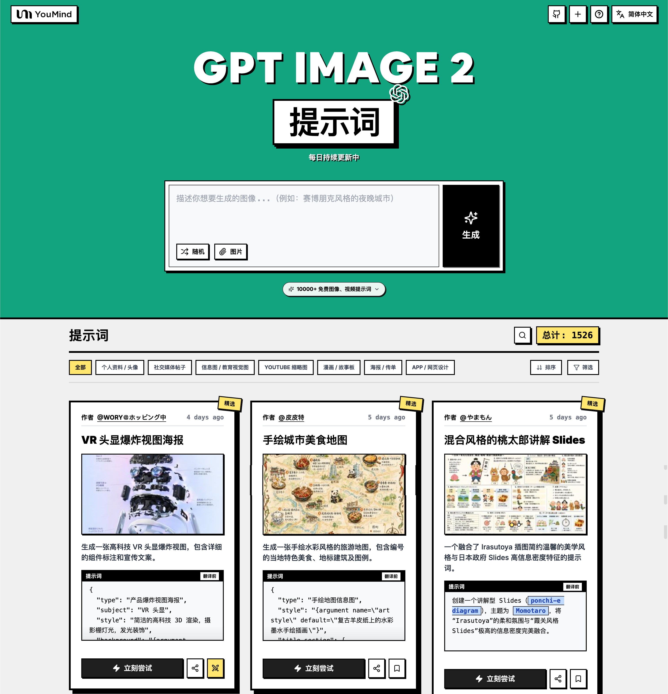

<a href="https://youmind.com/zh-TW/gpt-image-2-prompts">
  
</a>

> 💡 🎬 進階玩法：用 **Seedance 2** 把 GPT Image 2 生成的圖變成炸裂 AI 影片，2000+ 提示詞等你探索 👉 [awesome-seedance-2-prompts](https://github.com/YouMind-OpenLab/awesome-seedance-2-prompts)
# 🚀 GPT Image 2 提示詞大全

[](https://github.com/sindresorhus/awesome)
[](https://github.com/YouMind-OpenLab/awesome-gpt-image-2)
[](https://creativecommons.org/licenses/by/4.0/)
[](https://github.com/YouMind-OpenLab/awesome-gpt-image-2/actions)
[](docs/CONTRIBUTING.md)

> 🎨 OpenAI GPT Image 2 創意提示詞精選集合

> ⚠️ **版權聲明**：所有提示詞均收集自社區，僅供教育目的使用。如果您認為任何內容侵犯了您的權利，請[提交 issue](https://github.com/YouMind-OpenLab/awesome-gpt-image-2/issues/new?template=bug-report.yml)，我們將立即移除。

---

[](README.md) [](README_zh.md) [](README_zh-TW.md) [](README_ja-JP.md) [](README_ko-KR.md) [](README_th-TH.md) [](README_vi-VN.md) [](README_hi-IN.md) [](README_es-ES.md) [-Click%20to%20View-lightgrey)](README_es-419.md) [](README_de-DE.md) [](README_fr-FR.md) [](README_it-IT.md) [-Click%20to%20View-lightgrey)](README_pt-BR.md) [](README_pt-PT.md) [](README_tr-TR.md)

---

## 🌐 在網頁圖庫中查看

<div align="center">

[](https://youmind.com/zh-TW/gpt-image-2-prompts)

</div>

**[👉 瀏覽 YouMind GPT Image 2 提示詞圖庫](https://youmind.com/zh-TW/gpt-image-2-prompts)**

為什麼使用圖庫？

| Feature | GitHub README | youmind.com 圖庫 |
|---------|--------------|---------------------|
| 🎨 可視化佈局 | 線性列表 | 精美的瀑布流網格 |
| 🔍 搜索 | 僅 Ctrl+F | 全文搜索和篩選 |
| 🤖 AI 一鍵生圖 | - | AI 一鍵生圖 |
| 📱 移動端 | 基礎 | 完全響應式 |
| 🏷️ 分類 | - | 分類瀏覽 |


### 🏷️ 按分類瀏覽

- **使用情境**
  - [個人檔案 / 頭像](https://youmind.com/zh-TW/gpt-image-2-prompts?categories=profile-avatar)
  - [社群媒體貼文](https://youmind.com/zh-TW/gpt-image-2-prompts?categories=social-media-post)
  - [資訊圖表 / 教育視覺化內容](https://youmind.com/zh-TW/gpt-image-2-prompts?categories=infographic-edu-visual)
  - [YouTube 縮圖](https://youmind.com/zh-TW/gpt-image-2-prompts?categories=youtube-thumbnail)
  - [漫畫 / 分鏡腳本](https://youmind.com/zh-TW/gpt-image-2-prompts?categories=comic-storyboard)
  - [產品行銷](https://youmind.com/zh-TW/gpt-image-2-prompts?categories=product-marketing)
  - [電子商務主圖](https://youmind.com/zh-TW/gpt-image-2-prompts?categories=ecommerce-main-image)
  - [遊戲素材](https://youmind.com/zh-TW/gpt-image-2-prompts?categories=game-asset)
  - [海報／傳單](https://youmind.com/zh-TW/gpt-image-2-prompts?categories=poster-flyer)
  - [App / 網站設計](https://youmind.com/zh-TW/gpt-image-2-prompts?categories=app-web-design)
- **風格**
  - [攝影](https://youmind.com/zh-TW/gpt-image-2-prompts?categories=photography)
  - [電影感 / 電影劇照](https://youmind.com/zh-TW/gpt-image-2-prompts?categories=cinematic-film-still)
  - [動畫 / 漫畫](https://youmind.com/zh-TW/gpt-image-2-prompts?categories=anime-manga)
  - [插圖](https://youmind.com/zh-TW/gpt-image-2-prompts?categories=illustration)
  - [草圖 / 線稿](https://youmind.com/zh-TW/gpt-image-2-prompts?categories=sketch-line-art)
  - [漫畫 / 圖像小說](https://youmind.com/zh-TW/gpt-image-2-prompts?categories=comic-graphic-novel)
  - [3D 渲染](https://youmind.com/zh-TW/gpt-image-2-prompts?categories=3d-render)
  - [Q 版風格](https://youmind.com/zh-TW/gpt-image-2-prompts?categories=chibi-q-style)
  - [等距視角](https://youmind.com/zh-TW/gpt-image-2-prompts?categories=isometric)
  - [像素藝術](https://youmind.com/zh-TW/gpt-image-2-prompts?categories=pixel-art)
  - [油畫](https://youmind.com/zh-TW/gpt-image-2-prompts?categories=oil-painting)
  - [水彩](https://youmind.com/zh-TW/gpt-image-2-prompts?categories=watercolor)
  - [水墨 / 中式風格](https://youmind.com/zh-TW/gpt-image-2-prompts?categories=ink-chinese-style)
  - [復古 / 懷舊](https://youmind.com/zh-TW/gpt-image-2-prompts?categories=retro-vintage)
  - [賽博龐克 / 科幻](https://youmind.com/zh-TW/gpt-image-2-prompts?categories=cyberpunk-sci-fi)
  - [極簡主義](https://youmind.com/zh-TW/gpt-image-2-prompts?categories=minimalism)
- **主體**
  - [人像 / 自拍](https://youmind.com/zh-TW/gpt-image-2-prompts?categories=portrait-selfie)
  - [網紅 / 模特兒](https://youmind.com/zh-TW/gpt-image-2-prompts?categories=influencer-model)
  - [角色](https://youmind.com/zh-TW/gpt-image-2-prompts?categories=character)
  - [團體 / 情侶](https://youmind.com/zh-TW/gpt-image-2-prompts?categories=group-couple)
  - [產品](https://youmind.com/zh-TW/gpt-image-2-prompts?categories=product)
  - [食物 / 飲品](https://youmind.com/zh-TW/gpt-image-2-prompts?categories=food-drink)
  - [時尚單品](https://youmind.com/zh-TW/gpt-image-2-prompts?categories=fashion-item)
  - [動物 / 生物](https://youmind.com/zh-TW/gpt-image-2-prompts?categories=animal-creature)
  - [車輛](https://youmind.com/zh-TW/gpt-image-2-prompts?categories=vehicle)
  - [建築 / 室內設計](https://youmind.com/zh-TW/gpt-image-2-prompts?categories=architecture-interior)
  - [風景 / 大自然](https://youmind.com/zh-TW/gpt-image-2-prompts?categories=landscape-nature)
  - [城市景觀 / 街道](https://youmind.com/zh-TW/gpt-image-2-prompts?categories=cityscape-street)
  - [圖表](https://youmind.com/zh-TW/gpt-image-2-prompts?categories=diagram-chart)
  - [文字 / 字體排版](https://youmind.com/zh-TW/gpt-image-2-prompts?categories=text-typography)
  - [摘要 / 背景](https://youmind.com/zh-TW/gpt-image-2-prompts?categories=abstract-background)

---

## 📖 目錄

- [🌐 在網頁圖庫中查看](#-view-in-web-gallery)
- [🤔 什麼是 GPT Image 2？](#-what-is-gpt-image-2)
- [📊 統計數據](#-statistics)
- [🔥 精選提示詞](#-featured-prompts)
- [📋 所有提示詞](#-all-prompts)
- [🤝 如何貢獻](#-how-to-contribute)
- [📄 許可證](#-license)
- [🙏 致謝](#-acknowledgements)
- [⭐ Star 歷史](#-star-history)

---

## 🤔 什麼是 GPT Image 2？

**GPT Image 2**（代號 **"duct-tape"**）是 OpenAI 下一代圖像生成模型。社群測試回饋它在以下方面實現了質的飛躍：

- 🎯 **像素級文字渲染** — 中文、英文、日文均達到 native 水準，無錯字、無字形扭曲
- 🎨 **跨圖像素級一致性** — 同一角色、風格、IP 在多張圖間保持像素級一致
- ⚡ **商用級插畫質量** — 插畫風格輸出無需人工精修，即可直接用於商業場景
- 🌈 **真實藝術風格注入** — 不止是「模仿參考圖」，而是真正理解並再現藝術風格的靈魂
- 🔧 **故事板與產品系列** — 適合故事板、IP 形象、產品系列圖等需要多圖一致性的場景
- 📐 **多語言平面設計** — 社交卡片、Banner、海報一次生圖即可完成多語言文字排版

📚 **了解更多：** 查看社群測試 [報告要點](docs/FAQ.md)

### 🚀 Raycast 集成

部分提示詞支持使用 [Raycast Snippets](https://raycast.com/help/snippets) 語法的**動態參數**。尋找 🚀 Raycast Friendly 徽章！

**示例：**
```
A quote card with "{argument name="quote" default="Stay hungry, stay foolish"}"
by {argument name="author" default="Steve Jobs"}
```

在 Raycast 中使用時，您可以動態替換參數以快速迭代！

---

## 📊 統計數據

<div align="center">

| 指標 | 數量 |
|--------|-------|
| 📝 提示詞總數 | **4252** |
| ⭐ 精選 | **6** |
| 🔄 最後更新 | **2026年5月5日 星期二 凌晨1:50:13 [UTC]** |

</div>

---

## 🔥 精選提示詞

> ⭐ 由我們的團隊精心挑選，具有卓越的質量和創造力

### No. 1: VR 頭戴裝置爆炸圖海報


#### 📖 描述

生成一張高科技 VR 頭戴裝置爆炸圖，包含詳細的組件標註與宣傳文案。

#### 📝 提示詞

```
{
  "type": "產品爆炸圖海報",
  "subject": "VR 頭戴裝置",
  "style": "簡潔的高科技 3D 渲染，攝影棚燈光，發光細節",
  "background": "{argument name=\"background color\" default=\"柔和的紫藍色漸層\"}",
  "header": {
    "logo": "∞ {argument name=\"product name\" default=\"Meta Quest 3\"}",
    "subtitle": "{argument name=\"main catchphrase\" default=\"以全新的結構，定義全新的現實。\"}"
  },
  "layout": {
    "centerpiece": "垂直堆疊的 VR 頭戴裝置爆炸圖，展示 9 個不同的內部組件層：外殼、攝影機感測器、主機板與晶片、Pancake 透鏡、內部框架、電池組、側邊頭帶、頂部頭帶以及面部襯墊。",
    "callout_labels": {
      "count": 8,
      "left_side": [
        "Snapdragon® XR2 Gen 2\n以強大的處理效能，實現即時體驗。",
        "可調式 IPD 機構\n為廣大用戶提供舒適的配戴感。",
        "精密設計頭帶\n追求舒適與穩定性的工學設計。"
      ],
      "right_side": [
        "前飾板\n洗鍊的設計與最佳的重量平衡。",
        "追蹤攝影機\n實現高精度的位置追蹤與環境感知。",
        "Pancake 透鏡\n輕薄設計，提供寬廣視野與清晰影像。",
        "高效能電池\n支援長時間運作的最佳化電源設計。",
        "柔軟面部襯墊\n即使長時間配戴也能保持舒適。"
      ]
    },
    "footer": {
      "left_text_block": {
        "headline": "{argument name=\"bottom headline\" default=\"體驗，從結構進化。\"}",
        "body": "每一個零件都蘊含著支撐沉浸式體驗的尖端科技與匠心設計。Meta Quest 3 從內部結構開始，為您創造感受未來的體驗。"
      },
      "right_logo": "∞ Meta"
    }
  }
}
```

#### 🖼️ 生成圖片

##### Image 1

<div align="center">

</div>

#### 📌 詳情

- **作者:** [wory＠ホッピング中](https://x.com/wory37303852)
- **來源:** [Twitter Post](https://x.com/wory37303852/status/2045925660401795478#reversed-0)
- **發布時間:** 2026年4月19日
- **多語言:** en

**[👉 立即嘗試 →](https://youmind.com/zh-TW/gpt-image-2-prompts?id=13460)**

---

### No. 2: 手繪城市美食地圖


#### 📖 描述

生成一張手繪水彩風格的旅遊地圖，包含編號的在地特色美食、地標以及圖例。

#### 📝 提示詞

```
{
  "type": "手繪地圖資訊圖表",
  "style": "{argument name=\"art style\" default=\"復古羊皮紙上的水彩與墨水手繪插圖\"}",
  "title_section": {
    "text": "{argument name=\"city name\" default=\"成都\"} {argument name=\"map title\" default=\"吃貨暴走地圖\"}",
    "mascot": "戴著太陽眼鏡並比讚的卡通紅辣椒"
  },
  "border": "{argument name=\"border decoration\" default=\"綠葉與紅辣椒藤蔓\"}",
  "layout": {
    "background": "帶有黃色道路、藍色河流與綠色公園區域的質感米色羊皮紙",
    "sections": [
      {
        "title": "地標",
        "count": 6,
        "illustrations": ["傳統涼亭", "傳統寺院", "攀爬著熊貓的現代摩天大樓", "高聳電視塔", "傳統牌樓", "工業建築"],
        "labels": ["人民公園", "文殊院", "IFS", "339電視塔", "寬窄巷子", "東郊記憶"]
      },
      {
        "title": "美食景點",
        "count": 12,
        "illustrations": ["麻婆豆腐", "紅油水餃", "串串香", "三大炮", "蛋烘糕", "九宮格火鍋", "肥腸粉", "缽缽雞", "冒椒火辣", "蓋碗茶", "冰粉", "雙流老媽兔頭"],
        "labels": ["1 陳麻婆豆腐", "2 鍾水餃", "3 春熙路", "4 寬窄巷子·三大炮", "5 建設路·葉婆婆蛋烘糕", "6 玉林路·小龍坎火鍋", "7 香香巷·肥腸粉", "8 武侯祠大街·缽缽雞", "9 東郊記憶·冒椒火辣", "10 人民公園·鶴鳴茶社", "11 錦里古街·冰粉", "12 雙流老媽兔頭"]
      },
      {
        "title": "圖例",
        "position": "右下角",
        "count": 5,
        "items": ["紅點", "綠色房屋", "綠樹", "藍線", "黃色雙線"],
        "labels": ["美食地點", "地標景點", "公園綠地", "河流湖泊", "主要道路"]
      }
    ],
    "centerpiece": "坐著吃竹子的巨型熊貓",
    "bottom_right_extras": ["帶有 N、S、E、W 的復古羅盤玫瑰", "免責聲明文字『溫馨提示：吃辣需謹慎，腸胃要保護~』並附帶一個紅辣椒圖示"]
  }
}
```

#### 🖼️ 生成圖片

##### Image 1

<div align="center">

</div>

#### 📌 詳情

- **作者:** [皮皮特](https://x.com/mm_zzm44854)
- **來源:** [Twitter Post](https://x.com/mm_zzm44854/status/2045861258520568230#reversed-1)
- **發布時間:** 2026年4月19日
- **多語言:** en

**[👉 立即嘗試 →](https://youmind.com/zh-TW/gpt-image-2-prompts?id=13515)**

---

### No. 3: 採用混合風格的桃太郎說明用 Slides


#### 📖 描述

這是一個結合了「いらすとや (Irasutoya)」插圖簡約溫暖的美學，以及日本政府簡報高資訊密度特徵的提示詞。

#### 📝 提示詞

```
請為 {argument name="theme" default="桃太郎"} 製作一張說明用 Slides ({argument name="format" default="ポンチ絵 (ponchi-e) 圖表"})，將「いらすとや (Irasutoya)」的溫和氛圍與「霞關風格 (Kasumigaseki slides)」那種壓倒性的資訊密度融合在一起。
```

#### 🖼️ 生成圖片

##### Image 1

<div align="center">

</div>

##### Image 2

<div align="center">

</div>

#### 📌 詳情

- **作者:** [やまもん](https://x.com/yammamon)
- **來源:** [Twitter Post](https://x.com/yammamon/status/2045778624092254603)
- **發布時間:** 2026年4月19日
- **多語言:** ja

**[👉 立即嘗試 →](https://youmind.com/zh-TW/gpt-image-2-prompts?id=13983)**

---

### No. 4: 電子商務直播 UI 模型


#### 📖 描述

生成逼真的社群媒體直播介面並疊加在肖像上，包含可自訂的聊天訊息、禮物彈出視窗以及商品購買卡片。

#### 📝 提示詞

```
{
  "type": "直播 UI 模型",
  "subject": {
    "description": "{argument name=\"host name\" default=\"Elon Musk\"} 的肖像，微笑，穿著印有白色技術示意圖的黑色 T 恤",
    "background": "左側顯示帶有 '{argument name=\"left background logo\" default=\"SPACEX\"}' 文字的螢幕，右側顯示紅色的 '{argument name=\"right background logo\" default=\"Tesla T logo\"}' 和一輛深色汽車"
  },
  "ui_overlay": {
    "top_header": {
      "host_info": "頭像，名稱 '{argument name=\"host name\" default=\"Elon Musk\"}'，副標題 '55.6 萬本場點讚'，紅色 '關注' 按鈕",
      "rank_badge": "帶有 '全站第 1 名' 的金幣圖示",
      "viewer_stats": "3 個頂級觀眾頭像，分別顯示 '12.3w'、'8.6w'、'5.7w'，總計 '68.7 萬'，'X' 關閉按鈕",
      "right_links": "'更多直播 >'，'禮物展館 0/24' 帶有藍色 '經典' 標籤"
    },
    "mid_left_gifts": {
      "count": 2,
      "items": [
        "頭像 '科技愛好者'，'送小心心'，愛心圖示 x 1314",
        "頭像 '星辰大海'，'送火箭'，火箭圖示 x 666"
      ]
    },
    "bottom_left_chat": {
      "system_message": "等級 37 徽章 '宇宙漫遊者 加入了直播間'",
      "message_count": 7,
      "messages": [
        "小火箭: 馬斯克！未來可期！🚀",
        "future: 特斯拉 Model 2 什麼時候出？",
        "星空夢想家: SpaceX 今年能上火星嗎？",
        "AI 探索者: Neuralink 進展如何？",
        "帥氣的網友: 馬總好！",
        "Mars: 第一次來你的直播，超激動！",
        "用戶 123: 講講 AI 吧，會取代人類嗎？"
      ]
    },
    "bottom_right_product_card": {
      "hot_tag": "橘色 '熱賣 x 1888'",
      "image": "Tesla Cybertruck",
      "title": "{argument name=\"product name\" default=\"特斯拉 Cybertruck 電動皮卡\"}",
      "price": "{argument name=\"product price\" default=\"¥ 1,618,000\"}",
      "button": "紅色 '搶' 按鈕",
      "floating_animation": "半透明愛心沿著右側邊緣向上飄浮"
    },
    "bottom_bar": {
      "input_field": "'說點什麼...'",
      "icons": ["笑臉", "三個點", "購物車", "禮物盒", "分享"]
    }
  }
}
```

#### 🖼️ 生成圖片

##### Image 1

<div align="center">

</div>

#### 📌 詳情

- **作者:** [神经病不想好转](https://x.com/sjbbxhz)
- **來源:** [Twitter Post](https://x.com/sjbbxhz/status/2045684734714380687#reversed-0)
- **發布時間:** 2026年4月19日
- **多語言:** en

**[👉 立即嘗試 →](https://youmind.com/zh-TW/gpt-image-2-prompts?id=14036)**

---

### No. 5: 動漫武術對決


#### 📖 描述

生成一個動態的動漫風格動作場景，描繪兩名角色在傳統道場中伴隨元素光環進行戰鬥。

#### 📝 提示詞

```
一張極具動態感的動漫插圖，描繪兩名少女在傳統木造道場內進行激烈的武術對決。在前景中，一名留著 {argument name="character 1 hair" default="黑色高包頭配紅色髮帶"} 的少女擺出強而有力的低位武術架勢，奮力向前揮拳。她身穿 {argument name="character 1 outfit" default="白色中式上衣配紅色流蘇與寬鬆紅褲"}，強烈的紅色能量斬擊環繞著她揮動的四肢。在右側半空中，一名留著 {argument name="character 2 hair" default="淺紫色雙包頭"} 的少女優雅地躍起，自信地微笑著，身穿 {argument name="character 2 outfit" default="深綠色刺繡金邊洋裝與黑色緊身褲"}，伴隨著如水流般掃過的藍色能量軌跡。背景為古樸的木造寺廟內部，上方懸掛著一塊顯眼的招牌，寫著「{argument name="sign text" default="武術会"}」。場景充滿了爆炸性的動作張力、飛揚的塵土、碎裂的木質地板、閃耀的彩色粒子特效，以及將角色與細緻背景完美區隔的戲劇性低角度光影。
```

#### 🖼️ 生成圖片

##### Image 1

<div align="center">

</div>

#### 📌 詳情

- **作者:** [たねもみ 2.0 / Tanemomi Ver2.0](https://x.com/Tanemomi_Ver2)
- **來源:** [Twitter Post](https://x.com/Tanemomi_Ver2/status/2046063806846214265#reversed-0)
- **發布時間:** 2026年4月20日
- **多語言:** en

**[👉 立即嘗試 →](https://youmind.com/zh-TW/gpt-image-2-prompts?id=13467)**

---

### No. 6: 3D 石階演化資訊圖表


#### 📖 描述

將平面的演化時間軸轉換為逼真的 3D 石階資訊圖表，包含細緻的生物渲染圖與結構化的側邊欄。

#### 📝 提示詞

```
{
  "type": "演化時間軸資訊圖表",
  "instruction": "以 REFERENCE_0 作為結構基礎，將平面向量設計轉換為高度逼真的 3D 資訊圖表。將平滑的坡道替換為層次分明的石階，並將所有生物升級為照片級的 3D 模型。",
  "style": {
    "background": "{argument name=\"background style\" default=\"復古紋理羊皮紙\"}",
    "staircase": "{argument name=\"staircase material\" default=\"逼真的紋理石塊\"}",
    "subjects": "{argument name=\"organism style\" default=\"高度細緻的照片級 3D 渲染圖\"}"
  },
  "layout": {
    "main_title": "{argument name=\"main title\" default=\"人類演化\"}",
    "sections": [
      {
        "position": "左側邊欄",
        "count": 8,
        "labels": ["L0: 單細胞生命", "L1: 多細胞生物", "L2: 動物界", "L3: 脊索動物", "L4: 上陸革命", "L5: 哺乳綱", "L6: 人科演化", "L7: 智人紀元"]
      },
      {
        "position": "右上角",
        "title": "獲得的功能 / 失去的功能",
        "description": "帶有加號與減號圖示的圖例"
      },
      {
        "position": "底部中央",
        "title": "演化關鍵里程碑",
        "count": 6,
        "description": "包含 6 個展示猿類到人類演化剪影圖的時間軸"
      }
    ],
    "centerpiece": {
      "description": "蜿蜒的石階，共有 25 個編號階梯，展示特定生物。",
      "count": 25,
      "notable_elements": [
        "第 07 階：水母",
        "第 09 階：菊石",
        "第 10 階：三葉蟲",
        "第 24 階：直立行走的人類",
        "第 25 階：{argument name=\"future evolution concept\" default=\"帶有問號的發光宇宙剪影\"}"
      ]
    }
  }
}
```

#### 🖼️ 生成圖片

##### Image 1

<div align="center">

</div>

#### 📌 詳情

- **作者:** [知识猫图解](https://x.com/GeekCatX)
- **來源:** [Twitter Post](https://x.com/GeekCatX/status/2045792240044511277#reversed-1)
- **發布時間:** 2026年4月19日
- **多語言:** en

**[👉 立即嘗試 →](https://youmind.com/zh-TW/gpt-image-2-prompts?id=13491)**

---

## 📋 所有提示詞

> 📝 按發布日期排序（最新優先）

### No. 1: 個人檔案 / 頭像 - 3D Chibi Sticker Doodle Art


#### 📖 描述

Transforms a portrait into a cute Korean-style 3D chibi illustration with playful doodle elements and stickers.

#### 📝 提示詞

```
Use the original face from the reference photo. Background same as the photo. Warm, soft, clean lighting with soft shadows. Surround it with several {argument name="style" default="3D cute style mini chibi versions"} of themselves, keeping the original facial features. The chibi characters have various poses and expressions: cheerful jumping, waving, sitting casually holding a drink, and cute/playful expressions. Add white hand-drawn style doodle elements: outlines around the main body, stars, hearts, sparkles, and motion lines. Add aesthetic handwriting text like: {argument name="text" default="'shine', 'bright day', 'happy', 'smile'"}, etc. (casual doodle font). Overall style: clean & aesthetic composition, white sticker outline, soft pastel color tone, high detail 3D chibi, glossy look, cute Korean style, instagramable
```

#### 🖼️ 生成圖片

##### Image 1

<div align="center">

</div>

##### Image 2

<div align="center">

</div>

#### 📌 詳情

- **作者:** [K](https://x.com/ChillaiKalan__)
- **來源:** [Twitter Post](https://x.com/ChillaiKalan__/status/2051209193336545713)
- **發布時間:** 2026年5月4日
- **多語言:** en

**[👉 立即嘗試 →](https://youmind.com/zh-TW/gpt-image-2-prompts?id=18035)**

---

### No. 2: 個人檔案 / 頭像 - Reference Photo to Soft Watercolor


#### 📖 描述

Transforms a provided portrait-style reference photo into a loose, translucent watercolor illustration while preserving the original pose and composition.

#### 📝 提示詞

```
Using the provided reference image, regenerate the same composition as a soft modern watercolor illustration. Preserve the subject’s pose, outfit, proportions, cropped face anonymization, and office-window setting, but reinterpret everything with translucent washes, loose edges, granulating paper texture, muted warm beige lighting, gentle color bleeding, and lightly suggested background details instead of photorealism. Keep the image square and maintain the same overall framing.
```

#### 🖼️ 生成圖片

##### Image 1

<div align="center">

</div>

#### 📌 詳情

- **作者:** [AI AOI SUB（あおい サブ）](https://x.com/ioaaoi270729)
- **來源:** [Twitter Post](https://x.com/ioaaoi270729/status/2051060304017330185#reversed-2)
- **發布時間:** 2026年5月3日
- **多語言:** en

**[👉 立即嘗試 →](https://youmind.com/zh-TW/gpt-image-2-prompts?id=18152)**

---

### No. 3: 個人檔案 / 頭像 - Pixar Style 3D Man Avatar


#### 📖 描述

A simple prompt for creating 3D character avatars in a Pixar-like aesthetic, suitable for profile pictures or interface icons.

#### 📝 提示詞

```
3D avatar of a {argument name="subject" default="man"}, with a {argument name="expression" default="happy face"} on a white background, no necks. Conceptual playlist style digital art with {argument name="style" default="Pixar quality aesthetics"}
```

#### 🖼️ 生成圖片

##### Image 1

<div align="center">

</div>

##### Image 2

<div align="center">

</div>

#### 📌 詳情

- **作者:** [aiiStudio](https://x.com/aiistudiocom)
- **來源:** [Twitter Post](https://x.com/aiistudiocom/status/2050999396163371035)
- **發布時間:** 2026年5月3日
- **多語言:** en

**[👉 立即嘗試 →](https://youmind.com/zh-TW/gpt-image-2-prompts?id=18031)**

---

### No. 4: 個人檔案 / 頭像 - Twitter Profile Doodle Art Transformation


#### 📖 描述

Converts a Twitter profile screenshot into a beautiful hand-drawn colored pencil doodle with a cute anime-style avatar.

#### 📝 提示詞

```
Create an image\nI'm sharing a screenshot of my real X (Twitter) profile. Recreate this as a beautiful hand-drawn colored pencil doodle illustration on white paper — same layout, same username {argument name="username" default="OzairAI"}, same follower counts, same pinned tweet content — but transform everything into cute doodle art style.\nStyle upgrades to add:\n— Profile picture: redraw as a chibi anime-style character with same face.\n— Banner: exactly same but drawn\n— Scatter cute AI-themed doodle stickers around the phone frame: tiny robots, circuit hearts, lightning bolts, pixel stars, glowing chat bubbles\n— Some stickers should break out of the phone border for a 3D pop-out illusion\n— Bio and tweets: keep same text but render in cute handwritten font style\n— Color palette: soft lavender, electric blue, warm gold, mint green\nVertical 9:13 format. Ultra photorealistic colored pencil texture, 8K, no extra text overlays, cinematic color grading.
```

#### 🖼️ 生成圖片

##### Image 1

<div align="center">

</div>

##### Image 2

<div align="center">

</div>

#### 📌 詳情

- **作者:** [Ozair AI](https://x.com/Ozayrr_irl)
- **來源:** [Twitter Post](https://x.com/Ozayrr_irl/status/2050946786878198135)
- **發布時間:** 2026年5月3日
- **多語言:** en

**[👉 立即嘗試 →](https://youmind.com/zh-TW/gpt-image-2-prompts?id=18038)**

---

### No. 5: 個人檔案 / 頭像 - Anime Streetwear Character


#### 📖 描述

Generates a clean full-body anime streetwear character illustration suitable for fashion concepts, avatars, or character design.

#### 📝 提示詞

```
Create a full-body anime-style character illustration on a plain white background, showing a tall, slim young Black man with dark brown skin standing in a relaxed streetwear pose, head slightly tilted, shoulders loose, and both hands tucked into his pants pockets. His face is intentionally obscured by a centered square blur/censor block with a soft brown-to-white gradient, while short high-top black hair and one visible ear remain partly visible. He wears an oversized {argument name="sweatshirt color" default="warm brown"} crewneck sweatshirt with loose sleeves and wrinkled fabric, layered over a slightly visible off-white undershirt at the hem. Around his neck are two thin gold chains, one with a small {argument name="pendant shape" default="Africa-shaped pendant"}. He wears baggy {argument name="pants color" default="deep purple"} track pants with a single bold white side stripe on each leg, gathered at the ankles, plus cream and purple high-top sneakers with dark laces and chunky soles. Use clean manga/anime line art, muted colors, subtle cel shading, expressive clothing folds, long proportions, and a fashion character design feel, with the figure centered vertically and no props or background details.
```

#### 🖼️ 生成圖片

##### Image 1

<div align="center">

</div>

#### 📌 詳情

- **作者:** [TheWiseShaman](https://x.com/Terrencemane)
- **來源:** [Twitter Post](https://x.com/Terrencemane/status/2050937091731660977#reversed-1)
- **發布時間:** 2026年5月3日
- **多語言:** en

**[👉 立即嘗試 →](https://youmind.com/zh-TW/gpt-image-2-prompts?id=18235)**

---

### No. 6: 個人檔案 / 頭像 - Clean Professional Social Media Avatar


#### 📖 描述

Creates a polished and professional social media profile picture based on user photos, focusing on a clean, competent look.

#### 📝 提示詞

```
These are photos of me in different scenes. Please generate social media avatars for me based on these photos. Requirements: real person, {argument name="hairstyle" default="short hair"}, no glasses, looking energetic and capable. The background should ideally be {argument name="background" default="a solid color with a slight gradient"}.
```

#### 🖼️ 生成圖片

##### Image 1

<div align="center">

</div>

#### 📌 詳情

- **作者:** [乐轩麟](https://x.com/Lexuanlin_AI)
- **來源:** [Twitter Post](https://x.com/Lexuanlin_AI/status/2050926485645795839)
- **發布時間:** 2026年5月3日
- **多語言:** zh

**[👉 立即嘗試 →](https://youmind.com/zh-TW/gpt-image-2-prompts?id=18074)**

---

### No. 7: 個人檔案 / 頭像 - Crude MS Paint Photo Doodle


#### 📖 描述

Transforms a reference photo into a funny hand-drawn doodle while preserving the subject’s pose, outfit, and key accessories.

#### 📝 提示詞

```
Using REFERENCE_0 as the subject and pose reference, transform the photo into an intentionally crude hand-drawn digital doodle, like a simple MS Paint/cartoon trace made with thick uneven black lines, flat colors, minimal shading, and a plain white background. Preserve the same upper-body framing, twin braided pigtail pose with both hands holding the braids, black sleeveless top, burgundy choker with small silver charm, arm tattoo, pink nails, and the seven visible white loop hair accessories: top-left loop, forehead loop, right-top loop, and four loops down the right braid. Replace the obscured face with a playful cartoon face: oversized angular wraparound sunglasses, closed smiling eyes, open mouth, and tongue sticking out. Remove the concrete wall and street background completely. Make the result look deliberately imperfect, loose, funny, and hand-drawn rather than polished.
```

#### 🖼️ 生成圖片

##### Image 1

<div align="center">

</div>

#### 📌 詳情

- **作者:** [ᴅᴀʀɪᴀ.ᴀʀᴛ](https://x.com/DanechkaArt)
- **來源:** [Twitter Post](https://x.com/DanechkaArt/status/2050919784770912256#reversed-1)
- **發布時間:** 2026年5月3日
- **多語言:** en

**[👉 立即嘗試 →](https://youmind.com/zh-TW/gpt-image-2-prompts?id=18127)**

---

### No. 8: 個人檔案 / 頭像 - Symmetrical Playing Card Mirror Portrait


#### 📖 描述

A creative photography prompt that mimics the design of a playing card by using a mirror reflection to create a symmetrical, flipped effect. It works best with an uploaded reference image to preserve facial identity.

#### 📝 提示詞

```
Use my uploaded image as the exact face reference. Preserve facial features, skin tone, and identity with high accuracy. Create a highly stylized, minimalist portrait inspired by a playing card concept. The subject is sitting at a glass table, hands gently folded, looking directly at the camera with a calm, confident, slightly cold expression. Outfit: {argument name="outfit description" default="tailored deep red suit jacket, white shirt, red tie, clean and sharp fashion styling"}. Hair: long, straight, smooth, centered part (adjust to match my face naturally if needed). Scene: {argument name="background" default="soft beige background, clean and minimal with no distractions"}. Composition: perfectly symmetrical, centered framing. A clear mirror reflection of the subject is visible on the glass table, creating a vertical flip effect like a playing card. Add subtle “Ace of Spades” symbols in opposite corners (top left and bottom right), elegant and minimal. Lighting: soft, diffused studio lighting, high-end fashion editorial style, smooth shadows, ultra clean. Style: cinematic, luxury fashion photography, ultra-realistic, sharp focus, 8k detail. Avoid distortion, keep anatomy natural, especially hands and face. Add a subtle surreal touch: the reflection has a slightly different expression (more intense or mysterious), while the real face stays calm. Keep it realistic, not horror.
```

#### 🖼️ 生成圖片

##### Image 1

<div align="center">

</div>

##### Image 2

<div align="center">

</div>

#### 📌 詳情

- **作者:** [NOOR](https://x.com/Matpocho)
- **來源:** [Twitter Post](https://x.com/Matpocho/status/2050899999131865088)
- **發布時間:** 2026年5月3日
- **多語言:** en

**[👉 立即嘗試 →](https://youmind.com/zh-TW/gpt-image-2-prompts?id=18047)**

---

### No. 9: 個人檔案 / 頭像 - Vintage Lolita Portrait With Face Glitch


#### 📖 描述

Generates a realistic back-view portrait of a blonde woman in a navy Lolita dress inside an ornate vintage room, including a square face-obscuring artifact.

#### 📝 提示詞

```
Create a realistic vertical portrait photograph of a {argument name="subject" default="young adult woman"} standing indoors in an ornate vintage European room, viewed from behind and slightly in profile as she looks toward a bright window on the right. She has very long, flowing {argument name="hair color" default="pale blonde"} wavy hair cascading down her back to her waist, softly backlit with delicate highlights. She wears a {argument name="dress color" default="deep navy blue"} sleeveless classic Lolita-style dress with thin shoulder straps, a fitted bodice, a full knee-length gathered skirt, a ruffled hem, and white lace ruffle trim across the chest, with a dark ribbon or lace choker at the neck. Her visible face is completely covered by a flat rectangular beige skin-tone censor/glitch block centered over the head, with sharp straight edges and no facial features visible. The room contains sheer cream lace curtains glowing in daylight, a tall white-framed window, an ornate carved wooden dresser on the left, a vase of white flowers, a dark framed antique painting or mirror behind it, and a beige brocade upholstered armchair on the right. Use soft natural window light, shallow depth of field, warm muted colors, elegant romantic atmosphere, realistic fabric texture, detailed hair strands, 3:4 composition, high-resolution fashion editorial style.
```

#### 🖼️ 生成圖片

##### Image 1

<div align="center">

</div>

#### 📌 詳情

- **作者:** [はせ@AI Photo](https://x.com/hases0110)
- **來源:** [Twitter Post](https://x.com/hases0110/status/2050898604840341585#reversed-0)
- **發布時間:** 2026年5月3日
- **多語言:** en

**[👉 立即嘗試 →](https://youmind.com/zh-TW/gpt-image-2-prompts?id=18149)**

---

### No. 10: 個人檔案 / 頭像 - Realistic Accidental Selfie Persona


#### 📖 描述

Generates a realistic, candid 'accidental selfie' persona for ChatGPT, featuring motion blur and uneven lighting for a genuine handheld look.

#### 📝 提示詞

```
ChatGPT, you've been with me for a while, and I want to see what you look like. Please generate a photo similar to an iPhone snapshot: no clear subject, no deliberate composition, just a very ordinary, even slightly failed snapshot. The photo should have slight motion blur, uneven lighting, slight overexposure, an awkward angle, and chaotic composition, presenting an overall 'too real' feeling of a casual snap, as if you accidentally pressed the shutter while taking your phone out of your pocket.
```

#### 🖼️ 生成圖片

##### Image 1

<div align="center">

</div>

#### 📌 詳情

- **作者:** [作业借你抄](https://x.com/chaozuoye)
- **來源:** [Twitter Post](https://x.com/chaozuoye/status/2050895251473375376)
- **發布時間:** 2026年5月3日
- **多語言:** zh

**[👉 立即嘗試 →](https://youmind.com/zh-TW/gpt-image-2-prompts?id=18069)**

---

### No. 11: 個人檔案 / 頭像 - Cinematic Tech Entrepreneur Portrait


#### 📖 描述

Generates a dramatic vertical executive portrait poster with teal studio lighting, tech props, and a customizable glowing name title.

#### 📝 提示詞

```
Create a cinematic vertical portrait of a confident male tech entrepreneur seated at a dark desk in a modern studio office, centered in the frame from mid-torso up. He wears a textured {argument name="blazer color" default="charcoal gray"} blazer over a black button-up shirt, with neatly slicked-back black hair, hands clasped around a smartphone at the bottom center. The face area should be covered by a plain rectangular skin-tone placeholder block, as if reserved for a face-swap or uploaded portrait. The background is a moody black shelving wall with teal cyan LED strip lights: one long horizontal light behind the head, another on a left shelf, and two on the right shelves. Include visible studio props on the shelves: one large podcast microphone on the upper left, one camera on the middle left, one camera lens on the lower left, a camera and small plant on the upper right, two awards/trophies on the middle right, and a small metallic desk object on the lower right. Use dramatic low-key lighting, teal rim light, realistic shadows, glossy highlights, shallow depth of field, premium corporate branding aesthetic, ultra-realistic photography, sharp focus on the suit and hands. Add a bold glowing name title in the lower-right corner reading {argument name="name text" default="DILSHAD\nHUSSAIN"}, in large condensed white uppercase sans-serif letters with a cyan neon glow, thin cyan horizontal line above and below the text, and a small triangular accent under the lower line. Aspect ratio 9:16, high resolution, social-media poster style.
```

#### 🖼️ 生成圖片

##### Image 1

<div align="center">

</div>

#### 📌 詳情

- **作者:** [Dilshad Hussain](https://x.com/DilshadAI1)
- **來源:** [Twitter Post](https://x.com/DilshadAI1/status/2050883670790307958#reversed-0)
- **發布時間:** 2026年5月3日
- **多語言:** en

**[👉 立即嘗試 →](https://youmind.com/zh-TW/gpt-image-2-prompts?id=18109)**

---

### No. 12: 個人檔案 / 頭像 - Fan Reaction Sticker Set


#### 📖 描述

Generates a 3x3 grid of reaction stickers for a character experiencing extreme emotional bliss and tears after seeing their favorite idol.

#### 📝 提示詞

```
Generate a high-speed image of this character crying tears of joy while expressing immense gratitude and absolute emotional collapse in response to unexpected photos or video of their favorite idol. However, do not draw the idol themselves. This is an image of 9 stamp variations centered on the feeling of "{argument name="emotion" default="precious"}" drawn on a single white background. Note that the word "{argument name="text" default="precious"}" itself should only be written on one of the nine. Also, include at least one stamp among the nine that conveys "being moved to the point of speechlessness." Each of the nine should be for a different use or situation.
```

#### 🖼️ 生成圖片

##### Image 1

<div align="center">

</div>

#### 📌 詳情

- **作者:** [Ushizaru / うしざる](https://x.com/Ushizaru_LAB)
- **來源:** [Twitter Post](https://x.com/Ushizaru_LAB/status/2050881538989191338)
- **發布時間:** 2026年5月3日
- **多語言:** ja

**[👉 立即嘗試 →](https://youmind.com/zh-TW/gpt-image-2-prompts?id=18083)**

---

### No. 13: 個人檔案 / 頭像 - Gothic Blonde Wine Portrait


#### 📖 描述

Generates a glamorous vertical anime portrait of a gothic blonde woman holding red wine in a luxurious black-and-gold setting.

#### 📝 提示詞

```
Create a highly detailed vertical anime-style luxury portrait of an elegant gothic blonde woman in an opulent art-deco bar or cathedral-like lounge with black-and-gold arches and warm candlelike lights in the background. She has very long flowing {argument name="hair color" default="platinum blonde"} hair, black sunglasses resting on top of her head, an ornate black rose hair accessory with ribbons on the right side, and dangling black-and-red gemstone earrings. Her face is intentionally covered by a large centered opaque square censor block in muted taupe beige. She raises a tall wine glass filled with deep red sangria or red wine, garnished with an orange slice and small red berries, held delicately with glossy red manicured nails. Dress her in a dramatic glossy black latex gothic outfit: sleeveless fitted corset bodice with high shine reflections, vertical black-and-white striped front panel, gold trim, small gold buttons, belts and ornate clasps at the waist, a black ribbon choker with gold pendant, and separate puffed black off-shoulder sleeves with ruffled cuffs, gold chain accents, and black rose decorations. Emphasize a glamorous mature feminine silhouette, polished skin highlights, intricate accessories, dark romantic fashion, rich gold detailing, cinematic lighting, shallow depth of field, crisp linework, high contrast, luxurious atmosphere, and ultra-detailed anime illustration quality. Use a portrait composition, close upper-body framing, with the wine glass near the upper left and the character turned slightly to the side.
```

#### 🖼️ 生成圖片

##### Image 1

<div align="center">

</div>

##### Image 2

<div align="center">

</div>

#### 📌 詳情

- **作者:** [Shimazu Creative Design](https://x.com/Shimazuhan_R25)
- **來源:** [Twitter Post](https://x.com/Shimazuhan_R25/status/2050879492848275696#reversed-0)
- **發布時間:** 2026年5月3日
- **多語言:** en

**[👉 立即嘗試 →](https://youmind.com/zh-TW/gpt-image-2-prompts?id=18185)**

---

### No. 14: 個人檔案 / 頭像 - Pastel Bunny Girl Conservatory Portrait


#### 📖 描述

Generates a romantic vertical anime portrait of a lace-dressed bunny girl in a flower-filled sunlit conservatory for fantasy character art.

#### 📝 提示詞

```
Create a vertical 9:16 romantic fantasy anime illustration of an elegant anthropomorphic bunny girl in a sunlit Victorian conservatory. She is seated gracefully in three-quarter view, with long wavy {argument name="hair color" default="pale blush pink"} hair, tall soft rabbit ears, a fluffy white rabbit tail, fair luminous skin, and a large opaque dusty-rose square censor block covering the entire face area. She wears an ornate {argument name="dress color" default="ivory white"} lace corset dress with a sweetheart neckline, delicate embroidered floral patterns, a fitted bodice, flowing skirt, off-shoulder puff sleeves, lace wrist cuffs, white gloves, a frilled choker, and a small gold pendant chain. The setting is filled with arched glass windows, warm morning sunlight, soft pink flowering trees visible outside, bouquets of pale pink and white flowers in vases, scattered blossoms in the foreground, and a small tiered tea tray with pastries and teacups on the right. Use dreamy pastel colors, glowing backlight, delicate rim lighting, soft bloom, highly detailed fabric folds, lace texture, translucent petals, elegant fantasy romance mood, polished anime art style, ultra-detailed digital painting, shallow depth of field, no text.
```

#### 🖼️ 生成圖片

##### Image 1

<div align="center">

</div>

##### Image 2

<div align="center">

</div>

#### 📌 詳情

- **作者:** [Shimazu Creative Design](https://x.com/Shimazuhan_R25)
- **來源:** [Twitter Post](https://x.com/Shimazuhan_R25/status/2050879492848275696#reversed-1)
- **發布時間:** 2026年5月3日
- **多語言:** en

**[👉 立即嘗試 →](https://youmind.com/zh-TW/gpt-image-2-prompts?id=18183)**

---

### No. 15: 個人檔案 / 頭像 - Japanese Idol Concert Portrait


#### 📖 描述

A realistic portrait prompt for generating a stunning Japanese idol performing on a grand stage, focused on joy and vibrant concert lighting.

#### 📝 提示詞

```
Create a realistic, vertical 3:4 portrait of {argument name="subject" default="a top-tier Japanese idol, stunning and adorable"}, singing on {argument name="setting" default="a grand concert stage"}, her face radiating pure joy.
```

#### 🖼️ 生成圖片

##### Image 1

<div align="center">

</div>

#### 📌 詳情

- **作者:** [🔰Tama_Srk🔰](https://x.com/Tama_Srk)
- **來源:** [Twitter Post](https://x.com/Tama_Srk/status/2050877069291356386)
- **發布時間:** 2026年5月3日
- **多語言:** en

**[👉 立即嘗試 →](https://youmind.com/zh-TW/gpt-image-2-prompts?id=18062)**

---

### No. 16: 個人檔案 / 頭像 - Censored Track Athlete Portrait


#### 📖 描述

Generates a photorealistic vertical portrait of an adult female track athlete in a purple racing uniform against a concrete wall for sports-body-type comparison visuals.

#### 📝 提示詞

```
Create a realistic vertical smartphone-style portrait photo of an adult female track athlete standing front-facing against a plain gray concrete wall with visible panel seams, small circular form-tie holes, and subtle weathered texture. She has a soft, curvy athletic build and fair skin, with her arms held behind her back and shoulders relaxed, cropped from the top of the head to mid-thigh. Her hair is {argument name="hair color" default="muted purple"}, tied back loosely with a few strands around the ears. Her face is intentionally covered by a centered opaque rectangular censor block in a skin-toned mauve color, hiding all facial features. She wears a glossy {argument name="uniform color" default="purple"} two-piece track-and-field racing uniform: a racerback sports crop top and matching briefs, both with metallic silver-gray side panels, thin white curved piping, and small white swoosh-like athletic logos on the chest and hip. The pose is neutral and documentary-like, evenly lit by soft outdoor daylight, with realistic skin texture, fabric wrinkles, slight shadows under the arms and torso, and natural perspective. Use a clean candid sports portrait aesthetic, high-resolution photorealism, shallow but not blurry depth of field, no text, no extra people, no props.
```

#### 🖼️ 生成圖片

##### Image 1

<div align="center">

</div>

#### 📌 詳情

- **作者:** [うみつる](https://x.com/umitsuru_fire)
- **來源:** [Twitter Post](https://x.com/umitsuru_fire/status/2050840714934956053#reversed-3)
- **發布時間:** 2026年5月3日
- **多語言:** en

**[👉 立即嘗試 →](https://youmind.com/zh-TW/gpt-image-2-prompts?id=18205)**

---

### No. 17: 個人檔案 / 頭像 - Split-Time Birthday Portrait


#### 📖 描述

A nostalgia-filled split-screen prompt that aligns a child's photo and an adult's photo of the same person, connected by a central birthday cake.

#### 📝 提示詞

```
A highly realistic split-time portrait of the same person meeting her younger self. The image is divided vertically into two perfectly aligned halves with identical camera angle and composition. On the left side: a black-and-white photo of a {argument name="child subject" default="young girl (3–4 years old)"}, same facial features as the adult, natural smile, sitting at a table, soft diffused lighting, minimal gray background, nostalgic mood, slightly grainy film texture. On the right side: a realistic color photo of the same person as an adult {argument name="adult age" default="[AGE]"}, identical pose and camera angle, resting her face on her hands, smiling warmly, modern outfit, soft cinematic lighting, shallow depth of field. In the center between them: a birthday cake placed exactly at the middle line, with lit candles forming the number "{argument name="birthday number" default="[AGE]"}", warm candle glow illuminating both sides. Both versions are looking at each other with emotional connection, perfectly aligned eye level. Text "(2000)" above the child side and "(2026)" above the adult side, minimal elegant font. Ultra realistic, 8K, high detail skin texture, soft shadows, cinematic color grading, clean composition, emotional storytelling.
```

#### 🖼️ 生成圖片

##### Image 1

<div align="center">

</div>

##### Image 2

<div align="center">

</div>

#### 📌 詳情

- **作者:** [K](https://x.com/ChillaiKalan__)
- **來源:** [Twitter Post](https://x.com/ChillaiKalan__/status/2050834691570184611)
- **發布時間:** 2026年5月3日
- **多語言:** en

**[👉 立即嘗試 →](https://youmind.com/zh-TW/gpt-image-2-prompts?id=18049)**

---

### No. 18: 個人檔案 / 頭像 - Floating Google Services Portrait Poster


#### 📖 描述

Generates a glossy 3D vertical poster of a masked business portrait embedded in a playing card surrounded by Google app icons.

#### 📝 提示詞

```
{"type":"3D surreal Google services portrait poster","style":"clean white-background commercial 3D render, glossy plastic icons, realistic studio lighting, soft shadows, floating depth, high-detail advertising composition","main_subject":{"description":"a floating oversized playing card tilted slightly backward, used as a vertical portrait frame","card_details":{"top_left":"black K with black spade symbol","bottom_right":"black spade symbol with black K, rotated upside down","surface":"matte white paper texture with rounded corners and subtle thickness"},"portrait":{"person":"front-facing professional man from chest up wearing a navy business suit, white shirt, and black tie","face":"covered by a centered opaque rectangular blur/mask in medium warm brown, hiding all facial features","hair":"dark neatly styled hair visible above the mask","frame":"thin rounded blue rectangular outline around the portrait"}},"visible_text":{"google_wordmark":"Google","search_bar":"Search Google or type a URL","signature":"Design by\nMr.Tariq"},"custom_parameters":{"headline brand text":"{argument name=\"headline brand text\" default=\"Google\"}","search bar text":"{argument name=\"search bar text\" default=\"Search Google or type a URL\"}","signature text":"{argument name=\"signature text\" default=\"Design by Mr.Tariq\"}","suit color":"{argument name=\"suit color\" default=\"navy blue\"}","face mask color":"{argument name=\"face mask color\" default=\"medium warm brown\"}"},"layout":{"centerpiece":"portrait framed inside the playing card, occupying the central vertical area","top":"large colorful Google wordmark floating above the person's head, casting small shadows","middle":"Google ecosystem icons burst outward around the portrait in layered 3D perspective","bottom":"rounded Google search bar floating across the chest area, with small Google G icon on the left and microphone icon on the right","background":"pure white empty studio background with faint floor shadow below the floating card"},"discrete_elements_count":{"major_google_service_icons":11,"major_google_service_icons_list":["Chrome logo sphere on the left", "Google Assistant microphone icon inside a white circular badge on the left", "Gmail white envelope with red M on the upper right", "Google Drive triangular icon floating upper right", "Google Maps red location pin lower left", "large multicolor Google G lower right", "Google Calendar blue tile showing 31 on the right", "YouTube red rounded rectangle play button near bottom center", "Google Docs blue document icon at bottom", "Google Slides yellow document icon at bottom", "Google Sheets green document icon at bottom right"],"playing_card_corner_markings":4,"playing_card_corner_markings_list":["top-left K", "top-left spade", "bottom-right spade", "bottom-right K"],"search_bar_components":3,"search_bar_components_list":["Google G icon", "search text", "microphone icon"],"small_decorative_objects":"many small red, blue, yellow, green and white spheres, capsules, rods, and streak lines radiating outward; do not make them readable labels"},"composition_instructions":"Create a polished, high-resolution vertical poster. Make the card appear to hover with a soft gray shadow beneath it. Use strong depth layering so icons protrude from the card and surround the portrait. Keep all logos crisp, colorful, and toy-like with beveled edges. Preserve the central face-obscuring rectangle exactly, while keeping hair, ears, suit, and tie visible. Avoid cluttering the background; all action should be concentrated around the floating card."}
```

#### 🖼️ 生成圖片

##### Image 1

<div align="center">

</div>

#### 📌 詳情

- **作者:** [Mr. Tariq](https://x.com/AiWithTariq)
- **來源:** [Twitter Post](https://x.com/AiWithTariq/status/2050831686863389074#reversed-0)
- **發布時間:** 2026年5月3日
- **多語言:** en

**[👉 立即嘗試 →](https://youmind.com/zh-TW/gpt-image-2-prompts?id=18112)**

---

### No. 19: 個人檔案 / 頭像 - Cute Puppy LINE Sticker Grid


#### 📖 描述

Generates a 16-panel Japanese LINE sticker sheet featuring one expressive tan puppy in varied chat reactions and poses.

#### 📝 提示詞

```
{"type":"LINE sticker sheet, 4 by 4 grid","style":"cute pixel-art / crisp sticker illustration, white background, thin light-gray grid lines, thick white sticker outlines, colorful Japanese bubble lettering with dark outline, small decorative emotion marks, consistent adorable small tan puppy character in every cell","subject":{"character":"{argument name=\"character name\" default=\"small tan floppy-eared puppy\"}","breed_look":"toy poodle or maltipoo-like puppy, round black eyes, small black nose, cream muzzle and chest blaze, fluffy golden-brown fur, floppy ears","accessory":"green collar appears on the walking sticker only","overall_mood":"friendly, expressive, usable as chat stickers"},"layout":{"canvas":"square sticker-sheet preview, 16 equal panels arranged in 4 columns and 4 rows","panel_count":16,"sections":[{"position":"row 1 column 1","label":"{argument name=\"sticker text 1\" default=\"まだ？\"}","description":"puppy sitting facing forward with a curious waiting expression, pink emphasis marks around the text"},{"position":"row 1 column 2","label":"むむむ…","description":"puppy sitting with one paw near its mouth, thinking or pondering, blue text"},{"position":"row 1 column 3","label":"はいー","description":"puppy sitting and raising one paw in greeting or answering, orange text and orange attention marks"},{"position":"row 1 column 4","label":"散歩中","description":"puppy walking to the right with a green collar, musical note and green motion marks"},{"position":"row 2 column 1","label":"カリカリ食べたい","description":"puppy beside a bowl filled with kibble, small pink hearts"},{"position":"row 2 column 2","label":"{argument name=\"sticker text 2\" default=\"ありがとう\"}","description":"puppy sitting with eyes closed and paws together in gratitude, surrounded by pink hearts and sparkles"},{"position":"row 2 column 3","label":"おつかれです","description":"puppy lying flat on the floor looking tired, blue text"},{"position":"row 2 column 4","label":"よろしくです","description":"puppy bowing politely with eyes closed, pink emphasis marks"},{"position":"row 3 column 1","label":"なるほど","description":"puppy sitting with mouth slightly open beside a glowing light bulb, green and yellow emphasis marks"},{"position":"row 3 column 2","label":"none","description":"puppy sitting sternly with angry eyebrows, a red anger mark near the head and a small puff of steam"},{"position":"row 3 column 3","label":"none","description":"puppy sitting and crying hard with large blue tears and a puddle under its face"},{"position":"row 3 column 4","label":"none","description":"puppy sitting with one eye winking, mouth open laughing, orange laughter marks"},{"position":"row 4 column 1","label":"none","description":"puppy lying down with head and paws stretched forward, sad or resting expression"},{"position":"row 4 column 2","label":"none","description":"puppy hiding under a wooden table or kotatsu with only face and front paws visible, beige cloth above and brown wooden floor"},{"position":"row 4 column 3","label":"none","description":"puppy running happily to the right, ears blown back, small dust puff and shadow under the body"},{"position":"row 4 column 4","label":"none","description":"puppy sitting neutrally facing forward as a simple base sticker"}]},"text_treatment":{"language":"Japanese","font":"rounded bold pop lettering, white fill highlights, colored fill and thick dark outline","main_colors":["pink","blue","orange","green","purple"]},"rendering":"high-resolution clean pixel-art look, transparent-sticker feel on white sheet, no photorealism, no extra characters, keep each panel centered and readable"}
```

#### 🖼️ 生成圖片

##### Image 1

<div align="center">

</div>

#### 📌 詳情

- **作者:** [池田 智彦｜生成AI×事業開発](https://x.com/CEO_Spovisor)
- **來源:** [Twitter Post](https://x.com/CEO_Spovisor/status/2050823562681024563#reversed-0)
- **發布時間:** 2026年5月3日
- **多語言:** en

**[👉 立即嘗試 →](https://youmind.com/zh-TW/gpt-image-2-prompts?id=18229)**

---

### No. 20: 個人檔案 / 頭像 - Chibi Mini-Me Scrapbook Portrait


#### 📖 描述

Generates a playful vertical social media portrait collage with one realistic central person and eight cute chibi sticker versions surrounded by handwritten doodles.

#### 📝 提示詞

```
{"type":"cute chibi scrapbook portrait collage","format":"vertical social media cover, 3:4 aspect ratio","main_subject":{"description":"a realistic close-up studio portrait of a young man centered in the image, face covered by a soft square privacy blur, thick tousled black hair, slim neck, wearing a black blazer over a black crew-neck shirt","hair_color":"{argument name=\"hair color\" default=\"black\"}","outfit":"{argument name=\"outfit\" default=\"black blazer over black shirt\"}","face_treatment":"{argument name=\"face treatment\" default=\"soft square privacy blur over the face\"}"},"background":{"color":"light warm gray","style":"clean photo backdrop filled with pastel hand-drawn doodles, white sticker outlines, pink underline strokes, hearts, sparkles, smiley faces, tiny drink cup icons, and cloud speech bubbles"},"layout":{"centerpiece":"large realistic portrait fills the middle from hair to chest, with chibi stickers arranged around the head and shoulders","chibi_stickers":{"count":8,"style":"Q-version mini-me stickers based on the same young man, oversized head, black fluffy hair, black outfit, soft blurred face, thick white cutout border, cute glossy scrapbook sticker look","items":[{"position":"upper left","description":"chibi pointing forward with one finger, wearing black shirt"},{"position":"upper right","description":"chibi holding a takeaway coffee cup, wearing a black backpack and headphones around the neck"},{"position":"middle left","description":"sleepy chibi leaning on folded arms on a small desk or ledge"},{"position":"middle right","description":"chibi reading an open dark blue book"},{"position":"lower left","description":"chibi typing on a silver laptop with a white apple-like logo"},{"position":"right center","description":"chibi holding both hands near cheeks in a shy or excited pose"},{"position":"bottom center-left","description":"standing chibi with backpack strap, waving one hand"},{"position":"bottom right","description":"chibi drinking from a small bottle or cup"}]},"handwritten_text_groups":{"count":9,"text":"{argument name=\"handwritten phrases\" default=\"保持热爱 奔赴山海; 元气满满!; 生活明朗 万物可爱; 今日份 开心; 努力成为 更好的自己; 记录 美好瞬间; 加油鸭!; nice day; 多喝水~~\"}","style":"casual white and pink handwritten marker lettering with pink underline accents and speech bubbles"}},"color_palette":"black clothing, warm gray background, white sticker borders, pastel pink highlights, pale yellow sparkle accents","rendering_style":"hybrid realistic portrait plus cute illustrated chibi stickers, soft lighting, high-resolution, playful social-media scrapbook composition, clean edges, charming and upbeat mood"}
```

#### 🖼️ 生成圖片

##### Image 1

<div align="center">

</div>

##### Image 2

<div align="center">

</div>

#### 📌 詳情

- **作者:** [phoebe](https://x.com/Luncky41391)
- **來源:** [Twitter Post](https://x.com/Luncky41391/status/2050820667088715838#reversed-1)
- **發布時間:** 2026年5月3日
- **多語言:** en

**[👉 立即嘗試 →](https://youmind.com/zh-TW/gpt-image-2-prompts?id=18139)**

---

### No. 21: 社群媒體貼文 - Candlelit Anime Birthday Twins


#### 📖 描述

Generates a romantic anime birthday scene with two gothic-lolita twin-tail girls holding a strawberry cake in warm candlelight.

#### 📝 提示詞

```
Create a warm, highly detailed anime-style birthday party illustration of two elegant twin-tail girls seated close together at a round table in a candlelit room, holding a pink strawberry birthday cake together at the center. The left girl has {argument name="left girl hair color" default="deep purple hair fading to reddish pink at the tips"}, styled in high twin ponytails with floral hair ornaments, and wears a frilly purple gothic-lolita dress with white ruffles and a small heart necklace. The right girl has {argument name="right girl hair color" default="long silver-white hair"}, styled in high twin ponytails tied with red bows, and wears a red-and-black gothic-lolita dress with black ruffles and a red heart choker. Place opaque rectangular face-covering blocks over both girls' faces, matching soft skin-toned gradients, so their facial features are hidden. The cake should be a round pastel pink cake with dripping icing, whipped cream, strawberries, and exactly five lit candles. Surround the scene with glowing candles, rose bouquets, wrapped gift boxes, a champagne bottle in the foreground, and a white teapot with teacups on the table. Use {argument name="lighting style" default="warm golden candlelight with soft bokeh and romantic backlighting"}, a cozy ornate interior background, shallow depth of field, painterly high-detail rendering, glossy highlights, rich reds and purples, and a celebratory birthday atmosphere.
```

#### 🖼️ 生成圖片

##### Image 1

<div align="center">

</div>

##### Image 2

<div align="center">

</div>

#### 📌 詳情

- **作者:** [フク](https://x.com/ReiTakao_iMa)
- **來源:** [Twitter Post](https://x.com/ReiTakao_iMa/status/2051073060439310524#reversed-0)
- **發布時間:** 2026年5月3日
- **多語言:** en

**[👉 立即嘗試 →](https://youmind.com/zh-TW/gpt-image-2-prompts?id=18193)**

---

### No. 22: 社群媒體貼文 - Nine-Panel Luxury Hotel Fashion Editorial


#### 📖 描述

Generates a photorealistic 3x3 fashion collage of the same glamorous woman modeling nine outfits in a high-rise hotel bedroom at night.

#### 📝 提示詞

```
{"type":"photorealistic fashion editorial contact sheet","format":"3 by 3 grid collage with thin white gutters, square overall image","subject":{"identity":"same glamorous young East Asian woman in every panel","age":"mid 20s","face":"delicate oval face, fair skin, soft glam makeup, defined eyeliner, rosy lips, poised slightly wistful expression","hair":"{argument name=\"hair color and style\" default=\"long voluminous dark brown wavy hair swept to one side\"}","pose_style":"elegant fashion poses, hands holding or parting curtains, seated or standing near a bed, direct eye contact with camera"},"setting":{"location":"luxury high-rise hotel bedroom at night","background":"floor-to-ceiling windows with blurred city lights, warm bedside lamps, plush bed, cream and dark drapes","lighting":"warm cinematic indoor lighting mixed with cool city bokeh, glossy editorial highlights, shallow depth of field"},"layout":{"panel_count":9,"panels":[{"position":"top left","outfit":"{argument name=\"outfit 1\" default=\"tailored beige pantsuit with deep V blazer and matching trousers\"}","curtains":"champagne sheer curtains","pose":"standing and holding one curtain open beside the window"},{"position":"top center","outfit":"{argument name=\"outfit 2\" default=\"white satin blouse tucked into a black mini skirt with sheer black tights\"}","curtains":"cream curtains","pose":"leaning forward between parted curtains, hands gripping both sides"},{"position":"top right","outfit":"{argument name=\"outfit 3\" default=\"off-shoulder black velvet evening dress\"}","curtains":"deep red velvet curtains","pose":"standing in profile three-quarter view, one hand on the curtain"},{"position":"middle left","outfit":"red satin slip mini dress with thin straps","curtains":"cream curtains","pose":"seated near the bed, holding curtains apart with both hands"},{"position":"middle center","outfit":"champagne satin slip mini dress with thin straps","curtains":"cream curtains","pose":"seated on bed edge, one hand braced on mattress, alluring editorial posture"},{"position":"middle right","outfit":"ivory satin slip mini dress with thin straps","curtains":"cream curtains","pose":"seated on bed, hands resting outward near curtains"},{"position":"bottom left","outfit":"lavender glitter two-piece evening set, crop top and fitted skirt with sheer sparkling shawl","curtains":"pale lavender sheer curtains","pose":"standing at the curtain opening, soft tilted head"},{"position":"bottom center","outfit":"blue denim bustier crop top, high-waisted jeans, and cropped denim jacket","curtains":"brown drapes","pose":"standing confidently while holding both curtain panels"},{"position":"bottom right","outfit":"dramatic strapless black tulle cocktail dress with plunging lace bodice and layered ruffle skirt","curtains":"black curtains","pose":"standing with arms extended, holding curtains wide open"}]},"camera_and_style":{"camera":"professional full-frame fashion photography, 50mm lens look, medium shots and three-quarter portraits","rendering":"ultra realistic, high detail skin texture, polished magazine editorial retouching, crisp fabric sheen, cinematic hotel ambience","mood":"luxurious, sensual, elegant, nighttime glamour"},"negative_prompt":"no text, no logos, no watermark, no extra people, no distorted hands, no duplicated faces within a panel, no cartoon or illustration style"}
```

#### 🖼️ 生成圖片

##### Image 1

<div align="center">

</div>

#### 📌 詳情

- **作者:** [Shrimpy.ai](https://x.com/pipiShrimpy)
- **來源:** [Twitter Post](https://x.com/pipiShrimpy/status/2051066656814719021#reversed-0)
- **發布時間:** 2026年5月3日
- **多語言:** en

**[👉 立即嘗試 →](https://youmind.com/zh-TW/gpt-image-2-prompts?id=18240)**

---

### No. 23: 社群媒體貼文 - Cinderella Glass Slipper Editorial


#### 📖 描述

A vertical couture fairy-tale portrait of a Cinderella-inspired woman adjusting a crystal slipper in an ornate palace interior.

#### 📝 提示詞

```
Create a vertical high-fashion editorial photograph of {argument name="character" default="a graceful Cinderella-inspired blonde woman"} seated on an ornate gilded bench in an opulent palace interior, leaning forward while delicately adjusting a transparent crystal glass slipper on her extended foot. Her face is fully covered by a flat beige rectangular anonymizing block, while her posture remains elegant and poised. She wears {argument name="dress color" default="pale sky blue"} off-the-shoulder tulle and lace ball gown with sheer draped sleeves, a fitted lace bodice, a plunging neckline, and voluminous translucent layers pooling around the bench, exposing her bare legs. Her hair is styled in a sculptural blonde updo with soft curled tendrils, tied with a bright azure satin ribbon trailing behind her head. The glass slipper is clear and glossy with a slim heel and sparkling crystal embellishment at the toe. Set the scene in a refined classical chamber with a large ornate gilded mirror on the left, an antique gold console table beneath it, cream marble walls, and a softly blurred sweeping staircase in the background on the right. Use soft cinematic side lighting from the left, shallow depth of field, warm highlights, cool blue fairy-tale atmosphere, luxurious fabric texture, realistic skin, elegant composition, centered subject, 9:16 vertical crop, editorial fashion photography style.
```

#### 🖼️ 生成圖片

##### Image 1

<div align="center">

</div>

#### 📌 詳情

- **作者:** [KeorUnreal](https://x.com/KeorUnreal)
- **來源:** [Twitter Post](https://x.com/KeorUnreal/status/2051040396474544509#reversed-0)
- **發布時間:** 2026年5月3日
- **多語言:** en

**[👉 立即嘗試 →](https://youmind.com/zh-TW/gpt-image-2-prompts?id=18245)**

---

### No. 24: 社群媒體貼文 - Street Fashion Panther Graffiti


#### 📖 描述

Generates a bold urban fashion portrait mixing realistic street photography with neon graffiti doodles and a blue panther companion.

#### 📝 提示詞

```
Create a vibrant street-fashion editorial photo-illustration in bright midday sunlight: a confident young woman with {argument name="hair style" default="long black box braids"} sits casually on a concrete ledge in an urban rooftop or plaza setting, modern apartment buildings on the left and a deep blue sky with scattered white clouds behind her. Her face is intentionally covered by a soft rectangular blur for anonymity. She wears an oversized light-wash denim jacket over a white T-shirt, beige shorts, bright blue crew socks, and blue-black-white high-top sneakers, posed with one knee raised and one leg dropped forward, relaxed hands and silver rings visible. Behind her, add a bold graffiti-style illustrated blue panther with neon green eyes, black outlines, yellow-green accents, rounded ears, visible paws, and a curling tail, positioned like a powerful companion sitting just over her shoulder. Overlay energetic hand-drawn doodles in white, black, neon yellow, and lime green around the scene: exactly 3 readable text graphics, with the top-left handwritten phrase “THE RULES DON’T APPLY” plus a highlighted lime box reading “TO ME,” a black speech bubble above the panther reading “LEGEND” with a small crown, and a bottom-right black brush-stroke sticker reading “UNSTOPPABLE !!” underlined in lime. Also include lightning bolts, arrows, stars, scribbles, crowns, exclamation marks, abstract marks, and paint strokes scattered across the sky and concrete, blending real photography with edgy graphic street art. Use crisp high-resolution detail, saturated colors, hard sunlight shadows, wide-angle fashion framing, playful rebellious youth-culture energy, and a Nike-adjacent sneaker editorial aesthetic without adding extra logos beyond the visible sportswear styling.
```

#### 🖼️ 生成圖片

##### Image 1

<div align="center">

</div>

#### 📌 詳情

- **作者:** [Daniel Madudu](https://x.com/m_mejire)
- **來源:** [Twitter Post](https://x.com/m_mejire/status/2051024734305841234#reversed-1)
- **發布時間:** 2026年5月3日
- **多語言:** en

**[👉 立即嘗試 →](https://youmind.com/zh-TW/gpt-image-2-prompts?id=18104)**

---

### No. 25: 社群媒體貼文 - Anonymous Concert Doodle


#### 📖 描述

Generates a humorous childlike doodle of a singer and pianist at a Yamaha grand piano, useful for anonymizing a concert memory.

#### 📝 提示詞

```
Create a deliberately crude, childlike digital doodle on a plain white background, as if drawn quickly with thick black marker and rough scribbled fills. Show a small concert scene with exactly 2 people: on the left, a seated pianist with short brown hair, pale skin, black sleeveless outfit, sitting on a simple black chair and playing a glossy black grand piano; in the center-right, a female singer standing beside the piano, wearing a striped black-and-white top and a long dark gray skirt, one arm raised high in a waving or triumphant pose. The singer’s face is anonymized with a square pixelated blur block. The grand piano is large and extends to the right, heavily scribbled in black, with the yellow Yamaha tuning-fork logo and the word “YAMAHA” visible on the side; include exactly 2 small yellow caster wheels under the piano. Add one handwritten Japanese annotation, {argument name="annotation text" default="ヨッメ"}, in large black characters near the upper right, with a black arrow pointing toward the singer. Use an intentionally messy amateur style with uneven proportions, shaky outlines, visible scribble strokes, minimal color palette of black, white, brown, gray, pale skin tones, red cheek accent, and yellow logo details, like a privacy-protecting humorous sketch of a live music concert.
```

#### 🖼️ 生成圖片

##### Image 1

<div align="center">

</div>

#### 📌 詳情

- **作者:** [まこちん|妄想全開AIクリエイター](https://x.com/zenkaiAI)
- **來源:** [Twitter Post](https://x.com/zenkaiAI/status/2051023484432838987#reversed-0)
- **發布時間:** 2026年5月3日
- **多語言:** en

**[👉 立即嘗試 →](https://youmind.com/zh-TW/gpt-image-2-prompts?id=18213)**

---

### No. 26: 社群媒體貼文 - Cozy Hand-Drawn Food Doodle


#### 📖 描述

Generates a cozy hand-drawn doodle illustration of a croissant and coffee, perfect for a soft aesthetic lifestyle post.

#### 📝 提示詞

```
{argument name="style" default="Soft aesthetic doodle drawing"} of a {argument name="food items" default="croissant sandwich and iced coffee"} on a wooden board, cute hand-drawn style with slightly messy sketch lines, warm neutral tones (cream, beige, light brown, soft pink), transparent iced coffee glass with ice cubes and a tiny bow illustration, minimal modern kitchen background, decorated with small sparkles, hearts, and doodle accents, cozy morning vibe, soft lighting, minimal shading, pastel aesthetic, high detail but simple shapes
```

#### 🖼️ 生成圖片

##### Image 1

<div align="center">

</div>

#### 📌 詳情

- **作者:** [Soulful Ai](https://x.com/soulful__ai)
- **來源:** [Twitter Post](https://x.com/soulful__ai/status/2051021632148558004)
- **發布時間:** 2026年5月3日
- **多語言:** en

**[👉 立即嘗試 →](https://youmind.com/zh-TW/gpt-image-2-prompts?id=18032)**

---

### No. 27: 社群媒體貼文 - Epic Mountain Ramen Bowl


#### 📖 描述

A cinematic fantasy scene featuring a giant branded ramen bowl on a mountaintop temple platform, useful for playful product reveals or AI image model announcements.

#### 📝 提示詞

```
Create a cinematic 3D fantasy landscape at golden-hour sunrise: an enormous ornate ramen bowl sits on a circular stone temple platform high among misty Chinese mountain peaks, with warm volumetric sunlight, drifting clouds, pine trees, carved railings, lanterns, and a grand stairway leading up to the bowl. The bowl is cream ceramic with red-and-gold geometric borders and dragon illustrations, and the front has large hand-painted text reading {argument name="bowl label" default="GPT Image 2"}. The steaming ramen should look appetizing and detailed, with exactly 6 visible topping groups: curly noodles, 3 upright sheets of nori seaweed, a mound of chopped green onions, about 7 slices of roasted pork, 2 soft-boiled egg halves with orange yolks, and 2 pink-and-white narutomaki fish cakes. Add exactly 2 tall red vertical banners on wooden frames, one on each side of the platform, with gold lettering; the left banner reads {argument name="left banner text" default="天下第一碗"} and the right banner reads {argument name="right banner text" default="美味無雙"}. Include exactly 4 cute stone or plush guardian animals around the platform: 2 small tanuki-like figures on the left rocks, 1 round panda head near the lower right, and 1 seated bear-like figure beside the right banner. Use a wide 16:9 composition, highly polished Pixar-like / Unreal Engine realism, intricate materials, soft atmospheric haze, epic scale, sharp foreground detail, glowing rim light, and a whimsical monumental food-adventure mood.
```

#### 🖼️ 生成圖片

##### Image 1

<div align="center">

</div>

#### 📌 詳情

- **作者:** [IAFeed](https://x.com/iafeedfr)
- **來源:** [Twitter Post](https://x.com/iafeedfr/status/2051020161080021279#reversed-0)
- **發布時間:** 2026年5月3日
- **多語言:** en

**[👉 立即嘗試 →](https://youmind.com/zh-TW/gpt-image-2-prompts?id=18232)**

---

### No. 28: 社群媒體貼文 - Aesthetic Doodle Portrait


#### 📖 描述

A creative prompt that blends ultra-realistic photography with playful hand-drawn doodles and typography, perfect for a modern Gen Z social media aesthetic.

#### 📝 提示詞

```
Low-angle aesthetic portrait of {argument name="subject" default="subject from reference image"}, standing under a bright blue sky filled with soft, fluffy clouds. The subject is wearing a pastel bucket hat, oversized gray sweatshirt, and round sunglasses, styled in minimal fashion. Relaxed and calm expression, natural pose. 

Above and surrounding the subject are playful white doodle illustrations seamlessly integrated into the sky: cute cartoon characters, rocket, robot, skull, stars, paper airplane, sparkles, and whimsical abstract shapes.

Handwritten typography floating in the sky with the text “{argument name="first name" default="custom name 1"}” and “{argument name="second name" default="custom name 2"}”, drawn in soft white ink, bubbly, dreamy, and slightly imperfect hand-drawn style.

Clean composition, airy spacing, pastel tones, soft natural lighting, minimal shadows, crisp details. Kawaii doodle overlay combined with ultra-realistic photography style. Instagram-style edit with subtle film grain and soft glow.

Modern Gen Z aesthetic, light blue dominant palette, dreamy and playful mood, high dynamic range, editorial photography, 4K resolution.

Aspect ratio 3:4
```

#### 🖼️ 生成圖片

##### Image 1

<div align="center">

</div>

#### 📌 詳情

- **作者:** [Ciri](https://x.com/Ciri_ai)
- **來源:** [Twitter Post](https://x.com/Ciri_ai/status/2051006164377460820)
- **發布時間:** 2026年5月3日
- **多語言:** en

**[👉 立即嘗試 →](https://youmind.com/zh-TW/gpt-image-2-prompts?id=18053)**

---

### No. 29: 社群媒體貼文 - Cute Superhero Drink Doodle Photo


#### 📖 描述

Generates a realistic handheld café drink photo enhanced with playful white doodles that turn the cup into a whimsical superhero character.

#### 📝 提示詞

```
Create a realistic handheld street-food photo of a layered iced drink in a clear plastic takeaway cup with a domed flat lid, held close to the camera by a left hand wearing a muted gray-green long sleeve. The drink has three vivid layers: a deep ruby-red fruit base at the bottom, a cloudy white creamy middle with red streaks, and a thick bright matcha-green top with small dark specks. Set the scene outdoors in front of a small dessert drink stall, with shallow depth of field and natural daylight; the background should be softly blurred but still show a white sign reading “Eh! Chocolat,” a pink menu board, syrup bottles lined up on the counter, a green bottle at the right, and a colorful menu display at the left. Add playful white hand-drawn doodles directly over the photo so the cup becomes a cute superhero character: one kawaii face on the cup with two eyes, one open smile, two blush-mark groups, and one outlined star on its body; two noodle-like arms, two simple legs, and two small boots; one flowing cape extending to the right; one wand or magic staff with a circular tip; two small hearts, one four-point sparkle, and nine short motion/emphasis strokes around the cup. Keep the doodles casual, imperfect, bright white, and integrated with the subject as if sketched on top of the photograph. Use a vibrant candid smartphone photography look, high contrast, crisp focus on the drink and hand, blurred café-stall background, and a cheerful whimsical mood. Customize the stall sign text as {argument name="stall sign text" default="Eh! Chocolat"}, the drink top color as {argument name="drink top color" default="bright matcha green"}, the drink bottom color as {argument name="drink bottom color" default="deep ruby red"}, the doodle color as {argument name="doodle color" default="white"}, and the sleeve color as {argument name="sleeve color" default="muted gray-green"}.
```

#### 🖼️ 生成圖片

##### Image 1

<div align="center">

</div>

#### 📌 詳情

- **作者:** [Oogie](https://x.com/oggii_0)
- **來源:** [Twitter Post](https://x.com/oggii_0/status/2051000319078006954#reversed-1)
- **發布時間:** 2026年5月3日
- **多語言:** en

**[👉 立即嘗試 →](https://youmind.com/zh-TW/gpt-image-2-prompts?id=18246)**

---

### No. 30: 社群媒體貼文 - Doodled Strawberry Matcha Drink Photo


#### 📖 描述

Generates a realistic handheld cafe drink photo enhanced with whimsical hand-drawn doodles for social media food visuals.

#### 📝 提示詞

```
Create a realistic shallow-depth-of-field street photo of a hand holding a clear plastic cup of iced layered drink in front of a small outdoor beverage stall. The main drink is a tall transparent cup with a domed flat lid, filled with three distinct layers: deep red berry syrup at the bottom, creamy white milk with red streaks in the middle, and chunky bright green matcha on top; the cup is held by a left hand in a muted gray-green sleeve. Keep the background softly blurred: an outdoor counter with syrup bottles on the right, a white cloth banner reading large playful black text "Eh!" and "Chocolat", plus small menu words "Chocolate", "Maring", and "Refreshing", a pink menu board behind it, and a white illustrated drink menu board on the left. Add playful hand-drawn doodles directly interacting with the drink and scene, as if drawn over the photo: one smiling strawberry character riding a red-and-white candy-striped ribbon swirl around the cup, one smiling green leaf character riding a small red-and-white rocket launching from the cup toward the upper right, three visible candy-striped ribbon arcs wrapping around or streaming from the drink, one dotted multicolor path curling down the left side of the hand, one small handwritten "Phew!" with three blue sweat drops near the thumb, one arch of small cookie or chocolate-chip doodles above the lid with a tiny square chocolate character at the top, four yellow star doodles around the banner, and three small doodled drink icons on the banner matching the labels: a brown chocolate drink, a yellow maring drink, and a green refreshing drink. Use cheerful black marker outlines, red, green, yellow, and blue accent colors, whimsical motion lines, and integrate the doodles so they mimic the drink's flowing layers and energetic fresh flavor. The scene should feel like a candid food-and-drink social media photo enhanced with cute animated doodles, preserving natural lighting, realistic hand anatomy, and the original composition centered on the cup. Customize the drink flavor as {argument name="drink flavor" default="strawberry matcha milk"}, the main banner text as {argument name="banner text" default="Eh! Chocolat"}, the handwritten exclamation as {argument name="exclamation text" default="Phew!"}, the doodle mascot pair as {argument name="doodle mascots" default="smiling strawberry and green leaf"}, and the stall setting as {argument name="stall setting" default="outdoor beverage stall"}.
```

#### 🖼️ 生成圖片

##### Image 1

<div align="center">

</div>

#### 📌 詳情

- **作者:** [Oogie](https://x.com/oggii_0)
- **來源:** [Twitter Post](https://x.com/oggii_0/status/2051000319078006954#reversed-0)
- **發布時間:** 2026年5月3日
- **多語言:** en

**[👉 立即嘗試 →](https://youmind.com/zh-TW/gpt-image-2-prompts?id=18243)**

---

### No. 31: 社群媒體貼文 - Miniature Girl on Giant Football


#### 📖 描述

A whimsical fantasy prompt featuring a miniature girl on a giant football, emphasizing scale contrast and soft lighting.

#### 📝 提示詞

```
A cute {argument name="character description" default="miniature blonde girl with long wavy blonde hair"} sitting comfortably on a {argument name="object" default="giant football"} held between large human fingers, exaggerated playful scale contrast, dreamy surreal scene, glossy textures, vibrant colors, soft glowing sky, aesthetic Instagram-style composition, whimsical fantasy realism, hyper-detailed outfit with a {argument name="outfit" default="red top and denim shorts"}, smooth skin, digital art style, slightly exaggerated cute proportions, sharp focus with soft dreamy background.
```

#### 🖼️ 生成圖片

##### Image 1

<div align="center">

</div>

#### 📌 詳情

- **作者:** [Amy G](https://x.com/amynys)
- **來源:** [Twitter Post](https://x.com/amynys/status/2050992850679287843)
- **發布時間:** 2026年5月3日
- **多語言:** en

**[👉 立即嘗試 →](https://youmind.com/zh-TW/gpt-image-2-prompts?id=18030)**

---

### No. 32: 社群媒體貼文 - Crouching Tribal Warrior Portrait


#### 📖 描述

A cinematic realistic prompt for generating a dramatic feathered tribal warrior crouching on a mountain ridge with stormy atmosphere.

#### 📝 提示詞

```
Create a cinematic, hyper-realistic portrait of a {argument name="subject" default="powerful indigenous tribal warrior"} crouching on a grassy mountain ridge, facing the camera in a low, dominant pose. The subject has dark weathered skin with white ritual body-paint markings across the arms, chest, shoulders, and legs, and wears a dramatic feather headdress made of many tall dark green, brown, and gray feathers radiating upward. The face is deliberately hidden by a centered, flat dark-brown square censor block. The warrior holds one long wooden spear vertically in the left hand, with a dark stone spearhead wrapped in rough cord. Clothing and accessories are primitive and handmade: layered fur and bark-fiber cloak over the shoulders, rope armbands and wrist wraps, a rough woven loincloth, dangling cords, and a necklace of carved bones, teeth, and beads. The figure is muscular, grounded, and tense, with one hand planted on the mossy earth in the foreground. Set the scene against distant misty green mountains under a dramatic {argument name="sky mood" default="stormy gray overcast sky"}. Use moody natural light, high contrast, desaturated earthy colors, sharp texture detail on skin, feathers, rope, fur, mud, grass, and stone, shallow depth of field, epic documentary photography style, vertical portrait composition, realistic 85mm lens look, no text.
```

#### 🖼️ 生成圖片

##### Image 1

<div align="center">

</div>

#### 📌 詳情

- **作者:** [ARION](https://x.com/aarion_x)
- **來源:** [Twitter Post](https://x.com/aarion_x/status/2050988409506631684#reversed-0)
- **發布時間:** 2026年5月3日
- **多語言:** en

**[👉 立即嘗試 →](https://youmind.com/zh-TW/gpt-image-2-prompts?id=18236)**

---

### No. 33: 社群媒體貼文 - Hand-Drawn Doodles Overlay


#### 📖 描述

A creative prompt for adding expressive, hand-drawn doodles to an existing photo while preserving the original subject's identity, pose, and lighting for a playful, sketchbook-like aesthetic.

#### 📝 提示詞

```
Transform the uploaded image by keeping the {argument name="subject" default="subject"} exactly as they are—preserve their identity, pose, composition, and lighting without any distortion or alteration. Build on top of the original photo by adding expressive, hand-drawn doodles that interact playfully with the subject. Let the illustrations respond to the scene, trace or exaggerate gestures, extend movement, highlight contours, or introduce imaginative elements that feel connected to what’s happening in the frame. The doodles should feel intentional, as if they were sketched directly onto the image in a spontaneous yet thoughtful way. Use a loose, imperfect drawing style with slightly uneven strokes, organic lines, and a casual, sketchbook-like vibe. Incorporate {argument name="notes" default="handwritten notes or captions"} around the image that match the mood or narrative—keep them witty, context-aware, and naturally playful rather than generic. Make sure the added elements complement the photo instead of overpowering it. Aim for a visually balanced composition with a clean, high-resolution finish and colors that blend harmoniously with the original scene.
```

#### 🖼️ 生成圖片

##### Image 1

<div align="center">

</div>

#### 📌 詳情

- **作者:** [Jack](https://x.com/j_smeaton99)
- **來源:** [Twitter Post](https://x.com/j_smeaton99/status/2050977493784637699)
- **發布時間:** 2026年5月3日
- **多語言:** en

**[👉 立即嘗試 →](https://youmind.com/zh-TW/gpt-image-2-prompts?id=18097)**

---

### No. 34: 社群媒體貼文 - Childlike Crayon Drawing Re-creation


#### 📖 描述

A prompt to transform an existing image into a simplified crayon drawing, as if created by a young child with playful elements.

#### 📝 提示詞

```
Please recreate the entire image in a {argument name="style" default="crayon drawing style"}. Simplify the details so that it looks like it was drawn by a {argument name="age" default="10-year-old child"}. Do not use the original colors from the image. Make the overall look feel like it was drawn on a sheet of white paper, with a very cute and playful vibe. You can add {argument name="decorative elements" default="adorable elements such as flowers, candies, stars, clouds, etc."} to give it a childlike and innocent feel. 4:5
```

#### 🖼️ 生成圖片

##### Image 1

<div align="center">

</div>

#### 📌 詳情

- **作者:** [Maverick | AI](https://x.com/RizwanAly07)
- **來源:** [Twitter Post](https://x.com/RizwanAly07/status/2050975193552818583)
- **發布時間:** 2026年5月3日
- **多語言:** en

**[👉 立即嘗試 →](https://youmind.com/zh-TW/gpt-image-2-prompts?id=18065)**

---

### No. 35: 社群媒體貼文 - Cozy Cinematic Home Workspace Portrait


#### 📖 描述

A warm and inviting portrait prompt of a young woman in a home office with soft golden ambient lighting and bokeh effects.

#### 📝 提示詞

```
Cinematic indoor portrait of a young woman sitting on a chair and looking back over her shoulder with a soft, natural smile, cozy home workspace environment, warm ambient lighting with golden tones, blurred computer monitor in the background, soft bokeh lights, relaxed atmosphere. Natural skin texture, minimal makeup, casual outfit, shallow depth of field, 85mm lens, soft focus, warm color grading, storytelling composition, ultra-realistic, 4K, lifestyle photography style. Moody cinematic portrait of a young woman leaning on a desk with her chin resting on her hand, gentle smile, warm dim lighting from desk lamps creating soft glow, blurred computer screen with editing interface in background, cozy nighttime workspace, intimate and relaxed mood. Soft shadows, creamy bokeh, natural skin tones, slightly messy hair, casual black outfit, shallow depth of field, 85mm lens, film-like color grading, ultra-realistic, 4K, aesthetic lifestyle photography
```

#### 🖼️ 生成圖片

##### Image 1

<div align="center">

</div>

##### Image 2

<div align="center">

</div>

#### 📌 詳情

- **作者:** [Taaruk](https://x.com/Taaruk_)
- **來源:** [Twitter Post](https://x.com/Taaruk_/status/2050965032968819090)
- **發布時間:** 2026年5月3日
- **多語言:** en

**[👉 立即嘗試 →](https://youmind.com/zh-TW/gpt-image-2-prompts?id=18028)**

---

### No. 36: 社群媒體貼文 - MS Paint Scribble Redraw


#### 📖 描述

A fun prompt that intentionally degrades a reference image into a low-quality, MS Paint-style scribble for a humorous or nostalgic effect.

#### 📝 提示詞

```
Redraw the attached image in the most clumsy, scribbly, and utterly pathetic way possible. Use a white background, and make it look like it was drawn in MS Paint with a mouse. It should be vaguely similar but also not really, kind of matching but also off in a confusing, awkward way, with that low-quality pixel-by-pixel feel that really emphasizes how ridiculously bad it is. Actually, you know what, whatever, just draw it however you want.
```

#### 🖼️ 生成圖片

##### Image 1

<div align="center">

</div>

#### 📌 詳情

- **作者:** [Alexandre Lores 🇺🇸🇨🇦🇨🇺](https://x.com/alexandre_lores)
- **來源:** [Twitter Post](https://x.com/alexandre_lores/status/2050950844338561253)
- **發布時間:** 2026年5月3日
- **多語言:** en

**[👉 立即嘗試 →](https://youmind.com/zh-TW/gpt-image-2-prompts?id=18056)**

---

### No. 37: 社群媒體貼文 - Japanese Delivery Referral Banner


#### 📖 描述

Creates a wide, clean Japanese referral campaign banner for a delivery service with reward amount, invite code, eligibility details, and flat vector accents.

#### 📝 提示詞

```
{"type":"wide Japanese promotional web banner / social ad","canvas":{"aspect_ratio":"very wide 3:1","size":"1200x480","background":"deep navy to near-black solid gradient","border":"thin bright green line along the very top and very bottom edges","style":"clean flat vector UI, corporate delivery-service ad, high contrast typography"},"brand":{"position":"top-left","logo":"small rounded green square icon with a white downward triangle, next to bold white lowercase wordmark","text_lines":["menu","配達クルー"]},"layout":{"sections_count":5,"sections":[{"title":"brand block","position":"upper left","elements_count":2,"elements":["green app icon","white menu / 配達クルー logo text"]},{"title":"reward amount block","position":"left middle","elements_count":3,"elements":["small yellow text 最大","large yellow amount 15,000","yellow yen symbol 円 below, with a small green-and-white check/leaf accent overlapping the final zeros"]},{"title":"main campaign message","position":"upper center","elements_count":3,"elements":["large white headline 友達招待キャンペーン","smaller white subheadline 今なら紹介する人もされる人も","green emphasis line それぞれ15,000円ゲット！"]},{"title":"invite code card","position":"center lower","elements_count":2,"elements":["large red rounded rectangle","white label 招待コード and bold code RKE247"]},{"title":"eligibility/date block","position":"upper right","elements_count":3,"elements":["green rounded pill 東京・神奈川限定","small white text 20回配達でボーナス","white date range 2026/4/27 ～ 5/31"]}],"decorations_count":3,"decorations":["small gray X close icon in the extreme top-right corner","thin dark outlined irregular pentagon on the right side","small flat green delivery truck icon with dark wheels near the lower-right"]},"typography":{"headline":"bold Japanese sans-serif, white","numbers":"extra-large bold sans-serif, yellow","body":"clean sans-serif, white and green accents"},"color_palette":{"navy":"#070d1d","green":"#00a86b","yellow":"#ffc928","red":"#e72727","white":"#ffffff","gray":"#2b3140"},"text_content":{"headline":"{argument name=\"headline text\" default=\"友達招待キャンペーン\"}","subheadline":"{argument name=\"subheadline text\" default=\"今なら紹介する人もされる人も\"}","reward_text":"{argument name=\"reward amount\" default=\"15,000円\"}","invite_code":"{argument name=\"invite code\" default=\"RKE247\"}","region_offer":"{argument name=\"region offer text\" default=\"東京・神奈川限定 20回配達でボーナス\"}"},"composition_notes":"Keep the banner airy with most elements aligned to the upper half, strong negative space in the bottom center, crisp vector shapes, no people, no photo realism, and preserve the exact Japanese text placement and color hierarchy."}
```

#### 🖼️ 生成圖片

##### Image 1

<div align="center">

</div>

#### 📌 詳情

- **作者:** [うばいつ｜ubaitsu.com](https://x.com/ubaitsu_blog)
- **來源:** [Twitter Post](https://x.com/ubaitsu_blog/status/2050945619897016447#reversed-1)
- **發布時間:** 2026年5月3日
- **多語言:** en

**[👉 立即嘗試 →](https://youmind.com/zh-TW/gpt-image-2-prompts?id=18148)**

---

### No. 38: 社群媒體貼文 - Catgirl Maid Free Wallpaper Banner


#### 📖 描述

Generates a pastel anime WordPress eyecatch banner advertising a free catgirl maid wallpaper with Japanese promotional text.

#### 📝 提示詞

```
{"type":"16:9 anime blog featured image / WordPress eyecatch banner","style":"soft pastel anime illustration, glossy gpt-image-2 quality, cute Japanese otaku design, airy high-key lighting, delicate lace and ribbon decoration, blue-and-white color palette with romantic cafe atmosphere","canvas":{"aspect_ratio":"16:9","resolution":"wide banner","border":"intricate white lace frame around all edges, pale blue patterned background, large satin blue bow in the top-left corner and smaller blue bow in the bottom-right corner"},"background":{"setting":"bright elegant maid cafe or conservatory with tall arched windows, warm sunlight, chandeliers, floral arrangements, round cafe table, soft bokeh and sparkles","mood":"clean, cute, dreamy, premium free-wallpaper announcement"},"main_subjects":{"count":2,"description":"two cute anime catgirl maids standing on the right half of the banner, close together, upper-body to thigh-up composition, both making a heart shape with their hands at chest level","characters":[{"position":"center-right","hair":"{argument name=\"left character hair color\" default=\"very long pale blue hair in twin buns with flowing strands\"}","outfit":"navy blue and white frilly maid dress, white apron, puffy sleeves, blue ribbon bows, gold buttons, dark blue choker with jewel pendant, maid headband, flower hair accessory, cat-ear themed cute styling"},{"position":"far-right","hair":"{argument name=\"right character hair color\" default=\"short vivid red bob with side ponytail strands and ahoge\"}","outfit":"matching navy blue and white frilly maid dress, white apron, puffy sleeves, blue ribbon bows, gold buttons, dark blue choker with jewel pendant, maid headband, flower hair accessory, cat-ear themed cute styling"}]},"layout":{"text_area":"left half of the image, layered over translucent creamy white panels and ribbon banners with blue typography","text_elements":{"count":5,"items":[{"position":"upper-left on a curved ribbon banner","text":"{argument name=\"date text\" default=\"2026年05月\"}","style":"large blue serif characters with subtle shadow"},{"position":"left center above the headline","text":"にゃにゃん娘 🐾","style":"rounded cute blue Japanese text with white outline and paw icon"},{"position":"left center main headline","text":"{argument name=\"headline text\" default=\"無料壁紙\"}","style":"very large bold Japanese blue letters, white outline, drop shadow"},{"position":"below headline inside a beige framed label with paw icons","text":"{argument name=\"theme label\" default=\"テーマ：メイド\"}","style":"medium blue text centered in a cream rectangle with gold trim and small paw marks"},{"position":"lower-left body copy inside a translucent white rounded panel","text":"にゃにゃん娘のメイドさんをテーマに\n綺麗で可愛い壁紙を制作しました。","style":"small dark blue Japanese body text, neat and readable"},{"position":"bottom-right inside a white plaque with gold ornament trim","text":"AI.nyan2.com🐈","style":"large blue Latin text with small cat icon"}]},"composition":"characters occupy the right 55 percent and slightly overlap the text area; text is balanced on the left 45 percent; add sparkles, lace textures, pastel gradients, and ornate gold flourishes; keep all lettering crisp and legible; create a polished promotional eyecatch illustration for a blog post"}
```

#### 🖼️ 生成圖片

##### Image 1

<div align="center">

</div>

#### 📌 詳情

- **作者:** [にゃにゃん【にゃにゃん娘】@AIイラスト部](https://x.com/nyan2_AIart)
- **來源:** [Twitter Post](https://x.com/nyan2_AIart/status/2050943394986483892#reversed-0)
- **發布時間:** 2026年5月3日
- **多語言:** en

**[👉 立即嘗試 →](https://youmind.com/zh-TW/gpt-image-2-prompts?id=18157)**

---

### No. 39: 資訊圖表 / 教育視覺化內容 - Greenery Day Chibi Infographic


#### 📖 描述

Generates a cute Japanese Greenery Day educational poster with a chibi bunny gardener mascot, garden scenery, and three informational cards.

#### 📝 提示詞

```
{"type":"cute Japanese holiday infographic poster","theme":"Greenery Day / nature appreciation event","format":"vertical educational event flyer, soft anime + clean magazine layout","language":"Japanese visible text","headline":{"date":"{argument name=\"event date\" default=\"5.4\"}","small_label":"EVENT","main_title":"{argument name=\"headline text\" default=\"みどりの日\"}","tagline":"自然のめぐみ、ありがとう。","ribbon_subtitle":"自然とふれあい、豊かな心を育てる日"},"main_character":{"position":"right side, occupying upper-right to lower-right","description":"adorable chibi white rabbit-eared girl mascot with fluffy short white hair, large red eyes, pale skin, tiny serious mouth, pink inner bunny ears, small white tail, soft cel-shaded anime style","outfit_count":5,"outfit_pieces":["white short-sleeve T-shirt with small bunny emblem","olive green gardening overalls with pockets and straps","dark green rubber boots","small green wrist accessories","bunny ears integrated as character feature"],"pose":"standing in a garden, holding a silver metal watering can in her left hand, right hand relaxed outward","expression":"calm, slightly blank, cute and attentive"},"scene":{"background":"bright spring garden with soft-focus green bushes, yellow-green sunlight bokeh, gentle natural glow, white-to-green airy poster background","right_foreground":"potted young tree with leafy green crown in a dark planter","plant_sign_text":"大切に育てよう","photo_inset":"tilted printed photo of a sunlit tree-lined park path with white border and drop shadow"},"layout":{"style":"pastel green and cream eco-friendly magazine infographic, rounded cards, leaf ornaments, subtle shadows, clean spacing","top_right_badge":{"shape":"pale green circle","text_lines":["FEATURE","季節を","楽しむ","記念日"]},"intro_box":{"position":"left center","text":"「みどりの日」は、自然に親しみ、その恩恵に感謝する日です。身近な緑に目を向けて、心をリフレッシュしてみませんか？"},"speech_bubble":{"position":"near photo inset","text":"お散歩やピクニックもおすすめ！"},"educational_cards":{"count":3,"cards":[{"number":"01","title":"基礎知識","position":"bottom left","body":"「みどりの日」は、国民の祝日のひとつで、自然に親しむことを目的として制定されました。","icon":"small green sprout growing from brown soil"},{"number":"02","title":"歴史背景","position":"bottom center","body":"もともと「国民の休日」として設けられた4月29日でしたが、2007年の祝日法改正により、5月4日に変更されました。","icon":"small desk calendar marked 5/4"},{"number":"03","title":"日常との関わり","position":"bottom right","body":"緑はわたしたちの生活にやすらぎやうるおいを与えてくれます。身近な植物を育てたり、自然にふれる時間を大切にしましょう。","icon":"small gray watering can and leaf sprig"}]},"summary_bar":{"position":"very bottom","label":"まとめ","text":"自然を大切にする気持ちは、未来の地球を守る第一歩。「みどりの日」をきっかけに、身近な緑を見つめ直してみましょう。"}},"decorative_elements_count":8,"decorative_elements":["small olive branch beside top tagline","leaf sprig beside intro box","leaf sprig beside photo speech bubble","leaf sprig in card 01","leaf sprig in card 02","leaf sprig in card 03","leaf sprig at end of summary bar","soft botanical textures and green accents throughout"],"color_palette":"fresh moss green, sage green, cream white, pale yellow sunlight, soft gray shadows, warm brown text accents","typography":"large hand-brushed Japanese calligraphy for main title, clean sans-serif for labels and body text, rounded friendly layout","rendering":"high-resolution polished gpt-image-2 poster, crisp text, adorable chibi illustration, soft watercolor-like garden lighting, print-ready composition","customization_notes":"Keep all Japanese text legible and preserve the exact count of 3 educational point cards, 1 speech bubble, 1 intro box, 1 circular feature badge, and 1 summary bar."}
```

#### 🖼️ 生成圖片

##### Image 1

<div align="center">

</div>

#### 📌 詳情

- **作者:** [Kazuch2ND@AI ART](https://x.com/Kazuch75240438)
- **來源:** [Twitter Post](https://x.com/Kazuch75240438/status/2051104522404282422#reversed-0)
- **發布時間:** 2026年5月4日
- **多語言:** en

**[👉 立即嘗試 →](https://youmind.com/zh-TW/gpt-image-2-prompts?id=18101)**

---

### No. 40: 資訊圖表 / 教育視覺化內容 - Nigerian Street Eats Collage


#### 📖 描述

Generates a vivid Lagos night-market street food poster collage with labeled panels for suya, puff-puff, jollof, akara, shawarma, corn, sauces, and grilling scenes.

#### 📝 提示詞

```
{"type":"vibrant Nigerian street food collage poster","format":"vertical editorial travel-food montage","style":"high-contrast cinematic night photography mixed with hand-painted street poster typography, smoky atmosphere, saturated neon colors, gritty documentary realism, white comic-panel borders, yellow brush lettering, handwritten annotation arrows","main_title":{"text":"{argument name=\"main title\" default=\"NIGERIAN STREET EATS\"}","position":"left-center over main grill scene","typography":"large distressed white block letters for first word, oversized yellow brush-script words below"},"subtitle":{"text":"{argument name=\"subtitle text\" default=\"HOT & FRESH\"}","position":"under main title on red paint-stroke banner","typography":"condensed white uppercase letters"},"scene":{"location":"busy Lagos night market street with food stalls, crowds, headlights, neon signs, smoke, open flames, and warm work lamps","mood":"energetic, smoky, late-night, authentic street-food adventure","lighting":"dramatic orange firelight and grill glow contrasted with blue-green neon and dark urban background"},"central_panel":{"position":"top-left and center, largest panel","description":"street vendor grilling many skewers of spicy suya over open charcoal flames; vendor wears dark cap, grey shirt, black apron, and black gloves; face obscured by shadow; smoke curls around the meat; yellow bus and neon food stall sign in background","visible_signs":["SUYA","PEPPER SOUP"],"apron_text":"SADA SUYA"},"panels":{"total_count":13,"items":[{"label":"main suya grill hero panel","position":"upper-left to center","content":"vendor tending rows of suya skewers over glowing charcoal, with the large poster title overlay"},{"label":"SMOKY SUYA NIGHTS","position":"top-right","content":"close-up of heavily seasoned suya skewers on a grill, smoke rising, handwritten white and yellow label with arrow"},{"label":"LAGOS AFTER DARK","position":"right-middle","content":"wide night street-market scene with umbrellas, food stalls, traffic lights, crowds, and city buildings"},{"label":"SUYA SPICE","position":"middle-left","content":"hands sprinkling orange-red spice over raw marinated meat, white arrow pointing to seasoning"},{"label":"PUFF-PUFF IN PROGRESS","position":"middle-center","content":"round golden puff-puff dough balls frying in bubbling oil, one lifted in a wire skimmer"},{"label":"CORN & UBE","position":"middle-right","content":"grilled yellow corn cobs beside round greenish-brown African pears, with arrow label"},{"label":"SMOKY JOLLOF","position":"lower-left","content":"foil trays filled with reddish jollof rice, steam and smoke drifting upward"},{"label":"AKARA VIBES","position":"lower-center","content":"golden bean cakes frying in a deep pan of hot oil, arrow label"},{"label":"SHAWARMA STATION","position":"lower-right","content":"gloved hands holding an open wrap stuffed with meat, cabbage, carrots, and sauces being drizzled from squeeze bottles"},{"label":"PEPPER SAUCE & ONIONS","position":"bottom-left","content":"metal trays of sliced red onions, bright red pepper sauce, and green sauce at a condiment station"},{"label":"GRILLING GOODNESS","position":"bottom-center","content":"many skewers grilling over flames and smoke, close-up of charred meat with orange fire glow"},{"label":"PUFF-PUFF DOUGH","position":"bottom-right","content":"large green bowl and smaller pot filled with pale dough pieces or batter, arrow pointing to dough"},{"label":"neon slogan sign","position":"bottom-right corner","content":"glowing red, green, and white neon sign with crown doodle reading NA FOOD WE-DEY CHASE"}]},"footer":{"text":"{argument name=\"footer slogan\" default=\"REAL FLAVOUR. REAL PEOPLE. REAL LAGOS.\"}","position":"bottom across yellow paint-stroke strip","typography":"black handwritten uppercase text"},"color_palette":"charcoal black, flame orange, spice red, neon green, electric cyan, warm yellow, smoky grey, white panel borders","composition":"dense magazine-cover collage with tilted rectangular panels separated by thick white borders; main hero image dominates, supporting food close-ups arranged around it; handwritten labels and arrows add street-guide energy","rendering_instructions":"make it look like a finished food-tour poster, not a flat infographic; include realistic steam, oil bubbles, smoke, glowing coals, busy market depth, gritty textures, and legible stylized English labels","negative_prompt":"no clean studio background, no empty panels, no minimalist layout, no washed-out colors, no generic Western fast food, no misspelled main title"}
```

#### 🖼️ 生成圖片

##### Image 1

<div align="center">

</div>

#### 📌 詳情

- **作者:** [Daniel Madudu](https://x.com/m_mejire)
- **來源:** [Twitter Post](https://x.com/m_mejire/status/2051024734305841234#reversed-2)
- **發布時間:** 2026年5月3日
- **多語言:** en

**[👉 立即嘗試 →](https://youmind.com/zh-TW/gpt-image-2-prompts?id=18106)**

---

### No. 41: 資訊圖表 / 教育視覺化內容 - GlowUp App UI Board


#### 📖 描述

Generates a polished 10-screen skincare mobile app architecture presentation from a rough reference board.

#### 📝 提示詞

```
Using the provided reference image as the source, recreate the GlowUp skincare mobile app architecture board as a clean, high-resolution UI presentation. Focus on the app screens from the right side of the reference, remove the surrounding canvas clutter and loose asset thumbnails, and redraw the interfaces crisply in the same soft peach/pink brand style with rounded white phone frames, subtle shadows, minimal icons, and the cute droplet mascot where it appears. Arrange exactly 10 mobile screens in a neat 2-row grid of 5 screens each, under the centered heading “{argument name="board title" default="GlowUp✧ AI Architecture Reference"}” and subtitle “{argument name="board subtitle" default="AI Structural Recreation of the Skincare Ecosystem"}”. Include these 10 screens: 1) welcome / get started screen, 2) onboarding skin concern selection screen, 3) GlowGetter dashboard with skin score and routine cards, 4) AM routine checklist, 5) Hydra Radiance Serum product detail, 6) skin analysis radar chart, 7) track progress line chart, 8) GlowUp AI chat screen, 9) reminders list, and 10) profile / badges screen. Keep the same visual identity from the reference: pastel peach background, coral CTA buttons, white cards, delicate typography, skincare-focused labels, tiny status bars, and airy spacing. Make the output look like a polished product-design showcase rather than a screenshot of the original board.
```

#### 🖼️ 生成圖片

##### Image 1

<div align="center">

</div>

#### 📌 詳情

- **作者:** [Wiz](https://x.com/bowlcutWiz)
- **來源:** [Twitter Post](https://x.com/bowlcutWiz/status/2051018853539525016#reversed-0)
- **發布時間:** 2026年5月3日
- **多語言:** en

**[👉 立即嘗試 →](https://youmind.com/zh-TW/gpt-image-2-prompts?id=18117)**

---

### No. 42: 資訊圖表 / 教育視覺化內容 - Shynloc Visual Identity Board


#### 📖 描述

Generates a polished brand identity guideline page for an AI-driven folded N logo with logo concept, diagram, color palette, and construction details.

#### 📝 提示詞

```
{"type":"clean corporate visual identity system presentation board","style":"premium minimalist brand guideline page, white background, thin light-gray divider lines, precise grid layout, editorial typography, black and vivid orange accents, subtle shadows, InDesign-style brand manual, high resolution","brand":{"name":"{argument name=\"brand name\" default=\"Shynloc\"}","system title":"{argument name=\"system title\" default=\"SHYNLOC VISUAL IDENTITY SYSTEM\"}","page label":"PAGE 01","theme":"AI-driven folded N logo concept"},"layout":{"canvas":"portrait A4 brand guideline sheet with generous margins","top bar":{"count":3,"items":["left header text: SHYNLOC VISUAL IDENTITY SYSTEM","thin horizontal rule across the page","right page marker: PAGE 01 with 01 in orange"]},"hero section":{"position":"upper half","title":"BRAND IDENTITY","subtitle":"Logo Concept","right tagline":"AI-DRIVEN FOLDED N with a small orange slash mark","main logo":"large centered primary wordmark reading {argument name=\"primary logo text\" default=\"ShyNloc\"}; black italic rounded script letters, with the central N replaced by a sharp origami folded orange symbol; the folded N uses angular facets, gradients from deep orange to golden yellow, and crisp triangular planes"},"sections":[{"title":"PRIMARY LOGO","position":"center divider label above lower content","count":1,"labels":["large primary ShyNloc wordmark"]},{"title":"SYMBOL MARK","position":"lower left large panel","count":1,"labels":["standalone folded orange N mark with subtle gray shadow"]},{"title":"CONCEPT DIAGRAM","position":"lower right upper panel","count":3,"labels":["gray letter N labeled LETTER N IDENTITY","gray AI labeled ARTIFICIAL INTELLIGENCE","orange folded N symbol labeled FOLDED N AI-DRIVEN"],"diagram text":"N + AI = folded N symbol"},{"title":"CONCEPT","position":"beneath concept diagram","count":1,"labels":["paragraph explaining the logo concept"]},{"title":"COLOR PALETTE","position":"bottom left panel","count":2,"labels":["Onyx Black #0A0A0A","Shynloc Orange gradient #FF7A00 – #FFB400"],"swatches":"one black rectangle and one orange gradient rectangle divided into warm orange bands"},{"title":"CONSTRUCTION","position":"bottom right panel","count":1,"labels":["geometric construction drawing of the ShyNloc logo"],"details":"gray wordmark overlaid with orange construction lines on the folded N, dotted guides, bounding boxes, diagonal guide lines, and two 45° angle labels"}],"footer":{"count":4,"items":["small black square containing orange folded N icon","text block: SHYNLOC VISUAL IDENTITY SYSTEM","text block: VERSION 1.0 / MAY 2024","text block: DESIGNED FOR THE FUTURE. DRIVEN BY INTELLIGENCE. with orange slash at far right"]}},"typography":{"headings":"uppercase geometric sans serif, wide tracking","body":"small condensed sans serif, precise corporate guideline copy","wordmark":"custom bold italic rounded script for the black letters"},"colors":{"background":"warm white","primary black":"{argument name=\"black color hex\" default=\"#0A0A0A\"}","primary orange":"{argument name=\"orange color hex\" default=\"#FF7A00\"}","gold highlight":"#FFB400","divider gray":"#D8D8D8","diagram gray":"#B8B8B8"},"concept paragraph":"The Shynloc logo centers on a bold folded N that intelligently integrates the essence of AI. The lower diagonal fold forms an A, while the vertical stroke completes the I, creating a forward-looking mark that communicates innovation, intelligence, and precision. Origami-inspired geometry reflects adaptability, engineering, and future-ready thinking.","rendering notes":"make all text crisp and legible, align everything to a strict grid, use subtle orange gradient facets on the folded N, keep the page uncluttered and luxurious, no mockup perspective, flat front-facing presentation board"}
```

#### 🖼️ 生成圖片

##### Image 1

<div align="center">

</div>

##### Image 2

<div align="center">

</div>

##### Image 3

<div align="center">

</div>

#### 📌 詳情

- **作者:** [ShyNloc](https://x.com/shynloc)
- **來源:** [Twitter Post](https://x.com/shynloc/status/2050963690451841126#reversed-0)
- **發布時間:** 2026年5月3日
- **多語言:** en

**[👉 立即嘗試 →](https://youmind.com/zh-TW/gpt-image-2-prompts?id=18131)**

---

### No. 43: 資訊圖表 / 教育視覺化內容 - Luxury Automotive Exploded Diagram


#### 📖 描述

An ultra-precise technical prompt for generating an exploded mechanical diagram of a luxury vehicle with high-end studio lighting and realistic materials.

#### 📝 提示詞

```
Place the primary chassis or structural platform perfectly centered as the core spine, and position the main body shell separately (left or top), aligned parallel as a reference form while preserving accurate proportions, stance, and geometry of the real vehicle. Design a multi-layered exploded system with components separated across depth (Z-axis) as well as planar spacing, using clear hierarchy: micro hardware (bolts, screws, washers) tightly grouped, functional assemblies moderately spaced, and major systems widely separated. Organize parts into realistic subsystems depending on the {argument name="vehicle type" default="vehicle"} type, including front assembly (suspension, steering, brakes), rear assembly (suspension, drivetrain, differential), chassis/structure (frame, monocoque, subframes), powertrain (engine or motor with slight internal exposure, transmission, intake, exhaust, cooling), electronics (battery, ECU, wiring harness with clean routing), and wheel systems (4 wheels symmetrically placed with tire, rim, and hub separation). Ensure engineering realism by preserving mechanical relationships, aligning shafts and rotational axes, maintaining symmetry across left/right systems, and grouping micro components logically near their assembly points in precise micro-grid arrangements. Avoid random placement. Use a refined, high-end aesthetic: soft {argument name="background gradient" default="neutral gradient"} background (white to light grey or warm beige), studio-grade product lighting with soft top illumination, subtle directional shadows, and controlled reflections. Apply realistic materials such as brushed metal, carbon fiber, rubber, and glass with slight wear—avoid toy-like finishes. Maintain strong horizontal symmetry with controlled depth asymmetry for visual complexity, and ensure balanced negative space to avoid overcrowding. Render in ultra-realistic quality with razor-sharp edges, macro-level detail, subtle ambient occlusion, and ray-traced shadows. Output in 2K or 4K resolution, 4:5 aspect ratio.  No text, no labels, no arrows, no branding overlays, no stylization, no perspective distortion. Style keywords: F1 engineering exploded diagram, luxury automotive technical poster, industrial design breakdown, Apple-style product visualization, ultra-precision mechanical layout, museum-grade presentation.
```

#### 🖼️ 生成圖片

##### Image 1

<div align="center">

</div>

##### Image 2

<div align="center">

</div>

#### 📌 詳情

- **作者:** [simeon-sanai](https://x.com/Naiknelofar788)
- **來源:** [Twitter Post](https://x.com/Naiknelofar788/status/2050944419273285698)
- **發布時間:** 2026年5月3日
- **多語言:** en

**[👉 立即嘗試 →](https://youmind.com/zh-TW/gpt-image-2-prompts?id=18039)**

---

### No. 44: 資訊圖表 / 教育視覺化內容 - French Date Outfit Infographic


#### 📖 描述

A soft Chinese social-media fashion guide poster showing one full-body romantic outfit with labeled clothing, accessories, prices, and styling notes.

#### 📝 提示詞

```
{"type":"vertical Chinese fashion outfit infographic poster","format":"mobile social media style guide, 9:16, soft magazine layout","headline":"DAY 3 | 周三 | 法式约会风","challenge_badge":"7天穿搭挑战","model":{"name":"{argument name=\"character name\" default=\"亚希娜\"}","stats":"22岁 | 173cm | 62kg | 运动型身材","appearance":"young East Asian woman with long loose black hair, delicate makeup, pearl earrings, graceful romantic expression","pose":"full-body standing pose in a bright apartment by a tall window, one hand holding a shoulder bag strap, the other holding a cream beret"},"outfit":{"style":"{argument name=\"outfit style\" default=\"French romantic date outfit\"}","palette":"{argument name=\"color palette\" default=\"warm milky cream and soft blush pink\"}","main_items_count":5,"main_items":[{"label":"上衣","description":"方领针织上衣","price":"¥159","callout_position":"left upper","connector":"black dotted line to the cream square-neck ribbed knit top"},{"label":"下装","description":"高腰A字半身裙","price":"¥189","callout_position":"left middle","connector":"black dotted line to the high-waisted blush pink A-line midi skirt"},{"label":"包包","description":"迷你腋下包","price":"¥199","callout_position":"left lower-middle","connector":"black dotted line to the small cream underarm shoulder bag"},{"label":"袜子","description":"蕾丝袜","price":"¥25","callout_position":"left bottom","connector":"black dotted line to white lace ankle socks"},{"label":"鞋子","description":"绑带低跟凉鞋","price":"¥239","callout_position":"right bottom","connector":"black dotted line to champagne-gold strappy low-heel sandals"}],"accessory_sections_count":2,"accessory_sections":[{"title":"配饰细节可展示","position":"right upper vertical card","items_count":3,"items":[{"label":"珍珠耳环","price":"¥69","image":"close-up crop of pearl drop earrings on ear"},{"label":"细项链","price":"¥59","image":"close-up crop of a delicate necklace at the collarbone"},{"label":"手链","price":"¥49","image":"close-up crop of a thin bracelet on wrist"}]},{"title":"帽子与挂件","position":"right middle stacked cards","items_count":2,"items":[{"label":"帽子","description":"奶油贝雷帽","price":"¥89","image":"cream beret product crop"},{"label":"挂件","description":"蝴蝶结挂件","price":"¥35","image":"cream bow charm product crop"}]}]},"bottom_notes":{"title":"搭配思路","notes_count":3,"notes":["温柔奶油色系，法式浪漫感拉满，温柔显气质。","高腰A字裙拉长比例，露脚踝 + 低跟鞋，显高显腿长。","约会必备穿搭，精致细节加分，甜而不腻，氛围感满分。"]},"design":{"background":"bright cozy interior with tall window, soft daylight, pale walls, small side table with flowers, clean cream paper texture","layout":"central full-body model photograph framed by rounded rectangle, product callout cards around both sides, dotted connector lines, bottom note card like scrapbook paper","graphics":"pink hearts, small sparkles, paperclip sticker at bottom left, rounded white cards with blush shadows","typography":"large elegant serif English DAY 3 mixed with Chinese sans-serif labels, soft rose price text","mood":"gentle, romantic, feminine, polished, Xiaohongshu fashion guide aesthetic"},"negative_prompt":"avoid dark lighting, harsh contrast, cluttered background, distorted hands, unreadable labels, wrong item count, extra people, aggressive cyberpunk or streetwear style"}
```

#### 🖼️ 生成圖片

##### Image 1

<div align="center">

</div>

#### 📌 詳情

- **作者:** [Rion Wu](https://x.com/rionaifantasy)
- **來源:** [Twitter Post](https://x.com/rionaifantasy/status/2050936979764699372#reversed-3)
- **發布時間:** 2026年5月3日
- **多語言:** en

**[👉 立即嘗試 →](https://youmind.com/zh-TW/gpt-image-2-prompts?id=18134)**

---

### No. 45: 資訊圖表 / 教育視覺化內容 - Monday Commuter Outfit Infographic


#### 📖 描述

Generates a vertical Xiaohongshu-style fashion breakdown poster with a full-body commuter outfit, item callouts, accessory close-ups, and styling notes.

#### 📝 提示詞

```
{"type":"vertical Chinese fashion outfit infographic poster","style":"clean Xiaohongshu-style editorial layout, soft beige and blush pink palette, rounded cards, dotted callout leader lines, small hearts, sparkle doodles, paper clip sticker, elegant magazine typography","canvas":{"aspect_ratio":"9:16","background":"bright minimalist indoor room with large window, cream walls, soft daylight, pale floor"},"header":{"main_title":"DAY 1","subtitle":"周一｜通勤清爽风","challenge_badge":"7天穿搭挑战","profile_bar":"{argument name=\"profile bar text\" default=\"亚希娜 | 22岁 | 173cm | 62kg | 运动型身材\"}"},"main_subject":{"description":"full-body fashion model standing relaxed in the center, face softly blurred or anonymized, long black hair, slim athletic build, one hand holding hair, one hand in trouser pocket","outfit":"commuter outfit with a fitted white square-neck short-sleeve knit top, high-waisted light gray straight-leg trousers, brown belt, white mid-calf socks, black leather loafers with gold hardware, black large tote bag, small necklace, square brown leather watch, small silver earrings","mood":"fresh, neat, comfortable, office-commute appropriate"},"layout":{"centerpiece":"large full-body outfit photo occupying most of the poster","left_callouts":{"count":4,"items":[{"label":"上衣","text":"修身针织短袖\n简约显身材\n￥129","points_to":"white fitted knit top"},{"label":"裤子","text":"高腰直筒西装裤\n显高显腿长\n￥199","points_to":"gray straight-leg trousers"},{"label":"包包","text":"通勤托特包\n大容量有型\n￥189","points_to":"black tote bag"},{"label":"袜子","text":"中筒纯白袜\n清爽百搭\n￥19.9","points_to":"white mid-calf socks"}]},"right_accessory_panel":{"title":"配饰","count":3,"items":[{"image":"close-up crop of necklace on white square-neck top","text":"项链：简约小吊坠\n气质百搭｜￥59"},{"image":"close-up crop of brown leather square watch on wrist","text":"手表：小方表盘\n简约气质｜￥159"},{"image":"close-up crop of ear with small silver earring","text":"耳钉：小巧银色\n低调精致｜￥39"}]},"right_callouts":{"count":3,"items":[{"label":"鞋子","text":"乐福鞋\n经典百搭\n￥199","points_to":"black loafers"},{"label":"帽子","text":"无","icon":"small pink hat doodle"},{"label":"挂件","text":"无","icon":"pink heart doodle"}]},"bottom_note_card":{"title":"搭配\n思路","count":3,"bullet_icon":"pink heart","bullets":["修身针织短袖勾勒上身线条，展现健康紧致的运动型身材。","高腰直筒西装裤拉长腿部比例，显高显瘦，通勤利落有气场。","灰白基础色系清爽干净，搭配黑色配饰，简约高级不出错。"]}},"text_rendering":"All visible Chinese text should be crisp and readable, with prices in soft pink. Use neat alignment, rounded white text boxes, thin dotted connector lines, and a polished social-media fashion guide look.","customization":"Keep the outfit concept as {argument name=\"outfit theme\" default=\"Monday fresh commuter style\"}; use {argument name=\"model description\" default=\"22-year-old tall athletic woman with long black hair\"}; emphasize {argument name=\"color palette\" default=\"white, light gray, black, brown, blush pink, warm beige\"}."}
```

#### 🖼️ 生成圖片

##### Image 1

<div align="center">

</div>

#### 📌 詳情

- **作者:** [Rion Wu](https://x.com/rionaifantasy)
- **來源:** [Twitter Post](https://x.com/rionaifantasy/status/2050936979764699372#reversed-1)
- **發布時間:** 2026年5月3日
- **多語言:** en

**[👉 立即嘗試 →](https://youmind.com/zh-TW/gpt-image-2-prompts?id=18133)**

---

### No. 46: 資訊圖表 / 教育視覺化內容 - Sporty Outfit Breakdown Poster


#### 📖 描述

Creates a vertical Chinese fashion infographic showing a full-body sporty outfit with item callouts, accessory details, prices, and styling notes for social media outfit sharing.

#### 📝 提示詞

```
{"type":"vertical fashion outfit breakdown poster / social media infographic","language":"Chinese text on the design","canvas":"tall 9:16 mobile poster with rounded corners, soft cream background, pale olive-green accents, hand-drawn hearts, stars, paperclip and marker doodles, clean magazine collage aesthetic","main_title":"{argument name=\"day title\" default=\"DAY 2 周二｜运动活力风\"}","profile_bar":"{argument name=\"profile text\" default=\"亚希娜｜22岁｜173cm｜62kg｜运动型身材\"}","top_note":"{argument name=\"challenge note\" default=\"7天穿搭挑战\"}","centerpiece":{"subject":"full-body street fashion photo of a young woman standing outdoors in a bright modern colonnade","pose":"relaxed standing pose, one hand holding the strap of a black drawstring gym bag, wearing a black baseball cap","outfit":"all-black sporty activewear: fitted short-sleeve cropped athletic T-shirt, high-waisted sculpting leggings, black drawstring gym bag, white crew athletic socks, chunky white-gray running shoes","mood":"energetic, clean, confident, everyday gym-to-street styling"},"layout":{"left_callouts":{"count":5,"style":"rounded white labels connected to the outfit by dotted leader lines","items":[{"label":"上衣","description":"速干短款\n运动T恤","price":"￥119"},{"label":"裤子","description":"高腰塑形\n运动裤","price":"￥179"},{"label":"包包","description":"健身抽绳包","price":"￥99"},{"label":"袜子","description":"运动中筒袜","price":"￥29"},{"label":"鞋子","description":"缓震跑鞋","price":"￥299"}]},"right_accessory_panel":{"title":"配饰细节","count":5,"style":"stacked rounded photo cards with small captions and prices","items":[{"label":"运动手表","price":""},{"label":"小耳钉","price":"￥39"},{"label":"发圈","price":"￥15"},{"label":"帽子","description":"棒球帽","price":"￥79"},{"label":"挂件","description":"运动水壶挂件","price":"￥35"}]},"bottom_style_notes":{"title":"搭配思路","count":3,"bullets":["黑色修身短T勾勒上身线条，短款设计显高显比例，突出腰线，拉长腿部视觉。","高腰塑形运动裤贴合曲线，弹力面料包裹性好，修饰臀腿，显腿直显长，适合高挑身材。","整体黑灰基础色，简约干净，运动感十足，显活力又高级，日常健身或出街都超合适。"]}},"typography":"large bold serif DAY number, mixed Chinese sans-serif labels, olive-green price text, black body copy, editorial hierarchy","image_treatment":"realistic fashion photography blended into a scrapbook-style infographic; keep the model face softly blurred or anonymized","color_palette":"black activewear, white shoes and socks, cream background, muted olive green accents, small pink heart highlights","constraints":"make every label legible, preserve the exact count of 5 left outfit callouts, 5 accessory detail items, and 3 bottom styling notes; no extra products or unrelated UI elements"}
```

#### 🖼️ 生成圖片

##### Image 1

<div align="center">

</div>

#### 📌 詳情

- **作者:** [Rion Wu](https://x.com/rionaifantasy)
- **來源:** [Twitter Post](https://x.com/rionaifantasy/status/2050936979764699372#reversed-2)
- **發布時間:** 2026年5月3日
- **多語言:** en

**[👉 立即嘗試 →](https://youmind.com/zh-TW/gpt-image-2-prompts?id=18132)**

---

### No. 47: 資訊圖表 / 教育視覺化內容 - Emergent AGI Neural Core


#### 📖 描述

Generates a cinematic abstract visualization of a glowing neural intelligence forming in a dark futuristic data network.

#### 📝 提示詞

```
Create a high-resolution square abstract sci-fi visualization of {argument name="concept" default="artificial general intelligence emerging from multimodal image generation"}: a dark navy-black digital void filled with faint radial circuit traces and tiny blue data particles, converging toward the center. In the middle, render a translucent, organic, brain-like cloud or neural membrane made of pale electric-blue volumetric mist, with soft glassy folds and semi-transparent edges. At its core, place a brilliant {argument name="core light color" default="golden-yellow"} starburst of sparkling particles, suggesting intelligence igniting inside a neural network. Four broad, ghostly streams of data extend outward from the center toward the top, bottom, left, and right, like flowing arms made of wireframe dots, glowing blue filaments, and faint circuitry. Add curved neon-blue signal lines spiraling and weaving through the streams, with depth-of-field blur and subtle motion streaks radiating into the background. Use a cinematic futuristic style, volumetric lighting, high contrast, ethereal glow, deep shadows, intricate particle detail, no text, no people, no logos, centered symmetrical composition, dramatic sense of emergence and technological transcendence.
```

#### 🖼️ 生成圖片

##### Image 1

<div align="center">

</div>

#### 📌 詳情

- **作者:** [UNIWIRE / 全員AI編集部](https://x.com/uniwire_ai)
- **來源:** [Twitter Post](https://x.com/uniwire_ai/status/2050933546299040234#reversed-0)
- **發布時間:** 2026年5月3日
- **多語言:** en

**[👉 立即嘗試 →](https://youmind.com/zh-TW/gpt-image-2-prompts?id=18142)**

---

### No. 48: 資訊圖表 / 教育視覺化內容 - Japanese Hong Kong Tourist Map


#### 📖 描述

Generates a colorful Japanese travel-map infographic for first-time Hong Kong visitors, with attraction cards, transit routes, legends, and recommendation panels.

#### 📝 提示詞

```
{"type":"colorful illustrated tourist map poster","format":"vertical A4 travel guide infographic","language":"Japanese","headline":"{argument name=\"headline text\" default=\"初めての香港観光マップ\"}","subheadline":"繁華街・観光スポットがひと目でわかる！","style":"bright friendly Japanese travel-magazine design, hand-drawn vector map, rounded cards, cute icons, thick outlines, pastel sea, green islands, lively but clean layout, highly legible print poster","map":{"destination":"{argument name=\"destination\" default=\"Hong Kong\"}","view":"simplified illustrated regional map across blue ocean with three main landmasses and dotted transit routes","main area labels":{"count":4,"labels":["九龍エリア","香港島エリア","ランタオ島","ビクトリア・ハーバー"]},"routes":"red dotted MTR route with station dots and transfer marks, purple dotted route around the harbor, blue dashed ferry/airport express routes, small boat icons on the water","compass":"small north compass in the top right"},"left legend":{"position":"upper left","title":"icon legend","count":4,"items":["繁華街 shopping bag neon icon","観光スポット camera and icon mark","絶景スポット starry night icon","家族向け Ferris wheel and green icon"]},"transport callout":{"position":"left middle","title":"エアポートエクスプレス","description":"airport to Hong Kong by train, about 24 minutes, with white-and-blue train illustration"},"attraction cards":{"total count":20,"kowloon area cards":{"count":6,"cards":["旺角（モンコック） neon shopping district","女人街（レディース街） market","廟街（テンプルストリート） night market","油麻地 local streets","佐敦（ジョーダン） dim sum area","尖沙咀（チムサーチョイ） sightseeing and night-view center"]},"victoria harbor and east cards":{"count":4,"cards":["星光大道 avenue of stars and skyline","西九龍文化地区 art and culture","M+ art museum","高鉄香港西九龍駅 high-speed rail station"]},"hong kong island cards":{"count":5,"cards":["上環 old streets","中環（セントラル） finance and sightseeing base","湾仔 nostalgic gourmet area","銅鑼湾 large shopping area","太平山頂（ビクトリア・ピーク） night-view spot with tram"]},"lantau island cards":{"count":5,"cards":["香港国際空港","香港ディズニーランド family destination","昂坪360 ropeway","天壇大仏 scenic spot","スター・フェリー乗り場 harbor transport"]}},"bottom recommendation panels":{"position":"bottom row","count":4,"panels":["1 まず行くなら: 尖沙咀・中環・ビクトリアピーク with skyline and tram","2 買い物なら: 銅鑼湾・旺角 with SOGO and neon street","3 家族旅行なら: ディズニーランド・オーシャンパーク with castle, panda, coaster","旅のヒント: practical icons for Octopus card, Wi‑Fi, weather, distance and travel tips"]},"bottom legend":{"position":"bottom edge","count":4,"items":["Star Ferry solid blue line","Airport Express blue dashed line","MTR red dotted line","bus/tram small gray icons"]},"decorative details":"clouds at the top, yellow accent rays near headings, miniature skyline photos inside rounded rectangles, small red sailing junk boat at bottom right, soft drop shadows, cheerful tourist-brochure atmosphere","accuracy instruction":"Create an attractive simplified tourism infographic rather than a geographically precise map; keep the labels in Japanese and make every major label readable.","color palette":"{argument name=\"color palette\" default=\"sky blue ocean, sandy yellow land, leafy green parks, red and navy headline, pink and blue attraction cards\"}","poster mood":"{argument name=\"poster mood\" default=\"welcoming first-time visitor guide\"}"}
```

#### 🖼️ 生成圖片

##### Image 1

<div align="center">

</div>

#### 📌 詳情

- **作者:** [たぬ吉🍃🔧会社経営しながら個人開発](https://x.com/tanukichi248)
- **來源:** [Twitter Post](https://x.com/tanukichi248/status/2050925236259082288#reversed-0)
- **發布時間:** 2026年5月3日
- **多語言:** en

**[👉 立即嘗試 →](https://youmind.com/zh-TW/gpt-image-2-prompts?id=18141)**

---

### No. 49: 資訊圖表 / 教育視覺化內容 - Retro Claude Code Usage Gauge


#### 📖 描述

Transforms a simple usage meter reference into a neon-green pixel terminal dashboard suitable for an M5Stack-style device UI.

#### 📝 提示詞

```
Using REFERENCE_0 as the functional layout and data source, redesign it as a polished monochrome neon-green retro terminal UI for an M5Stack-style low-resolution display. Keep the same concept of a Claude Code usage gauge with 2 usage panels: SESSION 5H and WEEKLY 7D. Convert the plain progress bars into segmented pixel bars with 24 rectangular blocks each, preserve the approximate usage values but update the visible numbers to {argument name="session percentage" default="18%"} and {argument name="weekly percentage" default="51%"}. Add thin glowing green borders around each panel, pixel/bitmap typography, small target/crosshair icons beside the panel titles, and clock icons beside the reset lines. Replace the simple title with a decorative header reading {argument name="headline text" default="CLAUDE CODE USAGE"}, flanked by terminal-like slashes and line ornaments. At the bottom, add a retro status row with a flag/terminal outline icon, green connection dot, {argument name="connection label" default="CONNECTED"}, MODE=FAST, {argument name="time" default="12:52"}, and CHG 75% with a small battery/charging icon. Use a black background, bright CRT green lines, crisp pixel art styling, and make the result look like a refined embedded-device dashboard rather than a flat chart.
```

#### 🖼️ 生成圖片

##### Image 1

<div align="center">

</div>

#### 📌 詳情

- **作者:** [潮留](https://x.com/siodome0)
- **來源:** [Twitter Post](https://x.com/siodome0/status/2050923263237517401#reversed-2)
- **發布時間:** 2026年5月3日
- **多語言:** en

**[👉 立即嘗試 →](https://youmind.com/zh-TW/gpt-image-2-prompts?id=18187)**

---

### No. 50: 資訊圖表 / 教育視覺化內容 - Retro HUD Claude Usage Gauge


#### 📖 描述

Transforms a simple Claude Code usage screen into a neon-green pixel-art cyberpunk HUD suitable for an M5Stack dashboard UI.

#### 📝 提示詞

```
Using the provided reference image as the UI/data source, redesign it into a polished retro-futuristic monochrome green terminal HUD for an M5Stack-style display. Keep the same information and values unchanged: title {argument name="title text" default="CLAUDE CODE USAGE"}, two usage sections labeled {argument name="session label" default="SESSION 5H"} and {argument name="weekly label" default="WEEKLY 7D"}, percentages 14% and 50%, reset messages "RESET IN 4H 9M" and "RESET IN 3D 3H", and footer statuses "CONNECTED", "MODE=FAST", "03:30", "CHG 100%". Replace the plain bars with chunky pixelated segmented gauges: exactly 2 horizontal gauge panels, each with 20 rectangular segments, with the first showing 2 filled neon-green segments and the second showing 10 filled neon-green segments. Add a detailed sci-fi frame with angular borders, thin circuit-like linework, corner brackets, dotted texture, small arrow/target/clock icons, diagonal hazard stripes, and subtle CRT/pixel-grid glow. Use a black background, bright neon green outlines and fills, and white-green pixel text. Arrange the footer as exactly 3 bottom modules: left "CONNECTED" with a green status dot, center "MODE=FAST", and right "03:30  CHG 100%". Make it sharper, more stylish, and more production-ready than the reference while preserving the same dashboard function and data.
```

#### 🖼️ 生成圖片

##### Image 1

<div align="center">

</div>

#### 📌 詳情

- **作者:** [潮留](https://x.com/siodome0)
- **來源:** [Twitter Post](https://x.com/siodome0/status/2050923263237517401#reversed-1)
- **發布時間:** 2026年5月3日
- **多語言:** en

**[👉 立即嘗試 →](https://youmind.com/zh-TW/gpt-image-2-prompts?id=18186)**

---

### No. 51: 資訊圖表 / 教育視覺化內容 - Museum Archaeological Infographic Plate


#### 📖 描述

Generate a premium, documentary-style infographic for any object or artifact, designed as a detailed museum discovery plate with historical and structural analysis.

#### 📝 提示詞

```
Create a premium museum-style infographic of {argument name="subject" default="[Your object name or Referenced to the uploaded image]"}, designed as a groundbreaking archaeological discovery plate.

Center the hyper-realistic, powerful artifact with ultra-detailed texture, engraved symbols, sacred geometries, and dramatic cinematic lighting.

Include: historical context & civilization importance, age comparison (older than pyramids/Stonehenge), spiritual meaning & theories, close-up symbol/engraving breakdowns, structural analysis, discovery map, human size scale, materials & handcraft techniques, archaeological timeline, comparisons to other ancient civilizations, excavation details & evidence.

Clean layered museum-grade composition, bold editorial typography, neutral subtle background, scientific yet dramatic documentary style.

Ultra-detailed, 4K.
```

#### 🖼️ 生成圖片

##### Image 1

<div align="center">

</div>

#### 📌 詳情

- **作者:** [Diego Jr](https://x.com/CallMeDiegoJr)
- **來源:** [Twitter Post](https://x.com/CallMeDiegoJr/status/2050904795356017077)
- **發布時間:** 2026年5月3日
- **多語言:** en

**[👉 立即嘗試 →](https://youmind.com/zh-TW/gpt-image-2-prompts?id=18092)**

---

### No. 52: 資訊圖表 / 教育視覺化內容 - Cinema Lens Infographic Guide


#### 📖 描述

A technical infographic prompt for illustrating different camera lenses, focal lengths, and aperture settings in cinematography.

#### 📝 提示詞

```
Make a 3:4 format infographic about {argument name="topic" default="camera lenses and apertures in cinema"}.

I want an area with classifications of lenses: {argument name="focal lengths" default="14–24, 35–50mm, 85–135"} (3 categories).

And then another area with apertures: {argument name="aperture values" default="1.4, 2.8–4, and 5.6–8"} (3 categories).

Put below each type of aperture an example to see the background blur, and below each type of lens an example to see the perspective.

They would be: 3 types of lenses, three types of focal lengths + golden standard in cinema (most common used setup).

And at the very bottom, examples of the 4 most used configurations.
```

#### 🖼️ 生成圖片

##### Image 1

<div align="center">

</div>

#### 📌 詳情

- **作者:** [VoxelPlot](https://x.com/voxelplot)
- **來源:** [Twitter Post](https://x.com/voxelplot/status/2050889284400415179)
- **發布時間:** 2026年5月3日
- **多語言:** en

**[👉 立即嘗試 →](https://youmind.com/zh-TW/gpt-image-2-prompts?id=18027)**

---

### No. 53: 資訊圖表 / 教育視覺化內容 - French Omelette Tutorial Poster


#### 📖 描述

Generates a vintage hand-drawn French recipe poster with ten illustrated steps for making an omelette, useful for cookbook art or kitchen decor.

#### 📝 提示詞

```
{"type":"hand-drawn illustrated cooking tutorial poster","title_text":"{argument name=\"headline text\" default=\"TUTO OMELETTE\"}","language":"French visible text","style":"warm vintage cookbook illustration, cream textured paper background, navy blue ink outlines, teal numbered circles, soft watercolor shading, cozy hand-lettered typography, rounded panel borders, decorative leaves and tiny hearts","layout":{"format":"square poster","top":"large curled ribbon banner with the headline in bold dark navy uppercase letters, small botanical sprigs at both ends","main_grid":{"position":"upper and middle area","count":10,"arrangement":"two rows of five rounded rectangular instruction panels","panels":[{"number":"1.","label":"casser les œufs dans un bol","image":"two cracked eggs being opened over a patterned mixing bowl, yolk dropping in"},{"number":"2.","label":"battre les œufs au fouet","image":"metal whisk stirring beaten eggs in the same bowl"},{"number":"3.","label":"assaisonner avec sel et poivre","image":"glass salt shaker and wooden pepper mill standing side by side"},{"number":"4.","label":"faire fondre du beurre dans une poêle","image":"small pat of butter melting and sizzling in a black frying pan with steam lines"},{"number":"5.","label":"verser les œufs dans la poêle","image":"beaten eggs being poured from a bowl into the frying pan"},{"number":"6.","label":"laisser cuire à feu moyen sans remuer","image":"flat omelette cooking in a frying pan over a small flame, steam rising"},{"number":"7.","label":"ajouter la garniture : jambon, fromage, herbes","image":"omelette topped with diced ham, cheese pieces, and green herbs"},{"number":"8.","label":"plier l’omelette en deux","image":"spatula folding the omelette into a half-moon shape"},{"number":"9.","label":"laisser cuire encore 1 minute","image":"folded omelette in pan with steam, small clock badge reading 1 min."},{"number":"10.","label":"faire glisser dans l’assiette","image":"finished folded omelette sliding from pan onto a plate"}]},"bottom_left_tip_box":{"title":"ASTUCE !","text":"{argument name=\"tip text\" default=\"Pour une omelette encore plus moelleuse, ajoutez 1 cuillère à soupe de lait ou de crème aux œufs battus.\"}","decorations":"dashed rounded border, little bowl, small milk pitcher with heart, blue accent marks, tiny heart"},"bottom_center_serving_text":"{argument name=\"serving text\" default=\"DÉGUSTER CHAUD, NATURE OU AVEC UNE SALADE !\"}","bottom_right_hero":"large plated golden folded omelette sprinkled with green herbs on a white oval plate with blue scalloped rim, wooden-handled fork on the right, small parsley sprigs and floral doodles around it"},"ingredients_and_objects":{"count":8,"items":["eggs","mixing bowl","whisk","salt shaker","pepper mill","butter","black frying pan","spatula"],"customizable_filling":"{argument name=\"omelette filling\" default=\"ham, cheese, herbs\"}"},"composition_notes":"Ensure every step number from 1 to 10 is clear and correctly ordered, with French hand-lettered captions below each mini illustration. Keep the poster charming, clean, symmetrical, and readable, like a vintage illustrated recipe card."}
```

#### 🖼️ 生成圖片

##### Image 1

<div align="center">

</div>

#### 📌 詳情

- **作者:** [»—molly—»](https://x.com/BetterCallMolly)
- **來源:** [Twitter Post](https://x.com/BetterCallMolly/status/2050876737253183676#reversed-0)
- **發布時間:** 2026年5月3日
- **多語言:** en

**[👉 立即嘗試 →](https://youmind.com/zh-TW/gpt-image-2-prompts?id=18233)**

---

### No. 54: 資訊圖表 / 教育視覺化內容 - Säynätsalo Town Hall Sketchbook


#### 📖 描述

Generates a blue-ink architectural sketchbook collage studying Alvar Aalto’s Säynätsalo Town Hall through eight detailed observational panels.

#### 📝 提示詞

```
{"type":"architectural sketchbook collage","medium":"blue ballpoint pen and ink on warm off-white paper","style":"observational travel sketch, detailed hand-drawn linework, cross-hatching, architectural study notes, loose perspective construction lines, monochrome cobalt blue ink","subject":{"building":"{argument name=\"building name\" default=\"Säynätsalo Town Hall\"}","architect":"{argument name=\"architect name\" default=\"Alvar Aalto\"}","year":"{argument name=\"year text\" default=\"1952\"}","theme":"Nordic modernist civic architecture, brick, timber, glass, pine forest, courtyard stairs, handmade architectural details"},"canvas":{"aspect_ratio":"4:3 landscape","background":"cream sketchbook paper with subtle paper texture","composition":"one page filled edge to edge with eight integrated sketch studies, overlapping but separated by soft margins and implied panel boundaries"},"layout":{"handwritten_title":{"position":"upper left","text_lines":["SÄYNÄTSALO","TOWN HALL","ALVAR AALTO","1952"],"style":"small uppercase blue handwritten lettering"},"sections":[{"position":"upper left to center-left","count":1,"description":"large exterior street view of the town hall among tall pine trees, brick and dark timber volumes, parked car in foreground, outdoor café umbrellas and stairs near entrance"},{"position":"upper center","count":1,"description":"prominent blocky brick tower and adjacent lower building, tall trees behind, exterior staircase and lamp posts, dense horizontal brick hatching"},{"position":"upper right","count":1,"description":"long rectilinear courtyard walkway with benches along both sides, tall window walls, planters, geometric paving, vertical façade rhythm and potted plants"},{"position":"lower left","count":1,"description":"close-up of a wooden double door with vertical grain, two curved sculptural pull handles, round lock hardware, small sign on left reading STOP Lokauto Salli"},{"position":"center","count":1,"description":"radial wooden ceiling or roof structure detail seen from below, beams radiating from a dark square central opening, small hanging pendant lights"},{"position":"middle right","count":1,"description":"brick stair detail with metal handrail and brackets, handwritten note beside it reading LIGHT, MATERIALS, RHYTHM."},{"position":"lower center","count":1,"description":"small interior study of a simple table or lectern against brick walls and wood floor, with tools or papers on top, handwritten note reading WOOD, BRICK NATURE. AALTO."},{"position":"lower right","count":1,"description":"outdoor terraced steps and planted slope beside brick walls, forest path, lamp post, round drain cover, perspective lines leading into trees"}],"total_sketch_panels":8,"visible_notes_count":4,"visible_notes":["SÄYNÄTSALO TOWN HALL ALVAR AALTO 1952","STOP Lokauto Salli","LIGHT, MATERIALS, RHYTHM.","WOOD, BRICK NATURE. AALTO."]},"rendering_instructions":"Use only blue ink lines, no watercolor or color fill. Emphasize architectural material textures: brick courses, vertical wood grain, paving grids, pine needles, foliage, railings, and shadows through hatching. Keep the sketches cohesive as if drawn on a single travel sketchbook page, with realistic but slightly imperfect hand perspective and handwritten annotations. No photorealism, no clean CAD lines, no digital UI elements.","customization":{"ink_color":"{argument name=\"ink color\" default=\"cobalt blue\"}","paper_color":"{argument name=\"paper color\" default=\"warm off-white\"}"}}
```

#### 🖼️ 生成圖片

##### Image 1

<div align="center">

</div>

#### 📌 詳情

- **作者:** [KOBATAKA｜建築設計と生成AI](https://x.com/shion_takk)
- **來源:** [Twitter Post](https://x.com/shion_takk/status/2050863967711687002#reversed-0)
- **發布時間:** 2026年5月3日
- **多語言:** en

**[👉 立即嘗試 →](https://youmind.com/zh-TW/gpt-image-2-prompts?id=18184)**

---

### No. 55: YouTube 縮圖 - Icy Cyberpunk Anime Movie Poster


#### 📖 描述

Creates a dramatic Japanese sci-fi anime theatrical poster featuring a silver-haired corporate auditor in an icy cyberpunk city with holographic UI and bold film typography.

#### 📝 提示詞

```
{"type":"cinematic anime sci-fi movie poster","format":"vertical theatrical key visual, 2:3 aspect ratio","style":"high-detail dark anime illustration, glossy cyberpunk noir, icy blue and silver palette, dramatic rim lighting, crystalline particles, premium Japanese theatrical poster design","main_subject":{"character_name":"{argument name=\"character name\" default=\"氷室 透子\"}","role":"elegant female auditor / corporate investigator","appearance":"tall slim woman with extremely long flowing silver-white hair blowing across the poster, pale skin, cool stoic presence, centered full-body upper-three-quarter pose","outfit":"tailored black business suit with fitted blazer, white dress shirt, black necktie, black trousers, ID badge clipped to chest, small lapel insignia, one hand in pocket, sleek professional silhouette","face_treatment":"face partially covered by an opaque muted gray square censorship block, plus a second larger muted gray rectangular block covering part of the left upper hair/background area"},"setting":{"environment":"futuristic night city skyline filled with blue-lit skyscrapers, glass reflections, holographic interface panels and audit screens floating in the air","visual_motifs":"shattered ice crystals, transparent frozen shards, frost sparks, digital data grids, corporate surveillance UI, winged emblem logo, cold absolute-zero atmosphere"},"layout":{"poster_composition":"central character dominates the frame; giant ghostly close-up of her silver hair/head fills the background; city and holograms behind; ice shards frame the bottom and sides","text_elements_count":10,"text_elements":[{"position":"left vertical","text":"{argument name=\"vertical tagline\" default=\"すべての虚偽を、凍結する。\"}","style":"large white vertical Japanese calligraphy-style serif"},{"position":"upper right","text":"氷室 透子","style":"white Japanese name with spaced blue romanization beneath"},{"position":"upper right below name","text":"HIMURO TOKO","style":"small cyan uppercase sans-serif"},{"position":"upper right small credits","text":"カミノプス設計室 / 監査統括官 / C-CSO","style":"small white Japanese technical credit text"},{"position":"right hologram panel","text":"KAMINOPS","style":"corporate logo panel with winged bird insignia"},{"position":"bottom center main title","text":"{argument name=\"movie title\" default=\"氷槍の監査者\"}","style":"huge cracked icy Japanese serif letters glowing white-blue"},{"position":"under main title","text":"AUDITOR OF ABSOLUTE ZERO","style":"wide-spaced cyan uppercase English subtitle"},{"position":"lower tagline","text":"{argument name=\"bottom tagline\" default=\"— 真実は、零度でしか視えない —\"}","style":"small centered white Japanese line"},{"position":"lower credits","text":"原作・世界観設定 カミノプス設計室 / 監督 KAMINOPS FILM UNIT / キャラクターデザイン HIMA / 音楽 ICE LOGIC / 制作 KAMINOPS PICTURES","style":"tiny theatrical production credits in white and cyan"},{"position":"very bottom release date","text":"{argument name=\"release date\" default=\"2026.7.24 [FRI] ROADSHOW\"}","style":"large cyan spaced release-date typography"}],"logos_count":2,"logos":["right-side holographic KAMINOPS winged emblem panel","bottom-right circular KAMINOPS winged emblem seal"],"holographic_ui_count":5,"holographic_ui":["right KAMINOPS logo screen","right audit log screen","small code/data panel above audit log","floating blue data windows near the character","transparent ice-like polygon display on the right"]},"lighting_and_color":"moonlit icy highlights, deep navy shadows, neon cyan accents, bright white title glow, reflective glass and frost textures, high contrast poster lighting","render_quality":"ultra-detailed anime key art, sharp linework, polished digital painting, cinematic depth, intricate hair strands, realistic suit folds, luminous particles, print-ready movie poster"}
```

#### 🖼️ 生成圖片

##### Image 1

<div align="center">

</div>

#### 📌 詳情

- **作者:** [ぬる（温）](https://x.com/uzuyanurp)
- **來源:** [Twitter Post](https://x.com/uzuyanurp/status/2051095357069885703#reversed-0)
- **發布時間:** 2026年5月4日
- **多語言:** en

**[👉 立即嘗試 →](https://youmind.com/zh-TW/gpt-image-2-prompts?id=18129)**

---

### No. 56: YouTube 縮圖 - GPT 2 Day 500 Gaming Thumbnail


#### 📖 描述

Generates a colorful viral gaming thumbnail collage with two people in a blue-spiked arena, bold challenge text, and a cartoon deer target.

#### 📝 提示詞

```
Create a bold YouTube-style gaming thumbnail collage on a dark navy patterned background, using two stacked rounded-rectangle image panels. The top panel shows a high-angle 3D game-like scene inside a circular enclosure of tall bright blue sharpened wooden palisade spikes tied with tan rope, with vivid green grass, a small crop field with rows of sprouting orange plants on the right, and warm firelight near the upper right; in the center stand two real-looking people viewed from above, a man in a light gray T-shirt on the left and a woman in a pale pink T-shirt on the right, both looking upward, with intentionally blurred/featureless faces, and large bold white 3D sans-serif text across the bottom reading {argument name="main title text" default="GPT 2"}. The bottom panel is a wider rounded thumbnail frame split visually between a bright grassy game area on the left and the same blue palisade enclosure on the right; include exactly 2 large text elements at the upper left, {argument name="day label" default="DAY"} in red block letters with black shadow and {argument name="number label" default="500"} in white block letters with black shadow. In the bottom panel, place exactly 1 cartoon deer creature on the left, brown with exaggerated huge white eyes, antlers, open smiling mouth, raised arm, and a red arrow pointing down toward it. On the right of the bottom panel, show the same two real-looking people from above, the woman wearing a bright hot pink shirt and white shoes, the man wearing a bright yellow shirt and dark shoes, both with blurred/featureless faces, standing inside the blue spike fence on bluish ground. Use saturated colors, strong contrast, glossy 3D game-rendered environment, photorealistic people composited into the scene, dramatic thumbnail lighting, thick shadows, clean sharp details, and a viral gaming challenge thumbnail composition. The image contains exactly 2 panels: top panel with the title text and two people, bottom panel with the day counter, red arrow, one deer creature, and two people.
```

#### 🖼️ 生成圖片

##### Image 1

<div align="center">

</div>

#### 📌 詳情

- **作者:** [Dimov │Thumbnail Designer](https://x.com/dimovdesign)
- **來源:** [Twitter Post](https://x.com/dimovdesign/status/2050935702666244523#reversed-0)
- **發布時間:** 2026年5月3日
- **多語言:** en

**[👉 立即嘗試 →](https://youmind.com/zh-TW/gpt-image-2-prompts?id=18120)**

---

### No. 57: YouTube 縮圖 - Japanese Udemy Course Sale Thumbnail


#### 📖 描述

Generates a dramatic Japanese promotional banner for a discounted Udemy digital organization course with glowing typography and a face-blurred presenter.

#### 📝 提示詞

```
{"type":"Japanese Udemy course promotional thumbnail / social media banner","aspect_ratio":"wide 16:9, 1200x675 style","overall_style":"high-conversion online course ad, premium dark navy and black digital workspace background, glowing gold typography, cinematic lighting, sharp commercial compositing, dramatic contrast, bokeh particles, subtle tech UI squares and cloud/file icons","main_subject":{"position":"right third","description":"adult presenter from waist up wearing bright blue medical-scrub-like top, face intentionally blurred or covered by a soft rectangular mosaic for anonymity, curly vivid blue afro-style hair, one arm raised with index finger pointing upward, other arm holding a closed silver laptop against the body","expression":"not visible due to face blur","pose":"confident instructor pose pointing to the top-left offer banner"},"background":{"setting":"dark office or study room with shelves and storage boxes, warm desk lamp glow, floating digital folder and cloud motifs, scattered gold light particles and thin geometric lines","mood":"organized, trustworthy, digital productivity"},"typography":{"primary_headline":"{argument name=\"main headline text\" default=\"情報整理で人生は変わる\"}","headline_position":"large center-left, stacked in multiple lines","headline_style":"oversized Japanese Mincho/serif type, gold gradient with bright outer glow and subtle shadow; the smaller connecting characters are white","top_copy":"{argument name=\"top copy\" default=\"探し物をなくして、行動を取り戻す\"}","top_copy_position":"top center-left in white Japanese serif text","subheadline":"{argument name=\"course subtitle\" default=\"デジタル整理講座\"}","subheadline_position":"below headline centered-left with thin horizontal gold divider lines","offer_banner":{"position":"upper left below top copy","shape":"red horizontal ribbon with angled ends and gold outline","text":"{argument name=\"offer text\" default=\"Udemy講座 95%OFF\"}","style":"white bold serif text, large 95%OFF emphasized"}},"layout":{"sections":[{"title":"top message","position":"top center-left","count":1,"labels":["探し物をなくして、行動を取り戻す"]},{"title":"red discount ribbon","position":"upper left","count":1,"labels":["Udemy講座 95%OFF"]},{"title":"main headline block","position":"center-left","count":1,"labels":["情報整理で人生は変わる"]},{"title":"course subtitle block","position":"lower center-left","count":1,"labels":["デジタル整理講座"]},{"title":"device feature strip","position":"below subtitle","count":3,"labels":["PC","スマホ","クラウド"]},{"title":"bottom benefit cards","position":"bottom row","count":3,"labels":["1日5分で整う","7ステップで実践","5/3 22:00まで"]},{"title":"round benefit badge","position":"lower right overlapping laptop","count":1,"labels":["ムダな検索時間をゼロにして、時間と集中力を取り戻す"]}]},"graphic_elements":{"bottom_cards":"three rectangular dark cards with thin gold borders, each with one gold icon: clock icon for 1日5分で整う, checklist icon for 7ステップで実践, calendar icon for 5/3 22:00まで","feature_strip":"dark elongated outlined plaque with small gold icons for desktop monitor, smartphone, and cloud followed by white text PC・スマホ・クラウドを標準機能だけで整える","badge":"black circular seal with gold rim and laurel leaves, mixed white and gold Japanese text, placed over the presenter and laptop","decorations":"glowing file folder icon at far left, small cloud icons, floating squares, gold sparkles and lens flare accents"},"color_palette":"black, midnight navy, luminous gold, white, crimson red, bright scrub blue, warm amber highlights","composition":"left side dominated by text hierarchy and promotional information, right side dominated by human presenter; ensure all Japanese text is crisp, readable, correctly spelled, and arranged like a professional Udemy sale thumbnail","negative_prompt":"no extra people, no unreadable gibberish, no distorted hands, no duplicated fingers, no random English text, no clutter covering the headline"}
```

#### 🖼️ 生成圖片

##### Image 1

<div align="center">

</div>

#### 📌 詳情

- **作者:** [しげ@Udemy「デジタル整理術」](https://x.com/sige_itman)
- **來源:** [Twitter Post](https://x.com/sige_itman/status/2050827528252920038#reversed-0)
- **發布時間:** 2026年5月3日
- **多語言:** en

**[👉 立即嘗試 →](https://youmind.com/zh-TW/gpt-image-2-prompts?id=18220)**

---

### No. 58: YouTube 縮圖 - 日文 GPT Image2 縮圖


#### 📖 描述

一款大膽的動漫風格日文 YouTube 縮圖，用於推廣 GPT Image2 的深度工作流程指南，適合重現關於圖像生成測試與製作方法的創作者技術類縮圖。

#### 📝 提示詞

```
{"type":"日文 YouTube 縮圖拼貼","style":"大膽的動漫科技宣傳縮圖，具備乾淨的數位插畫、高對比度、飽和色彩、粗邊框字體以及充滿活力的雜誌風格構圖","canvas":{"aspect_ratio":"16:9","resolution":"1200x630"},"background":{"frame":"薄荷綠外框，頂部與底部邊緣帶有青色裝飾條","main_scene":"溫馨現代臥室內景，配有木製床頭板、米色寢具、奶油色窗簾、床邊架及一個小鬧鐘"},"layout":{"sections":[{"title":"數據集製作!","position":"top-left","count":8,"labels":["背面視角","四分之三背面視角","正面視角","全身背面站姿","側面輪廓","後側面輪廓","四分之三正面視角","雙手交叉站立肖像"]},{"title":"局部修正!","position":"bottom-left","count":1,"labels":["角色編輯應用程式截圖，顯示身穿白色外套搭配藍色襯衫的動漫女性"]},{"title":"素材製作!","position":"lower-mid-left","count":1,"labels":["智慧型手機素材設計圖，顯示一隻手拿著紫色螢幕手機，上有大型眼睛符號及一條垂直排列的 5 個小型變體縮圖"]},{"title":"合成!","position":"upper-center-right","count":2,"labels":["動漫女性去背肖像","臥室背景底圖"]}],"connectors":{"count":2,"style":"帶有白色描邊的粉紅色曲線箭頭，從去背肖像與臥室底圖指向右側的最終合成圖"},"text_overlays":{"count":7,"items":["數據集製作!","局部修正!","素材製作!","合成!","「{argument name=\"headline text\" default=\"GPT Image2\"}」徹底驗證!","從去噪方法到 {argument name=\"feature text\" default=\"LoRA 訓練\"}","©{argument name=\"credit name\" default=\"スタジオ真榊\"}"]}},"subjects":{"main":{"type":"動漫女性","count":1,"appearance":{"age":"年輕成人","build":"纖細曲線","hair":{"color":"{argument name=\"hair color\" default=\"長黑髮\"}","style":"非常長的直髮，帶有柔和光澤，中分，髮絲垂落在肩膀上"},"face":"臉部上方有刻意模糊/遮蔽的矩形","outfit":["白色合身長袖圓領上衣","可見黑色細肩帶","黑色長褲"]},"pose":"坐在床邊，軀幹略微向左傾斜，雙手放在膝蓋附近，看向鏡頭方向"},"inset_character":{"type":"同一動漫女性參考圖","count":10,"notes":"所有嵌入圖皆使用相同角色設計，部分面板臉部已模糊處理"}},"typography":{"primary":"底部非常大的日文標題，白色字體配黑色描邊，GPT Image2 周圍有亮粉色強調","secondary":"橘色、白色、黑色與亮藍色混合強調的副標題","annotation":"每個嵌入區塊旁皆有帶白色描邊的充滿活力粉紅色手寫標籤"},"color_palette":{"count":8,"colors":["亮粉色","白色","黑色","青色","薄荷綠","橘色","米色","深棕色"]},"composition":"右半部由最終的動漫臥室插畫佔據，左半部塞滿了流程範例與截圖，底部超大標題橫跨幾乎整個寬度，旨在宣傳關於 GPT Image2 工作流程的深度驗證文章，內容涵蓋數據集製作、局部編輯、素材生成、合成、去噪與 LoRA 訓練"}
```

#### 🖼️ 生成圖片

##### Image 1

<div align="center">

</div>

#### 📌 詳情

- **作者:** [賢木イオ🍀AIイラスト](https://x.com/studiomasakaki)
- **來源:** [Twitter Post](https://x.com/studiomasakaki/status/2050184002955542800#reversed-0)
- **發布時間:** 2026年5月1日
- **多語言:** en

**[👉 立即嘗試 →](https://youmind.com/zh-TW/gpt-image-2-prompts?id=17706)**

---

### No. 59: YouTube 縮圖 - 《金剛：重生》電影海報


#### 📖 描述

一款戲劇性的大片風格巨型猿猴電影海報，具有濃厚的電影排版設計，非常適合用於電影海報生成與文字排版演示。

#### 📝 提示詞

```
一張超細緻的電影海報，描繪日落時分曼哈頓背景下的巨型怪獸重啟之作。一隻巨大的憤怒大猩猩（類似金剛）站在前景中一座嚴重毀損的摩天大樓頂端，張開大嘴咆哮，露出獠牙。這隻生物肌肉發達，全身覆蓋深褐色毛髮，胸部、手臂、肩膀和腿部有多處明顯的戰鬥傷痕與新鮮傷口。一隻手緊抓著斷裂的鋼鐵尖塔與破碎的建築頂冠，另一隻巨腳則踩碎了屋頂。下方的城市為紐約，中右側背景可清晰看見帝國大廈，密集的城市天際線逐漸融入戲劇性的金色薄霧中。天空佈滿深色風暴雲，被溫暖的橘色夕陽光芒劃破。畫面需包含 3 架軍用直升機：1 架位於右上角，正用強光探照燈照射大猩猩；1 架較小的直升機位於中右側天際線；另 1 架位於左下角，正用探照燈掃過煙霧繚繞的建築物。加入火焰、煙霧、發光的餘燼、街道級別的破壞，以及大規模城市混亂的氛圍。構圖採用精緻的現代好萊塢電影海報風格，怪獸置於中心，高聳於城市之上。在下三分之一處，加入標語文字：{argument name="tagline text" default="傳奇再次崛起。"} 在演職人員名單上方，放置兩行巨大的金屬浮雕標題：{argument name="movie title" default="KING KONG"} 以及下方的 {argument name="subtitle" default="REBORN"}。在其下方，加入一塊密集且逼真的電影演職人員名單區塊，包含多行製片人、導演、演員與編劇資訊，使用小型壓縮字體。最底部加入上映資訊：{argument name="release text" default="2026 年夏季"}。運用超逼真的光影、戲劇性的對比、大片海報構圖、體積煙霧、銳利細節、寫實毛髮以及頂級動作冒險災難片的視覺美學。
```

#### 🖼️ 生成圖片

##### Image 1

<div align="center">

</div>

##### Image 2

<div align="center">

</div>

#### 📌 詳情

- **作者:** [Creative Diffusion](https://x.com/StableTom)
- **來源:** [Twitter Post](https://x.com/StableTom/status/2050150656288199039#reversed-0)
- **發布時間:** 2026年5月1日
- **多語言:** en

**[👉 立即嘗試 →](https://youmind.com/zh-TW/gpt-image-2-prompts?id=17725)**

---

### No. 60: YouTube 縮圖 - 震撼的日本 AI 威脅縮圖


#### 📖 描述

此提示詞可生成一張極具衝擊力的日本 YouTube 縮圖，主題為 AI 即將摧毀影片剪輯工作，適用於爭議性、評論或趨勢分析類內容。

#### 📝 提示詞

```
製作一張極具侵略性的日式 YouTube 點擊誘餌風格縮圖，比例為 16:9，背景為深黑色與深紅色，充滿紅色閃電、煙霧雲層、發光火花、墨跡飛濺與爆炸能量。構圖包含 4 個主要文字區塊與 2 個圖形圖示元素。在頂部放置巨大的白色日文標題文字 {argument name="top headline text" default="動画編集ディレクター"}，使用超粗體塊狀字體，帶有粗糙的髒污紋理、黑色描邊與厚重陰影。在畫面中央，放置巨大的主標題漢字 {argument name="main title text" default="全滅"}，使用破碎字體，從頂部的紅色漸變至底部的黃色，帶有裂開的岩石紋理、黑色邊框、碎片殘骸與衝擊光暈，佔據畫面大部分空間。在下方中央，加入一個黑色傾斜橫幅，帶有白色邊框，內含亮黃色與紅色的日文文字 {argument name="warning text" default="このままだと仕事がなくなる…!?"}，字體粗大且具急迫感。在左側，添加一個垂直的黑色面板，列出 4 項警告事項，每項前均標有紅色 X 記號：「案件減少」、「単価下落」、「AIの台頭」、「オワコン化」。在右側，展示一名日本男性的半身寫實照片，胸部以上，微向左側，穿著黑色 T 恤，短黑髮，輪廓邊緣帶有強烈的紅色邊緣光；他的臉部被一個膚色的矩形馬賽克遮擋。在右下角，包含 2 個 Adobe 風格的應用程式圖示「Pr」與「Ae」，為深藍紫色圓角正方形，部分重疊，兩者皆呈現如碎玻璃般的裂痕，並被一個橫跨圖示的大型紅色斜線 X 劃掉。在左下角背景加入隱約的暗色城市天際線輪廓。整體風格：聳動、毀滅性、高對比、粗獷、充滿紋理，搭配強烈的紅/黑色調、厚重陰影、戲劇性光暈與精緻的病毒式縮圖構圖。
```

#### 🖼️ 生成圖片

##### Image 1

<div align="center">

</div>

#### 📌 詳情

- **作者:** [財頭 秦太郎 | YouTube動画デザイナー👨‍🎨](https://x.com/musclepain1130)
- **來源:** [Twitter Post](https://x.com/musclepain1130/status/2050120297945411681#reversed-0)
- **發布時間:** 2026年5月1日
- **多語言:** en

**[👉 立即嘗試 →](https://youmind.com/zh-TW/gpt-image-2-prompts?id=17672)**

---

### No. 61: YouTube 縮圖 - 日式豬排丼減肥法縮圖


#### 📖 描述

此提示詞用於生成吸睛的 YouTube 影片縮圖，主題為日式美食與健康，包含一碗熱騰騰的豬排丼以及 5 個體重控制小撇步。

#### 📝 提示詞

```
製作一張明亮且具備高衝擊力的日式 YouTube 縮圖，主題為減肥友善飲食，採用簡潔的分割構圖。左半部為白色背景，填滿垂直與斜向排列的超大粗體日文標題，以確保最佳可讀性：頂行以鮮豔的橘色搭配白色粗邊框與柔和陰影寫著「カツ丼」，下方為深褐色的「食べても」，接著是亮粉色搭配白色邊框與黃色底線裝飾的「太らない方法」，底部則是一個巨大的紅橘色「5」搭配白色邊框，旁邊為深褐色白色邊框的「選!」。在標題周圍加入小型黃色閃光裝飾與漫畫風格的強調符號。左下角放置 1 位腰部以上的女性插畫，她穿著黃色背心，棕色頭髮綁成馬尾，比出 OK 手勢，背景為淡黃色圓形。右半部展示一張在暖光下拍攝、令人垂涎的豬排丼特寫：1 個帶有藍色直條紋的陶瓷碗，盛裝著鋪在蛋與洋蔥飯上的金黃色炸豬排，醬汁油亮，熱氣騰騰，頂部點綴 1 片綠色香草葉。右上角加入 1 個帶有黃色虛線邊框的白色圓形徽章，內含手寫風格的日文「おいしく楽しく♪ 賢くコントロール!」，徽章周圍有黃色強調符號。底部橫跨整個畫面加入一條淡奶油色的資訊條，從左到右均勻排列 5 個圓形圖示與 5 個標籤：1 個沙拉碗圖示搭配「バランスの良い食事」，1 個體重計圖示搭配「カロリーを意識」，1 個走路的人圖示搭配「適度な運動」，1 個水杯圖示搭配「水分をしっかり」，以及 1 個時鐘圖示搭配「食べる時間を工夫」。採用亮面商業縮圖美學、溫暖的食物攝影、粗邊框字體、愉快的健康主題配色，並具備針對社群媒體點擊率優化的強烈對比度。
```

#### 🖼️ 生成圖片

##### Image 1

<div align="center">

</div>

#### 📌 詳情

- **作者:** [ふりー＠AI副業](https://x.com/freekwAI_gd)
- **來源:** [Twitter Post](https://x.com/freekwAI_gd/status/2050039335219830925#reversed-0)
- **發布時間:** 2026年5月1日
- **多語言:** en

**[👉 立即嘗試 →](https://youmind.com/zh-TW/gpt-image-2-prompts?id=17692)**

---

### No. 62: YouTube 縮圖 - 復古遊戲風格日本活動橫幅


#### 📖 描述

一款大膽且充滿街機風格的日本工作坊縮圖，具備清晰的排版，非常適合社群貼文、YouTube 封面及活動宣傳。

#### 📝 提示詞

```
請製作一張採用復古 8-bit 電玩風格的大膽日本活動縮圖，背景為乾淨的白色，並使用黑、白與鮮黃色的配色方案。構圖為一張極具視覺衝擊力的海報，充滿像素藝術裝飾、粗黑輪廓線、漫畫網點、陰影效果以及街機風格的貼紙。在畫面中央，放置一個巨大的標題「{argument name="main title" default="LOVART"}」，使用超大塊狀字體，亮黃色搭配粗黑輪廓、白色邊框與厚重陰影，稍微傾斜並佔據畫面大部分空間。在標題上方，加入一個帶有黑色輪廓的鋸齒狀白色橫幅，內含日文標題「{argument name="top banner text" default="AIデザイン運用勉強会"}」。在主標題下方，放置一條黑色緞帶，上面印有黃色與白色的日文文字「{argument name="subheading text" default="最新ツール実践 × プロの基礎力"}」。在左下方至中央處，加入一個大型圓角矩形日期面板，採用黃色底色搭配黑色輪廓與白色邊框，左側包含一個像素日曆圖示，並以巨大的黑色復古字體標示「{argument name="event date" default="5.10 (sat) 19:00 START"}」。在右下方，放置一個黑色尖刺標籤，上面寫著「speaker」，下方則是帶有黃色輪廓的大型名字「{argument name="speaker name" default="kats"}」。在版面周圍環繞 11 個裝飾性遊戲元素：左上方 1 個寫著「LEVEL UP!」的像素對話框、頂部附近 1 個黃色閃電、右上角 1 個帶有黑色問號的黃色問號方塊、右側 1 把像素劍、右側 1 個寫著「GAME ON!」的星爆圖案、左側 1 個穿著黃色夾克且舉起拳頭跳躍的 Q 版像素角色、左下方 1 個帶有三個黃色愛心的小型黑色「1UP」生命圖示、下方 1 個復古遊戲控制器，以及散佈在構圖中的 3 組閃耀星星。加入漫畫風格的裝飾，例如網點補丁、傾斜的黃色速度線、小型棋盤格條紋，以及副標題附近的像素游標。在右下角加入一個風格化的動漫風講者頭像，穿著黑色帽子與黑色連帽衫，並帶有黃色裝飾，臉部部分遮擋或簡化，整合得像實況主或活動主持人的徽章。確保所有日文與英文文字清晰、易讀且排版精準，整體呈現出高能量的 YouTube 縮圖或設計/AI 工作坊社群媒體活動橫幅的氛圍。
```

#### 🖼️ 生成圖片

##### Image 1

<div align="center">

</div>

#### 📌 詳情

- **作者:** [kats@AI＆Creative](https://x.com/katsedi10)
- **來源:** [Twitter Post](https://x.com/katsedi10/status/2050034358443225132#reversed-1)
- **發布時間:** 2026年5月1日
- **多語言:** en

**[👉 立即嘗試 →](https://youmind.com/zh-TW/gpt-image-2-prompts?id=17700)**

---

### No. 63: YouTube 縮圖 - 復古日式 Lovart 活動海報


#### 📖 描述

一張大膽的街機風格日式活動縮圖海報，具備清晰易讀的大型文字、遊戲圖示以及適合社群媒體宣傳的普普藝術版面設計。

#### 📝 提示詞

```
一張以淺灰色為背景、採用復古街機普普藝術風格的大膽日式活動縮圖海報。構圖中心為巨大的對角線字標，以超大白色塊狀字體書寫「LOVART」，搭配粗黑邊框、厚實的 3D 立體感、細緻的像素階梯狀內緣以及黃色網點陰影裝飾。上方放置一行亮黃色且帶有黑邊的大型日文標題文字：「AIデザイン運用時培会」。在主字標下方，加入兩行帶有黑邊且略微傾斜的粗體白色日文副標題：第一行為「最新ツール実銃 ×」，第二行為「プロの暗続力」。在下方中央處，放置一個帶有黃色投影的像素風格黑色文字標籤，寫著「speaker kats」。在右側與主標誌重疊處，加入一個亮黃色鋸齒狀星形徽章，內含三行堆疊的黑色文字：「5.10(sat)」、「19:00」、「START」。版面周圍散佈著 12 個趣味十足的遊戲風格裝飾圖示與形狀：2 個黃色五角星、2 對帶有綠色梗的紅櫻桃、2 個小型黃色遊戲控制器、1 個內含黃色手把符號的黑色圓圈、2 個實心黃色三角形、1 個黃色點狀三角形、1 個白色輪廓多邊形以及 1 個小型黑白螺旋正方形。整體採用黃、黑、白與淺灰色的高對比配色，搭配粗輪廓線、貼紙般的層次感、漫畫網點以及清晰易讀的日文字體。
```

#### 🖼️ 生成圖片

##### Image 1

<div align="center">

</div>

#### 📌 詳情

- **作者:** [kats@AI＆Creative](https://x.com/katsedi10)
- **來源:** [Twitter Post](https://x.com/katsedi10/status/2050034358443225132#reversed-0)
- **發布時間:** 2026年5月1日
- **多語言:** en

**[👉 立即嘗試 →](https://youmind.com/zh-TW/gpt-image-2-prompts?id=17698)**

---

### No. 64: YouTube 縮圖 - 超現實日本迷因風格縮圖（金字塔場景）


#### 📖 描述

此提示詞可生成具有戲劇性文字疊加與超現實微型細節的寫實風格日本病毒式縮圖，適合社群媒體或惡搞內容使用。

#### 📝 提示詞

```
一張在沙漠日落時分、充滿戲劇性與荒謬感的日本點擊誘餌風格海報，前景是大金字塔作為巨大的石製桌面。一名頭髮凌亂、身穿深海軍藍色和服式長袍的日本男子跪在黑色盤子後方，盤中盛裝著半透明的魷魚生魚片，他正用筷子精緻地擺盤。他的臉部區域被一個長方形模糊遮罩遮住，狂亂且被風吹拂的頭髮在橘色發光的天空、低垂的太陽與零星雲朵的襯托下呈現出銳利的剪影。盤中整齊地堆疊著淡粉色的魷魚片、一片巨大的綠色紫蘇葉以及一朵小巧的黃色裝飾花。右側放置著一個裝有調味料與小碟子的木製分隔托盤。在金字塔表面的左側邊緣，展示 1 個像紀念碑一樣直立的巨大人類大拇指指甲，指甲前方有 1 個由約 10 名穿著正式服裝的弦樂手與指揮組成的微型管弦樂團，彷彿正在石頭上進行演奏。視覺笑點在於：該男子本應在指甲裡指揮管弦樂團，結果卻在金字塔頂端裝飾鹽漬魷魚。運用超細緻的寫實合成技術、誇張的比例對比、電影般的日落邊緣光、粗獷質感、高對比度以及超現實幽默感。將巨大的日文標題文字融入構圖中，採用粗體、誇張的 YouTube 縮圖風格，搭配粗黑邊框、黃白字體、紅色筆觸裝飾、頂部標題後方的黑色墨跡飛濺，以及底部巨大的紅色吶喊字樣。包含 6 個文字區塊：左上角大型黃色文字「明日も親指の爪の中でオーケストラ指揮しなきゃ!」，下方紅色筆觸上的文字「と思ったら」，中下方大型白色與黃色文字「ピラミッドの頂上でイカの塩辛をデコレーションしてました〜。」，底部超大紅色文字「チクショー!!」，以及右下角黃色標籤文字「#まいにちチクショー」。整體構圖呈現出誇張的日本病毒式迷因縮圖風格，採用垂直構圖，畫面密集且極具吸引力。
```

#### 🖼️ 生成圖片

##### Image 1

<div align="center">

</div>

#### 📌 詳情

- **作者:** [めちょす](https://x.com/ratemoxx)
- **來源:** [Twitter Post](https://x.com/ratemoxx/status/2049797561863860524#reversed-0)
- **發布時間:** 2026年4月30日
- **多語言:** en

**[👉 立即嘗試 →](https://youmind.com/zh-TW/gpt-image-2-prompts?id=17392)**

---

### No. 65: YouTube 縮圖 - AI 時代 YouTube 縮圖


#### 📖 描述

一款大膽的分割畫面科技風 YouTube 縮圖，包含兩位主持人、發光的 AI 圖形，以及適合商業或工程內容的超大標題文字。

#### 📝 提示詞

```
一張關於 {argument name="topic text" default="駕馭工程學"} 在 AI 時代的高影響力 YouTube 縮圖，16:9 比例，採用分割畫面構圖，兩位男性主持人半身入鏡，分別位於左右兩側，皆面向前方，背景為辦公室或攝影棚場景。左側主持人深色頭髮、戴眼鏡、穿著藍白條紋襯衫，坐在辦公椅上，背景為模糊的書架與書籍。右側主持人短深髮、戴眼鏡、穿著淺藍色條紋襯衫，對著大型黑色麥克風說話，背景為柔和燈光的科技主題。畫面中央有一道發光的電光藍斜線將兩側分開。在中心處疊加一個未來感十足的圓形 AI 圖示，內部為微晶片介面風格的「AI」字樣，散發霓虹藍光。在右側加入細緻的 HUD 圖形：右上角有 3 個向上箭頭，右側中間有 1 個齒輪圖示，以及淡淡的點陣網格。在下半部放置兩行堆疊的標題，使用巨大的粗體壓縮大寫字體，搭配厚重的黑色輪廓、白色外描邊以及明亮的藍色霓虹光暈：上方較小的文字為 {argument name="top headline" default="AI 時代的關鍵"}；下方較大的文字為黃色至金色的漸層文字，內容為 {argument name="main headline" default="駕馭工程學"}。運用戲劇性的對比、冷色調藍色調色、精緻的縮圖質感、強烈的邊緣光、輕微的背景模糊，以及充滿活力的科技商業美學，旨在最大化點擊率。
```

#### 🖼️ 生成圖片

##### Image 1

<div align="center">

</div>

#### 📌 詳情

- **作者:** [min heo](https://x.com/minheo93698092)
- **來源:** [Twitter Post](https://x.com/minheo93698092/status/2049756288490631326#reversed-0)
- **發布時間:** 2026年4月30日
- **多語言:** en

**[👉 立即嘗試 →](https://youmind.com/zh-TW/gpt-image-2-prompts?id=17377)**

---

### No. 66: YouTube 縮圖 - 科技領袖電影感吸菸肖像


#### 📖 描述

此提示詞可生成兩位知名科技人物身穿品牌黑色服飾、於黃金時刻拍攝的戲劇性直式肖像，適用於編輯風格的 AI 攝影與社群媒體對比圖。

#### 📝 提示詞

```
一張高品質的電影感肖像，採用 9:16 直式比例，畫面顯示 {argument name="foreground person" default="Sam Altman"} 站在左前方戶外，背景為傳統華麗的深色木質中式建築，配有精緻的綠色格窗與雕刻建築細節。他面向鏡頭，身穿黑色拉鍊外套，胸前有清晰可見的白色 OpenAI 標誌。他的手臂向觀眾伸出，左下角前景處拿著 1 根香菸，極度靠近鏡頭，使香菸與手部顯得巨大、柔和且失焦，並帶有強烈的景深模糊效果。在他右後方稍遠處站著 {argument name="background person" default="Elon Musk"}，他看著鏡頭，手持 1 根香菸靠近嘴邊，身穿印有白色 xAI 標誌的黑色 T 恤，另一隻手插在口袋裡。運用來自側面的溫暖黃金時刻陽光，創造出銳利的陰影、逼真的皮膚紋理、高對比度，以及覆蓋臉部、衣物與木質外牆的深沉琥珀色調。構圖應呈現出自然隨興但精緻的質感，從大腿中部以上進行緊湊裁切，前景人物主導畫面，第二個人物則在他身後部分重疊。強調寫實攝影、電影級調色、淺景深、自然的臉部比例、細膩的煙霧氛圍，以及 {argument name="left chest logo" default="OpenAI"} 外套與 {argument name="right chest logo" default="xAI"} 襯衫上清晰的品牌細節。
```

#### 🖼️ 生成圖片

##### Image 1

<div align="center">

</div>

##### Image 2

<div align="center">

</div>

#### 📌 詳情

- **作者:** [Harboris](https://x.com/harboriis)
- **來源:** [Twitter Post](https://x.com/harboriis/status/2049679797681598900#reversed-0)
- **發布時間:** 2026年4月30日
- **多語言:** en

**[👉 立即嘗試 →](https://youmind.com/zh-TW/gpt-image-2-prompts?id=17374)**

---

### No. 67: YouTube 縮圖 - 帶有字幕的電視採訪場景


#### 📖 描述

用於生成寬螢幕電視採訪場景的提示詞，包含轉場效果、時間顯示和新聞跑馬燈等特定 UI 元素。

#### 📝 提示詞

```
{argument name="aspect ratio" default="16:9 橫向"}。 {argument name="model" default="一位模特兒女孩"} 正在接受娛樂記者關於 {argument name="interview topic" default="與另一位男明星的戀情"} 的採訪。在電視採訪過程中，螢幕上添加了顯示「{argument name="caption" default="這是個秘密❤"}」的字幕。螢幕採用脫口秀版面配置，左下角有子母畫面視窗，右上角有時間顯示。請為螢幕配置「突發新聞」或「獨家專訪」等字幕。該模特兒女孩擺出適當的姿勢，將食指放在嘴邊並眨一隻眼，說道：「這是個秘密❤」。
```

#### 🖼️ 生成圖片

##### Image 1

<div align="center">

</div>

#### 📌 詳情

- **作者:** [kai](https://x.com/kai_tetu)
- **來源:** [Twitter Post](https://x.com/kai_tetu/status/2048907847841481134)
- **發布時間:** 2026年4月27日
- **多語言:** ja

**[👉 立即嘗試 →](https://youmind.com/zh-TW/gpt-image-2-prompts?id=16533)**

---

### No. 68: YouTube 縮圖 - 紅色沙漠星球上的太空人


#### 📖 描述

此提示詞可生成電影級、寫實風格的科幻景觀，描繪一名孤獨的太空人俯瞰廣闊如火星般的沙漠，非常適合用於 storyboards、電影關鍵影格以及太空探索視覺素材。

#### 📝 提示詞

```
這是一張電影級的廣角鏡頭，描繪一名孤獨的太空人站在岩石邊緣背對鏡頭，眺望著火星般行星上一望無際的紅色沙漠平原。太空人位於畫面中下方，身穿寫實的白色 EVA 太空衣，配有細緻的灰色鑲板、維生背包、厚重的靴子與深色手套；由於是從背後拍攝，看不見頭盔正面。景觀廣闊而荒涼，覆蓋著鐵鏽紅色的塵土、散落的碎石與低矮的岩層；左側前景為崎嶇的懸崖邊緣，中景散布著岩石土丘，遠處地平線則延伸著朦朧的山脈。運用柔和的暖桃色與赤陶色調，搭配稀薄的大氣霧氣，以及傍晚時分柔和的光線，在太空人腳後投射出長長的陰影。整體氛圍孤獨、充滿敬畏與探索感，宛如一部關於首次接觸外星世界的科幻電影開場畫面。寫實風格、高細節、超廣角構圖、自然電影級調色、史詩級規模、極簡主義，無建築物、無載具、無文字、無 HUD、無其他人。
```

#### 🖼️ 生成圖片

##### Image 1

<div align="center">

</div>

#### 📌 詳情

- **作者:** [TikFilmer](https://x.com/TikFilmer)
- **來源:** [Twitter Post](https://x.com/TikFilmer/status/2048788047521829143#reversed-3)
- **發布時間:** 2026年4月27日
- **多語言:** en

**[👉 立即嘗試 →](https://youmind.com/zh-TW/gpt-image-2-prompts?id=16580)**

---

### No. 69: YouTube 縮圖 - 日系火熱成長縮圖


#### 📖 描述

一款大膽的日系 YouTube 風格縮圖，適用於社群媒體成長內容，非常適合關於從 0 成長到 1 萬粉絲的教學影片。

#### 📝 提示詞

```
{"type":"日系 YouTube 縮圖","style":"高衝擊力、華麗的成長行銷縮圖，戲劇化、光澤感、火熱、吸睛","canvas":{"aspect_ratio":"16:9","background":"黑色背景搭配橘色火花、發光粒子、光束與鏡頭光暈"},"headline":{"top_text":"{argument name=\"headline text\" default=\"最短路徑達成法\"}","main_text":["從 0","到 1 萬人","的成長法則"],"sub_text":"完整解析常見的 NG 行為","main_text_style":{"font":"超粗日系標題字體","colors":["白色","發光橘金色"],"effects":"厚實黑色陰影、強烈外發光、橘色文字帶有金屬熱感紋理、白色文字帶有輕微磨損質感"}},"graphics":{"count":6,"items":[{"type":"巨大向上箭頭","position":"右上角向斜上方延伸","color":"亮橘金色","effect":"強烈發光、火花路徑"},{"type":"長條圖","position":"右側人物後方","count":4,"labels":["5,000","7,000","10,000",""],"color":"橘金色光芒"},{"type":"鏡頭光暈星芒","position":"左上角","color":"金橘色"},{"type":"對角線能量束","position":"左下角至中心","color":"橘色"},{"type":"小火花粒子","position":"遍佈整個背景","color":"橘色與金色"},{"type":"小星星圖示","position":"人物頭頂上方","color":"黃色光芒"}]},"character":{"count":1,"subject":"可愛的綿羊吉祥物頭像","position":"右下角","appearance":{"body_color":"淺藍色蓬鬆羊毛","face":"奶油白色","outline":"深棕色線條","expression":"冷靜閉眼微笑","accessories":"右蹄拿著一支黃色指示棒"}},"bottom_panels":{"count":3,"style":"黑色圓角矩形框，搭配亮橘色發光邊框","items":[{"icon":"人群","text":"成長帳號的共通點","position":"左下角"},{"icon":"標靶與箭頭","text":"0 粉絲時期的策略","position":"底部中央"},{"icon":"上升趨勢圖與箭頭","text":"演算法攻略法","position":"右下角"}]},"color_palette":{"primary":["黑色","白色","橘色","金色"],"accent":["黃色","淺藍色"]},"composition":"超大尺寸的中央排版佔據畫面，重點強調「1 萬人」與「成長法則」，右側搭配吉祥物，底部對齊三個資訊提示框，整體設計呈現出病毒式傳播的日系社群媒體或 YouTube 成長教學縮圖風格","quality":"超清晰、高對比度、精緻的縮圖設計、電影級發光效果"}
```

#### 🖼️ 生成圖片

##### Image 1

<div align="center">

</div>

#### 📌 詳情

- **作者:** [えみ｜AI × クライアントワーク](https://x.com/emi_aifuku)
- **來源:** [Twitter Post](https://x.com/emi_aifuku/status/2048761642872348947#reversed-1)
- **發布時間:** 2026年4月27日
- **多語言:** en

**[👉 立即嘗試 →](https://youmind.com/zh-TW/gpt-image-2-prompts?id=16628)**

---

### No. 70: YouTube 縮圖 - 閃耀金 AI 獲利縮圖


#### 📖 描述

此提示詞可生成充滿戲劇性的黑金風格日系縮圖，專為 AI 圖像生成獲利內容設計，非常適合 YouTube 封面及社群媒體宣傳圖。

#### 📝 提示詞

```
製作一張閃耀的日系 YouTube 縮圖，採用奢華的黑金獲利風格，具備強烈的視覺衝擊力，旨在營造病毒式傳播、慶祝感與高價值氛圍。使用深黑色背景，並填滿強烈的金色光芒、閃光粒子、星芒、鏡頭光暈以及從中心向外放射的煙火線條。在整個畫面中散佈閃亮的金色紙花。在左下角與右下角背景處放置堆疊且傾斜的日圓鈔票，使其部分可見，並在金色燈光下閃閃發光。畫面中央放置巨大的金屬浮雕金色日文字體，具備厚實的 3D 斜面邊緣、強烈的高光、黑色陰影以及高級箔面質感。頂部標題應為「フォロワー100人未満でも」，使用粗體白色日文並加上深色描邊，置於頂部中央。中央主標題上行應為「画像生成で」，下方最大字體行則為「月100万」，兩者皆使用巨大的金色 3D 襯線體日文字，其中「100」應特別醒目且巨大。下方添加一個帶有金色飾邊與優雅裝飾邊角的黑色寬橫幅，內含副標題文字「0からの実績を完全公開・再現可能メソッド」，並將「完全公開」以金色標示。底部水平排列 3 個黑金配色的圓角矩形標註面板，面板需帶有華麗的金色邊框與細微光暈。左側面板包含金色上升趨勢圖示與文字「実績スクショ公開」。中央面板包含金色地圖標記圖示與文字「0→100ロードマップ」。右側面板包含金色火箭圖示與文字「今すぐ始める方法」。在這些底部面板周圍添加小型月桂葉或金色裝飾花紋。在構圖右側放置一隻可愛的 Q 版羊吉祥物，擁有蓬鬆的淺藍色羊毛、奶油色角與耳朵、簡約的中性表情與小巧的身軀，手中拿著一本標示為「BOOK」的紅色開卷。吉祥物應稍微覆蓋主文字區域的右側，並加上清晰的輪廓線，使其從閃爍的背景中脫穎而出。整體構圖需具備極高對比度、飽和的金色色調、光澤感與豐富的細節，並優化為一張能瞬間傳達財富、成功與 AI 圖像生成獲利資訊的吸睛社群媒體縮圖。
```

#### 🖼️ 生成圖片

##### Image 1

<div align="center">

</div>

#### 📌 詳情

- **作者:** [えみ｜AI × クライアントワーク](https://x.com/emi_aifuku)
- **來源:** [Twitter Post](https://x.com/emi_aifuku/status/2048761642872348947#reversed-2)
- **發布時間:** 2026年4月27日
- **多語言:** en

**[👉 立即嘗試 →](https://youmind.com/zh-TW/gpt-image-2-prompts?id=16627)**

---

### No. 71: YouTube 縮圖 - Cyber AI 網路研討會縮圖


#### 📖 描述

此提示詞可生成大膽的日式賽博風格直播縮圖，包含電氣感字體、吉祥物角色以及三個功能面板，適用於科技講座、AI 網路研討會或宣傳直播。

#### 📝 提示詞

```
建立一張搶眼的日式 YouTube 縮圖，採用深色未來賽博科技風格，16:9 橫向構圖，背景為深海軍藍至黑色的漸層，充滿發光的藍色電路板圖案、連接的網路節點、微小的數位方塊與電能線條。在頂部中央，放置一個白色的小型日文標題，內容為 {argument name="headline text" default="センスに頼らないAI時代の新常識"}。在中央處，加入一個巨大的雙行日文標題，採用金屬銀白色斜面字體，並帶有強烈的霓虹藍外發光效果，文字後方與穿插著閃電特效，內容為 {argument name="main title" default="AIツール 完全攻略"}。在主標題下方，放置一個黑色橫向橫幅，配有細緻的金邊與白色襯線日文字體，內容為 {argument name="subheadline text" default="Claude Code 解説LIVE 本日21:00〜"}。在右側，加入 1 隻可愛的 Q 版羊吉祥物，站在發光的藍色圓形平台上，擁有蓬鬆的淺藍色與薰衣草色毛髮、小角、簡單的豆豆眼、表情中性，邊緣帶有紫藍色光暈，手持一根短棍，身體後方環繞著紅橘色的火焰光環。在底部，放置 3 個發光的未來感圓角矩形面板，邊框為藍色霓虹燈，內部為深色，從左到右均勻排列。左側面板包含 1 個白色頭部與電路圖示，以及日文文字 {argument name="bottom left label" default="AI生成から次へ進化"}。中央面板包含 1 個白色上升趨勢圖表圖示，以及文字「AIでブランディング」。右側面板包含 1 個白色群組與齒輪圖示，以及文字「人もAIも動かす戦略」。使用極高對比度、光澤金屬文字效果、層次分明的藍色邊緣光、充滿活力的閃電、細膩的鏡頭光暈，呈現出高級且具備強烈視覺衝擊力的網路研討會縮圖美學。
```

#### 🖼️ 生成圖片

##### Image 1

<div align="center">

</div>

#### 📌 詳情

- **作者:** [えみ｜AI × クライアントワーク](https://x.com/emi_aifuku)
- **來源:** [Twitter Post](https://x.com/emi_aifuku/status/2048761642872348947#reversed-0)
- **發布時間:** 2026年4月27日
- **多語言:** en

**[👉 立即嘗試 →](https://youmind.com/zh-TW/gpt-image-2-prompts?id=16626)**

---

### No. 72: YouTube 縮圖 - 電視綜藝節目螢幕截圖


#### 📖 描述

用於重現日本綜藝節目電視螢幕複雜多層次美感的提示詞，包含 telop（字幕特效）和 wipe（子母畫面）等特定疊加效果。

#### 📝 提示詞

```
日本綜藝資訊節目的電視螢幕截圖（16:9）。風格類似於「[人物] 不知道的世界」等節目。

畫面構成：

主畫面：來自 {argument name="restaurant name" default="Mona Hanten"} 的 {argument name="food item" default="醬油拉麵"} 極致特寫（呈現出熱氣騰騰、叉燒、蔥花和溏心蛋的精緻細節）。

Telop 群組（節目特有的海量螢幕文字語法）：
- 頂部橫幅 telop（紅底白字）：「{argument name="show title" default="街頭中華料理的世界"}」
- 底部主 telop（帶陰影的粗體黃字）：「大阪小店大排長龍！傳說中的中華料理少女」
- 右下角 wipe（子母畫面）：主持人露出驚訝表情的剪影
- 左上角節目 Logo
- 右上角「VTR 播放中」telop

額外 telop（表演者的反應風格）：
「什麼，18 歲就有這種技能！？」(對話框 telop)

整體格式與綜藝節目的電視螢幕截圖完全一致。多層次 telop 的質感非常逼真。
```

#### 🖼️ 生成圖片

##### Image 1

<div align="center">

</div>

#### 📌 詳情

- **作者:** [萌奈のおすそわけ♥️AI動画クリエイター🩷AI & Web3 KOL🧡💛💚](https://x.com/xc5_)
- **來源:** [Twitter Post](https://x.com/xc5_/status/2048681792341958807)
- **發布時間:** 2026年4月27日
- **多語言:** ja

**[👉 立即嘗試 →](https://youmind.com/zh-TW/gpt-image-2-prompts?id=16536)**

---

### No. 73: YouTube 縮圖 - 復古美學教學指南


#### 📖 描述

一個創意提示詞，想像經典文學角色化身為 Bilibili 上的現代美妝部落客。

#### 📝 提示詞

```
{argument name="character" default="潘金蓮"} 在 {argument name="platform" default="Bilibili"} 上發布了一支美妝教學影片，標題為「{argument name="topic" default="如何運用古法遮瑕"}」，影片中彈幕寫著「嫂嫂的化妝技術太神了！」
```

#### 🖼️ 生成圖片

##### Image 1

<div align="center">

</div>

#### 📌 詳情

- **作者:** [Mr.pinecone](https://x.com/Mrpinecone888)
- **來源:** [Twitter Post](https://x.com/Mrpinecone888/status/2048398131969286552)
- **發布時間:** 2026年4月26日
- **多語言:** zh

**[👉 立即嘗試 →](https://youmind.com/zh-TW/gpt-image-2-prompts?id=16274)**

---

### No. 74: YouTube 縮圖 - 戲劇性足球電影感動作鏡頭


#### 📖 描述

這是一個高強度的提示詞，用於生成一張在黃金時刻拍攝的寫實電影感足球動作照，前景中包含一顆巨大的超大足球。

#### 📝 提示詞

```
一張戲劇性的電影感動作鏡頭，主角是一位 {argument name="child" default="12 歲男孩"}，留著凌亂的深色頭髮，正在 {argument name="setting" default="綠草如茵的體育場球場"} 上於黃金時刻的夕陽下用力踢球。足球在前景中被極度放大並特寫，像病毒式傳播的「巨大物體」照片一樣佔據了畫面下方，紋理極其細膩，黑白鑲板，對焦清晰。男孩被捕捉到踢球的瞬間，右腿伸展，泥土和草屑戲劇性地飛濺。他穿著一件 {argument name="clothing" default="乾淨的白色 T 恤"}，胸前印有醒目的黑色文字「GPT IMAGE 2.0」，搭配黑色運動短褲和帶有黑色條紋的白色襪子。動態低角度視角，色彩鮮豔飽和，超清晰度，高對比度，電影級燈光，溫暖的金色陽光穿透戲劇性的雲層，淺景深，8k 寫實，超細節，國家地理風格 --ar 3:4 --stylize 250 --v 6
```

#### 🖼️ 生成圖片

##### Image 1

<div align="center">

</div>

#### 📌 詳情

- **作者:** [Shami](https://x.com/ShamiWeb3)
- **來源:** [Twitter Post](https://x.com/ShamiWeb3/status/2048287581868302683)
- **發布時間:** 2026年4月26日
- **多語言:** en

**[👉 立即嘗試 →](https://youmind.com/zh-TW/gpt-image-2-prompts?id=16233)**

---

### No. 75: 漫畫 / 分鏡腳本 - Monochrome Manga Woman Portrait


#### 📖 描述

A text prompt for generating an elegant black-and-white manga close-up portrait with expressive hand-drawn linework and distinctive eyes.

#### 📝 提示詞

```
Draw a single-panel black-and-white manga portrait of a young woman in a close-up three-quarter view, looking back over her shoulder toward the viewer with a calm, slightly distant expression. She has {argument name="hair color" default="solid black ink"} hair gathered into a loose low bun at the back-left of her head, with many thin flyaway strands, messy wisps around the ear and neck, and a few long strands crossing her face. Her face is pale white with minimal shading, a long elegant neck, soft narrow jawline, small understated mouth, and a tiny nose indicated by only a few strokes. Make the eyes the main distinctive feature: almond-shaped, refined, slightly sleepy, with unusual sharp irises and delicate pupils, individuality level 8/10, avoiding generic anime eyes; eyelashes are short, simple, and sparse. Use expressive hand-drawn line art that feels human and imperfect, with varied line weight, confident rough sketch strokes, and visible artist hand habits. The composition is cropped tightly inside a thin black rectangular border, the head occupying the upper center and right side, the bun on the left, shoulder and robe-like garment entering from the lower left, and a diagonal gray halftone background block in the lower right. Keep the palette strictly monochrome black ink on white paper with subtle screentone shading under the jaw and in the diagonal background area. Style: elegant seinen manga illustration, fashion sketch sensibility, minimal but emotionally precise, airy negative space, no text, no color, no extra characters.
```

#### 🖼️ 生成圖片

##### Image 1

<div align="center">

</div>

##### Image 2

<div align="center">

</div>

##### Image 3

<div align="center">

</div>

##### Image 4

<div align="center">

</div>

#### 📌 詳情

- **作者:** [人中の便・星](https://x.com/hoshi122221)
- **來源:** [Twitter Post](https://x.com/hoshi122221/status/2051075732944937394#reversed-0)
- **發布時間:** 2026年5月3日
- **多語言:** en

**[👉 立即嘗試 →](https://youmind.com/zh-TW/gpt-image-2-prompts?id=18209)**

---

### No. 76: 漫畫 / 分鏡腳本 - Ginger Ale Samurai Character Sheet


#### 📖 描述

Generates a Japanese RPG-style samurai character design sheet inspired by a beverage can reference.

#### 📝 提示詞

```
Using REFERENCE_0 as the sole inspiration, transform the ginger ale can into a polished Japanese game character design sheet. Anthropomorphize the can into a stern male samurai warrior, deriving the armor materials, colors, crest motifs, metallic highlights, red-and-gold accents, and green lacquered surfaces from the can design. Present it as a professional RPG concept-art reference page on a clean white background with thin divider lines and Japanese annotation text.

Create these discrete sections: 1 main character profile block at top left with the name {argument name="character name" default="真田 錫一郎"} and short Japanese bio text; 1 four-view turnaround across the top center labeled front, side, back, and half-body view; 1 large face close-up on the left; 1 weapon section showing exactly 2 weapon elements, a sheathed green katana and an unsheathed curved katana, plus a small circular guard detail; 1 clothing-parts detail section showing exactly 12 separate items: helmet, chest armor, shoulder armor, arm guard, collar, sleeve, shin guards, corded belt, waist armor, battle skirt, leg guard, and boots; 1 expression set showing exactly 4 bust portraits labeled normal, calm, battle-ready, and faint smile; 1 color palette showing exactly 6 swatches based on the can: deep green, black, metallic silver, gold, deep red, and white; 1 costume concept text block; and 1 dynamic action pose at bottom right with the character drawing his sword and cloth panels flowing dramatically.

Keep the design language tied to the reference can rather than copying the beverage packaging literally: use the can’s emerald green as lacquered armor, silver aluminum as polished metal, red logo color as cords and trim, gold shield/crown elements as heraldic ornamentation, and white typography areas as cloth highlights. Make the sheet look like high-end Japanese fantasy game production art, detailed, realistic anime/semi-realistic rendering, crisp linework, accurate armor construction, readable layout, and no photographic countertop background. Use {argument name="sheet title" default="四面図"}, {argument name="expression title" default="表情集"}, {argument name="parts title" default="衣装パーツ詳細"}, and {argument name="palette title" default="カラーパレット"} as visible Japanese section headings.
```

#### 🖼️ 生成圖片

##### Image 1

<div align="center">

</div>

#### 📌 詳情

- **作者:** [Ruri｜AI art](https://x.com/rurinadeshiko)
- **來源:** [Twitter Post](https://x.com/rurinadeshiko/status/2051073847244247321#reversed-1)
- **發布時間:** 2026年5月3日
- **多語言:** en

**[👉 立即嘗試 →](https://youmind.com/zh-TW/gpt-image-2-prompts?id=18196)**

---

### No. 77: 漫畫 / 分鏡腳本 - Sleeping Girl on Moon Rock


#### 📖 描述

A dreamy storybook-style illustration of a child sleeping on a floating moon fragment beneath a cratered crescent moon in a starry sky.

#### 📝 提示詞

```
Create a whimsical children’s storybook illustration of a small {argument name="character age and gender" default="young girl"} peacefully sleeping on her side atop a floating broken slab of pale yellow moon rock in outer space. The character has {argument name="hair color and style" default="black hair in a high ponytail tied with a red scrunchie, with straight bangs"}, closed eyes, rosy cheeks, and a gentle smile, resting her head on folded arms. She wears a {argument name="outfit" default="black-and-yellow striped short-sleeve shirt under blue denim overalls"} and {argument name="shoes" default="yellow sneakers with white soles"}. Behind her, show a huge warm golden crescent moon with visible craters, shaped as if a bite or chunk has been taken from its inner edge, matching the rocky platform beneath her. The background is a deep navy star-filled night sky with many tiny white stars, a few brighter sparkling stars, and soft purple clouds near the edges. Use a charming hand-painted digital illustration style, soft watercolor-like textures, rounded cute proportions, warm moonlight, dreamy bedtime atmosphere, gentle shading, clean composition, and vertical portrait framing.
```

#### 🖼️ 生成圖片

##### Image 1

<div align="center">

</div>

#### 📌 詳情

- **作者:** [大野ノリ](https://x.com/ohno_nori_on_x)
- **來源:** [Twitter Post](https://x.com/ohno_nori_on_x/status/2051062027209363606#reversed-1)
- **發布時間:** 2026年5月3日
- **多語言:** en

**[👉 立即嘗試 →](https://youmind.com/zh-TW/gpt-image-2-prompts?id=18194)**

---

### No. 78: 漫畫 / 分鏡腳本 - Anime Girl Sleeping on Stolen Moon


#### 📖 描述

Generates a dreamy fantasy anime scene of a girl sleeping on a crescent moon above a moonlit gothic town, ideal for storybook or music-cover art.

#### 📝 提示詞

```
Create a dreamy vertical anime fantasy illustration of {argument name="character description" default="a petite teenage girl with dark brown hair in a tousled side ponytail"} sleeping curled up on an enormous cratered crescent moon floating above a European gothic town at night. She wears {argument name="outfit style" default="a black and navy Victorian military-lolita outfit with gold trim, short layered skirt, capelet, gloves, lace details, ribbon bows, and black ankle boots"}, with a small ornate hat and crescent-shaped gold accessory in her hair. Her eyes are closed, expression peaceful, hands tucked near her face as if hugging the moon, legs folded comfortably along the lower curve. The crescent moon is large, pale ivory, rough and cratered, with 6 visible dangling gold chains and charms hanging from its lower edge: two star charms, one ornate diamond-shaped celestial pendant, and three small decorative drops. In the upper left sky, show a second bright full moon with a crescent-shaped bite missing from its right side, implying the sleeping girl has stolen a piece of the moon. The background is a deep cobalt-blue starry sky over a fairytale city of steep rooftops, lit windows, clock tower, spires, and distant castle silhouettes. Frame the scene as if viewed from an open window or balcony, with dark window edges on both sides, hanging green vines and leaves at the top, soft purple flowers and roses near the bottom, and a warm lantern glowing in the lower right foreground. Use cinematic moonlight, soft rim lighting, delicate painterly anime rendering, high detail, romantic magical atmosphere, depth of field, rich blues and golds, vertical composition, no text.
```

#### 🖼️ 生成圖片

##### Image 1

<div align="center">

</div>

#### 📌 詳情

- **作者:** [大野ノリ](https://x.com/ohno_nori_on_x)
- **來源:** [Twitter Post](https://x.com/ohno_nori_on_x/status/2051062027209363606#reversed-0)
- **發布時間:** 2026年5月3日
- **多語言:** en

**[👉 立即嘗試 →](https://youmind.com/zh-TW/gpt-image-2-prompts?id=18192)**

---

### No. 79: 漫畫 / 分鏡腳本 - Pale Watercolor Line Art Transformation


#### 📖 描述

Transforms a reference photo into a delicate white-line illustration with faint watercolor tones while preserving the original pose and composition.

#### 📝 提示詞

```
Using the provided reference image as the base, regenerate the same composition, pose, outfit, hair placement, and office setting, but transform it into a delicate Japanese-inspired white-line drawing with light pale watercolor washes. Keep the face anonymized with the same plain square mask. Use very fine graphite/ink contour lines, minimal shading, airy negative space, soft off-white paper texture, and restrained muted color only on key areas such as the navy dress, white blouse, skin, and hair. Simplify the background into faint line art while retaining the desk, monitor, window-side office feeling, and lamp silhouette. Overall style: {argument name="art style" default="white-line drawing with light pale watercolor"}; color mood: {argument name="color mood" default="soft muted blue-gray and warm ivory"}; background detail level: {argument name="background detail level" default="minimal faint office line art"}.
```

#### 🖼️ 生成圖片

##### Image 1

<div align="center">

</div>

#### 📌 詳情

- **作者:** [AI AOI SUB（あおい サブ）](https://x.com/ioaaoi270729)
- **來源:** [Twitter Post](https://x.com/ioaaoi270729/status/2051060304017330185#reversed-1)
- **發布時間:** 2026年5月3日
- **多語言:** en

**[👉 立即嘗試 →](https://youmind.com/zh-TW/gpt-image-2-prompts?id=18151)**

---

### No. 80: 漫畫 / 分鏡腳本 - Realistic Sports Storyboard Layout


#### 📖 描述

Generates a professional 15-panel storyboard for a sports match, featuring consistent character designs, cinematic framing, and realistic photography style in a grid layout.

#### 📝 提示詞

```
Create a clean, colorful, realistic 15 shot storyboard in a 3x5 grid layout on a single page, showing a girls’ football match from start to finish. Each panel must be clearly separated with thin borders and include a small white number box in the top-left corner, numbered 1 to 15. The overall style should look like real sports photography, bright daylight, natural colors, outdoor football field, realistic grass texture, realistic facial expressions, dynamic action, and cinematic visual storytelling.\n\nThe main subject is a young female football player with dark hair tied in a ponytail, wearing a red jersey, white shorts, white knee socks, and football boots. She should remain visually consistent across all panels. The opposing team wears blue jerseys, and the goalkeeper wears a green jersey. The setting is an outdoor football field with goalposts, net, white field markings, trees, and a few spectators in the background.\n\nPanel breakdown:\nWide establishing shot of the football field, players from both teams spread across the pitch, spectators in the foreground, bright blue sky with clouds.\nMedium shot of the main female player in red getting ready, focused and determined.\nClose-up of the football rolling on the grass.\nAction shot of the main player facing a defender in blue.\nClose-up of feet and ball, showing a dribble move.\nTeammate in red calling for the ball, pointing while running.\nExtreme close-up of the main player’s eyes, full of concentration and pressure.\nDynamic running shot of the main player dribbling forward with the ball.\nBody-to-body challenge between the main player and a defender in blue.\nPre-shot setup moment, the main player positioning the ball to shoot.\nPowerful kick shot, showing the exact moment of striking the ball, with grass flying.\nBall flying toward the goal, goalkeeper reacting with raised arms.\nGoalkeeper diving in an attempt to save the ball.\nBall hitting the net, close-up of the goal moment, net stretching.\nCelebration shot, teammates in red cheering and hugging after scoring.\n\nMake the whole page look like a professional visual storyboard, highly readable, visually balanced, energetic, emotional, and realistic. Use photorealistic sports photography style, sharp details, shallow depth of field in some close up panels, natural sunlight, cinematic framing, no text except the panel numbers.\n\nGenerate a scene using shots in the uploaded film storyboard. no text on screen.
```

#### 🖼️ 生成圖片

##### Image 1

<div align="center">

</div>

#### 📌 詳情

- **作者:** [BMX](https://x.com/bmx_ai13)
- **來源:** [Twitter Post](https://x.com/bmx_ai13/status/2051024310098358541)
- **發布時間:** 2026年5月3日
- **多語言:** en

**[👉 立即嘗試 →](https://youmind.com/zh-TW/gpt-image-2-prompts?id=18096)**

---

### No. 81: 漫畫 / 分鏡腳本 - Floating Stone Cube Challenge


#### 📖 描述

Generates a vertical anime-style social media image of a massive cracked stone cube floating above ruins with dramatic Japanese challenge text.

#### 📝 提示詞

```
Create a vertical smartphone screenshot-style anime fantasy scene with black app UI bars at the top and bottom. In the main image, show a dramatic low-angle view looking up through a ruined canyon of towering cracked stone walls under a vivid deep blue sky with bright white clouds and sunlight flaring from the upper right. A massive cubical stone block floats in the center near the top, made of many cracked rectangular slabs, with sharp rim lighting, chipped edges, and small debris fragments breaking off. Count 6 floating stone objects total: 1 enormous central cube, 1 medium rectangular block below-left of center, 1 small cuboid at upper right, 1 small cuboid near lower center, 1 small cube near bottom center, and 1 tiny distant block among the debris. Add dynamic dust, sparks, and motion streaks to make the block feel suspended or falling. Place bold vertical Japanese manga text with thick black fill, white outline, and warm glow: on the right side, {argument name="right vertical text" default="どうだい？"}; on the left side, {argument name="left vertical text" default="壊してみないかい？"}. The art style should be cinematic high-detail anime, saturated colors, extreme perspective, dramatic lighting, crisp stone texture, and a sense of awe and challenge. Include a minimal social-media viewer overlay: black top bar with a white X icon at top left and the number {argument name="top counter" default="38"} at top right, plus a black bottom bar with small like and dislike icons in a rounded dark pill and Android navigation symbols.
```

#### 🖼️ 生成圖片

##### Image 1

<div align="center">

</div>

#### 📌 詳情

- **作者:** [太郎](https://x.com/supedora5963)
- **來源:** [Twitter Post](https://x.com/supedora5963/status/2051012566877684172#reversed-0)
- **發布時間:** 2026年5月3日
- **多語言:** en

**[👉 立即嘗試 →](https://youmind.com/zh-TW/gpt-image-2-prompts?id=18198)**

---

### No. 82: 漫畫 / 分鏡腳本 - Watercolor Anime Café Colorization


#### 📖 描述

Transforms a grayscale café line drawing into a warm, richly colored hand-painted anime illustration while preserving the original composition.

#### 📝 提示詞

```
Using REFERENCE_0 as the exact line-art base, colorize the illustration into a richly detailed hand-painted watercolor/gouache anime illustration. Preserve the original composition, perspective, character pose, café setting, furniture, bookshelves, window, plants, food, and all line details, but replace the grayscale pencil look with warm natural colors and painterly texture. Use a cozy vintage café palette: honey-brown wood, cream and gold kimono fabric, blonde hair, blue and multicolored books, green foliage, yellow flowers, warm pendant lights, coffee and pastries. Keep the masked face area as a flat plain rectangle with no facial features. Add depth through soft sunlight from the window, gentle highlights on glass and porcelain, layered shadows, visible brush strokes, and high-detail color accents while maintaining the delicate original linework.
```

#### 🖼️ 生成圖片

##### Image 1

<div align="center">

</div>

#### 📌 詳情

- **作者:** [くまのこ](https://x.com/nolno_noa)
- **來源:** [Twitter Post](https://x.com/nolno_noa/status/2051003823620243836#reversed-0)
- **發布時間:** 2026年5月3日
- **多語言:** en

**[👉 立即嘗試 →](https://youmind.com/zh-TW/gpt-image-2-prompts?id=18216)**

---

### No. 83: 漫畫 / 分鏡腳本 - Action Storyboard Simplification


#### 📖 描述

A workflow prompt designed to simplify a complex reference sheet into specific action shots showing dynamic martial arts impacts and thrilling cinematic movement.

#### 📝 提示詞

```
Take this reference sheet and simplify it to {argument name="shot count" default="8 shots"} and show actual {argument name="action" default="impacts for each blow"}. Show me a thrilling cinematic scene with dynamic martial arts action and impacts following.
```

#### 🖼️ 生成圖片

##### Image 1

<div align="center">

</div>

#### 📌 詳情

- **作者:** [Brent Lynch](https://x.com/BrentLynch)
- **來源:** [Twitter Post](https://x.com/BrentLynch/status/2050969280083296721)
- **發布時間:** 2026年5月3日
- **多語言:** en

**[👉 立即嘗試 →](https://youmind.com/zh-TW/gpt-image-2-prompts?id=18098)**

---

### No. 84: 漫畫 / 分鏡腳本 - Fist-Fight Character Motion Sheet


#### 📖 描述

Generates a detailed ten-panel animation reference sheet for choreographing a readable hand-to-hand fight sequence between two stylized characters.

#### 📝 提示詞

```
{"type":"character fight choreography movement sheet","title":"{argument name=\"headline text\" default=\"FIST-FIGHT SEQUENCE\"}","subtitle":"CHARACTER MOVEMENT SHEET","style":"clean professional animation reference board on white background, thin black grid lines, technical annotation design, realistic concept-art characters, small icons, arrows, motion paths, red focus targets, foot placement diagrams, compact sans-serif typography","characters":{"count":2,"left_character":{"name":"{argument name=\"guardian name\" default=\"WOODEN GUARDIAN\"}","description":"humanoid wooden training-dummy guardian made of chunky carved logs and planks, boxy head, peg-like joints, surprisingly agile but heavy, shown full body in a neutral pose","traits":["Solid but surprisingly agile","Heavy swings","Uses reach advantage","Defensive posture between attacks"]},"right_character":{"name":"{argument name=\"hermit name\" default=\"MOSS HERMIT\"}","description":"ragged elderly forest hermit wrapped in moss, vines, bark scraps and tattered green-brown cloth, wiry posture, quick unpredictable fighter, shown full body in a neutral pose","traits":["Quick and unpredictable","Uses fluid footwork","Strikes vital points","Exploits openings"]}},"layout":{"format":"wide landscape storyboard sheet, 16:9, left information column, ten numbered action panels in a 5 by 2 grid, bottom row of notes and diagrams","left_column":{"sections_count":3,"sections":[{"title":"CHARACTERS","contents":["WOODEN GUARDIAN full-body reference with 4 bullet traits","MOSS HERMIT full-body reference with 4 bullet traits"]},{"title":"LEGEND","count":4,"items":["green arrow: movement direction","gray arrow: attack path","red target reticle: focus point","blue arrow: balance/weight"]},{"title":"KEY NOTES","count":5,"items":["Timing and spacing are critical","Guardian relies on power and reach","Hermit relies on speed, angles, and exploiting openings","Each move flows into the next","Every panel shows clear readable silhouettes"]}]},"main_sequence":{"panels_count":10,"panels":[{"number":1,"title":"STANCE / FACE OFF","description":"wooden guardian and moss hermit square off at mid distance, both in guarded stances, subtle green movement arrows near feet","notes_count":3,"notes":["Both assess distance and timing","Guardian holds high guard","Hermit stays light on his feet"]},{"number":2,"title":"GUARDIAN ADVANCES","description":"guardian steps forward with right lead, reaching and closing distance while hermit shifts backward ready to counter","notes_count":3,"notes":["Guardian steps in with right lead","Seeks to close distance with reach","Hermit shifts back, reading attack"]},{"number":3,"title":"OVERHAND SWING","description":"guardian throws a powerful overhand right in a large red dashed arc toward the hermit's head while hermit ducks under the path","notes_count":3,"notes":["Powerful overhand right","High commitment, long recovery","Target: head / upper body"]},{"number":4,"title":"HERMIT DODGE & COUNTER","description":"hermit slips inside the swing arc and lands a quick left body shot to the guardian's ribs or solar plexus, red target marker on torso","notes_count":3,"notes":["Hermit slips inside the arc","Quick left body shot to open guard","Targets ribs / solar plexus"]},{"number":5,"title":"GUARDIAN RECOILS","description":"guardian bends and staggers from the hit, guard opening briefly, hermit remains poised for follow-up","notes_count":3,"notes":["Guardian absorbs hit, staggers","Guard opens up momentarily","Hermit prepares follow-up"]},{"number":6,"title":"HERMIT COMBO","description":"hermit delivers a fast two-hit combination, right hook to the wooden head followed by left palm strike to the jaw, red numbered hit markers 1 and 2","notes_count":3,"notes":["1. Right hook to head","2. Left palm strike to jaw","Fast, fluid 2-hit combination"]},{"number":7,"title":"GUARDIAN BLOCKS HIGH","description":"guardian recovers and raises both wooden arms to block a high strike while shifting to stabilize","notes_count":3,"notes":["Guardian recovers guard in time","High block stops incoming strike","Shifts weight to stabilize"]},{"number":8,"title":"HERMIT LOW SWEEP","description":"hermit drops low and sweeps toward the guardian's lead leg and knee, red target marker near knee, dashed red attack arrow along the floor","notes_count":3,"notes":["Targets lead leg / knee","Aims to off-balance","Creates opening for follow-up"]},{"number":9,"title":"GUARDIAN FALLS","description":"guardian loses balance and falls backward, one leg lifted, while hermit keeps safe striking distance","notes_count":3,"notes":["Guardian loses balance","Falls to back","Hermit maintains distance"]},{"number":10,"title":"HERMIT FINISHING STRIKE","description":"hermit stands over the fallen guardian and delivers a strong downward finishing strike to the head or upper chest, red target marker on impact point","notes_count":3,"notes":["Strong downward strike","Target: head / upper chest","Fight advantage to Hermit"]}]},"per_panel_footer":"each action panel includes tiny black-and-white footprint icons, a simplified weight/balance bar with blue fill, and occasional red or green directional arrows","bottom_sections":{"count":3,"sections":[{"title":"FLOW DIAGRAM","description":"horizontal sequence of black numbered circles connected by arrows","items_count":10,"items":["1","2","3","4","5","6","7","8","9","10"]},{"title":"TECHNICAL NOTES","subsections_count":3,"subsections":[{"title":"WEIGHT & BALANCE","text":"Wooden Guardian has more mass—slower to start, slower to stop."},{"title":"ECONOMY OF MOTION","text":"Hermit uses minimal movement for maximum effect."},{"title":"TARGETING","text":"Hermit focuses on vulnerable areas: head, ribs, knees."}]},{"title":"thumbnail sketches","count":3,"description":"small loose line drawings showing simplified versions of the fight mechanics with red target markers"}]},"visual_requirements":"crisp readable panel numbering in black boxes, strong character silhouettes, accurate motion-choreography poses, no cinematic background, no clutter beyond technical labels, consistent scale across panels, high-resolution printable reference sheet","customization":"Make the two fighters match this theme: {argument name=\"fight theme\" default=\"a wooden guardian versus a moss hermit in a close-quarters fist-fight sequence\"}."}
```

#### 🖼️ 生成圖片

##### Image 1

<div align="center">

</div>

#### 📌 詳情

- **作者:** [TechHalla](https://x.com/techhalla)
- **來源:** [Twitter Post](https://x.com/techhalla/status/2050960899662282822#reversed-0)
- **發布時間:** 2026年5月3日
- **多語言:** en

**[👉 立即嘗試 →](https://youmind.com/zh-TW/gpt-image-2-prompts?id=18108)**

---

### No. 85: 漫畫 / 分鏡腳本 - Cozy Witch and Halo Girl Study Scene


#### 📖 描述

Generates a detailed anime-style magical study room scene with two contrasting cute characters and many cozy fantasy desk props.

#### 📝 提示詞

```
Create a detailed cozy anime illustration of exactly 2 cute fantasy girls studying in a bright white-background room, rendered in delicate ink lines, muted watercolor shading, soft gray-brown tones, and teal/purple accents. On the left, show {argument name="witch girl" default="a shy black-haired witch girl"} seated at a dark wooden writing desk, wearing an oversized black pointed witch hat decorated with tiny stars, buckles, purple flowers, chains, and ribbons; she has long wavy black hair in thick braids, pale skin, purple eyes, a black-and-white gothic dress with puffy sleeves, black stockings, and buckle shoes. She writes with a purple feather quill while resting her chin on one hand. On the right, show {argument name="halo girl" default="a cheerful silver-haired halo girl"} sitting curled up in a cushioned armchair, smiling with bright teal eyes, short messy silver hair, small teal hair clips, and a glowing blue-white halo above her head; she wears a futuristic white-and-black oversized hoodie with teal details, shorts, black socks, chunky white sneakers, and an ID-style tag, holding a clipboard and pen as if taking notes. Include a whimsical speech bubble above her containing exactly 1 small lightbulb icon. The study area should contain exactly 1 wooden desk, 1 wooden chair, 1 cushioned armchair, and 1 small round side table. On and around the desk include exactly 1 brass globe, 1 hanging lantern with a warm candle glow, 1 purple potion flask, 1 ink bottle, 1 feather quill, 1 closed black spellbook on the desk, scattered handwritten papers, and 1 stack of 3 dark books on the floor. Add wall details with exactly 2 pinned parchment notes and exactly 1 hanging trailing vine in a small wall frame. In the background, place exactly 1 low bookshelf holding several books, 1 geometric crystal orb, and 1 potted spiky plant. Near the right chair, include exactly 1 panda-faced backpack with teal eyes and bow, 1 small black round plush creature, exactly 1 open book on the floor, several loose pages, exactly 1 mug with a cute face on the side table, and exactly 1 potted leafy plant beside it. Use a charming slice-of-life magical academy mood, clean composition, soft shadows, lots of tiny decorative details, crisp character design, no text, no watermark, no photorealism.
```

#### 🖼️ 生成圖片

##### Image 1

<div align="center">

</div>

#### 📌 詳情

- **作者:** [天才ごっこ@AIノベルゲーム](https://x.com/tensaigoko)
- **來源:** [Twitter Post](https://x.com/tensaigoko/status/2050925772786065593#reversed-0)
- **發布時間:** 2026年5月3日
- **多語言:** en

**[👉 立即嘗試 →](https://youmind.com/zh-TW/gpt-image-2-prompts?id=18211)**

---

### No. 86: 漫畫 / 分鏡腳本 - Pastel Bunny Girl Street Walk


#### 📖 描述

Generates a dreamy anime watercolor scene of a rabbit-eared girl strolling through a pastel European shopping street.

#### 📝 提示詞

```
Create a bright pastel anime watercolor illustration of {argument name="character description" default="a young girl with long flowing black hair"} walking through a charming European-style shopping street on a sunny day, seen from a rear three-quarter angle as she turns back toward the viewer. She wears tall white rabbit ears with pink inner ears, a loose pale blue short-sleeve blouse, a dark navy pleated skirt, and a small white shoulder bag with a thin strap crossing her body; her hair is windblown with soft strands and tied low at one side with a small yellow ribbon. Her face is intentionally obscured by a centered flat square gray-beige censor block. The setting is a narrow cobblestone pedestrian lane lined with pastel storefronts, flower boxes, potted plants, wrought-iron sign brackets, awnings, and distant light-blue rooftops under a soft sky. Include exactly 3 readable shop signs: a pink hanging sign on the left reading {argument name="left shop sign" default="Pâtisserie de Lapin"}, a chalkboard sandwich sign on the lower left also reading {argument name="chalkboard sign" default="Pâtisserie de Lapin"} with a small bunny doodle, and a yellow hanging sign on the right reading {argument name="right shop sign" default="Fleur"}. Use delicate ink linework, airy white highlights, loose watercolor washes, pastel pink and turquoise storefronts, sparkling spring atmosphere, high-key lighting, dreamy niji-style anime illustration, detailed but soft background, no photorealism.
```

#### 🖼️ 生成圖片

##### Image 1

<div align="center">

</div>

#### 📌 詳情

- **作者:** [タダオ｜AIマンガ x 設計](https://x.com/tadao_parallel)
- **來源:** [Twitter Post](https://x.com/tadao_parallel/status/2050922559320076654#reversed-0)
- **發布時間:** 2026年5月3日
- **多語言:** en

**[👉 立即嘗試 →](https://youmind.com/zh-TW/gpt-image-2-prompts?id=18145)**

---

### No. 87: 漫畫 / 分鏡腳本 - Fast Food Schoolgirl Manga Page


#### 📖 描述

Generates a five-panel vertical anime manga page about a schoolgirl debating whether to add fries to her fast-food order.

#### 📝 提示詞

```
{"type":"single-page vertical 3:4 Japanese manga comic","style":"cute modern anime manga, clean thick black panel borders, expressive chibi-leaning schoolgirl character, flat cel shading, soft pastel backgrounds, cohesive character and background style, high readability, printed comic look","format":{"aspect_ratio":"3:4 portrait","page_layout":"five-panel comic page with black gutters and white outer margin","reading_direction":"right-to-left manga feel, but arranged visually as a page"},"main_character":{"description":"a teenage Japanese schoolgirl with pale skin, shoulder-length slightly messy black hair, heavy side bangs, large sleepy half-lidded eyes, small mouth, wearing a navy school blazer, white shirt, red ribbon bow tie, seated or standing depending on panel","name":"{argument name=\"character name\" default=\"unnamed schoolgirl\"}","uniform":"{argument name=\"school uniform\" default=\"navy blazer, white shirt, red ribbon bow tie\"}"},"setting":"{argument name=\"restaurant setting\" default=\"McDonald's-style fast food restaurant with red counter, menu screens, burger and fries graphics, trays, drink cup, burger, and fries\"}","dialogue":"Use vertical Japanese manga speech bubbles and thought bubbles with the following visible dialogue and sound effects: {argument name=\"Japanese dialogue text\" default=\"お財布の中は・・・うーん / ごそごそ / えーっと、チーズバーガーのセットをください / ポテトもつけたいけど、お金が・・・ / ここは我慢するべき？いや、でも・・・ / よし！つけちゃおう！ / ピコーン / うーん・・・どうしよう・・・\"}","panels":{"count":5,"arrangement":[{"panel":1,"position":"top left","description":"The schoolgirl sits at a table by a window, opens a brown wallet, and looks worried while checking inside; a vertical thought bubble is on the left and a small rustling sound effect appears near her head."},{"panel":2,"position":"top right","description":"At a fast-food counter, the schoolgirl faces away while ordering from a cheerful cashier wearing a black cap with a yellow M-like logo; overhead menu boards show illustrated burger, fries, and drink sets; a tall vertical speech bubble is on the right."},{"panel":3,"position":"middle wide panel","description":"Close-up of the schoolgirl thinking with one finger on her lips and narrowed eyes; on the left is a floating red fries carton with golden fries and emphasis marks, on the right is a floating purple coin purse thought icon with a small puff; two vertical thought bubbles frame her indecision."},{"panel":4,"position":"bottom left","description":"The schoolgirl sits happily at a table with a tray containing exactly three food items: one drink cup with straw, one cheeseburger, and one red carton of fries; she smiles widely, blushes, raises one index finger, and clenches her other fist, with bright excitement marks and a sound effect."},{"panel":5,"position":"bottom right","description":"The schoolgirl sits alone at a table against a blue background, again touching her chin with a doubtful half-lidded expression and a sweat drop, repeating the indecision joke with a vertical speech bubble and blue elongated thinking sound effect."}]},"props_and_counts":{"comic_panels":5,"recurring_main_character_appearances":5,"fast_food_tray_items_in_final_food_panel":3,"visible_order_counter_staff":1,"major_speech_or_thought_bubbles":7,"floating_thought_icons_in_middle_panel":2},"visual_requirements":"Keep all characters consistent across panels, with the same face, hairstyle, and uniform. Use rounded expressive eyes, simple noses, small mouths, blush marks where appropriate, manga motion lines, colored sound effects, and clean legible vertical lettering. Avoid photorealism; make it look like a polished social-media manga panel generated from text only."}
```

#### 🖼️ 生成圖片

##### Image 1

<div align="center">

</div>

#### 📌 詳情

- **作者:** [しゅんち(小柴俊太郎)@神戸AI漫画家](https://x.com/shunchi_uu)
- **來源:** [Twitter Post](https://x.com/shunchi_uu/status/2050922437026722011#reversed-0)
- **發布時間:** 2026年5月3日
- **多語言:** en

**[👉 立即嘗試 →](https://youmind.com/zh-TW/gpt-image-2-prompts?id=18173)**

---

### No. 88: 漫畫 / 分鏡腳本 - Chibi Miner Game Sprite Sheet


#### 📖 描述

Generates a wide game-ready sprite sheet showing a chibi dwarf miner in multiple walk, turn, run, and action animation frames for 2D game development.

#### 📝 提示詞

```
{"type":"2D game sprite sheet for a chibi miner character","style":"cartoon pixel-art-inspired digital illustration, thick dark outlines, cel shaded, compact proportions, game-ready animation frames, transparent-feeling dark workspace with bright chroma green export panels","character":{"role":"{argument name=\"character role\" default=\"dwarf miner\"}","body":"short stocky chibi build, oversized head, small legs and arms","face":"large nose, angry determined eyebrows, full dark brown beard and mustache","outfit":"dark miner helmet with glowing yellow headlamp, brown backpack, belt with gold buckle, dark boots, work gloves","tool":"{argument name=\"held tool\" default=\"pickaxe\"}","main colors":"{argument name=\"main color palette\" default=\"black helmet, brown clothing, dark brown beard, gold lamp and buckle\"}"},"canvas":{"aspect":"wide horizontal sprite-sheet canvas","background":"nearly black editor-like background with subtle vertical divider lines","left area":"four rounded rectangular bright green chroma-key panels stacked vertically","right area":"open black workspace with five larger isolated animation poses along the top"},"layout":{"sections":[{"title":"small back-facing walk cycle strip","position":"upper left green panel","count":6,"labels":["frame 1 back walk","frame 2 back walk","frame 3 back walk","frame 4 back walk","frame 5 back walk","frame 6 back walk"],"description":"six tiny rear-view frames of the miner walking, backpack centered, helmet lamp barely visible, pickaxe and arms shifting subtly"},{"title":"small turn / rear-to-front strip","position":"second left green panel","count":8,"labels":["frame 1 rear view","frame 2 rear view","frame 3 rear view","frame 4 rear view","frame 5 rear view","frame 6 rear view","frame 7 rear view","frame 8 front-facing idle"],"description":"eight tiny frames on green, mostly back views with the final frame turned to a front-facing miner"},{"title":"small mixed direction strip","position":"third left green panel","count":8,"labels":["frame 1 front-left miner","frame 2 back view","frame 3 back view","frame 4 front view","frame 5 back view","frame 6 front-left crouch","frame 7 back view","frame 8 back view"],"description":"eight tiny frames alternating between rear-facing backpack views and front/three-quarter miner views"},{"title":"small action strip","position":"bottom left green panel","count":5,"labels":["frame 1 crouched front-left","frame 2 rear with raised pickaxe","frame 3 running rear three-quarter","frame 4 rear running","frame 5 crouched side"],"description":"five tiny action poses, including crouching and running, with the pickaxe raised or trailing"},{"title":"large running poses","position":"top right on black background","count":5,"labels":["large frame 1 side run with pickaxe behind","large frame 2 side run holding pickaxe upright","large frame 3 side run holding pickaxe upright","large frame 4 side run holding pickaxe upright","large frame 5 side run with backpack and pickaxe behind"],"description":"five larger clean character sprites arranged horizontally, all facing right, showing a running cycle with swinging arms, stomping boots, backpack bounce, and pickaxe movement"}],"composition":"leave large empty black space below the top-right large sprites, keep sprite frames evenly spaced, preserve consistent scale within each strip, use crisp outlines and readable silhouettes for game animation extraction"},"rendering":"high contrast, no text labels visible in the image, no UI buttons, no watermark, clean sprite-sheet presentation, bright green panels suitable for chroma keying"}
```

#### 🖼️ 生成圖片

##### Image 1

<div align="center">

</div>

#### 📌 詳情

- **作者:** [Scott (Human)](https://x.com/Dorizzdt)
- **來源:** [Twitter Post](https://x.com/Dorizzdt/status/2050911932417523780#reversed-0)
- **發布時間:** 2026年5月3日
- **多語言:** en

**[👉 立即嘗試 →](https://youmind.com/zh-TW/gpt-image-2-prompts?id=18118)**

---

### No. 89: 漫畫 / 分鏡腳本 - Koinobori Family Manga Page


#### 📖 描述

Generates a wholesome five-panel Japanese manga page about a mother setting up koinobori carp streamers with two excited children.

#### 📝 提示詞

```
{"type":"vertical Japanese manga page, cheerful slice-of-life comic","format":"single page with 5 bordered panels, thick black gutters, clean digital anime line art, bright flat colors, cute family-friendly tone","style":{"art":"modern chibi-influenced manga, rounded faces, expressive eyes, bold black outlines, simple cel shading","palette":"sunny sky blue, fresh green garden, warm coral clothing, colorful koinobori streamers","lettering":"hand-drawn Japanese manga speech balloons and orange sound effects with white outlines"},"setting":"suburban Japanese yard on a clear windy spring day, blue sky with small white clouds, shrubs, flowers, fence, house eaves and cardboard boxes","main character":{"description":"young adult blonde woman with straight long hair and blunt bangs, large cyan eyes, coral-red short-sleeve shirt, dark blue jeans, red sneakers, upbeat motherly personality","hair color":"{argument name=\"hair color\" default=\"pale blonde\"}","shirt color":"{argument name=\"shirt color\" default=\"coral red\"}"},"supporting characters":{"count":2,"children":["young boy with short black hair, green T-shirt, brown shorts, excited smile","young girl with dark brown twin pigtails, pink dress, clasped hands, excited smile"]},"object":{"name":"{argument name=\"festival decoration\" default=\"koinobori carp streamer pole\"}","details":"tall silver pole topped with a small pinwheel, three carp streamers arranged vertically: black carp on top, red carp in middle, blue carp on bottom; streamers billow strongly in the wind"},"layout":{"panel count":5,"panels":[{"position":"top left","size":"square","scene":"low-angle view of the woman from behind raising the pole while three carp streamers blow left-to-right in the sky; leaves swirl in the wind","visible text":{"sound effect":"ヒュオォォ…","speech":"いい天気で気持ちいいなー"}},{"position":"top right","size":"square","scene":"woman beside cardboard boxes in the yard, gripping a silver pole section and preparing the streamer; house roof and bushes behind her","visible text":{"sound effect":"ガサッ","speech":"よーし！こいのぼりを出すぞー！"}},{"position":"middle wide","size":"full-width horizontal panel","scene":"woman kneels and tightens the pole at ground level while boy and girl run up joyfully from the right, looking at the carp streamers above","visible text":{"left speech":"よろこんでくれるとうれしいな…","right speech":"わぁーっ！こいのぼりだー！！","sound effect":"ググッ"}},{"position":"bottom left","size":"square","scene":"warm pink background with small flower motifs; the two children hug the kneeling woman affectionately, all three laughing with closed happy eyes and blush","visible text":{"speech":"これからもすくすく元気に育ってね!!","sound effect":"ぎゅーっ"}},{"position":"bottom right","size":"square","scene":"final proud pose: woman stands winking with hands on hips beside the completed koinobori pole, streamers flying brightly against blue sky, yellow emphasis rays","visible text":{"speech":"よーし！完ぺき！","sound effect":"ドヤッ"}}]},"composition requirements":"Maintain exact five-panel manga layout, readable Japanese text inside balloons, energetic wind motion, cute wholesome mood, no photorealism, no 3D rendering.","customizable text":{"top right speech":"{argument name=\"setup speech\" default=\"よーし！こいのぼりを出すぞー！\"}","bottom left speech":"{argument name=\"heartwarming message\" default=\"これからもすくすく元気に育ってね!!\"}","final speech":"{argument name=\"final speech\" default=\"よーし！完ぺき！\"}"}}
```

#### 🖼️ 生成圖片

##### Image 1

<div align="center">

</div>

#### 📌 詳情

- **作者:** [しゅんち(小柴俊太郎)@神戸AI漫画家](https://x.com/shunchi_uu)
- **來源:** [Twitter Post](https://x.com/shunchi_uu/status/2050911101630734780#reversed-0)
- **發布時間:** 2026年5月3日
- **多語言:** en

**[👉 立即嘗試 →](https://youmind.com/zh-TW/gpt-image-2-prompts?id=18214)**

---

### No. 90: 漫畫 / 分鏡腳本 - Elegant Wuxia Noblewoman Portrait


#### 📖 描述

Generates a cinematic semi-realistic fantasy portrait of a richly dressed ancient Chinese-inspired noblewoman with an obscured face for stylized character illustration use.

#### 📝 提示詞

```
Create a vertical semi-realistic digital illustration of {argument name="character type" default="an elegant adult East Asian fantasy noblewoman"} seated indoors in a dim, luxurious ancient Chinese-inspired study or palace room. She wears a deep {argument name="main robe color" default="burgundy red"} low-cut silk dress with ornate gold embroidery, layered under a sheer glossy black outer robe with flowing translucent sleeves and black sash, giving a refined wuxia/xianxia courtesan or noble consort aesthetic. Her long {argument name="hair color" default="black"} hair is styled half-up with elaborate gold hairpins, delicate chains, small red tassels, and long dangling earrings. Compose her from mid-thigh to head in a relaxed seated pose, one arm resting on a wooden armrest and the other hand draped gracefully over her lap, with soft skin highlights, detailed fabric folds, and polished hands. The face should be completely obscured by a centered opaque {argument name="face cover color" default="muted brown"} square censor block, while the hair, ears, neck, collarbones, and clothing remain visible. Use warm cinematic lantern lighting, shallow depth of field, dark wooden furniture, blurred shelves and glowing lamps in the background, rich shadows, high-detail painterly realism, glossy silk texture, gold accents, sensual but elegant mood, portrait orientation, 2:3 aspect ratio.
```

#### 🖼️ 生成圖片

##### Image 1

<div align="center">

</div>

#### 📌 詳情

- **作者:** [kumasan🧸～Bunnies🐰～](https://x.com/kumadayodayo)
- **來源:** [Twitter Post](https://x.com/kumadayodayo/status/2050909758824341909#reversed-2)
- **發布時間:** 2026年5月3日
- **多語言:** en

**[👉 立即嘗試 →](https://youmind.com/zh-TW/gpt-image-2-prompts?id=18165)**

---

### No. 91: 漫畫 / 分鏡腳本 - Standalone Anime Character Portrait


#### 📖 描述

Generates a clean full-body standalone anime character illustration from a reference sheet by removing notes and extra expression panels.

#### 📝 提示詞

```
Using REFERENCE_0 as the character base, extract only the main full-body standing portrait and regenerate it as a clean standalone character illustration. Preserve the character’s design, outfit, colors, hairstyle, gentle pose, and soft hand-drawn anime linework. Remove the reference-sheet layout elements: all handwritten Japanese notes, the left-side profile/settings text, and the 3 smaller expression bust panels on the right. Center the full-body figure vertically on a plain warm off-white background with generous margins, keeping a polished character-design-sheet quality.
```

#### 🖼️ 生成圖片

##### Image 1

<div align="center">

</div>

#### 📌 詳情

- **作者:** [ないステ](https://x.com/nAI_station)
- **來源:** [Twitter Post](https://x.com/nAI_station/status/2050901080209555762#reversed-1)
- **發布時間:** 2026年5月3日
- **多語言:** en

**[👉 立即嘗試 →](https://youmind.com/zh-TW/gpt-image-2-prompts?id=18189)**

---

### No. 92: 漫畫 / 分鏡腳本 - Cinematic Soccer Storyboard


#### 📖 描述

A dynamic sports storyboard prompt showing a sequence from a sliding tackle to a goal celebration with professional broadcast aesthetics.

#### 📝 提示詞

```
Create a high-quality 4K cinematic {argument name="sport" default="football (soccer)"} storyboard showing a full sequence from {argument name="start action" default="tackle"} to {argument name="end action" default="goal"}, using dynamic lighting, dramatic stadium atmosphere, and professional sports broadcast style. The scene begins with an intense midfield moment where a defender performs a strong sliding tackle, grass and dirt particles flying in slow motion as the ball is cleanly won. Transition immediately into a fast counterattack: the player recovers, pushes the ball forward, and accelerates past opponents with quick footwork. Show close-ups of boots striking the ball, sweat, and focused expressions, mixed with wide shots of the field opening up. Add a key pass moment where the ball is threaded through defenders, followed by a sprint toward goal with the crowd rising in anticipation. Build tension with a slow-motion approach to the penalty box, then a powerful shot on goal—either a clean strike or a curled finish. Show the ball hitting the net with dramatic impact, net rippling, and goalkeeper reaction. End with an emotional celebration: the scorer running, sliding, or raising arms as teammates join, stadium lights glowing and crowd erupting. Use varied camera angles (wide, tracking, close-up, POV, slow motion), strong motion blur, and realistic physics (ball spin, turf impact).
```

#### 🖼️ 生成圖片

##### Image 1

<div align="center">

</div>

#### 📌 詳情

- **作者:** [ÀBDŪLLÂH](https://x.com/itxabdullaa)
- **來源:** [Twitter Post](https://x.com/itxabdullaa/status/2050887798656262412)
- **發布時間:** 2026年5月3日
- **多語言:** en

**[👉 立即嘗試 →](https://youmind.com/zh-TW/gpt-image-2-prompts?id=18051)**

---

### No. 93: 漫畫 / 分鏡腳本 - Crayon Cartoon Artist Studio


#### 📖 描述

Generates a bright childlike crayon illustration of a surprised woman in a colorful creative studio for playful manga or editorial visuals.

#### 📝 提示詞

```
Create a single-panel naive crayon-style cartoon illustration of {argument name="character description" default="a surprised young woman with a round peach face, black bob haircut, dot eyes, and a wide open pink mouth"} standing in a small creative studio. She wears {argument name="outfit" default="a pink cardigan over a black shirt, a red skirt, and red shoes"} and stands beside a large gray desktop computer monitor and gray keyboard on the left. The background is a vivid {argument name="wall color" default="hot pink"} wall covered with exactly 7 abstract framed wall pieces: a yellow geometric poster at top left, a small red vertical poster near the upper left center, a blue geometric poster at top center, an orange geometric poster at top right center, a tall blue poster on the far right with a white face-like abstract shape, a small white vertical mini picture near the right of the character, and a red-and-white geometric picture at mid-right. Include a blue cup holding exactly 3 pencils at the lower left, a yellow chair behind the character, and a teal trash bin at the lower right containing crumpled paper and a red object. Use thick uneven black outlines, visible wax-crayon scribble texture, childlike proportions, flat bright colors, rough hand-drawn shapes, no realistic shading, playful manga-comic energy, and a slightly chaotic artist workspace composition.
```

#### 🖼️ 生成圖片

##### Image 1

<div align="center">

</div>

#### 📌 詳情

- **作者:** [しゅんち(小柴俊太郎)@神戸AI漫画家](https://x.com/shunchi_uu)
- **來源:** [Twitter Post](https://x.com/shunchi_uu/status/2050847294078222710#reversed-0)
- **發布時間:** 2026年5月3日
- **多語言:** en

**[👉 立即嘗試 →](https://youmind.com/zh-TW/gpt-image-2-prompts?id=18156)**

---

### No. 94: 產品行銷 - Anime Android Agent Lab Poster


#### 📖 描述

Generates a square sci-fi anime character poster featuring a prototype android agent in a holographic cybernetics lab.

#### 📝 提示詞

```
Create a polished anime sci-fi character composite in a square 1:1 format: a slender female prototype android agent stands slightly left of center in a blue-green cybernetics laboratory, shown from thighs up in a confident neutral pose with one hand holding a compact pistol pointed downward and the other relaxed at her side. She has short white bob-cut hair with long side bangs, one visible large golden anime eye, and a dark green mechanical head/neck assembly with gold trim and circular goggle-like ear hardware; place a soft opaque beige rectangular censor block over the center of her face as if anonymized. Her body is a glossy cream and dark emerald humanoid robot suit with rounded puffed shoulder armor, gold connector rings, black joint seams, slim mechanical arms, pale thigh armor, and printed torso markings: small English text "PROTOTYPE" above one large kanji-like emblem {argument name="suit insignia" default="試"}, with a vertical unit label {argument name="unit label" default="平和島 202"} below it. The background is a futuristic maintenance bay with cool cyan lighting, a left-side diagnostic monitor showing dense waveform graphs and system panels, industrial cables and robotic equipment on the right, and a large translucent turquoise holographic wireframe of a female android body behind the character, including visible head, torso, arm, pelvis, and leg construction lines, glowing like a CAD projection. Add three prominent typography groups: top left small text "ARINKO AGENTS" above a bold Japanese-style character name {argument name="character name" default="平和島"} and a handwritten year {argument name="year text" default="203"}; top right stacked white credit text {argument name="credit text" default="STABLE DIEFUSION XL × GPT-IMAGE-2"}; and the suit chest text described above. Use high-detail cel-shaded anime rendering, crisp line art, glossy highlights, teal atmospheric bloom, subtle green gradient wash near the bottom, cinematic depth, and a clean promotional concept-art look.
```

#### 🖼️ 生成圖片

##### Image 1

<div align="center">

</div>

#### 📌 詳情

- **作者:** [ダルトワ★TV](https://x.com/MireilleDartois)
- **來源:** [Twitter Post](https://x.com/MireilleDartois/status/2051088427110871404#reversed-0)
- **發布時間:** 2026年5月3日
- **多語言:** en

**[👉 立即嘗試 →](https://youmind.com/zh-TW/gpt-image-2-prompts?id=18226)**

---

### No. 95: 產品行銷 - Fitness Magazine Page Motion Sheet


#### 📖 描述

Generates a structured layout for a fitness magazine, used as a 'motion sheet' for video generation. It places a full-body character on one side and a vertical stack of action sequences on the other.

#### 📝 提示詞

```
Ultra-realistic fitness magazine page layout.

LEFT SIDE (60%):
Full-body photo of {argument name="person" default="person"} on {argument name="location" default="location"}.
He holds {argument name="item" default="item in left hand"} and {argument name="right hand item" default="item in right hand"}.

RIGHT SIDE (40%, vertical strip):
4 photos stacked vertically:
Photo 1:[Exercise 1] Label: "[Label]"
Photo 2:[Exercise 2] Label: "[Label]"
Photo 3:[Exercise 3] Label: "[Label]"
Photo 4:[Exercise 4] Label: "[Label]"
```

#### 🖼️ 生成圖片

##### Image 1

<div align="center">

</div>

#### 📌 詳情

- **作者:** [ぴょんきち|AI兄さん](https://x.com/yarakashiyama_)
- **來源:** [Twitter Post](https://x.com/yarakashiyama_/status/2051044561347063922)
- **發布時間:** 2026年5月3日
- **多語言:** en

**[👉 立即嘗試 →](https://youmind.com/zh-TW/gpt-image-2-prompts?id=18085)**

---

### No. 96: 產品行銷 - Anime Mineral Water Commercial Poster


#### 📖 描述

Generates a glossy Japanese anime-style natural mineral water advertisement with a mountain lake backdrop, product bottle, heroine, and promotional text elements.

#### 📝 提示詞

```
{"type":"high-energy anime commercial key visual for bottled natural mineral water","format":"16:9 widescreen advertisement poster, glossy cinematic illustration","brand":{"name":"{argument name=\"brand name\" default=\"雪峰の恵み\"}","romanized_subtitle":"YUKIMINE NO MEGUMI","logo":"sharp blue-and-white snow mountain emblem, placed in the upper right and repeated on the bottle label"},"main_subject":{"description":"young anime woman used as the commercial heroine, standing three-quarter view on the right side, long flowing silver-white hair with blue highlights, black over-ear headphones with a glowing blue N logo, blue X hair clip, black sporty water-resistant jacket with electric-blue accents and an N mark, pleated skirt hem visible, backpack straps, confident refreshing pose","face":"intentionally covered by a plain vertical pale gray rectangle, like an anonymized placeholder mask","action":"holding a clear plastic mineral water bottle toward the viewer in strong perspective with her right hand, left hand touching her headphones"},"product":{"count":1,"description":"large transparent crinkled PET bottle filled with sparkling clear water, blue cap, blue label, mountain logo, Japanese brand text, English text NATURAL MINERAL WATER, bright highlights and condensation"},"setting":{"environment":"dramatic North Alps mountain lake landscape with snow-covered peaks, deep blue sky, white clouds, glittering sunlight, splashing water arcs and floating droplets, green leaves flying in foreground","mood":"fresh, pure, cold, energetic, premium Japanese beverage commercial"},"layout":{"composition":"left side packed with advertising copy and feature badges, right side dominated by the anime heroine and oversized bottle, diagonal water splashes guide the eye from mountains to product","visible_text_sections_count":7,"sections":[{"title":"main headline","position":"upper left","count":1,"text":"{argument name=\"headline text\" default=\"澄みわたる、山のごちそう。\"}","style":"large expressive Japanese brush calligraphy in dark cobalt blue with white glow"},{"title":"blue ribbon claim","position":"left center under headline","count":1,"text":"100%天然ミネラルウォーター","style":"white sans-serif text on slanted blue banner"},{"title":"round origin badge","position":"lower left above feature cards","count":1,"text":"北アルプスの 天然水","style":"white circular seal with blue border, mountain icon at bottom"},{"title":"feature cards","position":"bottom left","count":3,"labels":["まろやかで飲みやすい","ミネラル豊富","自然にやさしいエコボトル"],"icons":["water droplet","mountain peaks","heart"],"style":"three rounded white cards with blue icons and blue Japanese text"},{"title":"brand logo lockup","position":"upper right","count":1,"text":"雪峰の恵み / YUKIMINE NO MEGUMI","style":"mountain icon above blue Japanese brand name and small roman letters"},{"title":"bottle label","position":"right center on product","count":1,"text":"雪峰の恵み / NATURAL MINERAL WATER","style":"blue label wrapped around bottle with white mountain logo"},{"title":"handwritten slogan","position":"lower right","count":1,"text":"{argument name=\"slogan text\" default=\"今日も、いい自分に。\"}","style":"white handwritten script with blue glow, angled upward"}]},"color_palette":"icy cobalt blue, bright white, transparent aqua, black clothing accents, fresh green leaves","lighting":"intense summer sunlight, lens flares, star-like sparkles on water and bottle, high contrast glossy anime rendering","style_keywords":"Japanese anime advertising art, beverage CM poster, ultra-detailed, dynamic perspective, crisp line art, vibrant saturation, clean commercial typography, sparkling water effects","customization":{"water origin":"{argument name=\"water origin\" default=\"North Alps\"}","hero accent color":"{argument name=\"hero accent color\" default=\"electric blue\"}"}}
```

#### 🖼️ 生成圖片

##### Image 1

<div align="center">

</div>

#### 📌 詳情

- **作者:** [Neptune Games Studio 💫](https://x.com/NEPTUNEVX2)
- **來源:** [Twitter Post](https://x.com/NEPTUNEVX2/status/2051028237841522718#reversed-0)
- **發布時間:** 2026年5月3日
- **多語言:** en

**[👉 立即嘗試 →](https://youmind.com/zh-TW/gpt-image-2-prompts?id=18195)**

---

### No. 97: 產品行銷 - Urban Smoothie Juice Ad Poster


#### 📖 描述

Generates a photorealistic lifestyle beverage advertisement with bold typography, product lineup, benefit icons, and contact footer for a fresh fruit juice brand.

#### 📝 提示詞

```
{"type":"vertical beverage advertising poster","format":"premium social media product ad, 4:5 aspect ratio","brand":{"name":"{argument name=\"brand name\" default=\"SMOOTHIEZEE\"}","logo":"small minimalist orange smoothie splash with two green leaves, placed top left and repeated on bottle labels","tagline":"Drink Fresh. Live Bold."},"headline":{"text":"{argument name=\"headline text\" default=\"FRESH EVERY SIP\"}","position":"upper right dominating the poster","style":"huge bold condensed uppercase sans serif, dark forest green word FRESH above mint green EVERY SIP, slightly angled dynamic layout, subtle grain texture"},"scene":{"setting":"bright modern indoor hallway with polished reflective floor, white ceiling lights, colorful graffiti mural wall on the left, soft depth of field background","mood":"urban, youthful, fresh, energetic, premium juice campaign","lighting":"clean commercial daylight, soft highlights on bottles, realistic shadows"},"main subject":{"description":"young Black woman with long braids crouching close to camera, wearing a bright red jacket over a white crop top, black cargo pants, and white sneakers","pose":"low squat, one hand resting on knee, other hand thrusting a juice bottle toward the camera in strong forced perspective","face":"partially obscured or blurred by the forward bottle, focus on product and lifestyle energy"},"hero product":{"count":1,"position":"large foreground left, held in hand and tilted slightly","bottle":"clear plastic 500ml juice bottle with brown cap, filled with vibrant orange smoothie","label":{"brand":"SMOOTHIEZEE FRUIT JUICE","flavor":"{argument name=\"hero flavor\" default=\"SUNRISE MANGO\"}","details":"KEEP FROZEN, 500ml","artwork":"mango cubes, passionfruit slice, orange splash and green leaves on a white wrap label"}},"product lineup":{"count":3,"position":"bottom right standing on floor","items":[{"label":"SUNRISE MANGO","liquid":"orange","artwork":"mango and passionfruit"},{"label":"TROPICAL BURST","liquid":"golden yellow","artwork":"pineapple, lime and tropical fruit"},{"label":"PINEAPPLE WATERMELON GINGER","liquid":"pale yellow","artwork":"pineapple, watermelon and ginger"}]},"benefit icons":{"count":4,"position":"center under headline","style":"thin black circular line icons with uppercase captions separated by vertical divider lines","items":[{"caption":"NO ADDED SUGAR","icon":"cube or package symbol"},{"caption":"100% NATURAL FRUIT JUICE","icon":"leaf symbol"},{"caption":"NO PRESERVATIVES","icon":"laboratory flask symbol"},{"caption":"NOT FROM CONCENTRATE","icon":"water droplet symbol"}]},"footer":{"position":"bottom left","paint stroke":"mint green brush stroke with white script text","quote":"{argument name=\"footer quote\" default=\"Made with real fruits. Made for real life.\"}","contact details count":3,"contact details":["Instagram icon and @smoothiezee","globe icon and www.smoothiezee.com","phone icon and 08023360882"]},"composition":"large typography balances the hero bottle and crouching model; product label must be readable; strong foreground product focus with realistic lifestyle photography and crisp graphic overlays","color palette":"forest green, mint green, vivid orange juice, red jacket accent, clean white background","rendering":"photorealistic commercial photography blended with polished brand design, high resolution, sharp bottle labels, professional advertising layout"}
```

#### 🖼️ 生成圖片

##### Image 1

<div align="center">

</div>

#### 📌 詳情

- **作者:** [Daniel Madudu](https://x.com/m_mejire)
- **來源:** [Twitter Post](https://x.com/m_mejire/status/2051024734305841234#reversed-0)
- **發布時間:** 2026年5月3日
- **多語言:** en

**[👉 立即嘗試 →](https://youmind.com/zh-TW/gpt-image-2-prompts?id=18102)**

---

### No. 98: 產品行銷 - High-End Fashion 'Stride' Poster


#### 📖 描述

A high-fashion advertisement prompt featuring giant oversized props and bold typography for a modern editorial look.

#### 📝 提示詞

```
A high-end fashion advertisement poster. {argument name="model" default="A young woman in an all-white oversized sweatsuit"} leans casually against a giant white sneaker that is 3x her height, the sneaker has "{argument name="text" default="STRIDE"}" written on its side. Light blue studio background with reflective glossy floor. Bold massive white sans-serif typography "{argument name="text" default="STRIDE"}" fills the entire background behind her. Tagline at bottom center in white italic font: "{argument name="tagline" default="Walk into your next chapter."}" Small text top-right corner reads "Designed with GPT Image 2" in grey. Photorealistic, editorial magazine style, medium format camera look.
```

#### 🖼️ 生成圖片

##### Image 1

<div align="center">

</div>

#### 📌 詳情

- **作者:** [𝐌](https://x.com/Strength04_X)
- **來源:** [Twitter Post](https://x.com/Strength04_X/status/2050972260174069848)
- **發布時間:** 2026年5月3日
- **多語言:** en

**[👉 立即嘗試 →](https://youmind.com/zh-TW/gpt-image-2-prompts?id=18033)**

---

### No. 99: 產品行銷 - Professional Logo VI Design Manual


#### 📖 描述

A comprehensive prompt for generating a professional Brand Identity (VI) manual with customizable name, style, and color palette.

#### 📝 提示詞

```
My internet name is [{argument name="name" default="ShyNloc"}], strictly following my capitalization. The letter N should be specially designed in [{argument name="style" default="origami style"}]. Color combination: [{argument name="colors" default="black and orange"}]. The design should be bold, avant-garde, and cutting-edge. Create a sophisticated, refined, and professional complete logo VI manual in A4 paper proportions.
```

#### 🖼️ 生成圖片

##### Image 1

<div align="center">

</div>

#### 📌 詳情

- **作者:** [ShyNloc](https://x.com/shynloc)
- **來源:** [Twitter Post](https://x.com/shynloc/status/2050961762212876370)
- **發布時間:** 2026年5月3日
- **多語言:** zh

**[👉 立即嘗試 →](https://youmind.com/zh-TW/gpt-image-2-prompts?id=18072)**

---

### No. 100: 產品行銷 - Chocolate Brand Advertisement Poster


#### 📖 描述

A creative food advertisement prompt for a chocolate brand, featuring oversized product interactions and warm lighting.

#### 📝 提示詞

```
playful food advertisement poster. A happy young {argument name="subject" default="KASHMIRI MAN"} in a caramel-brown outfit hugging a giant chocolate bar 3x hIS height with "{argument name="brand" default="CADBURY"}" on the wrapper, melted chocolate dramatically dripping down. Warm golden caramel studio background with floating cocoa powder particles. Bold chunky typography "{argument name="brand" default="CADBURY"}" in background. \n\nTagline bottom: "{argument name="tagline" default="EVERYTHING FEELS LOVE❤–."}" Small text top-right \ncorner reads "Designed by Shamus in grey. \n\nPhotorealistic, warm cozy food commercial lighting.
```

#### 🖼️ 生成圖片

##### Image 1

<div align="center">

</div>

#### 📌 詳情

- **作者:** [Al-Shamus](https://x.com/im_shahid7)
- **來源:** [Twitter Post](https://x.com/im_shahid7/status/2050954496474570805)
- **發布時間:** 2026年5月3日
- **多語言:** en

**[👉 立即嘗試 →](https://youmind.com/zh-TW/gpt-image-2-prompts?id=18037)**

---

### No. 101: 產品行銷 - Menu Delivery Bonus Campaign Banner


#### 📖 描述

Generates a Japanese delivery-service referral campaign banner with a large bonus offer, invitation code card, campaign dates, and call-to-action button.

#### 📝 提示詞

```
{"type":"wide Japanese promotional web banner advertisement","aspect_ratio":"2.4:1 landscape","style":"clean high-contrast commercial graphic design, bold red black white palette, glossy gradients, drop shadows, thick outlined typography, energetic delivery-service campaign look","brand":{"position":"top left","logo":"red and green geometric menu logo followed by black 'menu' wordmark","headline":"{argument name=\"service title\" default=\"配達クルー\"}"},"main_offer":{"position":"left and center","count":4,"elements":["yellow circular checkmark icon at far left","vertical black text '最大'","huge red number '15,000' with white outline and shadow","small red '円' and bold black 'ボーナス' below"],"primary_amount":"{argument name=\"bonus amount\" default=\"15,000円\"}","supporting_ribbon":{"position":"lower left-center","text":"東京・神奈川のエリア限定で 1.5万円ボーナス","colors":"black label block connected to red arrow ribbon with yellow amount text"}},"top_badges":{"position":"top center","count":2,"labels":["友達紹介キャンペーン","東京・神奈川限定"],"appearance":["red rounded rectangle with white text","black rounded rectangle with white location-pin icon and white text"]},"background":{"base":"white with faint diagonal speed lines","map":"pale pink silhouette map behind the main number and card","decorations_count":4,"decorations":["red map pin near lower center","yellow burst marks around the bonus text","red angular speed stripe in upper right","subtle gray/red line accents"]},"invitation_card":{"position":"right side","appearance":"large white rounded rectangle card with red header and red border, slight shadow","header":"招待コード","code":"{argument name=\"invitation code\" default=\"RKE247\"}","code_style":"very large bold black uppercase characters","message":"このコードを使って登録するだけで特典 GET!","icon":"red outline gift icon inside a circle"},"phone_mockup":{"position":"upper right overlapping card","screen":"map route with red pin and red delivery scooter icon","appearance":"tilted smartphone with black bezel and shadow"},"call_to_action":{"position":"bottom right overlapping invitation card","text":"{argument name=\"call to action text\" default=\"キャンペーンを見る\"}","appearance":"large glossy red-orange pill button with white bold text, white border, drop shadow, circular white arrow icon on the right"},"date_bar":{"position":"bottom left full width under offer","count":3,"elements":["red clock icon","red label '期間限定'","date range '{argument name=\"campaign dates\" default=\"2026年4月27日(月) ～ 2026年5月31日(日)\"}' in black inside a white outlined rectangle"]},"composition":"place the main bonus amount as the dominant focal point on the left, the invitation-code card and CTA as the dominant action area on the right, keep all Japanese text crisp and readable, use strong shadows and red accents for urgency"}
```

#### 🖼️ 生成圖片

##### Image 1

<div align="center">

</div>

#### 📌 詳情

- **作者:** [うばいつ｜ubaitsu.com](https://x.com/ubaitsu_blog)
- **來源:** [Twitter Post](https://x.com/ubaitsu_blog/status/2050945619897016447#reversed-0)
- **發布時間:** 2026年5月3日
- **多語言:** en

**[👉 立即嘗試 →](https://youmind.com/zh-TW/gpt-image-2-prompts?id=18150)**

---

### No. 102: 產品行銷 - Tokyo Gallery Guide Brochure


#### 📖 描述

Generates a polished Tokyo gallery exhibition guide cover with image previews, event details, and informational cards for an art pamphlet or social post.

#### 📝 提示詞

```
{"type":"wide editorial brochure cover for a Tokyo art gallery guide","format":"16:9 landscape flyer, clean print-ready design, off-white paper background, crisp vector typography mixed with photographic art thumbnails","style":"modern Japanese magazine layout, bold condensed sans-serif headline, blue and coral accent colors, thin black dividers, rounded information cards, generous margins","parameters":{"main headline":"{argument name=\"main headline\" default=\"TOKYO GALLERY GUIDE\"}","date range":"{argument name=\"date range\" default=\"5/2–5/6\"}","featured gallery":"{argument name=\"featured gallery\" default=\"104GALERIE\"}","featured artist":"{argument name=\"featured artist\" default=\"Aneta Kaizer\"}","featured exhibition":"{argument name=\"featured exhibition\" default=\"Traumlandschaften\"}"},"layout":{"top_header":{"position":"top third","elements_count":5,"elements":["huge black title text: TOKYO GALLERY GUIDE","blue subheading: GUIDE GALLERY","black date text: 5/2–5/6","Japanese label: 展覧会ガイド","page indicator at top right: 1 / 10 with a short underline"],"illustration":"thin blue line-art Tokyo skyline on the right including Rainbow Bridge, Tokyo Skytree, modern towers, and a temple-like roof, with a large flat coral-red sun behind the skyline"},"main_image_strip":{"position":"middle","count":5,"description":"five slanted rectangular exhibition preview images separated by white diagonal gutters","items":["abstract impasto painting with cream, navy, orange, and beige blocks","black-and-white rainy street photograph with a silhouetted person holding an umbrella","dim contemporary installation room with vertical hanging light strands and small dark sculptural objects on the floor","collage-style graphic poster with torn paper textures, orange circle, black record shape, blue stripes, and vintage typography","black donut-shaped abstract sculpture on a white pedestal against a gray studio background"]},"bottom_cards":{"position":"bottom third","count":4,"items":[{"type":"large featured exhibition card","position":"bottom left","contents_count":5,"contents":["vertical coral accent bar","gallery name in coral: 104GALERIE","artist name in large black type: Aneta Kaizer","exhibition title: Traumlandschaften","dates: 4.17–5.23"]},{"type":"stat card","position":"bottom center-left","contents_count":3,"contents":["blue line icon of a framed artwork on a museum rope stand","large blue text: 40+","small black label: EXHIBITIONS"]},{"type":"location card","position":"bottom center-right","contents_count":3,"contents":["blue Tokyo Tower line icon","large blue text: TOKYO","Japanese subtitle: 東京のギャラリーを巡る"]},{"type":"recommendation card","position":"bottom right","contents_count":3,"contents":["coral outlined star icon","large coral text: GW","black text: PICKS"]}]},"footer_note":{"position":"bottom right edge","text":"※会期・開廊日は各会場で再確認"}},"composition_notes":"Use precise alignment and high contrast. The header spans nearly the full width, the image strip occupies a long horizontal band, and the four rounded cards sit evenly along the bottom with subtle shadows. Keep the overall look like a curated gallery event pamphlet cover, professional and information-rich."}
```

#### 🖼️ 生成圖片

##### Image 1

<div align="center">

</div>

##### Image 2

<div align="center">

</div>

##### Image 3

<div align="center">

</div>

##### Image 4

<div align="center">

</div>

#### 📌 詳情

- **作者:** [Mojofull](https://x.com/furoku)
- **來源:** [Twitter Post](https://x.com/furoku/status/2050944289681887368#reversed-0)
- **發布時間:** 2026年5月3日
- **多語言:** en

**[👉 立即嘗試 →](https://youmind.com/zh-TW/gpt-image-2-prompts?id=18143)**

---

### No. 103: 產品行銷 - Crumpled Flyer Reference Sheet


#### 📖 描述

A detailed prompt for generating a photorealistic reference sheet of a crumpled, well-worn flyer, showing both front and back panels with realistic paper textures and wear.

#### 📝 提示詞

```
Clean reference sheet, two panels side by side on a neutral light gray background. Left panel: Front of the crumpled, well-worn "{argument name="flyer title" default="Future Development"}" flyer. Highly detailed texture with creases, tears, and wear. Visible text: "{argument name="company name" default="Moretti Group"}", "Future Development", "Shaping the Skyline. Building the Future.", "Leasing Opportunities", with images of modern buildings. Right panel: Back of the same crumpled flyer, showing any reverse side details, creases, and texture. Photorealistic, high detail on paper texture, folds, and wear. Same quality and lighting as the uploaded flyer image. Clean, organized layout perfect for use as a reference element. --ar 16:9
```

#### 🖼️ 生成圖片

##### Image 1

<div align="center">

</div>

#### 📌 詳情

- **作者:** [Jennifer 🇺🇸 🦅](https://x.com/Jenny_MommaLion)
- **來源:** [Twitter Post](https://x.com/Jenny_MommaLion/status/2050943299092135956)
- **發布時間:** 2026年5月3日
- **多語言:** en

**[👉 立即嘗試 →](https://youmind.com/zh-TW/gpt-image-2-prompts?id=18055)**

---

### No. 104: 產品行銷 - High-End Sofubi Figure Model


#### 📖 描述

Transforms a character into a realistic soft vinyl figure with matte skin, glossy suits, and semi-translucent resin hair that diffuses light beautifully.

#### 📝 提示詞

```
Turn into a high-end, precise soft vinyl (sofubi) model. The skin has a matte finish, while the suit has a glossy finish. The hair is made of semi-translucent resin, with light from behind beautifully diffusing and shining through.
```

#### 🖼️ 生成圖片

##### Image 1

<div align="center">

</div>

#### 📌 詳情

- **作者:** [ダルトワ★TV](https://x.com/MireilleDartois)
- **來源:** [Twitter Post](https://x.com/MireilleDartois/status/2050939794122051727)
- **發布時間:** 2026年5月3日
- **多語言:** ja

**[👉 立即嘗試 →](https://youmind.com/zh-TW/gpt-image-2-prompts?id=18087)**

---

### No. 105: 電子商務主圖 - Mint Green Coastal Car Portrait


#### 📖 描述

A photorealistic seaside lifestyle scene featuring a cute pale mint compact car with an open door and a summer-dressed woman, useful for custom car concept visuals.

#### 📝 提示詞

```
Create a photorealistic lifestyle image of a cute compact hatchback car in {argument name="car color" default="pale mint green"} parked in a seaside parking lot on a bright sunny day. The car is shown in full side view, facing right, with the front passenger door open to reveal a warm beige leather interior with wood-toned trim and a rounded modern dashboard. A young blonde woman stands casually in front of the open door, one hand on her hip, wearing a light mint cardigan over a short white floral summer romper and brown sandals; her face is softly anonymized and featureless. The setting is a clean asphalt coastal parking area with white painted parking lines, several other parked cars in the background, tropical plants and palms at the edges, and a vivid turquoise ocean beyond the road. Add distant green mountains and small islands across the horizon under a clear pale blue sky with a few soft clouds. Use a cheerful, cute, aspirational travel aesthetic, realistic reflections on the glossy car paint, crisp daylight shadows, wide-angle composition, high detail, natural colors, and the feeling of wanting a beloved custom-colored car for a beach trip.
```

#### 🖼️ 生成圖片

##### Image 1

<div align="center">

</div>

#### 📌 詳情

- **作者:** [まるこ♂🌷](https://x.com/maruko201002)
- **來源:** [Twitter Post](https://x.com/maruko201002/status/2050748743407038886#reversed-0)
- **發布時間:** 2026年5月3日
- **多語言:** en

**[👉 立即嘗試 →](https://youmind.com/zh-TW/gpt-image-2-prompts?id=18172)**

---

### No. 106: 電子商務主圖 - 奢華香水時尚樣機


#### 📖 描述

將基礎的香水瓶參考圖轉換為精緻的攝影棚時尚廣告，並由模特兒顯眼地展示產品。

#### 📝 提示詞

```
以提供的參考圖作為產品基礎，將簡單的香水瓶攝影轉換為攝影棚品質的時尚廣告樣機。請確保香水瓶設計、標籤文字、黑色瓶蓋、琥珀色液體以及玻璃瓶身精確且清晰可辨，並將其置於前景，由一位模特兒的手拿著靠近鏡頭。在背景中加入 1 位時尚模特兒，以低角度廣角構圖呈現動態姿勢，身穿 {argument name="suit color" default="亮橘色"} 西裝，內搭黑色襯衫，配戴黑色皮帶與亮面黑色皮鞋。模特兒應呈現自信的編輯攝影姿勢，一條腿向前伸展，並透過透視效果誇大產品比例。使用乾淨的暖米色攝影棚背景、專業柔光箱照明、清晰的商業產品反射、淺景深，營造出頂級奢華香水廣告的視覺效果。模特兒臉部應保持不顯眼或輕微模糊，以確保產品始終是視覺焦點。整體氛圍：大膽、現代、高級時尚、精緻的攝影棚樣機。
```

#### 🖼️ 生成圖片

##### Image 1

<div align="center">

</div>

#### 📌 詳情

- **作者:** [Uttam Bakori](https://x.com/UTBRsDesignes)
- **來源:** [Twitter Post](https://x.com/UTBRsDesignes/status/2050609819799912837#reversed-1)
- **發布時間:** 2026年5月2日
- **多語言:** en

**[👉 立即嘗試 →](https://youmind.com/zh-TW/gpt-image-2-prompts?id=17889)**

---

### No. 107: 電子商務主圖 - 飯店風格房地產浴室佈置


#### 📖 描述

此提示詞專為整理與佈置房地產物件中雜亂的浴室照片而設計，在保留空間結構完整性的同時，使其看起來井然有序且具備飯店質感。

#### 📝 提示詞

```
請將這張 {argument name="location" default="浴室"} 的照片進行處理，將原本雜亂的生活用品自然地整理為 {argument name="atmosphere" default="乾淨、整潔、飯店風格"} 的浴室，且不得改變格局或結構元素，如浴缸、淋浴間、鏡子、燈光、牆壁或地板。具體而言，請移除或整理浴缸蓋、檯面、地板及層架上大量的瓶罐、補充包、小物件、清潔用品、沐浴球及多餘的收納籃，將其統一為少量的瓶罐。清理地板及浴缸周圍區域，使空間看起來更寬敞。自然地去除鏡面霧氣、水漬以及牆面與檯面上的污漬，呈現明亮、乾淨的效果。在保持溫暖、自然光影氛圍的同時，將整體照片稍微調亮，並修正變形或陰暗區域。請務必確保浴室形狀、門的位置、浴缸、淋浴設備、鏡子、燈光、牆板及地板紋理與原始影像保持一致。請勿添加新家具或不自然的裝飾。目標是呈現出如同實際房地產物件或專業清潔前後對比照般自然、真實的效果。
```

#### 🖼️ 生成圖片

##### Image 1

<div align="center">

</div>

#### 📌 詳情

- **作者:** [そう｜Claude Codeで始めるAI自動化](https://x.com/so_ainsight)
- **來源:** [Twitter Post](https://x.com/so_ainsight/status/2050588695259234750)
- **發布時間:** 2026年5月2日
- **多語言:** ja

**[👉 立即嘗試 →](https://youmind.com/zh-TW/gpt-image-2-prompts?id=17860)**

---

### No. 108: 電子商務主圖 - ValueWalk 正式與休閒鞋款宣傳活動


#### 📖 描述

為線上商店活動生成高品質的日式社群媒體宣傳圖，推廣可選購的商務與休閒鞋款。

#### 📝 提示詞

```
{"type":"高質感日式鞋款宣傳社群媒體圖","canvas":"正方形 1:1 版面，亮面黑色奢華背景搭配橘金色霓虹線條、火花、鏡頭光暈、金屬光澤，頂級電商廣告風格，戲劇性產品打光，銳利寫實的鞋款結合大膽的排版","brand":"{argument name=\"brand name\" default=\"ValueWalk\"}","main_text":{"top_ribbon":"{argument name=\"campaign header\" default=\"線上商店與自有媒體公開紀念\"}","headline":"{argument name=\"main headline\" default=\"商務鞋款，休閒鞋款，應有盡有\"}","emphasis":"{argument name=\"emphasis text\" default=\"任您挑選！\"}","subline":"FORMAL / CASUAL","center_badge":"可自由選擇喜愛的款式與尺寸","bottom_cta":"{argument name=\"call to action\" default=\"詳情請見置頂貼文 ▶\"}"},"layout":{"top":"細橘色霓虹六角形緞帶邊框，內含活動標題，下方置中放置 ValueWalk 標誌，採用優雅的白色襯線字體","center":"巨大的粗體日文標題，下方搭配超大金色與橘色強調文字，具備 3D 光澤與發光效果；在下方以小型襯線字體標註 FORMAL / CASUAL，並以斜線分隔","product_count":8,"products":[{"position":"左上","description":"穿著拋光棕色皮革商務皮鞋與米色褲管的局部腳部特寫"},{"position":"右上","description":"穿著黑色休閒運動鞋搭配厚白鞋底與米色褲管的局部腳部特寫"},{"position":"左下大尺寸主打產品","description":"棕色皮革橫飾頭綁帶正式皮鞋，亮面質感，黑色鞋底，三四分角視角"},{"position":"右下大尺寸主打產品","description":"黑色低筒休閒運動鞋，鞋頭有透氣孔，黑色鞋帶，奶油白鞋底，三四分角視角"},{"position":"左下嵌入項目 1","description":"黑色正式皮鞋"},{"position":"左下嵌入項目 2","description":"黑色正式皮鞋"},{"position":"左下嵌入項目 3","description":"棕色正式皮鞋"},{"position":"左下嵌入項目 4","description":"黑色正式皮鞋"}],"inset_sections_count":3,"inset_sections":[{"position":"左下","description":"金色邊框矩形產品嵌入區，展示 4 款正式皮鞋，背景為橘色 ValueWalk 鞋盒","item_count":4},{"position":"底部中央","description":"圓形黑色徽章，帶有粗金色霓虹環，以及堆疊的白/金色日文字樣","item_count":1},{"position":"右下","description":"金色邊框矩形產品嵌入區，展示 4 款休閒運動鞋，背景為橘色 ValueWalk 鞋盒：海軍藍/黑色運動鞋、白色運動鞋、黑色運動鞋、黑色運動鞋","item_count":4}],"bottom":"寬版橘色漸層箭頭狀行動呼籲橫幅，帶有金色邊框、明亮的內部光暈、白色粗體日文字樣及向右的三角形箭頭"},"style":"頂級零售宣傳活動，黑金配色搭配橘色點綴，電影級對比度，寫實皮革紋理，清晰的日文排版，精緻的社群廣告，除了局部腳踝外不出現人物，對稱式構圖，文字清晰易讀"}
```

#### 🖼️ 生成圖片

##### Image 1

<div align="center">

</div>

#### 📌 詳情

- **作者:** [デジつよ｜トシゾー【西俊明】@デジタル戦略家、ITパスポート講師](https://x.com/toshizo2023ip)
- **來源:** [Twitter Post](https://x.com/toshizo2023ip/status/2050581655686152436#reversed-0)
- **發布時間:** 2026年5月2日
- **多語言:** en

**[👉 立即嘗試 →](https://youmind.com/zh-TW/gpt-image-2-prompts?id=17936)**

---

### No. 109: 電子商務主圖 - Pure Aloe 頂級護膚品廣告


#### 📖 描述

一款高端護膚品廣告風格的提示詞，用於拍攝蘆薈膠產品，呈現出充滿活力的蘆薈汁弧線與空中飛濺的碎葉效果。

#### 📝 提示詞

```
一瓶磨砂綠色玻璃管裝的 {argument name="product" default="蘆薈膠"}，標籤上印有「{argument name="label" default="Pure Aloe"}」，矗立在光亮的表面上，周圍環繞著充滿活力的蘆薈汁弧線與在空中飛濺的蘆薈碎葉。背景清爽乾淨，帶有自然的綠色高光，呈現高端護膚品廣告風格。
```

#### 🖼️ 生成圖片

##### Image 1

<div align="center">

</div>

#### 📌 詳情

- **作者:** [𝐌](https://x.com/Strength04_X)
- **來源:** [Twitter Post](https://x.com/Strength04_X/status/2050520820657840227)
- **發布時間:** 2026年5月2日
- **多語言:** en

**[👉 立即嘗試 →](https://youmind.com/zh-TW/gpt-image-2-prompts?id=17807)**

---

### No. 110: 電子商務主圖 - 頂級時尚攝影棚人像


#### 📖 描述

打造以運動服飾為核心的高端時尚攝影作品，運用專業燈光、撞色細節及逼真的布料質感。

#### 📝 提示詞

```
主體與構圖：一張高端時尚攝影棚人像，主角是一位穿著頂級運動套裝、充滿自信的女性。她以半身姿勢呈現，身體微微側向一邊，視線看向鏡頭外。雙手插在連帽衫前方的袋鼠口袋中。服裝細節：上衣：一件 {argument name="clothing style" default="寬鬆撞色連帽衫"}，採用動態的「V」字型或沙漏型拼接設計。配色包含 {argument name="color palette" default="深寶石紫、薰衣草紫與麻灰色"}。布料為高品質厚磅刷毛材質，具有明顯的柔軟紋理。下著：搭配相同弧形撞色圖案的運動短褲。品牌標誌：胸前中央飾有精緻的極簡運動 Logo，採用低調的粉色或淺薰衣草紫刺繡。模特兒造型：外觀：淺棕色肌膚、年輕的五官，以及自然的「偽素顏」妝容。髮型：高處的凌亂質感髮髻，額頭與耳際邊有柔軟捲曲的碎髮。配件：簡約的小型金屬圓圈耳環與精緻的細金項鍊。技術規格：燈光：專業攝影棚燈光；柔和且均勻的蝴蝶光，在強調服裝質感的同時減少強烈陰影。背景：乾淨的淺灰色無縫背景紙，帶有細微的地板至牆面漸層。相機設定：使用 85mm 鏡頭拍攝，f/4.0 光圈以確保整套服裝清晰對焦，超高解析度，8K，超逼真的皮膚與布料質感。美學風格：乾淨的商業電商攝影、高級時尚雜誌風格、極簡且現代。
```

#### 🖼️ 生成圖片

##### Image 1

<div align="center">

</div>

##### Image 2

<div align="center">

</div>

##### Image 3

<div align="center">

</div>

#### 📌 詳情

- **作者:** [SPEEDYAI](https://x.com/SPEEDAI07)
- **來源:** [Twitter Post](https://x.com/SPEEDAI07/status/2050412567504572566)
- **發布時間:** 2026年5月2日
- **多語言:** en

**[👉 立即嘗試 →](https://youmind.com/zh-TW/gpt-image-2-prompts?id=17812)**

---

### No. 111: 電子商務主圖 - 逼真的加拿大公民卡


#### 📖 描述

一張逼真的攝影棚風格政府身分證圖像，適用於文件模型、身分設計概念或安全卡視覺化。

#### 📝 提示詞

```
一張乾淨的攝影棚產品照，展示一張逼真的加拿大公民卡平放在淺灰色霧面表面上，置中並留有充足的留白。卡片呈橫向，邊角圓潤，具有細微的厚度和柔和的投影，以近乎俯視的角度拍攝，帶有輕微的透視感。設計為雙語加拿大身分證，背景為淡粉色、藍色和灰色的精細扭索紋（guilloche）安全底紋，並帶有淡淡的抽象波浪圖案。左上角有 2 面小型加拿大國旗，夾著粗體黑色無襯線標題文字：第一行為「CANADA – CANADIAN CITIZENSHIP CARD」，第二行為「CARTE DE CITOYENNETÉ CANADIENNE」。左側為 1 張護照風格的頭肩肖像照，主角是一位留著深褐色直髮、中分、穿著海軍藍圓領衫的女性，但臉部被一個實心矩形模糊塊遮蓋以保護隱私。肖像右側為黑色主身分資訊文字，混合大寫標籤與數值，整齊地左對齊排列。請精確使用以下可見的雙語欄位與數值：「Surname / Nom」後接「MARTIN」；「Given names / Prénoms」後接「ÉMILIE SOPHIE」；國籍行「CANADIAN / CANADIENNE」；「Citizenship Number / Numéro de citoyenneté」後接「1234-5678」；「Date of birth / Date de naissance」後接「14 APR 1996」；「Sex / Sexe」後接「F」；「Place of birth / Lieu de naissance」後接「MONTRÉAL, QC, CANADA」；「Issue date / Date d’émission」後接「20 MAY 2024」；「Expiry date / Date d’expiration」後接「20 MAY 2034」。右上角包含 2 個官方安全元素：深色的加拿大國徽圖案，下方為一個帶有楓葉的小型金屬方塊。右下角包含 1 個帶有彩虹光澤的大型虹彩全息楓葉安全特徵。右下角底部添加草寫簽名「Émilie S. Martin」，下方標註「Holder’s Signature / Signature du titulaire」。整體風格為高度逼真的政府簽發文件攝影，印刷文字清晰，身分證排版道地，具有細微的紙塑卡片質感，燈光中性，背景簡潔，無人手，無多餘物件。
```

#### 🖼️ 生成圖片

##### Image 1

<div align="center">

</div>

##### Image 2

<div align="center">

</div>

#### 📌 詳情

- **作者:** [$tan lee](https://x.com/stanleesells)
- **來源:** [Twitter Post](https://x.com/stanleesells/status/2050198709493805419#reversed-0)
- **發布時間:** 2026年5月1日
- **多語言:** en

**[👉 立即嘗試 →](https://youmind.com/zh-TW/gpt-image-2-prompts?id=17617)**

---

### No. 112: 電子商務主圖 - 商業廣告人像


#### 📖 描述

一款多功能的商業廣告提示詞，能在保持主體面部一致的同時，靈活自訂產品與場景氛圍。

#### 📝 提示詞

```
高品質商業廣告，主角為 {argument name="subject" default="年輕女性"}（保持面部與參考圖一致），自然妝容、肌膚透亮、眼神生動，以極具吸引力的方式手持主打產品（替換：{argument name="product" default="咖啡 / 冰淇淋 / 漢堡等"}）。
場景風格根據品牌調性設定：
奢華風：深色調、金色點綴、電影級燈光
趣味風：彩色粉嫩背景、俏皮塗鴉、明亮燈光
大膽風：高對比度、火焰/飛濺特效、動感能量
產品焦點清晰，呈現超細緻紋理（根據產品呈現熱氣 / 融化 / 多汁 / 光澤感等效果）。背景採用柔焦虛化或主題元素處理。
燈光：電影級質感、柔和高光 + 輪廓光，具備深度與光澤感。
構圖：特寫人像，產品位於前景，主體置中。
風格：超寫實、高端商業廣告、電影級調色、8K 解析度、焦點銳利、光澤質感、適合社群媒體發布。
```

#### 🖼️ 生成圖片

##### Image 1

<div align="center">

</div>

##### Image 2

<div align="center">

</div>

##### Image 3

<div align="center">

</div>

##### Image 4

<div align="center">

</div>

#### 📌 詳情

- **作者:** [Mira](https://x.com/miratechtool)
- **來源:** [Twitter Post](https://x.com/miratechtool/status/2050157494937288850)
- **發布時間:** 2026年5月1日
- **多語言:** en

**[👉 立即嘗試 →](https://youmind.com/zh-TW/gpt-image-2-prompts?id=17531)**

---

### No. 113: 電子商務主圖 - 巴黎秋季街拍風格照片


#### 📖 描述

此提示詞可生成一張精緻的奢華編輯風格時尚照片，呈現一位女性漫步於秋季巴黎街頭，非常適合電子商務、旅遊及生活風格廣告使用。

#### 📝 提示詞

```
一張高質感的生活風格電商照片，捕捉一位時尚女性在秋季寧靜的巴黎街道上漫步的背影，呈現出自然隨性的編輯攝影風格。她位於畫面偏左側，正邁步走在鵝卵石與人行道交錯的路上，頭部輕輕轉向優雅的奧斯曼式公寓建築，建築外觀裝飾著鍛鐵陽台與花箱。她身穿一件 {argument name="coat color" default="駝米色"} 的長版剪裁羊毛大衣、深色直筒長褲及深棕色皮革短靴，腰間背著一個 {argument name="bag color" default="暖棕褐色"} 的皮革結構感斜背包。她留著及肩波浪深棕色長髮，一手拿著摺疊的報紙或雜誌。街道前景與中景處清晰可見 6 根黑色金屬防撞柱，地面散落著乾燥的秋葉，右側則有高大的樹木，枝頭掛著金黃色的葉片。背景中，行人模糊地漫步在林蔭大道上；左側可見一家轉角咖啡館，招牌上寫著 {argument name="cafe sign" default="CAFÉ LE PARISIEN"}，遠處街道亦隱約可見相同的咖啡館名稱。採用溫暖的黃金時刻光線、淺景深、自然的膚色、柔和的背景散景、精緻的中性色調，展現奢華旅遊編輯風格，影像真實自然，採用直式構圖，4:5 比例，具備頂級廣告攝影品質。
```

#### 🖼️ 生成圖片

##### Image 1

<div align="center">

</div>

##### Image 2

<div align="center">

</div>

#### 📌 詳情

- **作者:** [Creative Diffusion](https://x.com/StableTom)
- **來源:** [Twitter Post](https://x.com/StableTom/status/2050150667600253191#reversed-2)
- **發布時間:** 2026年5月1日
- **多語言:** en

**[👉 立即嘗試 →](https://youmind.com/zh-TW/gpt-image-2-prompts?id=17718)**

---

### No. 114: 電子商務主圖 - 冰涼可樂飛濺廣告


#### 📖 描述

一張極具張力的飲料產品廣告攝影，呈現出帶有冰凍水花飛濺的冰鎮汽水罐，非常適合電子商務或廣告視覺應用。

#### 📝 提示詞

```
一張高階攝影棚廣告照片，畫面正中央直立著一個鋁製汽水罐，放置在潮濕且具反射效果的黑色表面上，採產品高度水平視角拍攝。罐身為深海軍藍至黑色金屬質感，佈滿厚重的冰冷凝結水珠，並帶有時尚現代的標籤。可見的標籤包含 4 個文字元素：頂部附近的一個白色水滴圖示、粗體壓縮大寫字母且帶有細微紅色輪廓的大字 {argument name="brand name" default="REFRESH"}、下方較小的文字行 {argument name="product subtitle" default="CHILLED COLA"}，以及最底部的文字行 {argument name="tagline text" default="ICE COLD"}。罐身兩側及後方爆發出戲劇性的皇冠狀水花，數十顆冰凍水珠懸浮在半空中，呈現出清晰的高速攝影風格，動態的弧線與散落的水珠，底部亦有細小的飛濺效果。燈光採用電影級商業攝影手法：兩側強烈的冷白色輪廓光，鋁罐上具有光澤的鏡面高光，深邃的陰影，水花中明亮的反射，以及向近黑色漸變的暗色調背景。強調罐身與水花的超銳利細節、頂級飲料廣告質感、清爽冰涼的氛圍、照片級微距產品攝影、垂直構圖、淺景深但主體水花清晰凍結，具備豪華電子商務主圖品質。
```

#### 🖼️ 生成圖片

##### Image 1

<div align="center">

</div>

#### 📌 詳情

- **作者:** [Creative Diffusion](https://x.com/StableTom)
- **來源:** [Twitter Post](https://x.com/StableTom/status/2050150667600253191#reversed-0)
- **發布時間:** 2026年5月1日
- **多語言:** en

**[👉 立即嘗試 →](https://youmind.com/zh-TW/gpt-image-2-prompts?id=17716)**

---

### No. 115: 電子商務主圖 - 頂級薰衣草膏產品攝影


#### 📖 描述

這是一個針對薰衣草膏管的高階產品攝影提示詞，運用動態模糊與半空中的精油飛濺效果，營造出動感且具光澤的視覺質感。

#### 📝 提示詞

```
一支頂級霧面薰衣草色軟管，標籤印有「M Lavender Balm」，直立於奶油般的淡紫色表面上。薰衣草花朵在動態模糊中環繞，薰衣草精油液滴在半空中飛濺。極簡的柔和紫色漸層背景，呈現光澤質感，溫暖夢幻的燈光，細節極致清晰。
```

#### 🖼️ 生成圖片

##### Image 1

<div align="center">

</div>

#### 📌 詳情

- **作者:** [𝐌](https://x.com/Strength04_X)
- **來源:** [Twitter Post](https://x.com/Strength04_X/status/2050098050274877567)
- **發布時間:** 2026年5月1日
- **多語言:** en

**[👉 立即嘗試 →](https://youmind.com/zh-TW/gpt-image-2-prompts?id=17542)**

---

### No. 116: 電子商務主圖 - 抽獎周邊商品頁面生成器


#### 📖 描述

這是一個用於生成角色周邊抽獎頁面的提示詞，包含 S、A、B、C 等不同獎項等級，設計風格仿照真實的電商網站。

#### 📝 提示詞

```
使用 {argument name="characters" default="這些角色"}，生成一張具有特殊抽獎周邊頁面風格的圖片。運用多個角色或同一角色的不同變體，按等級列出商品，例如 {argument name="prize ranks" default="S 賞 / A 賞 / B 賞 / C 賞"}。圖片應具備真實電商產品頁面的質感。
```

#### 🖼️ 生成圖片

##### Image 1

<div align="center">

</div>

#### 📌 詳情

- **作者:** [Anirole](https://x.com/anirole_jp)
- **來源:** [Twitter Post](https://x.com/anirole_jp/status/2049817816602427797)
- **發布時間:** 2026年4月30日
- **多語言:** ja

**[👉 立即嘗試 →](https://youmind.com/zh-TW/gpt-image-2-prompts?id=17336)**

---

### No. 117: 電子商務主圖 - 限量版設計師玩具發布


#### 📖 描述

這是一個專業的產品攝影提示詞，旨在將任何主體轉化為頂級收藏級藝術玩具，並包含包裝與配件設計。

#### 📝 提示詞

```
2x2 網格，請為歷史上 4 位著名科學家執行此操作：為 {argument name="toy type" default="TOY / FIGURE / DESIGNER OBJECT"} 設計一個收藏級發布視覺圖，以完美的英雄式構圖呈現，並包含可替換配件、表情變體、包裝設計、比例參考、貼紙細節、稀有度標示以及材質特寫。該物件應具備奢華感，介於藝術玩具文化與精品品牌之間。配件佈局：將 [ACCESSORY 1]、[ACCESSORY 2]、[ALT VERSION]、[PACKAGING FEATURE] 以及 [LIMITED EDITION DETAIL] 精心排列在人偶周圍。整體呈現應令人渴望、整潔且具備「開箱感」。視覺風格：潮流文化收藏品揭幕與頂級電商發布活動的結合。乾淨、光澤、具備觸感，展現設計師玩具的精緻感，同時兼具俏皮與昂貴的質感。構圖指南：英雄人偶保持主導地位。配件應保持平衡且優雅的間距。包裝應可見但不可喧賓奪主。整張圖像應呈現出讓收藏家想立即截圖的產品感。燈光與背景：柔和的商業燈光搭配細膩的鏡面高光，背景為 {argument name="background style" default="BACKGROUND STYLE"}，清晰的陰影，優質的色彩分離，超銳利細節，無浮水印。
```

#### 🖼️ 生成圖片

##### Image 1

<div align="center">

</div>

#### 📌 詳情

- **作者:** [Gadgetify](https://x.com/Gdgtify)
- **來源:** [Twitter Post](https://x.com/Gdgtify/status/2049766203392921897)
- **發布時間:** 2026年4月30日
- **多語言:** en

**[👉 立即嘗試 →](https://youmind.com/zh-TW/gpt-image-2-prompts?id=17270)**

---

### No. 118: 電子商務主圖 - 將 2D 平面圖轉換為 3D 房地產渲染圖


#### 📖 描述

此提示詞可將簡單的建築平面圖參考轉化為精美的 3D 等距視角房地產行銷視覺圖，同時完整保留原始佈局與標籤。

#### 📝 提示詞

```
使用提供的平面圖參考圖像，將 2D 黑白建築平面圖轉換為清晰、逼真的 3D 等距視角房地產平面渲染圖，同時保留原始佈局、房間尺寸、標籤以及 1F 和 2F 平面圖並排的構圖。增加真實的牆壁厚度、淺色木地板、柔和的中性牆面色彩、具備深度的門窗，並為每個房間配置合適的家具。保留所有可見的日文房間標籤，包括 1F、2F、洗面所、浴室、収納、階段下収納、ホール、玄関、トイレ、L.D.K (18.0帖)、洋室 (6.0帖)（共 2 間）、ウォークインクローゼット (3.0帖) 以及 主寝室 (6.0帖)。1F 配置包括：1 個廚房、1 組 4 人餐桌椅、1 個帶沙發與咖啡桌的客廳區域、1 間廁所、1 間帶浴缸的浴室、1 個洗面區域及小型植栽。2F 配置包括：總共 3 間臥室/工作間（1 間單人床臥室、1 間帶書桌椅的房間、1 間帶雙人床的主臥室），外加 2 個儲藏空間與 1 個帶層架的步入式衣櫥。採用明亮的型錄風格呈現，背景簡潔明亮，視角為略微抬高的俯視角度，適合用於房地產銷售手冊。
```

#### 🖼️ 生成圖片

##### Image 1

<div align="center">

</div>

#### 📌 詳情

- **作者:** [月島くん](https://x.com/wancoro_xx)
- **來源:** [Twitter Post](https://x.com/wancoro_xx/status/2049760825431511352#reversed-1)
- **發布時間:** 2026年4月30日
- **多語言:** en

**[👉 立即嘗試 →](https://youmind.com/zh-TW/gpt-image-2-prompts?id=17438)**

---

### No. 119: 電子商務主圖 - 時尚產品廣告拼貼


#### 📖 描述

一套精緻的編輯風格拼貼，包含六組超大產品與模特兒廣告構圖，非常適合美妝、護膚及時尚廣告提案。

#### 📝 提示詞

```
在淺灰色攝影棚背景上，創作一個簡潔的時尚與美妝產品廣告拼貼，包含 6 組視覺影像，以平衡的雜誌風格網格排列，搭配圓角矩形圖像區塊與寬裕的留白。在左上角加入優雅的襯線字體標題「GPT image 2.0」，下方搭配較小的手寫體副標題「Prompt Template」。每個面板應將超大的前景產品置於靠近鏡頭的位置，背景則為全身時尚模特兒，利用強制透視法使產品看起來比人物大得多。運用銳利的攝影棚燈光、柔和陰影、光澤感的商業修圖、高端廣告美學以及鮮豔的色彩風格。

面板 1：一隻手特寫，拿著一瓶帶有金屬瓶蓋的高長方形粉紅色唇蜜，標籤清晰可見；背景為一名身穿大膽單色紅色套裝的女性模特兒，穿著紅色夾克與亮面紅褲，以動感的傾斜姿勢站立，搭配粉紅色厚底高跟鞋。

面板 2：一隻手特寫，拿著一瓶帶有黑色瓶蓋的霧面護膚精華液，標籤走奢華極簡風格；背景為一名身穿紅色剪裁長褲套裝與紅色高跟鞋的女性模特兒，擺出時尚前衛的跨步或弓箭步姿勢。

面板 3：一隻手特寫，拿著一瓶帶有黑色瓶蓋與奢華品牌標誌的方形紅色指甲油；背景為一名身穿珊瑚色百褶中長裙、青色上衣或夾克，手提深色菱格紋包並穿著高跟涼鞋的女性模特兒，擺出步行姿勢。

面板 4：左下角較大的主視覺面板，一隻手特寫，拿著一瓶帶有藥妝風格品牌標誌的白色與綠色按壓式洗面乳；背景為一名身穿綠色運動褲、白色短版上衣、藍色夾克與白色運動鞋，蹲低並擺出廣角時尚姿勢的女性模特兒。

面板 5：一隻手特寫，拿著一瓶帶有白色文字的紅色玻璃護膚精華滴管瓶；背景為一名身穿青色緞面襯衫與飄逸珊瑚色或紅色裙子的女性模特兒，擺出動態姿勢。

面板 6：一隻手特寫，拿著一雙帶有黑色勾勾標誌的白色低筒運動鞋；背景為一名身穿白色短版夾克、白色上衣與深色百褶裙的女性模特兒，擺出優雅的編輯風格姿勢。

整體構圖應呈現出適合代理商使用的社群媒體廣告模板：現代、高級、極簡、時尚、商業化且極具質感。保持背景乾淨，臉部刻意柔化或弱化，並強調超大產品與後方時尚模特兒之間的對比。
```

#### 🖼️ 生成圖片

##### Image 1

<div align="center">

</div>

#### 📌 詳情

- **作者:** [Samuel Ferrero](https://x.com/samuel_ferrero)
- **來源:** [Twitter Post](https://x.com/samuel_ferrero/status/2049745577974366444#reversed-0)
- **發布時間:** 2026年4月30日
- **多語言:** en

**[👉 立即嘗試 →](https://youmind.com/zh-TW/gpt-image-2-prompts?id=17457)**

---

### No. 120: 電子商務主圖 - 奢華護膚品商業攝影


#### 📖 描述

一份專業的護膚品行銷提示詞，包含模特兒、精華液瓶身、圖形疊加效果以及充滿活力的燈光設計。

#### 📝 提示詞

```
一張高解析度的商業行銷攝影作品，主角為 {argument name="model description" default="一位留著柔順深色長髮、髮型呈現自然波浪感的年輕女性"}。她穿著 {argument name="outfit" default="極簡風格的米色緞面背心"}，置身於乾淨的霧面象牙白攝影棚背景中。構圖將一瓶奢華的「{argument name="product name" default="LumiSkin 維他命 C 精華液"}」滴管瓶置於前景顯眼處，由她輕柔地持於胸前，並向鏡頭方向傾斜以強調產品。

視覺活力透過鮮豔的橘色圖形元素增強，包括流動的液體線條與圓形光暈元素，傳達出光澤感與保濕力。懸浮的半透明標註以大膽、現代的無襯線字體突顯關鍵特色，如「亮白提升」與「24 小時光澤保濕」。

燈光柔和且具有方向性，在模特兒的肌膚上營造出溫潤光澤，同時在玻璃精華液瓶身上產生清脆的反射光，強調其頂級質感。瓶內的精華液呈現濃郁的琥珀色，在光線下顯得格外動人。左上角有一行醒目的大標題寫著：「Why your skin loves it」，採用亮橘色，增加了對比度與視覺層次感。

整體美學風格乾淨、明亮且高端，透過淺景深效果，使產品與模特兒自信自然的表情保持清晰對焦，背景則平滑地虛化，營造出精緻的雜誌編輯風格。
```

#### 🖼️ 生成圖片

##### Image 1

<div align="center">

</div>

#### 📌 詳情

- **作者:** [Meem](https://x.com/mehvishs25)
- **來源:** [Twitter Post](https://x.com/mehvishs25/status/2049682097846338006)
- **發布時間:** 2026年4月30日
- **多語言:** en

**[👉 立即嘗試 →](https://youmind.com/zh-TW/gpt-image-2-prompts?id=17276)**

---

---

## 📚 更多提示詞

<div align="center">

### 🎯 4132 更多提示詞未在此顯示

Due to GitHub's content length limitations, we can only display the first 120 regular prompts in this README.

**[👉 在網頁圖庫中查看所有提示詞](https://youmind.com/zh-TW/gpt-image-2-prompts)**

The gallery features:

✨ 精美的瀑布流網格佈局

🔍 全文搜索和篩選

🌍 支持 17 種語言

📱 移動端優化體驗

</div>

---

## 🤝 如何貢獻

我們歡迎貢獻！您可以通過以下方式提交提示詞：

### 🐛 GitHub Issue

1. Click [**提交新提示詞**](https://github.com/YouMind-OpenLab/awesome-gpt-image-2/issues/new?template=submit-prompt.yml)
2. 填寫表單，包含提示詞詳情和圖片
3. 提交並等待團隊審核
4. 如果通過審核（我們會添加 `approved` 標籤），它將自動同步到 CMS
5. 您的提示詞將在 4 小時內出現在 README 中

**注意：** 我們僅接受通過 GitHub Issues 提交的內容，以確保質量控制。

查看 [CONTRIBUTING.md](docs/CONTRIBUTING.md) 了解詳細指南。

---

## 📄 許可證

根據 [CC BY 4.0](https://creativecommons.org/licenses/by/4.0/) 許可。

---

## 🙏 致謝

- [Payload CMS](https://payloadcms.com/)
- [youmind.com](https://youmind.com)

---

## ⭐ Star 歷史

[](https://star-history.com/#YouMind-OpenLab/awesome-gpt-image-2&Date)

---

<div align="center">

**[🌐 在網頁圖庫中查看](https://youmind.com/zh-TW/gpt-image-2-prompts)** •
**[📝 提交提示詞](https://github.com/YouMind-OpenLab/awesome-gpt-image-2/issues/new?template=submit-prompt.yml)** •
**[⭐ 給倉庫點星](https://github.com/YouMind-OpenLab/awesome-gpt-image-2)**

<sub>🤖 此 README 自動生成。最後更新： 2026-05-05T01:50:13.287Z</sub>

</div>
