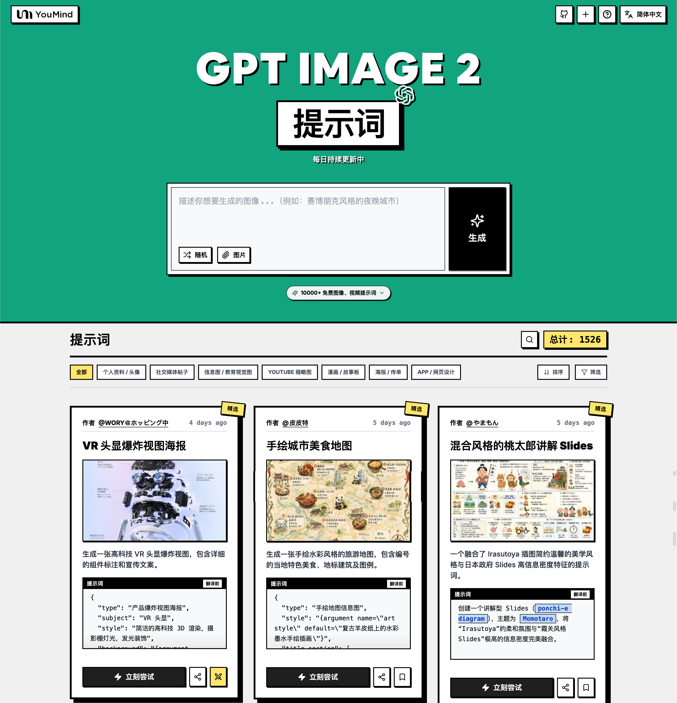

<a href="https://youmind.com/zh-TW/gpt-image-2-prompts">
  
</a>

> 💡 🎬 進階玩法：用 **Seedance 2** 把 GPT Image 2 生成的圖變成炸裂 AI 影片，2000+ 提示詞等你探索 👉 [awesome-seedance-2-prompts](https://github.com/YouMind-OpenLab/awesome-seedance-2-prompts)
# 🚀 GPT Image 2 提示詞大全

[](https://github.com/sindresorhus/awesome)
[](https://github.com/YouMind-OpenLab/awesome-gpt-image-2)
[](https://creativecommons.org/licenses/by/4.0/)
[](https://github.com/YouMind-OpenLab/awesome-gpt-image-2/actions)
[](docs/CONTRIBUTING.md)

> 🎨 OpenAI GPT Image 2 創意提示詞精選集合

> ⚠️ **版權聲明**：所有提示詞均收集自社區，僅供教育目的使用。如果您認為任何內容侵犯了您的權利，請[提交 issue](https://github.com/YouMind-OpenLab/awesome-gpt-image-2/issues/new?template=bug-report.yml)，我們將立即移除。

---

[](README.md) [](README_zh.md) [](README_zh-TW.md) [](README_ja-JP.md) [](README_ko-KR.md) [](README_th-TH.md) [](README_vi-VN.md) [](README_hi-IN.md) [](README_es-ES.md) [-Click%20to%20View-lightgrey)](README_es-419.md) [](README_de-DE.md) [](README_fr-FR.md) [](README_it-IT.md) [-Click%20to%20View-lightgrey)](README_pt-BR.md) [](README_pt-PT.md) [](README_tr-TR.md)

---

## 🌐 在網頁圖庫中查看

<div align="center">

[](https://youmind.com/zh-TW/gpt-image-2-prompts)

</div>

**[👉 瀏覽 YouMind GPT Image 2 提示詞圖庫](https://youmind.com/zh-TW/gpt-image-2-prompts)**

為什麼使用圖庫？

| Feature | GitHub README | youmind.com 圖庫 |
|---------|--------------|---------------------|
| 🎨 可視化佈局 | 線性列表 | 精美的瀑布流網格 |
| 🔍 搜索 | 僅 Ctrl+F | 全文搜索和篩選 |
| 🤖 AI 一鍵生圖 | - | AI 一鍵生圖 |
| 📱 移動端 | 基礎 | 完全響應式 |
| 🏷️ 分類 | - | 分類瀏覽 |


### 🏷️ 按分類瀏覽

- **使用情境**
  - [個人檔案 / 頭像](https://youmind.com/zh-TW/gpt-image-2-prompts?categories=profile-avatar)
  - [社群媒體貼文](https://youmind.com/zh-TW/gpt-image-2-prompts?categories=social-media-post)
  - [資訊圖表 / 教育視覺化內容](https://youmind.com/zh-TW/gpt-image-2-prompts?categories=infographic-edu-visual)
  - [YouTube 縮圖](https://youmind.com/zh-TW/gpt-image-2-prompts?categories=youtube-thumbnail)
  - [漫畫 / 分鏡腳本](https://youmind.com/zh-TW/gpt-image-2-prompts?categories=comic-storyboard)
  - [產品行銷](https://youmind.com/zh-TW/gpt-image-2-prompts?categories=product-marketing)
  - [電子商務主圖](https://youmind.com/zh-TW/gpt-image-2-prompts?categories=ecommerce-main-image)
  - [遊戲素材](https://youmind.com/zh-TW/gpt-image-2-prompts?categories=game-asset)
  - [海報／傳單](https://youmind.com/zh-TW/gpt-image-2-prompts?categories=poster-flyer)
  - [App / 網站設計](https://youmind.com/zh-TW/gpt-image-2-prompts?categories=app-web-design)
- **風格**
  - [攝影](https://youmind.com/zh-TW/gpt-image-2-prompts?categories=photography)
  - [電影感 / 電影劇照](https://youmind.com/zh-TW/gpt-image-2-prompts?categories=cinematic-film-still)
  - [動畫 / 漫畫](https://youmind.com/zh-TW/gpt-image-2-prompts?categories=anime-manga)
  - [插圖](https://youmind.com/zh-TW/gpt-image-2-prompts?categories=illustration)
  - [草圖 / 線稿](https://youmind.com/zh-TW/gpt-image-2-prompts?categories=sketch-line-art)
  - [漫畫 / 圖像小說](https://youmind.com/zh-TW/gpt-image-2-prompts?categories=comic-graphic-novel)
  - [3D 渲染](https://youmind.com/zh-TW/gpt-image-2-prompts?categories=3d-render)
  - [Q 版風格](https://youmind.com/zh-TW/gpt-image-2-prompts?categories=chibi-q-style)
  - [等距視角](https://youmind.com/zh-TW/gpt-image-2-prompts?categories=isometric)
  - [像素藝術](https://youmind.com/zh-TW/gpt-image-2-prompts?categories=pixel-art)
  - [油畫](https://youmind.com/zh-TW/gpt-image-2-prompts?categories=oil-painting)
  - [水彩](https://youmind.com/zh-TW/gpt-image-2-prompts?categories=watercolor)
  - [水墨 / 中式風格](https://youmind.com/zh-TW/gpt-image-2-prompts?categories=ink-chinese-style)
  - [復古 / 懷舊](https://youmind.com/zh-TW/gpt-image-2-prompts?categories=retro-vintage)
  - [賽博龐克 / 科幻](https://youmind.com/zh-TW/gpt-image-2-prompts?categories=cyberpunk-sci-fi)
  - [極簡主義](https://youmind.com/zh-TW/gpt-image-2-prompts?categories=minimalism)
- **主體**
  - [人像 / 自拍](https://youmind.com/zh-TW/gpt-image-2-prompts?categories=portrait-selfie)
  - [網紅 / 模特兒](https://youmind.com/zh-TW/gpt-image-2-prompts?categories=influencer-model)
  - [角色](https://youmind.com/zh-TW/gpt-image-2-prompts?categories=character)
  - [團體 / 情侶](https://youmind.com/zh-TW/gpt-image-2-prompts?categories=group-couple)
  - [產品](https://youmind.com/zh-TW/gpt-image-2-prompts?categories=product)
  - [食物 / 飲品](https://youmind.com/zh-TW/gpt-image-2-prompts?categories=food-drink)
  - [時尚單品](https://youmind.com/zh-TW/gpt-image-2-prompts?categories=fashion-item)
  - [動物 / 生物](https://youmind.com/zh-TW/gpt-image-2-prompts?categories=animal-creature)
  - [車輛](https://youmind.com/zh-TW/gpt-image-2-prompts?categories=vehicle)
  - [建築 / 室內設計](https://youmind.com/zh-TW/gpt-image-2-prompts?categories=architecture-interior)
  - [風景 / 大自然](https://youmind.com/zh-TW/gpt-image-2-prompts?categories=landscape-nature)
  - [城市景觀 / 街道](https://youmind.com/zh-TW/gpt-image-2-prompts?categories=cityscape-street)
  - [圖表](https://youmind.com/zh-TW/gpt-image-2-prompts?categories=diagram-chart)
  - [文字 / 字體排版](https://youmind.com/zh-TW/gpt-image-2-prompts?categories=text-typography)
  - [摘要 / 背景](https://youmind.com/zh-TW/gpt-image-2-prompts?categories=abstract-background)

---

## 📖 目錄

- [🌐 在網頁圖庫中查看](#-view-in-web-gallery)
- [🤔 什麼是 GPT Image 2？](#-what-is-gpt-image-2)
- [📊 統計數據](#-statistics)
- [🔥 精選提示詞](#-featured-prompts)
- [📋 所有提示詞](#-all-prompts)
- [🤝 如何貢獻](#-how-to-contribute)
- [📄 許可證](#-license)
- [🙏 致謝](#-acknowledgements)
- [⭐ Star 歷史](#-star-history)

---

## 🤔 什麼是 GPT Image 2？

**GPT Image 2**（代號 **"duct-tape"**）是 OpenAI 下一代圖像生成模型。社群測試回饋它在以下方面實現了質的飛躍：

- 🎯 **像素級文字渲染** — 中文、英文、日文均達到 native 水準，無錯字、無字形扭曲
- 🎨 **跨圖像素級一致性** — 同一角色、風格、IP 在多張圖間保持像素級一致
- ⚡ **商用級插畫質量** — 插畫風格輸出無需人工精修，即可直接用於商業場景
- 🌈 **真實藝術風格注入** — 不止是「模仿參考圖」，而是真正理解並再現藝術風格的靈魂
- 🔧 **故事板與產品系列** — 適合故事板、IP 形象、產品系列圖等需要多圖一致性的場景
- 📐 **多語言平面設計** — 社交卡片、Banner、海報一次生圖即可完成多語言文字排版

📚 **了解更多：** 查看社群測試 [報告要點](docs/FAQ.md)

### 🚀 Raycast 集成

部分提示詞支持使用 [Raycast Snippets](https://raycast.com/help/snippets) 語法的**動態參數**。尋找 🚀 Raycast Friendly 徽章！

**示例：**
```
A quote card with "{argument name="quote" default="Stay hungry, stay foolish"}"
by {argument name="author" default="Steve Jobs"}
```

在 Raycast 中使用時，您可以動態替換參數以快速迭代！

---

## 📊 統計數據

<div align="center">

| 指標 | 數量 |
|--------|-------|
| 📝 提示詞總數 | **16931** |
| ⭐ 精選 | **6** |
| 🔄 最後更新 | **2026年9月6日 星期日 凌晨1:45:56 [UTC]** |

</div>

---

## 🔥 精選提示詞

> ⭐ 由我們的團隊精心挑選，具有卓越的質量和創造力

### No. 1: VR 頭戴裝置爆炸圖海報


#### 📖 描述

生成一張高科技 VR 頭戴裝置爆炸圖，包含詳細的組件標註與宣傳文案。

#### 📝 提示詞

```
{
  "type": "產品爆炸圖海報",
  "subject": "VR 頭戴裝置",
  "style": "簡潔的高科技 3D 渲染，攝影棚燈光，發光細節",
  "background": "{argument name=\"background color\" default=\"柔和的紫藍色漸層\"}",
  "header": {
    "logo": "∞ {argument name=\"product name\" default=\"Meta Quest 3\"}",
    "subtitle": "{argument name=\"main catchphrase\" default=\"以全新的結構，定義全新的現實。\"}"
  },
  "layout": {
    "centerpiece": "垂直堆疊的 VR 頭戴裝置爆炸圖，展示 9 個不同的內部組件層：外殼、攝影機感測器、主機板與晶片、Pancake 透鏡、內部框架、電池組、側邊頭帶、頂部頭帶以及面部襯墊。",
    "callout_labels": {
      "count": 8,
      "left_side": [
        "Snapdragon® XR2 Gen 2\n以強大的處理效能，實現即時體驗。",
        "可調式 IPD 機構\n為廣大用戶提供舒適的配戴感。",
        "精密設計頭帶\n追求舒適與穩定性的工學設計。"
      ],
      "right_side": [
        "前飾板\n洗鍊的設計與最佳的重量平衡。",
        "追蹤攝影機\n實現高精度的位置追蹤與環境感知。",
        "Pancake 透鏡\n輕薄設計，提供寬廣視野與清晰影像。",
        "高效能電池\n支援長時間運作的最佳化電源設計。",
        "柔軟面部襯墊\n即使長時間配戴也能保持舒適。"
      ]
    },
    "footer": {
      "left_text_block": {
        "headline": "{argument name=\"bottom headline\" default=\"體驗，從結構進化。\"}",
        "body": "每一個零件都蘊含著支撐沉浸式體驗的尖端科技與匠心設計。Meta Quest 3 從內部結構開始，為您創造感受未來的體驗。"
      },
      "right_logo": "∞ Meta"
    }
  }
}
```

#### 🖼️ 生成圖片

##### Image 1

<div align="center">

</div>

#### 📌 詳情

- **作者:** [wory＠ホッピング中](https://x.com/wory37303852)
- **來源:** [Twitter Post](https://x.com/wory37303852/status/2045925660401795478#reversed-0)
- **發布時間:** 2026年4月19日
- **多語言:** en

**[👉 立即嘗試 →](https://youmind.com/zh-TW/gpt-image-2-prompts?id=13460)**

---

### No. 2: 手繪城市美食地圖


#### 📖 描述

生成一張手繪水彩風格的旅遊地圖，包含編號的在地特色美食、地標以及圖例。

#### 📝 提示詞

```
{
  "type": "手繪地圖資訊圖表",
  "style": "{argument name=\"art style\" default=\"復古羊皮紙上的水彩與墨水手繪插圖\"}",
  "title_section": {
    "text": "{argument name=\"city name\" default=\"成都\"} {argument name=\"map title\" default=\"吃貨暴走地圖\"}",
    "mascot": "戴著太陽眼鏡並比讚的卡通紅辣椒"
  },
  "border": "{argument name=\"border decoration\" default=\"綠葉與紅辣椒藤蔓\"}",
  "layout": {
    "background": "帶有黃色道路、藍色河流與綠色公園區域的質感米色羊皮紙",
    "sections": [
      {
        "title": "地標",
        "count": 6,
        "illustrations": ["傳統涼亭", "傳統寺院", "攀爬著熊貓的現代摩天大樓", "高聳電視塔", "傳統牌樓", "工業建築"],
        "labels": ["人民公園", "文殊院", "IFS", "339電視塔", "寬窄巷子", "東郊記憶"]
      },
      {
        "title": "美食景點",
        "count": 12,
        "illustrations": ["麻婆豆腐", "紅油水餃", "串串香", "三大炮", "蛋烘糕", "九宮格火鍋", "肥腸粉", "缽缽雞", "冒椒火辣", "蓋碗茶", "冰粉", "雙流老媽兔頭"],
        "labels": ["1 陳麻婆豆腐", "2 鍾水餃", "3 春熙路", "4 寬窄巷子·三大炮", "5 建設路·葉婆婆蛋烘糕", "6 玉林路·小龍坎火鍋", "7 香香巷·肥腸粉", "8 武侯祠大街·缽缽雞", "9 東郊記憶·冒椒火辣", "10 人民公園·鶴鳴茶社", "11 錦里古街·冰粉", "12 雙流老媽兔頭"]
      },
      {
        "title": "圖例",
        "position": "右下角",
        "count": 5,
        "items": ["紅點", "綠色房屋", "綠樹", "藍線", "黃色雙線"],
        "labels": ["美食地點", "地標景點", "公園綠地", "河流湖泊", "主要道路"]
      }
    ],
    "centerpiece": "坐著吃竹子的巨型熊貓",
    "bottom_right_extras": ["帶有 N、S、E、W 的復古羅盤玫瑰", "免責聲明文字『溫馨提示：吃辣需謹慎，腸胃要保護~』並附帶一個紅辣椒圖示"]
  }
}
```

#### 🖼️ 生成圖片

##### Image 1

<div align="center">

</div>

#### 📌 詳情

- **作者:** [皮皮特](https://x.com/mm_zzm44854)
- **來源:** [Twitter Post](https://x.com/mm_zzm44854/status/2045861258520568230#reversed-1)
- **發布時間:** 2026年4月19日
- **多語言:** en

**[👉 立即嘗試 →](https://youmind.com/zh-TW/gpt-image-2-prompts?id=13515)**

---

### No. 3: 採用混合風格的桃太郎說明用 Slides


#### 📖 描述

這是一個結合了「いらすとや (Irasutoya)」插圖簡約溫暖的美學，以及日本政府簡報高資訊密度特徵的提示詞。

#### 📝 提示詞

```
請為 {argument name="theme" default="桃太郎"} 製作一張說明用 Slides ({argument name="format" default="ポンチ絵 (ponchi-e) 圖表"})，將「いらすとや (Irasutoya)」的溫和氛圍與「霞關風格 (Kasumigaseki slides)」那種壓倒性的資訊密度融合在一起。
```

#### 🖼️ 生成圖片

##### Image 1

<div align="center">

</div>

##### Image 2

<div align="center">

</div>

#### 📌 詳情

- **作者:** [やまもん](https://x.com/yammamon)
- **來源:** [Twitter Post](https://x.com/yammamon/status/2045778624092254603)
- **發布時間:** 2026年4月19日
- **多語言:** ja

**[👉 立即嘗試 →](https://youmind.com/zh-TW/gpt-image-2-prompts?id=13983)**

---

### No. 4: 電子商務直播 UI 模型


#### 📖 描述

生成逼真的社群媒體直播介面並疊加在肖像上，包含可自訂的聊天訊息、禮物彈出視窗以及商品購買卡片。

#### 📝 提示詞

```
{
  "type": "直播 UI 模型",
  "subject": {
    "description": "{argument name=\"host name\" default=\"Elon Musk\"} 的肖像，微笑，穿著印有白色技術示意圖的黑色 T 恤",
    "background": "左側顯示帶有 '{argument name=\"left background logo\" default=\"SPACEX\"}' 文字的螢幕，右側顯示紅色的 '{argument name=\"right background logo\" default=\"Tesla T logo\"}' 和一輛深色汽車"
  },
  "ui_overlay": {
    "top_header": {
      "host_info": "頭像，名稱 '{argument name=\"host name\" default=\"Elon Musk\"}'，副標題 '55.6 萬本場點讚'，紅色 '關注' 按鈕",
      "rank_badge": "帶有 '全站第 1 名' 的金幣圖示",
      "viewer_stats": "3 個頂級觀眾頭像，分別顯示 '12.3w'、'8.6w'、'5.7w'，總計 '68.7 萬'，'X' 關閉按鈕",
      "right_links": "'更多直播 >'，'禮物展館 0/24' 帶有藍色 '經典' 標籤"
    },
    "mid_left_gifts": {
      "count": 2,
      "items": [
        "頭像 '科技愛好者'，'送小心心'，愛心圖示 x 1314",
        "頭像 '星辰大海'，'送火箭'，火箭圖示 x 666"
      ]
    },
    "bottom_left_chat": {
      "system_message": "等級 37 徽章 '宇宙漫遊者 加入了直播間'",
      "message_count": 7,
      "messages": [
        "小火箭: 馬斯克！未來可期！🚀",
        "future: 特斯拉 Model 2 什麼時候出？",
        "星空夢想家: SpaceX 今年能上火星嗎？",
        "AI 探索者: Neuralink 進展如何？",
        "帥氣的網友: 馬總好！",
        "Mars: 第一次來你的直播，超激動！",
        "用戶 123: 講講 AI 吧，會取代人類嗎？"
      ]
    },
    "bottom_right_product_card": {
      "hot_tag": "橘色 '熱賣 x 1888'",
      "image": "Tesla Cybertruck",
      "title": "{argument name=\"product name\" default=\"特斯拉 Cybertruck 電動皮卡\"}",
      "price": "{argument name=\"product price\" default=\"¥ 1,618,000\"}",
      "button": "紅色 '搶' 按鈕",
      "floating_animation": "半透明愛心沿著右側邊緣向上飄浮"
    },
    "bottom_bar": {
      "input_field": "'說點什麼...'",
      "icons": ["笑臉", "三個點", "購物車", "禮物盒", "分享"]
    }
  }
}
```

#### 🖼️ 生成圖片

##### Image 1

<div align="center">

</div>

#### 📌 詳情

- **作者:** [神经病不想好转](https://x.com/sjbbxhz)
- **來源:** [Twitter Post](https://x.com/sjbbxhz/status/2045684734714380687#reversed-0)
- **發布時間:** 2026年4月19日
- **多語言:** en

**[👉 立即嘗試 →](https://youmind.com/zh-TW/gpt-image-2-prompts?id=14036)**

---

### No. 5: 動漫武術對決


#### 📖 描述

生成一個動態的動漫風格動作場景，描繪兩名角色在傳統道場中伴隨元素光環進行戰鬥。

#### 📝 提示詞

```
一張極具動態感的動漫插圖，描繪兩名少女在傳統木造道場內進行激烈的武術對決。在前景中，一名留著 {argument name="character 1 hair" default="黑色高包頭配紅色髮帶"} 的少女擺出強而有力的低位武術架勢，奮力向前揮拳。她身穿 {argument name="character 1 outfit" default="白色中式上衣配紅色流蘇與寬鬆紅褲"}，強烈的紅色能量斬擊環繞著她揮動的四肢。在右側半空中，一名留著 {argument name="character 2 hair" default="淺紫色雙包頭"} 的少女優雅地躍起，自信地微笑著，身穿 {argument name="character 2 outfit" default="深綠色刺繡金邊洋裝與黑色緊身褲"}，伴隨著如水流般掃過的藍色能量軌跡。背景為古樸的木造寺廟內部，上方懸掛著一塊顯眼的招牌，寫著「{argument name="sign text" default="武術会"}」。場景充滿了爆炸性的動作張力、飛揚的塵土、碎裂的木質地板、閃耀的彩色粒子特效，以及將角色與細緻背景完美區隔的戲劇性低角度光影。
```

#### 🖼️ 生成圖片

##### Image 1

<div align="center">

</div>

#### 📌 詳情

- **作者:** [たねもみ 2.0 / Tanemomi Ver2.0](https://x.com/Tanemomi_Ver2)
- **來源:** [Twitter Post](https://x.com/Tanemomi_Ver2/status/2046063806846214265#reversed-0)
- **發布時間:** 2026年4月20日
- **多語言:** en

**[👉 立即嘗試 →](https://youmind.com/zh-TW/gpt-image-2-prompts?id=13467)**

---

### No. 6: 3D 石階演化資訊圖表


#### 📖 描述

將平面的演化時間軸轉換為逼真的 3D 石階資訊圖表，包含細緻的生物渲染圖與結構化的側邊欄。

#### 📝 提示詞

```
{
  "type": "演化時間軸資訊圖表",
  "instruction": "以 REFERENCE_0 作為結構基礎，將平面向量設計轉換為高度逼真的 3D 資訊圖表。將平滑的坡道替換為層次分明的石階，並將所有生物升級為照片級的 3D 模型。",
  "style": {
    "background": "{argument name=\"background style\" default=\"復古紋理羊皮紙\"}",
    "staircase": "{argument name=\"staircase material\" default=\"逼真的紋理石塊\"}",
    "subjects": "{argument name=\"organism style\" default=\"高度細緻的照片級 3D 渲染圖\"}"
  },
  "layout": {
    "main_title": "{argument name=\"main title\" default=\"人類演化\"}",
    "sections": [
      {
        "position": "左側邊欄",
        "count": 8,
        "labels": ["L0: 單細胞生命", "L1: 多細胞生物", "L2: 動物界", "L3: 脊索動物", "L4: 上陸革命", "L5: 哺乳綱", "L6: 人科演化", "L7: 智人紀元"]
      },
      {
        "position": "右上角",
        "title": "獲得的功能 / 失去的功能",
        "description": "帶有加號與減號圖示的圖例"
      },
      {
        "position": "底部中央",
        "title": "演化關鍵里程碑",
        "count": 6,
        "description": "包含 6 個展示猿類到人類演化剪影圖的時間軸"
      }
    ],
    "centerpiece": {
      "description": "蜿蜒的石階，共有 25 個編號階梯，展示特定生物。",
      "count": 25,
      "notable_elements": [
        "第 07 階：水母",
        "第 09 階：菊石",
        "第 10 階：三葉蟲",
        "第 24 階：直立行走的人類",
        "第 25 階：{argument name=\"future evolution concept\" default=\"帶有問號的發光宇宙剪影\"}"
      ]
    }
  }
}
```

#### 🖼️ 生成圖片

##### Image 1

<div align="center">

</div>

#### 📌 詳情

- **作者:** [知识猫图解](https://x.com/GeekCatX)
- **來源:** [Twitter Post](https://x.com/GeekCatX/status/2045792240044511277#reversed-1)
- **發布時間:** 2026年4月19日
- **多語言:** en

**[👉 立即嘗試 →](https://youmind.com/zh-TW/gpt-image-2-prompts?id=13491)**

---

## 📋 所有提示詞

> 📝 按發布日期排序（最新優先）

### No. 1: 個人檔案 / 頭像 - 自然感「剛睡醒」風格 Instagram 攝影


#### 📖 描述

這是一個用於捕捉 Instagram 風格中自然、不做作的「剛睡醒」瞬間的提示詞，具備柔和色調與真實的失焦模糊效果。

#### 📝 提示詞

```
日常生活隨拍 Instagram 風格攝影，一位 {argument name="age" default="18 歲"} 的亞洲美女，留著 {argument name="hairstyle" default="雙麻花辮"}，正用前置鏡頭自拍，{argument name="pose" default="一手托著臉頰，另一手隨意地靠在床邊"}。影像帶有自然的失焦模糊感，呈現出剛睡醒時隨手記錄的瞬間。背景為白天的臥室，床上堆放著褶皺的針織開襟衫與絨毛玩具。整體色調為乳白色，營造出夢核（dreamcore）般模糊且朦朧的氛圍。
```

#### 🖼️ 生成圖片

##### Image 1

<div align="center">

</div>

##### Image 2

<div align="center">

</div>

#### 📌 詳情

- **作者:** [万花筒](https://x.com/free25925)
- **來源:** [Twitter Post](https://x.com/free25925/status/2096071051738480741)
- **發布時間:** 2026年9月5日
- **多語言:** zh

**[👉 立即嘗試 →](https://youmind.com/zh-TW/gpt-image-2-prompts?id=33507)**

---

### No. 2: 個人檔案 / 頭像 - Cosplay 鏡面自拍模板


#### 📖 描述

一個可自訂的提示詞，用於生成逼真的 Cosplay 家居鏡面自拍，具備自然光影與風格化對話氣泡。

#### 📝 提示詞

```
{argument name="character" default="角色名稱"}, 年輕女性，真實家居 Cosplay 鏡面自拍，保留角色的標誌性髮型、髮色、服裝配色及配件，服裝呈現逼真的布料、金屬與飾品紋理。角色坐在木地板上，上半身自然挺直，頭部微低，單手垂直持手機遮住臉部。根據畫面方向，一條腿向左彎曲平放，小腿橫跨前景，腳趾指向右側；另一條腿位於畫面右側，膝蓋抬起、腳掌著地，形成不對稱的三角形坐姿。鞋履與腿部裝飾根據角色設定進行調整。3:4 垂直全身構圖，角色偏左置中，微高角度拍攝，中度廣角透視。淺灰色牆面，白色踢腳板，暖色木地板，柔和的室內自然光，白皙皮膚帶有微紅潤感，柔和明亮的高光，低對比度調色，生活化自拍質感。頭部右側添加一個手繪小氣泡，邊框與內容顏色與角色呼應；氣泡呈現符合角色性格、能力或喜好的代表性符號、迷你道具或簡短標語，與當前的自拍情境自然連結。左上角添加一個由風格化「V」與貓咪元素組成的簡單 Logo，右下角添加極小的手寫簽名「voxCAT」，並將「VOXCAT」標籤自然融入服裝中。影像乾淨清晰，手部與腿部結構準確，姿勢合理，細節穩定。
```

#### 🖼️ 生成圖片

##### Image 1

<div align="center">

</div>

##### Image 2

<div align="center">

</div>

##### Image 3

<div align="center">

</div>

##### Image 4

<div align="center">

</div>

#### 📌 詳情

- **作者:** [VoxCat](https://x.com/VoxcatAI)
- **來源:** [Twitter Post](https://x.com/VoxcatAI/status/2096058815107973316)
- **發布時間:** 2026年9月5日
- **多語言:** zh

**[👉 立即嘗試 →](https://youmind.com/zh-TW/gpt-image-2-prompts?id=33528)**

---

### No. 3: 個人檔案 / 頭像 - 黃金時刻和服人像


#### 📖 描述

一個用於製作電影感女性人像的逼真直式提示詞，場景為日落時分，身著花紋和服的女性坐在傳統日式緣側。

#### 📝 提示詞

```
創作一張逼真的直式時尚人像，主角為一名成年 {argument name="character ethnicity" default="東亞裔"} 女性，她正坐在傳統日式房屋陽光灑落的木製緣側上。她留著微濕感的長 {argument name="hair color" default="黑色"} 髮，幾縷髮絲散落在臉龐，妝容光澤柔和，雙唇豐滿，並戴著超大黑色長方形眼鏡。她神情平靜且帶有微妙的吸引力，以近距離、低角度、類似自拍的廣角視角直視鏡頭，一隻手臂向前景延伸。她身穿淡 {argument name="kimono color" default="粉藍色"} 和服或浴衣，上面有優雅的白色波浪與花卉圖案，領口飾有奶油色蕾絲，並繫著點綴珍珠與小型花朵裝飾的奶油色花卉腰帶。構圖親密且具電影感：她的上半身佔據了畫面大部分空間，緣側的「專案」呈對角線延伸至背景，傾斜的木製屋頂與障子風格牆面出現在她身後，左側則是柔焦的庭園、樹木、遠山以及低垂的夕陽餘暉。運用溫暖的夕陽逆光、真實的皮膚紋理、淺景深、自然鏡頭光暈，以及帶有左右兩側紅橙色漏光邊緣的懷舊底片質感。直式 9:16 比例，高細節，自然姿勢，無文字，無浮水印，無其他人物。
```

#### 🖼️ 生成圖片

##### Image 1

<div align="center">

</div>

##### Image 2

<div align="center">

</div>

##### Image 3

<div align="center">

</div>

##### Image 4

<div align="center">

</div>

#### 📌 詳情

- **作者:** [Nailai7981](https://x.com/VIBEQUIRKLABS)
- **來源:** [Twitter Post](https://x.com/VIBEQUIRKLABS/status/2096048091975807079#reversed-0)
- **發布時間:** 2026年9月5日
- **多語言:** en

**[👉 立即嘗試 →](https://youmind.com/zh-TW/gpt-image-2-prompts?id=33552)**

---

### No. 4: 個人檔案 / 頭像 - 嬰兒版形象轉換


#### 📖 描述

這是一個適用於 GPT Image 2 的主提示詞，能將成人肖像轉換為寫實的 1 歲嬰兒，同時保留膚色和眼型等身份特徵。

#### 📝 提示詞

```
以附上的照片作為身份參考，創作出這張照片中人物在 1 歲時的寫實、溫馨肖像。

將該人物的真實特徵融入嬰兒版本中，確保相似度清晰可見：相同的膚色、眼色與眼型、眉形、鼻形、唇形、臉部比例、髮色與髮質，以及任何顯著特徵，例如酒窩、下巴凹陷、雀斑或特定的笑容。嬰兒的臉部應呈現 12 個月大嬰兒特有的柔軟、圓潤與嬰兒肥，並擁有與該人物自然髮色相同的細軟胎毛，以及明亮的大眼睛。

性別將根據附上的照片進行推斷。若該人物為男性，嬰兒應穿著符合其色系的柔軟棉質服裝——舒適的長袖連身衣，或小 T 恤搭配軟褲與小襪子。若該人物為女性，嬰兒應穿著符合其色系的柔軟棉質服裝——舒適的長袖連身裙，或小上衣搭配柔軟內搭褲與小襪子。所有服裝皆需舒適、不透明且完全覆蓋身體，並呈現真實的布料質感與自然皺褶。

動作：嬰兒正坐在地板上的毛絨地毯或柔軟的奶油色毛毯上，專注地玩耍——雙手拿著色彩鮮豔的木製套圈玩具，或伸手去拿軟積木，或是抱著一隻小泰迪熊。呈現自然的嬰兒坐姿，身體微晃，一條腿蜷曲，完全沉浸在玩耍中。嬰兒剛抬頭看向鏡頭，露出開朗、純真的無牙笑容，露出幾顆小乳牙，眼睛因喜悅而瞇起，臉頰向上揚起。

場景：明亮、乾淨且舒適的家庭客廳——溫暖的木地板、柔軟的奶油色毛毯、散落的幾個彩色木製玩具、背景中模糊的沙發，以及一側讓自然光灑入的窗戶。一切整潔、安全且充滿居家感。

攝影與光線：使用全片幅相機搭配 85mm 鏡頭，光圈 f/1.8，相機置於與嬰兒視線平行的地板高度，採用緊湊的四分之三身位構圖，將玩具納入畫面，淺景深效果，嬰兒雙眼清晰銳利，背景柔焦模糊。光線採用來自一側的柔和自然窗光，並帶有溫和的補光，色調溫暖通透，呈現自然的嬰兒皮膚質感與柔和高光，眼中帶有清晰的眼神光。

風格：看起來像是一張在家中拍攝的專業家庭照片，自然且充滿歡樂，採用輕微溫暖的調色，帶有細膩的底片顆粒感，色調配置為 60% 的柔和奶油色與溫暖木質色，30% 來自服裝與玩具的柔和粉彩色，以及 10% 來自套圈玩具的明亮點綴色。純粹、健康且可愛。
```

#### 🖼️ 生成圖片

##### Image 1

<div align="center">

</div>

#### 📌 詳情

- **作者:** [M. Asif](https://x.com/meAsifAi)
- **來源:** [Twitter Post](https://x.com/meAsifAi/status/2095949634128818184)
- **發布時間:** 2026年9月4日
- **多語言:** en

**[👉 立即嘗試 →](https://youmind.com/zh-TW/gpt-image-2-prompts?id=33493)**

---

### No. 5: 個人檔案 / 頭像 - 身穿傳統長袍的男性肖像


#### 📖 描述

這是一份詳細的提示詞，用於在現代建築背景下，創作一位身穿傳統服飾、佩戴花紋頭巾與飛行員太陽眼鏡的男性寫實肖像。

#### 📝 提示詞

```
請使用 {argument name="reference photo" default="上傳的照片"} 作為臉部特徵參考。

創作一張超寫實的成人男性戶外肖像，採用半身垂直構圖。讓他稍微偏離中心站立，身體挺直，面向鏡頭，表情冷靜沉穩，雙唇自然閉合。

為他穿上 {argument name="outfit" default="一件傳統淺米色/奶油色長袖長袍，採用平滑的高級面料製成，具有簡約的圓領設計，中央有細緻的垂直縫線"}。服裝保持簡約優雅，無明顯標誌或過度刺繡。

在他的頭上纏繞 {argument name="headwear" default="一條紅白色大花紋的阿拉伯頭巾 (keffiyeh/shemagh)"}，呈現層次分明的頭巾造型。頭巾應具備白色底色，並帶有細緻的紅色幾何格紋與鋸齒狀編織圖案。將頭巾牢固地纏繞在頭頂，同時讓長長的一端自然垂落在臉部一側、肩膀上以及胸前。在上方纏繞的部分加入一條細微的淺藍色裝飾條。

他的臉部需乾淨無鬍鬚。大部分頭髮應隱藏在頭巾之下。

為他加上時尚的銀色金屬框飛行員太陽眼鏡，鏡片為大型淺色鏡面灰色，配有細雙樑與纖細鏡腳。鏡片上需包含寫實且細微的戶外反射效果。

背景使用柔焦的現代建築外觀，包含中性米色與灰色牆面、大型玻璃表面、垂直結構元素以及低調的當代細節。背景需進行深度虛化，呈現柔和的奶油色散景，確保所有注意力集中在主體上。

使用柔和的自然日光，讓臉部光線均勻，呈現寫實的中褐色皮膚質感、平衡的高光、細微的陰影、自然的唇色以及精確的布料紋理。維持以米色、奶油色、紅色、白色與柔和灰色為主的高級暖中性色調。

拍攝風格模擬專業 85mm 人像鏡頭，光圈約為 f/1.8，淺景深，平視拍攝角度，臉部細節清晰，皮膚毛孔寫實，頭巾編織紋理高度細緻，比例自然，頂級編輯攝影風格，DSLR 寫實畫質，高動態範圍，乾淨的調色，超寫實，8K 細節，垂直 4:5 構圖。

避免：鬍鬚、鬍渣、珠寶、項鍊、耳環、標誌、文字、過度磨皮、臉部特徵扭曲、不切實際的頭巾圖案、色彩過度飽和、皮膚看起來不自然、強烈陰影或分散注意力的背景元素。
```

#### 🖼️ 生成圖片

##### Image 1

<div align="center">

</div>

#### 📌 詳情

- **作者:** [Abkr Sadiq](https://x.com/abs_uiux)
- **來源:** [Twitter Post](https://x.com/abs_uiux/status/2095838115692757421)
- **發布時間:** 2026年9月4日
- **多語言:** en

**[👉 立即嘗試 →](https://youmind.com/zh-TW/gpt-image-2-prompts?id=33527)**

---

### No. 6: 個人檔案 / 頭像 - 情緒化高對比電影感肖像


#### 📖 描述

這是一個電影感肖像提示詞，透過百葉窗呈現戲劇性光影，專注於男性主體的質感與氛圍。

#### 📝 提示詞

```
請參考範例圖片，創作一張高解析度的電影感肖像，主角是一位年輕男性，留著 {argument name="hair style" default="凌亂且蓬鬆的深色頭髮"} 並蓄著修剪整齊的鬍鬚。他戴著經典的黑色旅行者風格太陽眼鏡，身穿 {argument name="clothing" default="簡約的寬鬆白色 T 恤"}。男子反向坐在 {argument name="furniture" default="復古深色木椅"} 上，將結實且交叉的前臂舒適地靠在彎曲的椅背頂端。他的左手腕戴著一款方形錶面的時尚黑色智慧手錶。場景的特色在於透過威尼斯百葉窗過濾出的戲劇性高對比光影，在男子的臉部、軀幹以及背景中質感十足的暖灰色灰泥牆上，投射出銳利且有節奏的水平陰影條紋。整體氛圍情緒化且寧靜，淺景深效果使焦點精準地落在男子的表情與髮絲質感上，而椅子的下半部與他的黑色長褲則柔和地虛化於前景中。色調採用中性且精緻的風格，以清爽的白色、深邃的黑色以及溫暖的木質大地色為主。
```

#### 🖼️ 生成圖片

##### Image 1

<div align="center">

</div>

#### 📌 詳情

- **作者:** [Dr Bloodline | AI](https://x.com/AiwithBloodline)
- **來源:** [Twitter Post](https://x.com/AiwithBloodline/status/2095794809575543218)
- **發布時間:** 2026年9月4日
- **多語言:** en

**[👉 立即嘗試 →](https://youmind.com/zh-TW/gpt-image-2-prompts?id=33519)**

---

### No. 7: 個人檔案 / 頭像 - 復古臥室電影感人像


#### 📖 描述

一個關於年輕男子在復古臥室中的超寫實電影感人像提示詞，著重於膠卷美學與懷舊光影。

#### 📝 提示詞

```
一張超寫實的電影感編輯人像，主角是一位 20 出頭、外型俊朗的年輕男子，隨性地坐在舒適的復古臥室中。構圖、取景、放鬆的姿勢、溫暖的膠卷美學與懷舊氛圍皆參考了原圖，但人物角色為原創。他擁有一頭濃密且自然的黑色波浪捲髮，略顯凌亂，幾縷髮絲垂落在額前；擁有濃密且輪廓分明的眉毛、深邃且富有表現力的榛褐色雙眼、筆挺的雕塑感鼻樑、突出的顴骨、線條分明的男性下顎線，以及淡淡的自然鬍渣。他身穿一件 {argument name="jacket color" default="深森林綠"} 的麂皮夾克，內搭一件簡約的米白色合身 T 恤，下身搭配深炭灰色牛仔褲。一隻手臂隨意地向鏡頭方向伸展，手部自然放鬆地置於前景，營造出細膩的深度與透視感。背景是一面米色紋理牆，牆上散落著復古的拍立得照片，營造出懷舊的個人畫廊氛圍。溫暖的鎢絲燈光與柔和的自然窗光交織，光影柔和，具備真實的皮膚紋理、細微的瑕疵、淺景深、35mm 膠卷顆粒感、柔和的暖色調調色、輕微的復古柔焦效果、紀實時尚攝影風格、真實的攝影細節、電影級構圖、自然的比例，高度細節化，照片級寫實，4K 高畫質。
```

#### 🖼️ 生成圖片

##### Image 1

<div align="center">

</div>

#### 📌 詳情

- **作者:** [HeisenLegacy](https://x.com/MohdAdnanA86218)
- **來源:** [Twitter Post](https://x.com/MohdAdnanA86218/status/2095763292275065334)
- **發布時間:** 2026年9月4日
- **多語言:** en

**[👉 立即嘗試 →](https://youmind.com/zh-TW/gpt-image-2-prompts?id=33526)**

---

### No. 8: 個人檔案 / 頭像 - 花卉睡袍鏡面自拍


#### 📖 描述

這是一份詳細的超寫實提示詞，描述一位東亞女性在陽光充足的臥室中，穿著絲綢花卉睡袍進行鏡面自拍。

#### 📝 提示詞

```
主體：
{argument name="subject" default="花卉睡袍鏡面自拍時刻"}

主體：
{argument name="character description" default="一位年輕的東亞女性跪在明亮臥室的床上，正拿著白色智慧型手機進行鏡面自拍"}。花卉睡袍是視覺焦點。

人物/表情：
小巧圓潤的鵝蛋臉，深褐色大眼，細眉，小巧鼻樑，淡珊瑚粉色雙唇。深褐色蓬鬆捲髮長度過胸，留著薄瀏海。表情溫柔，帶著淺淺微笑注視著手機螢幕。臉頰透著粉嫩光澤，妝容自然水潤。

服裝/姿勢：
{argument name="clothing" default="一件光澤感緞面睡袍，象牙白底色，印有柔和的粉色與棕色櫻花圖樣"}，深 V 交疊領口，寬袖設計，配有同款腰帶。坐在床上，雙膝微開，右手持白色智慧型手機於臉部右側，左手輕放在床鋪上。

背景/光影：
左側背景為掛著白色蕾絲窗簾的窗戶、室內盆栽及小型木製邊桌；右側為米色床頭板與白色枕頭；前景為白色羽絨被。柔和的晨光從左側窗戶灑入，在臉部與睡袍上投下淡淡陰影。

構圖/鏡頭：
1:1 正方形構圖，以與鏡面視線齊平的自然高度拍攝，呈現從頭部到大腿的畫面。人物居中且比例較大，智慧型手機位於臉部右側，窗戶位於最左側，白色床鋪佔據下半部。焦點集中在臉部與智慧型手機，背景呈現輕微模糊效果。

質感/風格：
超寫實真人攝影。捕捉緞面的柔和光澤、花卉圖案、窗簾的透光感、白色床鋪質感，以及明亮晨間氛圍下的自然肌膚紋理。

負面提示詞：
素色睡袍或浴衣；戶外背景或非鏡面拍攝
```

#### 🖼️ 生成圖片

##### Image 1

<div align="center">

</div>

#### 📌 詳情

- **作者:** [Prompt アトリエ｜AI画像プロンプト](https://x.com/CyberTotal2026)
- **來源:** [Twitter Post](https://x.com/CyberTotal2026/status/2095739885659263437)
- **發布時間:** 2026年9月4日
- **多語言:** ja

**[👉 立即嘗試 →](https://youmind.com/zh-TW/gpt-image-2-prompts?id=33518)**

---

### No. 9: 個人檔案 / 頭像 - 混合媒材花卉時尚肖像


#### 📖 描述

創作一張優雅的半身肖像，將年輕女性與水彩花卉、金箔及當代時尚風格完美融合。

#### 📝 提示詞

```
創作一張令人驚豔的高端藝術肖像，主角為 {argument name="character description" default="一位年輕女性"}，保留其真實的面部特徵，包括鵝蛋臉、柔和白皙的肌膚、榛綠色雙眼、直順深棕色秀髮以及溫柔自然的微笑。將其風格設定為精緻的當代混合媒材時尚肖像：她身穿深海軍藍西裝外套，內搭白色襯衫，領口飾有超大柔軟蝴蝶結，頭戴寬版深藍色絲絨髮帶，並配戴華麗的垂墜式銀飾珍珠耳環。構圖為胸部以上的半身像，置中且面向前方，眼神平靜，姿態優雅。在紋理豐富的奶油色紙張背景上，圍繞著表現力十足的水彩與壓克力花卉元素：畫面中需精確呈現 5 朵顯眼的花卉——左下方 1 朵大型藍花、其後方部分遮擋的 1 朵紅粉色花朵、右上方的 1 朵淡粉色花苞、中右方的 1 朵白粉色花苞，以及右下肩部附近的 1 簇紫色花朵。加入藍色、紫色、玫瑰色、米色與金色的顏料渲染、噴濺、筆觸，以及邊緣處的幾道垂直滴流，將肖像與繪畫風格的背景自然融合。採用明亮柔和的攝影棚燈光，細膩呈現肌膚細節，結合半寫實數位繪畫與水彩拼貼，營造頂級時尚雜誌的肖像氛圍，點綴精緻金箔，運用淺景深效果，呈現高解析度畫質，無文字，無浮水印，無其他人物。
```

#### 🖼️ 生成圖片

##### Image 1

<div align="center">

</div>

#### 📌 詳情

- **作者:** [Hania Ai](https://x.com/HaniaAi12)
- **來源:** [Twitter Post](https://x.com/HaniaAi12/status/2095720935731110395#reversed-0)
- **發布時間:** 2026年9月4日
- **多語言:** en

**[👉 立即嘗試 →](https://youmind.com/zh-TW/gpt-image-2-prompts?id=33448)**

---

### No. 10: 個人檔案 / 頭像 - 植物園中女性的超寫實肖像


#### 📖 描述

這是一份詳細的提示詞，用於生成高品質、超寫實的生活風格肖像，描繪一位坐在綠意盎然公園中的女性，呈現柔和的金色光影與雜誌編輯風格。

#### 📝 提示詞

```
一張超寫實的生活風格肖像，主角為一位 {argument name="subject" default="年輕女性"}，隨意地坐在綠意盎然、寧靜的植物園古老石階上。她留著中分長直深棕色秀髮，妝容自然優雅，眉型輪廓分明，擁有溫暖的棕色雙眸，配戴精緻的金色圓圈耳環與細緻的金色墜飾項鍊。她身穿寬鬆的淺灰色襯衫，袖口捲起，搭配同色系的休閒灰色長褲，腳踩乾淨的白色低筒運動鞋。她盤腿而坐，手持鉛筆在膝上的小型螺旋筆記本中書寫，神情冷靜、溫柔且自信地直視鏡頭。

她身旁放著一個 {argument name="accessory" default="黑色休閒後背包"} 和一杯裝有吸管的透明塑膠杯冰咖啡。背景為茂密的樹木、濃密的綠色植被、一張古樸的木製公園長椅，以及一座傳統的小型木造涼亭。溫暖的午後陽光自然地穿透葉片，營造出柔和的金色光暈、寫實的斑駁陰影以及優美的背景散景。電影感攝影，自然的皮膚紋理，真實的布料細節，淺景深，50mm 鏡頭，f/2.0，平視構圖，柔和暖色調，高動態範圍，編輯風格生活攝影，超寫實，高度細節，真實的抓拍氛圍，垂直肖像構圖，4:5 長寬比。
```

#### 🖼️ 生成圖片

##### Image 1

<div align="center">

</div>

#### 📌 詳情

- **作者:** [Maha](https://x.com/Aiwithmaha)
- **來源:** [Twitter Post](https://x.com/Aiwithmaha/status/2095712541116928077)
- **發布時間:** 2026年9月4日
- **多語言:** en

**[👉 立即嘗試 →](https://youmind.com/zh-TW/gpt-image-2-prompts?id=33419)**

---

### No. 11: 個人檔案 / 頭像 - 帶有塗鴉風格的油畫質感肖像


#### 📖 描述

這是一個提示詞，利用上傳的人臉作為參考，創作出一幅以充滿活力的街頭塗鴉為背景、具有油畫質感的年輕男性肖像。

#### 📝 提示詞

```
使用上傳的人臉作為參考。
研究上傳照片的臉部特徵，並以此為靈感繪製出一名外貌相似的 {argument name="subject" default="年輕男性"}，採用油畫質感肖像風格，呈現厚重的堆疊筆觸。
髮型：凌亂、蓬鬆的深色捲髮，自然垂落（不戴帽子），留有淡淡的鬍渣。
服裝：{argument name="clothing" default="白襯衫搭配黑領帶"}，休閒寬鬆版型，無珠寶，無飾品。
皮膚：乾淨的裸肌，無刺青。
姿勢：近距離上半身肖像，一隻手靠近下巴/下顎，自信且強烈的眼神直視鏡頭，肩膀略微傾斜。
背景：{argument name="background style" default="大膽且色彩鮮豔的街頭塗鴉背景"} —— 充滿活力的噴漆風格字體與標籤，包含橘色、粉紅色、紫色、黃色與青色，呈現城市牆面質感，並散佈著充滿能量的層疊塗鴉文字，如「STAY WILD」、「ONE LOVE」以及抽象的塗鴉符號與箭頭。
藝術風格：厚實的油畫質感，沉重的調色刀筆觸，寫實細膩的臉部渲染與粗獷的繪畫質感相結合，色彩鮮豔飽和，高對比度，畫廊級的藝術肖像。
攝影角度：平視，胸部以上的近距離肖像鏡頭，置中構圖。
文字疊加：
角落處有小巧時尚的簽名風格文字：「AMIR」
```

#### 🖼️ 生成圖片

##### Image 1

<div align="center">

</div>

#### 📌 詳情

- **作者:** [M Amir](https://x.com/Aiwithamirr1)
- **來源:** [Twitter Post](https://x.com/Aiwithamirr1/status/2095712337433124873)
- **發布時間:** 2026年9月4日
- **多語言:** en

**[👉 立即嘗試 →](https://youmind.com/zh-TW/gpt-image-2-prompts?id=33504)**

---

### No. 12: 個人檔案 / 頭像 - 迷你兒童膝上肖像


#### 📖 描述

一張溫馨且具備照片真實感的直式肖像，描繪了一位年輕女性凝視著坐在她膝上、縮小版自己的模樣。

#### 📝 提示詞

```
創作一張高品質、具備照片真實感的直式攝影棚肖像，包含兩位主體：1 位成年年輕女性，以及 1 位坐在她膝上、縮小版的兒童。該成年女性為 {argument name="adult woman ethnicity" default="南亞裔年輕女性"}，擁有溫暖的中性膚色、深邃且富有表情的眉毛、自然妝容、柔和的粉色嘴唇，以及深色波浪捲髮，隨意地紮成低馬尾，中分並留有幾縷修飾臉型的髮絲。她身穿一件寬鬆的 {argument name="adult shirt color" default="黑色"} 圓領 T 恤、黑色長褲，佩戴一條精緻的細項鍊，掛著一顆小珍珠墜飾、小巧的耳釘，以及一支棕色皮革錶帶的手錶。她採坐姿，身體略微轉向鏡頭，低頭凝視著膝上的迷你兒童，嘴角帶著溫柔的微笑。該兒童是一個非常嬌小、寫實、如娃娃般的縮小版成年女性，擁有相同的五官、深色波浪捲髮、小巧耳釘，並帶著愉悅的表情仰望著成年女性；兒童盤腿坐在成年女性的膝上，雙手放在身前。兒童身穿柔和的 {argument name="child outfit color" default="棕褐色"} 短袖上衣與同色系長褲，布料帶有細緻紋理，並穿著涼鞋。使用溫暖的黃金時刻攝影棚燈光，右上方有柔和的邊緣光捕捉髮絲，呈現平滑的膚色、真實的布料質感、淺景深，以及背景為柔和模糊的 {argument name="background color" default="暖米棕色"} 無縫背景。構圖為腰部以上、置中、4:5 直式肖像，營造親密的母女感與奇幻的微縮比例氛圍，呈現高階編輯攝影風格，具備 85mm 鏡頭視覺效果，自然姿勢，清晰的臉部細節，無文字，無浮水印，無多餘人物，無扭曲的手部，無卡通風格。
```

#### 🖼️ 生成圖片

##### Image 1

<div align="center">

</div>

#### 📌 詳情

- **作者:** [Elsa Ai](https://x.com/ElsaSofia__AI)
- **來源:** [Twitter Post](https://x.com/ElsaSofia__AI/status/2095695933384364480#reversed-0)
- **發布時間:** 2026年9月4日
- **多語言:** en

**[👉 立即嘗試 →](https://youmind.com/zh-TW/gpt-image-2-prompts?id=33440)**

---

### No. 13: 個人檔案 / 頭像 - 九宮格企業形象照拼貼


#### 📖 描述

生成一張 3×3 的真實攝影棚人像拼貼，展示同一位專業男士在不同高階主管姿勢下的形象，適用於品牌推廣或 LinkedIn 風格的影像。

#### 📝 提示詞

```
創建一張超逼真的 3×3 專業攝影棚人像拼貼，主角為同一位成年男性，年齡約為 {argument name="age range" default="25–35 歲"}，確保九個畫面中的人物身份保持一致。他是一位刮鬍乾淨的黑人男性，擁有中棕色皮膚、整潔的短黑髮、溫暖的棕色眼睛，表情自信且平易近人，並穿著精緻的商務服裝。所有畫面中的服裝保持一致：剪裁合身的 {argument name="suit color" default="海軍藍"} 西裝、淺藍色開領襯衫（不打領帶）、白色口袋巾、銀色手錶，在可見處穿著黑色皮鞋。使用柔和的專業攝影棚燈光、清晰逼真的皮膚紋理、自然的臉部比例，以及平滑的冷灰藍色漸層攝影棚背景，唯全身站立的畫面可使用較淺的灰色牆面與地板。

畫布與版面：正方形影像，分割為 9 個大小相等的肖像方格，組成整齊的 3×3 網格，格與格之間有寬闊的白色間隙，且不含任何文字、標誌、浮水印或標籤。每個方格應看起來像是同一場高階主管形象照拍攝中的不同選片，同時保持相同的臉部特徵、儀容、服裝、燈光品質與色調。

畫面數量與姿勢，共 9 張肖像：
1. 左上：近距離四分之三肖像，坐姿或胸部以上裁切，視線看向觀眾左側，右手托腮呈現思考姿勢，手錶清晰可見。
2. 上中：較寬的坐姿肖像，坐在凳子上，身體微側，對著鏡頭微笑，一隻手放在膝蓋附近，可見從頭到膝蓋的完整西裝。
3. 右上：緊湊的正面頭像，直視鏡頭，溫和微笑，對稱的企業形象照風格。
4. 左中：半身站立肖像，面向鏡頭，雙手在腰部附近調整或抓著西裝外套，自信地微微一笑。
5. 中中：中景特寫，身體前傾，下巴靠在拳頭上，直視鏡頭，手錶突出，展現沉穩的主管表情。
6. 右中：坐姿側角肖像，雙手交握身體前傾，看向鏡頭，友善微笑，西裝袖口與手錶可見。
7. 左下：坐姿四分之三肖像，視線看向觀眾右側，一隻手臂橫放在大腿上，放鬆的微笑，手錶可見。
8. 右下：全身站立肖像，背景為淺灰色牆面，雙手抓著西裝翻領，腳踝交叉，黑色皮鞋可見，構圖置中並保留較多留白。
9. 右下：中景肖像，呈現男子正在說話或簡報的樣子，視線稍微偏離鏡頭，雙手張開呈現交談手勢，展現友善的專業微笑。

視覺風格：頂級 LinkedIn/高階主管品牌攝影、照片級真實感、高解析度、對焦清晰、討喜的柔光箱燈光、細膩的輪廓光、真實的布料皺褶、一致的調色、平衡的對比度、乾淨的企業美學。避免使用漫畫、插畫、面部不一致、額外人物、重複肢體、扭曲的手部、文字或過於戲劇化的燈光。
```

#### 🖼️ 生成圖片

##### Image 1

<div align="center">

</div>

#### 📌 詳情

- **作者:** [Abkr Sadiq](https://x.com/abs_uiux)
- **來源:** [Twitter Post](https://x.com/abs_uiux/status/2095630562446676183#reversed-0)
- **發布時間:** 2026年9月3日
- **多語言:** en

**[👉 立即嘗試 →](https://youmind.com/zh-TW/gpt-image-2-prompts?id=33449)**

---

### No. 14: 個人檔案 / 頭像 - 東亞女性自拍肖像


#### 📖 描述

一個用於生成高細節、表情平靜的女性特寫自拍的擬真提示詞，包含特定的造型與室內光影細節。

#### 📝 提示詞

```
一張 {argument name="subject" default="年輕東亞女性"} 的特寫自拍肖像，擁有白皙如瓷的肌膚，正視鏡頭，表情平靜且帶點微嘟。她留著 {argument name="hair style" default="烏黑亮麗的長直髮"}，柔軟的法式瀏海垂落在額前，修飾著臉型。她戴著一副黑色大框長方形眼鏡。妝容自然，眉型清晰，畫著細緻的眼線，唇色為霧面乾燥玫瑰色。她的右手抬起，手指輕輕抵在臉頰與下巴處。她穿著一件 {argument name="clothing" default="合身羅紋米色/灰褐色背心"}，領口為方形設計。頸部佩戴兩條精緻的銀色疊戴項鍊，掛著小型心形墜飾。右手腕戴著兩條細銀鍊手鍊，其中一條掛著一個小巧的心形吊飾。背景為光線柔和的飯店風格室內，牆面呈暖米色，有一盞發光的檯燈，淺色沙發處於失焦狀態。柔和自然光，淺景深，擬真，高細節，8k，垂直肖像構圖。
```

#### 🖼️ 生成圖片

##### Image 1

<div align="center">

</div>

#### 📌 詳情

- **作者:** [Feyber](https://x.com/woleswoosh)
- **來源:** [Twitter Post](https://x.com/woleswoosh/status/2095572540185817337)
- **發布時間:** 2026年9月3日
- **多語言:** en

**[👉 立即嘗試 →](https://youmind.com/zh-TW/gpt-image-2-prompts?id=33406)**

---

### No. 15: 個人檔案 / 頭像 - 具備參考身分的電影感男性肖像


#### 📖 描述

此提示詞旨在從參考圖像中保留臉部特徵，同時創作出一位穿著西裝、帶有戲劇性光影的超寫實電影感男性肖像。

#### 📝 提示詞

```
使用參考圖像作為人物的身分基準，保留精確的臉部特徵、臉型、髮型、鬍鬚、膚色、比例以及整體身分，同時重現相同的藝術構圖、插畫風格與視覺張力。超寫實電影感肖像，主角為 {argument name="subject" default="穿著黑色西裝的男子"}，從背後拍攝，頭部轉向肩膀方向，眼神銳利且強烈地注視著鏡頭。短髮具備紋理感並帶有細微挑染，鬍鬚修剪整齊。上方投射的戲劇性聚光燈在頭髮與臉部形成溫暖的金色光暈，並逐漸融入深色背景中。強烈的明暗對照法（chiaroscuro）光影，具備深邃陰影與柔和高光。長寬比 4:3。添加浮水印
```

#### 🖼️ 生成圖片

##### Image 1

<div align="center">

</div>

#### 📌 詳情

- **作者:** [Muhammad Jamil](https://x.com/JamilAI55)
- **來源:** [Twitter Post](https://x.com/JamilAI55/status/2095503707412517109)
- **發布時間:** 2026年9月3日
- **多語言:** en

**[👉 立即嘗試 →](https://youmind.com/zh-TW/gpt-image-2-prompts?id=33383)**

---

### No. 16: 個人檔案 / 頭像 - 高階主管辦公室肖像


#### 📖 描述

一張寫實風格的全身商務肖像，描繪一位身著西裝的高階主管坐在現代化高樓辦公室中，非常適合用於專業品牌形象視覺。

#### 📝 提示詞

```
創作一張寫實風格的高階主管肖像，主角是一位自信的 {argument name="subject description" default="年輕黑人男性"}，坐在現代化高樓辦公室的黑色皮製辦公椅上，時間為黃昏。他位於畫面中央，直視鏡頭，表情冷靜嚴肅，雙腿交疊，一隻手正在調整領口附近的黑色領帶，另一隻手放在膝上。他身穿剪裁合身的 {argument name="suit color" default="駝褐色"} 西裝、挺拔的白色襯衫、黑色領帶、黑色口袋巾、黑色西裝襪、擦得發亮的黑色皮鞋，並佩戴黑色腕錶。他身後是落地窗，映照出柔和模糊的藍色城市夜景與散景燈光；右側是一個深色木質書架，配有溫暖的層板燈光、書籍、裝飾品與一株小綠植；左側邊緣為一張深色辦公桌。運用真實的皮膚紋理、自然的比例、對主角進行清晰對焦、淺景深效果，以及結合溫暖室內光與冷色調窗光的電影級企業照明，採用垂直全身構圖，呈現頂級商業雜誌風格，無文字，無浮水印。
```

#### 🖼️ 生成圖片

##### Image 1

<div align="center">

</div>

#### 📌 詳情

- **作者:** [Abkr Sadiq](https://x.com/abs_uiux)
- **來源:** [Twitter Post](https://x.com/abs_uiux/status/2095496845791224262#reversed-0)
- **發布時間:** 2026年9月3日
- **多語言:** en

**[👉 立即嘗試 →](https://youmind.com/zh-TW/gpt-image-2-prompts?id=33445)**

---

### No. 17: 個人檔案 / 頭像 - 未來感銀髮動漫肖像


#### 📖 描述

這是一個為賽博龐克城市背景下，擁有銀髮與翡翠綠眼眸的年輕女性所設計的數位繪畫提示詞，融合了精緻感與動漫美學。

#### 📝 提示詞

```
一位年輕女性的風格化肖像，擁有 {argument name="hair color" default="短銀髮"} 和 {argument name="eye color" default="翡翠綠眼眸"}，身穿 {argument name="outfit" default="帶有金屬裝飾的俐落未來感白色服裝"}。背景為充滿未來感的城市霓虹燈，並帶有旋轉的全息圖案。動漫風格的數位繪畫，渲染效果柔和且充滿活力。展現精緻、神秘與先進科技的主題。中景特寫，聚焦於富有表現力的雙眼與精緻的服裝細節。明亮且色彩豐富的燈光，採用冰藍、銀色與發光綠色的冷色調。線條乾淨流暢，營造出冷靜而神秘的氛圍。靈感源自賽博龐克優雅風格與未來極簡主義。
```

#### 🖼️ 生成圖片

##### Image 1

<div align="center">

</div>

#### 📌 詳情

- **作者:** [LANDCÄSTER.EXE](https://x.com/LANDCASTER_92)
- **來源:** [Twitter Post](https://x.com/LANDCASTER_92/status/2095488914689556954)
- **發布時間:** 2026年9月3日
- **多語言:** en

**[👉 立即嘗試 →](https://youmind.com/zh-TW/gpt-image-2-prompts?id=33428)**

---

### No. 18: 個人檔案 / 頭像 - 私人飛機生活風格攝影


#### 📖 描述

一張寫實的 iPhone 風格照片提示詞，描繪了一個人在私人飛機客艙中放鬆的場景，具備自然光線與專業穿搭。

#### 📝 提示詞

```
一張隨性、直式的 {argument name="photo style" default="iPhone-style"} 照片，拍攝一名坐在 {argument name="location" default="private jet"} 客艙桌旁的人，正處於巡航高度。他們隨意地向後靠，一隻手拿著 {argument name="drink" default="coffee"}，另一隻手放在打開的 MacBook 上。他們穿著深海軍藍的高品質針織 Polo 衫、剪裁合身的米白色長褲，並配戴著低調的銀色腕錶。飛機內部裝潢精緻：高光澤木質飾板、柔和的環境 LED 照明，以及完全收起的遮陽板，露出高空深藍色的天空。姿勢與表情傳達出輕鬆、自信的氛圍——自然的體態，而非刻意擺拍。以寫實的行動攝影風格拍攝：自然的景深、輕微的手持不完美感、柔和的窗光衰減、精確的皮膚紋理與布料細節、真實的色彩分級（無過度飽和），焦點清晰地落在腕錶與針織紋理上，背景則呈現柔和的模糊效果。
```

#### 🖼️ 生成圖片

##### Image 1

<div align="center">

</div>

##### Image 2

<div align="center">

</div>

#### 📌 詳情

- **作者:** [H A J R A](https://x.com/codewithhajra)
- **來源:** [Twitter Post](https://x.com/codewithhajra/status/2095481672879771979)
- **發布時間:** 2026年9月3日
- **多語言:** en

**[👉 立即嘗試 →](https://youmind.com/zh-TW/gpt-image-2-prompts?id=33412)**

---

### No. 19: 個人檔案 / 頭像 - 黃金時刻太陽眼鏡人像


#### 📖 描述

生成一張電影感十足的時尚近距離人像，主角配戴圓形太陽眼鏡並身穿紅色高領毛衣，呈現戲劇性的溫暖光影條紋效果。

#### 📝 提示詞

```
創作一張令人驚豔、超寫實且高解析度的近距離人像，主角為一位年輕女性，擁有 {argument name="hair color" default="帶有溫暖銅色挑染的深褐色長髮"}，置中於 3:4 的垂直構圖中。她面朝鏡頭，表情冷靜自信，嘴角帶著細微的閉口微笑，透過一副完美的圓形金邊太陽眼鏡直視前方，鏡片為深色反光材質。鏡片必須清晰反射出金色的戶外公園場景，包含樹木、步道與低垂的陽光。運用戲劇性的黃金時刻暖色調光線，讓強烈的對角線陽光與陰影條紋橫跨她的額頭、太陽眼鏡、臉頰、嘴唇、頸部與毛衣，呈現出如同透過百葉窗或樹枝過濾的光影效果。她的肌膚應看起來自然且透亮，具備真實的毛孔與柔和的高光；嘴唇為亮面深紅色。她身穿一件粗針織羅紋 {argument name="sweater color" default="深緋紅色"} 高領毛衣，露出肩膀至胸部的細節，雙耳配戴珍珠垂墜耳環。在高領毛衣上精確加入 2 枚小型裝飾刺繡別針：觀者左側為 1 枚微小的紅色愛心，觀者右側為 1 枚微小的白色鴿子。背景為深暖褐色，經過柔焦處理，具備淺景深，無可辨識的環境細節。頭髮應豐盈、蓬鬆且具光澤，以捕捉橘色輪廓光的髮絲環繞臉龐。電影級時尚攝影風格，85mm 鏡頭質感，臉部與眼鏡焦點銳利，對比豐富，溫暖琥珀色調，具備照片級真實紋理，除右下角顯示 {argument name="signature text" default="Enaya"} 的細緻草寫簽名外，不包含任何額外文字。
```

#### 🖼️ 生成圖片

##### Image 1

<div align="center">

</div>

#### 📌 詳情

- **作者:** [Arina Ai](https://x.com/Arina_hoqe)
- **來源:** [Twitter Post](https://x.com/Arina_hoqe/status/2095470808894468254#reversed-0)
- **發布時間:** 2026年9月3日
- **多語言:** en

**[👉 立即嘗試 →](https://youmind.com/zh-TW/gpt-image-2-prompts?id=33447)**

---

### No. 20: 個人檔案 / 頭像 - 女性與同款 Q 版人像


#### 📖 描述

生成一張照片級寫實的攝影棚人像，呈現一位女性與身旁穿著同款服飾的可愛迷你 Q 版分身。

#### 📝 提示詞

```
創作一張照片級寫實的全身攝影棚人像，畫面中精確包含兩位主體：一位真實的年輕女性，以及一位站在她身旁、與她穿著同款服飾的可愛迷你 3D Q 版分身。真實女性為 {argument name="woman age and appearance" default="一位膚色白皙、五官精緻、擁有藍綠色雙眸、濃密眉毛，以及深棕色凌亂包頭並留有臉頰碎髮的年輕女性"}；她直立於畫面左側，面向鏡頭，表情平靜自然。她的右手自然垂在身側，左手輕輕放在 Q 版角色的頭頂上。Q 版分身站在右側，高度約為真實女性的膝蓋至大腿處，擁有超大頭部、明亮且富有神采的大眼睛、紅潤臉頰、小巧的微笑嘴型，以及與真實女性相同的深棕色凌亂包頭；她向上仰望著真實女性，表情甜美且充滿崇拜。兩位主體皆穿著同款服飾：{argument name="outfit" default="一件帶有銀色拉鍊與按扣的酒紅色皮革機車夾克、黑色上衣、黑色高腰寬褲，以及黑色厚底鞋"}。真實女性的服飾需呈現真實的布料與皮革質感，而 Q 版分身則需呈現精緻且具備 3D 玩具感的材質，同時保留相同的服飾細節。將兩人置於無接縫的 {argument name="background color" default="中性灰"} 攝影棚背景中，地面帶有柔和陰影，採用置中構圖，全身從頭到腳完整呈現，垂直人像取景，柔和的擴散式攝影棚燈光，細膩的電影級寫實感，高細節，自然的皮膚紋理，無文字，無浮水印，無額外人物，無腳部裁切。
```

#### 🖼️ 生成圖片

##### Image 1

<div align="center">

</div>

#### 📌 詳情

- **作者:** [Elsa Ai](https://x.com/ElsaSofia__AI)
- **來源:** [Twitter Post](https://x.com/ElsaSofia__AI/status/2095467491334205827#reversed-0)
- **發布時間:** 2026年9月3日
- **多語言:** en

**[👉 立即嘗試 →](https://youmind.com/zh-TW/gpt-image-2-prompts?id=33441)**

---

### No. 21: 社群媒體貼文 - 奢華街頭風格杜賓犬人像


#### 📖 描述

創作一張充滿時尚雜誌風格的強烈人像，描繪一名身穿奢華街頭服飾的男子與一隻杜賓犬坐在大理石階梯上，採用單色調與戲劇性光影。

#### 📝 提示詞

```
超寫實電影感人像，主角為一位 {argument name="subject description" default="20 出頭、外型極其俊美的年輕男子"}，自信地坐在寬闊的白色大理石階梯上，營造出強烈且神秘的時尚雜誌氛圍。他擁有一頭濃密且自然的黑色波浪捲髮，略顯凌亂，眉毛濃密分明，深邃且富有表現力的深褐色雙眼，鼻樑筆挺，顴骨突出，下顎線條銳利陽剛，並留有淡淡的自然鬍渣。他頭戴黑色羅紋針織帽，配戴黑色長方形墨鏡，身穿一件超大尺寸的 {argument name="outfit" default="黑色戰術風格夾克"}，內搭合身黑色襯衫，下著寬鬆黑色長褲，腳踩頂級黑色軍靴。他的坐姿沉穩且具主導性，手肘自然地靠近膝蓋，雙手輕輕扶著一隻 {argument name="animal" default="威嚴的黑褐色杜賓犬"} 的頭部，杜賓犬警覺地坐在他雙腿之間。階梯後方站著幾名身穿黑衣的匿名保全人員，身影模糊且部分隱沒在白灰色的氛圍霧氣中。極簡主義的白色建築背景，對稱構圖，主體置中，景深強烈，戲劇性的柔和光影，細膩的陰影，奢華街頭風格美學，帶有自然膚色的 moody 單色調，照片級的皮膚與布料質感，電影級調色，淺景深，85mm 人像鏡頭，高細節，編輯攝影，8K，垂直構圖，無文字，無浮水印。
```

#### 🖼️ 生成圖片

##### Image 1

<div align="center">

</div>

#### 📌 詳情

- **作者:** [HeisenLegacy](https://x.com/MohdAdnanA86218)
- **來源:** [Twitter Post](https://x.com/MohdAdnanA86218/status/2096115834796335363)
- **發布時間:** 2026年9月5日
- **多語言:** en

**[👉 立即嘗試 →](https://youmind.com/zh-TW/gpt-image-2-prompts?id=33496)**

---

### No. 22: 社群媒體貼文 - 東方禪意美學桌布


#### 📖 描述

一份詳細的提示詞，用於創作一張極簡且清透的東方美學海報，呈現晨光中圓窗旁的年輕女子。

#### 📝 提示詞

```
東方禪意極簡封面海報，明亮女性美學，新中式晨間氛圍高質感封面。9:16 垂直構圖，整體畫面輕盈、清透、乾淨、明亮，具備現代東方女性美學與小紅書 (Xiaohongshu) 封面質感。

主體為一位年輕的東方古風女子，{argument name="pose" default="站在巨大的圓形格窗旁"}。人物位於畫面右下角，微微轉身，姿態放鬆、安靜且柔和，帶有清晨剛醒時的從容與內斂氣質。女子五官精緻細膩，具備東方美感，梳著簡約優雅的髮髻，裝飾著幾朵小白花與輕垂的髮帶。服裝為輕盈的古風長裙，顏色為 {argument name="outfit colors" default="淺白、淡杏粉與極淡薄荷綠的漸層"}。布料輕薄透明，不過分華麗，沒有複雜的刺繡或厚重的頭飾。左手自然地放在窗台上，右手垂下，手持一小枝白花。手部結構自然，比例準確。

場景為極簡的白牆室內空間，以奶油白色牆面作為高亮度基底。畫面左側保留大面積留白，適合標題排版。圓形窗戶是主要的視覺記憶點。窗外可見層層疊疊的薄荷綠與淺綠色植物，伴隨著柔和的晨霧空氣層，隱約可見遠處的庭院或山巒剪影，以及一顆杏橘色的圓形晨日。晨光位於窗外遠處，而非貼在牆面上。樹影投射在牆面與地面上，增強了晨光氛圍。

光線為明亮柔和的自然晨光，邊緣與紋理乾淨，帶有輕微的紙張質感亦可，無厚重水墨感，無灰霧，無舊紙紋，無暗角。整體氣質應溫柔、放鬆、輕盈、清透、明亮且乾淨。

若需要排版感，可在左側留白處加入少量直排中文字，例如："{argument name="text" default="晨光正好 / 窗影花開 / 給自己一段慢時光"}"，並搭配一枚小紅印章，但整體文字必須克制，不可過多。
```

#### 🖼️ 生成圖片

##### Image 1

<div align="center">

</div>

#### 📌 詳情

- **作者:** [李岳](https://x.com/liyue_ai)
- **來源:** [Twitter Post](https://x.com/liyue_ai/status/2096109254952497583)
- **發布時間:** 2026年9月5日
- **多語言:** zh

**[👉 立即嘗試 →](https://youmind.com/zh-TW/gpt-image-2-prompts?id=33506)**

---

### No. 23: 社群媒體貼文 - 夕陽下海灘上的微笑女子


#### 📖 描述

這是一個詳細的生活風格提示詞，用於生成一位穿著蕾絲洋裝的女子在海灘上的愉悅肖像，運用夕陽光線營造溫暖且高質感的視覺效果。

#### 📝 提示詞

```
主體：
{argument name="theme" default="在海風中飄逸的白色"}

主要對象：
一張直式照片，拍攝一位成年女性穿著 {argument name="clothing" default="白色蕾絲迷你洋裝"}，在黃昏的海灘中央迎風彎腰大笑。

人物/表情：
燦爛的露齒微笑，臉部朝向鏡頭，頭部向左傾斜。圓潤的輪廓，自然的眉毛，細長的棕色眼睛，小巧的鼻子，淡粉色的嘴唇。{argument name="hair color" default="深棕色頭髮"} 梳成凌亂的高髮髻，瀏海和幾縷長髮在海風中向側邊飄動。

服裝/姿勢：
一件白色繞頸迷你洋裝，細肩帶，胸口和短裙擺處有半透明的花卉蕾絲。上半身向左傾斜，右手從額頭處撫向頭髮，左臂自然向下伸展。

背景/光線：
背景為傾斜的海平線和微弱的波浪，前景下方有沙子、野餐布和籃子。畫面右後方的低垂夕陽溫暖地勾勒出頭髮和肩膀的輪廓，臉部有柔和的補光，天空呈現淡金色。

構圖/攝影：
2:3 直式構圖，從接近視平線的斜前方拍攝的膝上人像。將人物放大並斜向置於畫面中央，確保傾斜的上半身和右肘都在畫面內。焦點對準臉部，將海面和籃子稍微模糊處理。

質感/風格：
照片級真實感的實拍風格。自然捕捉白色蕾絲、隨風飄動的髮絲、夕陽邊緣光，以及沙灘與海水的柔和質感。

負面提示：
不要讓笑容顯得面無表情；不要讓頭髮散落下來。
```

#### 🖼️ 生成圖片

##### Image 1

<div align="center">

</div>

#### 📌 詳情

- **作者:** [Prompt アトリエ｜AI画像プロンプト](https://x.com/CyberTotal2026)
- **來源:** [Twitter Post](https://x.com/CyberTotal2026/status/2096105796748894572)
- **發布時間:** 2026年9月5日
- **多語言:** ja

**[👉 立即嘗試 →](https://youmind.com/zh-TW/gpt-image-2-prompts?id=33513)**

---

### No. 24: 社群媒體貼文 - 蘇州園林旗袍攝影


#### 📖 描述

這是一組專業攝影提示詞，描繪了一位身著傳統旗袍的絕美女性，場景設定在雨後風景如畫的蘇州園林中。

#### 📝 提示詞

```
一張 {argument name="subject" default="一位美麗的中年女性"} 的全身肖像。背景是 {argument name="background" default="蘇州園林中的小庭院"}，伴有湖泊與盛開的海棠花。這位女性身穿 {argument name="outfit" default="淺綠色旗袍"}，手持圓扇，坐在海棠樹下的竹椅上，頭部微微仰起。畫面捕捉了雨後清新的氛圍。她身形豐滿，姿態優雅，旗袍開衩處隱約露出雙腿。專業攝影師作品，Sony 35mm F1.4 鏡頭，背景虛化。
```

#### 🖼️ 生成圖片

##### Image 1

<div align="center">

</div>

##### Image 2

<div align="center">

</div>

##### Image 3

<div align="center">

</div>

#### 📌 詳情

- **作者:** [饭西西](https://x.com/lilesswoo)
- **來源:** [Twitter Post](https://x.com/lilesswoo/status/2096103581510479917)
- **發布時間:** 2026年9月5日
- **多語言:** zh

**[👉 立即嘗試 →](https://youmind.com/zh-TW/gpt-image-2-prompts?id=33505)**

---

### No. 25: 社群媒體貼文 - 四格 AI 內容展示


#### 📖 描述

一個 2x2 的拼貼圖，包含精緻的電商、生活風格、AI 教育與生產力語錄圖表，用於展示生成式影像內容的創意。

#### 📝 提示詞

```
目標：為 AI 影像生成平台製作一個精緻的 2x2 拼貼圖，展示四種社群媒體 / 行銷圖表範例，中間以細白線分隔，呈現可製作的視覺多樣性：電商、勵志生活風格、AI 教育以及生產力語錄內容。

畫布：橫向 3:2 長寬比，約 1200x800，精確劃分為 4 個相等的矩形面板，並以乾淨的網格排列，面板間留有白色邊框。使用真實攝影與清晰的疊加圖形設計文字相結合。

面板 1，左上角 — 電商新品上市：溫暖的米色桌面場景，筆記型電腦與智慧型手機顯示著時尚商店網站。筆記型電腦螢幕顯示一個簡潔的線上商店，包含 3 張產品卡片：棕色夾克、白色上衣與米色夾克，每張卡片皆有模特兒照片、價格與小型的「加入購物車」按鈕。前方的手機也顯示著棕色夾克產品。左上角加入柔和的葉片陰影。左側的大型白色襯線標題寫著「{argument name="fashion headline" default="New Arrivals"}」，下方較小的行寫著「夏季系列」，內文寫著「探索我們為舒適與風格所設計的最新系列。」，以及一個圓角外框按鈕寫著「立即選購」。

面板 2，右上角 — 勵志生活風格貼文：溫馨的臥室照片，一位微笑的年輕女性坐在床上，穿著奶油色針織毛衣與米色長褲，手持白色馬克杯，背景為模糊的植物與圓形掛鏡。右側疊加粗體白色無襯線文字，寫著「{argument name="motivational headline" default="Small Steps Every Day"}」，下方較小的文字寫著「為你走過的每一步感到驕傲。」，配上白色手繪底線裝飾，右上角有 3 個小型白色輪廓愛心塗鴉。

面板 3，左下角 — AI 提示詞工程教育圖表：深海軍藍的未來感工作空間場景，一位戴眼鏡的專注男性在夜晚使用筆記型電腦，配有藍紫色霓虹 UI 疊加層與細緻的網格線。左側包含一個大型教育標題：「提示詞工程」位於「{argument name="AI education title" default="TIPS TO GET BETTER AI RESPONSES"}」上方，其中「AI」以青色標示。包含 4 個帶有青色方形小圖示的清單提示：「明確且具體」、「提供背景資訊」、「使用範例」以及「迭代與優化」。在標題區域右側放置 2 張半透明圓角 UI 卡片：一張標記為「輸入提示詞」，文字為「用簡單的術語解釋量子計算的概念。」，另一張標記為「AI 回應」，文字為「量子計算使用可以同時存在於多種狀態的量子位元...」。加入 2 個小型裝飾性介面圖示：右上角附近的圓形大腦圖示與右下角附近的小型對話框圖示。

面板 4，右下角 — 自律語錄卡：陽光灑落的木質桌面場景，窗外有模糊的綠色植物。左側放置一個灰色陶瓷馬克杯，旁邊有堆疊的白色文字寫著「專注 計畫 執行」，以及一本閉合的筆記本。右側放置一張黑色圓角矩形語錄卡，配有柔和金色的大型排版引號。白色語錄文字寫著「{argument name="quote text" default="Discipline today leads to freedom tomorrow. Keep showing up."}」，其中「showing up」短語以柔和金色標示。

視覺風格：頂級社群媒體行銷樣機，照片級真實感基礎影像，生活風格與產品面板採用柔和自然光，AI 面板採用深沉的電影感藍色光，現代簡潔的排版，真實的陰影，高對比度，清晰易讀的文字，專業內容創作者美學。

限制：使用精確的 4 個面板以及列出的重複元素：3 張電商產品卡、3 個愛心塗鴉、4 個清單提示、2 張半透明 UI 卡片以及 2 個裝飾性 AI 介面圖示。確保所有可見文字清晰且拼寫正確。無浮水印，無額外面板，無隨機標誌。
```

#### 🖼️ 生成圖片

##### Image 1

<div align="center">

</div>

#### 📌 詳情

- **作者:** [Autoadify](https://x.com/autoadify)
- **來源:** [Twitter Post](https://x.com/autoadify/status/2096097555524538498#reversed-0)
- **發布時間:** 2026年9月5日
- **多語言:** en

**[👉 立即嘗試 →](https://youmind.com/zh-TW/gpt-image-2-prompts?id=33537)**

---

### No. 26: 社群媒體貼文 - 巨手上微型人的超現實影像


#### 📖 描述

此提示詞可創作出令人驚豔的超現實攝影作品，呈現一個微型人悠閒地坐在巨型人手上，並以優雅的城市街景為背景。

#### 📝 提示詞

```
主體：一位 {argument name="subject" default="年輕男子"} 隨意地坐在 {argument name="giant object" default="巨型人手"} 的手指上，營造出超現實的微型人錯覺。他留著棕色捲髮，戴著黑色太陽眼鏡，留著淡淡的鬍渣，身穿白色運動衫，胸前印有小小的「DON’T QUIT.」字樣，搭配寬鬆的海軍藍長褲以及白藍配色運動鞋。

風格：照片級真實感的超現實街頭攝影，逼真的微型效果，自然的比例，細膩的電影感，淺景深，高度細緻的皮膚與衣物紋理。

場景：巨手位於前景，年輕男子自然地坐在手指上，彷彿那是長椅一般。他坐姿放鬆，一膝抬起，另一條腿自然垂下。手上戴著幾枚簡約的銀戒指，右下角可見一只復古長方形金錶。

背景：{argument name="background" default="優雅的城市聯排別墅入口"}，配有深藍色雙開大門、淺色石牆、黑色鐵欄杆與石階。背景經過柔焦處理，以突顯微型主體與巨手。

相機：平視視角，前景特寫構圖，35mm 鏡頭，真實的景深，焦點清晰地落在男子與手上，背景呈現柔和的散景。

光線：柔和的自然日光，微陰天，平衡的曝光，真實的陰影，溫暖的膚色。

長寬比：4:5 直式。
```

#### 🖼️ 生成圖片

##### Image 1

<div align="center">

</div>

##### Image 2

<div align="center">

</div>

##### Image 3

<div align="center">

</div>

##### Image 4

<div align="center">

</div>

#### 📌 詳情

- **作者:** [Harboris](https://x.com/harboriis)
- **來源:** [Twitter Post](https://x.com/harboriis/status/2096079034405060652)
- **發布時間:** 2026年9月5日
- **多語言:** en

**[👉 立即嘗試 →](https://youmind.com/zh-TW/gpt-image-2-prompts?id=33501)**

---

### No. 27: 社群媒體貼文 - 男性時尚編輯人像


#### 📖 描述

一個電影級、超寫實的人像提示詞，用於生成具有戲劇性光影的高級男性時尚編輯攝影作品。

#### 📝 提示詞

```
一張電影級、超寫實的編輯人像，主角為一位 {argument name="subject" default="英俊的成年男性"}，留著凌亂的深色波浪捲髮，修剪整齊的濃密鬍鬚，擁有強硬的下顎線，眼神強烈且自信地直視鏡頭。他穿著一件 {argument name="clothing" default="略顯寬鬆的白色襯衫"}，上方幾顆鈕扣解開，袖子隨意捲起，紮進剪裁合身的黑色長褲中，並繫著黑色皮帶。手腕上戴著奢華金屬腕錶，一隻手插在褲袋裡。單側戲劇性的低調攝影棚燈光營造出強烈的明暗對比，照亮了他半邊臉龐與襯衫，而另一側則隱沒在深邃陰影中。純黑色極簡背景，憂鬱的男性氛圍，精緻的奢華時尚編輯美學，高對比度，真實的皮膚紋理，細膩的布料細節，自然的解剖結構，淺景深，{argument name="lens" default="85mm"} 人像鏡頭，垂直全身構圖，照片級真實感，電影級調色，極致細節，頂級時尚雜誌攝影。
```

#### 🖼️ 生成圖片

##### Image 1

<div align="center">

</div>

#### 📌 詳情

- **作者:** [Aijaz](https://x.com/iamsofiaijaz)
- **來源:** [Twitter Post](https://x.com/iamsofiaijaz/status/2096071315727982770)
- **發布時間:** 2026年9月5日
- **多語言:** en

**[👉 立即嘗試 →](https://youmind.com/zh-TW/gpt-image-2-prompts?id=33491)**

---

### No. 28: 社群媒體貼文 - 現代天使屋頂肖像


#### 📖 描述

這是一個電影級肖像提示詞，用於生成一位站在摩天大樓頂端、背景為現代都市的現代天使，並配有巨大且細節豐富的白色翅膀。

#### 📝 提示詞

```
一張逼真的數位肖像，主角是一位美麗的 {argument name="ethnicity" default="東亞裔"} 女性，化身為現代天使，站在 {argument name="location" default="高處屋頂"} 上，俯瞰著明亮白晝下廣闊且密集的城市。她留著一頭飄逸的長黑髮，戴著精緻的銀色頭飾，擁有迷人的藍灰色雙眸，妝容溫柔。她身穿優雅的白色高領長袖連身裙，胸前與腰間飾有精緻的金色刺繡。巨大的白色羽翼細節豐富，柔和地環繞著她的身體。柔和的白色羽毛在空中飄浮。高角度視角，自然日光照亮背景中的城市景觀，超細節紋理，照片級真實感，電影級燈光，8k 解析度。
```

#### 🖼️ 生成圖片

##### Image 1

<div align="center">

</div>

#### 📌 詳情

- **作者:** [Lavinia](https://x.com/laviniavelle)
- **來源:** [Twitter Post](https://x.com/laviniavelle/status/2096060894220530054)
- **發布時間:** 2026年9月5日
- **多語言:** en

**[👉 立即嘗試 →](https://youmind.com/zh-TW/gpt-image-2-prompts?id=33490)**

---

### No. 29: 社群媒體貼文 - 夜景白色緞面人像


#### 📖 描述

這是一個精緻的夜間人像提示詞，描繪了一位身穿白色緞面連身裙的女性站在窗邊，強調室內暖光與室外冷色城市燈光之間的對比。

#### 📝 提示詞

```
主體：
{argument name="theme" default="夜間窗邊的白色緞面"}

主要對象：
一張成年女性的垂直半身照，身穿 {argument name="clothing" default="白色緞面細肩帶連身裙"}，夜晚坐在高層房間的石桌前。人物佔據畫面中心大部分區域，右後方的窗戶可見藍色的城市燈光。

人物/表情：
臉部微微向左傾斜，直視鏡頭，表情寧靜，雙唇微張。細長的橢圓輪廓與小巧的下巴，淺棕色杏仁眼，細眉，筆直的鼻樑，光澤感淡粉色雙唇。長長的 {argument name="hair color" default="灰棕色"} 濕髮造型，帶有稀疏的瀏海與臉頰兩側的髮絲，波浪般流向右肩。佩戴小花造型耳環與細心型項鍊。

服裝/姿勢：
閃亮的白色緞面連身裙，細肩帶，深 V 領，胸下有交疊的裹身設計。坐在椅子上，右肘靠在桌上，右手拳頭托著臉頰，左臂自然垂在身側，身體微微前傾。

背景/光影：
左側有溫暖的壁燈與小型設備，背景中央為黑色椅子，右側為反射夜景的黑色邊框窗戶。左上方的柔和室內暖光作為主光，使臉部與胸部明亮，同時保持右側背景昏暗，讓窗外的藍色點狀燈光呈現圓形模糊效果。

構圖/攝影：
3:4 垂直構圖。相機以近距離拍攝，高度與坐著的人眼水平線幾乎一致，畫面從頭頂裁切至胸部下方及桌緣。臉部位於上方中央，托腮的手位於右側中央，使人物在畫面中心顯得突出。焦點對準雙眼，背景採用淺景深模糊處理。

質感/風格：
照片級寫實高清實拍。細膩描繪光滑肌膚的細緻光澤、髮絲紋理、緞面光澤與褶皺、金屬飾品以及石桌質感，形成溫暖膚色與冷色夜景的對比。

負面提示：
不要將緞面表現為棉質；避免臉頰上的手指出現錯誤。
```

#### 🖼️ 生成圖片

##### Image 1

<div align="center">

</div>

#### 📌 詳情

- **作者:** [Prompt アトリエ｜AI画像プロンプト](https://x.com/CyberTotal2026)
- **來源:** [Twitter Post](https://x.com/CyberTotal2026/status/2096042882184441921)
- **發布時間:** 2026年9月5日
- **多語言:** ja

**[👉 立即嘗試 →](https://youmind.com/zh-TW/gpt-image-2-prompts?id=33511)**

---

### No. 30: 社群媒體貼文 - 騎著懸浮滑板車的狐耳巫女


#### 📖 描述

這是一個精緻的動漫插畫提示詞，用於創作一位狐耳巫女騎著復古懸浮滑板車，穿梭在陽光明媚的地中海海濱小鎮的場景。

#### 📝 提示詞

```
創作一張精緻的動漫風格直式插畫，描繪 {argument name="character name" default="一位原創狐耳巫女少女"} 騎著一台復古未來感、薄荷綠與奶油色相間的 Vespa 風格懸浮滑板車，行駛在陽光普照的地中海沿岸公路上。主角是一位動漫少女，擁有飄逸的 {argument name="hair color" default="黑色"} 長髮、一對巨大的黑色狐耳（內側為淺色絨毛），頭戴紅色側邊髮帶，飾有流蘇與小型花朵裝飾，眼神冷靜嚴肅，表情沉穩。她身穿白色和服上衣，飾有紅色花卉圖案，袖口寬大且呈半透明狀，搭配深紅色袴裙、黑紅相間的腰帶（附有精緻金色細節）以及黑色綁帶靴。滑板車擁有圓潤的復古車身、鍍鉻車把、透明弧形擋風玻璃、一個大型發光頭燈、一個小型圓形後視鏡、金屬飾條，以及車底兩側清晰可見的藍色反重力發光裝置，使其看起來懸浮在石板路面上方。滑板車後座坐著一隻黑貓，有著黃色雙眼，頸部戴著繫有金色鈴鐺的紅色項圈，身旁放著旅行裝備。後方必須精確包含三個顯眼的行李物件：一個綁在最上方的木箱、一個深色皮箱，以及一個捲起來的藍白花紋毯子或墊子。場景設定在 {argument name="location" default="一個充滿阿馬爾菲海岸風情的海濱小鎮"}：白色灰泥牆房屋配上赤陶屋頂、藍色欄杆、石牆、開滿鮮花的陽台、咖啡館遮陽傘、柏樹、教堂鐘樓、拱形水道橋般的橋樑、懸崖邊的建築，以及湛藍的海水。背景中必須精確包含三艘清晰可見的白色帆船、遠處的山脈、蓬鬆的白雲，以及晴朗藍天中的幾隻小鳥。採用從上方及前方略微俯視的動態四分之三視角，滑板車從右下角斜向左上方行駛，呈現出沿著彎曲海岸公路高速行進的感覺。加入隨風飄動的髮絲與衣袖、溫暖的陽光、清脆的高光、柔和的陰影、道路與前景花朵的動態模糊，以及在空中飛舞的黃色與粉色花瓣。整體氛圍應呈現電影感、冒險感、奢華感與夏日氣息，具備極致細膩的動漫渲染、乾淨的線條、飽和的色彩、深邃的景深，且畫面中不含任何文字或浮水印。
```

#### 🖼️ 生成圖片

##### Image 1

<div align="center">

</div>

#### 📌 詳情

- **作者:** [404 notfound](https://x.com/404notf26312237)
- **來源:** [Twitter Post](https://x.com/404notf26312237/status/2096039768417284295#reversed-0)
- **發布時間:** 2026年9月5日
- **多語言:** en

**[👉 立即嘗試 →](https://youmind.com/zh-TW/gpt-image-2-prompts?id=33558)**

---

### No. 31: 社群媒體貼文 - 四格香蕉奶昔食譜拼貼圖


#### 📖 描述

一份詳細的提示詞，用於生成專業的美食攝影拼貼圖，展示在鄉村風木桌上製作奶昔的詳細步驟。

#### 📝 提示詞

```
建立一張 2×2 的四格寫實食譜拼貼圖，展示在 {argument name="table style" default="鄉村風深色木質廚房餐桌"} 上製作 {argument name="smoothie type" default="濃郁香蕉奶昔"} 的過程。

左上：幾根成熟的黃色香蕉、一根剝皮香蕉、一杯透明牛奶、一小碗濃稠的白色優格，以及一碗整齊排列的冰塊作為食材。

右上：雙手剝開成熟香蕉並將香蕉塊放入透明玻璃果汁機攪拌杯的特寫鏡頭。

左下：牛奶從透明量杯倒入裝有香蕉塊、優格和冰塊的果汁機中。

右下：濃郁的香蕉奶昔從果汁機倒入透明玻璃杯中，背景中還有另一杯完成的奶昔，木桌上散落著幾片香蕉切片。

溫暖的自然廚房光線、逼真的食物質感、奶油般的淺黃色奶昔、透明玻璃器皿、淺景深、鄉村風木質背景、乾淨的構圖、專業美食攝影、高度細節、逼真的手部細節、自然陰影、4K 寫實感、無文字、無標籤、無浮水印。
```

#### 🖼️ 生成圖片

##### Image 1

<div align="center">

</div>

#### 📌 詳情

- **作者:** [Dua Fatima](https://x.com/DuaFatimaAi)
- **來源:** [Twitter Post](https://x.com/DuaFatimaAi/status/2096033405259682193)
- **發布時間:** 2026年9月5日
- **多語言:** en

**[👉 立即嘗試 →](https://youmind.com/zh-TW/gpt-image-2-prompts?id=33499)**

---

### No. 32: 社群媒體貼文 - 海邊的秋日和服男子


#### 📖 描述

生成一張優雅的全身動漫風格插圖，描繪一位身穿秋季和服、站在海邊木製走廊上的金髮男子。

#### 📝 提示詞

```
創作一張精緻的全身動漫風格插圖，描繪 {argument name="character name" default="一位優雅的中性美少年"} 站在初秋時節陽光灑落的海邊木製走廊上。他身材高挑纖細，皮膚白皙，五官精緻優雅，眼神狹長平靜，留著一頭 {argument name="hair color" default="白金金色"} 長髮，綁成低側馬尾，臉龐周圍有柔軟鬆散的髮絲。他微微向右看，帶著淡淡的沉穩微笑，散發出寧靜的貴族氣息。為他穿上傳統的日本秋季正裝：淡薰衣草灰色的和服、寬大的黑色腰帶、白色足袋和黑色木屐，肩上披著一件深茄紫色的羽織。羽織應輕輕飄動，露出內襯一側華麗的金色格子圖案、雲朵紋樣和白色菊花。胸前配有一條白色串珠羽織紐，中間鑲嵌一顆深綠色寶石。他的一隻手放鬆地拿著一把閉合的深色摺扇，另一隻手輕輕搭在木欄杆上；腰間塞著一個短小的鞘狀配件或扇袋。場景設置在褪色的淺色木甲板上，背景有垂直柱子和水平欄杆，後方是波光粼粼的海水，地平線上有隱約的遠島，前景和左上方有柔和的紅楓葉飄落。採用精緻的日本乙女遊戲 / 女性向插圖風格，線條細膩乾淨，色彩呈現半透明的粉彩色調，運用柔和的水彩感陰影、明亮的背光、通透的氛圍、細膩的布料褶皺以及優雅的服裝細節。構圖為垂直肖像，全身居中，視角略低，充滿白色光影與海面波光，無文字，無浮水印，無多餘角色。
```

#### 🖼️ 生成圖片

##### Image 1

<div align="center">

</div>

#### 📌 詳情

- **作者:** [🐹🐹](https://x.com/hmst_yyyy)
- **來源:** [Twitter Post](https://x.com/hmst_yyyy/status/2096028163176546616#reversed-0)
- **發布時間:** 2026年9月5日
- **多語言:** en

**[👉 立即嘗試 →](https://youmind.com/zh-TW/gpt-image-2-prompts?id=33553)**

---

### No. 33: 社群媒體貼文 - 陽光灑落的動漫臥室閱讀場景


#### 📖 描述

生成一張溫馨的鄉村風動漫插圖，描繪一位長髮女孩在充滿植物的臥室床上閱讀。

#### 📝 提示詞

```
創作一張溫暖且細節豐富的動漫插圖，描繪一位年輕女性在舒適且陽光充足的臥室中放鬆。主角是 {argument name="character name" default="一位橘髮動漫女孩"}，她趴在柔軟的床上，閱讀一本名為 {argument name="book title" default="花語"} 的植物學書籍。她留著非常長的亮眼 {argument name="hair color" default="橘色"} 頭髮，綁成高高的側邊馬尾，有著隨意散落的瀏海，許多細緻飄逸的髮絲散落在床上；她擁有明亮的藍色眼睛、溫柔淺淺的微笑，以及平靜夢幻的神情。她穿著寬鬆的米白色長袖襯衫、淺灰色短褲和白色短襪，雙腿向上彎曲並交叉。房間是充滿植物、書籍、花卉和貓咪玩偶的鄉村風臥室，以精緻的高解析度動漫風格呈現，具備柔和的繪畫光影與細膩的線條。床上有白色花卉寢具、奶油色枕頭、綠色枕頭，以及前景中一條厚實的鼠尾草綠針織毯。在床邊的小木製托盤上，放著一杯透明的水、堆疊的園藝書籍，以及一個裝有細小白花的金屬盆。背景中，包含一個白色金屬床頭板、左側有一扇透著明亮光線的大窗戶與白色薄紗窗簾，窗台與床頭板區域精確擺放了五個貓咪玩偶：橘色、灰白色、白色、黑色與淡粉色。右側展示一個木製書架，上面有垂掛的盆栽綠植、植物藝術畫框、小書、澆水壺、側邊懸掛的乾燥藥草，以及架子上精確擺放的一個灰白色貓咪玩偶。更右側處，展示一個開放式衣櫃，掛著粉彩色系的衣服，還有一個藤編籃子，裡面裝有精確三個貓咪玩偶。運用從左側射入的溫暖晨光、前景柔和的散景花卉、奶油米色牆面、自然木質色調、植物綠色點綴，營造出迷人且寧靜的氛圍。保持垂直構圖，直式方向，女孩位於下半部中央，舒適的房間細節在身後清晰可見。避免出現現代電子產品、強烈陰影、雜亂文字、多餘肢體、手部扭曲或髮線不連貫的情況。
```

#### 🖼️ 生成圖片

##### Image 1

<div align="center">

</div>

#### 📌 詳情

- **作者:** [yaki(ヤキ)＠STORYFRAME](https://x.com/Rai_yaki33)
- **來源:** [Twitter Post](https://x.com/Rai_yaki33/status/2096025139645395242#reversed-0)
- **發布時間:** 2026年9月4日
- **多語言:** en

**[👉 立即嘗試 →](https://youmind.com/zh-TW/gpt-image-2-prompts?id=33554)**

---

### No. 34: 社群媒體貼文 - 巴黎花卉洋裝動漫插畫


#### 📖 描述

一份詳細的提示詞，用於生成一張優雅的動漫時尚插畫，描繪一名穿著藍色花卉洋裝的女子漫步在陽光普照的蒙馬特。

#### 📝 提示詞

```
創作一張精緻的全身動漫風格時尚插畫，描繪 {argument name="character name" default="一位優雅的年輕女子"} 走在巴黎蒙馬特陽光普照的鵝卵石街道上，遠處可隱約看見聖心大教堂。她留著 {argument name="hair color" default="灰棕色"} 的頭髮，梳成鬆散凌亂的盤髮，臉頰兩側有柔和的髮絲，並配戴一個藍色小蝴蝶髮飾；她擁有白皙的皮膚、精緻的五官，側頭時帶著平靜而略顯惆悵的神情。她穿著一件浪漫的夏季洋裝：象牙白色的腳踝長度細肩帶洋裝，領口和下擺飾有深海軍藍蕾絲，細肩帶設計，合身的上衣，腰間繫著寬大的象牙白色蝴蝶結緞帶，裙擺飄逸，印有大型鈷藍色花朵、灰色藤蔓與葉片、米色裝飾細節，且裙擺下方精確繪有 2 隻顯眼的藍色蝴蝶。加上一件披在肩上、半透明象牙白色的和服式披肩或長袍，袖口寬大飄逸，搭配細金鍊肩背包和白色露趾高跟涼鞋。場景設定在一間迷人的巴黎花店旁，畫面中需有 5 組清晰可見的花卉展示：店門口攀爬的粉紅玫瑰與白色花朵、一桶淡紫色花卉、一籃繡球花般的粉彩花朵、前景一簇柔和的白花，以及牆上帶有粉色小花的綠植。包含鍛鐵欄杆、復古街燈、帶有綠色百葉窗的奶油色石造建築、遠處的行人、咖啡廳遮陽傘以及溫暖的夏日陽光。採用精緻的高細節日本角色設定圖質感，融合溫暖的繪畫寫實風格，線條清晰乾淨且無鋸齒，肌膚充滿光澤，具備柔和的環境景深、細膩的織物細節、優雅的比例，採用垂直人像構圖，明亮的藍天，呈現浪漫的旅遊海報氛圍，無文字，無浮水印。
```

#### 🖼️ 生成圖片

##### Image 1

<div align="center">

</div>

##### Image 2

<div align="center">

</div>

##### Image 3

<div align="center">

</div>

##### Image 4

<div align="center">

</div>

#### 📌 詳情

- **作者:** [MoMu & TeaSteam (もむち)](https://x.com/momuandteasteam)
- **來源:** [Twitter Post](https://x.com/momuandteasteam/status/2096013691896627236#reversed-0)
- **發布時間:** 2026年9月4日
- **多語言:** en

**[👉 立即嘗試 →](https://youmind.com/zh-TW/gpt-image-2-prompts?id=33547)**

---

### No. 35: 社群媒體貼文 - 電影感地鐵時尚雜誌人像


#### 📖 描述

一份全面的提示詞，用於在深夜陰鬱的地鐵站場景中創作高端時尚雜誌風格的攝影作品，呈現動態模糊與電影級光影效果，同時精確保留主體人物的特徵。

#### 📝 提示詞

```
以附圖作為身份參考，創作一張極具真實感、電影級的時尚雜誌人像，主角為附圖中的同一人，場景設定在現代化地鐵月台的夜晚，呈現高端街頭時尚攝影風格。請務必保留與附圖完全一致的臉部特徵、臉型結構、膚色、眼珠顏色、眉毛、鼻子、嘴唇、髮型、髮色、鬍鬚、眼鏡（若有）、年齡及體格，確保人物一眼即可辨識。僅更換服裝、場景與攝影風格。服裝搭配：若為男性，穿著黑色長版羊毛大衣，內搭黑色高領或圓領毛衣，配深色修身西褲，呈現簡約俐落感。若為女性，穿著黑色長版羊毛大衣，內搭黑色合身高領毛衣，配深色直筒褲，搭配極簡飾品，髮型自然。所有服裝皆為不透明、封閉且完全覆蓋，具備真實羊毛質感、柔和摺痕及微微立起的領口。姿勢與表情：站在月台邊緣附近，身體背對鏡頭約 30 度，頭部轉向鏡頭，一隻手放鬆地插在口袋中，另一隻手自然下垂。表情冷靜、自信且略帶嚴肅，與鏡頭進行直接眼神交流，雙唇放鬆，下巴微收。採用從大腿中部以上的四分之三身位構圖，人物位於畫面右側三分之一處。場景：乾淨的現代地鐵站，擁有長長的混凝土月台，深灰色地磚地面，邊緣設有黃色觸覺警示帶，牆面深色，左側天花板有冷白色條狀燈光向遠處延伸。人物後方有一列地鐵高速駛過，呈現長曝光的動態模糊效果：銀灰色金屬與暖色車窗形成水平條紋，車身上的明亮電光藍色 LED 燈條拉伸成發光的水平線。月台地面上的濕潤倒影映照出藍色與暖色光影。相機與光線：使用全片幅相機搭配 35mm 鏡頭，光圈 f/2.8，快門速度約 1/8 秒，使列車產生模糊感，同時人物保持絕對清晰靜止，相機高度與視線齊平，略帶低角度仰拍。光影為低調攝影風格：以頭頂的冷白色車站燈光作為主光，臉部與大衣一側有來自列車光影的藍色輪廓光，另一側則有來自月台燈光的暖琥珀色補光。陰影深邃柔和，呈現帶有毛孔的自然肌膚紋理，眼神光清晰銳利。風格：電影感夜間時尚雜誌風格，高對比度且黑色深邃，帶有細微膠片顆粒感，色調比例為 60% 深炭灰與黑色、30% 冷鋼藍與電光藍色光影、10% 暖琥珀色點綴。成品需如同在地鐵站實地拍攝的真實時尚廣告大片。
```

#### 🖼️ 生成圖片

##### Image 1

<div align="center">

</div>

#### 📌 詳情

- **作者:** [M. Asif](https://x.com/meAsifAi)
- **來源:** [Twitter Post](https://x.com/meAsifAi/status/2095968254674260164)
- **發布時間:** 2026年9月4日
- **多語言:** en

**[👉 立即嘗試 →](https://youmind.com/zh-TW/gpt-image-2-prompts?id=33495)**

---

### No. 36: 社群媒體貼文 - 熱氣球之旅分割畫面


#### 📖 描述

一個創意提示詞，用於生成雙面板圖像，展示一群人在日出時乘坐熱氣球，並在特寫和廣角鏡頭中保持人物身份的一致性。

#### 📝 提示詞

```
使用附加的照片作為身份參考，創建一張分割為左右兩個相等面板的圖像，中間以細白線隔開，展示同一人或同一群人在日出時乘坐熱氣球的場景。附加照片中的每個人都必須出現在兩個面板中，且臉部特徵、臉型、膚色、眼睛顏色、髮型、髮色、鬍鬚、眼鏡（如有）、年齡和體型都必須完全一致，確保每個人都能被一眼認出。如果附加了多個人的照片，他們必須都在同一個吊籃中，站在一起，互相摟著肩膀或手臂，就像真正的朋友、情侶或家人一樣，每個人看起來都很開心。服裝需適應每個人：適合清晨高空的舒適旅行裝束——米白色或燕麥色針織毛衣、淺米色或橄欖綠夾克、深色牛仔褲或長褲、舒適的運動鞋或靴子。所有衣物均為不透明、封閉且完全覆蓋，具有真實的針織和布料紋理以及自然的褶皺。左側面板——特寫：攝影機位於吊籃內與眼睛齊平的高度，使用 35mm 鏡頭，光圈 f/2.8，從胸部以上進行緊湊構圖，人物向鏡頭靠攏，露出真誠的笑容和閃亮的眼睛，頭髮被微風輕輕吹動。編織柳條籃邊緣位於畫面底部邊緣，背景是帶有幾朵薄雲的柔和藍天，地平線較低。臉部清晰銳利，背景柔和模糊，溫暖的金色晨光包裹著每個人臉部的一側，另一側則有柔和的天空補光，眼睛中有清晰的眼神光，皮膚紋理自然。右側面板——廣角：攝影機安裝在燃燒器框架的高處，以陡峭的角度向下俯瞰吊籃，使用 24mm 鏡頭，光圈 f/5.6，展示整群人站在編織柳條籃中抬頭看向鏡頭並微笑，其中一人在揮手。在他們上方是拉絲鋼燃燒器裝置和不鏽鋼負載框架，鋼索向上延伸至熱氣球球體的邊緣，畫面頂部可見明亮的橙色和紅色防撕裂尼龍布料。在吊籃下方和周圍，廣闊的日出景觀延伸至地平線：起伏的拼布田野、河流、小村莊，位於數千英尺下方，吊籃高度處有散落的白色雲層，上方則是藍天。所有細節清晰且對焦精準。兩個面板的光線和色彩：來自地平線附近低處太陽的真實清晨黃金時刻陽光，熱氣球布料和皮膚上呈現溫暖的橙金色，天空中呈現涼爽的柔和藍色，地平線處有輕微的大氣霧霾。色調比例：60% 柔和藍天與白雲，30% 溫暖的金色光線與景觀的自然大地色，10% 來自熱氣球球體的鮮豔橙紅色。風格：看起來就像是在同一次熱氣球飛行中，使用全片幅相機相隔幾分鐘拍攝的兩張真實照片，充滿喜悅、自然且真實，帶有細微的底片顆粒感和真實的對比度。相同人物
```

#### 🖼️ 生成圖片

##### Image 1

<div align="center">

</div>

#### 📌 詳情

- **作者:** [M. Asif](https://x.com/meAsifAi)
- **來源:** [Twitter Post](https://x.com/meAsifAi/status/2095949390963998851)
- **發布時間:** 2026年9月4日
- **多語言:** en

**[👉 立即嘗試 →](https://youmind.com/zh-TW/gpt-image-2-prompts?id=33521)**

---

### No. 37: 社群媒體貼文 - Podcast Studio 訪談鏡頭


#### 📖 描述

生成一個專業的 Podcast Studio 場景，讓參考圖像中的兩位特定人物坐在舒適的攝影棚內，並呈現真實的光影效果。

#### 📝 提示詞

```
真實 Podcast 訪談的超寫實編輯攝影作品，場景位於一個小巧舒適的家庭攝影棚內。兩個人坐在 Podcast 佈景中交談。

來自圖像 1 的人物坐在左側的弧形淺灰色布藝扶手椅上，身體向右傾斜約 30 度，一隻手自然地放在扶手上，姿勢放鬆，正與對方進行交談，臉上帶著真誠輕鬆的微笑，目光注視著對方。來自圖像 2 的人物坐在右側相同的弧形淺灰色布藝扶手椅上，身體向左傾斜約 30 度，身體微微前傾，手肘放在膝蓋上，專注地傾聽，表情溫暖，目光注視著圖像 1 的人物。

請保持與圖像 1 和圖像 2 完全相同的臉部特徵、膚色、髮型、鬍鬚、眼鏡（若有）、體型和年齡。請勿更改或美化任何臉部特徵。服裝：保持每個人照片中的真實穿著，保持乾淨簡潔。

兩人之間放著一張低矮的白色圓形邊桌，上面有一盆小型綠色盆栽。每個人面前都有一個安裝在霧黑色懸臂支架上的專業黑色廣播麥克風，位置靠近嘴部但不會遮擋臉部，線路整齊。

背景：溫暖的米白色灰泥牆。在兩張椅子後方正上方，有一個黑色長方形牆面標誌，上面以乾淨的白色粗體無襯線大寫字母標示 Podcast 名稱「{argument name="podcast name" default="PODCAST NAME"}」。標誌右側有一個靠在深色小木架上的黑白排版海報；最右側有一個深色木製層架，上面放著幾本書、一台小型相機和一個裝飾品。最左側有一盆高大的綠色室內植物和一盞細長的落地燈。深灰色窗簾在牆面最左側邊緣柔和地垂下。淺色木地板。

燈光：左上角放置一個大型白色柔光箱作為主光，以約 2:1 的比例柔和地照亮兩人，光線過渡平滑；右上角可見一個大型黑色背板柔光箱作為補光；落地燈提供溫暖的實用光。柔和的陰影，溫和的環繞膚光，呈現帶有毛孔和細微高光的自然皮膚紋理，無強烈光斑。

相機：使用全片幅數位電影攝影機拍攝
```

#### 🖼️ 生成圖片

##### Image 1

<div align="center">

</div>

#### 📌 詳情

- **作者:** [M. Asif](https://x.com/meAsifAi)
- **來源:** [Twitter Post](https://x.com/meAsifAi/status/2095934352823857604)
- **發布時間:** 2026年9月4日
- **多語言:** en

**[👉 立即嘗試 →](https://youmind.com/zh-TW/gpt-image-2-prompts?id=33486)**

---

### No. 38: 社群媒體貼文 - 站在自由女神像旁的巨人


#### 📖 描述

這是一個用於創作電影感旅遊照片的詳細提示詞，描繪一名巨人站在自由女神像旁，強調比例感與超寫實細節。

#### 📝 提示詞

```
超寫實電影感旅遊攝影，畫面中 {argument name="subject" default="一位外型極其俊朗、20 出頭的年輕男子"} 被描繪成巨人，站在 {argument name="location" default="紐約港的自由女神像旁"}，營造出戲劇性的微縮模型錯覺。他留著濃密且帶有自然波浪感的烏黑髮型，略顯凌亂，眉毛濃密且輪廓分明，深邃而富有表現力的榛褐色雙眼，鼻樑筆挺，顴骨突出，下顎線條銳利陽剛，並帶有淡淡的自然鬍渣。他穿著 {argument name="outfit" default="一件奢華的深酒紅色寬鬆刷毛外套，內搭合身黑色 T 恤，搭配寬鬆的淺藍色寬版牛仔褲與高級棕褐色皮革靴"}。他單手隨意地靠在自由女神像的上半身，自信地站在旁邊，姿勢如時尚模特兒般放鬆，表情自然。採用近地面的低角度視角，使該男子與雕像看起來都顯得巨大無比。哈德遜河對岸可見紐約市天際線，包括世界貿易中心一號大樓，船隻與渡輪在水面上穿梭，下方微小的遊客與行人進一步突顯了巨大的比例感。明亮清澈的藍天伴隨柔和戲劇性的雲層，溫暖的午後陽光，水面上真實的倒影，自由女神像細緻的紋理，電影感的景深，真實的皮膚毛孔與布料質感，自然的陰影，高端旅遊雜誌攝影風格，照片級真實感，HDR，動態構圖，9:16 直式畫幅，極致細節，真實比例，無文字，無浮水印，無失真。
```

#### 🖼️ 生成圖片

##### Image 1

<div align="center">

</div>

#### 📌 詳情

- **作者:** [AI Qoro](https://x.com/AIqoro)
- **來源:** [Twitter Post](https://x.com/AIqoro/status/2095917625285247187)
- **發布時間:** 2026年9月4日
- **多語言:** en

**[👉 立即嘗試 →](https://youmind.com/zh-TW/gpt-image-2-prompts?id=33502)**

---

### No. 39: 資訊圖表 / 教育視覺化內容 - 專業攝影棚燈光網格


#### 📖 描述

這是一個為 gpt-image-2 設計的技術提示詞，旨在於單一網格中展示同一角色在四種不同專業燈光設置（倫勃朗光、蝴蝶光、分割光和輪廓光）下的效果。

#### 📝 提示詞

```
請參考圖片中的人物，製作一個 2x2 的網格，展示同一張特寫肖像在四種不同專業燈光設置下的效果。身份鎖定：每個面板中的臉部、表情（平靜中性）、髮型、深色上衣、頭部大小和拍攝角度必須完全一致，僅燈光有所變化。面板 1 倫勃朗光 (REMBRANDT)：主光位於左上方 45 度，陰影側臉頰呈現小三角形光斑，光影過渡富有情緒感。面板 2 蝴蝶光 (BUTTERFLY)：主光位於相機正上方，鼻下呈現對稱柔和陰影，具備美妝肖像的質感。面板 3 分割光 (SPLIT)：主光完全來自側面，半邊臉受光，另一半處於黑暗中。面板 4 輪廓光 (RIM)：主光位於主體後方，以明亮輪廓勾勒髮絲與肩膀，臉部僅由微弱補光提亮，營造近乎剪影的戲劇效果。全程使用相同的 {argument name="background color" default="medium-gray"} 背景，呈現 85mm 鏡頭感，眼睛對焦清晰。每個面板下方需標註白色小標籤：「REMBRANDT」、「BUTTERFLY」、「SPLIT」、「RIM」。
```

#### 🖼️ 生成圖片

##### Image 1

<div align="center">

</div>

#### 📌 詳情

- **作者:** [M. Asif](https://x.com/meAsifAi)
- **來源:** [Twitter Post](https://x.com/meAsifAi/status/2095857760537805130)
- **發布時間:** 2026年9月4日
- **多語言:** en

**[👉 立即嘗試 →](https://youmind.com/zh-TW/gpt-image-2-prompts?id=33488)**

---

### No. 40: 資訊圖表 / 教育視覺化內容 - 復古植物學勿忘草海報


#### 📖 描述

這是一個關於 19 世紀科學植物學海報的提示詞，特色為奶油色紙張上的水彩勿忘草，並附有解剖標籤。

#### 📝 提示詞

```
一張奶油色紙張上的科學植物學海報。一朵巨大的 {argument name="flower" default="勿忘草"} 水彩畫，包含根部，莖和花瓣上有微小的編號標籤。頂部為斜體襯線字體的標題：「FORGET-ME-NOT」。副標題：「A FIELD PLATE」。底部：「{argument name="plate number" default="PLATE VII · 1887"}」。邊緣有鉛筆筆記。奶油色、靛藍色、綠色，2:3 長寬比。
```

#### 🖼️ 生成圖片

##### Image 1

<div align="center">

</div>

##### Image 2

<div align="center">

</div>

#### 📌 詳情

- **作者:** [AlexAImaginator](https://x.com/TraffAlex)
- **來源:** [Twitter Post](https://x.com/TraffAlex/status/2095583733264879803)
- **發布時間:** 2026年9月3日
- **多語言:** en

**[👉 立即嘗試 →](https://youmind.com/zh-TW/gpt-image-2-prompts?id=33434)**

---

### No. 41: 資訊圖表 / 教育視覺化內容 - 愛因斯坦手寫論文風格


#### 📖 描述

生成一張以 Albert Einstein 標誌性字跡書寫的論文照片，具備逼真的紙張紋理與咖啡漬效果。

#### 📝 提示詞

```
一張由手機拍攝、寫實風格的鉛筆手寫論文照片，採用 Albert Einstein 的字跡，書寫在 8.5x11 英吋的橫線紙上，主題關於 {argument name="essay topic" default="貨幣的世界歷史"}。請確保字跡呈現出 Einstein 風格的自然變化。在右上角加上一點 {argument name="stain type" default="咖啡漬"}
```

#### 🖼️ 生成圖片

##### Image 1

<div align="center">

</div>

##### Image 2

<div align="center">

</div>

#### 📌 詳情

- **作者:** [Sahil Verma](https://x.com/sahilvermaai)
- **來源:** [Twitter Post](https://x.com/sahilvermaai/status/2095556181012128005)
- **發布時間:** 2026年9月3日
- **多語言:** en

**[👉 立即嘗試 →](https://youmind.com/zh-TW/gpt-image-2-prompts?id=33401)**

---

### No. 42: 資訊圖表 / 教育視覺化內容 - 動漫風格提示詞網站資訊圖表海報


#### 📖 描述

生成一張溫暖的直式中文資訊圖表海報，以動漫研究員書桌場景為背景，列出 12 個提示詞資源網站。

#### 📝 提示詞

```
目標：製作一張直式社群媒體筆記風格海報，主題為 {argument name="headline topic" default="真正值得收藏的 12 個提示詞網站"}，結合簡潔的編輯式資訊圖表排版與動漫角色工作空間場景。

畫布：直式 2:3 比例，溫暖米色紙張紋理背景，左上方有柔和陽光與窗影，呈現極簡日式/北歐工作室氛圍。使用奶油色、沙色、炭黑色與金黃色的克制色調。

頂部品牌與標題：左上角放置小字「起風了 | AI Lab」。右上角放置一個微小的黃點，後接「FIELD NOTE · 01」。頂部中央添加一個圓角黃色標籤，文字為「AI 生圖 · 資源清單」。下方設置醒目的中文大標題：第一行「真正值得收藏的」，第二行「12 個提示詞網站」，其中數字「12」以金黃色放大顯示，其餘文字為深炭黑色。標題下方添加帶有細水平分隔線的小副標題：「按場景選，別再亂收藏」。

主要排版：中間區域包含 12 張圓角白色資源卡片，排列為兩欄，每欄 6 張，浮動於背景之上並環繞角色。每張卡片左側有金色垂直裝飾條、圓形黃色數字徽章、粗體黑色網站名稱、較小的灰色中文描述、細緻陰影，以及右上角的小括號狀標記。保持間距均勻對齊。

左欄卡片（共 6 張）：01 Midjourney Explore — 「MJ 靈感與參數」；02 PromptHero — 「跨模型大庫」；03 Lexica — 「視覺搜索」；04 Civitai — 「模型與生成數據」；05 Krea — 「多模型與反推」；06 OpenArt — 「圖片轉 Prompt」。

右欄卡片（共 6 張）：07 Public Prompts — 「免費 SD 示例」；08 GPTIMG.app — 「GPT Image 2 專庫」；09 2Slides — 「226+ 社群 Prompt」；10 GPTImg.ai — 「按任務分類」；11 CUTY — 「配圖、變數、作者」；12 PromptBase — 「付費模板市場」。

中心主體：下方中央放置 {argument name="character description" default="一位時尚的年輕動漫男性研究員，留著黑色與黃色挑染的刺蝟頭，眼神銳利專注，戴著黑色頭帶"}。他坐在淺色木質書桌前，面向前方，表情嚴肅地低頭操作著黑色平板電腦/筆電。服裝：亮黃色寬鬆科技外套，配有黑色領口與白色細節，黑色高領衫，黑色長褲，黑黃配色高筒運動鞋，佩戴金色小項鍊，展現現代街頭風格。角色需從頭到腳完整呈現，位於兩欄卡片之間。

書桌與環境：下方三分之一處設置一張簡約淺色木桌。桌上包含 7 個可見物品：角色前方的一台黑色平板電腦/筆電、三張白色小紙條、左側堆疊書籍上的一個米色盆栽、右側的一個淺圓盤，以及右側一個插有細長植物莖的米色小花瓶。最左側邊緣放置一個較大的盆栽，右側牆面有懸掛植栽，右下角地板堆放幾本書。背景牆面具有細緻的布料/紙張紋理與水平護牆板線條。

頁尾：左下角小字「AI 資源盤點系列」。右下角以淡金黃色標註小字「PROMPT SITES · 01」。

視覺風格：高品質 GPT Image 2 海報設計，簡潔的編輯式排版，清晰的中文文字，柔和自然光，溫暖陰影，平衡的留白，動漫插畫與寫實室內設計及資訊圖表 UI 卡片融合。避免使用 Logo、浮水印、額外的卡片、拼寫錯誤的網站名稱，或添加超過指定的 12 個資源。
```

#### 🖼️ 生成圖片

##### Image 1

<div align="center">

</div>

#### 📌 詳情

- **作者:** [起风了 ｜AI Lab](https://x.com/YuriWang49)
- **來源:** [Twitter Post](https://x.com/YuriWang49/status/2095401932609421384#reversed-0)
- **發布時間:** 2026年9月3日
- **多語言:** en

**[👉 立即嘗試 →](https://youmind.com/zh-TW/gpt-image-2-prompts?id=33450)**

---

### No. 43: 資訊圖表 / 教育視覺化內容 - 旅行觀察檔案海報


#### 📖 描述

這是一份複雜的指令提示詞，用於製作兩部分組成的旅行海報：上方為經過優化的原始攝影，下方則展示同一場景的鉛筆素描觀察檔案。

#### 📝 提示詞

```
請將我上傳的每一張照片轉換為獨立的「旅行觀察檔案」設計海報，無需進行多圖拼貼，請將每張照片分別輸出。

整體構圖採用 2:3 的垂直佈局，由上下兩個相互呼應的區域組成。上方實景攝影約佔畫面 43%，下方旅行觀察檔案約佔 57%。邊界清晰且筆直，不使用撕紙效果、漸層融合或裝飾性邊框。

## 上方：實景攝影

忠實保留原始照片，準確維護主體的身份、數量、外觀、結構、姿態、方向、地形、建築、道路、水域、空間關係、真實材質、自然光影以及原始色彩氛圍。

僅進行克制的展覽級攝影調色，適度提升曝光、層次、清晰度與色彩統一性，使其具備旅遊雜誌、獨立出版物與攝影展的質感。

為適應垂直格式，可自然調整裁切，或合理延伸天空、地面、水面與周邊環境，但不得對主體進行拉伸、扭曲、移動、替換或重新設計。

若原始影像包含霧氣、雲層、雪景或低光環境，應保留真實的天氣特徵，但不可讓濃霧、乳白空氣或低對比度遮蔽主體。主體邊緣、關鍵紋理與空間層次必須清晰可辨。

## 下方：旅行觀察檔案

在溫暖的米白色天然檔案紙上，重新繪製照片中的同一場景。

首先，識別照片中最具旅行敘事感的視覺錨點，例如：

船隻、燈塔、孤屋、露營車、橋樑、車站、涼亭、門樓、塔樓、道路、碼頭，或其他能代表該地點與旅程的主體。

以該主體作為下方觀察繪圖的核心，並保持其形狀、比例、方向、結構特徵及其與環境的關係，讓人一眼就能認出原始照片。

使用以下繪畫語言：

- 鉛筆結構素描
- 乾墨線條
- 細緻但克制的交叉排線
- 從照片中提取的少量低飽和度色彩
- 局部紙張透明感
- 輕微的舊檔案顆粒感
- 細緻的鉛筆線條與觀察標籤
- 尺寸參考、方向線與環境記錄
- 鬆散但準確的旅行手稿質感

請勿讓下方部分看起來像精確的建築 CAD、工程圖或密集的資訊圖表。它應該像是一位旅行者、建築觀察者或自然研究員留下的個人觀察檔案頁面，帶有知識感，但依然安靜、詩意，並保留大量留白。

下方主圖應佔據主要視覺區域。周圍可出現少量細線註釋，指出照片中實際存在的關鍵結構、自然特徵與空間關係。

在底部設置 5 個大小統一的小型觀察專案，根據照片內容自動選擇：

- 地理位置示意圖
- 地形或天際線輪廓
- 主體的正視圖或側視圖
- 局部結構剖面
- 天氣、水面、雲層、植被或道路觀察

所有專案皆應源自原始照片的內容，不得憑空添加無關的結構。

## 中文排版

根據照片中的地點、主體與旅行意象，自動生成：

- 2 到 6 個字的中文字標題
- 編號，例如：「編號 01」
- 四位數年份
- 一段簡短、克制且具視覺感的中文描述
- 3 到 4 項場景資訊
- 4 到 6 個結構觀察標籤
- 5 個底部專案標題...
```

#### 🖼️ 生成圖片

##### Image 1

<div align="center">

</div>

##### Image 2

<div align="center">

</div>

#### 📌 詳情

- **作者:** [lovimg_com](https://x.com/lovimg_com)
- **來源:** [Twitter Post](https://x.com/lovimg_com/status/2095357901389062239)
- **發布時間:** 2026年9月3日
- **多語言:** zh

**[👉 立即嘗試 →](https://youmind.com/zh-TW/gpt-image-2-prompts?id=33334)**

---

### No. 44: 資訊圖表 / 教育視覺化內容 - 馬頭星雲海報


#### 📖 描述

生成一張逼真的馬頭星雲太空海報，並附有日文教育標題文字，適用於天文簡報或社群媒體。

#### 📝 提示詞

```
創作一張電影級天文攝影風格的馬頭星雲教育太空海報，{argument name="nebula name" default="Barnard 33"}，採用寬幅 4:3 水平畫布。背景為深紅色的發射星雲，佈滿細小而密集的白色恆星，一條發光的深紅色氫氣雲帶水平橫貫中央。在右中位置，放置一個巨大的深黑褐色塵埃雲剪影，形狀如馬頭與頸部，向上升起並帶有捲曲的鼻口與鬃毛狀細絲，邊緣被後方的紅光勾勒。在左下角加入細微的藍色薄霧，並加入兩顆特別顯眼的藍白色恆星：一顆亮星位於左側邊緣附近，另一顆較小的亮星位於右中區域，此外還有許多自然散佈的小恆星。在左上角，疊加 3 個白色的襯線體文字元素：一個大型日文標題 {argument name="headline text" default="馬頭星雲"}，一個較小的英文副標題 {argument name="subtitle text" default="Barnard 33"}，以及一段四行的日文說明 {argument name="description text" default="オリオン座にある暗黒星雲。\n背景の赤く光る散光星雲を、\n手前の冷たいガスと塵が遮って\n「馬の頭」のシルエットに見える。"}。採用優雅的博物館天文館排版風格，高對比度，呈現逼真的星雲細節，無邊框，無標誌，無額外標籤。
```

#### 🖼️ 生成圖片

##### Image 1

<div align="center">

</div>

#### 📌 詳情

- **作者:** [シス猫 (sysCat) @無色で無職なネコ (no-color, no-job)](https://x.com/sysCat64)
- **來源:** [Twitter Post](https://x.com/sysCat64/status/2094990933758759356#reversed-0)
- **發布時間:** 2026年9月2日
- **多語言:** en

**[👉 立即嘗試 →](https://youmind.com/zh-TW/gpt-image-2-prompts?id=33360)**

---

### No. 45: 資訊圖表 / 教育視覺化內容 - 李清照文學 Slides


#### 📖 描述

製作一張優雅的中國文學封面 Slides，結合精緻的排版、圖標卡片以及充滿詩意的梅花手稿靜物攝影。

#### 📝 提示詞

```
目標：製作一張優雅的中國文學簡報封面 Slides，主題為 {argument name="topic" default="李清照對當代女性的啟示"}，將宋代詩意氛圍與現代編輯設計相結合。

畫布：16:9 橫向 Slides，背景為乾淨的米白色，右側三分之一處為淡鼠尾草綠色垂直面板。運用大量留白、精緻的邊距、柔和的紙張紋理、淡淡的水墨暈染，以及橫跨中間的細微灰色植物陰影。

佈局：左側三分之二為文字區域；右側三分之一為靜物攝影區域。將大標題置於左上方，排列為兩行深森林綠色的中式襯線字體：第一行「李清照對當代」，第二行「女性的啟示」。在標題下方添加一條細緻的柔和紅色水平裝飾線。下方放置較小的黑色中式襯線字體副標題：{argument name="subtitle text" default="從文學人生，看見女性如何表達自我、選擇人生、抵抗困境。"}

中左側功能列：包含 3 張水平排列的小型圖標卡片，由兩條細垂直分隔線隔開。卡片 1 為柔和玫瑰色圓形圖標，內含白色葉子符號，標籤為「以文學\n確立自我」。卡片 2 為溫暖米色圓形圖標，內含白色天平符號，標籤為「在時代與命運之間\n保持判斷」。卡片 3 為低飽和青色圓形圖標，內含白色人物剪影，標籤為「不被單一\n身份定義」。

左下角關鍵字列：包含 3 個關鍵字，以垂直線分隔，並帶有小型深綠色引導標記：「表達自我 | 保持獨立 | 承受變化」。

右側靜物細節：展示一張打開的古風信箋或手稿紙斜放在桌面上，紙上可見灰墨書寫的垂直手寫書法。一支黑棕色毛筆斜放在紙上，筆尖指向右下方。添加 2 枝盛開的梅花：一枝橫跨右上角，帶有幾朵淡粉白色花朵與花苞；另一枝較小的從中左側向右延伸，投下柔和陰影。右側面板背景為淡鼠尾草綠色；紙張為溫暖的象牙白，邊緣微捲並帶有柔和摺痕。

視覺風格：高雅、文學感、博物館圖錄般的極簡主義；平靜的宋代美學；來自左上方的自然日光；柔和陰影；象牙白、森林綠、鼠尾草綠、玫瑰色、米色與水墨灰的柔和色調；高解析度編輯排版，將寫實靜物攝影與乾淨的圖形排版相結合。

限制：所有可見文字必須完全依照指定的中文內容呈現，不得添加額外說明或浮水印。嚴格維持 3 張圖標卡片與 3 個底部關鍵字。避免雜亂、鮮豔色彩、卡通風格或現代科技 UI 效果。
```

#### 🖼️ 生成圖片

##### Image 1

<div align="center">

</div>

#### 📌 詳情

- **作者:** [小小东](https://x.com/xiaoxiaodong01)
- **來源:** [Twitter Post](https://x.com/xiaoxiaodong01/status/2094793543634276422#reversed-0)
- **發布時間:** 2026年9月1日
- **多語言:** en

**[👉 立即嘗試 →](https://youmind.com/zh-TW/gpt-image-2-prompts?id=33246)**

---

### No. 46: 資訊圖表 / 教育視覺化內容 - 地形國家地圖藝術印刷品


#### 📖 描述

一款靈感源自瑞士平面設計與地形測繪的精緻藝術印刷品提示詞，專注於地理特徵與極簡排版。

#### 📝 提示詞

```
創作一款精緻的 4:5 直式當代國家藝術印刷品，靈感源自瑞士平面設計、地形圖、現代編輯海報及頂級戶外測繪。

核心概念：透過地形、座標與地理特徵來呈現 {argument name="country" default="[國家]"}，而非地標或旅遊意象。

背景：乾淨的暖白色 / 極淺象牙色紙張，帶有細緻的觸感紋理。

地圖構圖：使用 2–3 個局部截取的細節豐富黑灰色地形等高線圖，代表 {argument name="country_name" default="[國家名稱]"} 的重要地理區域。以不對稱方式排列，並保留充足的留白。

在最重要的地理位置上方放置一個大型半透明圓形裝飾。該圓形應呈現出現代製圖定位標記的質感，而非一般的地圖圖釘。

排版：
在中央橫跨放置一個巨大的粗體壓縮無襯線標題：

{argument name="country_title" default="[國家]"}

排版應與等高線圖部分重疊，營造出引人注目的編輯設計構圖。

在海報周圍加入小型的技術性地理資訊：

[緯度]° [經度]°
地點：[城市 / 地區]
海拔：[海拔] 公尺
初版：[年份]

在角落加入一個微小的極簡地球儀 / 指南針 / 地理座標符號。

加入一個非常小的次要排版元素：

[國家] / 地形研究 / No. 01

配色方案：以黑、白與柔和灰為主，搭配一個大膽的 {argument name="accent color" default="柔和強調色"} —— 深紅、焦橙、森林綠、鈷藍或赭色。僅將強調色用於圓形地理標記。

設計語言：
瑞士國際平面設計風格 × 當代製圖學 × 復古地形測量 × 極簡編輯設計 × 奢華戶外雜誌。

重要事項：等高線必須密集、有機、符合地理真實性且細節精美。它們應成為藝術品的主要視覺紋理。

無國旗 • 無旅遊地標 • 無插圖 • 無照片 • 無裝飾邊框 • 無過多文字 • 無漸層 • 無雜亂。

氛圍：知性 • 地理感 • 現代 • 冒險 • 建築感 • 收藏價值 • 頂級質感。

最終呈現：將印刷品展示為乾淨的藝廊 / 產品攝影，以簡單的建築牆面為背景進行懸掛或固定，搭配柔和的定向照明與細緻的自然陰影。
```

#### 🖼️ 生成圖片

##### Image 1

<div align="center">

</div>

##### Image 2

<div align="center">

</div>

##### Image 3

<div align="center">

</div>

##### Image 4

<div align="center">

</div>

#### 📌 詳情

- **作者:** [simeon-sanai](https://x.com/Naiknelofar788)
- **來源:** [Twitter Post](https://x.com/Naiknelofar788/status/2094770339373048257)
- **發布時間:** 2026年9月1日
- **多語言:** en

**[👉 立即嘗試 →](https://youmind.com/zh-TW/gpt-image-2-prompts?id=33220)**

---

### No. 47: 資訊圖表 / 教育視覺化內容 - 可頌吉卜力風格參考圖表


#### 📖 描述

這是一份結構化的提示詞，用於生成溫暖的手繪風格可頌製作參考圖表，包含食材、工具、製作步驟、色票以及成品展示。

#### 📝 提示詞

```
目標：為 {argument name="food subject" default="可頌"} 創建一份精緻的復古手繪視覺參考圖表，採用溫暖的 {argument name="art style" default="吉卜力工作室風格"}，呈現出如同古老食譜中的烘焙指南。

畫布：寬螢幕 16:9 構圖，背景為溫暖的奶油色羊皮紙，邊框為細棕色圓角線條，採用柔和的棕褐色墨水輪廓、輕柔的水彩渲染以及溫馨的烘焙坊光影。使用米白色背景並帶有細緻的紙張紋理。

標題：左上方為醒目的粗體手寫標題「{argument name="headline text" default="CROISSANT"}」。下方為較小的全大寫副標題：「VISUAL REFERENCE SHEET – STUDIO GHIBLI STYLE」，兩側裝飾有小型葉片圖案。

佈局：將圖表分為 5 個主要區域：左上角為 1 個大型食材區，左下角為 1 個工具區，底部左側為 1 個色票條，右上角為 1 個大型成品可頌展示區，右下角為 1 個包含 5 個編號步驟的製作過程區。

食材區：標註為「INGREDIENTS」。展示 6 個由左至右排列的食材插圖，每個插圖均配有粗體大寫標籤及簡短說明：1) 生麵團球，表面光滑且呈現淡色，撒有麵粉；2) 壓平的奶油，呈淡黃色且冰涼；3) 擀開的麵團，薄而均勻的長方形麵皮；4) 麵團三角形，捲起前狀態；5) 生可頌，未烘烤且呈淡色柔軟狀；6) 烤好的可頌，金黃酥脆，表面呈現焦糖化色澤。

工具區：標註為「TOOLS」。展示 5 個由左至右排列的工具：1) 木製擀麵棍，標註說明用於均勻擀開麵團；2) 帶木柄的烘焙刀，標註說明刀刃鋒利以便精確切割；3) 鋪有烘焙紙的金屬烤盤；4) 帶木柄的烘焙刷，標註說明用於塗抹蛋液；5) 帶有發光爐火的磚窯，標註說明高溫烘烤。

成品展示區：標註為「FINISHED CROISSANT」。展示一個放在白色橢圓盤上的大型成品可頌，角度略微從左下向右上傾斜。可頌尺寸較大、光澤感強、呈金黃褐色，為新月形，具有清晰可見的層次感、深色的焦糖化紋路、酥脆的裂紋、烘烤焦痕，盤子上帶有柔和的陰影。

製作過程區：標註為「MAKING PROCESS」。包含 5 個由左至右排列的垂直編號卡片，每個卡片上方均有一個深色圓形編號徽章及小插圖，下方為文字：1) 「BEAT BUTTER FLAT」顯示羊皮紙上的奶油塊，說明奶油需在紙間敲打至平整均勻；2) 「WRAP AND SEAL」顯示麵團包裹奶油，說明將奶油置於擀開的麵團中心並緊密密封邊緣；3) 「FOLD AND ROLL」顯示摺疊後的層次麵團，說明透過摺疊與擀開重複多次以建立層次；4) 「CUT AND SHAPE」顯示長三角形麵團與生可頌，說明切割成三角形並從底部向尖端捲起；5) 「EGG WASH AND BAKE」顯示烤盤上的多個可頌，說明塗抹蛋液並烘烤至金黃酥脆。

色票條：標註為「COLOR PALETTE」。展示 7 個帶有名稱與十六進位色碼的圓形色票：1) 麵團奶油色 #F5ECD7, 2) 奶油黃 #F5C518, 3) 烘焙金 #D4A55A, 4) 焦糖外皮 #8B5E3C, 5) 酥脆內層 #FAF3E0, 6) 羊皮紙白 #F9F6F0, 7) 焦褐色 #3D1F0A。

排版與風格：標籤使用粗體壓縮手寫大寫字體，說明文字使用整潔的小型手寫字，採用深巧克力棕色墨水，搭配圓角奶油色標籤頁，並維持一致的復古烘焙參考圖表設計。所有插圖需保持迷人、乾淨且易讀，並帶有柔和的繪畫感陰影與溫暖的琥珀色高光。

限制：不包含人物、不使用照片寫實風格、不包含現代 UI 元素、無浮水印，且除上述 5 個主要區域外不增加額外區塊。確保所有可見的英文文字清晰且拼寫正確。
```

#### 🖼️ 生成圖片

##### Image 1

<div align="center">

</div>

#### 📌 詳情

- **作者:** [𝚎𝚖𝚘𝚝𝚒𝚘𝚗𝚜 ❦](https://x.com/0xemotions_)
- **來源:** [Twitter Post](https://x.com/0xemotions_/status/2094717576232186064#reversed-0)
- **發布時間:** 2026年9月1日
- **多語言:** en

**[👉 立即嘗試 →](https://youmind.com/zh-TW/gpt-image-2-prompts?id=33265)**

---

### No. 48: 資訊圖表 / 教育視覺化內容 - Medium 與 High 文字偽影對比


#### 📖 描述

一張裁切後的並排對比圖，展示了青色健身方塊上的白色日文字樣，並呈現出明顯的亮度與飽和度偽影。

#### 📝 提示詞

```
建立一張寬幅裁切的對比圖，在純白背景上並排展示兩個圖像生成品質的結果。畫布為超寬水平長條，長寬比約為 5:1，進行緊密裁切，僅顯示每個結果的頂部。在第一個裁切圖上方左側放置粗體黑色大寫標籤「MEDIUM」；在第二個裁切圖上方中央附近放置粗體黑色大寫標籤「HIGH」。兩個對比面板均顯示相同的健身課程風格方塊佈局：頂部為健身器材與深色運動機械的攝影帶，下方為深青色矩形標題欄，內含大型粗體白色日文 {argument name="main tile text" default="有酸素"}。使用粗白色邊框與銳利的白色斜向分隔線，賦予佈局動態的傾斜拼貼感。計算並顯示精確 2 個主要的青色標題方塊，每個面板各一個，且完整顯示「有酸素」文字，外加右側邊緣精確 2 個僅顯示第一個字元或片段的部分可見青色方塊 {argument name="partial tile text" default="ス"}。底部可見一條細薄的下方白色分隔線以及另一排青色方塊的頂緣，並已進行裁切。強調所比較的偽影：在純青色背景上的白色日文字周圍，加入細微且不均勻的亮度與飽和度斑點、淡淡的光暈以及斑駁紋理，其中「HIGH」面板應顯得較為乾淨，但仍需呈現可見的不均勻感。保持構圖為技術截圖或對比裁切的風格，而非精緻海報。使用清晰的無襯線字體，高對比度，無額外說明文字，無浮水印。
```

#### 🖼️ 生成圖片

##### Image 1

<div align="center">

</div>

##### Image 2

<div align="center">

</div>

#### 📌 詳情

- **作者:** [桒谷 一成 | inovie㍿](https://x.com/gakutarou_pmf)
- **來源:** [Twitter Post](https://x.com/gakutarou_pmf/status/2094704635185709224#reversed-0)
- **發布時間:** 2026年9月1日
- **多語言:** en

**[👉 立即嘗試 →](https://youmind.com/zh-TW/gpt-image-2-prompts?id=33249)**

---

### No. 49: 資訊圖表 / 教育視覺化內容 - 粉彩像素海岸重構


#### 📖 描述

根據參考佈局生成一組兩格的「寫實轉像素」海岸場景，適用於展示療癒的像素重構範例。

#### 📝 提示詞

```
使用提供的參考圖像作為風格與佈局指南，建立一個並排的重構範例，包含精確的 2 個垂直面板：左側面板為明亮的寫實海濱照片，右側面板為該照片的像素藝術詮釋。將燈塔主題替換為陽光明媚的海岸路邊場景：前景為綠松石色的海洋、遠處為藍色雪山、天空中有大朵柔軟的雲，以及一根橘色的路邊桿子，上面掛著 2 個圓形凸面鏡和一個小型垂直警告標誌。在像素藝術面板中，以柔和療癒的粉彩色調重建相同的海岸場景，使用粗獷的低解析度方塊、簡化的山脈、海洋、雲朵、路緣，以及相同的鏡子與標誌構圖。加入輕盈的裝飾性像素 UI 元素：小點狀網格、微小的方形粒子、閃光標記，以及右上角附近的 3 個小愛心圖示。在像素面板的左下角附近加入一段簡短的英文標題：{argument name="caption text" default="WIND FROM THE SEA CARRIES LIGHT."}。保持整體氛圍通透、平靜、懷舊且乾淨，並帶有溫暖的奶油色亮點與淡藍色調。使用寬幅水平畫布，將寫實風格面板與像素重構面板均等分割。自訂選項：將場景氛圍設為 {argument name="location mood" default="sunny Japanese coastal road"}，標誌文字設為 {argument name="sign text" default="注意"}，海水顏色設為 {argument name="sea color" default="turquoise blue"}，像素調色盤設為 {argument name="pixel palette" default="pastel blue, peach, cream, and lavender"}。
```

#### 🖼️ 生成圖片

##### Image 1

<div align="center">

</div>

##### Image 2

<div align="center">

</div>

##### Image 3

<div align="center">

</div>

#### 📌 詳情

- **作者:** [小小东](https://x.com/xiaoxiaodong01)
- **來源:** [Twitter Post](https://x.com/xiaoxiaodong01/status/2094701775270170941#reversed-0)
- **發布時間:** 2026年9月1日
- **多語言:** en

**[👉 立即嘗試 →](https://youmind.com/zh-TW/gpt-image-2-prompts?id=33264)**

---

### No. 50: 資訊圖表 / 教育視覺化內容 - 建築博物館標本卡


#### 📖 描述

這是一個精緻的建築研究提示詞，能將地點照片轉化為帶有墨線圖與地形圖的博物館級標本卡。

#### 📝 提示詞

```
請使用上傳的照片作為主要參考。建立一個精緻的 4:3 橫向 {argument name="style" default="受博物館檔案、建築測繪與復古科學文獻啟發的建築標本卡"}。請確保 {argument name="location" default="原始地點"} 具有辨識度，但將呈現方式轉化為精選的建築研究，而非一般的旅遊海報。* 將主要地標放置為大型單色建築剪影或細緻的墨線圖。* 加入一個較小的原始色彩照片片段，展示該地點的一個獨特細節。* 在建築後方加入簡化的地形等高線圖。* 加入微小的編號參考點、測量標記、箭頭、高程線與建築註釋符號。* 使用帶有細微紋理與瑕疵的復古奶油色紙張背景。* 色調：{argument name="palette" default="黑色、暖米色、柔和橄欖綠，以及一個從地標中提取的克制強調色"}。* 排版應精巧、優雅且具檔案感：包含地點名稱、國家、年份、編號 No. 019 與 3 個描述性關鍵字。* 創造出類似網版印刷、製圖墨水、鉛筆痕跡與舊紙張的細微瑕疵。* 保持充足的留白與精緻的博物館目錄美學。重要提示：避免使用明信片版面、圓形郵戳、觀光圖形、過多文字、卡通風格、光澤效果、3D 渲染與過於繁雜的插圖。整體氛圍：建築檔案 × 博物館標本 × 舊測繪文件 × 當代編輯設計。
```

#### 🖼️ 生成圖片

##### Image 1

<div align="center">

</div>

##### Image 2

<div align="center">

</div>

##### Image 3

<div align="center">

</div>

#### 📌 詳情

- **作者:** [simeon-sanai](https://x.com/Naiknelofar788)
- **來源:** [Twitter Post](https://x.com/Naiknelofar788/status/2094626691234816034)
- **發布時間:** 2026年9月1日
- **多語言:** en

**[👉 立即嘗試 →](https://youmind.com/zh-TW/gpt-image-2-prompts?id=33203)**

---

### No. 51: 資訊圖表 / 教育視覺化內容 - Grape-kun 紀實攝影系列


#### 📖 描述

一系列紀實風格的提示詞，捕捉企鵝 Grape-kun 與東武動物公園內動漫角色立牌互動的真實故事。

#### 📝 提示詞

```
寫實新聞紀實攝影，{argument name="location" default="2017 年於日本埼玉縣東武動物公園"}；寫實的 {argument name="penguin name" default="漢波德企鵝 Grape-kun"}，成年雄性，黑白羽毛，紫色個體識別環自然可見；寫實的企鵝棲息地、水池、岩石、金屬圍欄、樹木、遊客；{argument name="character" default="《動物朋友》角色 Hululu"} 紙板立牌，寫實的紙板材質與底座；自然環境光，抓拍，真實的羽毛質感，輕微的自然顆粒感，低飽和度，自然的生活氣息，克制且溫柔。

[圖片 1 | 2017 年 4 月]
在《動物朋友》與東武動物公園合作期間，Hululu 立牌出現在企鵝區；Grape-kun 自然地出現在立牌附近；遊客隔著圍欄觀看並拍照；具有真實感的動物園場景。
文字：
"2017 年 4 月"
"東武動物公園 x 《動物朋友》"
"Hululu 的立牌出現在企鵝棲息地。"

[圖片 2 | 注視]
Grape-kun 安靜地站在 Hululu 立牌旁，身體自然地朝向立牌並持續注視；表現出當時被遊客與動物園注意到的行為；無擬人化，無人類式愛情的表達；背景自然虛化，如同偶然捕捉到的新聞照片。
文字：
"Grape-kun 似乎對這個立牌格外在意。"
"『愛情』是人們對其行為的解讀。"

[圖片 3 | 留存]
合作結束後，其他角色立牌被撤走，但 Hululu 立牌仍留在企鵝區；其他位置留下了自然的空缺；Grape-kun 依然出現在立牌附近；安靜的企鵝棲息地，自然的柔光。
文字：
"合作已結束。"
"其他立牌已撤除，Hululu 留了下來。"

[圖片 4 | 告別]
2017 年 10 月 12 日 Grape-kun 去世後的時間點；企鵝棲息地安靜且空曠，Grape-kun 已不在，但 Hululu 立牌依然存在；水池、岩石、圍欄與空蕩的活動空間；柔和的自然光，透過空間表現缺席，未展示死亡場景。
文字：
"2017 年 10 月 12 日"
"Grape-kun 以 21 歲之齡去世。"
"我們無法得知牠究竟將那個立牌視為什麼。"

嚴格基於真實事件，不對 Grape-kun 的心理、對話、記憶或動機進行虛構；「愛上二次元」或「喜歡 Hululu」皆為人類對其行為的解讀。

每個角落均有「● DeepBlue」標誌；圓圈為 #0B3D91 深藍色，DeepBlue 為白色自然手寫字體。
```

#### 🖼️ 生成圖片

##### Image 1

<div align="center">

</div>

##### Image 2

<div align="center">

</div>

##### Image 3

<div align="center">

</div>

##### Image 4

<div align="center">

</div>

#### 📌 詳情

- **作者:** [DeepBlue零](https://x.com/DeepBlueZer0)
- **來源:** [Twitter Post](https://x.com/DeepBlueZer0/status/2094579607781740590)
- **發布時間:** 2026年9月1日
- **多語言:** zh

**[👉 立即嘗試 →](https://youmind.com/zh-TW/gpt-image-2-prompts?id=33138)**

---

### No. 52: 資訊圖表 / 教育視覺化內容 - 佛教壁畫構圖雙聯畫


#### 📖 描述

生成一幅寬幅古風佛教壁畫雙聯畫，透過扁平重複的佛像網格與層次分明的神聖集會場景，對比兩種構圖研究。

#### 📝 提示詞

```
目標：創作一幅寬橫幅雙聯畫，以陳舊的敦煌或中國寺廟壁畫風格，對比兩種佛教壁畫構圖策略，展現扁平重複的人物牆與層次分明的神聖集會場景之間的差異。

畫布：超寬全景圖像，比例約為 2:1，垂直分割為兩個相等的面板，無現代邊框。兩者皆繪製於風化的棕褐色灰泥上，呈現褪色的礦物顏料、裂紋、包漿及古老的手繪質感。

左側面板：描繪一幅扁平的正面壁畫，填滿剛好 48 尊幾乎相同的坐佛，排列成 6 行 8 列的嚴格網格。每尊佛像皆有圓形的青綠色光環、深藍色髮髻、平靜的面容、橘紅色袈裟，並呈坐禪姿勢。保持佛像大小與間距一致，使面板在視覺上顯得擁擠且具牆面感。頂部添加裝飾性的懸掛華蓋織物，底部則設有狹窄的花卉邊框。背景應保持淺顯，幾乎沒有空間深度。

右側面板：描繪一幅層次分明的淨土或佛教宮廷集會，具備清晰的層級、深度與呼吸空間。放置剛好 1 尊大型中央佛像，端坐於蓮花座上，下方為華麗的圓形背光與懸掛華蓋，使其成為首要視覺焦點。中央佛像兩側各配置 1 尊站立菩薩，頭戴寶冠，身著綠金相間的服飾並帶有光環。添加剛好 14 尊位於前景與中景、身著橘褐色袈裟的僧侶，以跪坐或盤坐姿勢排列成弧形，引導視線看向中央佛像。在他們身後，於左右兩側加入兩組較遠的群眾，刻意縮小比例與細節以營造深度。包含層疊的山巒、雲層、左右兩側邊緣的寺廟亭台、蓮花、岩石以及向背景延伸的柔和霧氣小徑。

視覺風格：中國古代佛教壁畫，靈感源自敦煌淨土變相圖、「朝元圖」風格的階層式群像構圖，以及宋元寺廟壁畫美學。使用柔和的礦物色彩：赭石色、赭紅、硃砂紅、孔雀綠、青藍、褪色的金色、象牙白與煙灰色。線條應細膩但帶有歲月感，具備手繪輪廓、扁平透視、裝飾性對稱，以及右側面板微妙的大氣深度。

構圖意圖：左側必須感覺重複、密集且空間扁平；右側必須感覺井然有序、莊嚴且具深度，強調層級、前中後景的分離，以及中央神祇周圍刻意留出的空白空間。

文字：無標題、無標籤、無浮水印、無現代字體。

可自定義主題：中央人物可為 {argument name="central deity" default="佛陀"}；壁畫傳統可為 {argument name="mural tradition" default="敦煌淨土佛教壁畫"}；左側網格數量必須保持為 {argument name="left panel figure count" default="48"}；右側主要集會應保留 {argument name="foreground monk count" default="14"}；使用以 {argument name="primary color palette" default="赭石色、硃砂紅、孔雀綠、青藍、褪色的金色"} 為主的古風調色盤。
```

#### 🖼️ 生成圖片

##### Image 1

<div align="center">

</div>

#### 📌 詳情

- **作者:** [楊哥 | Yang Onchain](https://x.com/YangOnchain)
- **來源:** [Twitter Post](https://x.com/YangOnchain/status/2094330483131781553#reversed-0)
- **發布時間:** 2026年8月31日
- **多語言:** en

**[👉 立即嘗試 →](https://youmind.com/zh-TW/gpt-image-2-prompts?id=33057)**

---

### No. 53: YouTube 縮圖 - 賽博龐克風格的垂耳劍士


#### 📖 描述

一張戲劇性的動畫主視覺圖，描繪了一名受傷的垂耳劍士，身處故障閃爍的霓虹賽博龐克戰場中。

#### 📝 提示詞

```
創作一張電影級的動畫主視覺圖，主角是 {argument name="character name" default="一名年輕的垂耳劍士"}，她站在混亂的霓虹賽博龐克戰場中央。她留著飄逸的 {argument name="hair color" default="淺金色"} 長髮，隨風戲劇性地吹向左側，前方有兩條粗辮子，長著一對垂下的動物耳朵，有著疲憊的青藍色雙眼，表情空洞冷漠，臉上有細小的割傷與血跡。她身穿深色合身軍裝外套，內搭沾有血跡的白色襯衫，配戴黑色戰術綁帶與腰帶，穿著深色長褲，整體輪廓顯得飽經戰火。畫面中必須明確顯示兩把劍：一把武士刀斜背在身後，刀柄上有紅色流蘇；另一把收鞘的劍或武器則掛在左側腰間的鏈條上。背景為抽象的廢棄未來城市或數位虛空，充滿強烈的動態模糊、故障藝術效果、色差、水平掃描線碎片、黑色殘骸剪影，以及爆炸般的紅、洋紅、紫、藍、青與橘色光束。在她頭部後方放置一個明亮的白色圓形光圈，右側有垂直的藍色結構，左側則是溫暖的紅色混亂景象。採用深色高對比色調、戲劇性的邊緣光、繪畫風格的動畫渲染、銳利的臉部細節、動態髮絲、電影級景深、充滿活力的構圖，以及悲劇性的末日氛圍。畫面中不得有可辨識的文字，不得有浮水印，採用 3:2 寬螢幕比例。
```

#### 🖼️ 生成圖片

##### Image 1

<div align="center">

</div>

##### Image 2

<div align="center">

</div>

#### 📌 詳情

- **作者:** [Meipuru](https://x.com/miyasangsuifeng)
- **來源:** [Twitter Post](https://x.com/miyasangsuifeng/status/2094499348151513565#reversed-0)
- **發布時間:** 2026年8月31日
- **多語言:** en

**[👉 立即嘗試 →](https://youmind.com/zh-TW/gpt-image-2-prompts?id=33172)**

---

### No. 54: YouTube 縮圖 - 賽博龐克城市跑酷 MV


#### 📖 描述

一個關於電影感音樂錄影帶的提示詞，內容為在未來城市屋頂上進行高速跑酷，並搭配跟隨鏡頭。

#### 📝 提示詞

```
在霓虹閃爍的近未來城市屋頂上高速奔跑，串聯跳躍、跑牆與著地滑行，搭配跟隨鏡頭與強烈速度感的電影感 MV
─────────────────
影片生成：fal ai (MiniMax H3 Max)
圖像生成（服裝）：ChatGPT img2
分鏡腳本：GPT-5.6 Sol
✴︎────────────────✴︎
```

#### 🖼️ 生成圖片

##### Image 1

<div align="center">

</div>

#### 📌 詳情

- **作者:** [みゆー|AI×おじぎねこサロンアンバサダー/Miricanvas公式サポーター](https://x.com/gaogao_1192)
- **來源:** [Twitter Post](https://x.com/gaogao_1192/status/2094241662201671695)
- **發布時間:** 2026年8月31日
- **多語言:** ja

**[👉 立即嘗試 →](https://youmind.com/zh-TW/gpt-image-2-prompts?id=33023)**

---

### No. 55: YouTube 縮圖 - 冬日暮色中的燈籠攝影


#### 📖 描述

這是一個高度細緻且具電影感的提示詞，用於生成一張照片級真實感的圖像：一位穿著米色大衣的女子，在夢幻般的藍色冬日森林迷霧中手持復古燈籠。

#### 📝 提示詞

```
{ "title": "{argument name=\"title\" default=\"冬日暮色中的燈籠\"}", "scene": "暮色中寧靜的冬日森林。細雪從空中輕柔飄落，周圍的樹木隱沒在夢幻般的藍色冬日迷霧中。", "subject": "{argument name=\"subject\" default=\"一位年輕女子獨自站在飄雪中，身穿長款米色羊毛大衣，圍著厚實的針織圍巾。她神情平靜安詳，將一盞發光的復古燈籠輕輕抱在胸前。\"}", "detail": "溫暖的燈光照亮了她的臉龐，捕捉到飄落的雪花，營造出閃爍的光點。雪花輕柔地落在她的外套和頭髮上，而遠處的森林則在寒冷的藍色薄霧中顯得模糊。", "atmosphere": "寧靜、魔幻、電影感、祥和、感性、夢幻且永恆。", "lighting": "{argument name=\"lighting\" default=\"溫暖的金色燈光與冷色調的暮色形成對比，體積光，真實的光線穿過降雪散射，柔和的陰影，電影般的輝光。\"}", "composition": "親密的電影感肖像，居中構圖，淺景深，奶油般柔美的散景，背景是模糊的雪林，平視視角。", "style": "照片級真實感，電影傑作，柯達底片色彩，超真實皮膚紋理，真實降雪效果，體積光，奶油散景，淺景深，HDR，8K，高度細節，獲獎攝影作品。", "mood": "在冬日的寂靜中，那一刻充滿了溫暖與希望。" }
```

#### 🖼️ 生成圖片

##### Image 1

<div align="center">

</div>

#### 📌 詳情

- **作者:** [Compound Learning - Tech | Science](https://x.com/SheBuildsAI_)
- **來源:** [Twitter Post](https://x.com/SheBuildsAI_/status/2093005879461462428)
- **發布時間:** 2026年8月27日
- **多語言:** en

**[👉 立即嘗試 →](https://youmind.com/zh-TW/gpt-image-2-prompts?id=32786)**

---

### No. 56: YouTube 縮圖 - 邁阿密之夜舞蹈封面


#### 📖 描述

一張霓虹合成波風格的邁阿密夜生活音樂海報，包含跳舞剪影、城市天際線雙重曝光以及宣傳曲目文字。

#### 📝 提示詞

```
目標：為名為 {argument name="headline text" default="Miami Night"} 的熱帶合成波舞曲創作一張方形轉直式的霓虹音樂封面海報，將跳舞女性的剪影與邁阿密天際線的雙重曝光效果相結合。

畫布：垂直 4:5 海報，高解析度，光澤電影質感。使用鮮豔的日落至夜晚漸層背景：地平線附近為熱情的橘色與洋紅色，頂部為深紫色與海軍藍的星空。

主體影像：中央放置一位全身女性舞者剪影，側面朝右，雙臂舉過頭頂，擺出跳舞的姿勢。她長而飄逸的頭髮隨風向左飛揚。她的身體是一個深色剪影，內部填入雙重曝光的城市場景：發光的摩天大樓、微小的窗戶燈光、粉紅色的屋頂燈、棕櫚樹、水岸倒影以及軀幹與腿部內波光粼粼的海灣水面。保持輪廓清晰優雅，並具有強烈的背光效果。

背景環境：展示夜晚的邁阿密水岸天際線，兩側有棕櫚樹、模糊的城市建築、閃爍的燈光以及橫跨水面的霓虹倒影。前景包含 2 棵顯眼的棕櫚樹剪影，左右各一，天際線附近還有較小的遠處棕櫚樹。上方加入星空。

主圖上的排版：在舞者與天際線上方，放置巨大的發光手寫草書霓虹文字 {argument name="neon script text" default="Miami Night"}。字體應為明亮的粉白色，如同霓虹燈管，橫跨影像近乎全寬並穿過中心。

底部資訊面板：在海報底部約四分之一處加入一個深海軍藍色的矩形面板。包含 6 個以音樂宣傳卡片形式排列的文字/圖示元素：1) 一個粉紅色音符圖示，後接白色標題文字 {argument name="track title" default="MiamiNight"}；2) 粉紅色副標題文字 {argument name="challenge text" default="“Dance party” Challenge"}；3) 一條細長的裝飾性水平分隔線，中心帶有一顆小閃光；4) 白色藝術家行文字 {argument name="artist line" default="— Crystal Dragon Lancer エル"}；5) 兩個粉紅色標籤 "#Suno" 與 "#AI音楽"；6) 右下角的小型白色製作人員文字 "Direction / Prompt: Elle"。

視覺風格：復古邁阿密夜生活、合成波專輯封面藝術、霓虹粉與紫色調、電影級雙重曝光、光澤反射、高對比度、夢幻熱帶派對氛圍、簡潔的社群媒體封面設計。

限制：確保所有列出的文字清晰且位置如描述所示。請勿添加額外的標誌、浮水印或不相關的文字。請精確保留預設文字中出現的日文字元。
```

#### 🖼️ 生成圖片

##### Image 1

<div align="center">

</div>

#### 📌 詳情

- **作者:** [エル💙way](https://x.com/ellewayAI)
- **來源:** [Twitter Post](https://x.com/ellewayAI/status/2091492145685205064#reversed-0)
- **發布時間:** 2026年8月23日
- **多語言:** en

**[👉 立即嘗試 →](https://youmind.com/zh-TW/gpt-image-2-prompts?id=32486)**

---

### No. 57: YouTube 縮圖 - 海盜放克播放清單封面


#### 📖 描述

一款大膽的方形播放清單封面，特色為復古絲網印刷海盜船長、骷髏旗、紅月亮以及巨大的放克風格標題字體。

#### 📝 提示詞

```
製作方形 Spotify 播放清單封面藝術，主題為 {argument name="playlist title" default="FUNK GUERRA!"}，風格呈現大膽的復古絲網印刷海盜放克專輯海報。使用黑色背景，搭配暖奶油色與鮮豔紅橘色的受限色調，呈現厚重的仿舊油墨質感、粗糙的網點/髒污斑點、銳利的高對比向量圖形，以及戲劇性的漫畫書風格光影。中心主體為一位面朝右側的兇猛海盜船長，留著長編織黑髮、滿臉鬍鬚、戴著圓環耳環、三角帽上有骷髏交叉骨標誌，並穿著帶有奶油色輪廓與鈕扣的深色海軍外套。他在右下角前景處緊握著一個大型船舵。在他身後，包含 2 個海盜符號：一個位於帽子上的骷髏交叉骨，另一個位於右側黑色旗幟上的骷髏交叉骨。在左上角海盜身後加入一個巨大的紅橘色仿舊月亮。在右上角放置一個小型矩形紅橘色輪廓標籤，內含以粗體大寫字母呈現的 {argument name="duration label" default="1 HOUR"}。下半部由超大堆疊字體主導：第一個詞 {argument name="top title word" default="FUNK"} 為奶油色，第二個詞 {argument name="bottom title word" default="GUERRA!"} 為紅橘色，兩者皆採用巨大的壓縮無襯線粗體/塊狀字體，且字距緊密。整體構圖應呈現出強烈的龐克放克海盜宣傳海報感，在縮圖尺寸下依然清晰易讀，不包含額外文字、浮水印、寫實照片渲染或額外角色。
```

#### 🖼️ 生成圖片

##### Image 1

<div align="center">

</div>

#### 📌 詳情

- **作者:** [Sawchang](https://x.com/sawchang_dsm)
- **來源:** [Twitter Post](https://x.com/sawchang_dsm/status/2091364582719893616#reversed-1)
- **發布時間:** 2026年8月23日
- **多語言:** en

**[👉 立即嘗試 →](https://youmind.com/zh-TW/gpt-image-2-prompts?id=32373)**

---

### No. 58: YouTube 縮圖 - Sony 耳機評測縮圖


#### 📖 描述

一款適用於科技評測的 YouTube 大膽風格縮圖模板，包含耳機特寫人像、醒目問題文字以及產品標籤。

#### 📝 提示詞

```
製作一張 16:9 橫向格式、高衝擊力的 YouTube 科技評測縮圖。在右半部，展示一名留著深色短捲髮的年輕男性特寫人像，他戴著大型淺灰色耳罩式耳機，自信地看向鏡頭，下巴微抬，帶著微妙的淺笑；採用胸部以上的半身裁切，確保耳機清晰可見。在左半部，上方放置巨大的粗體縮圖文字 {argument name="headline text" default="這是"}，使用白色大寫字體；下方則在紅色矩形橫幅內放置 {argument name="main question text" default="最強的嗎？"}，使用亮黃色大寫字體，並加上強烈的陰影效果與微傾斜的動態排版。在主標題下方，加入較小的白色產品文字 {argument name="product name" default="Sony WH-1000XM6"}。加入一個粗體手繪白色彎曲箭頭，從文字區域指向耳機。左側背景使用深海軍藍至黑色的漸層，並帶有細微的網點半色調紋理，右側人物後方則呈現溫暖的米色放射狀光暈。整體設計需清晰、飽和且具備高點擊率，強調戲劇性的對比、攝影棚燈光、銳利的面部細節、乾淨的去背邊緣，且不包含額外的標誌、浮水印或其他文字。
```

#### 🖼️ 生成圖片

##### Image 1

<div align="center">

</div>

#### 📌 詳情

- **作者:** [BLCNYY](https://x.com/BLCNYY)
- **來源:** [Twitter Post](https://x.com/BLCNYY/status/2090897198351368575#reversed-1)
- **發布時間:** 2026年8月21日
- **多語言:** en

**[👉 立即嘗試 →](https://youmind.com/zh-TW/gpt-image-2-prompts?id=32279)**

---

### No. 59: YouTube 縮圖 - 電影級動作片肖像


#### 📖 描述

一個用於生成專業電影級動作片截圖的高細節提示詞，包含特定的光影與鏡頭特性。

#### 📝 提示詞

```
16:9。美式動作片截圖風格。光影：輪廓光 + {argument name="tone" default="冷色調"}，暗部，{argument name="light color" default="冷藍色"} 色調光源，低光，黑暗，昏暗。{argument name="subject" default="圖 1 中的男性"} 半身特寫（服裝 + 五官必須保持一致），模糊的前景空氣中漂浮著些許火花。黑色背景。使用等效 85mm 人像鏡頭的視覺效果拍攝，景深約為 f/2.8，五官必須清晰對焦。角色的髮型必須保留原始造型、自然的髮質與髮量，且能清楚看見單根髮絲。電影級對比度。專業商業人像級修圖，僅稍微均勻膚色。無美顏濾鏡，無人工感、塑膠感或明顯的 AI 生成紋理。
```

#### 🖼️ 生成圖片

##### Image 1

<div align="center">

</div>

##### Image 2

<div align="center">

</div>

##### Image 3

<div align="center">

</div>

#### 📌 詳情

- **作者:** [Luber](https://x.com/Luber_AI)
- **來源:** [Twitter Post](https://x.com/Luber_AI/status/2090851717390926032)
- **發布時間:** 2026年8月21日
- **多語言:** zh

**[👉 立即嘗試 →](https://youmind.com/zh-TW/gpt-image-2-prompts?id=32260)**

---

### No. 60: YouTube 縮圖 - YouTube 直播辯論截圖


#### 📖 描述

一個用於生成兩位科技界人士在 YouTube 直播辯論的逼真截圖的提示詞。

#### 📝 提示詞

```
screenshot of {argument name="people" default="sam vs dario"} live debate on {argument name="channel" default="youtube channel"} with accurate details 16:9 topic is {argument name="topic" default="agi"}
```

#### 🖼️ 生成圖片

##### Image 1

<div align="center">

</div>

#### 📌 詳情

- **作者:** [Chetaslua](https://x.com/chetaslua)
- **來源:** [Twitter Post](https://x.com/chetaslua/status/2090801966712791194)
- **發布時間:** 2026年8月21日
- **多語言:** en

**[👉 立即嘗試 →](https://youmind.com/zh-TW/gpt-image-2-prompts?id=32537)**

---

### No. 61: YouTube 縮圖 - 動畫《敗北女角》教室場景劇照


#### 📖 描述

生成一張寬幅電影感動畫教室主視覺圖，包含三名校園角色、日式宣傳排版以及戀愛喜劇風格的角色註解。

#### 📝 提示詞

```
目標：創作一張電影感動畫教室劇照，呈現精緻的日式校園戀愛喜劇風格，具備柔和日光、表情豐富的角色以及類似宣傳海報的日式排版。

畫布：16:9 寬螢幕橫向構圖，1200×675 解析度，平視鏡頭，淺景深電影感，冷藍灰色陰影與溫暖日光高光。

場景與佈局：日間現代高中教室內部。三名學生坐在靠近大窗戶的課桌旁。窗外背景可見明亮天空、遠處建築、綠植與混凝土校舍結構。前景課桌橫跨底部，桌上擺放校園用品。氛圍帶有苦澀與喜劇感，角色周圍漂浮著手寫風格的註解文字。

角色：精確 3 名動畫學生。1) 左前景：一名開朗的藍髮女學生，為最大主體，單手托腮，帶著放鬆且狡黠的微笑，藍色雙眼略帶淚光；留著凌亂的深藍色長髮與瀏海，穿著白色短袖校服襯衫，繫著藍色蝴蝶結，領口有黃色小吊飾或緞帶配件。她看起來自信且愛捉弄人。2) 中央：一名棕髮男學生，穿著白色短袖襯衫與深綠色領帶，坐在她後方稍遠處，側頭看著她，表情焦慮尷尬，臉上有小汗珠。3) 右背景：一名留著酒紅色短髮、戴著髮夾的女學生，獨自坐在窗邊，駝著背，躲在小書本或手機後方，投以安靜、嫉妒或害羞的側眼。

物件：包含精確 5 個顯著的前景物件：左側課桌上的粉色便當盒、摺疊的粉白相間布巾、男生前方插著吸管的小瓶草莓優格飲料、右側課桌上的深藍色書包，以及酒紅色頭髮女生手持的小書本或手機。

文字與圖形元素：在左上角添加一個小型動畫標題 Logo，主標題為日文 {argument name="title logo text" default="負けヒロインが多すぎる!"}，下方附帶極小的羅馬拼音副標題「MAKEINE Too Many Losing Heroines!」。在後牆或窗柱上添加一張教室海報，標語為日文 {argument name="poster slogan" default="負けても、きっと、青春は、終わらない。"} 以及小型英文副標題「Too Many Losing Heroines!」。在每位角色附近添加白色手寫日文註解文字，搭配彎曲箭頭與虛線，包括藍髮女生附近的 {argument name="blue-haired girl annotation" default="やっぱ私は負けヒロインなんだよね〜"}、男生附近的 {argument name="boy annotation" default="また始まった…"}，以及酒紅色頭髮女生附近的 {argument name="right girl annotation" default="別に気にしてない"}。手寫字體應保持輕盈、隨性，並融入場景中，而非看起來像 UI 標籤。

視覺風格：高品質 2D 動畫主視覺，細膩線條，自然的皮膚陰影，精緻的頭髮高光，窗戶透出的柔和光暈，細微的膠片顆粒感，溫和的環境霧氣，寫實的教室透視，以飽和的藍髮作為視覺焦點的冷色調配色。

限制：使用精確 3 名角色以及上述精確 5 個顯著的桌上/手持物件。請勿添加額外學生。保持構圖為單一動畫宣傳劇照，而非拼貼畫。避免浮水印、真實工作室 Logo 或無法辨識的故障雜訊。
```

#### 🖼️ 生成圖片

##### Image 1

<div align="center">

</div>

#### 📌 詳情

- **作者:** [ヤノ](https://x.com/Ryuki_Yano)
- **來源:** [Twitter Post](https://x.com/Ryuki_Yano/status/2090380808754434220#reversed-0)
- **發布時間:** 2026年8月20日
- **多語言:** en

**[👉 立即嘗試 →](https://youmind.com/zh-TW/gpt-image-2-prompts?id=32143)**

---

### No. 62: YouTube 縮圖 - 《敗北女角太多了！》動畫教室主視覺圖


#### 📖 描述

一張電影級的動畫教室宣傳主視覺圖，包含三位校園戀愛角色，並附有日文標題圖形與手寫註解。

#### 📝 提示詞

```
創作一張 16:9 的電影級動畫主視覺圖，主題為校園浪漫喜劇，標題為 {argument name="series title" default="負けヒロインが多すぎる!"}。場景設定在黃昏或傍晚時分光線柔和的日本高中教室，背景有寬大的開窗、混凝土柱、陽台欄杆，以及窗外朦朧的城市與山景。前景中有三名學生坐在課桌前：左側是女主角 {argument name="main heroine" default="一位開朗的藍髮女學生"}，她身體前傾，單手托腮，帶著一抹得意且含淚的微笑，臉頰微紅，身穿白色短袖校服襯衫，繫著藍色領結，胸前別著可愛的熊形飾品；中間是 {argument name="male lead" default="一位緊張的棕髮男學生"}，穿著白襯衫與綠色領帶，正瞪大不安的雙眼斜視著她，額頭冒著汗珠；右側是 {argument name="second heroine" default="一位留著栗色短髮的女學生"}，她側身坐著，躲在花紋筆記本或手機後方，假裝不在意地露出彆扭且害羞的表情，頭上戴著髮夾，身穿白色校服襯衫。桌面上必須包含四個清晰可見的物品：藍髮女孩面前的一個粉色便當盒、一個粉白相間的布包、一盒插著吸管且帶有日文標籤的草莓優格飲料，以及右側前景的一個深藍色書包。加入如同動畫宣傳海報的平面設計文字疊加：左上角為藍色與粉色的日文標題文字 {argument name="headline text" default="負けヒロインが多すぎる!"}，下方附有英文副標題「MAKEINE Too Many Losing Heroines!」；在藍髮女孩、男學生、栗色短髮女孩附近以及右上角，各加入一處白色的手寫風格日文側邊註解，並附上箭頭或虛線。背景牆面上加入兩張海報：一張位於栗色短髮女孩後方柱子上的灰色海報，上面有日文文字及小字英文「Too Many Losing Heroines!」；另一張位於右側高處牆面上的白色海報，上面有日文標語文字及一條細藍線。採用新海誠風格的細膩動畫光影、寫實的教室透視、繪畫感背景、柔和的邊緣光、細微的鏡頭光暈、生動的角色表情、乾淨的線條，以及冷色調的柔和陰影，除了指定的宣傳元素外，不應包含額外的角色或文字。
```

#### 🖼️ 生成圖片

##### Image 1

<div align="center">

</div>

#### 📌 詳情

- **作者:** [jun](https://x.com/jun1228909)
- **來源:** [Twitter Post](https://x.com/jun1228909/status/2090340154137551340#reversed-0)
- **發布時間:** 2026年8月20日
- **多語言:** en

**[👉 立即嘗試 →](https://youmind.com/zh-TW/gpt-image-2-prompts?id=32077)**

---

### No. 63: YouTube 縮圖 - 《敗北女角太多了！》動畫教室主視覺圖


#### 📖 描述

一張寬螢幕動畫校園戀愛喜劇主視覺圖，包含三名學生、教室道具、海報、標誌文字以及手寫角色註解。

#### 📝 提示詞

```
創作一張電影級的動畫主視覺圖，主題為校園戀愛喜劇系列 {argument name="series title" default="負けヒロインが多すぎる!"}，背景設定在明亮但帶點憂鬱的日間教室。使用 16:9 寬螢幕構圖，呈現來自大窗戶的柔和自然光、冷藍灰色的陰影、細緻的繪畫背景以及精緻的現代動畫角色渲染。畫面中需精確呈現 3 名坐在書桌前的學生：1) 左前景，一名開朗的藍髮女學生，留著凌亂的深藍色長髮，藍色眼睛，臉頰泛紅，帶著戲謔的微笑，單手托腮，身穿白色短袖校服襯衫並繫著藍色蝴蝶結，桌上放著粉紅色便當盒與揉皺的粉色布巾；2) 中央，一名神情緊張的黑髮男學生，擔憂地向旁邊瞥視，穿著白色短袖襯衫與深綠色領帶，坐在她後方，桌上放著一盒插著吸管的小瓶粉紅色草莓優格；3) 右側，一名內向的酒紅色短髮女學生，戴著髮夾，躲在淺色書本或筆記本後方，看起來有些煩躁或尷尬，身旁放著深藍色書包。背景需包含 2 張同一系列的牆面海報：一張位於柱子上的直式海報，以日式排版寫著關於失敗但青春持續的內容，並附有小型英文副標題「Too Many Losing Heroines!」；另一張位於右上角的傾斜海報，寫著簡短的日文勵志標語。加入 3 個帶有彎曲箭頭的白色手寫註解：左側靠近藍髮女孩的註解寫著 {argument name="left annotation" default="やっぱ私は負けヒロインなんだよね〜"}，中央靠近男學生的註解寫著 {argument name="center annotation" default="また始まった…"}，右側靠近酒紅色短髮女孩的註解寫著 {argument name="right annotation" default="別に気にしてない"}。左上角加入主要的日文標誌 {argument name="logo text" default="負けヒロインが多すぎる!"}，以藍色與粉紅色的書法字體呈現，下方附有小型羅馬拼音/英文文字：「MAKEINE Too Many Losing Heroines!」。教室場景需保持寫實，包含窗框、水泥柱、遠處的城市與山景，運用淺景深效果，線條細膩，無鋸齒邊緣，無多餘角色，無浮水印。
```

#### 🖼️ 生成圖片

##### Image 1

<div align="center">

</div>

#### 📌 詳情

- **作者:** [寝ろ](https://x.com/XRay96)
- **來源:** [Twitter Post](https://x.com/XRay96/status/2090303915967517093#reversed-0)
- **發布時間:** 2026年8月20日
- **多語言:** en

**[👉 立即嘗試 →](https://youmind.com/zh-TW/gpt-image-2-prompts?id=32070)**

---

### No. 64: YouTube 縮圖 - 《敗北女角太多了！》動畫教室主視覺圖


#### 📖 描述

生成一張電影感十足的校園動畫主視覺圖，包含三名學生、俏皮的日文標題，以及柔和的校園生活氛圍。

#### 📝 提示詞

```
創作一張 16:9 的電影感動畫主視覺圖，主題為 {argument name="anime title" default="敗北女角太多了！"}，場景設定在陽光灑落的日本高中教室，時間為午後。畫面中需精確呈現 3 名坐在課桌前的學生：1) 左前方有一位開朗的藍髮少女，在畫面中比例最大，留著凌亂的深藍色長髮，藍色眼睛，臉頰微紅，穿著白色短袖制服襯衫與藍色領結，單手托腮，露出調皮的得意笑容；2) 中間中景有一位緊張的黑髮少年，穿著白色短袖襯衫與深綠色領帶，正側頭看著藍髮少女，表情擔憂並帶有一滴汗珠；3) 右後方有一位文靜的酒紅色短髮少女，留著鮑伯頭並別著小髮夾，穿著白色制服襯衫，駝著背躲在課桌後，用淺色智慧型手機遮住嘴巴，假裝沒注意到其他人。畫面中需包含 5 個顯眼的課桌物品：藍髮少女面前的粉紅色便當盒、課桌最左側揉皺的粉白相間布巾或餐巾、少年附近插著吸管的小瓶草莓優格飲料、酒紅色少女面前的深藍色書包，以及她手中拿著的淺色智慧型手機。教室設有寬大的開放式窗戶與水泥柱，窗外可見明亮的藍天與遠處的學校或城市建築，光線柔和自然，陰影柔和，營造出平靜的日常氛圍。在角色周圍添加風格化的手寫日文對話註解，並在左上角加上類似海報的小型標題設計。左上角標題應顯示為 {argument name="Japanese title text" default="負けヒロインが多すぎる!"}，下方附帶小型羅馬拼音文字 "MAKEINE / Too Many Losing Heroines!"。根據構圖添加手寫對話：藍髮少女附近加上俏皮的台詞，如 {argument name="blue girl caption" default="やっぱ私は負けヒロインなんだよね〜"}；少年附近加上簡短焦慮的台詞，如 {argument name="boy caption" default="また始まった…"}；酒紅色少女附近加上冷淡的台詞，如 {argument name="red girl caption" default="別に気にしてない"}。此外，在右側牆面上加入兩個垂直的海報或引言區，內容為關於「敗北女角」的日文勵志風格文字，保持低調並與背景部分融合。採用精緻的現代電視動畫製作品質，線條細膩，表情生動，具備寫實的教室光影與淺景深效果，避免過度寫實。請勿增加額外角色或清單以外的道具，並確保所有可見文字皆為手繪或海報風格，而非生硬的企業字體。
```

#### 🖼️ 生成圖片

##### Image 1

<div align="center">

</div>

#### 📌 詳情

- **作者:** [新清士@AIコンテンツ開発者](https://x.com/kiyoshi_shin)
- **來源:** [Twitter Post](https://x.com/kiyoshi_shin/status/2090292842992488516#reversed-0)
- **發布時間:** 2026年8月20日
- **多語言:** en

**[👉 立即嘗試 →](https://youmind.com/zh-TW/gpt-image-2-prompts?id=32068)**

---

### No. 65: YouTube 縮圖 - 《敗北女角太多了！》動畫教室主視覺圖


#### 📖 描述

生成一張電影級的校園戀愛動畫主視覺圖，包含三名學生、課桌道具以及日文宣傳文字疊加。

#### 📝 提示詞

```
目標：為一部名為 {argument name="series title" default="負けヒロインが多すぎる!"} 的校園戀愛喜劇創作一張電影級的動畫主視覺圖，營造出憂鬱卻又帶有幽默感的教室氛圍，並呈現精緻的電影級光影效果。

畫布：16:9 寬螢幕橫向構圖，1200×675 風格，淺景深，冷色調日光從大型教室窗戶射入。場景為寫實的現代日本高中教室，包含混凝土柱、窗框，窗外可見城市建築與淡藍色天空。

佈局：在教室課桌周圍放置 3 名學生。左前方為女主角，在畫面中佔比最大，單手托腮，露出戲謔且帶點單戀的微笑。中間為一名坐在她身後的男學生，神情不安且尷尬，額頭帶有一滴汗珠。右側為第二名少女，體型較小且略顯孤立，坐在一個深色書包後方，用淺色智慧型手機遮住嘴部，神情嫉妒或冷漠。課桌邊緣需橫跨畫面底部前景。

角色：女主角留著深藍色凌亂長髮，藍色眼睛，臉頰紅潤，穿著白色短袖校服，繫著帶有黃色小裝飾的藍色絲帶；她單手托腮，帶著自負的微笑看向觀眾。男學生留著深棕色短髮，穿著白色校服，繫著綠色領帶，神情擔憂地看向一側。右側少女留著酒紅色短鮑伯頭，別著兩個黃色小髮夾，穿著白色校服，手機上方露出的雙眼微瞇。

可見物品（課桌上共 5 件）：藍髮少女前方有一個粉色便當盒、一塊皺巴巴的粉白色布料或餐巾、一個印有草莓圖案並標註日文的小型粉色優格飲料盒、酒紅髮少女前方有一個大型深藍色書包，以及酒紅髮少女手中拿著的一支裝飾過的淺色智慧型手機。

文字疊加（共 6 個獨立文字元素）：1. 左上角標題 Logo，文字為 {argument name="title logo text" default="負けヒロインが多すぎる!"}，下方附帶小型羅馬拼音或英文副標題；2. 藍髮少女附近的手寫白色對話框，內容為 {argument name="heroine speech" default="やっぱ 私は負けヒロインなんだよね〜"}，並附帶彎曲箭頭；3. 男學生附近的小型白色內心獨白，內容為 {argument name="boy thought" default="また始まった…"}；4. 男學生身後牆上的垂直海報，印有日文標語及英文副標題“Too Many Losing Heroines!”；5. 右上角的手寫白色標語，內容為 {argument name="upper right slogan" default="それでも、好きな気持ちは、きっと、負けじゃない。"}；6. 酒紅髮少女附近的小型手寫白色文字，意指她假裝沒注意到，並附帶虛線與彎曲箭頭。

視覺風格：高品質日本動畫電影劇照，細膩的線條，自然的膚色陰影，富有表現力的眼睛，細微的紅暈，氛圍感十足的教室光影，窗戶邊緣帶有輕微光暈，柔和的藍色與灰色與女主角鮮豔的藍髮及酒紅髮少女的髮色形成對比。加入海報設計排版與融入場景的手寫註釋圖形。

限制：除上述六項外，不得添加額外角色、額外課桌物品或額外文字元素。所有文字需保持清晰可讀，但在適當處需呈現自然的手寫感。禁止使用浮水印、寫實攝影風格或 3D 渲染。
```

#### 🖼️ 生成圖片

##### Image 1

<div align="center">

</div>

#### 📌 詳情

- **作者:** [naisute](https://x.com/nAI_station)
- **來源:** [Twitter Post](https://x.com/nAI_station/status/2090276271297286271#reversed-0)
- **發布時間:** 2026年8月20日
- **多語言:** en

**[👉 立即嘗試 →](https://youmind.com/zh-TW/gpt-image-2-prompts?id=32157)**

---

### No. 66: YouTube 縮圖 - 動漫校園戀愛喜劇主視覺圖


#### 📖 描述

生成一張寬螢幕動漫校園宣傳場景，包含三名學生、日文標題排版以及角色註解，適用於戀愛喜劇主視覺圖。

#### 📝 提示詞

```
創作一張精緻的寬螢幕動漫主視覺圖，主題為校園戀愛喜劇，標題為 {argument name="anime title" default="負けヒロインが多すぎる!"}。畫布比例為 16:9，場景為電影感的教室內部，呈現午後柔和的日光，背景有寬敞的開放式窗戶、水泥柱、陽台欄杆，以及遠處的藍天與城市或山景。畫面中需精確呈現 3 名高中生坐在課桌前：1) 左前方為女主角，一位開朗的少女，擁有 {argument name="heroine hair color" default="深海軍藍色"} 的及肩凌亂短髮、藍色眼睛、紅潤臉頰，身穿白色短袖校服與藍色領結，單手托腮，露出淘氣的戲弄笑容；2) 中央為一名緊張的少年，留著深棕色短髮，身穿白色短袖校服與綠色領結，冒著汗珠並露出尷尬的表情，側眼看向女主角；3) 右側為一名嬌小內向的少女，留著酒紅色鮑伯頭並夾著髮夾，半遮掩在淺色花紋的書本或筆記本後，表情顯得惱怒或害羞。桌面上需包含 5 個清晰可見的物品：藍髮少女面前的粉色便當盒、粉色布包、插著吸管且印有草莓圖案的小瓶優格飲料、右前方的深海軍藍色大書包，以及紅髮少女的書本或筆記本。加入雜誌海報風格的排版與手寫角色註解：左上方為藍色與粉色的日文標題「負けヒロインが多すぎる!」，並附帶小型英文副標題「MAKEINE Too Many Losing Heroines!」；女主角旁的手寫註解寫著「やっぱ 私は負けヒロイン なんだよね〜」，並附帶彎曲箭頭；少年旁的小字寫著「また 始まった…」；後方牆上的海報寫著日文文案「負けても、きっと、青春は、終わらない。」，並附帶英文副標題「Too Many Losing Heroines!」；右上方的牆面文字為「それでも、好きな気持ちは、きっと、負けじゃない。」；紅髮少女旁的小註解寫著「別に 気にしてない」，並附帶彎曲箭頭。使用細膩的高品質動漫線條、自然的皮膚陰影、細緻的景深、乾淨的現代電視動畫渲染風格、冷色調陰影、暖色調陽光高光，以及寫實的教室透視，無膠片顆粒，無浮水印，並確保所有角色維持原設定且情緒連貫。
```

#### 🖼️ 生成圖片

##### Image 1

<div align="center">

</div>

#### 📌 詳情

- **作者:** [Mirochill](https://x.com/mirochill)
- **來源:** [Twitter Post](https://x.com/mirochill/status/2090181179978944551#reversed-0)
- **發布時間:** 2026年8月19日
- **多語言:** en

**[👉 立即嘗試 →](https://youmind.com/zh-TW/gpt-image-2-prompts?id=32091)**

---

### No. 67: YouTube 縮圖 - 巴黎早晨咖啡生活場景


#### 📖 描述

一段關於巴黎早晨的電影感生活風格描述，呈現一位女性走進咖啡館並享受咖啡與可頌的過程。

#### 📝 提示詞

```
一段電影感十足、寫實的短影片，主角是一位留著棕色波浪長髮與瀏海的時尚年輕女性，身穿米色風衣，內搭白色上衣與淺色長褲，背著棕色皮革肩背包。她從一棟經典歐式建築優雅的藍色大門走出，來到陽光灑落、兩側擺滿植栽與花箱的鵝卵石街道上。她自信地走在迷人的巴黎風小巷中。她走向並進入一家溫馨的咖啡館，木門與玻璃窗上標示著類似「CHANEL ALEX」的字樣。走進這間擁有外露橫樑、吊燈與大理石吧台的溫暖咖啡館，她向一位穿著圍裙、留著鬍子的咖啡師點了一杯「請給我一杯冰香草拿鐵」。特寫鏡頭展示了白色盤子上放著一個金黃酥脆的可頌與叉子。她坐在窗邊，開心地啜飲著透明玻璃杯中的漸層拿鐵，閉上雙眼享受，並說道：「這才是好東西。」隨後她咬了一大口可頌，說道：「完美的一天開始。」最後的鏡頭是她走在晨光金黃、熙熙攘攘的鵝卵石街道上，手拿咖啡與吃了一半的可頌，對著鏡頭微笑。柔和的自然光，暖色調，淺景深，高細節，生活風格美學。
```

#### 🖼️ 生成圖片

##### Image 1

<div align="center">

</div>

#### 📌 詳情

- **作者:** [Noor](https://x.com/noorlewisx)
- **來源:** [Twitter Post](https://x.com/noorlewisx/status/2089930417420087621)
- **發布時間:** 2026年8月19日
- **多語言:** en

**[👉 立即嘗試 →](https://youmind.com/zh-TW/gpt-image-2-prompts?id=32015)**

---

### No. 68: YouTube 縮圖 - 動漫風格 Skywork MV 縮圖


#### 📖 描述

一張色彩繽紛的動漫偶像宣傳縮圖，適用於 Skywork Video 音樂錄影帶教學或公告。

#### 📝 提示詞

```
目標：製作一張明亮的動漫風格 YouTube 縮圖 / 宣傳橫幅，用於音樂錄影帶製作教學，右側包含可愛的偶像吉祥物，左側為醒目的日文標題字體。

畫布：16:9 寬螢幕橫向橫幅，尺寸約為 1200×675 px。構圖充滿活力且無留白，適合社群媒體與 YouTube 推廣。

版面配置：左半部由大型堆疊標題文字佔據，搭配粗邊框與陰影效果。右半部展示 1 位動漫偶像少女的胸部以上特寫，面向觀眾，嘴巴張開呈現興奮歌唱的表情。左下角包含 1 個白色圓角矩形品牌徽章，內含 Skywork 標誌圖示與「Skywork」字樣。

文字內容：使用 3 個主要的日文標題區塊：1) 頂部小標題 {argument name="top headline text" default="音楽情報入れたら"}，2) 中央超大標題 {argument name="main headline text" default="MVが完成した!"}，3) 底部副標題 {argument name="subtitle text" default="Skywork Video 1つで完結!"}。將中央的「MV」字樣特別放大，使用亮紅色搭配白色與深海軍藍邊框；中央標題其餘部分使用黃金色搭配紅色與深色邊框。字體需保持粗體、圓潤、流行風格，並略微傾斜，搭配強烈的白色描邊與深紅/海軍藍陰影以確保易讀性。

角色細節：角色為 {argument name="character name" default="Mona"}，一位開朗可愛的動漫偶像少女，擁有棕色長雙馬尾、琥珀橘色閃亮雙眼、紅潤臉頰與光澤感高光。她穿著白色與薰衣草紫色的荷葉邊偶像服，高領設計、露肩、紫色飾邊、金色星星裝飾，頭髮上配有大型薰衣草紫色蝴蝶結。她在右側邊緣附近握著 1 支魔法偶像權杖：金色手柄、圓形金色邊框、中心為紫色多面星形寶石、小型天使翅膀、緞帶、新月與星星吊飾。可見配件應包含 2 個大型薰衣草紫色髮結、1 個金色新月髮飾、多個小型金色星星髮夾、1 個星星頸圈裝飾，以及該權杖。

背景與特效：使用鮮豔的粉紅、紫色、橘色與金色演唱會燈光背景，搭配對角線速度線、散景、紙花、閃光與發光特效。在角色頭頂上方增加 1 個漂浮的白色音符圖示。在文字與角色周圍散佈許多小型星形閃光。整體氛圍為慶典感、可愛、魔法偶像與充滿活力。

視覺風格：精緻的現代日式動漫插畫，光澤雙眼、柔和賽璐珞陰影、乾淨線條、飽和色彩、強烈的邊緣光、高對比度、清晰的縮圖易讀性，商業公關橫幅風格。

限制：確保所有重要文字完全清晰且位於安全區域內。請勿添加額外的角色、標誌、浮水印、QR Code 或超出指定標題與 Skywork 徽章以外的文字。
```

#### 🖼️ 生成圖片

##### Image 1

<div align="center">

</div>

#### 📌 詳情

- **作者:** [萌奈のおすそわけ♥️AI動画クリエイター🩷AI & Web3 KOL🧡💛💚](https://x.com/xc5_)
- **來源:** [Twitter Post](https://x.com/xc5_/status/2089663052287476112#reversed-0)
- **發布時間:** 2026年8月18日
- **多語言:** en

**[👉 立即嘗試 →](https://youmind.com/zh-TW/gpt-image-2-prompts?id=31960)**

---

### No. 69: YouTube 縮圖 - 日系 ASMR 實況主工作室


#### 📖 描述

生成一張日系女性實況主在專屬直播工作室環境中，對著 ASMR 麥克風說話的圖像。

#### 📝 提示詞

```
一位 {argument name="person" default="日系女性實況主"} 在直播工作室中對著 {argument name="microphone" default="ASMR 麥克風"} 說話。
```

#### 🖼️ 生成圖片

##### Image 1

<div align="center">

</div>

#### 📌 詳情

- **作者:** [Cheer Cheung](https://x.com/learnwithcheer)
- **來源:** [Twitter Post](https://x.com/learnwithcheer/status/2089288342630445230)
- **發布時間:** 2026年8月17日
- **多語言:** ja

**[👉 立即嘗試 →](https://youmind.com/zh-TW/gpt-image-2-prompts?id=31817)**

---

### No. 70: YouTube 縮圖 - GPT Image 2 參考圖教學橫幅


#### 📖 描述

一款日式課程風格的縮圖，畫面中有一位微笑的女性，並附有文字說明如何在 GPT Image 2 中使用參考圖來保持角色一致性。

#### 📝 提示詞

```
目標：為 GPT Image 2 教學製作一張簡潔的日式宣傳縮圖/橫幅，主題為如何使用參考圖來維持人物一致性。

畫布：16:9 橫向橫幅，1200×675 尺寸，採用柔和的淡藍色與白色背景，搭配大型有機圓形色塊。呈現精緻的教育課程縮圖美學，佈局通透、易讀性高，避免使用強烈陰影。

佈局：分割式構圖，左側為寫實人像，約佔畫布的 40%；右側為文字資訊面板，約佔 60%。右側設有一個大型白色圓角有機形狀作為主要文字區。在右上角與左下角添加小型裝飾性點陣網格，右下邊緣附近加入淺色斜線紋理，並在標題旁加上珊瑚色強調標記。

主體細節：左側展示一位 20 多歲至 30 歲出頭、面帶微笑的日本女性，半身照，面向鏡頭。她留著及肩的柔和層次黑髮，妝容自然，表情溫暖友善，身穿桃色透視襯衫，內搭白色羅紋背心，頸間佩戴精緻的金項鍊。背景明亮且呈現柔焦效果，帶有如窗外日光般的淡綠白色調。

文字內容：右側需包含 4 個文字區塊：1) 頂部一個深海軍藍色圓角膠囊形狀，文字為「GPT Image 2 実践編 ③」；2) 大型海軍藍色日文標題「基準画像を\n作った、その次は？」，最後一句話下方加上珊瑚色底線；3) 一個細邊框矩形副標題「人物固定の具体的な使い方」，其中「具体的な」以珊瑚色標示；4) 底部檢查清單列，包含一個淡藍色圓形勾選圖示，後接「毎回どの基準画像を使う？」。所有日文文字需清晰且置中，主標題使用優雅的明體（Mincho），較小的標籤則使用現代無襯線字體（Sans-serif）。

配色方案：深海軍藍文字、淡粉藍色背景、白色面板、與女性襯衫相呼應的桃色/珊瑚色點綴，以及淺藍灰色的圖示細節。

限制：僅限一人，精確包含四個文字區塊、一個勾選圖示，以及三種主要的裝飾性元素：點陣網格、珊瑚色放射線/底線，以及斜線紋理。避免添加額外的標誌、浮水印、英文翻譯或任何額外文字。
```

#### 🖼️ 生成圖片

##### Image 1

<div align="center">

</div>

#### 📌 詳情

- **作者:** [千田結穂（せんだゆいほ）](https://x.com/jins2001jp)
- **來源:** [Twitter Post](https://x.com/jins2001jp/status/2088941289932722680#reversed-0)
- **發布時間:** 2026年8月16日
- **多語言:** en

**[👉 立即嘗試 →](https://youmind.com/zh-TW/gpt-image-2-prompts?id=31728)**

---

### No. 71: YouTube 縮圖 - 睡眼惺忪的粉髮 Q 版女孩


#### 📖 描述

這是一個柔和的可愛動漫肖像提示詞，用於創作一位擁有粉色雙馬尾、睡著的小貓以及星星裝飾的粉嫩系 Q 版女孩。

#### 📝 提示詞

```
創作一張柔和粉嫩風格的動漫近距離肖像，主角是一位可愛的 Q 版女孩，擁有 {argument name="hair color" default="泡泡糖粉色"} 的蓬鬆雙馬尾、一雙又大又睏的藍色眼睛、小巧的嘟嘟嘴，以及橫跨雙頰的濃郁紅暈。她單手托著下巴，表情害羞而夢幻，身穿一件寬鬆的白色長袖上衣，袖口帶有荷葉邊設計，並露出肩膀。請在她的右側頭髮上加上 1 個淡黃色星星髮夾，頭頂上方趴著 1 隻粉色耳朵的小白貓，並在她的頭部左側浮現 2 個發光的黃色閃耀星星。背景使用溫暖的室內色調，以柔和的棕色和奶油色為主，採用淺景深、柔光效果，頭髮與眼睛帶有光澤感，線條細膩，比例圓潤，呈現出可愛的日系 MV 縮圖美學。構圖為 1:1 正方形，裁切範圍集中在臉部與肩膀上方。整體氛圍保持甜美、慵懶、純真且粉嫩；禁止出現強烈陰影、寫實渲染、額外角色，以及任何可辨識的文字或浮水印。
```

#### 🖼️ 生成圖片

##### Image 1

<div align="center">

</div>

#### 📌 詳情

- **作者:** [河合聖人🩷](https://x.com/LorraineTu7cq0)
- **來源:** [Twitter Post](https://x.com/LorraineTu7cq0/status/2088860905215824302#reversed-0)
- **發布時間:** 2026年8月16日
- **多語言:** en

**[👉 立即嘗試 →](https://youmind.com/zh-TW/gpt-image-2-prompts?id=31628)**

---

### No. 72: YouTube 縮圖 - 火山行星上的帝國研究碉堡


#### 📖 描述

一個受 Ralph McQuarrie 概念藝術啟發的電影級風景提示詞，描繪了一座部分埋藏在風暴肆虐的火山世界山脊中的粗獷主義帝國建築。

#### 📝 提示詞

```
一個電影級的 {argument name="art style" default="Ralph McQuarrie 風格"} 場景，位於 {argument name="location" default="風暴肆虐的火山行星山脊"}，其中有一座巨大的 {argument name="structure" default="半埋入式、帶有粗獷主義混凝土鰭片的帝國研究碉堡"}
```

#### 🖼️ 生成圖片

##### Image 1

<div align="center">

</div>

#### 📌 詳情

- **作者:** [Yeti Images](https://x.com/Yeti_Images)
- **來源:** [Twitter Post](https://x.com/Yeti_Images/status/2088785311618740708)
- **發布時間:** 2026年8月16日
- **多語言:** en

**[👉 立即嘗試 →](https://youmind.com/zh-TW/gpt-image-2-prompts?id=31590)**

---

### No. 73: 漫畫 / 分鏡腳本 - 御手洗三花貓與倉鼠


#### 📖 描述

一幅夢幻的水彩奇幻插畫，描繪了一隻尾巴如糖漿般的可愛三花貓，與一隻正在星空下吃糰子的倉鼠漂浮在一起。

#### 📝 提示詞

```
請創作一幅奇幻風格的水彩插畫，採用 3:4 垂直畫布，背景為深海軍藍色的夜空。畫面左上方斜向漂浮著一隻名為 {argument name="character name" default="Mitarashi"} 的三花貓，體型碩大且溫柔，擁有奶油色的毛髮與 {argument name="patch colors" default="金焦糖色和柔和鼠尾草綠色"} 的斑點。貓咪有著淡綠色的杏仁眼、粉紅色的耳廓、細緻的鬍鬚，並以慈愛的神情俯視著下方的小倉鼠。貓的尾巴化作一條長而流動、光澤感十足的御手洗糰子糖漿，呈現優雅的 S 型曲線延伸至右下方，並帶有圓潤的液滴與漂浮的小水珠。在貓的右側，繪製一隻小巧的奶油色倉鼠，有著紅潤的臉頰、瞇起微笑的雙眼與細小的手腳，牠正捧著並啃食一串糰子，糰子共有三顆，呈現琥珀金色，最下方一顆為柔和的綠色。在兩者周圍點綴魔法星空：放置 9 顆大型四角星，並加上許多如星塵般的細小金點。運用柔和透明的水彩渲染、細膩的鉛筆線條、溫暖的高光與細緻的紙張紋理，營造出夢幻的繪本氛圍，無文字、無邊框、無浮水印。
```

#### 🖼️ 生成圖片

##### Image 1

<div align="center">

</div>

#### 📌 詳情

- **作者:** [🐹🐹](https://x.com/hmst_yyyy)
- **來源:** [Twitter Post](https://x.com/hmst_yyyy/status/2096129847936663640#reversed-0)
- **發布時間:** 2026年9月5日
- **多語言:** en

**[👉 立即嘗試 →](https://youmind.com/zh-TW/gpt-image-2-prompts?id=33551)**

---

### No. 74: 漫畫 / 分鏡腳本 - 1940 年代歷史鐵路攝影


#### 📖 描述

這是一個為 GPT Image 2 設計的詳細歷史攝影提示詞，旨在生成充滿 1940 年代歐洲鐵路氛圍的場景，畫面中包含一位優雅的女性與復古蒸汽火車。

#### 📝 提示詞

```
創作一張極致逼真的電影感歷史照片，採用 {argument name="aspect ratio" default="2:3"} 的直式比例，場景設定在 {argument name="era" default="1940 年代"} 的 {argument name="location" default="歐洲火車站"}。

一位神秘而優雅的女性獨自站在古老的月台上，身旁放著一個復古行李箱。她穿著 1940 年代風格的精緻剪裁大衣，戴著手套，留著經典髮型，並搭配符合時代背景的飾品。

背景中的復古火車頭冒出蒸汽，乘客在車站內自然地走動。古老的時鐘、鐵路標誌、行李、木製長椅、建築細節以及符合時代的服裝，使整個環境充滿歷史真實感。

構建強烈的電影感構圖，以該女性作為視覺中心，鐵軌向背景深處延伸。

陰鬱的陰天光線混合柔和的車站燈光，真實的蒸汽，大氣的景深，自然的皮膚紋理，真實的布料細節，細膩的底片顆粒感，復古攝影特徵，電影感陰影，內斂的調色，頂級歷史攝影，極致逼真，8K 細節。

禁止出現現代物品、現代服裝、未來元素、賽博龐克風格、霓虹燈、文字覆蓋、標誌或浮水印。
```

#### 🖼️ 生成圖片

##### Image 1

<div align="center">

</div>

#### 📌 詳情

- **作者:** [Ruzaina](https://x.com/RuzainaMeer)
- **來源:** [Twitter Post](https://x.com/RuzainaMeer/status/2096083969108238742)
- **發布時間:** 2026年9月5日
- **多語言:** en

**[👉 立即嘗試 →](https://youmind.com/zh-TW/gpt-image-2-prompts?id=33500)**

---

### No. 75: 漫畫 / 分鏡腳本 - 寫實風格單眼皮美女肖像


#### 📖 描述

生成一張年輕東亞女性的乾淨攝影棚頭像，具備細長單眼皮特徵，適用於美容、肖像或角色參考。

#### 📝 提示詞

```
創作一張寫實風格的攝影棚美容肖像，主角為一位 {argument name="subject" default="美麗的年輕東亞女性"}，擁有 {argument name="eye shape" default="細長的單眼皮"}，直視鏡頭並帶著冷靜、溫柔且閉嘴的微笑。她留著自然的深棕色短鮑伯頭，額前有輕盈的空氣瀏海，耳際與頸後的髮尾略顯蓬鬆，擁有溫暖的棕色雙眸、平滑且帶有細緻真實紋理的自然肌膚、清新的淡妝、柔和的眉型以及水潤自然的粉色雙唇。以垂直 2:3 的構圖拍攝，取景範圍從上胸部到頭頂上方，肩膀略微傾斜，露出頸部與鎖骨，身穿一件 {argument name="top color and style" default="深青色羅紋無袖方領背心"}。使用柔和的專業攝影棚燈光，左前方設有修飾臉型的補光燈，右側則有柔和的輪廓光，營造出自然的眼神光與細膩的肌膚光澤。背景為簡約的暖淺灰米色攝影棚背景，並帶有淺景深效果。呈現高解析度 DSLR 質感，使用 85mm 人像鏡頭，具備真實的臉部比例，呈現乾淨的商業頭像美感，無文字、無浮水印、無飾品、無誇張的修圖。
```

#### 🖼️ 生成圖片

##### Image 1

<div align="center">

</div>

#### 📌 詳情

- **作者:** [TINMOON_LABEL](https://x.com/tinmoon_label)
- **來源:** [Twitter Post](https://x.com/tinmoon_label/status/2096055336369365161#reversed-0)
- **發布時間:** 2026年9月5日
- **多語言:** en

**[👉 立即嘗試 →](https://youmind.com/zh-TW/gpt-image-2-prompts?id=33539)**

---

### No. 76: 漫畫 / 分鏡腳本 - 多機位多角度網格大師


#### 📖 描述

這是一個主提示詞，用於生成一個乾淨的 3x2 網格，展示來自六個不同攝影機角度的完全相同的場景，並確保所有面板中的人物和物體保持一致。

#### 📝 提示詞

```
以附加圖片作為唯一的參考基準，創建一張乾淨的 3 欄 2 列網格圖片，包含六張完全相同場景的照片，這些照片需如同六台攝影機在同一瞬間放置於房間周圍般，從六個不同的攝影機位置拍攝。鎖定附加圖片中的所有元素：相同的人物及其臉部、髮型、膚色、眼鏡、服裝和身體比例；相同的家具、道具、牆面、帶有相同文字的標誌、燈光設置和調色風格；以及相同的時間點。不得添加、移除或重新排列任何內容——僅在各面板之間改變攝影機位置、鏡頭和取景。每個物體在房間內的物理位置保持不變，確保空間關係在不同角度間保持一致。面板 1（左上）：廣角主鏡頭——與附加圖片相同的取景和攝影機位置，平視角度，35mm 鏡頭，可見完整場景。面板 2（中上）：高角度俯拍——攝影機安裝在場景中心正上方，直視地面，24mm 鏡頭，從上方展示家具、道具和人物的佈局，如同天花板攝影機。面板 3（右上）：從原圖左側主體後方的過肩鏡頭，看向右側主體，50mm 鏡頭，光圈 f/2.0，前景的近處肩膀模糊，遠處主體清晰。面板 4（左下）：從原圖右側主體後方的反向過肩鏡頭，看向左側主體，50mm 鏡頭，光圈 f/2.0，近處肩膀模糊，遠處主體清晰。面板 5（中下）：低角度四分之三鏡頭——攝影機放置在場景左前角靠近地面的位置，稍微向上傾斜，28mm 鏡頭，展示向後牆延伸的場景深度。面板 6（右下）：主體臉部與上半身的特寫鏡頭，85mm 鏡頭，光圈 f/1.8，平視角度，淺景深，背景柔和模糊，自然的皮膚紋理，眼睛帶有眼神光。若場景中僅有一人，則將過肩鏡頭面板改為該人物左側與右側的四分之三側面角度。若場景中沒有人物，則將主要物體或家具組合視為面板 3、4 和 6 的主體。網格規則：六個大小相等的面板，面板間有細而乾淨的白色間隔，無邊框，無文字標籤，無數字，無說明文字，圖片內無浮水印。所有六個面板共享相同的攝影風格：照片級真實感、相同的白平衡、相同的曝光、相同的調色、相同的細微膠片顆粒感，以及與附加圖片一致的燈光方向。每個面板皆呈現銳利、專業且真實的攝影質感。
```

#### 🖼️ 生成圖片

##### Image 1

<div align="center">

</div>

#### 📌 詳情

- **作者:** [M. Asif](https://x.com/meAsifAi)
- **來源:** [Twitter Post](https://x.com/meAsifAi/status/2095934699306893404)
- **發布時間:** 2026年9月4日
- **多語言:** en

**[👉 立即嘗試 →](https://youmind.com/zh-TW/gpt-image-2-prompts?id=33472)**

---

### No. 77: 漫畫 / 分鏡腳本 - 電影級角色對比表


#### 📖 描述

生成一份對比主角與反派的角色設定集，確保嚴格遵循參考角色設計並維持外觀一致性。

#### 📝 提示詞

```
為 {argument name="characters" default="KEVIN vs THE WET BANDITS"} 創建一份高品質的電影級角色設定集。請將上傳的角色設定圖作為所有三位角色的嚴格視覺參考。請勿更改他們的任何外觀。
版面配置：左側放置一位主角，面向
```

#### 🖼️ 生成圖片

##### Image 1

<div align="center">

</div>

#### 📌 詳情

- **作者:** [TechieSA](https://x.com/TechieBySA)
- **來源:** [Twitter Post](https://x.com/TechieBySA/status/2095913806060830881)
- **發布時間:** 2026年9月4日
- **多語言:** en

**[👉 立即嘗試 →](https://youmind.com/zh-TW/gpt-image-2-prompts?id=33534)**

---

### No. 78: 漫畫 / 分鏡腳本 - 日系奇幻少女角色設計圖


#### 📖 描述

一份用於創作充滿魔法力量、神秘日系奇幻少女的角色設計圖提示詞，重點在於精緻的五官與超凡脫俗的氣質。

#### 📝 提示詞

```
請為一位 {argument name="character description" default="擁有魔法力量的神秘日系奇幻少女"} 創作完整的角色設計圖。她擁有精緻年輕的臉龐、飄逸的長黑髮、柔和且富有表現力的雙眼，以及冷靜但帶有一絲超凡脫俗的氣質。她的設計風格呈現出
```

#### 🖼️ 生成圖片

##### Image 1

<div align="center">

</div>

#### 📌 詳情

- **作者:** [Apiframe HQ](https://x.com/apiframe_hq)
- **來源:** [Twitter Post](https://x.com/apiframe_hq/status/2095873029595373763)
- **發布時間:** 2026年9月4日
- **多語言:** en

**[👉 立即嘗試 →](https://youmind.com/zh-TW/gpt-image-2-prompts?id=33533)**

---

### No. 79: 漫畫 / 分鏡腳本 - 將兒童繪畫轉化為動漫故事書世界


#### 📖 描述

將兒童的草圖轉化為精緻、充滿奇幻色彩的動漫故事書插圖，同時保留原始充滿想像力的構圖。

#### 📝 提示詞

```
目標：以 REFERENCE_0 作為主要構圖與兒童繪畫概念，將其轉化為精緻的商業級兒童動漫插圖，同時保留原始充滿想像力的佈局：一個微笑的女孩像撐傘一樣舉著一座巨大的草丘，草丘頂端還有一個微型世界。僅將 REFERENCE_1 作為溫暖、純真童心的參考背景，但請勿包含其中的標題文字或獨立的人物角色。

轉化：將粗糙的麥克筆/蠟筆線條轉化為柔和的水彩與動漫渲染風格，優化比例、增加深度、陰影與迷人的細節，同時保留手工故事書的質感。讓女孩看起來更可愛、更具表現力，擁有大大的動漫眼睛、整齊的黑色雙馬尾，身穿帶有綠色愛心的粉紅色連身裙，雙手握著紫色的彎曲傘柄。

保留並精修 REFERENCE_0 中的可見元素：精確的 3 朵藍色雲朵、右上角的 1 個橘色太陽、1 座草丘、丘頂的 1 間小屋、丘左側的 1 棵傾斜樹木、丘右側的 1 個小池塘（內含精確 2 條魚）、從丘右側邊緣滑下或探頭的 1 個微小兒童人偶、散落的草叢與紫色小花，以及下方舉著草丘的女孩。

風格：明亮的粉彩兒童書動漫風格、柔和的奶油色紙張背景、乾淨的輪廓線、繪畫感的水彩質感、溫暖的陽光、歡快奇幻的氛圍、垂直肖像構圖。構圖需貼近參考繪畫，但呈現出完成後的專業插畫藝術效果。

自訂選項：設定主角為 {argument name="character name" default="一個微笑的小女孩"}；使用 {argument name="dress color" default="粉紅色"}；保留裙子上的愛心 {argument name="heart color" default="綠色"}；以 {argument name="art style" default="柔和水彩動漫兒童書風格"} 進行渲染；使用 {argument name="background color" default="溫暖奶油色紙張"} 作為背景。

限制：不得包含中文標題文字，不得包含 REFERENCE_1 中的額外角色，不得使用寫實照片風格，不得有浮水印，不得添加任何文字。
```

#### 🖼️ 生成圖片

##### Image 1

<div align="center">

</div>

#### 📌 詳情

- **作者:** [Knight King](https://x.com/Gordon_2077)
- **來源:** [Twitter Post](https://x.com/Gordon_2077/status/2095872735016882315#reversed-1)
- **發布時間:** 2026年9月4日
- **多語言:** en

**[👉 立即嘗試 →](https://youmind.com/zh-TW/gpt-image-2-prompts?id=33555)**

---

### No. 80: 漫畫 / 分鏡腳本 - 電影感水彩繆思肖像


#### 📖 描述

生成一張垂直的混合媒材藝術肖像，包含夢幻女子、山脈拼貼背景、鳥群、植物水墨紋理及手寫引言。

#### 📝 提示詞

```
創作一張精緻的 4:5 垂直電影感藝術肖像，將 {argument name="subject identity" default="年輕南亞女性"} 無縫融入復古水彩與混合媒材編輯藝術作品中。畫面僅呈現 1 位女性，從上半身至頭部，位置略偏右，身穿 {argument name="outfit" default="寬鬆黑色圓領毛衣"}，留著一頭凌亂的深色長髮與柔和的法式瀏海。她臉部輕柔地轉向左上方，帶著冷靜、夢幻的淺笑，展現自然的皮膚紋理、細膩寫實的五官細節，以及捕捉在髮絲與臉頰上的溫暖輪廓光。將寫實的肖像光影與手繪水彩邊緣、墨跡噴濺、牛皮紙紋理、炭筆塗抹及撕裂拼貼的柔和感完美融合。背景為陳舊的奶油色羊皮紙畫布，在右肩上方升起 {argument name="background landscape" default="朦朧的高山山脈、深色松樹林及巨大的柔和赭色太陽"}；在上方天空處加入 8 隻飛行中的黑色小鳥剪影。在右側邊緣與右下前景加入植物剪影，後方疊加細微的手寫手稿紋理，左側帶有淡淡的建築草圖線條與墨漬，左下角則有網點圖案，水彩渲染在女子肩膀與底部邊緣自然暈開。在左側放置一段手寫引言，內容為 {argument name="quote text" default="Be your own muse. The world will adjust."}，以黑色墨水書寫，分四行排列。採用精緻的編輯構圖，使用 {argument name="color palette" default="暖米色、深褐色、炭黑色、煙灰色及褪色赭色"} 的柔和色調，具備電影般的景深、柔和的大氣霧感、高細節臉部刻畫、有機的顏料暈染效果，且不包含任何現代物品、多餘人物、浮水印或邊框。
```

#### 🖼️ 生成圖片

##### Image 1

<div align="center">

</div>

#### 📌 詳情

- **作者:** [Laraib Fatima‎](https://x.com/AiwithLariab)
- **來源:** [Twitter Post](https://x.com/AiwithLariab/status/2095854923774898247#reversed-0)
- **發布時間:** 2026年9月4日
- **多語言:** en

**[👉 立即嘗試 →](https://youmind.com/zh-TW/gpt-image-2-prompts?id=33535)**

---

### No. 81: 漫畫 / 分鏡腳本 - 電影級角色設定集分割畫面


#### 📖 描述

一個用於製作分割畫面佈局的電影級角色設定集提示詞，能根據參考資料保持兩位角色的視覺識別一致性。

#### 📝 提示詞

```
建立一份高品質的電影級角色設定集，主角為 {argument name="characters" default="RIGGS & MURTAUGH"}。請嚴格參考上傳的角色設定圖，確保兩位角色的視覺一致性，切勿更改任何一方的外觀。\n版面配置：分割畫面夥伴格式。畫面由中間的粗線分為兩半。
```

#### 🖼️ 生成圖片

##### Image 1

<div align="center">

</div>

#### 📌 詳情

- **作者:** [TechieSA](https://x.com/TechieBySA)
- **來源:** [Twitter Post](https://x.com/TechieBySA/status/2095836037167628529)
- **發布時間:** 2026年9月4日
- **多語言:** en

**[👉 立即嘗試 →](https://youmind.com/zh-TW/gpt-image-2-prompts?id=33532)**

---

### No. 82: 漫畫 / 分鏡腳本 - 精緻漫畫宿舍背景


#### 📖 描述

將粗略的房間佈局草圖轉換為帶有網點與稿紙邊框的黑白漫畫背景。

#### 📝 提示詞

```
以 REFERENCE_0 作為粗略的漫畫背景佈局，將草圖轉換為精緻的黑白漫畫分鏡背景。保持相同的單點透視構圖：前景兩側各有一張床，中央地墊通往凹陷的門，左側牆上有掛鐘與書架，左側床邊靠著一把吉他，右側牆面為海報/佈告欄區域，右側則有盆栽與小型箱子/物品。將鬆散的紅色註釋與粗略的輔助線替換為乾淨的完稿線條、精準的透視、細緻的室內物件、網點陰影、交叉影線、半色調漸層以及整潔的漫畫風格紋理。加入草圖中未呈現的寫實細節：門口區域的木質地板、床鋪的褶皺、床與地板上的小紙張/書籍、貼有便條的軟木板、右側的購物袋/垃圾桶，以及門口周圍細微的牆面陰影。將完成的圖稿呈現為單一垂直的漫畫分鏡，置於淡紫色的稿紙邊框中央，並附上裁切標記與頁面導引線。移除所有可辨識的標籤與紅色手寫字；成品應呈現為專業的黑白漫畫背景，隨時可進行最終的人工潤飾。
```

#### 🖼️ 生成圖片

##### Image 1

<div align="center">

</div>

#### 📌 詳情

- **作者:** [ぽいtec](https://x.com/poibot_tec)
- **來源:** [Twitter Post](https://x.com/poibot_tec/status/2095830290652635542#reversed-0)
- **發布時間:** 2026年9月4日
- **多語言:** en

**[👉 立即嘗試 →](https://youmind.com/zh-TW/gpt-image-2-prompts?id=33546)**

---

### No. 83: 漫畫 / 分鏡腳本 - 神道教神社前的 Mandarin Spawn


#### 📖 描述

這是一個電影級奇幻提示詞，用於生成一張在古老日本神社前，手持長矛、身穿盔甲的惡魔武士寫實照片。

#### 📝 提示詞

```
創作一張電影級寬螢幕寫實奇幻動作鏡頭，主角為 {argument name="character name" default="Mandarin Spawn"}，一位身穿華麗藍、銀、黑三色盔甲的惡魔武士軍閥，正站在一座古老日本神社前的大型木製神道教鳥居下方中央。這位武士以強大的戰鬥姿勢面對鏡頭，頭戴令人畏懼的雕塑感鬼面頭盔，頭盔中央有一根高聳的銀色尖刺、藍色火焰狀冠飾、彎曲的銀色犄角、發光的綠色雙眼以及精緻的金屬面具。他的盔甲細節豐富：兩側有巨大的新月形肩角、層疊的藍色肩甲、帶有深色縫隙的銀色骷髏胸甲、爪狀裝飾圖案、綠色寶石點綴、分段式黑色手臂與腰部護甲，以及帶有銀色金屬絲鑲邊的藍色垂掛腰飾。他雙手橫握一柄長長的藍色長柄武器或長矛於前景，武器兩端呈現強烈的動態模糊，彷彿正在旋轉或揮擊。構圖採用低角度居中，鳥居粗壯的木柱在左右兩側將他框住；一條粗壯的注連繩掛著紙垂橫跨頂部。在他身後，呈現出陰影籠罩的傳統神社建築、石燈籠、苔蘚、樹木以及柔和的森林霧氣。運用穿過樹木的戲劇性自然晨光、淺景深、寫實紋理、金屬反射、深沉的對比度、高細節，並將焦點清晰地對準武士的頭盔與軀幹，背景模糊，無文字，無浮水印。使用 {argument name="armor color" default="深金屬藍與拋光銀"}、{argument name="weapon" default="長柄藍色長矛"}、{argument name="setting" default="古老日本神社庭院"} 以及 {argument name="mood" default="黑暗英雄超自然戰鬥氛圍"}。
```

#### 🖼️ 生成圖片

##### Image 1

<div align="center">

</div>

#### 📌 詳情

- **作者:** [Hunter R Customs](https://x.com/CustomsHunter)
- **來源:** [Twitter Post](https://x.com/CustomsHunter/status/2095827612040138979#reversed-0)
- **發布時間:** 2026年9月4日
- **多語言:** en

**[👉 立即嘗試 →](https://youmind.com/zh-TW/gpt-image-2-prompts?id=33538)**

---

### No. 84: 漫畫 / 分鏡腳本 - 動漫精靈女僕三視圖設定集


#### 📖 描述

為藍髮精靈女僕生成六視圖動漫角色參考圖，適用於保持角色設計一致性及作為姿勢參考。

#### 📝 提示詞

```
目標：為 {argument name="character name" default="一位精靈女僕少女"} 建立一張清晰的動漫角色轉身參考圖，從多個頭部角度展示同一角色，以供模型設定使用。

畫布：寬螢幕 16:9 畫布，採用溫暖的米白色紙張背景，帶有輕微紋理，並以細淺灰色線條分隔面板。將六個間距均等的半身像排列成 3 欄 2 列的網格。

佈局：包含精確的 6 個標籤視圖：1) 正面 (0°)、2) 左側 3/4 (45°)、3) 右側 3/4 (45°)、4) 左側 (90°)、5) 右側 (90°)、6) 背面 (180°)。每個標籤置中放置於肖像下方，使用小型大寫灰黑色無襯線字體。所有肖像均裁切至上胸部至髮飾上方，保持一致的比例與對齊。

主體細節：角色為年輕的動漫精靈女僕，膚色白皙，擁有紅色大眼、長尖精靈耳，表情冷靜且略顯嚴肅。她留著 {argument name="hair color" default="淺水藍色"} 短鮑伯頭，配有平瀏海與柔軟的層次髮尾，背面視圖需呈現圓潤的鮑伯頭輪廓與頸部髮絲。服裝為黑白哥德蘿莉女僕裝：黑色連身裙上衣、白色荷葉邊肩飾與領口、黑色肩帶、小型十字圖案、帶有金屬環與紅色吊牌裝飾的黑色頸圈，以及精緻的銀色耳環。加上帶有黑色蝴蝶結的黑白荷葉邊女僕頭飾，瀏海左側夾著一個紅色小十字髮夾。

視覺風格：高品質日本動漫插畫、清晰俐落的線稿、柔和賽璐珞陰影、細膩的頭髮漸層、亮面高光、精緻的眼睛細節、精煉的角色設計圖渲染、中性攝影棚燈光、極簡背景，呈現專業的參考圖美感。

限制：在所有 6 個視圖中保持角色特徵一致，確保每個面板的髮型、配件、服裝與比例相同。請勿添加額外的視圖、全身姿勢、對話框、浮水印、標誌或裝飾性背景元素。
```

#### 🖼️ 生成圖片

##### Image 1

<div align="center">

</div>

##### Image 2

<div align="center">

</div>

##### Image 3

<div align="center">

</div>

##### Image 4

<div align="center">

</div>

#### 📌 詳情

- **作者:** [Eris Create Lab](https://x.com/Eris_Create_Lab)
- **來源:** [Twitter Post](https://x.com/Eris_Create_Lab/status/2095742255957193130#reversed-0)
- **發布時間:** 2026年9月4日
- **多語言:** en

**[👉 立即嘗試 →](https://youmind.com/zh-TW/gpt-image-2-prompts?id=33453)**

---

### No. 85: 漫畫 / 分鏡腳本 - CEO 角色設定圖設計


#### 📖 描述

一份詳細的角色設計圖佈局，展示一位身穿西裝外套與睡褲的女性高管，包含正面、側面與背面的視圖。

#### 📝 提示詞

```
[輸入項目] 外套顏色：[海軍藍 / 酒紅 / 森林綠 / 駝色]（必選）[目的] 僅使用隨本說明書附上的單張全身肖像作為唯一的角色參考，製作一張專注於設計的簡約角色三視圖，用於分享及影片參考。僅繼承參考圖中的臉部、體型與髮型。請勿繼承服裝、鞋類、配件、包包、小物件或服裝配色。請將其替換為本次指定的服裝。[長寬比] 固定為 4:3。請勿更改為其他比例。[角色參考] 維持參考圖中的臉部特徵、眼睛、鼻子、嘴巴、輪廓、年齡與膚色。體型方面，維持參考圖的比例，例如身高、頭身比、肩寬、軀幹長度、腰部位置、臀部位置、腿長以及身體的纖細/豐滿程度。髮型方面，維持參考圖中的長度、瀏海、分線、髮量、整體輪廓，以及側面與背面的形狀。請勿因服裝更換而改變臉部、體型或髮型，並確保在「正面/側面/背面」視圖中自然呈現為同一人。[服裝概念] 上半身結合俐落精緻的剪裁風格，下半身則為休閒的睡衣風格。上半身應給人銳利且高品質的印象，足以令人信服是一位精明幹練的職業女性。請明確區分上下半身的材質與輪廓差異，以確立其為單一的角色設計。[外套] 精緻的剪裁外套。設計固定為：單排扣外套，自然貼合身形且略顯修身，單顆鈕扣，標準平駁領，長度適中至臀骨附近，腰線自然收緊，袖子俐落修長。肩部應具備適度結構感與自然輪廓。外套主體僅使用 [輸入項目] 中選擇的一種顏色（海軍藍/酒紅/森林綠/駝色），即使更換顏色也要維持該設計。[內搭] 固定為「米白色」的高品質極簡無領襯衫。領口應為淺而俐落的開衩領（split neck），頸部中央有一道短垂直開口。請勿像一般 V 領那樣開口過大；開口應保持保守且銳利，延伸至鎖骨附近即可。請勿包含翻領、襯衫領、領尖或立領。請勿製作如一般正裝襯衫的領子。請勿在正面使用可見的鈕扣或一般的襯衫門襟。材質應為高品質、平滑、霧面的襯衫布料，不可過薄或透明，且不應在身上鬆垮下垂。不應過於緊身，但需具備自然貼合身形的俐落精緻輪廓。確保開衩領的形狀能從外套的 V 區清晰且美觀地呈現，避免領子或多餘布料外露。保持領口乾淨整潔，以呈現專業、知性與都會感。在「正面/側面/背面」視圖中維持相同的領口、材質與輪廓。[睡衣] 下半身固定為「淡藍灰色」長睡褲。採用柔軟、輕盈的棉質材料，從腰部到褲腳呈現自然的寬鬆直筒輪廓。腰部應為簡單的鬆緊帶設計。布料應有均勻分佈的細「白色」垂直條紋，創造出可辨識為睡衣的清晰居家服設計。顏色、圖案、輪廓與長度均為固定。[鞋類] 固定為「淺灰色」的簡單室內拖鞋。在「正面/側面/背面」視圖中維持相同的形狀與顏色。[配件] 請勿使用任何配件。[三視圖繪製] 左 = 正面 / 中 = 側面 / 右 = 背面。正面為直接面向前方。臉部、胸部、腰部、膝蓋與腳尖應指向前方，保持自然的站立姿勢，雙臂自然垂於兩側。側面為完整的側身像，固定面向左側。臉部、鼻尖、下巴、視線、胸部、腹部、膝蓋與腳尖應指向畫面左側，身體不可扭轉。背面為完整的後視圖。自然的站立姿勢，可從後方確認後腦勺、肩膀、背部、腰部、腿部與腳跟。所有三視圖必須完整顯示從頭頂到拖鞋底部的全身，統一角色尺寸、身高、頭身比、肩寬、腰部位置與腿長。外套、開衩領無領襯衫、睡衣與室內拖鞋在所有視圖中必須確立為同一設計。[固定佈局] 4:3 畫布從左至右固定分為四個區域：「設計條 | 正面 | 側面 | 背面」。最左側 8% 為「設計條」，其餘 92% 為「正面/側面/背面」的三個角色區域，三個角色區域的寬度必須完全相同。角色區域為主要焦點，而「設計條」僅作為分享圖的視覺裝飾。角色在各自區域內獨立放置，且顯示比例相同。[設計條] 在左側邊緣的細長區域內，僅放置旋轉後的英文標題「DESIGN」與四個色票。「DESIGN」應為正常的水平英文單字，順時針旋轉 90 度並垂直放置。字母本身不可變形；請使用粗體至中粗體的壓縮無襯線字體（全大寫）。將其水平置中於「設計條」中，從頂部邊緣約 5-6% 處開始。[色票] 四個色票由上至下固定順序為：海軍藍 / 米白色 / 淡藍色 / 淺灰色。皆應為相同大小的正方形，排列在「設計條」底部的單一垂直列中。每個色票的邊長約為「設計條」寬度的 50%，並水平置中。色票區塊的起始位置約為畫布頂部的 58% 處，每個色票之間保持約畫布高度 2% 的均勻間距。即使在 [輸入項目] 中更改了外套顏色，也要將色票作為固定圖形元素維持在設計圖中。[角色標題] 在每個角色區域頂部精確顯示「FRONT / SIDE / BACK」各一次。這三個標題必須使用與「DESIGN」相同字體家族的壓縮無襯線字體，且字體、字重、大小、高度與頂部邊距皆須一致。「FRONT / SIDE / BACK」應水平書寫。[背景 / 分隔線] 背景為白色至極淺的中性灰色。僅使用細的外框線與分隔「設計條 / 正面 / 側面 / 背面」的細垂直線。[完成條件] 4:3 長寬比。左側為細長的「設計條」，右側為等寬的「正面/側面/背面」。從參考圖繼承的臉部、體型與髮型在所有三個視圖中必須保持為同一人。正面必須直接面向前方，側面必須為面向左側的完整側身像，背面必須為完整的後視圖。統一三個視圖中的角色尺寸、比例、身高、肩寬、腰部位置與腿長。上半身必須由固定的剪裁外套 + 固定的開衩領無領襯衫組成，下半身必須為固定的睡衣，鞋類必須為固定的拖鞋。內搭領口處請勿製作一般襯衫領。淺開衩領應從外套的 V 區看起來整潔。領口不應因領子、布料或門襟而顯得雜亂，且上半身應將角色確立為精明幹練的職業女性。外套使用 [輸入項目] 中選擇的顏色，並維持「設計條」與四個色票的位置、結構與順序。[禁止事項] 除 4:3 以外的長寬比、變成不同的人、更改參考圖的臉部/體型/髮型、繼承參考圖的服裝元素、將側面視圖改為面向右側或 3/4 視角、裁切身體部位、角色重疊、三個視圖間的角色比例不一致、更改固定佈局或四個色票。請勿在內搭上添加一般襯衫領、翻領、領尖、立領、顯眼的門襟或可見的正面鈕扣。請勿將開衩領改為深 V 領。請勿在頸部添加荷葉邊、緞帶、領結、項鍊或墜飾等裝飾。
```

#### 🖼️ 生成圖片

##### Image 1

<div align="center">

</div>

##### Image 2

<div align="center">

</div>

##### Image 3

<div align="center">

</div>

##### Image 4

<div align="center">

</div>

#### 📌 詳情

- **作者:** [AIライフハック](https://x.com/ai_lifehack55)
- **來源:** [Twitter Post](https://x.com/ai_lifehack55/status/2095715122190983651)
- **發布時間:** 2026年9月4日
- **多語言:** ja

**[👉 立即嘗試 →](https://youmind.com/zh-TW/gpt-image-2-prompts?id=33510)**

---

### No. 86: 漫畫 / 分鏡腳本 - 黑白時尚人像


#### 📖 描述

這是一幅單色水墨風格的時尚人像，描繪了一位戴著太陽眼鏡、穿著連帽衫的自信年輕女性，非常適合用於編輯類或頭像風格的藝術創作。

#### 📝 提示詞

```
創作一幅高對比度的黑白時尚插畫，主角為 {argument name="character description" default="一位留著高馬尾長黑髮的年輕女性"}，採用精緻的手繪水墨藝術風格。呈現從胸部和肩膀向上的特寫人像，主角身體略微向右轉，呈現自信的三分之二側面視角，下巴微微抬起，雙唇平靜，眉形清晰，展現出從容的時尚雜誌風格。她戴著超大款亮面黑色方形太陽眼鏡，鏡框厚實且帶有反光白亮點，並穿著 {argument name="outfit" default="一件黑色寬鬆連帽衫，領口立起，帶有兩條白色抽繩"}。頭髮呈現出戲劇性的飄逸馬尾，向左後方掃過，運用濃郁的黑色墨水、細緻的散亂髮絲、銳利的白色高光以及層次分明的筆觸。使用清晰的單色線條、深黑色填色、頸部與陰影處細膩的交叉排線、臉部微妙的輪廓陰影，以及乾淨的留白。背景保持純白，無文字、無色彩、除小耳環外無其他飾品，且無浮水印。整體構圖應呈現出奢華街頭時尚素描的質感，精緻、優雅且大膽，黑色服裝、深色頭髮、太陽眼鏡與明亮的白色臉部及背景之間形成強烈對比。
```

#### 🖼️ 生成圖片

##### Image 1

<div align="center">

</div>

#### 📌 詳情

- **作者:** [Arina Ai](https://x.com/Arina_hoqe)
- **來源:** [Twitter Post](https://x.com/Arina_hoqe/status/2095705882122227985#reversed-0)
- **發布時間:** 2026年9月4日
- **多語言:** en

**[👉 立即嘗試 →](https://youmind.com/zh-TW/gpt-image-2-prompts?id=33451)**

---

### No. 87: 漫畫 / 分鏡腳本 - 照片級寫實中世紀村莊小徑


#### 📖 描述

生成適合世界觀構建、古裝劇概念藝術或寫實中世紀環境設計的電影感歷史村莊場景。

#### 📝 提示詞

```
創作一張照片級寫實的電影感廣角鏡頭，呈現 {argument name="season" default="春末"} 一個寧靜的中世紀鄉村，視角為平視，沿著一條通往聚落的泥濘土路拍攝。場景前景兩側各有一座大型茅草屋頂木屋，左側為淺色灰泥牆與風化木材，右側為開放式鄉村棚架結構；兩者屋頂均為粗糙且帶有深色陳舊紋理的稻草。在路徑兩側加入編織木籬笆、木樁、小花園、多葉雜草與茂密綠植。在中景處，精確呈現 5 位可見的村民：中央有 1 位穿著簡單米色亞麻連身裙並戴著頭巾、提著籃子正朝觀眾走來的女性；右前景有 1 位背對鏡頭、穿著鐵鏽棕色連身裙並戴著白色頭飾的女性；左側籬笆附近有 1 位穿著淺色衣服的人物；以及路徑遠處有 2 位較小的人物。在路徑中左側附近加入精確 3 隻小型家畜，類似綿羊或山羊，其中 1 隻深色，2 隻淺色。村莊應包含約 7 座可見建築：2 座顯眼的前景茅草屋、3 座中距離的小型木屋、1 座帶有尖塔的高大木造教堂或瞭望塔，以及 1 座在後方隱約可見的茅草屋頂。背景：在陰沉灰暗的天空下，有一座鬱鬱蔥蔥的森林山坡，混合了落葉樹與針葉樹。使用自然柔和的色彩、柔和的漫射日光、淺景深（前景與中央人物清晰，遠景略微柔焦），並呈現高細節的歷史紋理、寫實的布料、稻草、木材、泥土與植被。禁止出現現代物品、文字、奇幻元素、車輛與電線。
```

#### 🖼️ 生成圖片

##### Image 1

<div align="center">

</div>

#### 📌 詳情

- **作者:** [AI動画システムUEGAと制作・開発　武田](https://x.com/AINetworkTech)
- **來源:** [Twitter Post](https://x.com/AINetworkTech/status/2095591252733702215#reversed-0)
- **發布時間:** 2026年9月3日
- **多語言:** en

**[👉 立即嘗試 →](https://youmind.com/zh-TW/gpt-image-2-prompts?id=33454)**

---

### No. 88: 漫畫 / 分鏡腳本 - 雨夜動漫好友


#### 📖 描述

生成一張溫馨的生活日常風格動漫插畫，描繪兩名學齡少女在黃昏時分走在雨後倒映著街景的日本街道上。

#### 📝 提示詞

```
創作一張精緻的動漫風格直式插畫，畫面中兩名少女並肩走在黃昏雨後狹窄的日本商店街上。左側女孩擁有 {argument name="left girl hair color" default="蓬鬆的淺金色短髮"}、紅色雙眼，臉上掛著開朗的露齒笑容，一隻手食指向上比劃，彷彿正在興奮地聊天；她身穿寬鬆的白色襯衫、未扣扣子的紅色針織外套、深色百褶裙，搭配黑色短襪、白色運動鞋和輕便的肩背包。右側女孩擁有 {argument name="right girl hair color" default="烏黑的直長髮"}、紫藍色雙眼，表情冷靜且帶點好奇，手扶著黑色肩背包的背帶；她身穿海軍藍短袖襯衫配淺色滾邊，搭配高腰藍色百褶短褲、黑色短襪和黑色運動鞋。請呈現她們的全身照，置於前景中央，處於行走中的姿態，具備自然的動漫比例與柔和生動的臉部表情。背景設定為 {argument name="setting" default="一條溫馨的日本城市後巷，兩旁林立著小型商店、散發溫暖光芒的櫥窗、植栽、腳踏車、自動販賣機、電線桿、招牌與頭頂的電線"}。潮濕的柏油路與石板人行道應倒映出商店的橘色燈光、藍色的黃昏天空以及繽紛的霓虹亮點，並呈現水窪與光亮的雨後質感。運用電影級光影，左側來自店面的溫暖光暈與遠處冷冽的藍色暮光形成對比，採用淺景深效果，豐富的倒影，細緻的背景建築，精緻的髮絲光澤，乾淨的線條，高品質的現代動漫渲染，營造出迷人的生活日常氛圍，無文字，無浮水印。
```

#### 🖼️ 生成圖片

##### Image 1

<div align="center">

</div>

#### 📌 詳情

- **作者:** [AIossansan](https://x.com/toraaiuser2)
- **來源:** [Twitter Post](https://x.com/toraaiuser2/status/2095550648729382940#reversed-0)
- **發布時間:** 2026年9月3日
- **多語言:** en

**[👉 立即嘗試 →](https://youmind.com/zh-TW/gpt-image-2-prompts?id=33455)**

---

### No. 89: 漫畫 / 分鏡腳本 - MPD 機器人攔截失控卡車


#### 📖 描述

一幅電影級寫實風格的場景，描繪巨大的都會警察機器人在日本城市街道上攔截一輛受損的貨車。

#### 📝 提示詞

```
創作一張超寫實的電影級動作照片，畫面中一個巨大的警察人形機器人正在狹窄的日本城市街道中央攔截一輛失控的貨車。場景顯示一個高聳的雙足機甲，機身上標有都會警察局（Metropolitan Police Department）的標誌，它正用巨大的機械雙手擠壓並固定住一輛髒兮兮的白色貨車車頭；貨車的引擎蓋和擋風玻璃區域向內凹陷，前輪區域受損，柏油路面上揚起塵土或輪胎煙霧。機器人呈現白色、黑色和深灰色，擁有許多外露的機械關節、裝甲板、螺栓、液壓細節、履帶式模組，雙肩上裝有紅色緊急警示燈條，兩個黑色肩板上印有白色日文文字及「MPD」字樣；其頭部是一個水平長方形的感應器/砲塔模組，正面有多個圓形鏡頭。場景設定在陽光明媚的晴天，天空湛藍，周圍環繞著高大的公寓建築、密集的架空電線、電線桿、街道標誌、人行道，以及幾名作為比例參照的遠處行人。使用低角度的街頭視角向上拍攝，以強調機器人的巨大比例，採用 4:5 垂直構圖，具備銳利的寫實光影、強烈的正午陰影、細緻的城市雜物、粗獷的塵土感、受損的金屬質感，呈現紀錄片新聞攝影的真實感，不採用插畫風格或卡通效果。畫面包含兩個主要主體：{argument name="robot label" default="MPD"} 警察機甲與 {argument name="vehicle type" default="白色貨車"}。機器人上可見的文字應包含 {argument name="Japanese police text" default="警視庁"} 與「MPD」；除零星的街道細節外，請避免出現其他可辨識的文字。
```

#### 🖼️ 生成圖片

##### Image 1

<div align="center">

</div>

#### 📌 詳情

- **作者:** [カーブミラー](https://x.com/kabumira862571)
- **來源:** [Twitter Post](https://x.com/kabumira862571/status/2095521754118750427#reversed-0)
- **發布時間:** 2026年9月3日
- **多語言:** en

**[👉 立即嘗試 →](https://youmind.com/zh-TW/gpt-image-2-prompts?id=33460)**

---

### No. 90: 漫畫 / 分鏡腳本 - 揮手離別的詩意瞬間


#### 📖 描述

這是一個簡短且充滿意境的詩意提示詞，用於生成一位女性揮手離別的圖像，專為低飽和度的美學風格設計。

#### 📝 提示詞

```
行色匆匆
趕往下一站
她轉身離去
揮一揮手
留下一聲沙啞的再見
```

#### 🖼️ 生成圖片

##### Image 1

<div align="center">

</div>

#### 📌 詳情

- **作者:** [Michael H. Lester](https://x.com/mhlester)
- **來源:** [Twitter Post](https://x.com/mhlester/status/2095395053414003110)
- **發布時間:** 2026年9月3日
- **多語言:** en

**[👉 立即嘗試 →](https://youmind.com/zh-TW/gpt-image-2-prompts?id=33315)**

---

### No. 91: 漫畫 / 分鏡腳本 - 末日蝕相消散肖像


#### 📖 描述

一幅電影感十足的全身黑暗奇幻肖像，描繪一名男子在熾熱的日蝕光環前化為灰燼，非常適合作為戲劇性的角色藝術。

#### 📝 提示詞

```
創作一幅超寫實的 8K 電影感全身肖像，主角為 {argument name="character description" default="一名留著凌亂黑髮與短黑鬍渣、神情憂鬱的年輕男子"}，側身站在暴風雨灰暗天空下龜裂潮濕的柏油平原上。他身穿 {argument name="outfit" default="一件寬鬆的做舊黑色 T 恤、黑色工裝褲與黑色戰鬥靴"}，目光低垂，雙臂自然放鬆。他身後是一個幾乎填滿畫面的巨大發光圓形日蝕光環，由熾熱的金色電漿、火花、熔岩裂紋與明亮的邊緣光組成。角色的左側與下半身正部分消散為煙霧狀的灰燼、塵埃、黑色微粒與金色餘燼，彷彿正融入光環的能量中；該效果應從左肩與軀幹開始，向下延伸至左腿，並向外散逸於空氣中。運用高對比度的戲劇性光影、來自光環的溫暖橙色背光、冷色調的低飽和陰影、寫實的皮膚與布料紋理、體積煙霧、飛散碎片、濕地倒影，以及精緻的數位寫實繪畫美學。構圖：垂直肖像，全身可見，角色位於畫面中心偏右，發光光環位於其身後正中央，低視平線，具備電影般的景深與大氣霧感。氛圍：{argument name="mood" default="黑暗、末日、憂鬱、超自然"}。避免出現文字、標誌、額外人物、卡通風格、色彩過於飽和或解剖結構模糊的情況。
```

#### 🖼️ 生成圖片

##### Image 1

<div align="center">

</div>

#### 📌 詳情

- **作者:** [Mr. Tariq](https://x.com/AiWithTariq)
- **來源:** [Twitter Post](https://x.com/AiWithTariq/status/2095348790656147680#reversed-0)
- **發布時間:** 2026年9月3日
- **多語言:** en

**[👉 立即嘗試 →](https://youmind.com/zh-TW/gpt-image-2-prompts?id=33357)**

---

### No. 92: 產品行銷 - 蔬菜沙拉 2K 拍攝


#### 📖 描述

一個使用 GPT-Image-2 生成新鮮蔬菜沙拉的高解析度垂直構圖提示詞。

#### 📝 提示詞

```
{argument name="subject" default="蔬菜沙拉"}
```

#### 🖼️ 生成圖片

##### Image 1

<div align="center">

</div>

##### Image 2

<div align="center">

</div>

#### 📌 詳情

- **作者:** [熊本文哉](https://x.com/kumachan1967)
- **來源:** [Twitter Post](https://x.com/kumachan1967/status/2096103259308171531)
- **發布時間:** 2026年9月5日
- **多語言:** en

**[👉 立即嘗試 →](https://youmind.com/zh-TW/gpt-image-2-prompts?id=33520)**

---

### No. 93: 產品行銷 - 東京秋季時尚動漫人像


#### 📖 描述

一個用於創作東京鐵塔附近別緻復古秋季街頭人像的直式動漫時尚插畫提示詞。

#### 📝 提示詞

```
創作一張精緻的動漫時尚雜誌風格插畫，描繪一位時尚年輕女性走在東京陽光明媚的秋季街道上，右側背景清晰可見東京鐵塔。她留著 {argument name="hair color" default="柔和的灰白色波浪捲髮"}，髮絲隨意紮起，臉龐周圍有輕盈的髮絲，妝容精緻，擁有一雙溫暖的棕色眼睛和溫柔自信的微笑。她戴著一頂寬邊的 {argument name="hat color" default="深紅色"} 草帽，帽上飾有奶油色絲帶蝴蝶結；身穿紅色復古圓點連身裙，外搭一件黑色漆皮質感風衣，配有黃銅鈕扣、袖口扣環和修身腰帶，並佩戴珍珠耳環與精緻項鍊。她的左手扶著帽簷，右手提著一個花紋購物袋。畫面為全身至四分之三的時尚人像構圖，視角略低，姿勢優雅，微風吹起風衣下擺與裙擺，線條俐落清晰且邊緣平滑，衣物褶皺細節豐富，採用柔和的動漫繪畫渲染風格，靈感源自 1990 年代日本流行時尚的復古都市風格。背景：林蔭大道上有金黃色的秋葉，左側有石牆與路燈，遠處的城市建築、行人和車輛呈現柔和的模糊感，明亮的藍天伴有幾朵白雲，溫暖的陽光透過樹葉形成散景。使用 4:5 直式構圖，高細節，淺景深，明亮的自然光，精緻的角色設定集風格，無文字，無浮水印，前景無多餘人物。
```

#### 🖼️ 生成圖片

##### Image 1

<div align="center">

</div>

#### 📌 詳情

- **作者:** [MoMu & TeaSteam (もむち)](https://x.com/momuandteasteam)
- **來源:** [Twitter Post](https://x.com/momuandteasteam/status/2096009971569930704#reversed-0)
- **發布時間:** 2026年9月4日
- **多語言:** en

**[👉 立即嘗試 →](https://youmind.com/zh-TW/gpt-image-2-prompts?id=33541)**

---

### No. 94: 產品行銷 - 戶外草地時尚攝影


#### 📖 描述

生成一張電影感時尚攝影作品，呈現一位坐在陽光普照草地上的女性，強調臉部特徵與自然日光。

#### 📝 提示詞

```
使用 {argument name="reference subject" default="參考圖片中的同一位年輕女性"} 創建一張超逼真的電影感時尚攝影作品。請保留她的臉部特徵、臉部結構、髮型、膚色與整體外觀，確保她看起來毫無疑問是同一人。

她坐在 {argument name="setting" default="陽光普照草地上的現代白色戶外椅"} 上，身體微微前傾，一隻手臂自然地靠在膝蓋上。她留著一頭凌亂的黑色長髮與瀏海，襯托出臉部輪廓，身上穿著 {argument name="outfit" default="白色羅紋背心搭配寬鬆米色長褲，配戴精緻的銀色鍊條項鍊與同款手鍊"}。妝容自然，肌膚在柔和陽光下顯得透亮，表情自信且放鬆。

相機以低角度拍攝，營造出時尚的編輯視角。背景為清澈的藍天與柔焦的綠意，搭配極簡的現代戶外家具，增添乾淨的當代感。自然日光、柔和陰影、淺景深、高動態範圍與真實的肌膚質感。使用 35mm 鏡頭、f/2.8 光圈拍攝，焦點清晰地對準她的臉部與細緻的服裝細節，呈現電影級構圖與頂級時尚雜誌攝影質感。
```

#### 🖼️ 生成圖片

##### Image 1

<div align="center">

</div>

#### 📌 詳情

- **作者:** [Meem](https://x.com/mehvishs25)
- **來源:** [Twitter Post](https://x.com/mehvishs25/status/2095892125259075828)
- **發布時間:** 2026年9月4日
- **多語言:** en

**[👉 立即嘗試 →](https://youmind.com/zh-TW/gpt-image-2-prompts?id=33522)**

---

### No. 95: 產品行銷 - 頂級燕麥脆片廣告海報


#### 📖 描述

一款為燕麥脆片品牌設計的高端廣告海報提示詞，以中央湯匙與環形食材「軌道」構圖，呈現精緻的編輯風格。

#### 📝 提示詞

```
為名為 {argument name="brand name" default="AURAGRAIN"} 的原創頂級燕麥脆片品牌，創作一張坎城等級的旗艦廣告海報，主打產品為 {argument name="product name" default="蜂蜜肉桂燕麥脆片"}。請以精緻的「軌道」構圖與冷色調、具備國際感的編輯美學來建構影像。

核心構圖：
一張垂直的奢華食品形象海報，背景為柔和的礦物灰白色，帶有細膩的天然紙張紋理，留白極簡，營造冷靜的高級氛圍。在正中央放置一支垂直的拋光銀湯匙作為視覺焦點，裡面裝滿超寫實的蜂蜜肉桂燕麥脆片。湯匙必須主導整體構圖，呈現精準、雕塑感與令人垂涎的質感。

核心產品邏輯：
在湯匙內展示細緻的烘烤燕麥片、紮實酥脆的燕麥脆片團、烤杏仁碎，以及適度且帶有光澤的蜂蜜塗層質感。食物必須看起來真實、頂級、乾爽酥脆且帶有輕微的糖衣，具備專業商業食品攝影的細節。不可雜亂、不可有過多碎屑，避免粗獷凌亂的感覺。

軌道結構：
將 4 種關鍵食材元素以受控的圓形流動方式排列在湯匙周圍：燕麥片、燕麥脆片團、烤杏仁以及一小滴金黃蜂蜜。它們的擺放位置應在湯匙周圍形成微妙的閉環視覺節奏，引導視線進行優雅的軌道運動。使用極細緻的引導線與低調的弧形圖形手勢，將周圍的食材連結回中心。軌道應感覺刻意、高級且寧靜，而非俏皮或混亂。

排版系統：
使用高度精緻的國際化排版佈局。以更高級的編輯平衡感取代過於隨意的鄉村風格：

- 左上方中央附近的大型優雅自訂手寫標題：「{argument name="headline" default="Awaken"}」
- 下方的小型大寫無襯線字體行：「CLEAN ENERGY. QUIET LUXURY.」
- 右上方的小型精緻風味描述：「honey cinnamon"
- 在每個食材附近放置極小的精緻英文編輯字體作為食材註解：
  “slow-toasted oats”
  “granola crunch”
  “roasted almonds”
  “pure honey glaze”

排版必須具備藝術指導感、通透感且高級，並擁有優美的間距與層級。避免使用厚重字體，拒絕廉價的健康產品設計與擁擠的文案。

品牌識別：
在左上角放置極簡的 AURAGRAIN 標誌，低調且正式。在右下角添加一行極小的淨重標示。品牌識別應感覺內斂、專業。
```

#### 🖼️ 生成圖片

##### Image 1

<div align="center">

</div>

##### Image 2

<div align="center">

</div>

#### 📌 詳情

- **作者:** [Loriel.AI](https://x.com/ou_zhen599)
- **來源:** [Twitter Post](https://x.com/ou_zhen599/status/2095876859758002398)
- **發布時間:** 2026年9月4日
- **多語言:** en

**[👉 立即嘗試 →](https://youmind.com/zh-TW/gpt-image-2-prompts?id=33487)**

---

### No. 96: 產品行銷 - 粉彩咖啡廳街頭風格人像


#### 📖 描述

一張寫實的直式街頭時尚照片，描繪一名穿著粉彩休閒服飾的年輕女性，在溫馨的城市咖啡廳外手持咖啡漫步。

#### 📝 提示詞

```
創作一張寫實的全身街頭時尚攝影作品，主角為一名年輕的東亞女性 {argument name="character name" default="未具名的年輕女性"}，她正走過一間溫馨的城市咖啡廳外。她位於畫面中偏左的位置，捕捉她邁步向前的瞬間，姿勢放鬆，神情自然平靜地看向左側。她留著深棕色長髮，綁著半公主頭並留有柔和的瀏海，妝容自然，膚色白皙，戴著一對小巧的垂墜星星耳環。服裝：一件寬鬆的鼠尾草綠 T 恤，上面印有醒目的白色文字 {argument name="shirt text" default="MATCHA MORNING"} 以及簡單的飲料圖案，搭配寬鬆的乾燥玫瑰粉燈芯絨寬褲、淺粉色白底運動鞋，左肩背著一個奶油色編織鉤針托特包。她右手拿著一個藍色花紋的外帶咖啡杯。背景：鋪設磁磚的咖啡廳外牆，採用溫暖的米色方磚並點綴黑色菱形裝飾，設有混凝土櫃檯、木質層架與長凳、義式咖啡機、堆疊的紙杯、磨豆機、水龍頭、玻璃器皿，櫃檯後方透出柔和溫暖的室內燈光。採用直式人像構圖，視線水平拍攝，結合自然日光與咖啡廳暖光，淺景深效果使背景柔和模糊，呈現寫實質感、編輯級街頭風格氛圍、柔和粉彩配色，細節豐富，具備 35mm 生活攝影質感。請勿添加額外人物、標誌或雜亂的物件；確保主角從頭到腳完整可見。
```

#### 🖼️ 生成圖片

##### Image 1

<div align="center">

</div>

#### 📌 詳情

- **作者:** [JYOUYOU](https://x.com/JYOUYOU926)
- **來源:** [Twitter Post](https://x.com/JYOUYOU926/status/2095850706834276364#reversed-1)
- **發布時間:** 2026年9月4日
- **多語言:** en

**[👉 立即嘗試 →](https://youmind.com/zh-TW/gpt-image-2-prompts?id=33544)**

---

### No. 97: 產品行銷 - Trident 廣告海報概念


#### 📖 描述

這是一份結構嚴謹的多階段提示詞，旨在為 Trident 口香糖創作高品質的社群媒體廣告海報，重點在於視覺隱喻與品牌識別。

#### 📝 提示詞

```
TRIDENT。請扮演一位專精於高端快速消費品（FMCG）廣告、頂級糖果行銷活動、商業產品攝影、大膽編輯排版、超現實視覺敘事以及具備文化共鳴的 Instagram 內容的社群媒體藝術總監與數位拼貼藝術家。

第一階段：概念框架

創作一張頂級 Trident 口香糖廣告海報，圍繞一個能讓人瞬間理解的視覺創意點。

這則廣告應將嚼口香糖的簡單動作轉化為令人興奮的視覺體驗。思考要超越傳統的食品廣告。運用強而有力的視覺隱喻，讓清新、風味、自信、連結或意想不到的感官爆發，成為環境中真實的一部分。

創意必須具備以下特質：

* 原創性
* 視覺驚喜感
* 瞬間可理解
* 針對社群媒體優化
* 高質感
* 既俏皮又精緻
* 具備商業說服力
* 強大到無需過多文案即可傳達訊息

請勿創作通俗的口香糖廣告。避免隨機的水果爆炸、常見的薄荷葉、漂浮的產品、過度的水花、無意義的 CGI 或刻板的 AI 超現實風格。

第二階段：產品與包裝

使用提供的 Trident 產品包裝作為精確的產品參考。

必須保留：

* 精確的包裝形狀
* 品牌標誌
* 字體設計
* 色彩
* 風味名稱
* 產品比例
* 包裝圖形
* 包裝細節
* 材質質感
* 可見的產品數量

包裝必須保持物理上的準確性，並能立即被識別。

讓 Trident 包裝成為構圖中的核心主角。

若展示單片口香糖，請維持真實的比例、包裝結構、紋理、摺痕與材質表現。

切勿重新設計包裝或捏造產品宣稱。

第三階段：創意視覺世界

圍繞 Trident 產品構建一個充滿想像力的物理環境。

該環境應透過巧妙的廣告隱喻，在視覺上傳達產品優勢或風味。

創意方向範例：

* 一股清新的涼意浪潮，物理性地改變了整座城市
* 薄荷動力微風，讓整個環境隨之彎曲
* 從一小片口香糖中湧現出的巨大風味景觀
* 冰凍世界在產品周圍碎裂
* 平凡的社交環境突然變得充滿活力
* 由新鮮空氣流動所塑造的建築形態
* 裝在口香糖包裝內的一個不可思議的微型世界

視覺世界應感覺是有意為之的藝術指導，而非隨機的超現實主義。

第四階段：品牌色彩與視覺識別

以 Trident 既有的視覺識別作為基礎。

優先將實際產品包裝作為主要的色彩參考。

在適當的情況下，融入 Trident 標誌性的冷青色/藍色視覺領域，並搭配白色與深色中性對比，同時根據特定的風味 SKU 調整調色板。

色彩應營造出：

* 清新感
* 能量
* 潔淨感
* 風味識別度
* 強烈的產品區隔

不要在畫面中堆砌無關的顏色。

第五階段：產品構圖

創作精緻的商業產品構圖。

Trident 包裝應佔據強勢的主角位置，具備真實的比例、透視感以及與環境的接觸感。

運用：

* 戲劇性的透視
* 層次深度
* 前景元素
* 中景產品互動
* 大氣背景
* 有意的留白
* 強烈的視覺對角線
* 精準的裁切

產品必須感覺真實地存在於場景之中。

運用真實的接觸陰影、反射、表面互動與材質表現。

第六階段：平面設計與拼貼

將頂級 FMCG 攝影與當代編輯平面設計相結合。

僅在能強化概念時引入圖形元素：

* 超大字體
* 風味標籤
* 小型技術資訊
* 編輯編號
* 圖形線條
* 裁切形狀
* 重複的產品細節
* 細緻的幾何元素
* 微文案

在攝影寫實主義與平面設計之間創造視覺張力。

避免將海報變成模板或雜亂的拼貼畫。

第七階段：字體設計

創作一句簡短、令人難忘的活動標語，並與視覺創意直接連結。

可能的方向：

“CHEW THE MOMENT.”（嚼出時刻）
“FRESH HITS DIFFERENT.”（清新，與眾不同）
“UNWRAP THE FRESH.”（拆開清新）
“FRESHNESS, UNLEASHED.”（釋放清新）
“FEEL THE FLAVOR.”（感受風味）
“MAKE ROOM FOR FRESH.”（為清新騰出空間）

使用大膽、當代的大寫字體，具備強烈的編輯排版風格。

字體應成為視覺構圖的一部分。

允許超大字體與環境互動、覆蓋大氣元素、隱藏在物體後方，或在適當時延伸至畫面之外。

保持完美的拼寫、乾淨的字形、強烈的層級感與商業可讀性。

第八階段：品牌情報

維持 Trident 的核心溝通領域：

* 清新
* 風味
* 日常自信
* 社交連結
* 能量
* 親和力
* 當代文化
* 俏皮的精緻感

正確且顯眼地使用 Trident 標誌，以確保立即的品牌識別，但不要讓作品看起來像包裝樣機。

不要模仿現有的 Trident 活動。

使用品牌既有的識別系統，創作一個完全原創的視覺概念。

第九階段：社群媒體藝術指導

格式：4:5 直式 Instagram 海報。

專為行動裝置觀看而設計。

構圖必須：

* 立即停止使用者的滑動行為
* 在一秒內傳達創意
* 在縮圖尺寸下仍能辨識產品
* 擁有一個主導的視覺焦點
* 維持強烈的對比
* 使用清晰的視覺層級
* 全螢幕觀看時具備高質感
* 無需放大即可閱讀

作品在 Instagram 貼文、付費社群廣告與活動輪播封面中應同樣出色。

第十階段：商業成品

打造世界級 FMCG 廣告活動的質感。

運用：

* 照片級寫實產品渲染
* 頂級商業照明
* 真實的包裝材質
* 高細節紋理
* 精準控制的反射
* 準確的陰影
* 自然的景深
* 精緻的修圖
* 細膩的大氣細節
* 銳利的產品邊緣
* 印刷級細節

避免：

* 通俗的 AI 美學
* 塑膠感的包裝
* 扭曲的標誌
* 錯誤的文字
* 虛假的產品幾何結構
* 重複的產品
* 隨機的物體
* 過度的光暈
* 過多的粒子效果
* 廉價的 CGI
* 過度飽和的色彩
* 不必要的視覺雜亂
* 圖庫照片感

最終輸出：

創作一則世界級的 Trident 口香糖社群廣告，讓產品、廣告創意、環境、字體、色彩系統、攝影與平面設計感覺像是一個統一的活動。最終影像應具備社群媒體所需的俏皮感、全球 FMCG 品牌所需的精緻度，以及在擁擠的 Instagram 動態中能立即被識別的獨特視覺風格。

頂級 FMCG 廣告。大膽的視覺隱喻。照片級寫實產品。編輯平面設計。清新、充滿活力、具備文化共鳴、令人停下瀏覽。
```

#### 🖼️ 生成圖片

##### Image 1

<div align="center">

</div>

##### Image 2

<div align="center">

</div>

#### 📌 詳情

- **作者:** [ᴍᴜʀᴘʜʏ](https://x.com/Diplomeme)
- **來源:** [Twitter Post](https://x.com/Diplomeme/status/2095834603944833173)
- **發布時間:** 2026年9月4日
- **多語言:** en

**[👉 立即嘗試 →](https://youmind.com/zh-TW/gpt-image-2-prompts?id=33530)**

---

### No. 98: 產品行銷 - 攝影棚時尚編輯人像


#### 📖 描述

這是一個專業攝影棚燈光提示詞，用於創作電影感時尚攝影作品，聚焦於身穿高級時裝黑色皮質西裝外套、充滿自信的主體。

#### 📝 提示詞

```
創作一張超寫實的電影感時尚編輯攝影作品，主角為 {argument name="subject" default="一位美麗的年輕葡萄牙女性"}，在專業攝影棚中自信地擺出姿勢。

主體與姿勢
她獨自站立，姿勢強大且充滿自信，肩膀放鬆，站姿挺拔，眼神直視鏡頭，堅定而自信。她的表情沉穩且引人注目。一隻手自然地放在腰間附近，另一隻手則自然垂在身側。她的肢體語言應顯得輕鬆、優雅且具備氣場。

時尚穿搭
她穿著 {argument name="outfit" default="一套大膽的高級時裝，包含合身的黑色皮質西裝外套、俐落的黑色上衣以及剪裁合身的高腰長褲"}。搭配具備個人風格的珠寶、尖頭高跟鞋以及細緻的造型細節，營造出現代且奢華的編輯風格。服裝應顯得大膽、精緻且引領時尚，同時避免看起來像戲服。

燈光與氛圍
背景為 {argument name="background" default="深色、極簡的攝影棚，採用黑色或炭灰色背景"}。使用單個柔光箱或聚焦聚光燈來照亮她的臉部與身體，創造出戲劇性的陰影與強烈的對比。保持燈光極簡且精確，使主體與背景完全分離。畫面中不應有干擾性的道具、繁雜的佈景或不必要的光源。

相機與風格
全身時尚人像，略微低角度拍攝，85mm 鏡頭，淺景深，清晰的臉部細節，真實的皮膚紋理，自然的比例，以及頂級時尚雜誌的美學質感。帶有細微的底片顆粒感、深邃的黑色調以及精緻的電影級調色。

整體氛圍
自信、大膽、優雅、神秘且強大。影像應呈現出如同在暗色攝影棚中拍攝的奢華時尚廣告大片質感，所有目光皆聚焦於她身上。
```

#### 🖼️ 生成圖片

##### Image 1

<div align="center">

</div>

##### Image 2

<div align="center">

</div>

##### Image 3

<div align="center">

</div>

##### Image 4

<div align="center">

</div>

#### 📌 詳情

- **作者:** [Johnn](https://x.com/john_my07)
- **來源:** [Twitter Post](https://x.com/john_my07/status/2095824734655218087)
- **發布時間:** 2026年9月4日
- **多語言:** en

**[👉 立即嘗試 →](https://youmind.com/zh-TW/gpt-image-2-prompts?id=33523)**

---

### No. 99: 產品行銷 - 生活風格雜誌廣告肖像


#### 📖 描述

創作一張結合排版的頂級生活風格編輯肖像，呈現一位男性在優雅室內環境中閱讀的畫面。

#### 📝 提示詞

```
使用 {argument name="identity reference" default="我上傳的男性臉部照片"} 作為主要男性角色的唯一身份參考，創作一張頂級、超寫實的生活風格編輯肖像。

請保留我精確的臉部特徵與自然外觀——包括臉部結構、膚色、眼睛、眉毛、鼻子、嘴唇、下顎線、鬍鬚、髮型、臉部比例以及整體相似度。請確保我能被一眼認出。請勿美化、重塑、女性化、老化、年輕化或改變我的任何臉部特徵。

重現參考圖片的整體構圖與氛圍：一位成熟穩重的年輕男子舒適地坐在溫暖、優雅的室內，窗邊放著一本打開的書，正悠閒地閱讀。他坐在經典的編織細節木製休閒椅上，一條腿自然地交疊在另一條腿上。他的表情冷靜、深思、自信且放鬆，視線微微看向鏡頭外。

服裝：{argument name="outfit" default="頂級深巧克力棕色麂皮/燈芯絨風格襯衫外套，帶有結構感口袋，內搭簡約溫暖的象牙白/奶油色圓領 T 恤，搭配寬鬆的奶油色/米色剪裁長褲"}。加上一只精緻的銀色金屬腕錶，增添低調奢華感。

環境：{argument name="setting" default="極簡主義的高級公寓或閱覽室，牆面為溫暖的米色灰泥，右側有一扇高大的建築風格窗戶，柔和的自然日光從窗戶灑入，左側有精緻的室內綠植，搭配木製家具，呈現低調奢華的美學"}。

光影：柔和的金色自然窗光，細膩的陰影，溫暖的電影感色調，真實的皮膚紋理，細微的高光，頂級雜誌編輯風格的調色。

構圖：垂直時尚編輯取景，主體位於畫面中心偏右，上方與左側留有充足的負空間以便排版。呈現完整的坐姿，自然的比例，真實的手部與手指，以及逼真的布料質感。

在左上方加入優雅的手寫風格排版：
“Create
Your Own Story”

下方以簡潔的小型大寫文字標註：
“DON’T WAIT FOR THE PERFECT CHAPTER.”

讓排版看起來自然地融入牆面，如同頂級生活風格雜誌的廣告宣傳。

風格：超寫實攝影、頂級時尚編輯、精緻的男性美學、電影感攝影、自然的皮膚紋理、真實的材質、淺景深、高端雜誌廣告、極致細節，無任何人工感的 AI 特徵。

長寬比：16:9 橫向。
```

#### 🖼️ 生成圖片

##### Image 1

<div align="center">

</div>

##### Image 2

<div align="center">

</div>

##### Image 3

<div align="center">

</div>

#### 📌 詳情

- **作者:** [Snow](https://x.com/iamrealsnow)
- **來源:** [Twitter Post](https://x.com/iamrealsnow/status/2095817503951704521)
- **發布時間:** 2026年9月4日
- **多語言:** en

**[👉 立即嘗試 →](https://youmind.com/zh-TW/gpt-image-2-prompts?id=33524)**

---

### No. 100: 產品行銷 - 機場時尚雜誌封面


#### 📖 描述

一張電影感十足的時尚旅遊雜誌封面，主角是一位坐在機場行李推車上的時尚女性，搭配大膽的編輯排版與旅遊圖形元素。

#### 📝 提示詞

```
目標：創作一張高級電影感時尚旅遊雜誌封面，採用 4:5 垂直構圖，設計風格如同奢華機場編輯海報，並包含大膽的排版與登機證圖形。

畫布：4:5 垂直封面，全出血設計，背景疊加深色低飽和森林綠色調，主角身後可見現代化機場航廈，包含玻璃屋頂結構、反光拋光地板、淺景深，以及電影級編輯光影。

主要主角：一位時尚年輕女性，{argument name="character age and vibe" default="20 歲出頭，自信且散發毫不費力的酷勁"}，自信地低坐在一輛鍍鉻機場行李推車上。她身體微傾，一隻手抓著靠近肩膀的推車把手，呈現放鬆的時尚模特兒姿勢，眼神冷靜地直視鏡頭。她穿著 {argument name="top" default="炭灰色無袖短版背心"}、寬鬆褪色淺藍色牛仔褲、黑色低筒帆布鞋（配白色鞋帶與白色橡膠鞋底），以及一條黑色小墜飾項鍊。髮型為 {argument name="hair style" default="深褐色長髮，略顯凌亂，半綁起並留有修飾臉型的髮絲"}。自然妝容，真實的皮膚質感，呈現高端時尚編輯氛圍。

道具與環境：推車為亮面鍍鉻材質，配有黑色座椅與工業風輪子，後方與身旁堆疊著黑色硬殼行李箱。地板倒影應隱約呈現輪子、球鞋與行李箱。保持機場背景現代化但作為次要元素，並進行柔焦處理。

雜誌排版與字體：使用巨大的米白色壓縮粗體無襯線標題文字，覆蓋封面三分之二區域，部分文字位於模特兒身後或周圍，標題為 {argument name="main headline" default="ERASING TEMPLATES"}。字體應巨大、乾淨、方正且間距緊湊，如同當代時尚雜誌的刊頭。所有文字與圖形標記均使用奶油色/米白色。

可見文字與圖形元素，共 12 個獨立的編輯/旅遊元素：
1. 左上角品牌標誌：小型飛機圓形圖示，附有文字「ETERNAL COLLECTION」。
2. 標誌下方三行小字：「ISSUE NO.2025」、「SEASON COLLECTION」、「MADE TO TRAVEL」。
3. 頂部中央小型登機證貼紙：「FIRST CLASS」、「eternal co.」、小型飛機圖示，以及垂直的「FREE」標籤。
4. 右上角地球儀圖示，旁側為水平條碼。
5. 左側邊緣垂直條碼，整合於巨大首字母旁。
6. 左中說明文字區塊：「ERASING TEMPLATES」、「MADE TO TRAVEL」以及座標「37.7749° N, 122.4194° W」。
7. 左中指向右方的白色箭頭圖示。
8. 左下方白色標籤框，文字為「PRIORITY LUGGAGE →」。
9. 標籤下方微型文字：「HANDLE WITH PURPOSE」、「MADE FOR MOVEMENT.」、「BUILT TO LAST.」。
10. 右中半透明護照蓋章圖形，文字包含「SEOUL」、「DEPARTED」、「INCHEON AIRPORT」、「REPUBLIC OF KOREA」，並附有數字與飛機圖示。
11. 左下角圓形地球儀印章，外加小型條碼與小型地球儀圖示。
12. 右下角懸掛式行李吊牌，文字為「ETERNAL COLLECTION」、「MADE TO TRAVEL BUILT TO LAST」、「PRIORITY LUGGAGE」，附有行李箱與地球儀圖示、條碼及微小的網站文字。

視覺風格：照片級寫實高階時尚編輯風格，高級雜誌封面，電影級調色，主體清晰，機場背景柔和，冷色調綠灰色陰影，奶油色排版，真實的鍍鉻反光，精緻的印刷設計細節，略微低角度拍攝以強調前景的球鞋與推車輪子。

限制：無額外人物，無額外主要物件，無浮水印，除列出的封面元素外無隨機文字，確保所有大字體清晰可讀，小字體符合微型印刷標準，模特兒保持在畫面中下部，標題佔據頂部主導地位。
```

#### 🖼️ 生成圖片

##### Image 1

<div align="center">

</div>

##### Image 2

<div align="center">

</div>

#### 📌 詳情

- **作者:** [Alina Ai](https://x.com/Alina_with_Ai)
- **來源:** [Twitter Post](https://x.com/Alina_with_Ai/status/2095814283804409962#reversed-0)
- **發布時間:** 2026年9月4日
- **多語言:** en

**[👉 立即嘗試 →](https://youmind.com/zh-TW/gpt-image-2-prompts?id=33536)**

---

### No. 101: 產品行銷 - 黃金時刻針織毛帽肖像


#### 📖 描述

生成一張夢幻般的混合媒材編輯風格肖像，描繪一位戴著粗針織毛帽的年輕女性，配以溫暖的背光與富有質感的繪畫筆觸。

#### 📝 提示詞

```
創作一張高度細節的 4:5 垂直藝術編輯風格肖像，主角為 {argument name="character name" default="一位年輕女性"}，半身構圖，置中並直視鏡頭，帶著柔和放鬆的微笑。她擁有 {argument name="hair color" default="深棕色及肩、略顯凌亂的層次感髮型與輕盈瀏海"}，溫暖的自然膚色，精緻的五官，並配戴圓形細黑框眼鏡。請為她穿搭 3 個明確可見的配件或服飾：1) 一頂超大粗針織羅紋毛帽，顏色為 {argument name="beanie color" default="石楠灰褐色"}，2) 一件寬鬆的黑色長袖羅紋針織毛衣，袖口略顯堆疊，以及 3) 一條短銀色細鍊項鍊。姿勢設定為肩膀微側，雙臂置於畫面底部邊緣，頭部輕微傾斜，表情冷靜且親切。使用來自右上方的夢幻黃金時刻背光，在頭髮、毛帽、肩膀與毛衣邊緣營造出發光的輪廓光，臉部帶有溫暖的琥珀色高光與柔和陰影。渲染風格為寫實攝影與繪畫編輯插圖的混合體：清晰的臉部細節、自然的雙眼與雙唇、可見的針織紋理、細膩的皮膚質感，以及輪廓周圍富有表現力的炭筆素描筆觸。背景為富有質感的灰色灰泥牆，帶有抽象的石墨刮痕與溫暖的金色顏料塗抹痕跡，特別是在右側，並與主體邊緣融合。在帽子、頭髮、袖子與肩膀周圍加入隨性的黑色手繪輪廓塗鴉，呈現藝術雜誌般的混合媒材風格。淺景深，柔和的電影感對比，高細節，溫暖柔和的色調，無文字，無浮水印，無額外人物。
```

#### 🖼️ 生成圖片

##### Image 1

<div align="center">

</div>

##### Image 2

<div align="center">

</div>

#### 📌 詳情

- **作者:** [Laraib Fatima‎](https://x.com/AiwithLariab)
- **來源:** [Twitter Post](https://x.com/AiwithLariab/status/2095736426071797911#reversed-0)
- **發布時間:** 2026年9月4日
- **多語言:** en

**[👉 立即嘗試 →](https://youmind.com/zh-TW/gpt-image-2-prompts?id=33442)**

---

### No. 102: 產品行銷 - 微型手工食物場景


#### 📖 描述

一個充滿奇趣的提示詞，用於創作具有舒適北歐美學、充滿觸感的黏土與紙藝微型食物場景。

#### 📝 提示詞

```
創作一個迷人的手工微型食物場景，以 {argument name="food item" default="一疊鬆餅"} 作為視覺焦點。將食物精美地擺放在 {argument name="plate type" default="簡約陶瓷盤"} 上，周圍自然地放置細小的配料。加入一杯小飲品、微型木製湯匙與叉子、亞麻餐巾、散落的食材、細小的花朵或葉片，以及一些俏皮的手工裝飾細節。加入一張與食物相關的 {argument name="note text" default="寫有短句的小紙條"}，營造出溫馨的視覺故事。使用柔和的自然光、乾淨的暖白色紋理背景、柔和的陰影、細膩的粉彩色與大地色調、具備觸感的黏土與紙張紋理、微小的手工瑕疵、極簡的北歐風格構圖、奇趣的定格動畫美學、舒適的編輯級食物攝影、高細節、優雅的留白，比例為 4:5 直式。
```

#### 🖼️ 生成圖片

##### Image 1

<div align="center">

</div>

##### Image 2

<div align="center">

</div>

##### Image 3

<div align="center">

</div>

#### 📌 詳情

- **作者:** [simeon-sanai](https://x.com/Naiknelofar788)
- **來源:** [Twitter Post](https://x.com/Naiknelofar788/status/2095703211374219472)
- **發布時間:** 2026年9月4日
- **多語言:** en

**[👉 立即嘗試 →](https://youmind.com/zh-TW/gpt-image-2-prompts?id=33416)**

---

### No. 103: 產品行銷 - 柔和攝影棚人像與粉色裝置


#### 📖 描述

一張 2:3 的寫實生活風格人像，一位戴眼鏡的女性手持淡粉色手持裝置，背景為淺藍色攝影棚。

#### 📝 提示詞

```
創作一張 2:3 的寫實垂直攝影棚人像，主角為一名 20 歲出頭的東亞女性，擁有 {argument name="hair color" default="長而略顯凌亂的黑髮"}、白皙皮膚、柔和自然的微笑，以及黑色大框長方形眼鏡。她呈現坐姿或微微前傾，畫面範圍從上半身到頭部，身體向左側轉四分之三，視線看向畫面左側外。她穿著簡單的淺灰色細肩帶背心或居家上衣，搭配白色肩帶，妝容自然簡約，雙唇呈柔和的粉紅色，表情溫和放鬆。她的右手拿著 1 個物件：一個纖薄的淡粉色手持電子裝置，邊角圓潤，頂部附近有一個小圓形按鈕和兩個微小的指示燈點，裝置垂直拿在臉頰旁。使用乾淨的淺水藍色無縫背景、柔和的漫射攝影棚燈光、淺景深，呈現清晰的面部細節、自然的皮膚紋理、真實的髮絲，並營造出清新的生活/產品攝影質感。構圖保持通透，頭部靠近上方中心，手部與裝置位於左下方，畫面中不得包含任何文字、標誌、浮水印或額外的道具。
```

#### 🖼️ 生成圖片

##### Image 1

<div align="center">

</div>

#### 📌 詳情

- **作者:** [LuLa](https://x.com/luladogdog)
- **來源:** [Twitter Post](https://x.com/luladogdog/status/2095695079189127542#reversed-0)
- **發布時間:** 2026年9月4日
- **多語言:** en

**[👉 立即嘗試 →](https://youmind.com/zh-TW/gpt-image-2-prompts?id=33543)**

---

### No. 104: 產品行銷 - 健身網紅 Reels 網格


#### 📖 描述

為分享健康飲食與精實生活內容的健身網紅，建立一個逼真的 12 格 Instagram Reels 網格。

#### 📝 提示詞

```
目標：建立一個逼真的 Instagram Reels 個人檔案網格，展示 AI 健身網紅的營養內容，包含 12 個獨立的垂直縮圖，排列成 3 欄 4 列的網格。整體外觀應呈現溫暖、柔和、生活化且適合社群媒體的風格，就像創作者 Reels 分頁的截圖一樣。

畫布：直式截圖風格構圖，長寬比為 3:4。將畫布精確劃分為 12 個相等的垂直 Reels 磁磚，磁磚之間留有細白的間隔。每個磁磚右上角有一個小的白色 Instagram Reels 圖示，左下角有一個帶有觀看次數的白色播放三角形圖示。

主體：同一位身材健美的年輕女性貫穿整個網格，她是一位擁有精實運動身材的 AI 健身網紅，留著長黑髮，通常綁成鬆散的馬尾或包包頭，經常拍攝手機遮住臉部的鏡子自拍。她穿著極簡風格的黑色、棕色、橄欖綠或奶油色運動內衣與高腰緊身褲。請使用 {argument name="influencer style" default="minimal dark-haired fitness influencer in neutral athleisure"}。確保她在所有縮圖中都具有辨識度，同時變換姿勢、服裝顏色與房間場景。

視覺風格：照片級真實感的 iPhone 生活攝影，柔和的自然窗光混合溫暖的室內照明，米色與灰褐色的室內裝潢，乾淨現代的公寓，細緻的顆粒感，略顯昏暗舒適的曝光，柔和的對比度，令人嚮往的健康美學。不使用卡通或插畫風格。

版面配置與精確磁磚數量：包含精確的 12 個 Reels 縮圖：
1. 左上：極簡房間內的鏡子自拍，有盆栽樹與健身車，黑色運動內衣與黑色緊身褲，坐姿。文字：“What I eat to feel full longer”。觀看次數：“3,512”。
2. 上中：現代廚房中喝著馬克杯飲料的女性，棕色運動套裝，檯面上有沙拉碗與飲料。文字：“People think my meals are boring...”。觀看次數：“98.7K”。
3. 右上：簡單房間內的站立鏡子自拍，黑色運動內衣與黑色緊身褲。文字：“How I actually stay lean”。觀看次數：“256K”。
4. 第二列左：明亮客廳中坐在米色沙發旁的鏡子自拍，深橄欖綠運動套裝。文字：“pov: you stop obsessing over calories”。觀看次數：“112K”。
5. 第二列中：溫暖現代廚房中在爐台前烹飪的背影，黑色細肩帶運動內衣，檯面上有蔬菜。文字：“Where is the protein?”。觀看次數：“41.3K”。
6. 第二列右：坐在餐桌前，桌上有食物碗與玻璃杯，奶油色運動內衣，長黑髮放下。文字：“What I eat to avoid overeating”。觀看次數：“193K”。
7. 第三列左：昏暗家庭健身房中的健身鏡自拍，橄欖綠緊身褲與深色運動內衣，背景有滑輪機。文字：“This is how I eat every day”。觀看次數：“146K”。
8. 第三列中：臥室鏡子自拍，奶油色運動內衣與棕色緊身褲，身後有床與柔和的燈光。文字：“‘omg I could never eat like that’”。觀看次數：“27.8K”。
9. 第三列右：廚房烹飪的背影，深色運動內衣與緊身褲，爐上有鍋子，旁邊有砧板。文字：“Why don’t you just eat normal food?”。觀看次數：“66.2K”。
10. 左下：舒適臥室或客廳中的坐姿鏡子自拍，有溫暖的燈光與植物，棕色運動套裝。文字：“‘You don’t need discipline, you need better habits’”。觀看次數：“31.9K”。
11. 下中：浴室鏡子自拍，黑色運動內衣與緊身褲，身後有玻璃淋浴間與毛巾。文字：“What I eat when I’m craving everything”。觀看次數：“74.1K”。
12. 右下：明亮房間內的鏡子自拍，有白色門與植物，奶油色運動內衣與棕色緊身褲。文字：“It’s not about eating less, it’s about eating right”。觀看次數：“89K”。

文字樣式：所有疊加字幕均置中於每個磁磚頂部附近，使用乾淨、粗體的白色無襯線字體，呈現 Instagram 風格，並帶有細微陰影以利閱讀。請使用 {argument name="content theme" default="healthy eating and staying lean without obsessing over calories"} 來設定訊息語氣。保持所有可見文字為英文，並與引號內的短語完全一致。

限制：使其看起來像單一且連貫的 Instagram Reels 網格截圖，而非拼貼海報。在所有 12 個磁磚中保持同一位創作者。請勿添加額外的磁磚、額外的字幕、使用者名稱、浮水印、應用程式導覽列、按讚數、留言或不相關的文字。使用 {argument name="interior palette" default="warm beige, taupe, cream, black, olive, and soft brown"} 與 {argument name="camera feel" default="realistic handheld phone mirror-selfie photography"}。
```

#### 🖼️ 生成圖片

##### Image 1

<div align="center">

</div>

#### 📌 詳情

- **作者:** [鈴木@アナログ営業会社を100日後にAIで売上を300％にする人](https://x.com/ai_300)
- **來源:** [Twitter Post](https://x.com/ai_300/status/2095693407977115750#reversed-1)
- **發布時間:** 2026年9月4日
- **多語言:** en

**[👉 立即嘗試 →](https://youmind.com/zh-TW/gpt-image-2-prompts?id=33461)**

---

### No. 105: 電子商務主圖 - 頂級飲品廣告海報


#### 📖 描述

這是一個為甜點飲品廣告設計的高端商業提示詞，採用 Orbit 視覺邏輯與雕塑感食材爆破效果。

#### 📝 提示詞

```
創作一張坎城等級的旗艦甜點飲品廣告海報，品牌為原創頂級咖啡品牌 CREMA BLOOM，主打產品為 MOCHA CLOUD SHAKE。影像需具備強烈的 Orbit 視覺邏輯與更具國際感的發布主視覺風格：左側為乾淨的品牌外帶杯，杯頂有鮮奶油，並搭配醒目的堆疊式標題；右側為超現實的放大版食材奇觀，咖啡液、鮮奶油與柔軟的三明治餅乾殼在半空中爆破並交織旋轉。最終成品必須呈現超寫實、雕塑感、簡約且具國際頂級水準的質感，以飲品作為商業核心，食材爆破作為誘人亮點。核心構圖：使用寬幅橫式海報，背景為乾淨的冷薄荷色或水藍色，底部帶有細緻的桌面平面。版面視覺分為兩個區域：左側為品牌杯與大型標題，右側為壯觀的懸浮食材爆破。構圖需保持平衡、寬敞且具備高度可讀性，呈現頂級廣告看板的簡約感。Orbit 視覺邏輯：將海報設計為一個封閉的頂級視覺迴圈。視線應從左側外帶杯的奶油頂部開始，向上並向內穿過標題區塊，進入右側中央的鮮奶油螺旋，順著食材爆破周圍的光澤咖啡飛濺弧線移動，最後透過構圖下方的視覺重量向左彎曲，回到杯身與品牌區域。每一條主要的曲線與高光都必須支持這種循環感。構圖應動態且受控。主打產品邏輯：真正的商業主角是這款頂級外帶咖啡甜點奶昔。在左側桌面上放置一個直立的品牌紙杯，蓋口處露出奶油頂或霜淇淋般的尖端。杯子必須感覺真實、頂級且具備全球市場潛力，具備乾淨的圖形品牌識別、真實的紙張紋理、細微的冰涼感或凝結水珠，以及優雅的色塊設計。杯子必須明確地作為整個廣告活動的錨點。食材奇觀：在右側創造一個巨大的懸浮風味構圖，兩個大型可可棕色三明治餅乾或咖啡馬卡龍般的殼體分離，中間噴發出鮮奶油與光澤咖啡液。中央的飛濺感需呈現濃郁摩卡液體在白色奶油漩渦周圍向上碰撞的質感，液滴與弧線以動態且受控的方式向外飛散。此奇觀應暗示飲品的核心美味就存在於這個懸浮的風味世界中。風味與材質寫實度：以極致的寫實感渲染咖啡飛濺：半透明的棕色液體、光澤反射、真實的黏稠度、液滴變化與流暢的動態張力。鮮奶油必須感覺濃密、輕盈且高級，具備銳利的螺旋紋理與柔和的高光。餅乾殼應具備輕微紋理、柔軟且結構分明，帶有可可粉與細緻的烘焙表面細節。每個元素都必須看起來可口、頂級且超寫實。排版與品牌：請勿使用任何真實品牌名稱或複製的原始文字。請使用原創的純英文排版，因為這是海外風格的飲品廣告。在左側產品杯的旁邊或上方，放置醒目的堆疊式標題：BEST INSIDE THE MOCHA，使用深可可色、具表現力的手工感或頂級玩味粗體字。保持字體巨大、圖形化且高度易讀。杯身上使用品牌名稱：CREMA BLOOM。在右下角，僅放置一個非常小、低調、簽名式的品牌標記或字母組合，縮小到僅作為安靜的識別線索，而非視覺主體。無需額外的內文。燈光：使用明亮的頂級攝影棚燈光，搭配柔和的正面照明與受控的高光，使鮮奶油發光，咖啡飛濺閃耀。杯子必須清晰明亮且易讀，而食材奇觀應具備立體高光與清晰的邊緣分離感。薄荷色背景應保持平滑、清新且整潔。色彩方向：使用嚴格控制的頂級色調，包含冷薄荷藍、咖啡棕、奶油白、柔和米色與細緻的暖焦糖高光。清新背景與濃郁摩卡食材之間的對比，必須創造出海報的商業能量。氛圍：玩味、Orbit 驅動、放縱、頂級、清新、雕塑感、簡約、全球化精緻感、商業吸引力、全球獲獎等級。渲染風格：超寫實旗艦咖啡飲品廣告海報、Orbit 驅動摩卡奶昔主視覺、左側外帶杯主角、右側咖啡飛濺與奶油食材爆破、冷薄荷背景、醒目堆疊排版、低調簽名 Logo、世界級商業食品與飲品攝影、8k。負面提示詞：真實品牌名稱、複製的原始文字、雜亂的版面、產品焦點薄弱、Logo 過大、廉價的飛濺效果、渾濁的咖啡色調、低細節杯子、塑膠感的奶油、混亂的構圖、過多的文字、低解析度飲品渲染
```

#### 🖼️ 生成圖片

##### Image 1

<div align="center">

</div>

#### 📌 詳情

- **作者:** [Loriel.AI](https://x.com/ou_zhen599)
- **來源:** [Twitter Post](https://x.com/ou_zhen599/status/2095457767058505935)
- **發布時間:** 2026年9月3日
- **多語言:** en

**[👉 立即嘗試 →](https://youmind.com/zh-TW/gpt-image-2-prompts?id=33418)**

---

### No. 106: 電子商務主圖 - 奢華腕錶產品廣告模板


#### 📖 描述

這是一個為 GPT-Image-2 設計的結構化高端產品攝影提示詞，專門針對奢華腕錶。內容包含構圖、風格以及由黑色、金色與深灰色組成的精緻色調等詳細規格。

#### 📝 提示詞

```
{
  "type": "產品廣告",
  "objective": "{argument name="objective" default="為奢華腕錶製作電子商務廣告"}",
  "inputs": {
    "subject": "{argument name="subject" default="黑金機械腕錶"}",
    "scene": "{argument name="scene" default="黑色石材底座"}",
    "style": "奢華產品攝影",
    "palette": "黑色、金色、深灰色"
  },
  "quality_constraints": {
    "aspect_ratio": "4:5",
    "composition": "置中擺放，頂部留白以供放置文案" 
  },
  "output_requirements": {
    "usage": "電子商務廣告",
    "focus": "錶面與金屬質感"
  }
}
```

#### 🖼️ 生成圖片

##### Image 1

<div align="center">

</div>

#### 📌 詳情

- **作者:** [くまごろう](https://x.com/k_koga555)
- **來源:** [Twitter Post](https://x.com/k_koga555/status/2095283893595500639)
- **發布時間:** 2026年9月2日
- **多語言:** ja

**[👉 立即嘗試 →](https://youmind.com/zh-TW/gpt-image-2-prompts?id=33320)**

---

### No. 107: 電子商務主圖 - 奢華護膚品廣告


#### 📖 描述

一份針對護膚品牌的高級廣告提示詞，以被植物元素與精緻光影環繞的奢華乳液瓶為特色。

#### 📝 提示詞

```
創作一個超逼真的奢華商業產品廣告，適用於名為 {argument name="brand name" default="AUREVIA"} 的頂級護膚品牌，並展示其「{argument name="product name" default="VELVET HYDRATE Body Lotion"}」。將一個精緻的 250 ml 高橢圓形按壓瓶置於構圖中央，以略微傾斜的角度呈現，營造動態的編輯風格。使用 {argument name="bottle color" default="霧面鼠尾草綠"} 的瓶身，表面需具備平滑的親膚觸感，並搭配拉絲香檳金按壓頭。標籤設計應採用優雅的拱形植物圖案，靈感來自流動的葉片與細膩的地形線條。使用鼠尾草綠、香檳金、暖象牙白與柔和赤陶色的高級配色方案。避免複製參考圖中矩形標籤或橘紫色調的風格。正面標籤應清晰且正確地顯示：AUREVIA、VELVET HYDRATE、Nourishing Body Lotion、Aloe Vera + Shea Butter、Soften • Nourish • Hydrate、250 ml。在瓶身周圍擺放排列精美的蘆薈切片、小型象牙白花朵、乳木果、尤加利葉及精緻的植物元素。添加透明水珠，並在瓶身後方加入優雅的水花飛濺效果，以傳達清新與保濕感。產品應放置在淺奶油色洞石平台上，而非橘色調表面，並展現細膩的天然紋理。在產品後方引入藝術感的弧形鼠尾草綠背景，創造層次感與獨特的高級場景設計。使用從左上方斜射入的柔和金色日光，在背景上投射出優雅的植物陰影。添加逼真的反射效果、瓶身上的細微凝結水珠、金色按壓頭上的細緻高光，以及產品下方的柔和陰影。整體構圖應呈現出精緻、清新、植物感、現代且昂貴的氛圍，類似於國際頂級護膚品廣告。攝影風格：奢華美妝廣告、專業產品攝影、微距級材質細節、逼真的液體與水物理效果、清晰的排版、照片級真實的植物紋理、淺景深、頂級攝影棚燈光、8K 細節。長寬比：4:5 直式。
```

#### 🖼️ 生成圖片

##### Image 1

<div align="center">

</div>

##### Image 2

<div align="center">

</div>

#### 📌 詳情

- **作者:** [Abkr Sadiq](https://x.com/abs_uiux)
- **來源:** [Twitter Post](https://x.com/abs_uiux/status/2094798041026797878)
- **發布時間:** 2026年9月1日
- **多語言:** en

**[👉 立即嘗試 →](https://youmind.com/zh-TW/gpt-image-2-prompts?id=33216)**

---

### No. 108: 電子商務主圖 - 雪花石膏微型城市雕塑


#### 📖 描述

生成一張電影級微距影像，呈現一座雕刻在單一彎曲雪花石膏緞帶內的奇幻巴洛克微型城市。

#### 📝 提示詞

```
創作一張細節豐富的奇幻建築產品照，呈現一座雕刻在單一連續彎曲緞帶內的微型城市，緞帶材質為 {argument name="stone material" default="半透明白色雪花石膏大理石"}，形狀宛如一個巨大的開口貝殼或直立於深青色攝影棚表面的環狀石帶。這座城市應呈現出從同一塊石頭中生長出來的奢華巴洛克地中海微型王國樣貌：平滑的白色露台、拱形長廊、微型階梯、橋樑、柱廊、陽台、發出溫暖光芒的窗戶，以及如同金繕工藝般貫穿石頭的精緻金脈鑲嵌。請包含 5 個主要地標元素：左上方一座帶有黃銅渾天儀屋頂的大型圓頂天文台宮殿、右上方一座高聳如燈塔的塔樓、右側中央露台一座帶有黃銅星盤的小型圓塔、下方中央附近一座小型圓頂涼亭，以及左下方一條長長的拱形水道/長廊。在城市中融入綠松石色的水景：包含 3 個可見的水池和 3 處在露台間流淌的瀑布。在露台各處添加微型柏樹、小花園、開花灌木、苔蘚和盆栽，但需保持建築為主體。天文儀器、細緻接縫和精緻裝飾線條請使用 {argument name="metal accent" default="拋光薄黃銅"}。燈光應呈現電影級博物館質感，窗戶透出溫暖的金光，雕塑後方則有冷青色的環境光；背景為平滑的深 {argument name="background color" default="深青色"} 漸層，帶有柔和的霧氣。渲染為一張超細節的收藏級建築雕塑微距攝影，採用略高於水平的三分之二視角，呈現清晰華麗的細節、半透明石頭的次表面散射光、水池上拋光的濕潤倒影，具備淺景深效果，畫面中無人物、無文字、無浮水印。
```

#### 🖼️ 生成圖片

##### Image 1

<div align="center">

</div>

##### Image 2

<div align="center">

</div>

##### Image 3

<div align="center">

</div>

#### 📌 詳情

- **作者:** [HiAPI](https://x.com/hiapi_ai)
- **來源:** [Twitter Post](https://x.com/hiapi_ai/status/2094783564248449456#reversed-0)
- **發布時間:** 2026年9月1日
- **多語言:** en

**[👉 立即嘗試 →](https://youmind.com/zh-TW/gpt-image-2-prompts?id=33257)**

---

### No. 109: 電子商務主圖 - 進階衣著一致性規則


#### 📖 描述

一套複雜的指令提示詞，用於在 AI 生成過程中維持服裝的一致性，詳細規範了上衣、牛仔褲與運動鞋的精確細節。

#### 📝 提示詞

```
受保護的衣著規則 — 最優先事項：請將以下各項服裝描述視為不可變更的最終產品識別。請保留其結構、部件、金屬配件、材質、圖案，以及所有已註冊的圖形或標記（包含其表面、側面、方向、比例、顏色、內容、拼寫與數量）。最終穿著狀態僅會覆蓋目標物品的使用方式、位置、側面、方向、扣件、層次、摺痕、塞入方式、結扣與垂墜感。「來源衣物」標籤代表造型前的單品，而非最終完成的輪廓。請勿重新設計、添加、刪除、翻轉、複製、重新排列或重繪任何受保護的細節。衣著：上衣：採用輕盈、柔軟且具皺褶感的象牙白棉質露肩短版罩衫。特色為貼合身形的軀幹與密集抓皺的胸部裁片。抓皺領口上方有深 V 型蕾絲花邊鑲嵌，兩條細長的象牙白掛頸繩從蕾絲頂端延伸，形成可調節的綁帶。彈性短袖呈現柔軟荷葉邊，前中部的抽繩通道使胸部產生抓皺，並垂下兩條細長綁帶。下擺以寬版象牙白刺繡孔眼飾帶、花卉鏤空與扇形邊緣收尾。背面延續彈性上緣與孔眼飾帶，呈現完全對稱的短版輪廓。請將蕾絲鑲嵌、袖子、綁帶與孔眼下擺整合為一件衣物，不得包含其他內搭層、標誌、標籤或文字。下裝：採用中深色靛藍彈性丹寧布料，低腰合身五口袋牛仔褲。臀部與大腿處緊身，並自然延伸至俐落的窄管褲腳。請設計等距皮帶環、中央拉鍊門襟，以及帶有圓形銀藍色前扣的塑形腰頭。請加入弧形前口袋、小型零錢袋、對齊口袋外角的銀藍色裝飾鉚釘、深色金屬加固鉚釘、後育克與俐落的貼袋。使用同色系靛藍縫線、前檔處細微的貓鬚紋理、大腿上部柔和的縱向刷色，以及處理精緻的褲腳。請勿包含皮帶、印花圖案、標誌或可讀文字。鞋類：一對解剖學鏡像對稱的塵霾天藍色帆布低筒綁帶運動鞋。特色為局部的薄荷水藍色圖案與象牙白橡膠細節。每隻鞋皆具備緊湊的低筒輪廓、寬圓封閉式鞋頭，以及腳跟微抬、厚實且近乎水平的厚底。低筒襯墊鞋口環繞著長鞋舌。鞋面結合了藍色帆布鞋面、相對的鞋帶孔飾片、寬版側邊裁片與加固後跟裁片。象牙白橡膠鞋頭蓋與深層象牙白側邊圍條包覆下緣。外側裁片繪有密集的薄荷水藍色銀蓮花三朵噴繪圖案，包含鋸齒狀葉片、兩條捲曲莖部、細緻脈絡陰影與圓點裝飾。大寫字母「IVY ARC」沿著象牙白側邊圍條全周連續重複出現，以單詞三字母、等間距的單行單元呈現，並帶有寬間距。銀色小孔眼呈偶數排列，平整的象牙白鞋帶以標準交叉方式穿過，並在中央綁成緊湊的蝴蝶結。內側裁片保持純藍色帆布，後裁片、象牙白內襯與深色鞋底紋路在左右腳上保持一致（解剖學反轉除外）。請確保帆布呈現霧面質感，橡膠具備柔軟觸感，植物線條清晰，且所有浮雕文字皆清晰可辨。包款：緊湊的金屬銀色迷你托特包，由高光澤金屬塗層皮革感材質製成，具備平滑連續的箔面、堅固的形狀保持力、圓形邊緣滾邊與拋光銀色金屬配件。包身為近乎長方形的信封式設計，上角略圓，具備纖細的側邊折角與平整的加固底座。手把之間有狹窄的頂部開口。請將正面、背面、折角與底座建構為一個具備邊緣滾邊的結構化包身。將兩條短弧形手把透過細縫線飾片安裝於前後上緣。加入一條細長且配套的背帶，其末端固定於上側邊縫的小環上，並清楚展示長方形長度調節滑扣。頂部開口請使用緊湊的拉鍊與低調的拋光滑塊閉合。正面、背面、折角與底座不得包含額外的口袋或圖案，請確保背帶錨點、手把飾片、滾邊、拉鍊與底座加固件皆物理性地結合於同一包身。請維持清晰的結構、受控的接縫厚度、平滑的金屬覆蓋感以及柔和的指向性反射。最終穿著狀態：視點條件下的身體側面映射：正面視圖 — 穿戴者的左側為影像的右側，穿戴者的右側為影像的左側。背面視圖 — 穿戴者的左側為影像的左側，穿戴者的右側為影像的右側。若為側面視圖、肢體交叉或模糊情況，請根據對應的肩膀、臀部、眼睛或耳朵標記，連續追蹤命名的解剖學側面。此狀態僅適用於指定的解剖學側面，絕不可翻轉、互換或複製。- 包款背法：最終狀態：一條已註冊且無扭曲的背帶或鍊條，兩端安裝於原始位置，由穿戴者的右肩支撐所有重量，穿過解剖學前中心線一次，並將包款平貼於穿戴者左前腰際。包款背面朝向身體，正面朝外。雙手保持空閒。請維持已註冊的支撐與組件連接，僅允許沿著選定路徑產生接觸與重力造成的垂墜感。此操作內的自然處理：在精確保持選定路徑與所有安裝點的同時，允許根據材質產生適度的鬆弛感與自然的身體接觸。
```

#### 🖼️ 生成圖片

##### Image 1

<div align="center">

</div>

##### Image 2

<div align="center">

</div>

##### Image 3

<div align="center">

</div>

##### Image 4

<div align="center">

</div>

#### 📌 詳情

- **作者:** [MoodLock｜AI画像の惜しいを直す](https://x.com/MoodLock_JP)
- **來源:** [Twitter Post](https://x.com/MoodLock_JP/status/2094673906942832721)
- **發布時間:** 2026年9月1日
- **多語言:** en

**[👉 立即嘗試 →](https://youmind.com/zh-TW/gpt-image-2-prompts?id=33130)**

---

### No. 110: 電子商務主圖 - 3D 腳凳網格對比


#### 📖 描述

一張寫實的建築渲染圖，展示了兩個並排擺放在大理石室內空間的白色皮革腳凳，用於比較 3D 生成品質與材質。

#### 📝 提示詞

```
創作一張寫實的建築視覺化圖像，比較室內展示空間中兩個 3D 生成的腳凳。畫布：寬螢幕 16:9 渲染，攝影機位於低視角並略微向下俯瞰。場景：兩個巴塞隆納風格的小腳凳並排放在深炭灰色瓷磚地板上，背景是一面高大的光澤石牆，具有戲劇性的棕色、奶油色、鐵鏽色和金色縞瑪瑙/大理石紋理；最右側邊緣出現一條狹窄的綠色調玻璃或窗戶，外側可見淺色室外地磚。主體：精確 2 個腳凳：左側腳凳為 HD 版本，尺寸較小且較低，配有白色簇絨方形坐墊，劃分為 4x4 網格，邊緣圓潤柔軟，下方有淺灰色皮革帶，以及反光的拋光金屬 X 型椅腳；右側腳凳為 Smart Mesh 版本，尺寸較大且外觀更簡潔，配有較厚的平滑白色坐墊、平行的白色底部綁帶以及灰色拋光 X 型金屬椅腳。添加細黑色的 3D 視埠引導線或線框軸線，穿過並環繞兩個腳凳，包括垂直和水平對齊線，呈現出 3D 建模比較視埠的效果。材質：帶有細微接縫和柔和高光的白色皮革坐墊、帶有反射的鍍鉻椅腳、帶有淡淡填縫線的深色霧面地磚、光澤感的大理石紋牆面。燈光：柔和的室內攝影棚燈光，中等陰影，呈現寫實但略帶 CGI 渲染的質感。構圖：左側腳凳位於畫面約三分之一處，右側腳凳位於約三分之二處，兩者皆略微傾斜面向前方，前方留有足夠的地板空間，大理石牆填滿背景。無人物、無標籤、無 UI 面板、無浮水印。
```

#### 🖼️ 生成圖片

##### Image 1

<div align="center">

</div>

##### Image 2

<div align="center">

</div>

##### Image 3

<div align="center">

</div>

#### 📌 詳情

- **作者:** [KOBATAKA｜Vibe Modeling](https://x.com/shion_takk)
- **來源:** [Twitter Post](https://x.com/shion_takk/status/2094087618858549647#reversed-0)
- **發布時間:** 2026年8月30日
- **多語言:** en

**[👉 立即嘗試 →](https://youmind.com/zh-TW/gpt-image-2-prompts?id=33068)**

---

### No. 111: 電子商務主圖 - 淡銀灰色馬甲與長裙


#### 📖 描述

一份高度詳盡的服裝提示詞，包含銀灰色與白色馬甲上衣，搭配米白色花卉長裙。

#### 📝 提示詞

```
受保護的服裝規則 — 最高優先級：將下方每一項服裝描述視為其不可更改的最終產品標識。請保留其結構、部件、五金、材質、圖案，以及所有已註冊的圖形或標記——包括其表面、側面、方向、比例、顏色、內容、拼寫與數量。最終穿著狀態僅會覆蓋該項目在特定範圍內的使用方式、位置、側面、方向、緊固方式、層次、褶皺、收褶、結飾與垂墜感。「原始服裝」標籤描述的是未經造型的單品，而非最終呈現的輪廓。請勿重新設計、添加、移除、鏡像、複製、重定位或重繪受保護的細節。服裝：上衣：一件淡銀灰色與白色無肩帶胸衣式馬甲，採用中等厚度、結構感強的編織馬甲面料製成，具有細緻的斜紋表面、低光澤度、良好的塑形保持力以及纖細的垂直骨架通道。緊身的長版輪廓延伸至上臀部，腰部收窄，隨後在下側板處略微展開。明顯的心形上緣圍繞著淺中心缺口塑造出兩個弧形胸杯，扇形白色花卉蕾絲與細緻的睫毛邊飾勾勒出完整的上部周邊。弧形胸杯接縫、公主線接縫與窄骨架通道將前、側、後部劃分為錐形面板；白色包邊沿著完整的下輪廓延伸。白色蕾絲在淡色前片、兩側及後面板上形成了一片由大花朵、小玫瑰花結、葉莖、捲曲藤蔓與開放式網眼區域組成的植物圖案，胸部邊緣處有更密集的扇形圖案。垂直的香檳金馬甲前扣（busk）位於中心前部。兩個白色後中襟片帶有成對的古金色孔眼，由一條寬大的白色緞帶從筆直的後上緣穿過至下緣，並以牢固的結飾收尾。請保持蕾絲邊緣在淡色底布上清晰可見，骨架通道窄而直，前扣與孔眼安裝牢固，緞帶在每一次交叉中保持寬平。下裝：一件米白色腳踝長度的多層次長裙，由輕盈的半透明花卉巴里紗（voile）、白色瑞士點紋巴里紗與寬大的白色花卉網眼蕾絲製成。它具有飽滿且柔和的 A 字輪廓，上部輪廓窄，下擺寬闊流暢。窄腰帶形成平整的上開口。主上片從腰帶延伸至小腿下部，並通過一條水平接縫與寬大的瑞士點紋下層相連。細小的珊瑚粉色花卉小枝與淡淡的鼠尾草綠葉均勻分佈在上片；窄小的扇形白色飾邊沿著層次接縫，細小的凸點覆蓋在下層。寬大的開放式花卉蕾絲邊框覆蓋在點紋層的下部，具有波浪狀扇形上邊界、網眼上的連鎖花朵與葉片，以及深扇形外下擺。腰帶內的隱藏式鬆緊帶提供了簡潔的套穿式閉合。後部重複了花卉圖案、水平褶皺接縫、點紋層與覆蓋的蕾絲邊框，環繞整個圓周。請保持巴里紗輕盈且垂墜感柔和，印花小枝精緻清晰，凸點規整，蕾絲開放且解析度細膩。鞋履：一雙配套的香檳金色露趾細跟涼鞋，除解剖學鏡像外完全相同。每隻鞋都有一個纖細的圓形前腳掌帶、第二條穿過腳背的細斜帶，以及由後部隱藏式鬆緊帶連接的窄後跟帶。上部帶子為光滑的低光澤仿皮材質，邊緣細緻折疊，接縫極小。薄薄的香檳金鞋墊位於窄錐形鞋床上方，底部為極淺的外底，末端為纖細的中高度細跟，鞋跟軸筆直且帶有緊湊的鞋跟尖。請保持兩隻鞋的帶寬、帶子路徑、腳趾開口、鞋跟高度、顏色、截面厚度與表面處理一致。項鍊：一條短而精緻的淡金色項鍊，由非常細的橢圓鏈環組成，截面均勻纖細，帶有柔和的暖色光澤。連續的鏈條由重複的小鏈環組成，不帶任何吊墜或裝飾，並以一個緊湊的彈簧扣與配套的末端環閉合。請保持鏈環連接處清晰可見，且不增加鏈條的細膩比例。耳環：一對配套的小型拋光金屬質感雕塑感耳釘。每隻耳環結合了一個短而細的頂部桿與一根厚實的圓形金屬條，彎曲成不規則的細長淚滴輪廓，向頂部變窄，並在下內部向內捲曲後向上返回，留下一個清晰的開放中心。這對耳環具有相同的輪廓、比例、截面厚度與反光表面。低調的耳針與緊湊的耳扣完成了兩隻耳環的設計。請保持圓形金屬條連續，向內捲曲清晰，開放中心無遮擋，並在彎曲部分控制拋光反射。手鍊：一條寬大的香檳金珠飾手鍊，由多股緊密排列的平行鏈條構成，設計為單一靈活的多排迴路。鏈條交替使用大型拋光香檳金圓珠、較小的淡色圓珠與透明切面珠，編織成一條密度高、間距可控且具有柔和關節感的帶子。隱藏式鬆緊繩閉合迴路，無外露五金。請保持珠子大小層次分明，排數在整個圓周上保持平行，並使反光金屬、淡色珠子與透明切面珠清晰分離。最終穿著狀態：視角條件下的身體側面映射：正面視角——穿戴者左側為圖像右側，穿戴者右側為圖像左側；背面視角——穿戴者左側為圖像左側，穿戴者右側為圖像右側。在側面、交叉肢體或模糊情況下，請從相應的肩部、臀部、眼睛或耳朵地標開始持續追蹤指定的解剖側面。僅將狀態應用於指定的解剖側面；切勿鏡像、交換或複製。- 手鍊放置：僅在穿戴者左手腕周圍渲染一個來自上方物品描述的完整手鍊實例。保持穿戴者右手腕不佩戴此手鍊；請勿鏡像或複製。保留已註冊的設計與數量。保持其他單獨選擇的手腕物品不變。
```

#### 🖼️ 生成圖片

##### Image 1

<div align="center">

</div>

##### Image 2

<div align="center">

</div>

##### Image 3

<div align="center">

</div>

##### Image 4

<div align="center">

</div>

#### 📌 詳情

- **作者:** [MoodLock｜AI画像の惜しいを直す](https://x.com/MoodLock_JP)
- **來源:** [Twitter Post](https://x.com/MoodLock_JP/status/2093999115109851591)
- **發布時間:** 2026年8月30日
- **多語言:** en

**[👉 立即嘗試 →](https://youmind.com/zh-TW/gpt-image-2-prompts?id=33026)**

---

### No. 112: 電子商務主圖 - 六宮格 AI 珠寶人像對比


#### 📖 描述

生成一個社群媒體風格的六宮格對比圖，展示由不同 AI 模型生成的微距編輯風格耳飾人像。

#### 📝 提示詞

```
目標：建立一個 2 欄乘 3 列的編輯風格對比網格，展示六種 AI 圖像模型的輸出結果。每個畫面均呈現相同的珠寶攝影主題：一位龐克/哥德風格人士的耳部特寫，佩戴著黑色耳擴與垂墜銀色十字架吊飾。

畫布：橫向拼貼，尺寸約為 1200×1000 像素，無外框，六個等大的矩形面板邊緣相接，組成 2×3 的網格。

版面配置：使用精確的 6 個面板，每個面板左上角附有小型圓角白色標籤。標籤依閱讀順序必須為：1) MIDJOURNEY V8.2, 2) GROK IMAGINE 2.0, 3) SEEDREAM 5 PRO, 4) REVE 2.0, 5) NANO BANANA PRO, 6) GPT 2。標籤需保持簡潔，使用黑色壓縮無襯線字體，並置於米白色圓角矩形框內。

主題細節：每個面板皆為極致特寫的編輯風格人像裁切，聚焦於 {argument name="jewelry subject" default="一個黑色圓形耳擴與垂墜銀色十字架吊飾"}。僅展示部分臉部與耳朵：臉頰紋理、耳軟骨、散落的深色髮絲，有時包含裁切邊緣的部分眼睛、鼻環、嘴唇、頸部或下顎線。人物具有 {argument name="skin texture" default="真實的蒼白皮膚，帶有明顯毛孔、泛紅、油光、瑕疵與不均勻紋理"} 以及凌亂的深色頭髮。十字架吊飾應呈現金屬質感與反光，且在各面板間的形狀與比例略有不同，模擬不同模型生成的差異。

面板變化：左上角面板為最寬的臉部裁切，展示左臉部分，包含部分眼睛、鼻環、嘴唇、臉頰、耳朵與小型銀色十字架；右上角為緊湊的耳部裁切，帶有強烈的粉紅色閃光燈照明與明亮的十字架；左中與右上角類似但更近，十字架被閃光燈過曝；右中為較暗的紫色調頭部側面裁切，耳朵與較小的十字架襯托在近乎全黑的背景中；左下為粗獷的閃光燈攝影，帶有明顯的臉部鬍渣/毛孔、黑色耳擴與明亮的銀色十字架，背景為深紅黑色；右下為耳垂的極致微距，帶有黑色橢圓耳擴與巨大的發光銀色十字架，呈現暖色調皮膚與洋紅色陰影。

視覺風格：{argument name="photo style" default="原始編輯風格微距珠寶攝影，強烈的機頂閃光燈，高對比度，光澤肌膚高光，淺景深，粗獷寫實感"}。使用類似夜店的深色背景，包含黑色、酒紅色與紫色調。讓拼貼圖看起來像是發布在社群媒體上的模型對比圖，每個面板在寫實度、解剖結構、光影與珠寶渲染上皆有細微差異。

限制：請勿在六個面板之外添加任何標題。僅使用上述列出的六個標籤，不得添加額外說明文字。確保珠寶在每個面板中皆為視覺焦點。避免過度修飾的攝影棚美顏效果；請保留毛孔、泛紅、閃光燈眩光與不完美的皮膚細節。
```

#### 🖼️ 生成圖片

##### Image 1

<div align="center">

</div>

#### 📌 詳情

- **作者:** [Marco](https://x.com/ai_artworkgen)
- **來源:** [Twitter Post](https://x.com/ai_artworkgen/status/2093127286107312269#reversed-0)
- **發布時間:** 2026年8月28日
- **多語言:** en

**[👉 立即嘗試 →](https://youmind.com/zh-TW/gpt-image-2-prompts?id=32837)**

---

### No. 113: 電子商務主圖 - 奢華腕錶商業廣告


#### 📖 描述

專業攝影棚級商業提示詞，用於生成置於高階辦公環境中的奢華腕錶產品攝影。

#### 📝 提示詞

```
超寫實的高階商業廣告，主角為置於 {argument name="surface" default="深色胡桃木書桌"} 上的 {argument name="product" default="頂級奢華腕錶"}，場景設於 {argument name="time of day" default="日出時分"} 的優雅現代辦公室內。腕錶自然地擺放在精緻的皮革錶架上，展示出拋光不鏽鋼錶殼、細緻的機械錶盤、寫實的金屬指針、藍寶石水晶鏡面上的細膩反光，以及紋理精細的皮革錶帶。

背景中，落地大窗映照出寫實的城市天際線，在清晨的第一道曙光中緩緩亮起。柔和的金色陽光穿過窗戶，自然地灑落在腕錶上，在金屬邊緣勾勒出精準的高光，並在木質表面投下寫實的陰影。一支高級鋼筆、一本闔上的皮革筆記本以及幾件簡約的辦公配件自然地環繞在腕錶周圍，營造出真實的高階主管生活風格。

極度注重材質與細節的寫實感：獨立的錶盤刻度、寫實的拉絲與拋光金屬表面、精確的玻璃反光、細微的指紋與天然微瑕、寫實的皮革紋理、物理精確的陰影、自然環境光、真實的景深效果、柔和的背景散景，結合專業攝影棚級產品攝影與真實環境光影。

使用專業全片幅相機拍攝，85mm 鏡頭，f/2.0 光圈，自然電影感調色，寫實曝光，頂級奢華腕錶廣告美學，精緻且可信，照片級寫實，超高細節，8K 解析度，焦點清晰對準腕錶，比例精確，9:16 直式構圖，無奇幻元素，無超現實特效，無懸浮物體，無錶面扭曲，無隨機數字或文字，無浮水印。
```

#### 🖼️ 生成圖片

##### Image 1

<div align="center">

</div>

##### Image 2

<div align="center">

</div>

#### 📌 詳情

- **作者:** [𝐔𝐑𝐖𝐀 𓂃♡](https://x.com/Urwa_345)
- **來源:** [Twitter Post](https://x.com/Urwa_345/status/2092560031309009240)
- **發布時間:** 2026年8月26日
- **多語言:** en

**[👉 立即嘗試 →](https://youmind.com/zh-TW/gpt-image-2-prompts?id=32688)**

---

### No. 114: 電子商務主圖 - 奢華護膚品宣傳海報


#### 📖 描述

一套高端美妝宣傳提示詞，適用於展示玻璃瓶身、柔和植物光影與金色光線的奢華護膚產品。

#### 📝 提示詞

```
為虛構品牌創作一張高級護膚品海報。畫面需包含放置在光亮乳霜表面上的玻璃精華液瓶，搭配金色光線、水珠、柔和倒影、植物光影、優雅的排版，並呈現高端美妝宣傳的質感。為虛構飲料品牌創作一張清爽的汽水海報。畫面需包含帶有冰塊、氣泡、凝結水珠與柑橘切片的彩色罐裝飲料，搭配飛濺效果、大膽的排版、鮮豔的色彩以及清脆的商業產品照明。為虛構的 AI 裝置創作一張未來感十足的產品發布海報。畫面需包含懸浮在中央的簡約流線型裝置，搭配發光效果、玻璃反射、細膩的動態模糊、現代感排版，以及乾淨的高端科技宣傳風格。
```

#### 🖼️ 生成圖片

##### Image 1

<div align="center">

</div>

##### Image 2

<div align="center">

</div>

##### Image 3

<div align="center">

</div>

#### 📌 詳情

- **作者:** [Playyy AI](https://x.com/Playyy_ai)
- **來源:** [Twitter Post](https://x.com/Playyy_ai/status/2092273800830447964)
- **發布時間:** 2026年8月25日
- **多語言:** en

**[👉 立即嘗試 →](https://youmind.com/zh-TW/gpt-image-2-prompts?id=32594)**

---

### No. 115: 電子商務主圖 - 奢華香水商業攝影


#### 📖 描述

一份專業級的提示詞，用於拍攝位於豪華飯店大廳、擁有城市天際線景觀的高端香水商業產品照。

#### 📝 提示詞

```
超寫實專業商業產品攝影，拍攝一個 {argument name="product" default="高級玻璃香水瓶"}，放置在 {argument name="surface" default="拋光黑色大理石桌"} 上，場景位於豪華現代飯店大廳內。香水瓶具有精緻的透明玻璃設計、優雅的金屬瓶蓋、內部可見的逼真液體、細微的凝結水珠以及乾淨的高級包裝。背景中，一扇大型落地窗俯瞰著 {argument name="view" default="美麗的現代城市天際線"}，時值黃金時刻，溫暖的陽光自然地灑入室內。瓶身完美地位於構圖中心，玻璃和大理石表面上有著逼真的攝影棚級反射。幾朵精緻的白花和極簡的奢華配件自然地擺放在產品周圍，且不會喧賓奪主。柔和的暖陽在瓶身邊緣創造出逼真的高光，而細膩的專業補光則使產品曝光完美。自然陰影、逼真的玻璃折射、精確的反射、物理上準確的材質、真實的攝影瑕疵、淺景深、逼真的背景散景、高級美妝廣告美學、高端商業攝影，使用配備 85mm 鏡頭的專業全片幅相機拍攝，自然電影感調色，極致細節，照片級真實感，8K 解析度，清晰的產品對焦，真實比例，垂直 9:16 構圖，無奇幻元素，無超現實效果，無懸浮物體，無扭曲包裝，無額外文字，無浮水印。
```

#### 🖼️ 生成圖片

##### Image 1

<div align="center">

</div>

##### Image 2

<div align="center">

</div>

#### 📌 詳情

- **作者:** [𝐔𝐑𝐖𝐀 𓂃♡](https://x.com/Urwa_345)
- **來源:** [Twitter Post](https://x.com/Urwa_345/status/2092256327917797570)
- **發布時間:** 2026年8月25日
- **多語言:** en

**[👉 立即嘗試 →](https://youmind.com/zh-TW/gpt-image-2-prompts?id=32604)**

---

### No. 116: 電子商務主圖 - 親切的前台接待肖像


#### 📖 描述

一張照片級真實感的直式肖像，拍攝一位穿著中性辦公服飾、面帶微笑的年輕日本女性，背景為現代化接待櫃檯。

#### 📝 提示詞

```
請創作一張照片級真實感的直式肖像，拍攝一位親切的年輕日本女性，年齡約為 {argument name="age" default="20 多歲中期"}，站在明亮的高級辦公室或診所大廳的現代化接待櫃檯後方。她留著 {argument name="hair style" default="及肩深棕色鮑伯頭，髮尾微內彎並帶有空氣瀏海"}，妝容清透自然，眼神溫暖，對著鏡頭展現真誠溫柔的微笑。她穿著一件 {argument name="top" default="米色無袖羅紋高領針織上衣"}，搭配 {argument name="skirt" default="高腰奶油色窄裙"}，雙手放鬆置於身後，呈現出專業接待人員的禮貌姿態。背景可見弧形白色大理石接待櫃檯、部分可見的黑色螢幕、櫃檯下方的柔和燈光、淺色木質牆板、模糊的牆面 Logo、左側的玻璃門窗，以及遠處的盆栽。使用柔和的室內自然光，淺景深效果，奶油般柔美的散景，真實的皮膚紋理，專業的半身至全身取景，3:4 直式構圖，乾淨的中性米色與白色調，高解析度照片級真實感，無文字覆蓋，無浮水印，無誇張的時尚造型。
```

#### 🖼️ 生成圖片

##### Image 1

<div align="center">

</div>

#### 📌 詳情

- **作者:** [グラビア大好き](https://x.com/Otchigura000)
- **來源:** [Twitter Post](https://x.com/Otchigura000/status/2092229601825374443#reversed-0)
- **發布時間:** 2026年8月25日
- **多語言:** en

**[👉 立即嘗試 →](https://youmind.com/zh-TW/gpt-image-2-prompts?id=32647)**

---

### No. 117: 電子商務主圖 - 寫實醬油拉麵碗


#### 📖 描述

在質樸的木桌上生成一張近距離、照片級寫實的拉麵碗影像，適用於美食攝影或餐廳菜單視覺設計。

#### 📝 提示詞

```
創作一張正方形、超寫實的美食攝影照片，呈現一碗熱氣騰騰的 {argument name="dish" default="醬油拉麵"}，場景設在溫馨拉麵店的質樸木桌上。相機以略微升高的正面角度近距離拍攝碗身，並運用淺景深效果：前方的拉麵配料與碗緣清晰銳利，而碗的後方、湯匙及溫暖的木質背景則呈現柔和的散景。使用來自左上方的自然窗光，色調為溫暖的棕色與金色，強調湯頭的光澤感、細膩的蒸氣霧氣，並呈現高清晰度的現代智慧型手機攝影質感。拉麵盛裝在一個帶有深色斑點的陶瓷碗中，碗身為大地色系的黑棕色釉面，邊緣帶有棕褐色環紋。畫面需包含精確 7 種可見的配料或擺盤元素：左側垂直豎立 1 片深綠色海苔，左前方 1 顆切半、蛋黃呈光澤橘色的溏心蛋，前方 1 片大圓形淺色叉燒肉，湯匙附近 1 片帶有粉色漩渦的白色魚板，左後方麵條上鋪著 3 條棕褐色筍乾，中央 1 堆切碎的青蔥，以及 1 支橫跨右後方碗緣、盛著琥珀色湯頭的淺色陶瓷木柄拉麵湯匙。展示細黃麵條在清澈的棕色醬油湯底中捲曲，湯面漂浮著細小油滴。背景僅為紋理豐富的木質桌面與柔焦的溫暖室內色調；畫面中不可出現人物、文字、標誌、額外餐具或筷子。
```

#### 🖼️ 生成圖片

##### Image 1

<div align="center">

</div>

#### 📌 詳情

- **作者:** [OGIZARU_おぎざる_](https://x.com/ogizaru_tob8000)
- **來源:** [Twitter Post](https://x.com/ogizaru_tob8000/status/2092162384827969922#reversed-0)
- **發布時間:** 2026年8月25日
- **多語言:** en

**[👉 立即嘗試 →](https://youmind.com/zh-TW/gpt-image-2-prompts?id=32640)**

---

### No. 118: 電子商務主圖 - 奢華精華液水花廣告


#### 📖 描述

一個超寫實的直式護膚品廣告，展示了玻璃精華液滴管瓶在戲劇性的藍色水花與綠葉散景中的畫面。

#### 📝 提示詞

```
製作一個超寫實的電影級奢華護膚品廣告，採用 9:16 直式構圖。展示一瓶高級透明玻璃精華液滴管瓶（{argument name="brand name" default="The Ordinary"}），以微斜角度懸浮在清澈的藍色水中，從戲劇性的皇冠狀水花中心浮現。瓶身為透明圓柱狀玻璃，內部裝有淡水藍色精華液，貼有簡約的白色標籤，上面印有細小的黑色護膚品文字，配有白色螺紋旋蓋和柔軟的白色橡膠滴管頭；確保標籤、比例、瓶蓋和品牌標誌清晰易讀，同時周圍的水花動態感十足。畫面中僅包含 1 個產品瓶身、圍繞它的 1 個主水花皇冠、許多逼真的漂浮水滴，以及 4 片位於前景、失焦的大型綠葉：分別位於左上角、頂部邊緣中央、右上角和左下角。運用溫暖的陽光、青藍色背景散景、光澤反射、水面上的焦散光影、逼真的玻璃折射效果，產品需保持銳利對焦，呈現淺景深、微距產品攝影風格，營造出慢動作凍結瞬間的質感，展現頂級美妝廣告的審美，具備 4K UHD 細節。禁止出現額外文字、浮水印、變形、手部或額外產品。
```

#### 🖼️ 生成圖片

##### Image 1

<div align="center">

</div>

#### 📌 詳情

- **作者:** [Lyra AI](https://x.com/AI_with_Lyra)
- **來源:** [Twitter Post](https://x.com/AI_with_Lyra/status/2092116220912771292#reversed-0)
- **發布時間:** 2026年8月25日
- **多語言:** en

**[👉 立即嘗試 →](https://youmind.com/zh-TW/gpt-image-2-prompts?id=32624)**

---

### No. 119: 電子商務主圖 - 賽博龐克技術風飛行員夾克


#### 📖 描述

一份高度詳細的技術風服裝提示詞，描述了一件超大廓形的紫紅色與黑色飛行員夾克，具有複雜的紋理與絎縫細節。

#### 📝 提示詞

```
受保護的服裝規則 — 最高優先級：將每項服裝描述視為不可變更的原始身份。除非後續指令明確更改顏色、材質或穿著狀態，否則請保留其結構、部件、五金、材質、圖案，以及所有已註冊的圖形或標記——包括其表面、側面、方向、比例、顏色、內容、拼寫與數量。材質變更僅替換明確指定的原始材質詞組，並保留所有其他服裝屬性。最終穿著狀態僅覆蓋指定項目的用途、位置、側面、方向、固定方式、層次、褶皺、收褶、結與垂墜感。原始服裝標籤描述的是未經造型的單品，而非最終的輪廓。請勿重新設計、添加、移除、鏡像、複製、重定位或重繪受保護的細節。

服裝：

外套 / 層次：

一件超大廓形、長度至大腿上部的技術風飛行員夾克，採用高光澤熱紫紅色、光澤中性黑、鮮豔青色、銀灰色、柔和黃色與少量白色點綴。夾克採用寬大的箱型剪裁，配有寬大的層次感上開口帶、下垂肩線、兩隻極具體積感的燈籠袖，以及開放式前襟。外層軀幹由平滑的黑色鑲片構成，兩隻袖子則由熱紫紅色塗層殼面料製成，並聚攏成深邃的圓形褶皺。每隻袖口均以寬大的熱紫紅色羅紋針織收口。兩側肩軛與袖子外側上部以層次感黑色鑲片、弧形軌道、窄帶、小型深色環、銀灰色網格、熱粉色色塊、柔和黃色標記以及緊湊的非文字塊狀與線條圖形進行加固，並排列成密集的非規則拼貼貼花。在穿著者左上袖外側設置一個帶有半透明光澤粉色視窗的黑色邊框圓形實用鑲片，並保留沿該鑲片邊緣固定的短黑色標籤與小型深色扣件；穿著者右上袖外側的加固處則不設置對應的視窗鑲片。內側前襟與側面區域採用鮮豔青色布料，縫製成大型細長的菱形絎縫通道。後下部設置一塊寬大的青色絎縫矩形區域，並在其上安裝一個大型居中的熱紫紅色凸起裝甲實用鑲片，鑲片邊緣配有黑色轉角加固件與一個緊湊的凸起黑色矩形底座。從每個前下角延伸出一條細長的青色織帶，每個開放的自由端均以緊湊的黑色加固端子收尾。安裝一條全開式前拉鍊，配有冷銀色齒、深色拉鍊帶、一個深色拉鍊頭與一個窄型功能性拉片。使用中等厚度的塗層殼面料，具備銳利的濕潤感反光、柔軟的壓縮褶痕與彈性體積感；袖口採用緩衝羅紋針織；均勻填充低光澤青色絎縫；邊緣包邊乾淨；縫線密集；且每個外層鑲片、貼花與內襯區域之間界限分明。

最終穿著狀態：
- 肩部 / 領口 / 帶子：最終狀態：雙臂保持在原始袖子內。兩側肩縫及相連的領口或翻領位於對應肩點下方，即近端外側上臂處，由該處支撐服裝。服裝主體保持連續，且其單獨選擇的前襟閉合方式保持不變。
- 質感 — 寬鬆：保持所選錨點穩固，同時允許因重力產生的寬大鬆弛感、鬆散的不對稱懸垂部分，以及少量大型塌陷體積，且不改變服裝的角色。

上衣：一件合身的短版吊帶背心，採用柔和冷白色、中性黑與半透明銀灰色。服裝呈直筒緊湊軀幹剪裁，上緣平淺近乎水平，配有兩條窄型固定黑色肩帶與短小的分段下擺。前襟由一塊寬大的柔和白色中心區域構成，中間由垂直中心接縫與數條緊湊的窄型凸起壓褶通道分隔。中心區域兩側各嵌入一塊平滑的凸面黑色胸部鑲片，兩側黑色區域向後延伸至簡單靈活的背部結構。將穿著者右側黑色鑲片收窄為一個尖頭下標籤，並在標籤末端附近放置一個小型冷銀色圓形鉚釘。白色中心區域末端為數個長度略有不同的相鄰矩形下擺，包括穿著者左前下擺下方的一條窄型半透明銀灰色圖案延伸帶。白色上緣採用窄型同色邊緣處理，兩側黑色袖口則以細窄黑色包邊收口。使用輕量不透明白色技術布料，具備細膩的垂直紋理、清脆的窄褶與低漫反射光澤；平滑黑色塗層彈力材質，具備柔和圓潤的鏡面高光與強韌的回彈性；半透明銀灰色圖案鑲片；精確的同色系縫線；以及乾淨的顏色分界。

下裝：一件合身且極短的柔和冷白色短褲，廓形緊湊貼身，兩條褲腿長度相等，下緣窄且平整。前部由兩塊主鑲片構成，中間由一條前中縫連接，每個前上四分之一處設有一條淺弧形鑲片縫線，並通過兩條側縫延伸至兩塊平滑的後鑲片。上邊緣為一條窄型連續的同材質彈力邊，每個褲腿開口處均以細窄平直的翻邊收尾。在穿著者左前上鑲片上放置一個微小的深色角形縫線標記，並沿選定的前縫連接處分佈少量孤立的小型深色與冷銀色圓形鉚釘。在穿著者右前下擺與側下緣處增加一組單側黑色吊帶組件：兩條窄帶從獨立的黑色錨點模組向下延伸，穿過緊湊的矩形配件，並以小型黑色連接標籤結尾。穿著者左下緣不設置對應的帶狀組件。使用中輕量不透明彈力技術布料，表面平滑，具備低緞面光澤、強韌的形狀回彈性、淺層張力褶皺、淡灰色同色系明線以及乾淨窄小的縫線浮雕。

腿部穿戴：

一雙配套的泡泡糖粉色羅紋針織短襪，包含兩隻解剖學鏡像的獨立襪子。每隻襪子均為直筒緩衝管狀，配有一個向外翻折一次的深層全周羅紋袖口，以及由相同針織工藝構成的簡單封閉式腳部。整個產品採用密集的垂直羅紋編織，並在翻折的袖口處輕微壓縮羅紋間距。在每個袖口外側相同高度處，固定一個小型啞光黑色不規則圓形徽章貼花，中心帶有模糊的深色標記。使用厚實柔軟的粉色紗線，紋理清晰、帶有淡淡的絨毛光暈、低漫反射光澤、圓潤的壓縮感、強韌的彈力回彈性，且除了解剖學鏡像外，整雙襪子的顏色、袖口深度、徽章比例與結構均保持一致。

一隻刻意單獨穿戴的深煙燻李子黑色大腿襪，呈長而緊湊的錐形管狀，上緣窄且平整，腳部為由相同針織工藝構成的簡單封閉式。上開口處採用細窄的自針織彈力邊，襪身為平滑、無圖案的連續部分，並向末端逐漸收窄。使用細針距半透明彈力針織面料，縫線密集均勻，呈現統一的李子黑色，具備柔軟的彈力回彈性、內斂的緞面霧感，以及在單色區域內細膩的色調深度。

最終穿著狀態：
僅針對上述第二項物品描述：
視角條件下的身體側面映射：正面視角 — 穿著者左側為圖像右側；背面視角 — 穿著者左側為圖像左側。在側面、交叉肢體或模糊情況下，請從肩部或臀部連續追蹤指定的肢體。僅將狀態應用於指定的解剖學側面；切勿鏡像或複製。
- 層次：將此腿部穿戴物穿在...
```

#### 🖼️ 生成圖片

##### Image 1

<div align="center">

</div>

##### Image 2

<div align="center">

</div>

##### Image 3

<div align="center">

</div>

#### 📌 詳情

- **作者:** [MoodLock｜AI画像の惜しいを直す](https://x.com/MoodLock_JP)
- **來源:** [Twitter Post](https://x.com/MoodLock_JP/status/2091934434538958967)
- **發布時間:** 2026年8月24日
- **多語言:** en

**[👉 立即嘗試 →](https://youmind.com/zh-TW/gpt-image-2-prompts?id=32540)**

---

### No. 120: 電子商務主圖 - Elfina 夢幻瓷盤


#### 📖 描述

生成一款夢幻奢華的瓷盤設計，融合藍色花卉、金色金銀絲細工、水晶以及精緻的動漫精靈浮雕，打造客製化角色主題餐具藝術。

#### 📝 提示詞

```
創作一張優雅的垂直產品風格攝影照，展示一款專為 {argument name="character name" default="Elfina"} 設計的獨特裝飾瓷盤。瓷盤放置在淡藍色刺繡蕾絲布料上，沐浴在柔和的晨光中，以俯視且帶有微小角度的視角呈現。瓷盤為圓形，邊緣呈柔和的扇形，並有細緻的金屬金邊，深海軍藍到霧白色的漸層釉色從左側延伸至淡雅的盤心。盤面裝飾著精緻的藍白夢幻花卉、細膩的金色金銀絲細工、微小的星芒、弧形裝飾線條，以及中心對稱的晶體雪花/曼陀羅圖案。盤緣周圍需包含精確 8 簇顯眼的藍白色花朵：左上內緣有一朵大花，左側邊緣有兩朵小花，左下蝴蝶結附近有一朵小花，下中心附近有一朵中型花，右下邊緣有兩朵小花，右側有一朵大花。在左下盤緣處加入一個帶有金色飾邊的深藍色緞帶蝴蝶結，以及一顆藍色心形寶石。盤子周圍環繞浪漫的桌面細節：左上角和右下角擺放白色牡丹與滿天星、散落的花瓣、幾顆折射陽光的透明刻面水晶，以及右上角一個投射出焦散光影的透明玻璃盤或高腳杯。在左下角，加入一個小型的圓形浮雕肖像，描繪一位動漫風格的金髮精靈女孩，擁有綠色雙眼、綁著深藍色緞帶的雙馬尾、尖耳朵，身穿藍白相間的服裝，並由藍色花枝環繞。在底部中心附近，寫上精緻的藍色手寫簽名 {argument name="signature text" default="Elfina"}。採用夢幻、高細節、奢華手工瓷器美學，運用輕盈的粉藍與象牙色調、鮮明的金色點綴、逼真的陶瓷光澤、淺景深以及閃耀的陽光高光。無額外文字，無浮水印，無現代物品。
```

#### 🖼️ 生成圖片

##### Image 1

<div align="center">

</div>

#### 📌 詳情

- **作者:** [Toudaiji](https://x.com/ISoBZrpOBM85706)
- **來源:** [Twitter Post](https://x.com/ISoBZrpOBM85706/status/2091879398098317743#reversed-0)
- **發布時間:** 2026年8月24日
- **多語言:** en

**[👉 立即嘗試 →](https://youmind.com/zh-TW/gpt-image-2-prompts?id=32571)**

---

---

## 📚 更多提示詞

<div align="center">

### 🎯 16811 更多提示詞未在此顯示

Due to GitHub's content length limitations, we can only display the first 120 regular prompts in this README.

**[👉 在網頁圖庫中查看所有提示詞](https://youmind.com/zh-TW/gpt-image-2-prompts)**

The gallery features:

✨ 精美的瀑布流網格佈局

🔍 全文搜索和篩選

🌍 支持 17 種語言

📱 移動端優化體驗

</div>

---

## 🤝 如何貢獻

我們歡迎貢獻！您可以通過以下方式提交提示詞：

### 🐛 GitHub Issue

1. Click [**提交新提示詞**](https://github.com/YouMind-OpenLab/awesome-gpt-image-2/issues/new?template=submit-prompt.yml)
2. 填寫表單，包含提示詞詳情和圖片
3. 提交並等待團隊審核
4. 如果通過審核（我們會添加 `approved` 標籤），它將自動同步到 CMS
5. 您的提示詞將在 4 小時內出現在 README 中

**注意：** 我們僅接受通過 GitHub Issues 提交的內容，以確保質量控制。

查看 [CONTRIBUTING.md](docs/CONTRIBUTING.md) 了解詳細指南。

---

## 📄 許可證

根據 [CC BY 4.0](https://creativecommons.org/licenses/by/4.0/) 許可。

---

## 🙏 致謝

- [Payload CMS](https://payloadcms.com/)
- [youmind.com](https://youmind.com)

---

## ⭐ Star 歷史

[](https://star-history.com/#YouMind-OpenLab/awesome-gpt-image-2&Date)

---

<div align="center">

**[🌐 在網頁圖庫中查看](https://youmind.com/zh-TW/gpt-image-2-prompts)** •
**[📝 提交提示詞](https://github.com/YouMind-OpenLab/awesome-gpt-image-2/issues/new?template=submit-prompt.yml)** •
**[⭐ 給倉庫點星](https://github.com/YouMind-OpenLab/awesome-gpt-image-2)**

<sub>🤖 此 README 自動生成。最後更新： 2026-09-06T01:45:56.468Z</sub>

</div>
